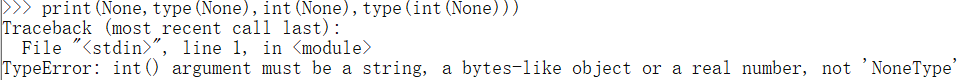
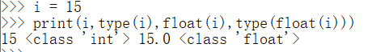

> Python基础——数据类型

<!--more-->

## 2.0 type

检查值的类型

## 2.1 数值

### 2.1.1 整数

所有整数都是 `int` 类型

大小无限制

下划线自动忽略


十进制数字不能以0开头

- 因为要输入其他进制的整数

  |   进制   | 表示 |
  | :------: | :--: |
  |  二进制  |  0b  |
  |  八进制  |  0o  |
  | 十六进制 |  0x  |

打印时一定以十进制输出

### 2.1.2 浮点数

所有小数都是 `float` 类型


浮点数运算结果不精确

### 2.1.3 复数

## 2.2 布尔类型

### 2.2.1 bool

逻辑判断


### 2.2.2 None

表示 `NULL`


## 2.3 字符串

> 用于表示文本信息


### 2.3.1 基本语法

用 `''` 或 `""` 标记

`'''字符串'''` 字符串中支持换行


当然，`ptint()` 加上参数 `end=''` 表示当前内容输出结束后不换行


### 2.3.2 转义字符

| 符号 |  含义  |
| :--: | :----: |
|  \'  |   '    |
|  \"  |   "    |
|  \t  | 制表符 |
|  \n  | 换行符 |

### 2.3.3 字符串打印

> 以参数形式打印

`print("strA=",strA)`

> 占位符：在创建字符串时，可以在字符串中指定占位符

| 占位符 |  含义  |
| :----: | :----: |
|   %s   | 字符串 |
|   %d   |  整数  |
|   %f   | 浮点数 |

```python
# 单个占位符
a = 'Hello %s'%'Amos'

# 占位符参数列表 (p1,p2,...pn)
b = 'Hello %s 你好 %s'%('Amos','Amos')

# %ns 指定占位符长度,长度不够则补全
c = 'Hello %3s'%'ab'
# 输出 Hello ab

# %n.m 指定占位符长度范围
d = 'Hello %3.5'%s'abcdef'
# 3到5个字符
```


### 2.3.4 格式化字符串

> 字符串中可插入变量

在字符串前添加 `f` 来创建一个格式化字符串

```python
c = f'hello'
print(f'c={c}')
```


在格式化字符串中可以嵌入变量


### 2.3.5 字符串复制

将字符串与数字相乘

```python
a = 'abc'
a = a*2

print(a)
```


### 2.3.6 字符串连接

```python
strA+strB
```

- 字符串不能和其他类型数据做加法运算

```python
name = "Amos"
print("My name is " + name + ",and I am " + 23 + "years old.")
```


- 若要多中数据类型同时打印，需要进行数据类型转换

## 2.4 对象

- 一切皆对象
- 程序运行中，所有数据都是存储在内存中，然后运行
- 对象实质上是一个容器，是内存中存储指定数据的区域

### 2.4.1 对象的结构

#### a. id

> 用于标识对象的唯一性

- `id` 由解析器生成

- 可通过 `id()` 检测对象的 `id`

在 `CPython` 中，`id` 是对象的内存地址

#### b. type

> Python是一门 **强类型语言** ，变量一旦创建，则不能修改

#### c. value

### 2.4.2 变量和对象

Python中变量名和值是分开存储的

- 变量和值通过索引建立联系
- 变量值存储在相应的值对象中
- 变量存储的内容是值对象的 `id`
- `id(变量)` 结果为值对象的 `id`


### 2.4.3 对象分类

#### a. 不可变对象

> 变量赋值后，再赋一个新值，需要新生成一个值对象，相当于重新成成了对象，所以是不可变对象

- 数值
- 元组(序列)
- 字符串(序列)
- 集合


#### b. 可变对象

> 可变对象的 `value` 可以修改，但变量本身没有变化

- 列表(序列)
- 字典

```python
# Python解释器版本
Python 3.10.6 (tags/v3.10.6:9c7b4bd, Aug  1 2022, 21:53:49)

a = [1,2,3]
# 原变量及其值对象
print(f"id(a) = {id(a)},a[0] = {a[0]},id(a[0]) = {id(a[0])}")
# 赋值变量及其值对象
b = a[0]
print(f"b = {b},id(b) = {id(b)}")
# 修改后的变量及其值对象
a[0] = 10
print(f"id(a) = {id(a)},a[0] = {a[0]},id(a[0]) = {id(a[0])}")
# 修改后的赋值变量及其值对象
print(f"b = {b},id(b) = {id(b)}")
```


可见，可变对象修改的是元素变量的值对象，即新建一个值对象，使得原元素变量指向新的值对象，但是可变对象本身并没有发生改变

#### 赋值操作


赋值操作，是将值对象的 `id` 存储到变量中

- 图中 `b` 变量在修改前后都指向同一值对象
- 可见，改变原变量的值对象，不会影响赋值变量的指向

```python
# 修改回来的变量及其值对象
a[0] = 1
print(f"a[0] = {a[0]},id(a[0]) = {id(a[0])}")
```


- 修改回原值后，又指向了原先的值对象，验证上述结论

### 2.4.4 == 和 is

`==` 和 `!=` 比较的是值是否相等

`is` 和 `is not` 比较的是值对象的 `id` 是否相等

> `a is b` 为 `True` 时，`a ==b` 一定是 `True`  ，因为二者指向同一值对象

## 2.5 类型转换

类型转换是将对象的值转换为新的对象

- 根据当前的值创建一个新的对象

### 2.5.1 str()或 `''`

将其他数据类型转化为 字符串类型

```python
a = 10
b = 10.5
boolean = True
print(a,type(a),str(a),type(str(a)))
print(b,type(b),str(b),type(str(b)))
print(boolean,type(boolean),str(boolean),type(str(boolean)))
```


### 2.5.2 int()

- 浮点数去除小数部分，直接取整

  

- 布尔值，True——1，False——0

  

- 合法整数字符串直接转换为对象数字

  不合法的整数字符串，会报错

  

- None报错，无法转换为数字 

  

### 2.5.3 float()

> 将合法内容转换为浮点数

- 合法的浮点数字符串会被转化成浮点数

  不合法的字符串无法被转化

  

- 布尔类型

  True——1.0

  False——0.0

  

- int型整数会被转化成float

  

### 2.5.4 bool()

> 转换为bool值


