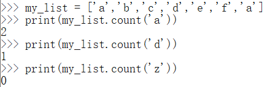

> Python基础——数据结构——序列

<!--more-->

## 4.1 序列

> 序列：保存一组有序数据，一种最基本的数据结构

序列索引由添加顺序分配

### 4.1.1 分类

可变序列

- 列表——list

不可变序列

- 字符串
- 元组

## 4.2 序列通用操作

### 4.2.1 访问

> 索引：标注元素在列表中的位置

可以通过索引获取列表中元素

- myList[index]

  若超限，则报错 `list index out of range`

列表索引可以是负数

- 如果是负数，则表示从后向前获取元素
- myList[-1] 表示倒数第一个元素

### 4.2.2 获取列表长度 len()

`len() = 最大索引+1`

### 4.2.3 截取

> 从现有列表中获取子列表，返回值是一个新的列表

`list[起始索引:结束索引]`

> 会包括起始位置元素，但不包括结束位置元素

```python
my_list = ['a','b','c','d','e','f']
print(my_list[0:4]) #['a', 'b', 'c', 'd']
```

`list[起始索引:]`

> 从起始索引对应的元素截取到最后一个元素

```python
my_list = ['a','b','c','d','e','f']
print(my_list[4:]) # ['e', 'f']
```

`list[:结束索引]`

> 从第一个元素截取到结束索引对应的元素

```python
my_list = ['a','b','c','d','e','f']
print(my_list[:5]) # ['a', 'b', 'c', 'd', 'e']
```

`list[:]`

> 创建副本

```python
my_list = ['a','b','c','d','e','f']
print(my_list[:]) # ['a','b','c','d','e','f']
```

`list[起始索引:结束索引:步长]`

> 步长表示获取元素间隔，默认为1

- 步长不能为0
- 步长取负数，表示从列表后部向前取，此时起始索引>结束索引

```python
my_list = ['a','b','c','d','e','f']
print(my_list[0:4:2]) # ['a', 'c']
print(my_list[4:0:-2]) # ['e', 'c']
```

### 4.2.4 + 和 *

> `+` ：表示列表拼接
>
> `*` ：表示复制指定次数

### 4.2.5 in和not in

> 检查指定元素是否存在于列表中，返回 `bool` 类型值


### 4.2.6 min()和max()

> 获取列表中的最值


### 4.2.7 obj.index(key,[i,j])

> 获取指定元素在列表指定范围第一次出现的索引

```python
my_list = ['a','b','c','d','e','f']

print(my_list.index('c',0)) # 2
print(my_list.index('c',0,1)) # ValueError: 'c' is not in list
```

- 当列表中没有待查找的元素，则报错

### 4.2.8 obj.count(key)

> 查找指定元素 `key` 在列表中的出现次数



## 4.3 list

> Python中的一个对象

### 4.3.1 创建

`[]`

- 可保存任意类型对象
- 列表中对象按照插入顺序存储到对象中

```python
my_list = [1,2,3,4]
```

### 4.3.2 修改列表元素

#### a. 通过索引修改

```python
# 修改元素内容
list_name[index] = new_key

# 删除元素
del list_name[index]
```

#### b. 通过截取修改

```python
list_name[起始索引:结束索引] = []

list_name[0:0] = new_key # 相当于在列表首尾插入元素

list_name[起始索引:结束索引:步长] # 间隔替换

del list_name[起始索引:结束索引] # 删除指定部分元素

list_name[0:0] = []
```

通过截取修改时只能传递序列

- 序列替换序列

### 4.3.3 不可变序列转化为列表

````python
s = "hello"
s = list(s)
print(s) # ['h','e','l','l','o']
````

### 4.3.4 列表的方法

#### a. list.append(key)

> 将元素 `key` 添加到最后

#### b. list.insert(index,key)

> 向列表索引为 `index` 指定位置插入元素 `key`

#### c. list.extend(new_list_name)

> 使用新的序列扩展当前序列

```python
l = [1,2,3]
l.extend([4,5])

#l = [1,2,3,4,5]
```

#### d. list.clear()

> 清空列表

#### e. list.pop(index)

> 根据索引删除并返回指定元素

无参时，删除最后一个


#### f. list.remove(key)

> 删除指定值，无返回值

#### g. list.reverse()

> 翻转列表

#### h. list.sort()

> 对列表中元素排序，默认是 **升序**

```python
list.sort(reverse=True)
```


## 4.4 tuple

> 不可变序列
>
> 操作基本和列表一致

适用情况：当数据不可变时使用元组，其余类型序列使用列表

### 4.4.1 创建

```python
my_tuple = (1,2,3)
```

元组不为空时

```python
my_tuple = 1,2,3
print(my_tuple) # (1,2,3)

my_tuple = 1,
print(my_tuple) # (1,)
```

### 4.4.2 解包/解构

> 将元组中的内容赋值给多个变量

```python
my_tuple = 1,2,3
a,b,c = my_tuple
```

在解包时，变量数量必须和元素中元素数量相同

```python
c中是剩余元素组成的列表
a,b,*c = my_tuple

my_tuple = 1,2,3,4
a,b,*c = my_tuple
a = 1	b = 2	c = [3,4]

a,*b,c = my_tuple
a = 1	b = [2,3]	c = 4

*a,b,c = my_tuple
a = [1,2]	b = 3	c = 4
```

可以用解包交换两个变量

```python
a,b = b,a
```

## 4.5 str

### 4.5.1 转义字符

| 转义字符 |           描述           |
| :------- | :----------------------: |
| \(行尾)  |          续行符          |
| `\\`     |        反斜杠符号        |
| `'`      |          单引号          |
| `"`      |          双引号          |
| `\a`     |           响铃           |
| `\b`     |           退格           |
| `\000`   |            空            |
| `\n`     |           换行           |
| `\v`     |        纵向制表符        |
| `\t`     |        横向制表符        |
| `\r`     |           回车           |
| `\f`     |           换页           |
| `\oyy`   | 八进制数，yy 代表的字符  |
| `\xyy`   | 十六进制数，yy代表的字符 |
| `\other` | 其它的字符以普通格式输出 |

### 4.5.2 字符串运算符

```python
a = "Hello"
b = "Python"
```

| 操作符 | 描述                       | 实例                  |
| :----- | :------------------------- | :-------------------- |
| +      | 字符串连接                 | a+b : `HelloPython`   |
| *      | 重复输出字符串             | a*2 :`HelloHello`     |
| []     | 通过索引获取字符串中字符   | a[1] :`e`             |
| [ : ]  | 字符串截取，**左闭右开**   | a[1:4] :`ell`         |
| in     | 成员运算符                 | 'H' in a : `True`     |
| not in | 成员运算符                 | 'M' not in a : `True` |
| %      | 格式字符串                 |                       |
| r\R    | 原始字符串：按原字符串输出 | print( r'\n' ) : `\n` |

### 4.5.3 访问 `[]`

```python
str_name[begin:end:step]
```

#### 字符串转置

```python
num = str(num)
m = num[::-1]
```


### 4.5.4 更新

创建临时变量重新赋值


### 4.5.5 字符串输出

#### 占位符

| 符号  | 描述                         |
| :---- | :--------------------------- |
| %c    | 字符                         |
| %s    | 字符串                       |
| %d    | 整数                         |
| %u    | 无符号整数                   |
| %o    | 无符号八进制数               |
| %x/%X | 无符号十六进制数             |
| %f    | 浮点数字，可指定小数点后精度 |
| %e/%E | 科学计数法格式化浮点数       |
| %g/%G | %f和%e的简写                 |
| %p    | 用十六进制数格式化变量的地址 |

当字符串包含一个占位符时，直接 `print("%."%变量)` 即可

当字符串包含多个占位符时，用元组形式 `print("%.,%."%(变量1,变量2))`

##### %c

> 格式化字符，若值是字符串则报错


##### %s

> 格式化输出字符串，字符不报错


##### %d

> 输出整数，ASCII字符报错


##### %u


##### %o


##### %x


##### %f


##### %e


##### %g


#### 字符串格式化输出

| 符号       | 功能                                               |
| :--------- | :------------------------------------------------- |
| +          | 在正数前面显示加号                                 |
| *(数字)    | 定义宽度或小数点精度                               |
| -          | 左对齐                                             |
| m.n        | m：显示的最小总宽度(包括小数点)，n是小数点后位数   |
| 空格(填充) | 在整数前显示空格                                   |
| 0(填充)    | 显示的数字前填充'0'而不是默认空格                  |
| #          | 在八进制数钱显示('0'),在十六进制数前显示'0x'或'0X' |
| %          | '%%'输出一个单一的'%'                              |
| (var)      | 映射变量(字典参数)                                 |

##### +


##### *数字与填充

> 定义宽度或小数点精度


`m.n` ：m表示此次输出最小数据宽度


##### 进制标记 \# #


### 4.5.6 多行字符串——三引号

```python
para_str = """这是一个多行字符串的实例
多行字符串可以使用制表符
TAB ( \t )。
也可以使用换行符 [ \n ]。
"""
print (para_str)
```


### 4.5.7 f-String

> 格式化字符串以 `f` 开头，后面跟着字符串，字符串中的表达式用 `{}` 包起来，将变量或表达式计算后的值替换

```python
name = "Amos"
f'Hello {name}' # 替换变量
```


```python
f'{1+2}' # 表达式
```


```python
link = {"protocol":"https","url":"www.baidu.com"}
f'{link["protocol"]}://{link["url"]}' # 自定义拼串符号
```


### 4.5.8 内嵌函数

#### str.capitalize()

> 将字符串的第一个字符转换为大写


#### str.center(width[,fillchar])

> 返回一个宽度为(width)，且内容居中的字符串

- $len(str) \ge width$：则直接返回字符串

- $len(str) < width$ : 则使用fillchar去填充

  若fillchar个数是奇数，则前面多一个


#### str.count(sub,start,end)

> 返回子字符串 `sub` 在字符串中出现的次数

- sub：模式串
- start：开始索引，默认为0
- end：结束索引，默认为字符串最后一个位置


`end` 参数可缺省

#### bytes_str.decode(encoding,errors)

> 以指定编码格式解码 `encoding` ，默认编码为 "utf-8"

- encoding：要使用的编码格式

- errors：设置不同的错误处理方案。默认为 `strict`，意为编码错误引起一个 `UnicodeError`

> 原字符串是英文，采用各种编码，解码时可混用


> 原字符串是中文，采用各种编码，解码时不可混用


#### str.encode(encoding,errors)

> 以指定的编码格式编码字符串，返回编码后的 `bytes` 对象

- encoding：要使用的编码，如 "utf-8"

- errors：编码出错，引起一个  `UnicodeError` ，其他可能得值有 'ignore', 'replace', 'xmlcharrefreplace', 'backslashreplace' 以及通过 codecs.register_error() 注册的任何值

```python
s1 = "This is a string"
c1 = s1.encode("utf-8")
c2 = s1.encode("gbk")

print(f"utf-8格式编码:{c1},utf-8格式解码:{c1.decode('utf-8')}")
print(f"gbk格式编码:{c2},gbk格式解码:{c2.decode('gbk')}")
print(f"gbk格式编码:{c2},utf-8格式解码:{c2.decode('utf-8')}")
```

#### str.endwith(suffix[,start,end])

> 判断字符串是否以指定后缀结尾

- suffix：参数是字符串或者是一个字符
- start：字符串中的起始索引
- end：字符中结束索引

```python
s='Hello World!!'
suffix='!!'
print(s.endswith(suffix))# True
print(s.endswith(suffix,20))# False
suffix='Amos' 
print(s.endswith(suffix))# False
```

#### str.find(sub[,beg,end])

> `find()` 方法检测字符串中是否包含子字符串sub

- sub：模式串
- beg：起始索引，默认是0
- end：结束索引，默认为字符串长度

如果包含子字符串返回开始的索引值，否则返回 -1


#### str.index(sub[,beg,end])

> 检测字符串中是否包含模式字符串 sub

- sub：指定检索的子字符串
- beg：起始索引，默认为0
- end：结束索引，默认为字符串长度


#### str.isalnum()

> 检测字符串是否由字母和数字组成

如果字符串有文字或者数字组成，则返回 `True` ，否则返回 `False`


- 包含中文也会返回 `True`

#### str.isalpha()

> 检测字符串是否只有字母或文字组成


- 如果字符串至少有一个字符且所有字符都是字母或文字，则返回 `True` ，否则返回 `False`

#### str.isdigit()

> 检测字符串是否只有数字组成

如果字符串只包含数字则返回 `True` ，否则返回 `False`

#### str.islower()

> 检测字符串是否全由小写字母组成

如果字符串中至少包含一个区分大小写的字符，并且这些所有字符都是小写，则返回 `True` ，否则返回 `False`


#### str.isnumeric()

> 检测字符串是否只由数字组成

- 如果字符串中只包含数字字符，则返回 True，否则返回 False

#### str.isspace()

> 检测字符串是否只由空白字符组成

- 如果字符串中只包含空格，则返回 True，否则返回 False.

#### str.istitle()

> 检测字符串中所有的单词拼写首字母是否为大写，且其他字母为小写。

- 如果字符串中所有的单词拼写首字母是否为大写，且其他字母为小写则返回 True，否则返回 False.

#### str.isupper()

> 检测字符串中所有的字母是否都为大写

- 如果字符串中包含至少一个区分大小写的字符，并且所有这些(区分大小写的)字符都是大写，则返回 True，否则返回 False

#### join_str.join(str)

> 将 `join_str` 中的字符插入到字符串 `str` 中间

- str：要连接的元素序列
- 返回插入指定字符的新字符串

```python
s1 = "-"
s2 = ""
seq = ("H", "e", "l", "l", "o") # 字符串序列
print(s1.join(seq))
# H-e-l-l-o
print(s2.join(seq))
# Hello
```

#### len(str)

> 返回字符串长度

#### str.lower()

> 将字符串中所有大写字符转换为小写

- 返回将字符串中所有大写字符转换为小写后生成的字符串

#### str.lstrip([char])

> 去除开头的空格或者指定字符

- chars --指定截取的字符

- 返回去除开头空格或者指定字符的新字符串


#### max(str)

> 返回字符串中最大的字母

#### min(str)

> 返回字符串中最小的字符

#### str.replace(old,new[,max])

> 把字符串中的 `old` 替换成 `new` 

- old：将被替换的子字符串
- new：新字符串，用于替换old字符串
- max：替换次数不超过 max 次

返回替换结束后的新字符串


#### str.rfind(pattern,beg,end)

> 返回模式串 `pattern` 最后一次出现的位置，没有找到匹配项则返回 -1

- pattern：模式串
- beg：开始查找的位置，默认为0
- end：结束查找的位置，默认为字符串的长度

#### str.rindex(pattern, beg,end)

> 返回子字符串 pattern在字符串中最后出现的位置，如果没有匹配的字符串会报异常

- pattern：模式串
- beg：开始查找的位置，默认为0
- end：结束查找位置，默认为字符串的长度


#### str.rindex(pattern,beg,end)

> 返回子字符串 pattern 在字符串中最后出现的位置，如果没有匹配的字符串会报异常

- pattern：查找的字符串
- beg：开始查找的位置，默认为0
- end：结束查找位置，默认为字符串的长度


#### str.rstrip([chars])

> 删除string 字符串末尾的制定字符

- chars：指定删除的字符（默认是空格）
- 返回删除 string 字符串末尾的指定字符后生成的新字符串


#### str.split(split_str,num)

> 用指定分割符 `split_str` 对字符串分段，如果指定 `num` 则分割为 num+1 个字符串

- split_str：分割符，默认为所有的空字符，包括 空格，换行 \n，制表符 \t
- num：分割次数。默认为 -1，表示分隔所有

返回分割后的字符串列表


#### str.startwith(prefix,beg,end)

> 检查字符串是否以指定子字符串开头，如果是则返回 `True` ，否则返回 `False`

- prefix：指定的子字符串
- beg：设置字符串检测的起始索引
- end：设置字符串检测的结束索引


#### str.strip([chars])

> 用于移除字符串头尾指定的字符（默认为空格）或字符序列

- chars：指定要去除的字符序列

返回新生成的字符串


#### s.title()

> 返回标题化字符串：每个单词的首字母转化为大写


#### s.upper()

> 将字符串中的小写字符转换为大写字符


