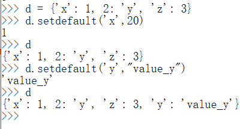

> Python基础——数据结构——字典

<!--more-->

## 5.1 概述

> 一种映射(mapping)，存储对象的容器

- 列表存储数据性能好，但查询数据性能差
- 字典存储数据性能不好，但查询数据性能好

### 5.1.1 字典结构

字典的存储结构为 **键值对(key:value)** 

- 一个字典有多个键值对，**一个键值对** 称为 `项`

- 字典的 **值** 可以是 `任意对象`
- 字典的 **键** 是任意 `不可变对象 (int,str,bool,tuple)`

- **键** 不能重复，后插入的同名键会进行值替换

## 5.2 创建

### 5.2.1 无参创建

```python
# 创建
d = {}
```

### 5.2.2 带参创建

mapping结构： `d = {key1:value1,key2:value2,...}`

```python
d = {'name':'xxx','x':1,'x':True} # {'name':'xxx'}

d = {1:"asd",2:12,3:23.6,4:True} 
# {1: 'asd', 2: 12, 3: 23.6, 4: True}

d = {True:1,False:'a'} 
# {True: 1, False: 'a'}
d = {True:True,False:123.2} 
# {True: True, False: 123.2}

d = {(1,2):"asd",(2,3):123,(4,5):True}
# {(1, 2): 'asd', (2, 3): 123, (4, 5): True}
```

### 5.2.3 dict()函数创建字典

> 键都是字符串

1. `d = {key1:value1,key2:value2,...}`

2. `dict(mapping,key1:value1,key2:value2,...)`
3. `dict(iterable,key1:value1,key2:value2,...)`

```python
# 1. d = {"key1":"4","key2":""}
d = dict(key1='4',key2='') 

# 2. {'x': 1, 'y': 2, 'z': 3}
d = dict({'x':1,'y':2},z=3)

# 3. {'x': 5, 'y': 6, 'z': 3}
d = dict([('x',5),('y',6)],z=3)

# 3. zip() 创建可迭代对象
numbers3 = dict(dict(zip(['x', 'y', 'z'], [1, 2, 3])))
print('numbers3 =',numbers3)
```

## 5.3 判断键是否存在

> 检查字典中是否包含指定的键，返回 `bool`

`in` 和 `not in`

```python
print('key_name' in d)
```

## 5.4 获取值

> 根据键获取值

#### []

`dic_name[key_name]`

```python
print(d['age'])
```

通过 `[]` 获取时，不存在键则抛出异常 `KeyError`

#### dict.get('key_name'[,default])

- 若查找的键不存在，则返回 `default` ，默认为 `None`


## 5.5 遍历

### 5.5.1 keys()

> 返回字典中所有的 `key` 序列


### 5.5.2 values()

> 返回字典所有的 `value` 序列


### 5.5.3 items()

> 返回字典中所有的项

```python
for k,v in d.items():
	print(k,'=',v)
```

## 5.6 修改

### 5.6.1 修改值

- 有则覆盖，不存在则添加
- dict['key_name'] = value

### 5.6.2 dict.setdefault(key[,default])

> 向字典中添加 `key:value`

如果字典中存在 `key` ，则返回 `key` ，不会替换

如果字典中不存在 `key` ，则添加，并设置值为 `default`



### 5.6.3 dict.update({})

> 将字典中的 `key:value` 添加到当前字典中

- 重复的键名会进行值覆盖


### 5.6.4 dict.popitem()

> 随机删除字典中的键值对，一般为最后一个

- 以元组形式返回删除键值对

### 5.6.5 dict.pop(key[,default])

> 根据 `key` 删除字典中的键值对

- 将被删除的 `value` 删除
- 删除不存在的键值对，抛出异常

- 指定默认值，再删除不存在的 `key` ，则直接返回默认值


### 5.6.6 dict.clear()

> 清空字典

### 5.6.7 dict.copy()

> 对字典进行浅复制

- 赋值只是指向同一对象
- 复制创建副本，不属于同一内存空间


赋值（浅拷贝）：引用对象

dic,copy()（浅拷贝）：深拷贝父对象，引用子对象