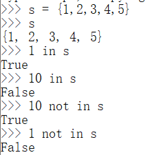
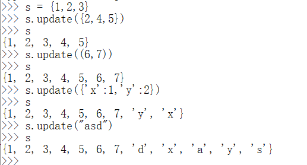
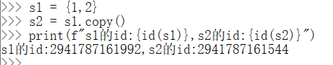

> Python基础——数据结构——集合

<!--more-->

## 6.1 简介

> 集合只能存储不可变对象 `int,bool,float,str,tuple` 

- 集合中元素是无序的
- 集合中不能出现重复元素

## 6.2 创建

### 6.2.1 {}

不可创建空集合

### 6.2.2 set()

- 创建空集合

  ```python
  s = set()
  ```

- 通过 `set()` 将序列和字典转换为集合

  转换字典中只会包含字典中的键

  ```python
  s = set({'a':1,'b':2})
  # s = {'c','a','b'}
  ```

## 6.3 判断元素是否存在

> 检查集合中是否包含指定的键，返回 `bool`

`in` 和 `not in`



## 6.4 len() 获取元素个数

```python
s = {1,2,3,4,5} 
len(s) # 5
```

## 6.5 修改

### 6.5.1 s.add(value)

> 将 `value` 添加到集合中

```python
s = {1}
s.add(2) # {1, 2}
s.add('a') # {1, 2, 'a'}
```

### 6.5.2 s.update(iterable)

> 将序列中的元素添加到集合中



### 6.5.3 s.pop()

> 随机删除并返回集合中的元素

### 6.5.4 s.remove(value)

> 删除集合中指定元素

```python
s = {1,2,3}
s.remove(1) # {2, 3}
```

### 6.5.5 s.clear()

> 清空集合中元素

### 6.5.6 s2.copy(s)

> 浅复制



## 6.6 集合运算

### 6.6.1 交集&

> 集合运算不会影响原集合，返回临时对象

```python
s1 = {1,2}
s2 = {2,3,4}
s1 & s2 # {2}
```

### 6.6.2 并集\|

```python
s1 = {1,2}
s2 = {2,3,4}
s1 | s2 # {2}
```

### 6.6.3 差集-

```python
s1 = {1,2}
s2 = {2,3,4}
s1 - s2 # {1}
```

### 6.6.4 异或^

> 获取只在一个集合中存在的元素

```python
s1 = {1,2}
s2 = {2,3,4}

s1 ^ s2 # {1,3,4}
```

`s1 ^ s2` 等价于 `s1|s2 - s1&s2`

### 6.6.5 <=

> 检查一个集合是否是另一个集合的子集

`a <= b` 

- a：子集
- b：超集

```python
s1 = {1,2}
s2 = {1,2,3}

s1 <= s2 # True
s2 <= s1 # False
```

### 6.6.6 <

> 检查一个集合是否为另一集合的真子集

`a < b`

- a：真子集
- b：真超集

```python
s1 = {1,2}
s2 = {1,2,3}
s3 = {1,2,3}

s1 < s2 # True
s2 < s3 # False
```

### 6.6.7 >=

> 检查一个集合是否为另一集合的超集

`a >= b`

- a：超集
- b：子集

```python
s1 = {1,2}
s2 = {1,2,3}

s2 >= s1 # True
s1 >= s2 # False
```

### 6.6.8 >

> 检查一个集合是否为另一集合的真超集

`a > b`

- a是b的真超集
- b是a的真子集

```python
s1 = {1,2}
s2 = {1,2,3}
s3 = {1,2,3}

s3 > s1 # True
s3 > s2 # False
```

