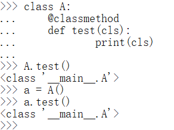
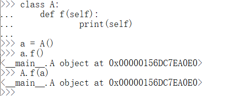

> Python进阶——面向对象

<!--more-->

## 8.1 类与对象

### 8.1.1 类(Class)

#### a. 创建自定义类

自定义类使用 **大写字母开头**

```python
class 类名([父类]):
	代码块

class Myclass():
	pass

# 使用自定义类创建对象
mc = Myclass()
```

#### b. 类的基本结构

```python
class 类名([父类]):
	公共属性...
	
	# 对象初始化方法
	def _init_(self,...):
		...
	
	# 其他方法
	def method_1(self,...):
		...
	
	def method_2(self,...):
		...
```

##### `_init_()`

> 在新对象创建时初始化属性

- 特殊方法以 `_` 开始和结束
- 特殊方法不需要自己调用

通过 `self` 向新创建的对象初始化属性

- 指向本对象，相当于 `this`

```python
class Myclass:
	def _init_(self,name):
		self.name = name
```

调用类创建对象时，参数列表中的参数会一次传递到 `_init()_` 中

#### c. 属性和方法

> 类=属性+方法

在类中定义的变量，将成为所有实例的公共属性

- 类属性：可以被所有对象访问，只能通过类方法修改，对象中的方法无法修改
- 实例属性：只能通过实例方法访问或修改的属性，类方法无法修改

类中的函数成为方法

- 所有对象都可以访问类方法
- 方法调用默认传递一个参数，所以方法中至少有一个形参

##### 属性

当调用一个对象的属性时，解析器会在当前对象中找是否有该属性

- 有，则直接返回对象的属性值

- 无，则去类对象中查找

  有，则返回类属性

  无，则报错

类属性：所有对象共享的属性

实例属性：某个实例特有的属性

- 一般情况下，属性保存在对象中
- 方法保存在类对象中

##### 类方法

> 使用 `@classmethod` 修饰的方法

第一个参数为 `self` ，自动传递，表示当前类对象

```python
class A:
	@classmethod
	def test(self):
		print(self)
```

- 通过类和对象都能调用类方法



##### 实例方法

> 第一个参数为 `self` 的方法是实例方法

类和实例都可调用实例方法

- 通过类调用，不会自动传递当前对象，需手动传入实例
- 通过实例调用，将当前调用的对象作为 `self` 自动传入



##### 静态方法

> 使用 `@staticmethod` 修饰的方法

- 不需要传递参数
- 可通过类和实例调用

### 8.1.2 对象(Object)

> 又称 实例(instance)，对象是内存中专门用于存储数据的一块区域

#### 对象是类的实例

```python
# 内置类创建
a = int(10) # create int object
b = str("hello") # create a string object
```

- `id` ：对象的标识
- `type` ：对象的类型
- `value` ：对象的值

#### 对象的创建流程

> 类是创建对象的对象

- 创建变量
- 在内存中创建一个新对象
- 执行 `init()`
- 将对象的 `id` 赋值给变量

## 8.2 三大特性

### 8.2.1 封装

> 隐藏对象中不希望被外部访问的属性和方法

用于确保对象数据的安全

- 一般情况 `_属性名` 表示隐藏私有属性

提供 `getter()` 和 `setter()` 方法可以使外部访问到私有属性

```python
get_属性名():
    pass
set_属性名():
    pass
###
可以在 setter()中增加数据验证，确保数据值的正确性
```

#### 对象属性前使用双下划线

> 私有属性实际上将名字修改为 `__属性名`

```python
# __propertyName
class Person:
	def _init_(self,name):
		self.__name = name	
	def set_myname(self,name):
		self.__name = name	
	def get_myname(self):
		return self.__name

p = Person()
p.set_myname('name1') # 等价于 p.__name = "name1"
p.get_myname() # 等价于p.__name 'name1'
```

#### property装饰器

> property 装饰器，将一个 `get()` 方法转换为对象属性

使用 `@property` 修饰的方法，必须和属性名一样，否则报错

- `setter()` 装饰器：`@属性名.setter`
- `getter()` 装饰器：`@property`

使用 `setter` 装饰器

```python
class Person:
	def _init_(self,name):
		self._name = name
	# get()方法要在set()方法前，否则报 not defined 错误
	@property
	def name(self):
		return self._name
    
    @name.setter
	def name(self,name):
		self._name = name

p = Person()
p.name = "name1" # "name1"
```

### 8.2.2 继承

> 子类继承父类中所有方法

- 保证了对象的可扩展性，包括特殊方法

```python
class 子类名([父类列表]):
    pass

# 省略父类列表，默认为父类的对象
class Animals():
    def call(self):
        print("动物叫")
class Dogs(Animals):
    def call(self):
        print("狗叫")
class DD(Dogs,Animals):
     def call(self):
             print("dd叫")
```

`bool isinstance(instanceName,className)` ：检查是否是某类的实例

```python
isinstance(a,Animals) # True
```

`bool issubclass(subClassName,className)` ：检查是否为子类

```python
issubclass(Dogs,Animals) # True
issubclass(DD,Animals) # True
```

#### 多重继承

> 为一个类指定多个父类

父类列表前面方法覆盖后边

- 第一个父类
- 第一个父类的父类
- 第二个父类
- ......

#### 重写(overwrite)

> 子类中有与父类同名的方法，则调用子类方法

```python
a = Animals()
d = Dogs()

a.call() # 动物叫
d.call() # 狗叫
```

#### super()

> 调用父类方法修改父类属性，通过 `super()` 调用父类方法，不需要传递 `self`

```python
def Subclass(SuperClass):
	def __init__(self,[Subclass propertyList]):
		super().__init__([SuperClass propertyList])
		self._propertyName = propertyVlue
```

#### `className.__bases__`

> 获取当前类的所有父类

```python
DD.__bases__
# (<class '__main__.Dogs'>, <class '__main__.Animals'>)
```

### 8.2.3 多态

> 不考虑参数类型，只要符合某些特征，就可以使用方法

- 保证程序的灵活性 

例如：只要对象中有 `__len__()` 的特殊方法，就可以通过 `len()` 方法获取对象长度

## 8.3 特殊方法

> 以 `__` 开头和结尾

- 配合多态使用
- 特殊方法不需要手动调用

### 8.3.1 `__new__(self)`

> 对象创建时调用 `__new__(self)` 函数

### 8.3.2 `__init__(self)`

> 对象初始化时调用，定义初始化时的工作

### 8.3.3 `__delete__(self)`

> 对象删除前调用

### 8.3.4 `__str__(self)`

> 打印的是 `str()` 的返回值

### 8.3.5 `__repr__(self)`

> 会对当前对象使用 `repr()` 时调用
>
> 指定对象在 **交互模式(命令行)** 中直接输出的效果

### 8.3.6 `__lt__(self,other)`

> 小于 <

```python
# 定义 > < >= <= == 时完成的事务

class Person:
	def __lt__(self,other):
		return True
```

### 8.3.7 `__le__(self,other)`

> 小于等于 <=

### 8.3.8 `__eq__(self,other)`

> 等于 ==

### 8.3.9 `__ne__(self,other)`

> 不等于 !=

### 8.3.10 `__gt__(self,other)`

> 大于 `>`

### 8.3.11 `__ge__(self,other)`

> 大于等于 `>=`

### 8.3.12 `__add__(self,other)`

> `+`

### 8.3.13 `__sub__(self,other)`

> `-`

### 8.3.14 `__mul__(self,other)`

> *

### 8.3.15 `__len__(self)`

> 获取对象长度

### 8.3.16 `__bool__(self)`

> 定义使用 `bool()` 时的返回值

## 8.4 模块

> 将一个完整的程序分解成若干个小模块，各个模块组合，搭建一个完整的程序

重要性：**复用**

### 8.4.1 模块创建

> 一个文件为一个模块

- 模块名要符合标识符规范
- 创建的模块在主模块中相当于变量

### 8.4.2 引用外部模块

#### `import 模块名`

> 多次引用同一模块时，只包含一个实例

#### `import 模块名 as 别名`

> 通过 `moduleName.__name__` 可以获取模块名字

一个程序只有一个主模块 `__main__`

### 8.4.3 包(package)

> 模块中代码过多，则可将一个模块分解为多个模块，被分解的大模块称为包

包：文件夹

模块：.py文件

`from packageName import moduleName` ：引入包中指定模块

- 包中必须有 `__init__` 文件，包含包中主要内容

- `__pycache__` ：模块缓存文件

  使用包时，将模块代码转换为机器码，在编译一次后，将代码保存到缓存文件中，避免重复编译

### 8.4.4 Python标准库

#### sys

> 通过变量和函数，可以获取到Python解析器的信息
>
> 或者可以通过函数操作解析器

```python
import sys

# sys.argv
# 获取执行代码时，命令行所包含的参数
# 返回列表，保存当前命令的所有参数

# sys.modules
# 获取当前程序中引入的所有模块
# 返回字典，key:模块名字，value:模块内容

# sys.path
# 返回列表，保存模块的搜索路径
# 当前目录优先

# sys.platform
# 表示当前Python运行平台

# sys.exit()
# 退出当前程
```

#### pprint

```python
import pprint

# pprint()
# 对打印数据做简单格式化
# pprint.pprint()
```

#### os

> 操作系统模块，对操作系统进行访问

```python
import os

# os.environ[]
# 获取系统的环境

# os.system()
# 执行操作系统的命令
# os.system('dir')
```

## 8.5 垃圾回收

> 没有被引用的对象称为 **垃圾**

### 8.5.1 自动垃圾回收机制

> 不需要手动处理垃圾，程序结束时，自动删除垃圾

### 8.5.2 `__delete__(self)`

> 在垃圾回收前删除


