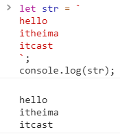

> ECMAScript(ES)：JS核心语法的规范（变量，数据类型，语法规范，操作语句）
> DOM：【document object model文档对象模型】 提供属性和方法，操作页面
> BOM：【browser object model浏览器对象模型】 提供属性和方法，操作浏览器

<!--more-->

# 1. 浏览器内核

## 1.1 浏览器
>按照W3C规识别开发者编写的代码，并在页面中绘制开发者预想的页面和效果（GPU：显卡）
>这部分功能由 **浏览器内核** (或称为 **渲染引擎** )完成

### 1.1.1 常用浏览器

> 谷歌浏览器： **Webkit** 内核（V8引擎） 

- 火狐浏览器：**Gecko** 内核
- 欧朋浏览器：**Presto** 内核
- IE浏览器：**Trident** 内核

#  2.基本语法

## 2.1 输出

### 2.1.1 弹框
#### 2.1.1.1 `alert`

使用alert弹出时会调用 `toString` 方法（将内容转换为字符串形式，加上 `""` ）

```js
alert(1 + 1)  => 输出为："2" 不是 2  ;
```

#### 2.1.1.2 `confirm`

在 `alert` 基础上增加了让用户选择性的操作（提供确定和取消按钮）;
当用户点击确定时接收到结果为 `true` ，点取消时接收到 `false` ;

#### 2.1.1.3 `prompt`

在 `confirm` 基础上添加输入框；
未输入点取消，返回值为： `null`  ；点确定，返回值为：空字符串；
输入后点确定，返回值时：输入的内容；

### 2.1.2 控制台输出
#### 2.1.2.1 console

`console.log()` ：不转换为字符串

`console.dir()` ：比 `console.log()` 详细

`console.table()`：把JSON数据展示为一个表格

#### 2.1.2.2 document.write()
>在页面中输出

## 2.2 常量与变量
```javascript
var 变量名 = 值；//在 ES6中定义变量用 let
const 常量名 = 数值；//常量的值不能修改
```
### 2.2.1 命名规范

1. 区分大小写

2. 国际命名规则 **驼峰命名法**

   第一个首字母小写，第二个单词首字母大写

   约定：update 修改；get / query /select 查询获取

3. 命名时可以使用` $ _`,数字,字母,数字不能作为首字母

   - 以 `$`开头：通过JQ获取
   - 以`_`开头：代表全局变量或者公有变量

4. 不能使关键字

### 2.2.2 数据类型

基本数据类型进行的是值传递，引用数据类型进行指针传递，

修改基本数据类型变量只会影响当前变量，修改引用数据类型变量会影响原有数据

#### 2.2.2.1 基本数据类型

> number：值类型

+ `NaN` 表示不是数值

+ `isNan()` 检测是否为有效数字，不是有效数字返回值为 `true` ，反之返回值为 `false`
  当不是number类型时，会先将其转换为Number类型再进行检测

+ `Number()`
  只有当字符串中`所有`的字符都是有效数字时才能转化，否则返回 `NaN`

  把引用数据类型转换为number先将其转换为字符串 `toString()` ，再把字符串转换为数字

+ `parseInt()`
  提取有效数字转换为数字
  从左到右依次查找，**直到遇到第一个非有效数字截止**
  若第一个为NaN ,则为NaN

  ```js
  parseInt('12.5px13') -> 12
  parsInt('px12') -> NaN
  ```

- `parseFloat（）`

---

> string：字符串

---

> Boolean：布尔值

- boolean()
  将其他类型转换为布尔类型
  只有 `0，NaN,空字符串,null,undefined` 转换后为 `false` ，其余全为 `true`

- `!` 将值转化为布尔类型，然后 **取反**

- `!!` 将其他值转换为布尔类型

  null：空指针**对象**

  undefined：未定义

**空字符串和null的区别**

- `null`不分配内存，`空字符串`消耗内存

**null与undefinedd的区别**

- `null` 手动先赋值，`undefined`被动生成

#### 2.2.2.2 引用数据类型

> object：对象数据类型

- 由多组`"属性名(key键):属性值(value值)"`组成，中间用  **,**分开 

- 创建对象

  `var 变量名 = new object();`

- 获取某个属性对应的属性值 

  - 对象名.属性名
  - 对象名['属性名']
  - 属性名为数字时只能用中括号形式
    `obj['0'] / obj[0]`
  - 当操作属性不在对象中时，获取的是`undefined`

- 设置/修改属性值[若存在则为修改，不存在则为新建]
  `obj.属性 = '';`
  `obj['属性'] = ;`

- 删除

  - 假删除
    设置属性值为 `null`

  - 真删除
    调用delete `delete obj.属性`

---

> {}普通对象

---

> []数组

---

> /^$/正则 

---

> function：函数数据类型

#### 2.2.2.3 基本和引用区别

```javascript
var a = 12;
var b = a;
b = 13; 

console.log(b);//结果为：13
a = 10;
console.log(b);//13
```

```javascript
var m = {name:'asd',age:10;}
var n = m;
n.name = 'asdas';
console.log(obj['name ']);
```
- 全局作用域 `window.onglobal(){}`

**基本数据类型**：按值操作：直接将值赋值给变量

**引用数据类型**：按空间地址来操作

1. 先创建变量
2. 浏览器开辟一个新的内存空间（将对象中需要存储的内容【键值对】分别存储在这个空间中）
3. 为新开辟的空间设置十六进制地址
4. 将空间地址赋值给变量

>由于引用数据类型传递的是地址，对相互赋值的对象中的一个进行操作会全部修改

#### 2.2.2.4 JS中对数据类型的检测

> typeof: 检测数据类型的运算符

- **typeof返回值类型是字符串**

  null类型返回值是 “object”
  null原本定义为空对象指针，浏览器将其当做对象检测 

  undefined类型返回值是 “undefined”

- [] 返回值是: "object"
- /^$/ 返回值是："object"

---

> instanceof：检测某个实例是否属于这个类

---

> constructor：获取当前实例的构造器

---

> Object.prototype.toString.call：获取当前实例的所属类信息

### 2.2.3 数据类型转换

#### 其他类型转为number

- isNaN,Number,paresInt,parseFloat

在进行数学运算的时候，引用数据类型转换为数字

通过toString方法将数组转换为字符串，然后调用 `Number` 将字符串转换为数字

```js
true->1  
[12]->'12' -> 12

false -> 0
null -> 0
[] -> '' -> 0

'12px' -> NaN
'字符串' -> NaN
undefined -> NaN
{} /^$/ function(){}  -> NaN
[12, 23] -> '12,23' ->NaN

//=>
```

#### 数学运算

+-*/

> 除了加法特殊，其余都是数学运算，先将非数字类型转换为非数字类型【Number】，进行运算

```javascript
1-'1' -> 0
10 * null -> 0
10 / undefined -> NaN
10 * [10] -> 100
```

- `+`
>在字符串时，进行字符串拼接。非字符串时才会是数学运算
```
1 + '1' -> 11
null + '1' -> 'null1'

//=> 其他数据类型的toString直接加单双引号，只有对象
对象.toString() == '[obj obj]'
null undefined 不支持toString()
函数  用双引号包起来
```
 * 1 + null -> 1
 * 1 + true -> 2
 * 2 + undefined -> NaN
 * NaN + '珠峰' -> 'NaN珠峰'
 * ...
 * 'NaN珠峰nullundefined'

#### 其他类型转为boolean

>在条件判断时转换

只有 0， NaN，空字符串，null,undefined 转换为false

### 2.2.4 比较

 `==` 比较时，会将两边的数据转换为相等的类型

 `===` 比较时，不会转换

null == undefined -> true
null === undefined ->false

null 以及undefined  和其他任何值都不相等

```javascript、=
//对象和对象，比较的是空间地址
[] == [] -> false

var a = {};
var b = a;
a== b; -> true

//对象和数字，将对象转换为数字
[] == 0 -> true
{}== NaN -> false NaN和任何数据类型都不相等

//对象和字符串，将两边都转换为数字
[] == '' ->true
[12] == '12px' -> false

//对象和布尔值 ，将两边都转换为数字
[] == true -> false
![] == false ->true

//字符串和数字，布尔值，布尔值和数字 转换为数字
```

## 2.3 函数

> 函数数据类型也是按照引用地址来操作的

- 静态：与函数同名的变量中存储的是函数的字符串表示
- 运行态：浏览器为函数创建一个私有环境 =**私有作用域**，并在这个作用域中将字符串转换为JS代码

### 2.3.1 JS函数的原理

> 作为引用数据类型的一种，按照引用地址来操作

```javascript
function fn(num1,num2){
	coonsole.log(num1 + num2);
    //=》函数体
}

函数名();//执行函数
函数名;//输出函数 
```

### 2.3.2 判断语句

`if…else…`

`if…else if…else`

三元运算符：`条件？(语句1,语句2):不成立执行语句`

- 若执行语句为空，需要用 `null,undefined,void 0` 占位，不能空着
- 不能出现 `break, continue,return *`，此时不能用三元运算符代替 `if…else`

`switch…case`

- 一个变量不同情况下的不同操作
  当去掉前面的break时，可以对符合多种情况的值进行同一种操作

  ```js
  switch()
  {
      case 1:
      …
      break;
      case 2:
      …
      break;
      default:
      …
      break;
  }//最后一项可以不加break ，自动跳出switch
  ```

  **switch用的是三个等于号判断是否相等** 

  - `=` ：赋值

  - `==`：先将等号左右的值转换为相同类型，再作比较

    '6' == 6 //=>true

  - `===`：绝对相等，不仅值相同，类型也要

    '6' === 6 // => false >

### 2.3.3 循环语句

#### for循环

```js
for(设置初值;判断语句;执行语句){
    循环体; 
}
```

#### for in 循环

对象中有多少键值对，for in 循环遍历多少次

```js
var obj = {name:'name1',name2:'name2',name3:'name3'};
      
for(var key in obj){
    console.log(key);//输出3次，输出为属性名，输出key的类型是字符串
    //输出是首先对对象中的键值排序（数字排在前面【小数算作字母，不算数字】，非数字按照之前写入对象的顺序排序）
    //循环式按照排序后的顺序排序

    console.log(obj[key]);
    //console.log(obj.key);  
    //获取obj中key对应的属性值 
    //'key':字符串
    //key:变量，存储的是字符串属性名
}
```

### 2.3.4 创建函数

```javascript
function 函数名([形参]){
	//=>[函数体]
}
```

- 在当前作用域声明一个函数名

  `var sum;`  和 `function sum` 是一样的操作

- 浏览器开辟一块新的空间 :**函数体中的代码当做字符串存储在该空间中**

- 把该地址赋值给之前声明的函数名

### 2.3.5 执行函数

```javascript
函数名();
```

- 浏览器为其开辟一个`私有作用域`（只执行JS代码）
- 形参赋值，变量提升
- 将JS代码字符串存入私有作用域，将其变为JS代码执行
- 私有作用域是否销毁

闭包：函数执行时会形成一个私有作用域，其私有变量与外界互不干扰

栈内存：作用域（全局，私有）:存变量

堆内存

所有引用数据类型(目的是存储)

- 对象会把键值存储起来
- 函数当做字符串存储

### 2.3.6 函数中的形参实参

当形参与形参个数不匹配时，会传入 `undefined` , 得到`NaN`

判断是否传入某个参数

`if(typeof [形参] === "undefined"){ }`

- `null == undefined 得到true`

也可以用逻辑或0：`形参 = [形参名] || 0;`

### 2.3.7 函数中的arguments实参集合

当实参个数未知时，需要使用函数内置的实参集合:arguments
1、只存在于函数
2、 没有传递实参，ARG是空集合，传递后ARG包含所有实参
3、 AGR是一个类数组集合

> - 以数字作为索引，从0开始
> - arguments[索引]，获取实参信息

4、有一个length属性，存储实参个数

> - arguments.length
> - arguments['length']

严格模式下不允许使用 `'use strict`

5、arguments.callee:存储的是当前函数本身
6、arguments.callee.caller：存储的是当前函数在哪儿执行（宿主函数）
在全局作用于下结果是 `null`

### 2.3.8 JS返回值`return`

return返回的都是数值

函数默认返回 `undefined` ,只写return 也是返回`undefined`

### 2.3.9 JS中匿名函数

函数表达式

```js
oBox.onclick = function(){
    //=>函数体
}
```

自执行函数

```js
(function([形参]){
    //=>函数体
}) ([实参])
```

## 2.4 数组

``typeof([]) = 'object'`

>数组的属性名都是数字[索引]：数字以数字为索引，从0开始，有一个`length`属性代表数组长度

类数组：类似于数组
1、通过getTagElementsByTagName获取的元素集合是类数组
2、函数中实参集合也是类数组

```
var ary = [12,23,34];
Array.prototype.aa = 100;

//=>FOR循环
for(var i = 0;i < ary.length;++i)
{
	console.log(ary[i]);//12,23,34
}

//=>FOR IN循环
for(var key in ary)
{
	//key:属性名()(数组中属性名是索引值)
	console.log(ary[key]);//12,23,34,100
}

//FOR循环只能遍历到数组私有属性，FOR IN可以遍历得到公有属性
```

### 2.4.1 数组中的常用方法
`console.dir(Array.prototype)`

1. 方法的意义和作用
2. 方法的形参
3. 方法的返回值
4. 通过此方法，原来数组是否发生了改变

### 2.4.2 常用操作

1) push` ：向数组 **末尾** 追加新元素

   `ary.push(内容)`，返回值是现在数组的长度

   `ary[ary.length]`实现向末尾追加新元素

2) `unshift`：向数组 **开头** 添加新元素

   `ary.unshift(内容)` 返回值是现在数组的长度

3) `pop`：删除数组最后一项

   `ary.pop()`无参数，返回值为被删除的一项

4) `shift` ：删除数组第一项

   `ary.shift()`无参数，返回值是被删除一项

   索引值前移一位

5) `delete`：删除值

   `delete ary[索引值]` 数组其他索引不会改变，length也不会改变

6) `length--` ：删除末尾一项

7) `splice`：修改函数，默认删除

   **删除**

   `array.splice(n,m)`，从索引n开始删除m个

   - 若m不写，删除到末尾
   - 返回值为一个 **保存删除内容的数组**

   splice(0) ： **清空数组**

   splice()：一项都不删除

   **splice实现修改**

   `splice(n,m,x)`,用x代替第m项元素,放在前面

   **splice实现增加**

   `splice(n,0,x)`，将x插入到索引n的前面

### 2.4.3 数组的截取
- `slice（n,m）`，从索引值 **n** 查询到 **m** ,返回值以数组形式返回
- m和n为负数时，表示从末尾开始查询

### 2.4.4 将两个数组进行拼接
- `ary.concat（）`：可以拼接数组，单个元素，字符串，返回值是拼接后数组
- 克隆：concat()：不拼接，实现克隆

### 2.4.5 将数组转换为字符串
1. `toString` : 转换后的后字符串以逗号分隔每一项
   返回值是转换的字符串

2. `join` :按照指定的分隔符分开

   `ary.join([分隔符])`

### 2.4.6 实现数组求和
```javascript
//循环实现
var total = null;

for(var i = 0;i < arr.length;++i){
	!isNaN(arr[i])?total += arr[i]:null;
}

//利用join
var total = eval(arr.join('+'));
```

### 2.4.7 数组的排序和排列
1、**reverse**：将数组中的每一项倒序

- 无参数，返回值是倒置后数组，原有数组改变

- `ary.reverse()`

2、**sort**:实现数组的排序

- 参数：无或者回调函数，
  返回值是排序后数组，原有数组改变

- `ary.sort()`:无参数时只能实现按照第一位排序，仅适用于十位数字内的升序排列

- `ary.sort(function(a,b){return a - b;})`升序
- `ary.sort(function(a,b){return b - a;})`降序

### 2.4.8 验证数组中是否包含某一项

- `indexOf / lastIndexOf` ：获取当前项在数组第一次出现或者最后一次出现位置的索引
- 字符串中这个方法所有浏览器兼容，数组中IE6~8不兼容
- 若没有某一项，则返回`-1`

```js
Array.prototype.myIndexOf = function myIndexxOf(value){
      var result = -1;
      for(var i = 0;i < this.length;++i){
            if(value == this[i]){
                   result = i;
                   break;
            }
      }

      return result;
}
```

### 2.4.9 遍历数组中的每一项

IE6~8不兼容

> forEach:遍历

```js
ary.forEach(function(value,index)){
       //=>数组有多少项，回调函数执行多少次；每一次传递进来的value对应值，index对应遍历的索引
}
```

> map:遍历数组，并可以修改某一项的值

```js
ary.forEach(function(value,index)){
       //=>数组有多少项，回调函数执行多少次；每一次传递进来的value对应值，index对应遍历的索引
  return xxx;
}
```

- fliter 
- find
- reduce
- every

### 2.4.10 数组去重

> 双重循环

```js
for(var i = 0;i <ary.length - 1;++i){
    var cur = ary[i];

    for(var j = i  + 1;j < ary.length;++j){
        if(cur === ary[j]){
            ary.splice(j,1);//出现数组塌陷问题：删除一项之后就会前移，导致跳过某些值，必须--j;
            j--;
        }
    }
}
```

> 用index验证是否重复IE6~8不兼容

```js
for(vari = 0;i <ary.length;++i){
    var cur = ary[i];
    var curNextAry = ary.slice(i + 1);

    if(curNextAry.indexOf(cur) != -1){
        ary.slice(i,1);
        i--;
    }
}
```

**利用映射性质**

> 遍历数组中的每一项，把每一项作为新对象的属性名和属性值存储起来，在存储前，验证该对象是否存在该对象

- `typeof obj[xxxx] === 'undefined'` 说明不重复
- 若判断为有重复，则在数组中删除这一属性，不再向对象存入这一属性

```js
// 利用splice，但当数据很多时 ，操作复杂度增加
for(var i = 0;i < ary.length;++i){
	var cur = ary[i];
	
	if(typeof obj[cur] !== 'undefiened'){
		ary.splice(i,1);
		i--;
		continue;
	}
	
	obj[cur] = cur;
}
```

```js
//=>用最后一项替换当前项
for(var i = 0;i < ary.length;++i){
	var cur = ary[i];
	
	if(typeof obj[cur] !== 'undefiened'){
		ary[i] = ary[ary.length - 1];
		ary.length--;
	    i--;
     
		continue;
	}
	
	obj[cur] = cur;
}
```

**封装函数**

```javascript
Array.prototype.myUnique = function myUnique(){
    var obj = {};

    for(var i = 0;i < this.length;++i){
        var item = this[i];

        if(type obj[item] !== 'undefined'){
            this[i] = this[this.length - 1];
            this.length--;
            i--;
            continue;
        }
    }
}

//=>实现去重并排序
console.log(ary.myUnique().sort(function(a,b){
	return  a - b;
}))
```

### 2.4.11 数组排序

**冒泡排序**

```js
Array bubble(ary){
      for(var i = 0;i < ary.length - 1;++i){
           for(var j = i + 1;j < length - 1 - i;++j)
           {
                  if(ary[j] > ary[j + 1])
                  {
                        ary[j] += ary[j + 1];
                        ary[j + 1] -= ary[j + 1];
                        ary[j] -= ary[j + 1];
                  }
           }
      }
      return ary;
}
```

**快速排序**

```js
function  quick(ary){
    if(ary.length <= 1)
        return ary;

    var centerIndex = Math.floor(ary.length / 2),
        centerValue = ary.splice(centerIndex,1)[0];
    var aryLeft[] , aryRight[];

    for(var i = 0;i < ary.length;++i){
        var cur = ary[i];

        cur > centerValue ? aryRight.push(cur) : aryLeft.push(cur);
    }

    return quick(aryLeft).concat(centerValue,quick(aryRight));
}
```

**插入排序**

```js
function insert(ary){
    var handAry = [];
    handAry.push(ary[0]);

    for(var i = 1;i < ary.length;++i){
        var item = ary[i];

        for(var j = ary.length;j >= 0;--j){
            if(item > handAry[j]){
                handAry.splice(j + 1,0,item);
                break;
            }

            if(j == 0)
                handAry.unshift(item);
        }

        return handAry;
    }
}
```

## 2.5 Math常用方法

**数学函数，但属于对象数据类型**

> `math`对象中提供了很多常用操作数字的方法
>
> 用console.dir()查看所有方法

**常用数学方法**

- `Math.abs()`取绝对值

- `Math.ceil()`:向上取整

- `Math.floor()`：向下取整

- `Math.round()`：四舍五入

  ```js
  Math.round(12.5) - > 12
  Math.round(-12.5) - > -12
  Math.round(-12.51) - > -13
  ```

- `Math.random()`:获取(0,1)之间的随机小数

  ```js
  获取[0,10]之间的随机整数
  Math.round(Math.random() * 10)
  获取[m,n]随机整数
  Math.round(Math.random * (n-m) + m)
  ```

- `max/min`
- `PI`
- `pow/sqrt`

## 2.6 字符串常用方法

> 字符串：用单双引号括起来
> 以数字为`索引`，从0开始
> 存在`length`属性，存储字符串长度

### 2.6.1 `charAt`

当指定的索引不存在时，

- `charAt()` 获取的是空字符串
- `str[索引]` 获取的是undefined

### 2.6.2 `str.charCodeAt()`

> 返回的是charAt(索引)的ASCII

### 2.6.3 截取字符串

`substr(n,m)`

> 从n开始截取m个字符，返回所截取的字符串

`substring(n,m)`

> 从n开始，截取到索引值为m处（不包含m），返回所截取的字符串

```js
str.slice(n,m) //=> str.slice(str.length+n,str.length+m)
```

- slice支持与负数为索引【倒数】，与substring()语法相同，返回所截取的字符串

1. 只传递一个参数，截取到字符串尾
2. 如果超出最大限度，截取到字符串尾
3. 如果一个参数都不传，相当于把整个字符串都截取

### 2.6.4 转换大小写

`toUpperCase && toLowerCase`

> 转转换字符串中字符大小写

### 2.6.5 获取某字符的索引

`indexOf && lastIndexOf`

> 检测字符在字符串中 第一次 && 最后一次 出现的位置
> 没有出现，返回值是-1

### 2.6.6 切分字符串为数组

`split()`

> 设置分隔符，返回值是数组
> 分隔符出现在最后，多得到一个空字符串
> 支持按正则拆分split(/A|B/)

```javascript
var ary = [12,23,34];
ary.join('+')
	"12+23+34"
"12+23+34".split('+')
	(3)["12","23","34"]//再变回数组后，元素都成为字符串
```

### 2.6.7 替换

`replace`

> 替换
> 一个语句替换一次
> 不修改原有字符串
> 多个替换用正则

```javascript
str = str.replace(/A/g,'B')//全局匹配
trim && trimLeft && trimRight
```

### 2.6.8 去重首尾空白

> str.trimLeft：去除字符串开始的空格
> str.trimRight：去除字符串结尾的空格
> str.trim：去除字符串首尾空格

```javaScript
var str = 'abcd'

str.charAt(3)//查找索引对应的字符
->"d"

str.indexOf('b')//查找字符所在的位置
->1

str.lastIndexOf('d')//查找字符最后在字符串中出现的位置
->3

str.substr(0,4)//输出索引从0到3的字符
->"abcd"

str.substring(0,str.length)//不包括索引值为length的元素
->"abcd"

str.replace('a','d')//替换指定字符
->"dbcd"

var url = 'www.php.cn'
var urlArray = url.split('.')//设置分隔符，保存在该数组变量中
urlArray
->["www","php","cn"]
urlArray[1]
->"php"
url.toUpperCase()//转换为大写字符
->"WWW.PHP.CN"
url.toLowerCase()//转换为小写字符
->"www.php.cn"
```

### 案例：queryURLParameter

> 获取地址栏中url问号传递的参数值，存储到一个对象中
> https://www.baidu.com/s?wd=JavaScript&rsv_spt=1&issp=1
>
> obj{wd:'JavaScript',rsv_spt:1,issp:1}

```javascript
var str = 'https://www.baidu.com/s?wd=JavaScript&rsv_spt=1&issp=1';

//->方案一：
var questionIndex = str.indexOf('?');
str = str.substring(questionIndex + 1);
//->'wd=wd=JavaScript&rsv_spt=1&issp=1'
var ary = str.split('&');
//["wd=javascript","rsv_spt=1","sisp=1"]
var obj = {};

for(var i = 0;i < ary.length;++i){
	var cur = ary[i];
	var curAry = cur.split('='),
	key = curAry[0],
	value = curAry[1];
	obj[key] = value;
}

//->封装
function queryURLParameter(url){
	var quesIndex = url.indexOf('?'),
	obj = {};
	if(quesIndex === -1)
		return obj;
	url = substr(quesIndex + 1);
	var ary = url.split('&');
	for(var i = 0;i < ary.length;+++i){
		var curAry = ary[i].split('='),
		obj[curAry[0]] = curAry[1];
	}

	return obj;
}


//->正则
String.prototype.myqueryURLParameter = function
myqueryURLParameter(){
	var obj = {};
	reg = /([^=?&]+)=([^=?&]+)/g;
	this.replace(reg,functionn(){
	var arg = arguments;
	obj[arg[1]] = arg[2];
});

return obj; 
}
```

# 3. DOM

## 3.1 window.onload

> 窗口加载完成时执行的操作，事件以函数的形式实现

```javascript
window.onload = function(){
	console.log()
}
```

## 3.2 document.onclick

> 点击事件

```javascript
document.onclick = function(){
	//=>函数体
}
```

## 3.3 获取页面元素的方法

```javascript
<!DOCTYPE html>
<html lang="en">
<head>
	<meta charset="UTF-8">
	<title>Document</title>
</head>
<body>
	<h2>前端开发学习</h2>
	<ul>
		<li>html</li>
		<li>css</li>
		<li>js</li>
	</ul>
</body>
</html>
```

### 3.3.1 标签

```javascript
》var li = document.getElementsByTagName('li')
》li
	HTMLCollection(3) [li, li, li]
 	0: li
    1: li
    2: li
    length: 3
	__proto__: HTMLCollection
》li[0].innerHTML
《"html"
//通过inner.HTML实时修改元素内容
》li[0].innerHTML = 'php'
《"php"
```

### 3.3.2 id

只能是document，一个页面id不能重复
如果id重复 获取的是第一个id

```js
document.getElementsById('iid')
```

### 3.3.3 类名

IE6~8不兼容

```js
var oCls=oParent.getElementsByTagName('*')//获取所有的标签元素
var arr=[];
for(i in oCls){
    //对遍历的标签元素与要查找的元素进行判断
    if(oCls[i].className==clsName){
        arr.push(oCls[i])
    }
}

return arr
```

### 3.3.4 css选择符

```javascript
》var li = document.querySelector('li')//返回符合条件的第一个
《undefined
》li
》	<li>html</li>
》
```

### 3.3.5 getElementsByName

> 通过元素的name属性获取节点集合（NODELIST），返回类数组
> IE浏览器只能识别表单元素name属性值，一般用来操作表单元素

## 3.4 节点

> 在html中的所有内容都是节点，包括标签，文字，注释

### 3.4.1 分类

#### 元素节点

> nodeType ：1
> nodeName ：大写标签名
> nodeValue：null
> [curEle].tagName：获取当前元素的标签名

#### 文本节点

> nodeType ：3
> nodeName ：#text
> nodeValue ：文本内容

#### 注释节点

> nodeType ：8
> nodeName ：#comment
> nodeValue ：注释内容

#### 文档节点

> nodeType ：9
> nodeName ：#document
> nodeValue ：null

#### 属性节点

元素节点属性

> nodeType ：2
> nodeName ：大写属性名
> nodeValue ：属性 值

### 3.4.2 节点之间关系

- 一个节点只有一个父节点
- 节点之间的换行通过文本节点保存

childNodes：获取当前元素的所有子节点（节点集合，类数组）

childen：获取所有的 **元素节点**

parentNode：获取当前元素的父节点（元素对象）

---

previousSibling ：获取当前节点的上一个（下一个）

nextSibling：哥哥节点（不一定是元素节点）

previousElementSibling：获取当前节点的上一个哥哥 **元素节点** 

nextElementSibling：获取当前节点的下一个弟弟 **元素节点**

---

firstChild ：获取当前元素所有子节点中的第一个节点

lastChild：获取当前元素所有子节点中的最后一个节点

firstElementChild：获取当前元素所有 子节点中的第一个 **元素节点**

 lastElementChild：获取当前元素所有子节点中的最后一个 **元素节点**

### 3.4.3 属性节点之间的增删查

**增加属性**

**增加属性+修改属性值**

#### 使用方法实现对属性的增删查

**查**

> 由于class是字符串所以可以使用

**修改属性值**


**删除**

#### 使用attributes方法实现对属性的增删改

**查**


**删除**


**不能用来创建新属性**

**[set/get/remove]Attribute()**

> 给当前元素设置/获取/移除属性

### 3.4.4 节点类型的判断及属性值的修改

#### 直接通过标签修改

```javascript
<!DOCTYPE html>
<html lang="en">
<head>
	<meta charset="UTF-8">
	<title>Document</title>
	<script>
		window.onload = function () {
			var li = document.getElementsByTagName('li');
			for(var i = 0;i < li.length;++i)
				li[i].style.color = 'red';	
		}
	</script>
</head>
<body>
	<h2 id = "header">前端开发学习</h2>
	<ul class = "list">
		<li>html</li>
		<li>css</li>
		<li>js</li>
	</ul>
</body>
</html>
```

```javascript
<!DOCTYPE html>
<html lang="en">
<head>
	<meta charset="UTF-8">
	<title>Document</title>
	<script>
		window.onload = function () {
			var ul = document.getElementsByTagName('ul')[0];
			var li = ul.childNodes;

			for(var i = 0;i < li.length;++i){
				if(li[i].nodeType == 1)
					li[i].style.color = 'blue';			
			}
		}
	</script>
</head>
<body>
	<h2 id = "header">前端开发学习</h2>
	<ul class = "list">
		<li>html</li>
		<li>css</li>
		<li>js</li>
	</ul>
</body>
</html>
```

### 3.4.5 元素节点的增删改查

**创建元素节点**

```js
document.createElement('element_name')
```

**创建文本节点**

```js
documentet.createTextNode('textName')
```

**属性节点添加子节点**

```js
elementName.appendChild(textName)
elementName.append(elementName)
```

**属性节点添加到指定位置**

```js
elementName.insert([待插入的节点名称],[插入的位置]【elementName.childNodes[索引值]】
elementName.insertBefore[新元素，旧元素]
```

**删除属性节点**

```js
elementName.removeChild(elementName)
```

## 3.5 事件

**事件通过对象的方法调用**

**事件类型根据事件主体来确定**

### 3.5.1 事件绑定的三种方法

#### 标签属性

```js
onclick = "JS代码"
```

#### 对象属性

```js
object.onclick = function(event){代码}
```

#### 对象方法

添加事件：`addEventListener(事件,函数,false)`

移除事件：`removeEventListener(事件,函数,false)`

false表示以冒泡的方式处理

##### 事件冒泡的拦截

event.cancelBubble = true`
`event.stopPropagation()

# 4. 正则
>用来处理`字符串`的规则
>1）匹配：判断一个字符串是否符合规则 //->JS中 `[正则].test` 判断
>2）捕获：获取符合规则的字符串//- > `[正则].exec`  获取到的字符存储在对象数组中

## 4.1 创建正则
字面量方式 `var reg =  /判断式/;`

**不支持字符串拼接**

---

实例创建 `var reg = new RegExp("");`

需要字符串拼接的需要实例创建

实例中需要转义

## 4.2 正则组成
>每个正则由元字符和修饰符组成

### 4.2.1 元字符

#### 具有特殊意义的元字符

`\` ：转义字符

`^`：以某一个元字符开始（不占据位置）

`$` ：以某一个元字符结尾（不占据位置）

`/^$/`：只能是...

`\n` :匹配一个换行符

`.` :除了\n以外的任意字符

```js
var reg =  /^0.2$/ //- > 0开头，2结尾，中间是任意字符;
console.log(reg.test("0.2")) // true;
```

`()`：分组

`x|y`：x或者y

`[xyz]`：xyz中的任意一个

`[^xyz]`：除了xyz中的任一个字符

`[a-z]`：a-z之间的任意字符

`[^a-z]`：a-z之外的任意字符

#### 代表出现次数的量词元字符

`*` ：出现零到多次
`+`：出现一到多次
`?` ：出现零到一次
`{n}`：出现n次
`{n,}` ：出现n到多次
`{n,m}`：出现n到m次

```js
//->手机号验证正则,1开头，11位数字
var reg = /^1\d{10}$/;
```

`\d`：包含一个0~9的数字

- ``/^\d$/`：只能是一个0~9之间的数字

`\D`：除了0~9之间的任意字符

`\b`：匹配一个边界符

`\w`：数字、字母、下划线之间的任一个

`\s`：匹配一个空白字符

判断有效数字
```javascript
var reg = /^[+-]?(\d|([1-9]\d+))(\.\d+)?$/;
```


## 正则的捕获
通过exec捕获的内容是一个数组

- 捕获失败 ，返回值是null

第一项是当前正则捕获的内容【懒惰型】

- index，捕获内容在字符串开始时的索引位置
- input：捕获的原始字字符串

#### 正则修饰符：img
global(g)：全局匹配，每次正则结束时，lastIndex的值都更新 

ignoreCase(i)：忽略大小写匹配

multiline（m）：多行匹配

# 5. ES6

## 5.1 ES6简介

ES6，是ECMAScript 6的简称,JavaScript 的下一代标准，2015 年发布。目标是使JavaScript可用于编写复杂的大型应用程序，称为企业级开发语言。

### 5.1.1 前端的发展历程

>   Web1.0

最初的网页以HTML为主，是纯静态的网页。网页是只读的，信息流只能从服务的到客户端单向流通。**开发人员也只关心页面的样式和内容**即可。

>   Web2.0

- 1995年，网景工程师Brendan Eich 花了10天时间设计了JavaScript语言。

- 1996年，微软发布了JScript，其实是JavaScript的逆向工程实现。

- 1997年，为了统一各种不同script脚本语言，ECMA（欧洲计算机制造商协会）以JavaScript为基础，制定了ECMAscript 标准规范。

  JavaScript和JScript都是 ECMAScript 的标准实现者，随后各大浏览器厂商纷纷实现了ECMAScript 标准。

所以，**ECMAScript是浏览器脚本语言的规范**，而各种我们熟知的js语言，如**JavaScript则是规范的具体实现**

### 5.1.2 ECMAScript的发展历程

- 1998年6月，ECMAScript 2.0 发布

- 1999年12月，ECMAScript 3.0 发布。这时，ECMAScript 规范本身也相对比较完善和稳定了，但是接下来的事情，就比较悲剧了。

- 2007年10月，ECMAScript 4.0 草案发布。

  这次的新规范，历时颇久，规范的新内容也有了很多争议。在制定ES4的时候，是分成了两个工作组同时工作的。  

  -   一边是以 Adobe, Mozilla, Opera 和 Google为主的 ECMAScript 4 工作组
  -   一边是以 Microsoft 和 Yahoo 为主的 ECMAScript 3.1 工作组

  ECMAScript 4 的很多主张比较激进，改动较大。而 ECMAScript 3.1 则主张小幅更新。最终经过 TC39 的会议，决定将一部分不那么激进的改动保留发布为 ECMAScript 3.1，而ES4的内容，则延续到了后来的ECMAScript5和6版本中

- 2009年12月，ECMAScript 5 发布。

- 2011年6月，ECMAScript 5.1 发布。

- 2015年6月，ECMAScript 6，也就是 ECMAScript 2015 发布了。 并且从 ECMAScript 6 开始，开始采用年号来做版本。即 ECMAScript 2015，就是ECMAScript6。  

- 2016年 6月，小幅修订的《ECMAScript 2016标准》 (简称 ES2016)如期发布， 这个版本可以看作是 ES6.1版，因为两者的差异非常小(只新增了数组实例的 includes 方法 和指数运算符)，基本上可以认为是同 一个标准

- 2017 年 6 月发布了ES2017 标准 

因此， ES6 既是一个历史名词，也是一个泛指，含义是 5.1 版本以后的 JavaScript 的下一代 标准，涵盖了 ES2015、ES2016、 ES2017 等，而 ES2015 则是正式名称，特指当年发布的正式版本的语言标准

## 5.2 let 和 const 

之前，我们写js定义变量的时候，只有一个关键字： `var`
`var` 有一个问题，就是定义的变量有时会莫名奇妙的成为全局变量

例如这样的一段代码：

```js
for(var i = 0; i < 5; i++){
	console.log(i);
}
console.log("循环外：" + i)
```

运行结果:


可以看出，在循环外部也可以获取到变量i的值，显然变量i的作用域范围太大了，在做复杂页面时，会带来很大的问题。

### 5.2.1 let

`let` 所声明的变量，只在 let 命令所在的代码块内有效

```js
for(let i = 0; i < 5; i++){
	console.log(i);
}
console.log("循环外：" + i)
```

结果:


这样就把变量的作用域控制在了循环内部

### 5.2.2 const

`const` 声明的变量是常量，不能被修改，类似与java中的 `final` 关键字

```js
const a = 1;
console.log("a = ", a);
//给a重新赋值
a = 2;
console.log("a = ", a);
```


可以看到，变量a的值是不能修改的。  

## 5.3 字符串函数

### 5.3.1 新增函数

-   `include()`:返回 boolean，表示是否找到参数字符串

-   `startWith()`：返回 boolean,表示参数字符串是否在原字符串的头部
-   `endWith()`:返回 boolean,表示参数字符串是否在原字符串的尾部

```js
let str = "hello heima";
console.log(str, " 中是否包含了heima => ", str.includes("heima"));
console.log(str, " 中是否包含了baima => ", str.includes("baima"));
console.log(str, " 中是否以h开头 => ", str.startsWith("h"));
console.log(str, " 中是否以a开头 => ", str.startsWith("a"));
console.log(str, " 中是否以a结束 => ", str.endsWith("a"));
console.log(str, " 中是否以h结束 => ", str.endsWith("h"));
```


### 5.3.2 字符串模板

ES6中提供了 \`\` 来作为字符串模板标记 

```js
let str = `
hello
itheima
itcast
`;
console.log(str);
```



在两个 `` 之间的部分都会被作为字符串的值，可以任意换行  

## 5.4 解构表达式

什么是解构？

>   ES6中允许按照一定模式从数组和对象中提取值，然后对变量进行赋值，这被称为解构 (Destructuring)  

### 5.4.1 数组结构

```js
let arr = [1,2,3]
```

之前，获取其中的值，只能通过下标

```js
let arr = [1,2,3]
const [x,y,z] = arr;// x，y，z将与arr中的每个位置对应来取值
// 然后打印
console.log(x,y,z);

const [a] = arr; //只匹配1个参数
console.log(a)
```

结果：


### 5.4.2 对象解构

```js
const person = {
    name: "jack",
    age: 21,
    language: ['java','js','css']
}

//解构表达式获取值
const {name,age,language} = person;

//打印
console.log(name)
console.log(age)
console.log(language)
```

结果：


如果想要用其他变量接收，需要额外指定别名：


-   `{name:n}`:name是person中的属性名，冒号后面的n是解构要赋值给的变量。

## 5.5 函数优化

### 5.5.1 函数参数默认值

```js
//ES6以前无法给一个函数参数设置默认值，只能采用变通写法
function add(a,b){
    //判断b是否为空，为空就赋默认值1
    b = b || 1;
    
    return a+b;
}

console.log(add(10));
```

ES6

```js
function add(a,b=1){
    return a+b;
}

//传一个参数
console.log(add(10))
```

### 5.5.2 箭头函数

一个参数时：

```js
var print = function(obj){
    console.log(obj)
}

//简写为：
var print2 = obj ==> console.log(obj)
```

多个参数：

```js
//两个参数情况:
var sum = function(a,b){
    return a+b;
}

//简写为：
var sum2 = (a,b) ==> a+b;
```

没有参数：

```js
// 没有参数时，需要通过()进行占位，代表参数部分
let sayHello = () => console.log("hello!");
sayHello();
```

代码不止一行，可以用 `{}` 括起来

```js
var sum3 = (a,b) => {
	return a + b;
} 

// 多行，没有返回值
let sayHello = () => {
    console.log("hello!");
    console.log("world!");
}

sayHello();
```

### 5.5.3 对象的函数属性简写

比如一个Person对象，里面有eat方法：

```js
let person = {
    name: "jack",
    // 以前：
    eat: function (food) {
    	console.log(this.name + "在吃" + food);
	},
    // 箭头函数版：
    eat2: food => console.log(person.name + "在吃" + food),
    // 这里拿不到this
    // 简写版：
    eat3(food){
    	console.log(this.name + "在吃" + food);
    }
}
```

### 5.5.4 箭头函数结合解构表达式

比如有一个函数

```js
const person = {
    name: "jack",
    age: 21,
    language: ['java','js','css']
}

function hello(person){
    console.log("hello," + person.name)
}
```

箭头函数和解构表达式

```js
var hi = ({name}) => console.log("hello"+name);

hi(person)
```

### 5.5.5 map和reduce

ES6中，数组新增了map和reduce方法

#### map

`map()`：接受一个函数，将原数据中的所有元素用这个函数处理后放入新数组返回

```js
let arr = ['1','20','-5','3'];
console.log(arr)

let newArr = arr.map(s => parseInt(s));

console.log(newArr)
```


#### reduce

`reduce()`：接收一个函数(必须)和一个初始值(可选)，该函数接收两个参数：

-   第一个参数为上一次 reduce() 处理的结果
-   第二个参数是数组中要处理的下一个元素

`reduce()`会从左到右依此把数组中的元素用reduce处理，并把处理的结果作为下次reduce的第一个参数。如果是第一次，会把前两个元素作为计算参数，或者把用户指定的参数值作为起始参数

```js
const arr = [1,20,-5,3]
```

没有初始值:


指定初始值：


### 5.5.6 展开运算符

(spread)是三个点(...)，将一个数组转为用逗号分隔的参数序列

```js
console.log (...[1, 2, 3]); //1 2 3
console.log(1, ...[2, 3, 4], 5); // 1 2 3 4 5

function add(x, y) {
	return x + y;
} 
var numbers = [1, 2];
console.log(add(...numbers)); // 3

//数组合并
let arr = [...[1,2,3]...[4,5,6]];
console.log(arr);//[1,2,3,4,5,6]

//与解构表达式结合
const [first,...,rest] = [1,2,3,4,5];
console.log(first,rest)//1 [2,3,4,5]

//将字符串转成数组
console.log([...'hello'])//["h","e","l","l","o"]
```

## 5.6 数据结构set、map

### 5.6.1 Set

本质与数组类似。不同在于Set中只能保存不同元素，如果元素相同会被忽略。和Java中的Set集合相似。

构造函数：

```js
//Set构造可以接收一个数组或空
let set = new Set();
set.add(1);//[1]
//接收数组
let set2 = new Set([2,3,4,5]);//得到[2,3,4,5]
```

方法：

```java
set.add(1);//添加
set.clear();//清空
set.delete(2);//删除指定元素
set.has(2);//判断是否存在
set.forEach(function())//遍历元素
set.size;//元素个数。是属性不是方法
```

### 5.6.2 Map

本质是与Object类似的结构。不同在于Object强制规定key只能是字符串。而Map结构的ket可以是任意对象，即：

-   Object是 `<String,Object>` 集合
-   Map是 `<Object,Object>` 集合

构造函数：

```js
//map接收一个数组，数组中的元素是键值对数组
const map = new Map([
    ['key1','value1'],
    ['key2','value2']
])
//或者接收一个set
const set = new Set({
    ['key1','value1'],
    ['key2','value2']
})
const map2 = new Map(set)
//或者其他map
const map3 = new Map(map)

//方法
map.set(key,value);//添加
map.clear();//清空
map.delete(key);//删除指定元素
map.has(key);//判断是否存在
map.forEach(function(key,value){})//遍历元素
map.size;//元素个数。是属性不是方法

map.values()//获取value的迭代器
map.keys()//获取key迭代器
map.entries()//获取entry迭代器

用法
for(let key of map.keys()){
    console.log(key)
}
等价于：
console.log(...map.values());//通过扩展运算符展开
```

## 5.7 Class定义

JS传统方法是通过构造函数定义并生成新对象。ES6中引入class，通过`class` 关键字自定义类

```js
class User{
	constructor(name, age = 20){ // 构造方法
		this.name = name; // 添加属性并且赋值
		this.age = age;
	} 
    sayHello(){ // 定义方法
		return "hello";
	}
    
    static isAdult(age){ //静态方法
        if(age >= 18){
            return "成年人";
        } 
        return "未成年人";
	}
}

let user = new User("张三");

// 测试
console.log(user); // User {name: "张三", age: 20}
console.log(user.sayHello()); // hello
console.log(User.isAdult(20)); // 成年人
```

类的继承：

```js
class User{
	constructor(name, age = 20){ // 构造方法
		this.name = name; // 添加属性并且赋值
		this.age = age;
	} 
    sayHello(){ // 定义方法
		return "hello";
	}
    
    static isAdult(age){ //静态方法
        if(age >= 18){
            return "成年人";
        } 
        return "未成年人";
	}
}

class zhangsan extends User{
	constructor(){
        super("张三",30);
        //如果父类中构造方法有参数，那么子类必须通过super调用父类的构造方法
    	this.address = "上海"；//设置子类中的属性，位置必须位于super之下
    }
}

// 测试
let zs = new ZhangSan();
console.log(zs.name, zs.address);//张三上海
console.log(zs.sayHello());//hello
console.log(ZhangSan.isAdult(20));//成年人
```

## 5.8 模块化

将代码进行拆分，方便重复利用。类似java中的导包：要使用一个包，必须先导包

模块： `export` 和 `import`

-   `export` ：用于规定模块的对外接口
-   `import`：用于导入其他模块提供的功能

### 5.8.1 export

```js
class Util {
	static sum = (a, b) => a + b;
} 

//导出该类
export default Util;
```

### 5.8.2 import

使用 `export` 定义了模块的对外接口后，其他js文件就可以通过 `import` 命令来加载这个模块

```js
//Index.js
//导入Util类
import Util from './Util'

//使用Util中的sum方法
console.log(Util.sum(1, 2));
```

## 5.9 异步支持

### 5.9.1 Promise

所谓 `Promise` ，简单说就是一个容器，里面保存着某个未来才会结束的事件（**通常是一个异步操作**）的结果。从语法上说，Promise 是一个对象，从它可以获取异步操作的消息。Promise 提供统一的 API，各种异步操作都可以用同样的方法进行处理  

通过Promise的构造函数来创建Promise对象，并在内部封装一个异步执行的结果 

等待异步执行完成的后续操作，放到Promise的 `then()` 中来实现 

promise异常放到catch中  

```js
const promise = new Promise(function(resolve, reject) {
    // ... 执行异步操作
    if (/* 异步操作成功 */){
    	resolve(value);// 调用resolve，代表Promise将返回成功的结果
    } else {
    	reject(error);// 调用reject，代表Promise会返回失败结果
    }
});

//简化
promise.then(function(value){
	// 异步执行成功后的回调
}).catch(function(error){
	// 异步执行失败后的回调
})
```

示例：

```js
const p = new Promise(function(resolve,reject){
    //这里使用定时任务模拟异步
    setTimeout(()=>{
        const num = Math.random();
        //随机返回成功或失败
        if(num<0.5){
            resolve("成功!num:"+num)
        }else{
            reject("出错了!num:"+num)
        }
    },300)

})

// 调用promise
p.then(function (msg) {
    console.log(msg);
}).catch( function (msg) {
    console.log(msg);
})
```


### 5.9.2 Generator函数

Generator 函数是 ES6 提供的 一种 **异步** 编程解决方案 。

两个特征：

-   function命令与函数名之间有一个 `*`
-   函数体内部使用 `yield` 语句定义不同的内部状态

```js
function* hello () {
    yield "hello";
    yield "world";
    return "done";
} 

let h = hello();

console.log(h.next()); //{value: "hello", done: false}
console.log(h.next()); //{value: "world", done: false}
console.log(h.next()); //{value: "done", done: true}
console.log(h.next()); //{value: undefined, done: true}
```

可以看到，通过 `hello()` 返回的h对象，每调用一次next()方法返回一个对象，该对象包含了value值和done状态。直到遇到return关键字或者函数执行完毕，这个时候返回的状态为ture，表示已经执行结束了。

#### for...of 循环

通过 `for...of` 可以循环遍历Generator函数返回的迭代器  

```js
function* hello () {
    yield "hello";
    yield "world";
    return "done";
} 

let h = hello();
for (let obj of h) {
	console.log(obj);
}

// 输出：
hello
world
```

## 5.10 修饰器(注解)

修饰器(Decorator)是一个函数， 用来修改类的行为。 ES2017 引入了这项功能， 目前 Babel 转码器己经支持

```js
@T //通过@符号进行引用该方法，类似java中的注解
class User {
    constructor(name, age = 20){
    this.name = name;
    this.age = age;
    }
} 

function T(target) { //定义一个普通的方法
    console.log(target); //target对象为修饰的目标对象，这里是User对象
    target.country = "中国"; //为User类添加一个静态属性country
}

console.log(User.country); //打印出country属性值
```

运行报错：


原因是，在ES6中，并没有支持该用法，在ES2017中才有，所以我们不能直接运行了，需要进行编码后再运行。
转码的意思是：将ES6或ES2017转为ES5执行。类似这样：  

```js
//转码前
input.map(item =>item + 1);

//转码后
input.map(function (item) {
	return item + 1;
})
```

## 5.11 转码器

-   Babel (babeljs.io)是一个广为使用的 ES6 转码器，可以将 ES6 代码转为 ES5 代码，从而在浏览器或其他环境执行  
-   Google 公司的 Traceur 转码器 Cgithub.com/google/traceur-compiler)， 也可 以将 ES6 代码转为ES5的代码

### 5.12 UmiJS

[官网](https://umijs.org/zh-CN)

**零配置前端构建工具**

特点：

-   插件化
    -   umi的整个生命周期都是插件化的，甚至其内部实现就是由大量插件组成，比如pwa,按需加载，一键切换preact一键兼容ie9等
-   开箱即用
    -   只需安装umi依赖
-   约定式路由
    -   类 next.js 的约定式路由，无需再维护一份冗余的路由配置，支持权限，动态路由，嵌套路由等

#### 安装部署

```properties
#首先，需要安装Node.js
#在资料中，找到node-v8.12.0-x64.msi，一路下一步安装
#安装完成后，通过node -v 命令查看其版本号
>node -v
v8.12.0

#接下来，开始安装yarn，其中tyarn使用的是npm.taobao.org的源，速度要快一些
#可以把yarn看做了优化了的npm
#-g 是指全局安装
npm i yarn tyarn -g
#进行测试，如果能够正常输出版本信息则说明安装成功了
tyarn -v 

#如果安装失败，是由于将yarn添加到环境变量中导致

#下面开始安装umi
tyarn global add umi
umi #进行测试
```

#### 快速入门

```js
#通过初始化命令将生成package.json文件，它是 NodeJS 约定的用来存放项目的信息和配置等信息的文件。
tyarn init -y

#通过umi命令创建index.js文件
#可以看到在pages下创建好了index.js和index.css文件
umi g page index 

#将下面内存拷贝到index.js文件中进行测试
@T //通过@符号进行引用该方法，类似java中的注解
class User {
    constructor(name, age = 20){
        this.name = name;
        this.age = age;
	}
}

function T(target) { //定义一个普通的方法
	console.log(target); //target对象为修饰的目标对象，这里是User对象
	target.country = "中国"; //为User类添加一个静态属性country
} 
console.log(User.country); //打印出country属性值

#通过命令行启动umi的后台服务,用于本地开发
umi dev
#通过浏览器进行访问：http://localhost:8000/，查看效果
#值得注意的是，这里访问的是umi的后台服务，不是idea提供服务
```


编译后的目录如下：


运行结果如下：


查看编码后的JS文件：


