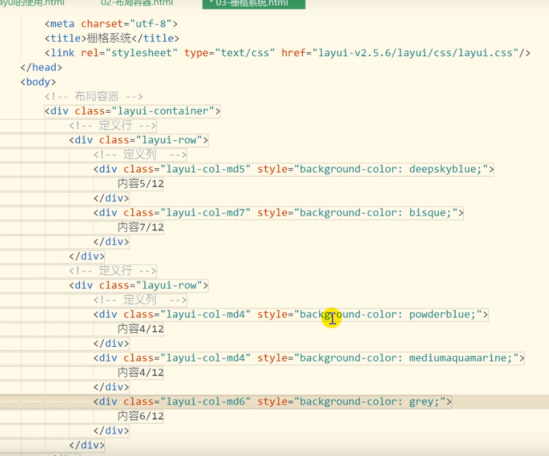
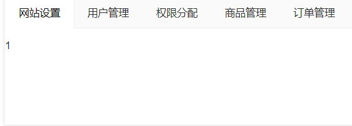
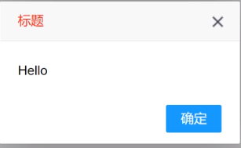
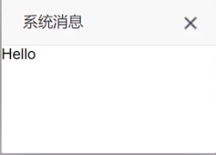
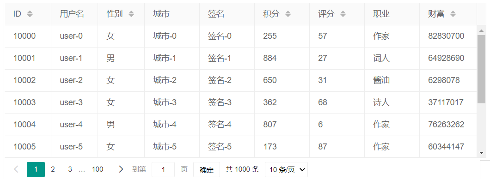
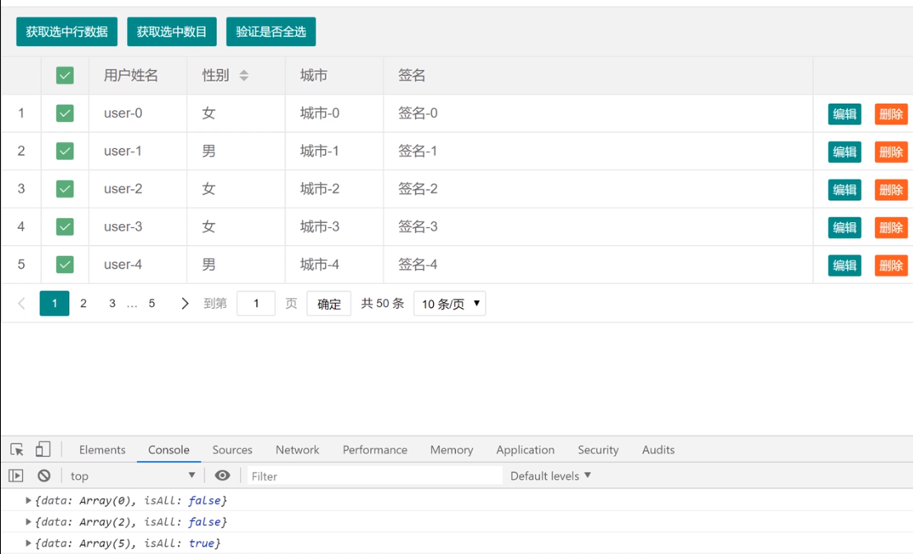

>   layui是后台管理系统的模板

<!--more-->

#  	layui

## 常用组件

### 1. 常用

```mermaid
graph LR;

A["页面元素"]-->B["布局"]
B-->布局容器
B-->栅格系统
A-->C["基本元素"]
C-->按钮
C-->导航
C-->选项卡
C-->表格
C-->表单
A-->D["组件示例"]
D-->弹出层
D-->日期和时间选择
D-->数据表格
D-->分页
```

### 2. LayUI的安装与使用

layui是一款采用自身模块规范编写的前端UI框架，遵循原生HTML/CSS/JS的书写与组织形式，门槛低。由国人开发，16年出厂的框架，和Bootstrap有些相似，但该框架极大的好处就是定义了很多前后端交互的样式接口，后端则按照定义好的接口规则返回数据，即可完成页面的展示，极大减少了后端人员的成本

官网：[Layui - 经典开源模块化前端 UI 框架](https://www.layui.com/)

文档：[Layui 开发使用文档 - 入门指南](https://www.layui.com/doc/)

#### 特点 

-   layui属于轻量级框架。适合开发后台前端，在服务端页面由很好效果
-   layui是提供给后端开发人员的ui框架，基于DOM驱动

#### 目录结构

它经过了自动化构建，更适合用于生产环境

```
├─css //css目录
│  │─modules //模块 css 目录（一般如果模块相对较大，我们会单独提取，如下：）
│  │  ├─laydate
│  │  └─layer
│  └─layui.css //核心样式文件
├─font  //字体图标目录
└─layui.js //核心库
```

#### 简单使用

```html
<head>
    <meta charset="utf-8">
  	<title>开始使用 layui</title>
  	<!--引入样式-->
  	<link rel="stylesheet" href="./layui/css/layui.css">
  	<!--引入layui-->
    <script src="./layui/layui.js"></script>
</head>

<!--定义变量，与待引入的组件同名-->
<script>
layui.use(['layer', 'form'], function(){
  var layer = layui.layer
  ,form = layui.form;
  
  layer.msg('Hello World');
});
</script> 
```

### 3. 布局容器与栅格系统

#### 布局容器

```html
<!--固定宽度（两侧留白效果）-->
<div class="layui-container"></div>

<!--完整宽度（占据屏幕100%）-->
<div class="layui-container"></div>
```

#### 栅格系统

##### 布局规则




1.  `layui-row` 定义行

    ```html
    <div class="layui-row"></div>
    ```

2.  `llayui-col-md*`预设类来定义一组列(column)，且放在行（row）内

    -   `md` 表示不同屏幕取值

        -   xs：超小屏幕(手机)
        -   sm：小屏幕（平板）
        -   md：桌面等中等屏幕
        -   lg：桌面大型屏幕

    -   \*表示列数量

        该列所占用的12等数

        可选数量1-12，超过则自动换行

##### 响应式规则


-   栅格会自动根据屏幕分辨率选择对应的样式效果

##### 列边距

通过列间距的预设类，来说设定列之间的间距。且一行中最左的列不会出现做边距，最右的列不会出现右边距。预设十二种不同尺寸的边距

```css
/* 支持列之间为 1px-30px 区间的双数间隔，以及 1px，5px，15px，25px的单数间距 */
layui-col-space1
layui-col-space2
layui-col-space4
layui-col-space5
layui-col-space6
layui-col-space8
layui-col-space10
layui-col-space12
layui-col-space14
layui-col-space15
layui-col-space16
layui-col-space18
layui-col-space20
layui-col-space22
layui-col-space24
layui-col-space25
layui-col-space26
layui-col-space28
layui-col-space30
```

##### 列偏移

`layui-col-md-offset*` 的预设类，从而列向右偏移

*layui-col-md-offset3* ，代表在 “中型屏幕下”，让该列向右偏移3个列宽度

当低于桌面屏幕的规定的临界值，就会堆叠排列

##### 列嵌套

在列元素 `layui-col-md*` 中插入行元素 `layui-row` 可以完成嵌套

### 4. 基本元素

#### 按钮

向任意HTML元素设定 *class="layui-btn"* ，建立一个基础按钮。通过追加格式为 *layui-btn-{type}* 的class来定义其它按钮风格。内置的按钮class可以进行任意组合，从而形成更多种按钮风格。

```html
<button type="button" class="layui-btn">一个标准的按钮</button>
<a href="http://www.layui.com" class="layui-btn">一个可跳转的按钮</a>
```

##### 按钮主题

| 名称 | 组合                                 |
| :--- | :----------------------------------- |
| 原始 | class="layui-btn layui-btn-primary"  |
| 默认 | class="layui-btn"                    |
| 百搭 | class="layui-btn layui-btn-normal"   |
| 暖色 | class="layui-btn layui-btn-warm"     |
| 警告 | class="layui-btn layui-btn-danger"   |
| 禁用 | class="layui-btn layui-btn-disabled" |


| 名称 | 组合                                                    |
| :--- | :------------------------------------------------------ |
| 主色 | class="layui-btn layui-btn-primary layui-border-green"  |
| 百搭 | class="layui-btn layui-btn-primary layui-border-blue"   |
| 暖色 | class="layui-btn layui-btn-primary layui-border-orange" |
| 警告 | class="layui-btn layui-btn-primary layui-border-red"    |
| 深色 | class="layui-btn layui-btn-primary layui-border-black"  |


##### 尺寸

| 尺寸 | 组合                           |
| :--- | :----------------------------- |
| 大型 | class="layui-btn layui-btn-lg" |
| 默认 | class="layui-btn"              |
| 小型 | class="layui-btn layui-btn-sm" |
| 迷你 | class="layui-btn layui-btn-xs" |


```html
<button type="button" class="layui-btn layui-btn-fluid">流体按钮（最大化适应）</button>
```


##### 圆角按钮

| 主题 | 组合                                                  |
| :--- | :---------------------------------------------------- |
| 原始 | class="layui-btn layui-btn-radius layui-btn-primary"  |
| 默认 | class="layui-btn layui-btn-radius"                    |
| 百搭 | class="layui-btn layui-btn-radius layui-btn-normal"   |
| 暖色 | class="layui-btn layui-btn-radius layui-btn-warm"     |
| 警告 | class="layui-btn layui-btn-radius layui-btn-danger"   |
| 禁用 | class="layui-btn layui-btn-radius layui-btn-disabled" |


##### 按钮组

将按钮放入一个*class="layui-btn-group"*元素中，即可形成按钮组，按钮本身仍然可以随意搭配

```html\
<div class="layui-btn-group">
  <button type="button" class="layui-btn">增加</button>
  <button type="button" class="layui-btn">编辑</button>
  <button type="button" class="layui-btn">删除</button>
</div>
```


```html
<div class="layui-btn-group">
  <button type="button" class="layui-btn layui-btn-sm">
    <i class="layui-icon">&#xe654;</i>
  </button>
  <button type="button" class="layui-btn layui-btn-sm">
    <i class="layui-icon">&#xe642;</i>
  </button>
  <button type="button" class="layui-btn layui-btn-sm">
    <i class="layui-icon">&#xe640;</i>
  </button>
  <button type="button" class="layui-btn layui-btn-sm">
    <i class="layui-icon">&#xe602;</i>
  </button>
</div>
```


```html
<div class="layui-btn-group">
  <button type="button" class="layui-btn layui-btn-primary layui-btn-sm">
    <i class="layui-icon">&#xe654;</i>
  </button>
  <button type="button" class="layui-btn layui-btn-primary layui-btn-sm">
    <i class="layui-icon">&#xe642;</i>
  </button>
  <button type="button" class="layui-btn layui-btn-primary layui-btn-sm">
    <i class="layui-icon">&#xe640;</i>
  </button>
</div>
```


#### 图标

[字体图标 - 页面元素 - Layui](https://www.layui.com/doc/element/icon.html)

#### 导航

导航一般指页面引导性频道集合，多以菜单的形式呈现，可应用于头部和侧边，是整个网页画龙点晴般的存在。面包屑结构简单，支持自定义分隔符。千万不要忘了加载 *element*模块。虽然大部分行为都是在加载完该模块后自动完成的，但一些交互操作，如呼出二级菜单等，需借助element模块才能使用。

>   依赖加载模块：[element](https://www.layui.com/doc/modules/element.html)

实现步骤：

1.  引入资源

    ```html
    <!--引入样式-->
    <link rel="stylesheet" href="./layui/css/layui.css">
    <!--引入layui-->
    <script src="./layui/layui.js"></script>
    ```

2.  依赖加载模块

    ```html
    <script>
    //注意：导航 依赖 element 模块，否则无法进行功能性操作
    layui.use('element', function(){
      var element = layui.element;
      
      //…
    });
    </script>
    ```

3.  显示指定类型的导航

##### 水平导航栏

**选中 layui-this**

```html
<ul class="layui-nav">
	<li class="layui-nav-item">最新活动</li>
    <li class="layui-nav-item layui-this">产品</li>
    <li class="layui-nav-item">大数据</li>
</ul>
```


**二级菜单**

```html
<ul class="layui-nav">
	<li class="layui-nav-item">最新活动</li>
    <li class="layui-nav-item layui-this">产品</li>
    <li class="layui-nav-item">大数据</li>
    <li class="layui-nav-item">
        <a>解决方案</a>
        <dl class="layui-nav-child">
        	<dd><a href="">移动模块</a></dd>
      		<dd><a href="">后台模版</a></dd>
      		<dd><a href="">电商平台</a></dd>
        </dl>
    </li>
</ul>
```


##### 垂直导航

```html
<ul class="layui-nav layui-nav-tree">
	<li class="layui-nav-item">最新活动</li>
    <li class="layui-nav-item layui-this">产品</li>
    <li class="layui-nav-item">大数据</li>
    <li class="layui-nav-item">
        <a>解决方案</a>
        <dl class="layui-nav-child">
        	<dd><a href="">移动模块</a></dd>
      		<dd><a href="">后台模版</a></dd>
      		<dd><a href="">电商平台</a></dd>
        </dl>
    </li>
</ul>
```


##### 侧边导航

```html
<ul class="layui-nav layui-nav-side">
	<li class="layui-nav-item">最新活动</li>
    <li class="layui-nav-item layui-this">产品</li>
    <li class="layui-nav-item">大数据</li>
    <li class="layui-nav-item">
        <a>解决方案</a>
        <dl class="layui-nav-child">
        	<dd><a href="">移动模块</a></dd>
      		<dd><a href="">后台模版</a></dd>
      		<dd><a href="">电商平台</a></dd>
        </dl>
    </li>
</ul>
```


##### 导航主题

通过对导航追加CSS背景类，让导航呈现不同的主题色

水平导航支持的其它背景主题有：*layui-bg-cyan*（藏青）、*layui-bg-molv*（墨绿）、*layui-bg-blue*（艳蓝）
垂直导航支持的其它背景主题有：*layui-bg-cyan*（藏青）

#### 面包屑式导航

```html
<span class="layui-breadcrumb">
  <a href="">首页</a>
  <a href="">国际新闻</a>
  <a href="">亚太地区</a>
  <a><cite>正文</cite></a>
</span>
```


你还可以通过设置属性 *lay-separator="-"* 来自定义分隔符。如： 首页- 国际新闻- 亚太地区- 正文

#### 选项卡

导航菜单可应用于头部和侧边，Tab选项卡提供多套风格，支持响应式，支持删除选项卡等功能。面包屑结构简单，支持自定义分隔符。

>   依赖加载组件：[element](https://www.layui.com/doc/modules/element.html) （请注意：必须加载element模块，相关功能才能正常使用，详见：内置组件 - 常用元素操作）

**实现步骤**

1.  引入资源

    ```html
    <!--引入样式-->
    <link rel="stylesheet" href="./layui/css/layui.css">
    <!--引入layui-->
    <script src="./layui/layui.js"></script>
    ```

2.  依赖加载模块

    ```html
    <script>
        //注意：导航 依赖 element 模块，否则无法进行功能性操作
        layui.use('element', function(){
          var element = layui.element;
    
          //…
        });
    </script>
    ```

3.  加载HTML

    -   `layui-tab` 选项卡
        -   `layui-this` 选中
    -   `layui-tab` 选项头
    -   `layui-tab-content` 选项体
        -   `layui-tab-item` 选项内容
            -   `layui-show` 展示内容

    ```html
    <div class="layui-tab">
      <ul class="layui-tab-title">
        <li class="layui-this">网站设置</li>
        <li>用户管理</li>
        <li>权限分配</li>
        <li>商品管理</li>
        <li>订单管理</li>
      </ul>
      <div class="layui-tab-content">
        <div class="layui-tab-item layui-show">内容1</div>
        <div class="layui-tab-item">内容2</div>
        <div class="layui-tab-item">内容3</div>
        <div class="layui-tab-item">内容4</div>
        <div class="layui-tab-item">内容5</div>
      </div>
    </div>
    ```

    

##### 选项卡风格

默认风格 `layui-tab`

简约风格 `layui-tab-brief`


卡片风格 `layui-tab-card`



##### 带删除的选项卡

你可以对父层容器设置属性 *lay-allowClose="true"* 来允许Tab选项卡被删除

```html
<div class="layui-tab" lay-allowClose="true">
  <ul class="layui-tab-title">
    <li class="layui-this">网站设置</li>
    <li>用户基本管理</li>
    <li>权限分配</li>
    <li>全部历史商品管理文字长一点试试</li>
    <li>订单管理</li>
  </ul>
  <div class="layui-tab-content">
    <div class="layui-tab-item layui-show">1</div>
    <div class="layui-tab-item">2</div>
    <div class="layui-tab-item">3</div>
    <div class="layui-tab-item">4</div>
    <div class="layui-tab-item">5</div>
    <div class="layui-tab-item">6</div>
  </div>
</div>
```


#### 表格

**基本用法**

```html
<table class="layui-table">
    <!--设置每一列的宽度 单位:px-->
      <colgroup>
          <col width="150">
          <col width="200">
          <col><!--不设值则自动占满剩余-->
      </colgroup>
      <thead>
        <tr>
          <th>昵称</th>
          <th>加入时间</th>
          <th>签名</th>
        </tr> 
      </thead>
      <tbody>
        <tr>
          <td>贤心</td>
          <td>2016-11-29</td>
          <td>人生就像是一场修行</td>
        </tr>
        <tr>
          <td>许闲心</td>
          <td>2016-11-28</td>
          <td>于千万人之中遇见你所遇见的人，于千万年之中，时间的无涯的荒野里…</td>
        </tr>
      </tbody>
</table>
```

**基本属性**


| 属性名            | 属性值                                                    | 备注                                       |
| :---------------- | :-------------------------------------------------------- | :----------------------------------------- |
| lay-even          | 无                                                        | 用于开启 *隔行* 背景，可与其它属性一起使用 |
| lay-skin="属性值" | line （行边框风格） row （列边框风格） nob （无边框风格） | 若使用默认风格不设置该属性即可             |
| lay-size="属性值" | sm （小尺寸） lg （大尺寸）                               | 若使用默认尺寸不设置该属性即可             |

```html
<table class="layui-table" lay-skin="line">
  行边框表格（内部结构参见右侧目录“常规用法”）
</table>
```


```html
<table class="layui-table" lay-skin="row">
  列边框表格（内部结构参见右侧目录“常规用法”）
</table>
```


```html
<table class="layui-table" lay-even lay-skin="nob">
  无边框表格（内部结构参见右侧目录“常规用法”）
</table>
```


#### 表单

在一个容器中设定 *class="layui-form"* 来标识一个表单元素块，通过规范好的HTML结构及CSS类，来组装成各式各样的表单元素，并通过内置的 *form模块* 来完成各种交互。

>   依赖加载模块：[form](https://www.layui.com/doc/modules/form.html) （请注意：如果不加载form模块，select、checkbox、radio等将无法显示，并且无法使用form相关功能）

1.  在一个容器中设定 `class="layui-form"` 来标识一个表单元素块

    ```html
    <form class="layui-form" action="">
        
    </form>
    ```

2.  基本的行区块结构，它提供了响应式的支持。但如果你不大喜欢，你可以换成你的结构，但必须要在外层容器中定义*class="layui-form"*，form模块才能正常工作。

    ```html
    <div class="layui-form-item">
      <label class="layui-form-label">标签区域</label>
      <div class="layui-input-block">
        原始表单元素区域
      </div>
    </div>
    ```

##### 输入框

```html
<input type="text" name="title" required lay-verify="required" placeholder="请输入标题" autocomplete="off" class="layui-input">    
```

*required*：注册浏览器所规定的必填字段
*lay-verify*：注册form模块需要验证的类型 取值
*class="layui-input"*：layui.css提供的通用CSS类

*class="layui-input-block"*：占据全部宽度

*class="layui-input-inline"*：占据部分宽度

**属性**

placeholder 文本框默为空，默认显示的文本信息

autocomplete 表单元素是否自动填充 off | 

当浏览器缓存中存在相同 name 属性的值时，会填充

##### 下拉选择框

```html
<select name="city" lay-verify="">
  <option value="">请选择一个城市</option>
  <option value="010">北京</option>
  <option value="021">上海</option>
  <option value="0571">杭州</option>
</select>  
```

-   通过 `selected` 属性设置默认选中项

-   通过 `disabled` 属性开启禁用，可以设置 `select` 和 `option` 标签禁用下拉框或下拉选项

-   **select分组** 

    `optgroup` 

    ```html
    <select name="quiz">
      <option value="">请选择</option>
      <optgroup label="城市记忆">
        <option value="你工作的第一个城市">你工作的第一个城市？</option>
      </optgroup>
      <optgroup label="学生时代">
        <option value="你的工号">你的工号？</option>
        <option value="你最喜欢的老师">你最喜欢的老师？</option>
      </optgroup>
    </select>
    ```

    

-   通过设定属性 *lay-search* 来开启搜索匹配功能——模糊匹配

    ```html
    <select name="city" lay-verify="" lay-search>
      <option value="010">layer</option>
      <option value="021">form</option>
      <option value="0571" selected>layim</option>
      ……
    </select>
    ```

    

##### 复选框

```html
默认风格：
<input type="checkbox" name="" title="写作" checked>
<input type="checkbox" name="" title="发呆"> 
<input type="checkbox" name="" title="禁用" disabled> 
```


```html
原始风格：
<input type="checkbox" name="" title="写作" lay-skin="primary" checked>
<input type="checkbox" name="" title="发呆" lay-skin="primary"> 
<input type="checkbox" name="" title="禁用" lay-skin="primary" disabled> 
```


-   属性*title*可自定义文本（温馨提示：如果只想显示复选框，可以不用设置title）
-   属性*checked*可设定默认选中
-   属性*lay-skin*可设置复选框的风格
-   设置*value="1"*可自定义值，否则选中时返回的就是默认的on

##### 开关

checkbox复选框的“变种”，通过设定 *lay-skin="switch"* 形成了开关风格

```html
<input type="checkbox" name="xxx" lay-skin="switch">
<input type="checkbox" name="yyy" lay-skin="switch" lay-text="ON|OFF" checked>
<input type="checkbox" name="zzz" lay-skin="switch" lay-text="开启|关闭">
<input type="checkbox" name="aaa" lay-skin="switch" disabled>
```


-   属性*checked*可设定默认开
-   属性*disabled*开启禁用
-   属性*lay-text*可自定义开关两种状态的文本
-   设置*value="1"*可自定义值，否则选中时返回的就是默认的on

##### 单选框

```html
<input type="radio" name="sex" value="nan" title="男">
<input type="radio" name="sex" value="nv" title="女" checked>
<input type="radio" name="sex" value="" title="中性" disabled>
```


-   属性*title*可自定义文本
-   属性*disabled*开启禁用
-   设置*value="xxx"*可自定义值，否则选中时返回的就是默认的on

##### 文本域

```html
<textarea name="" required lay-verify="required" placeholder="请输入" class="layui-textarea"></textarea>
```


##### 组装行内表单

```html
<div class="layui-form-item">
 
  <div class="layui-inline">
    <label class="layui-form-label">范围</label>
    <div class="layui-input-inline" style="width: 100px;">
      <input type="text" name="price_min" placeholder="￥" autocomplete="off" class="layui-input">
    </div>
    <div class="layui-form-mid">-</div>
    <div class="layui-input-inline" style="width: 100px;">
      <input type="text" name="price_max" placeholder="￥" autocomplete="off" class="layui-input">
    </div>
  </div>
  
  <div class="layui-inline">
    <label class="layui-form-label">密码</label>
    <div class="layui-input-inline" style="width: 100px;">
      <input type="password" name="" autocomplete="off" class="layui-input">
    </div>
  </div>
  
</div>
```


-   *class="layui-inline"*：定义外层行内
-   *class="layui-input-inline"*：定义内层行内


##### 忽略美化渲染

可以对表单元素增加 `lay-ignore` ，将不会对该标签进行美化渲染，即保留系统风格

##### 方框表单

通过追加 *layui-form-pane* 的class，来设定表单的方框风格。内部结构不变

### 5. 组件

#### layui-layer

*layer* 已然成为网页弹出层的首先交互方案

>   模块加载名称：*layer*，独立版本：[layer.layui.com](http://layer.layui.com/)

[layer弹层组件开发文档 - Layui](https://www.layui.com/doc/modules/layer.html)

##### 使用场景

由于layer可以独立使用，也可以通过Layui模块化使用

| 场景                | 用前准备                                                     | 调用方式                                                     |
| :------------------ | :----------------------------------------------------------- | :----------------------------------------------------------- |
| 1. 作为独立组件使用 | 如果你只是单独想使用 layer，你可以去 [layer](http://layer.layui.com/) 独立版本官网下载组件包。你需要在你的页面引入*jQuery*1.8以上的任意版本，并引入*layer.js*。 | 通过script标签引入layer.js后，直接用即可。 参考：[快速上手](http://layer.layui.com/hello.html) |
| 2. layui 模块化使用 | 如果你使用的是 layui，那么你直接在官网下载 layui 框架即可，无需引入 jQuery 和 layer.js，但需要引入*layui.css*和*layui.js* | 通过*layui.use('layer', callback)*加载模块                   |

##### 基本参数

基础参数主要指调用方法时用到的配置项,以键值形式存在，基础参数*可合理应用于任何层类型中*

1.  type - 基本层类型

    ```
    类型：Number，默认：0
    
    可传入的值有：
    	0（信息框，默认）
    	1（页面层）
    	2（iframe层）
    	3（加载层）
    	4（tips层）
    ```

    若你采用*layer.open({type: 1})*方式调用，则type为必填项

2.  title - 标题

    ```
    类型：String/Array/Boolean，默认：'信息'
    
    1. 若你传入的是普通的字符串，如title :'我是标题'，那么只会改变标题文本
    2. 若你还需要自定义标题区域样式，那么你可以title: ['文本', 'font-size:18px;']，数组第二项可以写任意css样式
    3. 如果你不想显示标题栏，你可以title: false
    ```

3.  content - 内容

    ```
    类型：String/DOM/Array，默认：''
    
    content可传入的值是灵活多变的，不仅可以传入普通的html内容，还可以指定DOM，更可以随着type的不同而不同。
    ```

```js
/* 信息框 */
layer.open({
    type:0,
    title:['标题','color:red'],
    //content可传入任意的文本或html
    content:"Hello"
})
```



```js
/* 页面层 */
layer.open({
    type:1,
    title:"系统消息",
    content: "<div style='height:100px;width:200px'>Hello</div>"
})
```



```js
/* iframe */
layer.open({
    type:2,
    title:"系统消息",
    //content是一个URL，如果不想让那个Iframe出现滚动条，可以content:['url','no']
    content: "<div style='height:100px;width:200px'>Hello</div>"
})
```


```html
/* tips */
<span>内容1</span>
<span>内容2</span>
<span>内容3</span>
<span id="#sp">内容4</span>

layer.open({
    type:4,
    content:['内容','#sp']//数组第二项即吸附元素选择器或者DOM
})
```


##### aera - 宽高

```
类型：String/Array，默认：'auto'

在默认状态下，layer是宽高都自适应的，
	只定义宽度时，你可以area: '500px'，高度仍然是自适应的。
	当你宽高都要定义时，你可以area: ['500px', '300px']
```

##### icon - 图标

**信息框和加载层的私有参数**

```
类型：Number，默认：-1（信息框）/0（加载层）

信息框默认不显示图标。当你想显示图标时，默认皮肤可以传入0-6如果是加载层，可以传入0-2。
```

1.  ```js
    layer.alert("很高兴见到你",{icon:6})
    ```


2.  ```js
    layer.msg('?',{
        time: 0,//不自动关闭
        btn:['是','否'],//按钮
        yes: function(index){
            layer.close(index);//关闭当前弹出层
            layer.msg('你好!',{
                icon: 6//图标
                btn:['开心','不开心']
            })
        }
    })
    ```

    

3.  ```js
    layer.msg('常用的弹出层')
    ```

    

4.  ```js
    layer.msg('玩命加载中...',function(){
        //关闭后操作
        layer.msg('')
    })
    ```

    

#### 日期和时间组件

 layDate 包含了大量的更新，其中主要以：*年选择器*、*年月选择器*、*日期选择器*、*时间选择器*、*日期时间选择器*.五种类型的选择方式为基本核心，并且均支持范围选择（即双控件）

>   模块加载名称：*laydate*，独立版本：http://www.layui.com/laydate/

##### 使用

```html
<!DOCTYPE html>
<html>
    <head>
        <meta charset="utf-8">
        <link rel="stylesheet" href="/static/build/layui.css" media="all">
    </head>
    <body>
        <div class="layui-inline"> <!-- 注意：这一层元素并不是必须的 -->
            <input type="text" class="layui-input" id="test1">
        </div>

        <script>
            layui.use('laydate', function(){
                var laydate = layui.laydate;

                //执行一个laydate实例
                laydate.render({
                    elem: '#test1' //将日期控件绑定到元素上
                });
            });
        </script>
    </body>
</html>
```

##### 参数

通过核心方法：*laydate.render(options)* 来设置基础参数，也可以通过方法：*laydate.set(options)* 来设定全局基础参数.

1.  elem - 绑定元素

    ```
    类型：String/DOM，默认值：无
    
    必填项，用于绑定执行日期渲染的元素，值一般为选择器，或DOM对象
    ```

    ```js
    laydate.render({ 
      elem: '#test' //或 elem: document.getElementById('test')、elem: lay('#test') 等
    });
    ```

2.  type - 控件选择类型

    ```
    类型：String，默认值：date
    ```

    用于单独提供不同的选择器类型，可选值如下表：

    | type可选值 | 名称           | 用途                                       |
    | :--------- | :------------- | :----------------------------------------- |
    | year       | 年选择器       | 只提供年列表选择                           |
    | month      | 年月选择器     | 只提供年、月选择                           |
    | date       | 日期选择器     | 可选择：年、月、日。type默认值，一般可不填 |
    | time       | 时间选择器     | 只提供时、分、秒选择                       |
    | datetime   | 日期时间选择器 | 可选择：年、月、日、时、分、秒             |

    ```js
    //年范围选择
    laydate.render({ 
      elem: '#test'
      ,type: 'year'
      ,range: true //或 range: '~' 来自定义分割字符
    });
    ```

    

    ```js
    //年月范围选择
    laydate.render({ 
      elem: '#test'
      ,type: 'month'
      ,range: true //或 range: '~' 来自定义分割字符
    });
    ```

    

    ```js
    //日期范围选择
    laydate.render({ 
      elem: '#test'
      ,range: true //或 range: '~' 来自定义分割字符
    });
    ```

    

    ```js
    //时间范围选择
    laydate.render({ 
      elem: '#test'
      ,type: 'time'
      ,range: true //或 range: '~' 来自定义分割字符
    });
    ```

    

    ```html
    //日期时间范围选择
    laydate.render({ 
      elem: '#test'
      ,type: 'datetime'
      ,range: true //或 range: '~' 来自定义分割字符
    });
    ```

    

3.  format - 自定义格式

    ```
    类型：String，默认值：yyyy-MM-dd
    ```

    通过日期时间各自的格式符和长度，来设定一个你所需要的日期格式。layDate 支持的格式如下：

    | 格式符 | 说明                                             |
    | :----- | :----------------------------------------------- |
    | yyyy   | 年份，至少四位数。如果不足四位，则前面补零       |
    | y      | 年份，不限制位数，即不管年份多少位，前面均不补零 |
    | MM     | 月份，至少两位数。如果不足两位，则前面补零。     |
    | M      | 月份，允许一位数。                               |
    | dd     | 日期，至少两位数。如果不足两位，则前面补零。     |
    | d      | 日期，允许一位数。                               |
    | HH     | 小时，至少两位数。如果不足两位，则前面补零。     |
    | H      | 小时，允许一位数。                               |
    | mm     | 分钟，至少两位数。如果不足两位，则前面补零。     |
    | m      | 分钟，允许一位数。                               |
    | ss     | 秒数，至少两位数。如果不足两位，则前面补零。     |
    | s      | 秒数，允许一位数。                               |

    通过上述不同的格式符组合成一段日期时间字符串，可任意排版

    | 格式                        | 示例值                      |
    | :-------------------------- | :-------------------------- |
    | yyyy-MM-dd HH:mm:ss         | 2017-08-18 20:08:08         |
    | yyyy年MM月dd日 HH时mm分ss秒 | 2017年08月18日 20时08分08秒 |
    | yyyyMMdd                    | 20170818                    |
    | dd/MM/yyyy                  | 18/08/2017                  |
    | yyyy年M月                   | 2017年8月                   |
    | M月d日                      | 8月18日                     |

4.  value - 初始值

    ```
    类型：String，默认值：new Date()
    
    支持传入符合format参数设定的日期格式字符，或者 new Date()
    ```

    ```js
    //传入符合format格式的字符给初始值
    laydate.render({ 
      elem: '#test'
      ,value: '2018-08-18' //必须遵循format参数设定的格式
    });
     
    //传入Date对象给初始值
    laydate.render({ 
      elem: '#test'
      ,value: new Date(1534766888000) //参数即为：2018-08-20 20:08:08 的时间戳
    });
    ```

#### 分页

>   模块加载名称：*laypage*

##### 使用

```html
<!DOCTYPE html>
<html>
    <head>
        <meta charset="utf-8">
        <title>layPage快速使用</title>
        <link rel="stylesheet" href="/static/build/layui.css" media="all">
        <script src="/static/build/layui.js"></script>
    </head>
    <body>
        <div id="test1"></div>
        
        <script>
            layui.use('laypage', function(){
                var laypage = layui.laypage;

                //执行一个laypage实例
                laypage.render({
                    elem: 'test1' //注意，这里的 test1 是 ID，不用加 # 号
                    ,count: 50 //数据总数，从服务端得到
                });
            });
        </script>
    </body>
</html>
```

 

##### 基本参数

通过核心方法：*laypage.render(options)* 来设置基础参数。

| 参数选项 | 说明                                                         | 类型           | 默认值                   |
| :------- | :----------------------------------------------------------- | :------------- | :----------------------- |
| elem     | 指向存放分页的容器，值可以是容器ID、DOM对象。如： 1. elem: 'id' *注意：这里不能加 # 号* 2. elem: document.getElementById('id') | String/Object  | -                        |
| count    | 数据总数。一般通过服务端得到                                 | Number         | -                        |
| limit    | 每页显示的条数。laypage将会借助 count 和 limit 计算出分页数。 | Number         | 10                       |
| limits   | 每页条数的选择项。如果 layout 参数开启了 limit，则会出现每页条数的select选择框 | Array          | [10, 20, 30, 40, 50]     |
| curr     | 起始页。一般用于刷新类型的跳页以及HASH跳页。如：`</>code//开启location.hash的记录laypage.render({  elem: 'test1'  ,count: 500  ,curr: location.hash.replace('#!fenye=', '') //获取起始页  ,hash: 'fenye' //自定义hash值});                        ` | Number         | 1                        |
| groups   | 连续出现的页码个数                                           | Number         | 5                        |
| prev     | 自定义“上一页”的内容，支持传入普通文本和HTML                 | String         | 上一页                   |
| next     | 自定义“下一页”的内容，同上                                   | String         | 下一页                   |
| first    | 自定义“首页”的内容，同上                                     | String         | 1                        |
| last     | 自定义“尾页”的内容，同上                                     | String         | 总页数值                 |
| layout   | 自定义排版。可选值有：*count*（总条目输区域）、*prev*（上一页区域）、*page*（分页区域）、*next*（下一页区域）、*limit*（条目选项区域）、*refresh*（页面刷新区域。注意：layui 2.3.0 新增） 、*skip*（快捷跳页区域） | Array          | ['prev', 'page', 'next'] |
| theme    | 自定义主题。支持传入：*颜色值*，或*任意普通字符*。如： 1. theme: '#c00' 2. theme: 'xxx' //将会生成 class="layui-laypage-xxx" 的CSS类，以便自定义主题 | String         | -                        |
| hash     | 开启location.hash，并自定义 hash 值。如果开启，在触发分页时，会自动对url追加：*#!hash值={curr}* 利用这个，可以在页面载入时就定位到指定页 | String/Boolean | false                    |

##### jump - 切换分页的回调

```js
laypage.render({
    elem: 'test1'
    ,count: 70 //数据总数，从服务端得到
    ,jump: function(obj, first){
        //obj包含了当前分页的所有参数，比如：
        console.log(obj.curr); //得到当前页，以便向服务端请求对应页的数据。
        console.log(obj.limit); //得到每页显示的条数

        //首次不执行
        if(!first){
            //do something
        }
    }
});
```

#### 数据表格

它用于对表格进行一些列功能和动态化数据操作，涵盖了日常业务所涉及的几乎全部需求。支持固定表头、固定行、固定列左/列右，支持拖拽改变列宽度，支持排序，支持多级表头，支持单元格的自定义模板，支持对表格重载（比如搜索、条件筛选等），支持复选框，支持分页，支持单元格编辑等等一些列功能。

>    模块加载名称：*table*

##### 使用

在页面放置一个元素 *<table id="demo"></table>*，然后通过 *table.render()* 方法指定该容器

```html
<!DOCTYPE html>
<html>
<head>
  <meta charset="utf-8">
  <title>table模块快速使用</title>
  <link rel="stylesheet" href="/layui/css/layui.css" media="all">
</head>
<body>
 
<table id="demo" lay-filter="test"></table>
 
<script src="/layui/layui.js"></script>
<script>
layui.use('table', function(){
  var table = layui.table;
  
  //第一个实例
  table.render({
    elem: '#demo'
    ,height: 312
    ,url: '/demo/table/user/' //数据接口
    ,page: true //开启分页
    ,cols: [[ //表头
      {field: 'id', title: 'ID', width:80, sort: true, fixed: 'left'}
      ,{field: 'username', title: '用户名', width:80}
      ,{field: 'sex', title: '性别', width:80, sort: true}
      ,{field: 'city', title: '城市', width:80} 
      ,{field: 'sign', title: '签名', width: 177}
      ,{field: 'experience', title: '积分', width: 80, sort: true}
      ,{field: 'score', title: '评分', width: 80, sort: true}
      ,{field: 'classify', title: '职业', width: 80}
      ,{field: 'wealth', title: '财富', width: 135, sort: true}
    ]]
  });
  
});
</script>
</body>
</html>
```

```json
数据格式
{
    "count":,
    "data":[
        {
        	"id":,
            "username":,
            "sex":
    	}
    ]
}
```



##### 初始化渲染方式

| 方式                                                         | 机制                   | 适用场景                                                     |
| :----------------------------------------------------------- | :--------------------- | :----------------------------------------------------------- |
| [方法渲染](https://www.layui.com/doc/modules/table.html#methodRender) | 用JS方法的配置完成渲染 | （推荐）无需写过多的 HTML，在 JS 中指定原始元素，再设定各项参数即可。 |
| [自动渲染](https://www.layui.com/doc/modules/table.html#autoRender) | HTML配置，自动渲染     | 无需写过多 JS，可专注于 HTML 表头部分                        |
| [转换静态表格](https://www.layui.com/doc/modules/table.html#parseTable) | 转化一段已有的表格元素 | 无需配置数据接口，在JS中指定表格元素，并简单地给表头加上自定义属性即可 |

**自动渲染**

在一段 table 容器中配置好相应的参数，由 table 模块内部自动对其完成渲染

1.  带有 *class="layui-table"* 的 *<table>* 标签。
2.  对标签设置属性 *lay-data=""* 用于配置一些基础参数
3.  在 *<th>* 标签中设置属性*lay-data=""*用于配置表头信息

```html
<table class="layui-table" lay-data="{height:315, url:'/demo/table/user/', page:true, id:'test'}" lay-filter="test">
  <thead>
    <tr>
      <th lay-data="{field:'id', width:80, sort: true}">ID</th>
      <th lay-data="{field:'username', width:80}">用户名</th>
      <th lay-data="{field:'sex', width:80, sort: true}">性别</th>
      <th lay-data="{field:'city'}">城市</th>
      <th lay-data="{field:'sign'}">签名</th>
      <th lay-data="{field:'experience', sort: true}">积分</th>
      <th lay-data="{field:'score', sort: true}">评分</th>
      <th lay-data="{field:'classify'}">职业</th>
      <th lay-data="{field:'wealth', sort: true}">财富</th>
    </tr>
  </thead>
</table>
```

**方法渲染**

原始的 table 标签只需要一个 *选择器*

```html
<table id="demo" lay-filter="test"></table>
```

```js
layui.user('table',function(){
    var table = layui.table;

    //执行渲染
    table.render({
        elem: '#demo' //指定原始表格元素选择器（推荐id选择器）
        ,height: 315 //容器高度
        ,cols: [{}] //设置表头
        //,…… //更多参数参考右侧目录：基本参数选项
    });
})
```

*table.render()*方法返回一个对象：var tableIns = table.render(options)

**转换静态表格**

假设你的页面已经存在了一段有内容的表格，它由原始的table标签组成，这时你需要赋予它一些动态元素

```html
<table lay-filter="demo">
    <thead>
        <tr>
            <th lay-data="{field:'username', width:100}">昵称</th>
            <th lay-data="{field:'experience', width:80, sort:true}">积分</th>
            <th lay-data="{field:'sign'}">签名</th>
        </tr> 
    </thead>
    <tbody>
        <tr>
            <td>贤心1</td>
            <td>66</td>
            <td>人生就像是一场修行a</td>
        </tr>
        <tr>
            <td>贤心2</td>
            <td>88</td>
            <td>人生就像是一场修行b</td>
        </tr>
        <tr>
            <td>贤心3</td>
            <td>33</td>
            <td>人生就像是一场修行c</td>
        </tr>
    </tbody>
</table>
```

```js
var table = layui.table;

//转换静态表格
table.init('demo', {
    height: 315 //设置高度
    ,limit: 10 //注意：请务必确保 limit 参数（默认：10）是与你服务端限定的数据条数一致
    //支持所有基础参数
}); 
```

##### 基础参数

格式

```
场景一：下述方法中的键值即为基础参数项
table.render({
  height: 300
  ,url: '/api/data'
});
       
场景二：下述 lay-data 里面的内容即为基础参数项，切记：值要用单引号
<table lay-data="{height:300, url:'/api/data'}" lay-filter="demo"> …… </table>
 
更多场景：下述 options 即为含有基础参数项的对象
> table.init('filter', options); //转化静态表格
> var tableObj = table.render({});
  tableObj.reload(options); //重载表格
```

[table 数据表格文档 - Layui](https://www.layui.com/doc/modules/table.html#options)

##### 工具 - 分页

| 参数 | 类型           | 说明                                                         | 示例值          |
| ---- | -------------- | ------------------------------------------------------------ | --------------- |
| page | Boolean/Object | 开启分页（默认：false） 注：从 layui 2.2.0 开始，支持传入一个对象，里面可包含 [laypage](https://www.layui.com/doc/modules/laypage.html#options) 组件所有支持的参数（jump、elem除外） | {theme: '#c00'} |

##### cols - 表头参数

| 参数 | 类型    | 说明                                                         | 示例值         |
| :--- | :------ | :----------------------------------------------------------- | :------------- |
| type | String  | 设定列类型。可选值有：<br />normal（常规列，无需设定）<br />checkbox（复选框列）<br />radio（单选框列，layui 2.4.0 新增）numbers（序号列）<br />space（空列） | 任意一个可选值 |
| hide | Boolean | 是否初始隐藏列，默认：false。layui 2.4.0 新增                | true           |


##### 工具栏

```html
<table id="demo" lay-filter="demo"></table>

<!--表头工具栏-->
<script type="text/html" id="toolbarDemo">
	<!-- lay-event给元素绑定事件名 -->
   <button class="layui-btn layui-btn-sm" lay-event="getcheckData">获取选中行数据</button>
    <button class="layui-btn layui-btn-sm" lay-event="getcheckLength">获取选中数目</button>
    <button class="layui-btn layui-btn-sm" lay-event="isAll">验证是否全选</button>
</script>

<!--行工具栏-->
<script type="text/html" id="barDemo">
  <div class="layui-btn-container">
    <a class="layui-btn layui-btn-sm" lay-event="add">添加</a>
    <a class="layui-btn layui-btn-sm" lay-event="delete">删除</a>
    <a class="layui-btn layui-btn-sm" lay-event="update">编辑</a>
    </div>
</script>

<script type="text/javascript">
	layui.use("table",function(){
        var table = layui.table;
        
        table.render({
            elem:"#demo",
            url:"",,
            cols:[[
                {},
            	{fileld:'aa',type:"numbers"},
                //设置表头工具栏
                {field:"操作",type:"#barDemo"}
            ]],
            page:true,//开启分页
            toolbar:'#toolbarDemo'
        })
    })
</script>
```


##### 工具栏事件

```js
头监听事件
语法：
	table.on('toobar(lay-filter-name)',function(obj){
		obj.config对象可以获取id属性值，表示当前容器的id属性值
        //获取当前表格中被选中对象，返回数据
		var checkStatus = table.checkstatus(obj.config.id)
        console.log(checkStatus)
	});
```



**表头工具栏的监听事件** - table.on('toolbar()',function(){})

```js
table.on('toobar(demo)',function(obj){
    obj.config对象可以获取id属性值，表示当前容器的id属性值
    //获取当前表格中被选中对象，返回数据
    var checkStatus = table.checkstatus(obj.config.id)
    //获取当前表格被选中的记录对象，返回数据
    console.log(checkStatus)
    //获取事件名
    var eventName = obj.event;
    var arr = chechStatus.data;
	//判断事件名，执行对应代码
    switch(eventName){
        case "getCheckStatus":
            layer.alert(JSON.stringify(arr));
            break;
        case "getCheckLength":
            layer.msg("选中了"+arr.length+"条记录!")
    		break;
        case "isAll":
            //通过isAll属性判断是否全选
            var flag = checkStatus.isAll;
            var str = flag?'全选':'未全选';
            layer.msg(str)
            break;
    }
});
```

**行工具栏监听事件** - table.on('tool()',function(){})

```html
原始容器
<table id="demo" lay-filter="test"></table>
 
工具栏模板：
<script type="text/html" id="toolbarDemo">
  <div class="layui-btn-container">
    <button class="layui-btn layui-btn-sm" lay-event="add">添加</button>
    <button class="layui-btn layui-btn-sm" lay-event="delete">删除</button>
    <button class="layui-btn layui-btn-sm" lay-event="update">编辑</button>
  </div>
</script>
 
<script;>
//JS 调用：
table.render({
  elem: '#demo'
  ,toolbar: '#toolbarDemo'
  //,…… //其他参数
});
 
//触发事件
//工具条事件
//工具条事件
table.on('tool(test)', function(obj){ //注：tool 是工具条事件名，test 是 table 原始容器的属性 lay-filter="对应的值"
  var data = obj.data; //获得当前行数据
  var layEvent = obj.event; //获得 lay-event 对应的值（也可以是表头的 event 参数对应的值）
  var tr = obj.tr; //获得当前行 tr 的 DOM 对象（如果有的话）

  if(layEvent === 'detail'){ //查看
    //do somehing
  } else if(layEvent === 'del'){ //删除
    layer.confirm('真的删除行么', function(index){
      obj.del(); //删除对应行（tr）的DOM结构，并更新缓存
      layer.close(index);
      //向服务端发送删除指令
    });
  } else if(layEvent === 'edit'){ //编辑
    //do something
    
    //同步更新缓存对应的值
    obj.update({
      username: '123'
      ,title: 'xxx'
    });
  } else if(layEvent === 'LAYTABLE_TIPS'){
    layer.alert('Hi，头部工具栏扩展的右侧图标。');
  }
});
</script>
```

##### 监听单元格编辑事件

表头参数

| 参数 | 类型   | 说明                                                     | 示例值 |
| :--- | :----- | :------------------------------------------------------- | :----- |
| edit | String | 单元格编辑类型（默认不开启）目前只支持：*text*（输入框） | text   |


```js
table.on('edit(test)',functionobj(){
    //获取修改后的值
	var value  = obj.value;
	//得到当前修改的行对象
	var data = obj.data
})
```

#### 表格重载

| 语法                            | 说明                                                         | 适用场景       |
| ------------------------------- | ------------------------------------------------------------ | -------------- |
| table.reload(ID, options, deep) | 参数 *ID* 即为基础参数id对应的值，见：[设定容器唯一ID](https://www.layui.com/doc/modules/table.html#id) 参数 *options* 即为各项基础参数 参数 *deep*：是否采用深度重载（即参数深度克隆，也就是重载时始终携带初始时及上一次重载时的参数），默认 false 注意：deep 参数为 layui 2.6.0 开始新增。 | 所有渲染方式   |
| tableIns.reload(options, deep)  | 参数同上 tableIns 可通过 var tableIns = table.render() 得到  | 仅限方法级渲染 |

```html
<div class="demoTable">
	搜索ID：
    <div class="layui-inline">
        <input class="layui-input" name="id" id="demoReload" autocomplete="off" >
    </div>
    <button class="layui-btn" id="searchBtn">
        搜索
    </button>
</div>
```

```js
$(document).on('click','#searchBtn',function(data){
    //获取搜索文本框的内容
    var searchText = $('demoReload');
    
    //调用数据表格的重载方法
    table.reload('demo',{
        where:{//设定需要传递的参数
            id:search.val(),
            name:""
        },
        page:{//指定条件查询的起始页，如果未指定则从当前页开始查询，此页前面的数据不纳入筛选
            curr:1
        },
    })
})
```

## LayuiMini

[layuimini - 基于Layui的后台管理系统前端模板 (99php.cn)](http://layuimini.99php.cn/)


## 文件上传

```js
<div class="layui-upload">
  <button type="button" class="layui-btn layui-btn-normal" id="testList">选择多文件</button> 
  <div class="layui-upload-list">
    <table class="layui-table">
      <thead>
        <tr><th>文件名</th>
        <th>大小</th>
        <th>状态</th>
        <th>操作</th>
      </tr></thead>
      <tbody id="demoList"></tbody>
    </table>
  </div>
  <button type="button" class="layui-btn" id="testListAction">开始上传</button>
</div> 

layui.use(['upload', 'element', 'layer'], function(){
  var $ = layui.jquery
  ,upload = layui.upload
  ,element = layui.element
  ,layer = layui.layer;
//多文件列表示例
  var demoListView = $('#demoList')
  ,uploadListIns = upload.render({
    elem: '#testList'
    ,url: 'https://httpbin.org/post' //改成您自己的上传接口
    ,accept: 'file'
    ,multiple: true
    ,auto: false
    ,bindAction: '#testListAction'
    ,choose: function(obj){   
      var files = this.files = obj.pushFile(); //将每次选择的文件追加到文件队列
      //读取本地文件
      obj.preview(function(index, file, result){
        var tr = $(['<tr id="upload-'+ index +'">'
          ,'<td>'+ file.name +'</td>'
          ,'<td>'+ (file.size/1024).toFixed(1) +'kb</td>'
          ,'<td>等待上传</td>'
          ,'<td>'
            ,'<button class="layui-btn layui-btn-xs demo-reload layui-hide">重传</button>'
            ,'<button class="layui-btn layui-btn-xs layui-btn-danger demo-delete">删除</button>'
          ,'</td>'
        ,'</tr>'].join(''));
        
        //单个重传
        tr.find('.demo-reload').on('click', function(){
          obj.upload(index, file);
        });
        
        //删除
        tr.find('.demo-delete').on('click', function(){
          delete files[index]; //删除对应的文件
          tr.remove();
          uploadListIns.config.elem.next()[0].value = ''; //清空 input file 值，以免删除后出现同名文件不可选
        });
        
        demoListView.append(tr);
      });
    }
    ,done: function(res, index, upload){
      if(res.files.file){ //上传成功
        var tr = demoListView.find('tr#upload-'+ index)
        ,tds = tr.children();
        tds.eq(2).html('<span style="color: #5FB878;">上传成功</span>');
        tds.eq(3).html(''); //清空操作
        return delete this.files[index]; //删除文件队列已经上传成功的文件
      }
      this.error(index, upload);
    }
    ,error: function(index, upload){
      var tr = demoListView.find('tr#upload-'+ index)
      ,tds = tr.children();
      tds.eq(2).html('<span style="color: #FF5722;">上传失败</span>');
      tds.eq(3).find('.demo-reload').removeClass('layui-hide'); //显示重传
    }
  })
```
