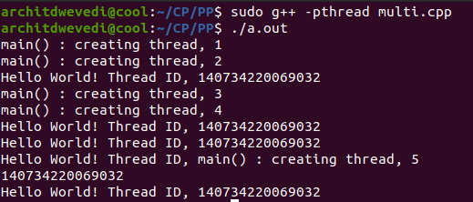
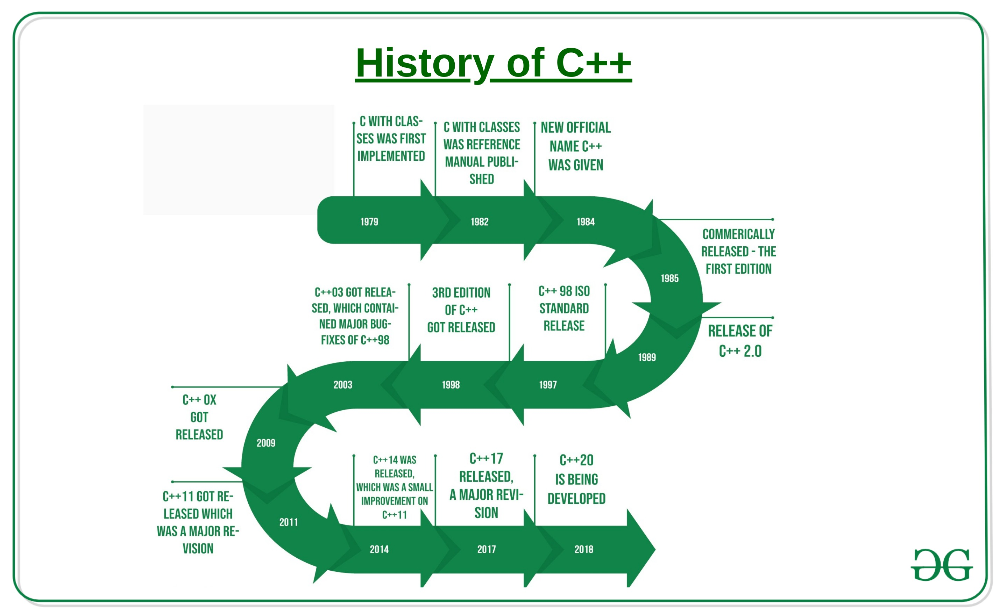
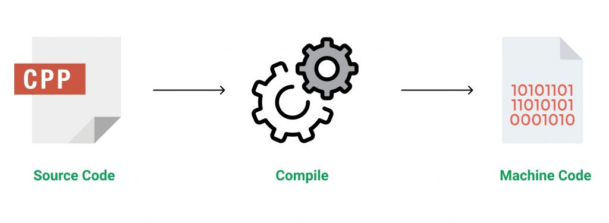
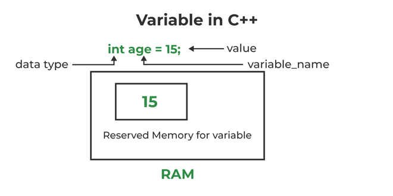
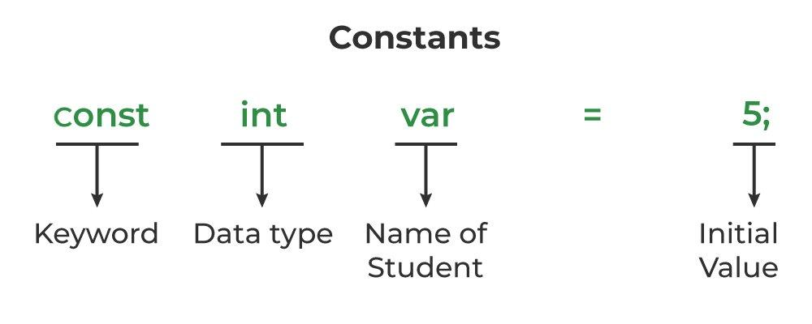

[TOC]

<!--more-->

## 介绍

### 特点

C++面向对象，命令式和编译式语言

**关键特性**

- 支持多种范式（**过程式、面向对象式、泛型编程**）

  - Templates：适用于任何数据类型的通用代码，实现代码的重用
  - STL：基于Templates，标准模版库

- 中级语言，用于系统和应用编程（versatile programming language应用广泛的）：

  - 支持指针，支持低级、系统级编程，适合开发OS、设备驱动程序和其他系统软件
  - 支持构建大型用户应用程序（媒体播放器、PS、游戏引擎）
    - 库函数众多（桌面应用、视频、游戏等），包括第三方库

- 异常处理：

- 强类型系统

- 执行速度快，C++是编译型语言，转换为机器码执行，且其他语言有额外内置默认功能（垃圾收集、动态类型等）

- 动态内存管理：`new`运行时分配变量或数组的内存（Java，Python并非如此）

  程序执行时，变量被分配到动态堆空间

  函数内部，变量被分配到堆栈空间

  动态分配的内存不再使用后必须 **手动取消分配** `delete`

- 跨平台兼容：C++可执行文件不独立于平台，但独立于机器

  代码在任何机器上都可识别，但一个平台编译完成的C++可执行文件，不能在不同平台执行

- 支持多线程

  - 多任务处理：同时执行两个或多个程序的功能

    处理程序的并发执行

  - 分为基于进程或线程的多任务处理

    处理等效程序各部分的多道编程，程序的每个部分称为一个线程，每个线程对应一个单独的执行路径

  - 从C++11开始，标准库提供跨平台的多线程支持，`std::thread`

---

`auto` 关键字

```cpp
// C++ program to demonstrate
// working of auto keyword

#include <bits/stdc++.h>
using namespace std;

// Driver Code
int main()
{

    // Variables
    auto an_int = 26;
    auto a_bool = false;
    auto a_float = 26.24;
    auto ptr = &a_float;

    // Print typeid
    cout << typeid(a_bool).name() << "\n";
  	cout << typeid(a_float).name() << "\n";
    cout << typeid(an_int).name() << "\n";
    return 0;
}

b
d
i
```

---

**动态分配内存**

```cpp
// C++ Program to implement
// the Memory Management

#include <cstring>
#include <iostream>
using namespace std;

int main() {
    int num = 5;
    float* ptr;

    // Memory allocation of
    // num number of floats
    ptr = new float[num];

    for (int i = 0; i < num; ++i)
        *(ptr + i) = i;
    
    cout << "Display the GPA of students:" << endl;
    for (int i = 0; i < num; ++i) 
        cout << "Student" << i + 1 << ": " << *(ptr + i) << endl;

    // Ptr memory is released
    delete[] ptr;

    return 0;
}
```

---

**多线程框架**

```cpp
#include <cstdlib>
#include <iostream>
#include <pthread.h>

using namespace std;

#define NUM_THREADS 5

// Function to print Hello with the thread id
void* PrintHello(void* threadid){
    // Thread ID
    long tid;
    tid = (long)threadid;

    // Print the thread ID
    cout << "Hello World! Thread ID, "
         << tid << endl;

    pthread_exit(NULL);
}

int main(){
    pthread_t threads[NUM_THREADS];
    int rc;
    int i;

    for (i = 0; i < NUM_THREADS; i++) {
        cout << "main() : creating thread, " << i << endl;

        rc = pthread_create(&threads[i], NULL, PrintHello, (void*)&i);

        // If thread is not created
        if (rc) {
            cout << "Error:unable to" << " create thread, "
                 << rc << endl;

            exit(-1);
        }
    }

    pthread_exit(NULL);
}
```



- 可见，多线程间乱序执行，并不是按顺序将一个线程相关的所有代码执行完成

### 与C对比

C++是C的超集，添加了面向对象、异常、模版和STL标准库

|        Aspect         |                              C                               |                             C++                              |
| :-------------------: | :----------------------------------------------------------: | :----------------------------------------------------------: |
|       Developer       | Dennis Ritchie between the year 1969 and 1973 at AT&T Bell Labs. |                  Bjarne Stroustrup in 1979.                  |
|     OOPs Support      |                            不支持                            |                     支持多态、封装和继承                     |
|      关键字数量       |     – C90: 32<br/>– C99: 37<br/>– C11: 44<br/>– C23: 59      | – C++98: 63<br/>– C++11: 73<br/>– C++17: 73<br/>– C++20: 81  |
|       编程范式        |                         支持面向过程                         |                      面向过程+面向对象                       |
|         封装          |                        数据与程序分离                        |                   数据和程序以对象形式封装                   |
|       数据隐藏        |                            不支持                            |                        数据被封装隐藏                        |
|       语言焦点        |                         函数驱动语言                         |                         对象驱动语言                         |
|         重载          |                            不支持                            |                     支持函数与运算符重载                     |
|      结构内函数       |                    C中函数未在结构内定义                     |                     函数可在结构内部使用                     |
|       命名空间        |                            不支持                            |                      支持，避免名称冲突                      |
|        标准IO         |          标准IO头是stdio.h ，使用scanf()和 printf()          |      标准IO头是 iostream.h，使用cin和cout用于输入/输出       |
|       引用变量        |                            不支持                            |                             支持                             |
|        虚函数         |                            不支持                            |                     支持虚函数和友元函数                     |
|         继承          |                            不支持                            |                             支持                             |
|       动态内存        | 提供malloc()函数和calloc()函数用于动态内存分配，free()函数用于动态内存释放 | 提供 new 操作符用于动态内存分配C++、delete操作符用于内存释放 |
|       异常处理        |                            不支持                            |                             支持                             |
|      访问修饰符       |                            不支持                            |                             支持                             |
|       类型检查        |                     不执行严格的类型检查                     |                     进行严格的内存检查。                     |
| 使用Union进行类型双关 |               允许使用联合体进行类双关（C99）                |                          通常不允许                          |
|      命名初始化       |                   名名初始化器可能出现无序                   |           命名初始化器必须与结构体的数据布局向匹配           |
|        扩展名         |                             `.c`                             |               `.cpp` ，`.c++`， `.cc` ，`.cxx`               |
|        元编程         |                使用宏和 _Generic() 进行元编程                |        使用模板进行元编程（仍然支持宏，但不鼓励使用）        |

### 历史

https://www.geeksforgeeks.org/history-of-c/?ref=next_article



|          Version           |  Release Date  |                        Major changes                         |
| :------------------------: | :------------: | :----------------------------------------------------------: |
| C++98 (ISO/IEC 14882:1998) |  October 1998  |                      The first version                       |
| C++03 (ISO/IEC 14882:2003) | February 2003  |            Introduction of value initialization.             |
|           C++11            |  August 2011   | lambda表达式、委托构造函数、同一初始化语法、nullptr、自动类型推断和decltype、右值引用 |
|           C++14            |  August 2014   | 多态lambda、数字分隔符、广义lambda捕获、变量模版、二进制整数文字、带引号的字符串 |
|           C++17            | December 2017  | 介绍折叠表达式、十六进制浮点文字、u8字符文字、带初始化程序的选择语句、内联变量 |
|           C++20            |   March2020    |  检查程序实体，如：变量、枚举、类及其成员、lambda及其捕获等  |
|           C++23            | Future Release |         The next major revision of the C++ standard          |

## 环境

需要安装——编译器

IDE——集成开发环境（软件应用程序），便于软件开发

实质上由两类软件组成

- 文本编辑器
- 编译器

### 文本编辑器

C++程序的文件扩展名为 `.cpp` 或 `.c` ——源代码文件

codeblock、vscode

### 编译器

源码转为机器码

**在linux上安装gnu GCC**

更新源并安装下载gcc、g++

```shell
sudo apt-get update
sudo apt-get install gcc
sudo apt-get install g++
```

安装C++程序所依赖的所有库

```cpp
sudo apt-get install build-essential
```

检查是否正确安装了GCC编译器

```shell
g++ --version
```

**如何使用GCC编译器编译和运行C++程序**

在终端编译文件

```shell
g++ filename.cpp -o any-name
```

- `-o` 表示可执行文件名

  ```shell
  g++ helloworld.cpp -o hello
  
  ./hello
  ```



编译过程：

| 阶段        | 处理内容                                                     | 输出                               |
| ----------- | ------------------------------------------------------------ | ---------------------------------- |
| 预处理(cpp) | 宏替换，**文本替换**<br />头文件替换，将头文件内容插入到源文件<br />条件编译，决定代码块是否保留 | `.i` 文件                          |
| 编译(g++)   | **语法**分析，检查变量声明、类型匹配、作用域等<br />const**常量**优化，直接将其替换为值<br />constexpr，强制在编译时求值，并替换<br />**模版**实例化，生成具体类型的代码<br />**内联函数**展开，替换为函数体 | `.s` 文件                          |
| 汇编        | 将汇编码转为机器码，<br />**变量和函数被标记**为符号，地址暂时未分配 | 二进制目标文件<br />`.o` 或 `.obj` |
| 链接        | 合并多个目标文件，解析变量和函数的引用<br />地址分配，为全局变量、静态变量等分配最终内存地址<br />移除未使用代码（如未引用的常量） | 可执行文件`.exe`                   |

## 源程序

### 基于过程的程序基本框架

```cpp
// 头文件库
#include <iostream>

//标准命名空间
using namespace std;

//主函数
int main() {
    // 函数体
    
    // 变量声明
    int num1 = 24;
    int num2 = 34;

    int result = num1 + num2;
    
    //输出
    cout << result << endl;

    //返回
    return 0;
}
```

#### 头文件

在程序中使用的**库函数**和**宏定义**

`#include` ：**预处理器**指令，将文件的内容导入到源代码中

- `#include<iostream>` 导入C++的IO库，该IO库包含C++的所有输入/输出库函数

`#define`：宏指令，在预处理阶段替换

#### 命名空间

`using namespace std` ：将std命名空间的实例导入到程序当前的命名空间

#### 主函数

程序的执行总是从主函数开始。所有其他函数都从主函数调用。主函数需要返回一些指示执行状态的值。

#### 代码块

`{}` 部分

#### 分号

每个语句后都有一个 `;` 用于终止程序的每一行语句

#### 标识符

标识符——变量名、函数名、自定义数据类型名

[字母、下划线开头] [字母、数字、下划线]

#### 保留字

不可作为标识符

### 基于面向对象的程序框架

```cpp
#include <iostream>
using namespace std;

class Calculate {
    // Access Modifiers
public:
    // data member
    int num1 = 50;
    int num2 = 30;

    // member function
    void addition() {
        int result = num1 + num2;
        cout << result << endl;
    }
};

int main() {
    // object declaration
    Calculate add;
    
    // member function calling
    add.addition();

    return 0;
}
```

#### 类

用户定义的数据类型，

类有自己的属性（数据成员）和行为（成员函数）

#### 成员

属性/数据由数据成员定义

对数据成员的操作函数为成员函数

#### 对象

类本身只是模版，并没有分配任何内存

对象是实例，可以使用类中定义的数据与方法

### 注释

```cpp
//单行注释
/*
 多行注释
 */

/*
 *
 */
```

‘ctrl + /’


### 变量

#### 变量声明

##### 引用性声明

声明外部变量，不会为变量分配内存

##### 定义性声明

```shell
# 变量定义
type name;
# 支持同类型变量 连续命名
type name1, name2, name3 ….;
```

**变量是赋予一段内存位置的名称**

- 起始位置：变量名指针
- 长度：变量类型指定

程序中存储的基本单元。变量中存储的值可以在程序执行期间被访问和修改

简单变量类型

- int
- float
- char
- bool
- string

变量命名规则

- 元素：字母、数字、下划线；但需要以字母或下划线开头
- 区分大小写
- 不能有空格和特殊符号
- 不能使用 keywords

#### 变量初始化与赋值

使用 `=` 操作符，在程序的任意位置对变量**赋值**

```cpp
type name = value;      // 在声明时初始化
name = value;      // 在声明后初始化
type name1 = value1, name2 = value2;      // 多变量赋值
```

值应与声明的变量类型相同

**在变量声明时就赋值，称为初始化**

#### 变量的内存管理

引用性变量声明，编译器仅获知变量名及存储的数据类型，并不分配内存

定义性变量声明，分配内存。分配的内存量取决于变量要存储的数据类型



- 定义性声明时，全局变量默认初始化为0，局部变量初始化为垃圾值
- 在初始化时，使用赋值运算符赋予有意义的值，将该值存储在分配给该变量的内存空间

#### 常量

常量在程序执行期间，仅可读取值，不能常量值

- 支持各种类型，如：整数、浮点数、字符串或字符常量

关键字 `const`

```cpp
const data_type var_name = value;
```



##### 特点

###### 仅在声明时初始化

采用定义性声明对常量初始化，不初始化则使用之前存储在同一内存位置的垃圾值

###### 不变性

常量初始化完成后，便不能修改值

若后续有修改语句，报语法错误

```cpp
#include <stdio.h>
int main() {
    // Declaring a constant variable
    const int a;
  
    // Initializing constant variable var after declaration
    a = 20;
    printf("%d", a);
    return 0;
}

// In function 'main':
// 10:9: error: assignment of read-only variable 'a'
// 10 |     a = 20;
//      |      ^
```

###### 宏定义也可定义常量

`#define` 可用于定义不需要数据类型的符号常量，在**编译**时由其值替换

```cpp
#define CONSTANT_NAME value
#include <stdio.h>
#define PI 3.14

int main() {
    printf("%.2f", PI);  
    return 0;
}

// 3.14
```

##### 常量与字面量区别

|            常量            |            字面量            |
| :------------------------: | :--------------------------: |
|          属于变量          |    可用于变量赋值的固定值    |
|       `const` 关键字       |                              |
| 可以确定常量在内存中的地址 | 无法确定字符串外的字面量地址 |
|            左值            |             右值             |
|     `const int c = 20`     |    24,15.5, ‘a’, “Geeks”     |

##### const定义的常量与宏定义的常量的区别

|   Constants using const    | Constants using #define |
| :------------------------: | :---------------------: |
|       是不可变的变量       |     被其值替换的宏      |
|        由编译器处理        |     由预处理器处理      |
| `const type name = value;` |  `#define name value`   |

#### 变量作用域

