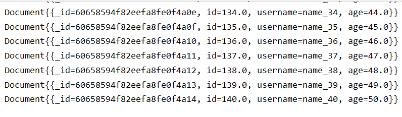
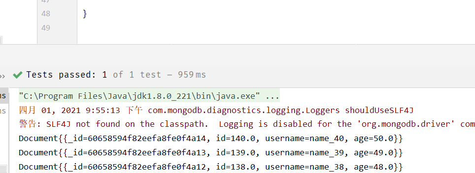
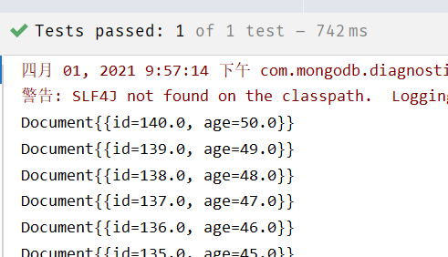
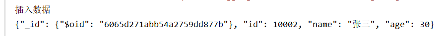
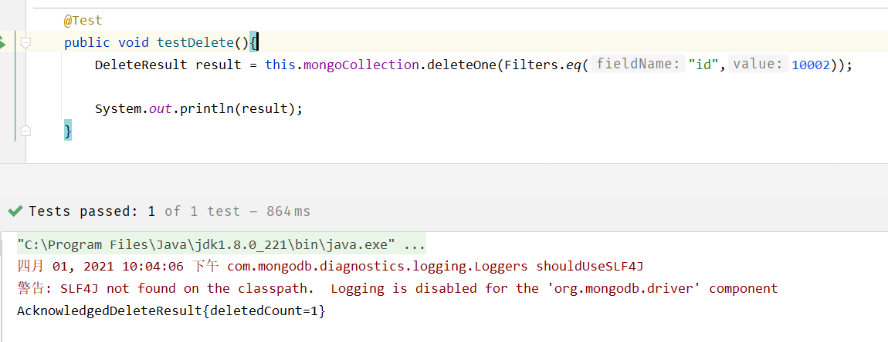
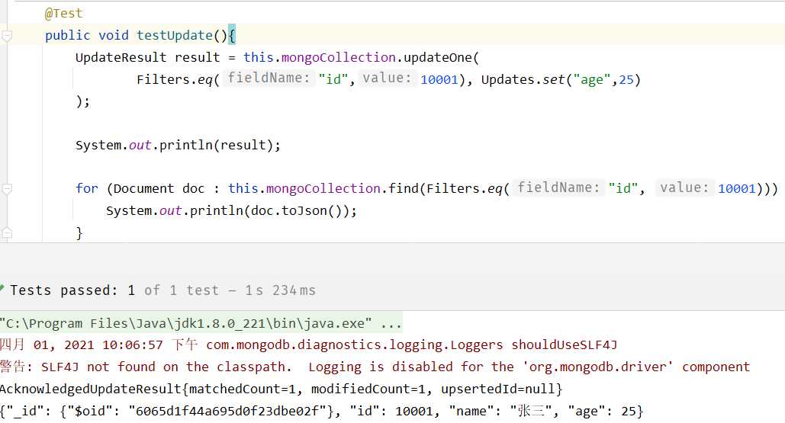
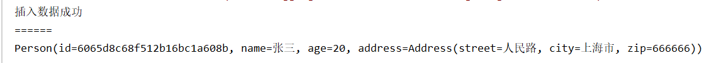
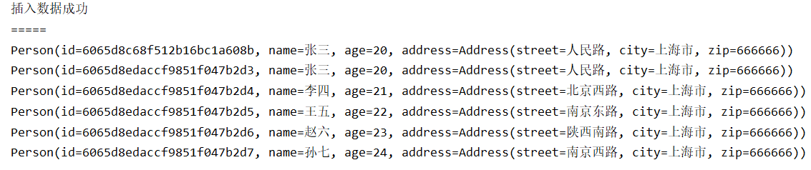
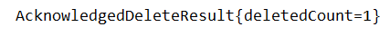

MongoDB是一个基于分布式（海量数据存储）**文件存储**的数据库。

MongoDB是一个介于关系数据库和非关系数据库之间的产品，是**非关系数据库**当中功能最丰富，最像关系数据库的，它支持的数据结构非常松散，是类似json的bson格式，因此可以存储比较复杂的数据类型。  

实现类似关系数据库单表查询的绝大部分功能，而且还支持对数据建立索引。

官网：https://www.mongodb.com/

---

MongoDB

-   简介
-   基本使用
-   JavaAPI
-   SpringBoot整合

<!--more-->

# MongoDB

## 基本概念

| SQL术语     | MongoDB术语 | 解释/说明                           |
| ----------- | ----------- | ----------------------------------- |
| database    | database    | 数据库                              |
| table       | collection  | 数据库表/集合                       |
| row         | document    | 数据记录行/文档                     |
| column      | field       | 数据字段/域                         |
| index       | index       | 索引                                |
| table joins |             | 表连接,MongoDB不支持                |
| primary key | primary key | 主键,MongoDB自动将_id字段设置为主键 |

## 命令行操作

### docker安装MongoDB

```shell
#拉取镜像
docker pull mongo

#创建容器
docker create --name mongodb -p 27017:27017 -v /data/mongodb-data:/data/db mongo

#启动容器
docker start mongodb

#进入容器
docker exec -it mongodb /bin/bash
#使用MongoDB客户端进行操作
mongo

#查询所有的数据库
show dbs
```

### 表操作

```shell
#查看所有的数据库
> show dbs
admin 0.000GB
config 0.000GB
local 0.000GB

#通过use关键字切换数据库
> use admin
switched to db admin

#创建数据库
#说明：在MongoDB中，数据库是自动创建的，通过use切换到新数据库中，进行插入数据即可自动创建数据库
> use testdb #并没有创建数据库
switched to db testdb
> show dbs 
admin 0.000GB
config 0.000GB
local 0.000GB

> db.user.insert({id:1,name:'zhangsan'}) #插入数据
WriteResult({ "nInserted" : 1 })
> show dbs
admin 0.000GB
config 0.000GB
local 0.000GB
testdb 0.000GB #数据库自动创建

#查看表
> show tables
user
> show collections
user

#删除集合（表）
> db.user.drop()
true #如果成功删除选定集合，则 drop() 方法返回 true，否则返回 false。

#删除数据库
> use testdb #先切换到要删除的数据中
switched to db testdb

> db.dropDatabase() #删除数据库
{ "dropped" : "testdb", "ok" : 1 }
> show dbs
admin 0.000GB
config 0.000GB
local 0.000G
```

### 新增数据

在MongoDB中，存储的文档结构是一种类似于json的结构，称之为bson（全称为：Binary JSON）

> 语法：db.COLLECTION_NAME.insert(document)  

```shell
> db.user.insert({id:1,username:'zhangsan',age:20})
WriteResult({ "nInserted" : 1 })
> db.user.save({id:2,username:'lisi',age:25})
WriteResult({ "nInserted" : 1 })

> db.user.find() #查询数据
{ "_id" : ObjectId("5c08c0024b318926e0c1f6dc"), "id" : 1, "username" : "zhangsan",
"age" : 20 }
{ "_id" : ObjectId("5c08c0134b318926e0c1f6dd"), "id" : 2, "username" : "lisi",
"age" : 25 }
```

### 查询数据

>   db.user.find([query],[fields])

query ：可选，使用查询操作符指定查询条件
fields ：可选，使用投影操作符指定返回的键。查询时返回文档中所有键值， 只需省略该参数即可（默认省略）

> db.col.find().pretty()  以格式化的方式来显示所有文档

| 含义        | 格式                       | 范例                                        |
| ----------- | -------------------------- | ------------------------------------------- |
| 等于        | `{\<key>:\<value> }`       | db.col.find({"by":"黑马程序员"}).pretty()   |
| 小于        | `{<key>:{$lt: <value>}}  ` | db.col.find({"likes": {\$lt:50}}).pretty()  |
| 小于或 等于 | `{<key>:{$lte: <value>}} ` | db.col.find({"likes": {\$lte:50}}).pretty() |
| 大于        | `{<key>:{$gt: <value>}}`   | db.col.find({"likes": {\$gt:50}}).pretty()  |
| 大于或 等于 | `{<key>:{$gte: <value>}}`  | db.col.find({"likes": {\$gte:50}}).pretty() |
| 不等于      | `{<key>:{$ne: <value>}}`   | db.col.find({"likes": {\$ne:50}}).pretty()  |

```shell
#查询全部数据
db.user.find() 

#只查询id与username字段
db.user.find({},{id:1,username:1})

#查询数据条数
db.user.find().count() 

#查询id为1的数据
db.user.find({id:1}) 

#查询小于等于21的数据
db.user.find({age:{$lte:21}})

#and查询，age小于等于21并且id大于等于2
db.user.find({age:{$lte:21}, id:{$gte:2}})

#查询id=1 or id=2
db.user.find({$or:[{id:1},{id:2}]}) 

#分页查询：Skip()跳过几条，limit()查询条数
db.user.find().limit(2).skip(1) #跳过1条数据，查询2条数据

db.user.find().sort({id:-1}) #按照age倒序排序，-1为倒序，1为正序
```

### 更新数据

update() 方法用于更新已存在的文档

```shell
db.collection.update(
	<query>,
	<update>,
	[
		upsert: <boolean>,
		multi: <boolean>,
		writeConcern: <document>
	]
)  
```

-   query : update的查询条件
-   update : update的对象和一些更新的操作符（如 inc...）等，
-   upsert : 可选，这个参数的意思是，如果不存在update的记录，是否插入objNew,true为插入，默认是false，不插入。
-   multi : 可选，mongodb 默认是false,只更新找到的第一条记录，如果这个参数为true,就把按条件查出来多条
    记录全部更新。
-   writeConcern :可选，抛出异常的级别  

```shell
> db.user.update({id:1},{$set:{age:22}}) #更新数据
WriteResult({ "nMatched" : 1, "nUpserted" : 0, "nModified" : 1 })
WriteResult({ "nMatched" : 1, "nUpserted" : 0, "nModified" : 1 })
```

-   nMatched：数据匹配数量
-   nUpserted：匹配不存在时更新数量
-   nModified：修改数量

```shell
#注意：如果这样写，会删除掉其他的字段
> db.user.update({id:1},{age:25})
WriteResult({ "nMatched" : 1, "nUpserted" : 0, "nModified" : 1 })

> db.user.find()
{ "_id" : ObjectId("5c08c0024b318926e0c1f6dc"), "age" : 25 }
{ "_id" : ObjectId("5c08c0134b318926e0c1f6dd"), "id" : 2, "username" : "lisi",
"age" : 25 }
```

```shell
#更新不存在的字段，会新增字段
> db.user.update({id:2},{$set:{sex:1}}) #更新数据
> db.user.find()
{ "_id" : ObjectId("5c08c0024b318926e0c1f6dc"), "age" : 25 }
{ "_id" : ObjectId("5c08c0134b318926e0c1f6dd"), "id" : 2, "username" : "lisi",
"age" : 25, "sex" : 1 }
```

```shell
#更新不存在的数据，默认不会新增数据
> db.user.update({id:3},{$set:{sex:1}})
WriteResult({ "nMatched" : 0, "nUpserted" : 0, "nModified" : 0 })

> db.user.find()
{ "_id" : ObjectId("5c08c0024b318926e0c1f6dc"), "age" : 25 }
{ "_id" : ObjectId("5c08c0134b318926e0c1f6dd"), "id" : 2, "username" : "lisi",
"age" : 25, "sex" : 1 }

#如果设置第一个参数为true，就是新增数据
> db.user.update({id:3},{$set:{sex:1}},true)
WriteResult({
"nMatched" : 0,
"nUpserted" : 1,
"nModified" : 0,
"_id" : ObjectId("5c08cb281418d073246bc642")
})
```

### 删除数据

```
db.collection.remove(
	<query>,
	{
		justOne: <boolean>,
		writeConcern: <document>
	}
)  
```

-   query :（可选）删除的文档的条件。
-   justOne : （可选）如果设为 true 或 1，则只删除一个文档，如果不设置该参数，或使用默认值 false，则删除所有匹配条件的文档。
-   writeConcern :（可选）抛出异常的级别。  

```shell
> db.user.remove({age:25})
WriteResult({ "nRemoved" : 2 }) #删除了2条数据

#插入4条测试数据
db.user.insert({id:1,username:'zhangsan',age:20})
db.user.insert({id:2,username:'lisi',age:21})
db.user.insert({id:3,username:'wangwu',age:22})
db.user.insert({id:4,username:'zhaoliu',age:22})

> db.user.remove({age:22},true)
WriteResult({ "nRemoved" : 1 }) #删除了1条数据

#删除所有数据
> db.user.remove({})
```

```shell
#说明：为了简化操作，官方推荐使用deleteOne()与deleteMany()进行删除数据操作。
db.user.deleteOne({id:1})
db.user.deleteMany({}) #删除所有数据
```

### 索引

MongoDB在读取数据时必须扫描集合中的每个文件并选取
那些符合查询条件的记录。这种扫描全集合的查询效率是非常低的，特别在处理大量的数据时，查询可以要花费几十秒甚至几分钟，这对网站的性能是非常致命的。  

索引是特殊的数据结构，索引存储在一个易于遍历读取的数据集合中，索引是对数据库表中一列或多列的值进行排序的一种结构  ，索引通常能够极大的提高查询的效率  

#### 查看索引

```shell
#查看索引
> db.user.getIndexes()
[
    {
        "v" : 2,#索引版本
        "key" : {#索引字段
        	"_id" : 1 #正序还是倒序
    	},
    	"name" : "_id_",#索引名
    	"ns" : "testdb.user" #命名空间
    }
]
#说明：1表示升序创建索引，-1表示降序创建索引
```

#### 创建索引

```shell
#创建索引
> db.user.createIndex({'age':1})
{
    "createdCollectionAutomatically" : false,
    "numIndexesBefore" : 1,
    "numIndexesAfter" : 2,
    "ok" : 1
}
```

#### 删除索引

```shell
#删除索引
db.user.dropIndex("age_1")
#或者，删除除了_id之外的索引
db.user.dropIndexes()
```

#### 创建联合索引

```shell
#创建联合索引
db.user.createIndex({'age':1, 'id':-1})
```

#### 查看索引大小

```shell
#查看索引大小，单位：字节
db.user.totalIndexSize()
```

### 执行详情

MongoDB 查询分析可以确保我们建议的索引是否有效，是查询语句性能分析的重要工具 

MongoDB内部使用的是JS引擎，编写JS脚本执行循环语句

```js
#插入1000条数据
for(var i=1;i<1000;i++)
	db.users.insert({id:100+i,username:'name_'+i,age:10+i})
```

```shell
#查看执行计划
> db.user.find({age:{$gt:100},id:{$lt:200}}).explain()
    {
    "queryPlanner" : {
        "plannerVersion" : 1,
        "namespace" : "testdb.user",
        "indexFilterSet" : false,
        "parsedQuery" : {
            "$and" : [
                {
                    "id" : {
                        "$lt" : 200
                    }
                },
                {
                    "age" : {
                        "$gt" : 100
                    }
                }
        	]
    	},
    	"winningPlan" : { #最佳执行计划
        	"stage" : "FETCH", #查询方式，
#COLLSCAN/全表扫描 < IXSCAN/索引扫描 < FETCH/根据索引去检索文档 < SHARD_MERGE/合并分片结果 < IDHACK/针对_id进行查询
        	"inputStage" : {
            	"stage" : "IXSCAN",
            	"keyPattern" : {
                    "age" : 1,
                    "id" : -1
            	},
            	"indexName" : "age_1_id_-1",
            	"isMultiKey" : false,
            	"multiKeyPaths" : {
                    "age" : [ ],
                    "id" : [ ]
                },
                "isUnique" : false,
                "isSparse" : false,
                "isPartial" : false,
                "indexVersion" : 2,
                "direction" : "forward",
                "indexBounds" : {
                    "age" : [
                        "(100.0, inf.0]"
                    ],
                    "id" : [
                        "(200.0, -inf.0]"
                    ]
                }
        	}
    	},
		"rejectedPlans" : [ ]
    },
    
    "serverInfo" : {
        "host" : "c493d5ff750a",
        "port" : 27017,
        "version" : "4.0.3",
        "gitVersion" : "7ea530946fa7880364d88c8d8b6026bbc9ffa48c"
    },
	"ok" : 1
}
```

### GUI——robo 3T

## 通过javaApi操作

### 创建工程

com-mongodb

com-mongodb

`pom.xml`

```xml
<dependencies>
    <dependency>
        <groupId>org.mongodb</groupId>
        <artifactId>mongodb-driver-sync</artifactId>
        <version>3.9.1</version>
    </dependency>
    
    <dependency>
        <groupId>junit</groupId>
        <artifactId>junit</artifactId>
        <version>4.12</version>
        <scope>test</scope>
    </dependency>
    <dependency>
    	<groupId>org.projectlombok</groupId>
        <artifactId>lombok</artifactId>
    	<version>1.18.4</version>
    </dependency>
</dependencies>

<build>
    <plugins>
    	<!-- java编译插件 -->
        <plugin>
            <groupId>org.apache.maven.plugins</groupId>
            <artifactId>maven-compiler-plugin</artifactId>
            <version>3.2</version>
            <configuration>
                <source>1.8</source>
                <target>1.8</target>
                <encoding>UTF-8</encoding>
            </configuration>
        </plugin>
    </plugins>
</build>
```

### Demo

如何连接到MongoDB，如何选择数据库、表，进行查询的操作 

```java
package com.mongodb;

import com.mongodb.client.MongoClient;
import com.mongodb.client.MongoClients;
import com.mongodb.client.MongoCollection;
import com.mongodb.client.MongoDatabase;
import org.bson.Document;

public class MongodbDemo {

    public static void main(String[] args) {
        //建立连接
        MongoClient mongoClient = MongoClients.create("mongodb://8.140.130.91:27017");

        //选择数据库
        MongoDatabase mongoDatabase = mongoClient.getDatabase("testdb");

        //选择表
        MongoCollection<Document> userCollection = mongoDatabase.getCollection("user");

        //查询表
        for (Document document : userCollection.find().limit(10)) {
            System.out.println(document.toJson());
        }

        mongoClient.close();
    }
}
```

### CRUD操作

#### 初始化建立连接

```java
package com.mongodb;

import com.mongodb.client.MongoClient;
import com.mongodb.client.MongoClients;
import com.mongodb.client.MongoCollection;
import com.mongodb.client.MongoDatabase;
import com.mongodb.client.model.Filters;
import org.bson.Document;
import org.junit.Before;
import org.junit.Test;

public class TestCRUD {

    private MongoCollection<Document> mongoCollection;

    @Before
    public void init(){
        //建立连接
        MongoClient mongoClient = MongoClients.create("mongodb://8.140.130.91:27017");

        //选择数据库
        MongoDatabase mongoDatabase = mongoClient.getDatabase("testdb");

        //选择表
        this.mongoCollection = mongoDatabase.getCollection("users");
    }
}
```

#### 查询

-   组合查询

```java
// 复杂查询age<=50并且id>=100的用户信息，并且按照id倒序排序，只返回id，age字段，不返回_id字段
@Test
public void testQuery(){
    for (Document document : 
         this.mongoCollection.find(
            Filters.and(
                    Filters.lte("age",50),
                    Filters.gte("id",100)
            )
    	 )
    ) {
        System.out.println(document);
    }
}
```



-   排序

```java
// 复杂查询age<=50并且id>=100的用户信息，并且按照id倒序排序，只返回id，age字段，不返回_id字段
@Test
public void testQuery(){
    for (Document document : 
        this.mongoCollection.find(
            Filters.and(
                Filters.lte("age",50),
                Filters.gte("id",100)
         	)
    	).sort(Sorts.descending("id"))//降序
    ) {
        System.out.println(document);
    }
}
```



-   指定属性

```java
// 复杂查询age<=50并且id>=100的用户信息，并且按照id倒序排序，只返回id，age字段，不返回_id字段
@Test
public void testQuery(){
    for (Document document : this.mongoCollection.find(
        Filters.and(
            Filters.lte("age",50),
            Filters.gte("id",100)
        )
    ).sort(Sorts.descending("id"))//降序
         .projection(
             Projections.fields(
                 Projections.include("id","age"),
                 Projections.excludeId()//排除ObjectID
             )
         )
        ) {
        System.out.println(document);
    }
}
```



#### 新增数据

```java
@Test
public void testInsert(){
    Document document = new Document("id",10002)
        .append("name", "张三")
        .append("age", 30);
    this.mongoCollection.insertOne(document);
    System.out.println("插入数据");

    for (Document document1 : this.mongoCollection.find(Filters.eq("id",10002))) {
        System.out.println(document1.toJson());
    }
}
```



#### 测试删除

```java
@Test
public void testDelete(){
    DeleteResult result = this.mongoCollection.deleteOne(Filters.eq("id",10002));

    System.out.println(result);
}
```



#### 测试更新

```java
@Test
public void testUpdate(){
    UpdateResult result = this.mongoCollection.updateOne(
        Filters.eq("id",10001), Updates.set("age",25)
    );

    System.out.println(result);

    for (Document doc : this.mongoCollection.find(Filters.eq("id", 10001))) {
        System.out.println(doc.toJson());
    }
}
```



### 面向对象操作

前面对MongoDB的操作都是基于Document对象操作，操作略显繁琐 

创建Person、Address

```java
@Data
@AllArgsConstructor
@NoArgsConstructor
public class Person {
    private ObjectId id;
    private String name;
    private int age;
    private Address address;
}
```

```java
@Data
@AllArgsConstructor
@NoArgsConstructor
public class Address {
    private String street;
    private String city;
    private String zip;
}
```

#### 建立连接

```java
MongoCollection<Person> personCollection;

@Before
public void init(){
    //定义对象的解码注册器
    CodecRegistry pojoCodecRegistry = CodecRegistries.fromRegistries(
        MongoClientSettings.getDefaultCodecRegistry(),
        CodecRegistries.fromProviders(PojoCodecProvider.builder().automatic(true).build())
    );

    //建立连接
    MongoClient mongoClient = MongoClients.create("mongodb://8.140.130.91:27017");

    //选择数据库 并且 注册解码器
    MongoDatabase mongoDatabase = mongoClient.getDatabase("testdb").withCodecRegistry(pojoCodecRegistry);
    //选择表
    this.personCollection = mongoDatabase.getCollection("person",Person.class);
}
```

#### 新增一条数据

```java
@Test
public void testInsert(){
    Person person = new Person(ObjectId.get(), "张三", 20,new Address("人民路", "上海市", "666666"));

    this.personCollection.insertOne(person);
    System.out.println("插入数据成功");

    System.out.println("======");
    for (Person person1 : this.personCollection.find(Filters.eq("name", "张三"))) {
        System.out.println(person1);
    }
}
```



#### 新增很多数据

```java
@Test
public void testInserts() {
    List<Person> personList = Arrays.asList(
        new Person(ObjectId.get(), "张三", 20, new Address("人民路", "上海市", "666666")),
        new Person(ObjectId.get(), "李四", 21, new Address("北京西路", "上海市", "666666")),
        new Person(ObjectId.get(), "王五", 22, new Address("南京东路", "上海市", "666666")),
        new Person(ObjectId.get(), "赵六", 23, new Address("陕西南路", "上海市", "666666")),
        new Person(ObjectId.get(), "孙七", 24, new Address("南京西路", "上海市", "666666"))
    );

    this.personCollection.insertMany(personList);
    System.out.println("插入数据成功");

    System.out.println("=====");
    testQuery();
}
```



#### 删除单条数据

```java
@Test
public void testDelete(){
    DeleteResult result = this.personCollection.deleteOne(Filters.eq("name","张三"));
    System.out.println(result);
}
```



## SpringBoot整合MongoDB

spring-data对MongoDB做了支持，使用spring-data-mongodb可以简化MongoDB的操作

https://spring.io/projects/spring-data-mongodb

### 导入依赖

```xml
<parent>
    <groupId>org.springframework.boot</groupId>
    <artifactId>spring-boot-starter-parent</artifactId>
    <version>2.4.3</version>
</parent>

<dependency>
    <groupId>org.springframework.boot</groupId>
    <artifactId>spring-boot-starter-data-mongodb</artifactId>
</dependency>
<dependency>
    <groupId>org.springframework.boot</groupId>
    <artifactId>spring-boot-starter-test</artifactId>
    <scope>test</scope>
</dependency>
```

### 配置文件

```properties
# Spring boot application
spring.application.name = example-mongodb
spring.data.mongodb.uri=mongodb://8.140.130.91:27017/testdb
```

### PersonDao

```java
package com.mongodb.spring.dao;

import com.mongodb.client.result.DeleteResult;
import com.mongodb.client.result.UpdateResult;
import com.mongodb.pojo.Person;
import org.springframework.beans.factory.annotation.Autowired;
import org.springframework.data.mongodb.core.MongoTemplate;
import org.springframework.data.mongodb.core.query.Criteria;
import org.springframework.data.mongodb.core.query.Update;
import org.springframework.stereotype.Component;
import org.springframework.data.mongodb.core.query.Query;

import java.util.List;

@Component
public class PersonDao {

    @Autowired
    MongoTemplate mongoTemplate;

    public Person savePerson(Person person){
        //默认集合名与实体名同名
        Person savedPerson = this.mongoTemplate.save(person);
        return savedPerson;
    }

    public List<Person> queryPersonListByName(String name) {
        Query query = Query.query(Criteria.where("name").is(name));

        return this.mongoTemplate.find(query,Person.class);
    }


    /*
    * 分页查询
    * */
    public List<Person> queryPersonListByPage(Integer page, Integer rows) {
        Query query = new Query().limit(rows).skip((page - 1) * rows);
        return this.mongoTemplate.find(query, Person.class);
    }

    /*
    * 更新数据
    * */
    public UpdateResult update(Person person){
        Query query = Query.query(Criteria.where("id").is(person.getId()));

        Update update = Update.update("age",person.getAge());

        return this.mongoTemplate.updateMulti(query,update,Person.class);
    }

    /*
    * 删除数据
    * */
    public DeleteResult deleteResultById(String id){
        Query query = Query.query(Criteria.where("id").is(id));

        return this.mongoTemplate.remove(query,Person.class);
    }
}
```

### 编写启动类

```java
package com.mongodb.spring;

import org.springframework.boot.SpringApplication;
import org.springframework.boot.autoconfigure.SpringBootApplication;

@SpringBootApplication
public class MongoApplication {

    public static void main(String[] args) {
        SpringApplication.run(MongoApplication.class,args);
    }
}
```

### 测试单元

```java
package com.mongodb.spring;

import com.mongodb.client.result.UpdateResult;
import com.mongodb.spring.dao.PersonDao;
import com.mongodb.pojo.Address;
import com.mongodb.pojo.Person;
import org.bson.types.ObjectId;
import org.junit.Test;
import org.junit.runner.RunWith;
import org.springframework.beans.factory.annotation.Autowired;
import org.springframework.boot.test.context.SpringBootTest;
import org.springframework.test.context.junit4.SpringRunner;

import java.util.List;

@RunWith(SpringRunner.class)
@SpringBootTest
public class TestPersonDao {

    @Autowired
    private PersonDao personDao;

    /*
     * 新增
     * */
    @Test
    public void testSave(){
        Person person =new Person(ObjectId.get(), "张三", 20, new Address("人民路", "上海市", "666666"));
        System.out.println(this.personDao.savePerson(person));;
    }

    @Test
    public void testQuery() {
        List<Person> personList = this.personDao.queryPersonListByName("张三");
        for (Person person : personList) {
            System.out.println(person);
        }
    }

    @Test
    public void testQueryByPage(){
        List<Person> personList = this.personDao.queryPersonListByPage(1,3);

        for (Person person : personList) {
            System.out.println(person);
        }
    }

    @Test
    public void testUpdate() {
        Person person = new Person();
        person.setId(new ObjectId("60667404d8d68907198c10f3"));
        person.setAge(30);
        UpdateResult updateResult = this.personDao.update(person);

        System.out.println(updateResult);
    }

    @Test
    public void testDelete(){
        System.out.println(this.personDao.deleteResultById("6065d8edaccf9851f047b2d3"));
    }
}
```
