> 前置知识：[JavaScript&ES6](https://amostian.github.io/posts/2797554274/)

<!--more-->

# ReactJS

## 前端开发的四个阶段

### 1. 静态页面阶段

在第一个阶段中前端页面都是静态的，所有前端代码和前端数据都是后端生成的，前端纯粹只是增加一些特殊效果。

后端MVC模式

-   Model(模型层)：提供/保持数据
-   Controller(控制层)：数据处理，实现业务逻辑
-   View（视图层）：展示数据，提供用户界面

此时的前端只是后端MVC中的V

### 2. ajax阶段

2004年AJAX诞生，改变了前端开发。Gmail和Google地图这样革命性产品出现，使前端的作用不再是展示页面，还可以管理数据并与用户互动

### 3. 前端MV阶段

把MVC模式照搬到了前端，只有 M(读写数据)和V(展示数据)，没有C(处理数据)

有些框架提出 MVVM模式，用View Model代替Controller。Model拿到数据后，View Model将数据处理成视图层(View)需要的格式

### 4. SPA阶段

前端可以做到读写数据，切换视图，用户交互。网页其实是一个应用程序，而不是信息的纯展示。这种单张网页的应用程序称为SPA(Single Page Application)

2010年后，前端工程师从开发页面(切模板)，逐渐变成了开发“前端应用”，跑在浏览器里面的应用


目前，流行的前端框架 `Vue`,`React`都属于SPA开发框架

## ReactJS

### 简介

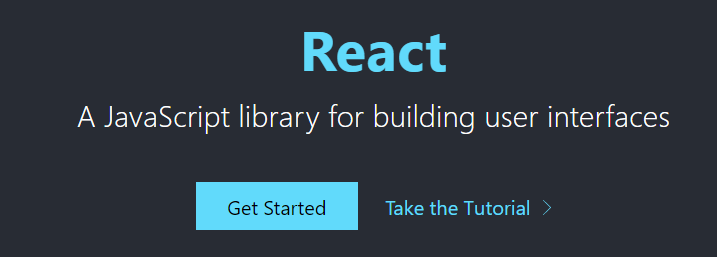

[官网](https://reactjs.org/)

>   **用于构建用户界面的JavaScript框架**，由Facebook开发
>
>   ReactJS把复杂的页面，拆分成一个个的组件，将这些组件拼装起来，就会呈现一个页面

ReactJS可用于MVC、MVVM等架构

### HelloWorld

#### 1. 新建static web项目


#### 2. 初始化项目,添加umi依赖

```shell
tyarn init -y
```


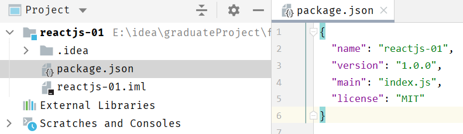

```shell
tyarn add umi --dev
```

#### 3.  编写HelloWorld程序

##### 在工程的根目录下新建`config/config.js`

在UmiJS的约定中，config/config.js将作为UmiJS的全局配置文件


在Umi中，约定的目录结构如下：

```
.
    ├── dist/                          // 默认的 build 输出目录
    ├── mock/                          // mock 文件所在目录，基于 express
    ├── config/
        ├── config.js                  // umi 配置，同 .umirc.js，二选一
    └── src/                           // 源码目录，可选
        ├── layouts/index.js           // 全局布局
        ├── pages/                     // 页面目录，里面的文件即路由
            ├── .umi/                  // dev 临时目录，需添加到 .gitignore
            ├── .umi-production/       // build 临时目录，会自动删除
            ├── document.ejs           // HTML 模板
            ├── 404.js                 // 404 页面
            ├── page1.js               // 页面 1，任意命名，导出 react 组件
            ├── page1.test.js          // 用例文件，umi test 会匹配所有 .test.js 和 .e2e.js 结尾的文件
            └── page2.js               // 页面 2，任意命名
        ├── global.css                 // 约定的全局样式文件，自动引入，也可以用 global.less
        ├── global.js                  // 可以在这里加入 polyfill
        ├── app.js                     // 运行时配置文件
    ├── .umirc.js                      // umi 配置，同 config/config.js，二选一
    ├── .env                           // 环境变量
    └── package.json
```

在config.js文件中输入，以便后面使用：

```js
//导出一个对象，暂时设置为空对象，后面再填充内容
export default{};
```

##### 创建HelloWorld.js页面文件

在Umi中，约定存放页面代码的文件夹在 `src/pages` ，可以通过 `singular:false`来设置单数的命名方式


在HelloWorld.js中输入如下内容：

```js
export default () => {
	return <div>hello world</div>;
}
```

##### 构建和部署

我们写的js，必须通过umi先转码后才能正常执行。

```shell
umi build
```

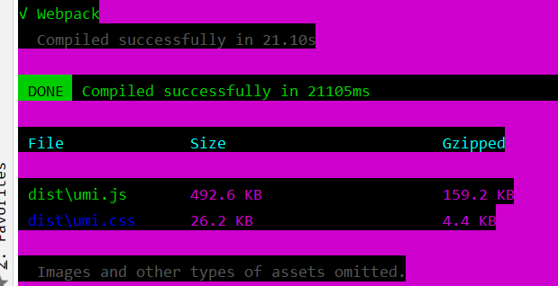

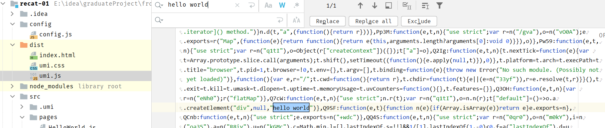

##### 启动服务，查看页面效果

```shell
# 启动服务
umi dev
```

可以看到，通过 `/HelloWorld` 即可访问到刚写的HelloWorld.js文件

在umi中，可以使用约定式的路由，将在pages下的JS文件都会按照文件名映射到一个路由

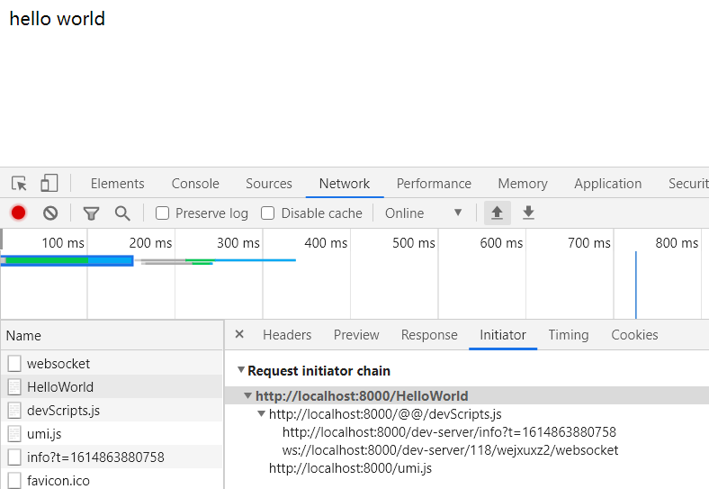

##### 添加 `umi-plugin-react` 插件

> umi-plugin-react插件是umi官方基于react封装的插件 

[链接](https://umijs.org/zh-CN/docs/upgrade-to-umi-3)

```shell
#添加插件
tyarn add @umijs/preset-react --dev
```


在config.js中引入该插件

```js
export default{
    dva: {},
    antd: {}
};
```

### JSX语法

JSX语法就是，可以在js文件中插入html片段，是React自创的一种语法 

JSX语法会被Babel等转码工具进行转码，得到正常的js代码再执行

**注意**

1. 所有的html标签必须是闭合的  

2. 在JSX语法中，只能有**一个根标签**，不能有多个

   ```jsx
   const div1 = <div><div>hello</div> <div>world</div></div>//正确
   const div2 = <div>hello</div> <div>world</div> //错误
   ```

3. 在JSX语法中，如果想要在html标签中插入js脚本，需要通过 `{}` 插入js脚本

   ```jsx
   export default()=>{
       const fun = () =>"黑马程序"
   
       return (
           <div><div>{fun()}</div> <div>hello world</div></div>
       );
   }
   ```

###  组件

#### 1. 自定义组件

```jsx
import React from "react";
//1. 导入React

class HelloWorld extends React.Component{
//2. 继承React.Component
    render(){//3. 重写render()方法，用于渲染页面
        return <div>Hello World</div>
    }
}

//4. 导出该类
export default HelloWorld;
```

#### 2. 导入自定义组件

```jsx
import React from "react";
import HelloWorld from "./HelloWorld";

class Show extends React.Component{
    render() {
        return (
            <div>
                <HelloWorld></HelloWorld>
            </div>
        );
    }
}

export default Show;
```

#### 组件参数

```jsx
import React from "react";
//1. 导入React

class HelloWorld extends React.Component{
//2. 继承React.Component
    render(){//3. 重写render()方法，用于渲染页面
        return (
            <div>
                <div>Hello World</div>
                <div>lastName={this.props.lastName}</div>
                <div>{this.props.children}</div>
            </div>
        );
    }
}

//4. 导出该类
export default HelloWorld;
```

```jsx
import React from "react";
import HelloWorld from "./HelloWorld";

class Show extends React.Component{
    render() {
        return (
            <div>
                <HelloWorld lastName={"Auspice"}>Tian</HelloWorld>
            </div>
        );
    }
}

export default Show;
```

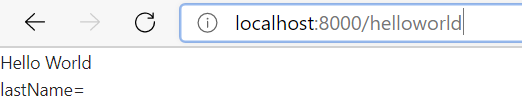

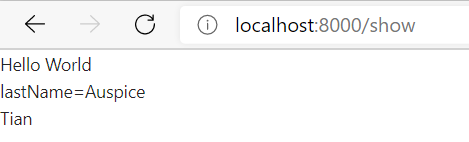

#### 组件的状态

每一个 **页面组件** 都有一个状态，其保存在 `this.state` 中，当状态值发生变化时，React框架会自动调用 `render()` 方法，重新渲染画面

**注意**

-   this.state值的设置要在构造参数中完成，不能直接对 `this.state` 修改
-   要修改this.state的值，需要调用 `this.setState()` 完成

案例：用过点击按钮，不断更新this.state，从而反映到页面

```jsx
import React from "react";

class Test extends React.Component{
    constructor(props) {//构造函数中必须有props参数
        super(props);//调用父类构造方法
        this.state = {//初始化state
            dataList:[1,2,3],
            maxItem:3
        }
    }

    render() {
        return (
            <div>
                <ul>
                    {//遍历值
                        this.state.dataList.map((value, index) => {
                            return <li key={index}>{value}</li>
                        })
                    }
                </ul>
                <button onClick={()=>{//为按钮添加点击事件
                    let maxItem = this.state.maxItem+1;
                    let newArr = [...this.state.dataList,maxItem]
                    this.setState({
                        dataList:newArr,
                        maxItem:maxItem
                    })

                }}>加一</button>
            </div>
        );
    }
}

export default Test;
```


#### 生命周期

组件运行过程中，存在不同的阶段。React为这些阶段提供了钩子方法(生命周期方法lifestyle methods)，允许开发者自定义每个阶段自动执行的函数。

```jsx
import React from 'react'; //第一步，导入React
class LifeCycle extends React.Component {
	constructor(props) {
    super(props);
    //构造方法
    console.log("constructor()");
	} 
    
    componentDidMount() {
        //组件挂载后调用
        console.log("componentDidMount()");
	} 
    
    componentWillUnmount() {
        //在组件从 DOM 中移除之前立刻被调用。
        console.log("componentWillUnmount()");
    } 
    
    componentDidUpdate() {
        //在组件完成更新后立即调用。在初始化时不会被调用。
        console.log("componentDidUpdate()");
    } 
    shouldComponentUpdate(nextProps, nextState){
        // 每当this.props或this.state有变化，在render方法执行之前，就会调用这个方法。
        // 该方法返回一个布尔值，表示是否应该继续执行render方法，即如果返回false，UI 就不会更新，默认返回true。
        // 组件挂载时，render方法的第一次执行，不会调用这个方法。
    	console.log("shouldComponentUpdate()");
    }
    
    render() {
        return (
        <div>
        <h1>React Life Cycle!</h1>
        </div>
        );
	}
} 

export default LifeCycle;
```


### Model

**分层**

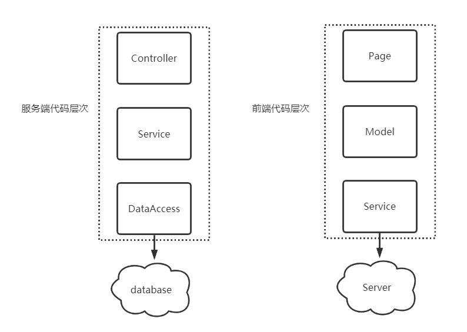

服务端系统：

-   Controller负责与用户直接打交道，渲染页面、提供接口等，侧重于展示型逻辑
-   Service负责处理业务逻辑，供Controller层调用
-   DataAccess 层负责与数据源对接，进行纯粹的数据读写，供Service层调用

前端代码结构：

-   Page负责与用户直接打交道：侧重于展示型交互逻辑
    -   渲染页面
    -   接受用户的操作输入
-   Model负责处理业务逻辑，为Page做数据、状态的读写、变换、暂存等
-   Service负责与HTTP接口对接，进行纯粹的数据读写

#### 使用dva进行数据分层管理

[dva官网](https://dvajs.com/)

[umi-dva插件](https://umijs.org/zh-CN/plugins/plugin-dva)

`@Connect(mapModelToProps,mapDispatcherToProps)`：将model层中数据及函数绑定到page层

1.  mapModelToProps：
    -   将page层和model层进行连接
    -   返回model中的数据
    -   将返回的**数据**绑定到this.props中
2.  mapDispatcherToProps
    -   将定义的**函数**绑定到this.props中
    -   调用model层(reducers)中定义的函数

##### 1. 引入dva框架

umi对dva进行了整合，在 **config.js** 中进行配置：

```js
export default {
    dva: {
        immer: true,
        hmr: false,
    },
};
```

##### 2. 创建model文件

umi中，约定 **src/models** 文件夹中定义model

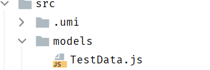

```js
export default {
    namespace:'TestData',
    state:{
        dataList:[1,2,3],
        maxItem:3
    }
}
```

##### 3. 将model层数据导入page层

```jsx
import React from "react";
import {connect} from "umi";

const namespace = "TestData";

// connect第一个回调函数，作用：将page层和model层进行链接，返回model层中的数据，并将数据绑定到 this.props
@connect((dvaState)=>{
    return {
        dataList:dvaState[namespace].dataList,
        maxItem: dvaState[namespace].maxItem
    }
})
class Test extends React.Component{
    render() {
        return (
            <div>
                <ul>
                    {//遍历值
                        this.props.dataList.map((value, index) => {
                            return <li key={index}>{value}</li>
                        })
                    }
                </ul>
            </div>
            
            ...
            );
    }
}

export default Test;
```

**流程**

1.  umi框架启动，会自动读取**models**目录下文件
2.  @Connect修饰符的第一个参数，接受一个方法，该方法必须返回 `{}(对象)`，将接收到model数据
3.  全局model中，通过 `namespace` 进行区分，所以通过 `state[namespace]` 进行数据获取
4.  返回的数据会被封装到 `this.props` 中，所以通过 `this.props.data` 获取到model中的数据

##### 4. 更新model中定义的数据

```jsx
export default {
    namespace:'TestData',
    state:{
        dataList:[1,2,3],
        maxItem:3
    },
    reducers:{//定义一些函数
        addNewData:function (state){//state为修改前state
            let maxItem = state.maxItem+1;
            let newArr = [...state.dataList,maxItem]
            return {//通过return返回更新后的数据
                dataList:newArr,
                maxItem:maxItem
            }
        }
    }
}
```

```jsx
import React from "react";
import {connect} from "umi";

const namespace = "TestData";

@connect(
    (dvaState)=>{
        return {
            dataList:dvaState[namespace].dataList,
            maxItem: dvaState[namespace].maxItem
        }
    },
    (dvaDispatch)=>{
        //dvaDispatch : 可以调用model层定义的函数
        return{
            add:function(){
                dvaDispatch({
                //通过dvaDispatcher调用model层定义的函数
                //@param : type——指定函数名 
                    //namespace/函数名
                    type:namespace+"/addNewData"
                })
            }
        }
    }
)
class Test extends React.Component{

    render() {
        return (
            <div>
                <ul>{//遍历值
                     this.props.dataList.map((value, index) => {
                         return <li key={index}>{value}</li>
                     })
                }
                </ul>
                <button onClick={()=>{
                    this.props.add();
                }}>加一</button>
            </div>
        );
    }
}

export default Test;
```

#### Model中异步请求数据

##### 1. 请求工具类

`src/utils` 目录下创建 `request.js` ，用于异步请求数据

```js
function checkStatus(response) {
    if (response.status >= 200 && response.status < 300) {
        return response;
    }

    const error = new Error(response.statusText);
    error.response = response;
    throw error;
}

/**
* Requests a URL, returning a promise.
* @param {string} url The URL we want to request
* @param {object} [options] The options we want to pass to "fetch"
* @return {object} An object containing either "data" or "err"
*/
export default async function request(url, options) {
    const response = await fetch(url, options);
    checkStatus(response);
    return await response.json();
}
```

##### 2. model层添加异步请求

```js
import request from '../utils/request';

export default {
    namespace:'TestData',
    state:{
        dataList:[],
        maxItem:0
    },
    reducers:{//定义一些函数
        addNewData:function (state,result){
            //state为修改前state,result就是拿到的结果数据
            if(result.data){
            //如果data存在，说明是初始化数据，直接返回
                return result.data;
            }

            let maxItem = state.maxItem+1;
            let newArr = [...state.dataList,maxItem]
            return {//通过return返回更新后的数据
                dataList:newArr,
                maxItem:maxItem
            }
        }
    },
    effects: { //新增effects配置，用于异步加载数据
        *initData(params, sagaEffects) { 
            //*表示 定义异步方法
            const {call, put} = sagaEffects; 
            //获取到call、put方法
            const url = "/ds/list"; // 定义请求的url
            let data = yield call(request, url); //执行请求
            yield put({ // 调用reducers中的方法
                type : "addNewData", //指定方法名
                data : data //传递ajax回来的数据
            });
        }
    }
}
```

##### 3. 绑定model调用异步请求

```jsx
import React from "react";
import {connect} from "umi";

const namespace = "TestData";

@connect(
    (dvaState)=>{
        return {
            dataList:dvaState[namespace].dataList,
            maxItem: dvaState[namespace].maxItem
        }
    },
    (dvaDispatch)=>{
        return{
            add:function(){
                dvaDispatch({
                    type:namespace+"/addNewData"
                })
            },
            initData:()=>{
                dvaDispatch({
                    type:namespace+"/initData"
                })
            }
        }
    }
)
class Test extends React.Component{
    componentDidMount() {//组件加载完后进行初始化操作
        this.props.initData();
    }

    render() {
        return (
            <div>
                <ul>
                    {//遍历值
                        this.props.dataList.map((value, index) => {
                            return <li key={index}>{value}</li>
                        })
                    }
                </ul>
                <button onClick={()=>{
                    this.props.add();
                }}>加一</button>
            </div>
        );
    }
}

export default Test;
```

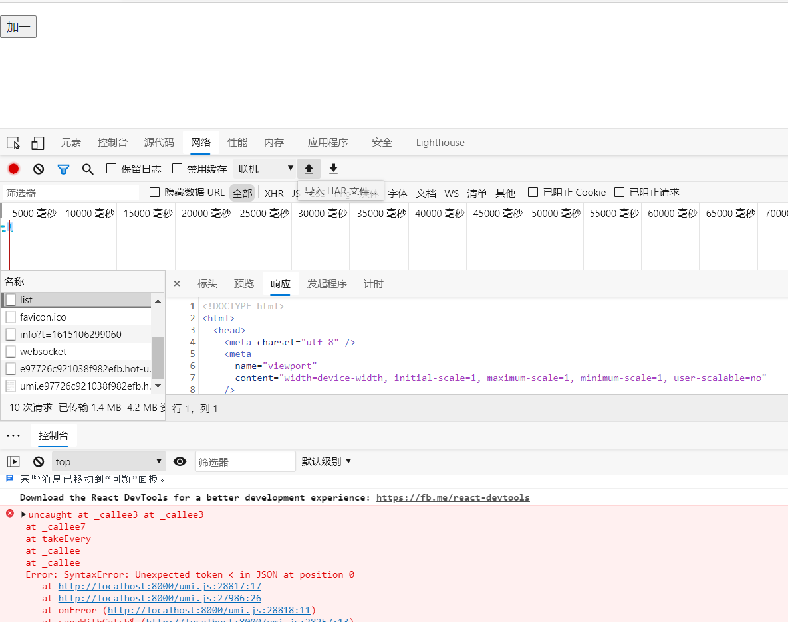

原因：

返回的数据不是json格式，解析出错

##### 4. moke数据

> Mock 数据是前端开发过程中必不可少的一环，是分离前后端开发的关键链路。通过预先跟服务器端约定好的接口，模拟请求数据甚至逻辑，能够让前端开发独立自主，不会被服务端的开发所阻塞。

umi中支持对请求的模拟

在项目根目录下创建 `mock` 目录，创建 `MockTestData.js` 文件


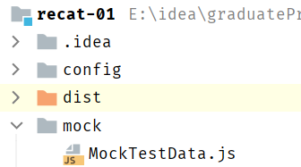

```js
export default {
    'GET /ds/test': function (req, res) { //模拟请求返回数据
        res.json({//返回
            dataList: [1, 2, 3, 4],
            maxItem: 4
        });
    }
}
```

```jsx
import request from '../utils/request';

export default {
    namespace:'TestData',
    state:{
        dataList:[],
        maxItem:0
    },
    reducers:{
        addNewData:function (state,result){
            if(result.data){//判断result中的data是否存在，如果存在，说明是初始化数据，直接返回
                /*
                mock: 若响应中的字段名与page层的属性不一致，需要做映射
                return {
                    dataList:result.data.data,
                    maxItem:result.data.maxNum
                }
                */
                return result.data;
            }

            let maxItem = state.maxItem+1;
            let newArr = [...state.dataList,maxItem]
            return {
                dataList:newArr,
                maxItem:maxItem
            }
        }
    },
    effects: { 
        *initData(params, sagaEffects) { 
            const {call, put} = sagaEffects;
            const url = "/ds/test"; 

            let data = yield call(request, url); 
            yield put({ 
                type : "addNewData", 
                data : data 
            });
        }
    }
}
```

#### umi - model 注册

##### model示例

```js
export default {
  namespace: '', // 表示在全局 state 上的 key
  state: {}, // 状态数据
  reducers: {}, // 管理同步方法，必须是纯函数
  effects: {}, // 管理异步操作，采用了 generator 的相关概念
  subscriptions: {}, // 订阅数据源
};
```

##### umi model注册

> umi中，按照约定的目录 **src/models** 文件夹中被注册为model

model 分两类，一是全局 model，二是页面 model。全局 model 存于 `/src/models/` 目录，所有页面都可引用；页面 model 不能被其他页面所引用。

-   `src/models/**/*.js` 为 global model
-   `src/pages/**/models/**/*.js` 为 page model
-   global model 全量载入，page model 在 production 时按需载入，在 development 时全量载入
-   page model 为 page js 所在路径下 `models/**/*.js` 的文件
-   page model 会向上查找，比如 page js 为 `pages/a/b.js`，他的 page model 为 `pages/a/b/models/**/*.js` + `pages/a/models/**/*.js`，依次类推
-   约定 model.js 为单文件 model，解决只有一个 model 时不需要建 models 目录的问题，有 model.js 则不去找 `models/**/*.js`


## React框架分类

-   Flux
    -   利用一个单向的数据流补充了React的组合视图组件，更像一种模式而非框架
-   Redux
    -   JS状态容器，提供可预测的状态管理，Redux使**组件状态共享**变得简单
-   Ant Design of React
    -   阿里开源的基于React的企业级后台产品，继承了多种React框架
    -   Ant Design提供了丰富的组件，包括：按钮、表单、表格、布局、分页、树组件、日历等

## AntDesign

### 简介

Ant Design是阿里蚂蚁金服 **基于React开发的UI组件** ，主要用于中后台系统的使用

[官网](https://ant.design/components/overview-cn/)

**特性**

-   🌈 提炼自企业级中后台产品的交互语言和视觉风格。
-   📦 开箱即用的高质量 React 组件。
-   🛡 使用 TypeScript 开发，提供完整的类型定义文件。
-   ⚙️ 全链路开发和设计工具体系。
-   🌍 数十个国际化语言支持。
-   🎨 深入每个细节的主题定制能力。

### 配置开启antd

```js
export default {
    dva: {
        immer: true,
        hmr: false,
    },
    antd: {
		
    }
};
```

### Tabs

```jsx
import React from "react";
import { Tabs } from 'antd';

const { TabPane } = Tabs;

function callback(key) {
    console.log(key);
}

class TabsTest extends React.Component{
    render() {
        return (
            <Tabs defaultActiveKey="1" onChange={callback}>
                <TabPane tab="Tab 1" key="1">
                    Content of Tab Pane 1
                </TabPane>
                <TabPane tab="Tab 2" key="2">
                    Content of Tab Pane 2
                </TabPane>
                <TabPane tab="Tab 3" key="3">
                    Content of Tab Pane 3
                </TabPane>
            </Tabs>
        )
    }
}

export default TabsTest;
```

### 布局

-   Layout:	布局容器，其下可嵌套 `Header` `Sider` `Content` `Footer` 或 `Layout` 本身，可以放在任何父容器中。
-   Header:   顶部布局，自带默认样式，其下可嵌套任何元素，只能放在 `Layout` 中
-   Sider   :   侧边栏，自带默认样式及基本功能，其下可嵌套任何元素，只能放在 `Layout` 中
-   Content:   内容部分，自带默认样式，其下可嵌套任何元素，只能放在 `Layout`中
-   Footer ：  底部布局，自带默认样式，其下可嵌套任何元素，只能放在 `Layout` 中  

#### 搭建整体框架+子页面使用布局

在 **src目录** 下创建layouts目录，并且在 **layouts目录** 下创建 **index.js** 文件  


默认的全局路径由 **/umi/core/routes.ts ** 配置

```js
import React from 'react'
import { Layout } from 'antd';

const { Header, Footer, Sider, Content } = Layout;

class BasicLayout extends React.Component{
    render(){
        return (
            <Layout>
                <Sider>Sider</Sider>
                <Layout>
                    <Header>Header</Header>
                    <Content>{this.props.children}</Content>
                    <Footer>Footer</Footer>
                </Layout>
            </Layout>
        );
    }
}

export default BasicLayout;
```


#### 自定义配置布局路由

>   若进行路由配置，表明通过 **手动配置** 的方式进行访问页面，不采用umi默认的路由方式
>
>   -   `routes` 以 **src/pages** 为根目录
>   -   采用手动配置则所有的页面路由均需要手动配置

**config.js**

```js
export default {
    dva: {
        immer: true,
        hmr: false,
    },
    antd: {

    },
    routes: [{
        path: '/',
        component: '../../BasicLayout.js', //配置布局路由
        routes:[
            {
                path: '/test',
                component:'./test'
            },
            {
                path: './tabstest',
                component:'./tabstest'
            }
        ]
    }]
};
```


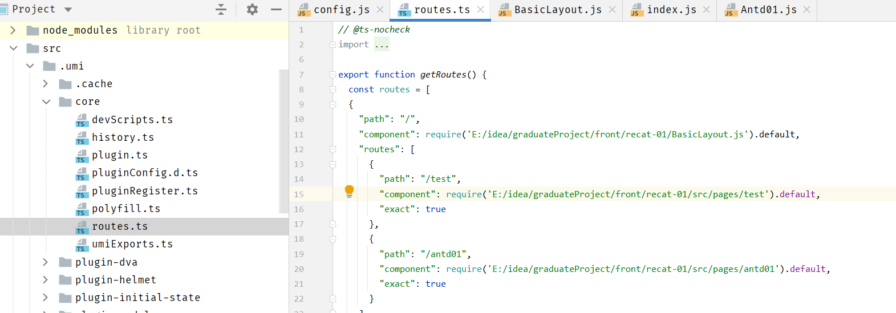

#### 页面美化

```js
import React from 'react'
import { Layout } from 'antd';

const { Header, Footer, Sider, Content } = Layout;

class BasicLayout extends React.Component{
    render(){
        return (
            <Layout>
                <Sider width={256} style={{ minHeight: '100vh', color: 'white' }}>
                    Sider
                </Sider>
                <Layout>
                    <Header style={{ background: '#fff', textAlign: 'center', padding: 0 }}>Header</Header>
                    <Content style={{ margin: '24px 16px 0' }}>
                        <div style={{ padding: 24, background: '#fff', minHeight: 360 }}>
                            {this.props.children}
                        </div>
                    </Content>
                    <Footer style={{ textAlign: 'center' }}>后台系统 ©2018 Created by 黑马程序员</Footer>
                </Layout>
            </Layout>
        );
    }
}

export default BasicLayout;
```

### 导航菜单

#### 安装图标组件包

```shell
npm install --save @ant-design/icons
```

```jsx
import React from 'react'
import { Layout, Menu} from 'antd';
import {PieChartOutlined, DesktopOutlined, InboxOutlined, AppstoreOutlined, MailOutlined} from '@ant-design/icons'

const { Header, Footer, Sider, Content } = Layout;
const SubMenu = Menu.SubMenu;

class BasicLayout extends React.Component{
    constructor(props){
        super(props);
        this.state = {
            collapsed: false,
        }
    }
    render(){
        return (
            <Layout>
                <Sider width={256} style={{ minHeight: '100vh', color: 'white' }}>
                    <div style={{ height: '32px', background: 'rgba(255,255,255,.2)', margin: '16px'}}/>
                    <Menu
                        defaultSelectedKeys={['2']}
                        defaultOpenKeys={['sub1']}
                        mode="inline"
                        theme="dark"
                        inlineCollapsed={this.state.collapsed}
                    >
                        <Menu.Item key="1">
                            <PieChartOutlined />
                            <span>Option 1</span>
                        </Menu.Item>
                        <Menu.Item key="2">
                            <DesktopOutlined />
                            <span>Option 2</span>
                        </Menu.Item>
                        <Menu.Item key="3">
                            <InboxOutlined />
                            <span>Option 3</span>
                            传智播客
                        </Menu.Item>
                        <SubMenu key="sub1" title={<span><MailOutlined /><span>Navigation One</span></span>}>
                            <Menu.Item key="5">Option 5</Menu.Item>
                            <Menu.Item key="6">Option 6</Menu.Item>
                            <Menu.Item key="7">Option 7</Menu.Item>
                            <Menu.Item key="8">Option 8</Menu.Item>
                        </SubMenu>
                        <SubMenu key="sub2" title={<span><AppstoreOutlined /><span>Navigation Two</span></span>}>
                            <Menu.Item key="9">Option 9</Menu.Item>
                            <Menu.Item key="10">Option 10</Menu.Item>
                            <SubMenu key="sub3" title="Submenu">
                                <Menu.Item key="11">Option 11</Menu.Item>
                                <Menu.Item key="12">Option 12</Menu.Item>
                            </SubMenu>
                        </SubMenu>
                    </Menu>
                </Sider>

                <Layout>
                    <Header style={{ background: '#fff', textAlign: 'center', padding: 0 }}>Header</Header>
                    <Content style={{ margin: '24px 16px 0' }}>
                        <div style={{ padding: 24, background: '#fff', minHeight: 360 }}>
                            {this.props.children}
                        </div>
                    </Content>
                    <Footer style={{ textAlign: 'center' }}>后台系统 ©2018 Created by 黑马程序员</Footer>
                </Layout>
            </Layout>
        );
    }
}

export default BasicLayout;
```

#### 导航添加链接

 在 **src/pages/user** 下创建 **UserAdd.js** 和 **UserList.js** 文件，用于模拟实现新增用户和查询用户列表功能


```jsx
import React from 'react';

//UserAdd.js
class UserAdd extends React.Component{
    render() {
        return (
            <div>新增用户</div>
        )
    }
}

export default UserAdd;

import React from 'react';

* ./utils in ./node_modules/jest-config/build/ts3.4/index.d.ts
UserList.js
class UserList extends React.Component{
    render() {
        return (
            <div>用户列表</div>
        )
    }
}

export default UserList;
```

**若是手动配置路由，则需要修改路由配置**

```js
export default {
    dva: {
        immer: true,
        hmr: false,
    },
    antd: {

    },
    routes: [{
        path: '/',
        component: '../../BasicLayout.js', //配置布局路由
        routes:[
            {
                path: '/test',
                component:'./test'
            },
            {
                path: '/tabstest',
                component:'./tabstest'
            },
            {
                path: '/user',
                routes: [
                    {
                        path: '/user/add',
                        component: './user/UserAdd'
                    },
                    {
                        path: '/user/list',
                        component: './user/UserList'
                    }
                ]
            }
        ]
    }]
};
```

**注意**

>   使用了umi的link标签，目的是出现记录点击的菜单 

```jsx
import React from 'react'
import { Layout, Menu} from 'antd';
import {UserOutlined} from '@ant-design/icons';
import {Link} from 'umi';

const { Header, Footer, Sider, Content } = Layout;
const SubMenu = Menu.SubMenu;

class BasicLayout extends React.Component{
    constructor(props){
        super(props);
        this.state = {
            collapsed: false,
        }
    }
    render(){
        return (
            <Layout>
                <Sider width={256} style={{ minHeight: '100vh', color: 'white' }}>
                    <div style={{ height: '32px', background: 'rgba(255,255,255,.2)', margin: '16px'}}/>
                    <Menu
                        defaultSelectedKeys={['2']}
                        defaultOpenKeys={['sub1']}
                        mode="inline"
                        theme="dark"
                        inlineCollapsed={this.state.collapsed}
                    >
                        <SubMenu key="sub1" title={<span><UserOutlined /><span>用户管理</span></span>}>
                            <Menu.Item key="1"><Link to={"/user/add"}>新增用户</Link></Menu.Item>
                            <Menu.Item key="2"><Link to={"/user/list"}>用户列表</Link></Menu.Item>
                        </SubMenu>
                    </Menu>
                </Sider>

                <Layout>
                    <Header style={{ background: '#fff', textAlign: 'center', padding: 0 }}>Header</Header>
                    <Content style={{ margin: '24px 16px 0' }}>
                        <div style={{ padding: 24, background: '#fff', minHeight: 360 }}>
                            {this.props.children}
                        </div>
                    </Content>
                    <Footer style={{ textAlign: 'center' }}>后台系统 ©2018 Created by 黑马程序员</Footer>
                </Layout>
            </Layout>
        );
    }
}

export default BasicLayout;
```

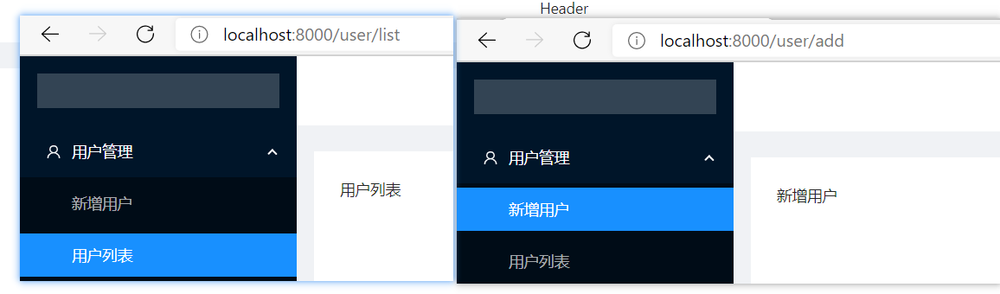

### 表格

[表格文档](https://ant.design/components/table-cn/)

#### 基本用法

```jsx
import React from 'react'
import {Table, Divider, Tag, Pagination } from 'antd';

const {Column} = Table;

const data = [
    {
        key: '1',
        name: '张三',
        age: 32,
        address: '上海市',
        tags: ['程序员', '帅气'],
    }, {
        key: '2',
        name: '李四',
        age: 42,
        address: '北京市',
        tags: ['屌丝'],
    }, {
        key: '3',
        name: '王五',
        age: 32,
        address: '杭州市',
        tags: ['高富帅', '富二代'],
    }];

class UserList extends React.Component {
    render() {
        return (
            <div>
                <Table dataSource={data} pagination= {{position:"bottom",total:500,pageSize:10, defaultCurrent:3}}>
                    <Column title="姓名" dataIndex="name" key="name" />
                    <Column title="年龄" dataIndex="age" key="age" />
                    <Column title="地址" dataIndex="address" key="address" />
                    <Column title="标签" dataIndex="tags" key="tags"
                        render={tags => (
                            <span>{tags.map(tag => <Tag color="blue" key= {tag}>{tag}</Tag>)} </span>
                        )}
                    />
                    <Column  title="操作" key="action"
                        render={(text, record) => (
                            <span>
                                <a href="javascript:;">编辑</a>
                                <Divider type="vertical"/>
                                <a href="javascript:;">删除</a>
                            </span>
                        )}
                    />
                </Table>
            </div>
        );
    }
}

export default UserList;
```

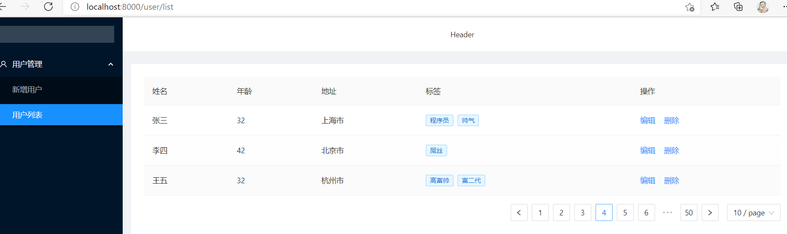

#### 数据分离到model

##### 1. 新建model层

```js
import request from "../utils/request";

export default {
    namespace: 'userList',
    state: {
        list: []
    },
    reducers: {
        queryList(state, result) {
            let data = [...result.data];
            return { //更新状态值
                list: data
            }
        }
    },
    effects: {
        *initData(params, sagaEffects) {
            const {call, put} = sagaEffects;
            const url = "/ds/user/list";
            let data = yield call(request, url);
            yield put({
                type : "queryList",
                data : data
            });
        }
    }
}
```

##### 2. mock数据

```js
export default {
    'GET /ds/user/list': function (req, res) {
        res.json([{
            key: '1',
            name: '张三1',
            age: 32,
            address: '上海市',
            tags: ['程序员', '帅气'],
        }, {
            key: '2',
            name: '李四',
            age: 42,
            address: '北京市',
            tags: ['屌丝'],
        }, {
            key: '3',
            name: '王五',
            age: 32,
            address: '杭州市',
            tags: ['高富帅', '富二代'],
        }]);
    }
}
```

##### 3. 修改UserList.jsx逻辑

```jsx
import request from "../utils/request";

export default {
    namespace: 'userList',
    state: {
        list: []
    },
    reducers: {
        queryList(state, result) {
            let data = [...result.data];
            return { //更新状态值
                list: data
            }
        }
    },
    effects: {
        *initData(params, sagaEffects) {
            const {call, put} = sagaEffects;
            const url = "/ds/user/list";
            let data = yield call(request, url);
            yield put({
                type : "queryList",
                data : data
            });
        }
    }
}
```

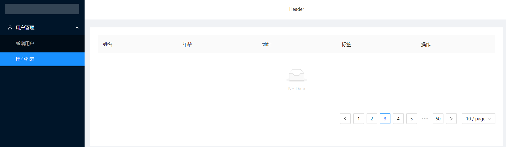

##### 4. 新增请求

```jsx
import React from 'react'
import {Table, Divider, Tag, Pagination } from 'antd';
import {connect} from 'dva';

const {Column} = Table;
const namespace = 'userList'

@connect(
    (state)=>{
        return {
            data: state[namespace].list
        }
    },
    (dispatch=>{
        return{
            initData: ()=>{
                dispatch({
                    type: namespace+'/initData'
                })
            }
        }
    })
)
class UserList extends React.Component {

    componentDidMount() {
        this.props.initData();
    }

    render() {
        return (
            <div>
                <Table dataSource={this.props.data} pagination= {{position:"bottom",total:500,pageSize:10, defaultCurrent:3}}>
                    <Column title="姓名" dataIndex="name" key="name" />
                    <Column title="年龄" dataIndex="age" key="age" />
                    <Column title="地址" dataIndex="address" key="address" />
                    <Column title="标签" dataIndex="tags" key="tags"
                        render={tags => (
                            <span>{tags.map(tag => <Tag color="blue" key= {tag}>{tag}</Tag>)} </span>
                        )}
                    />
                    <Column  title="操作" key="action"
                        render={(text, record) => (
                            <span>
                                <a href="javascript:;">编辑</a>
                                <Divider type="vertical"/>
                                <a href="javascript:;">删除</a>
                            </span>
                        )}
                    />
                </Table>
            </div>
        );
    }
}

export default UserList;
```


## Ant Design Pro

### 简介

[源码地址](https://github.com/ant-design/ant-design-pro)

Ant Design Pro 是基于 Ant Design 和 umi 的封装的一整套企业级中后台**前端设计** 解决方案，致力于在设计规范和基础组件的基础上，继续向上构建，提炼出典型模板/业务组件/配套设计资源，进一步提升企业级中后台产品设计研发过程中的『用户』和『设计者』的体验。

### 部署和安装

#### 1. 下载源码&解压

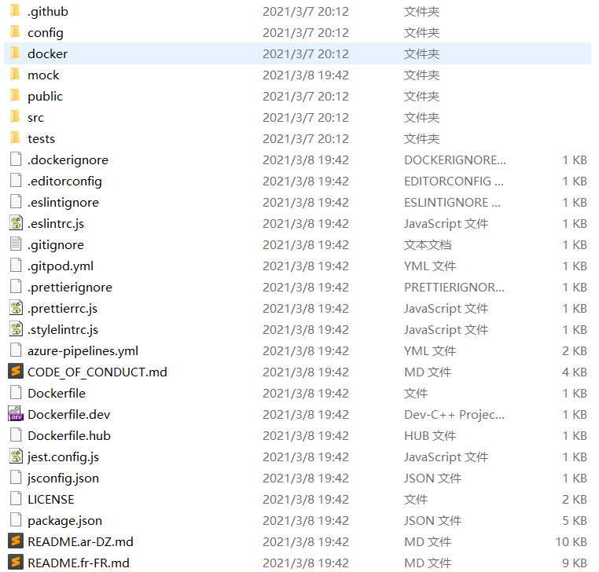

**AntDesign Pro目录**

```
├── config 			#umi 配置，包含路由，构建等配置
├── mock 			#本地模拟数据
├── public
│ └── favicon.png 	# Favicon
├── src
│ ├── assets 		# 本地静态资源
│ ├── components 	# 业务通用组件
│ ├── e2e 			# 集成测试用例
│ ├── layouts 		# 通用布局
│ ├── models 		# 全局 dva model
│ ├── pages 		# 业务页面入口和常用模板
│ ├── services 		# 后台接口服务
│ ├── utils 		# 工具库
│ ├── locales 		# 国际化资源
│ ├── global.less 	# 全局样式
│ └── global.js 	# 全局 JS
├── tests 			# 测试工具
├── README.md
└──package.json
```

#### 2. 导入


#### 3. 初始化及启动

```shell
tyarn install #安装相关依赖
tyarn start #启动服务
```

### 菜单和路由

在 pro 中，菜单和路由，在 `config/router.config.js` 中进行管理


可见， pro 提供两套路由，分别是 `/user` 和 `/app` 

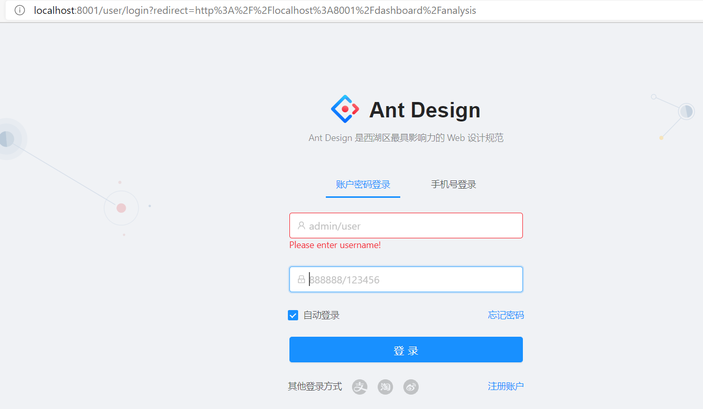

由路由配置可见，登录成功后，会跳转到 `/dashboard`

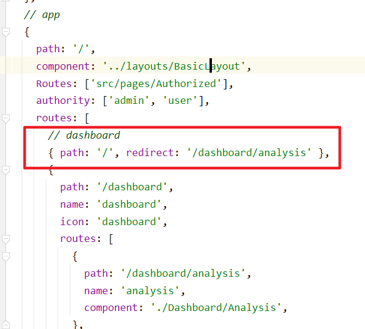

#### 菜单是由路由的配置生成的

>   验证

```js
// new
{
    path: '/new',
        name: 'new',
            icon: 'user',
                routes: [
                    {
                        path: '/new/analysis',
                        name: 'analysis',
                        component: './Dashboard/Analysis',
                    },
                    {
                        path: '/new/monitor',
                        name: 'monitor',
                        component: './Dashboard/Monitor',
                    },
                    {
                        path: '/new/workplace',
                        name: 'workplace',
                        component: './Dashboard/Workplace',
                    },
                ],
},
```

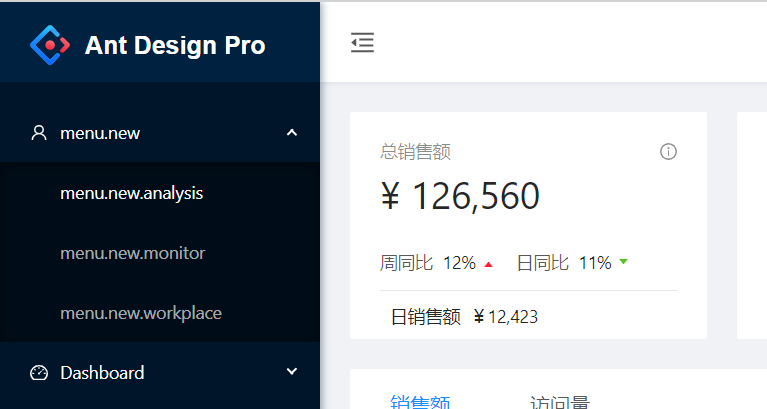

#### 在国际化文件中配置文字


```js
'menu.new': 'New Dashboard',
    'menu.new.analysis': 'New 分析页',
    'menu.new.monitor': 'New 监控页',
    'menu.new.workplace': 'New 工作台',
```


### 新增页面

在 `src/pages` 中，以功能为单元创建目录

```jsx
import React from "react";

// eslint-disable-next-line react/prefer-stateless-function
class NewAnalysis extends React.Component{
  render() {
    return(
      <div>New Analysis</div>
    )
  }
}

export default NewAnalysis;
```

修改路由配置

```js
// new
      {
        path: '/new',
        name: 'new',
        icon: 'user',
        routes: [
          {
            path: '/new/analysis',
            name: 'analysis',
            component: './New/NewAnalysis',
          },
          {
            path: '/new/monitor',
            name: 'monitor',
            component: './Dashboard/Monitor',
          },
          {
            path: '/new/workplace',
            name: 'workplace',
            component: './Dashboard/Workplace',
          },
        ],
      },
```


### Pro中model执行流程


#### 路由即菜单


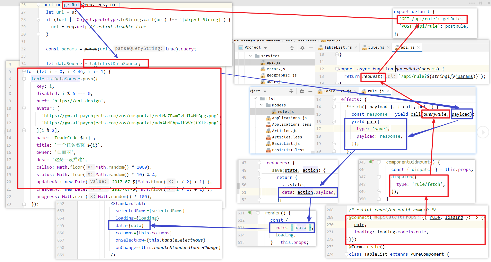

-   在TableList.js中，组件加载完成后进行加载数据 
-   在 `StandardTable` 中，使用Table组件生成表格，其中数据源是 `data` 
-   TableList.js中，data数据从 `构造方法` 中获取到  
-   this.props中的 `rule` 数据，是通过 `@connect` 修饰器获取  
-   数据从 `models/rule.js` 中获取
-   `queryRule` 是在 `/services/api` 中进行了定义 
-   数据的mock是在 `mock/rule.js` 中完成  