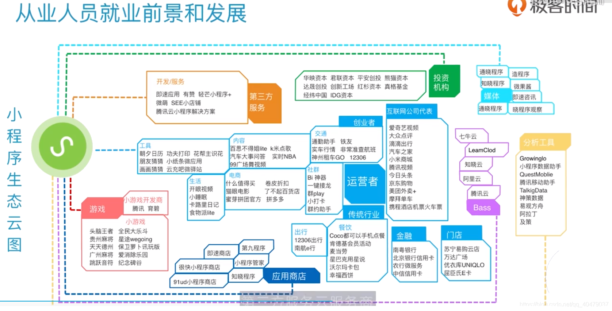

> 微信小程序的一些学习与心得
>
> 参考官方文档，与B站吴天xxx的一个视频(不记得具体名字了)

<!--more-->

# 一、设计要素

## 1.五大要点
- 工具类小程序功能要专一
- 应用类小程序交互要简单
- 小程序裂变要及时反馈
- 小程序开发要快
- 小程序设计一定要自裂变

## 2.小程序集群搭建的六种方法
- 以地域为维度策划小程序
- 以时间为维度策划小程序
- 以功能为维度策划小程序
- 以服务为维度策划小程序
- 小程序相互跳转
- 单一功能小程序这成平台式小程序

# 二、概述
## 1.诞生背景
> **更好的用户体验**
> **规范与管理**

## 2.什么是小程序
> 小程序可以通过更好的用户体验，在微信内使用应用程序的功能
> - **触手可及**:不需要下载安装即可使用的应用
> - **用完即走**:用户扫一扫或者搜一下即可打开应用
> -**无需安装卸载**:随时可用，无需安装过多应用


## 3.小程序能做什么

## 4.开发工作准备
 - [ ] 注册小程序账号
> [微信公众平台](https://mp.weixin.qq.com/)
> 一个邮箱只能在微信公众平台注册一次，即一个邮箱只能选择订阅号、小程序号、服务号或企业微信中的一种账号类型
 - [ ] 激活邮箱
 - [ ] 信息登记
 > - 主体类型:个人主体不支持微信认证，微信支付及高级接口能力
 > - 企业、政府、媒体或其他需要相关类型资质认证
 > - 非个人主体类型的账号，已有线上版本需要注销账号或更名的情况，需要用与管理者微信绑定的银行账号打小额钱用来确认，完成操作后会返还
 - [ ] 登录小程序管理后台
 - [ ] 完善小程序信息
 - [ ] 绑定开发者
## 5.开发者工具下载
> [下载地址](https://developers.weixin.qq.com/miniprogram/dev/devtools/download.html)
> **下载版本建议:** 下载稳定版(Stable Build)，预发布版(RC Build)、开发版(Nightly Build)都多或少存在问题。
## 6.开发者工具
 [开发者工具的介绍](https://developers.weixin.qq.com/miniprogram/dev/devtools/devtools.html)
### 1)详情
- **基础库**:代码调试的版本
- **ES6转ES5**:JavaScript版本切换 
- **不校验合法域名、web-view（业务域名）、TLS 版本以及 HTTPS 证书** :当小程序中使用了外链域名，会对其合法性进行检验(小程序中只能使用在公众平台后台配置过的https域名，可以在详情=>域名信息中查看)
### 2)调试器
 `七个模块`
- **console**:调试log信息
- **Sourses**:列出小程序页面的所有脚本文件，可以对这些脚本文件做一些断点调试
- **Network**:展示各个网络请求的状态信息以及请求资源的响应数据等
- **Storage**：本地存储，通过调用wx.setStorage和wx.setStorageSync设置缓存时，可以动态的修改缓存数据
- **AppData**：小程序页面上真实展示的数据
- **Wxml**:展示小程序页面的各个组件元素以及对组件元素的样式属性进行修改
- **Sensor**： 地理位置信息和设备旋转角度的展示

## 7.官方开发文档
> **[官方文档是最好的学习资料](https://developers.weixin.qq.com/miniprogram/dev/framework/)，一定要重视**
## 8.目录结构
[官方文档](https://developers.weixin.qq.com/miniprogram/dev/framework/quickstart/code.html#JSON-%E9%85%8D%E7%BD%AE)

 - **app.js**
 注册小程序应用，处理小程序逻辑和数据交互
 - **app.json**
 小程序全局配置
 - **app.wxss**
 小程序全局样式
 - **project.config.json**
保存微信开发者工具的配置信息
 - **pages文件夹**
 存放小程序的所有页面
 - **utils**
存放工具函数，达实现代码复用的目的
### 全局配置文件(app.json)
[官方文档](https://developers.weixin.qq.com/miniprogram/dev/framework/quickstart/code.html#JSON-%E9%85%8D%E7%BD%AE)


> 页面配置的优先级高于全局配置
> [全局配置](https://developers.weixin.qq.com/miniprogram/dev/reference/configuration/app.html)
> [页面配置](https://developers.weixin.qq.com/miniprogram/dev/reference/configuration/page.html)
# 三、小程序架构与运行机制
## 1.MINA框架

### 1)视图层
> [官方文档](https://developers.weixin.qq.com/miniprogram/dev/framework/view/)

- WXML，WXSS构建页面视图层，搭建视图结构和展现样式
- WXS和WXML、WXSS一起在UI线程( **UI Thread** )中运行。平常在服务器请求到数据时，需要对数据处理，小程序提供的WXS脚本可以直接在UI线程中处理，避免了跨线程通信的消耗

> - WXML是具有元素、属性和文本的 **结点树结构** ，在结点树结构中每一个结点都有上下文关系，所以在渲染WXML时，小程序运行环境会把 **WXML结点树** 转化为 **JS对象**
> - 在渲染时，会把从逻辑层传递来的数据进行差异对比，把差异应用在原来结点树上，渲染出正确的视图层界面

### 2)逻辑层(App Service)
> 数据交互和逻辑处理的中心
> **`每个小程序只有一个APP Service,并且常驻内存`**

- Manger
> 逻辑处理

- API
> 封装的微信接口，使不同平台设备都能使用微信平台能力

### 3)JSBridge
> 视图层和逻辑层通过JS进行通信
> 在逻辑层发生数据变更的时候，需要通过App Service提供的 **setData()** 方法，把数据从逻辑层传递到视图层

## 2.运行机制
### 1)启动
> [官方文档](https://developers.weixin.qq.com/miniprogram/dev/framework/runtime/operating-mechanism.html)

 - [ ] 冷启动
> 用户首次打开或小程序被主动销毁(超时销毁-5分钟，连续收到两次系统告警)
> 在冷启动时发现有更新，会异步下载，最新版本的包会在下次打开才会应用
 - [ ] 热启动
> 在一定时间内再次打开小程序

### 2)加载
[官方文档](https://developers.weixin.qq.com/miniprogram/dev/framework/runtime/update-mechanism.html)

- 小程序启动时会向CDN请求最新代码包，第一次启动会等到下载代码包并注入到视图层容器内才能看到小程序页面
- 客户端会将代码包保存到本地，下一次启动时会先从CDN请求最新代码包，当有最新代码包时，会先运行已经缓存好的代码包，同时异步下载最新代码包存入CDN，再下一次启动时，使用最新代码包
> **CDN**:内容分发网络，可以理解为最近的快递分发点
### 3)生命周期
[官方文档](https://developers.weixin.qq.com/miniprogram/dev/framework/app-service/page-life-cycle.html)

**概述**

- 小程序启动时两个线程同时运行，两者协同工作完成小程序页面生命周期的调用
	- view 线程(View Thread)：负责页面视图渲染
	- 服务线程(AppService Thread)：处理数据和服务
- 当App Service线程创建时，会依次调用 **onLoad** 和 **onShow** 方法
	- 一般在这两个方法中请求服务器数据
- view线程初始化完毕之后，会向App Service线程发送消息，App Service线程会返回初始化数据
- view线程获取到初始化数据之后，触发首次渲染，渲染完成后会再次向App Service线程发送消息
- App Service线程会接收到 **onReady** 调用，此时App Service线程会把服务器数据发送给View 线程的视图层
- view 线程获取到数据之后会再次渲染视图层

---

 - [ ] **程序生命周期**
- onLaunch
> 初始化小程序，一个生命周期内只能调用一次
- onShow
> 从后台唤醒，小程序进入前台状态，调用该方法
- onHide
> 小程序进入后台调用该方法
- onError
> 当程序发生脚本错误或API调用失败时，调用该方法
- globalData
> 小程序全局数据
 - [ ] 页面生命周期
- onLoad
> 页面初次加载，触发该方法，在 `onReady` 之前， 一个页面构造时只能被调用一次
- onShow
>  页面显示或从别的页面返回当前页面会调用该方法
- onReady
> 页面初次渲染完成之后会调用该方法，在 `onShow` 方法之后被调用，只能被调用一次
- onHide
> 页面进入后台调用该方法
- onUnload
> 关闭当前页，触发该方法
### 4)页面路由
[官方文档](https://developers.weixin.qq.com/miniprogram/dev/framework/app-service/route.html)

- 小程序的所有页面由框架维护的栈进行统一管理
- **navigateTo、redirectTo**只能打开非tabBar页面
- **switchTab**只能打开tabBar页面
- **reLaunch**可以打开任意页面

| 路由方式   | 页面栈表示                      | 触发时机                                                     | 路由前页面 | 路由后页面     |
| ---------- | ------------------------------- | ------------------------------------------------------------ | ---------- | -------------- |
| 初始化     | 新页面入栈                      | 小程序打开的第一个页面                                       |            | onLoad, onShow |
| 打开新页面 | 新页面入栈                      | 调用 API wx.navigateTo ,使用组件\<navigator open-type="navigateTo"\/\> | onHide     | onLoad, onShow |
| 页面重定向 | 当前页面出栈，新页面入栈        | 调用 API wx.redirectTo ;使用组件 \<navigator open-type="redirectTo"\/\> | onUnload   | onLoad, onShow |
| 页面返回   | 页面不断出栈,新页面入栈         | 调用 API wx.navigateBack ;使用组件\<navigator open-type="navigateBack"\>,用户按左上角返回按钮 | onUnload   | onShow         |
| Tab切换    | 页面全部出栈，只留下新的Tab页面 | 调用 API wx.switchTab;使用组件 <navigator open-type="switchTab"/> ;用户切换 Tab |            |                |
| 重加载     | 页面全部出栈，只留下新页面      | 调用 API wx.reLaunch;使用组件 <navigator open-type="reLaunch"/> | onUnload   | onLoad,onShow  |

### 5)事件流
[官方文档](https://developers.weixin.qq.com/miniprogram/dev/framework/view/wxml/event.html)

- 事件是视图层到逻辑层的通讯方式
- 可以将用户的行为反馈到逻辑层进行处理
- 可以绑定在组件上，触发事件后，会执行逻辑层中对应的事件处理函数
- 事件对象可以携带额外信息

**事件对象**
- type
> 触发事件的类型
- timeStamp
> 触发事件的时间戳
- target
> 触发事件的根源组件，包括触发组件的Id，data自定义数据 的集合
- currentTarget
>  事件绑定的当前组件，当前组件的Id，当前组件的类型，data自定义数据的集合
- touches
> 表示当前停留到屏幕上的触摸点的信息
- detail
> 表示各个事件所携带的数据

**事件模型**

 - [ ] 事件捕获阶段
> 事件会从最外层结点( **currentTarget对象** )向下传播到目标结点( **target对象** )元素，依次检查经过的结点是否绑定了同一事件的监听回调函数
 - [ ] 事件处理阶段
 - [ ] 事件冒泡阶段
> 事件会从目标结点会向上传播到最外层结点元素，依次检查经过的结点是否绑定了同一事件的监听回调函数

#### 事件绑定和冒泡
> bind事件绑定不会阻止冒泡事件向上冒泡，catch事件绑定可以阻止冒泡事件向上冒泡
```html
<view id="outer" bindtap="handleTap1">
  outer view
  <view id="middle" catchtap="handleTap2">
    middle view
    <view id="inner" bindtap="handleTap3">
      inner view
    </view>
  </view>
</view>
```
> - 点击 inner view 会先后调用handleTap3和handleTap2(因为tap事件会冒泡到 middle view，而 middle view 阻止了 tap 事件冒泡，不再向父节点传递)
> - 点击 middle view 会触发handleTap2，点击 outer view 会触发handleTap1
# 四、基础开发
> **1.wxml**:描述页面的内容
> **2.wxss**:描述页面的样式
> **3.wxs**:对wxml增强的一种脚本语言，用于wxml中对数据进行过滤或者计算处理
> **4.javaScript**:处理页面的交互逻辑与数据交互

## 1.WXML(WeiXin MarkUp Language)
> 是框架设计的一套标签语言，结合组件、wxs和事件系统，可以构建出页面的结构

### 1)语法
> - 开始标签和结束标签是相匹配
> - 严格闭合
> - 大小敏感
```html
<标签名 属性名="属性名1" 属性名="属性名2" ...></标签名>
```
### 2)通用属性介绍
#### a)class
> 用来给标签添加wxss(css)样式
#### b)data-
> 给标签添加数据集合(dataSet)，用于逻辑处理是传递参数，区分标签
#### c)hidden
> 当前标签的显示或者隐藏
#### d)id
> 组件的唯一标识
#### e)style
> 组件的内联样式
#### f)bind*/catch*
> 组件的事件

### 3)语言特性
#### a.数据绑定
[官方文档](https://developers.weixin.qq.com/miniprogram/dev/reference/wxml/data.html)

**文本内容数据绑定**

**属性内容数据绑定**

**运算符绑定**

#### b.列表渲染
[官方文档](https://developers.weixin.qq.com/miniprogram/dev/reference/wxml/list.html)

**wx:for**

**wx:key**
>  *指定列表中项目的唯一的标识符*
>  当数据改变触发渲染层重新渲染的时候（列表中项目的位置会动态改变或者有新的项目添加到列表中），会校正带有 key 的组件，框架会确保他们被重新排序，而不是重新创建，以确保使组件保持自身的状态，并且提高列表渲染时的效率
#### c.条件渲染
 [官方文档](https://developers.weixin.qq.com/miniprogram/dev/reference/wxml/conditional.html)

#### d.模板引用
- [模板文档](https://developers.weixin.qq.com/miniprogram/dev/framework/view/wxml/template.html)
- [引用文档](https://developers.weixin.qq.com/miniprogram/dev/framework/view/wxml/import.html)

**模板**
> 有作用域 :只能使用 data 传入的数据以及模板定义文件中定义的 \<wxs \/\> 模块
```html
#wxml
<!-- 创建一个模板 -->
<template>
	<view>
		<view>收件人:{{name}}</view>
		<view>联系方式:{{phone}}</view>
		<view>地址:{{address}}</view>	
	</view>	
</template>

<!-- 在需要引入的地方声明模板 -->
<template is="templateItem" data="{{...item}}"/></template>

```
```js
#js
Page({
	data:{
		item:{
			name:xxx,
			phone:xxx,
			address:xxx
		}
	}
})
```

**引用**

> **import只能引用目标文件中\<template\/\>的内容**
> - **作用域**：只会 import 目标文件中定义的 template，而不会导入目标文件 的 import,一层引用


```html
<!--A.wxml-->
<template name="A">
	<text>A template</text>
</template>
<!--B.wxml-->
<template name="B">
	<text>B template</text>
</template>

<!--C.wxml-->
<import src="B.wxml">
<template is="A" />
<!--Error! Can not use template when not import A-->
<template is="B" />
```
> **include将目标文件除了 \<template\/\> \<wxs\/\> 外的整个代码引入**,相当于拷贝到 `include` 的位置
## 2.WXSS(WeiXin Style Sheets)
> 样式语言，用于描述WXML的组件样式
> Css(CasCading Style Sheets)，用来描述HTML或 XML的样式语言

### 1)尺寸单位rpx
- **设备像素(device pixels)**：设备显示的最小物理单位，设备上的像素点(固定不变)
- **Css像素(Css pixels)**： Css样式中使用到的逻辑像素
- **PPI/DPI(pixels per inch)**：每英寸所拥有的像素数目，数值越高，像素显示密度越高
- **DPR(devicepixelRatio)**：手机某一方向上Css像素和设备像素之比

> 规定屏幕宽度为750rpx,根据这一规定自适应
### 2)样式导入
`@import` 后跟需要导入的内联样式表的相对路径，用 `;` 表示语句结束
```css
/* common.wxss */
.small-p{
	padding:5px;
}

/* app.wxss */
@import "common.wxss";
.middle-p{
	padding:15px;
}

```
### 3)内联样式

### 4)选择器
> 用于选择目标元素的样式的模式


**优先级**
> 按规定分配给不同选择器的权重，通过优先级判断页面元素应用那个哪个样式模式


## 3.JavaScript
> 概念：一种轻量级，解释型的、面向对象的头等函数语言，是一种基于原型和多范式的脚本语言，支持面向对象、命令式和函数式的编程风格。
> **只需要记住JS是脚本语言，跟JAVA除了在名字上类似没有其他关系**

### 1)浏览器中JavaScript设计模式

- **BOM**：浏览器的对象模型，处理浏览器窗口和框架，描述了与浏览器进行交互的方法和接口
- **DOM**：浏览器的文档对象模型，可以通过JS获取当前网页的对象
### 2)Node.js中JS的设计模式
> 通常将nodejs作为后端语言来使用


- **ECMAScript**：JavaScript版本,目前常用的为ES5、ES6版本
> 
- **Native**：原生模块，通过这个模块使用JS中本身不具备的能力
- **NPM**:包管理系统(目前世界上最大的开源库生态系统,yarn也是包管理系统)，通过npm扩展包快速实现功能，实现代码复用

### 3)小程序中JavaScript设计模式

> 与浏览器中的JS相比没有DOM对象，类似与JQuery的类库是没办法使用的

#### 小程序中宿主环境

## 4.WXS(WeiXin Script)
[官方文档](https://developers.weixin.qq.com/miniprogram/dev/reference/wxs/)
- 小程序的一套脚本语言，结合 ·`<WXML/>` 可以构建出页面的结构，实质上是对JS的封装和限制
- 用作对数据的过滤处理或计算处理

**注意**
- wxs不依赖与运行时的基础库版本，可以在所有版本的小程序中运行
- wxs与js不是相同语言，有自己语法
- wxs 的运行环境和其他js代码隔离，wxs中不能调用其他js文件中定义的函数，也不能调用小程序的API
- wxs函数不能作为组件的事件回调
- 由于运行环境差异，IOS设备wxs比js运行速度快，安卓设备无差异

### 1)模块
[官方文档](https://developers.weixin.qq.com/miniprogram/dev/framework/view/wxs/01wxs-module.html)
-  可以通过一个标签(\<WXS\/\>)声明，也可以通过一个文件(.wxs后缀)声明
> 每个模块都有自己独立的作用域。即在一个模块里面定义的变量与函数，默认为私有的，对其他模块不可见。`一个模块要想对外暴露其内部的私有变量与函数，只能通过 module.exports 实现`

- exports 是 module.exports 的一个引用，因此在模块里边随意更改 exports 的指向会造成未知的错误。所以更推荐开发者采用 module.exports 来暴露模块接口，除非你已经清晰知道这两者的关系。
- 小程序目前不支持直接引入 node_modules , 开发者需要使用到 node_modules 时候建议拷贝出相关的代码到小程序的目录中或者使用小程序支持的 npm 功能

**页面渲染**
```html
<!-- 1.m1.wxs -->
<wxs module="m1">
	module.exports = {
		message:'Hello World！'
	}
</wxs>

<!-- 2.index.wxml -->
<wxs src=".m2.wxs" module="m2"></wxs>
<view>{{m2.message}}</view>

<!-- m2.wxs 在wxs中引入其他wxs-->
module.exports = require('./m1.wxs')
<view>{{m1.message}}</view>	
```

**数据处理**

```html
<!--comm.wxs-->
<!--getMax，接收一个数组，返回数组中的最大元素-->
<wxs module="m1">
	var getMax = function(array){
		var max = null;
		for(let i = 0;i < array.length;++i){
			max = max ==== null?array[i]:(max>array[i]?max:array[i]);
		}
		return max;
	};
	
	module.export.getMax = getMax
</wxs>

```
```js
//page.js
Page({
	data:{
		array:[1,2,3,4,5]
	}
})
```
```html
<!--wxml-->
<wxs src="./../comm.wxs" module="m1"></wxs>
<view>{{m1.getMax(array)}}</view>
```

### 2)变量
> [官方文档](https://developers.weixin.qq.com/miniprogram/dev/reference/wxs/02variate.html)
> 与ES5变量用法一致
### 3)注释
```html
<wxs module="m3">
	var v = 1
	//单行注释
	module.exports.value = v;
	/*
		v += 1;
	*/
	console.log(v)
	/*
	var d = 3;
	console.log(d);
</wxs>

<view>{{m3.value}}</view>	
```
### 4)运算符
> [官方文档](https://developers.weixin.qq.com/miniprogram/dev/reference/wxs/04operator.html)


### 5)数据类型
> [官方文档](https://developers.weixin.qq.com/miniprogram/dev/reference/wxs/06datatype.html)


**与JS区别**
 - 生成 date 对象需要使用 getDate()函数,返回一个当前时间的对象
 - 生成 regexp 对象需要使用 getRegExp()函数
### 6)基础类库
> [官方文档](https://developers.weixin.qq.com/miniprogram/dev/reference/wxs/07basiclibrary.html)


- 与ES5区别在于:console类库只提供console.log

# 五.小程序组件
> [官方文档](https://developers.weixin.qq.com/miniprogram/dev/component/)
> `关于组件`:**没必要记住每个组件的所有属性，在开发过程中完全可以对照官方文档，只需要记住小程序组件可以完成哪些功能，这些功能属于哪种类型的组件**


## 1.视图容器
> 可以理解为一个盒子，盒子中可以装入更小的盒子

### 1)view
> [官方文档](https://developers.weixin.qq.com/miniprogram/dev/component/view.html)
### 2)scroll-view
> [官方文档](https://developers.weixin.qq.com/miniprogram/dev/component/scroll-view.html)：`想要在哪个方向上滚动，就给哪个方向设置尺寸`

### 3)轮播图
#### a.swiper
> [官方文档](https://developers.weixin.qq.com/miniprogram/dev/component/swiper.html):轮播图组件
> `其中只可放置swiper-item组件，否则会导致未定义的行为`：可以在 **swiper-item** 组件内嵌套其他视图容器组件

#### b.[swiper-item](https://developers.weixin.qq.com/miniprogram/dev/component/swiper-item.html)

### 4)可移动缩放组件
#### a.movable-view
> [官方文档](https://developers.weixin.qq.com/miniprogram/dev/component/movable-view.html):移动缩放组件
> **注意**:`movable-view必须在 movable-area 组件中，并且必须是直接子节点，否则不能移动`

#### b.[movable-area](https://developers.weixin.qq.com/miniprogram/dev/component/movable-area.html)
### 5)cover-view
> [官方文档](https://developers.weixin.qq.com/miniprogram/dev/component/cover-view.html):覆盖在小程序原生组件上的文本视图
> **可覆盖的原生组件包括**: `map`、`video`、`canvas`、`camera`、`live-player`、`live-pusher`
> **只能在其内部嵌套 ** `cover-view` 、 `cover-image`

**[cover-image](https://developers.weixin.qq.com/miniprogram/dev/component/cover-image.html)**：图片链接支持网络图片及临时地址
## 2.基础内容组件
### 1)icon
> [官方文档](https://developers.weixin.qq.com/miniprogram/dev/component/icon.html):页面上基本的图标组件
> **tip**：不知道别人怎么看，个人觉得官方提供的图标很丑，所以一般也不用官方的icon组件


### 2)text
> [官方文档](https://developers.weixin.qq.com/miniprogram/dev/component/text.html)：文本组件
> **注意**:`使用文本组件时，一定要考虑一下自己的文本是否需要被复制(selectable属性)`
### 3)rich-text
> [官方文档](https://developers.weixin.qq.com/miniprogram/dev/component/rich-text.html)：微信提供的富文本解析组件，不过很鸡肋
> 如果使用第三方平台(知晓云，牛刀云等)，都会提供对应的内容库及对应的富文本解析组件

**[wxparse](https://github.com/icindy/wxParse)**:直接将html转换为wxml，不需要转化为结点树对象
### 4)progress
> [官方文档](https://developers.weixin.qq.com/miniprogram/dev/component/progress.html)：进度条组件，一般用于上传、下载文件时显示进度。

## 3.表单组件
### 1)多选框
> 多选项目( **checkbox** )必须和多选框集合( **checkbox-group** )组合才能起作用
#### a.checkbox-group
> [官方文档](https://developers.weixin.qq.com/miniprogram/dev/component/checkbox-group.html):多选框集合,内部由多个 **checkbox** 组成
#### b.checkbox
> [官方文档](https://developers.weixin.qq.com/miniprogram/dev/component/checkbox.html):多选项目

### 2)单选框
> 单选框( **radio** )必须被单选集合( **radio-group** )组合使用才能起作用
#### a.radio-group
> [官方文档](https://developers.weixin.qq.com/miniprogram/dev/component/radio-group.html):单选项目集合
#### b.radio
> [官方文档](https://developers.weixin.qq.com/miniprogram/dev/component/radio.html):单选项目
### 3)input
> 官方文档:单行输入框，属于原生组件

### 4)textarea
> [官方文档](https://developers.weixin.qq.com/miniprogram/dev/component/textarea.html):多行文本输入框

 - [ ] **注意**:使用时，需要注意其内容(placeholder、value)的堆叠顺序，有很能与页面内其他组件发生堆叠现象
- [解决办法](https://blog.csdn.net/DeepLies/article/details/81511722):使用条件语句，在不需要显示时将输入框隐藏
- [ ] 坑点二：不要在同一页面放置两个textarea
> 这样做的后果就是在聚焦和失焦时会产生问题，想实现同一页面两个输入框只能用两个组件代替，点击之后跳转到另一页面进行输入


```javascript
//index.js
tap: function (e) {
  if (this.data.de1 == -1 && e.currentTarget.dataset.reason == "reason1") {
    wx.showModal({
      content: '请点击<第一志愿>,选择第一志愿部门',
      showCancel: false
    })
  }
  else if (this.data.de2 == -1 && e.currentTarget.dataset.reason == "reason2") {
    wx.showModal({
      content: '请点击<第二志愿>,选择第二志愿部门',
      showCancel: false
    })
  }
  else {
    wx.navigateTo({
      url: '/pages/reason/reason?reason=' + e.currentTarget.dataset.reason,
    })
  }
}

//reason.js
onLoad: function (options) {
  this.setData({
    reasonNum:options.reason
  })
},
ensure:function(e){
  console.log(this.data.reasonNum)
  if(this.data.value.length){
    if (this.data.reasonNum == "reason1") {
      app.globalData.reason1 = this.data.value
      wx.navigateBack({})
    }
    else {
      app.globalData.reason2 = this.data.value
      wx.navigateBack({})
    }
  }
}
```
### 5)slider
> [官方文档](https://developers.weixin.qq.com/miniprogram/dev/component/slider.html)：滑动选择器
### 6)switch
> [官方文档](https://developers.weixin.qq.com/miniprogram/dev/component/switch.html):开关选择器
### 7)选择器
#### a.picker
> [官方文档](https://developers.weixin.qq.com/miniprogram/dev/component/picker.html)：从底部弹起的滚动选择器
#### b.picker-view
> [官方文档](https://developers.weixin.qq.com/miniprogram/dev/component/picker-view.html)：嵌入页面的滚动选择器
> 没有特殊需求，内嵌式的选择器还是很少见
> **注意**:`其中只可放置 picker-view-colum 组件 `

### 8)label
> [官方文档](https://developers.weixin.qq.com/miniprogram/dev/component/label.html):用来将多个组件相互绑定的组件，常见的是在表单中，将文字与表单项目绑定在一起，点击文字以及组件都能触发表单项目
### 9)button
> [官方文档](https://developers.weixin.qq.com/miniprogram/dev/component/button.html)：按钮组件

**按钮拓展功能**
 - [ ] 微信开放能力
> **open-type**：可以用调用微信客服能力、转发能力、获取用户信息、意见反馈等功能


 - [ ] 获取用户信息
> **bindgetuserinfo**：点击绑定了该事件的按钮，会返回用户信息，`open-type="getUserInfo"时有效`

 - [ ] 表单组件
> **form-type**：提交表单(  `submit` )和重置表单( `reset` )


#### [去除按钮默认样式](https://blog.csdn.net/Wu_shuxuan/article/details/78209125)
> 去除微信原生按钮的样式，一般用在使用客服、获取用户信息、授权等功能时，自定义样式
> 方法有很多种，思路就是去除默认样式中的背景，边框
```css
/*方法1:*/
button{
  background: none !important;
}
button::after{
  border: none;
}

/*方法2:*/
button{
 border:0;
 background:transparent;/*设置背景为透明*/
}
button::after{
border:none;
}
```
### 10)form
> [官方文档](https://developers.weixin.qq.com/miniprogram/dev/component/form.html):表单组件，包含上述组件的容器，用作提交数据的汇总表
> 当 `report-submit` 为true时，可以在 `bindsubmit` 函数的参数中获取 `formId`（发送模板消息必需的参数）
> **form_id有效期为 `7天`，且一个form_id`只能用一次`**
> **只有 `真实设备` 才能获取到有效form_id，开发工具上会用一段字符串代替**

#### 模板消息
> 发送模板消息只有两种手段，一种是 **支付后发送模板消息** ，一种是 **提交表单后发送模板消息**
> 而最常见的就是提交表单后发送模板消息
> [官方文档](https://developers.weixin.qq.com/miniprogram/dev/framework/open-ability/template-message.html):这个一定要看，不管能不能看懂，大致了解一下步骤还是有好处的
> 发送模板消息调用的接口：[templateMessage.send](https://developers.weixin.qq.com/miniprogram/dev/api-backend/open-api/template-message/templateMessage.send.html)

- [准备工作]发送模板消息必需的参数

| 属性                 | 类型   | 说明                                                         |
| -------------------- | ------ | ------------------------------------------------------------ |
| access_token         | string | 小程序全局唯一后台接口调用凭据（获取玩意需要发起http请求，相当于调用一个微信提供的API，[官方文档](https://developers.weixin.qq.com/miniprogram/dev/api-backend/open-api/access-token/auth.getAccessToken.html)写的很详细，就不在赘述，需要注意的是这个凭证只在 `短时间内有效`） |
| touser               | string | 接受者的openid（关于openid：这是一个用户在本小程序内的唯一标识，openid `没有使用时限` ，且一经授权就不会改变） |
| template_id          | string | 所需下发的模板消息id（template_id的获取，一般是登陆小程序后台，手动配置模板消息id） |
| form_id              | string | 表单提交场景下，为 submit 事件带上的 formId；支付场景下，为本次支付的 prepay_id |
| **关于openid的获取** |        |                                                              |
> 通过开放能力获取或者getuserinfo获取的用户信息中并不包括openid，需要开发者自行调用接口获取
> https://developers.weixin.qq.com/community/develop/doc/0004e229464d78c1d557ed5e359404
> 现在云开发也可以获取openid，使用第三方平台会有用户表，也可以通过调用其API获取包含openid的用户信息

- [发送]调用接口发送
> https调用或者云函数调用（云开发云函数或者各个平台的云函数）

```java
//使用小程序云调用发送模板消息
// 云函数入口文件
const cloud = require('wx-server-sdk')
const got = require('got')//got 为发送http请求的代码包，可以使用npm安装

let appId = "替换成你的appId" 
let secret = "替换成你的secret"
let token_url = 'https://api.weixin.qq.com/cgi-bin/token?grant_type=client_credential&appid=' + appId + '&secret=' + secret;
let template_id = "aH4nf-q6gJ1OPPWjenOpIhPb1wcFUMKqw-uIePgbnas"
let msg_url = "https://api.weixin.qq.com/cgi-bin/message/wxopen/template/send?access_token=";

cloud.init()

// 云函数入口函数
exports.main = async (event, context) => {
  console.log(event)

  let tokenResponse = await got(token_url)
  let token = JSON.parse(tokenResponse.body).access_token;

  let msgResponse = await got(msg_url + token, {
    method: 'POST',
    header: {
      'Content-Type': "application/json"
    },
    body: JSON.stringify({
      touser: event.userInfo.openId,//用户的openid
      template_id: template_id,//模板消息的id
      form_id: event.formid,//form_id
      emphasis_keyword: "keyword1.DATA",//加粗的关键字
      data: {//keyword为配置好的模板消息关键字
        keyword1: {
          value: event.info,
        },
        keyword2: {
          value: event.phone
        }
        //...
      }
    })
  })

  return msgResponse.body
}
```

#### "无限"发送模板消息
> 所谓无限是指，**只要form_id充足，就可以无限发送模板消息**
> 分析发送模板消息必需的参数，发现只有两个参数必须一直进行维护（access_token和form_id）
> **access_token只要发送一次模板消息调用一次接口即可（或者定时调用），form_id需要不断的收集**

怎么收集呢？
> 思路：将用户经常点击的组件外包上一层 **form** 组件，只要点击一次就获取一次form_id
```html
<!-- wxml -->
<form report-submit='true' bindsubmit="onSubmit">
	<view> 
		<!-- 内容 -->
	</view>
</form>
```
```javascript
//javasccript
onSubmit:function(e){
	console.log(e.detail.formId)
}
```
> [附件](https://pan.baidu.com/s/1M4Fb7i4H3mnxnFP7AiLJsw):用云开发实现的一个无限模板消息代码
> [CSDN链接](https://download.csdn.net/download/qq_40479037/11522868)：防止网盘被和谐
> 如果看不懂可以去看详解:https://www.jianshu.com/p/3b02d75ef0dc
### 11)富文本编辑器
> [官方文档](https://developers.weixin.qq.com/miniprogram/dev/component/editor.html)：小程序终于出了富文本编辑器

**bindinput**
> 在这个回调函数中返回的是一个结点树对象，可以搭配 **rich-text** 组件来使用

## 4.导航
> [官方文档](https://pan.baidu.com/s/1M4Fb7i4H3mnxnFP7AiLJsw):页面路由组件，另一种方式是调用方法
> **注意**:需要注意的就是页面跳转的方式及各种跳转方式的区别

## 5.媒体组件
### 1)image
> [官方文档](https://developers.weixin.qq.com/miniprogram/dev/component/image.html)：图片组件

**注意**:需要注意的是图片的缩放模式

### 2)video
> [官方文档](https://developers.weixin.qq.com/miniprogram/dev/component/video.html):视频组件
### 3)audio
> [官方文档](https://developers.weixin.qq.com/miniprogram/dev/component/audio.html):音频组件，但已停止维护，所以尽量不要使用，用官方推荐的API创建音频播放器
### 4)live-pusher、live-player
> [官方文档](https://developers.weixin.qq.com/miniprogram/dev/component/live-player.html):直播组件，需要对应类目进行审核


### 5)camera
> [官方文档](https://developers.weixin.qq.com/miniprogram/dev/component/camera.html):使用系统相机
## 6.地图
> [官方文档](https://developers.weixin.qq.com/miniprogram/dev/component/map.html):地图组件，结合而相关API才能更好的发挥组件作用
> 相关API后续介绍
## 7.画布
小程序中两种创建动画的方式

- [ ] wx.createAnimation
> 后续介绍API
- [ ] canvas组件结合定时器实现动画
> [官方文档](https://developers.weixin.qq.com/miniprogram/dev/component/canvas.html):画布组件，使用绘图API

## 8.开放能力
### 1)open-data
> [官方文档](https://developers.weixin.qq.com/miniprogram/dev/component/open-data.html):展示微信开放数据
### 2)web-view
> [官方文档](https://developers.weixin.qq.com/miniprogram/dev/component/web-view.html):打开外部网页，可直接打开关联的公众号文章，若是其他网页需登录小程后台配置业务域名
### 3)offical-account
> [官方文档](https://developers.weixin.qq.com/miniprogram/dev/component/official-account.html):公众号关注组件，需要是与本小程序关联的公众号

# 六、API
> [官方文档](https://developers.weixin.qq.com/miniprogram/dev/api/):只介绍一些常用的API，剩下的使用方法大同小异
## 1.基础
### 1)系统
> 获取用户设备详情，常用来做兼容性处理，而屏幕宽高可用作自适应布局

> **[wx.getSystemInfo](https://developers.weixin.qq.com/miniprogram/dev/api/base/system/system-info/wx.getSystemInfo.html)** ：（异步获取）方法的返回参数中会携带设备信息，参考文档中的示例代码即可
> **[wx.getSystemInfoSync](https://developers.weixin.qq.com/miniprogram/dev/api/base/system/system-info/wx.getSystemInfoSync.html)**：（同步获取）
> **[wx.canIUse](https://developers.weixin.qq.com/miniprogram/dev/api/base/wx.canIUse.html)**：检测API是否可用
### 2)小程序版本更新
> [官方文档](https://developers.weixin.qq.com/miniprogram/dev/api/base/update/wx.getUpdateManager.html):管理小程序版本的更新

> **wx.getUpdateManger**：调用该方法会返回一个版本更新对象 **UpdateManger**

#### UpdateManger
> [官方文档](https://developers.weixin.qq.com/miniprogram/dev/api/base/update/UpdateManager.html)：管理更新对象
### 3)小程序
#### 生命周期
> [官方文档](https://developers.weixin.qq.com/miniprogram/dev/api/base/app/life-cycle/wx.getLaunchOptionsSync.html)：获取小程序的启动参数，与app.onLaunch回调参数一致

> 获取到的 **shareTicket** 参数可以用来判断是否分享到群聊，即用户分享行为是否成功
### 4)console
> [官方文档](https://developers.weixin.qq.com/miniprogram/dev/api/base/debug/console.html):在调试过程中经常需要在控制台打印一些信息，这就需要根据场景选择 **console** 的不同API
> 不过经常用的就是 **console.log** 对语句进行逐条调试
### 5)定时器
> 要区分 **setTimeout** 和 **setInterval** 的不同用法:前者是到达时间点后执行，后者是时间段内执行

#### a.setInterval
> [官方文档](https://developers.weixin.qq.com/miniprogram/dev/api/base/timer/setInterval.html):周期性调用回调函数
#### b.setTimeout
> [官方文档](https://developers.weixin.qq.com/miniprogram/dev/api/base/timer/setTimeout.html):定时时间到后执行回调函数

 - [ ] clearTimeout
 - [ ] clearInterval
> 清除计时器计时

```javascript
var interval = setInterval(function(){
     console.log("周期调用")
   },1000)//设置周期性回调函数

   setTimeout(function(){//计时达到3s后清楚周期计时器
     clearInterval(interval)
   },3000)
```
### 6) 修改数据
Page.prototype.setData(Object data, Function callback)
`setData ` 函数用于将数据从逻辑层发送到视图层（异步），同时改变对应的 this.data 的值（同步）
| 字段     | 类型     | 必填 | 描述                                      |
| -------- | -------- | ---- | ----------------------------------------- |
| data     | Object   | 是   | 这次要更新的客户数据                      |
| callback | Function | 否   | setData引起的界面更新渲染完毕后的回调函数 |
> 注意：
> 1. 直接修改 this.data 而不调用 this.setData 是无法改变页面的状态的，还会造成数据不一致。
> 2. 仅支持设置可 JSON 化的数据。
> 3. 单次设置的数据不能超过1024kB，请尽量避免一次设置过多的数据。
> 4. 请不要把 data 中任何一项的 value 设为 undefined ，否则这一项将不被设置并可能遗留一些潜在问题。
```js
Page({
	data: {
		text: 'init data',
		num: 0,
		array: [{ text: 'init data' }],
		object: {
			text: 'init data'
		}
	},
	
	changeText() {
		// this.data.text = 'changed data' // 不要直接修改 this.data
		// 应该使用 setData
		this.setData({
			text: 'changed data'
		})
	},
	
	changeNum() {
		// 或者，可以修改 this.data 之后马上用 setData 设置一下修改了的字段
		this.data.num = 1
		this.setData({
			num: this.data.num
		})
	},
	changeItemInArray() {
		// 对于对象或数组字段，可以直接修改一个其下的子字段，这样做通常比修改整个对象或数组更好
		this.setData({
			'array[0].text': 'changed data'
		})
	},
	
	changeItemInObject() {
		this.setData({
			'object.text': 'changed data'
		})
	},
	
	addNewField() {
		this.setData({
			'newField.text': 'new data'
		})
	}
})
```


## 2.设备
### 1)联系人
> [官方文档](https://developers.weixin.qq.com/miniprogram/dev/api/device/contact/wx.addPhoneContact.html)：添加手机通讯录联系人
### 2)电话
> [官方文档](https://developers.weixin.qq.com/miniprogram/dev/api/device/phone/wx.makePhoneCall.html)：拨打电话
### 3)剪贴板
### 4)网络
 - [ ] wx.onNetworkStatusChange
> [官方文档](https://developers.weixin.qq.com/miniprogram/dev/api/device/network/wx.getNetworkType.html)：获取网络类型
 - [ ] wx.getNetworkType
> [官方文档](https://developers.weixin.qq.com/miniprogram/dev/api/device/network/wx.onNetworkStatusChange.html)：监听网络状态变化事件
### 5)屏幕
> 设置手机屏幕属性
#### a.wx.setScreenBrightness
> [官方文档](https://developers.weixin.qq.com/miniprogram/dev/api/device/screen/wx.setScreenBrightness.html):设置屏幕亮度
#### b.wx.setKeepScreenOn
> [官方文档](https://developers.weixin.qq.com/miniprogram/dev/api/device/screen/wx.setKeepScreenOn.html)：设置屏幕常亮，离开当前小程序后失效
#### c.wx.onUserCaptureScreen
> [官方文档](https://developers.weixin.qq.com/miniprogram/dev/api/device/screen/wx.onUserCaptureScreen.html)：监控用户主动截屏时间
#### d.wx.getScreenBrightness
> [官方文档](https://developers.weixin.qq.com/miniprogram/dev/api/device/screen/wx.getScreenBrightness.html)：获取屏幕亮度
### 6)加速计
#### a.wx.onAccelerometerChange
> [官方文档](https://developers.weixin.qq.com/miniprogram/dev/api/device/accelerometer/wx.onAccelerometerChange.html)：监听加速度数据事件
#### b.wx.startAccelerometer
> [官方文档](https://developers.weixin.qq.com/miniprogram/dev/api/device/accelerometer/wx.startAccelerometer.html)：开始监听加速度数据
#### c.wx.stopAccelerometer
> [官方文档](https://developers.weixin.qq.com/miniprogram/dev/api/device/accelerometer/wx.stopAccelerometer.html)：停止监听加速度数据
### 7)罗盘
> 获取当前经纬度数据
#### a.wx.onCompassChange
> [官方文档](https://developers.weixin.qq.com/miniprogram/dev/api/device/compass/wx.onCompassChange.html)：监听罗盘数据事件
#### b.wx.startCompass
> [官方文档](https://developers.weixin.qq.com/miniprogram/dev/api/device/compass/wx.startCompass.html)：开始监听罗盘数据
#### c.wx.stopCompass
> [官方文档](https://developers.weixin.qq.com/miniprogram/dev/api/device/compass/wx.stopCompass.html)：停止监听罗盘数据
### 8)设备方向
#### a.wx.onDeviceMotionChange
> [官方文档](https://developers.weixin.qq.com/miniprogram/dev/api/device/motion/wx.onDeviceMotionChange.html)：监听设备方向变化事件
#### b.wx.startDeviceMotionListening
> [官方文档](https://developers.weixin.qq.com/miniprogram/dev/api/device/motion/wx.startDeviceMotionListening.html)：开始监听设备方向变化
#### c.wx.stopDeviceMotionListening
> [官方文档](https://developers.weixin.qq.com/miniprogram/dev/api/device/motion/wx.stopDeviceMotionListening.html)：停止监听设备方向的变化
### 9)陀螺仪
#### a.wx.onGyroscopeChange
> [官方文档](https://developers.weixin.qq.com/miniprogram/dev/api/device/gyroscope/wx.onGyroscopeChange.html)：监听陀螺仪数据事件
#### b.wx.startGyroscope
> [官方文档](https://developers.weixin.qq.com/miniprogram/dev/api/device/gyroscope/wx.startGyroscope.html)：开始监听陀螺仪数据
#### c.wx.stopGyroscope
> [官方文档](https://developers.weixin.qq.com/miniprogram/dev/api/device/gyroscope/wx.stopGyroscope.html)：停止监听陀螺仪数据
### 10)扫码
> [官方文档](https://developers.weixin.qq.com/miniprogram/dev/api/device/scan/wx.scanCode.html)：调起客户端扫码界面进行扫码
## 3.路由
> 要注意这几种路由方式的区别
> 个人认为，页面能不关闭就不关闭：渲染页面，API的调用以及数据请求都有资源的消耗

- [ ] 跳转到 **tabBar** 页面
> **可用API**：
>  - wx.switchTab（跳转到 **tabbBar** 页面，并关闭所有非 **tabBar** 页面）
>  - wx.reLaunch（先关闭所有页面、再打开一个页面）

- [ ] 跳转到非 **tabBar** 页面
> **可用API**：
> - wx.navigateTo（保留当前页面，跳转到某个页面）
> - wx.redirectTo（关闭当前页面，跳转到某个页面）

### 1)wx.switchTab
> [官方文档](https://developers.weixin.qq.com/miniprogram/dev/api/route/wx.switchTab.html)

### 2)wx.reLaunch
> [官方文档](https://developers.weixin.qq.com/miniprogram/dev/api/route/wx.reLaunch.html)
### 3)wx.redirectTo
> [官方文档](https://developers.weixin.qq.com/miniprogram/dev/api/route/wx.redirectTo.html)
### 4)wx.navigateTo
> [官方文档](https://developers.weixin.qq.com/miniprogram/dev/api/route/wx.navigateTo.html)
### 5)wx.navigateBack
> [官方文档](https://developers.weixin.qq.com/miniprogram/dev/api/route/wx.navigateBack.html)

**delta**
> 返回页面的层数，实质上就是出栈（页面栈）的页面数，以当前页面为起点

```javascript
// 注意：调用 navigateTo 跳转时，调用该方法的页面会被加入堆栈，而 redirectTo 方法则不会。见下方示例代码

// 此处是A页面
wx.navigateTo({
  url: 'B?id=1'
})

// 此处是B页面
wx.navigateTo({
  url: 'C?id=1'
})

// 在C页面内 navigateBack，将返回A页面
wx.navigateBack({
  delta: 2
})
```
## 4.界面
### 1)弹窗[交互]
> 显示或隐藏弹窗
#### a.wx.showToast
> [官方文档](https://developers.weixin.qq.com/miniprogram/dev/api/ui/interaction/wx.showToast.html)：显示消息提示框

- wx.showLoading 和 wx.showToast 同时只能显示一个
- wx.showToast 应与 wx.hideToast 配对使用
- icon：微信提供的图标确实有限，而且很可能不符合开发者的UI风格，所以建议使用 **image** 属性自定义图标，且 **image** 的优先级高于 **icon**
#### b.wx.hideToast
> [官方文档](https://developers.weixin.qq.com/miniprogram/dev/api/ui/interaction/wx.hideToast.html)：隐藏消息提示框
#### c.wx.showLoading
> [官方文档](https://developers.weixin.qq.com/miniprogram/dev/api/ui/interaction/wx.showLoading.html)：显示  **loading提示框** 。需主动调用 wx.hideLoading 才能关闭提示框
#### d.wx.hideLoading
> [官方文档](https://developers.weixin.qq.com/miniprogram/dev/api/ui/interaction/wx.hideLoading.html)：隐藏 **loading提示框**
#### e.wx.showModal
> [官方文档](https://developers.weixin.qq.com/miniprogram/dev/api/ui/interaction/wx.showModal.html)：显示模态对话框

模态对话框和提示框的区别
> 模态对话框有取消和确定按钮，而提示对话框没有按钮
#### f.wx.showActionSheet
> [官方文档](https://developers.weixin.qq.com/miniprogram/dev/api/ui/interaction/wx.showActionSheet.html)：显示操作菜单
### 2)背景
#### wx.setBackgroundColor
> [官方文档](https://developers.weixin.qq.com/miniprogram/dev/api/ui/background/wx.setBackgroundColor.html)：设置窗口的背景色
#### wx.setBackgroundTextStyle
> [官方文档](https://developers.weixin.qq.com/miniprogram/dev/api/ui/background/wx.setBackgroundTextStyle.html)：设置下拉背景字体，loading图的样式
### 3)字体
> [官方文档](https://developers.weixin.qq.com/miniprogram/dev/api/ui/font/wx.loadFontFace.html)：动态加载网络字体
### 4)导航栏
> 小程序中，导航栏指的是顶部导航条，而TabBar指的是底部导航条
#### a.wx.showNavigationBarLoading
> [官方文档](https://developers.weixin.qq.com/miniprogram/dev/api/ui/navigation-bar/wx.showNavigationBarLoading.html)：在当前页面显示导航条加载动画
#### b.wx.hideNavigationBarLoading
> [官方文档](https://developers.weixin.qq.com/miniprogram/dev/api/ui/navigation-bar/wx.hideNavigationBarLoading.html)：隐藏导航条加载动画
#### c.wx.setNavigationBarTitle
> [官方文档](https://developers.weixin.qq.com/miniprogram/dev/api/ui/navigation-bar/wx.setNavigationBarTitle.html)：设置当前页面标题
#### d.wx.setNavigationBarColor
> [官方文档](https://developers.weixin.qq.com/miniprogram/dev/api/ui/navigation-bar/wx.setNavigationBarColor.html)：设置导航条颜色
### 5)tabBar
#### a.wx.showTabBar
> [官方文档](https://developers.weixin.qq.com/miniprogram/dev/api/ui/tab-bar/wx.showTabBar.html)：显示tabBar
#### b.wx.hideTabBar
> [官方文档](https://developers.weixin.qq.com/miniprogram/dev/api/ui/tab-bar/wx.hideTabBar.html)：隐藏tabBar
#### c.wx.showTabBarRedDot
> [官方文档](https://developers.weixin.qq.com/miniprogram/dev/api/ui/tab-bar/wx.showTabBarRedDot.html)：显示 tabBar 某一项的右上角的红点
#### d.wx.removeTabBarRedDot
> [官方文档](https://developers.weixin.qq.com/miniprogram/dev/api/ui/tab-bar/wx.hideTabBarRedDot.html)：隐藏 tabBar 某一项的右上角的红点
#### e.wx.setTabBarBadge
> [官方文档](https://developers.weixin.qq.com/miniprogram/dev/api/ui/tab-bar/wx.setTabBarBadge.html)：为tabBar某一项右上角添加文本
#### f.wx.removeTabBarBadge
> [官方文档](https://developers.weixin.qq.com/miniprogram/dev/api/ui/tab-bar/wx.removeTabBarBadge.html)：移除 tabBar 某一项右上角的文本
#### g.wx.setTabBarStyle
> [官方文档](https://developers.weixin.qq.com/miniprogram/dev/api/ui/tab-bar/wx.setTabBarStyle.html)：动态设置 tabBar 的整体样式
#### h.wx.setTabBarItem
> [官方文档](https://developers.weixin.qq.com/miniprogram/dev/api/ui/tab-bar/wx.setTabBarItem.html)：动态设置 tabBar 某一项的内容
### 6)下拉刷新
#### a.wx.startPullDownRefresh
> [官方文档](https://developers.weixin.qq.com/miniprogram/dev/api/ui/pull-down-refresh/wx.startPullDownRefresh.html)
#### b.wx.stopPullDownRefresh
> [官方文档](https://developers.weixin.qq.com/miniprogram/dev/api/ui/pull-down-refresh/wx.stopPullDownRefresh.html)
### 7)动画
> [官方文档](https://developers.weixin.qq.com/miniprogram/dev/api/ui/animation/wx.createAnimation.html):动画这种东西，如果没学过设计，还是抄别人代码来的实在，毕竟做一个动画不是一件简单的事，想要什么代码从网上一搜就行，现在很多代码都是开源的

- 调用 **wx.createAnimation** 接口来创建一个动画实例 **animation**
- 调用实例方法描述动画，每组动画的结束需要调用 **step** 方法
- 通过动画实例的 **export** 方法导出动画数据传递给组件 **animation** 属性

```javascript
rotate:fucntion(){
	this.animation = wx.createAnimation()//创建animation对象
	this.animation.rotate(Math.random()*720-360).step()//描述动画方法
	this.setData({animation:this.animation.export()})//导出动画
}
```
#### 动画实例方法
> [官方文档](https://developers.weixin.qq.com/miniprogram/dev/api/ui/animation/Animation.html)

- Animation.step
> 表示一组动画完成。可以在一组动画中调用任意多个动画方法，一组动画中的所有动画会同时开始，一组动画完成后才会进行下一组动画

- Animation.export
> 导出动画队列。export 方法每次调用后会清掉之前的动画操作
## 5.媒体
### 1)图片
> 保存图片到本地系统相册、预览图片、选择图片上传、获取图片信息
#### a.wx.saveImageToPhotosAlbum
> [官方文档](https://developers.weixin.qq.com/miniprogram/dev/api/media/image/wx.saveImageToPhotosAlbum.html)：保存图片到系统相册
#### b.wx.previewImage
> [官方文档](https://developers.weixin.qq.com/miniprogram/dev/api/media/image/wx.previewImage.html)：在新页面预览图片
#### c.wx.getImageInfo
> [官方文档](https://developers.weixin.qq.com/miniprogram/dev/api/media/image/wx.getImageInfo.html)：获取图片信息
#### d.wx.chooseMessageFile
> [官方文档](https://developers.weixin.qq.com/miniprogram/dev/api/media/image/wx.chooseMessageFile.html)：从客户端会话选择文件
#### e.wx.chooseImage
> [官方文档](https://developers.weixin.qq.com/miniprogram/dev/api/media/image/wx.chooseImage.html)：从本地相册或相机选择图片
#### f.wx.compressImage
> [官方文档](https://developers.weixin.qq.com/miniprogram/dev/api/media/image/wx.chooseImage.html)：压缩图片接口，可选压缩质量
### 2)视频
> 视频API有保存视频到系统相册、选择系统相册视频获取临时路径、创建视频组件上下文对象
#### a.wx.saveVideoToPhotosAlbum
> [官方文档](https://developers.weixin.qq.com/miniprogram/dev/api/media/video/wx.saveVideoToPhotosAlbum.html)：保存视频到系统相册
> 需要用户授权
#### b.wx.chooseVideo
> [官方文档](https://developers.weixin.qq.com/miniprogram/dev/api/media/video/wx.chooseVideo.html)：拍摄视频或从手机相册中选视频
#### c.wx.createVideoContext
> [官方文档](https://developers.weixin.qq.com/miniprogram/dev/api/media/video/wx.createVideoContext.html)：创建 **video** 上下文对象
#### d.VideoContext
> [官方文档](https://developers.weixin.qq.com/miniprogram/dev/api/media/video/wx.createVideoContext.html)：视频组件上下文对象可调用API

> 微信有取消直接控制媒体组件API的趋势，还是要尽快适应通过媒体组件上下文对象控制音媒体组件功能的API
```javascript
//javascript
onReady:function (res) {
    this.videoContext = wx.createVideoContext('myVideo')
  },
play:function(){
	this.vedioContext.play()
}
```
### 3)相机
#### a.wx.createCameraContext
> [官方文档](https://developers.weixin.qq.com/miniprogram/dev/api/media/camera/wx.createCameraContext.html)：创建 camera 上下文 CameraContext 对象
#### b.CameraContext
> [官方文档](https://developers.weixin.qq.com/miniprogram/dev/api/media/camera/CameraContext.html)：CameraContext 上下文对象可调用API
### 4)音频
> 音频组件有播放、暂停、停止API和创建音频组件上下文对象以及相关API，其中，直接控制音频播放的API已经开始停止维护
#### a.wx.createAudioContext
> [官方文档](https://developers.weixin.qq.com/miniprogram/dev/api/media/audio/wx.createAudioContext.html)：创建 **audio** 上下文对象
#### b.AudioContext
> [官方文档](https://developers.weixin.qq.com/miniprogram/dev/api/media/audio/AudioContext.html)： **audio** 上下文组件可调用API
#### c.wx.createInnerAudioContext
> [官方文档](https://developers.weixin.qq.com/miniprogram/dev/api/media/audio/wx.createInnerAudioContext.html)：创建 **内部audio** 上下文对象
#### d.InnerAudioContext
> [官方文档](https://developers.weixin.qq.com/miniprogram/dev/api/media/audio/InnerAudioContext.html)： **InnerAudioContext** 实例可用API
#### e.wx.getAvailableAudioSources
> [官方文档](https://developers.weixin.qq.com/miniprogram/dev/api/media/audio/wx.getAvailableAudioSources.html)：获取当前支持的音频输入源
#### f.wx.setInnerAudioOption
> [官方文档](https://developers.weixin.qq.com/miniprogram/dev/api/media/audio/wx.setInnerAudioOption.html)：设置 **InnerAudioContext** 的播放选项
### 5)录音
#### a.wx.getRecordManager
> [官方文档](https://developers.weixin.qq.com/miniprogram/dev/api/media/recorder/wx.getRecorderManager.html)：获取全局唯一的录音管理器 RecorderManager
#### b.RecordManager
> [官方文档](https://developers.weixin.qq.com/miniprogram/dev/api/media/recorder/RecorderManager.html)：全局唯一的录音管理器
### 6)实时音视频
#### a.wx.createLivePusherContext
> [官方文档](https://developers.weixin.qq.com/miniprogram/dev/api/media/live/wx.createLivePusherContext.html)：创建实时录制上下文对象
#### b.LivePusherContext
> [官方文档](https://developers.weixin.qq.com/miniprogram/dev/api/media/live/LivePusherContext.html)：实时录制上下文对象可调用API
#### c.wx.createLivePlayerContext
> [官方文档](https://developers.weixin.qq.com/miniprogram/dev/api/media/live/wx.createLivePlayerContext.html)：创建实时播放上下文对象
#### d.LivePlayerContext
> [官方文档](https://developers.weixin.qq.com/miniprogram/dev/api/media/live/LivePlayerContext.html)：实时播放上下文对象API
### 7)富文本
#### EditorContext
> [官方文档](https://developers.weixin.qq.com/miniprogram/dev/api/media/editor/EditorContext.html)：创建富文本编辑器上下文对象
### 8)位置
#### a.wx.getLocation
> [官方文档](https://developers.weixin.qq.com/miniprogram/dev/api/location/wx.getLocation.html)：获取当前地理位置、速度
#### b.wx.openLocation
> [官方文档](https://developers.weixin.qq.com/miniprogram/dev/api/location/wx.openLocation.html)：使用微信内置地图查看位置
#### c.wx.chooseLocation
> [官方文档](https://developers.weixin.qq.com/miniprogram/dev/api/location/wx.chooseLocation.html)：打开地图选择位置
#### d.onLocationChange
> [官方文档](https://developers.weixin.qq.com/miniprogram/dev/api/location/wx.onLocationChange.html)：监听实时地理位置变化事件
#### e.wx.startLocationUpdate
> [官方文档](https://developers.weixin.qq.com/miniprogram/dev/api/location/wx.startLocationUpdate.html)：开启小程序进入前台接受位置消息
#### f.wx.startLocationUpdateBackground
> [官方文档](https://developers.weixin.qq.com/miniprogram/dev/api/location/wx.startLocationUpdateBackground.html)：开启小程序进入前后台时均接收位置消息，需引导用户开启授权
#### g.wx.stopLocationUpdate
> [官方文档](https://developers.weixin.qq.com/miniprogram/dev/api/location/wx.stopLocationUpdate.html)：关闭监听实时位置变化
### 9)地图
#### a.wx.createMapContext
> [官方文档](https://developers.weixin.qq.com/miniprogram/dev/api/media/map/wx.createMapContext.html)：创建 map 上下文 MapContext 对象
#### b.MapContext
> [官方文档](https://developers.weixin.qq.com/miniprogram/dev/api/media/map/MapContext.html)：MapContext实例对象
### 10)canvas
> [官方文档](https://developers.weixin.qq.com/miniprogram/dev/api/canvas/wx.createOffscreenCanvas.html)
> 使用 **cancvas** 组件实际上是创建一个 **canvas** 组件，调用其上下文一系列的绘图方法，在canvas上绘制出各式各样的图形
#### 流程
- 通过一个API创建一个 **canvas** 组件上下文对象,需要通过 **canvas-id** 创建上下文对象 
- 使用 **canvas** 绘图上下文进行绘图描述
> 调用方法对绘图动作进行描述

- 画图
> 调用 **CanvasContext.draw** 方法，将之前在绘图上下文中的描述（路径、变形、样式）画到 canvas 中
#### canvasContext绘图方法
> [官方文档](https://developers.weixin.qq.com/miniprogram/dev/api/canvas/wx.createCanvasContext.html)
#### canvas保存为图片
> [官方文档](https://developers.weixin.qq.com/miniprogram/dev/api/canvas/wx.canvasToTempFilePath.html): **wx.canvasToTempFilePath**
## 6.开放接口
### 1)登录
> [小程序登录流程](https://developers.weixin.qq.com/miniprogram/dev/framework/open-ability/login.html)

总的来说登录分为以下几步
 - [ ] wx.login从小程序端获取登录凭证
 - [ ] 通过网络请求API向开发者服务器发送请求
 - [ ] 开发者服务器作为中转站向微信接口服务发送请求，获取用户信息及本程序内唯一不变的openid
 - [ ] 返回用户登录状态(不包括openid)
 - [ ] 小程序端将登录状态存到缓存区

#### a.wx.login
> [官方文档](https://developers.weixin.qq.com/miniprogram/dev/api/open-api/login/wx.login.html)：获取用户登录凭证
#### b.wx.checkSession
> [官方文档](https://developers.weixin.qq.com/miniprogram/dev/api/open-api/login/wx.checkSession.html)：检查登录态是否过期
### 2)授权
> [官方文档](https://developers.weixin.qq.com/miniprogram/dev/api/open-api/authorize/wx.authorize.html)：向用户发起授权请求
### 3)用户信息
#### wx.getUserInfo
> [官方文档](https://developers.weixin.qq.com/miniprogram/dev/api/open-api/user-info/wx.getUserInfo.html)：获取用户信息
#### UserInfo
> [官方文档](https://developers.weixin.qq.com/miniprogram/dev/api/open-api/user-info/UserInfo.html)：用户信息对象
### 4)小程序跳转
> 小程序跳转需要提供appid，且必须写在小程序全局配置中，所以必须在没有上传代码时就写好
#### wx.navigateToMiniProgram
> [官方文档](https://developers.weixin.qq.com/miniprogram/dev/api/open-api/miniprogram-navigate/wx.navigateToMiniProgram.html)：打开另一个小程序
### 5)设置
> 客户端小程序的相关设置
#### a.wx.openSeting
> [官方文档](https://developers.weixin.qq.com/miniprogram/dev/api/open-api/setting/wx.openSetting.html)
#### b.wx.getSetting
> [官方文档](https://developers.weixin.qq.com/miniprogram/dev/api/open-api/setting/wx.getSetting.html)

## 7.转发
### 1)wx.getShareInfo
> [官方文档](https://developers.weixin.qq.com/miniprogram/dev/api/share/wx.getShareInfo.html)：获取转发详细信息
> 这个接口还是相对有用的，可以在onLaunch的回调参数中获取 **shareTicket** ，进而获取转发的完整信息，用来判断转发是否成功
### 2)wx.showShareMenu
> [官方文档](https://developers.weixin.qq.com/miniprogram/dev/api/share/wx.showShareMenu.html)：显示转发按钮
### 3)wx.hideShareMenu
> [官方文档](https://developers.weixin.qq.com/miniprogram/dev/api/share/wx.hideShareMenu.html)：隐藏转发按钮
### 4)wx.updateShareMenu
> [官方文档](https://developers.weixin.qq.com/miniprogram/dev/api/share/wx.updateShareMenu.html)
## 8.数据缓存
> 小程序的数据缓存有获取缓存信息、添加缓存、清除缓存、移除缓存信息四类功能
> 缓存操作方式分为同步和异步两种方式
> 缓存可以理解为一个对象，信息通过键值对的方式存储在缓存区，所以信息的增删改都可以通过键来操作

### 1)wx.getStorage(wx.getStorageSync)
> [官方文档](https://developers.weixin.qq.com/miniprogram/dev/api/storage/wx.getStorage.html)：从本地缓存中获取指定key的内容

### 2)wx.getStorageInfo(wx.getStorageInfoSync)
> [官方文档](https://developers.weixin.qq.com/miniprogram/dev/api/storage/wx.getStorageInfo.html)：获取当前storage的相关信息
### 3)wx.setStorage(wx.setStorageSync)
> [官方文档](https://developers.weixin.qq.com/miniprogram/dev/api/storage/wx.setStorage.html)：通过键设置缓存
#### 4)wx.removeStorage(wx.removeStorageSync)
> [官方文档](https://developers.weixin.qq.com/miniprogram/dev/api/storage/wx.removeStorage.html)：通过键移除某一缓存信息
#### 5)wx.clearStorage(wx.clearStorageSync)
> [官方文档](https://developers.weixin.qq.com/miniprogram/dev/api/storage/wx.clearStorage.html)：清除本地缓存
## 9.网络
### 1).request
> [官方文档](https://developers.weixin.qq.com/miniprogram/dev/api/network/request/wx.request.html)：发起 **https** 网络请求
> 在小程序中，只能发起 **https** 请求，且需要在小程序后台中配置相应域名

#### 快递查询
 > 这是一个快递查询API，用的是 **[京东万象](https://wx.jdcloud.com/api)** 上找的接口（之前找过好多API商店，京东万象上能发起HTTPS请求的API比较多）
```javascript
//index.wxml
<view class = "container">
 <input placeholder="请输入运单号" bindinput = "input" auto-focus/>
 <button type="primary" bindtap = "btnClick"> 查询</button>
 <scroll-view scroll-y style="height: 200px;">
   <view wx:for = "{{expressInfo.result.data}}">
     <view>{{item.AcceptStation}}</view> 
     <view>【{{item.AcceptTime}}】</view>
   </view>
 </scroll-view>
</view>

//index.js
btnClick:function(){
       var thisPage = this;
       //this 获取指的是包含此函数的最近一级
      /*
        在getApp().getExpressInfo(){}外边的this指代的是page,
        函数书写方式有两种，promise风格和回调风格，
        promise风格中的回调函数this指代的是 page
        回调风格中的回调函数this指代的是函数本身
        这里用的是回调风格，所以需要在外部设变量指代本页面page
        在getApp().getExpressInfo(this.data.expressNu,function(data){
            console.log(data)
                 thisPage.setData({expressInfo:data});
          });里边的this指代的是function()函数
          所以要修改page里面data里的expressInfo，不能在这个函数里使用this修改
       */

          getApp().getExpressInfo(this.data.expressNu,function(data){
            console.log(data)
                 thisPage.setData({expressInfo:data});
          });//this.Page.setData({变量:值})作用是将 ‘ 值’赋给 ‘变量’
          /*
          function(data){
            console.log(data)
                 thisPage.setData({expressInfo:data});
          }
          的作用是将从网络上获取的信息赋值给this.data.expressInfo变量
           */
  }

//app.js
App({
  //nu代表快递单号，从index.js里的 getApp().getExpressInfo(this.data.expressNu,function(data))的参数this.data.expressNu赋值的
  //cb代表的是index.js里面的 getApp().getExpressInfo(this.data.expressNu,function(data)) function()函数
  
  //发起网络请求，请求的网址是url变量的值，请求成功后调用cb()函数
  getExpressInfo:function(nu,cb){
          wx.request({
            url: 'https://way.jd.com/Quxun/queryWuliu?appkey=b5f9ad092bf9bd3dc698422834c2fb42&company_code=YTO&&wuliu_code=' + nu, 
                  success: function (res) {
                          //console.log(res.data)
                          cb(res.data);
                  }
          })
  }
})
```
> [CSDN链接](https://download.csdn.net/download/qq_40479037/11545151)
### 2)socket
[文档](https://developers.weixin.qq.com/miniprogram/dev/api/network/websocket/wx.sendSocketMessage.html)
通过 WebSocket 连接发送数据。需要先 `wx.connectSocket` ，并在 `wx.onSocketOpen` 回调之后才能发送。

#### wx.connectSocket(Object object)
[文档](https://developers.weixin.qq.com/miniprogram/dev/api/network/websocket/wx.connectSocket.html)
#### wx.onSocketOpen(function callback)
**参数**:WebSocket 连接打开事件的回调函数
function callback(Object res)
| 属性       | 类型   | 说明                        |
| ---------- | ------ | --------------------------- |
| header     | object | 连接成功的 HTTP 响应 Header |
| **返回值** |        |                             |
| SocketTask |        |                             |

```js
connectSocket(){
	const _this = this;
	let socketTask = wx.connectSocket({
	  url: _this.data.url
	})
	socketTask.onOpen(function(){
		consule.log("连接建立")
		_this.setData({
			socketTask : socketTask,
			msgs : [..._this.data.msgs,"连接建立"]
		})
	})
	
	socketTask.onMessage(function(res){
		console.log("接收到消息！",res)
	})

}

sendMsg(){
	const _this = this;
	let msg = this.data.msg
	this.data.socketTask.send({
		data:msg ,
		success:function(){
			_this.setData({
				msgs : [..._this.data.msgs,"发送数据->" + msg]
			})
		}
	})
}

```

### 3)下载
#### a.wx.downloadFile
> [官方文档](https://developers.weixin.qq.com/miniprogram/dev/api/network/download/wx.downloadFile.html)：下载文件资源到本地，客户端直接发起一个 **HTTPS GET** 请求，返回文件的本地临时路径
> **注意**：返回值是下载任务监听对象 **DownloadTask**

 **url**
 > 下载资源的链接

**filePath**
> 指定文件下载后存储的路径
#### b.DownloadTask
> [官方文档](https://developers.weixin.qq.com/miniprogram/dev/api/network/download/DownloadTask.html)
> 可以监听下载速度
### 4)上传
#### a.wx.uploadFile
> [官方文档](https://developers.weixin.qq.com/miniprogram/dev/api/network/upload/wx.uploadFile.html)：将本地资源上传到服务器。客户端发起一个 **HTTPS POST 请求**
> **注意**：返回值是下载任务监听对象 **UploadTask**

**url**
> 开发者服务器地址

**filePath**
> 要上传文件资源的路径，一般这个路径用临时路径比较合适，临时路径的获取需要通过调用其他API
#### UploadTask
> [官方文档](https://developers.weixin.qq.com/miniprogram/dev/api/network/upload/UploadTask.html)一个可以监听上传进度变化事件，以及取消上传任务的对象
## 10.文件
### 1)wx.openDocument
> [官方文档](https://developers.weixin.qq.com/miniprogram/dev/api/file/wx.openDocument.html)：新页面打开文档

**filePath**
> 文件本地路径，可以是微信生成的文件临时路径

**文档类型**
- doc(docx)
- xls(xlsx)
- ppt(pptx)
- pdf
### 2)wx.saveFile
> [官方文档](https://developers.weixin.qq.com/miniprogram/dev/api/file/wx.saveFile.html)：保存文件到本地
> **注意**:`本地文件存储的大小显示为10M`

**tempFilePath**
> 需要保存文件的临时路径
> **saveFile 会把临时文件移动，因此调用成功后传入的 tempFilePath 将不可用**
### 3)wx.removeSavedFile
> [官方文档](https://developers.weixin.qq.com/miniprogram/dev/api/file/wx.removeSavedFile.html)：删除本地缓存文件
### 4)wx.getSavedFileList
> [官方文档](https://developers.weixin.qq.com/miniprogram/dev/api/file/wx.getSavedFileList.html)：获取该小程序下已保存的本地缓存文件列表
### 5)wx.getSavedFileInfo
> [官方文档](https://developers.weixin.qq.com/miniprogram/dev/api/file/wx.getSavedFileInfo.html)：获取本地文件的文件信息

**filePath**
> 文件路径（`此接口只能用于获取已保存到本地的文件，若需要获取临时文件信息，请使用 wx.getFileInfo() 接口`）
### 6)wx.getFileInfo
> [官方文档](https://developers.weixin.qq.com/miniprogram/dev/api/file/wx.getFileInfo.html)：获取文件信息
### 7)wx.getFileSystemManager
> [官方文档](https://developers.weixin.qq.com/miniprogram/dev/api/file/wx.getFileSystemManager.html)：获取全局的文件管理器
### 8)FileSystemManager
> [官方文档](https://developers.weixin.qq.com/miniprogram/dev/api/file/FileSystemManager.html)
> 个人认为：这个管理器的功能很强大，读写文件数据的格式不受限制，真正的实现了把APP搬运到小程序

**概述**
> 这个管理器比文件API要多一些
> 管理器功能：读写创建修改文件、创建删除读取文件目录
# 七、云开发
## 1.基础
### 1)介绍
> 官话：云开发为开发者提供完整的原生云端支持和微信服务支持，弱化后端和运维概念，无需搭建服务器，使用平台提供的 API 进行核心业务开发，即可实现快速上线和迭代，同时这一能力，同开发者已经使用的云服务相互兼容，并不互斥
> 白话：云开发是为了完善小程序内不能调用库这一弊端出现的，具体表现为兼容了Nodejs
> PS：这种东西仁者见仁智者见智，每个人的理解都不同

### 2)云开发使用流程
> [官方文档](https://developers.weixin.qq.com/miniprogram/dev/wxcloud/basis/quickstart.html#_1-%E6%96%B0%E5%BB%BA%E4%BA%91%E5%BC%80%E5%8F%91%E6%A8%A1%E6%9D%BF)
 - [ ] 新建云开发模板
 - [ ] 开通云开发，创建环境
>根据提示开通云开发、创建云环境。默认配额下可以创建两个环境，各个环境相互隔离，每个环境都包含独立的数据库实例、存储空间、云函数配置等资源。每个环境都有唯一的环境 ID 标识，初始创建的环境自动成为默认环境。
>**注意**：`AppID 首次开通云环境后，需等待大约 10 分钟方可正常使用云 API，在此期间官方后台服务正在做准备服务`

 - [ ] 写代码
 - [ ] 控制台管理
### 3)资源环境
> [官方文档](https://developers.weixin.qq.com/miniprogram/dev/wxcloud/basis/concepts/environment.html)一个环境对应一整套独立的云开发资源，包括数据库、存储空间、云函数等资源。各个环境是相互独立的，用户开通云开发后即创建了一个环境，默认可拥有最多两个环境。
### 4)配额
> [官方文档](https://developers.weixin.qq.com/miniprogram/dev/wxcloud/billing/quota.html)
## 2.计费
> 官方文档自行参考
## 3.小程序端API
> [官方文档](https://developers.weixin.qq.com/miniprogram/dev/wxcloud/reference-client-api/)
## 4.服务端API
> [官方文档](https://developers.weixin.qq.com/miniprogram/dev/wxcloud/reference-server-api/)
## 5.其他
### 1)具体使用
> [百度云](https://pan.baidu.com/s/1Xk0jHvxj4DPuIkVE-2byrw)
> [CSDN](https://download.csdn.net/download/qq_40479037/11503952)
### 2)视频链接
> 腾讯在云开发方面做了很大功夫，所以官方的视频就很给力，没必要再话时间去看其他平台的云开发视频
> 附上官方的视频链接：https://cloud.tencent.com/edu/learning/courses?cid=10029
# 八、第三方平台
> [知晓云导出excle](https://blog.csdn.net/qq_40479037/article/details/87891658)

# 九、组件库
## UI 组件库
用过的组件库有赞（vant-weapp）、ColorUI。个人认为ColorUI视觉上看着比较舒服

 - [ ] 有赞：https://github.com/youzan/vant-weapp
> 使用npm安装有赞组件时，下载的组件包会有问题，可以通过自行到github上下载替换对应的文件解决

 - [ ] ColorUI：https://github.com/weilanwl/ColorUI
ColorUI的使用由于官方给的比较模糊，所以在这列一下
> **1.下载文件，复制到项目中**
> **2.引入**
> App.wxss 引入关键Css main.wxss icon.wxss
> ```javascript
> @import "colorui/main.wxss";
> @import "colorui/icon.wxss";
> @import "app.css"; /* 你的项目css */
> ```

## graphql
小程序官网没有提供 GraphQL ，需要通过第三方包实现，所以需要通过npm 管理
[插件地址](https://github.com/Authing/wxapp-graphql)

从小程序基础库版本 2.2.1，开发者工具1.02.1808300 开始，小程序支持使用npm 安装第三方包
```shell
npm init
npm install wxapp-graphql -S --production
```
> 此处请务必使用 `--production` 选项，可以减少安装一些业务无关的 npm 包，从而减少整个小程序包的大小。

### Demo
```js
// pages/demo/index.js
var gql = require('wxapp-graphql');
const GraphQL = gql.GraphQL;

Page({
	data: {},
	onLoad: function(options) {
		// 初始化对象
		let gql = GraphQL({
			url: 'http://8.140.130.91:9092/graphql' // url必填
		}, true);
		
		gql.query({
			query: `
				query queryMapHouseData($lng: Float, $lat: Float, $zoom: Int) {
					MapHouseData(lng: $lng, lat: $lat, zoom: $zoom) {
						list {
							x
							y
						}
				}
			}`,	
			variables: {
				"lng": 121.48130241985999,
				"lat": 31.235156971414239,
				"zoom": 12
			}
		}).then(function (res) {	
			//成功
			console.log(res);
		}).catch(function (error) {
			//失败
			console.log(error);
		});
	}
})
```
测试，会发现出错

解决方案：将源码拷贝到utils包下，将 `header:obj.header()` 注释掉，然后引用即可
```js
// utils/graphql.js
var responseHandler = function (resolve, reject, res,errorHandler) {
    var retData = res.data.errors ? res.data.errors[0].message :{code: 200};

    if (res.statusCode == 200 && retData.code == 200) {
        resolve(res.data.data);
    } else {
        reject(res.data);

        if (errorHandler) {
            errorHandler(res.data);
        }
    }
}

var GraphQL = function (obj, retObj) {
    if (!obj.url) {
        throw "请提供GraphQL请求URL(.url)"
    }
    retObj = retObj || false;

    if (retObj) {
        return {
            query: function (queryObj) {

                return new Promise(function (resolve, reject) {
                    wx.request({
                        url: obj.url,
                        method: 'POST',
                        data: JSON.stringify({
                            query: queryObj.query,
                            variables: queryObj.variables
                        }),
                        // header: obj.header(),
                        complete: function (res) {
                            responseHandler(resolve, reject, res, obj.errorHandler);
                        }
                    });
                });
            },
            mutate: function (mutateObj) {
                return new Promise(function (resolve, reject) {
                    wx.request({
                        url: obj.url,
                        method: 'POST',
                        data: JSON.stringify({
                            query: mutateObj.mutation,
                            variables: mutateObj.variables
                        }),
                        header: obj.header || mutateObj.header,
                        complete: function (res) {
                            responseHandler(resolve, reject, res);
                        }
                    });
                });
            }
        }
    } else {
    return function (_obj) {
        if (!_obj.body) {
            throw "请提供GraphQL请求body"
        } 
        return wx.request({
                url: obj.url,
                method: 'POST',
                data: JSON.stringify(_obj.body),
                success: _obj.success,
                fail: _obj.fail,
                header: obj.header() || _obj.header(),
                complete: _obj.complete
            });
        }
    }
} 

module.exports = {
    GraphQL: GraphQL
}
```
使用：
```js
var gql = require('wxapp-graphql');//更换为  var gql = require('../../utils/graphql.js'); 
```
