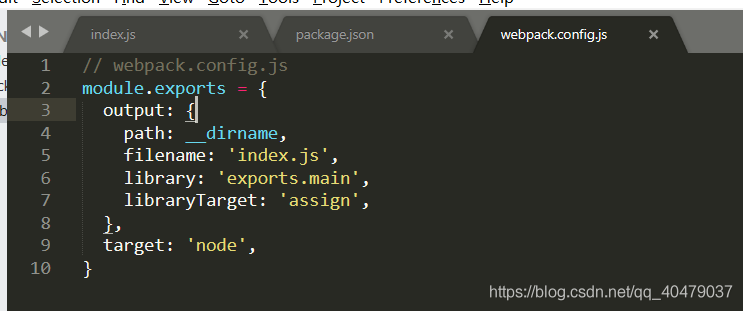

> 微信小程序——知晓云等云产品导出excel

<!--more-->

 参考链接：[微信小程序通过知晓云云函数导出excle（无须后台开发）_流转往复的博客-CSDN博客](https://blog.csdn.net/qq_18837459/article/details/86985748#commentsedit)

> 我是参考这篇文章做的，可以实现导出静态的excle，如果有更多的需求可以在此基础上自行拓展。

## **前言**

我们团队的小程序开发用知晓云作为后台（知晓云、云开发、bmob云之类，不需要后台开发接口只需要用后端云api操作云上的数据库），接到了一个需要在小程序端导出excle文件的项目。
 导出excel，在后端开发的时候是很简单的一个接口，但在云端的后台，没有现成的API，需要调用第三方库，但云函数所依赖的云端nodejs没有办法直接引入第三方库，所以问题如下：

1. 使用exceljs库函数生成excel
2. 引入exceljs库需要安装相关依赖（npm）
3. 安装相关依赖，导致不能在任意一个云产品的后台直接编写（本地编写代码）
4. 在本地写好之后，使用命令行工具，将代码包以及相关依赖上传至后台

云开发或者其他云后台的云函数，都是使用nodejs开发。

## 思路

1. 小程序端调用云函数（生成excel的云函数）,传参

2. 云函数接收参数，并生成excel文件，上传到云端后台，返回excel文件的url

3. 在小程序通过下载文件API下载需要导出的excel文件

## 开发步骤

### 1. 安装node.js

> 网上有很多教程，自行百度

### 2. 小程序编写

### 3. 按照知晓云注册指引完成操作，[链接 ](https://cloud.minapp.com/?invitation=juobmz)

### 4. 安装npm工具

`npm install -g mincloud`

### 5. 创建工作目录（随便哪个地方都可以）

进入工作目录（我是在桌面建了一个ifanrFunc的文件夹）

`cd C:\Users\Administrator\Desktop\ifanrFunc`

### 6. 本地登录知晓云后台

```
mincloud login d2****************83 6a************************************22
```

请到 [知晓云控制台](https://cloud.minapp.com/?invitation=juobmz) 查看 client_id 和 client_secret；如果登录失败，请检查 client_id 和 client_secret 是否已经改变。

### 7. 创建云函数

```shell
mincloud new exportExcle
cd exportExcle
```


**可以看出创建云函数就是创建一个文件夹 ，此时文件家中只有一个index.js文件夹**

### 8. 初始化 package，生成 package.json 文件（如果这一步报错，需要给这个文件夹设置写入权限，具体操作自行百度）

`npm init`


输入命令出现这个界面，一路回车就好。

成功后如下图：


### 9. 在第 7 步创建的exportExcle文件夹中，新建 src 文件夹，用来存放源码（第13步的index.js)。

> 接下来会使用 webpack 将 src 里的代码 打包并保存到 exportExcle 目录下的 index.js
>
> 打包可以理解为编译，将第三方库的函数替换为nodejs支持的函数


### 10. 在exportExcle目录新建 webpack.config.js 文件（先放空，内容在12步）


### 11. 安装 webpack

```
npm install -D webpack webpack-cli
```

安装过程： 


安装完：


### 12. 修改webpack.config.js和package.json script 配置

**webpack.config.js**

```
module.exports = {
  output: {
    path: __dirname,
    filename: 'index.js',
    library: 'exports.main',
    libraryTarget: 'assign',
  },
  target: 'node',
}
```



 **package.json**

```
  "scripts": {
    "build": "webpack --mode production",
    "deploy": "mincloud deploy xxxxx ../"
  },
```


### 13. 创建文件

在exportExcle目录下的src文件夹创建 index.js 文件

> src下的index.js是工作目录，就是你自己编写代码的地方
>
> exportExcle下的index.js是会被替换，存的是编译之后的代码（将你所使用的库函数进行替换），是直接上传到云端的文件

贴出参考博客中的代码，可以运行的（确认过眼神儿~~~）

```
var Excel = require('exceljs');
module.exports = function (event, callback) {
	

//cell style
var fills = {
    solid: {type: "pattern", pattern:"solid", fgColor:{argb:"FFFFAAAA"}}
};
//create a workbook
var workbook = new Excel.Workbook();

//add header
var ws1 = workbook.addWorksheet("测试一");
ws1.addRow(["地址","地面"]);
ws1.addRow(["总人口", "不可计数"]);
ws1.addRow(["类型", "动物", "非动物"]);
ws1.addRow(["统计日期", "1111-11-11 11:11:11"]);
ws1.addRow();

//A6:E6
ws1.addRow(["你", "在", "说些", "神马", "呢？"]);
ws1.getCell("A6").fill = fills.solid;
ws1.getCell("B6").fill = fills.solid;
ws1.getCell("C6").fill = fills.solid;
ws1.getCell("D6").fill = fills.solid;
ws1.getCell("E6").fill = fills.solid;

//7 - 13(A7:A13) - 7
ws1.addRow(["什么跟神马", 10, 1, "凡人修仙传", 7]);
ws1.addRow(["","","","一号遗迹", 2]);
ws1.addRow(["","","","六号遗迹", 0]);
ws1.addRow(["","","","古国一号", 0]);
ws1.addRow(["","","","锻体期", 0]);
ws1.addRow(["","","","合体期", 0]);
ws1.addRow(["","","","没资质", 1]);


ws1.mergeCells("A7:A13")
ws1.mergeCells("B7:B13")
ws1.mergeCells("C7:C13")

//a6-e13 a b c d e
//ws1.getCell('A7').alignment = { vertical: 'middle', horizontal: 'center' };

rowCenter(ws1, 6, 13);　
colWidth(ws1, [1,2,3,4,5], 20);

var ws2 = workbook.addWorksheet("测试二");


var ws3 = workbook.addWorksheet("测试三");

//设置　start-end　行单元格水平垂直居中/添加边框
function rowCenter(arg_ws, arg_start, arg_end) {
    for(i = arg_start; i <= arg_end; i++) {
        arg_ws.findRow(i).alignment = { vertical: 'middle', horizontal: 'center' };
        //循环 row 中的　cell，给每个 cell添加边框
        arg_ws.findRow(i).eachCell(function (cell, index) {
            cell.border = {
                top: {style:'thin'},
                left: {style:'thin'},
                bottom: {style:'thin'},
                right: {style:'thin'}
            };
        })

    }
}

//设置　start-end 列的宽度
function colWidth(arg_ws, arg_cols, arg_width) {
    for(i in arg_cols) {
        arg_ws.getColumn(arg_cols[i]).width = arg_width;
    }
}

workbook.xlsx.writeFile('/var/log/test2.xlsx')
    .then(function(){
    	//生成excle文件后，通过知晓云api上传到知晓云
		let MyFile = new BaaS.File()
		MyFile.upload('/var/log/test2.xlsx').then(function(a, b, c) {
			console.log(a,b,c);
			console.log('生成 xlsx');
			callback(null, "生成 xlsx")
		})
    });
}
```

### 14. 安装exceljs

```
npm install exceljs
```


安装成功之后，可以看到 package.json中多了一个依赖


### 15. 打包

```
npm run build
```

> 这个就是编译替换过程

### 16. 部署

```
npm run deploy
```

> 部署有点耗时间，耐心等待

### 17. 测试云函数


### 18. 使用小程序下载excel文件

```
wx.downloadFile({
  url: 'https://cloud-minapp-24278.cloud.ifanrusercontent.com/1gt1FlTKm39G6dug.xlsx', // 仅为示例，并非真实的资源
  success(res) {
    // 只要服务器有响应数据，就会把响应内容写入文件并进入 success 回调，业务需要自行判断是否下载到了想要的内容
    if (res.statusCode === 200) {
      // res.tempFilePath 
    }
  }
})
```

下面是我第一次玩时候操作过程的截图：可自行参考


