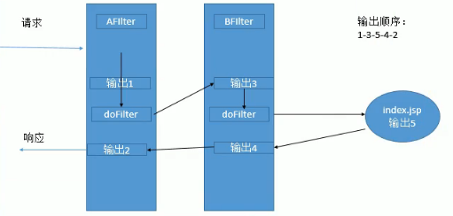
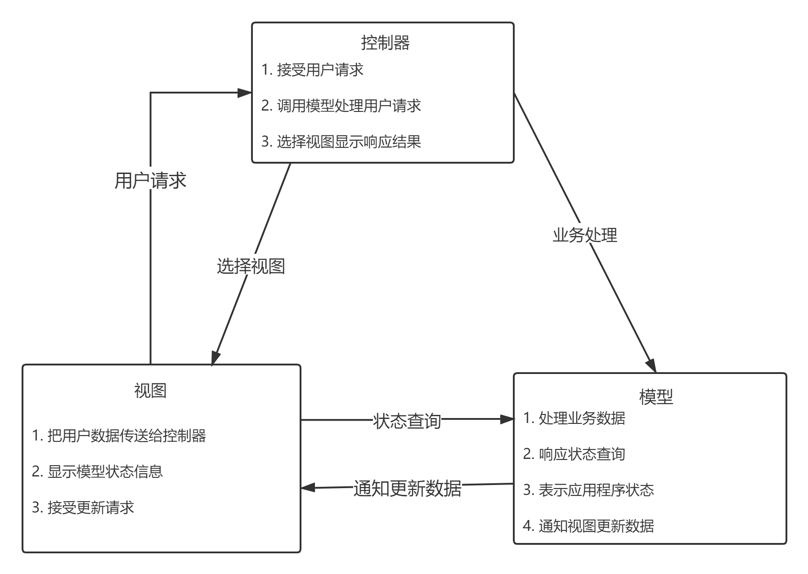

> 前置知识：
>
> [JavaSE]

Web是分布式应用框架

-   典型应用：浏览器/服务器架构(B/S架构)
-   通信模式：客户机/服务器模式
-   通信协议：超文本传输协议

-   使用 **超文本标记语言(HTML)** 链接网络中各个 **Web服务器** 信息资源

JSP(JavaServer Page)：服务器端的脚本语言，以Java和Servlet为基础的动态网页生成技术

-   由HTML代码和嵌入其中的Java程序段组成

>   JavaBean的应用范围
>
>   三大组件
>
>   JSP运行机制
>
>   JavaBean的四种作用范围
>
>   Cookie，session
>
>   JDBC连接过程
>
>   MVC，Dao
>
>   两种页面跳转方式：请求转发和重定向
>
>   三种页面间数据共享方式：重写URL，共享Session，使用Cookie

<!--more-->

# 1. Web

## 1.1 概念

>   Web是一种超文本信息系统

浏览器用HTTP协议与Web服务器通信，并且通过HTML实现了Web服务器之间资源的互连

### 超文本(Hyper Text)

全局性信息结构，将文档中的不同部分通过 `关键字` 建立链接，使信息得以用交互方式搜索

### 超媒体(Hyper Media)

超文本 和 多媒体 在信息浏览环境下的结合

### 万维网(World Wide Web)

|          |                                          |
| -------- | ---------------------------------------- |
| Internet | 是众多相互链接的计算机以及网络设备的集合 |
| WWW      | 是Internet上一种分布式应用结构           |

Internet采用超文本和超媒体的信息组织方式，将信息的链接扩散到整个Internet上

### 超文本传输协议(Hyper Text Transfer Protocal)

规定了 **Web的基本运作过程** 以及 **浏览器与Web服务器** 之间的通信细节

## 1.2 特征

1.  使用超文本技术的HTML表示信息资源以及建立资源之间的链接
2.  使用统一资源定位器定位Web服务器中信息资源的位置(Uniform Resource Locator,URL)
3.  使用HTTP协议定义与客户端与Web服务器之间的通信

## 1.3 技术沿革

1)静态页面阶段

2)浏览器端与用户交互阶段

3) 服务器端与用户交互阶段

Web服务器端能执行的程序分为两类

| 服务器端脚本程序  | 纯编程语言实现形式    |
| -------------------| --------------------- |
| 脚本语言编写的程序嵌入到HTML中，并在Web服务器上执行 | 纯编程语言编写的程序在Web服务器上运行自动生成HTML文档，然后返回客户端 |
| ASP，PHP，JSP                                       | Java,Servlet                                                 |
| 程序的业务逻辑与数据混杂在一起，降低可读性          | 使对页面的修改复杂                                           |

4)基于Web的应用阶段
通过编程整个Web站点

## JavaWeb

用户通过浏览器发送请求，服务器端通过Web容器运行Web应用，动态生成Web页面并传递给客户端的浏览器，浏览器解析为Web页面。

一个Web应用由于多层组件组成

| 表示层 | 前端技术：HTML,CSS,JS,AJAX,JQuery，JSP |
| ------ | -------------------------------------- |
| 控制层 | Servlet                                |
| 模型层 | JavaBean                               |
| 持久层 | JDBC，Hibernate，MyBatis               |

1.  Servlet：运行在服务器端的Java小程序，处理客户端发来的请求，并根据请求内容返回相应的响应

2.  JSP(Java Server Page)

    在HTML页面中加入JSP标记、Java脚本、执行和动作等元素，并通过Web容器运行的一种表示层技术，简化的Servlet，JSP在编译时会转化为一个Servlet程序执行

3.  JDBC(Java DataBase Connectivity)

    用于执行 Sql语句的JavaAPI，为多种数据库提供统一访问

4.  XML

    可扩展标记语言，跨平台表示语言，存储Web应用的配置信息

# 2. JavaBean

>   JavaBean是一种软件组件，实际上是使用Java语言编写的一个特殊Java类

分为两种:

-   用于GUI开发

-   用于Web应用开发，负责业务逻辑的处理

## 2.1 特点

封装了数据和逻辑业务，方便JSP和Servlet调用，实现了业务逻辑层与表示层的分离

JavaBean可以向JSP页面输出特定的数据

## 2.2 应用范围

### 2.2.1 会话范围(session)

>   主要应用在跨多个页面和时间段

例如：用户注册中保存用户信息、接受反馈信息、保存用户最近执行页面的轨迹等

-   往往是一个用户在不同的JSP页面操作，并且需要在页面之间共享数据

-   信息来自临时的会话Cookie，并在用户关闭浏览器时，从客户端和服务器删除

### 2.2.2 页面/请求范围(page/request)

主要用于处理表单

-   表单需要长时间的处理用户输入，通常情况下，用于页面接受HTTP的POST或GET请求
-   减少服务器上的负载，使用会话范围的JavaBean会消耗很多系统资源

### 2.2.3 应用范围(application)

常用于服务器部件

如：JDBC链接池，应用监视，用户计数和其他参与用户行为的类

## 2.3 开发

### 2.3.1 规范

1.  JavaBean必须是 `public` 类型的公共类
2.  在JavaBean中需要提供一个public类型的 **无参构造方法**
3.  为JavaBean的属性提供setter和getter方法为属性设置值、获取属性值getXxx(),setXxx(),isXxx()
4.  getter和setter方法必须是 `public`类型，JavaBean属性必须是 `private`类型
5.  将JavaBean单独放在一个命名包下

### 2.3.2 注意事项

1.  不要试图在JavaBean属性中设置HTML或JS脚本，因为不同的浏览器兼容性不同
2.  不要提供分支选择，如果用户使用不同的系统浏览页面，可以提供一种可以替换的方法

## 2.4 JavaBean设计

-   通过封装属性和方法称为具有某种功能或者处理某个业务的对象，建成Bean

-   Web应用的中转站

    在JSP中的数据暂存于JavaBean(利用属性存储),然后把JavaBean中保存的数据转存入数据库中或者相反。

-   将数据库表的字段设计为JavaBean的属性

## 2.5 访问JavaBean

### 2.5.1 声明

```jsp
<jsp:useBean id="对象名" class="javaBean完整包路径" scope="作用范围" />
```

-   id属性：代表引用JavaBean对象的ID，在该JSP页面中相当于一个局部变量，代表该JavaBean对象，同一会话范围，不允许有两个相同的JavaBean对象
-   class属性:代表引用的JavaBean的具体类名
-   scope属性：指定JavaBean的作用范围

### 2.5.2 访问JavaBean属性

```jsp
<jsp:setProperty property="属性名" name="JavaBean ID名" value="属性值" />
```

-   name属性：name属性对应于 `<jsp:useBean>` 动作标记中的ID属性值

- property属性:对应JavaBean类的同名成员变量

-   value属性：为Property属性设定值

### 2.5.3 获取JavaBean属性

```jsp
<jsp:getProperty property="属性名" name="JavaBean ID名" />
```


# 3. JavaWeb三大组件

## 3.0 概述

>   JavaWeb的三大组件，都需要web.xml进行注册（特殊：Listener活化、钝化、绑定、解绑用JavaBean实现）

Servlet：处理请求

Filter：对一些请求(Request)在访问Web应用之前进行预处理 或 对服务器的响应(Response)进行修改

Listener是Servlet的监听器，可以监听客户端的请求、服务端的操作等

-   `javax.servlet.*`:包含所有Servlet类实现的基本接口和继承的基本类
-   ` javax.servlet.http.*` :包含编写基于HTTP协议的Servlet所需的基类  

## 3.1 servlet

>   Servlet是使用Java语言编写的并且在 **包含着Java虚拟机的Web服务器端加载运行** 的程序，**能根据客户端的HTTP请求类型选择的Servlet方法处理请求并做出响应**


Servlet可以访问包括JDBC在内几乎所有的JDK API，支持HTTP协议与客户端进行通信

**Servlet与Applet区别**

-   Servlet运行在服务器端， Applet运行在客户端
-   Servlet装入Web服务器并在Web服务器上执行， Applet装入Web浏览器并在Web浏览器内执行  

### 3.1.1 Servlet作用

1.  创建并返回一个包含基于客户请求性质的、动态内容完整的HTML页面
    创建可嵌入到现有HTML页面中的一部分HTML页面(HTML片段)
2.  读取客户端发来的隐藏数据、显式数据
3.  与其他服务器资源进行通信(包括数据库和Java应用程序)
4.  通过状态码和响应头向客户端发送隐藏数据

### 3.1.2 Servlet生命周期  

始于被装入Web服务器内存时，并在Web服务器终止或重新装入Servlet时结束。（不包含内存回收动作）  


#### 1) 加载

Web服务器负责加载和实例化Servlet
该工作时机：在Web服务器启动时完成，也可以在Web服务器收到请求时完成，或者在二者之间  

#### 2) 初始化  

初始化Servlet(读取配置信息，初始化参数)，这些动作在生命周期中只需要执行一次。
由Servlet的 `init()` 方法负责执行完成。  

#### 3) 调用  

对于发送到Web服务器端的客户机请求， Web服务器创建针对于该请求的 **ServletRequest类型的请求对象** 和 **ServletResponse类型的响应对象** 。

Web服务器调用Servlet的service方法，用于传递请求对象和响应对象。

-   service()方法从request获得请求信息，处理该请求并用响应对象的方法将响应返回给客户机。

    service()方法根据客户端请求方式调用自身相应的方法(doGet和doPost)处理请求

-   请求对象：获得客户端发出请求的相关信息
    响应对象： Servlet建立响应头和响应代码，并可以写入响应内容返回客户端(提供将响应信息返回给浏览器的通信途径)

#### 4) 销毁

当服务器不在需要Servlet对象时或需要重新装入Servlet的新实例时， Web服务器会调用Servlet的 `destory()` ，销毁Servlet自行释放占用的系统资源。  

### 3.1.3 Java Servlet API  

 `javax.servlet.Servlet` 是Servlet体系结构的核心  

| Servlet实现   | javax.servlet.Servlet、javax.servlet.GenericServlet、javax.http.HttpServlet |
| ------------- | ------------------------------------------------------------ |
| Servlet配置   | javax.servlet.ServletConfig                                  |
| Servlet异常   | javax.servlet.ServletException、javax.servlet.UnavaliableException |
| 请求和响应    | javax.servlet.ServletRequest、javax.servlet.servletResponse、  javax.servlet.http.HttpServletRequest、javax.servlet.http.HttpServletResponse |
| 会话跟踪      | javax.servlet.http.HttpSession、javax.servlet.http.HttpSessionBindingListener、  javax.servlet.http.HttpSessionBindingEvent |
| Servlet上下文 | javax.servlet.servletContext                                 |
| Servlet协作   | javax.servletRequestDispatcher                               |
| 其他          | javax.servlet.http.Cookie、javax.servlet.http.HttpUtils      |

#### A. 实现Servlet  

三种方法
1) 实现Servlet接口
2) 继承GenericServlet类
3) 继承HttpServlet类  

```java
public class Servlet 类名 extends HttpServlet{
    /* 初始化Servlet对象 */
    public void init() throws ServletException{}
    
    /* Servlet处理业务的核心方法，自动执行，根据请求方式调用doXxx()方法 */
    protected void service(HttpServletRequest request,HttpServetResponse response)throws ServletException,IOException{}
    
    /* 处理GET方式的HTTP请求 */
    protected void doGet(HttpServletRequest request,HttpServetResponse response)throws ServletException,IOException{}
    
    /* 处理POST方式的HTTP请求 */
    protected void doPost(HttpServletRequest request,HttpServetResponse response)throws ServletException,IOException{}
}

/* 销毁Servlet对象 */
public void destory(){
```

1.  `public void init()`

    **仅执行一次 `init()` 方法**，即在Web服务器装入Servlet程序时执行该方法。

    init方法两种形式,无参init()和init(ServletConfig config)，重写该方法，可以初始化成员变量

2.  `public String getInitParameter(String name)`

    该方法返回指定**初始化参数name的数值**，不存在则返回null

    用来读取web.xml文件中定义的Servlet初始化参数

3.  `public Enumeriation getInitParameterNames()`

    返回Servlet的所有**初始化参数名称**

4.  `public void service(HttpServletRequest req,HttpResponse req)`

    客户每请求一次 `HttpServlet` 对象，该对象的 `service()`方法就调用一次

    默认的service()方法执行时总是调用与HTTP请求方式相对应的doXxx()方法

5.  `public void destory()`

    整个生命周期只执行一次，**Web服务器停止且卸载Servlet时执行该方法**

6.  `public String getServletInfo()`

    提供有关**Servlet的信息**

#### B. 创建Servlet

1) 扩展HTTPServlet抽象类

2) 重写适当方法，例如覆盖doGet()、doPost()方法

3) 配置Servlet

- 在Web应用的配置文件web.xml中添加对应的配置信息

- 初始化参数需要在创建Servlet时进行配置，使用ServletConfig对象的getInitparameter()方法获取指定参数及参数值

    在Servlet中直接使用注解方法配置

| 属性名      | 描述              |
| ----------- | ----------------- |
| description | Servlet的描述信息 |
| displayName | Servlet的显示名称 |
| initParams  | Servlet初始化参数 |
| name        | Servlet名称       |
| urlPatterns | Servlet的访问URL  |
| value       | Servlet的访问URL  |

```java
@WebServlet(name="",value="")
@WebServlet("/urlPattern")
@WebServlet(name="",urlPatterns={"",""})
@WebServlet(name="",value={"",""})
```

4)如果有HTTP请求信息，获取该信息，用HttpServletRequest对象检索表单数据或URL上的查询字段

5)生成HTTP响应。HttpServletResponse对象生成响应，并将其返回到客户机上。

用PrintWriter的print()方法输出内容返回给客户端

基于request和response对象可以创建out,session 和application内置对象

```java
PrintWriter out = response.getWriter();
HttpSession session = request.getSession();
ServletContext application = request.getServletServletContext();
```

#### C. 调用Servlet

1.  通过URL调用Servlet

    ```
    http://localhost:8090/url?para=date
    ```

2.  通过HTML表单FORM调用Servlet

    ```html
    <form action="Servlet的URL" method="post|get" name="">
    ```

## 3.2 Filter

>   Filter(过滤器)：在执行Web应用的其他逻辑之前首先运行，并做一些预处理，可以修改HTTP请求和响应等，但不能产生一个HTTP响应


### 3.2.1 Filter完成的工作

1.  在执行Servlet之前首先执行Filter程序，并为之作为一些预处理
2.  根据程序需要修改请求和响应
3.  在Servlet被调用Servlet后截获Servlet的执行

### 3.2.2 Filter API

1.  Filter接口

    Filter提供了三个方法，分别是init(),doFilter(),destory()

    -   doFilter(ServletRequest request,ServletResponse,FilterChain chain)

        Filter的核心方法，通过该方法对请求和响应进行处理，Filter通过参数 `FilterChain对象` ，将控制权转移给下一个Filter
        
        ```java
        doFilter(){ 
            
            //放行请求
            chain.doFilter(req,res);
        }
        ```

2.  FilterChain接口

    通过FilterChain调用过滤链中的下一个过滤器，如果是最后一个Filter,则下一个目标是调用目标资源

    Filter实质：

    当接收到Servlet请求时，回溯FilterChain，依次对目标资源进行处理

3.  FilterConfig接口

    获取过滤器名，初始化参数以及活动的Servlet上下文

| String  getFilterName()                    | 返回web.xml文件中定义的该过滤器名称                          |
| ------------------------------------------ | ------------------------------------------------------------ |
| ServletContext  getServletContext()        | 返回调用者所处的Servlet上下文                                |
| String  getInitParameter(String name)      | 返回过滤器初始化参数值的字符串形式，当参数不存在时，返回null |
| publicEnumeration  getInitParameterNames() | 以Enumeration形式返回过滤器所有的初始化参数值                |

### 3.2.3 配置

```xml
<filter>
    <filter-name></filter-name>
    <filter-class></filter-class>
</filter>

<filter-mapping>
	<filter-name></filter-name>
    <url-pattern></url-pattern>
</filter-mapping>

<!--
url-pattern的三种方式
1. 精确匹配-直接拦截指定路径（/pics/hh.jsp）
2. 路径匹配-拦截路径下所有请求（/pics/*）
3. 后缀匹配-拦截所有该后缀的请求（*.jsp）
-->
```

多个Filter的访问顺序



## 3.3 Listener

通过Listener监听Web服务其中的某一个执行动作，并根据其要求作出相应的响应

**Servlet共包含8个Listener接口，分为三类**

### 3.3.1 使用

>   实现对应的监听器接口 -> 配置 web.xml

-   JavaBean要实现的接口：HttpSessionActivitionListener,HttpSessionBindingListener

### 3.3.2 监听对象

>   ServeletRequest(2),HttpSession(4),ServletContext(2)

-   ServeletRequest：访问请求监听器，属性变化监听器

-   HttpSession：活化钝化监听器、解绑绑定监听器

-   ServletContext（生命周期监听器）

    监听服务器的启动、停止——ServletContext对象的创建与销毁

    一个Web项目对应一个ServletContext，代表当前项目的信息

    可以作为最大的域对象，项目运行期间共享数据

#### A. 与ServletContext有关的Listener接口

**ServletContextListener:实现ServletContext的启动和销毁监听**

|                          |                                |
| ------------------------ | ------------------------------ |
| contextInitialized()方法 | 创建ServletContext时触发       |
| contextDestoryed()方法   | 销毁ServletContext时触发该方法 |

**ServletContextAttributeListener:实现application范围属性的变化监听**

|                     |                                 |
| ------------------- | ------------------------------- |
| attributeReplaced() | 监听application范围的属性的替换 |
| attributeRemoved()  | 监听application范围属性的移除   |
| attributeAdded()    | 监听application范围的属性的添加 |

#### B. HttpSession有关的Listner接口

**ServletContextListener:实现ServletContext的启动和销毁监听**

|                          |                                |
| ------------------------ | ------------------------------ |
| contextInitialized()方法 | 创建ServletContext时触发       |
| contextDestoryed()方法   | 销毁ServletContext时触发该方法 |

参数为HttpSessionEvent类型对象，其方法getSession()方法可以获得session对象

**ServletContextAttributeListener:实现application范围属性的变化监听**

|                     |                           |
| ------------------- | ------------------------- |
| attributeReplaced() | 监听session范围属性的替换 |
| attributeRemoved()  | 监听session范围属性的移除 |
| attributeAdded()    | 监听session范围属性的添加 |

参数HttpSessionBindingEvent类型对象，getName()方法，获取属性名称

SevletContextAttributeEvent对象的getValue()方法，获取属性的值

**HttpSessionBindingEventListener:监听HttpSession对象的绑定状态**

|                |                             |
| -------------- | --------------------------- |
| valueUnbound() | 调用removeAttribute()时触发 |
| valueBound()   | 调用setAttribute()时触发    |

**HttpSessionActivationlIstener**:监听绑定在HttpSession对象中的JavaBean状态

|                  |                                                             |
| ---------------- | ----------------------------------------------------------- |
| sessionDidActive | 当绑定到HttpSession对象中的JavaBean对象被反序化时触发此方法 |

#### C. ServletRequest有关的Listener接口

**ServletRequestListener:用于监听ServletRequest对象的变化**

|                      |                          |
| -------------------- | ------------------------ |
| requestInitialized() | 初始化ServletRequest对象 |
| requestDestoryed()   | 销毁ServletRequest对象   |

**ServletRequestAttributeListener:用于监听ServletRequest对象属性的变化**

|                     |                          |
| ------------------- | ------------------------ |
| attributeRemoved()  | 用于属性修改时触发该方法 |
| attributeReplaced() | 用于属性修改时触发该方法 |
| attributeAdded()    | 用于属性增加时触发该方法 |

# 4. JSP

## 4.1 JSP运行机制


1.  客户端向Web服务器发送一个HTTP请求

2.  服务器启动一个线程，将静态的JSP页面转换为一个Servlet

3.  将此Servlet编译为中间代码文件(_jsp.java，\_jsp.class) 并加载运行，将执行结果以HTML页面的形式发送至客户端

4.  客户端请求完成后，将中间文件代码常驻服务器内存，客户机再次请求该页面时，直接执行常驻内存的字节码文件

JSP实际上是Servlet技术的扩展，便于支持HTML和XML页面

## 4.2 JSP页面基本结构

### 4.2.1 JSP注释

```jsp
<!-- -->
```

可见注释

-   用户在浏览器中右键查看源代码
-   在服务器端这个jsp页面被编译成的java文件

都能看见这个注释

```jsp
<%-- --%>
```

不可见注释

-   用户在浏览器中右键查看源代码 看到这个注释
-   在服务器端,这个jsp页面被翻译成的java中看到这个注释

 都不能看见这个注释

### 4.2.2 JSP声明

```jsp
<%! 声明语句; %>
```

1.  声明变量
2.  声明方法

JSP页面转化为Java类时，将声明的变量与方法转换为类变量与方法

声明的变量和方法都是页面级的，同一变量被所有用户共享

### 3.2.3 JSP表达式

```jsp
<%= %>
```

表达式在服务器运算后将结果转化为字符串，并且输出到JSP页面

### 4.2.4 JSP程序段

```jsp 
<% %>
```

当前JSP页面会被转化为一个Java类(Servlet)，而Java程序段将被放置到Servlet的service()方法中

一个页面的多个Java程序段会按照先后顺序执行

**作用域**

Java程序段中声明的变量，对该页面后继的所有程序段以及表达式都有效

### 4.2.5 JSP指令

负责提供**JSP页面的相关信息**以及**设置JSP页面的属性**  

#### <%@page %>  

设置页面属性

|              |                                                              |
| ------------ | ------------------------------------------------------------ |
| language     | 设置 **脚本语言的名称** ，目前只能为Java                     |
| contentType  | 声明JSP页面的MIME类型和字符编码集（默认为text/html;charset=iso-8859-1） |
| pageEncoding | 设置JSP页面字符编码，默认为 iso-8859-1 中文                  |
| import       | 导入该JSP页面所用的Java API,多个API之间用逗号隔开            |
| extends      | 定义此JSP页面产生的Servlet继承于哪个父类，<br />该父类必须为`implement`实现 javax.servlet.jsp.HttpJspPage 接口的类 |
| errorPage    | 指定该JSP页面发生错误时网页被重定向指向的错误处理页面        |
| isErrorPage  | 指定该JSP页面是否为错误处理页面                              |
| isELIgnored  | 是否忽略EL表达式，默认为false                                |
| buffer       | 指定该输出流缓存的大小，默认为8Kb                            |
| autoFlush    | 指定输出流缓存区的内容是否自动清除，默认为true               |
| session      | 指定该JSP页面是否支持多个用户同时请求，默认为true            |

#### <%@include %>  

```jsp
<%@include file="包含文件的URL" %>
```

页面包含指令，在JSP页面中可以使用include指令包含另一个文件（ JSP， HTML，普通文本文件）
相对路径  

-   涉及的JSP页面page指令的contentType属性值必须一致  

#### <%@taglib %>  

```jsp
<%@taglib uri="tagURI" prefix="prefix"%>
```

-   uri:指定自定义标签文件的路径
-   prefix:指定自定义标签的前缀  

### 4.2.6 JSP动作

#### `<jsp:include>`

```jsp
<jsp:include page="文件的URL| <%= 表达式%>" flush="true" />

<jsp:include page="文件的URL | <%= 表达式%>" flush="true">
嵌套的子标记
</jsp:include>
```

-   page：指定包含页面的相对路径(URL)或表示相对路径的表达式
-   flush：表示缓存是否会被清空

当需要传递参数时，需使用第二种语法格式；没有参数时，使用第一种语法格式

**include指令和动作标记的区别**

-   include指令是静态包含，在 **编译阶段** 执行，Servlet与主页面融合在一起，而且file属性不能是表达式，也不能传递参数
-   include动作标记是动态包含，在 **处理阶段** 执行，`file` 属性可以是表达式

#### `<jsp:param>`

用来传递参数，嵌套于其他动作标记中。参数以字符串形式传递

```jsp 
<jsp:param name="参数名称" value="参数值" />
```

#### `<jsp:forward>  `

页面重定向，跳转到page属性指定的页面

```jsp
<jsp:forward page="跳转页面的URL | <%=表达式 %>" />
<jsp:forward page="跳转页面的URL | <%=表达式 %>">
	<jspLparam value="参数值" name="参数名" />
</jsp>
```

地址栏不会变为跳转后的页面地址，一旦执行了 `<jsp:forward>` 动作标记，当前页面的后序代码将停止执行  

#### `<jsp:setProperty>  `

设置JavaBean属性的值  

```jsp
<jsp:setProperty 
                 name="useBean中属性id的值" 
                 property="* | JavaBean的属性名" 
                 value="JavaBean属性值 | <%=表达式 %>"/>
```

-   name: 应为该页面中的id值  
-   property: 
    -   当值为*时，表示存储用户在JSP页面中输入的所有值，并自动匹配JavaBean属性  
    -   当值为某一具体属性时，表示JavaBean中的一个具体属性名  
-   value: 为JavaBean中某一具体的属性赋值，可以是一个字符串或者是一个表达式 

#### `<jsp:getProperty>  `

获取JavaBean中指定属性的值  

```jsp
<jsp:getProperty name="useBean标记中属性Id的值" property="JavaBean的属性名" />
```

#### `<jsp:useBean>  `

```jsp
<jsp:useBean id="bean的名字" class="引用bean的类" scope="bean的作用域" />
<jsp:useBean id="bean的名字" class="引用bean的类" scope="bean的作用域">
</jsp:useBean>
```

-   id：引用javaBean在所定义的作用域内的名称，在此作用域内使用该id就代表所引用的JavaBean,区分大小写
-   class:所引用的javaBean的完整包路径
-   scope:指定该javaBean的作用域以及id变量名的有效作用域  

## 4.3JavaBean的作用范围

**page**：当前页面有效（用户间、页面不共享）

-   不同用户访问同一个页面，互不影响

**request**: 用户的请求期有效（ request间不共享）  

-   多个request请求同一页面，请求期间互不影响
-   当Web服务器对该请求做出响应后，该JavaBean无效

**session** ：用户会话期间有效（同一用户，页面间共享）

-   用户在多个页面间建立连接，共享同一JavaBean

**application**: 作用范围为整个Web应用（不同用户，不同页面共享）

-   对于同一id名称，此时在Web应用的每一个页面都共享同一个JavaBean，不同用户访问也是同一个JavaBean

## 4.4 JSP内置对象

不用声明就可在JSP页面中直接使用的对象


### 4.4.1 request

#### HTTP协请求报文4部分

**请求行(Request Line)**

-   请求方法字段

-   URL字段

-   HTTP协议版本字段

**请求首部(Header)**

-   客户端传递请求的附加信息和客户端把自己的附加信息给服务器的内容

-   Host:指出请求的目的地

-   User-Agent:表示服务器端和客户端脚本都能访问它，他是浏览器类型检测逻辑的重要基础，由客户端的浏览器来定义，并且在每个请求中自动发送

-   Connection:设置浏览器操作

**空行(Blank Line)**

即使不存在请求主体，此空行也是必需的

**请求数据(Body)**

#### request对象方法

request对象**获取客户端的请求信息**，以获取通过HTTP协议传送给服务器端的数据（头信息Header,请求方式Post和Get,以及客户端的其他信息）

利用getParameter()、setAttribute(),getAttribute()等方法**实现在两个页面间传递数据**

|                                                  |                                                       |
| ------------------------------------------------ | ----------------------------------------------------- |
| String  getHeader()                              | 获取HTTP协议的头文件信息                              |
| BufferedReader  getReader()                      | 以字符码的形式返回请求体                              |
| String  getCharcterEncoding()                    | 返回request请求体的字符编码                           |
| int  getContentlength()                          | 返回HTTP请求的长度                                    |
| String  getContentType()                         | 获取客户端请求的MIME类型                              |
| String  getContextPatn()                         | 获得上下文的路径，即当前Web应用的根目录               |
| String  getMethod()                              | 获取请求方法 GET POST                                 |
| String  getProtocal()                            | 返回请求所使用的协议及其版本                          |
| Object  getAttribute(String name)                | 获取name的属性值，若不存在返回null                    |
| Ennumeration  getAttributeNames()                | 返回一个枚举类型的 request对象所有属性名称的集合      |
| void  setAttribute（String  name,Object object） | 设置名为name的参数，其值为object                      |
| void  removeAttribute(String name)               | 删除名称为name的request参数                           |
| String  getParameter(String name)                | 获得指定参数name的参数值                              |
| Enumeration  getParameterValues()                | 返回一个枚举类型的所有参数名称的参数集合              |
| String[]  getParameterValues(String name)        | 返回包含参数name的所有值的数组                        |
| ServletInputStream  getInputStream()             | 得到请求体中一行的二进制流                            |
| String  getQueryString()                         | 获得查询字符串，该字符串在客户端以GET方式向服务器传送 |

**获取客户端及服务器的运行环境**

|                          |                                             |
| ------------------------ | ------------------------------------------- |
| String  getRemoteHost()  | 返回客户端的主机名                          |
| String  getScheme()      | 返回请求所用的协议名称(HTTP、HTTPS、FTP等)  |
| String  getRemoteAddr()  | 返回客户端的IP地址                          |
| int  getServerPort()     | 返回服务器的端口号                          |
| String  getServletPath() | 获得请求JSP页面的名称                       |
| boolean  getSession()    | 返回和当前客户端请求相关联的HTTPSession对象 |
| boolean  isSecure()      | 判断客户机是否以安全的访问方式访问服务器    |
| String  getServerName()  | 获取服务器名称，域名或IP地址                |

### 4.4.2 response

#### HTTP响应报文

包括**状态行(Status Line)**、**响应头(Header)**、**空行(Blank Line)**、**可选实体内容(Body)**

#### 请求状态行

状态行 **协议版本**、**状态码**、**相关的文本短语**

|      |                                      |
| ---- | ------------------------------------ |
| 1XX  | 请求被接收到，继续处理               |
| 2XX  | 被成功接收                           |
| 3XX  | 重发，为了完成请求必须采取下一步动作 |
| 4XX  | 客户端出错                           |
| 5XX  | 服务器端出错                         |

#### response对象常用方法

**获取**

|                                |                  |
| ------------------------------ | ---------------- |
| String  getCharacterEncoding() | 取得字符编码类型 |
| int  getBufferSize()           | 取得缓冲区的大小 |
| String  getContentType()       | 取得MIME类型     |
| Locale  getLocale()            | 取得本地信息     |

**输出**

|                                        |                          |
| -------------------------------------- | ------------------------ |
| ServletOutputStream  getOutputStream() | 返回一个二进制输出字符流 |
| PrintWriter  getWriter()               | 返回一个输出字符流       |

**新增**

|                                             |                                                    |
| ------------------------------------------- | -------------------------------------------------- |
| void  addCookie(Cookie cookie)              | 给客户端添加一个Cookie对象，保存客户端信息         |
| void  addDateHeader(String name,long value) | 添加一个日期类型的HTTP首部信息，覆盖同名的HTTP首部 |
| void  addIntHeader(String name,int value)   | 添加一个整型的HTTP首部，覆盖旧的首部               |

**操作**

|                                             |                                  |
| ------------------------------------------- | -------------------------------- |
| void  flushBuffer()                         | 清空缓存区                       |
| int  getBufferSize()                        | 取得缓存区的大小                 |
| void  resetBuffer()                         | 重置缓存区                       |
| void reset()                                | 重置response对象                 |
| void  setBufferSize(int size)               | 设置缓存区大小为Size             |
| void  setCharacterEncoding(String encoding) | 设置字符编码为encoding           |
| void  setContentType(String type)           | 设置MIME类型                     |
| void  setContentLength(int length)          | 设置响应数据的大小为length       |
| void  setDateHeader(String s1,long l)       | 设置日期类型的HTTP               |
| void  setHeader(String s1,String s2)        | 设置HTTP首部信息                 |
| void  setLocale(Locale locale)              | 设置本地化为locale               |
| void  setStatus(int status)                 | 设置状态码为status               |
| void  sendError(int sc)                     | 向客户端发送HTTP状态码的出错信息 |
| void  sendRedirect()                        | 重定向客户的请求到指定页面       |

**编译**

|                                       |                                      |
| ------------------------------------- | ------------------------------------ |
| String  encodeRedirectURL(String url) | 对使用的URL进行编译                  |
| StringencodeURL(String  url)          | 封装url并返回到客户端，实现URL的重写 |

 ```jsp
setHeader
	response.setHeader("Refresh","1") //设置自动刷新时间间隔
	response.setHeader("Refresh","10;URL=") //设置页面的自动跳转
sendRedirect
	response.sendRedirect("")//实现页面直接跳转
禁用页面缓存
	response.setHeader("Cache-Control","no-cache")
	response.setHeader("Pragma","no-cache")
	response.setDateHeader("Expires",0);
 ```

### 4.4.3 page

代表的是当前正在运行的JSP页面

被编译后的Servlet，相当于JAVA中的object类

|                   |                      |
| ----------------- | -------------------- |
| class  getClass() | 获取page对象的类     |
| int  hashCode()   | 获取page对象的hash码 |

### 4.4.4 pageContext

代表当前页面的所有属性和对象，可以通过该对象提供的方法获取其他内置对象

#### 获取其他内置对象

|                                     |
| ----------------------------------- |
| ServletRequest  getRequest()        |
| ServletResponse  getResponse()      |
| Object  getPage()                   |
| ServletContext  getServletContext() |
| JSPWriter  getOut()                 |
| HttpSession  getSession()           |
| ServletConfig  getServletConfig()   |
| Exception  getException()           |


#### 方法

| void  setAttribute(String name,Object obj) | 设置默认页面范围或对象范围内的属性值      |
| ------------------------------------------ | ----------------------------------------- |
| void  removeAttribute(String name)         | 删除属性name                              |
| void  forward(String url)                  | 将当前页面重影响到另一个页面或Servlet对象 |
| Object  findAttribute(String name)         | 查找在所有范围内属性名为name 的属性       |

### 4.4.5 out

向JSP页面输出各种类型数据，并管理Web服务器上的输出缓存区。输出包括(文本内容,HTML标签，JS脚本)

| void print()           | 向JSP页面输出数据，但不结束当前行，下一个输出仍将在本行输出 |
| ---------------------- | ----------------------------------------------------------- |
| void  println()        | 向JSP页面输出数据，结束当前行                               |
| void  newline()        | 换行                                                        |
| void close()           | 关闭输出流                                                  |
| void clear()           | 清空缓冲区数据，但不把数据写到客户端                        |
| void  clearBuffer()    | 清空缓冲区数据，并将数据写到客户端                          |
| void flush()           | 清空缓冲区数据                                              |
| boolean  isAutoFlush() | 是否自动清空缓冲，autoFlush通过page指令设置                 |
| int  getBufferSize()   | 返回缓冲区大小                                              |
| int  getRemaining()    | 返回缓冲区剩余空间大小                                      |

### 4.4.6 session

>   **跟踪用户状态**:指在一段时间内用户与Web应用的交互过程中，保存每个用户的用户信息和会话状态

-   由web容器自动创建，当初次登录Web应用时，分配唯一的用户表示session id，

-   用MAP保存数据，每个用户都有若干键值对

#### Web中跟踪用户状态的四种方法

1.  使用session

2.  在HTML表单中，加入隐藏字段，包含与跟踪用户状态的数据

3.  重写URL

4.  使用cookie传送

    客户端的Cookie通过HTTP头信息发送给服务器，用于唯一标识浏览器用户

    Cookie是保存在客户端某个目录下的文本数据，由服务器生成该数据，返回给客户端。

    键值对组成


#### 方法

| long  getCreationTime()                    | 返回session创建时间                              |
| ------------------------------------------ | ------------------------------------------------ |
| String  sessionId()                        | 返回用户的session id                             |
| long  getLastAccessedTime()                | 返回session最后一次被操作的时间，单位为毫秒      |
| Object  getAttribute(String name)          | 返回属性名为name的属性值                         |
| Enumeration  getAttributeNames()           | 返回一个枚举类型，即session的所有属性            |
| int  getMaxInactiveInterval()              | 返回两次操作的最大时间间隔，超时取消             |
| ServletContext  getServletContext()        | 返回session所属的ServletContext对象              |
| void  invalidate()                         | 取消会话                                         |
| boolean  isNew()                           | 返回服务器创建的一个会话，即客户端是否加入       |
| void  setAttribute(String name,Object obj) | 设置指定名称为name属性值为obj，并存储在session中 |
| void  removeAttribute(String name)         | 删除                                             |
| void  setMaxInactiveInterval(int time)     | 设置两次请求最大时间间隔为time                   |

### 4.4.7 application

**application**对象保存的是**Web应用**中的共享数据，被**所有用户**共享使用

**生命周期：**在Web服务器启动之后产生，直至Web服务器关闭之前。

| Object  getAttribute(String name)        | 获取name属性值                         |
| ---------------------------------------- | -------------------------------------- |
| Enumeration  getAttributeNames()         | 获取所有属性的名称，返回类型为枚举类型 |
| String  getInitParameter(String name)    | 获取name属性的初始值                   |
| String  getServerInfo()                  | 获取当前JSP引擎名及版本信息等          |
| String  getRealPath(String path)         | 返回当前Web应用的实际路径              |
| ServeletContext  getContext(String path) | 返回Web应用的application对象           |
| String  getMimeType(String file)         | 返回指定文件的MIME类型                 |
| URL  getResource(String path)            | 返回指定资源的URL                      |
| Servlet  getServlet(String name)         | 返回指定名称的Servlet                  |
| Enumeration  getServlets()               | 返回所有Servlet的枚举                  |
| Enumeration  getServletNames()           | 返回所有Servlet名的枚举                |
| int  getMajorVersion()                   | 返回服务器支持的Servlet API主版本号    |
| int  getMinorVersion()                   | 返回服务器支持的Servlet API此版本号    |
| void  setAttribute(String name,value k)  | 设置name的属性值为k                    |

### 4.4.8 config

用于读取Web应用的初始化参数

#### web.xml

配置WEB应用程序的欢迎页、Servlet、Filter等，保存于WEB-INF文件下

web.xml配置文件中的**元素名称及其顺序**有严格规定。

```xml
<web-app>包含web.xml中所有子元素</web-app>
<welcome-file-list>
	设置欢迎页面，为Web应用设置首页
    按顺序从第一个向后查找，若第一个存在，则后面不起作用
</welcome-file-list> 
```

##### 命名与定制URL

为JSP和Servlet文件命名，并定制URL

```xml
<servlet>   
    <description>描述该Servlet</description>
    <display-name>设置显示该Servlet的名称，为可选子元素</display-name>
    <servelt-name>设置Servlet的名称</servlet-name>
    <servlet-class>设置该Servlet具体的包路径</servlet-class>
    <load-on-startup>指定Servlet加载的次序，即启动装入优先权。数值越小，优先级越高</load-on-startup>
</servlet> 
```

```jsp
<servlet-mapping>
    <servlet-name>设置servlet的名称，必须与servlet-name下的子元素值相同</servlet-name>
    <url-pattern>设置Servlet的URL</url-pattern>
</servlet-mapping>
```

##### 定制初始化参数

设置Servlet、JSP、Context的初始化参数，使用config对象就可获取

```jsp
<init-param>
    <param-name>参数名</param-name>
    <param-value>参数值</param-value>
</init-param>
```

##### 指定错误处理页面

```jsp
<error-page>
	<error-code>状态码</error-code>
	<exception-type>指定异常类型</exception-type>
	<location>发生错误时跳转到的错误处理页面</location>
</error-page>
```

##### 设置过滤器

```jsp
<fileter>
    <fileter-name></fileter-name>
    <url-pattern></url-pattern>
</filter>
```

##### 设置监听器

```jsp
<listener>
    <listener-class></listener-class>
</listener>
```

##### 设置会话过期时间

```jsp
<session-config>
    <session-tomeout></session-timeout>
<session-config>
```

#### 方法

|                                      |                            |
| ------------------------------------ | -------------------------- |
| String getInitParameter(String name) | 返回名称为name的初始化参数 |
| Enumeration getInitParameterNames()  | 返回所有初始参数名称的枚举 |
| ServetContext getServletContext()    | 返回当前Servlet的上下文    |
| String getServletName()              | 返回当前Servlet的名称      |

### 4.4.9 exception

处理JSP页面执行时发生的异常

使用时需要指定错误处理页面，通过page指令设置错误处理页面

**注意**

1.  错误处理页面的page指令中isErrorPage属性值为true
2.  errorPage指定错误处理页面
3.  如果在产生异常的页面中使用try-catch-finally进行异常捕获和处理，则将不能触发异常处理页面

|                        |                                    |
| ---------------------- | ---------------------------------- |
| String getMessage()    | 返回异常信息                       |
| void printStackTrace() | 以标准错误的形式输出错误及跟踪信息 |
| String toString()      | 以字符串形式返回异常信息           |

# <span id="JDBC">5. JDBC</span>

## 5.1 概述

>   JDBC：用于 **执行Sql语句** 的Java API，可以为多种关系数据库提供统一访问，是一组用Java语言编写的类和接口

独立于特定的数据库管理系统，提供了通用的Sql数据库的操作接口，定义了访问数据库的标准Java类库包

通过JDBC就可以连接任何提供了JDBC驱动程序的数据库系统


Java应用程序通过JDBC API 和 JDBC Manager API 进行通信

-   JDBC Manager管理JDBC驱动程序(由数据库厂商提供， Java实现，套接字为底层)  

## 5.2 JDBC API访问数据库

### 5.2.1 基本步骤

(1) 加载JDBC驱动

(2) 建立数据库连接

(3) 创建操作数据库SQL的Statement、PrepareStatement、CallableStatement对象

(4) 执行语句并分析结果

(5) 关闭连接


#### 0). 环境

首先应将加载数据库的JDBC驱动程序(jar包)复制到Web应用程序的WEB-INF\lib目录下

#### 1). 加载驱动

>   通过反射机制创建数据库驱动程序实例

-   MySQL驱动类名为 `com.mysql.jdbc.Driver`

    ```java
    Class.forName("com.mysql.jdbc.Driver")
    ```

#### 2). 建立与数据库的连接

利用DriverManager类的方法getConnection()获得与特定数据库的链接实例

```java
String url = "jdbc:mysql://localhost:3306/userdb?user=root&password=passwd&userUnicode=true&characterEncoding=UTF-8"
Connection con = DriverManager.getConnection(url)
```

字符串拼接容易出错

```java
Connection con = DriverManager.getConnection("jdbc://mysql://localhost:3306/userdb",root,passwd);
```

#### 3)对数据库操作

JDBC提供三种执行SQL的对象

##### Statement对象执行静态SQL语句

```java
Statement = con.createStatement();

//使用executeQuery()方法执行Select语句，返回ResultSet类型
ResultSet rs = statement.executeQuery("select *from userdb");

//executeUpdate方法执行INSERT,UPDATE,DELETE等SQL语句，返回int 类型
int result = 0;
result = ststement.executeUpdate("DELETE FROM userdb where ");
```

##### PreparedStatement 执行动态SQL语句

```java
#查询
//声明动态SQL，参数使用？占位符表示
String sqlSelect = "SELECT * FROM userdb WHERE userName=?";
//创建PreparedStatement对象
PreparedStatement  psQuery = con.prepareStatement(sqlSelect);
//设置第一个参数
psQuery.setString(1,'Allen')
//使用executeQuery()方法执行SELECT语句，返回职位ResultSet类型
ResultSet rs = psQuery.executeQuery();

#更新
String sqlDelete = "DELETE FROM userdb WHERE username=?";
//创建PreparedStatement对象
PreparedStatement psUpdate = con.prepareStatement(sqlDelete);
psUpdate.setString(1,"Allen");
//使用executeUpdate()方法执行INSERT,DELETE,UPDATE等SQL语句
int result = 0;
result  = psUpdate.executeUpdate();
```

##### CallableStatement执行存储过程

CallableStatement中的新增方法用于处理OUT参数或INOUT参数的输出部分

为OUT类型参数赋值需要使用CallableStatement接口的registerOutParameter()方法

```java
/*创建CallableStatement
 ?为占位符，表示IN，OUT或INOUT类型的参数
*/
CallableStatement cs = con.prepareCall("{call sq_Search(?)}");
//使用setXxx()方法为IN参数赋值
cs.setString(1,"Allen");
//执行存储过程，该存储过程为执行一个查询，故使用executeQuery()
ResultSet rs = cs.executeQuery();
```

#### 4)对执行结果进行分析处理

##### 分析查询结果集ResultSet

执行SELECT语句后必然产生ResultSet结果集实例，用循环 `next` 遍历结果集中的没一行记录，使用 `getXxx()` 方法获取遍历记录行指定列的数据

```java
ResultSet rs = ststement.executeQuery("SELECT * FROM userdb");

//使用next()方法判断结果集是否有下一行，从而遍历结果集的所有记录航
while(re.next()){
    String username = rs.getString("username");
    String gender = rs.getString(2);
    System.out.println("用户名:"+username+"性别:"+gender);
}
```

##### 分析执行结果

执行INSERT,UPDATE,DELETE,一般由executeUpdate()方法执行并返回int类型，表示受影响的记录行数

```java
int result = 0;
String sql = "DELETE FROM userdb WHERE username='Allen'";
result = statement.executeUpdate(sql);

if(result > 0)
    System.out.println("删除成功!");
else
    Syetem.out.println("执行删除失败!");
```

#### 5)关闭JDBC对象

(1) 关闭结果集ResultSet对象

(2) 关闭Statement,PreparedStatement或CallableStatement对象

(3) 关闭连接对象

在应用程序操作完数据库之后，需要关闭JDBC相关对象，释放系统资源

在JDBC中建议使用PreparedStatement或者CallableStatement，防止SQL注入问题，减轻网络负载，但增加了数据库负载

## 5.3 JDBC API

### 5.3.1 驱动程序接口 Driver

>   将应用程序的API请求转换为特定的数据库请求

由驱动程序开发商提供JDBC驱动程序，并提供 java.sql.Driver 类
由 java.lang.Class 类的方法 forName() 加载该Driver类，创建实例并向java.sql.DriverManager 类注册该实例  

### 5.3.2 驱动管理器类 DriverManager  

管理数据库与对应驱动程序之间的连接

#### 方法

|                                                              |                                                      |
| ------------------------------------------------------------ | ---------------------------------------------------- |
| static  Connection getConnection(String url)                 | 建立与指定路径为url的数据库连接                      |
| static  Connection getConnection(String url,Properties prop) | 建立数据库连接，prop保存了数据库用户的用户名与密码等 |
| static  Connection getConnection(String url,String user,String password) | 建立与数据库连接，用户名，密码                       |

**JDBC URL标准语法**

```
jdbc:子协议://主机名:端口号/数据库名(可选)
```

-   第一个字段固定值jdbc，表示协议
-   第二个字段为子协议，区分JDBC驱动程序，不同数据库厂商子协议不同(如mysql,sqlserver)
-   第三个字段为指定数据库的主机名，由ip地址表示
-   第四个字段表示端口号

### 5.3.3 数据库连接接口

>   Connection 对象表示Java程序与特定数据库之间的连接

#### 方法

|                                                              |                                                      |
| ------------------------------------------------------------ | ---------------------------------------------------- |
| void close()                                                 | 关闭数据库连接                                               |
| boolean  isClosed()                                          | 判断当前Connection对象是否关闭                               |
| void  rollback()                                             | 回滚事务                                                     |
| void  commit()                                               | 向数据库提交添加、修改和删除等语句                           |
| boolean  getAutoCommit()                                     | 判断Connection对象是否为自动提交模式                         |
| void  setAutoCommit(boolean commit)                          | 设置是否为自动提交，默认为true                               |
| String  getCatalog()                                         | 获取Connection对象的当前目录名                               |
| boolean  isReadOnly()                                        | 判断当前Connection对象是否只读                               |
| void  setReadOnly(boolean readOnly)                          | 将此连接设置为只读模式                                       |
| Statement  createStatement()                                 | 创建Statement实例，执行SQL语句                               |
| Statement  createStatement(int rsType,int rsConcurrency)     | 产生指定类型的结果集                                         |
| Statement  createStatement(int rsType,int rsConcurrency,int rsHoldability) | 产生指定类型的结果集                                         |
| PreparedStatement prepareStatement(String sql)               | 创建一个PrepareStatement实例，执行含有参数的SQL语句，动态SQL |
| CallableStatement prepareCall(String sql)                    | 创建一个CallableStatement实例，该实例可执行存储过程          |


### 5.3.4 执行SQL语句接口 Statement

**三种Statement对象**

|                                                              |                                                              |
| ----------------- | ------------------------- |
| Statement         | 执行不含参数的静态SQL语句 |
| PreparedStatement | 执行带参数的动态SQL语句   |
| CallableStatement | 调用数据库的存储过程      |

**方法**

|                                                              |                                                              |
| ----------------------------------- | ------------------------------------------------------------ |
| void  isClosed()                    | 判断是否已关闭了此Statement对象                              |
| void close()                        | 立即释放此Statement对象占用的数据库和JDBC资源                |
| void  addBatch(String sql)          | 将给定的SQL命令添加到此Statement对象的当前命令列表           |
| void  clearBatch()                  | 清空次Statement命令列表                                      |
| int[]  executeBatch()               | 将一批命令交给数据库执行，如果所有命令执行成功，返回整型数据 |
| boolean  execute(String sql)        | 执行给定SQL语句，若执行成功返回true，否则返回false           |
| int  executeUpdate(String sql)      | 执行给定SQL语句，该语句可以是insert、uodate、update、delete语句，或者不返回任何内容的SQL语句 |
| int  getUpdateCount()               | 以更新技术的形式获取当前结果，若为ResultSet对象返回-1        |
| ResultSet  executeQuery(String sql) | 执行给定的SQL查询语句，返回ResultSet对象                     |

### 5.3.5 执行动态SQL语句接口 PreparedStatement

>   执行带参数的动态SQL语句，PrepareStatement实例执行SQL语句将进行预编译，并保存到实例中

**方法**

|||
| ------------------------- | ------------------------------------------------------------ |
| void  addBatch()          | 将一组参数添加到此PreparedStatement对象的批处理命令中        |
| void  clearParamenters()  | 立即清除当前参数值                                           |
| void  setXxx(int I,Xxx v) | 设置动态SQL语句中的第i个参数值为v，参数的数据类型为Xxx       |
| boolean  execute()        | 在此PreparedStatement对象中执行SQL语句                       |
| ResultSet  executeQuery() | 在此PreparedStatement对象中执行SQL查询，并将查询结果以ResultSet形式返回 |
| int  executeUpdate()      | 执行SQL语句，该语句必须是一个INSERT、UPDATE、DELETE语句，也可以是DDL语句 |

### 5.3.6 查询结果集接口 ResultSet

>   ResultSet 结果集是一张二维表，其中有查询返回的列标题以及对应的数据

**方法**

| xxx  getXxx(int columnIndex)   | 获取第columnIndex列数据类型为xxx的字段数据             |
| ------------------------------ | ------------------------------------------------------ |
| xxx  getXxx(String columnName) | 获取列名为columnName,列数据类型为xxx的字段数据         |
| boolean  next()                | 使指针向下移动一行，如存在下一行返回true,否则返回false |
| boolean  absolute(int row)     | 指针定位在指定行row，其实行号为1                       |
| boolean  first()               | 将指针定位在第一行，若结果集为null返回false            |
| boolean  last()                | 将指针定位在最后一行，若结果集为null返回false          |
| boolean  close()               | 释放ResultSet实例占用的数据库和JDBC资源                |

## 5.4 数据库连接池

>   **数据库连接池**:在一个虚拟的池中预先创建一定数量的Connection对象等待客户端的连接，当有客户端连接时则分配一个空闲的Connection对象给客户端连接数据库；
>
>   当客户端请求结束，将连接归还给数据库连接池，等待下一个客户端访问

-   数据库连接池负责分配、管理和释放数据库连接，允许应用程序重复使用一个现有的数据库连接。

### 5.4.1 数据库连接池工作过程

1.  预先定义一定数量的连接，并存放在数据库连接池中
2.  当客户端请求一个数据库连接时，系统将从数据库连接池中分配一个空闲的连接；当该请求结束时，该连接归还到数据库连接池中
3.  当连接池中的空闲连接数量低于下限时，连接池将会根据配置信息追加一定数量的连接对象；当空闲连接数量多于上限时，连接池会释放一定数量的连接。

### 5.4.2 连接池优势

1.  创建一个新的数据库连接所耗费的时间主要取决于网络的速度以及应用程序和数据库服务器(网络)的距离
2.  提高了数据库连接的重复利用率
3.  解决了数据库对连接数量的限制

### 5.4.3 使用连接池技术访问数据库

1.  在WEB应用的META-INF下新建context.xml文件，配置数据源

    ```xml
    <?xml version="1.0" enconding="utf-8">
             <Context>
                     <resource name="dbpool" 
                     type="javax.sql.DataSource"
                     auth="Container"
                     driverClassName="com.mysql.jdbc.Driver"
                     url = "jdbc:mysql://localhost:3306/test"
                     username="root"
                     passward="123"
                     maxActive="5"
                     maxIdle="2"
                     maxWait="6000"/>
             </Context>
    ```

    **Resource**元素的属性

| name            | 设置数据源JNDI名                                             |
| --------------- | ------------------------------------------------------------ |
| type            | 设置数据源的类型                                             |
| auth            | 设置数据源的管理者，有Container（容器创建者来创建和管理数据源）和Application（由Web应用程序来创建和管理数据源）两种 |
| driverClassName | 设置连接数据库的JDBC驱动程序                                 |
| url             | 设置连接数据库的路径                                         |
| username        | 设置连接数据库的用户名                                       |
| password        | 设置连接数据库的密码                                         |
| maxActive       | 设置连接池中处于活动状态的数据库连接的最大数目，0表示无限制  |
| maxIdle         | 设置连接池中处于空闲状态的数据库连接最大数目                 |
| maxWait         | 设置当连接池中处于空闲状态的连接请求数据库连接的请求的最长等待时间，超时抛出异常-1表示无限制 |

2.  使用JBDI访问数据库连接池

    JDBC提供了javax.sql.DataSource接口负责与数据库建立连接，在应用中，可直接从数据源(context.xml)中获得数据库连接。

    DataSource对象由WEB服务器提供

    ```java
    //context是javax.name包中的一个接口，用于查找数据库连接池的配置文件
    Context ctx  = new InitialContext();
    ctx = (Context)ctx.lookup("java:comp/env");
    
    DataSource ds = (DataSourcce) ctx.lookup("dbpool");
    Connection con = db.getConnection();
    ```

# 6.MVC与DAO模式

## 6.1 MVC模式

### 6.1.1 概述



MVC模式按功能对各种对象进行分割(这些对象用来维护和表现数据的)，目的是将各对象的耦合程度减小到最小

**Model模型**：*访问数据，处理数据*。用于封装与应用程序的业务逻辑相关的数据以及数据处理方法。

当模型发生改变时，会通知视图，并且为视图提供查询模型相关状态的能力；

为控制器提供访问封装在模型内部的应用程序的能力

**View视图**：*接受请求，可视化响应*。从模型获得数据并制定这些数据如何表现。

当模型变化时，视图负责维持数据表现的一致性，视图同时负责将用户需求通知控制器

**Controller控制器**：*业务流程控制，决定数据流方向——用哪个模型处理数据*  用于控制应用程序的流程。

处理事件并做出响应。事件包括用户的行为和数据模型上的改变

### 6.1.2 MVC工作过程

1.  客户通过视图发出请求，该请求转发给控制器
2.  控制器接受用户请求，决定使用何种业务逻辑处理该请求，并调用相应的模型处理
3.  模型处理用户请求并存取相关数据，客户查询检索的任何数据都被返回给控制器
4.  控制器接收从模型返回的数据，并选择适当的视图显示响应结果

### 6.1.3 Web模式发展历程

#### 传统Web框架

特点：简单直观，易于搭建原型

但维护困难，代码可读性差，程序和页面耦合度高，致使程序不易扩展，分工不明确，开发效率低。

 


#### JSP Model1

JSP页面负责调用模型组件以响应客户请求，并将处理结果返回给用户。

JSP负责视图和控制器双重功能，JavaBean负责业务处理逻辑


#### JSP     Model2

使用JSP生成视图层内容；

使用Servlet实现业务逻辑控制，处理客户机请求，充当控制器的角色；

使用JavaBean充当模型，用于数据的存储于提取


演进式开发

-   Alibaba PHP-->个人网站
-   用户量大-->Java
-   去IOE -->Mysql-->AliSql,AliRedis
-   All in one --> 微服务

特点：

-   有利于代码复用
-   有利于开发人员分工
-   有利于降低程序模块间的耦合度

## 6.2 DAO模式

对业务层提供数据抽象层接口

### 6.2.1 目标

-   数据存储与逻辑处理的分离

    DAO模式将数据访问划分为接口层和实现层，从而分离了数据使用和数据访问的实现细节

-   数据抽象 

    DAO模式通过对底层数据封装，为业务层提供一个面向对象的接口，使得业务逻辑开发人员可以面向业务的实体进行编码

### 6.2.2 MVC与Dao

#### model ——dao,service

数据层，数据Dao Value Object

-   保存数据状态

-   pojo:User
    -   vo:UserVo
    -   dto:

服务层,行为Service

-   业务逻辑

#### view——jsp

显示页面

#### controller——servlet

接受请求，委托模型层处理，完毕后返回给视图，由视图展示

-   取得表单数据
-   调用业务逻辑
-   转向指定的页面


1.  用户发请求
2.  Servlet接受请求数据，并调用对应的数据业务逻辑方法
3.  业务处理完毕，返回更新后的数据给Servlet
4.  servlet转向JSP，由JSP来渲染页面
5.  响应给前端更新后的页面

### 6.2.3 实现DAO模式的步骤

#### 数据库连接类

数据库连接类既可以使用基本的JDBC技术实现，也可以使用DBCP等数据库连接池技术实现

#### VO类

VO类是值对象，包含所有属性与表中字段完全对应的类，在该类中提供setter和getter方法设置并获取该类中的属性

仅仅含有私有成员变量和响应的setter和getter方法的类，可以理解为一种简化的JavaBean

#### DAO接口

DAO接口为开发人员提供了访问数据库表的一些通用方法，是开发人员操作数据库的接口，

并将数据访问和底层和数据操作分离，降低了应用程序对底层数据库的依赖

DAO接口命名格式为“I+VO类+Dao”

#### DAO实现类

DAO实现类实现类DAO接口，并实现类DAO接口中所有的抽象方法，

在DAO实现类中设计SQL语句，DAO实现类往往与具体的底层数据库较为紧密

#### DAO工厂类

用工厂方法代替new操作的一种模式。相当于创建实例对象的new，需要根据Class类生成实例对象

## 6.3 请求转发与重定向

实现Web应用资源（包括HTML/JSP页面、Servlet对象等）相互关联与整合

-   请求转发
-   重定向
-   包含 `<jsp:include>`

### 6.3.1 请求转发

请求转发方式允许将客户端的请求转发给 **同一个Web应用的其他资源**

在Servlet对象中选择客户请求做一些预处理操作，然后将客户请求转发给其他资源

共享同一用户请求

```java
RequestDispatcher dispatcher = request.getRequestDispatcher("target.jsp");
dispatcher.forward(request,response);
```


### 6.3.2 重定向

目标资源可以不在同一Web应用中

```java
response.sendRedirect("pages/target.jsp");
```

与请求转发区别

（1）Web资源可以重定向任何一个URL

（2）重定向是返回一个应答给客户端，然后再重新发送一个请求给目标URL，所以浏览器地址栏中会更新为目标资源的URL

RequestDispatcher不会更新浏览器资源栏

（3）在使用重定向时，Web资源之间不会共享使用用户请求对象

## 6.4 页面间数据的共享方式 

### 6.4.1 重写URL

在URL后附加参数，称为查询字符串

**？**后附加查询键值对

**获取查询字符串对应值**

```java
String id= request.getParameter("id");
```

缺点：

（1）重写URL的页面必须动态生成

（2）用户数据暴露，容易造成安全隐患

（3）URL长度有限制，若传递大量数据，造成性能下降

（4）必须对所有指向本Web站点的URL进行编码

（5）访问不方便，不能预先记录访问页面的URL

### 6.4.2 共享会话

使用session内置对象访问共享用户数据

session对象的setAttribute(String name,Object object)方法可以设置在会话期间共享的数据属性的名称和值

session过期时间设置

```xml
<session-config>
	<session-timeout>minutes</session-timeout>
</session-config>
```

### 6.4.3 使用Cookie

Cookie用户存储Web服务器发送客户机的信息（通常以文本形式保存在客户端）

当客户端第一次访问服务器时，服务器为用户创建一个Cookie对象，在响应客户端的同时Cookie对象发送到客户端

服务器程序需要读取Cookie时，可以再由Resuqst对象获取Cookie中的数据

 Cookie以 “name/value” 映射形式保存数据

1.  通过Cookie构造方法创建Cookie对象

    ```java
    Cookie cookie=new Cookie(String name,Object object)
    ```

2.  设置Cookie的最大保留时间

    ```java
    cookie.setMaxAge(int value);//单位为秒
    ```

3.  将Cookie对象添加到响应对象中

    ```java
    response.addCookie(Cookie onject);
    ```

4.  得到从客户端发来的Cookie对象

    ```java
    Cookie[] cookies=request.getCookies();//返回一个Cookie数组
    ```

5.  获取Cookie中的数据方法

    ```java
    cookie.getName();//键名
    cookie.getValue();//值名
    ```

# 7. EL表达式

```jsp
<%=expression %>的优化
```

## 7.1 EL简介

中文称为表达式语言

特点：

-   在EL表达式中可以访问JSP内置对象
-   EL表达式可以访问一般变量，还可以访问JavaBean中的属性以及嵌套属性和集合对象
-   在EL表达式中可以执行关系、逻辑和算数等运算
-   在EL表达式中可以访问JSP作用域(request、session、page、application)
-   EL表达式中可以直接调用一个普通的Java类中的公共静态方法

## 7.2 EL语法

```jsp
${expression}
```

### 7.2.1 EL运算符

| ?:——条件语句 |
| -------- |
| +        |
| *        |
| /或div——除法 |
| %或mod——取余 |
| ==或eq   |
| !=或ne——不等于 |
| <或lt    |
| >或gt    |
| <=或le   |
| >=或ge   |
| &&或and  |
| $\mid$ ——或or |
| !或not   |
| empty    |

表达式中操作符要与操作数用空格分隔

### 7.2.2 使用EL表达式访问JavaBean对象

```jsp
${JavaBean对象名称.属性名称}
```

### 7.2.3 使用EL访问隐式对象

| applicationScope | 应用范围的对象集合                   |
| ---------------- | ------------------------------------ |
| sessionScoppe    | 所有会话范围的对象集合               |
| requestScope     | 所有的请求范围对象集合               |
| pageScope        | 所有页面范围的对象集合               |
| cookie           | 所有cookie组成的集合                 |
| header           | HTTP请求头部，字符串                 |
| headerValues     | HTTP请求头部，字符串集合             |
| initParam        | 全部应用程序参数名责成的集合         |
| pageContext      | 当前页面的对象，提供了页面属性的访问 |
| param            | 所有请求参数字符串组成的参数集合     |
| paramValues      | 所有作为字符串集合的请求参数         |

# 8. Web开发中常见问题

## 8.1 中文问题

### 8.1.1 起因

很多媒介质（例如数据库，文件等）的存储方式都是基于字节流，Java应用程序与这些媒介交互时会发生字符（char）与字节（byte）之间的转换

（1）从JSP页面表单提交数据到Java应用程序（Servlet）时，需要进行从字节到字符的转换

（2）从Java应用程序到JSP页面显示时需要进行字符到字节的转换

（3）从数据库到Java程序读取时，需要进行从字节到字符的转换

（4）从Java程序到数据库存储时，需要进行从字符到字节的的转换

（5）当一些文件被Java程序读取时，需要进行从字节到字符的转换

（6）当Java应用程序向一些文件存储数据时需要进行从字符到字节的转换

 

转换过程中使用的编码方式与字节原有的编码不一致时，中文信息就会出现乱码

###  8.1.2 常见字符集

#### ASCII

包括英文字母，阿拉伯数字和标点符号

#### GB2312-80

简体汉字标准字符编码方案，区位码

#### GBK

向下完全兼容GB2312

#### GB18030

向下兼容GBK

#### Unicode

国际统一标准称为Unicode

Unicode为每一个字符提供了唯一特定数值

三套编码方案：UTF-8，UTF-16，UTF-32

#### ISO8859-1

Latin-1，西欧语言

#### BIG5

大五码，繁体中文

### 8.1.3 中文问题解决办法

#### JSP页面显示乱码问题

在JSP页面的page指令的contentType属性和pageEncoding属性以及HTML的meta标签的charset属性指定使用中文编码即可

指定字符集时，不区分大小写

JSP页面中文输出出现乱码，设置响应报文的MIME类型

```jsp
response.setContentType("text/html;charset=UTF-8");
```

#### 表单提交中文时出现乱码问题

**第一种方法**

获取表单数据的页面或Servlet中首先使用request对象的setCharacterEncoding()方法强制设定获取表单数据的编码方式

此时表单的提交方式，method属性必须设定为"POST"方式

```jsp
request.setCharacterEncoding("UTF-8");
String name=request.getParameter("name");
```

**第二种方法**

使用String类的构造方法对字符和撺弄进行重构

```jsp
String name=request.getParameter("name");
name=new String(name.getBytes("ISO-8859-1"),"utf-8");
```

String.getBytes(String decode)

-   根据decode编码返回该编码下字符的Bytes数组表示
-   中文占两位，高八位，低八位

new string(byte[],decode)

-   根据decode将byte数组转换为字符串

#### 数据库连接出现乱码问题

在数据库连接字符串中加入编码字符集

```java
String url="jdbc:mysql//localhost:3306/database?user=root&password=pwd&useUnicode=true&characterEncoding=UTF-8";
```

#### 数据库显示中文信息的乱码问题

Java程序访问MySQL数据库中的varchar、text等类型字段时会出现中文乱码问题

编写转换编码的公共类

```java
public class StringConvert{
    /* 将ISO-8859-1编码的字符转换为UTF编码方式 */
    public static String iso2utf(String s){
        String gb;

        try{
            if(s.equal("")||s==null){
                return "";
            }
            else{
                s=s.trim();//删除字符串头尾空白符
                gb = new String(s.getBytes("ISO-8859-1"),"UTF-8");
                return gb;
            }
        }catch(Exception e){
            System.err.print("编码格式转换错误："+e.getMessage());
            return "";
        }
    }

    //将UTF-8编码字符转换为ISO-8859-1编码方式
    public static String utf2iso(String s){
        String gb;

        try{
            if(s.equal("")||s==null){
                return "";
            }
            else{
                s=s.trim();//删除字符串头尾空白符
                gb = new String(s.getBytes("UFT-8"),"ISO-8859-1");
                return gb;
            }
        }catch(Exception e){
            System.err.print("编码格式转换错误："+e.getMessage());
            return "";
        }
    }
}
```

## 8.2 分页显示

### 8.2.1 设计思路

总记录数：表示从数据库中检索出满足条件的记录总数

每页显示记录数：表示程序中设定的每页显示记录的最大个数

总页数：总记录数/每页显示记录数

当前页码：当前JSP页面中显示记录的页码

**两种思路**

1.  一次性的从数据库查询所有符合条件的记录，然后利用程序实现分页
2.  基于数据库的分页技术（利用SQL语句）实现分页

### 8.2.2 不同数据库中实现分页显示

```sql
select * from db limit M ,N
```

从M开始的N条记录

上一页：M=（当前页码-1）*每页显示最大记录数+1

下一页：M=（当前页码+1）*每页显示最大记录数+1

## 8.3 格式化数值与日期

NumberFormat格式化数字，DateFormat格式化日期

**二者本身都是抽象类，不能实例化对象**

在java.text包中有一个抽象类Format，NuberFormat和DateFormat都是Format的直接子类

### 8.3.1 数值格式化

方法

| StringFormat(long  number)          | 将数值、日期格式化为字符串                |
| ----------------------------------- | ----------------------------------------- |
| Locale[]  getAvailableLocales()     | 返回系统支持的Locale对象数组              |
| NumberFormat  getCurrencyInstance() | 返回默认locale的货币格式,也可指定Locale   |
| NumberFormat  getNumberInstance()   | 返回默认locale的数值格式,也可指定Locale   |
| NumberFormat  getPercentInstance()  | 返回默认locale的百分比格式,也可指定Locale |
| Number  parase(String source)       | 将字符串解析为数值                        |

指定Locale

```java
NumberFormat nf =  NumberFormat.getInstance(Locale.CHINA);
```

locale用于封装特定的国家或地区、语言环境

### 8.3.2 日期格式化

| String  format(long number)       | 将日期、时间格式化为字符串                   |
| --------------------------------- | -------------------------------------------- |
| Number  parse(String source)      | 将字符串解析为日期                           |
| Calendar  getCalendar()           | 获得与此日期/时间相关联的日历                |
| DateFormat  getDateInstance()     | 返回默认Locale的日期格式，也可指定Locale     |
| DateFormat  getDateTimeInstance() | 返回默认Locale的日期时间格式，也可指定Locale |
| DateFormat  getTimeInstance()     | 返回默认Locale的时间格式，也可指定Locale     |

getInstance(type,locale)两个参数

四种类型

| DateFormat.SHORT  | 中19-6-6              |
| ----------------- | --------------------- |
| DateFormat.MEDIUM | 中2019-6-6            |
| DateFormat.LONG   | 中2019年6月6日        |
| DateFormat.FULL   | 中2019年6月6日 星期六 |