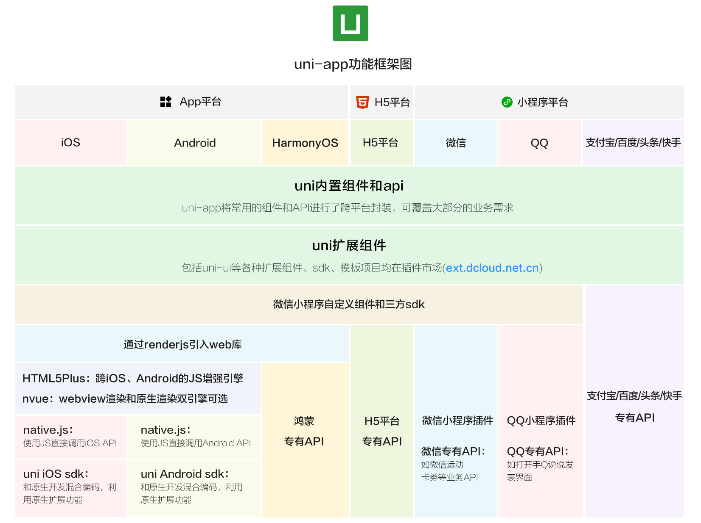
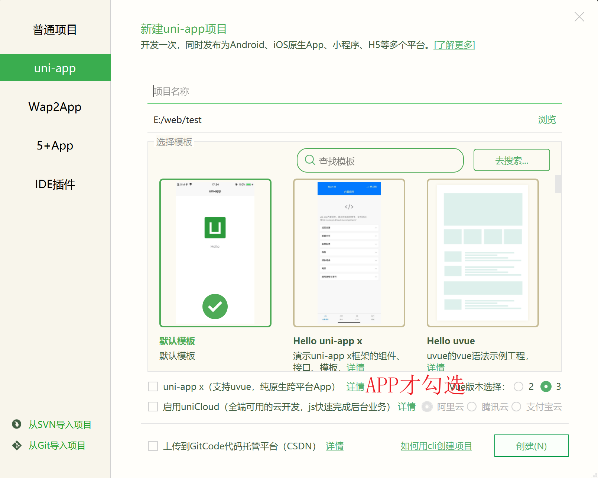
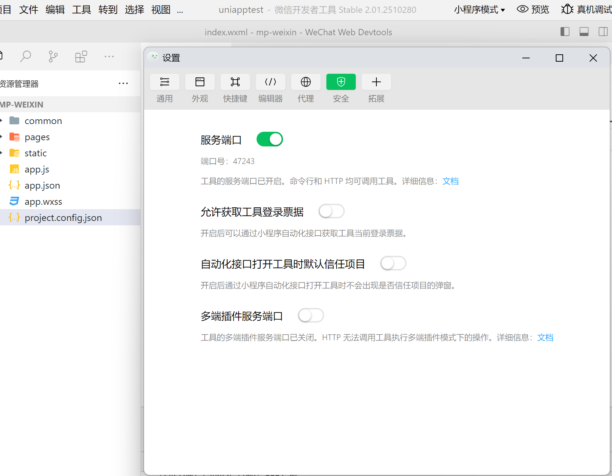
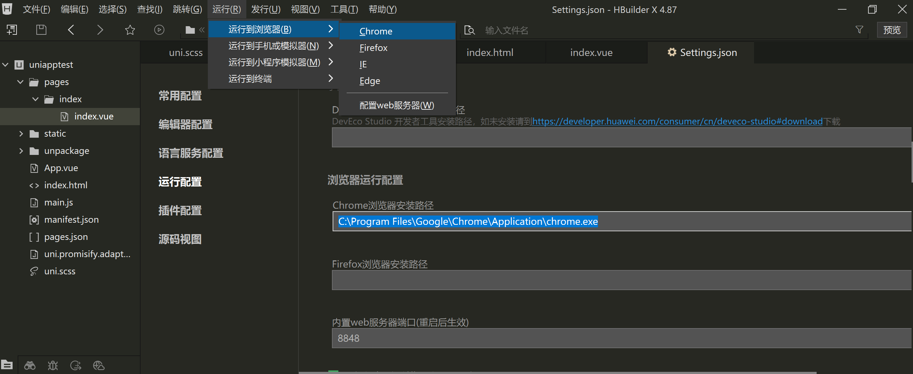
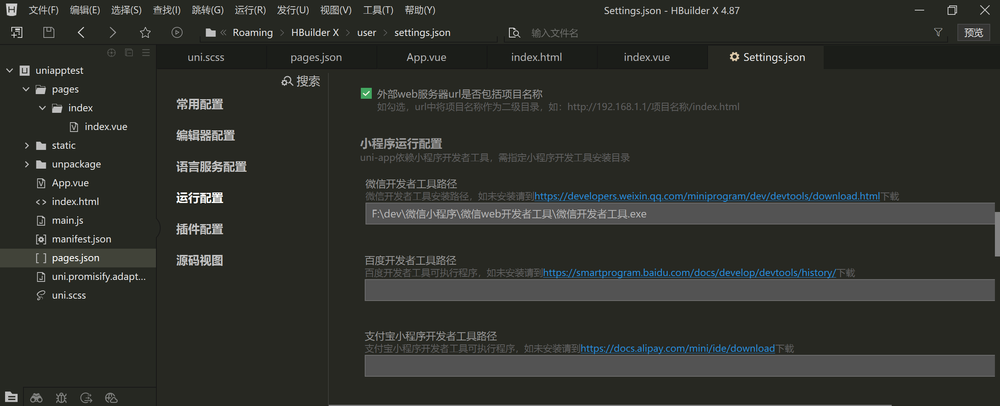

> https://www.bilibili.com/video/BV1Yg4y127Fp/?spm_id_from=333.337.search-card.all.click&vd_source=260d5bbbf395fd4a9b3e978c7abde437

<!--more-->

## 4.1 简介

> uni-app是基于Vue.js开发的所有前端应用的框架，编写一套代码，可发布到IOS、Android、鸿蒙Next、Web以及各种小程序等平台

特性：

- 跨端抹平度

- 平台能力不受限：通过条件编译+平台特有API调用，可以为不同平台编写各自专有代码；

  支持原生代码混写与原生SDK的集成

- 性能体验优秀

  加载新页面速度快、自动diff更新数据

  APP端支持原生渲染，可支撑更流畅的用户体验

  小程序端的性能优于市场其他框架。

  [《uni-app框架如何实现高性能》](https://v.qq.com/x/page/r0886mn8v6l.html)

- 生态丰富：

  支持NPM、支持小程序组件和SDK

  微信生态的各种sdk可直接用于跨平台App。

功能架构图



### 各端对比、技术选型参考

https://uniapp.dcloud.net.cn/select.html

### 4.1.1 开发环境配置及项目创建、运行、发布

#### 新建项目

> https://uniapp.dcloud.net.cn/quickstart-hx.html



#### 配置HBuilder编译器

> 在相应配置项中，添加对应编译器exe的路径
>
> - 如果是第一次使用，需要配置开发工具的相关路径。点击工具栏的运行 -> 运行到小程序模拟器 -> 运行设置，配置相应小程序开发者工具的路径。
>
> - 微信小程序工具需要配置允许权限，不然HBuilder无法调用微信小程序开发工具的命令行
>
>   打开 <安全设置-服务端口>
>
>   
>
> - 支付宝/百度/抖音/360小程序工具，不支持直接指定项目启动并运行。因此开发工具启动后，请将 HBuilderX 控制台中提示的项目路径，在相应小程序开发者工具中打开。
>
> - 如果自动启动小程序开发工具失败，请手动启动小程序开发工具并将 HBuilderX 控制台提示的项目路径，打开项目。

**外部浏览器**



**微信小程序**



#### 运行

快捷键 `Ctrl+R`

#### 发布

[链接](https://uniapp.dcloud.net.cn/quickstart-hx.html#%E5%8F%91%E5%B8%83uni-app)

### 4.1.2 通过vue-cli创建

[链接](https://uniapp.dcloud.net.cn/quickstart-cli.html)

### 4.1.3 一些兼容性问题

https://uniapp.dcloud.net.cn/matter.html

### 4.1.4 开发过程的FAQ

https://uniapp.dcloud.net.cn/faq.html

**uni-app 中可使用的 UI 框架：**https://ask.dcloud.net.cn/article/35489

**uni-app 导航栏开发指南：** https://ask.dcloud.net.cn/article/34921

**uni-app 实现全局变量：** https://ask.dcloud.net.cn/article/35021

**uni-app 引用 npm 第三方库：** https://ask.dcloud.net.cn/article/19727

**uni-app 中使用微信小程序第三方 SDK 及资源汇总：**https://ask.dcloud.net.cn/article/35070

**uni-app/uni-app-x 小程序项目配置 `占位组件(componentPlaceholder)`：**https://ask.dcloud.net.cn/article/42114

**原生控件层级过高无法覆盖的解决方案：**https://uniapp.dcloud.io/component/native-component

**国际化/多语言/i18n方案：**https://ask.dcloud.net.cn/article/35872

**本地存储详解：**https://ask.dcloud.net.cn/article/166

### 4.1.5 其他类型项目转uni-app

`uni-app`可以多端输出，也欢迎各平台之前的老项目向uni-app转换迁移。

**vue h5项目转换uni-app指南：**https://ask.dcloud.net.cn/article/36174

**微信小程序转换uni-app指南及转换器：**https://ask.dcloud.net.cn/article/35786

**wepy转uni-app转换器：**https://github.com/zhangdaren/wepy-to-uniapp

**另一种有效的wepy转uni-app方法：** https://ask.dcloud.net.cn/article/39125

**mpvue 项目（组件）迁移指南、示例及资源汇总：** https://ask.dcloud.net.cn/article/34945

### 4.1.6 运营

## 4.2 前置知识

uni-app代码编写，基本语言包括js、vue、css。以及ts、scss等css预编译器。

在app端，还支持原生渲染的[nvue](https://uniapp.dcloud.net.cn/tutorial/nvue-outline.html)，以及可以编译为kotlin和swift的[uts](https://doc.dcloud.net.cn/uni-app-x/uts/)

DCloud还提供了使用js编写服务器代码的uniCloud云引擎。

### 4.2.1 约定的开发规范与跨端原理

- 页面文件遵循 [Vue 单文件组件 (SFC) 规范](https://vue-loader.vuejs.org/zh/spec.html)，即每个页面是一个.vue文件
- 组件标签靠近小程序规范，详见[uni-app 组件规范](https://uniapp.dcloud.net.cn/component/)
- 接口能力（JS API）靠近小程序规范，但需将前缀 `wx`、`my` 等替换为 `uni`，详见[uni-app接口规范](https://uniapp.dcloud.net.cn/api/)
- 数据绑定及事件处理同 `Vue.js` 规范，同时补充了[应用生命周期](https://uniapp.dcloud.net.cn/collocation/App.html#applifecycle)及[页面的生命周期](https://uniapp.dcloud.net.cn/tutorial/page.html#lifecycle)
- 如需兼容app-nvue平台，建议使用flex布局进行开发

#### 跨端原理

uni-app分`编译器`和`运行时（runtime）`，通过这2部分配合完成一套代码、多端运行。

编译器将开发者的代码进行编译，编译的输出物由各个终端的runtime进行解析，每个平台（Web、Android App、iOS App、各家小程序）都有各自的runtime。

> https://uniapp.dcloud.net.cn/tutorial/

### 4.2.2 工程

#### 目录结构

```
┌─uniCloud              云空间目录，
│							支付宝小程序云为uniCloud-alipay，
│							阿里云为uniCloud-aliyun，
│							腾讯云为uniCloud-tcb（详见uniCloud）
│─components            符合vue组件规范的uni-app组件目录
│  └─comp-a.vue         可复用的a组件
├─utssdk                存放uts文件（已废弃）
├─pages                 业务页面文件存放的目录
│  ├─index
│  │  └─index.vue       index页面
│  └─list
│     └─list.vue        list页面
├─static                存放应用引用的本地静态资源（如图片、视频等）的目录
├─uni_modules           存放uni_module 详见
├─platforms             存放各平台专用页面的目录，详见
├─nativeplugins         App原生语言插件 详见
├─nativeResources       App端原生资源目录
│  ├─android            Android原生资源目录 详见
|  └─ios                iOS原生资源目录 详见
├─hybrid                App端存放本地html文件的目录，详见
├─wxcomponents          存放微信小程序、QQ小程序组件的目录，详见
├─mycomponents          存放支付宝小程序组件的目录，详见
├─swancomponents        存放百度小程序组件的目录，详见
├─ttcomponents          存放抖音小程序、飞书小程序组件的目录，详见
├─kscomponents          存放快手小程序组件的目录，详见
├─jdcomponents          存放京东小程序组件的目录，详见
├─unpackage             非工程代码，一般存放运行或发行的编译结果
├─main.js               Vue初始化入口文件
├─App.vue               应用配置，用来配置App全局样式以及监听 应用生命周期
├─pages.json            配置页面路由、导航条、选项卡等页面类信息，详见
├─manifest.json         配置应用名称、appid、logo、版本等打包信息，详见
├─AndroidManifest.xml   Android原生应用清单文件 详见
├─Info.plist            iOS原生应用配置文件 详见
└─uni.scss              内置的常用样式变量
```

**为什么需要static这样的目录**

https://uniapp.dcloud.net.cn/tutorial/project.html

大致意思就是，uniapp不支持资源链接的解析，所以只能将静态资源全量复制到编译包

非 `static` 目录下的文件（vue组件、js、css 等）只有被引用时，才会被打包编译。

`css`、`less/scss` 等资源不要放在 `static` 目录下，建议这些公用的资源放在自建的 `common` 目录下。

#### 资源引用

##### 路径


##### 组件


##### js、css、json


##### 静态资源


##### 原生插件


### 4.2.3 页面


## 4.3 全局文件


## 4.4 组件


## 4.5 API


## 4.6 插件