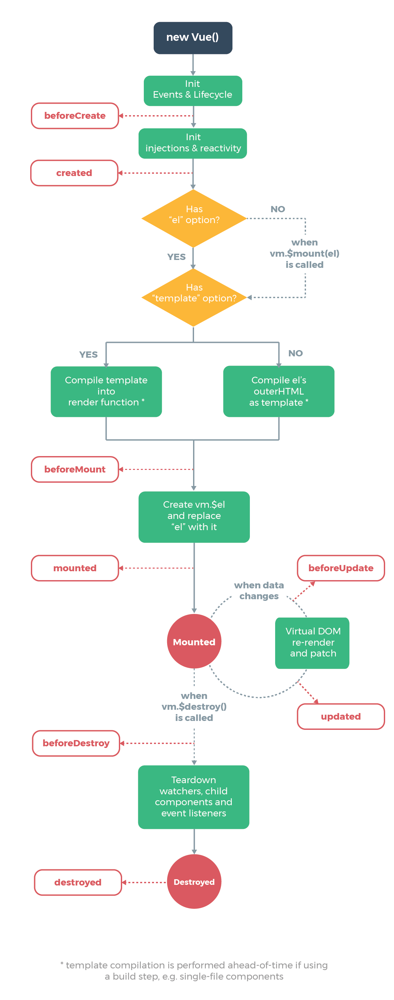
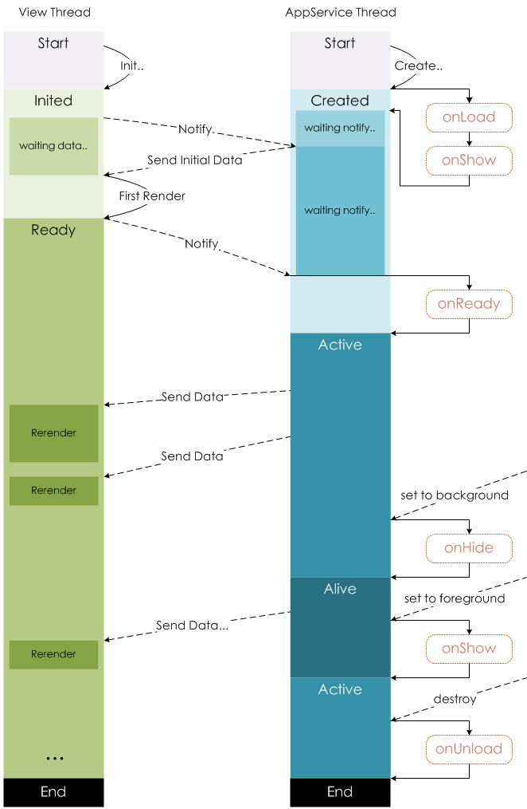

> - vue与小程序对比
>
> - https://blog.csdn.net/x737510/article/details/142733410
>
> - webstorm配置uniapp环境
>
>   https://blog.csdn.net/acaad/article/details/141855175
>
>   https://zhuanlan.zhihu.com/p/28029828473

<!--more-->

## vue与小程序对比

### 生命周期

> 在跳转新页面时，Vue的钩子函数会被触发



页面的跳转方式不同，钩子函数的触发形式不同

- onload：页面加载

  一个页面只会调用一次，可以在 `onLoad` 中获取打开当前页面所调用的 `query` 函数

- onShow：每次打开页面会调用一次

- onReady：页面初次渲染完成，会被调用一次，可以和视图层进行交互

  设置 `wx.setNavigatorBarTitle` 需要在 `onReady` 之后

- onHide：当 `navigateTo` 或底部tab切换时调用

- onUnload：当 `redirectTo` 或 `navigateBack` 时调用



---

数据请求时机：二者均在页面加载请求数据时

- vue一般会在`created`或者`mounted`中请求数据
- 小程序，会在`onLoad`或者`onShow`中请求数据。

### 语法差异

#### 数据绑定

```vue
<!--小程序语法，用{{变量名}}-->
<image src="{{imgSrc}}"></image>

<!--vue语法在变量前有:-->

```

##### 显示与隐藏元素

```vue
<!--微信小程序-->
wx-if和hidden控制元素的显示和隐藏

<!--vue-->
v-if 和v-show控制元素的显示和隐藏
```

##### 列表

```vue
<!--微信小程序-->
Page({
  data: {
    items: [
      { message: 'Foo' },
      { message: 'Bar' }
    ]
  }
})

<text wx:for="{{items}}">{{item}}</text>

<!--vue-->
var example1 = new Vue({
  el: '#example-1',
  data: {
    items: [
      { message: 'Foo' },
      { message: 'Bar' }
    ]
  }
})

<ul id="example-1">
  <li v-for="item in items">
    {{ item.message }}
  </li>
</ul>
```

#### 事件处理

```vue
<!--微信小程序：bindtap(bind+event)或者catchtap(catch+event)-->
<button bindtap="noWork">明天不上班</button>
<button catchtap="noWork">明天不上班</button>  //阻止事件冒泡

<!--vue:使用v-on:event绑定事件，或者使用@event绑定事件-->
<button v-on:click="counter += 1">Add 1</button>
<button v-on:click.stop="counter+=1">Add1</button>  //阻止事件冒泡
```

##### 绑定事件传参

```vue
<!--微信小程序：不能直接在绑定的事件方法中传参，需要将参数作为属性值，绑定到元素的 data- 属性上，然后在方法中，通过 e.currentTarget.dataset.* 获取-->
<view class='tr' bindtap='toApprove' data-id="{{item.id}}"></view>
Page({
    data:{
        reason:''
    },
    toApprove(e) {
        let id = e.currentTarget.dataset.id;
        console.log(id)
      }
})


<!--vue:在触发事件的方法中，把需要传递的数据作为形参传入-->
<button @click="say('明天不上班')"></button>

new Vue({
  el: '#app',
  methods:{
    say(arg){
    	consloe.log(arg)
    }
  }
})
```

#### 表单

##### 设置值

```vue
<!--微信小程序：当表单内容发生变化时，会触发表单元素上绑定的方法，然后在该方法中，通过this.setData({key:value})来将表单上的值赋值给data中的对应值。-->
<input bindinput="bindReason" placeholder="填写理由" class='reason' value='{{reason}}' name="reason" />

Page({
    data:{
        reason:''
    },
    bindReason(e) {
        this.setData({
          reason: e.detail.value
        })
      }
})

<!--vue:表单元素上加上v-model,然后再绑定data中对应的一个值，当表单元素内容发生变化时，data中对应的值也会相应改变-->
<div id="app">
    <input v-model="reason" placeholder="填写理由" class='reason'/>
</div>

new Vue({
  el: '#app',
  data: {
   reason:''
  }
})
```

##### 取值

```vue
<!--微信小程序：通过 this.data.reason 取值-->
<!--vue：通过 this.reason 取值-->
```

#### 父子组件通信

##### 子组件的创建

**微信小程序**

1. 编写子组件

   ```vue
   // 子组件
   <!--components/tabBar/tabBar.wxml-->
   <view class='tabbar-wrapper'>
     <view class='left-bar {{currentpage==="index"?"active":""}}' bindtap='jumpToIndex'>
       <text class='iconfont icon-shouye'></text>
       <view>首页</view>
     </view>
     <view class='right-bar {{currentpage==="setting"?"active":""}}' bindtap='jumpToSetting'>
       <text class='iconfont icon-shezhi'></text>
       <view>设置</view>
     </view>
   </view>
   ```

2. 在子组件的json文件中，将该文件声明为组件

   ```json
   component_name.json
   
   {
     "component": true
   }
   ```

3. 在需要引入的父组件json文件中，在 `usingComponents` 写入引入组件名及路径

   ```json
   "usingComponents": {
       "tab-bar": "../../components/tabBar/tabBar"
   }
   ```

4. 在父组件中，直接引用

   ```vue
   <tab-bar currentpage="index"></tab-bar>
   ```

**vue**

1. 编写子组件

   子组件可以通过`this.$emit`将方法和数据传递给父组件

   ```vue
   //子组件 bar.vue
   <template>
     <div class="search-box">
       <div @click="say" :title="title" class="icon-dismiss"></div>
     </div>
   </template>
   
   <script>
   export default{
       props:{
           title:{
              type:String,
              default:''
             }
           }
       },
       methods:{
           say(){
              console.log('明天不上班');
              this.$emit('helloWorld')
           }
       }
   </script>
   ```

2. 在需要使用的父组件中通过 `import` 引入

3. 在vue的 *components* 中注册

4. 在模版中使用

   ```vue
   // 父组件 foo.vue
   <template>
     <div class="container">
       <bar :title="title" @helloWorld="helloWorld"></bar>
     </div>
   </template>
   
   <script>
   import Bar from './bar.vue'
   export default{
       data(){
           return{
               title:"我是标题"
           }
       },
       methods:{
           helloWorld(){
               console.log('我接收到子组件传递的事件了')
           }
       },
       components:{
           Bar
       }
   </script>
   ```

##### 父子组件通信

**微信小程序**

- 父组件向子组件传参

  ```vue
  <tab-bar currentpage="index"></tab-bar>
  
  此处， "index" 就是要向子组件传递的值
  ```

  在子组件的 `properties` 中，接收传递的值

  ```json
  properties: {
      currentpage: {
          type: String,// 类型（必填），目前接受的类型包括：String, Number, Boolean, Object, Array, null（表示任意类型）
          value: 'index'// 属性初始值（可选），如果未指定则会根据类型选择一个
      }
  }
  ```

- 子组件向父组件传参

  ```vue
  //子组件中
  methods: {
  	cancelBut: function (e) {
  		var that = this;
  		var myEventDetail = {
  			pickerShow: false, 
  			type: 'cancel' 
  		} // detail对象，提供给事件监听函数
  		
  		this.triggerEvent(
  			'myevent', 
  			myEventDetail
  		) //myevent自定义名称事件，父组件中使用
      },
  }
  
  //父组件中
  <bar bind:myevent="toggleToast"></bar>
  
  // 获取子组件信息
  toggleToast(e){
      console.log(e.detail)
  }
  ```

**vue**

```vue
// 父组件 foo.vue
<template>
	<div class="container">
        <bar :title="title"></bar>
    </div>
</template>
<script>
import Bar from './bar.vue'
export default{
    data(){
        return{
			title:"我是标题"
		}
    },
    components:{
        Bar
    }
</script>

// 子组件bar.vue
<template>
	<div class="search-box">
        <div :title="title" ></div>
    </div>
</template>
<script>
export default{
	props:{
        title:{
            type:String,
            default:''
          }
        }
    }
</script>
```

##### 父组件调用子组件的方法

**小程序**

> 给子组件添加`id`或者`class`，然后通过`this.selectComponent`找到子组件

```vue
//子组件
<bar id="bar"></bar>

// 父组件
this.selectComponent('#id').syaHello()
```

**vue**

> 给子组件添加一个`ref`属性，通过`this.$refs.ref的值`便可以获取到该子组件，然后便可以调用子组件中的任意方法

```vue
//子组件
<bar ref="bar"></bar>

//父组件
this.$ref.bar.子组件的方法
```

##### 父组件改变子组件样式

1. 父组件将style传入子组件
2. 父组件传入变量控制子组件样式
3. 在父组件样式中，在子组件类名前面加上父组件类名

```html
<view class='share-button-container' bindtap='handleShareBtn'>
   <share-button  product="{{goodProduct}}" type="1" back-color="#fff" fore-color="#9e292f" bind:error="on_error" />
</view>

.share-button-container .button--btn-navigator__hover{
  background: #fff;
}
```

