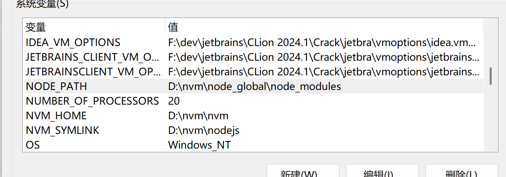

> Node.js是Javascript的运行时
>
> - 基于 Chrome 的 V8 引擎，将 JS 代码编译成机器码执行
>
> Npm是Node.js默认的包管理工具，从Npm服务器下载第三方包

[TOC]

<!--more-->

## 配置Node.js与Npm

```shell
# 查看npm与Nodejs的版本
npm -v
node -v
```

安装完成后，配置npm的默认安装路径和缓存日志目录

- 安装路径：path/to/node_modules

  

- 配置cache路径

  ```shell
  npm config set prefix "<$NODE_PATH>" 
  npm config set cache "\path\to\node_cache"
  ```

  操作完成会在你所选择的路径建立node_global 和node_cache两个文件夹

  修改方式，进入 *C:\Users\Administrator* ，修改 *.npmrc* 键值对

  ```shell
  registry=https://registry.npmmirror.com/
  prefix=D:\nvm\node_global
  cache=D:\nvm\node_cache
  ```

- 修改npm镜像源

  ```shell
  1 、清空缓存
  npm cache clean --force
  2 、查看当前的npm镜像设置
  npm config get registry
  3、切换新源
  npm config set registry  网页链接
  4、查看新源是否设置成功
  npm config get registry
  5、可以正常安装需要的工具了
  npm insatll
  ```


## npm使用

### 模块相关

> `npm help` ：获取npm命令的帮助信息

#### npm创建模块

```shell
# 初始化当前目录，生成 package.json 配置文件
npm init
npm init -f -y，跳过提问阶段，直接生成一个新的package.json文件
```

#### 配置

```shell
npm set <key> <value>

# 查看基本配置
npm config list

# 查看所有的npm设置
npm config list -l

# 获取某个配置
npm config get <key>
```

设置完成后，并不会生效，需要再次执行 `npm init`

#### 搜索模块

搜索npm仓库

```shell
npm search <模块名/正则> [-g]
```

#### 查看模块列表

```shell
# 查看全局路径
C:\Windows\System32>npm list -global
D:\nvm\node_global
+-- @vue/cli@5.0.9
+-- cnpm@9.4.0
+-- express@4.19.2
+-- hexo-cli@4.3.2
+-- webpack-cli@6.0.1
+-- webpack@5.105.2
`-- yarn@1.22.22

带上[--depth 0] 不深入到包的支点 更简洁
npm list -g --depth 0

npm list	<==>	npm ls
```

#### 查看模块信息

```shell
npm info <模块名>

npm view <模块名>

# 查看一个包的script定义
npm view <模块名> --scripts

# 列出当前项目中安装的包的版本树
npm ls
```

#### 跳转到github查看模块信息

```shell
# 在浏览器打开github，跳转到模块名的页面
npm repo 模块名
<==> npm home 模块名

# 在浏览器打开github,跳转到README.MD文件信息
npm docs
```

#### 安装模块

```shell
# 读取package.json里面的配置单安装  
$ npm install
//可简写成 npm i

# 默认安装指定模块的最新(@latest)版本
$ npm install [<@scope>/]<name> 
//eg:npm install gulp

# 安装指定模块的指定版本
$ npm install [<@scope>/]<name>@<version>
//eg: npm install gulp@3.9.1

# 安装指定指定版本范围内的模块
$ npm install [<@scope>/]<name>@<version range>
//eg: npm install vue@">=1.0.28 < 2.0.0"

# 安装指定模块的指定标签 默认值为(@latest)
$ npm install [<@scope>/]<name>@<tag>
//eg:npm install sax@0.1.1

# 通过Github代码库地址安装
$ npm install <tarball url>
//eg:npm install git://github.com/package/path.git
```

##### 安装选项

```shell
-g <==>	--global	安装到全局目录中，添加到package.json文件的dependencies列表中
-S <==>	--save		将待安装的包写入到package.json的 Dependencies 中
-D <==> --save-dev	将待安装的包写入到package.json的 devDependencies中
--no-save			不保存到package.json
-E <==>	--save-exact 精确版本，不带 ^ 前缀
```

#### 卸载模块

> 从 *package.json* 中删除，并卸载

```shell
#卸载当前项目或全局模块 
$ npm uninstall <name> [-g] 

# 同时移除全局包合本地包，
npm uninstall --save <package_name>

eg: npm uninstall gulp --save-dev  
    npm i gulp -g

卸载后，你可以到 /node_modules/ 目录下查看包是否还存在，或者使用以下命令查看：
npm ls 查看安装的模块
```

#### 更新模块

```shell
# 升级所有依赖
npm update

#升级当前项目或全局的指定模块
$ npm update <name> [-g] 
//eg: npm update express 
      npm update express -g

# 更新指定包
npm update <模块名>@latest

# 更新到指定版本号的模块
npm update <模块名>@指定版本
```

#### 缓存

```shell
# 清理缓存
npm cache clean --force

# 验证缓存的完整性
npm cache verify
```

### 项目相关

#### 设置版本

```shell
# 查看版本号
npm version

# 新增版本号
npm version <版本号>
```

或按照语义化版本控制规范，由 *package.json* 自动管理版本号

| 主版本号                 | 次版本号               | 修订号                    |
| ------------------------ | ---------------------- | ------------------------- |
| major                    | minor                  | patch                     |
| 1                        | 0                      | 0                         |
| 破坏性修改，不兼容旧版本 | 新功能添加，兼容旧版本 | Bug修复，小改动，向下兼容 |

```shell
# 将修订号+1
npm version patch

# 将次版本号+1
npm version minor

# 将主版本号+1
npm version major
```

1. 修改 *package.json* 中的 `version` 
2. 修改 *package-lock.json* 中的版本
3. 自动创建git提交 （`git commit -m "<comment>"`）
4. 自动打Git标签（`git tag <版本号>`）

#### npm执行脚本

*package.json* 的script字段，可以用于指定脚本指令，供npm直接调用

```shell
start 与 test属于特殊命令，可以省略run，其余不可
npm run start/test/...
<==>
npm start/test

npm run 会列出 package.json 中，所有可执行的脚本命令

# 运行在package.json中的 scripts 部分定义的脚本，可以定义任何自定义脚本
npm run <脚本名>
```

#### 打包

打包项目中的包，生成一个tar包，用于分发或安装

```shell
npm pack
```

#### 依赖相关

##### npm dedupe

> `npm dedupe` 命令用于减少依赖项的冗余，优化项目的依赖树。

##### 清除项目中没有被使用的包

```shell
npm prune
```

##### npm引用模块

```shell
# 引用依赖 有些包是全局安装了，在项目里面只需要引用即可。
$ npm link [<@scope>/]<pkg>[@<version>]
//eg: 引用   npm link gulp gulp-ssh gulp-ftp
//eg: 解除引用 npm unlink gulp
```

##### 安装依赖

> 在连续集成环境中安装项目依赖，会严格按照 *package-lock.json* 文件中的版本安装依赖，确保构建的一致性

```shell
npm ci
```

##### npm rebuild

> 重建所有的依赖包，解决由于更新npm或node版本导致的依赖问题

```shell
npm rebuild
```

## nvm

> 类似anaconde的nodejs环境管理器

```shell
E:\web\test\vue3webpack>nvm list

  * 24.9.0 (Currently using 64-bit executable)
    20.13.0
```

查看可远程安装的node版本

```shell
# 查看所有可用的远程版本（很长）
nvm list available
# 或
nvm ls-remote

# 查看所有 LTS（长期支持）版本
nvm ls-remote --lts

------------------------------------------

# 查看特定主版本的可用版本
nvm ls-remote 18

# 查看最新版本
nvm ls-remote latest

# 查看最新 LTS 版本
nvm ls-remote lts/*
```

| 命令                        | 作用                         |
| :-------------------------- | :--------------------------- |
| `nvm current`               | 显示当前正在使用的 Node 版本 |
| `nvm install 20.11.0`       | 安装指定版本                 |
| `nvm install node`          | 安装最新版本                 |
| `nvm install lts/*`         | 安装最新 LTS 版本            |
| `nvm use 18.19.0`           | 切换到指定版本               |
| `nvm use lts/*`             | 切换到最新 LTS 版本          |
| `nvm alias default 18.19.0` | 设置默认版本                 |
| `nvm uninstall 14.21.3`     | 卸载指定版本                 |

切换版本的其他方式

```shell
# 在项目目录自动切换版本（创建 .nvmrc）
echo "18.19.0" > .nvmrc
# 然后进入目录时运行
nvm use

# 查看 nvm 自身版本
nvm --version
```


