>   分布式消息系统

-   RocketMQ概念，用途，特性
-   安装RocketMQ
-   掌握RocketMQ的api使用
-   对producer、consumer进行详解
-   了解RocketMQ的存储特点

---

-   简介及相关概念
-   JavaAPI
-   SpringBoot整合RocketMQ
-   消息的顺序收发
-   消息系统的事务、存储、重试策略
-   消息系统的集群

<!--more-->

# RocketMQ

## RocketMQ简介

采用java开发的**分布式消息系统**，由阿里开发

地址：http://rocketmq.apache.org/

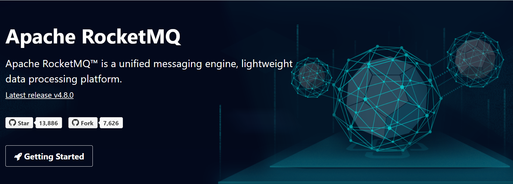

### 历史发展

-   阿里中间件，Notify用于交易核心信息的流转
-   2010年，B2B开始大规模使用ActiveMQ作为消息内核，急需支持**顺序消息**、**拥有海量消息堆积能力**的**消息中间件**——MetaQ 1.0  2011诞生
-   2012 年MetaQ发展到了3.0版本，抽象除了通用的消息引擎RorcketMQ
-   2015年，RocketMQ进过双十一，在可用性，可靠性和稳定性等方面都有出色表现。阿里消息中间件基于RocketMQ退出Aliware MQ1.0，开始为阿里云上的企业提供消息服务
-   2016年，RocketMQ进入Apache孵化

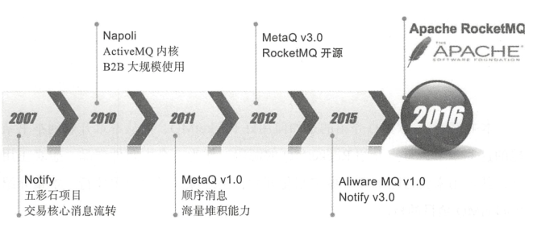

### 概念

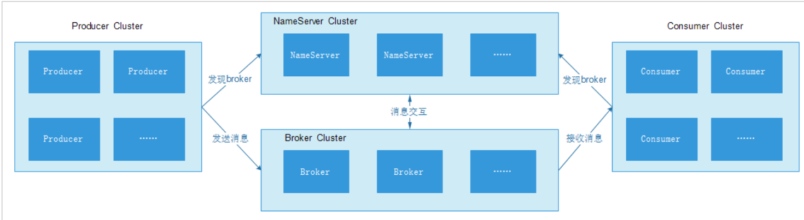

1.  Producer
    -   消息生产者：生产消息，一般由业务系统负责产生消息
    -   Producer Group：一类Producer的集合名称，这类Producer通常发送同一类消息，且发送逻辑一致
2.  Consumer

    -   消费者：负责消费消息，一般由后台系统负责异步消费
    -   分类：
        -   Push Consumer：消费端被动接收由服务端Push的消息
        -   Pull Consumer：消费端主动向服务端定时拉取消息

    -   Consmer Group：一类Consumer的集合名称，这类Producer通常发送同一类消息，且发送逻辑一致
3.  Broker
    -   RocketMQ的核心消息的发送、接收、高可用等
    -   需要定时发送自身情况到NameServer,默认10s发送一次，超过2分钟会认为该broker失效
4.  NameServer
    -   集群中的**组织协调**员
    -   收集broker的工作情况
    -   不负责消息的处理
5.  Topic【逻辑概念】
    -   不同类型的消息以不同的Topic名称进行区分，如User、Order等
    -   Message Queue
        -   消息队列，用于存储消息

## 下载部署

### 非docker

下载地址：https://archive.apache.org/dist/rocketmq/4.3.2/rocketmq-all-4.3.2-bin-release.zip

```shell
cd /opt
unzip rocketmq-all-4.3.2-bin-release.zip
cd rocketmq-all-4.3.2-bin-release/

# 启动nameserver
bin/mqnamesrv
#The Name Server boot success. serializeType=JSON
# 看到这个说明nameserver启动成功

#启动broker
bin/mqbroker -n 8.140.130.91:9876 #-n指定nameserver地址和端口
Java HotSpot(TM) 64-Bit Server VM warning: INFO: os::commit_memory(0x00000005c0000000, 8589934592, 0) failed; error='Cannot allocate memory' (errno=12)
```

启动错误，因为RocketMQ的配置默认是生产环境的配置，设置jvm的内存值比较大，需要调整默认值

```java
#调整默认的内存大小参数
cd bin/
JAVA_OPT="${JAVA_OPT} -server -Xms128m -Xmx128m -Xmn128m -XX:MetaspaceSize=128m -XX:MaxMetaspaceSize=128m"

vim runbroker.sh
JAVA_OPT="${JAVA_OPT} -server -Xms128m -Xmx128m -Xmn128m"

#重新启动测试
bin/mqbroker -n 8.140.130.91:9876
The broker[iZ2zeg4pktzjhp9h7wt6doZ, 172.17.0.1:10911] boot success. serializeType=JSON and name server is 8.140.130.91:9876#启动成功
```

发送消息测试：

```shell
export NAMESRV_ADDR=127.0.0.1:9876
cd /opt/rocketmq-all-4.3.2-bin-release/bin
sh tools.sh org.apache.rocketmq.example.quickstart.Producer
```

接收消息测试：

```shell
sh tools.sh org.apache.rocketmq.example.quickstart.Consumer
```

#### java api测试

**依赖**

```xml
<dependencies>
    <dependency>
        <groupId>org.apache.rocketmq</groupId>
        <artifactId>rocketmq-client</artifactId>
        <version>4.3.2</version>
    </dependency>
</dependencies>

<build>
    <plugins>
        <plugin>
            <groupId>org.apache.maven.plugins</groupId>
            <artifactId>maven-compiler-plugin</artifactId>
            <version>3.2</version>
            <configuration>
                <source>1.8</source>
                <target>1.8</target>
                <encoding>UTF-8</encoding>
            </configuration>
        </plugin>
    </plugins>
</build>
```

**测试代码**

```java
package com.rocketmq;

import org.apache.rocketmq.client.exception.MQBrokerException;
import org.apache.rocketmq.client.exception.MQClientException;
import org.apache.rocketmq.client.producer.DefaultMQProducer;
import org.apache.rocketmq.client.producer.SendResult;
import org.apache.rocketmq.common.message.Message;
import org.apache.rocketmq.remoting.common.RemotingHelper;
import org.apache.rocketmq.remoting.exception.RemotingException;

import java.io.UnsupportedEncodingException;

public class SyncProducer {
    public static void main(String[] args) throws Exception {
        //Instantiate with a producer group name.
        DefaultMQProducer producer = new DefaultMQProducer("test-group");
        //specify name server address
        producer.setNamesrvAddr("8.140.130.91:9876");
        //Lanuch the instance
        producer.start();

        for (int i = 0; i < 100; i++) {
            //create message instance ,specify topic,tag and message body
            Message msg = 
                new Message(
                "TopicTest1",/*topic*/
                "TAGA",/*tag*/
                ("Hello RocketMQ" + i).getBytes(
                    RemotingHelper.DEFAULT_CHARSET
                )/*message body*/
            );
            //Call send message to deliver message to one of brokers.
            SendResult sendResult = producer.send(msg);
            System.out.printf("%s%n", sendResult);
        }

        //Shut down once the producer instance is not longer in use.
        producer.shutdown();
    }
}
```

发现报错

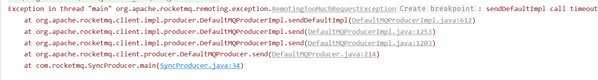

原因：

broker的ip地址是172.17.0.1,为私有ip，所以不可访问

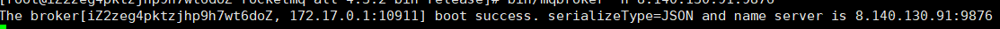

解决：修改broker配置文件,指定broker 的ip地址

```shell
cd /opt/rocketmq-all-4.3.2-bin-release/conf
vim broker.conf

brokerIP1=8.140.130.91
namesrvAddr=8.140.130.91:9876
brokerName=broker_haoke_im

#启动broker，通过 -c 指定配置文件
cd /opt/rocketmq-all-4.3.2-bin-release/
bin/mqbroker -c /opt/rocketmq-all-4.3.2-bin-release/conf/broker.conf
```

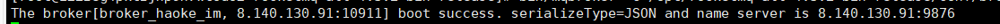

API测试成功

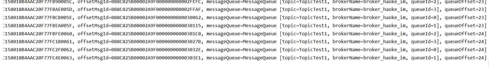

### 通过docker部署

```shell
#拉取镜像
docker pull foxiswho/rocketmq:server-4.3.2
docker pull foxiswho/rocketmq:broker-4.3.2

#创建nameserver容器
docker create -p 9876:9876 --name rmqserver \
-e "JAVA_OPT_EXT=-server -Xms128m -Xmx128m -Xmn128m" \
-e "JAVA_OPTS=-Duser.home=/opt" \
-v /data/rmq-data/rmqserver/logs:/opt/logs \
-v /data/rmq-data/rmqserver/store:/opt/store \
foxiswho/rocketmq:server-4.3.2

#创建broker容器
#10911 生产者，消费者端口
#10909 搭建集群主从端口
docker create -p 10911:10911 -p 10909:10909 --name rmqbroker \
-e "JAVA_OPTS=-Duser.home=/opt" \
-e "JAVA_OPT_EXT=-server -Xms128m -Xmx128m -Xmn128m" \
-v /data/rmq-data/rmqbroker/conf/broker.conf:/etc/rocketmq/broker.conf \
-v /data/rmq-data/rmqbroker/logs:/opt/logs \
-v /data/rmq-data/rmqbroker/store:/opt/store \
foxiswho/rocketmq:broker-4.3.2

#启动容器
docker start rmqserver rmqbroker

#停止删除容器
docker stop rmqbroker rmqserver
docker rm rmqbroker rmqserver
```

#### broker配置文件

```shell
#broker名
brokerName=broker_haoke_im
#broker IP
brokerIP1=8.140.130.91
#当前broker托管的NameServer地址
namesrvAddr=8.140.130.91:9876
#开启自定义属性支持
enablePropertyFilter=true
```

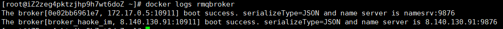

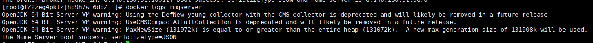

### 部署RocketMQ的管理工具

UI管理工具，rocketmq-console,项目地址https://github.com/apache/rocketmq-externals/tree/master/rocketmq-console

```shell
#拉取镜像
docker pull apacherocketmq/rocketmq-console:2.0.0

#创建并启动容器
docker run -e "JAVA_OPTS=-Drocketmq.config.namesrvAddr=8.140.130.91:9876 -Drocketmq.config.isVIPChannel=false" -p 8082:8080 -t apacherocketmq/rocketmq-console:2.0.0
```

访问：http://8.140.130.91:8082/

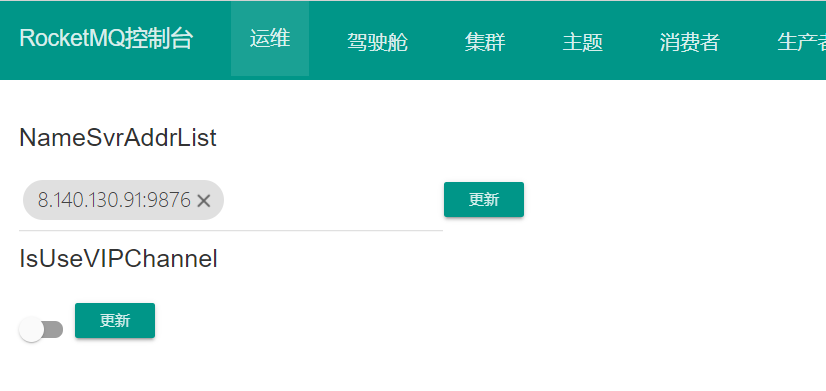

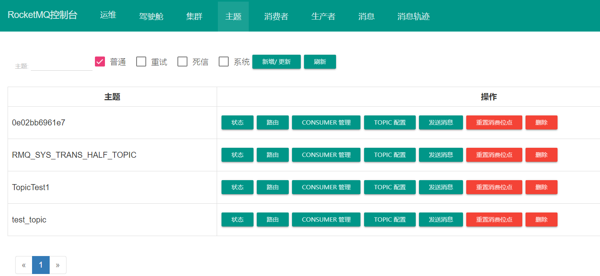

## Java API基本使用 

### 创建topic

```java
package com.rocketmq;

import org.apache.rocketmq.client.producer.DefaultMQProducer;

public class TopicDemo {

    public static void main(String[] args) throws Exception{
        //设置NameServer地址
        DefaultMQProducer producer = new DefaultMQProducer("test-group");
        //设置producer 的NameServerAddress
        producer.setNamesrvAddr("8.140.130.91:9876");

        //启动NameServer
        producer.start();

        /*
        * 创建topic
        * @param key broker name
        * @param newTopic topic name
        * @param queueNum topic's queue number
        * */
        producer.createTopic("broker_haoke_im","test_topic",8);

        System.out.println("topic创建成功");

        producer.shutdown();

    }
}
```

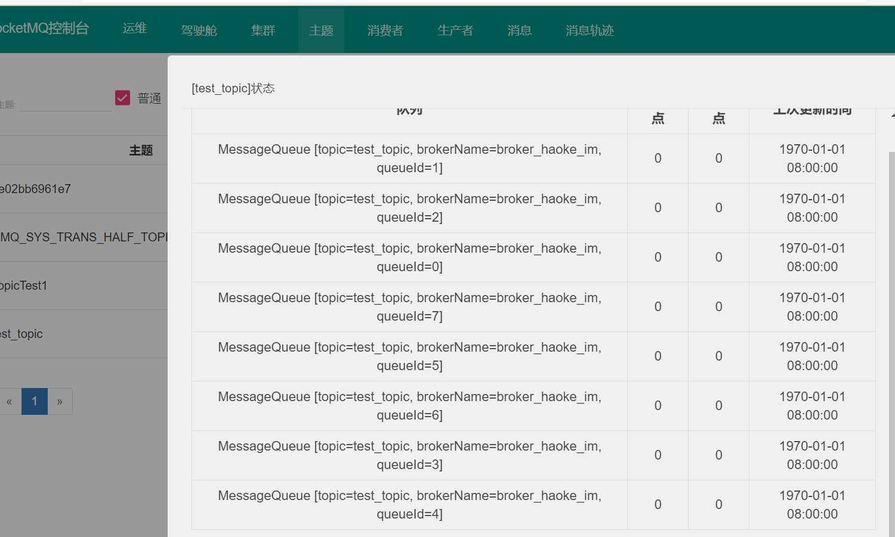

### 发送消息

#### 消息的属性

| 字段名         | 默认 值 | 说明                                                         |
| -------------- | ------- | ------------------------------------------------------------ |
| Topic          | null    | 必填，线下环境不需要申请，线上环境需要申请后才能使用         |
| Body           | null    | 必填，二进制形式，序列化由应用决定，Producer 与 Consumer 要协商好 序列化形式。 |
| Tags           | null    | 选填，类似于 Gmail 为每封邮件设置的标签，方便服务器过滤使用。目前只 支持每个消息设置一个 tag，所以也可以类比为 Notify 的 MessageType 概 念 |
| Keys           | null    | 选填，代表这条消息的业务关键词，服务器会根据 keys 创建哈希索引，设置 后，可以在 Console 系统根据 Topic、Keys 来查询消息，由于是哈希索引， 请尽可能保证 key 唯一，例如订单号，商品 Id 等。 |
| Flag           | 0       | 选填，完全由应用来设置，RocketMQ 不做干预                    |
| DelayTimeLevel | 0       | 选填，消息延时级别，0 表示不延时，大于 0 会延时特定的时间才会被消费 |
| WaitStoreMsgOK | TRUE    | 选填，表示消息是否在服务器落盘后才返回应答。                 |

#### 同步

```java
package com.rocketmq.message;

import org.apache.rocketmq.client.producer.DefaultMQProducer;
import org.apache.rocketmq.client.producer.SendResult;
import org.apache.rocketmq.common.message.Message;

public class SyncMessage {
    public static void main(String[] args) throws Exception{
        DefaultMQProducer producer = new DefaultMQProducer("test-group");
        producer.setNamesrvAddr("8.140.130.91:9876");
        producer.start();

        String msgStr = "测试消息1";

        /*
        * String topic, String tags, byte[] body
        * */
        Message message = new Message("test_topic","test",msgStr.getBytes("UTF-8"));

        SendResult result = producer.send(message);

        System.out.println(result);

        System.out.println("消息状态：" + result.getSendStatus());
        System.out.println("消息id：" + result.getMsgId());
        System.out.println("消息queue：" + result.getMessageQueue());
        System.out.println("消息offset：" + result.getQueueOffset());

        producer.shutdown();
    }
}
```

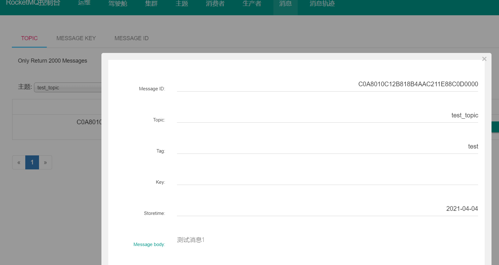

#### 异步

与同步区别在于，回调函数的执行是滞后的，主程序是顺序执行的

```java
package com.rocketmq.message;

import org.apache.rocketmq.client.producer.DefaultMQProducer;
import org.apache.rocketmq.client.producer.SendCallback;
import org.apache.rocketmq.client.producer.SendResult;
import org.apache.rocketmq.common.message.Message;

public class AsyncMessage {
    public static void main(String[] args) throws Exception{
        DefaultMQProducer producer = new DefaultMQProducer("test-group");
        producer.setNamesrvAddr("8.140.130.91:9876");
        producer.start();

        String msgStr = "异步消息发送测试";

        /*
         * String topic, String tags, byte[] body
         * */
        Message message = new Message("test_topic","test",msgStr.getBytes("UTF-8"));

        producer.send(message, new SendCallback() {
            @Override
            public void onSuccess(SendResult result) {
                System.out.println(result);
                
                System.out.println("消息状态：" + result.getSendStatus());
                System.out.println("消息id：" + result.getMsgId());
                System.out.println("消息queue：" + result.getMessageQueue());
                System.out.println("消息offset：" + result.getQueueOffset());
            }

            @Override
            public void onException(Throwable e) {
                System.out.println("消息发送失败");
            }
        });

        // producer.shutdown()要注释掉，否则发送失败。原因是，异步发送，还未来得及发送就被关闭了
        //producer.shutdown();
    }
}
```

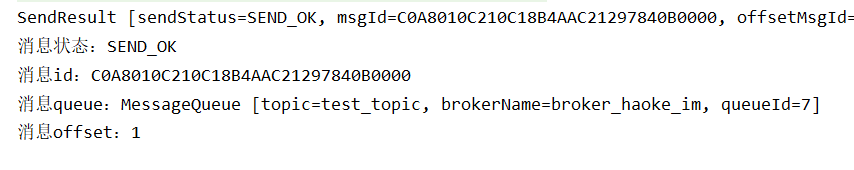

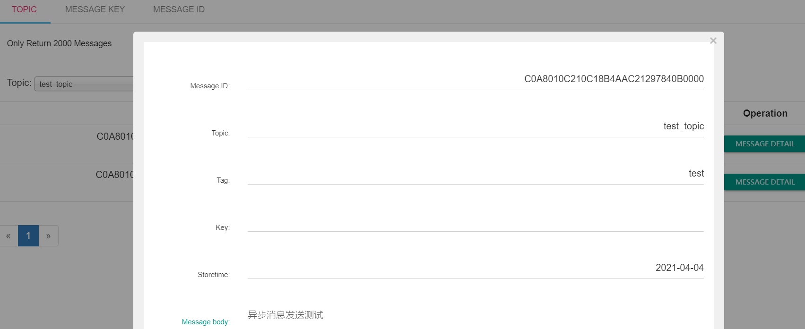

### 消费信息

```java
package com.rocketmq.consumer;

import org.apache.rocketmq.client.consumer.DefaultMQPushConsumer;
import org.apache.rocketmq.client.consumer.listener.ConsumeConcurrentlyContext;
import org.apache.rocketmq.client.consumer.listener.ConsumeConcurrentlyStatus;
import org.apache.rocketmq.client.consumer.listener.MessageListenerConcurrently;
import org.apache.rocketmq.common.message.MessageExt;

import java.io.UnsupportedEncodingException;
import java.util.List;

public class ConsumerDemo {
    public static void main(String[] args) throws Exception{
        /*
        * push类型的消费者，被动接收从broker推送的消息
        * */
        DefaultMQPushConsumer consumer = new DefaultMQPushConsumer("test-group");
        consumer.setNamesrvAddr("8.140.130.91:9876");

        //订阅topic，接收此topic下的所有消息
        consumer.subscribe("test_topic","*");

        consumer.registerMessageListener(new MessageListenerConcurrently() {//并发读取消息
            @Override
            public ConsumeConcurrentlyStatus consumeMessage(List<MessageExt> msgs, ConsumeConcurrentlyContext context) {
                for (MessageExt msg : msgs) {
                    try {
                        System.out.println(new String(msg.getBody(),"UTF-8"));
                    } catch (UnsupportedEncodingException e) {
                        e.printStackTrace();
                    }
                }
                System.out.println("收到消息->"+msgs);

                /*
                * 返回给broker消费者的接收情况
                * CONSUME_SUCCESS  接收成功
                * RECONSUME_LATER  延时重发
                * */
                return ConsumeConcurrentlyStatus.CONSUME_SUCCESS;
            }
        });

        consumer.start();
    }
}
```

测试接收历史消息：

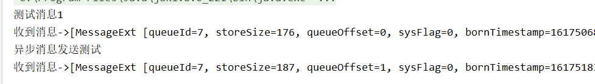

测试接收实时消息：

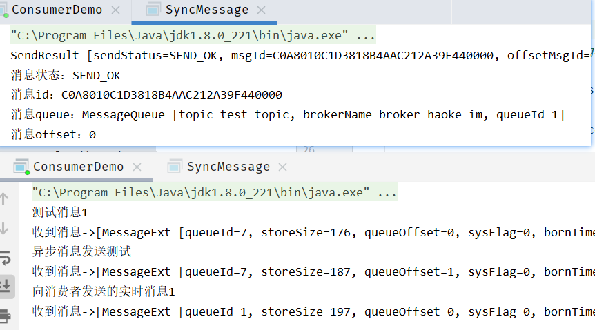

#### 消息的订阅方式

**可以通过tag区分不同类型**

```java
#生产者
Message message = new Message("test_topic","add",msgStr.getBytes("UTF-8"));

#消费者
//完整匹配
consumer.subscribe("test_topic","add");
//或匹配
consumer.subscribe("test_topic","add || delete");
```

### 消息过滤器

RocketMQ支持根据用户自定义属性进行过滤 ，类似与SQL

>   MessageSelector.bySql("age>=20 AND sex='女'"));

**消息发送方**：

```java
package com.rocketmq.filter;

import org.apache.rocketmq.client.producer.DefaultMQProducer;
import org.apache.rocketmq.client.producer.SendResult;
import org.apache.rocketmq.common.message.Message;

/**
 * @author Auspice Tian
 * @time 2021-04-04 15:10
 * @current example-roketmq-com.rocketmq.filter
 */
public class SyncProducer {
    public static void main(String[] args) throws Exception{
        DefaultMQProducer producer = new DefaultMQProducer("test-group");
        producer.setNamesrvAddr("8.140.130.91:9876");
        producer.start();

        String msgStr = "发送测试";
        Message msg = new Message("test_topic","test",msgStr.getBytes("UTF-8"));
        msg.putUserProperty("age","18");
        msg.putUserProperty("sex","女");

        SendResult result = producer.send(msg);

        System.out.println("消息状态"+result.getSendStatus());
        System.out.println("消息id"+ result.getMsgId());
        System.out.println("消息queue"+result.getMessageQueue());
        System.out.println("消息offset"+result.getQueueOffset());

        producer.shutdown();
    }
}
```

**消息接收方**：

```java
package com.rocketmq.filter;

import org.apache.rocketmq.client.consumer.DefaultMQPushConsumer;
import org.apache.rocketmq.client.consumer.MessageSelector;
import org.apache.rocketmq.client.consumer.listener.ConsumeConcurrentlyContext;
import org.apache.rocketmq.client.consumer.listener.ConsumeConcurrentlyStatus;
import org.apache.rocketmq.client.consumer.listener.MessageListenerConcurrently;
import org.apache.rocketmq.client.exception.MQClientException;
import org.apache.rocketmq.common.message.MessageExt;

import java.io.UnsupportedEncodingException;
import java.util.List;

public class ConsumerFilter {
    public static void main(String[] args) throws MQClientException {
        DefaultMQPushConsumer consumer = new DefaultMQPushConsumer("test-group");
        consumer.setNamesrvAddr("8.140.130.91:9876");

        consumer.subscribe("test_topic", MessageSelector.bySql("age>=20 AND sex='女'"));

        consumer.registerMessageListener(new MessageListenerConcurrently() {//并发读取消息
            @Override
            public ConsumeConcurrentlyStatus consumeMessage(List<MessageExt> msgs, ConsumeConcurrentlyContext context) {

                for (MessageExt msg : msgs) {
                    try {
                        System.out.println(new String(msg.getBody(),"UTF-8"));
                    } catch (UnsupportedEncodingException e) {
                        e.printStackTrace();
                    }
                }

                System.out.println("收到消息->"+msgs);
                return ConsumeConcurrentlyStatus.CONSUME_SUCCESS;
            }
        });

        consumer.start();
    }
}
```

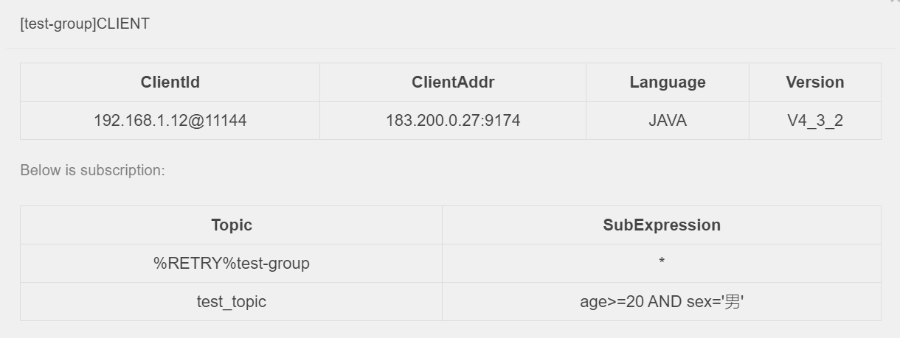

**测试**：

消息发送成功，但是由于不满足条件，被过滤器过滤，消费者未接收到

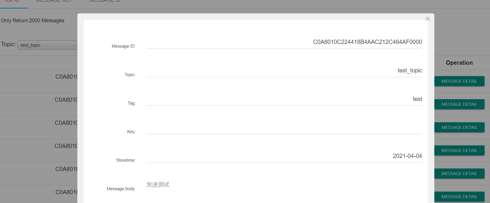

修改生产者自定义属性

```java
Message msg = new Message("test_topic","test",msgStr.getBytes("UTF-8"));
msg.putUserProperty("age","21");
msg.putUserProperty("sex","女");
```

可以接收到消息

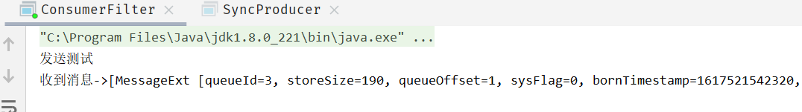

## 消息的顺序发送与接收

### 原理

>   消息的顺序收发，需要消费者与生产者二者配合

-   生产者发送的顺序消息都要放在同一消息队列中，才能保证被顺序取出 
-   消费者接收的顺序消息，需要从同一队列中获取

### 生产者

```java
package com.rocketmq.order;

import org.apache.rocketmq.client.producer.DefaultMQProducer;
import org.apache.rocketmq.client.producer.SendResult;
import org.apache.rocketmq.common.message.Message;

public class OrderProducer {
    public static void main(String[] args) throws Exception{
        DefaultMQProducer producer = new DefaultMQProducer("test-group");
        producer.setNamesrvAddr("8.140.130.91:9876");
        producer.start();

        for (int i = 0; i < 100; i++) {

            int orderId = i % 10;
            //生产10个订单的消息,每个订单10条消息
            String msgStr = "order-->"+i + " orderId-->" + orderId;

            Message message = new Message("test_topic","ORDER_MSG",msgStr.getBytes("UTF-8"));
            /*
            * public SendResult send(Message msg, MessageQueueSelector selector, Object arg)
            * MessageQueue select(final List<MessageQueue> mqs, final Message msg, final Object arg);
            * */
            SendResult sendResult = producer.send(
                    message,
                    (mqs,msg,arg)->{//匿名函数的作用为选择消息队列的id
                        Integer id = (Integer) arg;
                        int index = id % mqs.size();
                        return mqs.get(index);
                    },//arg与orderId对应，
                    orderId);
            System.out.println(sendResult);
        }
        producer.shutdown();
    }
}
```

### 消费者

```java
public class OrderConsumer {
    public static void main(String[] args) throws Exception{
        DefaultMQPushConsumer consumer = new DefaultMQPushConsumer("test-order-group");
        consumer.setNamesrvAddr("8.140.130.91:9876");

        consumer.subscribe("test_order_topic","*");

        consumer.registerMessageListener(new MessageListenerOrderly() {//顺序读取消息
            @Override
            public ConsumeOrderlyStatus consumeMessage(List<MessageExt> msgs, ConsumeOrderlyContext context) {
                for (MessageExt msg : msgs) {
                    try {
                        System.out.println(
                                Thread.currentThread()
                            	.getName() + " "
                                + msg.getQueueId() + " "
                                + new String(msg.getBody(),"UTF-8"));
                    } catch (UnsupportedEncodingException e) {
                        e.printStackTrace();
                    }
                }
                return ConsumeOrderlyStatus.SUCCESS;
            }
        });
        consumer.start();
    }
}
```

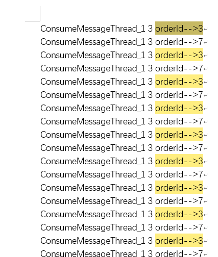

可见，订单id为3的消息，会存入同一消息队列，故**在同一消息队列的消息可被同一消费线程监听**

## 消息系统的事务

分布式事务分类：

-   基于单个JVM，数据库分库分表
-   基于多个JVM，服务拆分
-   基于多JVM，服务拆分且数据库分库分表

### 原理

>   Half(Prepare) Message

消息系统暂时不能投递的消息：发送方将消息发送到了MQ服务端。MQ服务端未收到生产者对消息的二次确认，此时该消息被标记为  **暂不能投递状态** 处于该状态的消息称为 **半消息**

>   Message Status Check

由于网络闪断、生产者应用重启等原因，导致某条事务消息的二次确认丢失，MQ服务端发现某条消息长期处于 **半消息**，需要主动向消息生产者询问该消息的状态

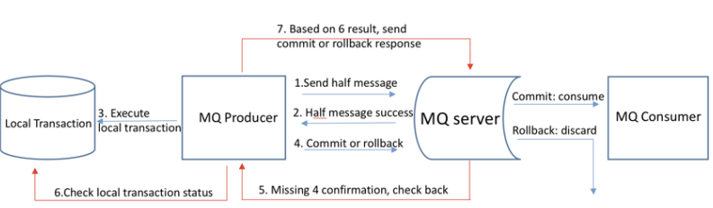

1. 发送方向MQ服务端发送消息

2. MQ Server将消息持久化成功后，向发送方ACK确认消息已经发送成功，此时消息为 **半消息**

3. 发送方开始执行本地事务逻辑

   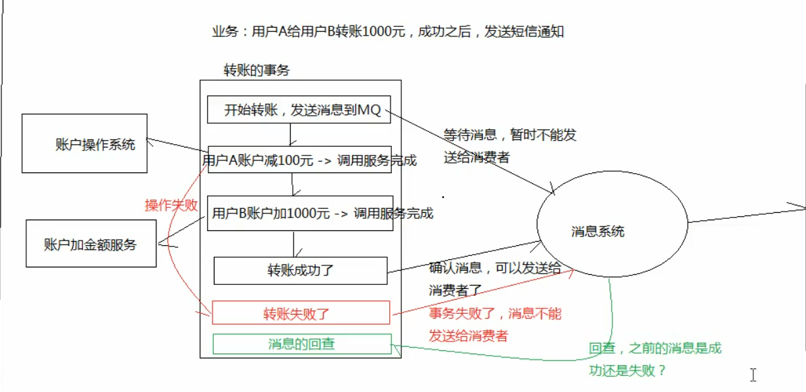

4. 发送方根据本地事务执行结果向MQ Server提交二次确认（Commit或Rollback），MQ Server 收到 **Commit** 则将半消息标记为 **可投递**，订阅方最终收到该消息；MQ Server收到 **Rollback** ，则删除该半消息，订阅方不会收到该消息

5. 在断网或应用重启情况下，上述4提交的二次确认最终未到达MQ Server，经过固定时间后，MQ Server将对该消息发起消息回查

6. 发送方收到消息回查，需要检查对应消息的本地事务执行的最终结果

7. 发送方根据检查得到的本地事务的最终状态再次提交二次确认，MQ Server仍按4对半消息进行确认

### 生产者

```java
package com.rocketmq.trancation;

public class TrancationProducer {
    public static void main(String[] args) throws Exception{
        TransactionMQProducer producer = new TransactionMQProducer("test_transaction_producer");
        producer.setNamesrvAddr("8.140.130.91:9876");

        //设置事务监听器
        producer.setTransactionListener(new TransactionImpl());

        producer.start();

        //发送消息
        Message message = new Message("pay_topic","用户A给用户B转钱".getBytes("UTF-8"));
        producer.sendMessageInTransaction(message,null);

        Thread.sleep(99999);
        producer.shutdown();
    }
}
```

### 本地事务处理

```java
package com.rocketmq.trancation;

public class TransactionImpl implements TransactionListener {

    private static Map<String, LocalTransactionState> STATE_MAP = new HashMap<>();

    /**
     * 本地执行业务具体的逻辑
     * @param msg
     * @param arg
     * @return
     */
    @Override
    public LocalTransactionState executeLocalTransaction(Message msg, Object arg) {

        try {
            Thread.sleep(500);
            System.out.println("用户A账户减500");

            // System.out.println(1/0);

            System.out.println("用户B账户加500元.");
            Thread.sleep(800);

            //二次提交确认
            STATE_MAP.put(msg.getTransactionId(),LocalTransactionState.COMMIT_MESSAGE);
            return LocalTransactionState.COMMIT_MESSAGE;
        } catch (InterruptedException e) {
            e.printStackTrace();
        }

        //回滚
        STATE_MAP.put(msg.getTransactionId(), LocalTransactionState.ROLLBACK_MESSAGE);
        return LocalTransactionState.ROLLBACK_MESSAGE;
    }

    /**
     * 消息回查
     * @param msg
     * @return
     */
    @Override
    public LocalTransactionState checkLocalTransaction(MessageExt msg) {

        return STATE_MAP.get(msg.getTransactionId());

    }
}
```

### 消费者

```java
package com.rocketmq.trancation;

public class TransactionConsumer {
    public static void main(String[] args) throws MQClientException {
        DefaultMQPushConsumer consumer = new DefaultMQPushConsumer("test_transaction_consumer");
        consumer.setNamesrvAddr("8.140.130.91:9876");

        //订阅topic，接收消息
        consumer.subscribe("pay_topic","*");

        consumer.registerMessageListener(new MessageListenerConcurrently() {
            @Override
            public ConsumeConcurrentlyStatus consumeMessage(List<MessageExt> msgs, ConsumeConcurrentlyContext context) {
                for (MessageExt msg : msgs) {
                    try {
                        System.out.println(new String(msg.getBody(),"UTF-8"));
                    } catch (UnsupportedEncodingException e) {
                        e.printStackTrace();
                    }
                }

                return ConsumeConcurrentlyStatus.CONSUME_SUCCESS;
            }
        });

        consumer.start();
    }
}
```

### 测试

- 返回 **commit** 状态时，消费者能够接收消息 

  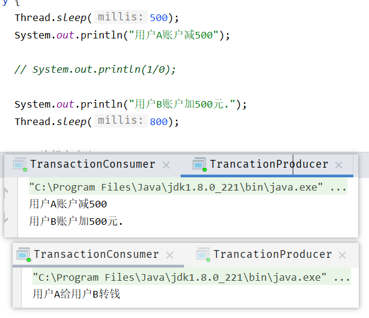

- 返回 **rollback** 状态时，消费者接收不到消息

  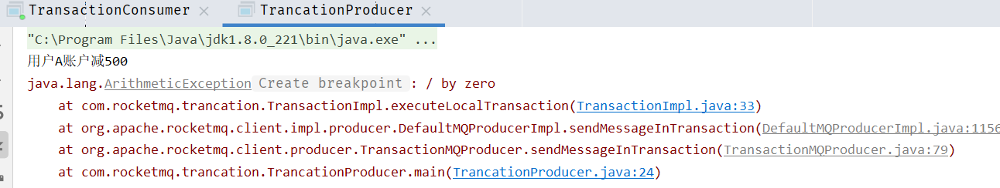

  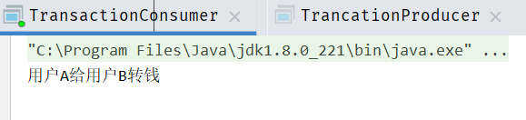

  

- 消息回查测试

  ```java
  public class TransactionImpl implements TransactionListener {
  
      private static Map<String, LocalTransactionState> STATE_MAP = new HashMap<>();
  
      /**
       * 本地执行业务具体的逻辑
       * @param msg
       * @param arg
       * @return
       */
      @Override
      public LocalTransactionState executeLocalTransaction(Message msg, Object arg) {
  
          try {
              System.out.println("用户A账户减500");
              Thread.sleep(500);
  
  //            System.out.println(1/0);
  
              System.out.println("用户B账户加500元.");
              Thread.sleep(800);
  
              //二次提交确认
              STATE_MAP.put(msg.getTransactionId(),LocalTransactionState.COMMIT_MESSAGE);
              return LocalTransactionState.UNKNOW;
  //            return LocalTransactionState.COMMIT_MESSAGE;
          } catch (Exception e) {
              e.printStackTrace();
          }
  
          //回滚
          STATE_MAP.put(msg.getTransactionId(), LocalTransactionState.ROLLBACK_MESSAGE);
          return LocalTransactionState.ROLLBACK_MESSAGE;
      }
  
      /**
       * 消息回查
       * @param msg
       * @return
       */
      @Override
      public LocalTransactionState checkLocalTransaction(MessageExt msg) {
  
          System.out.println("状态回查-->"+ msg.getTransactionId() + " "+ STATE_MAP.get(msg.getTransactionId()));
  
          return STATE_MAP.get(msg.getTransactionId());
  
      }
  }
  ```

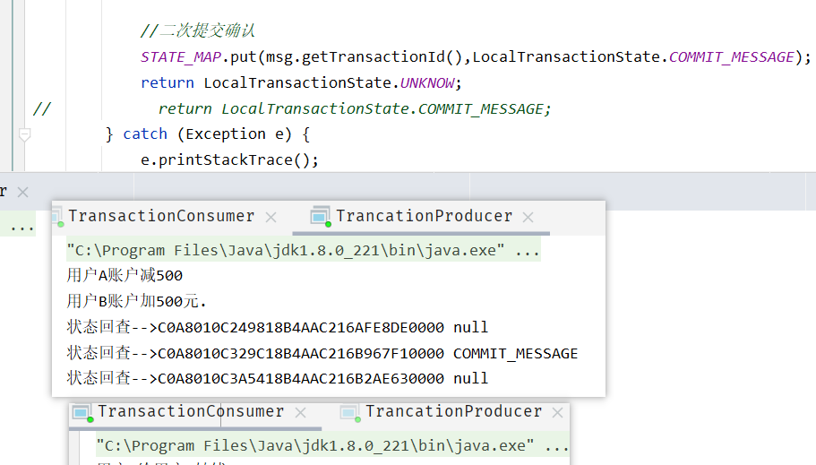

## Consumer

### Push和Pull模式

-   push模式：客户端与服务端建立连接后，当服务端有消息，将消息推送到客户端 
-   pull模式：客户端不断的轮询请求服务端，来获取新的而消息

push模式需要消息系统与消费端之间建立长连接，对消息系统是很大的负担，所以在具体实现时，都采用消费端主动拉取的方式，即consumer轮询从broker拉取消息 

**在RocketMQ中，push与pull的区别**

>   Push：`DefaultPushConsumer` 将轮询过程都封装了，并注册MessageListener监听器，取到消息后，唤醒MessageListener监听器的consumeMessage()来消费，对用户而言，感觉消息是被推送来的。
>
>   
>
>   Pull：取消息过程需要自己写：首先从目标topic中拿到MessageQueue集合并遍历，然后针对每个MessageQueue批量取消息。一次Pull，都要记录该队列的offset,知道去完MessageQueue，再换另一个

### 长轮询保证Pull的实时性

>   长轮询（长连接+轮询），客户端像传统轮询一样从服务端请求数据，服务端会阻塞请求不会立刻返回，直到有数据或超时才返回给客户端，然后关闭连接，客户端处理完响应信息后再向服务器发送新的请求

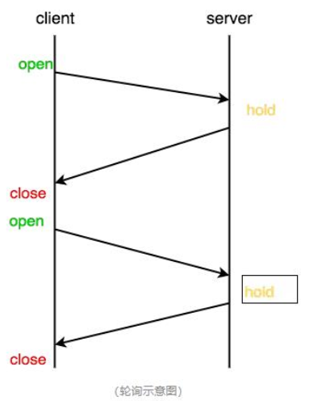

### 消息模式

DefaultMQPushConsumer实现了自动保存offset值及多个consumer的负载均衡

```java
//设置组名
DefaultMQPushConsumer consumer = new DefaultMQPushConsumer("HAOKE_IM");
```

通过 `groupname` 将多个consumer组合在一起，会存在消息的分配问题（消息是发送到组还是每个消费者）

- 集群模式（默认）

  同一个ConsumerGroup里的每个Consumer只消费所订阅消息的一部分内容，同一个ConsumerGroup里所有消费的内容合起来才是所订阅Topic内容的整体，从而达到负载均衡的目的

- 广播模式

  同一个ConsumerGroup里的每个Consumer都能消费到所订阅Topic的全部消息，一个消息会被分发多次，被多个Consumer消费

```java
// 集群模式
consumer.setMessageModel(MessageModel.CLUSTERING);
// 广播模式
consumer.setMessageModel(MessageModel.BROADCASTING);
```

### 重复消息的解决方案

重复消息的产生情况： 

-   生产者不断发送重复消息到消息系统

-   网络不可达 ：只要通过网络交换数据，就无法避免这个问题

由于接收到重复消息不可避免，问题变为 **消费端收到重复消息，怎么处理**

1. 消费端处理消息的业务逻辑保持幂等性

   幂等性：无论执行多少次，结果都一样

   eg：while s!=1；在执行sql语句

2. 保证每条消息都有唯一编号且保证消息处理成功与去重的日志同时出现

   利用一张日志表来记录已经处理成功的消息的ID，如果新到的消息ID已经在日志表中，那么就不再处理这条消息  

   如果由消息系统来实现的话，肯定会对消息系统的吞吐量和高可用有影响，所以最好还是由业务端自己处理消息重复的问题，这也是 **RocketMQ不解决消息重复的问题** 的原因 

## RocketMQ存储

RocketMQ中的消息数据存储，采用了零拷贝技术（mmap + write方式），文件系统采用 Linux Ext4文件系统进行存储。

### 消息数据的存储

在RocketMQ中，消息数据是保存在磁盘文件中的，使用RocketMQ尽可能保证顺序写入，比随机写入效率高很多

- ConsumeQueue：索引文件，存储数据指向物理文件的位置

- CommitLog是真正存储数据的文件

  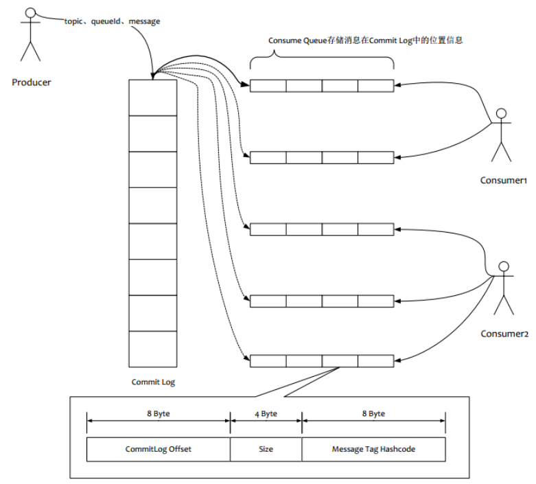

- 消息主体及元数据都存储在CommitLog中

- Consume Queue 是一个逻辑队列，存储了这个Queue在CommitLog中的其实offset、log大小和MessageTag的hashcode

- 每次读取消息队列先读取ConsumerQueue，然后再通过consumerQueue中拿到消息主体

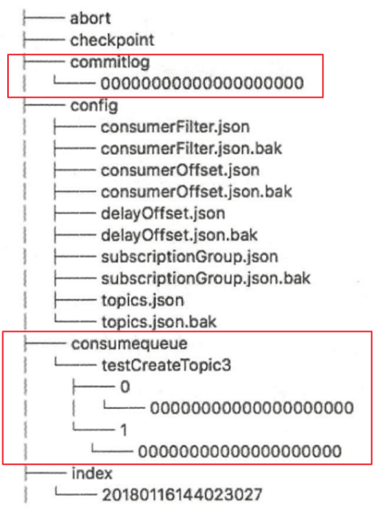

### 同步刷盘和异步刷盘

RocketMQ为提高性能，会尽可能保证磁盘的顺序读写。消息通过Producer写入RocketMQ的时候，有两种写磁盘方式，分别是同步刷盘与异步刷盘

-   同步刷盘——安全性
    -   在返回写成功状态时，消息已经写入磁盘
    -   执行流程：消息写入内存的PAGECACHE后，立刻通知刷盘线程刷盘，等待刷盘完成，刷盘线程执行完成后唤醒等待的线程，返回消息写成功的状态
-   异步刷盘——效率
    -   在返回写成功状态时，消息可能只是被写入内存的PAGECACHE，写操作的返回快，吞吐量大
    -   当内存里的消息积累到一定程度，统一触发写磁盘动作，快速写入

修改刷盘方式

`broker.conf`

flushDiskType=ASYNC_FLUSH——异步

flushDiskType=SYNC_FLUSH——同步

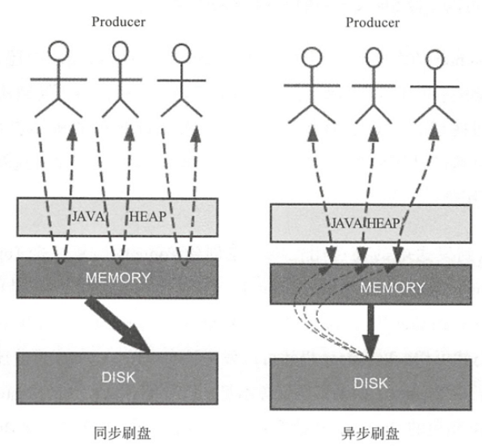

## 重试策略

### 重试情况分析

在消息的发送和消费过程中，都有可能出现错误，如网络异常等，出现了错误就需要进行错误重试，这种消息的重试分为 **producer端的重试** 和 **consumer端重试**


### producer端重试

-   指定重试次数
-   指定超时时间

```java
//消息发送失败时，重试3次
producer.setRetryTimesWhenSendFailed(3);

// 发送消息,并且指定超时时间
SendResult sendResult = producer.send(msg, 1000);
```

-   只有同步生产者才会进行错误重试。
-   只有特定异常才会重试；
-   设置的超时时间小于实际执行时间，则不会进行重试 

```java
#DefaultMQProducerImpl
//设置发送总次数    
int timesTotal = communicationMode == CommunicationMode.SYNC ? 1 + this.defaultMQProducer.getRetryTimesWhenSendFailed() : 1;
   
for (; times < timesTotal; times++) {
    try{
        if (timeout < costTime) {
            callTimeout = true;
            break;
        }
    }catch (RemotingException e) {
        ...
        continue;
    }catch (MQClientException e) {
    	...
        continue;
    }catch (MQBrokerException e){
        switch (e.getResponseCode()) {
            case ResponseCode.TOPIC_NOT_EXIST:
            case ResponseCode.SERVICE_NOT_AVAILABLE:
            case ResponseCode.SYSTEM_ERROR:
            case ResponseCode.NO_PERMISSION:
            case ResponseCode.NO_BUYER_ID:
            case ResponseCode.NOT_IN_CURRENT_UNIT:
            continue;
    	}
    }
}
```

### consumer端重试

-   消息处理的异常失败
-   消息超时接收的超时失败

#### 异常重试

消息正常到了消费者端，处理失败，发生异常。eg：反序列化失败，消息数据本身无法处理

消息状态

```java
package org.apache.rocketmq.client.consumer.listener;

public enum ConsumeConcurrentlyStatus {
    /**
    * Success consumption
    */
    CONSUME_SUCCESS,
    /**
    * Failure consumption,later try to consume
    */
    RECONSUME_LATER;
}
```

broker的启动日志

```shell
INFO main - messageDelayLevel=1s 5s 10s 30s 1m 2m 3m 4m 5m 6m 7m 8m 9m 10m 20m 30m 1h 2h
```

如果消息消费失败即broker收到 RECONSUME_LATER ，则broker会对消息进行重试发送，直至2h

演示：

```java
public class ConsumerDemo {
    public static void main(String[] args) throws MQClientException {
        DefaultMQPushConsumer consumer = new DefaultMQPushConsumer("test_consumer_group");
        consumer.setNamesrvAddr("8.140.130.91:9876");

        // 订阅topic，接收此Topic下的所有消息
        consumer.subscribe("test_error_topic", "*");
        consumer.registerMessageListener(new MessageListenerConcurrently() {
            @Override
            public ConsumeConcurrentlyStatus consumeMessage(List<MessageExt> msgs,
                                                            ConsumeConcurrentlyContext context) {
                for (MessageExt msg : msgs) {
                    try {
                        System.out.println(new String(msg.getBody(), "UTF-8"));
                    } catch (UnsupportedEncodingException e) {
                        e.printStackTrace();
                    }
                }
                System.out.println("收到消息->" + msgs);
                if(msgs.get(0).getReconsumeTimes() >= 3){
                    // 重试3次后，不再进行重试
                    return ConsumeConcurrentlyStatus.CONSUME_SUCCESS;
                }

                return ConsumeConcurrentlyStatus.RECONSUME_LATER;
            }
        });
        consumer.start();
    }
}
```

重试消息和原始发送消息不是同一条

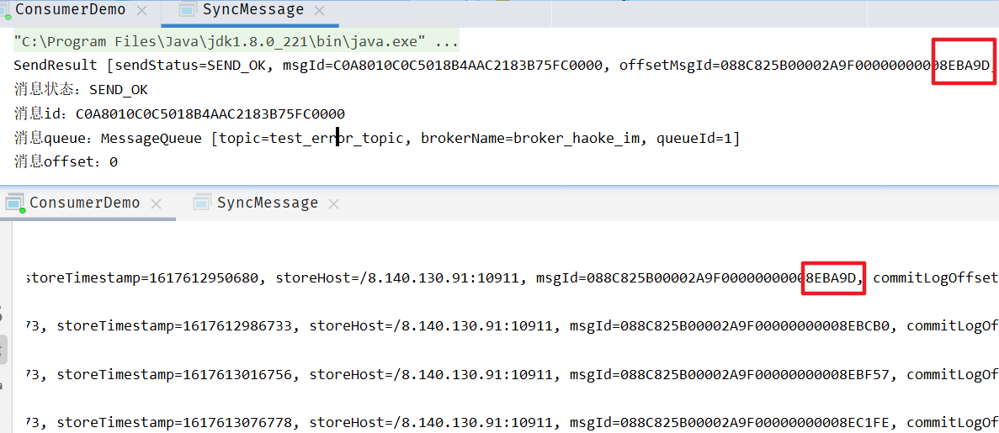

#### timeout

由于消息没有从MQ发送到消费者上，那么在MQ Server内部会不断的尝试发送这条消息，直至发送成功位置

也就是，服务端没有接收到消费端发来的消息的反馈，定义为超时

## RocketMQ的集群

### 集群模式

>   单个Master

-   风险较大，一旦Broker重启或者宕机，会导致整个服务不可用，只做开发环境

>   多Master

-   一个集群无Slave，全是Master，例如2个Master或者3个Master
-   单台机器宕机，这台机器上未被消费的消息在机器恢复之前不可订阅，消息的实时性受到影响

>   多Master多Slave，异步复制

-   每个Master配置一个Slave，有多个Master-Slave对，HA（双机集群系统）采用异步复制方式，主备有短暂消息延迟，毫秒级
-   优点：即使磁盘损坏，丢失的消息非常少，实时性不会收到影响，消费者仍可从Slave消费，此过程对应用透明，不需人工干预，性能同多Master模式一样
-   缺点：Master宕机或磁盘损坏，会丢失少量消息

>   多Master多Slave,同步双写

-   每个Master配置一个Slave，有多个Master-Slave对，HA（双机集群系统）采用同步双写方式，主备都写成功，向应用返回成功
-   优点：数据与服务无单点，Master宕机情况下，消息无延迟，服务可用性和数据可用性非常高
-   缺点：性能比异步复制模式低

### 搭建2m2s集群

>   创建2个NameServer(master)

```shell
#nameserver1
docker create -p 9876:9876 --name rmqserver01 \
-e "JAVA_OPT_EXT=-server -Xms128m -Xmx128m -Xmn128m" \
-e "JAVA_OPTS=-Duser.home=/opt" \
-v /data/rmq-data/rmqserver01/logs:/opt/logs \
-v /data/rmq-data/rmqserver01/store:/opt/store \
foxiswho/rocketmq:server-4.3.2

#nameserver2
docker create -p 9877:9876 --name rmqserver02 \
-e "JAVA_OPT_EXT=-server -Xms128m -Xmx128m -Xmn128m" \
-e "JAVA_OPTS=-Duser.home=/opt" \
-v /data/rmq-data/rmqserver02/logs:/opt/logs \
-v /data/rmq-data/rmqserver02/store:/opt/store \
foxiswho/rocketmq:server-4.3.2
```

>   搭建broker(2master)

```shell
#broker01配置文件 
namesrvAddr=8.140.130.91:9876;8.140.130.91:9877
brokerClusterName=HaokeCluster
brokerName=broker01
brokerId=0
deleteWhen=04
fileReservedTime=48
brokerRole=SYNC_MASTER
flushDiskType=ASYNC_FLUSH
brokerIP1=8.140.130.91
brokerIp2=8.140.130.91
listenPort=11911

#master broker01
docker create --net host --name rmqbroker01 \
-e "JAVA_OPTS=-Duser.home=/opt" \
-e "JAVA_OPT_EXT=-server -Xms128m -Xmx128m -Xmn128m" \
-v /data/rmq-data/rmqbroker01/conf/broker.conf:/etc/rocketmq/broker.conf \
-v /data/rmq-data/rmqbroker01/logs:/opt/logs \
-v /data/rmq-data/rmqbroker01/store:/opt/store \
foxiswho/rocketmq:broker-4.3.2
```

- brokerId：0表示主，>0表示Slave

- fileReservedTime：消息保存时间 单位——h

- deleteWhen：什么是时候对过期消息清理 24小时制

- brokerRole：[同步双写|异步双写]_[主] | [从] 

  [SYNC|ASYNC\_MASTER] | [SLAVE]

- flushDiskType：刷盘方式  [同步|异步]_FLUSH

  [SYNC|ASYNC_FLUSH]

- brokerIP1：访问broker的ip地址

- brokerIP2：主从同步的ip

- listenPort：与客户端交互的端口(+1，-2)

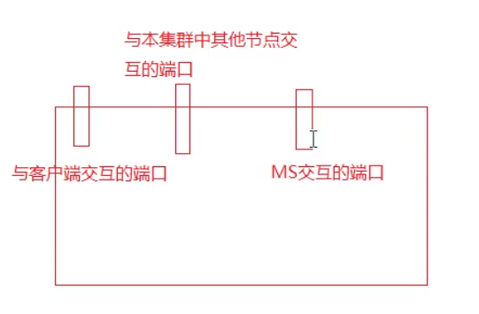

```shell
#broker02配置文件
namesrvAddr=8.140.130.91:9876;8.140.130.91:9877
brokerClusterName=HaokeCluster
brokerName=broker02
brokerId=0
deleteWhen=04
fileReservedTime=48
brokerRole=SYNC_MASTER
flushDiskType=ASYNC_FLUSH
brokerIP1=8.140.130.91
brokerIp2=8.140.130.91
listenPort=11811

#master broker02
docker create --net host --name rmqbroker02 \
-e "JAVA_OPTS=-Duser.home=/opt" \
-e "JAVA_OPT_EXT=-server -Xms128m -Xmx128m -Xmn128m" \
-v /data/rmq-data/rmqbroker02/conf/broker.conf:/etc/rocketmq/broker.conf \
-v /data/rmq-data/rmqbroker02/logs:/opt/logs \
-v /data/rmq-data/rmqbroker02/store:/opt/store \
foxiswho/rocketmq:broker-4.3.2
```

>   搭建从broker(slave)

```shell
#slave broker01配置文件 
namesrvAddr=8.140.130.91:9876;8.140.130.91:9877
brokerClusterName=HaokeCluster
brokerName=broker01
brokerId=1
deleteWhen=04
fileReservedTime=48
brokerRole=SLAVE
flushDiskType=ASYNC_FLUSH
brokerIP1=8.140.130.91
brokerIp2=8.140.130.91
listenPort=11711

#slave broker01
docker create --net host --name rmqbroker03 \
-e "JAVA_OPTS=-Duser.home=/opt" \
-e "JAVA_OPT_EXT=-server -Xms128m -Xmx128m -Xmn128m" \
-v /data/rmq-data/rmqbroker03/conf/broker.conf:/etc/rocketmq/broker.conf \
-v /data/rmq-data/rmqbroker03/logs:/opt/logs \
-v /data/rmq-data/rmqbroker03/store:/opt/store \
foxiswho/rocketmq:broker-4.3.2
```

```shell
#slave broker02配置文件 
namesrvAddr=8.140.130.91:9876;8.140.130.91:9877
brokerClusterName=HaokeCluster
brokerName=broker02
brokerId=1
deleteWhen=04
fileReservedTime=48
brokerRole=SLAVE
flushDiskType=ASYNC_FLUSH
brokerIP1=8.140.130.91
brokerIp2=8.140.130.91
listenPort=11611

#slave broker02
docker create --net host --name rmqbroker04 \
-e "JAVA_OPTS=-Duser.home=/opt" \
-e "JAVA_OPT_EXT=-server -Xms128m -Xmx128m -Xmn128m" \
-v /data/rmq-data/rmqbroker04/conf/broker.conf:/etc/rocketmq/broker.conf \
-v /data/rmq-data/rmqbroker04/logs:/opt/logs \
-v /data/rmq-data/rmqbroker04/store:/opt/store \
foxiswho/rocketmq:broker-4.3.2
```

```shell
#启动容器
docker start rmqserver01 rmqserver02
docker start rmqbroker01 rmqbroker02 rmqbroker03 rmqbroker04
```

### 测试

生产者

```java
public class SyncMessage {
    public static void main(String[] args) throws Exception{
        DefaultMQProducer producer = new DefaultMQProducer("test_cluster_group");
        producer.setNamesrvAddr("8.140.130.91:9876;8.140.130.91:9877");
        producer.start();

        String msgStr = "Cluster测试消息";

        /*
        * String topic, String tags, byte[] body
        * */
        Message message = new Message("test_cluster_topic","CLUSTER",msgStr.getBytes("UTF-8"));
        
        SendResult result = producer.send(message);

        System.out.println(result);

        System.out.println("消息状态：" + result.getSendStatus());
        System.out.println("消息id：" + result.getMsgId());
        System.out.println("消息queue：" + result.getMessageQueue());
        System.out.println("消息offset：" + result.getQueueOffset());

        producer.shutdown();
    }
}
```

消费者

```java
public class ConsumerDemo {
    public static void main(String[] args) throws Exception{
        /*
        * push类型的消费者，被动接收从broker推送的消息
        * */
        DefaultMQPushConsumer consumer = new DefaultMQPushConsumer("test_cluster_group");
        consumer.setNamesrvAddr("8.140.130.91:9876;8.140.130.91:9877");

        //订阅topopic，接收此topic下的所有消息
        consumer.subscribe("test_cluster_topic","*");

        consumer.registerMessageListener(new MessageListenerConcurrently() {//并发读取消息
            @Override
            public ConsumeConcurrentlyStatus consumeMessage(List<MessageExt> msgs, ConsumeConcurrentlyContext context) {

                for (MessageExt msg : msgs) {
                    try {
                        System.out.println(new String(msg.getBody(),"UTF-8"));
                    } catch (UnsupportedEncodingException e) {
                        e.printStackTrace();
                    }
                }
                System.out.println("收到消息->"+msgs);

                /*
                * 返回给broker消费者的接收情况
                * CONSUME_SUCCESS  接收成功
                * RECONSUME_LATER  延时重发
                * */
                return ConsumeConcurrentlyStatus.CONSUME_SUCCESS;
            }
        });

        consumer.start();
    }
}
```

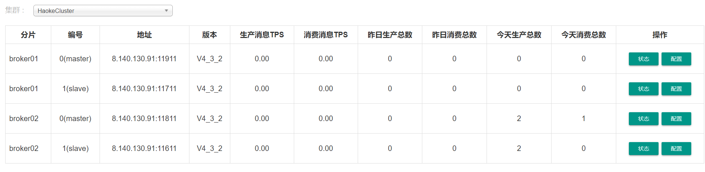

## SpringBoot整合RocketMQ

### 下载依赖

由于rocketMQ没有发布到Mven中央仓库，需要自行下载源码，并载入到本地Maven仓库

```
#源码地址
https://hub.fastgit.org/apache/rocketmq-spring

#进入源码目录，执行
mvn clean install
```

### 导入依赖

```xml
<parent>
    <groupId>org.springframework.boot</groupId>
    <artifactId>spring-boot-starter-parent</artifactId>
    <version>2.4.3</version>
</parent>

<dependencies>
    <dependency>
        <groupId>org.springframework.boot</groupId>
        <artifactId>spring-boot-starter</artifactId>
    </dependency>
    <dependency>
        <groupId>org.springframework.boot</groupId>
        <artifactId>spring-boot-starter-test</artifactId>
        <scope>test</scope>
    </dependency>
    <dependency>
        <groupId>org.apache.rocketmq</groupId>
        <artifactId>rocketmq-spring-boot-starter</artifactId>
        <version>2.0.0</version>
    </dependency>
    <dependency>
        <groupId>org.apache.rocketmq</groupId>
        <artifactId>rocketmq-client</artifactId>
        <version>4.3.2</version>
    </dependency>
    <dependency>
        <groupId>junit</groupId>
        <artifactId>junit</artifactId>
        <scope>test</scope>
    </dependency>
</dependencies>

<build>
    <plugins>
        <plugin>
            <groupId>org.apache.maven.plugins</groupId>
            <artifactId>maven-compiler-plugin</artifactId>
            <version>3.2</version>
            <configuration>
                <source>1.8</source>
                <target>1.8</target>
                <encoding>UTF-8</encoding>
            </configuration>
        </plugin>
    </plugins>
</build>
```

### application.properties

```properties
#Spring boot application
spring.application.name = test-rocketmq
spring.rocketmq.nameServer=8.140.130.91:9876
spring.rocketmq.producer.group=test_spring_producer_group
```

### 基本使用

#### 生产者发送消息

```java
package com.rocketmq.spring;

@Component
public class SpringProducer {
    //注入rocketmq模板
    @Autowired
    private RocketMQTemplate rocketMQTemplate;

    /**
     * 发送消息
     *
     * @param topic
     * @param msg
     */
    public void sendMsg(String topic,String msg){
        this.rocketMQTemplate.convertAndSend(topic,msg);
    }
}
```

#### 启动类

```java
package com.rocketmq;

@SpringBootApplication
public class MyApplication {
    public static void main(String[] args) {
        SpringApplication.run(MyApplication.class,args);
    }
}
```

#### 测试生产消息

```java
package com.rocketmq.spring;

import org.junit.Test;
import org.junit.runner.RunWith;
import org.springframework.beans.factory.annotation.Autowired;
import org.springframework.boot.test.context.SpringBootTest;
import org.springframework.test.context.junit4.SpringRunner;

@RunWith(SpringRunner.class)
@SpringBootTest
public class TestSpringRocketMQ {

    @Autowired
    SpringProducer producer;

    @Test
    public void testSendMsg(){
        String msg = "第二个Spring RocketMq 消息";

        this.producer.sendMsg("test_spring_topic",msg);
        System.out.println("发送成功!");
    }

}
```

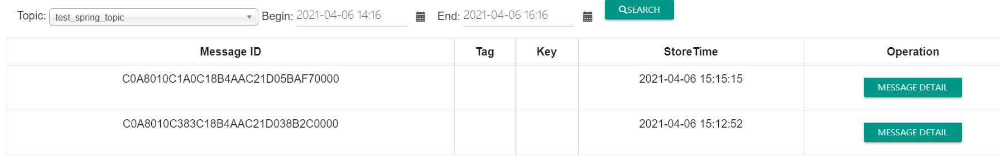

#### 消费者消费消息

```java
package com.rocketmq.spring;

import org.apache.rocketmq.spring.annotation.ConsumeMode;
import org.apache.rocketmq.spring.annotation.RocketMQMessageListener;
import org.apache.rocketmq.spring.core.RocketMQListener;
import org.springframework.stereotype.Component;

@Component
@RocketMQMessageListener(
        topic = "test_spring_topic",
        consumerGroup = "test_spring_consumer_group",
        selectorExpression = "*",
        consumeMode = ConsumeMode.CONCURRENTLY
)
public class SpringConsumer implements RocketMQListener<String> {

    @Override
    public void onMessage(String msg) {
        System.out.println("收到消息->"+msg);
    }
}
```

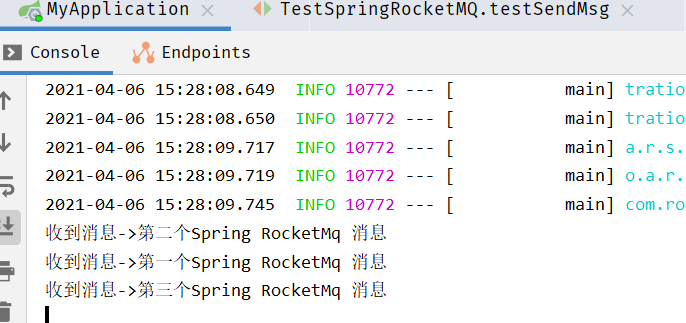

### 事务消息

#### 生产者

```java
package com.rocketmq.spring.transaction;

@Component
public class TransactionProducer {

    @Autowired
    private RocketMQTemplate rocketMQTemplate;


    /**
     * 发送消息
     *
     * @param topic
     * @param msg
     */
    public void sendMsg(String topic,String msg){
        Message message = (Message) MessageBuilder.withPayload(msg).build();

        //此处的txProducerGroup与事务监听器的@RocketMQTransactionListener(txProducerGroup = "")一致
        this.rocketMQTemplate.sendMessageInTransaction(
                "test_tx_producer_group",
                topic,
                message,
                null
        );

        System.out.println("消息发送成功");
    }
}
```

#### 生产者监听器

```java
package com.rocketmq.spring.transaction;

@RocketMQTransactionListener(txProducerGroup = "test_tx_producer_group")
public class TransactionListenerImpl implements RocketMQLocalTransactionListener {

    private static Map<String,RocketMQLocalTransactionState> STATE_MAP = new HashMap<>();

    /**
     * 执行本地事务
     *
     * @param message
     * @param o
     * @return
     */
    @Override
    public RocketMQLocalTransactionState executeLocalTransaction(Message message, Object o) {

        String transactionId = (String) message.getHeaders().get(RocketMQHeaders.TRANSACTION_ID);

        try {
            System.out.println("执行操作1");
            Thread.sleep(500L);

            System.out.println("执行操作2");
            Thread.sleep(500L);

            STATE_MAP.put(transactionId,RocketMQLocalTransactionState.COMMIT);
            return RocketMQLocalTransactionState.COMMIT;
        }catch (Exception e){
            e.printStackTrace();
        }

        STATE_MAP.put(transactionId,RocketMQLocalTransactionState.ROLLBACK);
        return RocketMQLocalTransactionState.ROLLBACK;
    }

    /**
     * 消息回查
     *
     * @param message
     * @return
     */
    @Override
    public RocketMQLocalTransactionState checkLocalTransaction(Message message) {
        String transactionId = (String) message.getHeaders().get(RocketMQHeaders.TRANSACTION_ID);

        System.out.println("回查消息->transactionId = "+transactionId+",state = "+STATE_MAP.get(transactionId));

        return STATE_MAP.get(transactionId);
    }
}
```

#### 消息生产测试

```java
@Test
public void testSendTransactionMsg(){
    String msg = "事务消息测试!";

        this.transactionProducer.sendMsg("test_spring_transaction_topic",msg);
        System.out.println("发送成功");
}
```

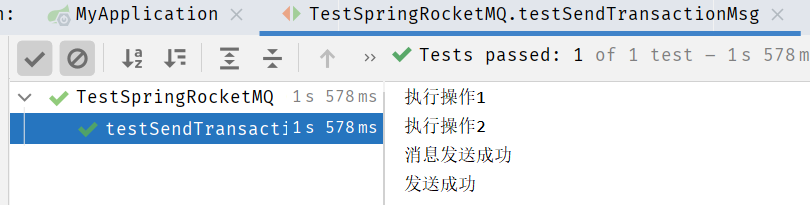

#### 消费者测试

```javascript
package com.rocketmq.spring.transaction;

@Component
@RocketMQMessageListener(
        topic = "test_spring_transaction_topic",
        consumeMode = ConsumeMode.CONCURRENTLY,
        selectorExpression = "*",
        consumerGroup = "test_tx_consumer_group"
)
public class TransactionConsumer implements RocketMQListener<String> {

    @Override
    public void onMessage(String s) {
        System.out.println("收到消息->"+s);
    }
}
```

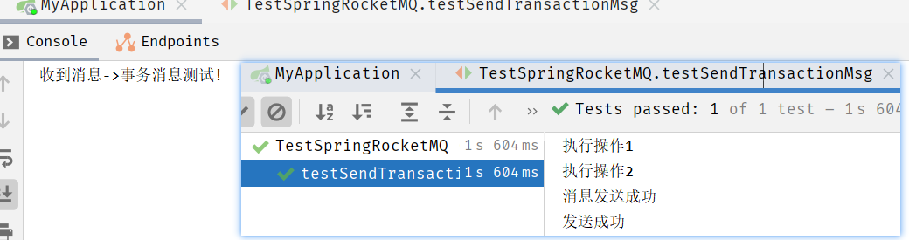

#### 消息回查测试

```java
@Override
public RocketMQLocalTransactionState executeLocalTransaction(Message message, Object o) {

    String transactionId = (String) message.getHeaders().get(RocketMQHeaders.TRANSACTION_ID);

    try {
        System.out.println("执行操作1");
        Thread.sleep(500L);

        System.out.println("执行操作2");
        Thread.sleep(500L);

        STATE_MAP.put(transactionId,RocketMQLocalTransactionState.COMMIT);
        return RocketMQLocalTransactionState.UNKNOWN;
    }catch (Exception e){
        e.printStackTrace();
    }

    STATE_MAP.put(transactionId,RocketMQLocalTransactionState.ROLLBACK);
    return RocketMQLocalTransactionState.ROLLBACK;
}
```

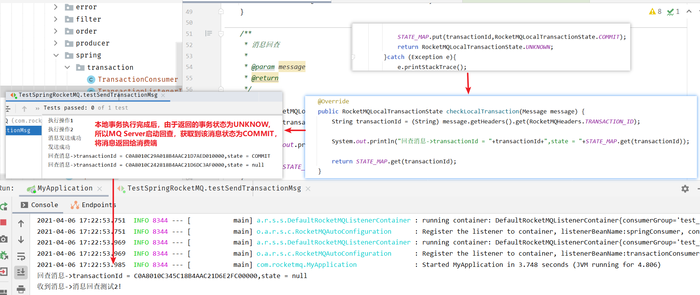

