# 行人重识别

> [罗浩老师讲解视频，小白的福音](https://www.bilibili.com/video/BV1Pg4y1q7sN?p=47)
>
> 代码主要参考了罗浩老师的[deep-reid-baseline](https://github.com/michuanhaohao/deep-person-reid), 代码中有很多的注释，便于自己的理解

**摘要**：行人重识别 ( `Person re-identification` ) 也称行人再识别，被广泛认为是一个图像检索的子问题，是利用 **计算机视觉技术** 判断图像或者视频中是否存在特定行人的技术，即给定一个监控行人图像检索跨设备下的该行人图像。行人重识别技术可以弥补目前固定摄像头的视觉局限，并可与 **行人检测、行人跟踪技术** 相结合，应用于视频监控、智能安防等领域。`ReID` 已经在学术界研究多年，但知道最近几年随着深度学习的发展，才取得了非常巨大的突破。本文将对目前常用的行人重识别的主要方法进行分析梳理。

关键词：视频序列，深度学习，卷积神经网络

## 1. 研究背景

相对于行人检测来说，行人重识别的研究还不算成熟，但早在1996年，就有学者关注行人重识别问题，在2006年，行人重识别的概念第一次在CVPR上提出后，相关的研究不断涌现。2007年Gray提出一个对于行人重识别的研究具有重大意义的数据库 `VIPeR` 。此后越来越多的学者开始关注行人重识别的研究。

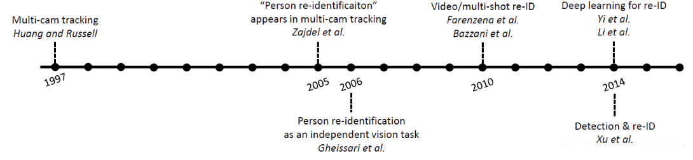

2012年，第一个行人重识别研讨会在ECCV会议上召开；2013年，Gong等出版第一本行人重识别的专著；2014年后，深度学习被应用到行人重识别领域；2016年，行人重识别迎来井喷式的增长，在各大计算机视觉的会议中出现了几十篇相关论文，尤其是基于深度神经网络的方法引起了广泛的关注；同时，相关数据集在不断地扩充，在各个数据集上的结果也获得很大的提升，到目前，行人重识别问题已成为计算机视觉的一个热点问题。

## 2. 行人重识别系统

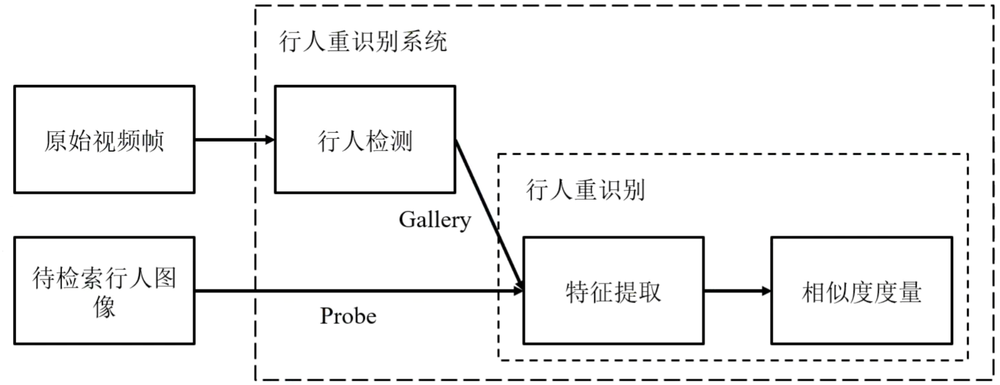

一个完整的行人重识别系统包括以下几部分：

1. 数据

   - 原始视频帧

     我们通过摄像设备获取的正常视频图像。假如是警察在追查犯罪嫌疑人逃跑路径，那么，原始视频帧就是犯罪现场周围的所有监控视频。

   - 待检索行人图像

     我们要查找的行人图像，作为 `Probe输入` 。在上述例子中，待检索行人图像就是嫌犯的图像。

2. 行人重识别系统

   - 行人检测

     主要用于检测视频中出现的人像，作为一个行人重识别系统，首先要做的就是能够将图片中的行人识别出来，称为 `Gallery输入` 。当然，在研究中，行人重识别主要是关注下面这部分，所以在行人重识别系统中这部分多采用目前已经设计好的框架。

   - 行人重识别

     这一部分就是对上面 `Probe` 以及 `Gallery` 进行特征提取 ，可以通过手工提取，也可以使用卷积神经网络进行提取。然后就是对图片的相似度进行度量，根据相似图进行排序。

     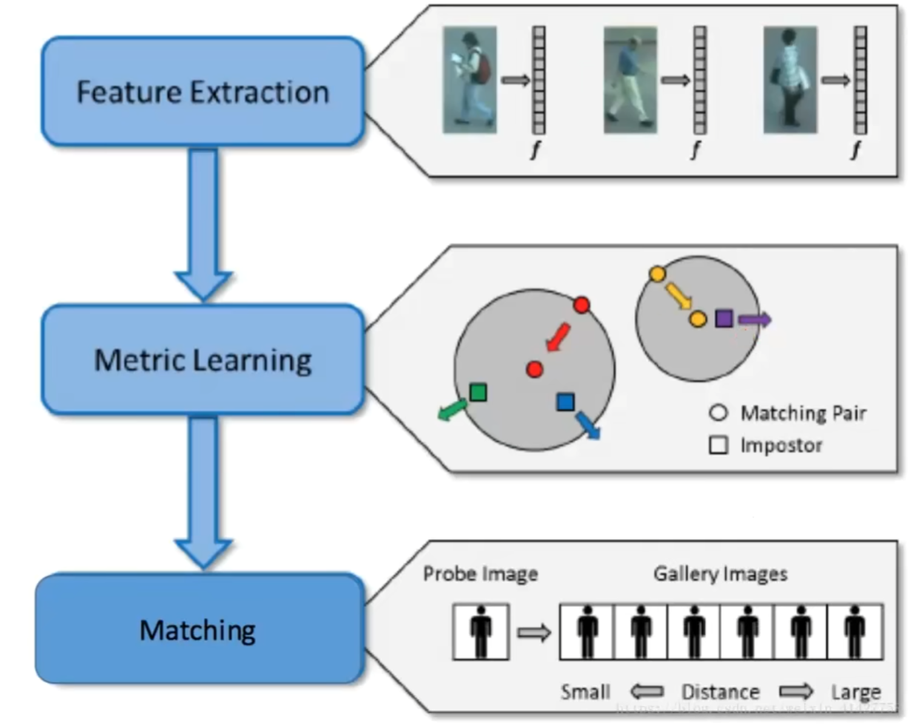

     在行人重识别系统中，包括以下三部分：

     - 特征学习（`Feature Extraction`）：学习能够应对在不同摄像头下行人变化的特征。
     - 度量学习（`Metric Learning`）：将学习到的特征映射到新的空间，使相同的人更近，不同的人更远。
     - 图像检索（`Matching`）：根据图片特征之间的距离进行检索，返回检索结果。

## 3. 常用评价指标

### 3.1 rank-k

算法返回的排序列表中，前k位为存在检索目标则称为 `rank-k` 命中

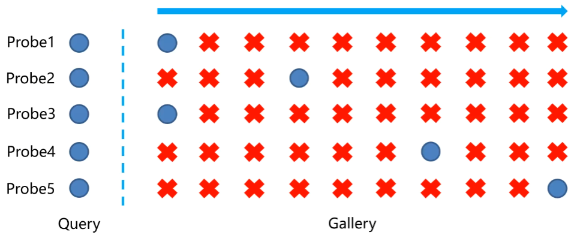

$rank-1：\frac{2}{5}=40%$

$rank-2:\frac{3}{5}=60%$

$rank-10:\frac{5}{5}=100%$

### 3.2 CMC曲线

`Cumulative Match Characteristic (CMC) curve` ：计算`rank-k`的命中率，形成 `rank-acc` 的曲线

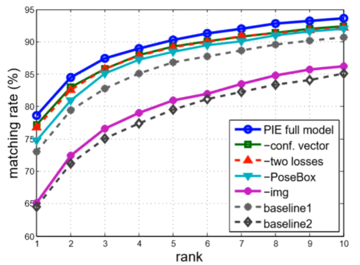

### 3.3 mAP曲线

`mAP(mean average precision)` ：反应检索的人在数据库中所有正确的图片排在排序列表前面的程度，能更加全面的衡量 `ReID` 算法的性能。

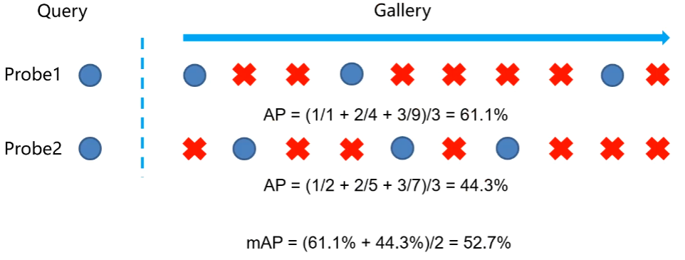

### 3.4 `Precision` 和 `Recall`

一般来说，`Precision` 就是检索出来的条目有多少是准确的，`Recall` 就是所有准确的条目有多少被检索出来了。
$$
Precision=\frac{提取出的正确信息条数}{提取出的信息条数}\\
Recall=\frac{提取出的正确信息条数}{样本中的信息条数}
$$
在 `ReID` 中，一个人的label为 `m1` ，在测试集中包含3张此人的图像，检索出来的图像按照得分从高到低顺序为 `m1`、`m2`、`m1`、`m3`、`m4`、`m1`….，此时
第一次检索到 `m1` ，提取出的正确信息条数=1，提取出的信息条数=1，样本中的信息条数=3，$$正确率=\frac{1}{1}=100%$$，$$召回率=\frac{1}{3}=33.33\%$$

第二次检索到 `m1`，提取出的正确信息条数=2，提取出的信息条数=3，样本中的信息条数=3，$正确率=\frac{2}{3}=66.66%$，$召回率=\frac{2}{3}=66.66\%$

第三次检索到 `m1`，提取出的正确信息条数=3，提取出的信息条数=6，样本中的信息条数=3，$正确率=\frac{3}{6}=50%$3/6=50%，$召回率=\frac{3}{3}=100\%$

$平均正确率 AP=\frac{100\%+66.66\%+50\%}{3}=72.22\%$

而当需要检索的不止一个人时，此时正确率则取所有人的平均mAP。

### 3.5 `F-score`

一般的搜索情况，在保证召回率的条件下，尽量提升精确率。很多时候我们需要综合权衡这2个指标，这就引出了一个新的指标 $F-score$。这是综合考虑 $Precision$ 和 $Recall$ 的调和值。
$$
F-Score=(1+\beta^2)\frac{Precision\cdot Recall}{\beta^2Precision+Recall}
$$
当 $β=1$ 时，称为 `F1−score` ，这时，精确率和召回率都很重要，权重相同。当有些情况下，我们认为精确率更重要些，那就调整 $\beta < 1$ ，如果我们认为召回率更重要些，那就调整 $\beta >1$

## 4. 常用评价模式

### 4.1 single shot vs multi shot

`single shot` 指 gallery 中每个人的图像 $N=1$ ，`multi shot` 指 gallery 中每个人的图像 $N>1$。在同样的 `rank-k` 下，一般 N越大，得到的辨识度越高。

 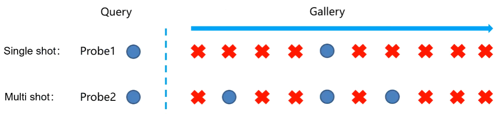

### 4.2 single query vs multi query

`single query` 是指 probe 中每个人的图像 $N=1$ 张，而 `multi query` 是指 probe 中每个人的图像为 $N>1$ 张图像，然后融合N张图片的特征（最大池化或者平均池化）作为最终特征。同样的Rank-k下，一般N越大，得到的识别率越高。

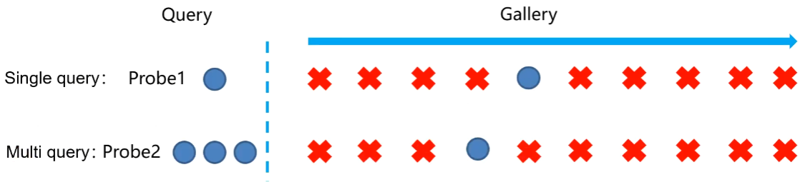

## 5. 行人重识别采用的方法

### 5.1 基于表征学习的 `ReID` 方法

基于表征学习 （`Representation Learning`）的方法是一类非常常用的行人重识别方法。主要得益于深度学习，尤其是卷积神经网络（`Convolutional neural network,CNN`）的快速发展。由于 `CNN` 可以自动从原始的图像数据中根据任务需求自动提取出表征特征（`Representation`），所以有些研究者把行人重识别问题看做 分类问题（`Classifaction` / `Identification`） 问题或者 验证（`Verification`）问题。

- 分类问题：利用行人的ID或者属性等作为训练标签来训练模型，分类子网络对图片进行ID预测，根据预测的ID来计算分类误差损失。
- 验证问题：输入两张行人图片，让网络来学习这两张图片是否为同一个行人，验证子网络融合两张图片的特征，判断这两张图片是否属于同一个行人，该子网络实质上等于一个二分类网络。

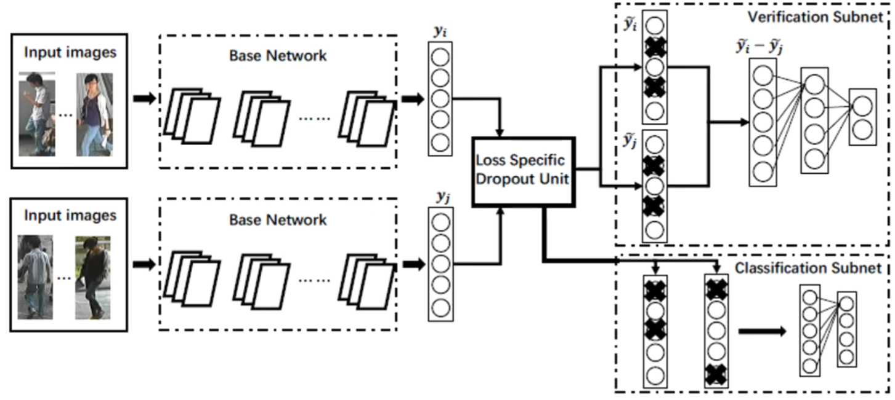

经过足够数据的训练，再次输入一张测试图片，网络将自动提取一个特征，用于行人重识别任务。

基于特征表示的方法重点在于设计鲁棒可靠的行人图像特征表示模型，即能够区分不同行人，同时能够不受光照和视角变化的影响，故将典型特征总结为下表。

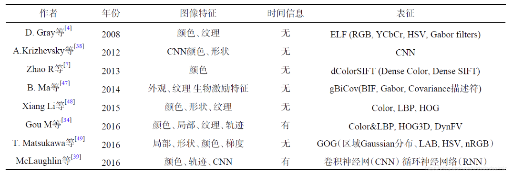

### 5.2 基于度量学习的 `ReID` 方法

度量学习（`Metric Learning`）是广泛用于图像检索领域的一种方法。度量学习旨在通过网络学习出两张图片的相似度。在行人重识别问题上，具体为同一行人的不同图片相似度大于不同行人的不同图片。最后网络的损失函数使得相同行人图片（正样本）的距离尽可能小，不同行人图片（负样本）的距离尽可能大。常用度量学习损失方法有 **对比损失（Contrastive loss）、三元组损失（Triplet loss）、四元组损失（Quadruplet loss）、难样本采样三元组损失** 

假设有两张输入图片 $I_a$ 和 $I_b$ ，通过网络我们可以得到他们的特征   $f_{I_a}$ 和 $f_{I_b}$ ，定义这两张图片特征向量的欧氏距离为 $d_{I_a,I_b}=\Vert f_{I_a}-f_{I_b}\Vert_2$ 

#### 5.2.1 对比损失（`Contrastive loss`）

对比损失用于训练孪生网络 （`Siamese network`），孪生网络的输入为一对图片 $x_a$ 和 $x_b$ ，这两张图片可以为同一行人，也可以为不同行人。每一对训练图片都有一个标签 $y$ ，其中 $y=1$ 表示两张图片属于同一个行人（正样本对），反之，$y=0$ 表示属于不同行人（负样本对）。

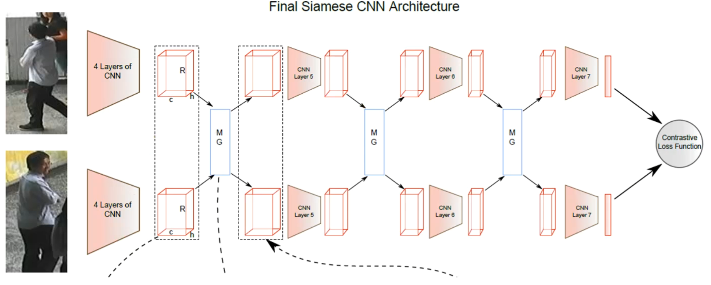

之后对比损失函数记为 $L_c=yd_{I_a,I_b}^2+(1-y)(\alpha-d_{I_a,I_b})^2_+$ ，其中 $d_{I_1,I_2}=\Vert f_{I_1}-f_{I_2}\Vert_2$ ,$(z)_+$ 表示 $max(z,0)$ ,$\alpha$ 为根据实际需求设计的阈值参数。

#### 5.2.2 三元组损失（`Triplet loss`）

三元组损失是一种被广泛应用的度量学习损失。三元组损失需要三章输入图片，包括一对正样本对和一对负样本对。三张图片分别命名为固定图片(`Anchor`) $a$ ，正样本图片(Positive) $p$ 和负样本图片(Negative) $n$ 。图片 $a$ 和图片 $p$ 为一对正样本对，图片 $a$ 和图片 $p$ 是一堆正样本对，图片 $a$ 和 图片 $n$ 为一对负样本对。三元组损失表示为 $L_t=(d_{a,p}-d_{a,n}+\alpha)_+$  

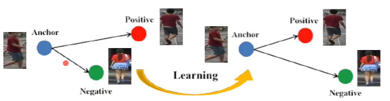

三元组可以拉近正样本对之间的距离，推开负样本对之间的距离，最后使得相同ID的行人图片在特征空间里形成聚类，达到行人重识别的目的。

原 `Triplet loss` 只考虑正负样本对之间的相对距离，而没有考虑正样本对之间的绝对距离，为此提出改进的三元组损失：$L_t=d_{a,p}+(d_{a,p}-d_{a,n}+\alpha)_+$ ，保证网络不仅能在特征空间把正负样本推开，也能保证正样本对之间距离很近。

### 5.3 基于局部特征的 `ReID` 方法

#### 5.3.1 水平切块

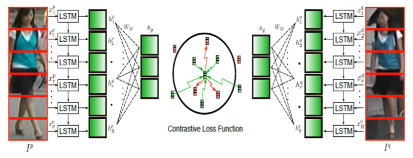

每一块图像经过CNN网络得到特征，局部特征按顺序输入到 `LSTM` 网络，自动表达为图像最终的特征。利用 `对比损失` 训练网络。水平切块是比较早起的工作，目前已经很少使用。

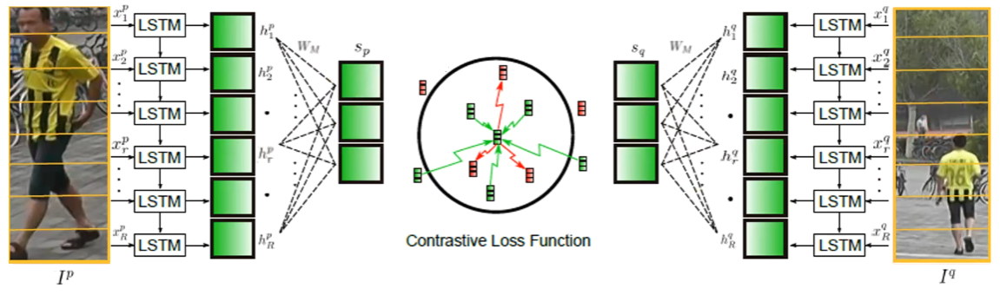

#### 5.3.2 PIE

为解决图像不对齐情况下手动图像切片失效的问题，一些论文利用一些先验知识先将行人进行对齐，这些先验知识主要是预训练的人体姿态 ( `Pose` ) 和骨架关键点 (`Skeleton`) 模型。论文先用姿态估计的模型估计出行人的关键点，然后用仿射变换使得相同的关键点对齐。

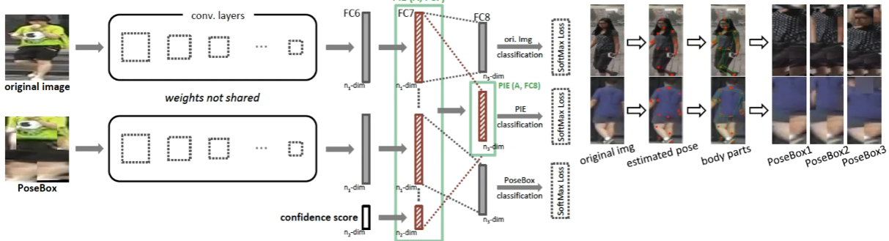

一个行人通常被分为14个关键点，这14个关键点把人体结果分为若干个区域。为了提取不同尺度上的局部特征，作者设定了三个不同的PoseBox组合。之后这三个PoseBox矫正后的图片和原始为矫正的图片一起送到网络里去提取特征，这个特征包含了全局信息和局部信息。

#### 5.3.3 Spindle Net

`Spindle Net` 并没有用仿射变换来对齐局部图像区域，而是直接利用这些关键点来抠出感兴趣区域 （`Region of interest, ROI`）。首先通过骨架关键点提取的网络提取14个人体关键点，之后利用这些关键点提取7个人体结构 `ROI` 。

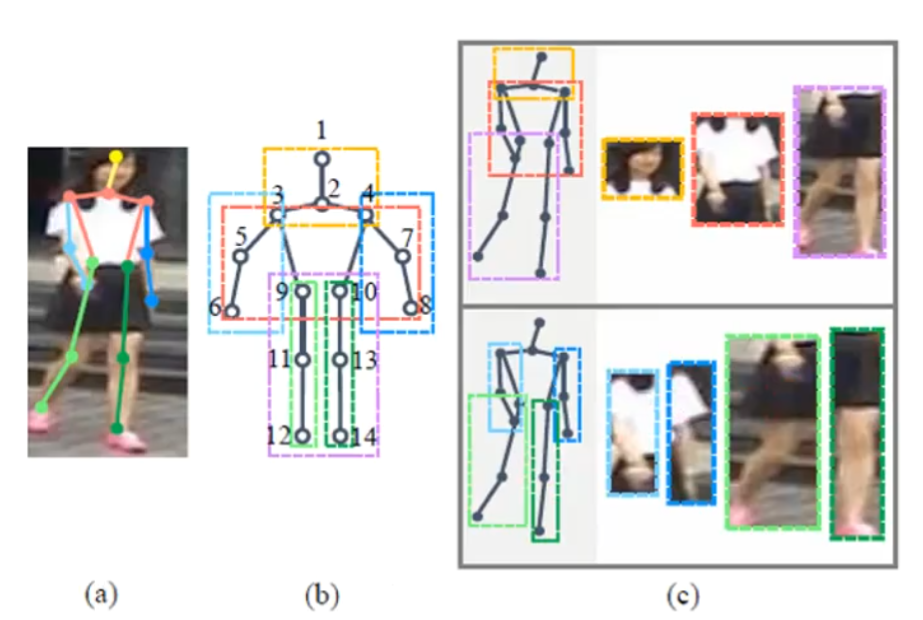

网络中所有提取特征的 `CNN` （橙色表示）参数都是共享的，这个 `CNN` 分成了线性的三个子网络 `FEN-C1` 、`FEN-C2`、`FEN-C3` 。对于输入的一张行人图片，有一个预训练好的骨架关键点提取 `CNN`（蓝色表示）来获得14个人体关键点，从而得到7个 `ROI` 区域，其中包括三个大区域（头、上身、下身）和四个四肢小区域。这7个 `ROI` 区域和原始图片进入同一个 `CNN` 网络提取特征。原始图片经过完整的 `CNN` 得到一个全局特征。三个大区域经过 `FEN-C2` 和 `FEN-C3` 子网络得到三个局部特征。四个四肢区域经过 `FEN-C3` 子网络得到四个局部特征。之后这8个特征按照图示的方式在不同的尺度进行联结，最终得到一个融合全局特征和多个尺度局部特征的行人重识别特征。
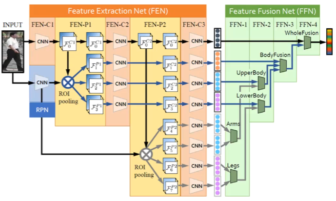

#### 5.3.4 GLAD

全局-局部对齐特征描述子（`Global-Local-Alignment Descriptor, GLAD`） 来解决行人姿态变化的问题。与 `Spindle Net` 类似，`GLAD` 利用提取的人体关键点把图片分为头部，上身和下身三部分。之后将整图和三个局部图片一起输入到一个参数共享 `CNN` 网络中，最后提取的特征融合了全局和局部的特征。为了适应不同分辨率大小的图片输入，网络利用全局平均池化 （`Global average pooling, GAP`） 来提取各自的特征。和 （`Spindle Net`） 略微不同的是四个输入图片各自计算对应的损失，而不是融合为一个特征计算一个总的损失。

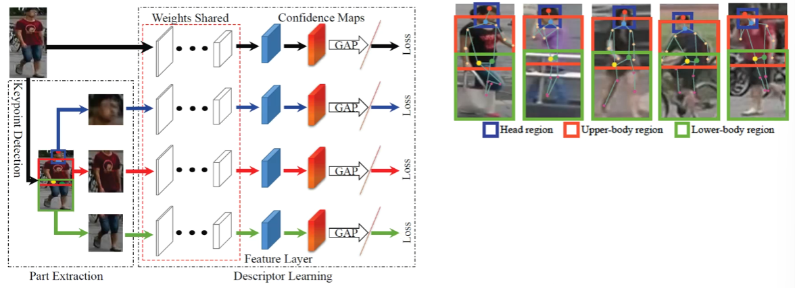

### 5.4 基于视频序列的 `ReID` 方法

基于视频序列的方法最主要的不同点就是这类方法不仅考虑了图像的内容信息，还考虑了帧与帧之间的运动信息等，

#### 5.4.1 典型思路

主要思想是利用 `CNN` 来提取空间特征的同时利用递归循环网络（`Recurrent neural networks, RNN`）来提取时序特征。

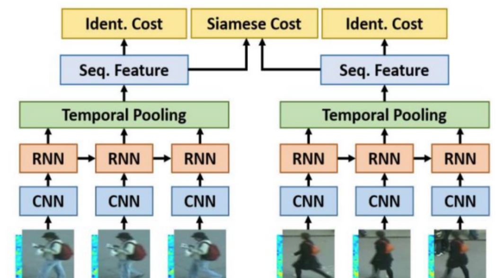

每张图像都经过一个共享的CNN提取出图像空间内容特征，之后这些特征向量被输入到一个RNN网络去提取最终的特征。最终的特征融合了单帧图像的内容特征和帧与帧之间的运动特征。而这个特征用于代替前面单帧方法的图像特征来训练网络。

#### 5.4.2 累计运动背景网络

(`Accumulative motion context network,AMOC`) 输入的包括原始的图像序列和提取的光流序列。通常提取光流信息需要用到传统的光流提取算法，但是这些算法计算耗时，并且无法与深度学习网络兼容。所以首先需要训练一个运动信息网络（`Motion network, Moti Nets`）。这个运动网络输入为原始的图像序列，标签为传统方法提取的光流序列。

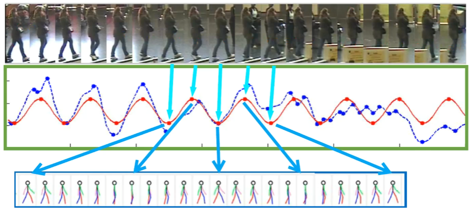

原始的图像序列显示在第一排，提取的光流序列显示在第二排。网络有三个光流预测的输出，分别为 Pred1，Pred2，Pred3，这三个输出能够预测三个不同尺度的光流图。最后网络融合了三个尺度上的光流预测输出来得到最终光流图，预测的光流序列在第三排显示。通过最小化预测光流图和提取光流图的误差，网络能够提取出较准确的运动特征。

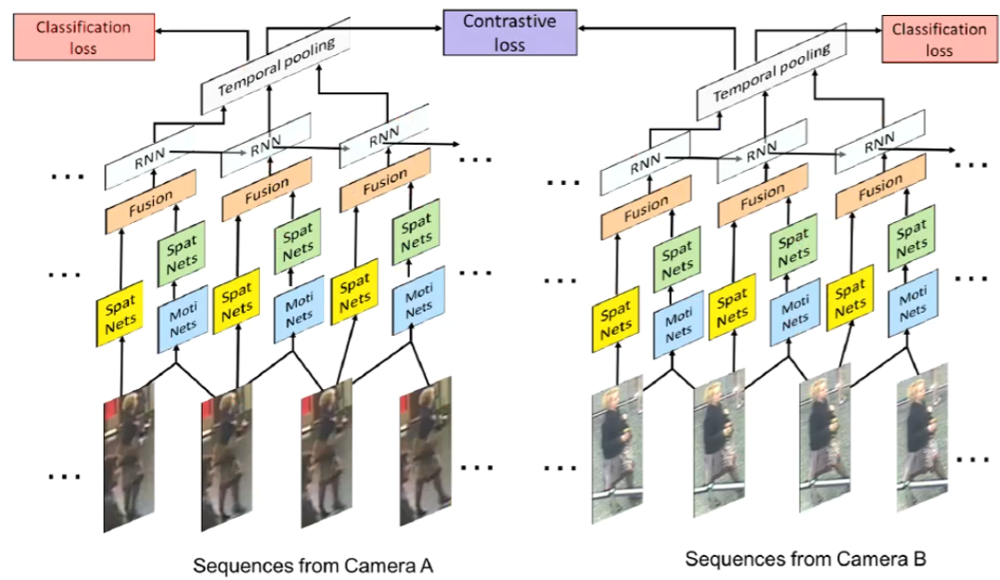

AMOC拥有空间信息网络(Spatial network, Spat Nets)和运动信息网络两个子网络。图像序列的每一帧图像都被输入到Spat Nets来提取图像的全局内容特征。而相邻的两帧将会送到Moti Nets来提取光流图特征。之后空间特征和光流特征融合后输入到一个RNN来提取时序特征。通过AMOC网络，每个图像序列都能被提取出一个融合了内容信息、运动信息的特征。网络采用了分类损失和对比损失来训练模型。融合了运动信息的序列图像特征能够提高行人重识别的准确度。

## 6. 总结与展望

行人重识别的研究面临着诸如图像分辨率低、视角变化、姿态变化、光线变化以及遮挡等带来的诸多挑战。比如：

1. 监控视频的画面一般比较模糊，分辨率也比较低，所以利用人脸识别等方式无法进行重识别的工作，只能利用头部之外的人体外观信息进行识别，而不同行人的体型和衣着服饰有可能相同，这为行人重识别的准确度带来了极大的挑战；
2. 此外实际视频监控下的场景非常复杂，周边杂物较多，场景复杂，画面很容易出现遮挡等情况，这种时候靠步态等特征就很难进行重识别。
3. 行人重识别的图像往往采自于不同的摄像机，由于拍摄场景、摄像参数不同，行人重识别工作一般存在光照变化及视角变化等问题，这导致同一个行人在不同摄像机下存在较大的差异，不同行人的外貌特征可能比同一个人的外貌特征更相似。
4. 进行重识别的行人图像可能拍摄于不同的时间，行人姿态、衣着会有不同程度的改变。此外在不同的光照条件下，行人的外观特征也会有很大的差异。

以上情况都给行人重识别的研究带来了巨大的挑战，因此目前的研究距离实际应用层面还有很大的距离。

## 参考文献

[1] Qiqi Xiao, Kelei Cao, Haonan Chen, Fangyue Peng, Chi Zhang. Cross domain knowledge transfer for person re-identification[J]. arXiv preprint arXiv:1611 .06026, 2016.
[2] Rahul Rama Varior, Bing Shuai, Jiwen Lu, Dong Xu, Gang Wang. A siamese long short-term memory architecture for human re-identification[CV/European Conference on Computer Vision. Springer, 2016:135 -153.

[3] Zhang X*, Luo H*, Fan X, et al. Alignedreid: Surpassing human-level performance in person re-identification[J]. arXivpreprint arXiv:1711.08184, 2017. (* stands for equal contribution)
[4] Luo H, Jiang w, Zhang, et al. Alignedreid + +: Dynamically Matching Local Information for Person Re-ldentification. (Under review on Pattern Recognition)

[5] Liang Zheng, Yujia Huang, Huchuan Lu, Yi Yang. Pose invariant embedding for deep person reidentification[J]. arXiv preprint arXiv:1701 .07732, 2017.

[6] Haiyu Zhao, Maoqing Tian, Shuyang Sun, Jing Shao, Junjie Yan, Shuai Yi, Xiaogang Wang, Xiaoou Tang. Spindle net: Person re-identification with human body region guided feature decomposition and fusion[C]. CVPR, 2017.

[7] Longhui Wei, Shiliang Zhang, Hantao Yao, Wen Gao, Qi Tian. Glad: Global-local-alignment descriptor for pedestrian retrieval[J].arXiv preprint arXiv:1709.04329, 2017.
