> 前置知识：
>
> [MongoDB](https://auspicetian.github.io/posts/2393724542/)
>
> [RocketMQ](https://auspicetian.github.io/posts/1776729057)

-   消息的发送与接收
-   WebSocket
    -   简介
    -   WebSocket模拟
    -   SpringBoot整合WebSocket
-   WebSocket和MongoDB搭建微聊系统

<!--more-->

# WebSocket

> 网站中的消息功能

**服务端消息实时推送到前端？**

解决方案：采用轮询方式，即：通过js不断的请求服务器，查看是否有新数据

**弊端**：

资源浪费

## 简介

使用WebSocket技术解决

WebSocket 是HTML5一种新的协议。它实现了浏览器与服务器**全双工通信**。它是一种在单个TCP连接上进行全双工通讯协议。

> 全双工和单工的区别？
>
> -   全双工（Full Duplex）。通信传输时允许数据在两个方向上同时传输，它在能力上相当于两个单工通信方式的结合。全双工指可以同时（瞬时）进行信号的双向传输（A→B且B→A）。
> -   单工、半双工（Half Duplex），所谓半双工就是指一个时间段内只有一个动作发生。

### http与WebSocket区别

http协议是短连接，因为请求之后，都会关闭连接，下次重新请求数据，需要再次打开链接

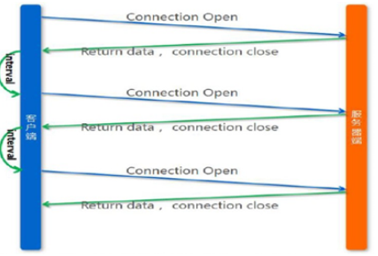

WebSocket协议是一种长链接，只需要通过一次请求来初始化链接，然后所有的请求和响应都是通过这个TCP链接进行通讯。

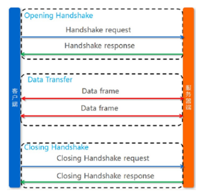

### 浏览器支持情况

https://caniuse.com/?search=websocket

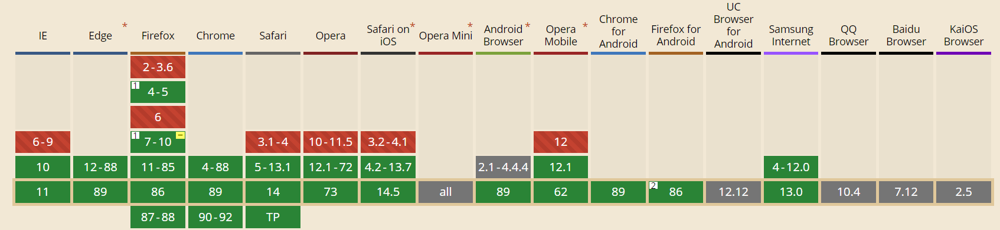

#### Spring相关注解说明

>   @ServerEndpoint("/websocket/{uid}")

-   注解在类上
-   声明这是一个websocket服务
-   在地址中可以指定参数，需要通过{}进行占位

>    @OnOpen

-   该方法将在建立连接后执行，会传入session对象，就是客户端与服务端建立的长连接通道
-   public void onOpen(Session session, @PathParam("uid") String uid) throws IOException{}
-   通过@PathParam获取url申明中的参数

>   @OnClose

-   该方法是在连接关闭后执行
-   用法：public void onClose() {}

>    @OnMessage

-   该方法用于接收客户端发来的消息
-   用法：public void onMessage(String message, Session session) throws IOException {}
-   message：发来的消息数据
    session：会话对象（也是通道）

-   发送消息到客户端
    -   通过session进行发送
    -   用法：session.getBasicRemote().sendText("你好");

## WebSocketDemo

### pom.xml

```xml
<?xml version="1.0" encoding="UTF-8"?>
<project xmlns="http://maven.apache.org/POM/4.0.0"
         xmlns:xsi="http://www.w3.org/2001/XMLSchema-instance"
         xsi:schemaLocation="http://maven.apache.org/POM/4.0.0 http://maven.apache.org/xsd/maven-4.0.0.xsd">
    <modelVersion>4.0.0</modelVersion>

    <groupId>org.example</groupId>
    <artifactId>websocket</artifactId>
    <version>1.0-SNAPSHOT</version>

    <packaging>war</packaging>

    <dependencies>
        <dependency>
            <groupId>javax</groupId>
            <artifactId>javaee-api</artifactId>
            <version>7.0</version>
            <scope>provided</scope>
        </dependency>
    </dependencies>

    <build>
        <plugins>
            <plugin>
                <groupId>org.apache.maven.plugins</groupId>
                <artifactId>maven-compiler-plugin</artifactId>
                <version>3.2</version>
                <configuration>
                    <source>1.8</source>
                    <target>1.8</target>
                    <encoding>UTF-8</encoding>
                </configuration>
            </plugin>

            <!-- 配置Tomcat插件 -->
            <plugin>
                <groupId>org.apache.tomcat.maven</groupId>
                <artifactId>tomcat7-maven-plugin</artifactId>
                <version>2.2</version>
                <configuration>
                    <port>8082</port>
                    <path>/</path>
                </configuration>
            </plugin>
        </plugins>
    </build>
</project>
```

### 实现websocket服务

```java
package com.websocket;

import javax.websocket.*;
import javax.websocket.server.PathParam;
import javax.websocket.server.ServerEndpoint;
import java.io.IOException;

@ServerEndpoint("/websocket/{uid}")
public class MyWebSocket {
    @OnOpen
    public void onOpen(Session session, @PathParam("uid")String uid) throws IOException {
        session.getBasicRemote().sendText("你好, "+ uid + "，欢迎连接到websocket!");
    }

    @OnClose
    public void onClose(){
        System.out.println(this + "关闭连接");
    }

    @OnError
    public void onError(Session session,Throwable error){
        System.out.println("发生错误！");
        error.printStackTrace();
    }

    @OnMessage
    public void onMessage(String message,Session session) throws IOException {
        System.out.println("接收到消息 " + message);
        session.getBasicRemote().sendText("消息已收到");
    }
}
```

编写完成后，无需额外的配置，直接启动tomcat即可

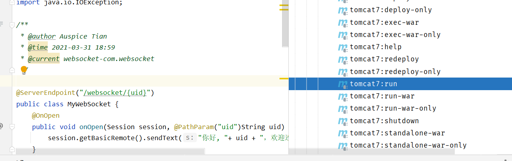

**测试**

http://wstool.js.org/

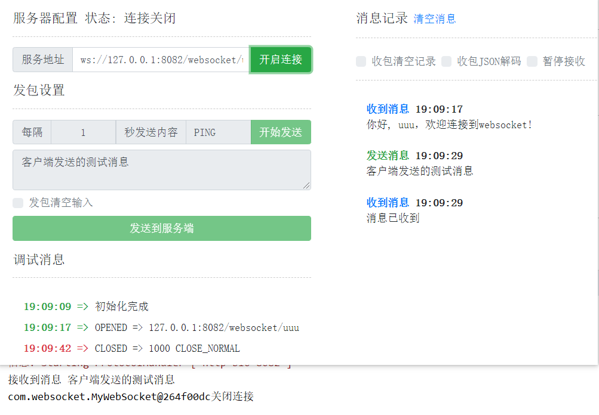

### 编写js客户端

```html
<!DOCTYPE html>
<html lang="en">
<head>
    <meta charset="UTF-8">
    <title>TestWebSocket</title>
</head>
<body>
<script>
    const socket = new WebSocket("ws://127.0.0.1:8082/websocket/uuu");

    socket.onopen = (ws) =>{
        console.log("建立连接",ws)
    }

    socket.onmessage = (ws)=>{
        console.log("接收到消息 >> ",ws.data);
    }

    socket.onclose = (ws) =>{
        console.log("连接已断开！", ws);
    }

    socket.onerror = (ws) => {
        console.log("发送错误！", ws);
    }

    // 2秒后向服务端发送消息
    setTimeout(()=>{
        socket.send("js客户端发送一条测试消息");
    },2000);
    // 5秒后断开连接
    setTimeout(()=>{
        socket.close();
    },5000);
</script>
</body>
</html>
```

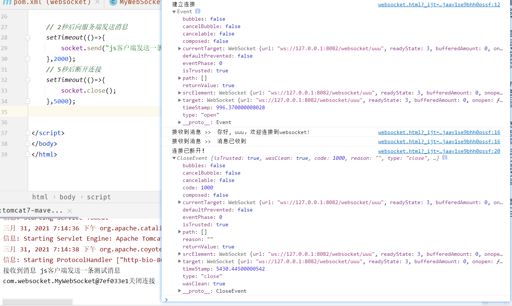

## SpringBoot整合WebSocket

### 导入依赖

```xml
<!--spring boot的支持-->
<parent>
    <groupId>org.springframework.boot</groupId>
    <artifactId>spring-boot-starter-parent</artifactId>
    <version>2.4.3</version>
</parent>

<dependencies>
    <!--<dependency>
            <groupId>javax</groupId>
            <artifactId>javaee-api</artifactId>
            <version>7.0</version>
            <scope>provided</scope>
        </dependency>-->
    <!--springboot的websocket与javaee-api有冲突-->
    <dependency>
        <groupId>org.springframework.boot</groupId>
        <artifactId>spring-boot-starter-websocket</artifactId>
    </dependency>
</dependencies>
```

### WebsocketHandler

```java
package com.websocket.spring;

@Component
public class MyHandler extends TextWebSocketHandler {
    @Override
    public void handleTextMessage(WebSocketSession session, TextMessage message)
            throws IOException {
        System.out.println("获取到消息 >> " + message.getPayload());
        session.sendMessage(new TextMessage("消息已收到"));
        if(message.getPayload().equals("10")){
            for (int i = 0; i < 10; i++) {
                session.sendMessage(new TextMessage("消息 -> " + i));
                try {
                    Thread.sleep(100);
                } catch (InterruptedException e) {
                    e.printStackTrace();
                }
            }
        }
    }

    @Override
    public void afterConnectionEstablished(WebSocketSession session) throws Exception {
        session.sendMessage(new TextMessage("你好，"+session.getAttributes().get("uid")+"欢迎连接到ws服务"));
    }

    @Override
    public void afterConnectionClosed(WebSocketSession session, CloseStatus status)
            throws Exception {
        System.out.println("断开连接！");
    }
}
```

### Socket Bean注入

```java
package com.websocket.spring;

@Configuration
@EnableWebSocket
public class WebSocketConfig implements WebSocketConfigurer {
    @Autowired
    private MyHandler myHandler;

    @Autowired
    private MyHandshakeInterceptor myHandshakeInterceptor;

    @Override
    public void registerWebSocketHandlers(WebSocketHandlerRegistry microChatHandlerRegistry) {
        microChatHandlerRegistry.addHandler(myHandler,"/ws")
                .setAllowedOrigins("*");//跨域支持
    }
}
```

### 编写启动类

```java
package com.websocket;

@SpringBootApplication
public class MyApplication {
    public static void main(String[] args) {
        SpringApplication.run(MyApplication.class, args);
    }
}
```

### 测试

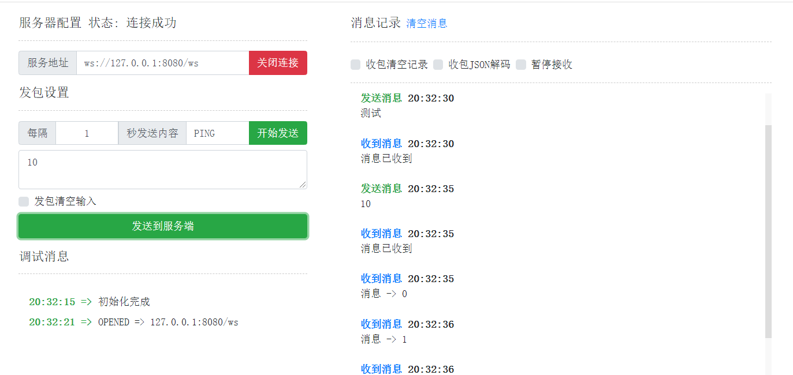

# 搭建微聊服务

-   Spring WebSocket
-   Spring-data-MongoDB

## 创建工程

```xml
<!--springboot启动器-->
<parent>
    <artifactId>spring-boot-starter-parent</artifactId>
    <groupId>org.springframework.boot</groupId>
    <version>2.4.3</version>
</parent>

<dependencies>
    <!--web依赖-->
    <dependency>
        <groupId>org.springframework.boot</groupId>
        <artifactId>spring-boot-starter-web</artifactId>
    </dependency>
    <!--mongodb依赖-->
    <dependency>
        <groupId>org.springframework.data</groupId>
        <artifactId>spring-data-mongodb</artifactId>
    </dependency>
    <!--mongo驱动-->
    <dependency>
        <groupId>org.mongodb</groupId>
        <artifactId>mongodb-driver-sync</artifactId>
    </dependency>
    <!--websocket-->
    <dependency>
        <groupId>org.springframework.boot</groupId>
        <artifactId>spring-boot-starter-websocket</artifactId>
    </dependency>
    <dependency>
        <groupId>org.springframework.boot</groupId>
        <artifactId>spring-boot-starter-test</artifactId>
    </dependency>
    <dependency>
        <groupId>junit</groupId>
        <artifactId>junit</artifactId>
        <scope>test</scope>
    </dependency>
    <dependency>
        <groupId>org.projectlombok</groupId>
        <artifactId>lombok</artifactId>
    </dependency>
    <dependency>
        <groupId>commons-lang</groupId>
        <artifactId>commons-lang</artifactId>
        <version>2.6</version>
    </dependency>
</dependencies>

<!--java编译插件-->
<build>
    <plugins>
        <plugin>
            <groupId>org.apache.maven.plugins</groupId>
            <artifactId>maven-compiler-plugin</artifactId>
            <version>3.8.1</version>
            <configuration>
                <source>1.8</source>
                <target>1.8</target>
                <encoding>UTF-8</encoding>
            </configuration>
        </plugin>
    </plugins>
</build>
```

## 配置文件

```properties
# Spring boot application
spring.application.name = com-haoke-mongodb
server.port=9092

spring.data.mongodb.uri=mongodb://8.140.130.91:27017/haoke
```

## Dao

### 编写pojo对象

#### Message

```java
package com.haoke.im.pojo;

import lombok.AllArgsConstructor;
import lombok.Builder;
import lombok.Data;
import lombok.NoArgsConstructor;
import org.bson.types.ObjectId;
import org.springframework.data.annotation.Id;
import org.springframework.data.mongodb.core.index.Indexed;
import org.springframework.data.mongodb.core.mapping.Document;
import org.springframework.data.mongodb.core.mapping.Field;

import java.util.Date;

@Data
@AllArgsConstructor
@NoArgsConstructor
@Builder
@Document(collection = "message")//Mongo默认会将实体名作为集合名
public class Message {
    @Id
    private ObjectId id;

    /*
    * 消息
    * */
    private String msg;
    /*
    * 消息状态 1-未读 ，2-已读
    * */
    @Indexed
    private Integer status;

    /*
    * 发送时间
    * */
    @Indexed
    @Field("send_date")
    private Date sendDate;

    /*
    * 读取时间
    * */
    @Field("read_date")
    private Date readDate;

    /*
    * 发送方
    * */
    private User from;

    /*
    * 接收方
    * */
    private User to;
}
```

#### User

```java
package com.haoke.im.pojo;

import lombok.AllArgsConstructor;
import lombok.Builder;
import lombok.Data;
import lombok.NoArgsConstructor;

@Data
@AllArgsConstructor
@NoArgsConstructor
@Builder
public class User {
    private Long id;
    private String username;
}
```

#### mock UserData

```java
package com.haoke.im.pojo;

import java.util.HashMap;
import java.util.Map;

public class UserData {
    public static final Map<Long,User> USER_MAP = new HashMap<>();

    static {
        USER_MAP.put(1001L, User.builder().id(1001L).username("zhangsan").build());
        USER_MAP.put(1002L, User.builder().id(1002L).username("lisi").build());
        USER_MAP.put(1003L, User.builder().id(1003L).username("wangwu").build());
        USER_MAP.put(1004L, User.builder().id(1004L).username("zhaoliu").build());
        USER_MAP.put(1005L, User.builder().id(1005L).username("sunqi").build());
    }
}
```

### MessageDao

#### 定义接口

```java
package com.haoke.im.dao;

import com.haoke.im.pojo.Message;
import com.mongodb.client.result.DeleteResult;
import com.mongodb.client.result.UpdateResult;
import org.bson.types.ObjectId;

import java.util.List;

public interface MessageDao {
    /**
     * 查询点对点聊天记录
     * @param fromId
     * @param toId
     * @param page
     * @param rows
     * @return
     */
    List<Message> findListByFromAndTo(Long fromId,Long toId,Integer page,Integer rows);

    /**
     * 根据id查询数据
     * @param id
     * @return
     */
    Message findMessageById(String id);

    /**
     * 更新消息状态
     * @param id
     * @param status
     * @return
     */
    UpdateResult updateMessageState(ObjectId id, Integer status);

    /*
    * 新增消息数据
    * @param message
    * @return
    * */
    Message saveMessage(Message message);

    /**
     * 根据消息id删除数据
     * @param id
     * @return
     */
    DeleteResult deleteMessage(String id);
}
```

#### 实现接口

```java
package com.haoke.im.dao.impl;

import com.haoke.im.dao.MessageDao;
import com.haoke.im.pojo.Message;
import com.mongodb.client.result.DeleteResult;
import com.mongodb.client.result.UpdateResult;
import org.bson.types.ObjectId;
import org.springframework.beans.factory.annotation.Autowired;
import org.springframework.data.domain.PageRequest;
import org.springframework.data.domain.Sort;
import org.springframework.data.mongodb.core.MongoTemplate;

import java.util.Date;
import java.util.List;

import org.springframework.data.mongodb.core.query.Criteria;
import org.springframework.data.mongodb.core.query.Query;
import org.springframework.data.mongodb.core.query.Update;
import org.springframework.stereotype.Component;

@Component
public class MessageDaoImpl implements MessageDao {
    @Autowired
    private MongoTemplate mongoTemplate;

    /*
    * 查询点对点消息记录，双向通信，A->B与B->A都要查询
    * 1.设置查询
    * 2.分页
    * */
    @Override
    public List<Message> findListByFromAndTo(Long fromId, Long toId, Integer page, Integer rows) {
        //A->B的消息
        Criteria fromList = Criteria.where("from.id").is(fromId).and("to.id").is(toId);
        //B->A的消息
        Criteria toList = Criteria.where("from.id").is(toId).and("to.id").is(fromId);
        Criteria criteria = new Criteria().orOperator(fromList,toList);

        //实现分页
        PageRequest pageRequest = PageRequest.of(page-1,rows, Sort.by(Sort.Direction.ASC,"send_date"));

        Query query = Query.query(criteria).with(pageRequest);

        return this.mongoTemplate.find(query,Message.class);
    }

    @Override
    public Message findMessageById(String id) {
        return this.mongoTemplate.findById(new ObjectId(id),Message.class);
    }

    @Override
    public UpdateResult updateMessageState(ObjectId id, Integer status) {
        Query query = Query.query(Criteria.where("id").is(id));

        Update update = Update.update("status",status);
        if(status.intValue() == 1){
            update.set("send_date",new Date());
        }else if(status.intValue() == 2){
            update.set("read_state",new Date());
        }
        return this.mongoTemplate.updateFirst(query,update,Message.class);
    }

    @Override
    public Message saveMessage(Message message) {
        message.setId(ObjectId.get());//若id不自行设置，则由mongo自动生成
        message.setSendDate(new Date());
        message.setStatus(1);
        return this.mongoTemplate.save(message);
    }

    @Override
    public DeleteResult deleteMessage(String id) {
        Query query = Query.query(Criteria.where("id").is(id));

        return this.mongoTemplate.remove(query,Message.class);
    }
}
```

### 启动类

> 有了启动类才能测试

```java
package com.haoke.im;

import org.springframework.boot.SpringApplication;
import org.springframework.boot.autoconfigure.SpringBootApplication;

@SpringBootApplication
public class IMApplication {
    public static void main(String[] args) {
        SpringApplication.run(IMApplication.class,args);
    }
}
```

### Dao测试单元

```java
package com.haoke.im;

import com.haoke.im.dao.MessageDao;
import com.haoke.im.pojo.Message;
import com.haoke.im.pojo.User;
import org.bson.types.ObjectId;
import org.junit.Test;
import org.junit.runner.RunWith;
import org.springframework.beans.factory.annotation.Autowired;
import org.springframework.boot.test.context.SpringBootTest;
import org.springframework.test.context.junit4.SpringRunner;

import java.util.Date;
import java.util.List;

@SpringBootTest
@RunWith(SpringRunner.class)
public class TestImDao {
    @Autowired
    private MessageDao messageDao;

    @Test
    public void testSave(){
        Message message = Message.builder()
                .id(ObjectId.get())
                .msg("你好")
                .sendDate(new Date())
                .status(1)
                .from(new User(1001L, "zhangsan"))
                .to(new User(1002L,"lisi"))
                .build();
        this.messageDao.saveMessage(message);

        message = Message.builder()
                .id(ObjectId.get())
                .msg("你也好")
                .sendDate(new Date())
                .status(1)
                .to(new User(1001L, "zhangsan"))
                .from(new User(1002L,"lisi"))
                .build();
        this.messageDao.saveMessage(message);
        message = Message.builder()
                .id(ObjectId.get())
                .msg("我在学习开发IM")
                .sendDate(new Date())
                .status(1)
                .from(new User(1001L, "zhangsan"))
                .to(new User(1002L,"lisi"))
                .build();
        this.messageDao.saveMessage(message);

        message = Message.builder()
                .id(ObjectId.get())
                .msg("那很好啊！")
                .sendDate(new Date())
                .status(1)
                .to(new User(1001L, "zhangsan"))
                .from(new User(1002L,"lisi"))
                .build();
        this.messageDao.saveMessage(message);
        System.out.println("ok");
    }


    @Test
    public void testQueryList(){
        List<Message> list = this.messageDao.findListByFromAndTo(1001L, 1002L, 1, 8);
        for (Message message : list) {
            System.out.println(message);
        }
    }

    @Test
    public void testQueryById(){
        Message message = this.messageDao.findMessageById("6066f94a33930e32ad8ac991");
        System.out.println(message);
    }
}
```

## websockt——实时通信

### 发送消息流程

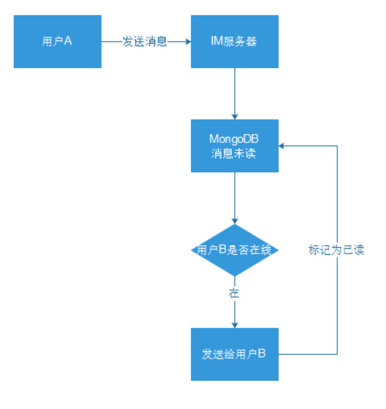

### 发送实现

#### 拦截器获取用户的id保存到Session中

```java
package com.haoke.im.Interceptor;

import org.apache.commons.lang.StringUtils;
import org.springframework.http.server.ServerHttpRequest;
import org.springframework.http.server.ServerHttpResponse;
import org.springframework.stereotype.Component;
import org.springframework.web.socket.WebSocketHandler;
import org.springframework.web.socket.server.HandshakeInterceptor;

import java.util.Map;

/*
* 消息拦截器
* */
@Component
public class MessageHandshakeInterceptor implements HandshakeInterceptor {

    @Override
    public boolean beforeHandshake(ServerHttpRequest serverHttpRequest, ServerHttpResponse serverHttpResponse, WebSocketHandler webSocketHandler, Map<String, Object> map) throws Exception {
        String path = serverHttpRequest.getURI().getPath();
        // 127.0.0.1/ws/{uid}
        String[] ss = StringUtils.split(path, '/');

        if(ss.length != 2){
            //若请求格式不对，则拦截
            return false;
        }

        if(!StringUtils.isNumeric(ss[1])){
            //如果参数不是数字，则拦截
            return false;
        }

        map.put("uid",Long.valueOf(ss[1]));

        //将用户id放入session，放行
        return true;
    }

    @Override
    public void afterHandshake(ServerHttpRequest serverHttpRequest, ServerHttpResponse serverHttpResponse, WebSocketHandler webSocketHandler, Exception e) {

    }
}
```

#### 消息处理器

```java
package com.haoke.im.webSocket;

import com.fasterxml.jackson.databind.JsonNode;
import com.fasterxml.jackson.databind.ObjectMapper;
import com.haoke.im.dao.MessageDao;
import com.haoke.im.pojo.Message;
import com.haoke.im.pojo.UserData;
import org.springframework.beans.factory.annotation.Autowired;
import org.springframework.stereotype.Component;
import org.springframework.web.socket.CloseStatus;
import org.springframework.web.socket.TextMessage;
import org.springframework.web.socket.WebSocketSession;
import org.springframework.web.socket.handler.TextWebSocketHandler;

import java.util.HashMap;
import java.util.Map;

@Component
public class MessageHandler extends TextWebSocketHandler {
    @Autowired
    private MessageDao messageDao;

    private static final ObjectMapper MAPPER = new ObjectMapper();

    /*
    * SESSIONS中记录登录用户的WebSession
    * */
    private static final Map<Long,WebSocketSession> SESSIONS = new HashMap<>();

    /*
    * 连接建立，将用户的id加入到map中
    * */
    @Override
    public void afterConnectionEstablished(WebSocketSession session) throws Exception {
        Long uid = (Long)session.getAttributes().get("uid");
        //将当前用户的session放入到map中，用于相应的session通信
        SESSIONS.put(uid,session);
    }

   /*
    * 处理message
    * 双方在线，则发送，并将读取状态改为已读
    * 若接收方不咋线，则不做处理
    * */
    @Override
    protected void handleTextMessage(WebSocketSession session, TextMessage textMessage) throws Exception {
        //解析参数
        Long uid = (Long)session.getAttributes().get("uid");
        JsonNode jsonNode = MAPPER.readTree(textMessage.getPayload());
        Long toId = jsonNode.get("toId").asLong();
        String msg = jsonNode.get("msg").asText();

        //提取message
        Message message = Message.builder()
                .from(UserData.USER_MAP.get(uid))
                .to(UserData.USER_MAP.get(toId))
                .msg(msg)
                .build();

        // 将消息保存到MongoDB
        message = this.messageDao.saveMessage(message);

        // 判断to用户是否在线
        WebSocketSession toSession = SESSIONS.get(toId);
        if(toSession != null && toSession.isOpen()){
            //TODO 具体格式需要和前端对接
            toSession.sendMessage(new TextMessage(MAPPER.writeValueAsString(message)));
            // 更新消息状态为已读
            this.messageDao.updateMessageState(message.getId(), 2);
        }
    }

    /*
    * 连接关闭，将用户的id从记录已登录用户的SESSION移除
    * */
    @Override
    public void afterConnectionClosed(WebSocketSession session, CloseStatus status) throws Exception {
        SESSIONS.remove(session.getAttributes().get("uid"));
    }
}
```

#### 将WebSocketBean添加到容器中

```java
package com.haoke.im.Interceptor;

import com.haoke.im.webSocket.MessageHandler;
import org.springframework.beans.factory.annotation.Autowired;
import org.springframework.context.annotation.Configuration;
import org.springframework.web.socket.config.annotation.EnableWebSocket;
import org.springframework.web.socket.config.annotation.WebSocketConfigurer;
import org.springframework.web.socket.config.annotation.WebSocketHandlerRegistry;

@Configuration
@EnableWebSocket
public class WebSocketConfig implements WebSocketConfigurer {

    @Autowired
    private MessageHandler messageHandler;

    @Autowired
    private MessageHandshakeInterceptor handshakeInterceptor;

    @Override
    public void registerWebSocketHandlers(WebSocketHandlerRegistry webSocketHandlerRegistry) {
        webSocketHandlerRegistry.addHandler(messageHandler,"/ws/{uid}")
                .setAllowedOrigins("*")//支持跨域
                .addInterceptors(handshakeInterceptor);//添加拦截器
    }
}
```

### 连接实现流程

模拟用户1001登录，发送消息

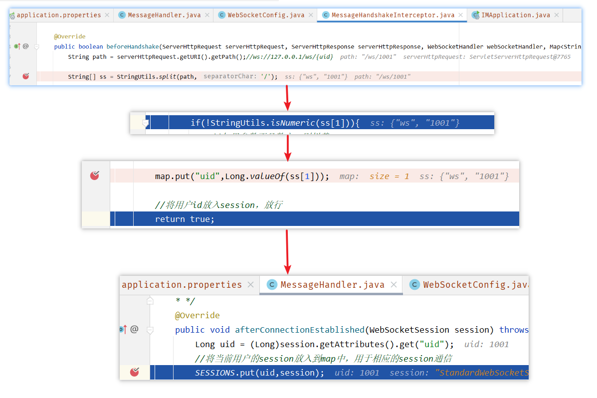

### 发送及接收实现流程

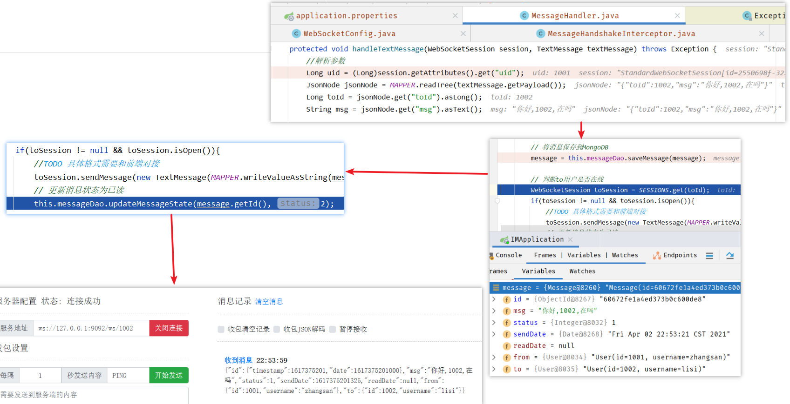

### 测试

#### 双方在线，实时消息

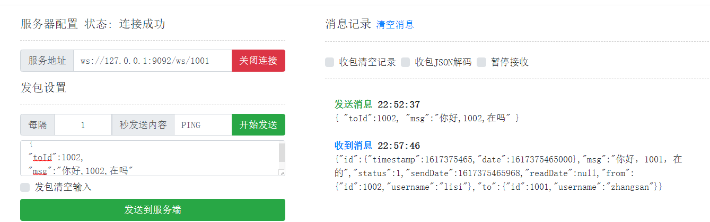

#### 一方离线

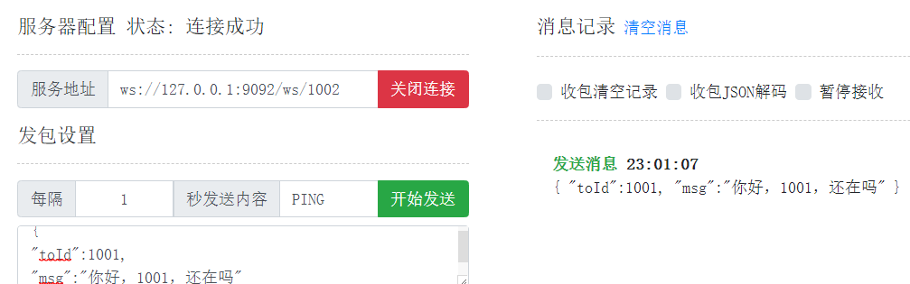

## 查询历史消息服务

### Service

```java
package com.haoke.im.service;

import com.haoke.im.dao.MessageDao;
import com.haoke.im.pojo.Message;
import org.springframework.beans.factory.annotation.Autowired;
import org.springframework.stereotype.Service;

import java.util.List;

@Service
public class MessageService {

    @Autowired
    MessageDao messageDao;

    public List<Message> queryMessageList(Long fromId, Long toId, Integer page, Integer rows,Integer flag){
        List<Message> list = this.messageDao.findListByFromAndTo(fromId, toId, page, rows,flag);

        for (Message message : list) {
            if(message.getStatus().intValue() == 1){
                //修改消息状态为已读
                this.messageDao.updateMessageState(message.getId(),2);
            }
        }

        return list;
    }
}
```

### Controller

```java
package com.haoke.im.controller;

import com.haoke.im.pojo.Message;
import com.haoke.im.service.MessageService;
import org.springframework.beans.factory.annotation.Autowired;
import org.springframework.web.bind.annotation.*;

import java.util.List;

@RestController
@RequestMapping("message")
@CrossOrigin
public class MessageController {
    @Autowired
    private MessageService messageService;

    /**
     * 拉取消息列表
     * @param fromId
     * @param toId
     * @param page
     * @param rows
     * @return
     */
    @GetMapping
    public List<Message> queryMessageList(
        @RequestParam("fromId") Long fromId,
        @RequestParam("toId") Long toId,
        @RequestParam(value = "page",defaultValue = "1") Integer page,
        @RequestParam(value = "rows",defaultValue = "10") Integer rows){
        
        return this.messageService.queryMessageList(
            fromId, toId, page, rows,1);
    }
}
```

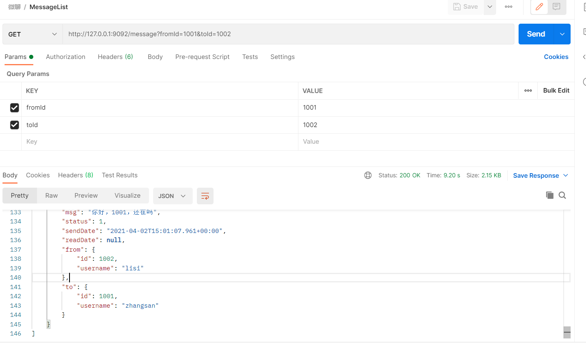

## 查询好友列表服务

```java
package com.haoke.im.controller;

import com.haoke.im.pojo.Message;
import com.haoke.im.pojo.User;
import com.haoke.im.pojo.UserData;
import com.haoke.im.service.MessageService;
import org.springframework.beans.factory.annotation.Autowired;
import org.springframework.web.bind.annotation.*;

import java.util.ArrayList;
import java.util.HashMap;
import java.util.List;
import java.util.Map;

@RequestMapping("user")
@CrossOrigin
@RestController
public class UserController {

    @Autowired
    private MessageService messageService;

    //拉取用户列表
    @GetMapping
    public List<Map<String,Object>> queryUserList(@RequestParam("fromId")Long fromId){
        List<Map<String,Object>> result = new ArrayList<>();

        //找出跟当前用户有关的所有message
        for(Map.Entry<Long, User> user : UserData.USER_MAP.entrySet()) {
           //排除当前用户
            Long id = user.getValue().getId();
            if(id.equals(fromId))
                continue;
            Map<String,Object> map = new HashMap<>();
            map.put("id",id);
            map.put("avatar","https://haoke-1257323542.cos.ap-beijing.myqcloud.com/mock-data/avatar.png");
            map.put("from_user", fromId);
            map.put("info_type", null);
            map.put("to_user", id);
            map.put("username", user.getValue().getUsername());

            // 获取最新一条消息
            List<Message> messages = this.messageService.queryMessageList(fromId, user.getValue().getId(), 1, 1,-1);
            if (messages != null && !messages.isEmpty()) {
                Message message = messages.get(0);
                map.put("chat_msg", message.getMsg());
                map.put("chat_time", message.getSendDate().getTime());
            }
            result.add(map);
        }
        return result;
    }
}
```

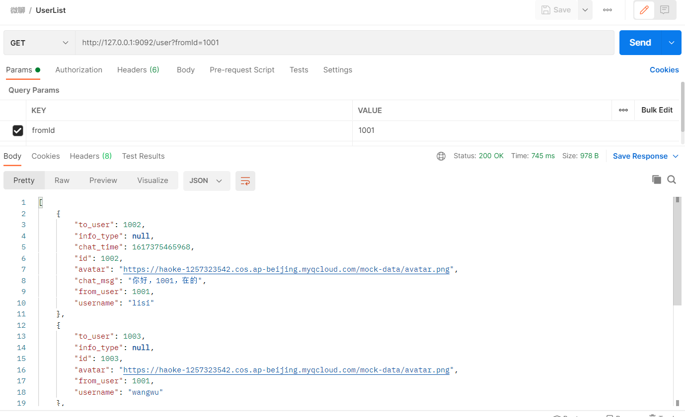

# 整合前端

## 查询好友列表

```java
componentDidMount = () => {
    axios.get('http://127.0.0.1:9092/user?fromId=1001').then((data)=>{
        this.setState({
            list: data,
            isLoading: true
        })
    })
}

if (isLoading) {
    list = this.state.list.map(item => {
        return (
            <li key={item.id} onClick={(e) => this.toChat(e,{item})}>
                <div className="avarter">
                    
                    <span className="name">{item.username}</span>
                    <span className="info">{item.chat_msg}</span>
                    <span className="time">{item.ctime}</span>
                </div>
            </li>
        )
    })
}
```

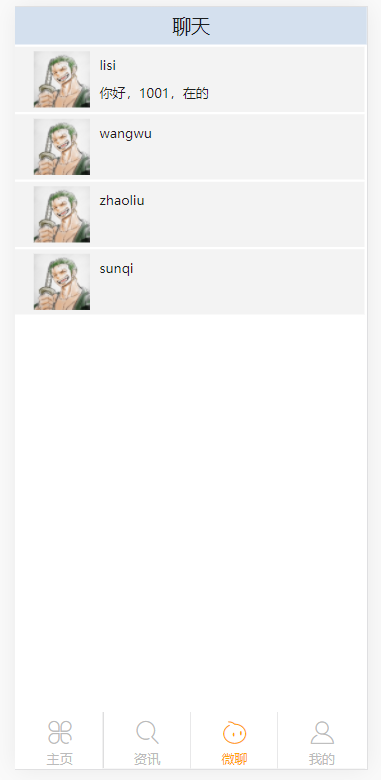

## 好友单聊

```java
componentDidMount = () => {
    let {to_user,from_user} = this.props.chatInfo;
    axios.get('http://127.0.0.1:9092/message',{params:{
        toId: to_user,
        fromId: from_user
    }}).then(data=>{
        this.setState({
            infos: data,
            isLoading: true,
            client: handle(localStorage.getItem('uid'),(data)=>{
                let newList = [...this.state.infos];
                newList.push(JSON.parse(data.content));
                this.setState({
                    infos: newList
                })
            })
        });
    })
}

let {username,from_user} = this.props.chatInfo;
let infoList = null;
if(this.state.isLoading) {
    let currentUser = parseInt(from_user,10);
    infoList = this.state.infos.map(item=>{
        return (
            <li key={item.id} className={currentUser===item.to.id? 'chat-info-left':'chat-info-right'}>
                
                <span>{item.msg}</span>
            </li>
        )
    })
}
```

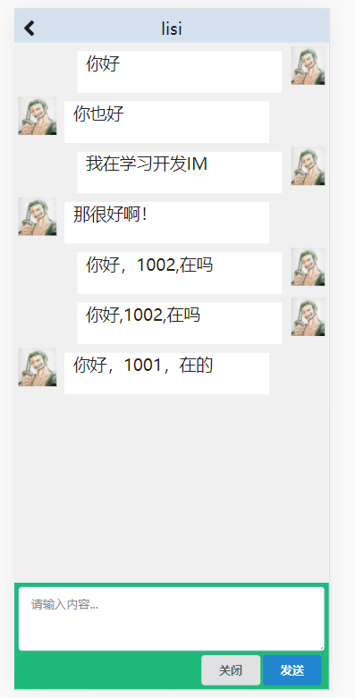

## 发送消息

提交逻辑

`char-window.js`

```java
sendMsg = () => {
    let {to_user,from_user,avatar} = this.props.chatInfo;
    let pdata = {
        id: this.guid(),
        fromId: from_user,
        to:{
            id:this.state.toId
        },
        toId:to_user,
        avatar: avatar,
        msg: this.state.msgContent
    }
    let newList = [...this.state.infos];
    newList.push(pdata);
    this.setState({
        infos: newList
    })
    this.state.client.emitEvent(IMEvent.MSG_TEXT_SEND,JSON.stringify(pdata));
}
```

修改IMClient的创建

`wsmain.js`

```java
const handle = (currentUser, handleMsg) => {
    //  wsBaseUrl: 'ws://127.0.0.1:9092/ws/'
    const client = new IMClient(config.wsBaseUrl + currentUser);
    // 发送消息
    client.addEventListener(IMEvent.MSG_TEXT_SEND, data => {
        client.sendDataPacket(data)
    })

    client.connect();
    return client;
}
```

修改IMClient.js，不包装，直接发送数据

```java
// 向服务器发送数据包
sendDataPacket(dataPacket) {
    // if (this._isOpened) {
    //   this._socket.send(dataPacket.rawMessage);
    // } else {
    //   this._DataPacketQueue.push(dataPacket);
    // }
    // 直接发送，不包装
    this._socket.send(dataPacket);
}
```

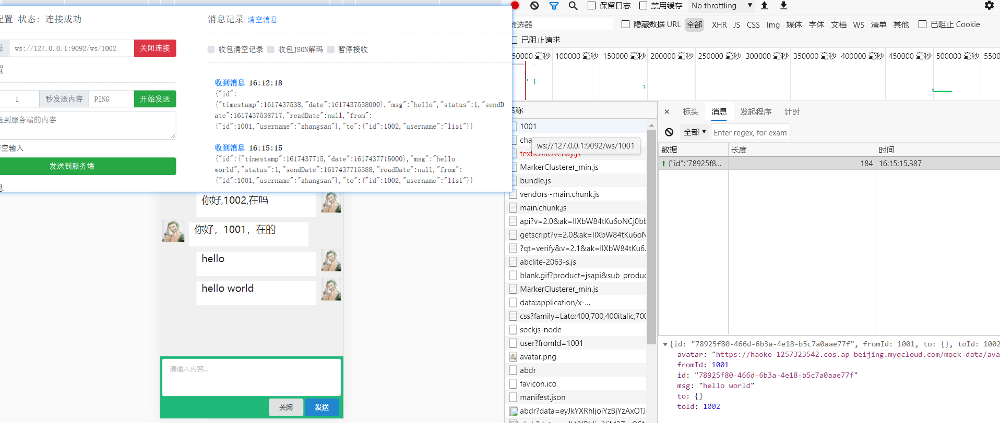

## 接收消息

chat-window.js  注册接收消息后的处理逻辑

```java
this.setState({
    infos: data,
    isLoading: true,
    client: handle(from_user,(data)=>{//等待接收 data-接收到的实时
        let newList = [...this.state.infos];
        newList.push(JSON.parse(data));
        this.setState({
            infos: newList
        })
        console.log(this.state.infos)
    })
});
```

在新建 IMClient 时，添加接收实时消息功能

```java
const client = new IMClient(config.wsBaseUrl + currentUser,handleMsg);
```

修改IMClient的实时消息处理

```java
constructor(url, onMyMessage) {
    this._url = url;
    this._autoConnect = true;
    this._handlers = {};
    this._DataPacketQueue = [];
    this._isOpened = false;
    this.onMyMessage = onMyMessage;

    this.addEventListener(IMEvent.CONNECTED, () => {
        this.serverOnConnected();
    })
    
    this.addEventListener(IMEvent.DISCONNECTED, () => {
        this.serverOnDisconnected();
    })
}

/**
   * 底层通讯函数回调
   */
// 连接
connect() {
    if (!this._socket) {
        this._socket = new WebSocket(this._url);

        this._socket.onmessage = (evt) => {
            this.onMessage(evt.data);

            if(this.onMyMessage){
                this.onMyMessage(evt.data);
            }
        }
        this._socket.onopen = (ws) => {
            this.onOpen(ws);
        }
        this._socket.onclose = ws => {
            this.onClose(ws);
        }
        this._socket.onerror = ws => {
            this.onError(ws);
        };
    }
}
```

**测试**

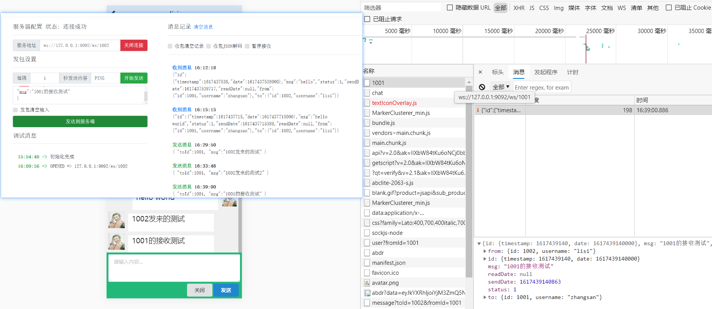

## WebSocket性能瓶颈

```java
private static final Map<Long,WebSocketSession> SESSIONS = new HashMap<>();

//所有的用户都放入一个对象中，会存在并发问题
```

WebSocketSession是在线的，不能做序列化存储到Redis中

### 分布式Socket解决方案

采用 **消息系统** 进行解决

# 实现分布式WebSocket

## 实现方案

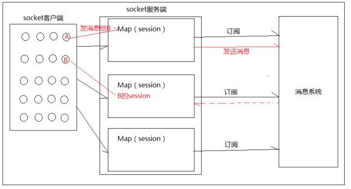

-   源Session与目标Session在同一JVM（同一socket服务器），则直接转发给目标Session

-   源Session与目标Session不在同一JVM（不同的socket服务器），则将消息发到消息系统，各个节点都将收到RMQ Server推来的消息，目标Session所在的JVM（socket服务器）将消息转发到目标用户

各个节点发送消息时为MQ的生产者，在接收消息时为RMQ的消费者

## 实现

### 依赖

```xml
<!--RocketMQ相关依赖-->
<dependency>
    <groupId>org.apache.rocketmq</groupId>
    <artifactId>rocketmq-spring-boot-starter</artifactId>
    <version>2.0.0</version>
</dependency>
<dependency>
    <groupId>org.apache.rocketmq</groupId>
    <artifactId>rocketmq-client</artifactId>
    <version>4.3.2</version>
</dependency>
```

### 配置文件

```properties
# Spring boot application
spring.application.name = com-haoke-mongodb
#WebSocket Server1
server.port=9092
##WebSocket Server2
#server.port=9093

spring.data.mongodb.uri=mongodb://8.140.130.91:27017/haoke

spring.rocketmq.nameServer=8.140.130.91:9876
spring.rocketmq.producer.group=haoke-im-websocket-group
```

### 实现

#### JSON序列化将其转为字符串

Message对象添加ObjectId的注解

```java
import com.fasterxml.jackson.databind.annotation.JsonSerialize;
import com.fasterxml.jackson.databind.ser.std.ToStringSerializer;

    @Id
    @JsonSerialize(using = ToStringSerializer.class)
    private ObjectId id;
```

#### 发送到MQ Server

```java
package com.haoke.im.webSocket;

@Component
public class MessageHandler extends TextWebSocketHandler {
    @Autowired
    private MessageDao messageDao;

    @Autowired
    private RocketMQTemplate rocketMQTemplate;

    private static final ObjectMapper MAPPER = new ObjectMapper();

    /*
    * 记录已经登录的用户id的map
    * */
    private static final Map<Long,WebSocketSession> SESSIONS = new HashMap<>();

    /*
    * 连接建立，将用户的id加入到map中
    * */
    @Override
    public void afterConnectionEstablished(WebSocketSession session) throws Exception {
        Long uid = (Long)session.getAttributes().get("uid");
        //将当前用户的session放入到map中，用于相应的session通信
        SESSIONS.put(uid,session);
    }

    /*
    * 处理message
    * 双方在线，则发送，并将读取状态改为已读
    * 若接收方不咋线，则不做处理
    * */
    @Override
    protected void handleTextMessage(WebSocketSession session, TextMessage textMessage) throws Exception {
        //解析参数
        Long uid = (Long)session.getAttributes().get("uid");
        JsonNode jsonNode = MAPPER.readTree(textMessage.getPayload());
        Long toId = jsonNode.get("toId").asLong();
        String msg = jsonNode.get("msg").asText();

        //提取message
        Message message = Message.builder()
                .from(UserData.USER_MAP.get(uid))
                .to(UserData.USER_MAP.get(toId))
                .msg(msg)
                .build();

        // 将消息保存到MongoDB
        message = this.messageDao.saveMessage(message);
        String msgStr = MAPPER.writeValueAsString(message);
        // 判断to用户是否在线
        WebSocketSession toSession = SESSIONS.get(toId);
        if(toSession != null && toSession.isOpen()){
            //TODO 具体格式需要和前端对接
            toSession.sendMessage(new TextMessage(msgStr));
            // 更新消息状态为已读
            this.messageDao.updateMessageState(message.getId(), 2);
        }else{//用户不在线，也可能在其他节点中，发送消息到MQ Server
            org.springframework.messaging.Message mqMessage = MessageBuilder.withPayload(msgStr).build();

            /*
            * D destination, Message<?> message
            * destination:topic:tag 设置主题和标签
            * */
            this.rocketMQTemplate.send("haoke-im-send-message-topic:SEND_MSG",mqMessage);
        }
    }

    /*
    * 连接关闭，将用户的id从记录已登录用户的SESSION移除
    * */
    @Override
    public void afterConnectionClosed(WebSocketSession session, CloseStatus status) throws Exception {
        SESSIONS.remove(session.getAttributes().get("uid"));
    }
}
```

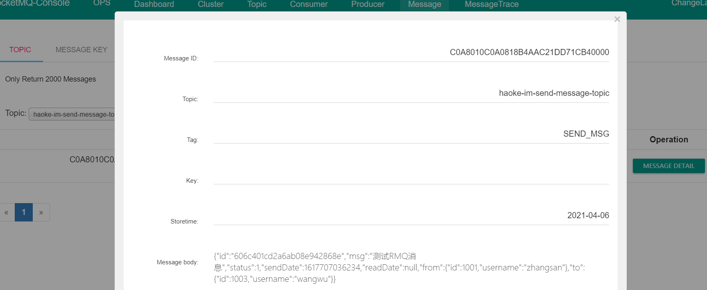

#### 从MQ Server接收消息

```java
@Override
public void onMessage(String msg) {
    try {
        JsonNode jsonNode = MAPPER.readTree(msg);

        Long toId = jsonNode.get("to").get("id").longValue();
        //判断to用户的Session是否在本socker服务器上
        WebSocketSession toSession = SESSIONS.get(toId);
        if (toSession != null && toSession.isOpen()) {
            toSession.sendMessage(new TextMessage(msg));
            //更新消息状态为已读
            this.messageDao.updateMessageState(new ObjectId(jsonNode.get("id").asText()),2);
        }

    }catch (Exception e){
        e.printStackTrace();
    }
}
```

### 测试

#### 不同Socket服务器（目标不在线）

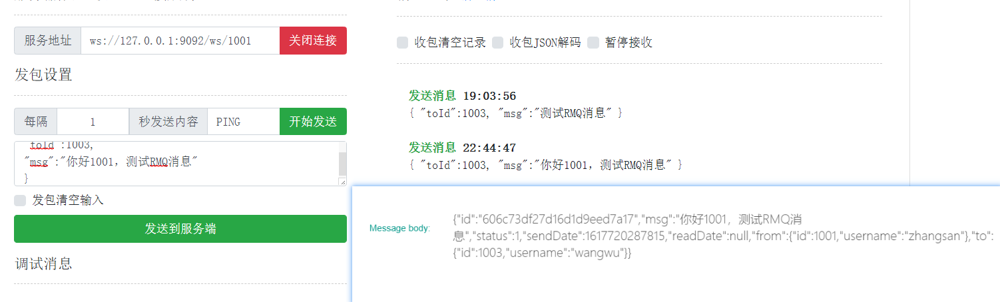

#### 不同Socket服务器（目标在线）

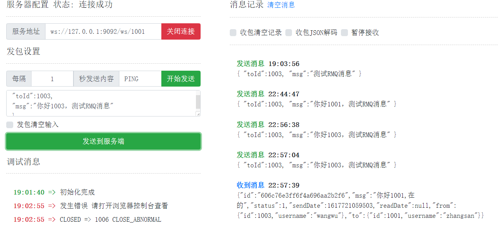

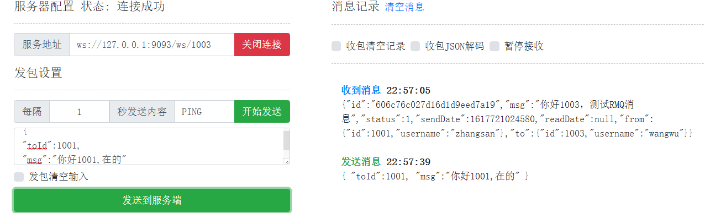
