> 前置知识：
>
> [ElasticSearch](https://auspicetian.github.io/posts/3565236947/)
>
> [ElasticStack](https://auspicetian.github.io/posts/2161105653/)

- 地图查房
- 关键字搜索

<!--more-->

# 前台

## 地图查房

文档：http://lbsyun.baidu.com/index.php?title=jspopular3.0

### 导入BMap

```html
<script type="text/javascript" src="https://api.map.baidu.com/api?v=3.0&ak=q60ejYQeO2qZO6dYhWPOHea4aY0bhrqG&s=1"></script>
    <script type="text/javascript" src="http://api.map.baidu.com/library/TextIconOverlay/1.2/src/TextIconOverlay_min.js"></script>
    <script type="text/javascript" src="http://api.map.baidu.com/library/MarkerClusterer/1.2/src/MarkerClusterer_min.js"></script>
```

若在子模块直接使用BMap,会出现未定义的错误，原因是组件未加载

需要在 public/index.html 中，先将BMap和BMapLib载入到window

```html
<script type="text/javascript">
    window.BMap = BMap;
    window.BMapLib = BMapLib;
</script>
```

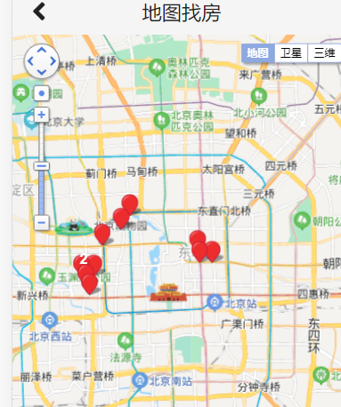

### 使用自定义OverFlowIcon

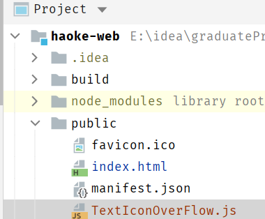


### 修改数据加载逻辑

#### graphql接口

```graphql
schema {
    query: HaokeQuery
}

type HaokeQuery{
    #分页查询房源信息-应用于前台房源信息
    HouseResourcesList(page:Int, pageSize:Int):TableResult
    # 通过Id查询房源信息
    HouseResources(id:ID): HouseResources

    #首页广告图-应用于前台首页
    IndexAdList: IndexAdResult

    #地图查房房源数据
    MapHouseData:MapHouseDataResult
}

type MapHouseDataResult{
    list:[MapHouseXY]
}

type MapHouseXY{
    x:Float
    y:Float
}
```

#### 编写MapHouseDataResult、MapHouseXY

```java
package com.haoke.api.vo.map;

@Data
@AllArgsConstructor
@NoArgsConstructor
public class MapHouseDataResult {
    private List<MapHouseXY> list;
}
```

```java
package com.haoke.api.vo.map;

@Data
@AllArgsConstructor
@NoArgsConstructor
public class MapHouseXY {
    private Float x;
    private Float y;
}
```

#### MapHouseDataFetcher Graphql接口

```java
package com.haoke.api.graphql.myDataFetcherImpl;

@Component
public class MapHouseDataFetcher implements MyDataFetcher {
    @Override
    public String fieldName() {
        return "MapHouseData";
    }

    @Override
    public Object dataFetcher(DataFetchingEnvironment environment) {
        List<MapHouseXY> list = new ArrayList<>();
        list.add(new MapHouseXY(116.43244f,39.929986f));
        list.add(new MapHouseXY(116.424355f,39.92982f));
        list.add(new MapHouseXY(116.423349f,39.935214f));
        list.add(new MapHouseXY(116.350444f,39.931645f));
        list.add(new MapHouseXY(116.351684f,39.91867f));
        list.add(new MapHouseXY(116.353983f,39.913855f));
        list.add(new MapHouseXY(116.357253f,39.923152f));
        list.add(new MapHouseXY(116.349168f,39.923152f));
        list.add(new MapHouseXY(116.36232f,39.938339f));
        list.add(new MapHouseXY(116.374249f,39.94625f));
        list.add(new MapHouseXY(116.380178f,39.953053f));
        return new MapHouseDataResult(list);
    }
}
```

#### 测试Graphql接口


#### 整合前端

```jsx
import { ApolloClient, gql , InMemoryCache} from '@apollo/client';

const client = new ApolloClient({
  uri: "http://127.0.0.1:9091/graphql",
  cache: new InMemoryCache()
});

//定义查询
const GET_MAP_HOUSE = gql`
  {
    MapHouseData {
      list {
        x 
        y
      }
    }
  }
`;

client.query({query: GET_MAP_HOUSE}).then(result =>{
    let xys = result.data.MapHouseData.list;
    var markers = [];
    var pt = null;
    for (var i in xys) {
        pt = new BMap.Point(xys[i].x, xys[i].y);
        markers.push(new BMap.Marker(pt));
    }

    // 地图上覆盖物的聚合效果
    var markerClusterer = new BMapLib.MarkerClusterer(map, {
        markers: markers,
        girdSize: 100,
        styles: [{
            background: 'rgba(12,181,106,0.9)',
            size: new BMap.Size(92, 92),
            textSize: '16',
            textColor: '#fff',
            borderRadius: 'true'
        }],
    });
    markerClusterer.setMaxZoom(50);
    markerClusterer.setGridSize(50);
});
```

#### 整合前端测试

测试后，数据是从后端传来的，则数据加载逻辑修改成功


### 增加拖动事件

在地图拖动后，增加事件，获取中心位置的坐标，以便后续的查询

```java
map.addEventListener("dragend", function showInfo(){
    let cp = map.getCenter();
    let zoom = map.getZoom(); //缩放级别
    console.log(cp.lng + "," + cp.lat+" --> " + zoom);
});
```

百度地图缩放比例：

| 级别 | 比例尺  |
| ---- | ------- |
| 19级 | 20m     |
| 18级 | 50m     |
| 17级 | 100m    |
| 16级 | 200m    |
| 15级 | 500m    |
| 14级 | 1km     |
| 13级 | 2km     |
| 12级 | 5km     |
| 11级 | 10km    |
| 10级 | 20km    |
| 9级  | 25km    |
| 8级  | 50km    |
| 7级  | 100km   |
| 6级  | 200km   |
| 5级  | 500km   |
| 4级  | 1000km  |
| 3级  | 2000km  |
| 2级  | 5000km  |
| 1级  | 10000km |

### 传递经纬度和缩放比例参数


#### 实现目标

拖动地图，更新范围内的房源数据

#### 原理

1.  拖动地图
2.  获取地图中心点
3.  将当前中心点的经纬度传及缩放比传递到后台
4.  后台根据计算出的搜索范围，查询数据

#### 实现

##### 定义graphql接口

```graphql
type HaokeQuery{
    #分页查询房源信息-应用于前台房源信息
    HouseResourcesList(page:Int, pageSize:Int):TableResult
    # 通过Id查询房源信息
    HouseResources(id:ID): HouseResources

    #首页广告图-应用于前台首页
    IndexAdList: IndexAdResult

    #地图查房房源数据
    MapHouseData(lng:Float,lat:Float,zoom:Int):MapHouseDataResult
}

---
query queryMapHouseData($lng:Float,$lat:Float,$zoom:Int){
  MapHouseData(lng:$lng,lat:$lat,zoom:$zoom){
    list{
      x
      y
    }
  }
}
---
{
	"lng":116.54461241348382,
	"lat":39.91201079295558,
	"zoom":12
}
```

##### 后台接口接收参数

```java
package com.haoke.api.graphql.myDataFetcherImpl;

@Component
public class MapHouseDataFetcher implements MyDataFetcher {
    @Override
    public String fieldName() {
        return "MapHouseData";
    }

    @Override
    public Object dataFetcher(DataFetchingEnvironment environment) {
        Float lat = environment.getArgument("lat");
        Float lng = environment.getArgument("lng");
        Integer zoom = environment.getArgument("zoom");

        System.out.println("lat -> "+ lat);
        ...
    }
}
```


**修改为**

```java
Float lat = ((Double)environment.getArgument("lat")).floatValue();
Float lng = ((Double)environment.getArgument("lng")).floatValue();
Integer zoom = environment.getArgument("zoom");

System.out.println("lat -> "+ lat);
```


##### 前端代码修改

```jsx
import React from 'react';
import { Icon} from 'semantic-ui-react'
import { ApolloClient, gql , InMemoryCache} from '@apollo/client';

const client = new ApolloClient({
  uri: "http://127.0.0.1:9091/graphql",
  cache: new InMemoryCache()
});

//定义查询
const GET_MAP_HOUSE = gql`
  query queryMapHouseData($lng:Float,$lat:Float,$zoom:Int){
    MapHouseData(lng:$lng,lat:$lat,zoom:$zoom){
      list{
        x
        y
      }
    }
  }
`;

// 百度地图API功能
const BMap = window.BMap;
const BMapLib = window.BMapLib;

const showMapMarker =(xys,map)=>{
  let markers = [];
  let pt = null;
  for (let i in xys) {
    pt = new BMap.Point(xys[i].x, xys[i].y);
    markers.push(new BMap.Marker(pt));
  }

  // 地图上覆盖物的聚合效果
  var markerClusterer = new BMapLib.MarkerClusterer(map, {
    markers: markers,
    girdSize: 100,
    styles: [{
      background: 'rgba(12,181,106,0.9)',
      size: new BMap.Size(92, 92),
      textSize: '16',
      textColor: '#fff',
      borderRadius: 'true'
    }],
  });
  markerClusterer.setMaxZoom(50);
  markerClusterer.setGridSize(50);
}

class MapHouse extends React.Component {
  constructor(props) {
    super(props);
  }
  componentDidMount() {

    //设置初始中心点
    let defaultX = 121.48130241985999;
    let defaultY = 31.235156971414239;
    let defaultZoom = 12;

    // 创建Map实例
    let map = new BMap.Map("allmap");
    // 初始化地图,设置中心点坐标和地图级别
    map.centerAndZoom(new BMap.Point(defaultX,defaultY), defaultZoom);

    // 开启鼠标滚轮缩放
    map.enableScrollWheelZoom(true);

    // 添加地图类型控件
    map.addControl(new BMap.MapTypeControl());
    // 设置地图缩放比例尺控件
    map.addControl(new BMap.ScaleControl({
      anchor: window.BMAP_NAVIGATION_CONTROL_ZOOM
    }));
    // 设置地图导航
    map.addControl(new BMap.NavigationControl({
      enableGeolocation: true
    }));
    // 设置缩略图控件。
    map.addControl(new BMap.OverviewMapControl());
    // 设置地图显示的城市 此项是必须设置的
    map.setCurrentCity("上海");


    /*拖拽事件，更新范围内房源
    * 获取中心点，取数据，更新地图
    * */
    let showInfo = () => {
      let cp = map.getCenter();
      let zoom = map.getZoom(); //缩放级别
      // console.log(cp.lng + "," + cp.lat+" --> " + zoom);
      client.query({query: GET_MAP_HOUSE, variables: {"lng":cp.lng,"lat":cp.lat,"zoom":zoom}}).then(
          result =>{
            let xys = result.data.MapHouseData.list;
            showMapMarker(xys,map);
      });
    }

    map.addEventListener("dragstart",()=>{map.clearOverlays();}); //拖动开始事件
    map.addEventListener("dragend",showInfo); //拖动结束事件
    map.addEventListener("zoomstart", ()=>{map.clearOverlays();}); //缩放开始事件
    map.addEventListener("zoomend",showInfo); //缩放结束事件

    /*初始化*/
    client.query({query: GET_MAP_HOUSE,variables: {"lng":defaultX,"lat":defaultY,"zoom":defaultZoom}}).then(
        result =>{
      let xys = result.data.MapHouseData.list;
      showMapMarker(xys,map)
    });
  }
  render() {
    return ( 
      <div className = 'map-house' >
        <div className = "map-house-title">
          <Icon onClick = {this.props.hideMap} name = 'angle left' size = 'large'/> 地图找房 
        </div> 
        <div className = "map-house-content" id='allmap'></div>
      </div>
    );
  }
}
export default MapHouse;
```

### MongoDB的地理位置索引

在MongoDB中，支持存储位置的经纬度，可以对其索引，通过算子操作，进行查找附近的数据，如：查找附近的人，附近的建筑

**将房源数据导入到MongoDB**

```shell
###进入容器
docker exec -it mongodb /bin/bash

###进入mongo
mongo

###切换数据库
use haoke

###创建索引
db.house.createIndex({loc:'2d'}) #为house表的loc字段创建地理2d索引
db.house.createIndex({estate:1},{unique:true}) #为house表的hid字段创建唯一索引

#通过百度api查询地址的经纬度
http://api.map.baidu.com/geocoding/v3/?address=上海&output=json&ak=q60ejYQeO2qZO6dYhWPOHea4aY0bhrqG&callback=showLocation

###插入数据
db.house.insert({hid:1,title:'整租 · 南丹大楼 1居室 7500',loc:[121.4482236974557,31.196523937504549]})
db.house.insert({hid:2,title:'陆家嘴板块，精装设计一室一厅，可拎包入住诚意租。',loc:[121.51804613891443,31.238878702131506]})
db.house.insert({hid:3,title:'整租 · 健安坊 1居室 4050',loc:[121.4148310693774,31.16507733043528]})
db.house.insert({hid:4,title:'整租 · 中凯城市之光+视野开阔+景色秀丽+拎包入住',loc:[121.43528282056717,31.198687949417815]})
db.house.insert({hid:5,title:'整租 · 南京西路品质小区 21213三轨交汇 配套齐* 拎包入住',loc:[121.43528282056717,31.198687949417815]})
db.house.insert({hid:6,title:'祥康里 简约风格 *南户型 拎包入住 看房随时',loc:[121.47521508401232,31.23859308719981]})
db.house.insert({hid:7,title:'整租 · 桃源新村 1室0厅 5500元',loc:[121.488377804633,31.23113867155927]})
db.house.insert({hid:8,title:'整租 · 中山公园品质小区，两房朝南厅朝南，家电家具精装*配',loc:[121.42038642151562,31.225078800208654]})
db.house.insert({hid:9,title:'整租 · 近地铁2号线，精装1房1厅，高区朝南，享受阳光好房',loc:[121.42933310871683,31.221943586471036]})
db.house.insert({hid:10,title:'整租 · 2.3.4号中山公园地铁，背靠来福士，采光好，诚意出租',loc:[121.42063977421182,31.221023374982044]})
```

**mongodb地理位置的索引**

注意距离要除以111.2（1度=111.2km），跟普通查找的区别仅仅是多了两个算子 `\$near` 和 `\$maxDistance`  

```shell
#查询上海人民广场附近5公里的房源，人民广场的坐标为：121.48130241985999,31.235156971414239

> db.house.find({loc:{$near:[121.48130241985999,31.235156971414239],$maxDistance:5/111.12 }})
{ "_id" : ObjectId("606e6eb7c34903ae9b73d0dd"), "hid" : 6, "title" : "祥康里 简约风格 *南户型 拎包入住 看房随时", "loc" : [ 121.47521508401232, 31.23859308719981 ] }
{ "_id" : ObjectId("606e6ebfc34903ae9b73d0de"), "hid" : 7, "title" : "整租 · 桃源新村 1室0厅 5500元", "loc" : [ 121.488377804633, 31.23113867155927 ] }
{ "_id" : ObjectId("606e6e95c34903ae9b73d0d9"), "hid" : 2, "title" : "陆家嘴板块，精装设计一室一厅，可拎包入住诚意租。", "loc" : [ 121.51804613891443, 31.238878702131505 ] }

#查询上海中山公园附近2公里的房源，中山公园的坐标为：121.42261657004589,31.229111410235285
> db.house.find({loc:{$near:[121.42261657004589,31.229111410235285],$maxDistance:2/111.12 }})
{ "_id" : ObjectId("606e6ec3c34903ae9b73d0df"), "hid" : 8, "title" : "整租 · 中山公园品质小区，两房朝南厅朝南，家电家具精装*配", "loc" : [ 121.42038642151562, 31.225078800208653 ] }
{ "_id" : ObjectId("606e6ecdc34903ae9b73d0e1"), "hid" : 10, "title" : "整租 · 2.3.4号中山公园地铁，背靠来福士，采光好，诚意出租", "loc" : [ 121.42063977421182, 31.221023374982042 ] }
{ "_id" : ObjectId("606e6ec8c34903ae9b73d0e0"), "hid" : 9, "title" : "整租 · 近地铁2号线，精装1房1厅，高区朝南，享受阳光好房", "loc" : [ 121.42933310871683, 31.221943586471035 ] }
```


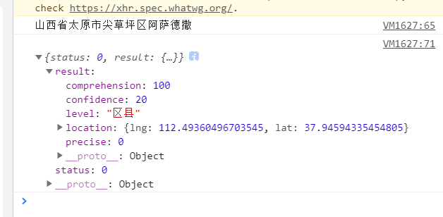

### 实现基于MongoDB的查询

#### mongo依赖

```xml
<!--mongo依赖-->
<dependency>
    <groupId>org.springframework.boot</groupId>
    <artifactId>spring-boot-starter-data-mongodb</artifactId>
</dependency>
```

#### 配置文件

```properties
#mongodb配置
spring.data.mongodb.uri=mongodb://8.140.130.91:6379:27017/haoke
```

#### Mapper层代码

##### pojo

```java
package com.haoke.api.pojo;

@Data
@AllArgsConstructor
@NoArgsConstructor
@Document(collection = "house")//指定表名称
@Builder
public class MongoHouse {

    @Id
    @JsonSerialize(using = ToStringSerializer.class)
    private ObjectId id;

    private Long hid;
    private String title;
    private Float[] loc;
}
```

##### service

```java
package com.haoke.api.service;

@Service
public class MongoHouseService {
    public static final Map<Integer, Double> BAIDU_ZOOM = new HashMap<>();
    static {
        BAIDU_ZOOM.put(19, 20d / 1000); //单位为km
        BAIDU_ZOOM.put(18, 50d / 1000);
        BAIDU_ZOOM.put(17, 100d / 1000);
        BAIDU_ZOOM.put(16, 200d / 1000);
        BAIDU_ZOOM.put(15, 500d / 1000);
        BAIDU_ZOOM.put(14, 1d);
        BAIDU_ZOOM.put(13, 2d);
        BAIDU_ZOOM.put(12, 5d);
        BAIDU_ZOOM.put(11, 10d);
        BAIDU_ZOOM.put(10, 20d);
        BAIDU_ZOOM.put(9, 25d);
        BAIDU_ZOOM.put(8, 50d);
        BAIDU_ZOOM.put(7, 100d);
        BAIDU_ZOOM.put(6, 200d);
        BAIDU_ZOOM.put(5, 500d);
        BAIDU_ZOOM.put(4, 1000d);
        BAIDU_ZOOM.put(3, 2000d);
        BAIDU_ZOOM.put(2, 5000d);
        BAIDU_ZOOM.put(1, 10000d);
    }

    @Autowired
    private MongoTemplate mongoTemplate;

    /*
    * 从mongo中产讯数据，返回地图房源数据
    * */
    public MapHouseDataResult queryHouseData(Float lng,Float lat,Integer zoom){

        double distance = BAIDU_ZOOM.get(zoom)*1.5/111.12;

        Query query = Query.query(Criteria.where("loc").near(new Point(lng,lat)).maxDistance(distance));

        //查询数据
        List<MongoHouse> mongoHouses = this.mongoTemplate.find(query, MongoHouse.class);

        List<MapHouseXY> list = new ArrayList<>();

        for (MongoHouse mongoHouse : mongoHouses) {
            list.add(new MapHouseXY(mongoHouse.getLoc()[0], mongoHouse.getLoc()[1]));
        }

        return new MapHouseDataResult(list);
    }
}
```

#### 接口实现

```java
package com.haoke.api.graphql.myDataFetcherImpl;

@Component
public class MapHouseDataFetcher implements MyDataFetcher {
    @Autowired
    private MongoHouseService mongoHouseService;

    @Override
    public String fieldName() {
        return "MapHouseData";
    }

    @Override
    public Object dataFetcher(DataFetchingEnvironment environment) {
        Float lat = ((Double)environment.getArgument("lat")).floatValue();
        Float lng = ((Double)environment.getArgument("lng")).floatValue();
        Integer zoom = environment.getArgument("zoom");

        System.out.println("lat -> "+ lat);

        return this.mongoHouseService.queryHouseData(lng,lat,zoom);
    }
}
```

## 小程序用户登录


1. 调用 `wx.login()` 获取 **临时登录凭证code** ,并回传到开发者服务器

   wx.login()[https://developers.weixin.qq.com/miniprogram/dev/api/open-api/login/wx.login.html]

2. 调用 `code2Session` 接口，换取 **用户唯一标识 OpenId**  和 **会话密钥 session_key**

   -   用户在当前小程序的唯一标识（openid）

   -   微信开放平台帐号下的唯一标识（unionid，若当前小程序已绑定到微信开放平台帐号）
   -   本次登录的会话密钥（session_key）

**注意**

>   1.  会话密钥 `session_key` 是对用户数据进行 [加密签名][https://developers.weixin.qq.com/miniprogram/dev/framework/open-ability/signature.html] 的密钥。为了应用自身的数据安全，开发者服务器 **不应该把会话密钥下发到小程序，也不应该对外提供这个密钥**
>   2.  临时登录凭证 code 只能使用一次

### 编写登录服务

####  1. wx.login()获取code

```js
<view class="container">
  <button bindtap="login">登录</button>
</view>


Page({
  login(){
    wx.login({
      success(res){
        if(res.code){
          console.log(res.code)
        }
      }
    })
  }
})
```

#### 2.  从微信服务器获取用户相关信息

请求微信的API地址[https://developers.weixin.qq.com/miniprogram/dev/api-backend/open-api/login/auth.code2Session.html]

```
GET https://api.weixin.qq.com/sns/jscode2session?
appid=APPID&secret=SECRET&js_code=JSCODE&grant_type=authorization_code
```

**返回值示例**

```json
{
    "session_key": "y/tucPVvjeLvKwayZqE8cA==",
    "openid": "o4Grc5fzn_KKpmOXZeQ-E2bMboLg"
}

---
{
    "errcode": 40163,
    "errmsg": "code been used, hints: [ req_id: ZEmBy24ce-iV.NGA ]"
}

---
{
    "errcode": 40029,
    "errmsg": "invalid code, hints: [ req_id: ZEmBN.iCe-yFGI4a ]"
}
```

#### 3. Bean——RestTemplate、JAVA的HTTP工具类

```java
package com.haoke.api.config;

import org.springframework.context.annotation.Bean;
import org.springframework.context.annotation.Configuration;
import org.springframework.web.client.RestTemplate;

/*
* 杂配置
* */
@Configuration
public class HaokeConfig {

    @Bean
    public RestTemplate restTemplate(){
        return new RestTemplate();
    }
}
```

#### 4. Controller

```java
package com.haoke.api.controller;

import org.apache.commons.codec.digest.DigestUtils;
import org.apache.commons.lang3.StringUtils;
import org.springframework.beans.factory.annotation.Autowired;
import org.springframework.data.redis.core.RedisTemplate;

import org.springframework.web.bind.annotation.*;
import org.springframework.web.client.RestTemplate;

import java.time.Duration;
import java.util.HashMap;
import java.util.Map;

@RequestMapping("wx")
@RestController
public class WxLoginController {

    @Autowired
    private RestTemplate restTemplate;

    @Autowired
    private RedisTemplate<String ,String > redisTemplate;

    @PostMapping("login")
    public Map<String,Object> wxLogin(@RequestBody HashMap<String, String> param){
        Map<String,Object> result = new HashMap<>();
        result.put("status","200");

        String appid = "wx47b56adca7411314";
        String secret = "2b68f0eb4c8ecfcbec4929f3eee5aee8";

        String url = "https://api.weixin.qq.com/sns/jscode2session?" +
                "appid="+ appid +
                "&secret="+ secret +
                "&js_code="+param.get("code")+
                "&grant_type=authorization_code";

        String resData = this.restTemplate.getForObject(url,String.class);

        if(StringUtils.contains(resData,"errcode")){
            //登录失败
            result.put("status","500");
            result.put("msg","登录失败");

            return result;
        }

        String ticket = DigestUtils.md5Hex(resData);
        String redisKey = "WX_MINIPRO_LOGIN"+ticket;
        //保存七天
        this.redisTemplate.opsForValue().set(redisKey,resData, Duration.ofDays(7));
        result.put("data",ticket);

        return result;
    }
}
```

#### 5. session是否失效

[wx.checkSession(Object object)](https://developers.weixin.qq.com/miniprogram/dev/api/open-api/login/wx.checkSession.html)

用户越久未使用小程序，用户登录态越有可能失效。反之如果用户一直在使用小程序，则用户登录态一直保持有效。

```js
checkLogin(){
    const _this = this
    wx.checkSession({
        success: (res) => {
            // session_key 未过期，并且在本生命周期一直有效
            wx.showToast({
                title: '处于登录状态',
                icon: 'success',
                duration: 2000
            });
        },
        fail() {
            wx.showToast({
                title: '登录已失效!',
                icon: 'none',
                duration: 2000
            });
            _this.login() // 重新登录
        }
    })
},
```

#### 6. 登录测试

```js
login(){
    wx.login({
        success(res){
            console.log(res)
            if(res.code){
                //发送临时凭证code，向服务端请求用户标识
                wx.request({
                    url: 'http://127.0.0.1:9091/wx/login',
                    method:"POST",
                    header:{
                        "content-type":"application/json"
                    },
                    data: {
                        code: res.code
                    },
                    success(res){
                        console.log(res)
                        if(res.data.status == 200){
                            wx.setStorage({
                                key: 'TICKET',
                                data: res.data.data
                            });
                            wx.showToast({
                                title: '登录成功',
                                icon: 'success',
                                duration: 2000
                            });
                        }else{
                            wx.removeStorage({
                                key: 'TICKET'
                            });
                            wx.showToast({
                                title: '登录失败!',
                                icon: 'none',
                                duration: 2000
                            })
                        }
                    }
                })
            }
        }
    })
}
```

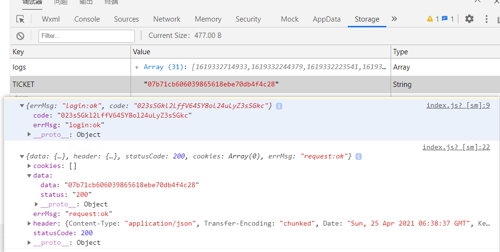

### 插件

[wx-jq: wx-jq一套完全原创的微信小程序插件集合库,微信小程序插件,wx-jq (gitee.com)](https://gitee.com/dgx/wx-jq)

## WebMagic & 房源搜索

WebMagic是一个简单灵活的Java爬虫框架。基于WebMagic，你可以快速开发出一个高效、易维护的爬虫。


-   简单的API，可快速上手
-   模块化的结构，可轻松扩展
-   提供多线程和分布式支持

### 使用WebMagic 抓取数据

#### 0. 爬虫流程

1. 访问列表页面，将当前列表页的房源详情页面添加到 `list` ，作为待爬取页面

   - 列表页

     

   - 当前列表的详情页链接

     

2. 将其余列表页放入到待爬取链接 `list` 中

   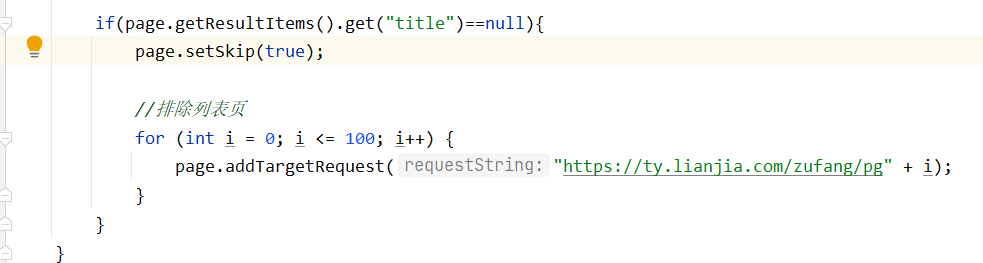

   >   `WebMagic` 内部有去重操作，已爬取过的页面不做重复操作

3. 去详情页面爬取信息

   - 调试查看变量

     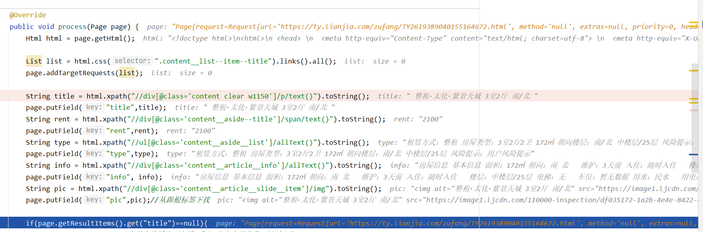

   - 对应的控制台输出

     

   >   信息被存在 `page` 变量中，默认是输出到控制台，可以编写 `Pipeline` 对 `page` 自行处理

   4. 当 `LianjiaPageProcessor.process()` 方法处理后，会调用 `MyPipeline` 进行处理

      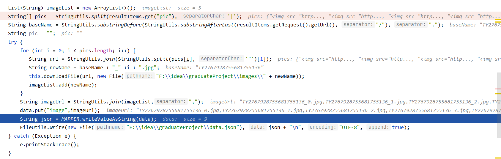

      

#### 1. 导入依赖

```xml
<dependency>
    <groupId>us.codecraft</groupId>
    <artifactId>webmagic-core</artifactId>
    <version>0.7.4</version>
</dependency>
<dependency>
    <groupId>us.codecraft</groupId>
    <artifactId>webmagic-extension</artifactId>
    <version>0.7.4</version>
</dependency>
<dependency>
    <groupId>commons-io</groupId>
    <artifactId>commons-io</artifactId>
    <version>2.6</version>
</dependency>
```

#### 2. 爬取逻辑

```java
package com.elasticsearch.wm;

import us.codecraft.webmagic.Page;
import us.codecraft.webmagic.Site;
import us.codecraft.webmagic.Spider;
import us.codecraft.webmagic.processor.PageProcessor;
import us.codecraft.webmagic.selector.Html;

import java.util.List;

/*
* 1. 获取爬取的链接
* 2. 从目标网页上获取信息
* 3. 拼接从网页上获取的信息
* 4. 将数据存储到JSON文件，将图片存储到指定文件夹
* */
public class LianjiaPageProcessor implements PageProcessor {

    private Site site = Site.me().setRetryTimes(3).setSleepTime(200);


    @Override
    public void process(Page page) {
        Html html = page.getHtml();

        List list = html.css(".content__list--item--title").links().all();
        page.addTargetRequests(list);

        String title = html.xpath("//div[@class='content clear w1150']/p/text()").toString();
        page.putField("title",title);
        String rent = html.xpath("//div[@class='content__aside--title']/span/text()").toString();
        page.putField("rent",rent);
        String type = html.xpath("//ul[@class='content__aside__list']/allText()").toString();
        page.putField("type",type);
        String pic = html.xpath("//div[@class='content__article__slide__item']/img").toString();
        page.putField("pic",pic);//从根标签下找

        if(page.getResultItems().get("title")==null){
            page.setSkip(true);//表示当前页是列表页 或者 没有房源信息，跳过爬取

            //排除列表页
            for (int i = 0; i <= 100; i++) {
                page.addTargetRequest("https://ty.lianjia.com/zufang/pg" + i);
            }
        }
    }

    @Override
    public Site getSite() {
        return site;
    }

    public static void main(String[] args) {
        Spider.create(new LianjiaPageProcessor())
                .addUrl("https://ty.lianjia.com/zufang/")
                .thread(1)
            .addPipeline(new MyPipeline())//对爬取到信息的自定义处理
                .run();
    }
}
```

#### 3. MyPipeline对信息处理

```java
package com.elasticsearch.wm;

import com.fasterxml.jackson.databind.ObjectMapper;
import org.apache.commons.io.FileUtils;
import org.apache.commons.io.IOUtils;
import org.apache.commons.lang3.StringUtils;
import org.apache.http.client.methods.CloseableHttpResponse;
import org.apache.http.client.methods.HttpGet;
import org.apache.http.impl.client.HttpClientBuilder;
import us.codecraft.webmagic.ResultItems;
import us.codecraft.webmagic.Task;
import us.codecraft.webmagic.pipeline.Pipeline;

import java.io.File;
import java.util.ArrayList;
import java.util.HashMap;
import java.util.List;
import java.util.Map;

/**
 * @author Auspice Tian
 * @time 2021-05-10 22:11
 * @current elasticSearch-com.elasticsearch.wm
 */
public class MyPipeline implements Pipeline {
    private static final ObjectMapper MAPPER = new ObjectMapper();

    @Override
    public void process(ResultItems resultItems, Task task) {
        Map<String,Object> data = new HashMap<>();

        data.put("url",resultItems.getRequest().getUrl());//目标链接
        data.put("title",resultItems.get("title"));//title
        data.put("rent", resultItems.get("rent"));//租金

        String[] types = StringUtils.split(resultItems.get("type"), ' ');
        data.put("rentMethod", types[0]);//租赁方式
        data.put("houseType", types[1]);//户型，如：2室1厅1卫
        data.put("orientation", types[2]);//朝向

        String[] infos = StringUtils.split(resultItems.get("info"), ' ');
        for (String info : infos) {
            if (StringUtils.startsWith(info, "看房：")) {
                data.put("time", StringUtils.split(info, '：')[1]);
            } else if (StringUtils.startsWith(info, "楼层：")) {
                data.put("floor", StringUtils.split(info, '：')[1]);
            }
        }

        List<String> imageList = new ArrayList<>();
        String[] pics = StringUtils.split(resultItems.get("pic"), '|');
        String baseName = StringUtils.substringBefore(StringUtils.substringAfterLast(resultItems.getRequest().getUrl(), "/"), ".");
        String pic = "";
        try {
            for (int i = 0; i < pics.length; i++) {
               String url = StringUtils.join(StringUtils.split(pics[i], '"')[1]);
               String newName = baseName + "_" +i + ".jpg";
               this.downloadFile(url, new File("F:\\idea\\graduateProject\\images\\" + newName));
               imageList.add(newName);
            }
            String imageUrl = StringUtils.join(imageList,",");
            data.put("image",imageUrl);
            String json = MAPPER.writeValueAsString(data);
            FileUtils.write(new File("F:\\idea\\graduateProject\\data.json"), json + "\n", "UTF-8", true);
        } catch (Exception e) {
            e.printStackTrace();
        }

    }

    /**
     * 下载文件
     * @param url 文件url
     * @param dest 目标目录
     */
    public void downloadFile(String url, File dest) throws Exception {
        HttpGet httpGet = new HttpGet(url);
        CloseableHttpResponse response = HttpClientBuilder.create().build().execute(httpGet);

        try {
            FileUtils.writeByteArrayToFile(dest, IOUtils.toByteArray(response.getEntity().getContent()));
        } finally {
            response.close();
        }
    }
}
```

#### 4. 将图片上传到COS


### 将数据导入ES

#### 1. 设置ik分词器

```shell
cd /data/es-cluster-data/ik
# 将IK的zip压缩包解压到该目录

# 停止、删除现有容器
docker stop es-node01 es-node02 es-node03
docker rm es-node01 es-node02 es-node03

# 重新创建容器，挂在ik目录
docker create --name es-node01 --net host -v /data/es-cluster-data/node01/elasticsearch.yml:/usr/share/elasticsearch/config/elasticsearch.yml -v /data/es-cluster-data/node01/jvm.options:/usr/share/elasticsearch/config/jvm.options -v /data/es-cluster-data/ik:/usr/share/elasticsearch/plugins/ik -v /data/es-cluster-data/node01/data:/usr/share/elasticsearch/data elasticsearch:6.5.4

docker create --name es-node02 --net host -v /data/es-cluster-data/node02/elasticsearch.yml:/usr/share/elasticsearch/config/elasticsearch.yml -v /data/es-cluster-data/node02/jvm.options:/usr/share/elasticsearch/config/jvm.options -v /data/es-cluster-data/ik:/usr/share/elasticsearch/plugins/ik -v /data/es-cluster-data/node02/data:/usr/share/elasticsearch/data elasticsearch:6.5.4

docker create --name es-node03 --net host -v /data/es-cluster-data/node03/elasticsearch.yml:/usr/share/elasticsearch/config/elasticsearch.yml -v /data/es-cluster-data/node03/jvm.options:/usr/share/elasticsearch/config/jvm.options -v /data/es-cluster-data/ik:/usr/share/elasticsearch/plugins/ik -v /data/es-cluster-data/node03/data:/usr/share/elasticsearch/data elasticsearch:6.5.4
```

测试ik分词器

```json
POST http://8.140.130.91:9200/_analyze

{
    "analyzer": "ik_max_word",
    "text": "我是中国人"
}

{
    "tokens": [
        {
            "token": "我",
            "start_offset": 0,
            "end_offset": 1,
            "type": "CN_CHAR",
            "position": 0
        },
        {
            "token": "是",
            "start_offset": 1,
            "end_offset": 2,
            "type": "CN_CHAR",
            "position": 1
        },
        {
            "token": "中国人",
            "start_offset": 2,
            "end_offset": 5,
            "type": "CN_WORD",
            "position": 2
        },
        {
            "token": "中国",
            "start_offset": 2,
            "end_offset": 4,
            "type": "CN_WORD",
            "position": 3
        },
        {
            "token": "国人",
            "start_offset": 3,
            "end_offset": 5,
            "type": "CN_WORD",
            "position": 4
        }
    ]
}
```

#### 2. 文档mapping

```json
# 新建索引
PUT http://8.140.130.91:9200/haoke

{
    "settings": {
        "index": {
            "number_of_shards": 6,
            "number_of_replicas": 1
        }
    },
    "mappings": {
        "house": {
            "dynamic": false,
            "properties": {
                "title": {
                    "type": "text",
                    "analyzer": "ik_max_word"
                },
                "pic": {
                    "type": "keyword",
                    "index": false
                },
                "orientation": {
                    "type": "keyword",
                    "index": false
                },
                "houseType": {
                    "type": "keyword",
                    "index": false
                },
                "rentMethod": {
                    "type": "keyword",
                    "index": false
                },
                "time": {
                    "type": "keyword",
                    "index": false
                },
                "rent": {
                    "type": "keyword",
                    "index": false
                },
                "floor": {
                    "type": "keyword",
                    "index": false
                }
            }
        }
    }
}
```

>   -   `dynamic`
>       -   参数来控制字段的新增
>       -   true：默认值，表示允许自动新增字段
>       -   false：不允许自动新增字段，但文档可以正常写入，但无法对字段进行查询
>       -   strict：严格模式，文档不能写入，报错
>   -   `index`
>       -   控制当前字段是否被索引，默认为 true，false表示不记录，即不可被搜索


#### 3. 测试ES集群

**新增数据**

```json
POST http://8.140.130.91:9200/haoke/house

{
    "pic": "TY2760703226025353216_0.jpg,TY2760703226025353216_1.jpg,TY2760703226025353216_2.jpg,TY2760703226025353216_3.jpg,TY2760703226025353216_4.jpg",
    "orientation": "30㎡",
    "houseType": "房屋类型：4室0厅2卫",
    "rentMethod": "租赁方式：合租",
    "time": "随时可看",
    "title": " 合租·翰府 4居室 西卧 ",
    "rent": "800",
    "floor": "4/25层",
    "url": "https://ty.lianjia.com/zufang/TY2760703226025353216.html"
}
```

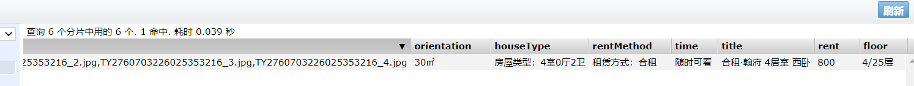

---

**测试搜索**

```json
POST http://8.140.130.91:9200/haoke/house/_search

{
    "query": {
        "match": {
            "title": {
                "query": "合租"
            }
        }
    },
    "highlight": {
        "fields": {
            "title": {}
        }
    }
}

{
    "took": 54,
    "timed_out": false,
    "_shards": {
        "total": 6,
        "successful": 6,
        "skipped": 0,
        "failed": 0
    },
    "hits": {
        "total": 1,
        "max_score": 0.2876821,
        "hits": [
            {
                "_index": "haoke",
                "_type": "house",
                "_id": "XTazWXkBRTe_j_yGOSnN",
                "_score": 0.2876821,
                "_source": {
                    "pic": "TY2760703226025353216_0.jpg,TY2760703226025353216_1.jpg,TY2760703226025353216_2.jpg,TY2760703226025353216_3.jpg,TY2760703226025353216_4.jpg",
                    "orientation": "30㎡",
                    "houseType": "房屋类型：4室0厅2卫",
                    "rentMethod": "租赁方式：合租",
                    "time": "随时可看",
                    "title": " 合租·翰府 4居室 西卧 ",
                    "rent": "800",
                    "floor": "4/25层",
                    "url": "https://ty.lianjia.com/zufang/TY2760703226025353216.html"
                },
                "highlight": {
                    "title": [
                        "<em>合租</em>·翰府 4居室 西卧"
                    ]
                }
            }
        ]
    }
}
```

---

**测试未被索引字段**

```json
{
    "query": {
        "match": {
            "houseType": {
                "query": "4室0厅2卫"
            }
        }
    },
    "highlight": {
        "fields": {
            "title": {}
        }
    }
}
```


`index` 被设置为false的字段不能进行搜索操作

#### 4. 将数据批量导入ES

```java
import org.apache.commons.io.FileUtils;
/*
    * 批量插入数据
    * */
@Test
public void bulk() throws Exception{
    Request request = new Request("POST", "/haoke/house/_bulk");
    List<String> lines = FileUtils.readLines(new File("E:\\idea\\graduateProject\\tylj-data.json"), "UTF-8");
    //data.json中  每一行都是一个文档
    String createStr = "{\"index\": {\"_index\":\"haoke\",\"_type\":\"house\"}}";
    StringBuilder sb = new StringBuilder();
    int count = 0;
    for (String line : lines) {
        sb.append(createStr + "\n" + line + "\n");
        if (count >= 100) {
            request.setJsonEntity(sb.toString());
            Response response = this.restClient.performRequest(request);

            count = 0;
            sb = new StringBuilder();
        }
        count++;
    }
}
```

**测试**

```json
POST http://8.140.130.91:9200/haoke/house/_search

{
    "from":0,
    "size":300,
    "query": {
        "match": {
            "title": {
                "query": "整租"
            }
        }
    },
    "highlight": {
        "fields": {
            "title": {}
        }
    }
}
```


### 房源搜索功能

#### 房源搜索接口

##### 1. 导入依赖

```xml
<!--ElasticSearch依赖-->
<dependency>
    <groupId>org.springframework.boot</groupId>
    <artifactId>spring-boot-starter-data-elasticsearch</artifactId>
</dependency>
```

##### 2. 添加配置

```properties
# elasticsearch配置
spring.data.elasticsearch.cluster-name=es-haoke-cluster
spring.data.elasticsearch.cluster-nodes=8.140.130.91:9300,8.140.130.91:9301,8.140.130.91:9302
```

##### 3. 编写vo——HouseData、SearchResult

```java
@Data
@AllArgsConstructor
@NoArgsConstructor
@Document(indexName = "haoke",type = "house",createIndex = false)
public class HouseData {
    @Id
    private String id;
    private String title;
    private String rent;
    private String floor;
    private String pic;
    private String orientation;
    private String houseType;
    private String rentMethod;
    private String time;
}
```

```java
@Data
@AllArgsConstructor
@NoArgsConstructor
public class ESSearchResult {
    private Integer totalPage;
    private List<HouseData> list;
}
```

##### 4. 编写Controller

```java
package com.haoke.api.controller.frontController;

import com.haoke.api.service.ESSearchService;
import com.haoke.api.vo.ESSearchResult;
import org.springframework.beans.factory.annotation.Autowired;
import org.springframework.web.bind.annotation.*;

import javax.websocket.server.PathParam;

@RestController
@RequestMapping("search")
@CrossOrigin
public class ESController {
    @Autowired
    private ESSearchService esSearchService;

    @GetMapping
    public ESSearchResult search(@RequestParam("keyword")String keyword,
                                 @RequestParam(value = "page",defaultValue = "1")Integer page){

        if(page > 100){
            page = 1;//防止爬取过多数据
        }

        return this.esSearchService.search(keyword,page);
    }
}
```

##### 5. 编写Service

```java
package com.haoke.api.service;

@Service
public class ESSearchService {

    @Autowired
    private ElasticsearchTemplate elasticsearchTemplate;

    public static final Integer ROWS = 10;

    public ESSearchResult search(String keyword, Integer page) {
        PageRequest pageRequest = PageRequest.of(page-1,ROWS);

        SearchQuery searchQuery = new NativeSearchQueryBuilder()
                .withQuery(QueryBuilders.matchQuery("title",keyword).operator(Operator.AND))
                .withPageable(pageRequest)
                .withHighlightFields(new HighlightBuilder.Field("title"))
                .build();

        AggregatedPage<HouseData> houseData = this.elasticsearchTemplate.queryForPage(searchQuery, HouseData.class);
        return new ESSearchResult(houseData.getTotalPages(),houseData.getContent());
    }
}
```

##### 6. 启动


>   整合Redis后，引发了netty冲突，需要在启动类中加入

```java
package com.haoke.api;

@SpringBootApplication(exclude = {DataSourceAutoConfiguration.class})
public class DubboApiApplication {
    public static void main(String[] args) {
        System.setProperty("es.set.netty.runtime.available.processors","false");
        SpringApplication.run(DubboApiApplication.class, args);
    }
}
```

##### 7. 测试

```json
GET http://127.0.0.1:9091/housing/search?keyWord=整租&page=1

{
    "totalPage": 21,
    "list": [
        {
            "id": "XzbLWXkBRTe_j_yGmSm3",
            "title": " 整租·中正·锦城 1室0厅 南 ",
            "rent": "1200",
            "floor": "低楼层/18层",
            "pic": "TY2744161905324064768_0.jpg,TY2744161905324064768_1.jpg,TY2744161905324064768_2.jpg,TY2744161905324064768_3.jpg",
            "orientation": "30㎡",
            "houseType": "房屋类型：1室0厅1卫",
            "rentMethod": "租赁方式：整租",
            "time": "需提前预约"
        },
        {
            "id": "HKzLWXkBbSHXsITPqKGk",
            "title": " 整租·华润大厦 1室1厅 北 ",
            "rent": "1500",
            "floor": "中楼层/30层",
            "pic": "",
            "orientation": "43㎡",
            "houseType": "房屋类型：1室1厅1卫",
            "rentMethod": "租赁方式：整租",
            "time": "需提前预约"
        },
        {
            "id": "gzbLWXkBRTe_j_yGmSm3",
            "title": " 整租·大马新村 2室1厅 南 ",
            "rent": "1700",
            "floor": "中楼层/6层",
            "pic": "TY2765003811390234624_0.jpg,TY2765003811390234624_1.jpg,TY2765003811390234624_2.jpg,TY2765003811390234624_3.jpg,TY2765003811390234624_4.jpg",
            "orientation": "40㎡",
            "houseType": "房屋类型：2室1厅1卫",
            "rentMethod": "租赁方式：整租",
            "time": "需提前预约"
        },
        {
            "id": "C6zLWXkBbSHXsITPqKGk",
            "title": " 整租·王村小区 1室1厅 南 ",
            "rent": "1980",
            "floor": "高楼层/12层",
            "pic": "TY2779698262129508352_0.jpg,TY2779698262129508352_1.jpg,TY2779698262129508352_2.jpg,TY2779698262129508352_3.jpg",
            "orientation": "45㎡",
            "houseType": "房屋类型：1室1厅1卫",
            "rentMethod": "租赁方式：整租",
            "time": "需提前预约"
        },
        {
            "id": "fjbLWXkBRTe_j_yGmSm3",
            "title": " 整租·景观新贵 2室1厅 东 ",
            "rent": "2000",
            "floor": "中楼层/18层",
            "pic": "TY2777610759704674304_0.jpg,TY2777610759704674304_1.jpg,TY2777610759704674304_2.jpg,TY2777610759704674304_3.jpg,TY2777610759704674304_4.jpg",
            "orientation": "98㎡",
            "houseType": "房屋类型：2室1厅1卫",
            "rentMethod": "租赁方式：整租",
            "time": "需提前预约"
        },
        {
            "id": "ZKzLWXkBbSHXsITPqKGk",
            "title": " 整租·国际公寓 1室1厅 南 ",
            "rent": "1700",
            "floor": "低楼层/19层",
            "pic": "TY2762195172271341568_0.jpg,TY2762195172271341568_1.jpg,TY2762195172271341568_2.jpg,TY2762195172271341568_3.jpg,TY2762195172271341568_4.jpg,TY2762195172271341568_5.jpg",
            "orientation": "67㎡",
            "houseType": "房屋类型：1室1厅1卫",
            "rentMethod": "租赁方式：整租",
            "time": "需提前预约"
        },
        {
            "id": "7lrLWXkB95epjtTKoTab",
            "title": " 整租·文锦世家 2室0厅 南 ",
            "rent": "2200",
            "floor": "高楼层/28层",
            "pic": "",
            "orientation": "75㎡",
            "houseType": "房屋类型：2室0厅1卫",
            "rentMethod": "租赁方式：整租",
            "time": "需提前预约"
        },
        {
            "id": "bDbLWXkBRTe_j_yGmSm3",
            "title": " 整租·佳地花园 2室1厅 南 ",
            "rent": "1600",
            "floor": "低楼层/6层",
            "pic": "TY2762299531344486400_0.jpg,TY2762299531344486400_1.jpg,TY2762299531344486400_2.jpg,TY2762299531344486400_3.jpg,TY2762299531344486400_4.jpg",
            "orientation": "58㎡",
            "houseType": "房屋类型：2室1厅1卫",
            "rentMethod": "租赁方式：整租",
            "time": "需提前预约"
        },
        {
            "id": "ijbLWXkBRTe_j_yGmSm3",
            "title": " 整租·汾河景观360 1室0厅 北 ",
            "rent": "1500",
            "floor": "高楼层/33层",
            "pic": "TY2778104741962448896_0.jpg,TY2778104741962448896_1.jpg,TY2778104741962448896_2.jpg,TY2778104741962448896_3.jpg",
            "orientation": "30㎡",
            "houseType": "房屋类型：1室0厅1卫",
            "rentMethod": "租赁方式：整租",
            "time": "需提前预约"
        },
        {
            "id": "wFrLWXkB95epjtTKoTab",
            "title": " 整租·富力湾 3室2厅 南 ",
            "rent": "3000",
            "floor": "中楼层/34层",
            "pic": "TY2565750322844663808_0.jpg,TY2565750322844663808_1.jpg,TY2565750322844663808_2.jpg,TY2565750322844663808_3.jpg,TY2565750322844663808_4.jpg,TY2565750322844663808_5.jpg,TY2565750322844663808_6.jpg,TY2565750322844663808_7.jpg",
            "orientation": "120㎡",
            "houseType": "房屋类型：3室2厅2卫",
            "rentMethod": "租赁方式：整租",
            "time": "需提前预约"
        }
    ]
}
```

#### 房源搜索整合前端

流程：

-   输入框聚焦，`this.state/searchBarFlag = true` ，则显示 `SearchBar`

-   输入框失焦，`this.state/searchBarFlag = false` ，则隐藏 `SearchBar`

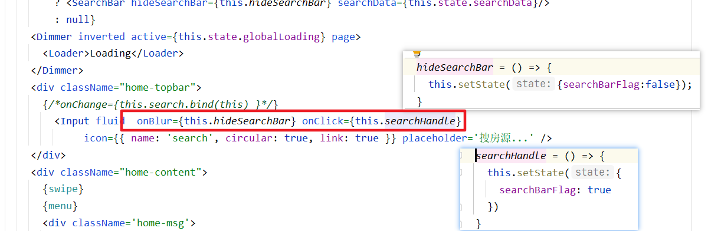

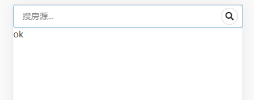

##### home.js

```react
class Home extends React.Component {
    componentDidMount = () => {
        ...
        Promise.all([swipe, menu, info, faq, house]).then((result)=>{
            this.setState({
                swipeData: result[0],
                menuData: result[1],
                infoData: result[2],
                faqData: result[3],
                houseData: result[4],
                menuLoading: true,
                swipeLoading: true,
                infoLoading: true,
                faqLoading: true,
                houseLoading: true,
                globalLoading: false,
                searchBarFlag:false,
                searchData:[]
            })
        })
    }

    hideSearchBar = () => {
        this.setState({searchBarFlag:false});
    }
    searchHandle = () => {
        this.setState({
            searchBarFlag: true
        })
    }
    search = (event, data) =>{
        let value = data.value;
        let _this =this;
        _this.searchHandle();
        axios.get('http://127.0.0.1:9091/housing/search?keyWord='+value+'&page=1').then((data)=>{
            console.log(data)
            if(data.list.length != 0)
                _this.setState({searchData:data.list});
            else
                _this.setState({searchData:[]});
        });
    }

    render() {
        ...
        return (
            <div className='home-container'>
                {this.state.mapShowFlag?<MapHouse hideMap={this.hideMap}/>:null}
                {this.state.calcShowFlag?<Calculator hideCalc={this.hideCalc}/>:null}
                {this.state.searchBarFlag
                    ? <SearchBar hideSearchBar={this.hideSearchBar} searchData={this.state.searchData}/>
                    : null}
                <div className="home-topbar">
                    {/*onChange={this.search.bind(this) }*/}
                    {/*onBlur={this.hideSearchBar} onClick={this.searchHandle}*/}
                    <Input fluid onChange={this.search.bind(this) } icon={{ name: 'search', circular: true, link: true }} placeholder='搜房源...' />
                </div>
            </div>
            ...
        );
    }
}
export default withRouter(Home);
```

##### home.css

```css
···
.search-bar {
    position: fixed;
    bottom: 50px;
    top: 38px;
    z-index: 9999;
    height: 100%;
    width: 100%;
    background-color: #fff;
    overflow-y: auto; /**这里做了修改，y轴方向有滚动条**/
}
···
```

##### SearchBar.js

```react
import React from 'react';
// import { Icon} from 'semantic-ui-react'
import { Icon,Item } from 'semantic-ui-react';
import "./search.css";


class SearchBar extends React.Component {

    hideSearchBar = () => {
        this.props.hideSearchBar();

    }

    render() {
        return (
            <div className = 'search-bar' >
                <Icon onClick={this.hideSearchBar} name = 'angle left' size = 'large'/>
                <div className = "search-bar-content">
                    <Item.Group divided unstackable>
                        {
                            this.props.searchData.map(item => {
                                return (
                                    <Item key={item.id}>
                                        <Item.Image
                                            src={"https://haoke-1257323542.cos.ap-beijing.myqcloud.com/tylj-images/"
                                            + item.pic.split(",")[0]}/>
                                        <Item.Content>
                                            <Item.Header><div className='house-title'>
                                                {item.title}</div></Item.Header>
                                            <Item.Meta>
                                    <span className='cinema'>
{item.orientation}/{item.rentMethod}/{item.houseType}</span>
                                            </Item.Meta>
                                            <Item.Description>
                                                上海
                                            </Item.Description>
                                            <Item.Description>{item.rent}
                                            </Item.Description>
                                        </Item.Content>
                                    </Item>
                                )
                            })
                        }
                    </Item.Group>
                </div>
            </div>
        );
    }
}

export default SearchBar;
```

##### search.css

```css
.house-title{
    overflow: hidden;
    white-space: nowrap;
}
```

### 房源搜索——高亮


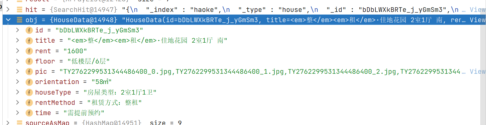

#### 后台实现

````java
package com.haoke.api.service;

import com.haoke.api.vo.ESSearchResult;
import com.haoke.api.vo.es.HouseData;
import org.apache.commons.lang3.reflect.FieldUtils;
import org.elasticsearch.action.search.SearchResponse;
import org.elasticsearch.common.text.Text;
import org.elasticsearch.index.query.Operator;
import org.elasticsearch.index.query.QueryBuilders;
import org.elasticsearch.search.SearchHit;
import org.elasticsearch.search.SearchHits;
import org.elasticsearch.search.fetch.subphase.highlight.HighlightBuilder;
import org.elasticsearch.search.fetch.subphase.highlight.HighlightField;
import org.springframework.beans.factory.annotation.Autowired;
import org.springframework.cglib.core.ReflectUtils;
import org.springframework.data.domain.PageRequest;
import org.springframework.data.domain.Pageable;
import org.springframework.data.elasticsearch.core.ElasticsearchTemplate;
import org.springframework.data.elasticsearch.core.SearchResultMapper;
import org.springframework.data.elasticsearch.core.aggregation.AggregatedPage;
import org.springframework.data.elasticsearch.core.aggregation.impl.AggregatedPageImpl;
import org.springframework.data.elasticsearch.core.query.NativeSearchQuery;
import org.springframework.data.elasticsearch.core.query.NativeSearchQueryBuilder;
import org.springframework.data.elasticsearch.core.query.SearchQuery;
import org.springframework.stereotype.Service;

import java.lang.reflect.Field;
import java.util.ArrayList;
import java.util.Collections;
import java.util.List;
import java.util.Map;

@Service
public class ESSearchService {

    @Autowired
    private ElasticsearchTemplate elasticsearchTemplate;

    public static final Integer ROWS = 10;

    public ESSearchResult search(String keyword, Integer page) {
        PageRequest pageRequest = PageRequest.of(page-1,ROWS);

        SearchQuery searchQuery = new NativeSearchQueryBuilder()
                .withQuery(QueryBuilders.matchQuery("title",keyword).operator(Operator.AND))
                .withPageable(pageRequest)
                .withHighlightFields(new HighlightBuilder.Field("title"))
                .build();
        /*
        * 高亮显示，需要指定属性映射，此时不会进行自动映射，所有的属性都必须手动因难割舍
        * */
        AggregatedPage<HouseData> houseData = this.elasticsearchTemplate.queryForPage(searchQuery, HouseData.class,
                new SearchResultMapper() {

                    /*
                    * searchResponse : 返回结果
                    * aClass         : ES类型
                    * pageable       : 分页信息
                    * */
                    @Override
                    public <T> AggregatedPage<T> mapResults(SearchResponse searchResponse, Class<T> aClass, Pageable pageable) {

                        //返回结果
                        List<T> result = new ArrayList<>();

                        //返回空结果
                        if(searchResponse.getHits().totalHits==0){
                            return new AggregatedPageImpl<>(Collections.emptyList(),pageable,0L);
                        }

                        //查询结果不为空
                        for (SearchHit hit : searchResponse.getHits()) {
                            //对每个结果进行处理

                            //通过反射机制，创建ORM的java对象
                            T obj = (T) ReflectUtils.newInstance(aClass);

                            try {
                                //将 id 写入
                                FieldUtils.writeField(obj,"id",hit.getId(),true);
                            } catch (IllegalAccessException e) {
                                e.printStackTrace();
                            }

                            /*
                            * ES数据
                            * {
                                    "_index": "haoke",
                                    "_type": "house",
                                    "_id": "XjbLWXkBRTe_j_yGmSm3",
                                    "_version": 1,
                                    "_score": 1,
                                    "_source": {
                                        "pic": "TY2760703226025353216_0.jpg,TY2760703226025353216_1.jpg,TY2760703226025353216_2.jpg,TY2760703226025353216_3.jpg,TY2760703226025353216_4.jpg",
                                        "orientation": "30㎡",
                                        "houseType": "房屋类型：4室0厅2卫",
                                        "rentMethod": "租赁方式：合租",
                                        "time": "随时可看",
                                        "title": " 合租·翰府 4居室 西卧 ",
                                        "rent": "800",
                                        "floor": "4/25层",
                                        "url": "https://ty.lianjia.com/zufang/TY2760703226025353216.html"
                                    }
                                }
                            * */
                            Map<String ,Object> sourceAsMap = hit.getSourceAsMap();
                            for (Map.Entry<String, Object> entry : sourceAsMap.entrySet()) {
                                //对每个键值对进行映射
                                if(null == FieldUtils.getField(aClass, entry.getKey(), true)){
                                    continue;
                                }

                                //向 obj 中写入键值对
                                try {
                                    FieldUtils.writeField(obj, entry.getKey(), entry.getValue(),true);
                                } catch (IllegalAccessException e) {
                                    e.printStackTrace();
                                }
                            }

                            //处理高亮字段 覆盖
                            for (Map.Entry<String, HighlightField> stringHighlightFieldEntry : hit.getHighlightFields().entrySet()) {
                                Text[] fragments = stringHighlightFieldEntry.getValue().fragments();

                                StringBuilder sb = new StringBuilder();
                                for (Text fragment : fragments) {
                                    sb.append(fragment.toString());
                                }

                                try {
                                    FieldUtils.writeField(obj,stringHighlightFieldEntry.getKey(),sb.toString(),true);
                                } catch (IllegalAccessException e) {
                                    e.printStackTrace();
                                }
                            }

                            result.add(obj);
                        }

                        return new AggregatedPageImpl<>(result,pageable, searchResponse.getHits().totalHits);
                    }
                });


        return new ESSearchResult(houseData.getTotalPages(),houseData.getContent());
    }
}
````

```json
{
    "totalPage": 21,
    "list": [
        {
            "id": "XzbLWXkBRTe_j_yGmSm3",
            "title": "<em>整</em><em>租</em>·中正·锦城 1室0厅 南",
            "rent": "1200",
            "floor": "低楼层/18层",
            "pic": "TY2744161905324064768_0.jpg,TY2744161905324064768_1.jpg,TY2744161905324064768_2.jpg,TY2744161905324064768_3.jpg",
            "orientation": "30㎡",
            "houseType": "房屋类型：1室0厅1卫",
            "rentMethod": "租赁方式：整租",
            "time": "需提前预约"
        }
        ...
    ]
}
```

#### 整合前端

```html
<Item.Header><div className='house-title' dangerouslySetInnerHTML=
{{__html:item.title}}></div></Item.Header>

.house-title em{
    font-style: normal;
    color: red;
}
```


### 房源搜索——分页

#### 分页组件

```react
import { Icon,Item,Pagination } from 'semantic-ui-react';
```

#### searchBar.js

```react
handlePageChange = (e, { activePage }) =>{
    this.props.searchPage(null,{
        page:activePage
    });
}

render() {
    return (
        {
            this.props.totalPage > 1?(
            <Pagination
                defaultActivePage={1}
                firstItem={null}
                lastItem={null}
                totalPages={this.props.totalPage}
                onPageChange={this.handlePageChange}
                />
            ):null
    )
}
```

#### home.js

```react
search = (event, data) =>{
    let value = data.value ? data.value : this.state.searchKeyWord;
    let _this =this;
    let page = data.page ? data.page: 1;

    _this.searchHandle();
    axios.get('http://127.0.0.1:9091/housing/search?keyWord='+value+'&page='+page).then((data)=>{
        if(data.list.length != 0)
            _this.setState({searchData:data.list});
        else
            _this.setState({searchData:[]});

        _this.setState({
            totalPage:data.totalPage,
            searchKeyWord: value
        })
    });
}

{this.state.searchBarFlag
    ? <SearchBar hideSearchBar={this.hideSearchBar} searchPage={this.search} searchData={this.state.searchData} totalPage={this.state.totalPage} />
    : null}
```


### 房源搜索——热词搜索

需求：当无搜索结果或搜索结果只有一页时，显示搜索热词，最多显示5个热词

热词：按照用户搜索的关键字以及搜索到的结果数量进行排序，结果数量越多的排到越前面

#### 实现分析


1.  用户搜索数据，首先进行ES搜索

2.  在搜索完成后，进行判断，是否需要显示热词

    -   如果不需要，直接返回用户请求的数据

    -   如果需要，则进行在 `Redis` 中查询热词

3.  对于用户搜索词的处理有两种方案

    -   同步方案：在程序中进行处理，并且把搜索词以及命中的数据数量存到 `Redis` 中
    -   异步方案：将查询信息记录到日志文件中，由后续的程序做处理，然后再写入到Redis中

#### 后台

```java
package com.haoke.api.controller;

import com.alibaba.dubbo.common.logger.Logger;
import com.alibaba.dubbo.common.logger.LoggerFactory;
import com.haoke.api.service.ESSearchService;
import com.haoke.api.vo.ESSearchResult;
import org.springframework.beans.factory.annotation.Autowired;
import org.springframework.data.redis.core.RedisTemplate;
import org.springframework.stereotype.Controller;
import org.springframework.web.bind.annotation.*;

import java.util.Set;

@RequestMapping("housing/search")
@RestController
@CrossOrigin
public class ESController {
    @Autowired
    private ESSearchService esSearchService;

    @Autowired
    private RedisTemplate redisTemplate;

    private static final Logger LOGGER = LoggerFactory.getLogger(ESController.class);

    @GetMapping
    public ESSearchResult search(@RequestParam("keyWord") String keyWord,
                                 @RequestParam(value = "page", defaultValue = "1") Integer page){

        if(page > 100){
            page = 1;//防止爬取过多数据
        }

        ESSearchResult search = this.esSearchService.search(keyWord, page);
        
        String redisKey = "HAOKE_HOT_WORD";
        if(search.getTotalPage() <= 1){
            //需要查询热词，按照得分，获取前5条
            Set<String> set = this.redisTemplate.opsForZSet().reverseRange(redisKey,0,4);
            search.setHotWord(set);
        }

        //处理热词
        Integer count = (Math.max(search.getTotalPage(),1) - 1)*esSearchService.ROWS +search.getList().size();
        //采用zset方式进行存储。值是的数量计算的得分
        this.redisTemplate.opsForZSet().add(redisKey,keyWord,count);

        LOGGER.info("[Search]搜索关键字为：" + keyWord + "，结果数量为：" + count);

        return search;
    }
}
```

#### 前台

```react
# search.js
handleHotSearch = (e,data) =>{
    this.props.searchPage(null,{value:data.children});
}

{
    this.props.hotWord ? (
        <Container>搜索结果较少，建议搜索：<br/>
            <span>
                {
                    this.props.hotWord.map(item => {
                        return (
                            <Label onClick={this.handleHotSearch}>{item}
                            </Label>
                        )
                    })
                }
            </span>
        </Container>
    ): null
}

# home.js
hideSearchBar = () => {
    this.setState({
        searchBarFlag:false,
        searchKeyWord:""
    });
}
search = (event, data) =>{
    let value = data.value ? data.value : this.state.searchKeyWord;
    let _this =this;
    let page = data.page ? data.page: 1;

    this.setState({
        searchKeyWord:value
    });

    _this.searchHandle();
    axios.get('http://127.0.0.1:9091/housing/search?keyWord='+value+'&page='+page).then((data)=>{
        if(data.list.length != 0)
            _this.setState({searchData:data.list});
        else
            _this.setState({searchData:[]});

        _this.setState({
            totalPage:data.totalPage,
            hotWord: data.hotWord
        })
    });
}
searchHandle = () => {
    this.setState({
        searchBarFlag: true
    })
}

{this.state.searchBarFlag
    ? <SearchBar hideSearchBar={this.hideSearchBar} hotWord={this.state.hotWord}  searchPage={this.search}
          searchData={this.state.searchData} totalPage={this.state.totalPage} />
    : null}

<div className="home-topbar">
    {/*onChange={this.search.bind(this) }*/}
    {/*onBlur={this.hideSearchBar} onClick={this.searchHandle}*/}
    <Input fluid onChange={this.search.bind(this) } value={this.state.searchKeyWord}
        icon={{ name: 'search', circular: true, link: true ,}} placeholder='搜房源...' />
</div>
```


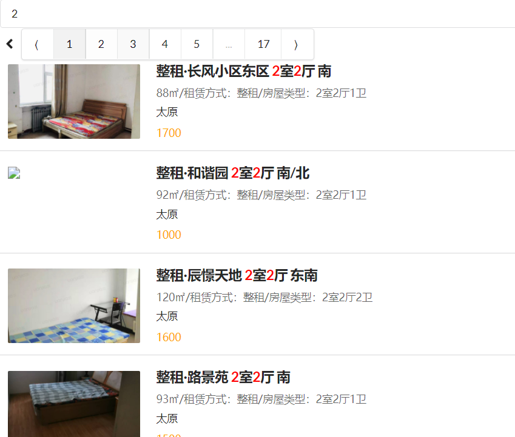

### 房源搜索——拼音搜索

ES拼音插件地址：https://github.com/medcl/elasticsearch-analysis-pinyin

#### 1. ES集群引入拼音插件

```shell
#将zip压缩包，解压到/data/es-cluster-data/pinyin
unzip elasticsearch-analysis-pinyin-6.5.4.zip

#重新创建容器
docker stop es-node01 es-node02 es-node03
docker rm es-node01 es-node02 es-node03

# 重新创建容器，挂在ik目录
docker create --name es-node01 --net host -v /data/es-cluster-data/node01/elasticsearch.yml:/usr/share/elasticsearch/config/elasticsearch.yml -v /data/es-cluster-data/node01/jvm.options:/usr/share/elasticsearch/config/jvm.options  -v /data/es-cluster-data/node01/data:/usr/share/elasticsearch/data -v /data/es-cluster-data/ik:/usr/share/elasticsearch/plugins/ik -v /data/es-cluster-data/pinyin:/usr/share/elasticsearch/plugins/pinyin elasticsearch:6.5.4

docker create --name es-node02 --net host -v /data/es-cluster-data/node02/elasticsearch.yml:/usr/share/elasticsearch/config/elasticsearch.yml -v /data/es-cluster-data/node02/jvm.options:/usr/share/elasticsearch/config/jvm.options -v /data/es-cluster-data/node02/data:/usr/share/elasticsearch/data -v /data/es-cluster-data/ik:/usr/share/elasticsearch/plugins/ik -v /data/es-cluster-data/pinyin:/usr/share/elasticsearch/plugins/pinyin elasticsearch:6.5.4

docker create --name es-node03 --net host -v /data/es-cluster-data/node03/elasticsearch.yml:/usr/share/elasticsearch/config/elasticsearch.yml -v /data/es-cluster-data/node03/jvm.options:/usr/share/elasticsearch/config/jvm.options -v /data/es-cluster-data/node03/data:/usr/share/elasticsearch/data -v /data/es-cluster-data/ik:/usr/share/elasticsearch/plugins/ik -v /data/es-cluster-data/pinyin:/usr/share/elasticsearch/plugins/pinyin elasticsearch:6.5.4
```

#### 2. 测试拼音分词

```json
PUT /medcl/

{
	"index": {# 新建索引
		"analysis": {# 指定分词器
			"analyzer": {
				"pinyin_analyzer": {
					"tokenizer": "my_pinyin"
				}
			},
			"tokenizer": {# 分词器限制
				"my_pinyin": {
					"type": "pinyin",
					"keep_separate_first_letter": false,
					"keep_full_pinyin": true,
					"keep_original": true,
					"limit_first_letter_length": 16,
                    "keep_first_letter":true,# 词汇拼音首字母搜索
					"lowercase": true,
					"remove_duplicated_term": true
				}
			}
		}
	}
}
```

**测试分词**

```json
GET /medcl/_analyze

{
    "text": ["刘德华"],
    "analyzer": "pinyin_analyzer"
}

{
	"tokens": [{
			"token": "liu",
			"start_offset": 0,
			"end_offset": 0,
			"type": "word",
			"position": 0
		},
		{
			"token": "刘德华",
			"start_offset": 0,
			"end_offset": 0,
			"type": "word",
			"position": 0
		},
		{
			"token": "ldh",
			"start_offset": 0,
			"end_offset": 0,
			"type": "word",
			"position": 0
		},
		{
			"token": "de",
			"start_offset": 0,
			"end_offset": 0,
			"type": "word",
			"position": 1
		},
		{
			"token": "hua",
			"start_offset": 0,
			"end_offset": 0,
			"type": "word",
			"position": 2
		}
	]
}
```

#### 3. 添加拼音分词支持

```json
POST /medcl/folks/_mapping

{
	"folks": {
		"properties": {
			"name": {
				"type": "keyword",
				"fields": {
					"pinyin": {
						"type": "text",
						"store": false,
						"term_vector": "with_offsets",
						"analyzer": "pinyin_analyzer",
						"boost": 10
					}
				}
			}
		}
	}
}
```

>   这里使用的是name的子字段，通过fields指定  

**插入数据**

```json
POST /medcl/folks/andy
{"name":"刘德华"}
```

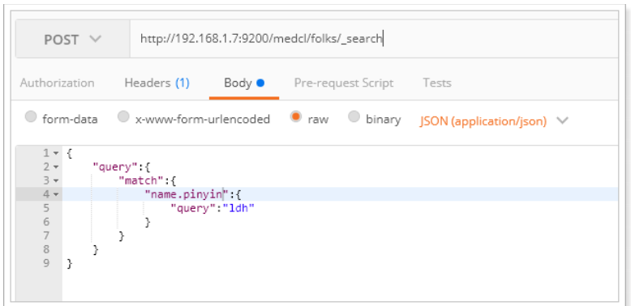

#### 4. haoke索引添加拼音支持

```json
PUT http://8.140.130.91:9200/haoke/

{
	"settings": {
		"index": {
			"number_of_shards": 6,
			"number_of_replicas": 1,
			"analysis": {#配置拼音分词器
				"analyzer": {
					"pinyin_analyzer": {
						"tokenizer": "my_pinyin"
					}
				},
				"tokenizer": {
					"my_pinyin": {
						"type": "pinyin",
						"keep_separate_first_letter": false,
						"keep_full_pinyin": true,
						"keep_original": true,
						"limit_first_letter_length": 16,
						"lowercase": true,
						"remove_duplicated_term": true
					}
				}
			}
		}
	},
	"mappings": {
		"house": {
			"dynamic": false,
			"properties": {
				"title": {
					"type": "text",
					"analyzer": "ik_max_word",
					"fields": {
						"pinyin": {# 子属性
							"type": "text",
							"analyzer": "pinyin_analyzer"
						}
					}
				},
				"image": {
					"type": "keyword",
					"index": false
				},
				"orientation": {
					"type": "keyword",
					"index": false
				},
				"houseType": {
					"type": "keyword",
					"index": false
				},
				"rentMethod": {
					"type": "keyword",
					"index": false
				},
				"time": {
					"type": "keyword",
					"index": false
				},
				"rent": {
					"type": "keyword",
					"index": false
				},
				"floor": {
					"type": "keyword",
					"index": false
				}
			}
		}
	}
}
```

**测试**

```json
POST http://8.140.130.91:9200/haoke/house/_search

{
	"query": {
		"multi_match": {
			"query": "地铁kou",
			"fields": ["title", "title.pinyin"]
		}
	},
	"highlight": {
		"fields": {
			"title.pinyin": {},
			"title": {}
		}
	}
}
```


#### 5. 修改ESControler查询逻辑

```java
SearchQuery searchQuery = new NativeSearchQueryBuilder()
    .withQuery(
    	QueryBuilders.multiMatchQuery(keyWord, "title","title.pinyin")
    .operator(Operator.AND)) // multiMatch 批量查询
	.withPageable(pageRequest)
	.withHighlightFields(new HighlightBuilder.Field("title")) // 设置高亮
.build();
```
