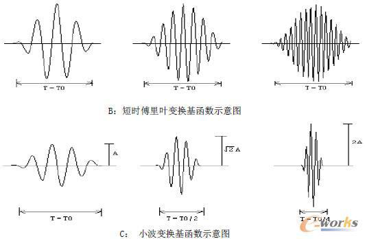
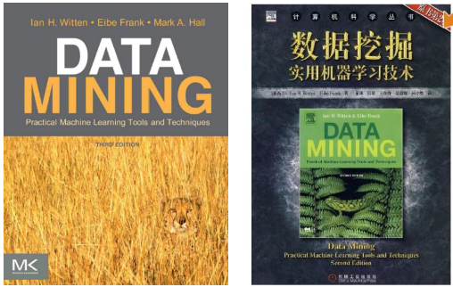
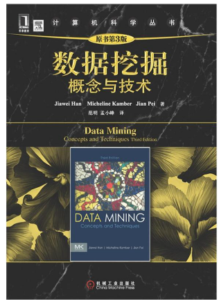
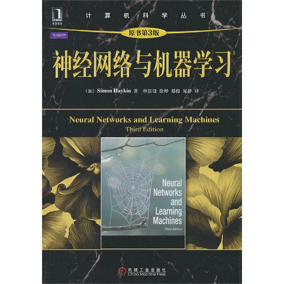
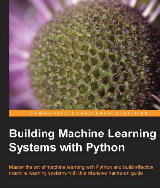
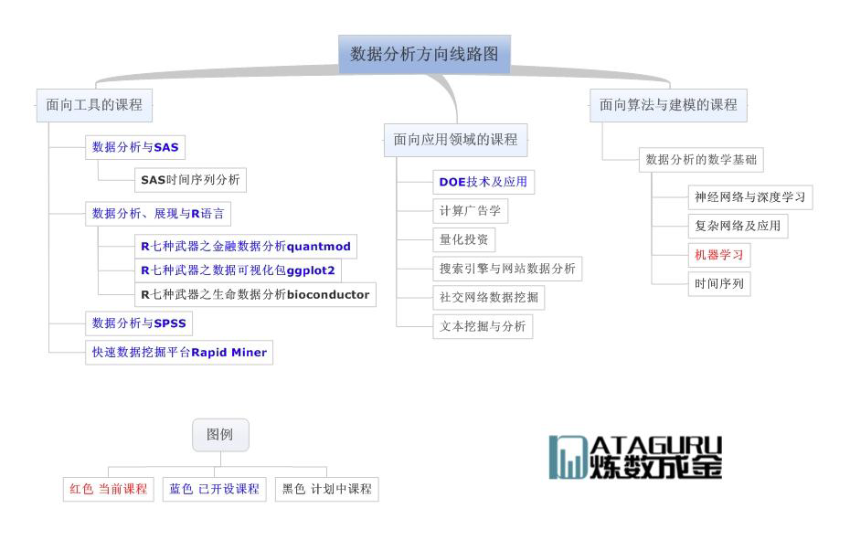
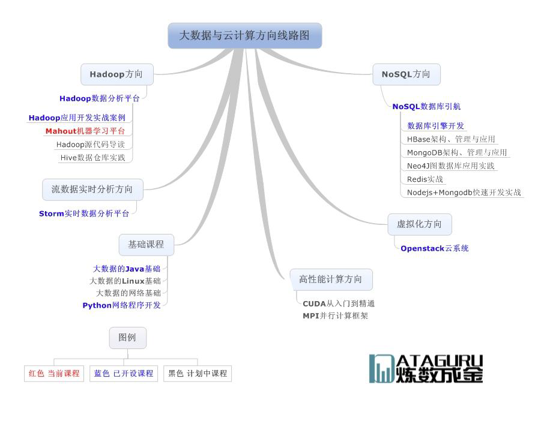
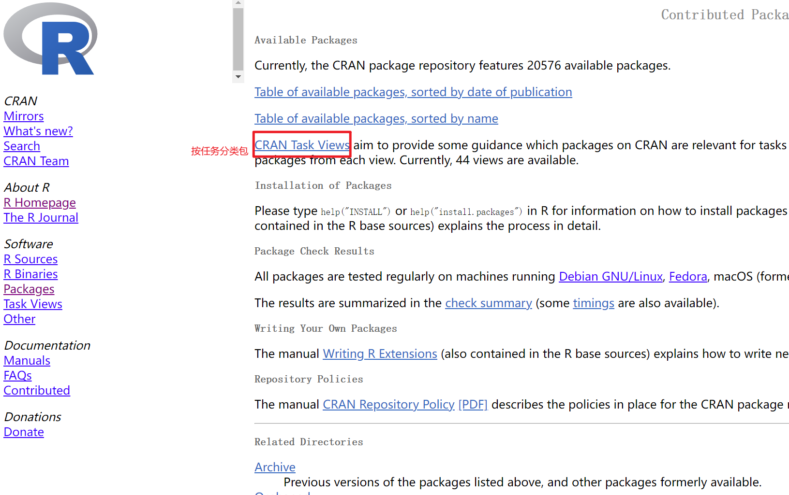
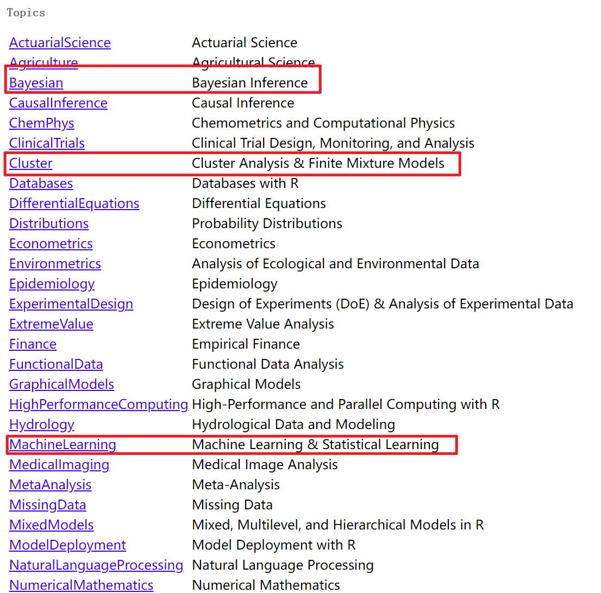

---
categories:
  - AI
tags:
  - AI
top: 7
mathjax: true
title: 0.人工智能概述
abbrlink: 1733169718
date: 2023-08-17 09:33:58
---

> 参考：
>
> [极客时间——人工智能基础课](http://gk.link/a/128vk)
>
> [白板机器学习]
>
> 统计学习方法——李航
>
> 炼数成金-机器学习：黄志洪

<!--more-->

李航、邱锡鹏、李沐、王树森的书更像是功(术)法合集，它告诉你面对一些经典任务，什么样的功法是最好的，这些功法从什么样的角度解决这些任务，应该怎么修炼

而周志华的西瓜书，更像是一种心(道)法。他回答为什么这些功法能有效解决经典任务，教会你怎么把这些功法转化为自己的内功，面对新的任务该怎么通过你的内功调动这些功法，通过打出一套功法连招能更好解决任务还是将一种功法用另一种功法的内功运行方式打出去更有效

实质上我们压根不缺术法，真正好用的道法太少了[白板也是技法吗]

## 0.1 概念

人工智能建立在以线性代数和概率论为骨架的基础数学工程上，通过简单模型的组合时限复杂功能。

工程上，深度神经网络通常以其大量的参数让人望而却步，可在理论上，其数学原理却又更好的可解释性 

### 0.1.1 学科诞生

1956年，达特茅斯会议

### 0.1.2 人工智能理解

> 让机器具有人类的智能

计算机控制+智能行为

**维纳控制论**

《人有人的用处：控制论与社会》：当图灵提出“机器可以思维吗”之问时，维纳提出了《控制论》。“控制论”主要是研究生命体系统（人、动物和机器）行为的共同本质，并以此出发，研究人和机器的交互共生的机制。

第二次机器革命：以具备人类智能为核心的机器占主导地位

- 第一次机器革命——动力系统革命

### 0.1.3 流派

#### 符号主义

> 逻辑主义、心理学派或计算机学派，通过分析人类智能的功能，然后用计算机来实现这些功能的一类方法

人工智能的早期发展遵循的是符号主义学派的发展路径，但狭窄的应用领域让它在短暂的辉煌之后迅速走向沉寂。

- 信息可以用符号来表示
- 符号可以通过显式的规则来操作

人类的认知过程可以看作符号操作过程

#### 连接主义

> 仿生学派或生理学派

连接主义通过以工程技术手段模拟人脑神经系统的结构和功能来模拟人脑形象思维的能力，也成为今天人工智能的核心技术。

- 知识存在神经元与神经元之间的连接上

**符号主义方法的一个优点是可解释性，而这也正是连接主义方法的弊端**

#### 行为主义

> 智能通过与环境的不断交互实现 

### 0.1.4 研究领域

图灵测试引导人工智能的研究方向

计算机必须具备的能力：在云端进行训练比本地更为准确

- 机器感知——计算机视觉、语音信息处理、模式识别

  理解语言——自然语言处理、通讯监控

  - 语音输入：语音转文字

  图像识别：OCR、手写文字识别、车牌识别、脸谱识别

  - 指纹识别（应用成熟）：小波分析——傅里叶展开（将）复杂波形变为规律波形

    

    小波分析更适用于高频信息，应用于信号分析使得吸取的信号更精细、压缩率更高，获得更细的细节

    当低频时，小波的基会比较宽；高频时，小波的基会变窄

  - 虹膜识别
  - OCR：难点——光照、角度
  - 脸谱识别（不是很成熟，准确率不高）

- 学习——数据挖掘、机器学习、强化学习

  机器学习实现一套工具、方法或范式，从现实世界的海量数据中提炼出有价值的知识、规则和模式，并将成果应用到前台系统，辅助业务的进行，使其达到更好的效果，如：推荐、辅助决策（沙盘推演、博弈、预测结果）、精准识别等，使业务能产生更大的效益

  - 数据挖掘

    - 基于内容的推荐系统
    - 文本挖掘
      - 垃圾邮件识别
      - 网页自动分类

  - 机器学习

    - 贝叶斯分类——判定：垃圾邮件、游戏分析（用户粘性分析->活动,优惠推送）、文本情感分析

      - 网页自动分类——自动化门户系统

        爬虫（按频道抓谷歌新闻、网易新闻->百度新闻）

        学习集，有监督学习
        
        文本分析：分词
        
        数据挖掘-贝叶斯分类：计算每个词在各个分类中的概率-先验知识
        
        搜索引擎根据用户标签类型推送不同类别的搜索结果

  - 决策树

    - 下棋：棋面标准化表示，评估分析——需要深层分析

      棋面标准化，棋谱学习：从大量棋谱中学习当前棋面下赢的概率大的操作

- 认知

  记忆——知识表示

  推理

  决策——规划

- 智慧机器

  机器人、生产线机器人

  人机对话、电脑博弈

### 0.1.5 发展历史

#### 推理期

通过人类的经验，基于逻辑或者事实归纳出来一些规则，然后通过编写程序来让计算机完成一个任务

成果：智能系统

- 几何定理证明器
- 语言翻译器

#### 知识期

到了20 世纪70 年代，研究者意识到知识对于人工智能系统的重要性．特别是对于一些复杂的任务，需要专家来构建知识库

**专家系统**
可以简单理解为“知识库+ 推理机”，是一类具有专门知识和经验的计算机智能程序系统

三要素

- 领域专家级知识
- 模拟专家思维
- 达到专家级的水平

**瓶颈**

对于人类的很多智能行为（比如语言理解、图像理解等），我们很难知道其中的原理，也无法描述这些智能行为背后的“知识” 

#### 学习期

机器学习的主要目的是设计和分析一些学习算法，让计算机可以从数据（经验）中自动分析并获得规律，之后利用学习到的
规律对未知数据进行预测，从而帮助人们完成一些特定任务，提高开发效率．机器学习的研究内容也十分广泛，涉及线性代数、概率论、统计学、数学优化、计算复杂性等多门学科．在人工智能领域，机器学习从一开始就是一个重要的研究方向．但直到1980 年后，机器学习因其在很多领域的出色表现，才逐渐成为热门学科

- 模式识别——信号分析处理
- 自然语言理解
- 计算机视觉

## 0.2 学习模块

### 0.2.1 数学

- [x] 高等数学
- [x] 线性代数
- [x] 概率论
- [x] 最优化方法
- [x] 信息论
- [x] 形式逻辑

### 0.2.2 机器学习

**机器学习的作用是从数据中习得学习算法，进而解决实际的应用问题**  

监督学习

- 判别方法
  - [x] 线性回归
  - [x] 逻辑回归
  - [ ] 决策树
  - [x] 感知机

- 生成方法

  - [x] SVM

无监督学习

- [ ] 聚类分析
- [ ] 降维

### 0.2.3 人工神经网络

神经网络将认知科学引入机器学习当中，以模拟生物神经系统对真实世界的交互反应，取得了良好的效果

- 多层神经网络
- 前馈与反向传播
- 自组织神经网络

### 0.2.4 深度学习

> 邱锡鹏NNDL

神经网络：一种以神经元为基本单元的模型

深度学习：一类机器学习问题，主要解决 **贡献度分配问题**

知识结构

学习路线

- 机器学习

  回归

  - 线性回归
  - 曲线拟合

- 有监督学习

  线性分类器

  - 感知器
  - 逻辑斯蒂回归
  - softmax回归

  非线性分类器(神经网络)

  - 前馈网络
  - 卷积网络
  - 循环网络
  - 注意力机制
  - 图神经网络

  网络的优化与正则化

- 无监督学习

  聚类

  降维

  - PCA
  - 自编码器

  密度估计

  - 参数化方法
  - 非参数方法

- 概率图

  基本结构：有向图+无向图

  - 学习阶段：模型，学习，推断

  深度生成网络

  - VAE
  - GAN

  序列生成网络

- 强化学习

关键因素：数据爆炸+算力提升

- 深度前馈网络
- 深度学习中的正则化
- 自动编码器

### 0.2.5 神经网络实例

深度学习框架下，一些神经网络已经用于各种应用场景，并取得了不俗的效果。

- 卷积神经网络
- 递归神经网络
- 深度信念网络

### 0.2.6 深度学习之外的人工智能

- 马尔可夫随机场
- 迁移学习
- 集群智能

### 0.2.7 应用实例

除代替人类执行重复性的劳动，在诸多实际问题中，人工智能也提供了有意义的尝试

- 计算机视觉
- 语音识别
- 对话系统

### 0.2.8 深度学习框架

- 简易和快速的原型设计
- 自动梯度计算
- 无缝CPU和GPU切换
- 分布式计算

## 0.3 学习资源

频率派：统计机器学习

贝叶斯派：概率图模型PRML

### 李航统计学习

监督学习

- 生成模型

  感知机

  朴素贝叶斯

- 判别模型 

  决策树

  逻辑斯蒂回归

  SVM

无监督学习

- k近邻

- 聚类分析

  K近邻

  EM
  
  降维

集成学习

- Boosting
- Bagging

隐马尔科夫模型

条件随机场

### 炼数成金——黄志洪

> 2014年的课，太旧了，但第一章应用概述挺好的，认清ML在整个计算机中的位置，适合学过一遍总结思路

### DL——李宏毅

CNN

RNN

ML2017

MLDS2018优化

### 吴恩达

CS229 2017

### 台大——林轩田

ML基石——理论，正则化，线性模型

ML技法

- SVM
- 决策树
- 随机森林
- 神经网络

### 徐亦达

概率模型

github notes

### 张志华

机器学习导论：频率派

统计ML：贝叶斯

- 偏数学，推导多

### PRML

分类

回归

神经网络

核方法

稀疏和积

图

混合模型

近似算法

采样

连续型随机变量

顺序数据

组合模型

### 书

**ML原理**

**ML的Python构建** 

### 顶会论文

- NeurIPS、ICLR、ICML、AAAI、IJCAI
- ACL、EMNLP
- CVPR、ICCV

## 0.4 应用领域

**人工智能**

- 传统AI——用工程方法制造智能系统(机器)
- 计算神经学——如何模拟人脑

**模式识别**

- 问题识别
- 图像识别
- 语音识别
- 生物特征识别
- 基因解码

**机器学习** 学习数学模型，关注算法有效性

- 统计学习：统计推理，贝叶斯推理

- 深度学习：通过神经网络拟合复杂关系

- 分支

  信息检索

  CV

  NLP

**数据挖掘**

- 数据库：数据存储（海量数据）
- ML：用ML算法分析海量数据

**ML的工程应用**

## 0.5 开源机器学习软件

实验：matlab最灵活了（但是正版很贵）

更为前途的是python（numpy+scipy+matplotlib)和C/C++，这样组合既可搞研究，也可搞商业开发，易用性不比matlab差，功能组合更为强大

1. 机器学习开源软件网（收录了各种机器学习的各种编程语言学术与商业的开源软件）[http://mloss.org](http://mloss.org/)

2. 偶尔找到的机器学习资源网：（也非常全，1和2基本收录了所有ML的经典开源软件了）

   http://www.dmoz.org/Computers/Artificial_Intelligence/Machine_Learning/Software/

3. scikit（一个基于python的机器学习软件，代码写得非常好，而且官方的文档非常全，所有都有例子，算法也齐全，开发也活跃）

   http://scikit-learn.org/stable/

4. libsvm （支持向量机界最牛的，不用多说了，台湾大学的林教授的杰作）

   http://www.csie.ntu.edu.tw/~cjlin/libsvm/

5. NLTK(PYTHON的自然处理开源库，非常易用，也强大，还有几本orelly的经典教程）

   http://nltk.org/

6. OpenCv(最牛的开源计算机视觉库了，前途无可限量，做图像处理与模式识别的一定要用，总不能整天抱着matlab做实验和工业界脱节吧，但是有一定难度)

   http://opencv.willowgarage.com/wiki/

7. Orange (基于c++和python接口的机器学习软件，界面漂亮，调用方便,可以同时学习C＋＋和python，还有可视化的功能，）

   http://orange.biolab.si/

8. WEKA （基于java的机器学习算法最全面最易用的开源软件）

   [http://www.cs.waikato.ac.nz/ml/**weka**/](http://www.cs.waikato.ac.nz/ml/weka/)

9. Mallet (基于JAVA实现的机器学习库，主要用于自然语言处理方面，特色是马尔可夫模型和随机域做得好，可和WEKA互补）

   http://mallet.cs.umass.edu/

10. lucene(基于java的包括nutch,solr,hadoop,mahout等全套，是做信息检索和搜索引擎的同志们必学的开源软件了，学JAVA的必学）

    http://lucene.apache.org/

### 0.5.1 R

R语言是S语言的一种实现

S语言是贝尔实验室开发的一种数据探索、统计分析、作图的解释型语言，只是一种语法规范

S-Plus是S语言的商业软件，奥克兰大学开发了R语言，二者有一定的兼容性，语法是一模一样的

R是一套完整的数据处理、计算和制图软件系统，用于统计分析、绘图的语言和操作环境。其功能包括：

- 数据存储和处理系统；
- 数组运算工具（其向量、矩阵运算斱面功能尤其强大）；
- 完整连贯的统计分析工具；
- 优统计制图；
- 简便而强大的编程语言：可操纵数据的输入和输入，可实现分支、循环，用户可自定义功能。

R有上千个扩展包

> 有些算法是没有实现的，如：神经网络、频繁模式挖掘都没有实现

[官网](https://www.r-project.org/) 

[镜像](https://mirrors.tuna.tsinghua.edu.cn/CRAN/) 

[按需安装环境](https://mirrors.tuna.tsinghua.edu.cn/CRAN/web/views/)

### 0.5.2 Python

- NumPy
- SciPy
- Matplotlib
- Pandas

通用工具语言

- 写脚本
- 网络爬虫
- 网络工具
- 网站

模块粘和性强，不同模块可以用不同的语言实现

- 性能不是特别好

**适合用于快速的原型开发**

### 0.5.3 MATLAB

matrix+laboratory：便于做矩阵运算

三大数学软件：MATLAB、Mathematica、Maple

- 数值计算
- 矩阵运算
- 函数绘制
- 用户界面
- 连接其他编程语言
- 具有功能完备强大的神经网络包

用于工程计算、控制设计、信号处理、金融建模设计与分析

### 0.5.4 WEKA

Waikato Environment for Knowledge Analysis

免费开源非商业化，基于JAVA环境的机器学习与数据挖掘软件

新西兰的 Waikato大学

特点：图形化

Petaho：http://community.pentaho.com/projects/data-mining/

将ML和DM相关的项目整合为一个完备的解决方案，数据挖掘工具用到Weka

## 0.6 AI 2.0思考

2023年是AIGC应用元年，ChatGPT发布之前，所有的机器学习都属于判别式模型(强化学习不太确定，待学)，ChatGPT的出现，各行各业都在积极拥抱生成式AI，也就是常说的大模型时代。且 AIG（通用人工智能）将在2030年前实现（OpenAI CEO）

以下来源于百度智能云讲座的一些感悟：大模型应用到企业数智化转型

先介绍大模型的整体架构：

- 算力层：异构芯片组成的算力池
- 框架层：模型与算力的调度
- 模型层：通用生成式大模型，向上层提供服务
- 应用层：利用模型层服务toC

以数据视角，看大模型如何融入数智化转型

随着数字化的推进，在传统的业务系统中，会产生大量的结构化、半结构化、非结构化数据，这些数据首先会经过 **数据清洗** ，集成为柔性、可运营的数据。

通过数据挖掘等实现对数据全量价值的智能解读，形成知识。在大模型中，应用自然语言智能化组织、处理知识，形成知识图谱。并通过代理工具，实现对这些知识的获取。

再上一层，通过集成智能化能力，实现对原有系统的智能化重构

这个过程中，大模型 **重构了信息的交互方式**

- 人和信息
- 人和数据：自然语言处理，获取数据知识
- 人和系统：改变与信息系统交互方式，以助手形式存在

上述过程需要 **智能算力模块提供的算力支持** 
