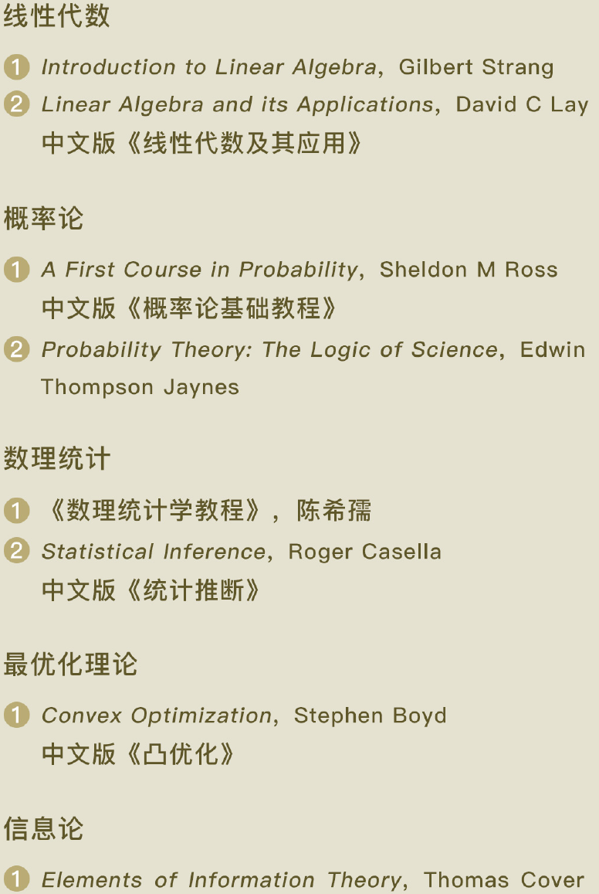
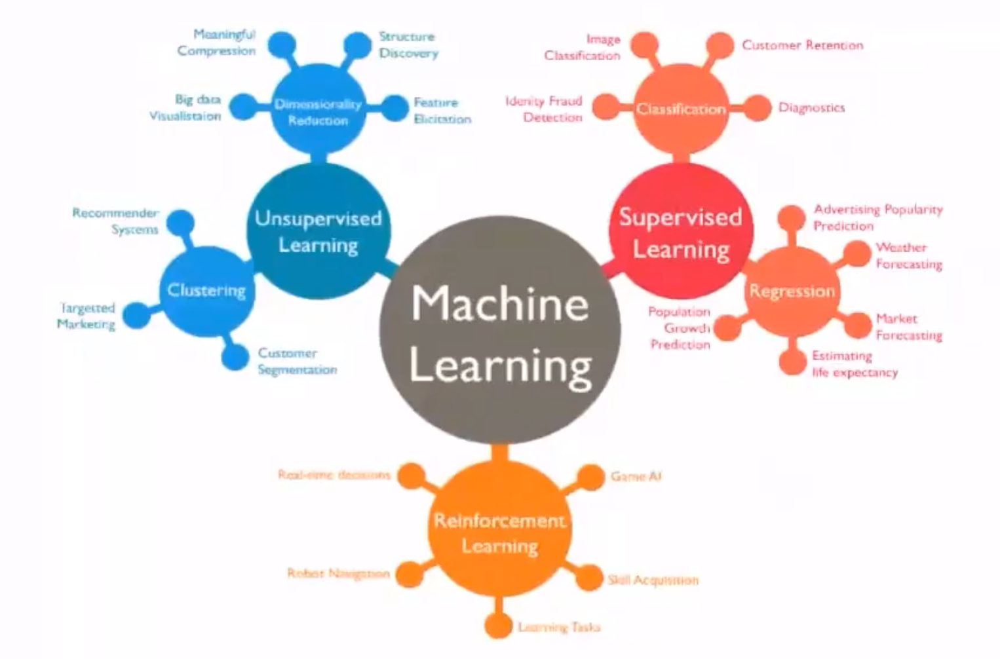

---
categories:
	- AI
tags:
  - AI
top: 7
mathjax: true
title: 0.人工智能概述
abbrlink: 1733169718
date: 2023-08-17 09:33:58
---

> 参考：
>
> [极客时间——人工智能基础课](http://gk.link/a/128vk)
>
> [白板机器学习]
>
> 统计学习方法——李航

<!--more-->

人工智能本质上是一种劳动工具，但当劳动工具本身强大到反客为主时，作为劳动者的人类便成为了多余的角色，有降格为“亚人工智能”的风险。解决方案：

- 专精于依赖创造力的领域，如科学与艺术，但对天赋要求极高，不适合每一个人
- 掌握核心技术，让人工智能回归 "为我所用"  的工具性

## 0.1 概念

人工智能建立在以线性代数和概率论为骨架的基础数学工程上，通过简单模型的组合时限复杂功能。

工程上，深度神经网络通常以其大量的参数让人望而却步，可在理论上，其数学原理却又更好的可解释性 

### 0.1.1 发展

人工智能的早期发展遵循的是符号主义学派的发展路径，但狭窄的应用领域让它在短暂的辉煌之后迅速走向沉寂。

连接主义通过以工程技术手段模拟人脑神经系统的结构和功能来模拟人脑形象思维的能力，也成为今天人工智能的核心技术。

## 0.2 学习模块

### 0.2.1 数学

- [x] 高等数学
- [x] 线性代数
- [x] 概率论
- [x] 最优化方法
- [x] 信息论
- [x] 形式逻辑

### 0.2.2 机器学习

**机器学习的作用是从数据中习得学习算法，进而解决实际的应用问题**  

监督学习

- 判别方法

  线性回归

  逻辑回归

  决策树

- 生成方法

  SVM

无监督学习

- 聚类分析
- 降维

### 0.2.3 人工神经网络

神经网络将认知科学引入机器学习当中，以模拟生物神经系统对真实世界的交互反应，取得了良好的效果

- 多层神经网络
- 前馈与反向传播
- 自组织神经网络

### 0.2.4 深度学习

深度学习就是包含多个中间层的神经网络

关键因素：数据爆炸+算力提升

- 深度前馈网络
- 深度学习中的正则化
- 自动编码器

### 0.2.5 神经网络实例

深度学习框架下，一些神经网络已经用于各种应用场景，并取得了不俗的效果。

- 卷积神经网络
- 递归神经网络
- 深度信念网络

### 0.2.6 深度学习之外的人工智能

- 马尔可夫随机场
- 迁移学习
- 集群智能

### 0.2.7 应用实例

除代替人类执行重复性的劳动，在诸多实际问题中，人工智能也提供了有意义的尝试

- 计算机视觉
- 语音识别
- 对话系统

## 0.3 学习资源

频率派：统计机器学习

贝叶斯派：概率图模型PRML

### 李航统计学习

监督学习

- 生成模型

  感知机

  朴素贝叶斯

- 判别模型 

  决策树

  逻辑斯蒂回归

  SVM

无监督学习

- k近邻

- 聚类分析

  K近邻

  EM
  
  降维

集成学习

- Boosting
- Bagging

隐马尔科夫模型

条件随机场

### PRML 

分类

回归

神经网络

核方法

稀疏和积

图

混合模型

近似算法

采样

连续型随机变量

顺序数据

组合模型

### 台大——林轩田

ML基石——理论，正则化，线性模型

ML技法

- SVM
- 决策树
- 随机森林
- 神经网络

### 张志华

机器学习导论：频率派

统计ML：贝叶斯

- 偏数学，推导多

### 吴恩达

CS229 2017

### 徐亦达

概率模型

github notes

### DL——李宏毅

CNN

RNN

ML2017

MLDS2018优化

## 0.4 应用领域

**人工智能**

- 传统AI——用工程方法制造智能系统(机器)
- 计算神经学——如何模拟人脑

**模式识别**

- 问题识别
- 图像识别
- 语音识别
- 生物特征识别
- 基因解码

**机器学习** 学习数学模型，关注算法有效性

- 统计学习：统计推理，贝叶斯推理

- 深度学习：通过神经网络拟合复杂关系

- 分支

  信息检索

  CV

  NLP

**数据挖掘**

- 数据库：数据存储（海量数据）
- ML：用ML算法分析海量数据

