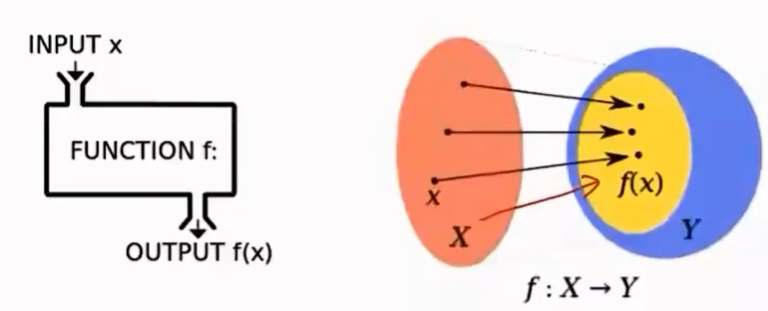
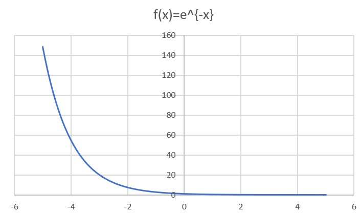

---
categories:
  - AI
  - 数学基础
tags:
  - AI
  - 数学基础
mathjax: true
title: 1.高数
abbrlink: 2545385996
date: 2023-07-24 09:29:55
---

> 参考：https://www.bilibili.com/video/BV1mM411r7ko?p=1&vd_source=260d5bbbf395fd4a9b3e978c7abde437
>
> 唐宇迪：机器学习数学基础

[TOC]

<!--more-->

## 1.1 函数

> 表示量与量之间的关系：$A=\pi r^2$ 
>
> 一组输入输出关系：一组输入唯一对应一组输出

$$
y=f(x)\left\{
\begin{aligned}
&x:自变量\\
&y_0=y\vert_{x=x_0}=f(x_0)
\end{aligned}
\right.
$$

### 1.1.1 函数分类

**输入是否与时间有关**

- 是：动态函数
- 否：静态函数

**输入是否为标量**

- 是：一元函数
- 否：多元函数

### 1.1.2 常见函数

#### 指/对数函数

$f(x)=e^x$

$f(x)=log(x)$

#### 分段函数

$$
f(x)=\left\{
\begin{aligned}
&\sqrt{x}&,x\ge0\\
&-\sqrt{x}&,x<0
\end{aligned}
\right.
$$

#### 原函数&反函数

原函数 $h=h(t)$ ：$h=\frac{1}{2}gt^2$

反函数 $t=t(h)$ ：$t=\sqrt{\frac{2h}{g}}\quad/\quad t=-\sqrt{\frac{2h}{g}}(需要附加条件，才能确定具体反函数)$ 

#### sigmod函数

$s(x)=\frac{1}{1+e^{-x}}=\frac{e^x}{e^x+1}，x\in (-\infty,+\infty),y\in (0,1)$  

#### Relu函数(非负函数)

$f(x)=x^+=max\{0,x\}$

- 无梯度消失问题

#### 复合函数

$(g\circ f)(x)$ 表示 $g(f(x))$ ——通道

向量到张量

$\vec{a}=\left(\begin{aligned}\sigma_1\\\sigma_2\\\sigma_3\end{aligned}\right),\vec{b}=\left(\sigma_1',\sigma_2',\sigma_3'\right)$ 

张量：
$$
\sigma=\vec{a}\otimes \vec{b}=\left(
\begin{matrix}
\sigma_{11'}&\sigma_{12'}&\sigma_{13'}\\
\sigma_{21'}&\sigma_{22'}&\sigma_{23'}\\
\sigma_{31'}&\sigma_{32'}&\sigma_{33'}
\end{matrix}
\right)
$$

### 1.1.3 性质

**奇偶性**

- 关于y轴对称，$f(x)=f(-x)$ ，偶函数
- 关于原点对称，$f(-x)=-f(x)$，奇函数

**周期性**

$f(x+T)=f(x)$

**单调性**

## 1.2 极限

### 1.2.1 数列极限

$a_n$ 同项

- 等差数列：$a_n=a_1+(n-1)q$ ，$S_n=na_1+\frac{n(n-1)q}{2}$

- 等比数列：$a_n=a_1q$ ，$S_n=\frac{a_1-a_nq}{1-q}=\frac{a_1(1-q^n)}{1-q}$

当

数列的收敛表示为：

$\lim_\limits{n\rightarrow \infty} a_n=A$ 或 $a_n\rightarrow A(n\rightarrow \infty)$

eg:

$\lim_\limits{n\rightarrow \infty}\frac{1}{3^n}=0$ ,$\lim_\limits{n\rightarrow \infty}=\frac{n}{n+1}=1$

$\lim_\limits{n\rightarrow \infty}2^n=\infty$ 发散

### 1.2.2 函数极限

$\lim_\limits{x\rightarrow +\infty}e^{-x}=0$ 

$\lim_\limits{x\rightarrow +\infty}\frac{1}{x}=0$ 

$\lim_\limits{x\rightarrow +\infty}arctanx=\frac{\pi}{2}$

#### 极限定义

**左右极限**

函数在左半邻域 $(x_0-\sigma,x_0)$，右半邻域 $(x_0,x_0+\sigma)$ 有定义

左极限：$\lim_\limits{x\rightarrow x_0^-}f(x)=A$ / $f(x)\rightarrow A(x\rightarrow x_0^-)$ / $f(x-x_0)=A$

右极限：$\lim_\limits{x\rightarrow x_0^+}f(x)=A$ / $f(x)\rightarrow A(x\rightarrow x_0^+)$ / $f(x+x_0)=A$

**极限**

> 函数在 $x_0$ 的邻域内有定义，且左极限=右极限 $\lim_\limits{x\rightarrow x_0}f(x)=A$ 或 $f(x)\rightarrow A(x\rightarrow x_0)$

充要条件：$\lim_\limits{x\rightarrow x_0^-}f(x)=\lim_\limits{x\rightarrow x_0^+}f(x)=A$

eg：
$$
f(x)=\left\{
\begin{aligned}
&x-1&,x<0\\
&0&,x=0\\
&x+1&,x>0
\end{aligned}
\right.
$$
 由于 $\lim_\limits{x\rightarrow 0^-}f(x)=-1\neq \lim_\limits{x\rightarrow 0^+}f(x)=1$ ，故 $\lim_\limits{x\rightarrow 0}f(x)$ 不存在

### 1.2.3 无穷大

表示无限增大，没有上界（收敛点）

无穷大与无穷小关系：在x的同一变换过程中， $f(x)=\infty\Rightarrow \frac{1}{f(x)}=0$

### 1.2.4 无穷小

以零为极限（$x\rightarrow a$ 时，$\lim_\limits{x\rightarrow a}f(x)=0$）

**性质** ：

- 有限个无穷小的和、积是无穷小

  无穷小个无穷小未必是无穷小

  - $\lim_\limits{n\rightarrow \infty}\frac{1}{n^2}+\frac{2}{n^2}+\cdots+\frac{n}{n^2}=\lim_\limits{n\rightarrow \infty}\frac{\frac{n(n+1)}{2}}{n^2}=\frac{1}{2}$

- 有界变量x无穷小 $\iff$ 无穷小

- 无穷小的商未必无穷小

  $\lim_\limits{x\rightarrow 0}\frac{x}{2x}=\frac{1}{2}$ ，$\lim_\limits{x\rightarrow 0}\frac{2x}{x^2}=\infty$

- 极限有无穷小的充要条件：$\lim_\limits{x\rightarrow x_0}f(x)=A\iff A+\alpha(x)$ ，$\alpha(x)$ 为 $x\rightarrow x_0$ 时的无穷小

**无穷小比较**

$\alpha(x),\beta(x)$ 为无穷小

- $\lim_\limits{x\rightarrow x_0}\frac{\beta(x)}{\alpha(x)}=0,\beta(x)为\alpha(x)的高阶无穷小$
- $\lim_\limits{x\rightarrow x_0}\frac{\beta(x)}{\alpha(x)}=\infty,\beta(x)为\alpha(x)的低阶无穷小$
- $\lim_\limits{x\rightarrow x_0} \frac{\beta(x)}{\alpha(x)}=C\neq 0,\beta(x)与\alpha(x)为同阶无穷小$

### 1.2.5 连续性

设 $f(x)$ 在x的邻域内有定义，当 $\Delta x\rightarrow0$ ，有 $\Delta y\rightarrow 0$，则 $f(x)$ 在 $x_0$ 处连续，$\lim_\limits{\Delta x\rightarrow 0}\Delta y=\lim_\limits{\Delta x\rightarrow0}(f(x+\Delta x)-f(x))=0$

函数 $f(x)$ 在 $x_0$ 处连续，三个条件都满足 ：

- 在 $x_0$ 处有定义
- $\lim_\limits{x\rightarrow x_0}f(x)$ 存在
- $\lim_\limits{x\rightarrow x_0}f(x)=f(x_0)$ 极限=函数值

### 1.2.6 间断点

$f(x)$ 在 $x=x_0$ 处不连续，则 $x_0$ 处为 $f(x)$ 的间断点，以下条件满足一个即为间断点

- $f(x)$ 在 $x_0$ 处无定义
- $\lim_\limits{x\rightarrow x_0}f(x)$ 不存在
- $\lim_\limits{x\rightarrow x_0}f(x)\neq f(x_0)$   

**分类**

第一类间断点：$x\rightarrow x_0$ 时，$f(x)$ 左右极限都存在

- 跳跃间断点：$f(x_0-0)$ 与 $f(x_0+0)$ 都存在但不相同
- 可去间断点：$\lim_\limits{x\rightarrow x_0}f(x)$ 存在但 $\neq f(x_0)$

第二类间断点：至少一侧极限不存在

eg：

$f(x)=\frac{x^2-1}{x^2-3x+2}$ ，在 $x=1,2$ 处无定义，故不连续

$\lim_\limits{x\rightarrow 1^+}f(x)=\lim_\limits{x\rightarrow 1^+}\frac{x+1}{x-2}=-2$ ，$\lim_\limits{x\rightarrow 1^-}f(x)=\lim_\limits{x\rightarrow 1^-}\frac{x+1}{x-2}=-2$ ，所以 $x=1$ 为可去间断点

$\lim_\limits{x\rightarrow 2^-}f(x)=\lim_\limits{x\rightarrow 2^-}\frac{x+1}{x-2}=-\infty$ ，$\lim_\limits{x\rightarrow 2^+}f(x)=\lim_\limits{x\rightarrow 2^+}\frac{x+1}{x-2}=+\infty$ ，所以 $x=2$ 为第二类间断点

## 1.3 导数

> 表示平均变化率的极限 ，$\lim_\limits{\Delta x\rightarrow 0}\frac{\Delta y}{\Delta x}=\lim_\limits{\Delta x\rightarrow 0}\frac{f(x_0+\Delta x)-f(x_0)}{\Delta x}$ ，记为 $f'(x)$

### 1.3.1 运算律

$(u\pm v)'=u'\pm v'$

$(\frac{u}{v})'=\frac{u'v-uv'}{v^2}(v\neq 0)$

$(uv)'=u'v+uv'$

$(cu)'=cu'$

$(\frac{c}{v})'=-\frac{cv'}{v^2}$

### 1.3.2 导数的几何意义

$\lim_\limits{\Delta x\rightarrow 0}\frac{\Delta y}{\Delta x}$

### 1.3.3 可微

$y=f(x)$ 在 $x_0$ 的某邻域内有定义，$x+\Delta x\in (x_0-\sigma,x_0+\sigma)$ ，若 $\Delta y=f(x_0+\Delta x)-f(x_0)$ 可表示为 $\Delta y=A\Delta x+o(x)$ ，则称 $y=f(x)$ 在 $x_0$ 处可微，记为 $dy=A\Delta x$

几何意义：

- dy：切线上纵坐标的增量

若 $y=f(x)$ 可微，则有 $\Delta y-dy=o(\Delta x)$ 

### 1.3.4 二元函数的导数

一元函数的导数：$y=f(x)$ ，$y'(x)=f'(x)$ ，只随一个变量x变化

二元函数导数：$z=f(x,y)$ ，$z=\left\{\begin{aligned}&随x变\\&随y变\\&随x,y变\end{aligned}\right.$

#### 偏导(随一个变量变)

$z=f(x,y)$ 在 $(x_0,y_0)$ 的某个邻域内有定义，$y=y_0$ 时，$f(x,y_0)$ 在 $x=x_0$ 处可导，即 $\lim_\limits{\Delta x\rightarrow x_0}\frac{f(x_0+\Delta x,y_0)-f(x_0,y_0)}{\Delta x}=A$ ，则 $z=f(x,y)$ 在 $(x_0,y_0)$ 处关于 $x$ 的偏导为 $A$ 。记为 $f_x(x_0,y_0)$ ， $\frac{\partial z}{\partial x}\vert_{y=y_0,x=x_0}$ 

**$\frac{\partial u}{\partial x}\vert_{x=x_0}$几何意义**

 曲线 $\Gamma:\left\{\begin{aligned}&z=f(x,y)\\&x=x_0\end{aligned}\right.$ 在 $x=x_0$ 处的切线：

- $\Gamma$ ：平面 $\Pi$($x=x_0$)与 $z=f(x,y)$ 交线为 $\Gamma$ 

随 $y$ 的不同取值，斜率有不同取值

**eg** 

$f(x,y)=x^2+3xy+y^2$ ，在 $(1,2)$ 处偏导，$f_x=2x+3y$ ，$f_y=3x+2y$ ，$f_x(1,2)=8$ 

$y(x)\vert_{y=2}=f(x,2)=x^2+6x+2,y'(x)=2x+6,y'(1)=8$  

#### 方向导(沿方向向量)

**方向**

$u=f(x,y,z)$ 在 $D\in R^3$ 内有定义，$R^3$ 内有一个确定点 $P_0(x_0,y_0,z_0)$ 和一个动点 $P(x,y,z)$ 确定方向向量 $\vec{l}=(a,b,c)\xRightarrow{单位化}\vec{l^0}=\left(\frac{a}{\sqrt{a^2+b^2+c^2}},\frac{b}{\sqrt{a^2+b^2+c^2}},\frac{c}{\sqrt{a^2+b^2+c^2}}\right)=(cos\alpha,cos\beta,cos\gamma)$ 

方向向量 $\vec{l}=\vec{P_0P}=(x-x_0,y-y_0,z-z_0)$ ，模长 $\vert \vec{l}\vert=\vert P_0P\vert=\sqrt{\Delta x^2,\Delta y^2,\Delta z^2}=t$ 

**方向余弦** 

$$
\left\{
\begin{aligned}
&cos\alpha=\frac{\Delta x}{t}=\frac{x-x_0}{\sqrt{(x-x_0)^2+(y-y_0)^2+(z-z_0)^2}}\\
&cos\beta=\frac{\Delta y}{t}=\frac{y-y_0}{\sqrt{(x-x_0)^2+(y-y_0)^2+(z-z_0)^2}}\\
&cos\gamma=\frac{\Delta z}{t}=\frac{z-z_0}{\sqrt{(x-x_0)^2+(y-y_0)^2+(z-z_0)^2}}
\end{aligned}
\right.
$$
**方向导**

$\lim_\limits{\Delta 自变量\rightarrow 0}=\frac{\Delta 因变量}{\Delta 自变量}$ 

若 $\lim_\limits{\Delta l\rightarrow 0}\frac{f(x_0+\Delta lcos\alpha,y_0+\Delta lcos\beta,z_0+\Delta lcos\gamma)-f(x_0,y_0,z_0)}{\Delta l}$ 存在，则称其为 $u=f(x,y,z)$ 在 $P(x_0,y_0,z_0)$ 沿 $\vec{e_l}$ 方向的方向导数，记为 $\frac{\partial u}{\partial l}\vert_{P_0}$ ，$\frac{\partial f}{\partial l}\vert_{P_0}$

**方向导几何意义** 

曲线 $\Gamma$ 在 $P(x_0,y_0)$ 处切线

- $\Gamma$ ：过方向向量 $\vec{e_l}=\left(\frac{x-x_0}{\sqrt{(x-x_0)^2+(y-y_0)^2}},\frac{y-y_0}{\sqrt{(x-x_0)^2+(y-y_0)^2}}\right)$ 做 $xoy$ 面的垂面 $\Pi$ 与 $u=f(x,y,z)$ 有交线 $\Gamma$ 

  

 $P(x,y)$ 沿 $\vec{e_l}$ 变化，对应不同的坐标点 P，方向导为 $z=f(x,y)$ 在 $P_0$ 点切线

**特殊方向导** 

沿 $x$ 轴方向 $\vec{e_l}=(1,0)$ ，$\frac{\partial f}{\partial l}=\lim_\limits{\Delta l\rightarrow 0}\frac{f(x_0+\Delta x,y_0)-f(x_0,y_0)}{\sqrt{\Delta x^2}}=f_x(x_0,y_0)$ 

沿 $y$ 轴方向 $\vec{e_l}=(0,1)$ ，$\frac{\partial f}{\partial l}=\lim_\limits{\Delta l\rightarrow 0}\frac{f(x_0,y_0+\Delta y)-f(x_0,y_0)}{\sqrt{\Delta y^2}}=f_y(x_0,y_0)$ 

**方向导计算**

若 $u=f(x,y)$ 在 $P_0(x_0,y_0)$ 处可微，则 $f$ 在 $P_0$ 处沿任一方向导都存在，且有 
$$
\begin{aligned}
\frac{\partial f}{\partial l}&=\frac{\partial u}{\partial x}cos\alpha+\frac{\partial u}{\partial y}cos\beta\\
&=\left(\frac{\partial u}{\partial x},\frac{\partial u}{\partial y}\right)\left(cos\alpha,cos\beta\right)\\
&=(grad\quad u)\vec{e_l}=\bigtriangledown f\cdot\vec{e_l}=\vert \bigtriangledown f\vert\cdot\vert \vec{e_l}\vert\cdot cos\theta
\end{aligned}
$$
 eg：

求 $z=xe^{2y}$ 在 $P(1,0)$ 处沿 $P(1,0)$ 到 $Q(2,-1)$ 方向的方向导

$\vec{l}=\overrightarrow{PQ}=(1,-1)$ ，方向向量 $\vec{e_l}=\left(\frac{\sqrt{2}}{2},-\frac{\sqrt{2}}{2}\right)$  ，方向余弦 $cos\alpha=\frac{\sqrt{2}}{2},cos\beta=-\frac{\sqrt{2}}{2}$

$\frac{\partial z}{\partial l}=\frac{\partial z}{\partial x}cos\alpha+\frac{\partial z}{\partial y}cos\beta=\frac{\sqrt{2}}{2}\frac{\partial z}{\partial x}-\frac{\sqrt{2}}{2}\frac{\partial z}{\partial y}=\frac{\sqrt{2}}{2}e^{2y}-\frac{\sqrt{2}}{2}2xe^{2y}=\frac{\sqrt{2}}{2}e^{2y}(1-2x)$

在 $P(1,0)$ 的方向导为 $\frac{\partial z}{\partial l}\vert_{(1,0)}=-\frac{\sqrt{2}}{2}$

### 1.3.5 梯度 gradient

使方向导数最大的方向向量：
$$
\left\{
\begin{aligned}
&方向：grad\quad f\vert_{P_0}=\{f_{x}'(x_0,y_0),f_y'(x_0,y_0)\}=\bigtriangledown f\vert_{P_0}\\
&大小：\vert grad\quad f\vert_{P_0}\vert=\vert \bigtriangledown f\vert_{P_0}\vert=\sqrt{[f_x'(x_0,y_0)]^2+[f_y'(x_0,y_0)]^2}
\end{aligned}
\right.
$$

- $z=f(x,y)$ 沿梯度方向递增（假设方向向量的起点为原点）

方向导：
$$
\begin{aligned}
\frac{\partial f}{\partial l}&=\frac{\partial u}{\partial x}cos\alpha+\frac{\partial u}{\partial y}cos\beta\\
&=\left(\frac{\partial u}{\partial x},\frac{\partial u}{\partial y}\right)\left(cos\alpha,cos\beta\right)\\
&=(grad\quad u)\vec{e_l}=\bigtriangledown f\cdot\vec{e_l}=\vert \bigtriangledown f\vert\cdot\vert \vec{e_l}\vert\cdot cos\theta
\end{aligned}
$$
当 $\theta=0$ 时，有 $\frac{\partial z}{\partial l}\vert_{max}=\vert \bigtriangledown f\vert$

- 某一方向上的方向到为 $\Gamma$ 的切线

- 某一点沿着不同方向有不同的方向导，方向导最大的方向为梯度方向 $\bigtriangledown f\overset{\Delta}{=}(f_x',f_y')$ ，且为 $\vert \bigtriangledown f\vert=\sqrt{(f_x')^2+(f_y')^2}$ 

- 梯度方向与 $f$ 等值线垂直

  如：$z=x^2+y^2$

  

#### 梯度下降法(方向导与极值)

找极小值：

1. 方向： $梯度反方向(-\bigtriangledown f)$ 

   

2. 大小

   

   

3. 终止条件： $\vert \bigtriangledown f\vert\le \epsilon,梯度随z下降，在最低点 \vert \bigtriangledown f\vert\approx 0$

   

- $z=f(x,y)$ 沿梯度方向递增，沿梯度反方向递减

已知导数为沿曲线 $\Gamma$ 运动的点的切线

- 方向向量：运动方向
- 方向向量 $\vec{e_l}$ 上的点：$\Gamma$ 上的点

根据可微，$-\bigtriangledown f=\frac{\Delta f}{\vec{e_l}}\iff \frac{z_1-z_0}{\vec{e_l}}=-\bigtriangledown f\Rightarrow z_1-z_0=-\bigtriangledown f\cdot \vec{e_l}=-\bigtriangledown f\Rightarrow z_1-z_0=-\bigtriangledown f$     

**eg：**

假设 $z=f(x,y)=x^2+y^2$ ，$z_0=f(1,2)$ 梯度 $\bigtriangledown f=\left(\frac{\partial z}{\partial x},\frac{\partial z}{\partial y}\right)=(2x,2y)$ 

$z_1=z_0-\bigtriangledown f\vert_{(1,2)}=f(1,2)-f(2,4)=f(-1,-2)$ 

$z_2=z_1-\bigtriangledown f\vert_{(-1,-2)}=f(-1,-2)-f(-2,-4)=f(1,2)$

...

会进入循环，所以需要引入学习率 $\eta$ 来控制步长，即 $z=z'-\eta \bigtriangledown f$ 

$\eta > 1$ ，$z$ 上升

$\eta = 1$ ，$z$ 振荡

$\eta < 1$ ，$z$ 下降。且 $\eta$ 越大，下降速度越快

- $\eta = 0.02$ 

  

- $\eta = 0.2$ 

  

eg：

有 $u=f(x,y)=x^2+2y^2$ ，$(x_0,y_0)=(-3.5,-3.5),\eta=0.1$

$$
\begin{aligned}
&\bigtriangledown f=(2x,4y),z_0=f(x_0,y_0)=f(-3.5,-3.5)\\
&z_1=f(x_1,y_1)=z_0-\eta \bigtriangledown f=f\left(\begin{aligned}-3.5\\-3.5\end{aligned}\right)-0.1f\left(\begin{aligned}-7\\-14\end{aligned}\right)=\left(\begin{aligned}-2.8\\-2.1\end{aligned}\right)\\
&z_2=f(x_2,y_2)=z_1-\eta \bigtriangledown f=f\left(\begin{aligned}-2.8\\-2.1\end{aligned}\right)-0.1f\left(\begin{aligned}-5.6\\-8.4\end{aligned}\right)=f\left(
\begin{aligned}
-2.24\\
-1.26
\end{aligned}
\right)\\
&\vdots\\
&z_{k+1}=f(x_{k+1},y_{k+1})=z_k-\eta \bigtriangledown f(x_k,y_k)
\end{aligned}
$$

## 1.4 微积分

> 用于求解速度、面积、体积等可累积量

### 1.4.1 基本思想

> 以直代曲

在 $[a,b]$ 间插入若干点，得到 $n$ 个小区间，每个小矩形面积 $A_i=f(\xi_i)\Delta x_i\Rightarrow A_{(a,b)}=\sum_\limits{i=1}^n f(\xi_i)\Delta x_i$

设 $\lambda$ 为小区间的最大值，$A=\lim_\limits{\lambda\rightarrow 0}\sum_\limits{i=1}^n f(\xi_i)\Delta x_i$

记为 $\int_{a}^b f(x)dx$ 

**微分与导数关系**

$dy$ ：切线增量

$\Delta y$ ：曲线增量

导数(切线斜率)：$f'(x)=\frac{dy}{dx}$ 

$\Delta y=dy+o(\Delta x)$

### 1.4.2 定积分

#### 定义

函数可积定义：$f(x)$ 在 $[a,b]$ 上的定积分存在时，则称 $f(x)$ 在 $[a,b]$ 可积

**几何意义**：面积A

$$
\left\{
\begin{aligned}
&f(x)>0&\int_{a}^bf(x)dx=A>0\\
&f(x)<0&\int_{a}^bf(x)dx=-A<0
\end{aligned}
\right.
$$

#### 定义计算定积分

$\int_0^1x^2dx$ ：将 $[0,1]$ n等分，分点为 $x_i=\frac{i}{n},(i=1,2,\cdots,n)$ 

小区间 $[x_{i-1},x_i]$ 的长度 $\Delta x_i=\frac{1}{n},(i=1,2,\cdots,n)$  

取 $\xi_i=x_i$ ，$\sum_\limits{i=1}^n f(\xi_i)\Delta x_i=\sum_\limits{i=1}^n\xi_i^2\Delta x_i=\sum_\limits{i=1}^n(\frac{i}{n})^2\frac{1}{n}=\frac{1}{n^3}\sum_\limits{i=1}^ni^2=\frac{1}{n^3}\frac{n(n+1)(2n+1)}{6}$

$\vert \Delta x\vert\rightarrow 0\Rightarrow n\rightarrow \infty$ ，$\lim_\limits{n\rightarrow \infty}\frac{(n+1)(2n+1)}{6n^2}=\frac{1}{3}\Rightarrow \int_0^1x^2dx=\sum_\limits{i=1}^nf(\xi_i)\Delta x_i=\frac{1}{3}$

#### 定积分性质

$\int_{a}^b[f(x)\pm g(x)]dx=\int_a^bf(x)dx\pm \int_a^bg(x)dx$ 

$\int_a^bkf(x)dx=k\int_a^bf(x)dx,(k为常数)$

$\int_a^b{f(x)}dx=\int_a^cf(x)dx+\int_c^bf(x)dx$ 

若 $[a,b]$ 上，$f(x)\ge 0\Rightarrow \int_a^bf(x)dx\ge 0,(a<b)$ 

#### 定理

积分第一中值定理：$f(x)$ 在 $[a,b]$ 上连续，则在 $[a,b]$ 上至少存在一点 $\xi$ ，使 $\int_a^b f(x)dx=f(\xi)(b-a)$ 

积分上限函数：$f(x)$ 在 $[a,b]$ 上连续，对于定积分 $\int_a^x f(x)dx$ 每个取值 $f(x)$ 有一个值 $\Phi(x)=\int_a^x f(t)dt$ 

#### N-L公式

$F(x)$ 连续且未 $f(x)$ 在 $[a,b]$ 上原函数，$\int_{a}^bf(x)dx =F(b)-F(a)$ 

**几何意义**：

$F(b)-F(a)=\sum\Delta y_i$ 

当 $\Delta x\rightarrow 0$ 时，有 $dy_i\approx \Delta y_i,F'(x)=\frac{dF(x)}{dx}=\frac{dy}{dx}$ 

$\therefore\quad F(b)-F(a)=\sum\Delta y_i=\sum dy_i=\sum f(x)dx=\int_a^bf(x)dx$

**基本公式**

$\underbrace{\int_{a}^bf(x)dx=f(\xi)(b-a)}_{积分中值定理}=\underbrace{F'(\xi)(b-a)}_{微分中值定理}=F(b)-F(a)$

#### 泰勒公式

以直代曲：多项式代替原函数

**常用泰勒公式**

当 $x\rightarrow 0$ 时，$e^x\approx 1+x$ ，$ln(1+x)\approx x$

---

$P_n(x)=f(x_0)+f'(x_0)(x-x_0)+f''(x_0)\frac{(x-x_0)^2}{2!}+f'''(x_0)\frac{(x-x_0)^3}{3!}+\cdots+f^{(n)}(x_0)\frac{(x-x_0)^n}{n!}$ 

**导数作用**

- 一阶导作用：确定上升/下降趋势

  

- 二阶导作用：确定弯曲方向（凹凸性）

  

阶越高，增长速度越快

低阶能更好描述当前点，阶越高在右侧影响越大

**阶乘作用**

在低阶，保证 $x^5,x^6$ 次项作用(高次项) $x+\frac{x^2}{2!}+\cdots+\frac{x^5}{5!}$

在高阶，保证 $x,x^2$ 次项作用（低次项）

若无阶乘，高阶压制低阶，函数呈高次项特性

如：$x^9+x^2$

引入阶乘，图像先呈现 $x^2$ 特性，再呈现 $x^9$ 特性

$x$ 小时，$\frac{1}{9!}$ 可限制 $x^9$ 项

随 $x$ 增加，$\frac{1}{9!}$ 作用变小，无法再限制 $x^9$ 

#### 麦克劳林公式

$f(x)=f(0)+f'(0)x+f''(0)\frac{x^2}{2!}+\cdots+f^{(n)}\frac{x^n}{n!}+f^{(n+1)}(\theta x)\frac{x^{(n+1)}}{(n+1)!},0<\theta < 1$ 

-  $sinx=f'(0)x-\frac{x^3}{3!}f^{(3)}(0)+\frac{x^5}{5!}f^{(5)}(0)-\cdots=x-\frac{x^3}{3!}+\frac{x^5}{5!}+\cdots+(-1)^{(n-1)}\frac{x^{(2n-1)}}{2n-1}$

  $R_{n+1}=(-1)^{n}\frac{cos(\theta x)}{(2n+1)!}x^{(2n+1)},(0<\theta < 1)$

## 1.5 求极值

### 1.5.1 无条件极值

$z=f(x,y)$ 在 $P_0$ 邻域内连续，且有一阶、二阶偏导数，求 $z$ 在邻域内的极值

**求解**：

令$f_x(x,y)=0，f_y(x,y)=0\Rightarrow P_0(x_0,y_0)$ 

令 $A=f_{xx}(x,y)\vert _{P_0}$ ，$B=f_{xy}(x,y)\vert_{P_0}$ ，$C=f_{yy}(x,y)\vert_{P_0}$ 

若

- $AC-B^2>0$ ，则 $f(x,y)$ 在 $P_0$ 处为极值点
  - $A>0$ ，则为极小值
  - $A<0$ ，则为极大值
- $AC-B^2<0$ ，则 $f(x,y)$ 在 $P_0$ 处不是极值点
- $AC-B^2=0$ ，待定

### 1.5.2 条件极值

$x,y$ 满足 $\varphi(x,y)=0\varphi(x,y)=0$ ， 求 $z=f(x,y)$ 的极值

$\varphi(x,y)=0$ 为 $xoy$ 面上的曲线，将 $\varphi(x,y)=0$ 投影到曲面 $z=f(x,y)$ 上，有曲线 $\Gamma(x,y,z)$ 。

在曲线 $\Gamma$ 上找极值点为一个无条件极值问题，故用一个独立参数 $t$ 表示曲线 $\Gamma$ 不受任何约束，即 $\left\{\begin{aligned}x=x(t)\\y=y(t)\end{aligned}\right.$ ，有 $z=\{x(t),y(t)\}\Rightarrow z=z(t)$ 

---

极值条件：
$$
\begin{aligned}
\left\{
\begin{aligned}
\frac{dz}{dt}=0\iff \frac{\partial z}{\partial x}x'(t)+\frac{\partial z}{\partial y}y'(t)=0\\
\frac{d\varphi}{dt}=0\iff \frac{\partial \varphi}{\partial x}x'(t)+\frac{\partial \varphi}{\partial y}y'(t)=0
\end{aligned}
\right.\\
\xRightarrow{y'(t)=-\frac{\frac{\partial \varphi}{\partial x}}{\frac{\partial \varphi}{\partial y}}x'(t)}
\left[\frac{\partial z}{\partial x}-\frac{\partial z}{\partial y}\frac{\frac{\partial \varphi}{\partial x}}{\frac{\partial \varphi}{\partial y}}\right]x'(t)=0\\

\left[\frac{\partial z}{\partial x}\frac{\partial \varphi}{\partial y}-\frac{\partial z}{\partial y}\frac{\partial \phi}{\partial x}\right]x'(t)=0\\
\iff\left(\frac{\partial z}{\partial x},\frac{\partial z}{\partial y}\right)\cdot\left(\frac{\partial \varphi}{\partial y},-\frac{\partial \varphi}{\partial x}\right)=0\\
\iff \bigtriangledown z(x,y) \cdot \left(\frac{\partial \varphi}{\partial y},-\frac{\partial \varphi}{\partial x}\right)=0
\end{aligned}
$$
显然，有 $\left(\frac{\partial \varphi}{\partial y},-\frac{\partial \varphi}{\partial x}\right)$ 与 $\bigtriangledown \phi=\left(\frac{\partial \varphi}{\partial x},\frac{\partial \varphi}{\partial y}\right)$ 垂直

故可得结论：极值点处满足 $\bigtriangledown z$ 与 $\bigtriangledown \varphi$ 共线，即 $\bigtriangledown z+\lambda \bigtriangledown \varphi=0\Rightarrow \bigtriangledown\left[z(x,y)+\lambda\varphi(x,y)\right]=0$   
$$
\begin{aligned}
&\left.
\begin{aligned}
&限制条件:\varphi(x,y)=0\\
&限制条件下的无条件极值:\\
&\quad f_x(x,y)+\lambda\varphi_x(x,y)=0\\
&\quad f_y(x,y)+\lambda\varphi_y(x,y)=0\\
\end{aligned}
\right\}

\Rightarrow\left\{
\begin{aligned}
x_0=\\y_0=\\\lambda=
\end{aligned}
\right.\\
&\therefore (x_0,y_0) 为 z=f(x,y)在条件 \varphi(x,y)=0下的极值点
\end{aligned}
$$

### 1.5.3 多条件极值

$u=f(x,y,z,t)$ 在条件 $\varphi(x,y,z,t)=0,\psi(x,y,z,t)=0$ 下的极值，构造函数 $F(x,y,z,t)=f(x,y,z,t)+\lambda_1\varphi(x,y,z,t)+\lambda_2\psi(x,y,z,t)$ 

**eg1**

$u=x^3y^2z,x+y+z=12$ ，求最大值

构造拉格朗日函数 $F(x,y,z,t)=x^3y^2z+\lambda(x+y+z-12)=0$

令 $\left\{\begin{aligned}&F_x'=3x^2y^2z+\lambda=0\\&F_y'=2x^3yz+\lambda=0\\&F_z'=x^3y^2+\lambda=0\\&x+y+z=12\end{aligned}\right.\Rightarrow \left\{\begin{aligned}x_0=6\\y_0=4\\z_0=2\end{aligned}\right.$ 

### 1.5.4 凹函数与凸函数

已知两点 $(x,f(x))$ ，$(y,f(y))$ ，验证 $f(tx+(1-t)y)\le tf(x)+(1-t)f(y)，t\in (0,1]$ ，则 $f(z)$ 为凸函数

设直线 $L(z)$ 为 $Y-f(x)=\frac{f(y)-f(x)}{y-x}(X-x)$ 

在 $[x,y]$ 中间的任一点横坐标可表示为 $tx+(1-t)y$ ，代入后直线方程可得 $Y=\frac{f(y)-f(x)}{y-x}[tx+(1-t)y-x]+f(x)=\frac{f(y)-f(x)}{y-x}(1-t)(y-x)+f(x)=tf(x)+(1-t)f(y)$ 

若某一自变量曲线上值 $f(z)$ 小于直线上值 $L(z)$ ， 即满足 $f(tx+(1-t)y)\le tf(x)+(1-t)f(y)，t\in (0,1]$ ，函数 $f(z)$ 为凸函数

**易于沿梯度寻找最优值，作为激活函数**

