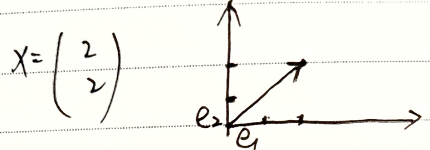
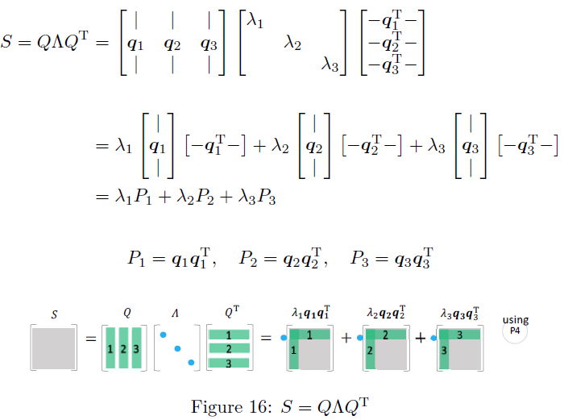

---
categories:
  - AI
  - 数学基础
tags:
  - AI
  - 数学基础
top: 2
mathjax: true
title: 2. 线性代数
abbrlink: 3214429758
date: 2023-08-01 10:09:05
---

> 参考：
>
> kenjihiranabe——The-Art-of-Linear-Algebra-zh-CN
>
> 详细计算方法与理论：见矩阵论

**线性代数的本质在于将具体事物抽象为数学对象，并描述其静态和动态特性** 

- 最基本的概念是 **set** 

  集合的定义是由某些具有某些共性的对象汇总成的集体。

  将这些对象用数字或符号表示(对象映射到数域)，这样集合中的元素就变为了多个数字或符号以某种方式排列成的组合

- 向量实质上是n维线性空间中的静止点
- 线性变换描述了向量或者作为参考系的坐标系变化，可以用矩阵表示
- 矩阵的特征值和特征向量描述了变化的速度与方向

<!--more-->

## 2.1 对象的表示

在线代中，由单独的数a构成的元素被称为 **标量** (scalar)：一个标量可以是整数、实数或复数

- $a,b,c$

多个标量 $a_1,a_2,\cdots,a_n$ 按一定顺序组成一个序列，这样的元素称为 **向量**  (vector)

- 向量代表了维度的增加，向量中每个元素需要使用一个索引确定
- $\alpha=(a_1,a_2,\cdots,a_n)$

**矩阵** (matrix) 由维度相同的向量组成

- 矩阵代表了维度的增加，矩阵中每个元素需要使用两个索引确定
- $A=\left(\begin{matrix}a_{11}&a_{12}&a_{13}\\a_{21}&a_{22}&a_{23}\\a_{31}&a_{32}&a_{33}\end{matrix}\right)$

`张量` (tensor) 矩阵中的每个元素都是向量，则形成张量

- $A=\left(\begin{matrix}1&1&2&2\\0&1&0&2\\3&3&2&2\\0&3&0&2\end{matrix}\right)=\left(\begin{matrix}1&2\\3&2\end{matrix}\right)\otimes\left(\begin{matrix}1&1\\0&1\end{matrix}\right)$

---

计算机处理离散取值的二进制信息，因此模拟世界的信号必须在定义域和值域上同时进行数字化，才能被计算机存储和处理。

线性代数是用模拟数字世界表示真实物理世界的工具

在计算机存储中：

- **标量** 占据零维度数组

- **向量** 占据一维数组：如语音信号

- **矩阵** 占据二维数组：如灰度图像

- **张量** 占据三维乃至更高维度数组：如RGB图像和视频

  $\vec{e}^T\otimes \vec{e}=\left(\vec{i}^T,\vec{j}^T,\vec{k}^T\right)\left(\begin{aligned}\vec{i}\\\vec{j}\\\vec{k}\end{aligned}\right)=\left(\begin{matrix}\vec{i}^T\cdot\vec{i}&\vec{j}^T\cdot\vec{i}&\vec{k}^T\cdot\vec{i}\\\vec{i}^T\cdot\vec{j}&\vec{j}^T\cdot\vec{j}&\vec{k}^T\cdot\vec{j}\\\vec{i}^T\cdot\vec{k}&\vec{j}^T\cdot\vec{k}&\vec{k}^T\cdot\vec{k}\\\end{matrix}\right)=\left(\begin{matrix}(\vec{i},\vec{i})&(\vec{i},\vec{j})&(\vec{i},\vec{k})\\(\vec{j},\vec{i})&(\vec{j},\vec{j})&(\vec{j},\vec{k})\\(\vec{k},\vec{i})&(\vec{k},\vec{j})&(\vec{k},\vec{k})\end{matrix}\right)=\left(\begin{matrix}\sigma_{11}&\sigma_{12}&\sigma_{13}\\\sigma_{21}&\sigma_{22}&\sigma_{23}\\\sigma_{31}&\sigma_{32}&\sigma_{33}\\\end{matrix}\right)$ 

  描述空间中各点沿各方向的受力情况

  

## 2.2 线性空间

### 2.2.1 向量

$\vec{m}=m_x\vec{i}+m_y\vec{j}+m_z\vec{k}=(m_x,m_y,m_z)\left(\begin{aligned}\vec{i}\\\vec{j}\\\vec{k}\end{aligned}\right)$ 

- 大小
- 方向

### 2.2.2 向量空间

如果有一个集合，它的元素都是具有相同维数的向量

- 定义了加法和数乘等结构化运算，将这个空间称为 **线性空间** 

- 定义了内积运算的线性空间，将这个空间称为 **内积空间**

**在线性空间中，任一一个向量代表的是n维空间中的一个点；线性空间中的任一点也都可以唯一地用一个向量表示**

- 0维：原点

  0维圆

  

- 1维：坐标轴

  1维圆

  

- 2维：平面

  2维圆：用线截为1维圆

  

- 3维：空间

  3维球：用平面截为2维圆

  

#### 线性空间参考系

`正交基` ：一组两两正交的向量构成了这个空间的正交基

`标准正交基` ：（欧几里得空间）正交基中基向量的 $L^2$ 范数的单位长度为1，则这组正交基就是标准正交基

- 正交基的作用就是给内积空间定义基准，用于空间中的所有向量（点）

### 2.2.3 范数(模)

> 用于描述向量大小，记为 $\Vert \cdot \Vert$

可以理解为：将向量转换为实数的函数

**性质**

- 任一向量 $\vec{X}$ ，$\Vert X\Vert\ge 0$ ，当且仅当 $\vec{X}=\vec{0}$ ，有 $\Vert X\Vert=0$
- $\Vert \lambda X\Vert=\lambda\Vert X\Vert$
- 三角不等式：$\Vert X+Y\Vert\le \Vert X\Vert+\Vert Y \Vert$

#### 几种范数

**L-0范数**

$\Vert X\Vert_0=向量分量非零元素个数$

- $\Vert \left(\begin{aligned}1\\0\end{aligned}\right)\Vert_0=1$ ，$\Vert \left(\begin{aligned}1\\2\end{aligned}\right)\Vert_0=2$

**L-1范数**(最大列和)

$\Vert X\Vert_1=\sum_\limits{i=1}^n\vert x_i\vert$

**L-2范数**

$\Vert X\Vert_2=\sqrt{\sum_\limits{i=1}^n\vert x_i\vert^2}$ 

**L-p范数**

$\Vert X\Vert_p=\sqrt[p]{\sum_\limits{i=1}^n\vert x_i\vert^2}$

**L-$\infty$范数**(最大行和)

$\Vert X\Vert_\infty=\max_\limits{1\le i\le n}\{\vert x_i\vert\}$

**p范数与无穷范数关系**

L-p范数
$$
\begin{aligned}
&令 \vert x_j\vert=\max_\limits{1\le i\le n}\{\vert x_i\vert\} \Rightarrow \vert x_j\vert^{\infty}\gg \vert x_i\vert^{\infty}\\
&\Vert X\Vert_p=\sqrt[p]{\sum_\limits{i=1}^n\vert x_i\vert^p}\xlongequal{p\rightarrow \infty}\sqrt[\infty]{\vert x_1\vert^{\infty}+\vert x_2\vert^{\infty}+\cdots+\vert x_n\vert^{\infty}}\approx{} \sqrt[\infty]{\vert x_j\vert^\infty}=\vert x_j\vert=\max_{1\le i\le n}\{\vert x_i\vert\}
\end{aligned}
$$

#### 距离

欧氏距离（L-2范数）：$L-2(A,B)=\sqrt{m_x^2+m_y^2}$ 

曼哈顿距离（L-1范数）： $L-1(A,B)=\vert m_x\vert +\vert m_y\vert$ 

### 2.2.4 向量运算

#### 模——向量的大小

$n$ 维向量的模长，$\vert X\vert=\sqrt{(X,X)}=\sqrt{x_1^2+x_2^2+\cdots+x_n^2}\ge 0$

单位向量 $\vert x\vert=1$

齐次性 $\vert \lambda x\vert=\vert \lambda\vert\cdot\vert x\vert$

三角不等性 $\vert x+y\vert\le \vert x\vert+\vert y\vert$

#### 内积——向量间的相对位置

> $矢量\rightarrow 标量$

$x=\left(\begin{aligned}x_1\\x_2\\\vdots\\x_n\end{aligned}\right)$ ，$y=\left(\begin{aligned}y_1\\y_2\\\vdots\\y_n\end{aligned}\right)$ 

$(x,y)=y^Tx=y_1x_1+y_2x_2+\cdots+y_nx_n$

$(y,x)=x^Ty=x_1y_1+x_2y_2+\cdots+x_ny_n$

**性质**

- 对称性：对于实数向量内积 $(x,y)=(y,x)$ 

- 线性

  $(x,\lambda y)=(\lambda x,y)=\lambda(x,y)$

  $(x+y,z)=(x,z)+(y,z)$

**内积描述的是夹角，用于表示两个向量之间的相对位置**

$A\cdot B=\Vert A\Vert\cdot \Vert B\Vert cos\theta$ 

若 $A\bot B$ ，则 $\theta=\frac{\pi}{2}$ ，$A\cdot B=0$

**投影**

若 $\Vert B\Vert=1$ ，则 $A\cdot B$ 为A在B上的投影长度

#### 向量乘向量

向量内积与秩1矩阵

### 2.2.5 正交向量组与规范正交基

$(x,y)=0$ ，则两向量正交

#### 正交向量组

> 两两正交的非零向量组 

- 正交向量组必线性无关

**eg** 

已知 $R^3$ 空间 $\alpha_1=\left(\begin{aligned}1\\1\\1\end{aligned}\right)$ ，$\alpha_2=\left(\begin{aligned}1\\-2\\1\end{aligned}\right)$ 正交，求 $\alpha_3$ 使 $\alpha_1,\alpha_2,\alpha_3$ 为正交向量组

设 $\alpha_3=\left(\begin{aligned}x_1\\x_2\\x_3\end{aligned}\right)$ ，由于 $\alpha_1,\alpha_2,\alpha_3$ 两两正交 ，有 $(\alpha_1,\alpha_3)=(\alpha_2,\alpha_3)=0\Rightarrow\left\{\begin{aligned}&x_1+x_2+x_3=0\\&x_1-2x_2+x_3=0\end{aligned}\right.$ 

有 $AX=\left(\begin{matrix}1&1&1\\1&-2&1\end{matrix}\right)\left(\begin{aligned}x_1\\x_2\\x_3\end{aligned}\right)=0$ ，$A\rightarrow\left(\begin{matrix}1&1&1\\1&-2&1\end{matrix}\right)\rightarrow\left(\begin{matrix}1&1&1\\0&-3&0\end{matrix}\right)\rightarrow\left(\begin{matrix}1&0&1\\0&1&0\end{matrix}\right)$ 

$r(A)=2,n-r(A)=1$ ，故线性方程组的基础解系中有一个无关向量  

$\therefore \left\{\begin{aligned}&x_1=-x_3\\&x_2=0\end{aligned}\right.\Rightarrow \alpha_3=\left(\begin{aligned}-1\\0\\1\end{aligned}\right)$ 

---

#### 规范正交基

$n$ 维向量 $e_1,e_2\cdots,e_r$ 是向量空间 $V\subset R^n$ 中的向量
$$
\left\{
\begin{aligned}
&e_1,e_2\cdots,e_r为单位正交向量\\
&e_1,e_2\cdots,e_r是V的一个基
\end{aligned}
\right.
$$
则称 $e_1,e_2\cdots,e_r$ 为 $V$ 的一个规范正交基

如：

$e_1=\left(\begin{aligned}1\\0\\0\\0\end{aligned}\right),e_2=\left(\begin{aligned}0\\1\\0\\0\end{aligned}\right),e_3=\left(\begin{aligned}0\\0\\1\\0\end{aligned}\right),e_4=\left(\begin{aligned}0\\0\\0\\1\end{aligned}\right)$ 是 $R^4$ 的一个规范正交基

### 2.2.6 向量组的秩

设向量组 $\alpha_1,\cdots,\alpha_n$ ，存在 $\alpha_1,\cdots,\alpha_s$ ，使 $\alpha_j=k_1\alpha_1+\cdots+k_s\alpha_s(j\neq 1,2,\cdots,s)$ ，则称 $\alpha_j$ 可由 $\alpha_s,\cdots,\alpha_s$ **线性表出**

**线性无关** ：若有 $k_1\alpha_1+\cdots+k_r\alpha_r=0\Rightarrow k_1=k_2=\cdots=k_r=0$ ，则称 $\alpha_1,\cdots,\alpha_r$ 为极大线性无关组

$r(\alpha_1\cdots\alpha_n)=r(\alpha_1\cdots\alpha_r)=r$ 为向量组的秩

## 2.3 矩阵

### 2.3.1 二元方程组求解与行列式

二元方程组求解 $\left\{\begin{aligned}a_{11}x_1+a_{12}x_2=b_1\\a_{21}x_1+a_{22}x_2=b_2\end{aligned}\right.$ 高斯消元 $\Rightarrow \left\{\begin{aligned}x_1=\frac{b_1a_{22}-b_2a_{12}}{a_{11}a_{22}-a_{12}a_{21}}=\frac{\vert A_1\vert}{\vert A\vert}\\x_2=\frac{b_2a_{11}-b_1a_{21}}{a_{11}a_{22}-a_{12}a_{21}}=\frac{\vert A_2\vert}{\vert A\vert}\end{aligned}\right.$

#### 行列式

$Det(A)=\vert A\vert$ ，表示面积
$$
\left\vert 
\begin{matrix}
a_{11}&a_{12}&\cdots&a_{1n}\\
a_{21}&a_{22}&\cdots&a_{2n}\\
\vdots&\vdots&\ddots&\vdots\\
a_{n1}&a_{n2}&\cdots&a_{nn}
\end{matrix}\right\vert=\sum\limits_{p_1p_2\cdots p_n}(-1)^{\tau(p_1p_2\cdots p_n)}a_{1p_1}a_{2p_2}\cdots a_{np_n}
$$
如：$\left\vert \begin{matrix}a&b\\c&d\end{matrix}\right\vert=ad-bc$ ，表示平行四边形面积

 

直线可表示为 $y=\frac{b}{a}x\iff bx-ay=0$ ，点到直线距离为 $\frac{\vert bc-ad\vert}{\sqrt{a^2+b^2}}$ 底边长为 $\sqrt{a^2+b^2}$ ，从几何角度，平行四边形面积为 $ad-bc$

---

$\vert A\vert=\left\vert \begin{matrix}a&b&c\\d&e&f\\g&h&i\end{matrix}\right\vert$ 表示平行六面体体积

### 2.3.2 用矩阵形式表示数据

**四个角度理解矩阵**

$A=\left(\begin{matrix}
a_{11}&a_{12}&\cdots&a_{1n}\\
a_{21}&a_{22}&\cdots&a_{2n}\\
\vdots&\vdots&\ddots&\vdots\\
a_{m1}&a_{m2}&\cdots&a_{mn}
\end{matrix}\right)=\left(\alpha_1,\alpha_2\cdots,\alpha_n\right)=\left(\begin{aligned}\beta_1\\\beta_2\\\vdots\\\beta_n\end{aligned}\right)$ 

用于表示数据 $\left\{\begin{aligned}&D=\left(\begin{aligned}X_1\\X_2\\\vdots\\X_n\end{aligned}\right)&n维特征\\&X_i=(x_{i1},x_{i2},\cdots,x_{in})&第i个数据的n维特征值\end{aligned}\right.$ 

矩阵由行向量 $\left(\begin{matrix}\alpha_1\\\alpha_2\\\vdots\\\alpha_n\end{matrix}\right)$ 或列向量 $\left(\alpha_1,\alpha_2,\cdots,\alpha_n\right)$

#### 矩阵与行列式区别

| 行列式          | 矩阵                  |
| --------------- | --------------------- |
| 数字            | 阵列                  |
| 行列数必须相等  | 行数$\neq$ 列数       |
| 共 $n^2$ 个元素 | 共 $m\times n$ 个元素 |
| 表示面积(体积)  | 表示变换过程          |

#### 特殊矩阵

- 上三角阵

- 下三角阵

- 对角阵 $\Lambda$

- 单位阵 $I$

- $相等矩阵\subset同型矩阵$ 

  相等矩阵必同型，同型矩阵未必相等

- Jacobian阵

  $F_i=\left(\begin{aligned}\frac{\partial f_1}{\partial x_i}\\\frac{\partial f_2}{\partial x_i}\\\vdots\\\frac{\partial f_m}{\partial x_i}\end{aligned}\right)$ ，

  $J_F=\left(F_1,F_2,\cdots,F_n \right)=\left(\begin{matrix}\frac{\partial f_1}{\partial x_1}&\frac{\partial f_1}{\partial x_2}&\cdots&\frac{\partial f_1}{\partial x_n}\\\frac{\partial f_2}{\partial x_1}&\frac{\partial f_2}{\partial x_2}&\cdots&\frac{\partial f_2}{\partial x_n}\\\vdots&\vdots&\ddots&\vdots\\\frac{\partial f_m}{\partial x_1}&\frac{\partial f_m}{\partial x_2}&\cdots&\frac{\partial f_m}{\partial x_n}\end{matrix}\right)=[\bigtriangledown f]_{ij}=\left[\frac{\partial f}{\partial x_j}\right]_{ij}$ 

  $J_F'=\left(F_1,F_2,\cdots,F_n \right)=\left(\begin{matrix}\frac{\partial^2 f_1}{\partial x_1^2}&\frac{\partial^2 f_1}{\partial x_1\partial x_2}&\cdots&\frac{\partial^2 f_1}{\partial x_1\partial x_n}\\\frac{\partial^2 f_2}{\partial x_1\partial x_2}&\frac{\partial^2 f_2}{\partial x_2^2}&\cdots&\frac{\partial^2 f_2}{\partial x_2\partial x_n}\\\vdots&\vdots&\ddots&\vdots\\\frac{\partial^2 f_m}{\partial x_1\partial x_m}&\frac{\partial^2 f_m}{\partial x_2\partial x_m}&\cdots&\frac{\partial^2 f_m}{\partial x_m\partial x_n}\end{matrix}\right)=[\bigtriangledown^2 f]_{ij}=\left[\frac{\partial^2 f}{\partial x_i\partial x_j}\right]_{ij}$

### 2.3.3 矩阵的秩

有矩阵 $A=\left(\begin{matrix}a_{11}&a_{12}&\cdots&a_{1n}\\a_{21}&a_{22}&\cdots&a_{2n}\\\vdots&\vdots&\ddots&\vdots\\a_{s1}&a_{s2}&\cdots&a_{sn}\\\end{matrix}\right)$ 

用 $n$ 维行向量表示 $A=\left(\begin{aligned}\alpha_1\\\alpha_2\\\vdots\\\alpha_s\end{aligned}\right)$ ，$\alpha_i=\left(a_{i1},\alpha_{i2},\cdots,\alpha_{in}\right)$ 

用 $s$ 维列向量表示 $A=\left(\beta_1,\beta_2,\cdots,\alpha_s\right)$ ，$\beta_{i}=\left(\begin{aligned}a_{1i}\\a_{2i}\\\vdots\\a_{si}\end{aligned}\right)$

#### 矩阵的秩

**行秩=列秩**

$r(A)=r(行向量组)=r(列向量组)$

### 2.3.4 矩阵运算

有 $m\times n$ 阶矩阵，$A=(a_{ij})_{m\times n}$ ，$B=(b_{ij})_{m\times n}$

#### 加减法

$A+B=\left(\begin{matrix}a_{11}+b_{11}&a_{12}+b_{12}&\cdots&a_{1n}+b_{1n}\\a_{21}+b_{21}&a_{22}+b_{22}&\cdots&a_{2n}+b_{2n}\\\vdots&\vdots&\ddots&\vdots\\a_{n1}+b_{n1}&a_{n2}+b_{n2}&\cdots&a_{nn}+b_{nn}\\\end{matrix}\right)$

#### 数乘运算

$\lambda A=A\lambda=\left(\begin{matrix}\lambda a_{11}&\lambda a_{12}&\cdots&\lambda a_{1n}\\\lambda a_{21}&\lambda a_{22}&\cdots&\lambda a_{2n}\\\vdots&\vdots&\ddots&\vdots\\\lambda a_{n1}&\lambda a_{n2}&\cdots&\lambda a_{nn}\end{matrix}\right)$ 

#### 矩阵乘向量

##### 线性变换角度

**1. 对向量进行线性变换**

$AX$ ： 对向量X进行线性变换
$$
\left\{\begin{aligned}
主对角线上元素非零：拉伸\\
非对角线上元素非零：旋转
\end{aligned}\right.
$$

---

**2. 对基进行线性变换**

$X=I\left(\begin{aligned}x_1\\\vdots\\x_n\end{aligned}\right)=(e_1,\cdots,e_n)\left(\begin{aligned}x_1\\\vdots\\x_n\end{aligned}\right)$ 

$AX=A(e_1,\cdots,e_n)\left(\begin{aligned}x_1\\\vdots\\x_n\end{aligned}\right)=(Ae_1,\cdots,Ae_n)\left(\begin{aligned}x_1\\\vdots\\x_n\end{aligned}\right)$

相当于对基进行变换 

**eg**

$A=\left(\begin{matrix}3&2\\2&3\end{matrix}\right)$ ，$X=\left(\begin{aligned}2\\2\end{aligned}\right)$ 

$IX=(e_1,e_2)\left(\begin{aligned}2\\2\end{aligned}\right)=\left(\begin{matrix}1&0\\0&1\end{matrix}\right)\left(\begin{aligned}2\\2\end{aligned}\right)$ ，如图

$AX=AIX=\left(\epsilon_1,\epsilon_2\right)\left(\begin{aligned}2\\2\end{aligned}\right)=\left(\begin{matrix}3&2\\2&3\end{matrix}\right)\left(\begin{aligned}2\\2\end{aligned}\right)$ 如图

---

**3. 矩阵的秩对变换结果影响**

**eg1** 

$X=\left(\begin{aligned}a\\b\end{aligned}\right)_{1\times 2}$ ，旋转阵 $A=\left[\begin{matrix}cos\theta &sin\theta\\-sin\theta&\cos\theta\end{matrix}\right]$ 

$A\cdot X=\left(\begin{aligned}acos\theta+bsin\theta\\acos\theta-bsin\theta\end{aligned}\right)$，表示将向量 $X$ 旋转 $\theta$ 度

假设 $\theta=\frac{3\pi}{2}$ ，旋转阵 $A=\left[\begin{matrix}0 &-1\\1&0\end{matrix}\right]$ ，$AX=\left(\begin{matrix}-b\\a\end{matrix}\right)$

**eg2**

若变换阵为 $A=\left[\begin{matrix}1&1\\-1&-1\end{matrix}\right]$ 

**变换阵是二维的 $r(A)=2$ ，则对 $R^n$ 中所有点变换后也是二维的**

**变换阵是一维的 $r(A)=1$ ，则对 $R^n$ 中所有点变换后也是一维的**

##### 线性组合角度

从乘法运算角度， $Ax$ 的元素是向量内积

**从线性组合角度理解**：

$Ax$ 是 $A$ 的列的线性组合，

- $A$ 的列向量的所有线性组合生成的子空间记为 $C(A)$ ——由 $m$ 维列空间组成的秩 $r[C(A)]=r$ 的空间
- $AX=0$ 的解空间则为零空间，记为 $N(A)$ ——由  $n$ 维列向量组成的秩 $r[(N(A))]=n-r$ 的空间

同理，行向量右乘矩阵

- $A$ 的行向量的所有线性组合生成的子空间记为 $C(A^T)$ ——有 $n$ 维列向量组成的秩 $r[C(A^T)]=r$ 的空间
- $yA=0$ 的解空间是 $A$ 的左零空间，记为 $N(A^T)$ ——由 $m$ 维列向量组成的秩 $r[N(A^T)]=m-r$ 的空间

四个基本子空间中 $C(A^T)+N(A)=\mathbb{R}^n$ ，$C(A)+N(A^T)\subset\mathbb{R}^m$ ，且相互垂直

#### 矩阵乘矩阵

矩阵乘矩阵的每个元素可以理解为向量的内积

也可以理解为矩阵的线性组合（组合系数为向量），进而分割为向量的线性组合

$A_{N\times m},B_{m\times n}$ ，有 $C_{N\times n}=A\times B,c_{ij}=\sum_\limits{k=1}^n a_{ik}b_{kj},1\le i\le N,1\le j\le n$ 

eg:

三种商品 $B_1,B_2,B_3$ 单价为 $B=\left(\begin{matrix}2.5\\3\\3.5\end{matrix}\right)$ ，商场对三种商品销售量分别为 $A=\left(\begin{matrix}12&8&10\\14&9&6\end{matrix}\right)$ ，求每个商场营业额

$C=AB=\left(\begin{matrix}12&8&10\\14&9&6\end{matrix}\right)\left(\begin{matrix}2.5\\3\\3.5\end{matrix}\right)=\left(\begin{matrix}12\times 2.5+8\times 3+10\times 3.5\\14\times 2.5+9\times 3+6\times 3.5\end{matrix}\right)=\left(\begin{matrix}89\\83\end{matrix}\right)$

**性质**

- 无交换律：$AB\neq BA$
- 结合律：$(AB)C=A(BC)$
- 分配律：$A(B+C)=AB+AC$ ，$(B+C)A=BA+CA$

**特殊的矩阵乘法**

矩阵乘对角阵

在解决微分方程和递归方程时会出现这 $XDc$ 模式

$(1)\quad\frac{du(t)}{dt}=Au(t),u(0)=u_0$

$(2)\quad u_{n+1}=Au_n,u_0=u_0$

解这两种情况的解都可以用 $A$ 的特征值 $\left(\lambda_1,\lambda_2,\lambda_3\right)$ ，特征向量 $X=[x_1,x_2,x_3]$ 和系数 $c=\left(\begin{aligned}c_1\\c_2\\c_3\end{aligned}\right)$ 表示，其中 $c$ 是以 $X$ 为基底的初始值 $u(0)=u_0$ 的坐标

$u_0=c_1x_1+c_2x_2+c_3x_3=\left[x_1,x_2,x_3\right]\left(\begin{aligned}c_1\\c_2\\c_3\end{aligned}\right)=Xc$ 

$c=\left(\begin{aligned}c_1\\c_2\\c_3\end{aligned}\right)=X^{-1}u_0$

对于 $(1)(2)$ 的通解表示为：

$u(t)=e^{At}u_0=Xe^{\Lambda t}X^{-1}u_0=Xe^{\Lambda t}c=c_1e^{\lambda_1t}x_1+c_2e^{\lambda_2t}x_2+c_3e^{\lambda_3t}x_3$ 

$u_n=A^{n}u_0=X\Lambda^nX^{-1}u_0=X\Lambda^nc=c_1\lambda_1^nx_1+c_2\lambda_2^nx_2+c_3\lambda_3^nx_3$

#### 转置

$A=\left(\begin{matrix}a_{11}&a_{12}\\a_{21}&a_{22}\end{matrix}\right)$ ，$A^T=\left(\begin{matrix}a_{11}&a_{21}\\a_{12}&a_{22}\end{matrix}\right)$

**性质**

- $(A^T)^T=A$ 
- $(A+B)^T=A^T+B^T$
- $(AB)^T=B^TA^T$
- $(\lambda A)^T=\lambda A^T$

若 $A$ 为对称阵，则 $A=A^T$  ；对角线上元素为实数

#### 求逆

若有 $BA=AB=I$ ，则有 $A^{-1}=B,B^{-1}=A$

**性质**

若 $A$ 与 $B$ 可逆，则有

- $(A^{-1})^{-1}=A$ 
- $(AB)^{-1}=B^{-1}A^{-1}$
- $(A^T)^{-1}=(A^{-1})^T$
- $(\lambda A)^{-1}=\frac{1}{\lambda}A^{-1}$

## 2.4 特征值&特征向量

### 2.4.1 特征值&特征向量

$AX=\lambda X(X\neq 0)$ ：经变换后方向不变的向量(特征向量)，在方向上有伸缩量 $\lambda$ (特征值)

**eg**

$A=\left(\begin{matrix}1&2\\0&3\end{matrix}\right)$ ，$X=\left(\begin{aligned}1\\1\end{aligned}\right)$  

$AX=\left(\begin{matrix}1&2\\0&3\end{matrix}\right)\left(\begin{aligned}1\\1\end{aligned}\right)=3\left(\begin{aligned}1\\1\end{aligned}\right)$ 

### 2.4.2 特征空间

特征空间包含了所有特征向量

$\lambda$ 越大表示相应的特征向量越重要，在降维或压缩时尽量保存

## 2.5 矩阵分解

五种重要的矩阵分解

### 2.5.1 $A=CR$

所有的长矩阵 $A$ 都有相同的行秩和列秩。$C$ 由 $A$ 中线性无关的列组成，$R$ 为 $A$ 的行阶梯阵。即将 $A$ 化简为 $r$ 的线性无关列 $C$ 和线性无关行 $R$ 的乘积

### 2.5.2 $A=LU$

高低分解

通常是 $A$ 左乘一个初等行变换阵 $E$ 来得到一个上三角阵 $U$ 
$$
EA=U\\
A=E^{-1}U\\
令 L^{-1}=E^{-1} ，A=LU
$$

### 2.5.3 $A=QR$

$QR$ 分解是在保持 $C(A)=C(Q)$ 的条件下，将 $A$ 转化为正交矩阵 $Q$ 

在施密特正交化中，单位化的 $a_1$ 被用作 $q_1$ ，然后求出 $a_2$ 与 $q_1$ 正交所得到的 $q_2$ ，以此类推

### 2.5.4 特征值分解

方阵 $A$ 可相似对角化，$P^{-1}AP=\Lambda=\left(\begin{matrix}\lambda_1&&&\\&\lambda_2\\&&\ddots\\&&&\lambda_n\end{matrix}\right)$ ，则 $P$ 中为特征向量

条件：$A$ 为 $n\times n$ 阶方阵，$A$ 有 $n$ 个线性无关的特征向量

作用：便于在 $n$ 个特征值中找到 $k$ 个较大的特根，用于代替方阵 $A$

#### 对称阵的特征值分解

所有对称矩阵 $S$ 都必有实特征值和正交特征向量。特征值是 $\Lambda$ 的对角元素，特征向量在 $Q$ 中

一个对称阵 $S$ 通过一个正交矩阵 $Q$ 和 $Q^T$ ，对角化为 $\Lambda$ 。然后被分解为一阶投影矩阵 $P=qq^T$ 的组合，就是谱定理

### 2.5.5 SVD

故筛选出 $k$ 个比较大的特征值， SVD分解为选出所有正奇值

$\lambda(A^HA)=\{\lambda_1,\lambda_2,\cdots,\lambda_n\}$ 中 $\lambda_1,\cdots,\lambda_k>0$ ，故取 $s_1^+=\sqrt{\lambda_1},s_2^+=\sqrt{\lambda_2},\cdots,s_k^+\sqrt{\lambda_k}$ 为正奇值代替代替矩阵  $A$

