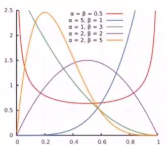
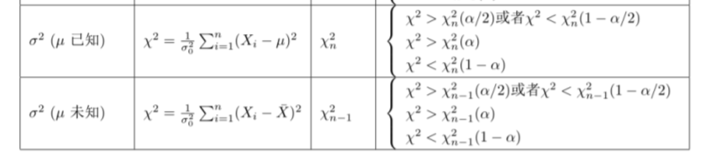
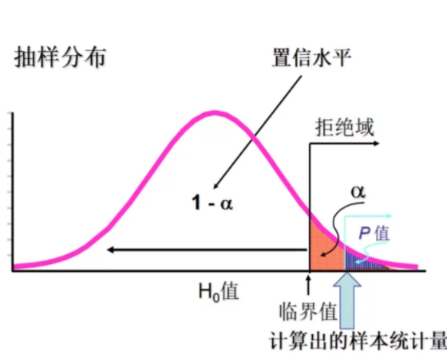
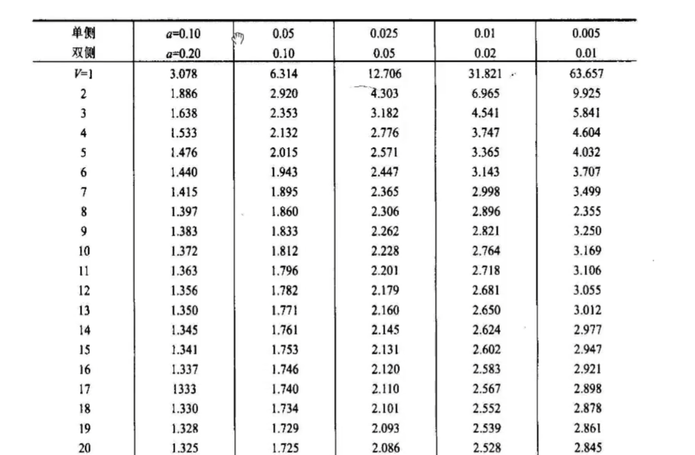

---
categories:
  - AI
  - 数学基础
tags:
  - AI
  - 数学基础
top: 3
mathjax: true
title: 3. 概率论&数理统计
abbrlink: 458635538
date: 2023-08-11 11:02:58
---

随着联结主义学派的兴起，概率统计已经取代了数理逻辑，成为了人工智能研究的主流工具

数理统计的关注点是 **无处不在的可能性** 

- 对随机事件发生的可能性进行规范的数学描述是概率论的公理化过程

频率学派认为先验分布式固定的，模型参数靠最大似然估计计算

贝叶斯学派认为先验分布是随机的，模型参数靠后验概率最大化计算

---

数理统计的任务是根据可观察的样本反过来推断总体的性质

推断的工具是统计量，统计量是样本的函数，是个随机变量

参数估计通过随机抽取的样本来估计总体分布的未知参数，包括点估计和区间估计

假设检验通过随机抽取的样本来接收或拒绝关于总体的某个判断

<!--more-->

## 3.1 概念

### 3.1.1 随机事件e

1. 在相同条件下可重复执行

   相同条件下，事件发生的可能性不变

2. 事先知道所有实验结果

3. 实验开始前，不知道本次实验结果

### 3.1.2 样本空间

随机实验E的所有结果构成的集合 $S=\{e\}$

### 3.1.3 事件的表示——Venn图

- $S\bigcap T$
- $S\bigcup T$
- $S-T=S\bigcap \overline{T}$
- $\overline{S}\bigcap \overline{T}$
- S,T,U相互独立
- S,T,U是 $\Omega$ 的一个划分

### 3.1.4 事件与概率

**将事件映射到实数域**

### 3.1.5 概率与频率

$A$ 在 $N$ 次实验中发生频率 $f_n(A)=\frac{n_A——A发生的次数}{N——总的发生次数}$ 

**大数定理** ：$f_n(A)$ 的稳定值 $P$ 为 $A$ 发生的概率 $f_n(A)\xrightarrow{n\rightarrow \infty}p(A)$

- 随着重复试验次数的增加，特定事件出现的频率值就会呈现出稳定性，逐渐趋近于某个常数

**概率**：一个可独立重复的随机试验中，单个结果出现频率的极限

### 3.1.6 古典概率

随机试验E结果只包含有限个基本事件，且每个基本事件发生的可能性相同。
$$
p(A)=\frac{\vert A\vert}{\vert \Omega\vert}\quad\left\{
\begin{aligned}
&排列：&有序地选择n个&\quad A_{m}^n=\frac{m!}{(m-n)!}\\
&组合：&无序地选择n个&\quad C_{m}^n=\frac{m!}{n!(m-n)!}
\end{aligned}
\right.
$$
**只针对单个随机事件**

eg：8个球，摸到每个球概率相等，1-8号，其中1-3为红球，4-8为黄球

设事件 $A$ 表示摸到红球，摸到红球的概率表示为 $p(A)=\frac{\vert A\vert}{\vert \Omega\vert}=\frac{3}{8}$

### 3.1.7 条件概率

> 用于刻画两个随机事件之间的关系（类比内积，通过运算将关系映射为数值），**根据已有信息对样本空间进行调整后得到的新的概率分布**

$$
P(A\mid B)=\frac{P(AB)}{P(B)},表示事件A在事件B已经发生的条件下发生的概率
$$

A和B两个事件共同发生的频率称为 `联合概率` ，记为 $P(AB)$

- 如果两个事件发生互不影响相互独立，则其联合概率 $P(AB)=P(A)P(B)$
- 对于相互独立的事件，条件概率就是自身概率 $P(A\mid B)=P(A)$

**二元条件概率**

### 3.1.8 芝麻开门问题

5把钥匙，只有一把能打开房门，求第三次将房门打开的概率

若无放回：事件A定义为第三次打开房门，意味着前两次都没打开，该事件为B，题目所求为 $P(AB)$ ，由条件概率 $P(AB)=P(A\vert B)P(B)$ ，$P(A\vert B)=\frac{1}{3},P(B)=\frac{4}{5}\times \frac{3}{4}=\frac{3}{5}$ 

所以 $P(AB)=\frac{1}{5}$

若有放回，易知每次取一把钥匙能否开门是相互独立的，即 $\frac{1}{5}$

若有放回，恰好第三次打开：恰好说明前两次没有打开，$P(AB)=\left(\frac{4}{5}\times \frac{4}{5}\right)\times \frac{1}{5}=\frac{16}{125}$

若5把钥匙中有2把能打开，随意逐把开，且每把试过后不能重复开，那么第三次打开的概率为：第三次取得钥匙正好是2把中的一把，故 $P(A)=\frac{C^1_2A_4^4}{A^5_5}=\frac{2}{5}$

若第三次恰好打开：说明前两次没有打开，2把中的第1把必须是第三个位置，第2把在第4次或者第5次尝试，所以 $P(A)=\frac{C_2^1C_2^1A_3^3}{A^5_5}=\frac{1}{5}$

若有放回，第三次能打开的概率为：由于有放回，每次抽到正确钥匙的事件是相互独立的， $P(A)=\frac{2}{5}$

若有放回，恰好第三次打开的概率：有放回，则每次选钥匙是独立的，恰好第三次打开，说明前两次没打开，$P(A)=\frac{3}{5}\times\frac{3}{5}\times\frac{2}{5}=\frac{18}{125}$

## 3.2 随机变量

### 3.2.1 分类

- 离散型：一个样本点代表一个事件

  有限个 $X=\left\{H,T\right\}\rightarrow P(x)\in(0,1)$ 

- 连续型：一个样本区间代表一个事件

  

### 3.2.2 概率函数

$P(X)=Prob(X=x)$ 随机变量取到某一种情况的概率

#### 离散型随机变量概率分布

1. 找X的所有可能值

2. 计算相应取值的概率

3. $p(x_i)\ge 0,i=1,2,\cdots,n$ ，$\sum p(x_i)=1$ 
   $$
   \begin{array}{c|lcr}
   x&x_1&x_2&\cdots&x_n\\
   \hline 
   p(x_i)&p(x_1)&p(x_2)&\cdots&p(x_n)
   \end{array}
   $$

#### 连续型随机变量

**概率密度函数**(PDF)

> 用函数形式描述事件的不确定性

由来：区间内数据的频率，将离散的数据分组，统计每一个小区间频数 $\rightarrow$ 频率
$$
\begin{array}{c|lcr}
区间&频数&频率\\
\hline
a_1&f_n(a_1)&p(a_1)\\
a_2&f_n(a_2)&p(a_2)\\
\vdots&\vdots&\vdots\\
a_n&f_n(a_n)&p(a_n)\\
\end{array}
$$
绘制频率直方图

当数据足够多，区间可划分地足够小，可将频直方图近似为一条曲线，即概率密度 $f_X(x)$ 

**连续性随机变量的概密与分布函数** 

概率密度函数体现的并非连续随机变量的真实概率，而是不同取值可能性之间的相对关系。

对连续型随机变量来说，其可能取值的数目为不可列无限个，当归一化的概率被分配到这无限个点上时，每个点的概率都是一个无穷小量，取极限的话就等于零。

概率密度函数的作用就是对这些无穷小量加以区分，无穷小量之间是有相对大小的($\frac{1}{x},\frac{2}{x}$ 在 $x\rightarrow \infty$ 时都是无穷小，但后者是前者的两倍)，由概率密度函数刻画。

**概密表示概率**

已知概率密度函数 $f(x)$ ，随机变量 $X$ 在 $(a,b]$ 上的概率可表示为 $P(a<X\le b)=\int_{a}^bf(x)dx$ 

**简单随机抽样**
$$
样本\left\{
\begin{aligned}
①&\quad x_1,x_2,\cdots,x_n是相互独立的随机变量\\
②&\quad x_1,x_x,\cdots,x_n与总体X同分布
\end{aligned}
\right.
$$
在ML中，可将  $x_1,x_2,\cdots,x_n$ 看作不同维度上的变量

- 联合分布函数 $F(x_1,x_2,\cdots,x_n)=\prod\limits_{i=1}^n F(x_i)$
- 联合概率密度 $f(x_1,x_2,\cdots,x_n)=\prod\limits_{i=1}^nf(x_i)$ 

### 3.2.3 概率公理

非负性：$P(A)\ge 0$

加法公式：

- $p(A\bigcup B)=p(A)+p(B)-p(AB)$
- $p(A\bigcup B\bigcup C)=p(A)+p(B)+p(C)-p(AB)-p(AC)-p(BC)+p(ABC)$

正则性：$p(\Omega)=1$

## 3.3 二维随机变量

### 3.3.1 联合函数

$(X,Y)$ 为二维变量，表示一个事件由两个维度决定

$F(x,y)=P(X\le x\bigcap Y\le y)$ ，表示随机点 $(X,Y)$ 位于 $(x,y)$ 左下方的概率

**性质**

- $F(x,y)$ 分别关于X，Y单调不减

- $0\le F(x,y)\le 1\left\{\begin{aligned}F(-\infty,0)=0&&F(-\infty,+\infty)=1\\F(0,-\infty)=0&&F(-\infty,-\infty)=0\end{aligned}\right.$ 

- $F(x,y)$ 关于 $X,Y$ 右连续

- $\forall x_1\le x_2,y_1\le y_2$ ，$P\left\{x_1< X\le x_2,y_1<Y\le y_2 \right\}=F(x_2,y_2)-F(x_1,y_2)-F(x_2,y_1)+F(x_1,y_1)$

  

### 3.3.2 二维离散型随机变量 (x,y)

有限对 $(X,Y)$ ：研究 $(x,y)$ 同时取定这一事件发生的概率

联合概率分布
$$
\begin{array}{c|lcr}
 X\backslash Y&y_1&y_2&\cdots&y_n\\
\hline
x_1&p_{11}&p_{12}&\cdots&p_{1n}\\
x_2&p_{21}&p_{22}&\cdots&p_{2n}\\
\vdots&\vdots&\vdots&\ddots&\vdots\\
x_n&p_{n1}&p_{n2}&\cdots&p_{nn}
\end{array}
$$
$p_{ij}\ge 0$ ，$\sum\limits_{i=1}^\infty\sum\limits_{j=1}^\infty p_{ij}=1$ 

eg：

$X=1,2,3,4$ ，$Y=1,2,\cdots,X$ ，求 $(x,y)$ 的联合概率分布

$(X=i,Y=j)$ ，$i=1,2,3,4$ ，$y\le X,y=1,2,\cdots,i$   

$P(X=i,Y=j)=P(X=i)P(Y=j\mid X=i)=\frac{1}{4}\frac{1}{i}$ 
$$
\begin{array}{c|cccc}
 x\backslash y&1&2&3&4\\
\hline
1&\frac{1}{4}&\frac{1}{8}&\frac{1}{12}&\frac{1}{16}\\
2&0&\frac{1}{8}&\frac{1}{12}&\frac{1}{16}\\
3&0&0&\frac{1}{12}&\frac{1}{16}\\
4&0&0&0&\frac{1}{16}\\
\end{array}
$$

### 3.3.3 二维连续型随机变量

研究 $(X,Y)$ 位于某一范围这一事件发生的概率

#### 概率密度

$f(x,y)\ge 0$ ，对于 $\forall (x,y)$ ，有二维随机变量的分布函数 $F(x,y)=\int_{-\infty}^x\int_{-\infty}^yf(u,v)dudv$  

$P\{(x,y)\in G\}=\iint\limits_{G} f(x,y)dxdy$ 

- $P\{(x,y)\in G\}=\int_{-\infty}^{+\infty}\int_{-\infty}^{+\infty} f(x,y)dxdy=1$

---

eg：

$(X,Y)$ ，有 $f(x,y)=\begin{cases}ke^{-(2x+3y)}&,x>0,y>0\\0&,其他\end{cases}$

(1) 求参数k

$\int_{0}^{+\infty}\int_{0}^{+\infty}f(x,y)dxdy=1=k\int_{0}^{+\infty}e^{-2x}dx\int_{0}^{+\infty} e^{-3y}dy=\frac{k}{6}e^{-2x}\mid_{0}^{+\infty}\cdot e^{-3y}\mid_{0}^{+\infty}=\frac{k}{6}\Rightarrow k=6$

(2) 求分布函数 $F(x,y)$
$$
\begin{aligned}
F(x,y)&=\begin{cases}
\int_{0}^{x}\int_{0}^{y}f(x,y)dxdy&,x>0,y>0\\
0&,其他
\end{cases}\\
&=\begin{cases}
\int_{0}^{x}2e^{-2x}dx \int_{0}^{y}3e^{-3y}dy&,x>0,y>0\\
0&,其他
\end{cases}\\
&=\begin{cases}
2e^{-2x}\mid_{0}^x e^{-3y}dy\mid_{0}^y&,x>0,y>0\\
0&,其他
\end{cases}\\
&=(e^{-2x}-1)(e^{-3y}-1)
\end{aligned}
$$
(3) 求 $P(Y\le X)$ 的概率
$$
\begin{aligned}
P\{Y\le X\}&=\int_{0}^{+\infty}dx\int_{0}^xf(x,y)dy\\
&=\int_{0}^{+\infty}dx\int_{0}^x6e^{-2x}e^{-3y}dy\\
&=\int_{0}^{+\infty}(-2)e^{-2x}dx\int_{0}^x(-3y)e^{-3y}dy=\int_{0}^{+\infty}(-2)e^{-2x}\cdot e^{-3y}\mid_{0}^xdx\\
&=-2\int_{0}^{+\infty}(e^{-5x}-e^{-2x})dx=\frac{3}{5}
\end{aligned}
$$

### 3.3.4 边缘分布

二维随机变量 $(X,Y)$ 有整体分布函数 $F(x,y)$ ，$X,Y$ 都是随机变量——$F_X(X),F_Y(y)$ 

令 $y\rightarrow \infty$ ，则 $F(x,y)\rightarrow F_X(x)$ 

- $F_X(x)=P(X\le x)=P\{X\le x,Y<+\infty\}=F(x,+\infty)$ 

  

令 $x\rightarrow \infty$ ，则 $F(x,y)\rightarrow F_Y(y)$ 

- $F_Y(y)=P(Y\le y)=P\{X< +\infty,Y\le y\}=F(+\infty,y)$

  

#### 离散型

分布律 $P\{X=x,Y=y\}=p_{ij},i,j=1,2,\cdots$

- X边缘分布：$P\{X=x_i\}=P\{X\le x_i,y<+\infty\}=\sum\limits_{j=1}^{+\infty}p_{ij}\overset{\Delta}{=}p_i,i=1,2,\cdots$
- Y边缘分布：$P\{Y=y_i\}=P\{x<+\infty,Y\le y_i\}=\sum\limits_{i=1}^{+\infty}p_{ij}\overset{\Delta}{=}p_j,j=1,2,\cdots$

eg：
$$
\begin{array}{c|ccc}
x\backslash y&0&10&20\\
\hline
0&0.35&0.04&0.025\\
1&0.025&0.15&0.04\\
2&0.02&0.1&0.25
\end{array}
$$
X,Y边缘分布
$$
\begin{array}{c|c}
X&\\
\hline
0&0.415\\
1&0.215\\
2&0.37
\end{array}\qquad

\begin{array}{c|c}
Y&\\
\hline
0&0.395\\
10&0.215\\
20&0.315
\end{array}\\
$$
$P(X=2\vert Y=20)=\frac{P(X=2,Y=20)}{P(Y=20)}=\frac{0.25}{0.315}$

#### 连续型

对于 $(X,Y)$ 有概率密度 $(x,y)$ ，及其联合分布函数 $F(x,y)$

$f_X(x)=\int_{-\infty}^{+\infty}f(x,y)dy$ ，$f_Y(y)=\int_{-\infty}^{+\infty}f(x,y)dx$

$F_X(x)=F(x,+\infty)=\int_{-\infty}^x\int_{-\infty}^{+\infty}f(x,y)dxdy=\int_{-\infty}^x\int_{-\infty}^{+\infty}f(x,y)dydx=\int_{-\infty}^xf_X(x,y)dx$

$F_Y(y)=F(+\infty,y)=\int_{-\infty}^y\int_{-\infty}^{+\infty}f(x,y)dxdy=\int_{-\infty}^y\int_{-\infty}^{+\infty}f(x,y)dxdy=\int_{-\infty}^yf_Y(x,y)dy$

eg：

$f(x,y)=\begin{cases}6&,x^2\le y<x\\0&,其他\end{cases}$ 

$$
f_X(x)=\begin{cases}
\int_{-\infty}^{+\infty}f(x,y)dy&,0\le x\le 1\\
0&,其他
\end{cases}
=\begin{cases}
\int_{x^2}^{x}6dy&,0\le x\le 1\\
0&,其他
\end{cases}=
\begin{cases}
6(x-x^2)&,0\le x\le 1\\
0&,其他
\end{cases}
$$

$$
f_Y(y)=\begin{cases}
\int_{-\infty}^{+\infty}f(x,y)dx&,0\le y\le 1\\
0&,其他
\end{cases}
=\begin{cases}
\int_{y}^{\sqrt{y}}6dy&,0\le y\le 1\\
0&,其他
\end{cases}=
\begin{cases}
6(\sqrt{y}-y)dy&,0\le y\le 1\\
0&,其他
\end{cases}
$$

## 3.4 数据的数字特征

### 3.4.1 数学期望

> 反映数据平均水平

#### 离散型期望

$$
\left\{
\begin{aligned}
&P(X=x_k)=p_k,k=1,2,\cdots\\
&EX=\sum\limits_{k=1}^nx_kp_k
\end{aligned}
\right.
$$

#### 连续型随机变量

$X\sim f(x)=\begin{cases}\frac{1}{b-a}&,a<x<b\\0&,其他\end{cases}$

$EX=\int_{-\infty}^{+\infty}xf(x)dx=\int_a^b\frac{x}{b-a}dx=\frac{a+b}{2}$

#### 二维离散型

$(X,Y)\sim P\{X=x_i,Y=y_i\}=p_{ij},i=1,2,\cdots$ ，求 $Z=g(X,Y)$ 

> 变量函数，将两个值映射为一个值
>
> x,y取定不同的值，有不同的结果

函数期望 $EZ=E[g(x,y)]=\sum\limits_{i=1}^{\infty}\sum\limits_{j=1}^{\infty}[g(x_i,y_j)p_{ij}]$ 

eg：
$$
\begin{array}{c|ccc}
X\backslash Y&0&1&2\\
\hline
0&0.1&0.25&0.15\\
1&0.15&0.2&0.15
\end{array}
$$
求 $Z=sin\frac{\pi(X+Y)}{2}$
$$
EZ=E\left[sin\frac{\pi(x+y)}{2}\right]=sin\frac{0+0}{2}\pi\cdot 0.1+sin\frac{0+1}{2}\pi\cdot 0.25+sin\frac{0+2}{2}\pi\cdot0.15\\+sin\frac{1+0}{2}\pi\cdot 0.15+sin\frac{1+1}{2}\pi\cdot 0.2+sin\frac{1+2}{2}\pi\cdot0.15=0.25
$$

#### 二维连续型随机变量

$(X,Y)$ 连续型变量函数 $Z=g(X,Y)$ ，$EZ=E\left[g(x,y)\right]=\int_{-\infty}^{+\infty}\int_{-\infty}^{+\infty}g(x,y)f(x,y)dxdy$ 

eg：

$$
f(x,y)=\begin{cases}\frac{3}{2x^3y^2}&,\frac{1}{x}1\\0&,其他\end{cases}，求EY
$$

$$
\begin{aligned}
EY&=\int_{-\infty}^{+\infty}\int_{-\infty}^{+\infty}yf(x,y)dxdy=\int_1^{+\infty}dx\int_{\frac{1}{x}}^x\frac{3y}{2x^3y^2}dy=\int_{1}^{+\infty}\frac{3}{2x^3}lny\vert_{1/ x}^xdx\\
&=\frac{3}{2}\int_{1}^{+\infty}\frac{lnx}{x^3}dx=\frac{3}{2}\int_{1}^{+\infty}lnxd\left(-\frac{1}{x^2}\right)=\frac{3}{4}
\end{aligned}
$$

#### 期望性质

1. $E(C)=C$
2. $E(CX)=CEX$
3. $E(aX+bY+C)=aEX+bEY+C$
4. $X,Y$ 相互独立，则有 $E(X\cdot Y)=EX\cdot EY$

---

eg：性质求期望

20个人，10个站，无人下车则车不停，X表示停车次数，求EX

设 $\begin{cases}0&,第i站无人下车\\1&,第i站有人下车\end{cases}，i=1,2,\cdots,10$ 

第 $i$ 站有人下车 $\iff$ 1-其他站全下完车 $P\{X_i=1\}=1-\left(\frac{9}{10}\right)^{20}$ 第 $i$ 站有人下车的期望是 $EX_i=x_i p_i=1-\left(\frac{9}{10}\right)^{20}$ 

$EX=E(X_1+X_2+\cdots+X_{10})=10\times\left[1-\left(\frac{9}{10}\right)^{20}\right]$  

### 3.4.2 方差

> 反映数据分散程度

$DX=E(X-EX)^2=E[X^2+(EX)^2-2XEX]=EX^2+(EX)^2-2(EX)^2=EX^2-(EX)^2=S^2(标准差平方)$

随机变量与期望距离的平方的期望

### 3.4.3 协方差

> 描述两个随机变量之间的相互关系，就需要用到协方差和相关系数——描述两个随机变量之间的线性关系

**协方差** 度量了两个随机变量之间的线性关系，即变量 $Y$ 能否表示成以另一变量 $X$ 为自变量的 $aX+b$ 形式

$Cov(X,Y)=E[(X-EX)(Y-EY)]=E(XY)-EX\cdot EY\begin{cases}=0,X与Y相互独立\\>0,正相关\\<0,负相关\end{cases}$

$X,Y相互独立\Rightarrow Cov(X,Y)\approx 0$ 

**相关系数**

根据协方差可以进一步求出相关系数，相关系数是绝对值不大于1的常数

- 等于1意味着两者满足完全正相关；
- 等于-1意味着两者满足完全负相关
- 等于0意味着两者不相关

## 3.5 随机变量的分布

### 3.5.1 均匀分布

$X\sim U(a,b)$ ，每一件事出现的可能性相等

$f(x)=\frac{1}{b-a},a\le x\le b$ 

- $EX=\frac{a+b}{2}$ 
- $DX=\frac{(a-b)^2}{12}$

### 3.5.2 伯努利实验

> 一次随机实验，只出现两种结果

$A$ 事件 $p$ ，$\overline{A}$ 事件 $q=1-p$

$f(k;p)=\begin{cases}p&,k=1\\1-p&,k=0\end{cases}$ 

- $EX=p$ 
- $DX=EX^2-(EX)^2=p-p^2=p(1-p)=pq$ 

### 3.5.3 二项分布

$n$ 重伯努利实验 $X\sim B(n,p)$ 

- $n$ 次实验独立
- 每次实验只有两种结果 $A$ 和 $\overline{A}$
- 每次实验 $A$ 出现的概率都不变

$P\{X=k\}=C_n^kp^k(1-p)^{n-k}=\left(\begin{aligned}n\\k\end{aligned}\right)p^k(1-p)^{n-k}=P(X\vert n,p)，k=0,1,\cdots,n$

$\sum\limits_{k=0}^n\left(\begin{aligned}n\\k\end{aligned}\right)p^k(1-p)^{n-k}=1$

- 最后结果是每次选择的累计量

- $EX=np$
- $DX=npq$

### 3.5.4 多项式分布

二项式 $(x+y)^n=\sum\limits_{k=0}^n \left(\begin{aligned}n\\k\end{aligned}\right)x^ky^{n-k}=\sum\limits_{k=0}^n \left(\begin{aligned}n\\k\end{aligned}\right)y^kx^{n-k}$  

**多项式概密** 
$$
\begin{aligned}
f(X=x_1,X=x_2,\cdots,X=x_k)&=\begin{cases}\frac{n!}{x_1!x_2!\cdots x_k!}p_1^{x_1}p_2^{x_2}\cdots p_k^{x_k}&,\sum\limits_{i=0}^k x_i=n\\0&，其他\end{cases}\\
&=\frac{\Gamma(\sum X_i+1)}{\prod[\Gamma(\sum X_i+1)]}\prod\limits_{i=1}^kp_i^{x_i}
\end{aligned}
$$

- 伽马函数

  

  $\Gamma(z)=\int_{0}^{\infty}x^{z-1}e^{-x}dx$ 

  $\Gamma(z+1)=z\int_{0}^{\infty}x^{z-1}e^{-x}dx=z\Gamma(z)$ 

  $\Gamma(1)=\int_{0}^{\infty}x^{1-1}e^{-x}dx=1$

  $\Gamma(n)=(n-1)!$ 

### 3.5.5 Beta分布

$X\sim B(\alpha,\beta)$ 

$f(x;\alpha,\beta)=\frac{\Gamma(\alpha+\beta)}{\Gamma(\alpha)\Gamma(\beta)}x^{\alpha-1}(1-x)^{\beta-1}=\frac{x^{\alpha-1}(1-x)^{\beta-1}}{B(\alpha,\beta)}$  

- $\alpha,\beta$ 相等，则有对称性

- 同样的历史数据，成功次数越少,$P(成功)$ 越小

同一种情况的概率，历史数据越多，越确信

---

eg：

已知历史平均命中率0.266，编一组数据 $B(81,219)$ 满足历史数据，通过现在的真实验数据修正模型

$Beta(81,219)\xrightarrow{+1次}Beta(82,219)\xrightarrow{+300次,100成功,200失败}Beta(81+100,219+200)$

$\frac{81}{81+219}<\frac{81+1}{81+1+219}<\frac{81+100}{81+219+200}$ 可以看到成绩有所提升

### 3.5.6 正态分布

$X\sim N(\mu,\sigma^2)$

**大部分随机变量呈现正态分布**

- $\mu$ 决定了平均水平
- $\sigma$ 决定了平均水平附近的分散程度

$f(x\vert \mu,\sigma)=\frac{1}{\sqrt{2\pi}\sigma}e^{-\frac{(x-\mu)^2}{2\sigma^2}}$ 

$X\sim N(0,1)$ 为标准正态分布

### 3.5.7 泊松分布

$X\sim P(\mu)=P(\lambda t)$ 

离散的正态分布，适用于随机实验中事件发生的次数（成功事件概率小）

假设：

- 任一事件的成功不影响另一事件成功（独立）
- 短片段成功概率与更长片段成功概率相等 $\Rightarrow t\uparrow$ ，事件发生次数 $\uparrow$
- 区间小时事件成功概率趋于0

$P(X\vert \lambda)=\frac{\mu ^k}{k!}e^{-\lambda},k=0,1,\cdots$ 

- $(\lambda：单位时间内发生次数)$ $\mu=\lambda t$ 

---

$n$ 很大，$p$ 很小的二项分布用泊松分布代替

eg：

平均每小时出生3婴儿，下一小时出生情况

$P(N(t)=n)=\frac{(\lambda t)^n}{n!}e^{-\lambda t}$ 表示t时间内事件发生n次的概率

2个小时内一个都不出生，$P(N(2)=0)=e^{-3\times 2}\approx 0.0025$ 

1个小时至少2个，$P(N(1)\ge 2)=1-P(N(1)=0)-P(N(1)=1)\approx 0.8$

$EX=\lambda t$ $DX=\lambda t$

### 3.5.8 指数分布

$X\sim EXP(\lambda)$

泊松分布事件中，第 $k$ 次随机时间与第 $k+1$ 次随机事件出现的时间间隔服从指数分布

- 事件以恒定的平均速率连续且独立地发生的过程

$f(x;\lambda)=\begin{cases}\lambda e^{-\lambda x}&,x\ge 0\\0&,x<0\end{cases}$ ，$\lambda：单位时间发生该事件的次数$ 

$F(x;\lambda)=\begin{cases}1-e^{-\lambda x}&,x\ge 0\\0&,x<0\end{cases}$ 

- $EX=\frac{1}{\lambda}$ 

- $DX=\frac{1}{\lambda^2}$ 

每小时接2个电话，两个电话之间等待时间为半小时

**无记忆性**

$P(T>s+t\vert T>t)=P(T>s)$ 

### 3.5.9 卡方分布

适用：通过小数量样本估计总样本分布

卡方检验：检验样本值与理论值间的偏离程度

随机变量 $X_1,X_2,\cdots,X_n$ 相互独立，且 $X_i(i=1,2,\cdots,n)$ 服从 $N(0,1)$ ，则其平方和 $\sum\limits_{i=1}^n X_i^2\sim \chi(n)$

- $E(\chi^2)=n$ 
- $D(\chi^2)=2n$

## 3.6 数理统计概念与定理

### 3.6.1 概率论与数理统计区别

根据观察或实验得到的数据来研究随机现象，并对研究对象的客观规律做出合理的估计和判断。

- 概率论：研究对象是分布已知的随机变量，根据已知的分布来分析随机变量的特征和规律

  概率论解决的是已知彩票的要将规律，判断一注号码中奖的可能性

- 数理统计：研究对象是分布未知的随机变量，研究方法是对随机变量进行独立重复的观察，根据得到的观察结果对原始分布做出推断

  数理统计解决的是根据之前多次中奖/不中奖的号码记录以一定的精确性推测摇奖的规律

在数理统计中，可用的资源是有限的数据集——样本。观察对象所有的可能取值——总体。

- 样本通常由对总体进行多次独立的重复观测得到，并且与总体同分布

数理统计目标：根据样本推断总体数字特征

**统计量** ：在统计推断中，应用的往往不是样本本身，而是被称为统计量的样本的函数，本身也是一个随机变量

样本均值：$\overline{X}=\frac{1}{n}\sum\limits_{i=1}^{n}X_i$

样本方差：$S^2=\frac{1}{n-1}\sum\limits_{i=1}^n(X_i-\overline{X})^2$ 

### 3.6.2 基本定理

#### 大数定理

在试验条件不变的条件下，重复多次实验，随机事件发生的频率 $\approx$ 概率

#### 马尔科夫不等式

$P(X\ge a)\le \frac{EX}{a},X\ge 0,a>0$ 

证：
$$
\begin{aligned}
&X\ge a\Rightarrow \frac{X}{a}\ge 1\\
&P(X\ge a)=\int_{a}^{+\infty}f(x)dx\le \int_{a}^{+\infty}\frac{x}{a}f(x)dx\\
&由期望性质：E\left(\frac{X}{a}\right)=\int_{-\infty}^{a}\frac{x}{a}f(x)dx+\int_{a}^{+\infty}\frac{x}{a}f(x)dx\xlongequal{x\le 0}\int_{0}^{a}\frac{x}{a}f(x)dx+\int_{a}^{+\infty}\frac{x}{a}f(x)dx\\
&由于 \int_{0}^{a}\frac{x}{a}f(x)dx\ge 0\Rightarrow E\left(\frac{X}{a}\right)\ge \int_{a}^{+\infty}\frac{x}{a}f(x)dx\\
&P(X\ge a)=\int_{a}^{+\infty}f(x)dx\le\int_{a}^{+\infty}\frac{x}{a}f(x)dx\le E\left(\frac{X}{a}\right)=\frac{EX}{a}
\end{aligned}
$$

#### 切比雪夫不等式

> 二八定理：大部分围绕在均值附近

微笑公式：$P=\{\vert X-EX\vert\ge \epsilon\}\le\frac{\sigma^2}{\epsilon^2}\iff P\{\vert X-EX\vert<\epsilon\}>1-\frac{\sigma^2}{\epsilon^2}$ 

- $\sigma^2$ 越小，小概率事件越少
- $\sigma^2$ 越大，在均值附近的围绕程度越低，越分散

证明：将马尔科夫不等式中的常数 $a$ 代入为均值 $\epsilon$ ，随机变量 $X$ 代入为 $\vert X-EX\vert$ 

eg：

$n$ 重伯努利实验，$P(A)=0.75$ ，确定实验次数 $n$ ，使 $A$ 出现的频率在 $(0.74,0.76)$ 之间的概率不超过0.9

$X\sim B(n,0.75)$ ，$EX=np=0.75n$ ，$DX=npq=\frac{3}{16}n$  

在 $n$ 次实验中事件 $A$ 出现的频率为 $\frac{X}{n}$ ，$P\{0.74<\frac{X}{n}<0.76\}=\{0.74n<X<0.76n\}=\{\vert X-0.75n\vert<0.01n\}\ge 1-\frac{3n\backslash 16}{0.01n^2}\ge 0.9$

$n\ge 18750$

#### 中心极限定理

任何一个总体的平均值都会围绕在总体的平均值附近

### 3.6.3 统计推断的基本问题

参数估计：对象是总体的某个参数

假设检验：对象是总体的某个论断，即关于总体的假设

## 3.7 参数估计

### 3.7.1 频率派

$D:data=(X_1,X_2,\cdots,X_n)^T=\overbrace{\left(\begin{matrix}x_{11}&x_{12}&\cdots&x_{1p}\\x_{21}&x_{22}&\cdots&x_{2p}\\\vdots&\vdots&\ddots&\vdots\\x_{n1}&x_{n2}&\cdots&x_{np}\end{matrix}\right)}^{p个维度}$  n个数据

$\theta$ 为参数，$X\sim P(X;\theta)$ ，假设 $n$ 个样本$X_i$ 整体服从一个分布

- 点估计
- 区间估计

#### 点估计法

**点估计**：已知总体分布函数，但未知其中一个或多个参数时，借助总体的一个样本来估计未知参数的取值

- 核心在于构造合适的统计量 $\hat{\theta}$ ，并用这个统计量的观察值作为未知参数 $\theta$ 的近似值
- 具体方法：矩估计法和最大似然估计法

##### 矩阵估计法

> 矩表示随机变量的分布特征， $k$ 阶矩定义为随机变量的 $k$ 次方的期望，即 $E(X^k)$

基本思想：用样本 $k$ 阶矩估计总体的 $k$ 阶矩

理论依据：样本矩的函数几乎处处收敛于总体矩的相应函数

- **大数定律**——当样本容量足够大时，几乎每次都可以根据样本参数得到相应总体参数的近似值

##### 极大似然估计

基本思想：认为抽样得到的这一组样本值概率较大，因而在参数估计时就需要让已有样本值出现的可能性最大

$\theta$ ：未知常量——常用极大似然估计MLE

$\theta_{MLE}=arg\max\limits_{\theta} L(\theta\vert X)=arg\max\limits_{\theta}P(X\vert \theta)=arg\max\limits_{\theta}logP(X\vert \theta)$ 

$X\overset{iid}{\sim}P(X\vert \theta)=\prod\limits_{i=1}^{n}P(x_i\vert \theta)$

**似然函数**

给定联合样本值X是关于$\theta$ 的函数$L(\theta\vert X)$

- x：随机变量X的具体取值
- $\theta$：控制整体样本服从的分布

似然函数 $L(\theta\vert X)$ ：已知数据，求使数据出现的概率最大的分布的参数 $\theta$

似然概率 $P(X\vert\theta)$ ：已知样本服从的分布，即参数 $\theta$ 已知，求当 $X$ 取到样本 $X$ 时的概率

在最大似然估计中，似然函数被定义为样本观测值出现的概率，确定未知参数的准则是让似然概率最大化

**离散型**

$P(x_1\vert\theta)>P(x_2\vert \theta)$ ：$X$ 取 $x_1$ 的概率大

$L(\theta_1\vert X)=P(X\vert \theta_1)>P(X\vert \theta_2)=L(\theta_2\vert X)$ 

L：取到数据集 $\{X\}$ 服从$\theta_1$ 描述的分布的概率

P：在 $\theta_1$ 条件下，取到 $\{X\}$ 的概率

**连续型**

$X\in (x-\epsilon,x+\epsilon)$ 的概率

$P(x-\epsilon<X<x+\epsilon)=\int_{x-\epsilon}^{x+\epsilon}f(x\vert \theta)dx \xlongequal{积分中值定理} 2\epsilon f(x\vert \theta_\xi)=2\epsilon L(\theta_\xi\vert X)$

**极大似然估计**

$X$ 独立同分布，$x_1,x_2,\cdots,x_n$ 选取 $\hat{\theta}(x_1,x_2,\cdots,x_n)$ 作为 $\theta$ 观测值，使 $P_{\theta}(X=x)=L(\theta\vert X)$ 的概率最大
$$
\begin{aligned}
L(\theta\vert x_1,x_2,\cdots,x_n)=arg\max\limits_{\theta}P(x_1,x_2,\cdots,x_n\vert \theta) =\prod\limits_{i=1}^nP(x_i\vert \theta)=\int_{x_1}^{x_n}f(x\vert\theta)dx
\end{aligned}
$$
求解步骤：

1. 构造似然函数$L(\theta)$
2. 取对 $lnL(\theta)$
3. 求偏导，令 $\frac{dlnL(\theta)}{d\theta}=0$
4. 求 $\hat{\theta}$ 

**eg**

$X\sim P(\lambda)$ ，$x_1,\cdots,x_n$ 为样本值，求 $\lambda$ 极大似然估计

$P(X=k)=\frac{\lambda^k}{k!}e^{-\lambda},(k=0,1,\cdots,n)$ 

$L(\lambda)=\prod\limits_{i=1}^{n}\frac{\lambda^{x_i}}{(x_i)!}e^{-\lambda}=e^{-n\lambda}\frac{\lambda^{\sum\limits_{i=1}^nx_i}}{\prod\limits_{i=1}^{n}(x_i)!}$ 

$lnL(\lambda)=-n\lambda+(\sum\limits_{i=1}^{n}x_i)ln\lambda-\sum\limits_{i=1}^nln[(x_i)!]$

令 $\frac{dlnL(\lambda)}{d\lambda}=0\Rightarrow \hat{\lambda}=\frac{1}{n}\sum\limits_{i=1}^{n}x_i=\overline{x}$ 

**模型判别**

SML——优化问题

1. 设计模型：概率模型判别
2. Loss function 求解
3. 算法

总结：**极大似然参数估计完全依赖本次抽样的样本值**

##### 点估计量的评估

无偏性：估计量的数学期望等于未知参数的真实值

- 如果估计量是无偏的，保持估计量的构造不变，而进行多次抽样，每次用新的样本计算估计值，那么这些估计值与未知参数真实值的偏差在平均意义上等于0

有效性：无偏估计量的方差尽量小

- 估计量与真实值之间的**偏离程度**

一致性：当**样本容量**趋近于无穷时，估计量依概率收敛于未知参数的真实值

#### 区间估计

在估计未知参数 $\theta$ 的过程中，除了求出估计量，还需估计出一个区间，并且确定这个区间包含 $\theta$ 真实值的可信程度。

- 区间：置信区间

对总体反复抽样多次，每次得到容量相同的样本，根据每一组样本值可以确定一个置信区间 $(\underline{\theta},\overline{\theta})$ 

每个置信区间有两种可能：包含 $\theta$ 和不包含 $\theta$ 。

如果对所有置信区间中包含 $\theta$ 真实值的比例进行统计，$\frac{包含\theta的置信区间}{置信区间数总数}$ 为置信水平

**在点估计的基础上，增加取指范围(置信区间)、误差界限(置信水平)**

### 3.7.2 贝叶斯派

#### 贝叶斯定理

##### 条件概率

**引例**

3张抽奖券，1个中奖券，最后一名与第一名抽中奖概率相同

$Y$ ：抽中，$N$ ：未抽中 ,$\Omega=\{YNN,NYN,NNY\}$ ，$A_i$ 事件表示第 $i$ 名抽中

$P(A_3)=\frac{\vert A_3\vert}{\vert \Omega\vert}=\frac{1}{3}$ 

$P(A_1)=\frac{\vert A_1\vert}{\vert \Omega\vert}=\frac{1}{3}$ 

上例中，若已知第一名未抽中，求第三名抽中概率，则：

第一名未抽中 $B=\{NYN,NNY\}$

第二名抽中 $A_2=\{NNY\}$

$P(A_2\vert B)=\frac{1}{2}$

---

**分析**：样本空间变了，目标样本数量不变

事件B发生条件下，有事件A发生 $\iff$ 事件AB同时发生，样本空间为B

求解：

$P(A\vert B)=\frac{P(AB)}{P(B)}\iff\frac{n(AB)/n(\Omega)}{n(B)/n(\Omega)}=\frac{P(AB)}{P(B)}$

---

**eg**

掷硬币，100个中有99个正常HT，一个HH。投出去是正面，该硬币是异常硬币的概率

A表示异常硬币的概率，B表示掷出正面的概率

- $P(A\vert B)=\frac{异常硬币正面}{n(硬币正面)}=\frac{2}{101}$ 

- $P(A\vert B)=\frac{P(AB)}{P(B)}=\frac{P(A\vert B)P(B)}{P(A\vert B)P(B)+P(A\vert \overline{B})P(\overline{B})}=\frac{2}{101}$ 

##### 独立性

若 $P(B\vert A)=P(B)$ ，则 A、B独立

- 若 $P(A_1,A_2,\cdots,A_n)=\prod\limits_{i=1}^nP(A_i)$ ，则 $A_1$ ，$A_2$ ，$\cdots$，$A_n$ 相互独立

相互独立（整体）$\neq$ 两两独立（两个）
$$
\begin{aligned}
P(ABC)=\begin{cases}
相互：P(ABC)=P(A)P(B)P(C)\\
两两：P(AB)=P(A)P(B),P(BC)=P(B)P(C),P(AC)=P(A)P(C)
\end{cases}
\end{aligned}
$$
独立重复实验：相同条件下，实验E重复进行每次试验结果相互独立

n重伯努利实验：规定实验结果只有 $A$ 和 $\overline{A}$ 两种，相同条件下，将实验独立地重复n次

##### 变式

**乘法原理** ：$P(AB)=P(A)P(B)$

**全概率公式**

S：实验E中的样本空间，$A_1,\cdots,A_2$ 为E中一组事件

满足：

- $A_iA_j=\phi$ 
- $A_1\bigcup A_2\bigcup \cdots \bigcup A_n=S$ 

则称 $A_1,A_2,\cdots,A_n$ 为 $S$ 的一个 `划分` 

$P(B)=P(A_1\bigcap B)+\cdots+P(A_n\bigcap B)=P(A_1)P(B\vert A_1)+\cdots+P(A_n)P(B\vert A_n)$ 

##### 贝叶斯公式

先验概率 $P(A_i)$ 与后验概率 $P(A_i\vert B)$ 关系

$P(A_i\vert B)=\frac{P(BA_i)}{P(B)}=\frac{P(B\vert A_i)P(A_i)}{P(B)}=\frac{P(B\vert A_i)P(A_i)}{\sum\limits_{j=1}^nP(B\vert A_j)P(A_j)}$ 

- 先验：假设(已知条件)的概率
- 后验：已知结果得到条件的概率

##### 贝叶斯定理

$$
P(H\vert D)=\frac{P(D\vert H)P(H)}{P(D)}
$$

- $P(H)$ ：先验概率
- $P(D\vert H)$ ：似然概率
- $P(H\vert D)$ ：先验概率

##### 贝叶斯定理计算概率

#### 贝叶斯估计

> 后验($数据\rightarrow 参数$) $\rightarrow$ 先验（$参数\rightarrow 数据$）
>
> 在贝叶斯估计中，参数 $\theta$ 为关注部分，以 $\theta$ 作为前提的条件概率为先验概率

结合先验知识（统计，频数），若样本不合理可进行校正
$$
\begin{aligned}
\theta_{MAP}&=arg\max\limits_{\theta}P(\theta\vert X)=arg\max\limits_{\theta}\frac{P(X\vert \theta)P(\theta)}{P(X)}\\
&\xlongequal{同一样本不同模型，数据出现概率相等，P(X)可看做常数，进而忽略}\\
&\propto arg\max\limits_{\theta}P(X\vert \theta)P(\theta)
\end{aligned}
$$
 样本离散：
$$
\begin{aligned}
arg\max\limits_{\theta}P(X\vert \theta)P(\theta)&=arg\max\limits_{\theta}P(x_1,x_2,\cdots,x_n\vert \theta)P(\theta)=arg\max\limits_{\theta}\left[\prod\limits_{i=1}^nP(x_i\vert \theta)\right]P(\theta)\\
&=arg\max\limits_{\theta}ln\left\{\left[\prod\limits_{i=1}^nP(x_i\vert \theta)\right]P(\theta)\right\}\\
&=arg\max\limits_{\theta}\left[\sum\limits_{i=1}^n
lnP(x_i\vert \theta)+lnP(\theta)\right]\end{aligned}
$$
样本连续：

$arg\max\limits_{\theta}P(X\vert \theta)P(\theta)=arg\max\limits_{\theta}P(x_1,x_2,\cdots,x_n\vert\theta)P(\theta)=arg\max\limits_{\theta}\int_{\theta}P(X\vert \theta)P(\theta)$

---

**eg**

拼写检查 $P(猜测词\vert 实际输入词)$

猜测1：$P(w_1\vert D)$ ，猜测2：$P(w_2\vert D)$

$P(w\vert D)=\frac{P(w)P(D\vert w)}{P(D)}$ ，在已有输入的情况下，不管正确词是哪种情况，输入词出现的概率 $P(D)$ 都相同

- 出于无法估计/估计困难，忽略同一影响 $P(D)$ 

故 $P(w\vert D)\propto P(D\vert w)P(w)$ 

此时，$P(w)$ 为先验知识，可以通过统计，得出正确词出现的概率

若输入 `tlp` ，对于 $top$ 或 $tip$ ，用极大似然无法估计，但由统计学，用户输入 $top$ 词频高，则 `top` 概率大，$P('top'\vert 'tlp')>P('top'\vert 'tlp')$

#### 贝叶斯预测

$X$：训练数据，$\widetilde{X}$ ：测试数据

$P(\widetilde{X}\vert X)=\int_\theta P(\widetilde{X},\theta\vert X)d\theta=\int_\theta P(\widetilde{X}\vert \theta)P(\theta\vert X)d\theta$ 

- $P(\theta\vert X)$ ：由训练数据得到某一模型
- $P(\widetilde{X}\vert \theta)$ ：某一模式下，测试数据出现的概率

#### 模型比较理论

极大似然：最符合观测数据的最有优势，$P(D\vert \theta)$ 

奥卡姆剃刀：$P(\theta)$ 先验概率大的模型最有优势

**eg** ：对于平面上点进行拟合，根据奥卡姆剃刀原理，越高阶多项式越不常见（过拟合线性）

$P(Pol(X))\ll P(Pol(2))\ll P(Pol(1))$ 

#### 实例：垃圾邮件过滤

$D$ ：邮件，$D$ 由 $n$ 个单词组成，$h^+$ ：垃圾邮件，$h^-$ ：正常邮件

$P(h^+\vert D)=\frac{P(D\vert h^+)P(h^+)}{P(D)}\propto P(h^+)P(D\vert h^+)$ 

$P(h^-\vert D)=\frac{P(D\vert h^-)P(h^-)}{P(D)}\propto P(h^-)P(D\vert h^-)$

先验概率： $P(h^+)$ 与 $P(h^-)$ 都可以通过统计学得出，

$D$ 中包含 $n$ 个词，$d_1,d_2,\cdots,d_n$ ，$P(D\vert h^+)=P(d_1,d_2,\cdots,d_n\vert h^+)$ 为垃圾邮件中出现这些词的概率

$$
\begin{aligned}
(原始贝叶斯)&P(d_1,d_2,\cdots,d_n\vert h^+)=P(d_1\vert h^+)P(d_2,\cdots,d_n\vert d_1,h^+)=\cdots=P(d_1\vert h^+)P(d_2\vert d_1,h^+)P(d_3\vert d_1,d_2,h^+)\cdots\\
\Downarrow\\ 
(朴素贝叶斯)&\xlongequal{假设特征间相互独立}P(d_1\vert h^+)P(d_2\vert h^+)\cdots P(d_n\vert h^+)
\end{aligned}
$$

可以用频率代替概率

## 3.8 假设检验

假设：对总体参数的数值表示 $=,<,>$

假设检验：用统计数据判断命题真伪的方式。

假设成立：模型参数是否在统计学误差允许的范围内

**小概率事件原理** ：在数理统计中，发生概率小于 1% 的事件被称为小概率事件，在单次实验中被认为是不可能发生的

在一次实验中小概率事件一旦发生，就有理由拒绝原假设

- “小概率事件”的概率越小，否定原假设 $H_0$ 就越有说服力

### 3.8.1 提出假设

原假设：对总体参数做一个尝试性的假设，该假设被称为原假设，记为 $H_0$ ，待推翻的

备择假设：与 $H_0$ 完全相反的假设

**在统计学里，命题不能被证明是正确的，只能证明其否命题是错误的**

假设检验的过程就是根据样本数据来对这两个对立的假设进行检验的过程。一般来说，我们将想要推翻的假设作为原假设，而将想要检验证实的问题作为备择假设。

### 3.8.2 构建检验统计量

#### 对均值检验

#### 对方差检验

### 3.8.3 根据显著性水平确定拒绝域临界值

#### 显著性水平

> 假定原假设不发生 $P(H_1)=\alpha(0<\alpha<1)$ 为小概率事件，称为 **检验的显著性水平**

它代表了：当原假设为真时，检验统计量落在拒绝域，从而拒绝原假设的概率，也叫做第一类错误（弃真）
- 原假设为真，拒绝原假设的概率
- 估计总体参数在某一区间，可能犯错的概率

#### 拒绝域

**拒绝域面积**为小概率事件概率 $\alpha$ ，称为 **显著性水平**

- **接收域**，接收域的面积为原假设发生的概率 $P(H_0)=1-\alpha$

检验统计量落在拒绝域中，则拒绝原假设

-  **临界值** 是拒绝域的边界，即使拒绝域面积为 $\alpha$ （显著性水平）的值

### 3.8.4 计算统计量，确定P值

**P值** 是一个概率值，如果假设为真，P值是抽样分布中大于或小于样本统计量的概率

P值越小，$H_0$ 越不可能为正确——拒绝程度越大

- 左侧检验：P值为小于检验统计量的部分

  

- 右侧检验：P值为大于检验统计量的部分

  

### 3.8.5 根据临界值法决定是否拒绝原假设

在双侧检验中，如果检验统计量 $z\le -z_\frac{\alpha}{2}$ 或者 $z\ge z_\frac{\alpha}{2}$ ，则拒绝原假设

在左侧检验中，如果检验统计量 $z\le -z_\alpha$ ，则拒绝原假设

在右侧检验中，如果检验统计量 $z\ge z_\alpha$ ，则拒绝原假设

---

**在判断错的概率为 $\alpha$ 时，认为原假设是不成立的**

### 3.8.6 三种检验

#### Z检验

1. 检验一个样本均值与已知的总体样本平均数（统计数据）是否有显著差异

   $Z=\frac{\overline{X}-\mu}{\sigma_{\overline{X}}}=\frac{\overline{X}-\mu}{\sigma/ \sqrt{n}}$ 

2. 检验来自两组样本的均值是否有差异，进而两样本总体是否有差异

   $Z=\frac{\vert \overline{X}_1-\overline{X}_2 \vert}{S_{\overline{x}_1-\overline{x}_2}}=\frac{\vert \overline{X}_1-\overline{X}_2\vert}{\sqrt{s_1^2/n_1+s^2_2/n_2}}$

**检验原理**

1. 标准正态分布理论

   $f(x)=\frac{1}{\sqrt{2\pi\sigma}}e^{-\frac{(x-\mu)^2}{2\sigma^2}}\xrightarrow{标准化t=\frac{(x-\mu)}{\sigma}}f_N(x)=\frac{1}{\sqrt{2\pi}\sigma}e^{-\frac{t^2}{2}}$ 

   由于 $\sigma$ 已知，故用方差代替标准差 $s=\frac{\sigma}{\sqrt{n}}$

2. 当总体标准差已知，样本量较大时，用标准正态分布的理论来推断差异发生的概率，从而比较两个平均数的差异是否显著

**常用临界值** 

双侧：$Z_{0.05/2}=1.96,Z_{0.01/2}=2.58$

单侧：$Z_{0.05}=1.645,Z_{0.01}=2.33$

---

**eg1：**

假设正常人与高血压患者胆固醇含量资料如下，试比较两组血清胆固醇含量是否有差别

正常人组：$n_1=506,\overline{x_1}=180.6,s_1=34.2$

高血压组：$n_2=142,\overline{x_2}=223.6,s_2=45.8$
$$
\begin{array}{r|lll}
建立假设，确定显著性水平&H_0：\mu_1=\mu_2\qquad H_1:\mu_1\neq \mu_2\qquad \alpha=0.05\\
计算统计量&Z=\frac{\vert\overline{X_1}-\overline{X_2}\vert}{\sqrt{s_1^2/n_1+s_2^2/n_2}}=\frac{\vert180.6-223.6\vert}{\sqrt{34.2^2/506+45.8^2/142}}=10.4\\
确定临界值&查表 1-\frac{\alpha}{2}=1-0.025=0.975\Rightarrow z_{\frac{\alpha}{2}}=z_{1-\frac{\alpha}{2}}=1.96\\
决策&z>z_{1-\frac{\alpha}{2}}，故拒绝H_0，认为有差异，接受 H_1，认为正常人与高血压患者的胆固醇含量有差别
\end{array}
$$

**eg2：**

#### T检验

- 单个样本T检验：比较一组数据均值与一个数值有无差异

- 配对样本均值检验（非独立两样本数均数T检验）：一组数据在处理前后均值是否有差异

- 两独立样本均值T检验：两组数据均值有无差异

##### 单个样本T检验

适用于样本均值 $\mu$ 与已知总体均数 $\mu_0$ 的比较，目的是检验样本均数 $\mu$ 与总体均数 $\mu_0$ 有差别

- 已知总体均数 $\mu_0$ 一般为标准值、理论值或经大量观察得到的较稳定的指标量

应用条件：总体标准 $\sigma$ 未知的小样本资料，且服从正态分布

##### 非独立两样本T检验

适用于 **配对设计** 计量资料均数的比较

**配对设计** ：将受试对象按某些特征相近的原则配成对子，每对中的两个个体随机地给予两种处理

**检验原理**

计算各对数据间的差值 $\Delta d$ ，将 $\Delta d$ 作为变量计算均数，假设 $\Delta d$ 服从总体均值 $\mu_{\Delta d}=0$ 的总体分布

$t=\frac{\overline{\Delta d}-\mu_{\Delta d}}{S_{\overline{\Delta d}}}=\frac{\overline{\Delta d}-0}{S_{\overline{\Delta d}}}=\frac{\overline{\Delta d}}{S_{\Delta d}/\sqrt{n}}$ 

$$
\begin{array}{r|l}
建立检验假设，确定显著性水准&H_0:\mu_d=0\qquad H_1:\mu_d\neq 0\qquad \alpha=0.05\\
计算检验统计量&\sum d=39\qquad \sum d^2=195\\
计算差值的标准差&S_d=\sqrt{\frac{\sum d^2-\frac{(\sum d)^2}{n}}{n-1}}=\sqrt{\frac{195-\frac{(39)^2}{12}}{12-1}}=2.4909\\
计算差值的标准差&S_{\overline{d}}=\frac{S_d}{\sqrt{n}}=\frac{2.4909}{3.464}=0.7191\\
计算统计量&t=\frac{\overline{d}}{S_{\overline{d}}}=\frac{3.25}{0.7191}=4.5195\\
确定临界值&自由度 v=n-1=12-1=11，查表可得 t_{\frac{\alpha}{2}}(11)=2.201\\
决策&由于 t=4.5195>t_{\frac{\alpha}{2}}(11)\\
&P<0.05，拒绝H_0，接收H_1，结果有差别

\end{array}
$$

##### 两独立样本T检验

用于验证两样本所来自的总体均值是否相等

**要求**

- 两样本总体均服从正态分布
- 方差齐性：$\sigma_1^2=\sigma_2^2$

**检验原理**

假设两样本总体均值 $\mu_1=\mu_2$ 

$t=\frac{\vert (\overline{X_1}-\overline{X_2})-(\mu_1-\mu_2)\vert}{S_{\overline{X_1}-\overline{X_2}}}=\frac{\vert \overline{X_1}-\overline{X_2}\vert}{S_{\overline{X_1}-\overline{X_2}}}$

$S_{\overline{X_1}-\overline{X_2}}=\sqrt{S_c^2(\frac{1}{n_1}+\frac{1}{n_2})}$

$S_c^2=\frac{\sum x_1^2-\frac{(\sum x_1)^2}{n_1}+\sum x_2^2-\frac{(\sum x_2)^2}{n_2}}{n_1+n_2-2}$

**eg**

$$
\begin{array}{r|l}
建立检验假设，确定显著性水平&H_0:\mu_1=\mu_2\qquad H_2:\mu_1\neq \mu_2\qquad \alpha=0.05\\
计算统计量&由原始数据：\\
&n_1=12,\sum X_1=182.5,\overline{X_1}=\frac{\sum X_1}{n_1}=15.21,\sum X_1^2=2953.43\\
&n_2=13,\sum X_2=141,\overline{X_1}=\frac{\sum X_2}{n_2}=10.85,\sum X_2^2=1743.16\\
&S_c=\frac{2953.43-\frac{182.5^2}{12}+1743.16-\frac{141^2}{13}}{12+13-2}=17.03\\
&S_{\overline{X_1}-\overline{X_2}}=\sqrt{17.03\left(\frac{1}{12}+\frac{1}{13}\right)}=1.652\\
&t=\frac{15.21-10.85}{1.652}=2.639\\
确定临界值&v=n_1+n_2-2=23,查t界值表，t_{0.05/2}(23)=2.069\\
决策&由于统计量t>t_{0.05/2}(23)，按\alpha=0.05的水准，拒绝H_0，接受H_1\\
&故可以认为两种疗法不同
\end{array}
$$

##### T检验应用条件

- 两种计量数据的小样本比较
- 样本对总体有较好代表性，对比组间均衡性——随机抽样和随机分组
- 样本总体来自正态分布总体，配对T检验要求差值服从正态分布
- 大样本时使用z检验
- 两独立样本均数t检验要求方差齐性——两组总体方差相等或两样本方差间无显著性

**正态性检验**

**峰度检验**

主要计算峰系数

 $H_0：G_2=0$ ，总体分布为正态峰

$H_1$ ：$G_2\neq 0$ ，总体分布不是正态峰

**方差齐性检验**

$F=\frac{S_1^2(较大)}{S_2^2(较小)}$ ，$v_1=n_1-1$ ，$v_2=n_2-1$

式中，$S_1^2$ 为较大样本方差，$S_2^2$ 为较小样本方差，分子的自由度为 $v_1$ ，分母的自由度为 $v_2$ ，相应样本数分别为 $n_1,n_2$ 。

$F$ 值为两个样本方差值比，如仅是抽样误差的影响，它一般不会离1太远。反之如果F值较大，两总体方差相同的可能性较小。

- F分布就是反映此概率的分布。

求得F值后，查F界值表得P值 。

- $F\ge F_{\alpha/2(v_1,v_2)}$ ，则 $P<\alpha$ ，拒绝 $H_0$ ，可以认为两总体方差不等

- 若不拒绝 $H_0$ ，可认为两总体方差相等

---

**eg**

X胸片上测得两组患者肺门横径右侧距 $R_1$ 值(cm)，比较其方差是否齐性

肺癌患者：$n_1=10$ ，$\overline{X_1}=6.21$ ，$S_1=1.79$

矽肺患者：$n_2=50$ ，$\overline{X_2}=4.34$ ，$S_2=0.56$
$$
\begin{array}{r|l}
建立假设,确定显著性水平&H_0:\sigma_1^2=\sigma_2^2\qquad H_2:\sigma_1^2\neq \sigma_2^2\\
计算F值&F=\frac{1.79^2}{0.56^2}=10.22\\
确定P值，决策&v_1=n_1-1=9,v_2=n_2-1=49,查F值表,F_{0.1/2}（9,49）=2.8\\
&得P<0.05=\alpha，故拒绝H_0，接受H_1,认为两总体方差不齐
\end{array}
$$

#### 卡方检验

- 用于检验两个率（构成比）之间差别是否有统计学意义

- 配对卡方检验检验配对计数数据的差异是否有统计学意义

**基本思想**

检验实际频数 $A$ 和理论频数 $T$ 的差别是否由抽样误差引起。

- 由样本率（样本构成比）推断总体率(构成比) 

**理论频数计算**

一般的四格子表
$$
\begin{array}{c|ccc}
&B_1&B_2&合计\\
\hline
A_1&a&b&a+b\\
A_2&c&d&c+d\\
\hline
合计&a+c&b+d&n=a+b+c+d
\end{array}
$$
基本公式：$\chi^2=\sum\frac{(A_{RC}-T_{RC})^2}{T_{RC}}$ 

$A_{RC}$ 是位于 $R$ 行 $C$ 列交叉处的实际频数，$T_{RC}$ 是位于 $R$ 行 $C$ 列交叉处的理论频数，$(A_{RC}-T_{RC})$ 反映实际频数与理论频数的差距，除以 $T_{RC}$ 为的是考虑相对差距。所以，$\chi^2$ 值反映了实际频数与理论频数的吻合程度。

$\chi^2=\sum\frac{(A-T)^2}{T}=\frac{a-\frac{\left[(a+b)(a+c)\right]^2}{n}}{\frac{(a+b)(a+c)}{n}}+\frac{b-\frac{\left[(a+b)(b+d)\right]^2}{n}}{\frac{(a+b)(b+d)}{n}}+\frac{c-\frac{\left[(c+d)(a+c)\right]^2}{n}}{\frac{(c+d)(a+c)}{n}}+\frac{d-\frac{\left[(c+d)(b+d)\right]^2}{n}}{\frac{(c+d)(b+d)}{n}}\\=\frac{(ad-bc)^2\cdot n}{(a+b)(c+d)(a+c)(b+d)},v=1$  

若假设 $H_0:\pi_1=\pi_2$ 成立，四个格子的实际频数 $A$ 与理论频数 $T$ 相差不应该很大，即统计量 $\chi^2$ 不应该很大。如果 $\chi^2$ 很大，即对应的 $P$ 值很小，若 $P\le \alpha$ ，则反过来推断 $A$ 与 $T$ 相差很大，超出了抽样误差允许的范围，从而怀疑 $H_0$ 的正确性，进而拒绝 $H_0$ ，接受 $H_1$ ，即 $\pi_1\neq \pi_2$ 

$\chi^2$ 值的大小除了与实际频数和理论频数有关外，还与它们的行、列数有关，即自由度的大小

$v=\chi^2自由度=(行数-1)\times (列数-1)$ 

 **eg**

某药品检验所随机抽取574名成年人，研究抗生素的耐药性，问这两种人群的耐药率是否一致？
$$
实际数据\\
\begin{array}{c|cccc}\\
用药史&不敏感&敏感&合计&耐药率\\
\hline
曾服该药&180&215&395&\frac{180}{395}=45.57\%\\
未服该药&73&106&179&\frac{73}{179}=40.78\%\\
\hline
合计&253&321&574&\frac{253}{574}=44.08\%
\end{array}
$$
理论耐药率为44.08%
$$
理论数据\\
\begin{array}{c|cccc}\\
处理&有效&无效&合计&有效率\\
\hline
曾服该药&174.10&220.90&395&\frac{174.1}{395}=44.08\%\\
未服该药&78.90&100.10&179&\frac{78.9}{179}=44.08\%\\
\hline
合计&253&321&574&\frac{253}{574}=44.08\%
\end{array}
$$

1. 建立假设，并确定显著性水平

   $H_0$ ：两种人群对该抗生素的耐药性相同，即 $\pi_1=\pi_2$ （两总体率相等）

   $H_1$ ：两种人群对该抗生素的耐药性不同，即 $\pi_1\neq \pi_2$ （两总体率不相等）

   $\alpha=0.05$

2. 计算统计量

   $\chi^2=\frac{(180-174.1)^2}{174.10}+\frac{(215-220.9)^2}{220.9}+\cdots=23.12$

3. 决策

   查表确定P值，$P>0.05$ ，得出结论，按0.05水平，不拒绝 $H_0$ ，可以认为两组人群对该抗生素的耐药率的差异无统计学意义

### 3.8.7 假设检验的两类错误

第一类错误（弃真错误）

- 原假设为真时拒绝原假设
- 第一类错误的概率为 $\alpha$

第二类错误（取伪错误）

- 原假设为假时接收原假设
- 第二类错误的概率为 $\beta$

**第一类错误出现原因**

只抽了一个样本，而个别的样本可能是特殊的。不管抽样多么符合科学抽样的要求，都有很多中构成样本的可能性，即会有很多样本平均数。由于小概率事件的出现，我们把本来真实的原假设拒绝了。

**第二类错误出现的原因**

统计检验的逻辑犯了从结论推断前提的错误。命题B是由命题A经演绎推论出来的($A\rightarrow B$) 。如果A是真的，且我们从A到B的演绎推论如果是正确的，那么B可能是真实的。

相反，如果B是真实的，就不能得出A必定是真实的结论。这就是出现第二类错误的原因。

### 3.8.8 假设检验在监督学习中的作用

监督学习算法的任务就是在假设空间中搜索能够针对特定问题做出良好预测的假设。

- 学习器通过对测试数据集的学习得到具有普适性的模型，这个模型适用于不属于测试集的新样本的能力被称为泛化能力
- 泛化能力越强，学习器越好

假设检验的作用在于根据学习器在测试集上的性能推断其泛化能力的强弱，并确定所得到的结论的精确程度。

假设检验中的假设是对学习器的泛化错误率的推断，依据是在测试集上的测试错误率

泛化误差：

- 偏差(bias)：算法预测值与真实结果之间的偏离程度，刻画模型的欠拟合性
- 方差(vartance)：数据的扰动对预测性能的影响，刻画模型的过拟合性
- 噪音(noise)：当前学习任务上能够达到的最小泛化误差，刻画任务本身难度

方差与偏差难以同时优化——欠拟合与过拟合之间的矛盾

## 3.9 数据处理

### 3.9.1 核函数

#### 适用情况

数据维度较小，通过不同维度指标生成新的维度

如：

$\left\{\begin{aligned}&二维：低维不可分情况\\&\downarrow\\&高维：线性可分\end{aligned}\right.$

但会导致计算量的增加，需要考虑是否可计算问题

#### 分类

##### 线性核函数

$K(X_i,X_j)=X_j^TX_i$ 对数据不做任何变化

适用于：特征丰富，数据量已经很大，实时问题

##### 多项式核函数

$(\zeta+\gamma X^TX')^Q,\gamma >0$

- $\gamma$ ：内积放缩比例
- $\zeta$ ：常数项
- $Q$ ：多项式阶数，复杂程度

2次常见：$(1+\gamma X^TX')^2$

##### 高斯核函数

一维：$f(x)=\frac{1}{\sqrt{2\pi}\sigma}e^{-\frac{(x-\mu)^2}{2\sigma^2}}$ 

二维：$f(x,y)=\frac{1}{2\pi\sigma_x\sigma_y}e^{-\frac{1}{2}\left[\frac{(x-\mu_x^2)+(x-\mu_y^2)}{\sigma_x^2}\right]}$

#### 高斯核函数

$K(X,Y)=e^{-\frac{\Vert X-Y\Vert^2}{2\sigma^2}}$

- 用两个样本点间的距离度量 **生成(表征)** 差异性/相似程度

##### 高斯核函数可将特征映射为无穷维

$x$ 与 $x'$ 为两个不同维度的取值
$$
\begin{aligned}
K(X,X')&=e^{-(X-X')^2}=e^{-X^2}e^{-X'^2}e^{-2(X,X')}\xlongequal{Talor}e^{-X^2}e^{-X'2}\sum_{i=0}^\infty \frac{(2X^TX')^i}{i!}\\
&=e^{-X^2}e^{-X'^2}\sum_{i=1}^\infty \sqrt{\frac{2^i}{i!}}\sqrt{\frac{2^i}{i!}}X^{Ti}X'^i=\sum\limits_{i=0}^\infty
\left[\sqrt{\frac{2^i}{i!}}X^ie^{-X^2}\right]\cdot\left[\sqrt{\frac{2^i}{i!}}X'^ie^{-X'^2}\right]\\
&=\Phi(X^T)\Phi(X')
\end{aligned}
$$
$\Phi(X)=e^{-X^2}(1,\sqrt{2}X,\sqrt{2}X^2,\cdots)$

$\Phi(X')=e^{-X'^2}(1,\sqrt{2}X',\sqrt{2}X'^2,\cdots)$

eg：

$X_i=\left(x_{i1},x_{i2},\cdots,x_{ip}\right)$

- $F_1$ ：$K(X_i,X_1)$
- $F_2$ ：$K(X_i,X_2)$
- $\vdots$
- $F_n$：$K(X_i,X_n)$

$X_i=\left(x_{i1},x_{i2},\cdots,x_{ip},F_1,\cdots,F_n\right)$

**高斯分布对参数敏感**

$\sigma$ 越小，$K(X,X')$ 越大，特征的区分度越大，但过拟合程度越大，稳定性越大

当样本点之间相似度高，需调小 $\sigma$ ，使区分度更加明显

##### 核函数计算问题

由于核函数使计算量增大，需要解决

$$
将 \quad低维映射到高维，计算高维结果\xRightarrow{转变为} 计算低维结果，再映射为高维结果
$$

---

$X=\left(x_1,x_2,x_3\right)$ ，$Y=\left(y_1,y_2,y_3\right)$ ，若三维空间线性不可分

假设通过 $f(X)=(x_1x_1,\cdots,x_1x_3,x_2x_1,\cdots,x_2x_3,x_3x_1,\cdots,x_3x_3)$ ，$f(Y)=(y_1y_1,\cdots,y_1y_3,y_2y_1,\cdots,y_2y_3,y_3y_1,\cdots,y_3y_3)$ 变为九维空间
$$
\left<f(X),f(Y)\right>=f^T(Y)\cdot f(X)=\sum\limits_{i=1}^n\sum\limits_{j=1}^n(x_ix_j)\cdot(y_iy_j)
$$
 时间复杂度为 $O(n^2)$ 
$$
K(X,Y)=(\left<X,Y\right>)^2=\left(\sum\limits_{i=1}^nx_iy_i\right)^2
$$
时间复杂度为 $O(n)$

### 3.9.2 熵

反映物体内部混乱程度（一个事件发生的不确定性） 

$H(X)=-\sum\limits_{x\in \chi}P(x)logP(x)$ 

#### 熵值大小意义

事件越多，$P(事件_i)$ 越小，系统结果的不确定性越多（熵值）

由 $0\le P(x)\le 1$ ，$\log P(x)<0$ ，$-\log P(x)=\vert P(x)\vert$

若系统由很多小概率事件组成，则 $\sum \vert \log P(x) \vert$ 会很大，可表示系统不确定性大

#### 熵可用作分类效果指标

$P(A_\circ)=1,P(B_\circ)=0,P(C_\circ)=0$ 

$P(A_\triangle)=0,P(B_\triangle)=1,P(C_\triangle)=0$

$P(A_\square)=0,P(B_\square)=0,P(C_\square)=1$

$H(A)=-\sum P(A_i)log P(A_i)=0$ ，$H(B)=H(C)=0$

$P(A_\circ)=\frac{1}{3},P(B_\circ)=\frac{1}{3},P(C_\circ)=\frac{1}{3}$ 

$P(A_\triangle)=\frac{1}{3},P(B_\triangle)=\frac{1}{3},P(c_\triangle)=\frac{1}{3}$

$P(A_\square)=\frac{1}{3},P(B_\square)=\frac{1}{3},P(C_\square)=\frac{1}{3}$

$H(A)=-\sum P(A_i)log P(A_i)=3\left(-\frac{1}{3}log\frac{1}{3}\right)=log3=H(B)=H(C)$

综合来看，$H(②)>H(①)$ ，①的熵小，分类效果好

### 3.9.3 激活函数

> 非线性函数

#### sigmod函数

将数据压缩到 $[0,1]$

分类问题：将各类别输出变换为概率值

**问题**

1. 杀死梯度

   边缘情况，梯度为0

2. 非原点中心对称

   只有正值，导致梯度为正或全为负，会产生阶梯式情况（收敛较慢）
