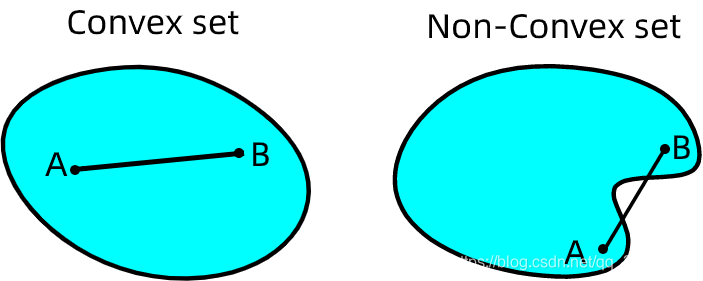
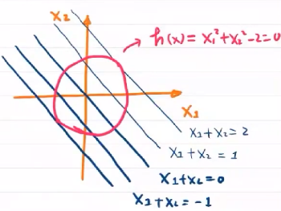
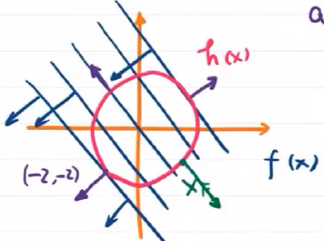
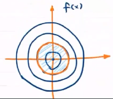
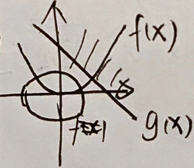

---
categories:
  - AI
  - 数学基础
tags:
  - AI
  - 数学基础
top: 4
mathjax: true
title: 4. 最优化方法
abbrlink: 241392904
date: 2023-08-17 20:38:01
---

> 从本质上讲，人工智能的目标就是最优化——在复杂环境中与多体交互中做出最优决策
>
> 几乎所有的人工智能问题都会归结为一个优化问题

- 在线性搜索中，确定寻找最小值时的搜索方向需要使用目标函数的一阶导数和二阶导数
- 置信域的思想是先确定搜索步长，再确定搜索方向

<!--more-->

## 4.1 基本概念

**目标函数(评价函数)：要实现最大化/最小化的函数**

- 目标函数可以看做是连续的山脉，最优化的过程就是判断顶峰的位置，并找到到达顶峰路径的过程

最优化理论研究的问题是：

- **判定** 给定目标函数的最大值（最小值）**是否存在**
- **找到** 令目标函数取到最大值（最小值）的**数值**。

大多数最优化问题都可以通过使目标函数最小化解决

- 最大化问题可以通过使 $-f(x)$ 最小化实现

### 4.1.1 最优化目标

理想情况下，最优化算法的目标是 **找到全局最小值**

- 全局最小值：全局最小值比定义域内所有其他点的函数值都小
- 局部极小值：局部极小值只比所有邻近点的函数值都小

当目标函数的输入参数较多、解空间较大时，绝大多数的实用算法都不能满足全局搜索对计算复杂度的要求，因而只能求出局部极小值。

在AI领域，只要目标函数取指足够小，就可以把这个值当做全局最小值实用，作为对 **性能和复杂度的折衷** 

### 4.1.2 凸优化

$$
\begin{cases}
\min f(x)\\
s.t.\quad &g_i(x)\le 0,i=1,2,\cdots,k\\
&\quad h_j(x)=0,j=1,2,\cdots,l
\end{cases}
$$

等式约束与不等式的解空间都是凸集

> 在欧氏空间中，凸集是对于集合内的每一对点，连接该对点的直线段上的每个点也在该集合内

**$凸集\cap 凸集=凸集$**

- 故有
  $$
  \begin{cases}
  目标函数是凸集\\
  可行域是凸集
  \end{cases}\Rightarrow 全局最优=局部最优
  $$
  
- 

Hessian 阵半正定，为凸函数
$$
\left[\begin{matrix}
\frac{\partial^2f}{\partial x_1^2} &\frac{\partial^2f}{\partial x_1\partial x_2}&\cdots&\frac{\partial^2f}{\partial x_1\partial x_n}\\
\frac{\partial^2f}{\partial x_1\partial x_2} &\frac{\partial^2f}{\partial x_2^2}&\cdots&\frac{\partial^2f}{\partial x_2\partial x_n}\\
\vdots&\vdots&\ddots&\vdots\\
\frac{\partial^2f}{\partial x_n\partial x_1} &\frac{\partial^2f}{\partial x_n\partial x_2}&\cdots&\frac{\partial^2f}{\partial x_n^2}\\
\end{matrix}
\right]
$$

### 4.1.3 分类

根据约束条件的不同，最优化问题可以分为无约束优化(unconstrained optimization)和约束优化(constrained optimization) 两类。

- 无条件优化：对自变量 $x$ 的取值没有限制
- 条件优化：对自变量 $x$ 的取值限制在特定的集合内，即需要满足一定的约束条件

## 4.2 无约束优化问题 

目标：
$$
\min\limits_{x\in R^n}f(x)
$$

### 4.2.1 线性搜索方法

先确定方向，再确定步长

#### 梯度下降法

> 沿目标函数值下降最快的方向寻找最小值，方向为梯度的反方向

##### 单个样本梯度下降法

**梯度**

当输入为数值，目标函数的图像为二维空间上的曲线，梯度为导数的反方向

当输入为向量，目标函数的图像就变成了高维空间上的曲面，梯度为垂直于目标函数等值线并指向函数值增加方向的方向向量

- 梯度：变大最快的方向
  $$
  \begin{cases}
  一点沿某一方向上的方向导为 \Gamma 的切线——\Gamma：过方向向量与xoy垂直的垂面与f(x,y,z)的交线\\
  某一点沿不同方向有不同的方向导，方向导最大方向为梯度 \bigtriangledown f\\
  梯度与等值面垂直
  \end{cases}
  $$

- $f(x)$ 沿梯度正方向增大，沿梯度负方向减小

**梯度下降**

要让目标函数以最快下降，就是要让自变量在梯度负方向上移动——**多元函数沿其负梯度方向下降最快** 

**步长** ：每次更新 $f(x)$ 时 $x$ 的变化值

- 较小的步长会导致收敛过程较慢
- 当 $f(x)$ 接近最小值点时，步长太大会导致迈过最小值点

在梯度下降法中，步长选择的整体规律是逐渐变小

$$
\omega\leftarrow \omega-\eta\bigtriangledown_x f(x)
$$

##### 多样本梯度下降法

**批处理模式**

计算每个样本上目标函数的梯度，再将不同样本的梯度进行求和，求和的结果作为本次更新中目标函数的梯度。

在批处理模式中，每次更新都要遍历训练集中所有样本，因而运算量比较大

**随机梯度下降法**

每次更新中只使用一个样本，下一次更新再使用另一个样本，在不断迭代中实现对所有样本的遍历

##### 梯度下降法分析

梯度下降法只用到了目标函数的一阶导数

- 一阶导数描述的是目标函数如何随输入的变化而变化

- 二阶导数提供了关于目标函数的曲率信息

  曲率影响的是目标函数的下降速度

  曲率为正，目标函数会比梯度下降法预期下降的更慢

  曲率为负，目标函数则会比梯度下降法预期下降的更快

只能利用目标函数的局部性质，因而难免盲目的搜索，导致收敛过慢

- 通过一阶导数，可以获知目标函数可能在多个方向上都有增加的导数，意味着下降的梯度有很多种选择。但不同选择的效果有好有坏

- 但无法获取导数的变化信息，即无法得知导数长期为负的方向

#### 牛顿法

将二阶导数引入优化过程，得到的典型方法就是牛顿法

> 将目标函数泰勒展开成二阶近似形式，再对近似形式求导并令其为0，得到的向量为下降最快的方向

- 相较梯度下降法，牛顿法下降速度快

### 4.2.2 非线性搜索——置信域方法

> 先确定步长，以步长为参数划定一个区域，再在这个区域内寻找最快大的下降方法

算法过程：

1. 设置 **置信域半径**  $s$ ，并在以当前点为中心、$s$ 为半径的封闭圆球形区域作为 **置信域**

2. 在置信域内寻找目标函数的二次近似模型的最优点，最优点与当前点的距离就是 **备选位移**

3. 在备选位移上，

   如果目标函数的二次近似产生了充分下降，就将当前点移动到计算出的最优点，并以此规则迭代，适当增加 $s$

   如果目标函数的近似下降不明显，则说明步长太大，需要缩小 $s$ 并重新计算备选位移

   直到满足备选位移

### 4.2.3 非地毯式搜索——启发式算法

核心思想：优生劣汰的生存法则，并在算法中增加了选择和突变等经验因素

智能程度高的表现在于善用启发式策略，不用经过大量搜索也能解决问题

- 生物进化——遗传算法
- 统计物理中固体结晶过程——模拟退火算法
- 低等动物产生集群智能——蚁群算法

- 大脑中神经元竞争和协作的机制——人工神经网络

## 4.3 约束优化问题

### 4.3.1 约束优化与Langrange函数

对于凸优化问题
$$
\begin{cases}
\min\limits_{x}f(x)\\
s.t.& h_j(x)=0&,j=1,2,\cdots,l\\
&g_i(x)\le 0&,i=1,2,\cdots,m
\end{cases}
$$
由 Lagrange 函数
$$
L(x,\alpha,\beta)=f(x)+\sum\limits_{i=1}^m\alpha_i g_i(x)+\sum\limits_{j=1}^l\beta_j h_j(x)\quad ,\alpha_i\ge 0,\beta_j\ge 0
$$
**求证：在满足 $\bigtriangledown_x L=0$ 的条件下，$\max L=f(x)$**

- 对 $L$ 求梯度过程为求 $L$ 最大值的过程

**在可行解域内**
$$
h_j(x)\equiv 0\Rightarrow \beta_jh_j(x)\equiv 0\\
g_i(x)\le 0且 \alpha_i\ge 0，故 \alpha_ig_i\le 0
$$

$$
\begin{aligned}
\max\limits_{\alpha,\beta}L(x,\alpha,\beta)&=\max\limits_{\alpha,\beta}\left[f(x)+\sum\limits_{i=1}^m\alpha_ig_i(x)+\sum\limits_{j=1}^l\beta_jh_j(x)\right]\\
&=f(x)+\max\limits_{\alpha,\beta}\left[\sum\limits_{i=1}^m\alpha_ig_i(x)+\sum\limits_{j=1}^l\beta_jh_j(x)\right]\\
&=f(x)
\end{aligned}
$$

**在可行解域外**
$$
\left.
\begin{aligned}
若h_j(x)\neq 0\Rightarrow \max \beta_jh_j(x)\rightarrow \infty\\
若g_i(x)>0\Rightarrow \max \alpha_ig_i(x)\rightarrow \infty
\end{aligned}
\right\}\Rightarrow 可行解域外，L(\alpha,\beta,x)\rightarrow \infty
$$

#### 对偶问题

$$
\begin{aligned}
目标函数为\min\limits_{x}f(x)&\iff \min\limits_{x}\max\limits_{\beta} L(x,\beta)\iff \max\limits_{\beta}\min\limits_{x} L(x,\beta)\\
&极大中取极小\ge 极小中极大
\end{aligned}
$$

相当于求原问题的下界，**故对于条件优化问题，拉格朗日函数与原目标函数有共同的最优点集和共同的最优目标函数值**

### 4.3.2 等式约束优化

$$
\begin{cases}
\min\limits_{x} f(x)\\
s.t. h_j(x)=0&,j=1,2,\cdots,l
\end{cases}
$$

设有 $\sigma_x$ ，对于任一 $x_F$ ，使 $f(x_F+\sigma_x)<f(x_F)$ ——即 $f(x)$ 为凸函数

**1.** 求 $f(x)$ 梯度
$$
\bigtriangledown_{x_k}f(x_k)=\frac{\partial f(x)}{\partial x_k}\Rightarrow\bigtriangledown_{x}f(x)=\sum\limits_{x_k\in\mathcal{X}}\frac{\partial f(x)}{\partial x_k}
$$

**2.** 求 $h(x)$ 梯度
$$
\bigtriangledown h(x)=\left(
\begin{aligned}
\bigtriangledown h(x_1)\\
\vdots\\
\bigtriangledown h(x_k)
\end{aligned}
\right)
$$
**3.** $h(x)$ 与 $f(x)$ 的梯度关系

**eg**
$$
\begin{cases}
\min\limits_{x}f(x)=\min\limits_{x}(x_1+x_2)\\
s.t. \quad h(x)=x_1^2+x_2^2-2=0
\end{cases}
$$
分别求 $f(x)$ 与 $h(x)$ 的梯度
$$
\bigtriangledown f(x)=\left(\begin{aligned}
\frac{\partial f}{\partial x_1}\\
\frac{\partial f}{\partial x_2}
\end{aligned}\right)=\left(
\begin{aligned}
1\\1
\end{aligned}
\right)\qquad \bigtriangledown h(x)=\left(
\begin{aligned}
2x_1\\2x_2
\end{aligned}
\right)
$$

从几何上可以看出，当 $\sigma_x\bot -\bigtriangledown_x f(x)$ 时，可找到最小值

---

从几何角度分析，当达到最优情况 $x_F$ 时，满足
$$
\begin{cases}
h(x_F+\sigma_x)=0\\
\sigma_x\cdot (-\bigtriangledown_xf(x_F))=0
\end{cases}\Rightarrow \bigtriangledown_xf(x_F)与 \bigtriangledown_xh(x_F)平行，有\\
-\bigtriangledown_xf(x_F)=\beta\bigtriangledown_xh(x_F),\beta\ge 0
$$
即优化问题等价于
$$
\begin{aligned}
&\begin{cases}
\min\limits_{x}f(x)\\
s.t. \quad h(x)=0
\end{cases}\\
&\Rightarrow L(x,\beta)=f(x)+\beta h(x),\beta \ge 0，求 \max\limits_{\beta}L(x,\beta)\\
令&\begin{cases}
\frac{\partial L}{\partial x}=0&\Rightarrow \bigtriangledown_x f(x)+\beta\bigtriangledown_xh(x)=0\\
&\Rightarrow -\bigtriangledown_x f(x)=\beta\bigtriangledown_xh(x)\\
\frac{\partial L}{\partial \beta}=0&\Rightarrow h(x)=0
\end{cases}
\end{aligned}
$$
**eg**

对于
$$
\begin{aligned}
&\begin{cases}
\min\limits_{x}f(x)=\min\limits_{x}(x_1+x_2)\\
s.t. \quad h(x)=x_1^2+x_2^2-2=0
\end{cases}\\
&L(x_1,x_2,\beta)=x_1+x_2+\beta(x_1^2+x_2^2-2)
\end{aligned}
$$
令
$$
\begin{cases}
\frac{\partial L}{\partial x_1}=0\\
\frac{\partial L}{\partial x_2}=0\\
\frac{\partial L}{\partial \beta}=0\\
\end{cases}\Rightarrow \begin{cases}
1+2\beta x_1=0\\
1+2\beta x_2=0\\
x_1^2+x_2^2-2=0
\end{cases}\xRightarrow{代入后，得\beta^*}\begin{cases}
x_1^*=x_1\beta_1^*\\
x_2^*=x_x\beta_2^*\\
\end{cases}
$$

###  4.3.3 不等式优化

$$
\begin{cases}
\min\limits_{x} f(x)\\
s.t. g_i(x)\le 0&,i=1,2,\cdots,m
\end{cases}
$$

有Lagrange函数 
$$
L(x,\alpha)=f(x)+\sum\limits_{i=1}^m\alpha_ig_i(x),\alpha_i\ge 0
$$

#### 最优值在约束范围内

等价于全局最优，即为无约束优化问题
$$
\begin{cases}
\min\limits_{x}f(x)\\
g_i(x)<0\quad,i=1,2,\cdots,m
\end{cases}
$$

eg:
$$
\begin{aligned}
&\begin{cases}
\min\limits_{x}f(x)=x_1^2+x_2^2\\
s.t.\quad g(x)=x_1^2+x_2^2-1\le 0
\end{cases}\Rightarrow\begin{cases}
f(x)=x_1^2+x_2^2\\
g(x)=x_1^2+x_2^2-1<0
\end{cases}\\
&且 \max\limits_{\beta} L(x,\beta)=f(x)\xRightarrow{g(x)<0}\alpha=0
\end{aligned}
$$

#### 最优值不在约束范围内

$$
梯度关系\begin{cases}
平行:-\bigtriangledown_xf(x)=\alpha g(x)\\
同向：\alpha>0
\end{cases}
$$

令 $L(x,\alpha)=f(x)+\alpha g(x)$ 
$$
\begin{aligned}
&在可行解域内，g(x)\le 0,\alpha>0\Rightarrow \alpha g(x)\le 0\\
&且 \max\limits_{\alpha}L(x,\alpha)=f(x)+\max\limits_{\alpha} \alpha g(x)=f(x)\xRightarrow{\max\limits_{\alpha} \alpha g(x)=0}g(x)=0
\end{aligned}
$$
即最优值不在约束域内，则一般在边界上

###  4.3.3 约束优化总结——KKT条件

$$
\min\limits_{x}\max\limits_{\alpha,\beta}L(x,\alpha,\beta)=\min\limits_{x}\max\limits_{\alpha,\beta}\left[f(x)+\sum\limits_{i=1}^m\alpha_ig_i(x)+\sum\limits_{j=1}^l\beta_jh_j(x)\right],\alpha_i\ge 0,\beta_j\ge 0\\
KKT\begin{cases}
\bigtriangledown_xL =0\Rightarrow -\bigtriangledown_xf(x)=\sum\limits_{i=1}^m\alpha_i\bigtriangledown_xg_i(x)+\sum\limits_{j=1}^l\beta_j\bigtriangledown_xh_j(x)\\
\frac{\partial L}{\partial \alpha_i}=0\quad ,\alpha_i\ge 0,\quad \alpha_ig_i(x)\le 0\begin{cases}
\alpha_i=0,g_i(x)<0,\quad 最优解在约束范围内\\
g_i(x)=0,\alpha_i>0 ,\quad 最优解不在约束范围内，一般在边界
\end{cases}
\\
\frac{\partial L}{\partial \beta_j}=0\quad ,\beta_j\ge 0
\end{cases}
$$

