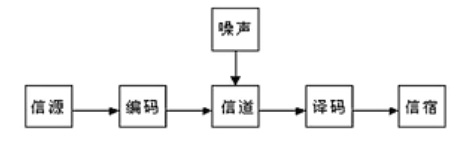
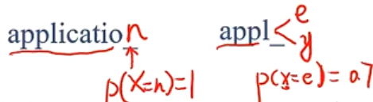

不确定性才是客观世界的本质属性。不确定性的世界只能使用概率模型来描述，正是对概率模型的刻画促成了信息论的的诞生

信息论在世界的不确定性和消息的可测量性之间搭建桥梁

- 条件熵和信息增益是分类问题中的重要参数
- KL散度用于描述两个不同概率分布之间的差异
- 最大熵原理是分类问题中的常用准则

<!--more-->

## 5.1 概念

香农——通信的数学理论，给定了对信息这一定性概念的定量分析方法

### 5.1.1 基本问题

假设在一个噪声信道上发送消息，需要考虑如何对每一个信息进行编码、传输以及解码，使得接收者尽可能准确地重构出消息

消息通常有意义，即根据某种体系，消息本身指向或关联着物理上或概念上的特定实体，但消息的语义与(产生/接收消息的)工程问题无关——将信息的传播与处理完全剥离

信息论将信息的传递看作一种统计现象

- 信息传输
- 信息压缩

一条消息来自于一个所有可能的消息集合——所有类型的消息都被抽象为逻辑符号——随机变量

### 5.1.2 自信息

在生活中，信息的载体是消息，不同的消息带来的信息量也是不同的

- 消息1：中国男足夺世界杯冠军，赔率 $1:1000$ 
- 消息2：中国男乒夺世界杯冠军，赔率 $1:2$ 

随机事件的不确定性越大(小概率事件发生的概率)，其可能性越小，提供的信息量就越大

- **一个消息的不确定性(信息量)的表征——熵，一个系统内在的混乱程度** ，衡量一个随机事件的不确定性

若事件 $A$ 发生的概率为 $P(A)$ ，则这个事件的信息量(自信息)为 $I(A)=-log_2P(A)$ 

- 消息1信息量 $I(A)\approx 10$ 不经常发生，信息量大
- 消息2信息量 $I(A)=1$ 经常发生，信息量小

对于确定性事件 $A$ ，其概率 $P(A)=1$ ，自信息为 $I(A)=0$

### 5.1.3 信息熵

> 信息论用 **信息熵** 的概念对单个信源的信息量和通信中传递信息的数量与效率等问题做出了解释

**信源的信息熵** 是信源可能发出的各个符号的自信息量在信源构成的概率空间上的统计平均值——随机变量 $X$ 的自信息的数学期望

一个离散的信源 $X$ 包含 $m$ 个符号，每个符号 $a_i$ 的取值概率为 $p(a_i)$ ，则 $X$ 的信息熵为
$$
H(X)=-\sum\limits_{i=1}^mp(a_i)log_2p(a_i)
$$
信源的信息熵描述了每发送一个符号所提供的平均信息量，是信源总体信息测度的均值 

当信源中的每个符号的取值概率相等时，信息熵取到最大值 $\log_2m$ ，意味着信源的随机程度最高

信息熵最小值为0，某个 $p(a_t)=1$ ，则有其余 $p(a_i)=0$ ，自信息和为0

#### 熵编码

在对分布 $p(y)$ 的符号进行编码时，熵 $H(p)$ 也是理论上最优的平均编码长度，这种编码方式称为熵编码

编码原则：出现概率高的符号，编码长度小——**信息量小的符号赋予更小的编码长度** 

用每个编码的自信息作为其编码长度

假设有三种字符 $\{a,b,c\}$ ，则每种字符平均编码长度为 $H(a)=-p(a)\log p(a)$ ，$H(b)=-p(a)\log p(b)$ ，$H(c)=-p(c)\log p(c)$ ，总编码长度为信息熵 $H(P)$ 

### 5.1.4 交叉熵

> 交叉熵主要用于度量同一个随机变量X的 **预测分布q与真实分布p** 之间的 **差距**

按照概率分布 $q$ 的最优编码对真实分布为 $p$ 的信息进行编码的长度
$$
\begin{aligned}
H(p,q)&=E_p[-\log q(x)]\\
&=-\sum\limits_{x}p(x)\log q(x)
\end{aligned}
$$

- 已知真实分布 $p$ 的最优编码长度为(最小编码长度)
  $$
  H(p)=-\sum\limits_{x}p(x)\log p(x)
  $$

- 在给定 $q$ 的情况下，如果 $p$ 和 $q$ 越接近，交叉熵越小

  当 $q=p$ 时，交叉熵为最小值 $H(p)$ 

### 5.1.5 KL散度

> KL散度：用概率分布 $Q$ 近似真实概率分布 $P$ 时所造成的信息损失量
>
> - 两个概率分布间差异的非对称性度量

描述两个概率分布 $P$ 和 $Q$ 之间的差异的一种方法，定义为
$$
\begin{aligned}
D_{KL}(P\Vert Q)&=\sum\limits_{i=1}^Np(x_i)\log\frac{p(x_i)}{q(x_i)}\\
&=\sum\limits_{i=1}^Np(x_i)\log p(x_i)-\sum\limits_{i=1}^Np(x_i)\log q(x_i)\\
&=H(p,q)-H(p)
\end{aligned}
$$
给定一个信源，其符号的真实概率分布为 $P(X)$ ，设计一种针对 $P(X)$ 的最优编码方式M，使得该信源所需的平均编码长度最少（等于信息熵）

当信源的符号集合不变，但其概率分布变为 $Q(X)$ ，再用同样的编码方式M对编其编码，此时会比最优值多一些编码长度（信息熵会增加）

KL散度用于衡量这种情况下平均每个字符多用的平均编码长度，也可以**表示两个分布之间的距离**

---

非负性：KL散度 $\ge 0$ ，只有在两个分布完全相同时取等

非对称性：$D_{KL}(P\Vert Q)\neq D_{KL}(Q\Vert P)$

- 要让 $D_{KL}(P\Vert Q)$ 最小，需要让 $Q(X)$ 在 $P(X)$ 不等于0的位置不等于0

- 要让 $D_{KL}(Q\Vert P)$ 最小，需要让 $Q(X)$ 在 $P(X)$ 等于0的位置等于0

### 5.1.6 条件熵

如果两个信源之间有相关性，在已知其中一个信源 $X$ 的条件下，另一个信源 $Y$ 的信息熵就会减小

用 **条件熵** $H(Y\vert X)$ 表示在已知随机变量 $X$ 的条件下另一个随机变量 $Y$ 的不确定性
$$
H(Y\vert X)=\sum\limits_{i=1}^NP(x_i)H(Y\vert X=x_i)=-\sum\limits_{i=1}^N\left[P(x_i)\sum\limits_{j=1}^CP(y_j\vert x_i)log_2P(y_j\vert x_i)\right]\\=-\sum\limits_{i=1}^N\sum\limits_{j=1}^CP(x_i,y_j)log_2P(y_i\vert x_i)
$$
条件熵的意义在于先按照变量 $X$ 的取值对变量 $Y$ 进行了一次分类，对每个分出来的类别计算其单独的信息熵，再将每个类的信息熵按照 $X$ 的分布计算数学期望——**分类会带来不确定性的下降**

- 教室中可能出现的座位分布在不加约束时，信息熵会很大
- 对座位的选择添加限制条件（如男左女右），相对于未加限制时的情形会简单很多

#### 互信息

$$
I(X;Y)=H(Y)-H(Y\vert X)
$$

可以看做 $X$ 给 $Y$ 带来的信息增益——机器学习领域

**信息增益常被用于分类特征的选择**。

- 对于给定的训练数据集 $Y$ ，$H(Y)$ 表示在未给定任何特征时，对训练集进行分类的不确定性
- $H(Y\vert X)$ 表示了使用特征 $X$ 对训练集 $Y$ 进行分类的不确定性
- 信息增益表示特征 $X$ 带来的对训练集 $Y$ 分类不确定性的减少程度，即特征 $X$ 对训练集 $Y$ 的区分度

信息增益更大的特征具有更强的分类能力。

---

由于其值很大程度上依赖于数据集的信息熵 $H(Y)$，不具有绝对意义，故有 **信息增益比** 的概念，$g(X,Y)=\frac{I(X;Y)}{H(Y)}$

## 5.2 信息熵与对数似然

以分类为例

假设真实概率分布为 $P_r(y\vert x)$ 

- 假设 $y^*$ 是 $x$ 的真实分类
  $$
  \begin{cases}
  p_r(y^*\vert x)=1\\
  p_r(y\vert x)=0&\forall y\neq y^*
  \end{cases}
  $$
  $p_r(y\vert x)=\left(\begin{aligned}0\\\vdots\\1\\\vdots\\0\end{aligned}\right)$ one-hot向量，只有真实分类对应的分量为1

学习得到的概率分布为 $P_\theta(y\vert x)$ 

损失函数——衡量真实分布于学习分布的差异
$$
\begin{aligned}
D_{KL}(p_r(y\vert x)\Vert p_\theta(y\vert x))&=\sum\limits_{y}p_r(y\vert x)\log_2\frac{p_r(y\vert x)}{p_\theta(y\vert x)}&KL散度\\
&\propto -\sum\limits_{y}p_r(y\vert x)\log_2p_\theta(y\vert x)&交叉熵损失\\
&=-\log p_\theta(y^*\vert x)&负对数似然
\end{aligned}
$$
最小化KL散度，相当于最小化交叉熵损失，相当于最大化对数似然

## 5.3 最大熵原理

> 确定随机变量统计特性时，试图最符合客观情况的一种准则

对于一个未知的概率分布，最坏情况就是他等可能的取到每个取值，此时随机变量的随机程度最高，对其进行预测也最困难

- 得到最不确定的结果， 预测的风险越小

### 5.3.1 最大熵模型

首先确定若干特征函数作为分类依据

为保证特征函数的有效性，其在模型真实分布 $P(X)$ 上的数学期望和在由训练数据集上推导出的经验分布 $\widetilde{P}(X)$ 上的数学期望应该相等——对特征函数数学期望的估计应该是个无偏估计量

此时，每个特征函数就对应了一个约束条件。

**分类的任务就是在约束条件下，确定一个最好的模型**。

由于除这些约束条件外，没有任何关于分类的先验知识，因而需要利用最大熵原理，求解出不确定性最大的条件分布，即让以下函数取最大值
$$
H(P)=-\sum\limits_{x,y}\widetilde{P}(x)P(y\vert x)log_2P(y\vert x)
$$
$P(y\vert x)$ 为分类问题要确定的目标条件分布

---

上述计算过程实质上就是一个约束优化问题。从数学上可以证明，这个模型的解是存在且唯一的
