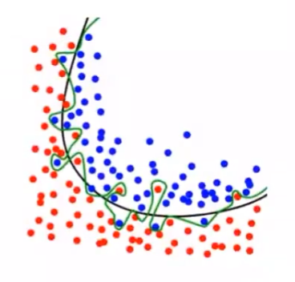

[TOC]

---

机器学习是计算机基于数据构建概率统计模型并运用模型对数据进行预测和分析的学科

根据输入输出类型的不同，机器学习分为：分类问题，回归问题，标注问题三类

过拟合是机器学习中不可避免的，可通过选择合适的模型降低影响

监督学习是机器学习的主流任务，包括生成方法和判别方法两类

<!--more-->

## 1.0 理解机器学习

### 1.0.1 对学科范畴的明确

- 科学：是什么，为什么可以

- 技术：怎么做

- 工程：做得多快好省

- 应用

机器学习更多的是一门科学与技术

### 1.0.2 总体认知

人类的学习机制是一种 **基于经验的学习方式**，即从大量现象、经验(数据)中提取规律(模型)，利用规律(模型)对新情况做出有效决策。

机器学习也是一种基于经验的学习方式，研究内容是如何从数据中产生模型(如何提取规律)，即对 **学习算法** 的研究。在确定学习算法后，就能基于经验生成 **模型** (规律)，在面对新样本时模型会给出相应决策。 同时，机器学习也是一种 **PAC学习** ，由于机器学习的问题一般是真实数据分布未知、且目标函数也未知，所以我们降低了对学习算法能力的期望，希望他能在多项式时间中根据有限样本集给出近似正确模型。

学习过程可以看作学习算法运用数据在模型 **假设空间** $\mathcal{H}$ (hypothesis) 中搜索 $\hat{f}$ 用以近似 $f$ 的过程。搜索目标是找到与训练集最匹配的 **假设** (某个学习算法下超参数确定的模型)。有很多 **策略** (与训练集的匹配原则) 可以对这个假设空间进行搜索，利用 **优化算法** ，可以更快地确定最匹配的假设。

通常认为样本空间中全体样本服从某个未知的分布 $\mathcal{D}$ (训练数据集、测试数据集与未来数据集都来源于这个分布) ，且样本之间独立同分布(一个样本不影响另一个样本的产生)。机器学习的目标是使学得的模型更好地适用于 *新样本*，即关注模型的 **泛化能力**。因此，**采样方法** 是影响模型泛化能力的一个重要因素(希望训练集能很好地反映样本空间的特性)。

在现实问题中，学习过程基于有限样本的训练集，但可以准确描述这一训练集的假设有很多(来源于不同学习算法的模型或同一学习算法超参数不同的模型)，即对于某一个实际问题，存在一个 **假设集**。由 **丑小鸭定理** 可知，即使是这一假设集中的假设差距也很大。**归纳偏好** 是学习算法在假设空间中对假设进行选择的原则，即学习算法本身做出的 “什么模型更好” 的假设。最常用的归纳偏好是 **奥卡姆剃刀** （模型越简单越好），但解决什么模型是简单的也不简单。

> 首先要解决什么学习算法更好——回答问题想要什么结果

一个学习算法 $\mathcal{L}_a$ 基于某种归纳偏好产生了对应的模型 $A$ ，学习算法 $\mathcal{L}_b$ 基于另一种归纳偏好产生了对应的模型 $B$ ，对于一些问题，$A$ 优于 $B$ ；一定存在另一些问题， $B$ 优于 $A$ 。换言之，无论学习算法 $\mathcal{L}_a$ 多聪明、$\mathcal{L}_b$ 多笨拙，二者对于所有潜在的问题其期望性能都相同，即 **没有免费午餐(NFL)** 定理。

NFL定理的一个重要前提是所有问题出现的可能性相等或所有问题同样重要，但实际情况是我们只关注自己试图解决的问题。机器学习中，一个问题定义为给定输入域与输出域，要找到映射关系 $\mathcal{X}\mapsto \mathcal{Y}$ 。问题不同，则刻画问题的数据也是不一样的，生成数据 $\mathcal{X}$ 的分布 $f(\cdot)$ 也是不同的，而在不同分布的数据上进行数据分析所使用的技术肯定也不一样。我们希望找到对于该问题最好的解决方案，至于这个解决方案在其他问题上的好坏并不关注。故学习算法没有绝对的优劣之分，只有对当前问题的适配程度之分，常见的各种经典算法，只是在大部分问题上表现不错的算法，并不适合每一个问题。

学习算法自身的归纳偏好与问题是否匹配有决定性作用，要 **具体问题具体分析** ，机器学习的最优学习算法往往来自于：按需设计、度身定制。

[机器学习的问题分类](#classify)

> 其次是选择哪个模型能更好的解决当前问题——评估模型给出的是不是问题想要什么结果

由前述的NFL：只需要给出当前问题需要的结果即可，不需要关注是否能给出其他问题需要的结果。

总之，我们希望模型能很好地适应当前问题的新样本，即有较强的 **泛化能力** 。一方面，根据经验风险最小化策略训练出的模型并不能保证模型的泛化能力，同时过拟合问题是无法避免的；另一方面，能描述一个训练集的模型可能有很多个。所以需要从模型的评估指标与方法入手，对模型的泛化性能做出判断，根据模型泛化性能的好坏选择最终的模型。

对于模型的评价要选择合适的性能度量指标，同时要用科学的评估方法对多次得到的性能指标取平均值。为衡量其泛化能力，需要通过比较检验得到模型在统计意义上的泛化性能，同时也需要通过比较检验，判断模型之间在统计意义上的优劣。

对泛化误差影响因素的分析给我们的启示是：欠拟合是可以避免的，但过拟合是无法避免的，只能尽量减小。常用的方法有：正则化，增大样本容量，干扰优化过程，集成学习。

## 1.1 机器学习概念

### 1.1.1 定义

> A computer program is said to learn from E with respect to some class of tasks T and performance measure P ,if its performance at tasks T as measured by P improves with experience E.

经典定义（1997）：研究如何通过计算的手段，利用经验(数据)及统计方法提高系统性能

计算机科学是关于算法的科学：机器学习是对学习算法的设计，分析与应用的学科

数据分析角度定义：机器学习是利用计算机进行数据分析的科学，研究 **计算机基于数据构建概率统计模型**，并 **运用该模型对数据进行预测与分析** 

### 1.1.2 机器学习理论基础—PAC学习

**计算学习理论** 是通过计算研究学习的理论，能够分析问题难度、计算模型能力，为学习算法提供理论保证，并指导机器学习模型和学习算法的设计。其基础理论为 **概率近似正确** (PAC Probably Approximately Correct) 
$$
P(\vert \hat{f}(x)-y\vert\le \varepsilon)\ge 1-\delta
$$
对于一个数据 $x$ ，其真实结果为 $y$ ，通过假设 $\hat{f}(\cdot)$ 可以得到一个预测结果。我们希望假设模型越准越好，即预测结果与真实结果差距 $\varepsilon$ 越小越好，当 $\varepsilon=0$ 时，意味着假设绝对正确。但并不能保证每次运行都能获取绝对正确的假设，只能希望每次以很高的概率得到这个准确的假设。

- 为什么是概率正确模型，而不是拿到绝对正确模型

  从计算角度理解：机器学习解决的问题是NP(非多项式时间可解)问题

  从问题角度理解：机器学习解决的问题通常是高度不确定性、高度复杂性且不知道怎么去解决。当知识不能精确给出结果时，从数据中分析，希望从数据中给出答案，此时不能要求这个答案是百分百准确。

在解决实际问题时，我们用 **泛化误差** $\mathcal{G}(f)$ 量化假设 $\hat{f}(\cdot)$ 对未知数据的预测能力。 泛化误差衡量的是期望误差与经验误差的差异，但由于真实的数据分布未知、且目标函数也未知，所以需要降低对学习算法能力的期望。只期望学习算法以一定的概率学习到一个近似正确的假设， 即 **PAC学习：在多项式时间内从合理数量的训练数据中学习到一个近似正确的 $\hat{f}(x)$ ** 。

- 近似正确：一个假设 $\hat{f}\in \mathcal{H}$ 是近似正确的，是指其在泛化误差 $\mathcal{G}(\hat{f})$ 小于一个界限 $\varepsilon(0<\varepsilon <\frac{1}{2})$ 

- 概率：一个学习算法  $\mathcal{A}$ 有可能以 $1-\delta$ 的概率学习到这样一个近似正确的假设 $\hat{f}$ ，$0<\delta<\frac{1}{2}$

$$
P\left(\left[R_{exp}(\hat{f})-R_{emp}(\hat{f})\right]\le \varepsilon\right)\ge 1-\delta
$$

其中 $\varepsilon,\delta$ 是和样本数量 $N$ 以及假设空间 $\mathcal{F}$ 相关的变量。如果固定 $\varepsilon,\delta$ 可以反过来计算所需的样本数量
$$
N(\varepsilon,\delta)\ge \frac{1}{2\varepsilon^2}(\log \vert \mathcal{F}\vert+\log\frac{2}{\delta})
$$

- 模型越复杂($\vert \mathcal{F}\vert$ 越大)，模型的泛化能力越差，要达到相同的泛化能力，越复杂的模型需要的样本数量越多

#### 机器学习前提

对于一个问题，没有明确可定义的规则或知识可以解决

已知该问题存在可学习的模型

有某种形式的数据供学习

#### 归纳偏好

任何机器学习必有其偏好：相信什么模型是更好的、什么假设是更合理的，这些假设就被称为 **归纳偏好**

- 最近邻分类器中，假设在特征空间中，一个小的局部区域中的大部分样本同属一类
- 朴素贝叶斯分类器中，假设每个特征的条件概率是互相独立的——先验

学习算法的归纳偏好是否与问题本身匹配，直接决定了算法是否能取得很好的性能

##### 奥卡姆剃刀

归纳偏好的一般原则是：简单模型的泛化能力更好，但 **评价模型是否简单也不容易**

###### 最小描述长度

对一个数据集 $D$ ，最好的模型 $f\in \mathcal{F}$ 会使得数据集的压缩效果最好，即编码长度最小

贝叶斯角度

#### NFL定理——学习算法间的比较

> 没有免费的午餐：学习算法对所有潜在问题的期望性能相同

假设样本空间 $\mathcal{X}$ 与假设空间 $\mathcal{H}$ 都是离散的。令 $P(h\vert X,\mathcal{L}_a)$ 表示算法 $\mathcal{L}_a$ 基于训练数据 $X$ 产生的假设 $h$ 的概率，令 $f$ 为样本空间的某个真实分布函数。对于学习算法 $\mathcal{L}_a$ 在训练集外的误差表示为
$$
E_{ote}(\mathcal{L}_a\vert X,f)=\sum\limits_{h\in \mathcal{H}}\sum\limits_{x\in \mathcal{X}-x}P(x)\mathbb{I}(h(x)\neq f(x))P(h\vert X,\mathcal{L}_a)
$$
而对于一个二分类问题，考虑其真实目标函数可以是任意一个 $\mathcal{X}\mapsto\{0,1\}$ 的函数(由样本出现的组合表征某一个分布)，若所有分布 $f$ 出现的可能相同，即按均匀分布对学习算法 $\mathcal{L}_a$ 的训练集外误差求和
$$
\begin{aligned}
\sum\limits_{f}E_{ote}(\mathcal{L}_a\vert X,f)&=\sum\limits_{f}\sum\limits_{h\in \mathcal{H}}\sum\limits_{x\in \mathcal{X}-x}P(x)\mathbb{I}(h(x)\neq f(x))P(h\vert X,\mathcal{L}_a)\\
&=\sum\limits_{x\in \mathcal{X}-x}P(x)\sum\limits_{h\in \mathcal{H}}P(h\vert X,\mathcal{L}_a)\sum\limits_{f}\mathbb{I}(h(x)\neq f(x))\\
&=\sum\limits_{x\in \mathcal{X}-x}P(x)\sum\limits_{h\in \mathcal{H}}P(h\vert X,\mathcal{L}_a)\frac{1}{2}2^{\vert\mathcal{X}\vert}\\
&=\frac{1}{2}2^{\vert\mathcal{X}\vert}\sum\limits_{x\in \mathcal{X}-x}P(x)\sum\limits_{h\in \mathcal{H}}P(h\vert X,\mathcal{L}_a)\\
&=\frac{1}{2}2^{\vert\mathcal{X}\vert}\sum\limits_{x\in \mathcal{X}-x}P(x)\
\end{aligned}
$$
即总误差与学习算法无关，$\sum\limits_{f}E_{ote}(\mathcal{L}_a\vert X,f)=\sum\limits_{f}E_{ote}(\mathcal{L}_b\vert X,f)$

- 函数空间大小：对某个二分类问题，假设样本空间为 $\mathcal{X}=\{x_a,x_b\}$ ，所有可能的真实分布 $f$
  $$
  f_1:f_1(x_a)=0,f_1(x_b)=0\\
  f_2:f_2(x_a)=0,f_2(x_b)=1\\
  f_3:f_3(x_a)=1,f_3(x_b)=0\\
  f_4:f_4(x_a)=1,f_4(x_b)=1\\
  $$
  即共有 $2^{\vert \mathcal{X}\vert}=2^2=4$ 种样本组合，也就是有四个不同的分布函数才能产生这些样本组合，此时不管学习算法 $\mathcal{L}_a$ 得出的模型 $h(x)$ 对每个样本预测为0还是1，总有一半的概率使 $\mathbb{I}(\cdot)=1$ ，即 $\sum\limits_{f}\mathbb{I}(h(x)\neq f(x))=\frac{1}{2}2^{\vert \mathcal{X}\vert}$

**对于某个问题，所有学习算法产生的所有模型都是错的，但有些模型是有用的** 

没有最好的解决方案，只有最合适的解决方案，要根据 **具体问题具体分析** 

#### 丑小鸭定理

> 丑小鸭与白天鹅之间的区别和两只白天鹅之间的区别一样大

世界上不存在相似性的客观标准，一切相似性的标准都是主观的

即针对同一问题的同一训练集设计的假设集，**假设与假设之间的差距很大**。

### 1.1.3 术语

$$
数据集=\begin{cases}
训练集\begin{cases}
训练集(\mbox{training set})&模型训练\\
验证集(\mbox{validation set})&模型选择
\end{cases}\\
测试集(\mbox{test set})\qquad \qquad \qquad \quad模型评估
\end{cases}
$$

数据：

- 示例(instance)：对对象某些性质的描述，不同的属性值有序排列得到的向量

  - 属性(attribute)，特征(feature)：被描述的性质

  - 属性值

- 样例(example)：有结果

  标签(label)：示例的对应的结果

- 样本(sample)

不同的属性之间视为相互独立，每个属性都代表了不同的维度，这些属性共同张成了 **特征空间** ，属性空间，输入空间

每个示例都可以看做特征空间中的一个向量—— **特征向量** (feature vector)

标记空间，输出空间

---

约定：

- 学习算法：Algorithm，如：线性模型、SVM、贝叶斯等
- 模型，学习器：学习算法在训练数据集上得出的超参数确定的model

### 1.1.4 机器学习过程

1. 得到有限的训练数据集合
2. 确定学习模型的集合——Model
3. 确定模型选择的准则(评价准则)——Strategy 风险
4. 实现最优模型求解算法——Algorithm 最优化理论
5. 运行算法 $\Rightarrow$ 最优化模型
6. 预测新数据，分析

**eg** 

需要学习的未知潜藏模式：批准信用卡是否对银行有利(good/bad)

## 1.2 ML特点

- 以计算机及网络为平台
- 以数据为研究对象
- 目的是对数据进行分析和预测
- 以方法为中心：基于数据构建模型
- 交叉学科

### 1.2.1 以数据为研究对象

提取数据特征，将数据特征抽象为模型，利用模型对未知数据进行分析预测。

前提：同类数据有一定统计规律，可以用概率统计的方法处理
$$
\begin{array}{c|c}
\hline
随机变量&数据特征\\
概率分布&数据的统计规律\\
变量/变量组&一个数据点\\
\hline
\end{array}
$$

实质上就是 **一种新的数据分析方法**

### 1.2.2 目标

机器学习目标：根据已有的训练数据推导出所有数据的模型，并根据得出的模型实现对未知测试数据的最优预测

总目标：学习什么样的模型，如何构建模型(怎么评价模型的优劣)

### 1.2.3 方法——基于数据构建模型

**方法=模型+策略+算法**

- 模型 from  Hypothesis space：选定某一类模型——SVM/EM
- 策略Strategy：模型选择标准、准则evaluation criterion——$J(\theta)$ ，风险最小化
- 算法Algorithm：怎样快速确定模型

从给定的、有限的、用于学习的训练数据集(Training data)出发，且训练集中的数据具有一定的统计特性，可以视为满足 **独立同分布** 的样本。

假设待学习的模型属于某个函数集合——假设空间(Hypothesis space)

应用某个评价准则(Evaluation criterion)——策略

通过算法(Algorithm)选取一个最优化模型

使它在给定的策略下对已知的训练集和测试集有最优预测

#### 模型

$$
监督学习\begin{cases}
条件概率\\
决策函数
\end{cases}\Rightarrow 假设空间\mathcal{F}：模型的所有可能的集合
$$

$$
\begin{cases}
\mathcal{F}=\{f\vert Y=f(x)\}，由参数决定的参数族\\
\quad决策函数\begin{cases}
线性模型:\omega,b\\
SVM：\omega,b,\alpha\\
EM:\pi,\theta
\end{cases}\\\\
\mathcal{F}=\{f\vert Y=f_{\theta}(X),\theta\in R^m\}\\
\quad P_{\theta}(Y\vert X)条件概率分布\begin{cases}
用于分类，预测arg\max\limits_{y}P(Y\vert X)
\end{cases}
\end{cases}
$$

#### 策略

> 按什么样准则选择具有最优参数组的模型

损失：度量模型 **一次** 预测的好坏

风险：度量 **平均** 意义下预测的好坏

##### 常用损失函数

预测模型得出的预测值 $f(x)$ 与 $y$ 有差距，用损失函数 $\mathcal{L}(y,f(x))$ 表示
$$
\begin{cases}
0-1&\mathcal{L}(y,f(x))=\begin{cases}
1,y\neq f(x)\\
0,y=f(x)
\end{cases}\\
&\mathbb{I}(y\neq f(x))表示不等则为1\\\\
平方损失&\mathcal{L}(y,f(x))=\frac{1}{2}(y-f(x))^2——放大损失\\\\
绝对损失&\mathcal{L}(y,f(x))=\vert y-f(x)\vert\\\\
对数损失&\mathcal{L}(y,P(Y\vert x))=-logP(y\vert x)
\end{cases}
$$

对数损失——交叉熵损失

> 一般用于分类问题

假设样本标签 $y\in [1,\cdots,C]$ 为离散类别，模型 $f(x;\theta)\in [0,1]^C$ 的输出为类别标签的条件概率
$$
p(y=c\vert x;\theta)=f_c(x;\theta)\\
且满足 f_c(x;\theta)\in [0,1]\qquad \sum\limits_{c=1}^Cf_c(x;\theta)=1
$$
用 one-hot 向量 $y$ 表示样本标签的真实条件概率分布 $p_r(y\vert x)$ ，记为 $y_c$

对于两个概率分布，一般用交叉熵来衡量二者差异
$$
\begin{aligned}
\mathcal{L}(y,f(x;\theta))&=-y^T\log f(x;\theta)\\
&=-\sum\limits_{c=1}^Cy_clogf_c(x;\theta)
\end{aligned}
$$

由于 $y$ 是 one-hot 向量，也可写作
$$
\mathcal{L}(y,f(x;\theta))=-\log f_y(x;\theta)
$$
其中 $f_y(x;\theta)$ 可以看做真实类别 $y$ 的似然函数

##### 风险函数(期望损失)

> 关于联合分布的期望损失(expectation risk)

$$
\begin{aligned}
R_{exp}(f)&=E\left[\mathcal{L}(y,f(x))\right]\quad 期望损失对P(y\vert x) 进行评价\\
&=\int_{\mathcal{xy}}\mathcal{L}(y,f(x))P(x,y)dxdy\\
\end{aligned}
$$

表示 $f(x)$ 关于联合分布 $P(x,y)$ 的平均意义下的损失

$R_{exp}(f)$ 不可计算：$P(x,y)$ 未知

- 若 $P(x,y)$ 已知，则可通过 $P(y\vert x)$ 计算
- 病态：期望损失用到 $P(y\vert x)$

**期望风险最小化策略**

- 后验概率最大化策略

  朴素贝叶斯

  逻辑斯蒂回归

##### 经验函数(平均损失)

> empirical risk

$D=\{(x_1,y_1),(x_2,y_2),\cdots,(x_n,y_n)\}$

$$
R_{emp}(f)=\frac{1}{n}\sum\limits_{i=1}^n\mathcal{L}(y_i,f(x_i))\xrightarrow{n\rightarrow\infty}R_{exp}(f)
$$

---

**极大似然估计是经验风险最小化(ERM)策略** 
$$
x_1,x_2,\cdots,x_n\overset{iid}{\sim}P(X)，求X服从分布的参数
$$
可观测样本的联合概率分布一定是最大（非小概率事件）可采样的，$P$ 越大，联合概率 $P$ 越大
$$
P(x_1)P(x_2),\cdots,P(x_n)=\prod\limits_{i=1}^nP(x_i)\\
\max\prod\limits_{i=1}^nP(x_i)=max\sum\limits_{i=1}^nlogP(x_i)=-min\sum\limits_{i=1}^nlogP(x_i)
$$
可得损失函数，也即对数损失函数。即经验风险最小化策略

---

由于实际建模时 $N$ 很小，需要对 $R_{emp}$ 矫正
$$
\begin{cases}
经验风险最小化\\
结构风险最小化+正则化项，控制过拟合程度
\end{cases}
$$

###### 经验风险最小化和结构风险最小化

**样本量足够大，用经验风险最小化策略** 
$$
\min\limits_{f\in \mathcal{F}} \frac{1}{n}\sum\limits_{i=1}^n\mathcal{L}(y_i,f(x_i))
$$
**样本容量小** ——过拟合 $\leftarrow$ 参数过多

过拟合解决思路 $\begin{cases}加样本容量\\加正则化项\end{cases}$ 

> 用结构风险最小化策略——structural risk minimization，SRM

$$
R_{srm}(f)=\frac{1}{n}\sum\limits_{i=1}^n\mathcal{L}(y_i,f(x_i))+\lambda J(f)\begin{cases}
f越简单，参数量越少,J(f)越小\\
f越复杂，参数量越多，J(f)越大
\end{cases}
$$

- $\lambda\ge 0$ 用于权衡 `SRM` 与 `ERM`  

$$
\min\limits_{f\in \mathcal{F}}\frac{1}{n}\sum\limits_{i=1}^n\mathcal{L}(y_i,f(x_i))+\lambda J(f)
$$

#### 算法

参数的取值是影响模型性能的重要因素，同样的学习算法在不同的参数配置下，得到的模型性能会有显著差异

假设一个神经网络有1000个参数，每个参数有10种取值可能，对于每一组训练/测试集就有 $10^{1000}$ 个模型需要考察，因此在调参过程中，主要的问题就是性能与效率的折衷

##### 参数优化

> 用什么样方法，求最优模型

梯度下降 (Gradient Descent) 求损失函数的极值，**最优解**
$$
解析解\rightarrow 数值解\rightarrow 转化为对偶问题
$$

学习率是很重要的超参数

好的学习率：在初始时，梯度下降快；在接近最优解时，梯度下降慢

---

**随机梯度下降法（Stochastic Gradient Descent）**：在每次迭代时，只采集一个样本
$$
\theta^{[t+1]}=\theta^{[t]}-\alpha\frac{\partial \mathcal{L}(y_n,f(x_n;\theta)) }{\partial \theta},n=1,2,\cdots,N
$$
 当经过足够次数的迭代时，随机梯度下降也可以收敛到局部最优解

优点：每次计算开销小，支持在线学习

缺点：无法充分利用计算机的并行计算能力

最优实践：由于随机取样本，可能导致有些样本一直无法被使用，为提高训练样本的利用率，在实践过程中，先对训练集中的样本随机排序，再按顺序逐个取

---

**小批量(Mini-Batch)随机梯度下降法**

随机选取一小部分训练样本来计算梯度并更新参数

既可以兼顾随机梯度下降法的优点，也可以提高训练效率

##### 超参数优化

> 用于定义模型结构或优化策略

常见超参数：聚类算法中的类别个数、梯度下降法中的步长、正则化 项的系数、神经网络的层数、支持向量机中的核函数等

通常是按照人的经验设定，或者通过搜索的方法对一组超参数组合进行不断试错调整．

## 1.3 模型评估与选择

> 噪声数据：训练样本本身还可能包含一些噪声，这些随机噪声会给模型精确性带来误差

一方面，根据经验风险最小化策略训练出的模型并不能保证模型的泛化能力；另一方面，能描述一个训练集的模型可能有很多个。所以需要从模型的评估指标与方法入手，对模型的泛化性能做出判断，根据模型泛化性能的好坏选择最终的模型。

### 1.3.0 理想模型

逼近 “真”模型 $\begin{cases}参数个数相同\\参数向量相近\end{cases}$ ，表现为模型泛化性能好

#### 经验风险最小化造成的问题

##### 欠拟合

> 欠拟合：学习能力太弱，以致于训练数据的基本规律都没学到

##### 过拟合

**原因** ：模型学习到噪音数据的规律，错把噪音数据的特征当做整体的特征

> 过拟合：对训练数据拟合程度越高，学习时模型会越复杂（包含的参数过多），从而导致训练误差较低但测试误差较高（失去泛化能力）

在实际的机器学习中，欠拟合可以通过改进模型的算法克服，但过拟合却无法避免

- 由于训练样本的数量有限，所以具备有限个参数的模型就足以将所有样本都纳入其中。

  但模型的参数越多，与这个模型精确符合的数据也越少，将这样的模型运用到无穷的未知数据中，过拟合的出现便不可避免

### 1.3.1 误差

> 模型的预测输出与样本真实输出之间的差异被定义为机器学习中的误差

**训练误差** ：模型在训练集上的误差，表示为经验误差的形式
$$
R^{emp}_{\mathcal{D}_{Training}}=\frac{1}{n}\sum\limits_{i=1}^n \mathcal{L}(y_i,f(x_i))
$$

**测试误差** ：模型在测试集(验证集/测试集)上的误差，表示为经验误差的形式
$$
R^{emp}_{\mathcal{D}_{Test}}=\frac{1}{n'}\sum\limits_{i=1}^{n'} \mathcal{L}(y_i,f(x_i))
$$

- 在模型选择时，测试集不可见

  若训练集与验证集/测试集相同，则评估的是模型的 ”记忆能力“

  只有训练集与验证集/测试集不同，评估的才是模型的“学习能力”

实用的模型都是测试误差较低，即在新样本上表现比较好的模型。但在测试集中效果好并不代表在实际应用中效果好

#### 模型复杂度与测试误差

当模型复杂度较低时，测试误差较高

随着模型复杂度增加， 测试训练误差将逐渐下降并达到最小值

之后当模型复杂度继续上升，测试误差会随之增加，对应过拟合的发生

多项式复杂度代表模型复杂度与自由度，自由度过高（模型偏差越小）会出现过拟合问题，但过低会出现欠拟合问题

### 1.3.2 泛化误差

#### 泛化能力

> 模型对未知数据的预测能力

模型的泛化能力体现在两方面：

- 在验证集上选择出的模型在测试集上表现好

  在验证集上进行模型的评估与选择

- 在测试集上表现好的模型对于现实问题也表现好

  在研究对比不同算法的泛化性能时，模型在测试集上的性能指标作为处理现实问题时泛化能力的假设，及假设的可行度多大

#### 泛化误差

由于测试数据集(验证集/测试集)是有限的，测试误差(经验风险)显然不能度量模型的泛化能力

$$
\mathcal{G}(f)=R_{exp}(f)-R_{emp}(f)
$$
期望风险与经验风险的差异，称为模型 $f$ 的 **泛化误差** $\mathcal{G}(f)$ 

- 当一个模型，经验风险很低(偏差小)但泛化误差(期望风险)很大时，则说明发生过拟合

$$
R_{exp}(\hat{f})=E_{(x,y)\sim P_{real}(x,y)}[\mathcal{L}(y,\hat{f}(x))]=\int_{\mathcal{xy}}\mathcal{L}(y,\hat{f}(x))\cdot P(x,y)dxdy
$$

由于 $\begin{cases}数据量少，无法用于对全部数据测试\\X,Y联合分布位置\end{cases}$ ，无法计算期望风险。因此，有了比较 **泛化误差上界** 的方法

##### 泛化误差上界

$f$ 的期望风险，$R_{expection}(f)=E[\mathcal{L}(y,f(X))]$ 

经验风险， $R_{empirical}(f)=\frac{1}{n}\sum\limits_{i=1}^n\mathcal{L}(y_i,f(x_i))$ 

经验风险最小化策略，$f=arg \min\limits_{f\in \mathcal{F}} R_{emp}(f)=arg \min\limits_{f\in \mathcal{F}}\frac{1}{n}\sum\limits_{i=1}^n\mathcal{L}(y_i,f(x_i))$

对于 $f$ 的泛化能力
$$
R_{exp}(f)\le R_{emp}(f)+\varepsilon(d;n;\delta)=\frac{1}{n}\sum\limits_{i=1}^n\mathcal{L}(y_i,f(x_i))+\sqrt{\frac{1}{2n}(\log d+\log\frac{1}{\delta})}
$$

- 对于任一 $f\in \mathcal{F}$ ，以 $1-\delta$ 概率上式成立(PAC相关#1.1.2)，$\delta\in (0,1)$ 

- $d$ 为 $\vert\mathcal{F}\vert,\mathcal{F}=\{f_1,f_2,\cdots,f_d\}$ 

由泛化上界可知，
$$
\begin{cases}
n\uparrow，样本容量越多,泛化误差越小\\
d\downarrow，模型假设空间越少，泛化误差越小\\
\delta\uparrow，对模型的确信度(1-\delta)越小，泛化误差越小
\end{cases}
$$
样本多，备选模型少，小范围使用，不信任普适性，则泛化误差小

#### 量化泛化误差影响因素

以回归任务为例，其损失函数为平方损失 $\mathcal{L}(y,f(x))=[y-f(x)]^2$

设 $y_D$ 为 $x$ 在样例集 $D$ 中的标记，$y$ 为 $x$ 的真实标记。$D$ 中的数据 $(x,y)\sim P_r(x,y)$ ，$f(x;D)$ 表示在数据集上训练出的模型 $f$ 对于输入为 $x$ 的预测结果

对于同一测试样例 $x$ ，学习算法在不同数据集上的期望输出为 $E_D[f(x;D)]$ 

对于学习算法的期望泛化误差 $E(f;D)$ 进行分解
$$
\begin{aligned}
R_{exp}(f)&=E_{(x,y)\sim p_r(x,y)}\left[\left(f(x;D)-y_D\right)^2\right]\\\\
&\xlongequal{每个点期望风险都应最小}E_{x\sim p_r(x)}\left[E_{y\sim p_r(y\vert x)}\left[\left(f(x;D)-y_D\right)^2\right]\right]\\\\
&=E_{x\sim p_r(x)}\left[E_{y\sim p_r(y\vert x)}\left[\left(f(x;D)-E_D[f(x;D)]+E_D[f(x;D)]-y_D\right)^2\right]\right] \\\\
&=E_{x\sim p_r(x)}\left[E_{y\sim p_r(y\vert x)}\left[\left(f(x;D)-E_D[f(x;D)]\right)^2\right]+E_{y\sim p_r(y\vert x)}\left[\left(E_D[f(x;D)]-y_D\right)^2\right]\right]\\
&\quad+E_{x\sim p_r(x)}\left[2E_{y\sim p_r(y\vert x)}\left[\left(f(x;D)-E_D[f(x;D)]\right)\right]E_{y\sim p_r(y\vert x)}\left[\left(E_D[f(x;D)]-y_D\right)\right]\right]\\\\
&\qquad令t=E_D[f(x;D)]\\
&\qquad E_y[(f(x)-t)(t-y)]=E_y[tf(x)-t^2-yf(x)+ty]=tE_y[f(x)]-t^2-f(x)E_y[y]+tE_y[y]=0 \\\\
&\xlongequal{交叉项=0}E_{x\sim p_r(x)}\left[E_{y\sim p_r(y\vert x)}\left[\left(f(x;D)-E_D[f(x;D)]\right)^2\right]+E_{y\sim p_r(y\vert x)}\left[\left(E_D[f(x;D)]-y_D\right)^2\right]\right]\\\\
&=E_D\left[\left(f(x;D)-E_D[f(x;D)]\right)^2\right]+E_D\left[\left(E_D[f(x;D)]-y_D\right)^2\right]\\\\
&=E_D\left[\left(f(x;D)-E_D[f(x;D)]\right)^2\right]+E_D\left[\left(E_D[f(x;D)]-y+y-y_D\right)^2\right]\\\\
&=E_D\left[\left(f(x;D)-E_D[f(x;D)]\right)^2\right]+E_D\left[\left(E_D[f(x;D)]-y\right)^2\right]+E_D\left[\left(y-y_D\right)^2\right]\\\\
&=\underbrace{E_D\left[\left(f(x;D)-E_D[f(x;D)]\right)^2\right]}_{方差,var(x)}+\underbrace{\left(E_D[f(x;D)]-y\right)^2}_{偏差,bias^2}+\underbrace{E_D\left[\left(y-y_D\right)^2\right]}_{\varepsilon^2}
\end{aligned}
$$
偏差：度量学习算法的期望预测与真实值的差异，刻画了学习算法本身的学习能力

方差：度量了同样大小的训练集变动导致的学习性能变化，刻画了数据扰动造成的影响

噪声：噪声受样本分布与真实数据影响，表达了当前任务任何学习算法所能达到的误差下限，表征学习问题本身的难度

#### 泛化误差最小化

**好的学习算法，不仅要求偏差小，即能充分拟合数据（训练误差与测试误差小）；也要求方差小，即受数据扰动产生的影响小**。机器学习为求解最优化问题，最小化泛化误差的模型
$$
f=arg\min\limits_{f\in \mathcal{F}}\mathcal{G}(f)
$$

- 随模型复杂度增加，偏差减小，方差增大

### 1.3.3 模型从验证集到测试集的泛化性能度量

#### 模型评估指标

##### 性能度量选择标准

模型的好坏是相对的，不仅取决于学习算法与数据，更决定于任务需求

性能度量反映了任务需求，使用不同的性能度量往往会导致不同的评判结果

##### 混淆矩阵

在二分类任务中，假设正例为我们感兴趣的目标，反例为所有不感兴趣的目标。
$$
\begin{array}{c|lcr}
真实\backslash 预测& P(预测为正例)&P(预测为反例)\\
\hline
正例&TP&NP\\
反例&NP&TF
\end{array}
$$

##### 错误率与精度

用于分类任务：从认为正例是正例、反例是反例的角度对模型的泛化能力作出粗略评价

对于样例集 $D$ ，分类错误率为
$$
\begin{aligned}
Err(f;D)&=\frac{1}{m}\sum\limits_{i=1}^m\mathbb{I} (f(x_i)\neq y_i)\\
&=\frac{FP+FN}{\vert D\vert}
\end{aligned}
$$
精度为
$$
\begin{aligned}
Acc(f;D)&=1-Err(f;D)=1-\frac{1}{m}\sum\limits_{i=1}^m\mathbb{I} (f(x_i)\neq y_i)=\sum\limits_{i=1}^m\mathbb{I} (f(x_i)= y_i)\\
&=\frac{TP+TN}{\vert D\vert}
\end{aligned}
$$

##### 查准率、查全率和 $F_1$

精度与错误率只是对模型最基础的评价，并不能作为泛化性能的度量指标

- 若正例占比 $90\%$ ，此时全判为正例精度也有 $90\%$

可以从更多、更好地找出正例的角度对模型的泛化能力作出评价。

**查准率** (Precision)：找对多少正例（分母是混淆矩阵column的和）
$$
P=\frac{TP}{TP+FP}
$$
**查全率** (Recall)：找到多少正例（分母是混淆矩阵row的和）
$$
R=\frac{TP}{TP+FN}
$$

###### 查全率与查准率相互矛盾

分类任务结果输出过程：

1. 根据模型对每个样例的预测结果对样例集进行排序，排序越靠前，则模型认为越认为样例是正例
2. 将预测结果高于 `正例阈值` $\theta$ 的样例输出为正例

[蜥蜴书]

为了提高查准率，则需要提高 `阈值` ，与此同时会造成查全率的下降

###### P-R曲线

多次改变阈值，可得到多组 $(R,P)$ ，进而绘制P-R曲线

**利用P-R曲线判断模型的泛化性能**

- 图像全包：如模型 $B$ 将模型 $C$ 全包，则可认为B的性能更好
- 图像未全包：难以一般地断言模型A优于模型B
  - 与轴围成的面积
  - 平衡点(Break-Even-Point,BEP)：$BEP_A>BEP_B>BEP_C$ ，则认为模型A优于模型B
  - $F_1$ 
  - $F_{\beta}$ 

###### $F_1$

$F_1$ 是基于查全率和查准率的 **调和平均数**
$$
\frac{1}{F_1}=\frac{1}{R}+\frac{1}{P}
$$

- 算术平均数 $\frac{P}{2}$
- 几何平均数 $\sqrt{P\times R}$

调和平均数更加重视较小值，即较小值对 $F_1$ 的影响较大(写几个例子，发现 $F_1$ 更接近较小值)

###### $F_\beta$

在一些任务中，对查全率与查准率的重视程度不同（推荐系统：查准；癌症：查准）

$F_\beta$ 可以根据任务需求，对查全率与查准率进行加权调和
$$
F_\beta=\frac{1}{1+\beta^2}\left(\frac{1}{P}+\frac{\beta^2}{R}\right),\beta>0
$$

- $\beta>1$ ，则重视 $R$ ($\beta>1\Rightarrow \frac{R}{\beta^2}更小$)
- $\beta<1$ ，则重视 $P$
- $\beta=1$ ，则退化为 $F_1$ 

**在分类结果输出的过程中，查全率和查准率的影响因素有样例的排序质量与阈值的选择，AUC反映模型的排序质量，代价敏感曲线可选择模型的最优阈值**

##### ROC与AUC

有时，我们在希望查全的基础上，也希望将反例少错判为正例。如：嫌犯识别或癌症判别时，我们要求查全率高，但又不希望将太多反例预测为正例。即需要考虑查全率的二级指标——FPR

$$
TPR=R=\frac{TP}{TP+FN}\\
FPR=\frac{FP}{TN+FP}
$$

ROC曲线与AUC是衡量查全率与FPR的工具

1. 对模型的输出按 $P_i$ 排序
2. 调整阈值，可绘制不同阈值下的 $(FPR,TPR)$ ，进而获取ROC曲线
3. AUC为ROC曲线与x轴、直线 $x=1$ 围成的面积，不同模型的优劣通过AUC大小对比

###### ROC曲线绘制 

阈值最大，此时 $(FPR_0,TPR_0)=(0,0)$ 。依次将分类阈值设为每个样例的预测值，即逐一将每个样例归为正例

设前一个样例点坐标为 $(FPR_{i-1},TPR_{i-1})$ ，有 $m^+$ 个正例，$m^{-}$ 个反例

- 若当前样例 $x_i$ 为真正例，则 $(FPR_i,TPR_i)=(FPR_{i-1},TPR_{i-1}+\frac{1}{m^+})$ 
- 若当前样例 $x_i$ 为假正例，则 $(FPR_i,TPR_i)=(FPR_{i-1}+\frac{1}{m^-},TPR_{i-1})$ 

依次将相邻点连接即可

###### TPR与FPR正相关

有 $\theta$ 越大 $\Rightarrow$ P越大，R越小 $\Rightarrow$  FPR越小

###### AUC

我们想要的是查全率高的同时，反例判为正例的概率低，即有同一FPR，TPR越大越好，在ROC曲线上呈现为曲线越陡越好。而ROC曲线一定是从 $(0,0)\rightarrow(1,1)$ ，故AUC越小越好
$$
AUC=\sum\limits_{i=1}^{m-1}(x_{i+1}-x_i)\frac{(y_i+y_{i+1})}{2}
$$
排序损失定义为
$$
\ell_{rand}=\frac{1}{m^+m^-}\sum\limits_{x^+\in D^+}\sum\limits_{x^-\in D^-}\left(\mathbb{I}[f(x^+)<f(x^-)]+\frac{1}{2}\mathbb{I}[f(x^+)=f(x^-)]\right)
$$

- 模型的参数对正例奖励不够，对反例惩罚不够大，导致正例预测输出小于或等于反例预测输出

通过例子(手写数字识别，[致敬大神](https://www.bilibili.com/video/BV17J411C7zZ/?p=21))，可知
$$
AUC=1-\ell_{rank}
$$

##### 代价敏感错误

不同类型的错误造成的后果不同。如：在医疗诊断中，错误把健康人判断为患者或将患者判断为健康人，对于前者来说只是增加了进一步检查的麻烦，而对于后者则可能措施治疗的最佳时机；在门禁系统中，错误地把陌生人放进门内造成严重的安全事故。

###### 代价敏感错误率

为权衡不同错误造成的不同损失，可为不同错误赋予 **非均等代价**。$cost_{ij}$ 表示将第 $i$ 类样例错判为 $j$ 类的代价，则有代价敏感错误率
$$
Err(f;D;cost)=\frac{1}{m}\left(\sum\limits_{x_i\in D^+}\mathbb{I}\left[f(x_i)\neq y_i\right]\times cost_{01}+\sum\limits_{x_i\in D^-}\mathbb{I}\left[f(x_i)\neq y_i\right]\times cost_{10}\right)
$$
可见，在样本集中，假设代价超参数确定，则总体错误代价与FN、FP有关，而阈值 $\theta$ 的取值决定了FN与FP，故总体错误代价受 $\theta$ 影响

###### 代价曲线与总体错误代价最小化

对于代价敏感的预测错误，并不直接通过错误次数计算错误率，而是计算总体错误代价，希望代价最小化。示例集 $D$ 中示例数为 $m$ ，正例数为 $m^+$ ，反例数为 $m^-$ ，正例概率为 $p=\frac{m^+}{m}$ ，

有正例概率代价
$$
P(+)cost=p\times cost_{01}
$$
最小化总体错误代价为
$$
\begin{aligned}
\min E&=\min[p\times FNR\times cost_{01}+(1-p)\times FPR\times cost_{10}]\\
&\xlongequal{p=\frac{m^+}{m}=\frac{TP+FN}{m}}\min\left[\frac{TP+FN}{m}\times \frac{FN}{TP+FN}\times cost_{01}+\frac{TN+FP}{m}\times \frac{FP}{TN+FP}\times cost_{10}\right]\\
&=\min \left[\frac{FN}{m}\times cost_{01}+\frac{FP}{m}\times cost_{10}\right]
\end{aligned}
$$
为了在代价曲线中保证 $P(+)cost$ 与 $cost$ 的线性关系，需要对二者进行归一化。

在代价曲线中，横轴为归一化的正例概率代价
$$
P(+)cost=\frac{p\times cost_{01}}{p\times cost_{01}+(1-p)\times cost_{10}}
$$
纵轴为归一化的总体错误代价
$$
cost_{norm}=\frac{FNR\times p\times cost_{01}+FPR\times (1-p)\times cost_{10}}{p\times cost_{01}+(1-p)\times cost_{10}}
$$
在一个训练集下 $D$ ，将一个 $\theta$ 的一组 $FNR$ 与 $FPR$ ，用 $(0,FPR)$ 与 $(1,FNR)$ 确定的线段表示

依次将ROC曲线上的点（即将每个样例的预测输出逐一作为正例阈值）转换为代价平面上的线段

所有线段的下界围成的面积为该模型的最小总体错误代价。

##### 混淆矩阵评价多分类模型性能

###### 用二分类学习算法解决多分类问题

- **1 VS 1** 策略： $<1,2>,\cdots,<1,k>,\cdots,<k,1>,\cdots,<k,k>$ 

  共 $n=\frac{K(K-1)}{2}$ 个模型

- **1 VS 非1** 策略：$<1,非1>,\cdots,<K,非K>$ 

  共 $n=K$ 个模型

###### 多分类问题评价指标

**宏指标**

分别在多个混淆矩阵上计算查全率、查准率、$F$ 系数，得到 $(P_1,R_1),(P_2,R_2),\cdots,(P_n,R_n)$ ，再计算平均值。得到宏查全率、宏查准率、宏 $F$
$$
macro-P=\frac{1}{n}\sum\limits_{t=1}^nP_i\\
macro-R=\frac{1}{n}\sum\limits_{t=1}^nR_i\\
\frac{1}{macro-F_1}=\frac{1}{macro-P}+\frac{1}{macro-R}\\
$$
**微指标**

将各混淆矩阵的对应元素求平均，得到 $\overline{TP},\overline{TN},\overline{FP},\overline{FN}$ ，再基于这些平均值计算出 **微指标**
$$
micro-P=\frac{\overline{TP}}{\overline{TP}+\overline{FP}}\\
micro-R=\frac{\overline{TP}}{\overline{TP}+\overline{NF}}\\
\frac{1}{micro-F_1}=\frac{1}{micro-P}+\frac{1}{micro-R}
$$

#### 模型评估方法

#####  数据集的划分

- 在验证集上进行模型的选择
- 模型在测试集上的性能指标作为处理现实问题时泛化能力的假设

若训练集与验证集/测试集相同，则评估的是模型的 ”记忆能力“

只有训练集与验证集/测试集不同，评估的才是模型的“学习能力”

###### 数据集划分采用分层采样

分层采样：数据集采样/划分过程中，保持类别比例

在划分数据集时要尽量保持划分后的数据集与原先的数据集分布一致，避免因数据划分引入额外的 `偏差` 对结果产生影响

- $T$ ：训练集，$V$ ：验证集，$D$ ：数据集，其中 $T\cup V=D,T\cap V=\emptyset$ 

- 数据集的形成方式需要科学的采样方法：现实问题中，数据服从某种分布，需要使用多个数据集才能更加逼近这个分布。

- 数据集的划分也需要科学的采样方法：为了对模型进行评估与选择，需要将数据集划分为训练集与验证集。

**模型最终的性能指标是在多次采样与划分下的性能指标平均值**

##### 留出法

根据训练集/验证集样本数量比例(一般2/3、4/5)，采用分层抽样的方法对数据集进行划分。

设 $D$ 有1000个样本，$\vert T\vert /\vert V\vert=7/3$ ，$D$ 中 $m^+=m^-=500$ ，则 $T$ 中正例数 $m^+_T=350$ ，这350个正例可以取D中的前350个正例，也可以取后350个正例，也可以随机取到350个正例。

而不同的划分方式产生不同的模型与评估结果，因此单次留出法得到的估计结果不够稳定。

基于蒙特卡洛思想，通常采用若干次随机划分、重复实验评估后取平均值作为留出法的评估结果

##### 交叉验证法

> 交叉验证思想在于重复利用有限的训练样本，通过将数据切分成若干不相交的子集，让不同的子集分别组成训练集与测试集，并在此基础上反复进行训练、测试和模型选择，达到最优效果

**k折交叉验证**

将数据集 $D$ 分为 $k$ 个大小相等，互不相交的子集 $D=D_1\cup D_2\cup\cdots \cup D_k$ ，且 $D_i\cap D_j=\emptyset$ ，用 $k-1$ 个子集作为训练集，1个用作测试集，进行 $k$ 轮训练，保证每份数据集都被用作测试集，选出 $k$ 次评测中平均测试误差最小的模型

交叉验证法评价结果的稳定性和保真性很大程度上依赖于 $k$ 的取值

与留出法相似，数据集 $D$ 划分的 $k$ 个子集存在多种划分方式(每个子集中的样本组成)，为减少数据划分不同引入的偏差，一般取 $p$ 次 $k$ 折交叉验证结果的均值

**留一交叉验证** ：一折一个样本，即 $\vert D\vert=m=k$ 

留一法不受样本划分方式的影响：在 $T$ 上实际训练的模型与期望在 $D$ 上训练出的模型相比只少了一个样本，在绝大多数情况，留一法评估结果被认为准确。

- 不适合样本数很多的数据集，且留一法的评估效果未必一定最好(NFL)

##### 自助法

bootstrapping，有放回采样，给定 $m$ 个样本的数据集 $D$ ，又放回地进行 $m$ 次采样，生成包含 $m$ 个样本的训练集 $D'$ ，从统计学角度，存在一部分样本不会在 $D'$ 中出现。

- 在一次采样中，某个样本被抽中概率为 $\frac{1}{m}$ ，$m$ 次采样都不被选中的概率为 $(1-\frac{1}{m})^m$
  $$
  \lim\limits_{m\rightarrow\infty}(1-\frac{1}{m})^m=\lim\limits_{m\rightarrow\infty}\left[1+\left(\frac{1}{-m}\right)\right]^{-(-m)}=e^{-1}
  $$

即有 $36.8\%$ 的样本未出现在采样数据集 $D'$ 中。将 $D'$ 作为训练集，$D\backslash D'$ 作为验证集

在此验证集上进行的模型评估结果称为 包外估计

##### 评估方法评价

留出法与交叉验证法，保留了一部分样本用于测试，所以实际评估所使用的训练集比 $D$ 小，必然会引入一些因训练样本规模不同而导致的偏差。

留一法虽然能避免因样本规模导致的偏差，但计算量过高，有多少样本就需要训练多少个模型。

自助法适用于数据集较小、难以有效划分训练集/验证集(未知分布或分层抽样失效)，但自助法改变了数据分布，存在很大偏差。

#### 模型选择准则

- 赤池信息量准则(AIC)
- 贝叶斯信息准则(BIC)

### 1.3.4 模型从测试集到新数据的泛化性能估计

1. 从验证集到测试集的泛化误差与从测试集到实际数据的泛化误差不同，即
   $$
   \mathcal{G}(f)_{D_{Validation}\rightarrow D_{Test}}\neq \mathcal{G}(f)_{D_{Test}\rightarrow D_{real}}
   $$

2. 即使使用相同大小的测试集，测试集中的样例不同，则测试结果也不同，进而泛化性能也不同

3. 很多学习算法有随机性，即便同一学习算法在同一训练集上训练出的模型也不同，导致每次得到的泛化误差也不同

> 比较检验：若在测试集上观察到算法A比算法B好，则A的泛化性能是否在统计意义上优于B，以及这个结论有多大把握

[需要前置知识#假设检验部分](../1-数学基础/3.概率论&数理统计.md#hypothesis) 

“假设” 是对模型泛化性能指标的某种判断或猜想。我们只知道模型在测试集上的错误率 $\hat{\varepsilon}$ ，但不知道其在现实任务中的错误率 $\varepsilon$ ，虽然二者未必相等，但接近的可能性比较大，因此**可根据测试错误率去估计泛化错误率的分布**

- 测试错误率 $\hat{\varepsilon}$ 表示在 $m$ 个测试样本中恰有 $\hat{\varepsilon}\times m$ 个样本被错误分类。假设泛化错误率 $\varepsilon$  (模型对于一个样本犯错的概率为 $\varepsilon$)，则模型将 $m'$ 个样本都分类错误的概率为 $\left(\begin{aligned}m\\m'\end{aligned}\right)\varepsilon^{m'}(1-\varepsilon)^{m-m'}$ ，将 $\hat{\varepsilon}\times m$ 个样本分类错误的概率为
  $$
  P(\hat{\varepsilon};\varepsilon)=\left(\begin{aligned}m\\\hat{\varepsilon}\times m\end{aligned}\right)\varepsilon^{\hat{\varepsilon}\times m}(1-\varepsilon)^{m-\hat{\varepsilon}\times m}
  $$
  给定测试错误率，则令 $\frac{\partial P(\hat{\varepsilon};\varepsilon)}{\partial\varepsilon}=0$  在 $\varepsilon=\hat{\varepsilon}$ 时，$P(\hat{\varepsilon};\varepsilon)$ 有最大解，则符合 $p=\varepsilon$ 的二项分布

  即可以用测试错误率去近似泛化错误率

#### 对单个模型的泛化性能比较检验

##### Z假设检验——一次留出法

对于原假设 $H_0:X=a$ ，Z检验判断 $X$ 与 $a$ 是否有显著差异

对于假设 $\epsilon\le \epsilon_0$ ，则在 $1-\alpha$ 的置信度下所能观测到的最大测试误差率为
$$
\overline{\epsilon}=\max\epsilon,\quad s.t. \quad \epsilon=\sum\limits_{i=\epsilon_0\times m+1}^m\left(\begin{aligned}m\\i\end{aligned}\right)\epsilon_0^i(1-\epsilon_0)^{m-i}<\alpha
$$
$\overline{\epsilon}$ 为拒绝假设的 $P值$ 临界值，即 $P值 \hat{\epsilon}>\overline{\epsilon}$ 则接受原假设。

若此时的测试错误率 $\hat{\epsilon}<\overline{\epsilon}$ ， 即 $P值>\alpha>\overline{\epsilon}$ ，即能以 $1-\alpha$ 的置信度认为，模型的泛化错误率不大于 $\epsilon_0$ ；否则在 $\alpha$ 的显著性水平下认为模型的泛化错误率比大于 $\epsilon_0$ 

---

假设 $\epsilon\le  0.3$  ，样本数 $m=10$ ，在一次测试中，预测正确5，预测错误为5，即预测错误率 $\hat{\epsilon}=\frac{1}{2}=0.5$ 

在置信度 $\alpha=0.05$ 下，是否可以认为假设错误
$$
\begin{aligned}
&H_0:\epsilon\le  0.3\\
&P(\epsilon=1)=C_{10}^{10}(0.3)^{10}(1-0.3)^0=(0.3)^{10}=0.000006\\
&P(\epsilon=0.9)=C_{10}^{9}(0.3)^{9}(1-0.3)^1=10\times (0.3)^9\times 0.7=0.000138\\
&P(\epsilon=0.8)=C_{10}^{8}(0.3)^{8}(1-0.3)^2=45\times (0.3)^{8}\times (0.7)^2=0.001447\\
&P(\epsilon=0.7)=C_{10}^{7}(0.3)^{7}(1-0.3)^3=120\times (0.3)^{7}\times (0.7)^3=0.009002\\
&P(\epsilon=0.6)=C_{10}^{6}(0.3)^{6}(1-0.3)^4=210\times (0.3)^{6}\times (0.7)^4=0.036757\\
&故 \overline{\epsilon}=0.047349999999999996\\
&此时，测试错误率\hat{\epsilon}=0.5<\overline{\epsilon}\\
&则有假设 \epsilon\le 0.3 不能被拒绝
\end{aligned}
$$

#####  t均值假设检验——多次留出法或交叉验证法多次训练/测试

在进行多轮留出法或交叉验证后，会有多个测试错误率，此时可使用 **t检验** 对平均错误率进行假设检验

假设得到了 $k$ 个测试错误率 $\hat{\epsilon}_1,\hat{\epsilon}_2,\cdots,\hat{\epsilon}_k$ ，则平均测试错误率 $\mu$ 和方差 $s^2$ 为
$$
\mu=\frac{1}{k}\sum\limits_{i=1}^k\hat{\epsilon}_i,\\
s^2=\frac{1}{k-1}\sum\limits_{i=1}^k(\hat{\epsilon}_i-\mu)^2
$$
则统计量
$$
\tau_t=\frac{\mu-\epsilon_0}{s/\sqrt{k}}
$$
服从自由度为 $k-1$ 的t分布

对假设 $\mu=\epsilon_0$ 进行t假设检验，在置信度 $\alpha$ 下，可计算出两侧边界值 $t_{\frac{\alpha}{2}}$ 与 $t_{-\frac{\alpha}{2}}$ 。若t统计量位于 $(-\infty,t_{-\frac{\alpha}{2}})$ 与 $(t_{\frac{\alpha}{2}},+\infty)$ ，即阴影区间，则说明在置信度为 $\alpha$ 下， $\mu$ 与 $\epsilon_0$ 显著不同

#### 对多个模型的泛化性能比较检验

##### 成对t检验——同一数据集产生的两个模型的测试错误率均值比较

对两个模型A和B，使用k次留出法或k折交叉验证，产生测试错误率序列 $\epsilon_1^A,\epsilon_2^A,\cdots,\epsilon_k^A$ 及 $\epsilon_1^B,\epsilon_2^B,\cdots,\epsilon_k^B$ ，$\epsilon_i^A$ 表示模型A在第 $i$ 次划分的测试集上的测试错误率。

对每对测试错误率求差，$\Delta_i=\epsilon_i^A-\epsilon_i^B$ ，若两个模型性能相同，则差值的均值 $\mu=\frac{1}{k}\sum\limits_{i=1}^k\Delta_i$ 应为0，方差 $s^2=\frac{1}{k-1}\sum\limits_{i=1}^k\left(\Delta_i-\mu\right)^2$ ，统计量 $\tau_t=\left\vert \frac{\mu}{\sqrt{k}/s}\right\vert$ 服从自由度为 $k-1$ 的T分布。假设 $\mu=0$ ，若统计量 $\tau_t\in (-\infty,t_{\frac{\alpha}{2},t-1})或(t_{\frac{\alpha}{2},t-1},\infty)$ ，则在显著性水平 $\alpha$ 下，模型A与B的性能有显著差异；否则，认为二者性能相同

###### 最佳实践

t检验的前提是测试错误率序列是独立采样的，但实际情况数据集有限，使用的实验评估方法，不同轮次的测试集会有一定程度重叠，使得测试到的测试误差率并不是独立采样的，导致过高的成立概率。

采用 $5\times 2$ 交叉验证法：

- 在每次2折交叉验证前随机数据打乱，使得5次交叉验证中的数据划分不重复

- 对于两个模型 A 和 B ，第i次2折交叉验证将产生两对差值，即 $\Delta_i^{1}=\epsilon_i^{(A,1)}-\epsilon_i^{(B,1)}$ ，$\Delta_i^{2}=\epsilon_i^{(A,2)}-\epsilon_i^{(B,2)}$ 

- 均值为第1次交叉验证上的差值，对每次实验计算方差
  $$
  \mu=\frac{\Delta_1^1+\Delta_1^2}{2}\\
  \sigma^2=\left(\Delta_i^1-\frac{\Delta_i^1+\Delta_i^2}{2}\right)^2+\left(\Delta_i^2-\frac{\Delta_i^1+\Delta_i^2}{2}\right)^2
  $$

- 计算t统计量
  $$
  \tau_t=\frac{\mu}{\sqrt{\frac{1}{5}\sum\limits_{i=1}^5\sigma^2}}
  $$
  t统计量服从自由度为5的t分布

##### McNemar检验——同一数据集两个模型判错比较

A和B两模型对同一样本的判断有四种情况：全正确，全错误，一个正确一个错误

若两模型性能相同，则应有 $e_{01}=e_{10}$ ，即 $\vert e_{01}-e_{10}\vert$ 应当服从正态分布，有统计量
$$
\tau_{\chi^2}=\frac{\left(\vert e_{01}-e_{10}\vert-1\right)^2}{e_{01}+e_{10}} \sim\chi^2(1)
$$
对于显著性水平 $\alpha$ ，若统计量小于临界值 $\chi^2_\alpha$ ，不能拒绝原假设，即认为两个模型性能没有显著差别，否则拒绝假设，认为平均错误率更小的模型更优

##### Friedman与Nemenyi检验——多个数据集上对多个模型比较

Friedman检验用于对原假设 “所有模型的性能相同”

若拒绝原假设，则需要 **后续检验** 进一步区分各模型性能，常用的算法有 Nemenyi后续检验

### 1.3.5 通过避免过拟合降低泛化误差

**解决高方差，低偏差——过拟合**

- 增大样本容量

- 正则化：对模型复杂度加以惩罚
  $$
  W=\sum V(f(x_i,t_i))+\lambda\Omega(f)
  $$

- 干扰优化过程
- 集成学习——减小方差：训练很多模型，对模型求均值

#### 增大样本容量——维数诅咒

在高维空间中，同样规模的数据集会变得很稀疏

在高维空间，达到与低维空间相同的数据密度需要更大的数据量

#### 正则化——结构风险最小化策略

正则化：降低模型复杂度

- 控制模型参数范围，使一些参数趋于0或等于0
- **所有损害优化的方法都是正则化**

$$
\min\limits_{f\in \mathcal{F}}\frac{1}{n}\sum\limits_{i=1}^nL(y_i,f(x_i))+\lambda J(f)
$$

#####  $L_1,L_2$ 约束

- $L_2$ 范数——系数尽可能趋于0

  
  $$
  \begin{aligned}
  L(\omega)&=\frac{1}{n}\sum\limits_{i=1}^nL(y_i,\hat{f}(x_i))+J(f)\\
  &=\frac{1}{n}\sum\limits_{i=1}^n\left(\hat{f}(x_i)-y_i\right)^2+\frac{\lambda}{2}\Vert \omega\Vert^2_2\\
  &\Vert \omega\Vert_2=\sqrt{\omega_1^2+\omega_2^2+\cdots+\omega_m^2},限制条件 \sum\omega^2\le m
  \end{aligned}
  $$

- $L_1$ 范数——使参数稀疏化
  $$
  \begin{aligned}
  L(\omega)&=\frac{1}{n}\sum\limits_{i=1}^nL(y_i,\hat{f}(x_i))+J(f)\\
  &=\frac{1}{n}\sum\limits_{i=1}^n\left(\hat{f}(x_i)-y_i\right)^2+\lambda\Vert \omega\Vert_1\\
  &\Vert \omega\Vert_1=\vert\omega_1\vert+\vert\omega_2\vert+\cdots+\vert \omega_m\vert
  \end{aligned}
  $$

经验风险较小的模型，正则化项会比较大

- 用于选择经验风险与模型复杂度同时小的模型

> 对于贝叶斯估计，先验概率为正则项

- 复杂模型，先验概率小

- 简单模型，先验概率大

##### 正则化为什么防止过拟合

$$
R_{srm}(\omega)=\frac{1}{n}\sum\limits_{i=1}^nL(y_i,\hat{f}(x_i))+\lambda J(\omega)\begin{cases}
L_1:\Vert \omega\Vert_1=\sum\limits_{i=1}^m\vert \omega_i\vert\\
L_2:\Vert \omega\Vert_2=\sqrt{\sum\limits_{i=1}^m\omega_i^2}
\end{cases}
$$

对于平方损失函数，$\mathcal{L}(\omega)=\frac{1}{n}\sum\limits_{i=1}^n\left[y_i-\hat{f}(x_i)\right]^2+\lambda\Vert \omega\Vert_2^2$ 

正则化项可看做拉格朗日算子，该函数极值点为令 $\begin{cases}\frac{\partial \mathcal{L}}{\partial \omega_i}=0\\\frac{\partial \mathcal{L}}{\partial\lambda}=0\end{cases}$ 的点

也可以对参数和进行约束
$$
\begin{cases}
\min R_{emp}=\frac{1}{n}\sum\limits_{i=1}^n\left[y_i-\hat{f}(x_i)\right]^2\\
s.t. \Vert \omega\Vert_2^2\le m
\end{cases}
$$
KKT条件：
$$
\begin{cases}
min f(x)\\
s.t. \begin{cases}
g_j(x)\le 0,j=1,\cdots,m\\
h_k(x)=0,k=1,\cdots,l
\end{cases}
\end{cases}
$$
构造拉格朗日函数 $L(X;\mu;\lambda)=f(x)+\sum\limits_{j=1}^m\mu_jg_j(x)+\sum\limits_{k=1}^l \lambda_k h_k(x)$

令
$$
\begin{cases}
\frac{\partial L}{\partial x_i}=0\\\\
h_k(x)=0,k=1,\cdots,l\\\\
\frac{\partial L}{\partial \lambda_k}=0\\\\
\sum\mu_jg_j\le 0,j=1,\cdots,m\\\\
\mu_j\ge 0
\end{cases}
$$
$L(\omega)=\frac{1}{n}\sum\limits_{i=1}^n\left[\hat{f}(x_i)-y_i\right]^2+\lambda(\Vert \omega\Vert_2^2-m)$ 
$$
代入KKT条件有\\
\begin{cases}
\frac{\partial L(\omega)}{\partial \omega_i}=0\\
\frac{\partial L}{\partial\lambda}=0
\end{cases}
$$
由此可知，带正则化项与带约束项是一致的

##### 数据增强

#### 干扰优化过程

##### 权重衰减

##### 随机梯度下降

##### 提前停止

> 使用一个验证集来测试每一次迭代的参数在验证集上是否是最优

- 如果在验证集上的错误率不再下降，则停止迭代

## 1.4 学习算法分类

$$
\begin{aligned}
按学习任务分类&\begin{cases}
\mbox{监督学习supervised learning}\\
\mbox{无监督学习unsupervised learning}\\
\mbox{半监督学习semi-supervised learning}\\\
\mbox{强化学习reinforced learning}\\
\mbox{主动学习}\\
\end{cases}\\\\
按学习方法分类&\begin{cases}
按模型分类\begin{cases}
\begin{cases}
\mbox{概率模型probabilistic model}\\
\mbox{非概率模型non-probabilistic model}
\begin{cases}
\mbox{线性模型 liner model}\\
\mbox{非线性模型non-liner model}
\end{cases}
\end{cases}\\
\begin{cases}
\mbox{参数化方法parameteric model}\\
\mbox{非参数化方法non-parameteric model}
\end{cases}
\end{cases}\\\\
按技巧分类\begin{cases}
\mbox{贝叶斯:贝叶斯定理Bayesian learning}\\
\mbox{核方法:核函数kernel method}
\end{cases}\\\\
按算法分类\begin{cases}
\mbox{在线学习online learning}\\
\mbox{批量学习batch learning}
\end{cases}
\end{cases}
\end{aligned}
$$

### 1.4.1 按任务分类

$$
\begin{cases}
监督学习\begin{cases}
应用\begin{cases}分类\\
回归\\
标注
\end{cases}\\\\
衍生\begin{cases}
半监督学习\mbox{ :少量标注，大量未标注数据}\\
主动学习:机器找到对学习最有帮助的实例，给出实例让人标注\\
\end{cases}
\end{cases}\\\\
无监督学习\\\\
强化学习
\end{cases}
$$

|          | 监督学习                                                     | 无监督学习                                                   | 强化学习                                          |
| -------- | ------------------------------------------------------------ | ------------------------------------------------------------ | ------------------------------------------------- |
| 训练样本 | 有标注数据                                                   | 无标注数据                                                   | 动作轨迹 $\tau$ 和累计奖励 $G_\tau$               |
| 学习任务 | 根据训练数据学习出一个由输入到输出的映射模型 $y=f(x)$ 或 $P(y\vert x)$ | 学习数据中的统计规律与潜在结构，输出为输入的分析结果 $P(x)$ 或带隐变量 $z$ 的 $P(x\vert z)$ | 使最大化累积奖励的策略 $\max E_\tau[G_\tau]$ |
| 学习准则 | 期望风险最小化 最大似然估计                             | 最大似然估计 最小重构错误                               | 策略评估\| 策略改进                          |
| 应用     | 分类；回归；标注                                             | 聚类；降维；概率估计                                         |                                                   |

#### 监督学习

> 监督学习假定训练数据满足独立同分布，并**根据训练数据学习出一个由输入到输出的映射模型** 
>

- 数据有标注

- 任务：根据训练数据学习出一个由输入到输出的映射模型

  本质是学习输入与输出映射的统计规律

##### 符号表示

输入变量：$x$ ，取值空间 $x\in \chi(所有可能取值集合)$ ——输入空间   

输出变量：$y$ ——输出空间

每个具体输入：实例(instance) 用特征向量 (feature vcector) 表示

- $实例:线性空间中的一个点\in 特征空间$

$$
输入样例 x 的特征向量\begin{cases}
x=\left(
\begin{aligned}
&x^{(1)}\\
&x^{(2)}\\
&\vdots\\
&x^{(i)}\\
&\vdots\\
&x^{(m)}
\end{aligned}
\right)表示第 i 个特征的取值\\
x_j=\left(
\begin{aligned}
&x_j^{(1)}\\
&x_j^{(2)}\\
&\vdots\\
&x_j^{(i)}\\
&\vdots\\
&x_j^{(m)}
\end{aligned}
\right)表示第j个样例的第i个特征的取值
\end{cases}
$$

 **注** ：$输入空间\subseteq 特征空间$

训练数据集：
$$
\mathcal{D}_{Training}=\{(x_1,y_1),(x_2,y_2),\cdots,(x_n,y_n)\}
$$
联合概率分布：给出 $x$ 与 $y$ 之间遵循的关系——$P(x,y)$

假设空间： 输入到输出的映射由模型表示 $\in$ 假设空间 hypothesis space 所有可能的模型的集合

- 概率模型：$P(y\vert x)$ 条件概率分布
- 决策函数：$y=f(x)$ 

##### 学习方法

###### 生成方法

> 关注 x，y的真实状态，强调数据本身（掌握所有语言再判断）

首先学习x，y的联合概率分布 $P(x,y)$ ，再求出条件概率分布 $P(y\vert x)$ 

- 反映同类数据的相似度
- 学习的收敛速度快：当样本容量增加，学到的模型更快，收敛于真实模型
- 当存在隐变量时，用生成方法

###### 判别方法

> 关注给定输入x，有什么样的输出y，强调数据边界（语言关键词）

直接学习决策函数 $y=f(x)$ 或条件概率 $P(y\vert x)$

- 反映数据的差异
- 学习难度小，准确率高
- 对数据进行抽象，定义特征并使用特征简化学习问题
- 具有更高的准确率和更简单的使用方式

##### 模型

监督学习的任务是在假设空间中根据特定的误差准则找到最优的模型，

###### 生成模型

由生成方法学习到的模型为生成模型，**遍历所有结果，取概率最大的为结果**

- 朴素贝叶斯

###### 判别模型

由判别方法生成的模型为判别模型，**直接得到结果**

- 感知机
- K近邻
- 逻辑斯蒂回归
- 最大熵模型
- SVM

##### 监督学习应用

###### 分类问题

> 输出为有限个离散值

###### 标注问题

$$
分类问题\xrightarrow{推广}标注问题\xrightarrow{简单形式}结构预测
$$

输入：观测序列

- $x_i=(x_i^{(1)},x_i^{(2)},\cdots,x_i^{(n)})$ 表示一个样本在不同阶段的取值

输出：标记序列/状态序列

- $y_i=(y_i^{(1)},y_i^{(2)},\cdots,y_i^{(n)})$ 表示输出在不同阶段的值

###### 回归问题

> 用于预测输入变量和输出变量的关系，输入与输出之间的映射函数，均为连续值 $\iff$ 函数拟合

变量个数—— $n$ 大小

特征数量 $\begin{cases}一元回归——一个特征维度\\多元回归——多个特征维度\end{cases}$

**平方损失函数MSE(mean square error)** ：$\frac{1}{2}[f(x_i)-y_i]^2$

- 最小二乘法求解LMS（least mean square）
- MSE最小化 $\iff$ 极大似然估计

---

对于复杂的现实问题，很难用已有的函数进行拟合

- 神经网络逼近 $f(x)$ ——预测问题

- 概率拟合 贝叶斯——分类问题

  $P(0\vert X)>P(1\vert X)$ 则分类为0

#### 无监督模型

> 从无标注的数据中学习预测模型

- 数据无标注——自然得到的数据

- 任务：每个输出都是对输入的分析结果，表示数据的类别（聚类）、转换（降维）、概率估计

  本质是学习数据中的统计规律与潜在结构

##### 符号表示

$\chi$ ：输入空间

$z$ ：隐式结构

- 降维
- 硬聚类：一对一，只属于一个类别
- 软聚类：一对多，可能属于多个类别

模型：$\begin{cases}z=g_{\theta}(x)\\P_{\theta}(z\vert x),P(x\vert z)\end{cases}$

$\mathcal{H}$ ：所有可能模型的集合——假设空间

训练数据：$U=\left\{x_1,x_2,\cdots,x_n\right\}$ ，$x_i$ 表示样本

##### 形式化

                                                                                                                                                                                                                                                                                                                                                                                                                                                                                                                                                                                                                                                                                                                                                                                                                                                                                                                                                                                                                                                                                                                                                                                                                                                                                                                                                                                                                                                                                                                                                                                                                                                                                                                                                                                                                                                                                                                                                                                                                                                                                                                                                                                                                                                                                                                                                                                                                                                                                                                                                                                                                                                                                                                                                                                                                                                                                                                                                                                                                                                                                                                                                                                                                                                                                                                                                                                                                                                                                                                                                                                                                                                                                                                                       

#### 强化学习

任务：系统与环境连续互动中学习最优行为策略

### 1.4.2 按学习方法分类

#### 参数化/非参数化方法

参数化：假设模型的参数维度固定

- 感知机
- 朴素贝叶斯
- 逻辑斯蒂回归
- K均值
- 高斯混合模型

非参数化：参数维度不固定，随数据量的增加而增加

- 决策树
- Adaboosting
- K近邻
- 语义分析
- 潜在狄利克雷分配

#### 按算法分类

在线学习：一次一个数据，动态调整模型

1. 接收一个输入 $x_t$ ，用已知模型给出 $\hat{f}(x_t)$ 后，得到反馈 $y_t$
2. 系统用损失函数计算 $\hat{f}(x_t)$ 与 $y_t$ 的差异，更新模型

批量学习：一次所有数据，学习模型

---

随机梯度下降感知机
$$
\begin{aligned}
&\omega=\omega-\alpha\frac{\partial l}{\partial \omega}\\
&在线学习：\omega_{i+1}\leftarrow \omega_i-\alpha\frac{\partial l}{\partial \omega}——振荡\\
&批量学习：\omega_{i+1}\leftarrow \omega_i-\alpha\frac{\overline{\partial l}}{\partial \omega}——稳定下降
\end{aligned}
$$
10个数据，$\frac{1}{10}\sum\limits_{i=1}^{10}\frac{\partial L(x_i)}{\partial \omega_i}=\frac{\overline{\partial l}}{\partial \omega}$ 

#### 按模型分类

$$
监督学习\begin{cases}
概率模型&：条件概率P(y\vert x)——生成模型\\
非概率模型(确定性模型)&：决策函数y=f(x)——判别模型
\end{cases}
$$

##### 概率模型

- 决策树
- 朴素贝叶斯
- 隐马尔科夫模型
- 条件随机场
- 高斯混合模型
- 概率混合模型
- 潜在狄利克雷分配

概率模型的代表为 **概率图模型** 

- 联合概率分布由有向图和无向图表示

- 遵循加法，乘法原则 
  $$
  \begin{cases}
  P(x)=\sum\limits_{y}P(x,y)\\
  P(x,y)=P(x)P(y)
  \end{cases}
  $$

##### 非概率模型

线性模型

- 感知机
- 线性SVM
- K近邻
- K均值
- 潜在语义分析

非线性模型

- 核函数SVM

  核函数：$线性不可分的低维空间\rightarrow 线性可分的高维空间$

  核技巧 
  $$
  R^2:x=(x^{(1)},x^{(2)})^T\\
  \Phi(x)R^2\rightarrow \mathcal{H}:\Phi\left((x^{(1)})^2,\sqrt{2}x^{(1)}x^{(2)},(x^{(2)})^2\right)
  $$

- AdaBoost

- 神经网络

##### 逻辑斯蒂回归

将线性回归模型 $\omega^T x+b=0$ 代入 $z$ ，归一化可得到概率分布，故逻辑斯蒂回归既是概率模型又是非概率模型

#### 按技巧分类

- 贝叶斯学习
- 核方法

##### 贝叶斯方法

>  利用贝叶斯原理，计算在给数据下，模型的后验概率 $P(\theta\vert D)$ ，并进行模型估计、数据预测 $P(X\vert D)=\int P(X\vert \theta,D)P(\theta\vert D)d\theta$

- 模型参数、未知量用变量表示
- 使用模型的先验概率

###### 步骤

1. $D:数据,\theta:参数$ 

   后验概率 $P(\theta\vert D)=\frac{P(\theta)P(D\vert \theta)}{P(D)}$ 变先验 $P(\theta)$

2. 预测，并计算期望

   $P(X\vert D)=\int P(x\vert \theta,D)P(\theta\vert D)d\theta$

取贝叶斯估计最大，可得到极大似然最大
$$
D\xrightarrow{MLE}\hat{\theta}=arg\max\limits_{\theta}P(D\vert \theta)\\
D\xrightarrow{Bayesian}\hat{\theta}=arg\max\limits_{\theta}P(\theta\vert D)=arg\max\limits_{\theta}\frac{P(D\vert \theta)P(\theta)}{P(D)}
$$

- $P(D\vert \theta)$ 似然概率，在已知参数 $\theta$ 取值时，取得数据 $D$ 的概率

  对于极大似然估计，目标是调整参数 $\theta$ 使数据 $D$ 出现的概率最大化，即令 $L(\theta)=P(D\vert \theta)\xlongequal{样本iid}\prod\limits_{i=1}^nP(x_i\vert \theta)$ 最大化，此时的 $\hat{\theta}$ 作为参数的估计值

- $P(\theta)$ ：为先验知识，通过统计数据可得，作为已知数据

  $P(D)$ 是固定的，后验概率 $P(\theta\vert D)$ 可以通过计算似然概率与先验概率求得 

  贝叶斯估计：使后验概率最大的 $\hat{\theta}$ 为贝叶斯估计的参数

所以重点来到对似然概率的求解

##### 核方法

> 使用核函数表示和学习非线性模型，可以将线性模型扩展到非线性模型

- SVM
- 核PCA
- K均值

显式定义：$输入空间\rightarrow特征空间，进行内积运算$ 
$$
输入空间 <x_1,x_2>\\
\downarrow\\
特征空间 <\phi(x_1),\phi(x_2)>
$$
隐式定义：直接定义核函数，在输入空间中内积运算
$$
K(x_1,x_2)=<\phi(x_1),\phi(x_2)>
$$

