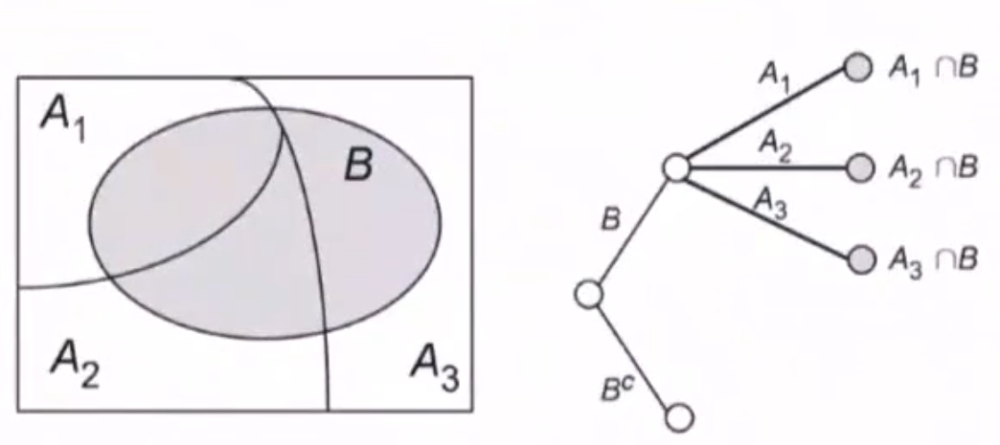

[TOC]

> 用于解决分类问题：将连续取值输入映射为离散取值的输出
>
> 解决分类问题的依据是数据的属性
>

- 利用后验概率选择最佳分类，后验概率通过贝叶斯定理求解
- 朴素贝叶斯假定所有属性相互独立，基于这一假设将类条件概率转化为属性条件概率的乘积
- 朴素贝叶斯方法可以使期望风险最小化
- 影响朴素贝叶斯分类的是所有属性之间的依赖关系在不同类别上的分布

<!--more-->

## 2.0 频率派与贝叶斯派

### 2.0.1 频率派

频率本身会随机波动，但随着重复实验的次数不断增加，特定事件出现的频率值会呈现出稳定性，逐渐趋近于某个常数

从事件发生的频率认识概率的方法称为 “频率学派”。概率被认为是一个独立可重复实验中，单个结果出现频率极限。

**稳定的频率是统计规律性的体现** ，用其表征事件发生的可能性是一种合理的思路

频率学派依赖的是古典概型。由于古典概型只描述单个随机事件，并不能刻画两个随机事件之间的关系。所以引入的 **条件概率** ，进一步得出 **全概率公式** 。
$$
P(A)=\sum_\limits{i=1}^nP(A\vert B_i)\cdot P(B_i)
$$
全概率公式代表了频率派解决问题的思路：先做出一些假设 $P(B_i)$ ，再在这些假设下讨论随机事件的概率 $P(A\vert B_i)$ 

### 2.0.2 贝叶斯派

**逆概率** ：由全概率公式调整得来，即在事件结果 $P(A)$ 确定的条件下，推断各种假设发生的可能性

通过贝叶斯公式，可以将后验概率 $P(D\vert H)$ 转变为先验概率  $P(H)$
$$
P(H\vert D)=\frac{P(D\vert H)P(H)}{P(D)}
$$

- $P(H)$ ：先验概率，假设成立的概率
- $P(D\vert H)$ ：似然概率
- $P(H\vert D)$ ：后验概率，已知结果下情况下假设成立的概率

贝叶斯定理提供了解决问题的新思路：根据观测结果寻找最佳的理论解释

### 2.0.3 区别

**频率学派** 认为假设是客观存在且不会改变的，即存在固定的先验分布，需要通过 **最大似然估计** 确定概率分布的类型和参数，以此作为基础进行概率推演。

**贝叶斯学派** 认为固定的先验分布是不存在的，即参数本身是随机数。假设本身取决于结果，是不确定的、可以修正的。数据的作用就是对假设不断修正，通过 **贝叶斯估计** 使后验概率最大化 。 

----

从 **参数估计** 角度也能体现两种思想的差距

由于实际任务中可供使用的训练数据有限，因而需要对概率分布的参数进行估计。

最大似然估计（最大似然概率 $P(D\vert H)$）的思想是使训练数据出现的概率最大化，以此确定概率分布中的未知参数

贝叶斯方法（最大后验概率 $P(H\vert D)$）：根据训练数据和已知的其他条件，使未知参数出现的可能性最大化，并选取最大概率对应的未知参数

- 还需要额外的信息 ——先验概率 $P(H)$ 

## 2.1 贝叶斯定理

### 2.1.1  贝叶斯公式推导

#### 条件概率

**引例**

3张抽奖券，1个中奖券，最后一名与第一名抽中奖概率相同

$Y$ ：抽中，$N$ ：未抽中 ,$\Omega=\{YNN,NYN,NNY\}$ ，$A_i$ 事件表示第 $i$ 名抽中

$P(A_3)=\frac{\vert A_3\vert}{\vert \Omega\vert}=\frac{1}{3}$ 

$P(A_1)=\frac{\vert A_1\vert}{\vert \Omega\vert}=\frac{1}{3}$ 

上例中，若已知第一名未抽中，求第三名抽中概率，则：

第一名未抽中 $B=\{NYN,NNY\}$

第二名抽中 $A_2=\{NNY\}$

$P(A_2\vert B)=\frac{1}{2}$

---

**分析**：样本空间变了，目标样本数量不变

事件B发生条件下，有事件A发生 $\iff$ 事件AB同时发生，样本空间为B

求解：

$P(A\vert B)=\frac{P(AB)}{P(B)}\iff\frac{n(AB)/n(\Omega)}{n(B)/n(\Omega)}=\frac{P(AB)}{P(B)}$

---

**eg**

掷硬币，100个中有99个正常HT，一个HH。投出去是正面，该硬币是异常硬币的概率

A表示异常硬币的概率，B表示掷出正面的概率

- $P(A\vert B)=\frac{异常硬币正面}{n(硬币正面)}=\frac{2}{101}$ 

- $P(A\vert B)=\frac{P(AB)}{P(B)}=\frac{P(A\vert B)P(B)}{P(A\vert B)P(B)+P(A\vert \overline{B})P(\overline{B})}=\frac{2}{101}$ 

##### 变式

**乘法原理** ：$P(AB)=P(A)P(B)$

**全概率公式** ：

$$
P(B)=P(A_1\bigcap B)+\cdots+P(A_n\bigcap B)=P(A_1)P(B\vert A_1)+\cdots+P(A_n)P(B\vert A_n)
$$

#### 贝叶斯公式

对于条件概率 $P(A_i\vert B)$ 有
$$
P(A_i\vert B)=\frac{P(A_iB)}{P(B)}=\frac{P(B\vert A_i)P(A_i)}{P(B)}=\frac{P(B\vert A_i)P(A_i)}{\sum\limits_{j=1}^nP(B\vert A_j)P(A_j)}
$$

### 2.1.2 贝叶斯定理

$$
P(Y\vert X)=\frac{P(X\vert Y)P(Y)}{P(X)}
$$

- $P(Y\vert X)$ ：后验概率
- $P(Y)$ ：先验概率
- $P(X\vert Y)$ ：似然概率

### 2.1.3 贝叶斯决策

在不完全的情报下，对部分未知状态 $P(Y\vert X)$ 用主观概率 $P(Y)$ 估计，然后用贝叶斯公式对发生概率修正

利用期望风险与修正概率做出最优决策

#### 基本思想

1. 已知的样本密度 $P(X)$ 和先验概率 $P(Y)$ 

   样本密度可由全概率公式求得，$P(X)=\sum\limits_{i} P(X\vert Y_i)P(Y_i)$

2. 利用贝叶斯公式转化为似然概率
   $$
   P(Y\vert X)=\frac{P(X\vert Y)P(Y)}{P(X)}
   $$

3. 根据后验概率的大小，进行决策分类

**eg**

由统计，大约 $0.1\%$ 感染AIDS，所有感染者检测为阳性，有 $1\%$ 未感染者误检测为阳性，若某人检测结果为阳性，求检测阳性确定感染的概率

用 $Y=1$ 表示感染，$X=1$ 表示检测阳性

由于 $0.1\%$ 的人感染，在已知感染情况下检测必为阳性 $P(X=1\vert Y=1)$
$$
P(Y=1\vert X=1)=\frac{P(X=1\vert Y=1)P(Y=1)}{P(X=1)}=\frac{1\times 0.001}{1\times 0.001+0.01\times 0.999}
$$

---

第二轮检测中，$90\%$ 感染者为阳性，$5\%$ 未感染者为阳性，求误诊率

$P(X_1=1)$ 表示第一轮检测为阳性的概率；$P(X_2=1)$ 表示第二轮检测为阳性的概率

由补充题设可知，$P(X_2\vert Y=1)=0.9,P(X_2\vert Y=0)=0.05$
$$
P(Y=0\vert X_1=1,X_2=1)=\frac{P(X_1=1,X_2=1\vert Y=0)\cdot P(Y=0)}{P(X_1=1,X_2=1)} 表示误诊率
$$
其中，先验概率 $P(Y=0)=0.999$ 

由全概率公式 
$$
\begin{aligned}
P(X_1=1,X_2=1)&=P(X_1=1,X_2=1\vert Y=0)\cdot P(Y=0)\\
&+P(X_1=1,X_2=1\vert Y=1)\cdot P(Y=1)
\end{aligned}
$$

$$
P(X_1=1,X_2=1\vert Y=0)\xlongequal{条件独立性假设}P(X_1=1\vert Y=0)\cdot P(X_2=1\vert Y=0)=0.01\times 0.05\\
P(X_1=1,X_2=1\vert Y=1)\xlongequal{条件独立性假设}P(X_1=1\vert Y=1)\cdot P(X_2=1\vert Y=1)=1\times 0.9
$$

## 2.2 朴素贝叶斯

### 2.2.1 朴素贝叶斯分类器思想

**朴素贝叶斯分类器假定样本的不同属性满足条件独立性假设**

其基本思想：分析待分类样本出现在每个输出类别的后验概率 $P(Y\vert X)$ ，并将取得最大后验概率的类别作为输出

假设训练数据的属性由 $n$ 维随机变量 $X$ 表示，其分类结果用随机变量 $Y$ 表示，那么 $X$ 和 $Y$ 的统计规律就可以用联合概率分布 $P(X,Y)$ 表示，每一个具体的样本 $(x_i,y_i)$ 都可以由 $P(X,Y)$ 独立同分布生成——**生成学习**
$$
P(Y\vert X)=\frac{P(X,Y)}{P(X)}=\frac{P(Y)\cdot P(X\vert Y)}{P(X)}
$$
$P(Y)$ 表示每个类别出现的概率，也就是类 **先验概率**

- 先验概率容易根据训练数据计算出来，只需要分别统计不同类别样本的数量即可

$P(X\vert Y)$ 表示在给定的类别下不同属性出现的概率，即类**似然概率**

- 似然概率受属性值的影响

### 2.2.2 条件独立性对似然概率计算的影响

如果每个样本包含 100 个属性，每个属性取值可能有 100 种，那么对分类的每个结果，要计算的条件概率数目就是 $100^{100}$ ，对似然概率的精确估计就需要庞大的计算量

在条件独立性假设的前提下，保证了所有属性相互独立，互不影响。每个属性独立地对分类结果发生作用，即
$$
P(X=x\vert Y=c_k)=P\left(X^{(1)}=x^{(1)},X^{(2)}=x^{(2)},\cdots,X^{(m)}=x^{(m)}\vert Y=c_k\right)\\
\xlongequal{所有属性相互独立}\prod_\limits{j=1}^mP(X^{(j)}=x^{(j)}\vert Y=c_k)
$$
**在条件独立性假设下，将类条件概率转化为属性条件概率的乘积**

在没有条件独立性假设的情况下，每个样本分类结果 $y$ 只能刻画所有属性 $X^{(1)},X^{(2)},\cdots,X^{(m)}$ 形成的整体，且只有具有相同属性的样本才能放在一起评价

- 当属性数目较多而样本数目较少时，要让 $m$ 个属性取到相同特征就有些牵强

有了条件独立性假设后，分类结果 $y$ 就相当于实现了 $m$ 重复用。每个样本既可以用于刻画 $X^{(1)}$ ，又可以刻画 $X^{(n)}$ ，

- 无形中将训练样本的数量扩大为原先的 $m$ 倍

分析每个属性取值对分类结果的影响时，也有更多的数据作为支撑

---

条件独立性假设是一个很强的假设，导致对数据的过度简化，因而对性能带来些许影响。但由于其极大简化分类问题计算复杂度的能力，性能上做部分折衷也并非不能接受

### 2.2.3 基本方法

1. 求先验概率分布 $P(Y=c_k),k=1,2,\cdots,K$

2. 求似然概率分布
   $$
   \begin{aligned}
   P(X\vert Y=c_k)&=P(X^{(1)}=x^{(1)},X^{(2)}=x^{(2)},\cdots,X^{(m)}=x^{(m)}\vert Y=c_k)\\
   &\xlongequal{实际}P(X^{(2)}=x^{(2)},\cdots,X^{(m)}=x^{(m)}\vert X^{(1)}=x^{(1)},Y=c_k)P(X^{(1)}=x^{(1)})\\
   &=P(X^{(3)}=x^{(3)},\cdots,X^{(m)}=x^{(m)}\vert X^{(1)}=x^{(1)},X^{(2)}=x^{(2)},Y=c_k)P(X^{(1)}=x^{(1)})P(X^{(2)}=x^{(2)})\\
   &\xlongequal{朴素贝叶斯iid}P(X^{(1)}=x^{(1)}\vert Y=c_k)P(X^{(2)}=x^{(2)}\vert Y=c_k)\cdots P(X^{(m)}=x^{(m)}\vert Y=c_k)\\
   &=\prod\limits_{j=1}^mP(X^{(j)}=x^{(j)}\vert Y=c_k)
   \end{aligned}
   $$
   
3. 由贝叶斯定理计算
   $$
   \begin{aligned}
   P(Y=c_k\vert X)&=\frac{P(X\vert Y=c_k)P(Y=c_k)}{P(X)}=\frac{P(X\vert Y=c_k)P(Y=c_k)}{\sum\limits_{k=1}^KP(X\vert Y=c_k)P(Y=c_k)}\\
   &=\frac{P(Y=c_k)\prod\limits_{j=1}^mP(X^{(j)}=x^{(j)}\vert Y=c_k)}{\sum\limits_{k=1}^KP(Y=c_k)\prod\limits_{j=1}^mP(X^{(j)}=x^{(j)}\vert Y=c_k)}
   \end{aligned}
   $$

### 2.2.4 模型

$$
\begin{aligned}
y=\hat{f}(X)&=arg\max\limits_{c_k}P(Y=c_k\vert X)\\
&=arg\max\limits_{c_k}\frac{P(Y=c_k)\prod\limits_{j=1}^mP(X^{(j)}=x^{(j)}\vert Y=c_k)}{P(X)}\\
&\propto arg\max\limits_{c_k}P(Y=c_k)\prod\limits_{j=1}^mP(X^{(j)}=x^{(j)}\vert Y=c_k)
\end{aligned}
$$

有了训练数据，先验概率 $P(Y)$ 和似然概率 $P(X\vert Y)$ 就可被视为已知条件，进而可用于求解后验概率 $P(Y\vert X)$ 。

对于给定的输入 $X$ ，朴素贝叶斯分类器就可以利用贝叶斯定理求解后验概率，并将后验概率最大的类作为输出

由于所有的后验概率求解中，边界概率 $P(X)$ 都是相同的，因而其影响可忽略，有朴素贝叶斯分类器的数学表达式
$$
y\propto arg\max_\limits{c_k}P(Y=c_k)\cdot \prod_\limits{j}^mP(X^{(j)}=x^{(j)}\vert Y=c_k)
$$

#### 后验概率最大化

朴素贝叶斯将实例分到后验概率最大的类中，等价于 **期望风险最小化策略**

##### 损失函数

$$
L(Y,f(X))=\begin{cases}
1&,Y\neq \hat{f}(X)\\
0&,Y=\hat{f}(X)
\end{cases}
$$

期望风险 
$$
\begin{aligned}
R_{exp}(f)&=E[L(Y,f(X))]\\
&=\int_{\mathcal{XY}}L(y,\hat{f}(x))\cdot P(x,y)dxdy\\
&=\sum\limits_{k=1}^{^K}[L(y,\hat{f}(x))\cdot P(y\vert x)]
\end{aligned}
$$

##### 期望风险最小化策略

$$
\begin{aligned}
f(X)&=arg\min\limits_{y\in \mathcal{Y}}\sum\limits_{k=1}^{^K}[L(y=c_k,\hat{f}(x))\cdot P(y\vert x)]\\
&=arg\min\limits_{y\in \mathcal{Y}}\sum\limits_{k=1}^{K}P(y\neq c_k\vert x)\\
&=arg\min\limits_{y\in \mathcal{Y}}\sum\limits_{k=1}^{K}[1-P(y= c_k\vert x)]\\
&=arg\max\limits_{y\in \mathcal{Y}}\sum\limits_{k=1}^{K}P(y= c_k\vert x)
\end{aligned}
$$

由 **期望风险最小化策略** 变为 **后验概率最大化策略**

### 2.2.5 朴素贝叶斯估计离散特征

意味着用频率对 先验概率 $P(Y=c_k)$ ，似然概率 $P(X^{(j)}=x^{(j)}\vert Y=c_k)$ 做出估计

其中，

先验概率 $P(Y=c_k)=\frac{\sum\limits_{i=1}^nI(y_i=c_k)}{n},k=1,\cdots,K$

似然概率 $P(X^{(j)}=x^{(j)}\vert Y=c_k)$ 可用极大似然估计
$$
\begin{aligned}
P(X^{(j)}=x^{(j)}\vert Y=c_k)&=\frac{P(X^{(j)}=x^{(j)},Y=c_k)}{P(Y=c_k)}\\
&=\frac{\frac{\sum\limits_{i=1}^nI(X_i^{(j)}=x^{(j)},y_i=c_k)}{n}}{\frac{\sum\limits_{i=1}^nI(y_i=c_k)}{n}}\\
&=\frac{I(X_i^{(j)}=x^{(j)},y_i=c_k)}{\sum\limits_{i=1}^nI(y_i=c_k)}\quad,特征j=1,2，\cdots,m;\quad k=1,\cdots,K
\end{aligned}
$$

#### 学习算法

**输入**：训练数据 $T=\{(x_1,y_1),(x_2,y_2),\cdots,(x_n,y_n)\}$ ，其中 

- 假设 $P(X,Y)$ 是X，Y的联合概率分布，样本 $(x_i,y_i)$ 由 $P(X,Y)$ 独立同分布产生

$$
x_i=\left(
\begin{aligned}
&x_i^{(1)}\\
&x_i^{(2)}\\
&\vdots\\
&x_i^{(j)}\\
&\vdots\\
&x_i^{(m)}
\end{aligned}
\right)\in \mathcal{X}\subseteq R^m,y_i\in\mathcal{Y=} \{c_1,c_2,\cdots,c_k\}\\
i=1,2,\cdots,n;j=1,2,\cdots,m\\
x_i^{(j)}\in \{a_{j1},a_{j2},\cdots,a_{js_j}\},a_{jl}为第j个特征的可能取值，l=1,2,\cdots,s_j
$$

**输出**：$x$ 的分类 $c_k$

**步骤**：

1. 计算先验与似然概率

   先验概率 $P(Y=c_k)=\frac{\sum\limits_{i=1}^nI(y_i=c_k)}{n},k=1,\cdots,K$ 
   $$
   \begin{aligned}
   似然概率\quad P(X^{(j)}=a_{jl}\vert Y=c_k)&=\frac{P(X^{(j)}=a_{jl},Y=c_k)}{P(Y=c_k)}\\
   &=\frac{I(X_i^{(j)}=a_{jl},y_i=c_k)}{\sum\limits_{i=1}^nI(y_i=c_k)}\\
   &j=1,2,\cdots,n\qquad l=1,2,\cdots,s_j\qquad k=1,2,\cdots,K
   \end{aligned}
   $$

2. 给定样本 $x$ ，计算 $P(Y=c_k\vert X)\propto P(Y=c_k)\cdot \prod\limits_{j}^mP(X^{(j)}=x^{(j)}\vert Y=c_k)\quad ,k=1,2,\cdots,K$ 

3. 确定实例 $x$ 的类
   $$
   \begin{aligned}
   y&=arg\max\limits_{c_k}P(Y=c_k)\cdot \prod_\limits{j}^mP(X^{(j)}=x^{(j)}\vert Y=c_k)\quad ,k=1,2,\cdots,K\\
   &=arg\max\limits_{c_k}\frac{\sum\limits_{i=1}^nI(y_i=c_k)}{n}\prod\limits_{j=1}^m\frac{I(X_i^{(j)}=a_{jl},y_i=c_k)}{\sum\limits_{i=1}^nI(y_i=c_k)}
   \end{aligned}
   $$

## 2.3 朴素贝叶斯分类器分析

朴素贝叶斯是一种非常高效的方法。当以分类的正确与否作为误差指标时，只要朴素贝叶斯分类器能够把最大的后验概率找到，就意味着分类正确。至于最大后验概率的估计值是否精确，就不重要了

- 对于一个2分类问题，在一个实例上两个类别的最大后验概率分别是 0.9和0.1，朴素贝叶斯分类器估计出的后验概率就可能是0.6和0.4。由于大小相对关系没有改变，按照估计的后验概率分类，仍然能得到正确的结果

### 2.3.1 条件独立性假设分析

如何解释独立性假设在几乎不成立的情况下，朴素贝叶斯分类器在大多数分类任务中体现出优良特性？

**影响朴素贝叶斯的分类的是所有属性之间的依赖关系在不同类别上的分布，而不是依赖关系本身**

- 在给定训练数据集上，两个属性之间可能具有相关性，但在每个类别上都以相同的程度体现，这种情况下不会破坏贝叶斯分类器的最优性
- 即使这种分布式不均匀的，当所有属性之间的依赖关系一起发挥作用时，他们就可能相互抵消，不再次影响分类

### 2.3.2 期望风险最小化

在应用朴素贝叶斯分类器处理连续性属性数据时，通常假定属性数据满足正态分布，再根据每个类别下的训练数据计算出正态分布的均值和方差

从模型最优化角度观察，朴素贝叶斯分类器是平均意义上预测能力最优的模型，也就是使得 **期望风险最小化**

- 期望风险：风险函数的数学期望，度量平均意义下模型预测的误差特性。

  可视为单次预测误差在联合概率分布 $P(X,Y)$ 上的数学期望

**期望风险最小化 $\iff$ 后验概率最大化**

朴素贝叶斯分类器通过将实例分配到后验概率最大的类中，也就是让 $1-P(Y\vert X)$ 最小。

在以分类错误的是  实例数作为误差时，期望风险就等于 $1-P(Y\vert X)$ 

### 2.3.3 拉普拉斯平滑

为了避免属性携带的信息被训练过程中未出现的属性值所干扰，在计算属性条件概率时，添加一个 **拉普拉斯平滑** 的步骤

- 受到训练集规模的限制，某些属性的取值训练集中可能从未与某个类同时出现，导致属性的条件概率为0，进而使似然概率为0，使分类产生偏差

先验概率 $P_{\lambda}(Y=c_k)=\frac{\sum\limits_{i=1}^nI(y_i=c_k)+\lambda}{n+K\lambda},k=1,\cdots,K$

似然概率 $P(X^{(j)}=a_{jl}\vert Y=c_k)
=\frac{I(X_i^{(j)}=a_{jl},y_i=c_k)+\lambda}{\sum\limits_{i=1}^nI(y_i=c_k)+s_j\lambda}$

- $\sum\limits_{l=1}^{s_j}P(X^{(j)}=a_{jl}\vert Y=c_k)
  =\sum\limits_{l=1}^{s_j}\frac{I(X_i^{(j)}=a_{jl},y_i=c_k)+\lambda}{\sum\limits_{i=1}^nI(y_i=c_k)+s_j\lambda}=1$

## 2.4 应用

### 比赛结果预测

### 垃圾邮件过滤

分类：$y\in \{0,1\}$ 表示是否为垃圾邮件；1表示垃圾邮件，0表示正常邮件

用词汇表向量 $x\in \{0,1\}^{50000}$ 表示词汇表中的50000个词是否出现在邮件中

先验概率 $P(y=1)=\frac{\sum\limits_{i=1}^nI(y_i=1)}{n}$ 
$$
\begin{aligned}
P(Y\vert X')&=\frac{P(X'\vert Y)P(Y)}{\sum\limits_{i}P(X'\vert Y)P(Y)}\\
P(y=1\vert x')&=\frac{P(x'\vert y=1)P(y=1)}{P(x'\vert y=1)P(y=1)+P(x'\vert y=0)P(y=0)}\propto P(x'\vert y=1)P(y=1)\\
P(x'\vert y=1)&=P(x^{(1)},x^{(2)},\cdots,x^{(50000)}\vert y=1)
\xlongequal{朴素贝叶斯条件独立性假设}\prod\limits_{i=1}^{50000}P(x^{(i)}\vert y=1)\\
\end{aligned}
$$
对于似然概率 $P(x^{(i)}\vert y=1)=\frac{\sum\limits_{j=1}^nI(y_j=1 \land x^{(i)}=1)}{\sum\limits_{k=1}^nI(y_k=1)}$ 
$$
\therefore P(y=1\vert x')\propto P(x'\vert y=1)P(y=1)\left[\prod\limits_{i=1}^{50000}\frac{\sum\limits_{j=1}^nI(y_j=1\land x^{(i)}=1)}{\sum\limits_{j=1}^nI(y_j=1)}\right]\cdot \frac{\sum\limits_{i=1}^nI(y_{i}=1)}{n}=p_1\\
P(y=0\vert x')\propto P(x'\vert y=0)P(y=0)\left[\prod\limits_{i=1}^{50000}\frac{\sum\limits_{j=1}^nI(y_j=0\land x^{(i)}=1)}{\sum\limits_{j=1}^nI(y_j=0)}\right]\cdot \frac{\sum\limits_{i=1}^nI(y_{i}=0)}{n}=p_0\\
$$

## 2.5 半朴素贝叶斯分类器

考虑了部分属性之间的依赖关系，既保留了属性之间较强的相关性，又不需要完全计算复杂的联合概率分布

常用的方法是建立独依赖关系：假设每个属性除了类别之外，最多只依赖一个其他属性

