- 逻辑回归输出的是实例属于每个类别的似然概率，似然概率最大的类别就是分类结果
- 在一定条件下，逻辑回归模型与朴素贝叶斯分类器等价
- 多分类问题可以通过多次二分类或者Softmax回归解决

[TOC]

<!--more-->

## 4.1 线性分类模型

> 目标：用判别模型解决分类问题

### 4.1.1 示例

#### 图像分类

图像分类数据集：ImageNet

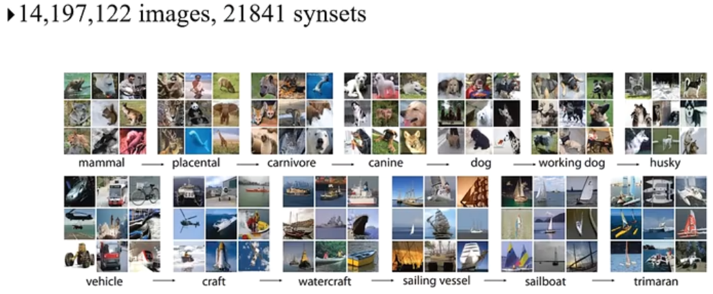

- 基于WordNet的层次结构

**建模** 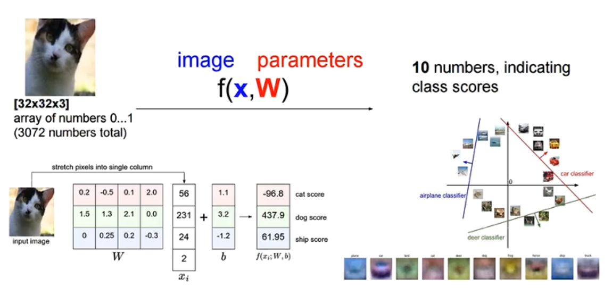

流程：

将图片的 $像素\times 像素\times 通道数$ 作为输入向量，学习到每个类别的模型 $f_c$ 参数 $\omega_c$  

假设将图像的向量张成4维向量 $x_i$ ，问题为三分类问题，有三组模型 $f_c=\omega_c^T\cdot x+b_c$ 

将新的图片数据 $x_i$ 分别代入三个模型，投票选出得分高的作为分类结果 

**涉及问题**

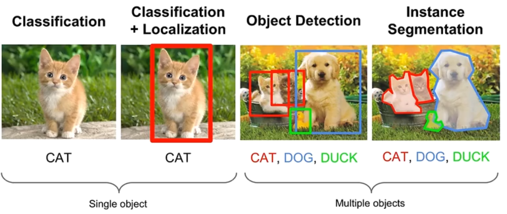

- 图像分类
- 图像分类+目标定位
- 目标检测：图片中所有物体都要检测出来
- 实例分割：像素级图像分类

#### 文本分类

- 垃圾邮件过滤

- 文档归类

- 情感分类

  

**建模**

将样本 $x$ 从文本形式转为向量形式

词袋模型(Bag-of-Words,BoW)

 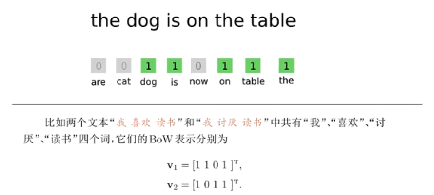

### 4.1.2 线性分类模型

通过引入 **单调可微** 函数 $g(\cdot)$ ，线性回归模型可以推广为 $y=g^{-1}(w^Tx)$ ，进而将线性回归模型预测值与分类任务的离散标记联系起来
$$
g(f(x;\omega))=\begin{cases}
1& f(x;\omega)>0\\
0&f(x;\omega)<0
\end{cases}
$$

- $f(x;\omega)$ 判别函数 

  $f(x;\omega)=0$ 的点组成一个 **分割超平面** ，决策边界/决策平面

- 线性分类模型=线性判别函数 $f(x)$ +线性决策边界 $g(\cdot)$  

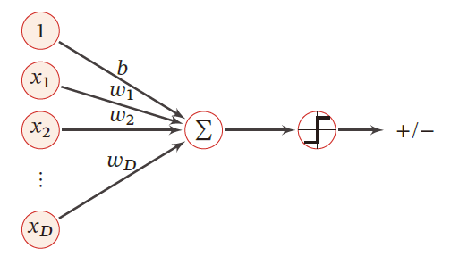

#### 二分类问题

在简单的 **二分类问题** 中，分类的标记可以抽象为 $0$ 和 $1$ ，因而线性回归中的实值输出需要映射为二进制的结果

训练集：$\{(x_i,y_i)\}_{i=1}^{N},x_i\in R^{n}$

二分类问题：$y_i\in \{0,1\}$

模型
$$
g(f(x;\omega))=\begin{cases}
1& f(x;\omega)>0\\
0&f(x;\omega)<0
\end{cases}
$$
损失函数：
$$
\mathcal{L}_{01}[y,g(f(x;\omega))]=I[y\neq g(f(x;\omega))]\\
\mathcal{L}_{01}[y,g(f(x;\omega))]=I[yf(x;\omega)<0]
$$

#### 多分类问题

训练集：$\{(x_i,y_i)\}_{i=1}^{N},x_i\in R^{n}$

多分类问题：$y_i\in \{0,\cdots,C\},C>2$ 

**模型**：

- 一对其余：将多分类问题转换成 $C$ 个 “一对其余”的二分类问题；用投票的方式选出所属类

  需要 $C$ 个判别函数

  如：训练 $\omega_1$ 对其余的判别函数时，训练集分为 $\omega_1;\omega_2+\omega_3$

- 一对一：每两个类别间生成一个分割超平面

  转换为 $\left(\begin{aligned}C\\2\end{aligned}\right)=\frac{C(C-1)}{2}$ 个 “一对一”二分类问题

  用投票的方式选出所属类

  在类别数较多时，需要建立的分类器数量较多

- **argmax** 方式：改进的一对其余方式需要 $C$ 个判别函数
  $$
  y=\arg\max\limits_{c=1}^Cf_c(x;\omega_c)
  $$
   哪个类别得分高，分为哪个类

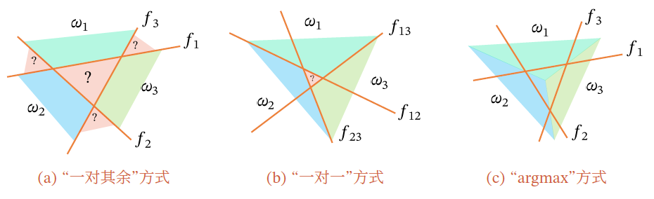

“一对其余”方式和“一对一”方式都存在一个缺陷：特征空间中会存在一些难以确定类别的区域，而 **argmax** 方式很好地解决了这个问题

- 等效为直接将逻辑回归应用在每个类别上，对每个类别建立一个二分类器

  如果输出的类别标记数为 $m$ ，就可以得到 $m$ 个针对不同标记的二分类逻辑回归模型，对一个实例的分类结果就是这 $m$ 个分类函数中输出值最大的那个

- 对一个实例执行分类需要多次使用逻辑回归算法，效率低下

#### 线性分类模型

**二分类问题** ——$g(f(x))$ 

- 逻辑斯蒂回归
- 感知器
- 支持向量机

**多分类问题**

- Softmax回归 ——$argmax f(x)$ 

区别在于使用了不同的损失函数

### 4.1.3 二分类模型的损失函数

为明确定义损失函数，进而可以通过最优化算法求解，$g(\cdot)$ 需要保证单调可微，其前提就是连续。

> 将分类问题看做条件概率估计问题

- 引入非线性函数 $g$ 来预测类别标签的条件概率 $p(y=c\vert x)$

  判别函数 $f$ ：线性函数，$f(x;\omega)=\omega^T\cdot x\in R$ 

  激活函数 $g$ ：把线性函数的值域从实数区间挤压到了 $(0,1)$ 之间，可以用来表示概率

## 4.2 Logistic 回归

### 4.2.1 对数几率函数

在 Logistic 回归中，激活函数为 *sigmod型* 对数几率函数
$$
\sigma(z)=\frac{1}{1+e^{-z}}=\frac{1}{1+e^{-w^Tx}}
$$

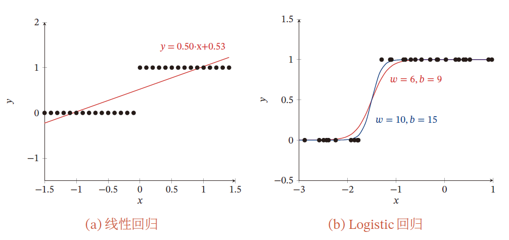

- 对数几率函数能够将线性回归从负无穷到正无穷的输出范围压缩到 $(0,1)$ 之间

- 当线性回归结果是 $z=0$ 时，逻辑回归的结果是 $\sigma(z)=0.5$ ，这可以是做一个分界点

  当 $z>0$ ，则 $\sigma(z)>0.5$ ，此时逻辑回归的结果就被判为正例

  当 $z<0$ ，则 $\sigma(z)<0.5$ ，此时逻辑回归的结果就被判为负例

#### 几率

如果将对数几率函数的结果 $\sigma(z)$ 视为样本 $x$ 作为正例的可能性 $P(y=1\vert x)$，则 $1-\sigma(z)$ 就是其作为反例的可能性  $P(y=0\vert x)$ ，两者比值 $0<\frac{\sigma(z)}{1-\sigma(z)}<\infty$ ，称为 **几率** 。

- $=1$，则说明概率相等
- $>1$ ，则说明 $\sigma(z)$ 的概率大，分为1类
- $<1$ ，则说明 $1-\sigma(z)$ 的概率大，为0类

对 **几率** 取对数，可得到
$$
ln\frac{\sigma(z)}{1-\sigma(z)}=w^Tx
$$

- 线性回归的结果以对数几率的形式出现的

### 4.2.2 逻辑回归模型

输入：$x=\{x^{(1)},x^{(2)},\cdots,x^{(m)}\}\in \mathcal{X}\subseteq R^m$ ；

- 需对输入的特征向量进行归一化

  若特征数值过大，样本会落在 *sigmod* 的饱和区，无法对 $x$ 进行正确分类

输出：$Y\in \{0,1\}$ 

逻辑回归模型为 **条件概率表示的判别模型**

$$
\sigma(z)=p(y=1\vert x)=\frac{1}{1+e^{-w^Tx}}=\frac{e^{w^Tx}}{1+e^{w^Tx}}\\
1-\sigma(z)=p(y=0\vert x)=\frac{e^{-w^Tx}}{1+e^{-w^Tx}}=\frac{1}{1+e^{w^Tx}}
$$

- $\omega=\{\omega^{(0)},\omega^{(1)},\omega^{(2)},\cdots,\omega^{(m)}\}\in R^{m+1}$ 

对于给定的实例，逻辑回归模型比较两个条件概率值的大小，并将实例划分到概率较大的分类中

### 4.2.3 损失函数

对于一个样本 $(x,y^*)$ ，其真实条件概率为
$$
p_r(y=1\vert x)\triangleq y^*\\
p_r(y=0\vert x)\triangleq1-y^*
$$

- eg：$y^*=0$ 
  $$
  p_r(y=1\vert x)=0=y^*,p_r(y=0\vert x)=1=1-y^*\\
  $$

如何衡量两个条件分布的差异？——交叉熵
$$
\begin{aligned}
H(p_r,p_\omega)&=-\sum\limits_{k=0}^1 p_r\log p_\omega\\
&=-\left[p_r(y^*=1\vert x)\log p_\omega(y=1\vert x)+p_r(y^*=0\vert x)\log p_\omega(y=0\vert x)\right]\\
&=-\left[y^*\log p_\omega(y=1\vert x)+(1-y^*)\log p_\omega(y=0\vert x)\right]\\
&=-\left[y^*\log \sigma(z)+(1-y^*)\log (1-\sigma(z))\right]
\end{aligned}
$$
对于交叉熵损失函数，模型在训练集的风险函数为
$$
\mathcal{R}=-\frac{1}{N}\sum\limits_{i=1}^N\left[y_i\log \sigma(z_i)+(1-y_i)\log (1-\sigma(z_i))\right]
$$

- $I\log P$ 表示预测正确的部分，对于预测结果来说，越大越好；对于损失函数来说，越小越好

  添加负号将差异大小变正，用于衡量差异大小

  对于损失函数，我们希望真实分布与预测分布的差异越小越好

梯度为
$$
\begin{aligned}
\frac{\partial \mathcal{R}}{\partial \omega}&=-\frac{1}{N}\sum\limits_{i=1}^N\left[y_i\frac{\partial}{\partial \omega}\log \sigma(z_i)+(1-y_i)\frac{\partial}{\partial \omega}\log (1-\sigma(z_i))\right]\\
&=-\frac{1}{N}\sum\limits_{i=1}^N\left\{y_i\left[1-\sigma(z_i)\right]x_i-(1-y_i)\sigma(z_i)x_i\right\}\\
&=-\frac{1}{N}\sum\limits_{i=1}^Nx_i\left[y_i-\sigma(z_i)\right]
\end{aligned}
$$
对于损失函数的最优化，通过梯度下降法/拟牛顿法 $\Rightarrow$ 数值解
$$
\begin{aligned}
\omega^{[t+1]}&\leftarrow \omega^{[t]}-\alpha\frac{\partial \mathcal{R}(\omega)}{\partial \omega}\\
&=\omega^{[t]}+\alpha\frac{1}{N}\sum\limits_{i=1}^Nx_i\left[y_i-\sigma(z_i)\right]
\end{aligned}
$$

- $y_i^*=1$ ，则 $\left[y_i-\sigma(z_i)\right]>0$ ，迭代之后 $\omega^{[t+1]}>\omega^{[t]}$ 
- $y_i^*=0$ ，则 $\left[y_i-\sigma(z_i)\right]<0$ ，迭代之后 $\omega^{[t+1]}<\omega^{[t]}$ 

### 4.2.4 参数求解

假设样本独立同分布

学习时，逻辑回归模型在给定的训练数据集上应用 **最大似然估计法** 确定模型的参数

- 对于给定的数据 $(x_i,y_i)$ ，逻辑回归 **使每个样本属于其真实标记的概率最大化**，以此为依据确定 $w$ 的最优值

似然函数可表示为
$$
L(w\vert x)=P(\omega\vert x)\xlongequal{x_i独立同分布}\prod\limits_{i=1}^n[p(y=1\vert x_i,w)]^{y_i}[1-p(y=1\vert x_i,w)]^{1-y_i}
$$

取对数后简化运算
$$
\ln L(w\vert X)=\sum\limits_{i=1}^n\left\{y_i\ln p(y=1\vert x_i,w)+(1-y_i)\ln \left[1-p(y=1\vert x_i,w)\right]\right\}
$$
由于单个样本的标记 $y_i$ 只能取得0或1，因而上式中的两项中只有一个非零值，代入对数几率，经过化简后可以得到
$$
\ln L(w\vert X)=\sum\limits_{i=1}^n\left[y_i(w^Tx_i)-\ln(1+e^{w^Tx_i})\right]
$$
寻找上述函数的最大值就是以对数似然函数为目标函数的最优化问题，通常使用 **梯度下降法** 或 **牛顿法** 求解

#### 逻辑斯蒂回归策略

后验概率最大化原则 $\iff$ 期望风险最小化策略
$$
arg\max\limits_{\omega}L(\omega)=arg\max\limits_{\omega}\sum\limits_{i=1}^n\left[y_i(w^Tx_i)-\ln(1+e^{w^Tx_i})\right]
$$
基于 $\hat{\omega}$ 得到概率判别模型
$$
\begin{cases}
P(y=1\vert x)=\frac{e^{\hat{\omega}^T\cdot x}}{1+e^{\hat{\omega}^T\cdot x}}\\
P(y=0\vert x)=\frac{1}{1+e^{\hat{\omega}^T\cdot x}}
\end{cases}
$$

### 4.2.5 应用：语句情感判断

将一句话映射为向量形式，对每句话进行逻辑斯蒂回归
$$
\begin{cases}
x_i:某个词词频\\
\omega_i:每个词权重\begin{cases}
正面词\quad \omega_i>0\\
中性词\quad \omega_i=0\\
负面词\quad \omega_i<0
\end{cases}
\end{cases}
$$
整句话表示为
$$
h=f(\sum\limits_{i=1}^n\omega_i x_i)=f(\omega^T\cdot x)
$$
 权重的计算
$$
\begin{cases}
某个词重要性：在本篇大量出现，在其他文章出现较少\\
term frequency：文档中词频，越大表示越重要\\
Inverse Document frequency：其他语料库中出现的词频，越小表示其他文档中出现少，当前文档中的词比较重要
\end{cases}
$$

### 4.2.6 多角度分析逻辑回归

#### 信息论角度

当训练数据集是从所有数据中均匀抽取且数据量较大时，可以 **从信息论角度** 解释：

对数似然的最大化可以等效为待求模型与最大熵模型之间的KL散度（交叉熵）的最小化。即逻辑回归对参数做出的额外假设是最少的。

#### 数学角度

从 **数学角度** 看，线性回归与逻辑回归之间的关系在于非线性的对数似然函数

- 从特征空间看，两者的区别在于数据判断边界上的变化

  利用回归模型只能得到线性的判定边界；

  逻辑回归则在线性回归的基础上，通过对数似然函数的引入使判定边界的形状不再受限于直线

#### 与朴素贝叶斯对比

**联系**

逻辑回归与朴素贝叶斯都是利用条件概率 $P(Y\vert X)$ 完成分类任务，二者在特定条件下可以等效

- 用朴素贝叶斯处理二分类任务时，假设对每个属性 $x_i$ ，属性条件概率 $P(X=x_i\vert Y=y_k)$ 都满足正态分布，且正态分布的标准差与输出标记 $Y$ 无关，则根据贝叶斯定理，后验概率可写成 
  $$
  P(Y=0\vert X)=\frac{P(Y=0)\cdot P(X\vert Y=0)}{P(Y=1)\cdot P(X\vert Y=1)+P(Y=0)\cdot P(X\vert Y=0)}\\
  =\frac{1}{1+e^{ln\frac{P(Y=1)\cdot P(X\vert Y=1)}{P(Y=0)\cdot P(X\vert Y=0)}}}
  $$
   在条件独立性假设的前提下，类条件概率可以表示为属性条件概率的乘积。令先验概率 $P(Y=0)=p_0$ 并将满足正态分布的属性条件概率 $P(X^{(i)}\vert Y=y_k)$ 代入，可得
  $$
  P(Y=0\vert X)=\frac{1}{1+e^{ln\frac{1-p_0}{p_0}+\sum\limits_{i}\left(\frac{\mu_{i1}-\mu_{i0}}{\sigma^2}X_i+\frac{\mu_{i0}^2-\mu_{i1}^2}{2\sigma^2_i}\right)}}
  $$
  可见，上式的形式和逻辑回归中条件概率 $P(Y=0\vert X)$ 是完全一致的，**朴素贝叶斯学习器和逻辑回归模型学习到的是同一个模型**

**区别**

属于不同的监督学习类型

- 朴素贝叶斯是生成模型的代表：先由训练数据估计出输入和输出的联合概率分布，再根据联合概率分布来生成符合条件的输出，$P(Y\vert X)$ 以后验概率的形式出现
- 逻辑回归是判别模型的代表：先由训练数据集估计出输入和输出的条件概率分布，再根据条件概率分布判定对于给定的输入应该选择哪种输出，$P(Y\vert X)$ 以似然概率的形式出现

当朴素贝叶斯学习器的条件独立性假设不成立时，逻辑回归与朴素贝叶斯方法通常会学习到不同的结果

- 当训练样本数接近无穷大时，逻辑回归的渐进分类准确率要优于朴素贝叶斯方法

  逻辑回归不依赖于条件独立性假设，偏差更小，但方差更大

- 当训练样本稀疏时，朴素贝叶斯的性能优于逻辑回归

收敛速度不同：逻辑回归的收敛速度慢于朴素贝叶斯方法

## 4.3 Softmax回归

> Logistic问题应用于多分类问题

要让逻辑回归处理多分类问题，需要做一些改进

### 4.3.1 softmax模型

> 直接修改逻辑回归的似然概率，使之适应多分类问题

softmax回归转换为对条件概率的建模，给出的是实例在每一种分类结果下出现的概率
$$
\begin{aligned}
\hat{\kappa}&=softmax(f_k(x;\omega_k))=arg\max\limits_{k=1}^K \hat{y}^{(k)}\\
\hat{y}^{(k)}&=p_{\omega_k}(y=k\vert x)\quad ,k\in \{1,\cdots,K\},K>2\\
&=\frac{e^{w_k^Tx}}{\sum\limits_{k=1}^{K} e^{w_k^Tx}}
\end{aligned}
$$

- $w_k$ 表示和类别 $k$ 相关的权重参数

### 4.3.2 损失函数

交叉熵损失函数
$$
-\sum\limits_{y=1}^Kp_r(y\vert x)\log p_\omega(y\vert x)
$$
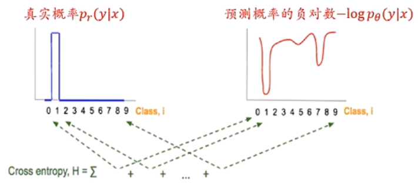

对于某个真实类别为 $\kappa$ 的样本 $y_i$ ，其向量形式为
$$
y_i=\left[I(1=\kappa),I(2=\kappa),\cdots,I(K=\kappa)\right]^T
$$
其交叉熵形式的损失函数为
$$
\begin{aligned}
\mathcal{L}(y_i)&=-\sum\limits_{k=1}^K y_i^{(k)}\log \hat{y}_i^{(k)}\\
&=-y_i^{(\kappa)}\log \hat{y}_i^{(\kappa)}\\
&=-(y_i)^T\cdot \overrightarrow{\log \hat{y}_i}
\end{aligned}
$$

- 对于一个三分类问题，某样本类别为 $[0,0,1]$ ，预测各类别概率为 $[0.3,0.3,0.4]$ ，则交叉熵损失函数为
  $$
  \mathcal{L}(y_i)=-[0\times \log 0.3+0\times \log 0.3+1\log(0.4)]=-\log(0.4)
  $$

损失函数——交叉熵
$$
\begin{aligned}
\mathcal{R}&=-\frac{1}{N}\sum\limits_{i=1}^N\sum\limits_{k=1}^K y_i^{(k)}\log \hat{y}^{(k)}_i\\
&=-\frac{1}{N}\sum\limits_{i=1}^N(y_i)^T\cdot \overrightarrow{\log \hat{y}_i}
\end{aligned}
$$
### 4.3.3 优化算法

优化算法：梯度下降法
$$
\frac{\partial \mathcal{R}(\omega)}{\partial \omega}=-\frac{1}{N}\sum\limits_{i=1}^Nx_i(y_i-\hat{y}_i)^T
$$

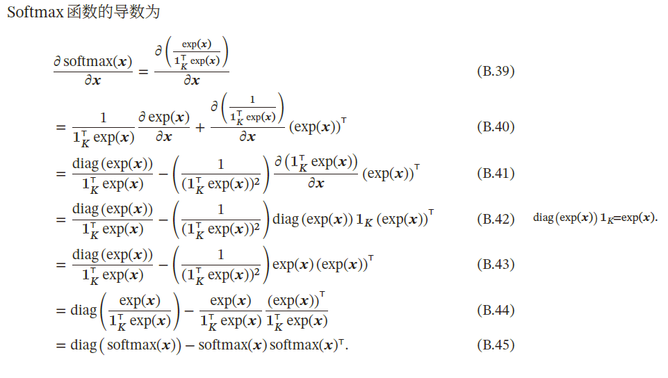

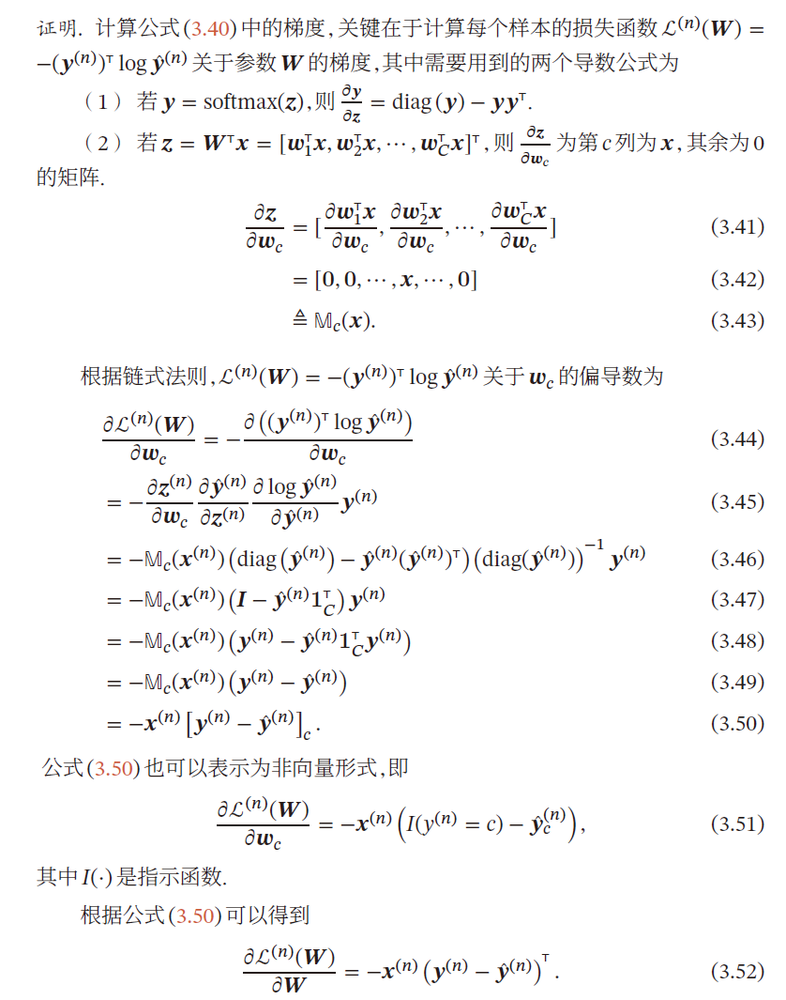

采用梯度下降法
$$
\omega^{[t+1]}\leftarrow \omega^{[t]}+\alpha\left(\frac{1}{N}\sum\limits_{i=1}^Nx_i(y_i-\hat{y}_i)^T\right)
$$

Softmax回归模型的训练与逻辑回归模型类似，都可以转化为通过梯度下降法或者拟牛顿法解决最优化问题

### 4.3.4 softmax与logistic对比

输出结果只能是属于一个类别时，Softmax分类器更加高效

输出结果可能出现交叉情况时，多个二分类逻辑回归模型性能好，可以得到多个类别的标记

---

当 $K=2$ 时，softmax回归的决策函数为
$$
\begin{aligned}
\hat{y}&=arg \max\limits_{y\in [0,1]}p(y\vert x)\\
&=arg \max\limits_{y\in [0,1]}\frac{e^{w_y^Tx}}{\sum\limits_{k=1}^{K} e^{w_y^Tx}}\\
&\iff arg\max\limits_{y\in [0,1]}I(\omega_1^Tx>\omega^T_0x)\\
&=arg\max\limits_{y\in [0,1]}I((\omega_1-\omega_0)^Tx>0)
\end{aligned}
$$

## 4.4 感知器

### 4.4.1 概念

> 1957 年，美国康奈尔大学航天实验室的心理学家弗兰克·罗森布拉特(Frank Roseblatt)受到赫布理论的启发，提出了著名的“感知器（perceptron）”模型——第一个用算法精确定义的人工神经网络，只有一个神经元
>
> Perceptron Linear Algorithm 线性感知机算法

解决二分类问题的监督学习算法，属于 **线性分类模型**——**判别模型** 

#### 感知机与人工神经网络

由输入层和输出层组成

- 输入层负责接收外界信号

- 输出层是MP神经元，即阈值逻辑函数

  每个输入信号都以一定权重 $\omega$（突触），偏置 （阈值）被送入MP神经元（激活函数），MP神经元利用符号将特征的线性组合映射为分类输出 $+1$ ，$-1$ 

**关于偏置（阈值的理解）**

偏置用于衡量感知器触发的难易程度，当 $\theta=-b$ 时，二者是等价的

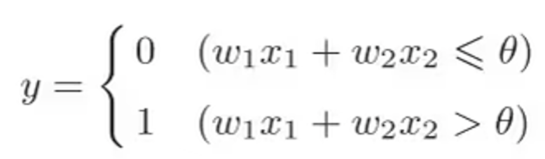

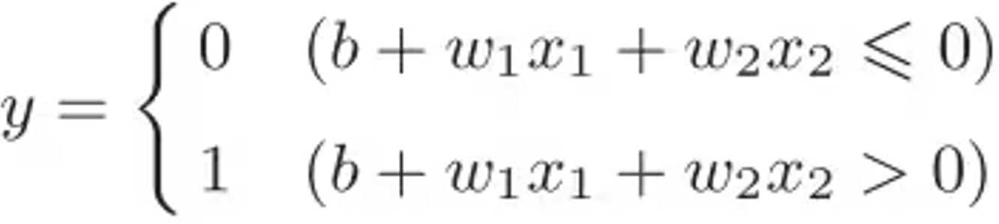

#### 模型思想

目标：求出将训练数据进行线性划分的分离超平面

基本思想：**错误驱动的在线学习算法** ——导入误分类的损失函数，利用梯度下降法对损失函数极小化，求得感知机模型

输入：$x\in \mathcal{X}\subseteq R^n$  表示实例的特征向量，$y\in \mathcal{Y}=\{+1, -1\}$

输出：$\hat{\omega}$ ，$\hat{b}$ 

模型——决策函数
$$
f(x)=sign(\omega^Tx+b)=\begin{cases}
+1&,\omega^Tx> 0\\
-1&,\omega^Tx<0
\end{cases}
$$
假设空间：定义在特征空间中的所有线性分类模型
$$
\{f\vert f(x)=\omega^Tx+b\}
$$
几何理解：$\omega^Tx+b=0$ 在空间中为一个超平面 $S$ ，$\omega$ 为法向量， $b$ 为截距

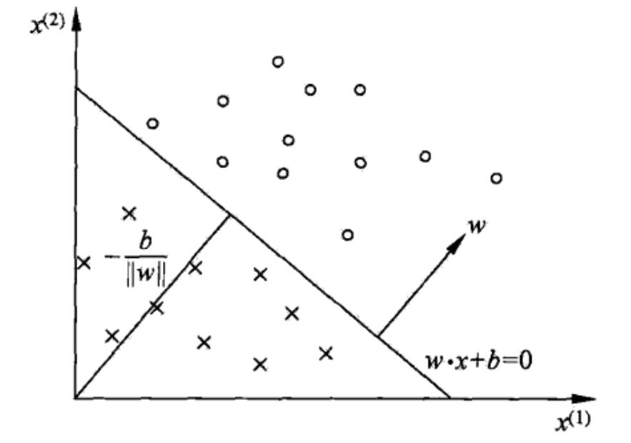

- 上图中超平面 $S:\omega_1x^{(1)}+\omega_2x^{(2)}+b=0$ ，这个超平面将特征空间分为 $+1,-1$ 类

### 4.4.2 策略

损失函数的定义，并将 $J(\omega)$ 最小化

#### 数据集的线性可分性

对于数据集 $D$ ，若存在某个超平面 $S$ ：$\omega^Tx+b=0$ ，将数据正负两类完全划分到超平面两侧

- 对于正例：$y_i=+1$ ，有 $\omega^Tx+b>0$
- 对于负例：$y_i=-1$ ，有 $\omega^Tx+b<0$ 

#### 学习策略

**目标** ：假设数据集 $D$ 线性可分，找到将数据集 $D$ 正负两例完全正确分开的超平面 $S$，即确定参数 $\hat{\omega},\hat{b}$ 

##### 损失函数的构造

可选择

- 误分类点的总数，但不关于 $\omega,b$ 可导，是离散的
- **误分类点到超平面 $S$ 的距离和**

点 $x_t$ 到平面 $S$ 的总距离
$$
\frac{\omega^Tx_t+b}{\Vert \omega\Vert_2}
$$
对于误分类点有
$$
y_t\cdot(\omega^Tx_t+b)<0\iff -y_t\cdot(\omega^Tx_t+b)>0
$$
对于误分类点，到超平面的几何距离为
$$
-\frac{1}{\Vert \omega\Vert_2}y_t\cdot(\omega^Tx_t+b)
$$
若所有误分类点集合为 $M$ ，则误分类点到 $S$ 的距离和为 
$$
-\frac{1}{\Vert \omega\Vert_2}\sum\limits_{x_t\in M}y_t\cdot(\omega^Tx_t+b)
$$
故将感知机（损失函数）定义为经验风险函数
$$
R_{emp}(f)=L(\omega,b)=-\sum\limits_{x_t\in M}y_t\cdot(\omega^Tx_t+b)
$$
**策略为** 在假设空间中选取使损失函数 $L(\omega,b)$ 最小的模型参数 $\omega,b$  

- 损失函数非负
- 误分类点数量越少越好
- 误分类点离超平面越近越好
- $L(\omega,b)$ 是连续可导的

##### 关于距离的解释

- $-\frac{1}{\Vert \omega\Vert_2}y_t\cdot(\omega^Tx_t+b)$ 为 **几何距离**
- $-y_t\cdot(\omega^Tx_t+b)$ 为 **函数距离**

几何距离的系数 $\frac{1}{\Vert \omega\Vert_2}$ 可以抵消系数同时放大的影响，如 $aX+bY+c=0$ 与 $2aX+2bY+2c=0$ 

- 但会增加梯度下降法计算的复杂度

PLA的目标是使误分类点个数最小，$\frac{1}{\Vert \omega\Vert_2}$ 对分类结果无影响，故在PLA中损失函数不带系数 $\frac{1}{\Vert\omega \Vert_2}$ 

### 4.4.3 算法

> 用随机梯度下降法，求解损失函数最优化问题

#### PLA算法原始形式

**输入**：训练数据集 
$$
D=\{(x_1,y_1),(x_2,y_2),\cdots,(x_N,y_N)\}，\\
x_i\in \mathcal{X}\subseteq R^n,y_i\in \mathcal{Y}=\{+1,-1\},i=1,2,\cdots,N
$$
**输出**：$\hat{\omega},\hat{b}$  

**模型**
$$
f(x)=sign(\omega^Tx+b)=\begin{cases}
+1&,\omega^Tx+b>0\\
-1&,\omega^Tx+b<0\\
\end{cases}
$$
**策略** 
$$
arg\min\limits_{\omega,b}\mathcal{L}(\omega,b)=arg\min\limits_{\omega,b}-\sum\limits_{x_t\in M}y_t\cdot(\omega^Tx_t+b)
$$
**步骤** 

1. 选取随机的 $\omega_0,b_0$ ，其中权重可以初始化为0或比较小的随机数

2. 在训练集中选数据 $(x_i,y_i)$ ，将误分类点作为训练数据，即满足 $\omega^Tx_i+b<0$ 的条件的点
   $$
   \omega^{[t+1]}\leftarrow\omega^{[t]}-\eta\frac{\partial \mathcal{L}}{\partial \omega}=\omega^{[t]}+\eta y_tx_t\\
   b^{[t+1]}\leftarrow b^{[t]}-\eta\frac{\partial \mathcal{L}}{\partial b}=b^{[t]}+\eta y_t
   $$

3. 转至 $2$ 步，直至 $D$ 中无误分类点

**感知器通过传递函数确定输出，神经元之间通过权重传递信息，权重的变化则根据误差来进行调节**

##### 损失函数的梯度下降法

$$
\begin{cases}
\bigtriangledown_{\omega}\mathcal{L}(\omega,b)=-\sum\limits_{x_t\in M}y_tx_t\\
\bigtriangledown_{b}\mathcal{L}(\omega,b)=-\sum\limits_{x_t\in M}y_t\\
\end{cases}
$$

**前提是误分类点集合是固定的** ，才可进行梯度下降法最优化
$$
\begin{cases}
\omega\leftarrow \omega-\eta\bigtriangledown_{\omega}\mathcal{L}\\
b\leftarrow b-\eta\bigtriangledown_{b}\mathcal{L}
\end{cases}
$$
这种做法：

- 计算量大
- 且调整参数 $\omega,b$ 后，误分类点集可能会发生变化，故用**随机梯度下降法**

**直观理解**

当一个样本点被误分类时，调整 $\omega,b$ 的值，使超平面 $S$ 向该误分类点的一侧移动，减少该误分类点与 $S$ 的距离，直至超平面越过此点（分类正确）

####  PLA例题

$$
x_1=(3,3)^T,y_1=+1\\
x_2=(4,3)^T,y_2=+1\\
x_3=(1,1)^T,y_3=-1\\
$$

模型：
$$
f(x)=sign(\omega^Tx+b)=\begin{cases}
+1&,\omega^Tx+b>0\\
-1&,\omega^Tx+b<0
\end{cases}\\
\omega=\left(
\begin{aligned}
\omega_1\\
\omega_2
\end{aligned}
\right)
$$
算法：

1. 取初值，$\omega_0=\left(\begin{aligned}0\\0\end{aligned}\right)$ ，$b_0=0$ ，$\eta=1$

2. 对 $x_1=(3,3)^T$ ，有 $y_1(\omega_1^{[0]}x_1^{(1)}+\omega_2^{[0]}x_1^{(2)}+b^{[0]})=0$ 

   未分类正确，故更新
   $$
   \begin{cases}
   \omega^{[1]}\leftarrow\omega^{[0]}-\eta\frac{\partial L}{\partial \omega}=\omega^{[0]}+\eta y_1x_1=
   \left(
   \begin{aligned}
   0\\0
   \end{aligned}
   \right)+\left(
   \begin{aligned}
   3\\3
   \end{aligned}
   \right)=\left(
   \begin{aligned}
   3\\3
   \end{aligned}
   \right)\\
   b^{[1]}\leftarrow b^{[0]}-\eta\frac{\partial L}{\partial b}=b^{[0]}+\eta y_1=0+1\cdot 1=1
   \end{cases}
   $$
   故有线性模型
   $$
   \omega_1^{T}\cdot x+b_1=3x^{(1)}+3x^{(2)}+1
   $$

3. 对 $x_2=(4,3)^T,(\omega_1^{[1]}x_2+\omega_2^{[1]}x_2+b^{[1]})y_2>0$ ，正确分类

   $x_3=(1,1)^T,(\omega_1^{[1]}x_3+\omega_2^{[1]}x_3+b^{[1]})y_3<0$ ，误分类。用 $(x_3,y_3)$ 更新模型参数
   $$
   \begin{cases}
   \omega^{[2]}\leftarrow\omega^{[1]}-\eta\frac{\partial L}{\partial \omega}=\omega^{[1]}+\eta y_3x_3=
   \left(
   \begin{aligned}
   3\\3
   \end{aligned}
   \right)+(-1)\left(
   \begin{aligned}
   1\\1
   \end{aligned}
   \right)=\left(
   \begin{aligned}
   2\\2
   \end{aligned}
   \right)\\
   b^{[1]}\leftarrow b^{[0]}-\eta\frac{\partial L}{\partial b}=b^{[0]}+\eta y_3=1+1\cdot (-1)=0
   \end{cases}
   $$
   有线性模型
   $$
   \omega^{[2]}_1x_1+\omega^{[2]}_2x_2=0\iff 2x_1+2x_2=0\iff x_1+x_2=0
   $$

4. 对 $(x_1,y_1),(x_2,y_2),(x_3,y_3)$ 代入线性模型，反复迭代

直至无误分类样本点，有
$$
\omega^{[7]}=\left(
\begin{aligned}
1\\1
\end{aligned}
\right),b^{[7]}=-3
$$
超平面为 $x^{(1)}+x^{(2)}-3=0$ 

#### PLA算法收敛性

[Novikoff, 1963]证明了当 **输入数据线性可分** 时，感知器学习算法能够在有限次的迭代后收敛，可以得到一个将训练数据集完全正确划分的超平面 $S$ 

**证明**

感知器权重更新算法为
$$
\omega^{[t+1]}\leftarrow\omega^{[t]}-\frac{\partial \mathcal{L}}{\partial \omega}=\omega^{[t]}+y_tx_t
$$
当初始权重为0时，在第 $T$ 次更新时感知器的权重向量为
$$
\omega^{[T]}=\sum\limits_{t=1}^Ty_tx_t
$$
分别计算 $\Vert \omega^{[T]}\Vert^2$ 的上下界：

1. 上界
   $$
   \begin{aligned}
   \Vert \omega^{[T]}\Vert^2&=\Vert \omega^{[T-1]}+y_Tx_T\Vert^2\\
   &=\Vert \omega^{[T-1]}\Vert^2+\Vert y_Tx_T\Vert^2+2y_T\omega^{[T-1]}x_T\\
   &\because y_T\omega^{[T-1]}x_T\le 0\\
   &\le \Vert \omega^{[T-1]}\Vert^2+\Vert y_Tx_T\Vert^2\\
   &\le \Vert \omega^{[T-2]}\Vert^2+\Vert y_{T-1}x_{T-1}\Vert^2+\Vert y_Tx_T\Vert^2\\
   &\cdots\\
   &\le \sum\limits_{t=1}^T\Vert y_tx_t\Vert^2
   \end{aligned}
   $$
   令 $R^2=\max\limits_{t} \{\Vert y_tx_t\Vert^2\}=\max\limits_{t} \{\Vert x_t\Vert^2\}$ 

   有 $\Vert \omega^{[T]}\Vert^2\le TR^2$ 

2. 下界

   一定存在 $\Vert \omega_*\Vert=1$ 的超平面 $\omega_*x=0$ ，将数据完全正确划分
   $$
   \begin{aligned}
   \Vert \omega^{[T]}\Vert^2&=\Vert \omega_*\Vert^2\cdot \Vert \omega^{[T]}\Vert^2\\
   &\ge \Vert \omega_*^T\omega^{[T]}\Vert^2\\
   &=\Vert \omega_*^T\sum\limits_{t=1}^Ty_tx_t\Vert^2\\
   &=\Vert \sum\limits_{t=1}^T\omega_*^Ty_tx_t\Vert^2
   \end{aligned}
   $$
   令 $\gamma^2=\min\limits_{t}\{\Vert y_t(\omega_*^Tx_t)\Vert^2\}=\min\limits_{t}\{\Vert \omega_*^Tx_t\Vert^2\}$ ，即距离划分超平面最近的点

   有 $\Vert \omega^{[T]}\Vert^2\ge T^2\gamma^2$ 

可得
$$
T^2\gamma^2\le \Vert \omega^{[T]}\Vert^2\le TR^2\\
T^2\gamma^2\le TR^2\\
T\le \frac{R^2}{\gamma^2}
$$
即在线性可分条件下，PLA原始算法会在 $\frac{R^2}{\gamma^2}$ 步内收敛

#### 非参数化性

感知器没有做出任何关于固有分布形式的假设，通过不同分布重叠区域产生的误差来运行

- 当输入数据是非高斯分布时，算法依然能够正常工作

#### 自适应性

只要给定训练数据集，算法就可以基于误差修正自适应地调整参数而无需人工介入

#### 局限

- 感知器不能解决以异或为代表的线性不可分问题

  异或操作可以放在包含四个象限的平面直角坐标系下观察：在第一象限和第三象限中，横坐标和纵坐标的符号相同；而在第二象限和第四象限中，横坐标和纵坐标的符号相反。这样一来，一三象限上的两个点(1, 1) 和 (-1, -1) 就可以归为一类，二四象限上的两个点 (-1, 1) 和 (1, -1) 则可以归为另一类。

  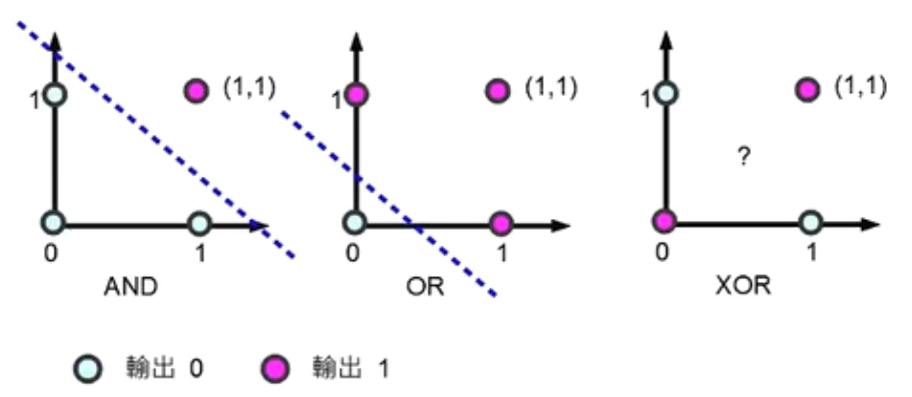

  划分这四个点就是一个二分类问题。这个问题不是一个线性分类问题，因为找不到任何一条直线能将将正方形中两组对角线上的顶点分为一类。

  > 1969 年，新科图灵奖得主马文·明斯基和他的麻省理工学院同侪塞默尔·帕波特合著了《感知器：计算几何简介》（Perceptrons: An Introduction to Computational Geometry）一书，系统论证了感知器模型的两个关键问题。
  >
  > 第一，单层感知器无法解决以异或为代表的线性不可分问题；
  >
  > 第二，受硬件水平的限制，当时的计算机无法完成训练感知器所需要的超大的计算量。

- 感知器对样本顺序敏感，每次迭代的顺序不一致时，找到的分割超平面也不一致

  感知机存在许多解，依赖于初值的选择

  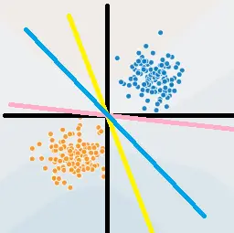

- 在数据集线性可分时，感知器虽然可以找到一个超平面把两类数据分开，但并不能保证其泛化能力

### 4.4.4 感知器改进

#### PLA解决线性不可分问题——对偶形式

##### 原始PLA分析

在原始 PLA 算法中， $\omega_0=0$ ， $b_0=0$ ，$\mathcal{L}(\omega,b)=-\sum\limits_{x_t\in M}y_t(\omega^T\cdot x_t+b)$ ，采用随机梯度下降算法，取一个误分类点 $(x_t,y_t)$ 作为学习数据，$\eta\in(0,1]$ 为学习率
$$
\begin{cases}
\omega^{[t+1]}\leftarrow\omega^{[t]}-\eta\frac{\partial \mathcal{L}}{\partial \omega}=\omega^{[t]}+\eta y_tx_t\\
b^{[t+1]}\leftarrow b^{[t]}-\eta\frac{\partial \mathcal{L}}{\partial b}=b^{[t]}+\eta y_t
\end{cases}
$$
可见

- $\omega$ 更新至于误分类点有关

  某个点使用次数越多，距超平面越近，越难正确分类

- 假设 $(x_t,y_t)$ 被误分类 $n_t$ 次，则 $\omega$ 在 $(x_t,y_t)$ 上的累积量为
  $$
  \begin{cases}
  \delta\omega_t\leftarrow n_t\eta y_tx_t=\alpha_ty_tx_t\\
  \delta b_t\leftarrow n_t\eta y_t=\alpha_ty_t
  \end{cases}
  $$
  且对于正确分类的点 $n_t=0$ ，故原始PLA参数可表示为
  $$
  \begin{cases}
  \omega\leftarrow \sum\limits_{i=1}^Nn_i\eta y_i\cdot x_i\\
  b\leftarrow \sum\limits_{i=1}^N n_i\eta y_i
  \end{cases}
  $$

##### PLA对偶形式

**输入**：
$$
D=\{(x_1,y_1),(x_2,y_2),\cdots,(x_N,y_N)\},x_i\in \mathcal{X}\subseteq R^n,y_i\in \mathcal{Y}=\{+1,-1\},i=1,2,\cdots,N
$$
$\eta\in (0,1]$ 

**模型** 
$$
\begin{aligned}
f(x)&=sign[(\sum\limits_{i=1}^Nn_i\eta y_i x_i)^T\cdot x+\sum\limits_{i=1}^N n_i\eta y_i]\\
&=sign[\sum\limits_{i=1}^N\alpha_i y_i(x_i\cdot x)^T+b]
\end{aligned}
$$
**输出** ：$\alpha,b$ $\alpha=\left(\begin{aligned}\alpha_1\\\alpha_2\\\vdots\\\alpha_N\end{aligned}\right)$ ，$\alpha_i=n_i\eta$ ，$n_i$ 为 $(x_i,y_i)$ 被误分类的次数

**步骤** 

1. $\forall n_i=0$ ，即 $\alpha=0,b=0$ 

2. 选取误分类点 $(x_t,y_t)$ ，若 $y_t[\sum\limits_{i=1}^Nn_i\eta y_i(x_i^T\cdot x_t)+\sum\limits_{i=1}^N n_i\eta y_i]\le 0$ ，则令
   $$
   n^{[t+1]}\leftarrow n^{[t]}+1\\
   \alpha^{[t+1]}\leftarrow \alpha^{[t]}+\eta\\
   \omega^{[t+1]}\leftarrow \omega^{[t]}+\eta y_tx_t\\
   b^{[t+1]}\leftarrow b^{[t]}+ \eta y_t
   $$

3. 转至 $2.$ 直至没有误分类点

由于样本点只以内积形式出现，可计算 **Gram矩阵**
$$
G=[x_i\cdot x_j]_{N\times N}=\left[\begin{matrix}
(x_1,x_1)&(x_1,x_2)&\cdots&(x_1,x_N)\\
(x_2,x_1)&(x_2,x_2)&\cdots&(x_2,x_N)\\
\vdots&\vdots&\ddots&\vdots\\
(x_N,x_1)&(x_N,x_2)&\cdots&(x_N,x_N)
\end{matrix}
\right]
$$

##### 优点

可预先计算存储 **Gram** 矩阵，提高计算速度

可通过 Gram 矩阵引入核函数，有 $K(x,z)=\phi(x)\cdot \phi(z)$ ，可解决非线性分类问题

#### 多层感知器

解决异或问题的思路相当简单，就是将单层感知器变成多层感知器

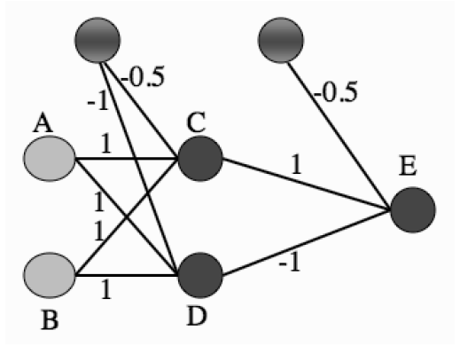

假定两个输入节点 A 和 B 的二进制输入分别为 1 和 0，则根据图中的权重系数可以计算出神经元 C 的输入为 0.5，而神经元 D 的输入为 0。在由 C 和 D 构成的隐藏层中，由于 C的输入大于 0，因而符号函数使其输出为 1；由于 D 的输入等于 0，符号函数则使其输出为0。在输出节点的神经元 E 上，各路输入线性组合的结果为 0.5，因而 E 的输出，也是神经网络整体的输出，为 1，与两个输入的异或相等。

---

多层感知器（multilayer perceptron）包含一个或多个在输入节点和输出节点之间的隐藏层（hidden layer），除了输入节点外，每个节点都是使用非线性激活函数的神经元

在不同层之间，多层感知器具有全连接性，即任意层中的每个神经元都与它前一层中的所有神经元或者节点相连接，连接的强度由网络中的权重系数决定。

多层感知器是一类前馈人工神经网络（feedforward neural network）。网络中每一层神经元的输出都指向输出方向，也就是向前馈送到下一层，直到获得整个网络的输出为止。

##### 训练步骤

确定给定输入和当前权重下的输出，再将输出和真实值相减得到误差函数，最后根据误差函数更新权重

##### 反向传播

在训练过程中，虽然信号的流向是输出方向，但计算出的误差函数和信号传播的方向相反，也就是向输入方向传播的，正因如此，这种学习方式得名反向传播（backpropagation）。

**反向传播算法通过求解误差函数关于每个权重系数的偏导数，以此使误差最小化来训练整个网络**

#### 参数平均感知器

根据定理，若间隔 $\gamma$ 越大，则收敛越快，但感知器不能保证找到的判别函数是最优的，可能导致过拟合

感知器学习到的权重向量和训练样本的顺序相关。在迭代次序上排在后面的错误样本比前面的错误样本，对最终的权重向量影响更大

比如有1000个训练样本，在迭代100个样本后，感知器已经学习到一个很好的权重向量．在接下来的899个样本上都预测正确，也没有更新权重向量．但是，在最后第1000个样本时预测错误，并更新了权重．这次更新可能反而使得权重向量变差

为了提高感知器的泛化能力，可以在感知器学习过程中的 $T$ 个权重向量保存，并赋予每个权重向量 $\omega_t$ 一个置信系数 $c_t(1\le t\le T)$ ，最终的分类结果通过这 $T$ 个不同权重的感知器投票决定——投票感知器

令 $\tau_t$ 为第 $t$ 次更新权重 $\omega_t$ 时的迭代次数，则权重 $\omega_t$ 的置信系数 $c_t$ 设置为从 $\tau_t$ 到 $\tau_{t+1}$ 之间间隔的迭代次数，即 $c_t=\tau_{t+1}-\tau_t$ 

置信系数 $c_t$ 越大，说明权重 $\omega_t$ 在之后的训练过程中正确分类的样本数越多，越值得信赖，故投票感知器的形式为
$$
\hat{y}=sign\left(\sum\limits_{t=1}^Tc_t sign(\omega_t^T x)\right)
$$
投票感知器虽然提高了感知器的泛化能力，但需要保存 $T$ 个权重向量，在实际操作中会带来额外的开销。

通过参数平均来减少感知器的参数数量，也叫平均感知器
$$
\begin{aligned}
\hat{y}&=sign\left(\frac{1}{T}\sum\limits_{t=1}^Tc_t (\omega_t^T x)\right)\\
&=sign\left(\frac{\sum\limits_{t=1}^Tc_t\omega^T_t}{T}x\right)\\
&=sign(\overline{\omega}^Tx)
\end{aligned}
$$

- 每次迭代都需要更新 $\overline{\omega}$

因为 $\overline{\omega}$ 与 $\omega$ 都是稠密向量，所以更新操作比较费时

#### 扩展到多分类

蒲公英书3.4.4

支持向量机是一种二分类算法，通过在高维空间中构建超平面实现对样本的分类

## 4.5 支持向量机

线性可分SVM通过硬间隔最大化求出划分超平面，解决线性分类问题

线性SVM通过软间隔最大化求出划分超平面，解决线性分类问题

非线性SVM利用核函数实现从低维原始空间到高维特征空间的转换，在高维空间上解决非线性分类问题

SVM的学习是个凸二次规划问题，可以用SMO算法快速求解

### 4.5.1 SVM概述

解决的问题：二分类问题

目标：通过间隔最大化策略，找一个超平面 $\omega^*\cdot x+b^*=0$ ，将特征空间划分为两部分 $\{+1,-1\}$ 

模型：定义在特征空间上的 **间隔最大** 的线性分类器

- 间隔最大是与感知机有区别的地方
- 通过核技巧，使SVM成为非线性分类器/回归器

策略：间隔最大化 $\rightarrow$ 凸二次化（加约束项）

- 正则化的合页损失函数最小化

算法：求解凸二次规划的最优化算法

#### 分类

$$
支持向量机\begin{cases}
SVC(支持向量分类机)\begin{cases}
线性支持向量机\begin{cases}
线性可分：硬间隔最大化\\
近似线性可分：软间隔最大化
\end{cases}\\
非线性支持向量机：核技巧+软间隔最大化
\end{cases}\\
SVR(支持向量回归机)
\end{cases}
$$

数据集
$$
D=\{(x_1,y_1),(x_2,y_2),\cdots,(x_N,y_N)\},x_i\in\mathcal{X}\subseteq  R^n,y\in \{+1,-1\},i=1,2,\cdots,N
$$

### 4.5.2 线性可分SVM

eg：SVM解决二分类问题的思路

线性可分的数据集可以简化为二维平面上的点集。

在直角坐标系中，如果有若干个点位于 $x$ 轴下方，另外若干个点位于 $x$ 轴上方，这两个点集共同构成了一个线性可分的训练数据集，而 $x$ 轴就是将它们区别开的一维超平面，也就是直线。

假设 $x$ 轴上方的点全部位于直线 $y=1$ 上及其上方，$x$ 轴下方的点全部位于直线 $y=-2$ 上及其下方。则任何平行于 $x$ 轴且在 $(-2,1)$ 之间的直线都可以将这个训练集分开。但此时面临选择哪一条直线分类效果最好的问题。

直观上看 $y=-0.5$ 最好，这条分界线正好位于两个边界中间，**与两个类别的间隔** 可以同时达到最大。当训练集中的数据因为噪音干扰而移动时，这个最优划分超平面的划分精确度受到的影响最小，具有很强的泛化能力

#### 线性可分SVM基本思想

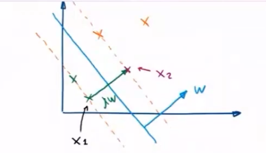

在高维的特征空间上，划分超平面可以用简单的线性方程描述
$$
\omega\cdot x+b=0
$$

- $n$ 维向量 $\omega$ 为法向量，决定了超平面的方向
- $b$ 为截距，决定了超平面与高维空间中原点的距离

划分超平面将特征空间分为两部分

- 法向量所指一侧——正例，$y=+1$
- 法向量反方向恻——负例，$y=-1$

决策函数：
$$
f(x)=sign(\omega \cdot x+b)
$$

#### 策略

**硬间隔最大化策略** ——使距离超平面最近的两个点之间的间距最大

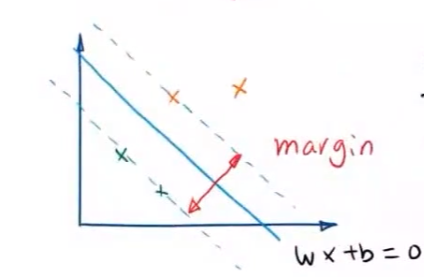

**函数间隔**

超平面 $(\omega,b)$ 关于 $(x_i,y_i)$ 的函数间隔
$$
\gamma_i=y_i(\omega\cdot x_i+b)
$$

- 符号：是否分类正确
- 大小：确信程度—— $\vert \omega\cdot x_i+b\vert$ 表示点到超平面的远近程度

超平面关于数据集 $D$ 的函数间隔
$$
\hat{\gamma}=\min\limits_{x_i\in \mathcal{X}}\hat{\gamma_i}=\min\limits_{x_i\in \mathcal{X}}y_i(\omega\cdot+b)
$$
可用函数间隔表示分类的正确性和确信程度

**几何间隔**

给定超平面后，特征空间中的样本点 $x_i$ 到超平面的距离可以表示为
$$
+1类到超平面的距离：\gamma_i=\frac{\omega\cdot x_i+b}{\Vert \omega\Vert_2}\\
-1类到超平面的距离：\gamma_i=-\frac{\omega\cdot x_i+b}{\Vert \omega\Vert_2}
$$
即点被正确分类时，到超平面几何距离
$$
\gamma_i=y_i\left(\frac{\omega\cdot x_i+b}{\Vert \omega\Vert_2}\right)
$$

- 这个距离是一个归一化距离——**几何间隔**

数据集 $D$ 到超平面 $(\omega,b)$ 的几何距离
$$
\begin{aligned}
\gamma&=\min\limits_{x_i\in \mathcal{X}}\frac{\omega^T\cdot x_i+b}{\Vert \omega\Vert_2}\\
&=\min\limits_{x_i\in \mathcal{X}}\frac{\hat{\gamma}_i}{\Vert \omega\Vert_2}
\end{aligned}
$$

##### 硬间隔最大化

**定理** ：最大分离超平面存在且唯一
$$
\begin{cases}
\max\limits_{\omega,b}\gamma=\max\limits_{\omega,b}\min\limits_{x_i\in \mathcal{X}}\frac{\omega\cdot x_i+b}{\Vert \omega\Vert_2}=\max\limits_{\omega,b}\min\limits_{x_i\in \mathcal{X}}\frac{\hat{\gamma}_i}{\Vert \omega\Vert_2}\\
s.t.\quad y_i\left(\frac{\omega\cdot x_i+b}{\Vert \omega\Vert}\right)\ge \gamma
\end{cases}
$$

可通过等比例调整参数 $\omega$ 和 $b$ ，可以使每个样本到达最优划分超平面的函数距离都不小于 $1$ 
$$
\lambda_i(\omega\cdot x_i+b)\ge 1,y_i=+1\\
\lambda_i(\omega\cdot x_i+b)\le -1,y_i=-1\\
$$
设 $\lambda_i=\frac{1}{\omega x_i+b}$ ，有
$$
\vert \hat{\gamma}'\vert=\vert \lambda \hat{\gamma}\vert\ge 1\\
$$
问题变为
$$
\begin{aligned}
&\begin{cases}
\max\limits_{\omega,b}\gamma'=\max\limits_{\omega,b}\min\limits_{x_i\in \mathcal{X}}\frac{\lambda y_i(\omega\cdot x_i+b)}{\Vert \lambda\omega\Vert_2}\ge \max\limits_{\omega,b}\frac{1}{\Vert \omega'\Vert_2}\\
s.t.\quad \frac{\lambda y_i(\omega\cdot x_i+b)}{\Vert \lambda\omega\Vert_2}=\frac{y_i(\omega'\cdot x_i+b)}{\Vert \omega'\Vert_2}\ge \gamma'
\end{cases}\\
\Rightarrow &\begin{cases}
\max\limits_{\omega,b}\gamma=\max\limits_{\omega,b}\frac{1}{\Vert \omega\Vert_2}\\
s.t.\quad y_i(\omega\cdot x_i+b)\ge 1,i=1,2,\cdots,N
\end{cases}\\
\overset{便于凸二次规划}{\iff} &\begin{cases}
\min\limits_{\omega,b}\frac{1}{\gamma}=\min\limits_{\omega,b}\frac{\Vert \omega\Vert_2^2}{2}\\
s.t.\quad y_i(\omega\cdot x_i+b)-1\ge 0,i=1,2,\cdots,N
\end{cases}\\
\iff&\begin{cases}
\min\limits_{\omega,b}\frac{\Vert \omega\Vert_2^2}{2}\\
s.t.\quad 1-y_i(\omega\cdot x_i+b)\le 0,i=1,2,\cdots,N
\end{cases}
\end{aligned}
$$

#### 原始算法

**输入** ：线性可分的数据集
$$
\begin{aligned}
D=\{(x_1,y_1),(x_2,y_2),\cdots,(x_N,y_N)\},x_i\in \mathcal{X}\subseteq R^n,y_i\in \mathcal{Y}=\{+1,-1\},i=1,2,\cdots,N
\end{aligned}
$$
**输出** ：最大分离超平面和决策函数

**步骤**

1. 构造并求解最优化问题
   $$
   \begin{cases}
   \min\limits_{\omega,b}\frac{\Vert \omega\Vert_2^2}{2}\\
   s.t.\quad 1-y_i(\omega\cdot x_i+b)\le 0,i=1,2,\cdots,N
   \end{cases}
   $$
   凸二次规划可得最优解 $\omega^*,b^*$

2. 可得分类超平面
   $$
   \omega^*\cdot x+b^*=0
   $$
   决策函数 $f(x)=sign(\omega^*\cdot x+b^*)$

##### 支持向量

在特征空间中，距离划分超平面最近的样本点能让函数间隔取等号，这些样本点称为 **支持向量** ，即有点 $x_{k^+},x_{k^-}$ 
$$
\omega\cdot x_{k^+}+b= 1,y_{k^+}=+1\\
\omega\cdot x_{k^-}+b= -1,y_{k^-}=-1\\
$$
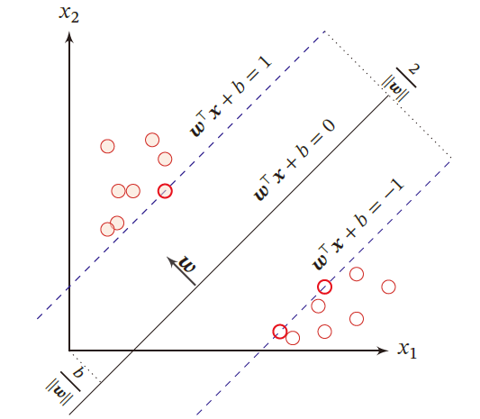

- $H_1,H_2$ 为分类间隔边界；$S$ 为分离超平面

两个异类支持向量到超平面的距离之和为 $\frac{2}{\Vert \omega\Vert}$ 。

因而对于线性可分的SVM任务就是：在满足上述不等式的条件下，寻找 $\frac{2}{\Vert \omega\Vert}$ 的最大值，最大化 $\frac{2}{\Vert \omega\Vert}$ 等效于最小化 $\frac{1}{2}\Vert \omega\Vert^2$  

#### 对偶形式

输入：
$$
D=\{(x_1,y_1),(x_2,y_2),\cdots,(x_N,y_N)\}\in \mathcal{X}\in R^n,y_i\in \mathcal{Y}\in \{+1,-1\},i=1,\cdots,N
$$
输出：分离超平面和决策函数

##### 算法

**1. 构造并求解对偶问题**

由原始算法，可得 Lagrange 函数
$$
L(\omega,b,\alpha)=\frac{1}{2}\Vert \omega\Vert_2^2+\sum\limits_{i=1}^N\alpha_i[1-y_i(\omega_i\cdot x_i+b)],\alpha_i\ge 0
$$
$\frac{1}{2}\Vert \omega\Vert_2^2$ 为凸函数，约束范围为凸集，则有 $局部最优解=全局最优解$
$$
\left.
\begin{aligned}
最优解\in 约束域,即1-y_i(\omega_i\cdot x_i+b)<0\\
最优解\notin 约束域,即最优解在约束边界上，有1-y_i(\omega_i\cdot x_i+b)=0
\end{aligned}
\right\}\Rightarrow \max\limits_{\alpha_i}\alpha_i[1-y_i(\omega_i\cdot x_i+b)]=0
$$
可知 $\max\limits_{\alpha}L(\omega,b,\alpha)=\frac{1}{2}\Vert \omega\Vert_2^2$ ，即
$$
\min\limits_{\omega}\frac{1}{2}\Vert \omega\Vert_2^2=\min\limits_{\omega}\max\limits_{\alpha}L(\omega,\alpha)
$$
又由于 $\min\limits_{\omega}\max\limits_{\alpha}L(\omega,b,\alpha)$ 与 $\max\limits_{\alpha}\min\limits_{\omega}L(\omega,b,\alpha)$ 是对偶问题，有相同的最优解

- 对偶问题(极小中求极大)，相当于求原问题(极大中求极小)的下界

最优解满足KKT条件
$$
\begin{cases}
\frac{\partial L}{\partial \omega}=0\\
\frac{\partial L}{\partial b}=0\\
\frac{\partial L}{\partial \alpha_i}=0\\
\alpha_i\ge 0\\
\alpha_i[1-y_i(\omega_i\cdot x_i+b)]\le 0
\end{cases}\Rightarrow \begin{cases}
\omega-\sum\limits_{i=1}^N\alpha_iy_ix_i=0\\
-\sum\limits_{i=1}^N\alpha_iy_i=0\\
1-y_i(\omega_i\cdot x_i+b)=0\\
\alpha_i\ge 0\\
\alpha_i[1-y_i(\omega_i\cdot x_i+b)]\le 0
\end{cases}
$$
即有 $\omega^*=\sum\limits_{i=1}^N\alpha_iy_ix_i$ ，代入 $L(\omega,b,\alpha)$ 

$$
\begin{aligned}
\min\limits_{\omega,b}L(\alpha)&=\frac{1}{2}(\omega^*)^T\omega^*+\sum\limits_{i=1}^N\alpha_i-\sum\limits_{i=1}^N\alpha_iy_i\omega^*\cdot x_i-\sum\limits_{i=1}^N\alpha_iy_i b\\
&=\frac{1}{2}\sum\limits_{j=1}^N\alpha_jy_jx_j\sum\limits_{i=1}^N\alpha_iy_ix_i+\sum\limits_{i=1}^N\alpha_i-\sum\limits_{i=1}^N\alpha_iy_i\sum\limits_{j=1}^N\alpha_jy_jx_j\\
&\xlongequal{x_j\cdot,x_i为向量点积，其余部分为标量}\frac{1}{2}\sum\limits_{i=1}^N\sum\limits_{j=1}^N\alpha_i\alpha_jy_iy_jx_i\cdot x_j-\sum\limits_{i=1}^N\sum\limits_{j=1}^N\alpha_i\alpha_jy_iy_jx_i\cdot x_j+\sum\limits_{i=1}^N\alpha_i\\
&=\sum\limits_{i=1}^N\alpha_i-\frac{1}{2}\sum\limits_{i=1}^N\sum\limits_{j=1}^N\alpha_i\alpha_jy_iy_jx_i\cdot x_j
\end{aligned}
$$
对偶问题
$$
\begin{cases}
\max\limits_{\alpha}L(\alpha)=\sum\limits_{i=1}^N\alpha_i-\frac{1}{2}\sum\limits_{i=1}^N\sum\limits_{j=1}^N\alpha_i\alpha_jy_iy_jx_i\cdot x_j\\
s.t. \quad \alpha_i\ge 0\\
\qquad \sum\limits_{i=1}^N\alpha_iy_i=0\\
\end{cases}
$$
求解对偶问题，可得 $\alpha^*=\left(\begin{aligned}\alpha_1^*\\\alpha_2^*\\\vdots\\\alpha_N^*\end{aligned}\right)$ 

**2. 计算参数**

由 $\alpha^*$ 可得 $\omega^*=\sum\limits_{i=1}^N\alpha^*_iy_ix_i$

- **结论**：对于支持向量，有 $\alpha_j^*>0$ ，其余点 $\alpha^*=0$  

间隔边界上的点，满足
$$
\begin{aligned}
&y(\omega\cdot x+b)=1\\
&y^2(\omega\cdot x+b)=y\\
\Rightarrow &\omega\cdot x+b=y
\end{aligned}
$$
将 $\omega^*$ 代入支持向量
$$
\begin{aligned}
&\omega^*x_j+b^*=y_j\\
\Rightarrow&b^*=y_j-\omega^*x_j=y_j-\sum\limits_{i=1}^N\alpha_i^*y_i(x_i\cdot x_j)
\end{aligned}
$$

**3. 求得分离超平面**
$$
\begin{cases}
\omega^* x+b^*=0\\
分类决策函数 f(x)=sign(\omega^* x+b)
\end{cases}\Rightarrow\begin{cases}
\sum\limits_{i=1}^N\alpha_iy_ix_i\cdot x+\left(y_j-\sum\limits_{i=1}^N\alpha_i^*y_i(x_i\cdot x_j)\right)=0\\
f(x)=sign\left(\sum\limits_{i=1}^N\alpha_iy_ix_i\cdot x+y_j-\sum\limits_{i=1}^N\alpha_i^*y_i(x_i\cdot x_j)\right)
\end{cases}
$$

##### 优点

- 对偶问题易于求解
- 引入核函数，推广到非线性分类问题

##### 例题

有样本 $+1:x_1=(3,3),x_2=(4,3)$ ，$-1:x_3=(1,1)$

由对偶算法
$$
\begin{cases}
\min\limits_{\alpha}\left(\frac{1}{2}\sum\limits_{i=1}^N\sum\limits_{j=1}^N\alpha_i\alpha_jy_iy_jx_i\cdot x_j-\sum\limits_{i=1}^N\alpha_i\right)\\
s.t.\quad \alpha_i\ge 0\\
\qquad \sum\limits_{i=1}^N\alpha_iy_i=0,i=1,2,\cdots,N
\end{cases}
$$
 代入后有
$$
\begin{cases}
\begin{equation}\tag{1}
\min\limits_{\alpha}L(\alpha)=\frac{1}{2}(18\alpha_1^2+25\alpha_2^2+2\alpha_3^2+42\alpha_1\alpha_2-12\alpha_1\alpha_3-14\alpha_2\alpha_3)-(\alpha_1+\alpha_2+\alpha_3)
\end{equation}
\\
s.t.\quad
\alpha_1+\alpha_2-\alpha_3=0
\\
\qquad \alpha_i\ge 0
\end{cases}
$$
将 $\alpha_3=\alpha_1+\alpha_2$ 代入 $(1)$
$$
S(\alpha_1,\alpha_2)=4\alpha_1^2+\frac{13}{2}\alpha_2^2+10\alpha_1\alpha_2-2\alpha_1-2\alpha_2
$$
令 $\frac{\partial S}{\partial \alpha_1}=0$ ，$\frac{\partial S}{\partial \alpha_2}=0$ 可得 $(\alpha_1,\alpha_2)^T=(\frac{3}{2},-1)^T$ ，但不满足约束条件

可知最优解在约束边界上
$$
若\alpha_1=0，令 \frac{\partial S}{\partial \alpha_2}=0\Rightarrow \alpha_2=\frac{2}{13}\Rightarrow S(0,\frac{2}{13})=-\frac{2}{13}\\
\alpha_2=0，令\frac{\partial S}{\partial \alpha_1}=0\Rightarrow \alpha_1=\frac{1}{4}\Rightarrow S(\frac{1}{4},0)=-\frac{1}{4}
$$
$\therefore$ $S(\alpha_1,\alpha_2)$ 在 $(\frac{1}{4},0)^T$ 上取最小，$\alpha_3=\alpha_1+\alpha_2=\frac{1}{4}$

由于 $\alpha_1=\alpha_3=\frac{1}{4}\neq 0$ ，故 $x_1,x_3$ 为支持向量
$$
\begin{aligned}
\omega^*&=\alpha_1y_1x_1+\alpha_3y_3x_3\\
&=\frac{1}{4}\left(\begin{aligned}
3\\3
\end{aligned}\right)+\frac{1}{4}(-1)\left(\begin{aligned}
1\\1
\end{aligned}\right)=\left(\begin{aligned}
\frac{1}{2}\\\frac{1}{2}
\end{aligned}\right)\\
b^*&=y_3-\sum\limits_{i=1}^3\alpha_iy_i(x_i\cdot x_3)=-2
\end{aligned}
$$
所以有分离超平面 $\frac{1}{2}x^{(1)}+\frac{1}{2}x^{(2)}-2=0$ ，决策函数 $f(x)=sign(\frac{1}{2}x^{(1)}+\frac{1}{2}x^{(2)}-2)$ 

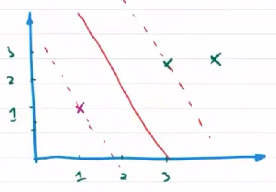

### 4.5.3 线性SVM基本思想

近似线性可分问题，有少量特异点

- 某些样本点距离划分超平面的函数间隔不满足不小于1的约束条件

需要对每个样本点引入大于零的松弛变量 $\xi\ge 0$ ，使得函数间隔和松弛变量的和不小于1，即 $\hat{\gamma}_i\ge 1$ 
$$
\left.
\begin{aligned}
\omega\cdot x_i+b\ge 1-\xi_i,y_i=+1\\
\omega\cdot x_i+b\le-1+\xi_i,y_i=-1\\
\end{aligned}
\right\}\Rightarrow y_i(\omega_i\cdot x_i+b)+\xi_i\ge 1\Rightarrow 1-y_i(\omega_i\cdot x_i+b)-\xi_i\le 0
$$
即当训练集线性不可分时，学习策略变为 **软间隔最大化**

相应地，最优化问题中的目标函数演变为 $\frac{1}{2}\Vert \omega\Vert^2+C\sum_\limits{i=1}^n\xi^2_i$ ，其中 $C$ 被称为 **惩罚参数** ，表示分类的严格程度

- $C\sum_\limits{i=1}^n\xi^2_i$ 越小越靠近间隔界面

#### 原始问题

$$
\begin{cases}
\min\limits_{\omega,b}\frac{\Vert \omega\Vert_2^2}{2}+C\sum_\limits{i=1}^N\xi^2_i\\
s.t.\quad 1-y_i(\omega\cdot x_i+b)-\xi_i\le 0\quad,i=1,2,\cdots,N,\xi_i\ge 0
\end{cases}
$$

求分离超平面 $\omega^*\cdot x+b^*=0$ 的参数 $\omega^*,b^*$ 

模型为：$f(x)=sign(\omega^*\cdot x+b^*)$

#### 原始问题转换为对偶问题

输入：
$$
D=\{(x_1,y_1),(x_2,y_2),\cdots,(x_N,y_N)\}\in \mathcal{X}\in R^n,y_i\in \mathcal{Y}\in \{+1,-1\},i=1,\cdots,N
$$
输出：分离超平面和决策函数

##### 算法

**1. 构造并求解约束最优化问题**

由原始算法，可得 Lagrange 函数
$$
L(\omega,b,\alpha,\xi,\mu)=\frac{1}{2}\Vert \omega\Vert_2^2+C\sum_\limits{i=1}^N\xi^2_i+\sum\limits_{i=1}^N\alpha_i[1-y_i(\omega_i\cdot x_i+b)-\xi_i]-\sum\limits_{i=1}^N\mu_i\xi_i\\
i=1,2,\cdots,N,\xi_i\ge 0,\alpha_i\ge 0,\mu_i\ge 0
$$
$\frac{1}{2}\Vert \omega\Vert_2^2+C\sum_\limits{i=1}^n\xi^2_i$ 为凸函数，约束范围为凸集，则有 $局部最优解=全局最优解$ 
$$
\begin{aligned}
&\begin{cases}
最优解\in 约束域,即1-y_i(\omega_i\cdot x_i+b)-\xi_i<0&\Rightarrow\alpha_i,\mu_i=0\\
最优解\notin 约束域,在约束边界上，有1-y_i(\omega_i\cdot x_i+b)-\xi_i=0&\Rightarrow\alpha_i>0,\mu_i>0
\end{cases}\\
\Rightarrow &\max\limits_{\alpha_i}\alpha_i[1-y_i(\omega_i\cdot x_i+b)-\xi_i]-\mu_i\xi_i=0
\end{aligned}
$$
可知 $\max\limits_{\alpha}L(\omega,b,\alpha,\xi,\mu)=\frac{1}{2}\Vert \omega\Vert_2^2+C\sum_\limits{i=1}^n\xi^2_i$ ，即
$$
\min\limits_{\omega,\xi}\frac{1}{2}\Vert \omega\Vert_2^2+C\sum_\limits{i=1}^N\xi^2_i=\min\limits_{\omega,\xi}\max\limits_{\alpha}L(\omega,b,\alpha,\xi,\mu)
$$
又由于 $\min\limits_{\omega,\xi}\max\limits_{\alpha,\mu}L(\omega,b,\alpha,\xi,\mu)$ 与 $\max\limits_{\alpha,\mu}\min\limits_{\omega,\xi}L(\omega,b,\alpha,\xi,\mu)$ 是对偶问题，有相同的最优解

- 对偶问题(极小中求极大)，相当于求原问题(极大中求极小)的下界

最优解满足KKT条件
$$
\begin{cases}
\frac{\partial L}{\partial \omega}=0\\
\frac{\partial L}{\partial b}=0\\
\frac{\partial L}{\partial \alpha_i}=0\\
\frac{\partial L}{\partial \xi_i}=0\\
\alpha_i\ge 0,\mu_i\ge 0,\xi_i\ge 0\\
\alpha_i[1-y_i(\omega_i\cdot x_i+b)-\xi_i]\le 0
\end{cases}\Rightarrow \begin{cases}
\omega-\sum\limits_{i=1}^N\alpha_iy_ix_i=0\\
-\sum\limits_{i=1}^N\alpha_iy_i=0\\
1-y_i(\omega_i\cdot x_i+b)=0\\
C-\alpha_i-\mu_i=0\\
\alpha_i\ge 0,\mu_i\ge 0,\xi_i\ge 0\\
\alpha_i[1-y_i(\omega_i\cdot x_i+b)-\xi_i]\le 0
\end{cases}
$$
即有 $\omega^*=\sum\limits_{i=1}^N\alpha_iy_ix_i,C=\alpha_i+\mu_i$ ，代入 $L(\omega,b,\alpha,\xi,\mu)$ 

$$
\begin{aligned}
\min\limits_{\omega,b,\xi}L(\alpha)
&=\frac{1}{2}(\omega^*)^T\omega^*+C\sum_\limits{i=1}^N\xi^2_i+\sum\limits_{i=1}^N\alpha_i-\sum\limits_{i=1}^N\alpha_iy_i\omega^*\cdot x_i-\sum\limits_{i=1}^N\alpha_iy_i b-\sum\limits_{i=1}^N\alpha_i\xi_i-\sum\limits_{i=1}^N\mu_i\xi_i\\
&=\frac{1}{2}\sum\limits_{j=1}^N\alpha_jy_jx_j\sum\limits_{i=1}^N\alpha_iy_ix_i+C\sum_\limits{i=1}^N\xi^2_i+\sum\limits_{i=1}^N\alpha_i-\sum\limits_{i=1}^N\alpha_iy_i\sum\limits_{j=1}^N\alpha_jy_jx_j-\sum\limits_{i=1}^N(\alpha_i+\mu_i)\xi_i\\
&\xlongequal{x_j\cdot,x_i为向量点积，其余部分为标量}\frac{1}{2}\sum\limits_{i=1}^N\sum\limits_{j=1}^N\alpha_i\alpha_jy_iy_jx_i\cdot x_j-\sum\limits_{i=1}^N\sum\limits_{j=1}^N\alpha_i\alpha_jy_iy_jx_i\cdot x_j+\sum\limits_{i=1}^N\alpha_i\\
&=\sum\limits_{i=1}^N\alpha_i-\frac{1}{2}\sum\limits_{i=1}^N\sum\limits_{j=1}^N\alpha_i\alpha_jy_iy_jx_i\cdot x_j
\end{aligned}
$$
且有
$$
\begin{cases}
\alpha_i\ge 0,\mu_i\ge 0\\
C-\alpha_i-\mu_i=0
\end{cases}\Rightarrow C-\alpha_i=\mu_i\ge 0\Rightarrow0\le \alpha_i\le C
$$
至此，线性SVM问题转化为 对偶形式
$$
\begin{cases}
\max\limits_{\alpha}L(\alpha)=\sum\limits_{i=1}^N\alpha_i-\frac{1}{2}\sum\limits_{i=1}^N\sum\limits_{j=1}^N\alpha_i\alpha_jy_iy_jx_i\cdot x_j\\
s.t. \quad 0\le \alpha_i\le 0\\
\qquad \sum\limits_{i=1}^N\alpha_iy_i=0\\
\end{cases}
$$
求解对偶问题，可得 $\alpha^*=\left(\begin{aligned}\alpha_1^*\\\alpha_2^*\\\vdots\\\alpha_N^*\end{aligned}\right)$ 

**2. 计算参数**

若存在一个分量 $\alpha_j^*\in (0,C)$ ，该样本点位于间隔界面上
$$
\omega^*=\sum\limits_{i=1}^N\alpha_i^*y_ix_i\\
(\omega^*\cdot x_j+b)y_j=1\iff (\omega^*\cdot x_j+b)y_j^2=y_j\Rightarrow \omega^*\cdot x_j+b^*=y_j\Rightarrow b^*=y_j-\sum\limits_{i=1}^N\alpha_i^*y_ix_i\cdot x_j
$$

**3. 求得分离超平面和决策函数**
$$
\begin{cases}
\omega^* x+b^*=0\\
分类决策函数 f(x)=sign(\omega^* x+b)
\end{cases}
\Rightarrow
\begin{cases}
\sum\limits_{i=1}^N\alpha_i^*y_ix_i\cdot x+\left(y_j-\sum\limits_{i=1}^N\alpha_i^*y_ix_i\cdot x_j\right)=0\\
决策函数f(x)=sign\left[\sum\limits_{i=1}^N\alpha_i^*y_ix_i\cdot x+\left(y_j-\sum\limits_{i=1}^N\alpha_i^*y_ix_i\cdot x_j\right)\right]
\end{cases}
$$

##### 支持向量

$\alpha_i^*=0$ 的点，在间隔边界外，正确分类

$0<\alpha_i^*<C$ 的点，在间隔边界上，是支持向量 $\xi_i=0$

$\alpha_i^*=C$ 的点为在间隔边界间的点

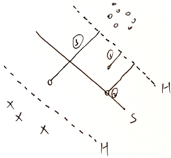
$$
\begin{cases}
0<\xi_i<1&,为①种\\
\xi_i=1&,为②种\\
\xi_i>1&,为③种
\end{cases}
$$
软间隔允许某些样本不满足应间隔的约束，但会限制这些特例的数目

---

支持向量机的一个重要性质就是当训练完成后，最终模型只与支持向量有关

#### 合页损失函数

模型
$$
\begin{cases}
超平面S:\omega^*\cdot x+b^*=0\\
决策函数:f(x)=sign(\omega^*\cdot x+b^*)
\end{cases}
$$
策略：软间隔最大化
$$
\max\frac{1}{\Vert \omega\Vert}\Rightarrow \begin{cases}
\min\limits_{\omega,\xi_i}\frac{1}{2}\Vert\omega\Vert_2^2+C\sum\limits_{i=1}^N\xi_i\\
s.t.\quad \xi_i\ge 0\\
\qquad y_i(\omega\cdot x+b)+\xi_i\ge 1
\end{cases}
$$
$y_i(\omega\cdot x_i+b)<1$ 为分类错误的样本，即损失 $\iff 1-y_i(\omega\cdot x_i+b)>0$ 

故**合页损失函数**定义为
$$
L(y_i(\omega \cdot x_i+b))=[1-y_i(\omega\cdot x_i+b)]_+
$$

- 函数间隔 $y_i(\omega \cdot x_i+b)<0$ 表示分错类

  感知机损失函数由 $[-y_i(\omega \cdot x_i+b)]_+$ 表示

  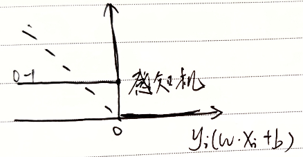

- 样本被分类正确，且函数间隔大1于1，损失为0

  PLA感知机：只考虑分类是查否正确，分类正确损失为0

  SVM支持向量机：在分类正确前提下，要确信程度足够高，损失才为0

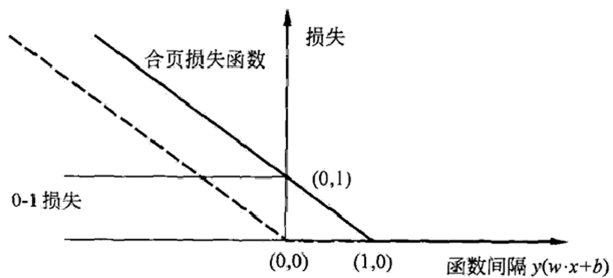

结构风险最小化策略SRM
$$
R_{emp}=\sum\limits_{i=1}^N[1-y_i(\omega\cdot x_i+b)]_{+}+\lambda\Vert \omega\Vert_2^2
$$

##### 带约束项等价于带正则项

带正则项形式为
$$
\min\limits_{\omega,b}\sum\limits_{i=1}^N[1-y_i(\omega\cdot x_i+b)]_{+}+\lambda\Vert \omega\Vert_2^2
$$
带约束项形式为
$$
\begin{cases}
\min\limits_{\omega,\xi_i,b}\frac{1}{2}\Vert\omega\Vert_2^2+C\sum\limits_{i=1}^N\xi_i\\
s.t.\quad \xi_i\ge 0\\
\qquad y_i(\omega\cdot x+b)+\xi_i\ge 1
\end{cases}
$$
令 $\xi_i=1-y_i(\omega\cdot x+b)$ 表示损失大小，$\xi_i\ge 0\begin{cases}=0&,分类正确\\>0&,有损失\end{cases}$
$$
\begin{cases}
当y_i(\omega\cdot x_i+b)\ge 1，有\xi_i=0\\
当y_i(\omega\cdot x_i+b)<1，有\xi_i>0
\end{cases}
$$
故可记为 $\min\limits_{\omega,b}\sum\limits_{i=1}^N\xi_i+\lambda\Vert\omega\Vert_2^2$ 

取 $\lambda=\frac{1}{2C}$ ，有 $\min\limits_{\omega,b}\frac{1}{C}\left(\sum\limits_{i=1}^N\xi_i+\lambda\Vert\omega\Vert_2^2\right)$

### 4.5.4 非线性可分SVM

#### 非线性可分问题

原始空间不存在能够正确划分的超平面

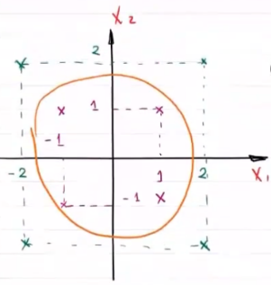

在二维平面直角坐标系中，如果按照与原点之间的距离对数据点进行分类的话，分类模型就成为一个圆，也就是超平面

##### 处理思路

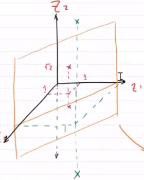

如果能将样本从原始空间映射到高维特征空间上，在新的特征空间是上样本就可能是线性可分的

- 若样本的属性数优先，则一定存在一个高维特征空间使样本可分

##### 核技巧

**通过一个非线性映射，将原始低维空间上的非线性问题转化为新的高维空间上的线性问题，这就是核技巧的基本思想。**

使在原始空间 $R^n$ 中的超平面模型映射为特征空间的超平面模型

在学习和预测中，只定义核函数，而不显式定义映射函数，利用线性分类方法与核函数解决非线性问题

##### 核函数

假设原始空间是 **低维欧几里得空间 $\mathcal{X}$** ，新空间为 **高维希尔伯特空间 $\mathcal{H}$ ** ，从 $\mathcal{X}$ 到 $\mathcal{H}$ 的映射可以用函数 $\phi(x):\mathcal{X}\rightarrow \mathcal{H}$ 表示。核函数可以表示为映射函数内积形式
$$
K(x,z)=\phi(x)\cdot\phi(z)
$$

**eg**

原空间 $\mathcal{X}$ 中的两个点进行内积运算 $(x_i,x_j)$ ，若先进行映射再在 $\mathcal{H}$ 中内积运算，则有
$$
z_i=\phi(x_i),z_j=\phi(x_j),则(z_i,z_j)=\phi(x_i)\cdot \phi(x_j)
$$
若使用核函数，则可直接计算 $K(x_i,x_j)$ 

**特点**

对于确定的核函数

1. 计算过程在低维空间上完成，避免了高维空间中的复杂计算

1. 对于给定核函数，高维空间 $\mathcal{H}$ 和映射函数 $\phi$ 的取法不唯一

   可映射到不同的特征空间，$z_i$ 维度可以不同和

   可通过不同映射函数，映射到同一特征空间

##### 核函数作用于SVM

输入：线性不可分的数据
$$
D=\{(x_1,y_1),(x_2,y_2),\cdots,(x_N,y_N)\}\in \mathcal{X}\in R^n,y_i\in \mathcal{Y}\in \{+1,-1\},i=1,\cdots,N
$$
输出：分离超平面和决策函数

算法：

**1.** 选择合适的参数 $C$ 和核函数 $K(x,z)$ ，构造最优化问题

线性SVM
$$
\begin{cases}
\min\limits_{\alpha}\frac{1}{2}\sum\limits_{i=1}^N\sum\limits_{j=1}^N\alpha_i\alpha_jy_iy_jx_i\cdot x_j-\sum\limits_{i=1}^N\alpha_i\\
s.t. \quad 0\le \alpha_i\le 0\\
\qquad \sum\limits_{i=1}^N\alpha_iy_i=0\\
\end{cases}
$$
对于 $(x_i,x_j)$ ，可以通过核技巧映射到线性可分空间
$$
\phi(x_i)\cdot \phi(x_j)=z_i\cdot z_j=K(x_i,x_j)
$$
在 $\mathcal{H}$ 空间中的SVM问题为
$$
\begin{cases}
\min\limits_{\alpha}\frac{1}{2}\sum\limits_{i=1}^N\sum\limits_{j=1}^N\alpha_i\alpha_jy_iy_jK(x_i,x_j)-\sum\limits_{i=1}^N\alpha_i\\
s.t. \quad 0\le \alpha_i\le 0\\
\qquad \sum\limits_{i=1}^N\alpha_iy_i=0\\
\end{cases}
$$
求得最优解 $\alpha^*=(\alpha_1^*,\alpha_2^*,\cdots,\alpha_N^*)$

**2.** 选一个 $0<\alpha_j^*<C$ 的分量对应的样本点 $(x_j,y_j)$ ——支持向量，计算模型参数 $\omega^*,b^*$

有 $\omega^*=\sum\limits_{i=1}^N\alpha_i^*y_i K(\cdot,x_i)$ ， $b^*=y_j-\sum\limits_{i=1}^N\alpha_i^*y_iK(x_i,x_j)$

模型
$$
\begin{cases}
\sum\limits_{i=1}^N\alpha_i^*y_i K(x_i,x)+\left(y_j-\sum\limits_{i=1}^N\alpha_i^*y_iK(x_i,x_j)\right)=0\\
决策函数f(x)=sign\left[\sum\limits_{i=1}^N\alpha_i^*y_iK(x_i,x)+\left(y_j-\sum\limits_{i=1}^N\alpha_i^*y_iK(x_i,x_j)\right)\right]
\end{cases}
$$
所以问题的关键为 **如何确定核函数 $K(x_i,x_j)$**

#### 正定核函数

对于内积运算，
$$
\left.
\begin{aligned}
(x,x)>0，当x>0时&——正定性\\
(x_i,x_j)=(x_j,x_i)&——非负性
\end{aligned}
\right\}\Rightarrow 正定核
$$
故正定核函数应满足：

1. 对称性： $K(x,z)=K(z,x)$

2. 正定性：$\forall x_1,x_2\cdots,x_N\in R^n$ ，$K(x_i,x_j)$ 的Gram阵是半正定的

   - Gram阵
     $$
     原\left[
     \begin{matrix}
     (x_1,x_1)&\cdots&(x_1,x_N)\\
     \vdots&\ddots&\vdots\\
     (x_N,x_1)&\cdots&(x_N,x_N)
     \end{matrix}
     \right]\qquad 新\left[
     \begin{matrix}
     K(x_1,x_1)&\cdots&K(x_1,x_N)\\
     \vdots&\ddots&\vdots\\
     K(x_N,x_1)&\cdots&K(x_N,x_N)
     \end{matrix}
     \right]
     $$

   - 半正定

     对于A，$\forall x\neq 0$ ，有$x^TAx\ge 0$ ，则有A为半正定阵

     半正定判定 $\begin{cases}
     x^TAx=y^TDy——D为对角阵\\
     全部特根\lambda\ge 0\\
     所有主子行列式\ge 0
     \end{cases}$

##### 由$K(x,z)$ 构造 $\mathcal{H}$ 空间

任何一个核函数都隐式定义了一个成为 **再生核希尔伯特空间** 的特征空间
$$
\begin{aligned}
&欧式空间&\begin{cases}
空间(集合)\xrightarrow{元素是向量}向量空间\subseteq 线性空间(元素+数乘\in 空间)\\
\xrightarrow{内积}内积空间\begin{cases}
表示向量间关系\\
用夹角表示，用(a,b)度量夹角大小
\end{cases}\\
\xrightarrow{范数}赋范线性空间——表示向量大小、长度
\end{cases}\\
&&数列存在极限且\in 空间，任一柯西列都是收敛列\{x_1\cdots,x_N\}\\
&&\begin{cases}
x_1>x_2>\cdots>x_N\\
且x_1-x_2>x_2-x_3>\cdots>x_{N-1}-x_N(柯西列)\rightarrow 0\
\end{cases}\\
&\downarrow\\
&巴拿赫空间
\end{aligned}
$$
对于非欧氏空间上的完备空间，称为希尔伯特空间 $\mathcal{H}$

**步骤**

**1.** 定义映射

$\phi:x\rightarrow K(\cdot,x)$ 

-  $\cdot$ 表示任一位置元素
-  $\phi(\cdot)\cdot \phi(x)=K(\cdot,x)$ 表示 $\phi(x)$ 与任一个元素的内积为 $K(\cdot,x)$ 

表示这个映射受核函数约束

线性组合： $f(\cdot)=\sum\limits_{i=1}^m\alpha_iK(\cdot,x_i)$ ——向量
$$
S=\{f(\cdot)\}——向量空间
$$
**2.** $S\xrightarrow{+内积}内积空间$ 
$$
\left.\begin{aligned}
f(\cdot)=\sum\limits_{i=1}^m\alpha_iK(\cdot,x_i)\\
g(\cdot)=\sum\limits_{j=1}^l\beta_j(\cdot,z_j)\\
\end{aligned}
\right\}\Rightarrow f\cdot g=\sum\limits_{i=1}^m\sum\limits_{j=1}^l\alpha_i\beta_jK(x_i,z_j)
$$
证明：
$$
\begin{aligned}
&f\cdot f\ge 0\\
&f\cdot f=\sum\limits_{i=1}^m\sum\limits_{j=1}^m\alpha_i\alpha_jK(x_i,x_j)\ge 0\\
&令x=(\alpha_1,\cdots,\alpha_m)^T,G=\left[
\begin{matrix}
K(x_1,x_1)&\cdots&K(x_1,x_m)\\
\vdots&\ddots&\vdots\\
K(x_m,x_1)&\cdots&K(x_m,x_m)
\end{matrix}
\right]\\
&\begin{aligned}
x^TGx&=(\alpha_1,\cdots,\alpha_m)G(\alpha_1,\cdots,\alpha_m)^T\\
&=\left[
\begin{matrix}
\alpha_1K(x_1,x_1)+\alpha_2K(x_2,x_1)+\cdots+\alpha_mK(x_m,x_1)\\
\vdots\\
\alpha_1K(x_1,x_m)+\alpha_2K(x_2,x_m)+\cdots+\alpha_mK(x_m,x_m)\\
\end{matrix}
\right](\alpha_1,\cdots,\alpha_m)^T\\
&=\sum\limits_{i=1}^m\sum\limits_{j=1}^m\alpha_i\alpha_jK(x_i,x_j)\ge 0
\end{aligned}
\end{aligned}
$$
**3.** $S\xrightarrow{+范数}赋范空间\xrightarrow{完备化}\mathcal{H}$

再生性
$$
K(\cdot,x)\cdot K(\cdot,z)=K(x,z)\\
f(\cdot)=\sum\limits_{i}\alpha_iK(\cdot,x_i)\\
K(\cdot,x)f(\cdot)=\sum\limits_{i}\alpha_i K(x,x_i)=f(x)
$$

##### 常用核函数

在支持向量机中，核函数的选择是一个核心问题，常用核函数有：

**线性核** ：$K(X,Y)=X^TY$

**多项式核** ：$K(X,Y)=(X^TY+c)^d$ ，$c$ 为常数，$d\ge 1$ 为多项式次数

**高斯核** ：$K(X,Y)=e^{-\frac{\Vert X-Y\Vert^2}{2\sigma^2}}$ ，$\sigma>0$ 为高斯核带宽

**拉普拉斯核** ：$K(X,Y)=e^{-\frac{\Vert X-Y\Vert}{\sigma}}$

**sigmod核** ：$K(X,Y)=tanh(\beta X^TY+\theta)$ ，$\beta >0$ ，$\theta <0$

### 4.5.5 SVM参数求解算法

将支持向量机的最优化作为原始问题，应用最优化理论中的拉格朗日对偶性，可以通过求解其对偶问题得到原始问题的最优解

**SVM关键是如何根据支持向量构建解，算法的复杂度也主要取决于支持向量的数目**

在算法实现过程中，支持向量机会遇到大量训练样本下，全局最优解难以求得的情况——SMO算法（序列最小最优化）

支持向量机的学习问题可以形式化为凸二次规划问题的求解，SMO算法的特点是不断将原始的二次规划问题分解为只有两个变量的二次规划子问题，并求解子问题的解析解，直到所有变量满足条件为止

### 4.5.6 SVM与线性模型关系

逻辑斯蒂模型损失函数
$$
\begin{aligned}
J(\omega)&=-\frac{1}{n}\left[\sum\limits_{i=1}^n\sum\limits_{k=1}^2I(y_i=k)\ln P(y_i=k\vert x_i,\omega)\right]\\
&=-\frac{1}{n}\left[\sum\limits_{i=1}^ny_i\ln P(y_i=1\vert x_i,\omega)+(1-y_i)\ln P(y_i=0\vert x_i,\omega)\right]
\end{aligned}
$$
正则化 
$$
J(\omega)+\frac{\lambda}{2n}\Vert \omega\Vert_2^2
$$
即逻辑斯蒂模型先有损失函数，再做正则化

---

SVM：将损失函数作为约束，先求出参数，再以损失函数为约束

## 4.6 损失函数对比

对比二分类算法的损失函数，将类别标签统一为 $y\in \{+1,-1\}$ ，并定义判别函数 $f(x;\omega)=\omega^Tx+b$ 

Logistic损失函数改写为
$$
\begin{aligned}
\mathcal{L}_{LR}&=-I(y=1)\log \sigma(f(x;\omega))-I(y=-1)\log \left[1-\sigma(f(x;\omega))\right]\\
&\xlongequal{1-\sigma(x)=\sigma(-x)}-I(y=1)\log \sigma(f(x;\omega))-I(y=-1)\log \left[-\sigma(f(x;\omega)\right]\\
&=-\log\sigma(yf(x;\omega))\\
&=\log \left[1+e^{-yf(x;\omega)}\right]
\end{aligned}
$$
感知器损失函数为
$$
\mathcal{L}_{P}=\max\{0,-yf(x;\omega)\}
$$
软间隔支持向量的损失损失函数为 
$$
\mathcal{L}_{hinge}=\max\{0,1-yf(x;\omega)\}
$$
平方损失可以重写为
$$
\begin{aligned}
\mathcal{L}_{squard}&=(y-f(x;\omega))^2\\
&\xlongequal{y^2=1}1-2yf(x;\omega)+(yf(x;\omega))^2\\
&=(1-yf(x;\omega))^2
\end{aligned}
$$
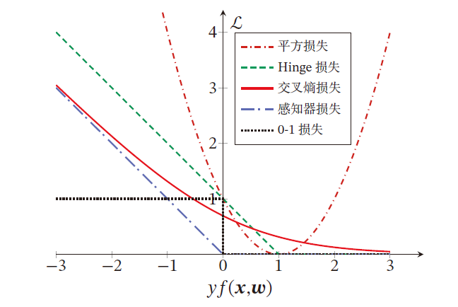

对于二分类问题

- 当 $yf(x;\omega)>0$ 时，分类预测正确，且 $yf(x;\omega)$ 越大，模型的预测越正确
- 当 $yf(x;\omega)<0$ 时，分类预测错误，且 $yf(x;\omega)$ 越小，模型的预测越错误

除了平方损失，其他损失函数都比较适合于二分类问题

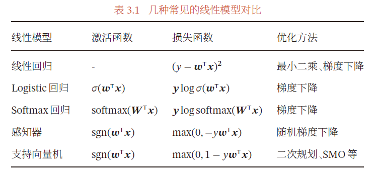

