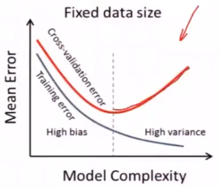

---
categories:
  - AI
  - 机器学习
tags:
  - AI
  - 机器学习
top: 8
mathjax: true
title: 1. 机器学习绪论
abbrlink: 1771285239
date: 2023-08-21 15:27:44
---

[TOC]

---

机器学习是计算机基于数据构建概率统计模型并运用模型对数据进行预测和分析的学科

根据输入输出类型的不同，机器学习分为：分类问题，回归问题，标注问题三类

过拟合是机器学习中不可避免的，可通过选择合适的模型降低影响

监督学习是机器学习的主流任务，包括生成方法和判别方法两类

<!--more-->

## 1.1 机器学习概念

### 1.1.1 定义

人类学习机制：从大量现象中提取反复出现的规律与模式

> A computer sprogram is said to learn from E with respect to some class of tasks T and performance measure P ,if its performance at tasks T as measured by P improves with experience E.

形式化角度：如果算法利用某些经验，使自身在特定任务类上的性能得到改善，则认为该算法实现了人工智能

机器角度：计算机系统通过运用数据及统计方法提高系统性能

方法论角度：机器学习是 **计算机基于数据构建概率统计模型**，并 **运用该模型对数据进行预测与分析** 的学科

- **所有模型都是错的，但有一些是有用的** 

Learning algorithm运用数据计算想假设空间 $\mathcal{H}$ 中的 $g$ 用以近似 $f$ 

#### 统计机器学习与数据挖掘区别

数据挖掘：运用机器学习的数据分析方法来分析海量数据，由数据库提供的技术管理海量数据

#### 机器学习前提

可判别任务 $T$ 是否使用 $ML$

存在需学习的模型

没有明确可定义的规则

有某种形式的数据供学习

### 1.1.2 术语

数据（实例）：对对象某些性质的描述，不同的属性值有序排列得到的向量

- 属性：被描述的性质
- 属性值：属性的取值

不同的属性之间视为相互独立，每个属性都代表了不同的维度，这些属性共同张成了 **特征空间**

每个实例（数据）都可以看做特征空间中的一个向量—— **特征向量**

#### 采样

> 给定一个概率分布 $p(x)$ ，生成满足条件的样本

##### 直接采样

计算机可以直接采样，但只能取均匀分布 $x\in U[0,1)$ 的样本

- 线性同余发生器
  $$
  x^{[t+1]}=(ax^{[t]}+c)\mod m\\
  \frac{x^{[t]}}{m}\in [0,1)
  $$
  多次迭代可以得到 $[0,m)$ 之间的随机数

涉及随机数的优化算法，需要将随机数种子也提供，便于复现凸优化过程

##### 离散分布

累计密度函数(CDF)

假设三个离散变量 $a_2<a_3<a_1$ ，事先设定三个随机变量的范围，计算
$$
p(a_2)=P(X\le a_2)\\
p(a_3)=P(X\le a_2+a_3)-p(a_2)\\
p(a_1)=P(X\le a_2+a_3+a_1)-p(a_2)-p(a_3)
$$
CDF整体介于 $[0,1]$ 之间，用均匀分布采样得到随机数，判断落到哪个区间则取哪个随机变量

##### 其他连续分布

$$
p(x)\rightarrow y=cdf(x)\rightarrow x=cdf^{-1}(y)\\
y\in U[0,1)，取y则可的得到对应的随机变量 x
$$

### 1.1.3 特点

- 以计算机及网络为平台
- 以数据为研究对象
- 目的是对数据进行分析和预测
- 以方法为中心：基于数据构建模型
- 交叉学科

#### 以数据为研究对象

提取数据特征，抽象为模型。利用模型对未知数据进行分析预测

前提：同类数据有一定统计规律，可以用概率统计的方法处理
$$
\begin{array}{c|c}
\hline
随机变量&数据特征\\
概率分布&数据的统计规律\\
变量/变量组&一个数据点\\
\hline
\end{array}
$$

#### 目标

机器学习目标：根据已有的训练数据推导出所有数据的模型，并根据得出的模型实现对未知测试数据的最优预测

总目标：学习什么样的模型，如何构建模型

#### 方法——基于数据构建模型

从给定的、有限的、用于学习的训练数据集(Training data)出发，且训练集中的数据具有一定的统计特性，可以视为满足 **独立同分布** 的样本。

假设待学习的模型属于某个函数集合——假设空间(Hypothesis space)

应用某个评价准则(Evaluation criterion)——风险最小

通过算法(Algorithm)选取一个最优化模型

使它在已知的训练集和测试集上在给定的评价标准下有最优预测

##### SML三要素

模型Model：from  Hypothesis space

策略Strategy：evaluation criterion

算法Algorithm：调参过程

##### SML步骤

1. 得到有限的训练数据集合
2. 确定学习模型的集合——Model
3. 确定模型选择的准则(评价准则)——Strategy 风险
4. 实现最优模型求解算法——Algorithm 最优化理论
5. 运行算法 $\Rightarrow$ 最优化模型
6. 预测新数据，分析

**eg**

需要学习的未知潜藏模式：批准信用卡是否对银行有利(good/bad)

## 1.2 分类

$$
基本分类\left\{
\begin{aligned}
&监督学习supervised\quad learning\\
&无监督学习unsupervised\quad learning\\
&半监督学习semi-supervised\quad learning\\
&强化学习reinforced\quad learning\\
&主动学习\\
\end{aligned}
\right.\\\\
按模型分类\begin{cases}
\begin{cases}
概率模型probabilistic\quad model\\
非概率模型non-probabilistic\quad model\begin{cases}
线性模型 liner\quad model\\
非线性模型non-liner\quad model
\end{cases}
\end{cases}\\
\begin{cases}
参数化方法parameteric\quad model\\
非参数化方法non-parameteric\quad model
\end{cases}
\end{cases}\\\\
按技巧分类\begin{cases}
贝叶斯:贝叶斯定理Bayesian \quad learning\\
核方法:核函数kernel\quad method
\end{cases}\qquad
按算法分类\begin{cases}
在线学习online\quad learning\\
批量学习batch\quad learning
\end{cases}
$$

### 1.2.1 参数化/非参数化方法

参数化：假设模型的参数维度固定

- 感知机
- 朴素贝叶斯
- 逻辑斯蒂回归
- K均值
- 高斯混合模型

非参数化：参数维度不固定，随数据量的增加而增加

- 决策树
- Adaboosting
- K近邻
- 语义分析
- 潜在狄利克雷分配

### 1.2.2 按算法分类

在线学习：一次一个数据，动态调整模型

1. 接收一个输入 $x_t$ ，用已知模型给出 $\hat{f}(x_t)$ 后，得到反馈 $y_t$
2. 系统用损失函数计算 $\hat{f}(x_t)$ 与 $y_t$ 的差异，更新模型

批量学习：一次所有数据，学习模型

---

随机梯度下降感知机
$$
\begin{aligned}
&\omega=\omega-\alpha\frac{\partial l}{\partial \omega}\\
&在线学习：\omega_{i+1}\leftarrow \omega_i-\alpha\frac{\partial l}{\partial \omega}——振荡\\
&批量学习：\omega_{i+1}\leftarrow \omega_i-\alpha\frac{\overline{\partial l}}{\partial \omega}——稳定下降
\end{aligned}
$$
10个数据，$\frac{1}{10}\sum\limits_{i=1}^{10}\frac{\partial L(x_i)}{\partial \omega_i}=\frac{\overline{\partial l}}{\partial \omega}$ 

### 1.2.3 按模型分类

概率模型——条件概率

非概率模型(确定性模型)——决策函数
$$
监督学习\begin{cases}
概率模型：P(y\vert x)——生成模型\\
非概率模型：y=f(x)——判别模型
\end{cases}
$$

#### 概率模型

- 决策树
- 朴素贝叶斯
- 隐马尔科夫模型
- 条件随机场
- 高斯混合模型
- 概率混合模型
- 潜在狄利克雷分配

概率模型的代表为 **概率图模型** 

- 联合概率分布由有向图和无向图表示

- 遵循加法，乘法原则 
  $$
  \begin{cases}
  P(X)=\sum\limits_{y}P(X,Y)\\
  P(X,Y)=P(X)P(Y)
  \end{cases}
  $$

#### 非概率模型

$$
\begin{cases}
线性模型\\
非线性模型
\end{cases}
$$

线性模型

- 感知机
- 线性SVM
- K近邻
- K均值
- 潜在语义分析

非线性模型

- 核函数SVM

  核函数：$线性不可分的低维空间\rightarrow 线性可分的高维空间$

  核技巧 
  $$
  R^2:x=(x^{(1)},x^{(2)})^T\\
  \Phi(x)R^2\rightarrow \mathcal{H}:\Phi\left((x^{(1)})^2,\sqrt{2}x^{(1)}x^{(2)},(x^{(2)})^2\right)
  $$

- AdaBoost

- 神经网络

#### 逻辑斯蒂回归

将线性回归模型 $\omega^T x+b=0$ 代入 $z$ ，归一化可得到概率分布，故逻辑斯蒂回归既是概率模型又是非概率模型

### 1.2.4 基本分类

$$
\begin{cases}
监督学习&基于已知类别的训练数据进行学习\\
无监督学习&基于未知类别的训练数据进行学习\\
半监督学习&同时使用已知类别和未知类别的数据进行学习
\end{cases}
$$

#### 监督学习

> 从标注的数据中学习预测模型
>
> - 标注：已知实例的分类，某些特征的取值

本质：学习输入与输出间映射的统计规律

##### 分类

根据输入输出类型：

- 分类问题：输出变量为有限个离散变量，SP：二分类问题
- 回归问题（预测）：输入变量与输出变量均为连续变量
- 标注问题：输入变量和输出变量均为变量序列

##### 符号表示

输入变量：$X$ ，取值空间 $x\in \chi(所有可能取值集合)$ ——输入空间   

输出变量：$Y$ ——输出空间

每个具体输入：实例(instance) 用特征向量 (feature vcector) 表示

- $实例:线性空间中的一个点\in 特征空间$

$$
输入实例 x 的特征向量\begin{cases}
x=\left(
\begin{aligned}
&x^{(1)}\\
&x^{(2)}\\
&\vdots\\
&x^{(i)}\\
&\vdots\\
&x^{(m)}
\end{aligned}
\right)表示第 i 个特征的取值\\
x_j=\left(
\begin{aligned}
&x_j^{(1)}\\
&x_j^{(2)}\\
&\vdots\\
&x_j^{(i)}\\
&\vdots\\
&x_j^{(m)}
\end{aligned}
\right)表示第j个变量的第i个特征的取值
\end{cases}
$$

 **注** ：$特征空间\neq 输入空间$

训练数据集：
$$
T=\{(x_1,y_1),(x_2,y_2),\cdots,(x_n,y_n)\}
$$
联合概率分布：给出 $X$ 与 $Y$ 之间遵循的关系——$P(X,Y)$

假设空间： 输入到输出的映射由模型表示 $\in$ 假设空间 hypothesis space 所有可能的模型的集合

- 概率模型：$P(Y\vert X)$ 条件概率分布
- 决策函数：$Y=f(X)$

##### 形式化

学习的模型分为概率模型和非概率模型

- 概率模型由条件概率表示，在预测时，通过 $arg\max\limits_{y}P(y\vert x)$ 得到输出
- 非概率模型由决策函数表示，在预测时，给出一个输出结果

##### 特征

- 数据有标注
- 输入产生相应的输出
- 本质是学习输入与输出映射的统计规律

#### 无监督模型

> 从无标注的数据中学习预测模型

##### 特征

- 数据无标注——自然得到的数据
- 预测模型：每个输出都是对输入的分析结果，表示数据的类别（聚类）、转换（降维）、概率估计
- 本质是学习数据中的统计规律与潜在结构

##### 符号表示

$\chi$ ：输入空间

$z$ ：隐式结构

- 降维
- 硬聚类：一对一，只属于一个类别
- 软聚类：一对多，可能属于多个类别

模型：$\begin{cases}z=g_{\theta}(x)\\P_{\theta}(z\vert x),P(x\vert z)\end{cases}$

$\mathcal{H}$ ：所有可能模型的集合——假设空间

训练数据：$U=\left\{x_1,x_2,\cdots,x_n\right\}$ ，$x_i$ 表示样本

##### 形式化

                                                                                                                                                                                                                                                                                                                                                                                                                                                                                                                                                                                                                                                                                                                                                                                                                                                                                                                                                                                                                                                                                                                                                                                                                                                                                                                                                                                                                                                                                                                                                                                                                                                                                                                                                                                                                                                                                                                                                                                                                                                                                                                                                                                                                                                                                                                                                                                                                                                                                                                                                                                                                                                                                                                                                                                                                                                                                                                                                                                                                                                                                                                                                                                                                                                                                                                                                                                                                                                                                                                                                                                                                                                                                                                                       

#### 强化学习

系统与环境连续互动中学习最优行为策略

#### 半监督学习

少量标注，大量未标注数据

#### 主动学习

机器找到对学习最有帮助的实例，给出实例让人标注 

### 1.2.5 按技巧分类

- 贝叶斯学习
- 核方法

#### 贝叶斯方法

>  利用贝叶斯原理，计算在给数据下，模型的后验概率 $P(\theta\vert D)$ ，并进行模型估计、数据预测 $P(X\vert D)=\int P(X\vert \theta,D)P(\theta\vert D)d\theta$

##### 特点

- 模型参数、未知量用变量表示
- 使用模型的先验概率

##### 步骤

1. $D:数据,\theta:参数$ 

   后验概率 $P(\theta\vert D)=\frac{P(\theta)P(D\vert \theta)}{P(D)}$ 变先验 $P(\theta)$

2. 预测，并计算期望

   $P(X\vert D)=\int P(x\vert \theta,D)P(\theta\vert D)d\theta$

取贝叶斯估计最大，可得到极大似然最大
$$
D\xrightarrow{MLE}\hat{\theta}=arg\max\limits_{\theta}P(D\vert \theta)\\
D\xrightarrow{Bayesian}\hat{\theta}=arg\max\limits_{\theta}P(\theta\vert D)=arg\max\limits_{\theta}\frac{P(D\vert \theta)P(\theta)}{P(D)}
$$

- $P(D\vert \theta)$ 似然概率，在已知参数 $\theta$ 取值时，取得数据 $D$ 的概率

  对于极大似然估计，目标是调整参数 $\theta$ 使数据 $D$ 出现的概率最大化，即令 $L(\theta)=P(D\vert \theta)\xlongequal{样本iid}\prod\limits_{i=1}^nP(x_i\vert \theta)$ 最大化，此时的 $\hat{\theta}$ 作为参数的估计值

- $P(\theta)$ ：为先验知识，通过统计数据可得，作为已知数据

  $P(D)$ 是固定的，后验概率 $P(\theta\vert D)$ 可以通过计算似然概率与先验概率求得 

  贝叶斯估计：使后验概率最大的 $\hat{\theta}$ 为贝叶斯估计的参数

所以重点来到对似然概率的求解

#### 核方法

> 使用核函数表示和学习非线性模型，可以将线性模型扩展到非线性模型

- SVM
- 核PCA
- K均值

显式定义：$输入空间\rightarrow特征空间，进行内积运算$ 
$$
输入空间 <x_1,x_2>\\
\downarrow\\
特征空间 <\phi(x_1),\phi(x_2)>
$$
隐式定义：直接定义核函数，在输入空间中内积运算
$$
K(x_1,x_2)=<\phi(x_1),\phi(x_2)>
$$

## 1.3 统计学习三要素

**方法=模型+策略+算法**

- 模型：选定某一类模型——SVM/EM
- 策略：模型选择标准、准则——$J(\theta)$ ，风险最小化
- 算法：怎样快速确定模型

### 1.3.1 模型

$$
监督学习\begin{cases}
条件概率\\
决策函数
\end{cases}\Rightarrow 假设空间\mathcal{F}：模型的所有可能的集合
$$

$$
\begin{cases}
\mathcal{F}=\{f\vert Y=f(x)\}，由参数决定的参数族\\
\quad决策函数\begin{cases}
线性模型:\omega,b\\
SVM：\omega,b,\alpha\\
EM:\pi,\theta
\end{cases}\\\\
\mathcal{F}=\{f\vert Y=f_{\theta}(X),\theta\in R^m\}\\
\quad P_{\theta}(Y\vert X)条件概率分布\begin{cases}
用于分类，预测arg\max\limits_{y}P(Y\vert X)
\end{cases}
\end{cases}
$$

### 1.3.2 策略

> 按什么样准则选择模型的最优参数组

损失：度量模型 **一次** 预测的好坏

风险：度量 **平均** 意义下预测的好坏

#### 常用损失函数

预测模型得出的预测值 $f(x)$ 与 $y$ 有差距，用损失函数 $\mathcal{L}(y,f(x))$ 表示
$$
\begin{cases}
0-1&\mathcal{L}(y,f(x))=\begin{cases}
1,Y\neq \hat{f}(x)\\
0,Y=\hat{f}(x)
\end{cases}\\
&I(Y\neq \hat{f}(x))表示不等则为1\\\\
平方损失&\mathcal{L}(y,f(x))=\frac{1}{2}(y-f(x))^2——放大损失\\\\
绝对损失&\mathcal{L}(y,f(x))=\vert y-f(x)\vert\\\\
对数损失&\mathcal{L}(y,P(Y\vert x))=-logP(y\vert x)
\end{cases}
$$

对数损失——交叉熵损失

> 一般用于分类问题

假设样本标签 $y\in [1,\cdots,C]$ 为离散类别，模型 $f(x;\theta)\in [0,1]^C$ 的输出为类别标签的条件概率
$$
p(y=c\vert x;\theta)=f_c(x;\theta)\\
且满足 f_c(x;\theta)\in [0,1]\qquad \sum\limits_{c=1}^Cf_c(x;\theta)=1
$$
用 one-hot 向量 $y$ 表示样本标签的真实条件概率分布 $p_r(y\vert x)$ ，记为 $y_c$

对于两个概率分布，一般用交叉熵来衡量二者差异
$$
\begin{aligned}
\mathcal{L}(y,f(x;\theta))&=-y^T\log f(x;\theta)\\
&=-\sum\limits_{c=1}^Cy_clogf_c(x;\theta)
\end{aligned}
$$

由于 $y$ 是 one-hot 向量，也可写作
$$
\mathcal{L}(y,f(x;\theta))=-\log f_y(x;\theta)
$$
其中 $f_y(x;\theta)$ 可以看做真实类别 $y$ 的似然函数

#### 风险函数(期望损失)

> 关于联合分布的期望损失(expectation risk)

$$
\begin{aligned}
R_{exp}(f)&=E\left[\mathcal{L}(y,f(x))\right]\quad 期望损失对P(Y\vert X) 进行评价\\
&=\int_{\mathcal{XY}}\mathcal{L}(y,f(x))P(X,Y)dxdy\\
\end{aligned}
$$

表示 $f(x)$ 关于联合分布 $P(X,Y)$ 的平均意义下的损失

$R_{exp}(f)$ 不可计算：$P(X,Y)$ 未知。

- 若 $P(X,Y)$ 已知，则可通过 $P(Y\vert X)$ 计算
- 病态：期望损失用到 $P(Y\vert X)$

**期望风险最小化策略**

- 后验概率最大化策略

  朴素贝叶斯

  逻辑斯蒂回归

#### 经验函数(平均损失)

> empirical risk

$D=\{(x_1,y_1),(x_2,y_2),\cdots,(x_n,y_n)\}$

$$
R_{emp}(f)=\frac{1}{n}\sum\limits_{i=1}^n\mathcal{L}(y_i,f(x_i))\xrightarrow{n\rightarrow\infty}R_{exp}(f)
$$

---

**极大似然估计是经验风险最小化策略** 
$$
x_1,x_2,\cdots,x_n\overset{iid}{\sim}P(X)，求X服从分布的参数
$$
可观测样本的联合概率分布一定是最大（小概率事件原理）可采样的，$P$ 越大，联合概率 $P$ 越大
$$
P(x_1)P(x_2),\cdots,P(x_n)=\prod\limits_{i=1}^nP(x_i)\\
\max\prod\limits_{i=1}^nP(x_i)=max\sum\limits_{i=1}^nlogP(x_i)=-min\sum\limits_{i=1}^nlogP(x_i)
$$
可得损失函数，也即对数损失函数。即经验风险最小化策略

---

由于现实中 $N$ 很小，需要对 $R_{emp}$ 矫正
$$
\begin{cases}
经验风险最小化\\
结构风险最小化+正则化项，控制过拟合程度
\end{cases}
$$

##### 经验风险最小化和结构风险最小化

**样本量足够大，用经验风险最小化策略** —— empirical risk minimization,ERM
$$
\min\limits_{f\in \mathcal{F}} \frac{1}{n}\sum\limits_{i=1}^nL(y_i,f(x_i))
$$
**样本容量小** ——过拟合 $\leftarrow$ 参数过多

过拟合解决思路 $\begin{cases}加样本容量\\加正则化项\end{cases}$ 

> 用结构风险最小化策略——structural risk minimization SRM

$$
R_{srm}(f)=\frac{1}{n}\sum\limits_{i=1}^nL(y_i,f(x_i))+\lambda J(f)\begin{cases}
f越简单，参数量越少,J(f)越小\\
f越复杂，参数量越多，J(f)越大
\end{cases}
$$

- $\lambda\ge 0$ 用于权衡 $srm$ 与 $erm$ 

$$
\min\limits_{f\in \mathcal{F}}\frac{1}{n}\sum\limits_{i=1}^nL(y_i,f(x_i))+\lambda J(f)
$$

### 1.3.3 算法

#### 参数优化

> 用什么样方法，求最优模型

梯度下降 (Gradient Descent) 求损失函数的极值，**最优解**
$$
解析解\rightarrow 数值解\rightarrow 转化为对偶问题
$$

学习率是很重要的超参数

好的学习率：在初始时，梯度下降快；在接近最优解时，梯度下降慢

---

**随机梯度下降法（Stochastic Gradient Descent）**：在每次迭代时，只采集一个样本
$$
\theta^{[t+1]}=\theta^{[t]}-\alpha\frac{\partial \mathcal{L}(y_n,f(x_n;\theta)) }{\partial \theta},n=1,2,\cdots,N
$$
 当经过足够次数的迭代时，随机梯度下降也可以收敛到局部最优解

优点：每次计算开销小，支持在线学习

缺点：无法充分利用计算机的并行计算能力

最优实践：由于随机取样本，可能导致有些样本一直无法被使用，为提高训练样本的利用率，在实践过程中，先对训练集中的样本随机排序，再按顺序逐个取

---

**小批量(Mini-Batch)随机梯度下降法**

随机选取一小部分训练样本来计算梯度并更新参数

既可以兼顾随机梯度下降法的优点，也可以提高训练效率

#### 超参数优化

> 用于定义模型结构或优化策略

常见超参数：聚类算法中的类别个数、梯度下降法中的步长、正则化 项的系数、神经网络的层数、支持向量机中的核函数等

通常是按照人的经验设定，或者通过搜索的方法对一组超参数组合进行不断试错调整．

## 1.4 模型评估与选择

> 噪声数据：训练样本本身还可能包含一些噪声，这些随机噪声会给模型精确性带来误差

机器学习不等价于优化问题

### 1.4.1 经验风险最小化造成过拟合问题

#### 过拟合

**原因** ：将噪音数据并入模型

> 过拟合：对训练数据拟合程度越高，学习时模型会越复杂（包含的参数过多），从而导致训练误差较低但测试误差较高（失去泛化能力）

- 表现为错把训练数据的特征当做整体的特征

多项式复杂度代表模型复杂度与自由度，自由度过高会出现过拟合问题，但过低会出现欠拟合问题

##### 避免过拟合

- 增大样本容量

- 集成学习：训练很多模型，对模型求均值

- 正则化：对模型复杂度加以惩罚
  $$
  W=\sum V(f(x_i,t_i))+\lambda\Omega(f)
  $$

- 交叉验证

#### 欠拟合

> 欠拟合：学习能力太弱，以致于训练数据的基本性质都没学到

在实际的机器学习中，欠拟合可以通过改进学习器的算法克服，但过拟合却无法避免

- 由于训练样本的数量有限，所以具备有限个参数的模型就足以将所有样本都纳入其中。

  但模型的参数越多，与这个模型精确符合的数据也越少，将这样的模型运用到无穷的未知数据中，过拟合的出现便不可避免

### 1.4.2 泛化误差

#### 误差

> 学习器的预测输出与样本真实输出之间的差异被定义为机器学习中的误差

分类问题中，$误差率=\frac{分类错的样本数}{全部样本数}\times 100\%$ 

**训练误差** ：学习器在训练集上的平均误差，经验误差
$$
R_{emp}=\frac{1}{n}\sum\limits_{i=1}^n L(y_i,\hat{f}(x_i))
$$

- 描述输入属性和输出分类之间的相关性，能够判定给定的问题是不是一个容易学习的问题

**测试误差** ：学习器在测试集上的误差
$$
e_{test}=\frac{1}{n'}\sum\limits_{i=1}^{n'} L(y_i,\hat{f}(x_i))
$$

- 反映了学习器对未知测试数据集的预测能力

实用的学习器都是测试误差较低，即在新样本上表现比较好的学习器

eg：

0-1损失 $\mathcal{L}(y,\hat{f}(x))$ 

$e_{test}=\frac{1}{n'}\sum\limits_{i=1}^{n’} I(y_i\neq \hat{f}(x_i))$ 误差率 error

$r_{test}=\frac{1}{n'}\sum\limits_{i=1}^{n’} I(y_i= \hat{f}(x_i))$ 正确率 right

#### 泛化能力

> 模型对未知数据的预测能力

由于测试数据集是有限的，依赖测试误差的评价结果不可行

泛化误差：

$$
\mathcal{G}(f)=R_{exp}(f)-R_{emp}(f)
$$
期望风险与经验风险的差异，称为 **泛化误差**

- 当一个模型，经验风险很低，泛化误差(期望风险)很大，则说明发生过拟合
- 一个好的模型，既希望经验风险比较低，也希望泛化误差比较低

$$
R_{exp}(\hat{f})=E_P[\mathcal{L}(Y,\hat{f}(X))]=\int_{\mathcal{XY}}\mathcal{L}(y,\hat{f}(x))\cdot P(x,y)dxdy
$$

由于 $\begin{cases}数据量少，无法用于对全部数据测试\\X,Y联合分布位置\end{cases}$ ，无法计算期望风险，因此，引出比较 **泛化误差上界** 的方法

##### 泛化误差上界

$f$ 的期望风险，$R(f)=E[\mathcal{L}(Y,f(X))]$ 

经验风险， $\hat{R}(f)=\frac{1}{n}\sum\limits_{i=1}^n\mathcal{L}(y_i,f(x_i))$ 

经验风险最小化策略，$f_n=arg \min\limits_{f\in \mathcal{F}} \hat{R}(f)=arg \min\limits_{f\in \mathcal{F}}\frac{1}{n}\sum\limits_{i=1}^n\mathcal{L}(y_i,f(x_i))$

对于 $f_n$ 的泛化能力
$$
R(f)\le \hat{R}(f)+\varepsilon(d;n;\sigma)=\frac{1}{n}\sum\limits_{i=1}^n\mathcal{L}(y_i,f(x_i))+\sqrt{\frac{1}{2n}(\log d+\log\frac{1}{\sigma})}
$$

- 对于任一 $f\in \mathcal{F}$ ，以 $1-\sigma$ 概率上式成立(PAC相关#1.7.1)，$\sigma\in (0,1)$ 

- $d$ 为 $\vert\mathcal{F}\vert,\mathcal{F}=\{f_1,f_2,\cdots,f_d\}$ 

由泛化上界可知，
$$
\begin{cases}
n\uparrow，样本容量越多,泛化误差越小\\
d\downarrow，模型假设空间越少，泛化误差越小\\
\sigma\uparrow，对模型的确信度(1-\sigma)越小，泛化误差越小
\end{cases}
$$
样本多，备选模型少，小范围使用，不信任普适性，则泛化误差小

### 1.4.3 减少泛化误差

优化目标：经验风险最小化

正则化：降低模型复杂度

- 控制模型参数范围，使一些参数趋于0或等于0
- **所有损害优化的方法都是正则化**

#### 增加优化约束—— **结构风险最小化策略**

$$
\min\limits_{f\in \mathcal{F}}\frac{1}{n}\sum\limits_{i=1}^nL(y_i,f(x_i))+\lambda J(f)
$$

#####  $L_1,L_2$ 约束

- $L_2$ 范数——系数尽可能趋于0

  
  $$
  \begin{aligned}
  L(\omega)&=\frac{1}{n}\sum\limits_{i=1}^nL(y_i,\hat{f}(x_i))+J(f)\\
  &=\frac{1}{n}\sum\limits_{i=1}^n\left(\hat{f}(x_i)-y_i\right)^2+\frac{\lambda}{2}\Vert \omega\Vert^2_2\\
  &\Vert \omega\Vert_2=\sqrt{\omega_1^2+\omega_2^2+\cdots+\omega_m^2},限制条件 \sum\omega^2\le m
  \end{aligned}
  $$

- $L_1$ 范数——使参数稀疏化
  $$
  \begin{aligned}
  L(\omega)&=\frac{1}{n}\sum\limits_{i=1}^nL(y_i,\hat{f}(x_i))+J(f)\\
  &=\frac{1}{n}\sum\limits_{i=1}^n\left(\hat{f}(x_i)-y_i\right)^2+\lambda\Vert \omega\Vert_1\\
  &\Vert \omega\Vert_1=\vert\omega_1\vert+\vert\omega_2\vert+\cdots+\vert \omega_m\vert
  \end{aligned}
  $$

经验风险较小的模型，正则化项会比较大

- 用于选择经验风险与模型复杂度同时小的模型

> 对于贝叶斯估计，先验概率为正则项

- 复杂模型，先验概率小

- 简单模型，先验概率大

###### 正则化为什么防止过拟合

$$
R_{srm}(\omega)=\frac{1}{n}\sum\limits_{i=1}^nL(y_i,\hat{f}(x_i))+\lambda J(\omega)\begin{cases}
L_1:\Vert \omega\Vert_1=\sum\limits_{i=1}^m\vert \omega_i\vert\\
L_2:\Vert \omega\Vert_2=\sqrt{\sum\limits_{i=1}^m\omega_i^2}
\end{cases}
$$

对于平方损失函数，$\mathcal{L}(\omega)=\frac{1}{n}\sum\limits_{i=1}^n\left[y_i-\hat{f}(x_i)\right]^2+\lambda\Vert \omega\Vert_2^2$ 

正则化项可看做拉格朗日算子，该函数极值点为令 $\begin{cases}\frac{\partial \mathcal{L}}{\partial \omega_i}=0\\\frac{\partial \mathcal{L}}{\partial\lambda}=0\end{cases}$ 的点

也可以对参数和进行约束
$$
\begin{cases}
\min R_{emp}=\frac{1}{n}\sum\limits_{i=1}^n\left[y_i-\hat{f}(x_i)\right]^2\\
s.t. \Vert \omega\Vert_2^2\le m
\end{cases}
$$
KKT条件：
$$
\begin{cases}
min f(x)\\
s.t. \begin{cases}
g_j(x)\le 0,j=1,\cdots,m\\
h_k(x)=0,k=1,\cdots,l
\end{cases}
\end{cases}
$$
构造拉格朗日函数 $L(X;\mu;\lambda)=f(x)+\sum\limits_{j=1}^m\mu_jg_j(x)+\sum\limits_{k=1}^l \lambda_k h_k(x)$

令
$$
\begin{cases}
\frac{\partial L}{\partial x_i}=0\\\\
h_k(x)=0,k=1,\cdots,l\\\\
\frac{\partial L}{\partial \lambda_k}=0\\\\
\sum\mu_jg_j\le 0,j=1,\cdots,m\\\\
\mu_j\ge 0
\end{cases}
$$
$L(\omega)=\frac{1}{n}\sum\limits_{i=1}^n\left[\hat{f}(x_i)-y_i\right]^2+\lambda(\Vert \omega\Vert_2^2-m)$ 
$$
代入KKT条件有\\
\begin{cases}
\frac{\partial L(\omega)}{\partial \omega_i}=0\\
\frac{\partial L}{\partial\lambda}=0
\end{cases}
$$
由此可知，带正则化项与带约束项是一致的

##### 数据增强

#### 干扰优化过程

##### 权重衰减

##### 随机梯度下降

##### 提前停止

> 使用一个验证集来测试每一次迭代的参数在验证集上是否是最优

- 如果在验证集上的错误率不再下降，则停止迭代

### 1.4.4 参数取值

参数的取值是影响模型性能的重要因素，同样的学习算法在不同的参数配置下，得到的模型性能会有显著差异

假设一个神经网络有1000个参数，每个参数有10种取值可能，对于每一组训练/测试集就有 $1000^{10}$ 个模型需要考察，因此在调参过程中，主要的问题就是性能与效率的折衷

### 1.4.5 维数诅咒

在高维空间中，同样规模的数据集会变得很稀疏

在高维空间，达到与低维空间相同的数据密度需要更大的数据量

### 1.4.6 模型选择

#### 理想模型

逼近 “真”模型 $\begin{cases}参数个数相同\\参数向量相近\end{cases}$

#### 模型复杂度与测试误差

当模型复杂度较低时，测试误差较高

随着模型复杂度增加，测试误差将逐渐下降并达到最小值

之后当模型复杂度继续上升，测试误差会随之增加，对应过拟合的发生

在选择模型时，测试集不可见

#### 引入验证集

将训练集分为

- 训练集 Training Set
- 验证集 Validation Set

选择模型：

1. 在训练集上训练不同的模型
2. 选择在验证集上错误最小的模型

#### 数据稀疏——交叉验证

$$
D=\begin{cases}
训练集：训练模型\\
验证集：模型选择\\
测试集：模型评估
\end{cases}
$$

验证集和测试集不用于训练模型

调参（是否过拟合）——评估泛化能力

- 对模型框架定义
- 学习率

> 交叉验证思想在于重复利用有限的训练样本，通过将数据切分成若干子集，让不同的子集分别组成训练集与测试集，并在此基础上反复进行训练、测试和模型选择，达到最优效果。

**交叉验证** 适用于 $\begin{cases}数据量少\\训练数据可重复使用\end{cases}$

1. 简单交叉验证

   训练+测试随机划分

2. k折交叉验证

   将数据集分为 $k$ 个大小相等，互不相交的子集，用 $k-1$ 个子集作为训练集，1个用作测试集，进行 $k$ 轮训练，保证每份数据集都被用作测试集，选出 $k$ 次评测中平均测试误差最小的模型

**留一交叉验证** ：一份一个样本

- 折数=样本数

#### 模型选择准则

- 赤池信息量准则(AIC)
- 贝叶斯信息准则(BIC)

#### 偏差-方差分解——模型的量化评价

如何在模型的拟合能力和复杂度之间取得一个较好的平衡

偏差-方差分解为我们提供了一个很好的分析和指导工具

$$
\begin{aligned}
R_{exp}(f)&=E_{(x,y)\sim p_r(x,y)}\left[(y-f(x))^2\right]\\
&\xlongequal{每个点期望风险都应最小}E_{x\sim p_r(x)}\left\{E_{y\sim p_r(y\vert x)}\left[\left(y-f(x)\right)^2\right]\right\}\\
&=E_{x\sim p_r(x)}\left\{E_{y\sim p_r(y\vert x)}\left[(y-E_{y\sim p_r(y\vert x)}[y]+E_{y\sim p_r(y\vert x)}[y]-f(x))^2\right]\right\}\\
&=E_{x\sim p_r(x)}\left\{E_{y\sim p_r(y\vert x)}[(y-E_{y\sim p_r(y\vert x)}[y])^2]+E_{y\sim p_r(y)}\left[(E_{y\sim p_r(y\vert x)}[y]-f(x))^2\right]\right\}\\
&\quad +E_{x\sim p_r(x)}\left\{2E_{y\sim p_r(y\vert x)}[(y-E_{y\sim p_r(y\vert x)}[y])]E_{y\sim p_r(y)}\left[(E_{y\sim p_r(y\vert x)}[y]-f(x))\right]\right\}\\
&\xlongequal{交叉项=0}E_{x\sim p_r(x)}\left\{E_{y\sim p_r(y\vert x)}[(y-E_{y\sim p_r(y\vert x)}[y])^2]+E_{y\sim p_r(y)}\left[(E_{y\sim p_r(y\vert x)}[y]-f(x))^2\right]\right\}\\
&\propto E_{x\sim p_r(x)}\left\{E_{y\sim p_r(y)}\left[(E_{y\sim p_r(y\vert x)}[y]-f(x))^2\right]\right\}\\
&=E_{(x,y)\sim p_r(x,y)}\left[(E_{y\sim p_r(y\vert x)}[y]-f(x))^2\right]
\end{aligned}
$$
$\therefore$ 最优模型为 
$$
f^*(x)=E_{y\sim p_r(y\vert x)}[y]
$$
其损失为
$$
\epsilon=E_{(x,y)\sim p(x,y)}[(y-f^*(x))^2]
$$

- 损失 $\epsilon$ 是由于样本分布以及噪声引起的，无法通过优化模型来减少

综上，期望损失可以分解为
$$
\begin{aligned}
R_{exp}(f)&=E_{(x,y)\sim p_r(x,y)}\left[(y-f(x))^2\right]\\
&=E_{(x,y)\sim p_r(x,y)}\left[(y-f^*(x)+f^*(x)-f(x))^2\right]\\
&=E_{x\sim p_r(x)}\left[\left(f(x)-f^*(x)\right)^2\right]+\epsilon
\end{aligned}
$$
在实际训练模型时，不同的训练集会得到不同的模型

令 $f_D(x)$ 表示在训练集 $D$ 上学习到的模型
$$
\begin{aligned}
E_D\left[(f_D(x)-f^*(x))^2\right]&=E_D\left[(f_D(x)-E_D[f_D(x)]+E_D[f_D(x)]-f^*(x))^2\right]\\
&=\underbrace{\left(E_D[f_D(x)]-f^*(x)\right)^2}_{偏差^2}+\underbrace{E_D\left[\left(f_D(x)-E_D[f_D(x)]\right)^2\right]}_{方差}
\end{aligned}
$$

最小化风险，等价于最小化偏差与方差之和 

- 随模型复杂度增加，偏差减小，方差增大

解决高方差，低偏差

- 集成模型：有效降低方差

## 1.5 监督学习

监督学习假定训练数据满足独立同分布，并根据训练数据学习出一个由输入到输出的映射模型

- 所有可能的映射模型共同构成了假设空间

监督学习的任务是在假设空间中根据特定的误差准则找到最优的模型，形式为 $\begin{cases}决策函数Y=f(X)\\条件概率分布P(Y\vert X)\end{cases}$

### 1.5.1 学习方法

#### 生成方法

> 关注 X，Y的真实状态，强调数据本身（掌握所有语言再判断）

首先学习X，Y的联合概率分布 $P(X,Y)$ ，再求出条件概率分布 $P(Y\vert X)$ 

- 反映同类数据的相似度
- 学习的收敛速度快：当样本容量增加，学到的模型更快，收敛于真实模型
- 当存在隐变量时，用生成方法

#### 判别方法

> 关注给定输入X，有什么样的输出Y，强调数据边界（语言关键词）

直接学习决策函数 $Y=f(X)$ 或条件概率 $P(Y\vert X)$

- 反映数据的差异
- 学习难度小，准确率高
- 对数据进行抽象，定义特征并使用特征简化学习问题
- 具有更高的准确率和更简单的使用方式

### 1.5.2 模型

#### 生成模型

由生成方法学习到的模型为生成模型，**遍历所有结果，取概率最大的为结果**

- 朴素贝叶斯

#### 判别模型

由判别方法生成的模型为判别模型，**直接得到结果**

- 感知机
- K近邻
- 逻辑斯蒂回归
- 最大熵模型
- SVM

### 1.5.3 监督学习应用

#### 分类问题

> 输出为有限个离散值

##### 二分类问题

T：预测正确，P：预测为正类

F：预测错误，N：预测为负类
$$
\begin{array}{c|c|l}
预测正误&预测结果&备注\\
\hline
T&P&将正类归为正类\\
T&N&将负类归为负类\\
F&P&将负类归为正类\\
F&N&将正类归为负类
\end{array}
$$
当 $FP$ 减小，$FN$ 会增大

**指标**
$$
准确率=\frac{\vert 预测正确的\vert}{\vert 总\vert}=\frac{TP+TN}{\vert 总\vert}\\
错误率=\frac{\vert 预测错误的\vert}{\vert 总\vert}=\frac{FP+FN}{\vert 总\vert}\\
精确率P=\frac{预测对的正类}{\vert 预测为正类\vert}=\frac{TP}{TP+FP}——推荐，少而精准\\
召回率R=\frac{\vert预测对的正类\vert}{\vert 真正的正类\vert}=\frac{TP}{TP+FN}——预测癌症，宁可错杀
$$

精确率（查准率）与召回率（查全率）是相互矛盾的，在不同模型中要是用不同评价指标

- $P$ 越大，则 $R$ 越小

**调和均值**
$$
\frac{2}{F_1}=\frac{1}{P}+\frac{1}{R}=\frac{TP+FP}{TP}+\frac{TP+FN}{TP}=\frac{2TP+FN+FP}{TP}\\
F_1=\frac{TP}{2TP+FN+FP}
$$

#### 标注问题

$$
分类问题\xrightarrow{推广}标注问题\xrightarrow{简单形式}结构预测
$$

输入：观测序列

- $x_i=(x_i^{(1)},x_i^{(2)},\cdots,x_i^{(n)})$ 表示一个样本在不同阶段的取值

输出：标记序列/状态序列

- $y_i=(y_i^{(1)},y_i^{(2)},\cdots,y_i^{(n)})$ 表示输出在不同阶段的值

#### 回归问题

> 用于预测输入变量和输出变量的关系，输入与输出之间的映射函数 $\iff$ 函数拟合

学习+预测

变量个数—— $n$ 大小

特征数量 $\begin{cases}一元回归——一个特征维度\\多元回归——多个特征维度\end{cases}$

**平方损失函数MSE(mean square error)** ：$\frac{1}{2}[\hat{f}(x_i)-y_i]^2$

- 最小二乘法求解LMS（least mean square）
- MSE最小化 $\iff$ 极大似然估计

---

对于复杂的现实问题，很难用已有的函数进行拟合

神经网络逼近 $f(x)$ ——预测问题

概率拟合 贝叶斯——分类问题

$P(0\vert X)>P(1\vert X)$ 则分类为0

## 1.6 频率派与贝叶斯派

### 1.6.1 频率派

频率本身会随机波动，但随着重复实验的次数不断增加，特定事件出现的频率值会呈现出稳定性，逐渐趋近于某个常数

从事件发生的频率认识概率的方法称为 “频率学派”。概率被认为是一个独立可重复实验中，单个结果出现频率极限。

**稳定的频率是统计规律性的体现** ，用其表征事件发生的可能性是一种合理的思路

频率学派依赖的是古典概型。由于古典概型只描述单个随机事件，并不能刻画两个随机事件之间的关系。所以引入的 **条件概率** ，进一步得出 **全概率公式** 。
$$
P(A)=\sum_\limits{i=1}^nP(A\vert B_i)\cdot P(B_i)
$$
全概率公式代表了频率派解决问题的思路：先做出一些假设 $P(B_i)$ ，再在这些假设下讨论随机事件的概率 $P(A\vert B_i)$ 

### 1.6.2 贝叶斯派

**逆概率** ：由全概率公式调整得来，即在事件结果 $P(A)$ 确定的条件下，推断各种假设发生的可能性

通过贝叶斯公式，可以将后验概率 $P(D\vert H)$ 转变为先验概率  $P(H)$
$$
P(H\vert D)=\frac{P(D\vert H)P(H)}{P(D)}
$$

- $P(H)$ ：先验概率，假设成立的概率
- $P(D\vert H)$ ：似然概率
- $P(H\vert D)$ ：后验概率，已知结果下情况下假设成立的概率

贝叶斯定理提供了解决问题的新思路：根据观测结果寻找最佳的理论解释

### 1.6.3 区别

**频率学派** 认为假设是客观存在且不会改变的，即存在固定的先验分布，需要通过 **最大似然估计** 确定概率分布的类型和参数，以此作为基础进行概率推演。

**贝叶斯学派** 认为固定的先验分布是不存在的，即参数本身是随机数。假设本身取决于结果，是不确定的、可以修正的。数据的作用就是对假设不断修正，通过 **贝叶斯估计** 使后验概率最大化 。 

----

从 **参数估计** 角度也能体现两种思想的差距

由于实际任务中可供使用的训练数据有限，因而需要对概率分布的参数进行估计。

最大似然估计（最大似然概率 $P(D\vert H)$）的思想是使训练数据出现的概率最大化，以此确定概率分布中的未知参数

贝叶斯方法（最大后验概率 $P(H\vert D)$）：根据训练数据和已知的其他条件，使未知参数出现的可能性最大化，并选取最大概率对应的未知参数

- 还需要额外的信息 ——先验概率 $P(H)$ 

## 1.7 常用定理

### 1.7.1 PAC学习理论

**计算学习理论** 希望有一套理论能够分析问题难度、计算模型能力，为学习算法提供理论保证，并指导机器学习模型和学习算法的设计

其中基础理论：**可能近似正确** (PAC Probably Approximately Correct) 

泛化误差衡量的是期望误差与经验误差的差异，但由于真实的数据分布未知、且目标函数也未知。所以需要降低对学习算法能力的期望。**只期望学习算法可以以一定的概率学习到一个近似正确的假设** ， 即PAC学习

- 可以从多项式时间内从合理数量的训练数据中学习到一个近似正确的 $f(x)$

**近似正确**

一个假设 $f\in \mathcal{F}$ 是近似正确的，是指其在泛化误差 $\mathcal{G}(f)$ 小于一个界限 $\epsilon(0<\epsilon <\frac{1}{2})$ 

**可能**

一个学习算法  $\mathcal{A}$ 有可能以 $1-\sigma$ 的概率学习到这样一个近似正确的假设 $f$ ，$0<\sigma<\frac{1}{2}$

#### 公式表示

$$
P\left(\left[R_{exp}(f)-R_{emp}(f)\right]\le \epsilon\right)\ge 1-\sigma
$$

其中 $\epsilon,\sigma$ 是和样本数量 $N$ 以及假设空间 $\mathcal{F}$ 相关的变量。如果固定 $\epsilon,\sigma$ 可以反过来计算所需的样本数量
$$
N(\epsilon,\sigma)\ge \frac{1}{2\epsilon^2}(\log \vert \mathcal{F}\vert+\log\frac{2}{\sigma})
$$

- 模型越复杂($\vert \mathcal{F}\vert$ 越大)，模型的泛化能力越差，要达到相同的泛化能力，越复杂的模型需要的样本数量越多

### 1.7.2 没有免费的午餐

对于基于迭代的最优化算法，不存在某种算法对所有问题（有限的搜索空间内）都有效

- 如果一个算法对某些问题有效，那么它一定在另外一些问题上比纯随机搜索算法更差

### 1.7.3 丑小鸭定理

> 丑小鸭与白天鹅之间的区别和两只白天鹅之间的区别一样大

世界上不存在相似性的客观标准，一切相似性的标准都是主观的

### 1.7.4 归纳偏置

在机器学习中，很多学习算法经常会对学习的问题做一些假设，这些假设就被称为 **归纳偏置**

- 最近邻分类器中，假设在特征空间中，一个小的局部区域中的大部分样本同属一类
- 朴素贝叶斯分类器中，假设每个特征的条件概率是互相独立的——先验

### 1.7.5 奥卡姆剃刀

简单模型的泛化能力更好

- 通常引入参数正则化限制模型能力，避免过拟合

#### 最小描述长度

对一个数据集 $D$ ，最好的模型 $f\in \mathcal{F}$ 会使得数据集的压缩效果最好，即编码长度最小

贝叶斯角度

