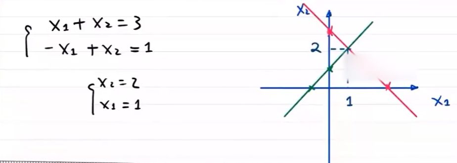
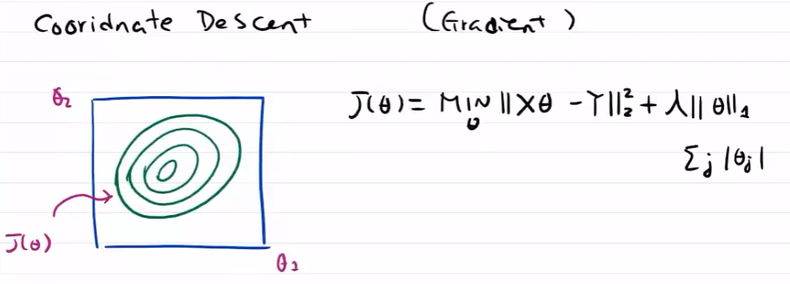
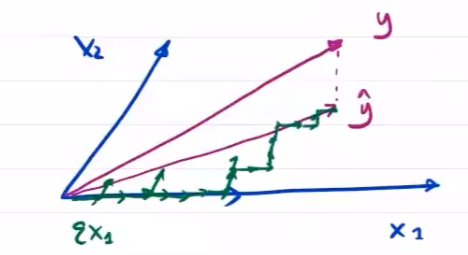

---
categories:
  - AI
  - 机器学习
tags:
  - AI
  - 机器学习
top: 10
mathjax: true
title: 3. 线性回归模型
abbrlink: 1027589108
date: 2023-08-21 20:00:32
---

> 线性模型既能体现出重要的基本思想，又能构造出功能更加强大的非线性模型

[TOC]

---

线性模型假设输出变量是若干输入变量的线性组合，并根据这一关系求解线性组合的最优系数

最小二乘法可用于解决单变量线性回归问题，当误差函数服从正态分布时，与最大似然估计等价

多元回归问题也可以用最小二乘法求解，但极易出现过拟合线性

- 岭回归，引入二范数惩罚项
- LASSO回归，引入一范数项

<!--more-->

## 3.1 线性模型

### 3.1.1 数据

$$
D=\{(x_1,y_1),(x_2,y_2),\cdots,(x_N,y_N)\},其中，x_i\in R^n,y_i\in R，
$$

即训练数据集 $D$ 中有 $N$ 个数据，一个数据有 $n$ 个特征

### 3.1.2 目标/应用

- 线性回归——线性拟合
- 线性分类

#### 线性回归模型

##### 历史

1875年，从事遗传问题研究的英国统计学家弗朗西斯·高尔顿正在寻找子代与父代身高之间的关系。

他发现数据散点图大致呈直线状态（父代身高与子代身高呈正相关关系）

高尔顿将这种现象称为 **回归效应** ，即大自然将人类身高的分布约束在相对稳定并不产生两极分化的整体水平，并给出了历史上第一个线性回归的表达式：$y=0.516x+33.73$ 

##### 回归分析研究内容

相关性分析：分析变量之间是否具有相关性

回归分析：寻找存在相关关系的变量间的数学表达式

**回归分析步骤**

1. 确定回归方程中的自变量和因变量
2. 确定回归模型（建立方程）
3. 对回归方程进行检验
4. 利用回归方程进行预测

##### 回归模型分类

- 根据自变量数目，可以分类一元回归(一个特征决定结果)，多元回归（多个特征决定结果）
- 根据自变量与因变量之间的表现形式，分为线性与非线性

具体分为四个方向：`一元线性回归` 、`多元线性回归` 、`一元非线性回归` 、`多元线性回归` 

## 3.2 线性回归

> 线性回归假设输出变量是若干输入变量的线性组合，并根据这一关系求解线性组合中的最优系数

- 线性回归模型最易于拟合，其估计结果的统计特性也更容易确定
- 在机器学习中，回归问题隐含了输入变量与输出变量均可连续取指的前提，因而利用线性回归模型可以对任意输入给出输出的估计

### 3.2.1 线性回归模型

训练数据集：

$$
D=\{(x_1,y_1),\cdots,(x_i,y_i),\cdots,(x_n,y_n)\},i=1,2,\cdots,n
$$

假设有线性函数 $y_{\omega}(x)=\omega^Tx\rightarrow y$
$$
y_{\omega}(x_i)=\omega^T x_i\quad ,i=1,2,\cdots,n\\
\omega=\left(\begin{aligned}\omega_0\\\omega_1\\\vdots\\\omega_j\\\vdots\\\omega_m\end{aligned}\right)\in R^m,x_i= \left(\begin{aligned}1\\x_i^{(1)}\\\vdots\\x_i^{(j)}\\ \vdots\\x_i^{(m)}\end{aligned}\right)\in \mathcal{X}\in R^m\quad ,j=1,2,\cdots,m
$$
$x_i$ 表示第 $i$ 个样本，$x_i^{(j)}$ 表示第 $i$ 个样本的第 $j$ 个特征值，$\omega_j$ 理解为每个特征的相对权重 (weight)

- 线性回归的作用就是习得一组参数 $w_i,i=0,1,\cdots,n$ ，使预测输出可以表示为以这组参数为权重的实例属性的线性组合

$\omega_0$ 也可记作 $b$ ——bias 偏差

- 当实例只有一个属性时，输入和输出之间的关系就是二维平面上的一条直线
- 当实例有 $n$ 个属性时，输入和输出之间的关系就是 $n+1$ 维空间上的一个超平面，对应一个维度为 $n$ 的线性子空间

### 3.2.2 损失函数

$J(\omega)$ 为线性模型的损失函数，通过调整参数 $\omega$ ，使得 $J(\omega)$ 最小

$y_{\omega}(x_i)$ 与 $y_i$ 之间有差异，用 $y_{\omega}(x_i)-y_i$ 表示这种差异。模型在训练数据集上的整体误差为
$$
\sum\limits_{i=1}^n[y_{\omega}(x_i)-y_i]=\sum\limits_{i=1}^n[\hat{y}_i-y_i]=\hat{Y}-Y
$$
 一般用最小二乘法优化损失，便于计算，即
$$
J(\omega)=\frac{1}{2n}\sum\limits_{i=1}^n \left(y_{\omega}(x_i)-y_i\right)^2
$$
对于参数 $\omega$ 的不同取值，损失函数有大有小。可通过对损失函数 $J(\omega)$ 最优化，找到损失函数最小的参数值 $\omega$ 

#### 梯度下降法

最优化问题为 $\min\limits_{\omega}J(\omega)=\frac{1}{2n}\sum\limits_{i=1}^n \left(y_{\omega}(x_i)-y_i\right)^2$

**梯度控制方向**

- 方向对于梯度下降问题影响较大，步长只决定在梯度方向上移动的距离

  

  步长大，出现振荡

  

  步长小，收敛慢

##### 一元回归模型的梯度下降

$y_{\omega}=\omega_1x+\omega_0$

$$
\begin{cases}
\omega_0^{[t]}\leftarrow \omega_0^{[t-1]}-\alpha\frac{\partial J(\omega)}{\partial \omega_0}\\
\omega_1^{[t]}\leftarrow \omega_1^{[t-1]}-\alpha\frac{\partial J(\omega)}{\partial \omega_1}\\
\end{cases}
$$
代入线性回归模型损失函数
$$
\begin{aligned}
\frac{\partial J(\omega_1,\omega_0)}{\partial \omega_0}&=\frac{\partial{}}{\partial{\omega_0}}\left[\frac{1}{2n}\sum\limits_{i=1}^n \left(y_{\omega}(x_i)-y_i\right)^2\right]\\
&=\frac{1}{n}\sum\limits_{i=1}^n \left(y_{\omega}(x_i)-y_i\right)\\
\frac{\partial J(\omega_1,\omega_0)}{\partial \omega_1}&=\frac{\partial{}}{\partial{\omega_1}}\left[\frac{1}{2n}\sum\limits_{i=1}^n \left(y_{\omega}(x_i)-y_i\right)^2\right]\\
&=\frac{1}{n}\sum\limits_{i=1}^n \left(y_{\omega}(x_i)-y_i\right)x^{(1)}\\
\end{aligned}
$$

##### 多元回归模型梯度下降

一般化梯度下降算法
$$
y_{\omega}(x)=\omega^T x=\sum\limits_{j=1}^m\omega_j x^{(j)}
$$
 最优化损失函数有
$$
\omega_0^{[t]}\leftarrow \omega_0^{[t-1]}-\alpha \frac{\partial J(\omega)}{\partial\omega_0}=\omega_0^{[t-1]}-\alpha \frac{1}{n}\sum\limits_{i=1}^n \left(y_{\omega}(x_i)-y_i\right)\\
\omega_j^{[t]}\leftarrow\omega_j^{[t-1]}-\alpha \frac{\partial J(\omega)}{\partial\omega_j}=\omega_j^{[t-1]}-\alpha\frac{1}{n}\sum\limits_{i=1}^n \left(y_{\omega}(x_i)-y_i\right)x^{(j)}
$$

##### 不同特征尺度不同，需归一化

通过归一化，使各特征维度均匀
$$
x^{(j)}\leftarrow \frac{x^{(j)}}{max(x^{(j)})-min(x^{(j)})}
$$

$$
x^{(j)}\leftarrow \frac{x^{(j)}-\overline{x}}{max(x^{(j)})-min(x^{(j)})}
$$

##### 牛顿法求方程的解

$$
f'(x_0)=\frac{f(x_0)}{\Delta x}=\frac{f(x_0)}{x_0-x_1}\\
x_0-x_1=\frac{f(x_0)}{f'(x_0)}\\
x_1=x_0-\frac{f(x_0)}{f'(x_0)}\\
x_2=x_1-\frac{f(x_1)}{f'(x_1)}\\
\vdots\\
x_t=x_{t-1}-\frac{f(x_{t-1})}{f'(x_{t-1})}
$$

##### 局限性

适用于严格凸函数

可能存在局部最优情况

- 尽量不构造有局部最优的损失函数
- 多采样，给定不同随机值，找到最好的最优点
- 自适应调整步长，跳出局部最优

#### 最小二乘法

##### 直线距离与垂直距离关系

垂直距离 $p$ 与竖直距离 $v$ ，在斜率为 $tan\alpha=k$ 前提下，$p=vcos\alpha$ 

即最小二乘法精确的垂直距离可以用竖直距离代替，即函数值相减

##### 一元回归模型LMS

对于一元回归模型 $y_{\omega}(x)=\omega_1x_1+\omega_0$ 

最小二乘法损失函数 $L(\omega_1,\omega_0)=\frac{1}{2n}\sum\limits_{i=1}^n\Vert \omega_1x_i^{(1)}+\omega_0-y_i\Vert^2_2$

由最优化理论，令 $\frac{\partial L}{\partial \omega_0}=0,\frac{\partial L}{\partial \omega_1}=0$
$$
\begin{aligned}
\frac{\partial L}{\partial \omega_0}&=\frac{1}{n}\sum\limits_{i=1}^n(\omega_1x_i^{(1)}+\omega_0-y_i)=0\\
&\Rightarrow \sum\limits_{i=1}^n\omega_0=\sum\limits_{i=1}^n(y_i-\omega_1x_i^{(1)})\\
&\Rightarrow \omega_0=\frac{1}{n}\sum\limits_{i=1}^{n}(y_i-\omega_1x_i^{(1)})
\end{aligned}
$$

$$
\begin{aligned}
\frac{\partial L}{\partial \omega_1}&=\frac{1}{n}\sum\limits_{i=1}^n(\omega_1x_i^{(1)}+\omega_0-y_i)x_i^{(1)}=0\\
&\Rightarrow\omega_1\sum\limits_{i=1}^n[x_i^{(1)}]^2+\omega_0\sum\limits_{i=1}^nx_i^{(1)}-\sum\limits_{i=1}^ny_ix_i^{(1)}=0\\
&\Rightarrow \omega_1\sum\limits_{i=1}^n[x_i^{(1)}]^2+\frac{1}{n}\sum\limits_{i=1}^{n}(y_i-\omega_1x_i^{(1)})\sum\limits_{i=1}^nx_i^{(1)}-\sum\limits_{i=1}^ny_ix_i^{(1)}=0\\
&\Rightarrow \omega_1\left\{\sum\limits_{i=1}^nx_i^2-\frac{1}{n}\left(\sum\limits_{i=1}^nx_i\right)^2\right\}=\sum\limits_{i=1}^ny_i(x_i-\frac{1}{n}\sum\limits_{i=1}^nx_i)\\
&\Rightarrow\omega_1=\frac{\sum\limits_{i=1}^ny_i(x_i-\frac{1}{n}\sum\limits_{i=1}^nx_i)}{\sum\limits_{i=1}^nx_i^2-\frac{1}{n}\left(\sum\limits_{i=1}^nx_i\right)^2}
\end{aligned}
$$

##### 多元回归模型LMS

**损失函数构造** 

$n$ 个数据表示为
$$
\begin{cases}
\omega_0+\omega_1 x_1^{(1)}+\cdots+\omega_n x_1^{(m)}=y_{\omega}(x_1)\\
\omega_0+\omega_1 x_2^{(1)}+\cdots+\omega_n x_2^{(m)}=y_{\omega}(x_2)\\
\vdots\\
\omega_0+\omega_n x_1^{(1)}+\cdots+\omega_n x_n^{(m)}=y_{\omega}(x_n)\\
\end{cases}
$$
表示为矩阵形式为
$$
\left[
\begin{matrix}
1&x_1^{(1)}&x_1^{(2)}&\cdots&x_1^{(m)}\\
1&x_2^{(1)}&x_2^{(2)}&\cdots&x_2^{(m)}\\
\vdots&\vdots&\vdots&\ddots&\vdots\\
1&x_n^{(1)}&x_n^{(2)}&\cdots&x_n^{(m)}\\
\end{matrix}
\right]\left(
\begin{matrix}
\omega_0\\
\omega_1\\
\omega_2\\
\vdots\\
\omega_m
\end{matrix}
\right)=\left(
\begin{matrix}
y_{\omega}(x_1)\\
y_{\omega}(x_2)\\
\vdots\\
y_{\omega}(x_n)\\
\end{matrix}
\right)\Rightarrow X\omega  = \hat{Y}
$$
优化问题变为 $S=\Vert X\omega-Y\Vert_2^2$ ，即求 $S$ 的最小化 $\hat{\omega}=arg\min\limits_{\omega}\Vert X\omega-Y\Vert_2^2$

**LMS最优化**
$$
\begin{aligned}
\Vert X\omega-Y\Vert_2^2&=(X\omega-Y)^T(X\omega-Y)=(\omega^TX^T-Y^T)(X\omega-Y)\\
&=\omega^TX^TX\omega-\omega^TX^TY-Y^TX\omega+Y^TY\\
&\xlongequal{(\omega^TX^TY)_{1\times m\times m\times n\times n\times 1}为标量}\omega^TX^TX\omega-2\omega^TX^TY+Y^TY
\end{aligned}
$$

令 $\frac{\partial S}{\partial \omega}=0$ ，有
$$
\frac{\partial (\omega^TX^TX\omega-2\omega^TX^TY+Y^TY)}{\partial \omega}=\frac{\partial(\omega^TX^TX\omega)}{\partial \omega}-2X^TY
$$
引理：$\frac{d(u^Tv)}{dx}$ 
$$
\frac{d(u^Tv)}{dx}=\frac{du^T}{dx}v+\frac{dv^T}{dx}u\\
\frac{d(x^TBx)}{dx}=\frac{dx^T}{dx}Bx+\frac{d(x^TB^T)}{dx}x=Bx+B^Tx=(B+B^T)x\\
\therefore \frac{\partial(\omega^TX^TX\omega)}{\partial \omega}=(X^TX+X^TX)\omega=2X^TX\omega
$$
对于最优化问题
$$
\frac{\partial S}{\partial \omega}=2X^TX\omega-2X^TY=0\Rightarrow X^TX\omega=X^TY\\
\hat{\omega}=(X^TX)^{-1}X^TY
$$

##### LMS局限性——不可逆

由于 $X\in R^{n\times m}$ ，$X^TX\in R^{m\times m}$ ，

若 $m>n$ ，根据秩的关系 $r(X^TX)\le r(X)\le n<m$ ，即 $X^TX$ 是不满秩阵，即不可求逆

- 特征之间存在共线性，要完全区分 $n$ 个数据最多只需要 $n$ 个特征维度

**解决方法**

- 随机梯度为0

  不用LMS

- 降维，使得 $m\le n$ 

- 正则化项——岭回归

  约束具有共线性的维度，使其权重不要太大

#### GD与LMS对比

LMS计算量来源于计算求逆的计算量

梯度下降存在局部收敛问题，收敛速度满，步长的选取

最优实践，普通线性模型，数据量不超过百万级，可以不用梯度下降

#### 多角度理解LMS

##### 几何角度

##### 线性组合

##### 矩阵角度

对于数据集 $D=\{(0,2),(1,2),(2,3)\}$ 

线性回归模型为
$$
(0,2)\rightarrow X\cdot 0+b=2\\
(1,2)\rightarrow X\cdot 1+b=2\\
(2,3)\rightarrow X\cdot 2+b=3
$$
即有 
$$
\left[
\begin{matrix}
0&1\\1&1\\2&1
\end{matrix}
\right]\left[\begin{matrix}a\\b\end{matrix}\right]=\left[\begin{matrix}2\\2\\3\end{matrix}\right]\\\\
[\alpha_1,\alpha_2]\omega=\hat{y}\\\\

\begin{cases}
\hat{y}=X\omega\\
e=y-\hat{y}=y-X\omega
\end{cases}
$$

由几何可知 
$$
\begin{cases}
e\cdot\alpha_1=0\\
e\cdot\alpha_2=0
\end{cases}\Rightarrow \begin{cases}
\alpha_1^T\cdot e=0\\
\alpha_2^T\cdot e=0
\end{cases}\Rightarrow X^Te=0
$$
故有
$$
X^T(y-\hat{y})=X^T(y-X\omega)=X^Ty-X^TX\omega=0\\
\omega=(X^TX)^{-1}X^Ty
$$

##### 概率角度

从 **概率论** 的角度解释，线性回归得到的是统计意义上的拟合结果，在单变量的情形下，可能一个样本点都没有落在求得的直线上

对上述现象的解释是：回归结果可以完美匹配理想样本点的分布，但训练中使用的真实样本点是理想样本点和噪声叠加的结果，因而与回归模型之间产生了偏差，每个样本点上噪声的取值等于 $y_i=\omega^Tx_i+\varepsilon_i$ 

设 $\varepsilon_i=y_i-\omega^Tx_i$ 服从 $(0,\sigma^2)$ 的正态分布，即
$$
p(\varepsilon_i)=\frac{1}{\sqrt{2\pi}\sigma}e^{-\frac{\varepsilon_i^2}{2\sigma^2}}
$$

这意味着噪声等于0的概率密度最大。

在这种情况下，对参数 $w$ 的推导就可以用 **最大似然估计** 进行，即在已知样本数据及其分布的条件下，找到使样本数据以最大概率出现的参数假设 $w$ ，$y_i\sim N(f(x_i;\omega),\sigma^2)$ 
$$
p(y_i\vert x_i,\omega)=\frac{1}{\sqrt{2\pi}\sigma}e^{-\frac{(y_i-\omega^Tx_i)^2}{2\sigma^2}}
$$
在假设每个样本独立同分布的前提下，似然概率写作
$$
L(\omega)=L(\omega\vert X,Y)=P(x_1,x_2,\cdots,x_n\vert w)=\prod\limits_{i}^n\frac{1}{\sqrt{2\pi}\sigma}e^{-\frac{(y_i-w^Tx_i)^2}{2\sigma^2}}
$$
最大似然估计的任务就是让上述表达式的取值最大化。为便于计算，对似然概率取对数

$$
lnL(\omega)=\ln P(x_1,x_2,\cdots,x_n\vert w)=-\sum\limits_{i}^n\left[\ln \sqrt{2\pi}\sigma+\frac{(y_i-w^Tx_i)^2}{2\sigma^2}\right]
$$
令 $\frac{\partial lnL(\omega)}{\partial \omega}=0$ ，有
$$
\frac{\partial}{\partial\omega}\sum\limits_{i=1}^n(y_i-w^Tx_i)^2=0
$$
即似然概率的最大化等效为 $\sum\limits_{k=1}^n(w^Tx_k-y_k)^2$ 的最小化

得到解为
$$
\omega=(X^TX)^{-1}Xy
$$

##### 贝叶斯视角

将参数 $\omega$ 看做随机变量

目标：给定一组观测数据，求参数 $\omega$ 的最大后验分布 $p(\omega\vert X)$

采用贝叶斯估计的线性回归称为贝叶斯线性回归
$$
\begin{aligned}
p(\omega\vert x,y;\nu,\sigma)&=\frac{p(\omega,y\vert x;\nu,\sigma)}{\sum_{\omega}p(\omega,y\vert x;\nu,\sigma)}\\
&\propto p(y\vert x,\omega;\sigma)p(\omega;\nu)\\
后验概率&=似然概率\cdot 先验概率\mathcal{N}(\omega;0,\nu^2I)\\
\log p(\omega\vert x,y;\nu,\sigma)&\propto \log p(y\vert x,\omega;\sigma)+\log p(\omega;\nu)\\
&\propto -\frac{1}{2\sigma^2}\sum\limits_{i}^n(y_i-w^Tx_i)^2-\frac{1}{2\nu^2}\omega^T\omega\\
&=-\frac{1}{2\sigma^2}\Vert y-\omega^T\cdot x\Vert^2-\frac{1}{2\nu^2}\omega^T\omega\\
正则化系数\lambda&=\frac{\sigma^2}{\nu^2}\\
R_{srm}&\propto -\sigma^2\log p(\omega\vert x,y;\nu,\sigma)\\
&=\frac{1}{2}\Vert y-\omega^T\cdot x\Vert^2+\frac{\lambda}{2}\Vert \omega\Vert_2^2
\end{aligned}
$$
即由求解贝叶斯估计的最大后验概率变为最小二乘的求解

---

引入先验

- 结构风险最小化：引入正则项
- 最大后验估计：引入关于 $p(\omega)$ 的先验分布

### 3.2.3 过拟合问题

在大量复杂的实际任务中，每个样本属性的数目甚至会超过训练集中的样本总数，此时求出的 $\hat{\omega}$ 不是唯一的，解的选择依赖于学习算法的归纳偏好

但无论怎样选择标准，存在多个最优解的问题不会改变，极易出现过拟合现象——**正则化解决过拟合问题**

即添加额外的惩罚项。根据使用的惩罚项不同，分为

- 岭回归
- LASSO回归

其共同思想：通过惩罚项的引入抑制过拟合现象，以训练误差增加为代价换取测试误差下降

#### 岭回归——数据集阵不可逆情况

也称 **参数衰减**  

岭回归实现正则化的方式是在原始均方误差的基础上，加一个待求解参数的二范数项，即最小化求解的对象变为
$$
\Vert y_i-w^Tx_i\Vert^2+\Vert \Gamma w\Vert^2，\Gamma为季霍诺夫矩阵
$$

- 季霍诺夫矩阵主要目的是解决矩阵求逆的稳定性问题

有优化问题
$$
\begin{aligned}
L(\omega)&=J(\omega)+\lambda\Vert\omega\Vert^2_2\\
&=\frac{1}{2n}\left[\sum\limits_{i=1}^n(\omega^{(0)}+\omega^{(1)}x_i^{(1)}+\cdots+\omega^{(m)}x_i^{(m)}-y_i)^2+\lambda\sum\limits_{j=1}^m\omega^{(j)2}\right]\\
\Rightarrow &
\omega^{(j)[t]}\leftarrow\omega^{(j)[t-1]}-\alpha \frac{\partial L(\omega)}{\partial\omega_j}=\omega^{(j)[t-1]}-\alpha\frac{1}{n}\left[\sum\limits_{i=1}^n \left(y_{\omega}(x_i)-y_i\right)x^{(j)}+\lambda\omega^{(j)[t-1]}\right]\\
\Rightarrow &\omega^{(j)[t]}\leftarrow\left(1-\frac{\alpha\lambda}{n}\right)\omega^{(j)[t-1]}-\alpha\frac{1}{n}\sum\limits_{i=1}^n \left(y_{\omega}(x_i)-y_i\right)x^{(j)}\\
\end{aligned}
$$

即形式上，对于 $X^TX$ 不可逆的情况，可以加正则项
$$
\hat{\omega}=(X^TX+\lambda I')^{-1}X^Ty
$$
其中 
$$
I'=\left(
\begin{matrix}
0&&&\\
&1&&\\
&&\ddots&\\
&&&1
\end{matrix}
\right)=\left(
\begin{matrix}
0&0\\
0&I
\end{matrix}
\right)_{(n+1)\times(n+1)}
$$

#### LASSO回归

最小绝对缩减和选择算子(Least Absolute Shrinking and Selecting Operator)

通过将权重设为0，去除冗余特征，但由于 $\min L_0$ 是一个离散函数，不好优化，选择 $L_1$ 代替 $L_0$ 作为惩罚项，即最小化求解的对象变为 
$$
\Vert y_k-w^Tx_k\Vert^2+\lambda \Vert w\Vert_1
$$

即损失函数变为
$$
\begin{aligned}
J(\omega)&=\frac{1}{2}\Vert X\omega-Y\Vert_2^2+\lambda\Vert\omega\Vert_1\\
&=\frac{1}{2}\Vert X\omega-Y\Vert_2^2+\lambda\sum\limits_{j=1}^m\vert \omega^{(j)}\vert
\end{aligned}
$$
注：

- 求解篇 $\theta_i^{(j)}$ 表示第 $j$ 个样本的第 $i$ 个特征维度

##### 坐标轴下降

需要对每个维度都要进行搜索

##### 前向选择

线性组合

**具体计算：**

在一个特征方向上确定最优值，再确定其他方向

向右，损失函数减小；再向右，损失函数增大，则拐点为一个方向上最优值

##### 前向梯度

多个特征方向同时调整

每一步考虑所有方向上的最优解

每一步都计算相应的损失函数

##### 最小角回归LARS

##### 岭回归与LASSO回归概率角度

**从最优化角度**

岭回归：二范数惩罚项的作用在于优先选择范数较小的 $w$ 。相当于在最小均方误差之外额外添加了一重约束条件，将最优解限制在高维空间内的一个球内

- 在最小二乘的结果上做了缩放，虽然最优解中参数的贡献被削弱了，但参数的数目没有变少

LASSO回归：引入稀疏性，降低了最优解 $w$ 维度，使一部分参数的贡献度 $w_i=0$ ，使得 $w$ 中元素数目大大小于原始特征的数目

- 引入稀疏性是简化复杂问题的一种常用方法，在数据压缩，信号处理等领域亦有应用

**从概率角度看**

岭回归是在 $w_i$ 满足正态先验分布的条件下，用最大后验概率进行估计得到的结果

LASSO回归是在 $w_i$ 满足拉普拉斯先验分布的条件下，用最大后验概率进行估计得到的结果

### 3.2.4 回归方程衡量标准

#### 回归方程的拟合优度

> 回归直线与各观测点的近似程度称为回归直线对数据的拟合优度

总平方和 `SST` ：反映因变量的 $n$ 个观察值与均值的总偏差
$$
\sum\limits_{i=1}^n(y_i-\overline{y})^2
$$
回归平方和 `SSR` ：由于 $x$ 与 $y$ 的线性关系引起的 $y$ 的变化部分（回归直线可解释部分造成的误差）
$$
\sum\limits_{i=1}^n(\hat{y}_i-\overline{y})^2
$$
残差平方和 `SSE` ：由于 $x$ 与 $y$ 的线性关系外的关系引起的 $y$ 的变化部分（回归直线不可解释部分造成的误差）
$$
\sum\limits_{i=1}^n(y_i-\hat{y}_i)^2
$$
总平方和可以分解为回归平方和、残差平方和 $SST=SSR+SSE$
$$
\sum\limits_{i=1}^n(y_i-\overline y)^2=\sum\limits_{i=1}^n(\hat{y}-\overline{y})^2+\sum\limits_{i=1}^n(y-\hat{y})^2
$$

#### 判定系数

$$
R^2=\frac{SSR}{SST}=\frac{回归平方}{总平方和}=\frac{\sum\limits_{i=1}^n(\hat{y}_i-\overline{y})^2}{\sum\limits_{i=1}^n(y_i-\overline{y})^2}=1-\frac{\sum\limits_{i=1}^n(y_i-\hat{y})^2}{\sum\limits_{i=1}^n(y_i-\overline{y})^2}
$$

理想情况 $R^2=1$ ，残差平方和为 $0$（即整体误差完全由线性误差引起）回归方程完全可解释 $x$ 与 $y$ 的关系

- $R^2$ 越大，回归方程可解释能力越强
- $R^2$ 越小，回归方程可解释能力越弱

### 3.2.5 显著性检验

由于回归方程是根据样本数据得到的，是否真实反映了变量 $X$ 和 $Y$ 之间的关系，需要通过检验后才可以确定

显著性检验包括两方面：

- 线性关系检验
- 回归系数检验

#### 线性关系检验

> 检验 $X$ 和 $Y$ 的线性关系是否显著，是否可用线性模型表示

将均方回归( `MSR` )和均方残差( `MSE` )进行比较，应用 $F$ 检验来分析二者之间的差别是否显著

- 均方回归：回归平方和 `SSR` 除以相应的自由度（参数个数 m）
- 均方残差：残差平方和 `SSE` 除以自由度（$n-m-1$）

$\frac{线性误差}{非线性误差}$ 

若 $\omega=0$ ，即所有回归系数与0无显著差异，则 $y$ 与全体 $x$ 的线性关系不显著

计算检验统计量
$$
\\F=\frac{SSR/m}{SSE/n-m-1}=\frac{\sum\limits_{i=1}^n(\hat{y}_i-\overline{y})^2/m}{\sum\limits_{i=1}^n(y-\hat{y})^2/n-m-1}=\frac{MSR}{MSE}\sim F(m,n-m-1)
$$

#### 回归系数检验

检验每个回归系数 $\omega$ 与 $0$ 是否有显著性差异，来判断 $Y$ 与 $X$ 之间是否有显著的线性关系

- 若 $\omega \approx0$ 则总体回归方程中不含 $X$ 项，因此，变量 $Y$ 与 $X$ 之间不存在线性关系 

- 若 $\omega \neq 0$ ，则变量 $Y$ 与 $X$ 有显著的线性关系

如：

$\hat{\omega}_1$ 是根据最小二乘法求出的样本统计量，服从正态分布，有 $E(\hat{\omega}_1)=\omega_1$ ，标准差 $\sigma_{\omega_1}=\frac{\sigma}{\sqrt{\sum x_i^2-\frac{1}{n}(\sum x_i)^2}}$  

由于 $\sigma$ 未知，需要用其估计量 标准差$S_e$ 来代替得到 $\hat{\omega}_1$ 的估计标准差
$$
S_{\hat{\omega}_1}=\frac{S_e}{\sqrt{\sum x_i^2-\frac{1}{n}(\sum x_i)^2}}\\
S_e=\sqrt\frac{\sum(y_i-\hat{y}_i)^2}{n-K-1}=\sqrt{MSE}
$$
计算检验的统计量：$t=\frac{\hat{\omega}_1-\omega}{S_{\hat{\omega}_1}}\sim t(n-2)$  

#### 线性关系检验与回归系数检验区别：

线性关系检验的是自变量与因变量是否可以用线性关系表示；回归系数的检验是判断通过样本计算得出的回归系数是否为0

- 在一元线性回归中，自变量只有一个，线性关系检验与回归系数检验是等价的

  线性关系检验 $F=\frac{SSR/1}{SSE/n-1-1}=\frac{MSR}{MSE}\sim F(1,n-2)=t(n-2)$  

  回归系数检验 $t=\frac{\hat{\omega}_1-\omega_1}{S_{\hat{\omega}_1}}\sim t(n-2)$  

- 多元回归分析中，线性关系检验只能用来检验总体回归关系的显著性。回归系数检验可以对各个回归系数分别进行检验

### 3.2.6 利用回归直线进行估计和预测

点估计：利用估计的回归方程，对 $x$ 的一个特定值，求解 $\hat{y}_i$ 的一个估计值

区间估计：利用估计的回归方程，对于 $x$ 的一个特定量，求出 $y$ 的一个估计量的区间

#### 预测结果的置信度

##### 标准差

度量观测值围绕着回归直线的变化程度(点估计)
$$
S_e=\sqrt\frac{\sum\limits_{i=1}^n(y_i-\hat{y}_i)^2}{n-2}
$$

- 自由度为 $n-2$ 
- 标准差越大，则分散程度越大，回归方程的可靠性越小

#### 置信区间估计

> 预测结果具有可靠性的范围

$$
\hat{y}_0\pm t_{\frac{\alpha}{2}}s_e\sqrt{\frac{1}{n}+\frac{(x_{i+1}-\overline{x})^2}{\sum\limits_{i=1}^n(x_i-\overline{x})^2}}
$$

  在 $1-\alpha$ 置信水平下预测区间为
$$
\hat{y}_0\pm t_{\frac{\alpha}{2}}s_e\sqrt{1+\frac{1}{n}+\frac{(x_{i+1}-\overline{x})^2}{\sum\limits_{i=1}^n{(x_i-\overline{x})^2}}}
$$
**eg** 

广告费与销售额的关系如图，若2003年广告费120万元，用一元线性回归求 2003年产品销售额的置信区间与预测区间（$\alpha=0.05$）

$$
\begin{aligned}
&\omega_1=\frac{\sum\limits_{i=1}^ny_i(x_i-\frac{1}{n}\sum\limits_{i=1}^nx_i)}{\sum\limits_{i=1}^nx_i^2-\frac{1}{n}\left(\sum\limits_{i=1}^nx_i\right)^2}=\frac{9\sum_{i=1}\limits^9x_iy_i-\sum_{i=1}\limits^9x_i\sum_{i=1}\limits^9y_i}{9\sum_{i=1}\limits^9x_i^2-(\sum_{i=1}\limits^9x_i)^2}=0.57\\
&\hat{\omega}_0=\overline{y}-\hat{\omega}_1\overline{x}=-3.65\\
&故有一元线性回归方程 \hat{y}=\hat{\omega}_0+\hat{\omega}_1x=-3.65+0.57x\\
&\hat{y}_{10}=-3.65+0.57\times 120=64.75\\
&t_\frac{\alpha}{2}(n-2)=t_{0.025}(7)=2.365,S_e=\sqrt\frac{\sum_{i=1}\limits^9(y_i-\hat{y_i})^2}{n-2}=2.43\\
&\hat{y_0}\pm t_{\frac{\alpha}{2}}s_e\sqrt{\frac{1}{n}+\frac{(x_{10}-\overline{x})^2}{\sum_{i=1}\limits^{9}(x_i-\overline{x})^2}}=64.75\pm2.365\times 2.43\times 0.743=64.75\pm4.2699\\
&\hat{y_0}\pm t_{1+\frac{\alpha}{2}}s_e\sqrt{\frac{1}{n}+\frac{(x_{10}-\overline{x})^2}{\sum_{i=1}\limits^{9}(x_i-\overline{x})^2}}=64.75\pm2.365\times 2.43\times 1.2459=64.75\pm4.3516
\end{aligned}
$$

---

##### 置信区间宽度影响因素

- 区间宽度随置信水平 $1-\alpha$ 的增大而增大
- 区间宽度随离散程度 $S_e$ 的增大而增大
- 区间宽度随样本容量的增大而减小
- 预测值与均值的差异越大，区间宽度越大

### 3.2.7 多元线性回归问题

调整的多重判定系数：
$$
R^2=1-(1-R^2)\times\frac{n-1}{n-m-1}
$$
 $m$ 为系数个数，$n$ 为样本容量

- 表示消除自变量数量增加的影响

#### 曲线回归分析过程

1. 根据散点图确定曲线类型
2. 先将 $x$ 或 $y$ 进行变量转换
3. 对新变量进行直线回归分析，建立直线回归方程并进行显著性检验和置信区间估计
4. 将新变量还原为原变量，由新变量的直线回归方程和置信区间得出原变量的曲线回归方程和置信区间

**eg**

散点图：

故可设 $\hat{y}=a+b\frac{1}{x}$ ，令 $\frac{1}{x}=x'\Rightarrow \hat{y}=a+bx'$

标准方程为
$$
\left\{\begin{aligned}&\sum\limits_{i=1}^n y_i = na+b\sum\limits_{i=1}^n x'\\&\sum\limits_{i=1}^n x'y=a\sum\limits_{i=1}^n x'+b\sum\limits_{i=1}^n(x')^2\end{aligned}\right.
$$
将数据代入的 $\left\{\begin{aligned}&X=-0.4377\\&b=60.4\end{aligned}\right.$

有 $\hat{y}=-0.4377+60.4x'=-0.4377+60.4\frac{1}{x}$

#### 多重共线性

> 回归模型中两个或多个自变量彼此相关

引起的问题：

- 回归系数估计值不稳定性增强
- 回归系数假设检验的结果不显著

多重共线性检验方法：

- 容忍度
- 方差膨胀因子

**容忍度**
$$
Tol_i=1-R_i^2
$$

- $R_i$ 解释变量 $x_i$ 与方程中其他解释变量间的复相关系数
- 容忍度在 $0\sim 1$ 之间，越接近0，表示多重共线性越强 

**方差膨胀因子**
$$
VIF_i=\frac{1}{1-R_i^2}=\frac{1}{Tol_i}
$$

- $VIF_i$ 越大，解释变量 $x_i$ 与方程中其他解释变量之间有严重的共线性

## 3.3 非线性回归

$$
y_{\omega}(x)=\omega^T\phi(x)\rightarrow y
$$
$\phi(\cdot)$ 为基函数，非线性函数，相当于将 $x$ 做一个非线性变换

- 一般情况下，基函数选择多项式函数，即
  $$
  f(x;\omega)=\omega_0+\omega_1x+\omega_2x^2+\cdots+\omega_Mx^M
  $$

非线性模型与线性模型唯一区别的地方就是基函数

经验风险最小化
$$
R_{emp}=\frac{1}{2}\sum\limits_{n=1}^N\left(y_n-\omega^T\phi(x_n)\right)^2
$$

### 3.3.1 多项式次数的选择——超参数M

随着 $M$ 的增大，其多项式系数也变大，$x$ 有轻微扰动，结果就会有很大波动

- 对大的系数进行惩罚

$$
R_{srm}=\frac{1}{2}\sum\limits_{n=1}^N\left(y_n-\omega^T\phi(x_n)\right)^2+\frac{\lambda}{2}\omega^T\omega
$$

