---
categories:
  - AI
tags:
  - AI
top: 16
mathjax: true
title: 0.深度学习与神经网络
abbrlink: 175051564
date: 2023-09-15 17:00:51
undated: 2023-10-5 00:54:28
---

> nndl绪论

<!--more-->

## 0.1 如何开发一个AI系统

专家知识（人工规则）

- 规则：通过机器学习，让计算机自动总结规则

机器学习 $\approx$ 构建一个映射函数(规则)

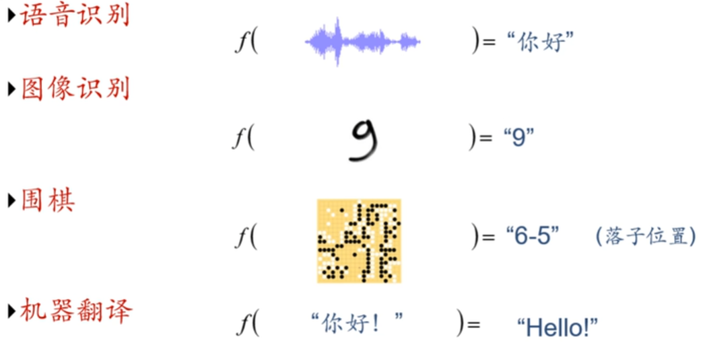

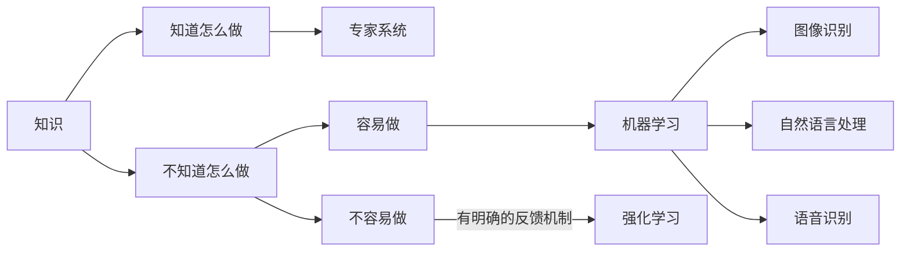

## 0.2 表示学习(特征处理)

> 样本特征 $\iff$ 表示

机器学习流程：

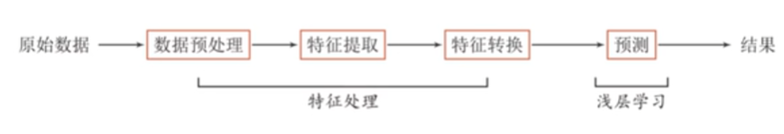

- 特征工程(feature engineering)——人工处理

  数据预处理：对于数据缺失多的特征，弃用

  特征提取：提取有效特征，隐含特征也需提取

  特征转换：某些冗余特征及有相关性特征，弃用或组合，形成更有效特征

- **浅层学习**：不涉及特征学习，其特征主要靠人工经验或特征转换的方法抽取

### 0.2.1 传统特征学习

#### 特征选择

> **特征选择** 是选取原始特征集合的一个有效子集，使得基于这个特征子集训练出来的模型准确率最高

- 保留有用特征，移除冗余或无关的特征

**子集搜索**：假设原始特征数为 $D$ ，则共有 $2^D$ 个候选子集。特征选择的目标就是选择一个最优的候选子集

常用贪心搜索策略：由空集合开始，每一轮添加该轮最优的特征，称为**前向搜索**（Forward Search）；或者从原始特征集合
开始，每次删除最无用的特征，称为**反向搜索**（Backward Search）．

##### 过滤式

> 不依赖具体机器学习模型的特征选择方法

每次增加最有信息量的特征，或删除最没有信息量的特征

特征的信息量可以通过**信息增益**（Information Gain）来衡量，即引入特征后条件分布 $p_\theta(y\vert x)$ 的不确定性(熵)的减少程度

##### 包裹式

> 使用后续机器学习模型的准确率作为评价来选择一个特征子集的方法

每次增加对后续机器学习模型最有用的特征，或删除对后续机器学习任务最无用的特征．

##### $L_1$ 正则化

$L_1$ 正则化会导致稀疏特征，间接实现了特征选择

#### 特征抽取

> 构造一个新的特征空间，并将原始特征投影在新的空间中得到新的表示

##### 监督的特征学习

> 抽取对一个特定的预测任务最有用的特征

- 线性判别分析

##### 无监督的特征学习

> 和具体任务无关，其目标通常是减少冗余信息和噪声

- 主成分分析PCA
- 自编码器

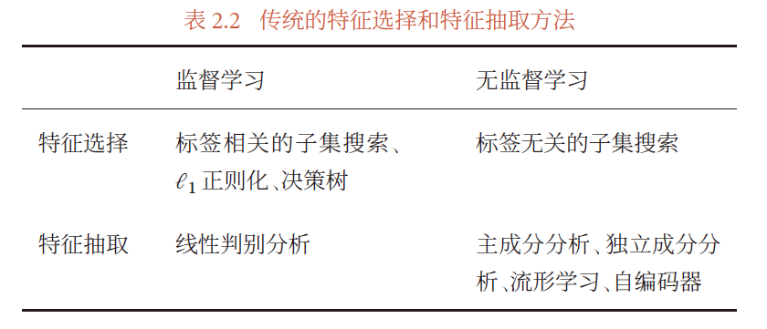

#### 特征工程作用

用较少的特征表示原始特征中的大部分信息，去掉噪声信息，并进而提高计算效率和减小维度灾难

- 尤其是对于没有正则化的模型

### 0.2.2 语义鸿沟

**底层特征** 与 **高层语义**

> 人们对文本、图像的理解（高层语义）无法从字符串或者图像的底层特征（底层特征）直接获得

**好的表示**

- 应该具有很强的表示能力——同样的一个空间应该可表示更多的语义
- 应该使后续的学习任务变得简单
- 应该具有一般性，是任务或领域独立的

### 0.2.3 表示方式

**数据表示是机器学习的核心问题**

局部表示

> 一个语义由一个量表示

- 离散表示

  One-Hot向量

- 符号表示

分布式表示

> 一个语义由多个量共同表示

- 压缩、低维、稠密向量

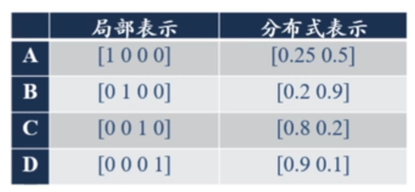

理解：

$k$ 个维度

- 局部表示：单个维度代表语义

  $k$ 个语义

- 分布式表示：所有维度加起来代表语义

  $2^k$ 个语义

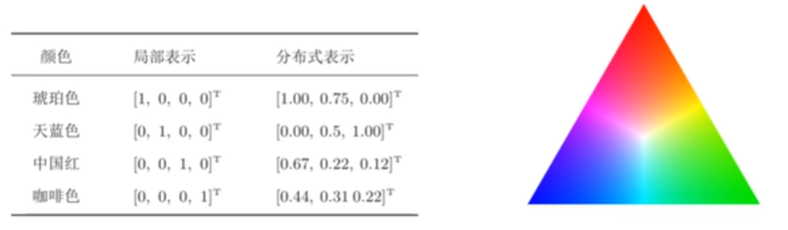

#### 关联

局部表示：配合知识库、规则使用

分布式表示：嵌入：压缩、低维、稠密

通常情况：将局部表示映射为分布式表示

- 低维

  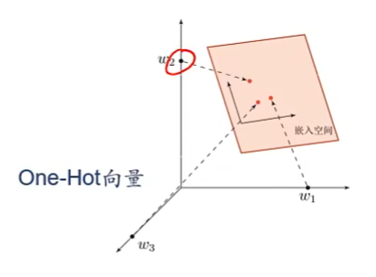

- 稠密

  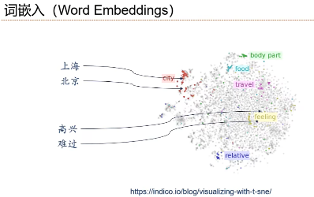

  相似语义靠的近，不同语义间隔大，便于后续量化

### 0.2.4 表示学习

通过构建模型，让其自动学习好的特征（底层特征、中层特征、高层特征），从而最终提升预测或识别的准确性

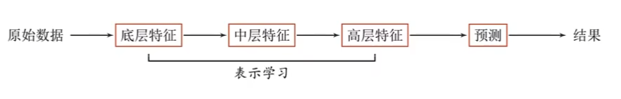

#### 对比

**传统特征提取**

- 线性投影（子空间）

  PCA、LDA

- 非线性嵌入

  LLE、Isomap、谱方法

- 自编码

区别：

- 特征提取：基于任务或 **先验** 去除无用特征

  自设标准，对任务影响是好是坏并不确定，实质上也是一种特征工程

- 表示学习：通过深度模型学习高层语义特征

  难点：没有明确目标

## 0.3 深度学习

### 0.3.1 表示学习与深度学习

**一个好的表示学习策略必须具备一定深度** ，指原始数据进行非线性特征转换的次数

- 特征重用

  指数级的表示能力，底层特征可以被高层特征重复利用

- 抽象表示与不变性

  抽象表示需要多步构造

  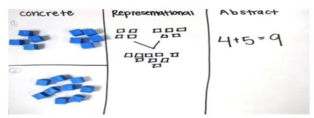

### 0.3.2 深度学习概念

$$
深度学习=表示学习+\underbrace{决策(预测)学习}_{浅层学习}
$$

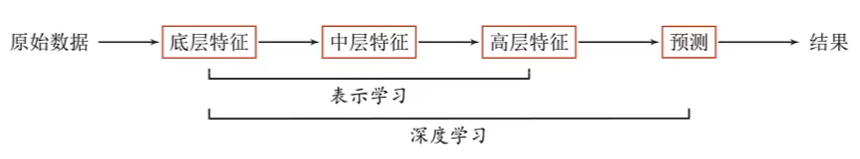

核心问题是：**贡献度分配问题** 

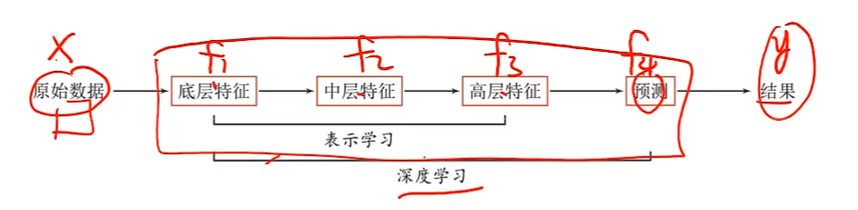

即一个系统中不同的组件（component）或其参数对最终系统输出结果的贡献或影响

- **强化学习** 可以通过反馈机制，获取当前步的决策对最终结果影响的概率大小，进而判断当前步的贡献度大小

对于一般的深度学习，解决贡献度分配问题用 **神经网络**

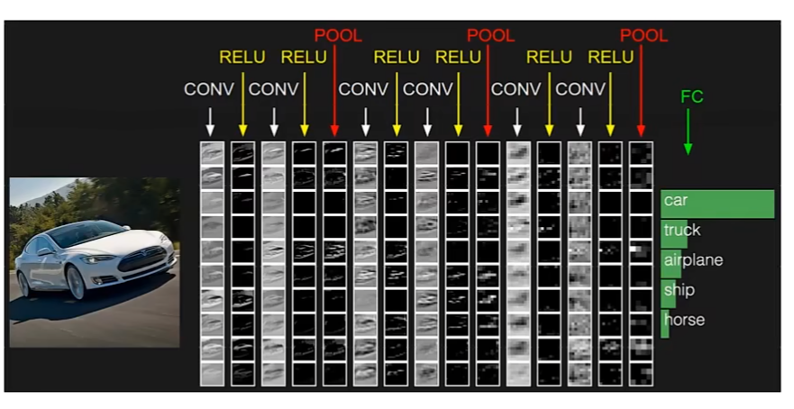

#### 端到端

整个学习过程中，没有人为干预

> 指在学习过程中不进行分模块或分阶段训练，直接优化任务的总体目标

**传统机器学习方法** 需要将一个任务的输入和输出之间人为地切割成很多子模块（或多个阶段），每个子模块分开学习

问题：

- 每一个模块都需要单独优化，并且其优化目标和任务总体目标并不能保证一致
- 错误传播，即前一步的错误会对后续的模型造成很大的影响．这样就增加了机器学习方法在实际应用中的难度．

### 0.3.3 深度学习数学表示

$$
\begin{array}{c|l}
y=f(x)&浅层学习\\
\Downarrow\\
y=f^2(f^1(x))\\
\Downarrow\\
\vdots\\
\Downarrow\\
y=f^{K}(f^{K-1}\cdots(f^1(x)))&深度学习\\
\end{array}
$$

$f(x)$ 为非线性函数，不一定连续

- 线性模型多层嵌套仍是线性，性能不会提升

当 $f^1(x)$ 连续时，如 $f^l(x)=\sigma(W^{(l)}f^{l-1}(x))$ ，这个复合函数称为神经网络

## 0.4 神经网络

### 0.4.1 人脑神经网络

左半球：对语言的处理和语法表示

- 阅读、写作、学习记忆

右半球：空间技巧

- 空间定位、音乐

#### 神经元机制

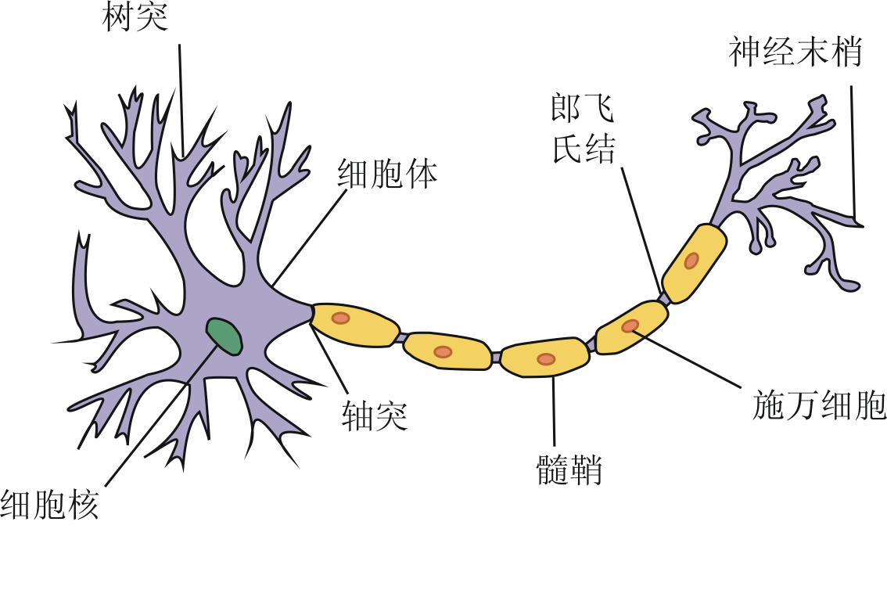

神经元：多个突触

- 数量确定，不会增加

- 神经元之间的联系会增加

- 负责传递，存储，加工信息，控制行为，情感

- 神经细胞在通过树突接收到的信号强度超过某个阈值时，就会进入激活状态，并通过轴突向上层神经细胞发送激活信号

  人类所有与意识和智能相关的活动，都是通过特定区域神经细胞间的相互激活协同工作而实现的

神经元之间传递信：电信号

- 通过化学信号传递，突触之间通过粒子传递引起微电压的变化，神经元会发生兴奋或抑制反应，从而实现了神经信号的传递

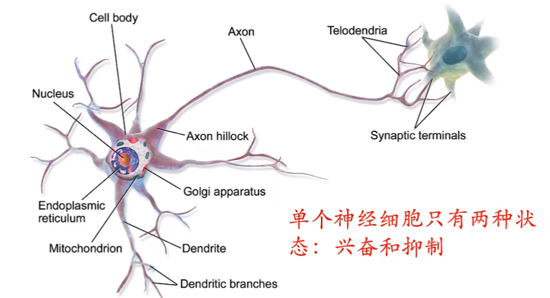

通过树突汇聚信息，当信息汇聚到一定强度达到阈值，神经细胞就会兴奋

##### 感觉神经元

感觉神经元仅对其敏感的事物属性作出反应，

- 输入：外部事物属性一般以光波、声波、电波等方式作为输入刺激人类的生物传感器
- 输出的感觉编码是一种可符号化的心理信息

**感觉属性检测是一类将数值信息转化为符号信息的定性操作**

感觉将事物属性转化为感觉编码，不仅能让大脑检测到相应属性，还在事物属性集与人脑感觉记忆集之间建立起对应关系，所以感觉属性检测又叫 **感觉定性映射** 。

神经网络对来自神经元的 **各种简单映像加以组合**，得到的就是关于 **整合属性的感觉映像**

- 苹果又红又圆：大脑整合了苹果的颜色属性和形状属性

在感觉映射下，**事物属性结构与其感觉映像结构之间应保持不变** ，感觉映像应该是树屋属性集与其感觉记忆集之间的一个同态映像。

- 通俗说法，人脑认知是外部世界的反映——认知可归结为一个 **高度抽象的加工模型**

##### 表征处理

**表征处理的物质基础是神经元，大量神经元群体的同步活动是实现表征和加工的生理学机制** 

**从信息科学的角度** ，整个加工过程可以理解为多次特征提取，提取出的特征从简单到复杂，甚至“概念”这种十分抽象的特征也可以被提取出来。

#### 神经网络

作为一个复杂的多级系统，大脑思维来源于功能的逐级整合。

- 神经元的功能被整合为神经网络的功能
- 神经网络的功能被整合为神经回路的功能
- 神经回路的功能最终被整合为大脑的思维功能

但在逐级整合的过程中，每一个层次上实现的都是 $1+1>2$ 的效果，在较高层次上产生了较低层次的每个子系统都不具备的 **突出功能** 

- 思维问题不能用还原论的方法来解决，即不能靠发现单个细胞的结构和物质分子来解决。**揭示出能把大量神经元组装成一个功能系统的设计原理，这才是NN的问题所在**

#### 人认知的其他影响因素

认知还和注意、情绪等系统有着极强的交互作用

### 0.4.2 神经网络与智能

人类智能的本质取决于 **什么是认知的基本单元** 

- 目前的理论和实验表明，分析的有效手段是设计科学实验加以验证

  结论：**认知基本单元是知觉组织形成的 “知觉物体”**

#### 智能的物质基础

从物质基础的角度看，**人类智能 **是建立在有机物基础上的 **碳基智能**，而 **人工智能** 是建立在无机物基础上的 **硅基智能**

- 归根到底，人工智能是一套软件，人工神经网络也属于硅基智能的范畴

**碳基智能与硅基智能的本质区别在于架构** ，**架构决定了数据的传输与处理是否能够同时进行**

- 硅基：**数据的传输与处理无法同步进行**

  基于冯·诺依曼结构体系的计算机核心特征是运算单元和存储单元是分离的，两者有数据总线连接。运算单元需要从数据总线接收来自存储单元的数据，运算完成后再将运算结果通过数据总线传回给存储单元

- 在大脑中，数据的传输和处理由突触和神经元之间的交互完成。且数据的传输和处理是同步进行的

  人的记忆过程也不仅仅是数据存储的过程，还伴随着去粗取精的提炼与整合。

**数据是为了在需要时能够快速提取而存储** ——存储的作用是为了提升数据处理的有效性

### 0.4.3 人工神经网络

#### 人工神经网络介绍

> 当下人工智能的主要研究方法是连接主义，连接主义认为智能建立在神经生理学和认知科学基础上
>
> 强调智能活动是将大量简单的单元通过复杂方式相互连接后并行运行的结果

连接主义通过人工构建神经网络方式模拟人类智能。

1. 以工程技术手段 **模拟人类神经系统的结构和功能**，通过大量的 **非线性并行处理器模拟** 人脑中众多的 **神经元**，用**处理器的连接关系模拟人脑神经元间的突触行为** 

2. **人工神经网络** (Neural Network)指一系列受生物学和神经科学启发的数学模型

   这些模型主要是通过对人脑的神经元网络进行抽象，构建人工神经元，并按照一定的拓扑结构来建立人工神经元之间的链接

神经网络是一种 **大规模的并行分布式处理器** ，天然具有存储并使用经验知识的能力。从两个方面提取大脑：

- 网络获取的知识是通过学习来获取的
- 内部神经元的链接强度（突触权重），用于存储获取的知识

**分布式并行处理器**（20世纪80年代中后期，最流行的一种连接主义模型）

- 信息表示是分布式的（非局部的）
- 记忆和知识的存储在单元之间的连接上
- 通过逐渐改变神经元之间的连接强度来学习新的知识

早期模型强调模型的生物学合理性，后期更关注对某种特定认知能力的模拟（物体识别，语言理解）等

在引入 **误差反向传播** 来改进学习能力后，神经网络也越来越多地应用在各种机器学习任务上，即作为一种机器学习模型的神经网络

从机器学习角度，神经网络一般可以看做一个非线性模型，其基本组成单元为具有非线性激活函数的神经元，通过大量神经元之间的连接，使得神经网络成为一种高度非线性的模型。神经元之间的连接权重就是需要学习的参数，可以使用梯度下降法来进行学习

#### 人工神经元

> 1943 年，美国芝加哥大学的神经科学家沃伦·麦卡洛克和他的助手沃尔特·皮茨发表了论文《神经活动中思想内在性的逻辑演算》（A Logical Calculus of Ideas Immanent in Nervous Activity）， 标志着人工神经网络的诞生

 **MP神经元** 接受一个或多个输入，并对输入的线性加权进行非线性处理以产生输出

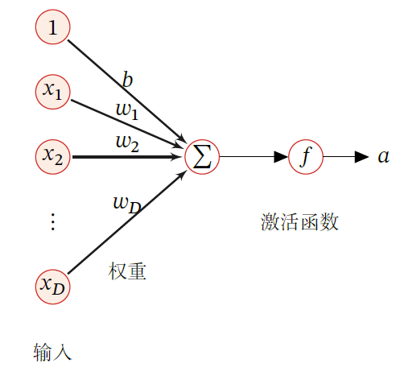

- 在MP神经元中 **输入和输出** 都限定为二进制信号

  假设一个神经元接收 $D$ 个输入 $x_1,x_2,\cdots,x_D$ ，令向量 $x=[x_1;x_2;\cdots;x_D]$ 来表示这组输入，并用 **净输入**  $z\in \R$ 表示一个神经元所获得的输入信号 $x$ 的加权和
  $$
  z=\sum\limits_{d=1}^D\omega_dx_d+b=\omega^Tx+b
  $$
  其中 $\omega=[\omega_1;\omega_2;\cdots;\omega_D]\in \R$ 是D维的权重向量，$b\in \R$ 是偏置

- 净输入 $z$ 在经过一个非线性函数 $f(\cdot)$ 后，得到神经元的活性值 $\alpha=f(z)$ ，其中非线性函数 $f(\cdot)$ 称为 **激活函数**

  MP神经元使用的激活函数是符号函数：以预先设定的阈值作为参数：当输入大于阈值，输出1；反之输出0

**激活函数分类0.4.6**

MP神经元的工作形式类似与数字电路中的逻辑门

- 缺乏AI 中重要的特性——**学习机制**

#### 神经网络学习机制

核心观点是 **学习过程主要是通过神经元之间突触的形成和变化来实现**

- 两个神经细胞之间通过神经元进行交流越多，二者之间的联系就会被强化，学习效果也在联系强化过程中产生

赫布理论 **给出了改变模型神经元之间权重的准则** 

- 如果两个神经元同时被激活，它们的权重就应该增加
- 如果分别被激活，两者之间的权重就应该降低
- 如果两个结点倾向于同时输出相同的结果，二者有较强的正值权重
- 如果两个结点倾向于同时输出相反的结果，二者有较强的负值权重

赫布理论并不能用于改善MP神经元，因为MP神经元中的权重 $\omega_i$ 都是固定不变的，不能做出动态调整

##### 知识存储

知识存储在人脑之间的神经元连接上

记忆

- 长期记忆：如果一个经验重复足够次数，此经验就可存储在长期记忆中
- 短期记忆：持续时间不超过一分钟

短期记忆转化为长期记忆的过程称为凝固作用

- 海马区

#### 人工神经网络

神经网络天然不是深度学习,但是 **深度学习天然是神经网络**

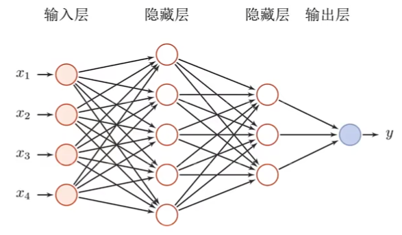

$$
y=f^{3}(f^{2}(f^1(x)))
$$
人工神经网络主要由大量的神经元以及它们之间的有向连接构成

- 神经元间的激活规则

  非线性函数

- 网络结构

- 学习算法：通过训练数据来学习神经网络的参数

##### 网络结构

通过一定的连接方式或信息传递方式进行协作的神经元可以看作一个网络，就是神经网络．

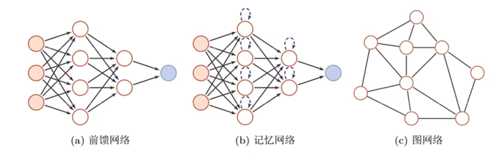

**前馈网络**

各个神经元按接收信息的先后分为不同的组。

每一组可以看作一个神经层，每一层中的神经元接收前一层神经元的输出，并输出到下一层神经元

整个网络中的信息是朝一个方向传播，没有反向的信息传播，可以用一个有向无环路图表示

- 全连接前馈网络
- 卷积神经网络

可以看做非线性函数的多次复合，实现输入空间到输出空间的复杂映射

**记忆网络(反馈网络)**

网络中神经元不但可以接收其他神经元的信息，也可以接收自己的历史信息

记忆网络中的神经元具有记忆功能，在不同的时刻具有不同的状态——记忆

记忆神经网络中的信息传播可以是单向或双向传递，可以用一个有向循环图或无向图表示

- 循环神经网络
- Hopfield网络
- 玻尔兹曼机
- 受限玻尔兹曼机

可以看做一个程序，具有更强的计算和记忆能力

改进：增强记忆网络的记忆容量，引入外部记忆单元和读写机制——记忆增强网络

- 神经图灵机
- 记忆网络

**图网络**

前馈网络和记忆网络的输入都可以表示为向量或向量序列

实际应用中图结构的数据很多，如（知识图谱、社交网络、分子网络），前馈网络和记忆网络很难处理图结构的数据

图网络是定义在图结构数据上的神经网络，图中每个节点都由一个或一组神经元构成

节点之间的链接可以有向或无向，都可以接收来自邻接节点或自身结点的信息

- 图卷积网络
- 图注意力网络
- 消息传递神经网络

##### 贡献度分配问题

偏导数
$$
\frac{\partial y}{\partial \omega^{l}}=\frac{y(\omega^l+\Delta \omega)-y(\omega^l)}{\Delta \omega}
$$
若某个参数 $\omega^i$ 对结果很重要，则该参数有微小扰动，对于结果 $y$ 的影响也会很大，贡献度也会很大

### 0.4.5 神经网络发展史

第一阶段：模型提出

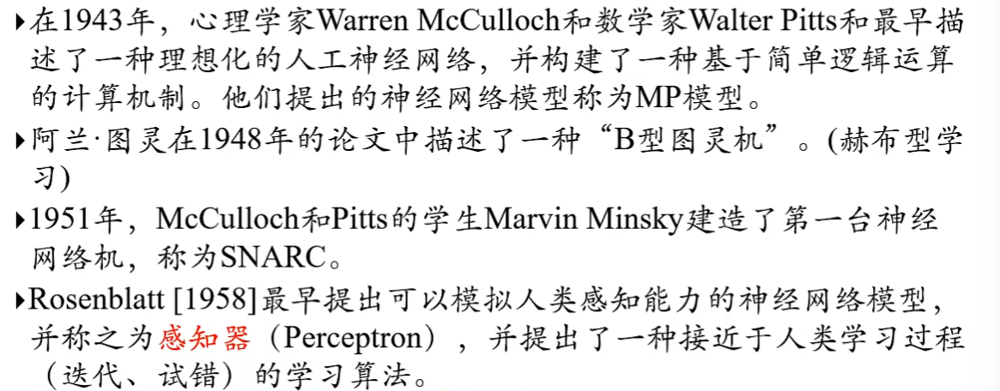

第二阶段：冰河期

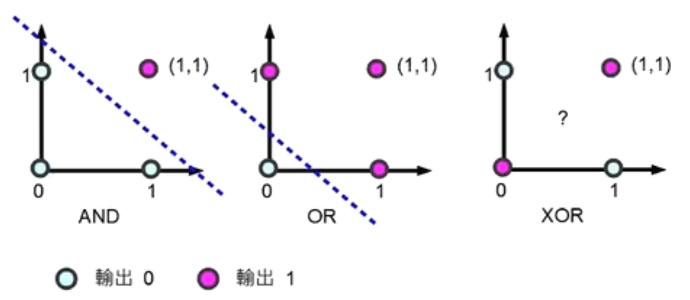

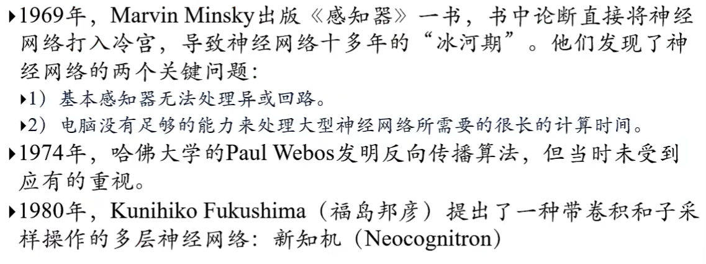

第三阶段：反向传播算法引起的复兴

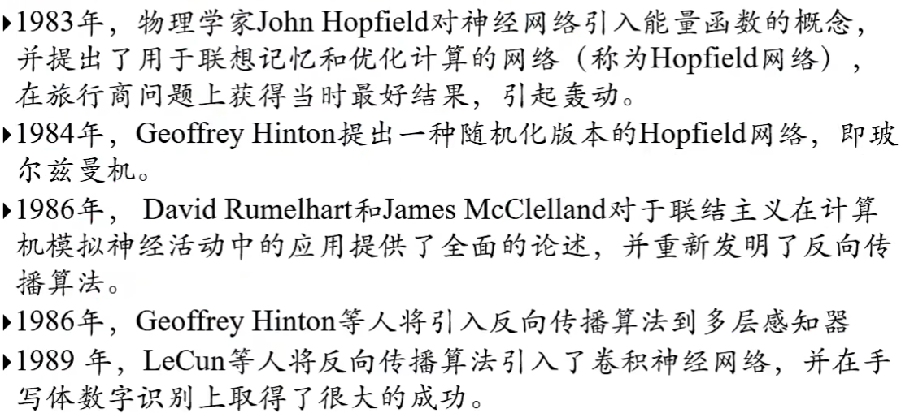

第四阶段：流行度降低

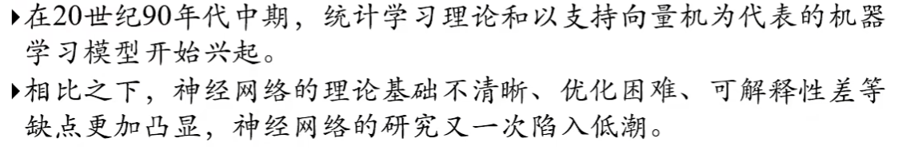

第五阶段：深度学习的崛起

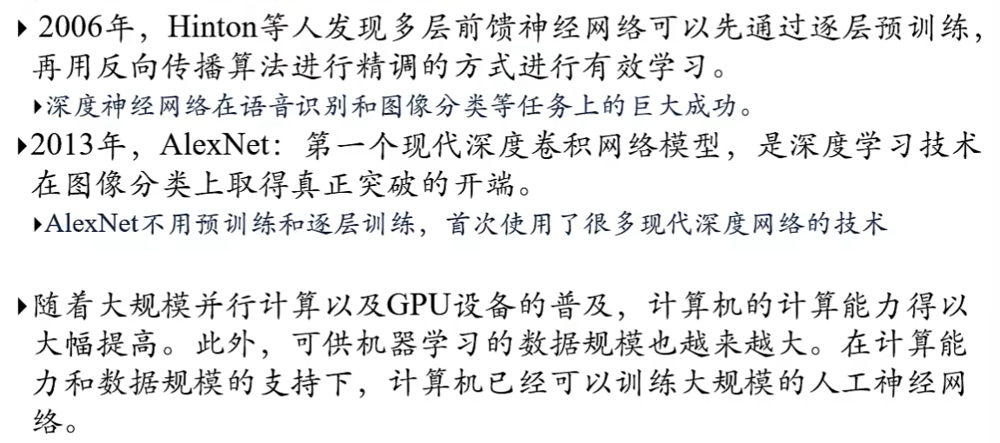

### 0.4.6 激活函数

#### 激活函数性质

- 连续并可导（允许少数点上不可导）的非线性函数，可导的激活函数可以直接用数值优化的方法来学习网络参数
- 激活函数机器导函数尽可能简单，有利于提高网络计算效率
- 激活函数的导函数至于要在一个合适的区间内，不能太大也不能太小，否则会影响训练的效率和稳定性

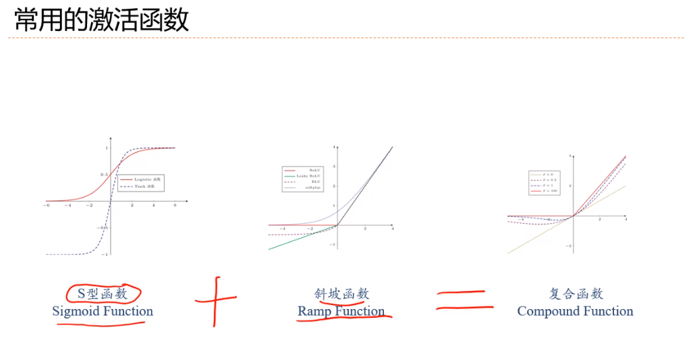

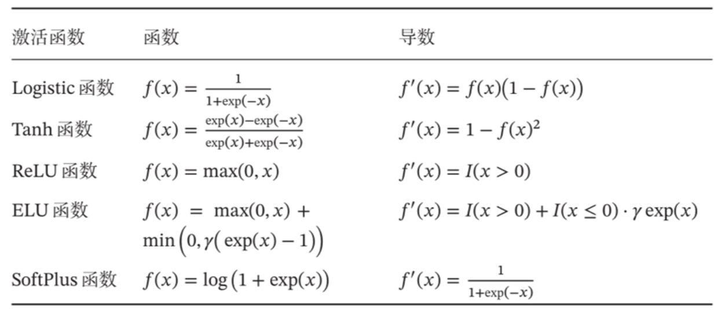

#### sigmod型函数(S型)

sigmod型函数指一类 S 型曲线函数，为两端饱和函数

- logistic函数
- Tanh函数

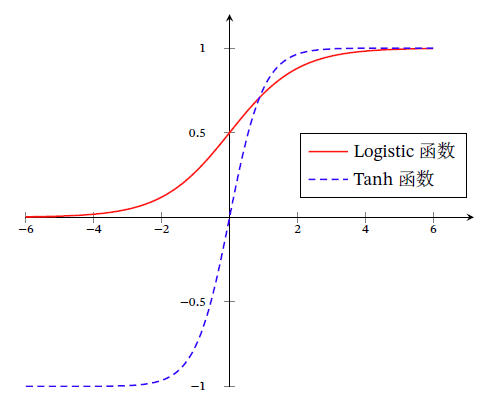

> 饱和：对于函数 $f(x)$ ，若 $x\rightarrow -\infty$ ，其导数 $f'(x)\rightarrow 0$ ，则称其为左饱和；若 $x\rightarrow +\infty$ ，其导函数 $f'(x)\rightarrow 0$ ，则称其为右饱和

##### Logistic函数

$$
\sigma(x)=\frac{1}{1+e^{-x}}\in(0,1)
$$

当输入值在 $0$ 附近时，Sigmoid 型函数近似为线性函数；当输入值靠近两端时，对输入进行抑制．输入越小，越接近于 $0$ ；输入越大，越接近于 $1$

- 输出可以直接看做概率分布（非负性）
- 可以看做一个逻辑门，用来控制其他神经元输出信息的数量（饱和性）

非零中心化的输出(Logistic函数)，会使其后一层的神经元输入发生偏置偏移，并进一步使得梯度下降的收敛速度变慢

---

假设：
$$
y=f(\omega\cdot \sigma(x))\\
\frac{\partial y}{\partial \omega}=f'()\sigma(x)
$$
由于 $\sigma(x)$ 非负，其后一层神经元梯度要么全正，要么全负（$f'()$ 决定）

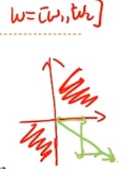

梯度下降效率变低，一次只能朝着某一方向向最优梯度下降，其余梯度为零

---

- 数据归一化为零中心
- 偏置：$\sigma(x)+b$

##### Tanh函数

$$
\begin{aligned}
tanh(x)&=\frac{e^x-e^{-x}}{e^x+e^{-x}}\in (-1,1)\\
&=2\sigma(2x)-1
\end{aligned}
$$

- 饱和函数
- Tanh函数的输出是零中心化的

##### Hard-Logistic函数和Hard-Tanh函数

Logistic函数和TanH函数都是Sigmod型函数，但由于饱和性，计算开销比较大。

- 在中间近似线性，两端饱和

可以通过分段函数来近似中间的线性部分

在0附近1阶泰勒展开，
$$
\begin{aligned}
g_l(x)&\approx\sigma(0)+x\sigma'(x)\\
&=0.25x+0.5
\end{aligned}
$$

$$
\begin{aligned}
hard-logistic(x)&=\begin{cases}
1&g_l(x)\ge 1\\
g_l(x)&0<g_l(x)<1\\
0&g_l(x)\le 0
\end{cases}\\
&=\max(\min(g_l(x),1),0)\\
&=\max(\min(0.25x+0.5,1),0)
\end{aligned}
$$

---

$$
\begin{aligned}
g_t(x)&\approx\tanh(0)+x\tanh'(x)\\
&=x
\end{aligned}
$$

$$
\begin{aligned}
hard-tanh(x)&=\begin{cases}
1&g_t(x)\ge 1\\
g_t(x)&-1<g_t(x)<1\\
-1&g_t(x)\le -1
\end{cases}\\
&=\max(\min(g_t(x),1),-1)\\
&=\max(\min(x,1),-1)
\end{aligned}
$$

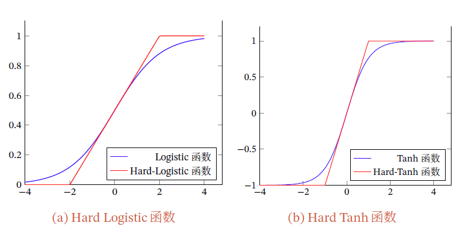

#### ReLU函数(斜坡型)

修正线性单元，也叫 Rectifier 函数，是目前深度神经网络中常用的激活函数
$$
\begin{aligned}
ReLU(x)&=\begin{cases}
x&x\ge 0\\
0&x<0
\end{cases}\\
&=\max(0,x)
\end{aligned}
$$
**优点**

- 计算高效：采用ReLU 的神经元只需要进行加、乘和比较的操作

- 具有生物学合理性：在生物神经网络中，同时处于兴奋状态的神经元非常稀疏。

  sigmod会导致一个非稀疏的神经网络

  ReLU具有很好的稀疏性，大约 $50\%$ 的神经元处于激活状态——**单侧抑制、宽兴奋边界**

- 在一定程度上缓解了神经网络的梯度消失问题：ReLU函数为左饱和函数，且在 $x>0$ 时，导数为 $1$ ，加速梯度下降的收敛速度

**缺点**

- 非零中心化，后一层神经网络引入偏置偏移，影响梯度下降的效率
- 死亡ReLU问题：如果参数在一次不恰当的更新后，第一个隐藏层中的某个ReLU 神经元在所有的训练数据上都不能被激活，那么这个神经元自身参数的梯度永远都会是0，在以后的训练过程中永远不能被激活

##### 带泄露的ReLU

> 在输入 $x<0$ 时，保持一个很小的梯度 $\gamma$ 
>
> 当神经元非激活时，也能有一个非零的梯度可以更新参数，避免永远不能被激活

$$
\begin{aligned}
LeakyReLU(x)&=\begin{cases}
x&x>0\\
\gamma x&x\le 0
\end{cases}\\
&=\max(0,x)+\gamma\min(0,x)
\end{aligned}
$$

$\gamma$ 通常为很小的常数，如 $\gamma=0.01$ ，带泄露的 ReLU也可以写成
$$
LeakyReLU(x)=\max(x,\gamma x)
$$

##### 带参数的ReLU

引入一个可学习的参数，不同神经元可以有不同的参数

对于第 $i$ 个神经元，其PReLU定义为
$$
\begin{aligned}
PReLU_i(x)&=\begin{cases}
x&x>0\\
\gamma_i x&x\le 0
\end{cases}\\
&=\max(0,x)+\gamma_i\min(0,x)
\end{aligned}
$$
$PReLU$ 是非饱和函数，允许不同的神经元有不同的参数，也可以共享一个参数

- $\gamma_i=0$ ，则 $PReLU$ 退化为 $ReLU$ 
- $\gamma_i$ 是一个很小的常数，则 $PReLU$ 可以看做带泄露的 $ReLU$ 

#####  ELU

> 近似的零中心化的非线性函数

$$
\begin{aligned}
ELU(x)&=\begin{cases}
x&x>0\\
\gamma(e^x-1)&x\le 0
\end{cases}\\
&=\max(0,x)+\min(0,\gamma(e^x-1))
\end{aligned}
$$

$\gamma\ge 0$ 是一个超参数，决定 $x\le 0$ 时的饱和曲线，并调整输出均值在0附近

##### Softplus函数

> 可以看做ReLU的平滑版本

$$
Softplus(x)=\log(1+e^x)
$$

其导数刚好为 $Logistic$ 函数

- 有单侧抑制，宽兴奋边界
- 没有稀疏激活性

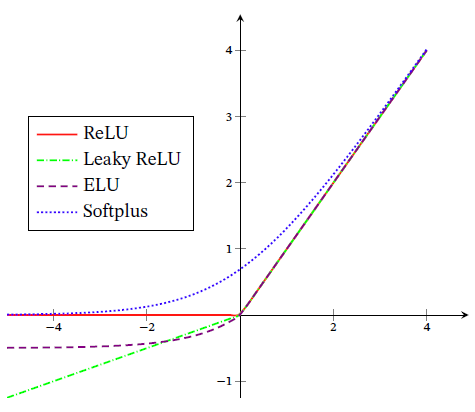

#### Swish函数(复合型)

> 自门控激活函数(软门控——允许信息通过的多少$\sigma(x)\in\{0,1\}$) 

$$
swish(x)=x\sigma(\beta x)
$$

其中 $\sigma(\cdot)$ 为 $Logistic$ 函数，$\beta$ 为可学习的参数或一个固定的超参数

- 当 $\sigma(\beta x)$ 接近于1时，门处于开状态，激活函数输出近似于 $x$ 本身
- 当 $\sigma(\beta x)$ 接近于0时，门处于关状态，激活函数的输出近似于0

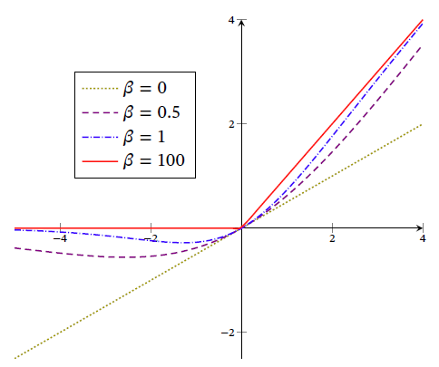

Swish函数可以看做线性函数和ReLU函数之间的非线性插值，其程度由 $\beta$ 控制

- $\beta=0$ 时，Swish函数变为线性函数 $\frac{x}{2}$

- $\beta=1$ 时，

  $x>0$ 时，近似线性

  $x<0$ 时，近似饱和，具有一定单调性

- $\beta\rightarrow +\infty$ 时，$\sigma(\beta x)$ 趋向于离散的 $0-1$ 函数

#### GELU函数

> 高斯误差线性单元，与Swish函数类似

$$
GELU(x)=xP(X\le x),X\sim \mathcal{N}(\mu,\sigma^2)
$$

其中，$\mu,\sigma$ 为超参数，一般设 $\mu=0,\sigma=1$ 

$P(X\le x)$ 为高斯分布的累计函数，为S型函数，可以用 $Logistic$ 函数或 $Tanh$ 函数近似
$$
GELU(x)\approx 0.5x\left[1+\tanh\left(\frac{2}{\pi}(x+0.044715x^3)\right)\right]\\
GELU(x)\approx x\sigma(1.702x)
$$

#### Maxout单元

Maxout单元也是一种S型分段线性函数

Maxout单元的输入是上一层神经元的全部原始输出，$x=[x_1;x_2;\cdots;x_D]$ 

每个Maxout单元有 $K$ 个权重向量 $\omega_k\in \R^D$ 和偏置 $b_k(1\le k\le K)$ ，对于输入 $x$ ，可以得到 $K$ 个净输入 $z_k$
$$
z_k=\omega_kx+b_k，\omega_k=\left[\omega_{k}^{(1)},\omega_k^{(2)},\cdots,\omega_k^{(D)}\right]
$$
 Maxout单元的非线性函数定义为
$$
maxout(x)=\max\limits_{k\in [1,K]}(z_k)
$$
Maxout单元不单是净输入到输出之间的非线性映射，而是整体学习输入到输出之间的非线性映射关系

Maxout激活函数可以看做任意凸函数的分段线性近似

