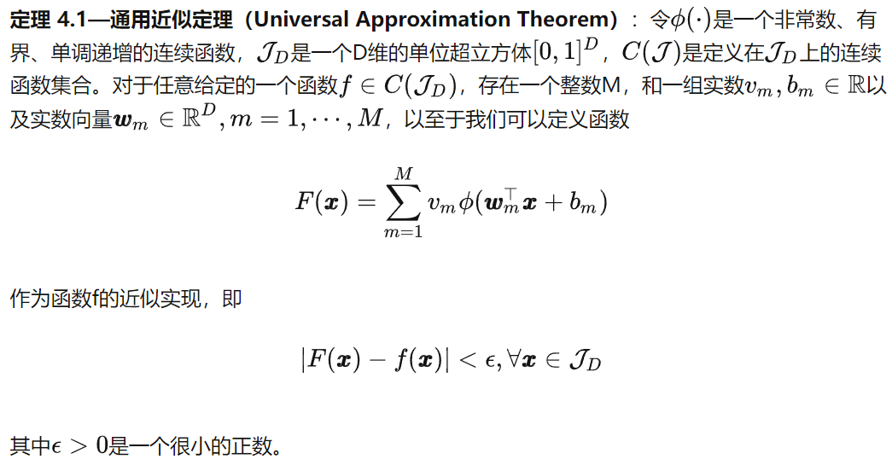
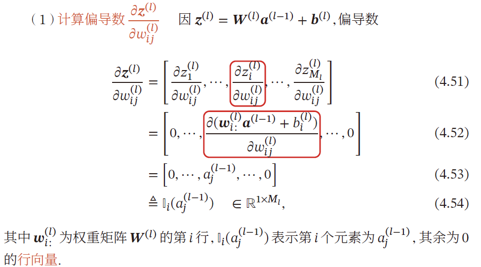
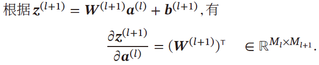
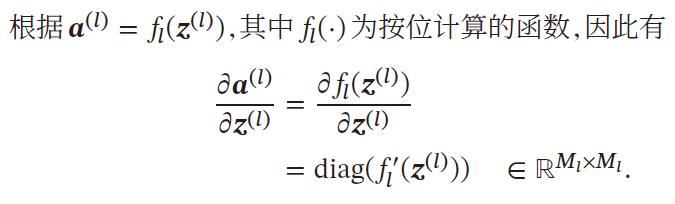

---
categories:
  - AI
tags:
  - AI
top: 17
mathjax: true
title: 1. 前馈神经网络
date: 
---

<!--more-->

## 1.1 前馈神经网络概念

前馈神经网络（Feedforward Neural Network,FNN）也称为多层感知器（实际上前馈神经网络由多层Logistic回归模型组成）

前馈神经网络中，各个神经元属于不同的层

每层神经元接收前一层神经元的信号，并输出到下一层

- 输入层：第0层
- 输出层：最后一层
- 隐藏层：其他中间层

整个网络中无反馈，信号从输入层向输出层单向传播，可用一个有向无环图表示

### 1.1.1 符号说明

#### 超参数

| 符号         | 含义                      |
| ------------ | ------------------------- |
| $L$          | 神经网络层数              |
| $M_l$        | 第 $l$ 层神经元个数       |
| $f_l(\cdot)$ | 第 $l$ 层神经元的激活函数 |

#### 参数

| 符号                                | 含义                             |
| ----------------------------------- | -------------------------------- |
| $W^{(l)}\in \R^{M_l\times M_{l-1}}$ | 第 $l-1$ 层到第 $l$ 层的权重矩阵 |
| $b^{(l)}\in \R^{M_l\times M_{l-1}}$ | 第 $l-1$ 层到第 $l$ 层的偏置     |

#### 活性值

| 符号                    | 含义                                |
| ----------------------- | ----------------------------------- |
| $z^{(l)}\in\R^{M_l}$    | 第 $l$ 层神经元的净输入（净活性值） |
| $a^{(l)}\in \R^{M_{l}}$ | 第 $l$ 层神经元的输出（活性值）     |

### 1.1.2 信息传播公式

神经网络的第 $l$ 层有 $M_l$ 个神经元，相应的有 $M_l$ 个净输入和活性值，所以二者需要由 $\R^{M_l}$ 向量来表示

第 $l$ 层的输入为第 $l-1$ 层的活性值，相应的为 $\R^{M_{l-1}}$ 向量，即 $z^{(l-1)},a^{(l-1)}\in \R^{M_{l-1}}$ 

故第 $l$ 层神经元的净输入需要经过一个 **仿射变换**，即
$$
\begin{aligned}
z^{(l)}&=W^{(l)}a^{(l-1)}+b^{(l)}，其中 W^{(l)}\in \R^{M_l\times M_{l-1}}\\
&=W^{(l-1)}f_{l-1}(z^{(l-1)})+b^{(l)}
\end{aligned}
$$
活性值 $a^{(l)}$ 需要经过一个 **非线性变换**
$$
\begin{aligned}
a^{(l)}&=f_l(z^{(l)})\\
&=f_l(W^{(l)}a^{(l-1)}+b^{(l)})
\end{aligned}
$$
进而可知，由输入到网络最后的输出 $a^{(L)}$ 
$$
x=a^{(0)}\xrightarrow{W_1}z^{(1)}\xrightarrow{f_1()}a^{(1)}\cdots\xrightarrow{f_{L-1}()}a^{(L-1)}\xrightarrow{W_{L}}z^{(L)}\xrightarrow{f_L()}a^{(L)}=\phi(x;W;b)
$$
其中 $W,b$ 表示网络中所有层的连接权重和偏置

前馈神经网络可以通过逐层的信息传递，整个网络可以看做一个复合函数 $\phi(x;W;b)$

#### 通用近似定理

根据通用近似定理，对于具有 **线性输出层** $z^{(l)}$ 和至少一个 **具有挤压性质的激活函数** $\phi(\cdot)$ 的隐藏层组成的前馈神经网络，只要隐藏层的神经元数量足够，就可以以任意精度来近似任何一个定义在实数空间中的有界闭函数

### 1.1.3 神经网络与机器学习结合

神经网络可以作为一个万能函数，用于进行复杂的特征转换或逼近一个条件分布

在机器学习中，输入样本的特征对分类器性能的影响很大

若要获得很好的分类效果，需要将样本的原始特征向量 $x$ 转换到更有效的特征向量 $\phi(x)$ ——特征抽取

多层前馈神经网络恰好可以看做一个非线性函数 $\phi(\cdot)$ ，将输入 $x\in \R^D$ 映射到输出 $\phi(x)\in \R^{D'}$ ，因此可将多层前馈神经网络看作一种特殊的特征转换方法，其输出 $\phi(x)$ 作为分类器的输入
$$
\hat{y}=g(\phi(x);\theta)
$$

- $g(\cdot)$ 为线性或非线性分类器
- $\theta$ 为分类器 $g(\cdot)$ 的参数
- $\hat{y}$ 为分类器输出

若分类器 $g(\cdot)$ 为 $Logistic回归$ 或 $Softmax回归$ ，则相当于在输出层引入分类器，神经网络直接输出在不同类别的条件概率 $p(y\vert x)$

##### 二分类问题

对于二分类问题 $y\in \{0,1\}$ ，且采用 $Logistic回归$ ，那么 $Logistic$ 相当与神经网络的输出层，只需要一个神经元，其激活函数就是 $Logistic函数$ ，可直接作为类别 $y=1$ 的条件概率 
$$
p(y=1\vert x)=a^{(L)}\in \R
$$

##### 多分类问题

对于多分类问题 $y\in \{1,\cdots,C\}$ ，如果使用 $Softmax回归$ ，相当于网络最后一层设置 $C$ 个神经元，其激活函数为 $Softmax函数$ ，网络最后一层的输出可以作为每个类的条件概率
$$
\hat{y}=softmax(z^{(l)})
$$
其中，$z^{(L)}\in \R^C$ 为第 $L$ 层神经元的净输入

$\hat{y}\in\R^C$ 为第 $L$ 层神经元的活性值，每一维分别表示不同类别标签的预测条件概率

### 1.1.4 参数学习

如果采用交叉熵损失函数，对于样本 $(x,y)$ ，其损失函数为
$$
\mathcal{L}(y,\hat{y})=-y\log \hat{y},y\in \{0,1\}^C
$$
给定训练集 $\mathcal{D}=\{(x_i,y_i)\}_{i=1}^N$ ，将每个样本 $x_i$ 输入给前馈网络得到 $\hat{y}_i$ ，其结构化风险函数为
$$
\mathcal{R}(W,b)=\frac{1}{N}\sum\limits_{i=1}^N\mathcal{L}(y_i,\hat{y}_i)+\frac{1}{2}\lambda\Vert W\Vert_F^2
$$

- $\lambda$ 为超参数，$\lambda$ 越大，$W$ 越接近于0

- 一般用 $Frobenius$ 范数（F范数）作为惩罚项
  $$
  \Vert W\Vert_F^2=\sum\limits_{l=1}^L\sum\limits_{i=1}^{M_l}\sum\limits_{j=1}^{M_{l-1}}\left(\omega_{ij}^{(l)}\right)^2
  $$

对于网络参数，可以通过梯度下降的方法学习
$$
\begin{aligned}
W^{(l)}&\leftarrow W^{(l)}-\alpha\frac{\partial \mathcal{R}(W,b)}{\partial W^{(l)}}\\
&\leftarrow W^{(l)}-\alpha\left(\frac{1}{N}\sum\limits_{i=1}^N\frac{\partial \mathcal{L}(y_i,\hat{y}_i)}{\partial W^{(l)}}+\lambda W^{(l)}\right)\\
b^{(l)}&\leftarrow b^{(l)}-\alpha\frac{\partial \mathcal{R}(W,b)}{\partial b^{(l)}}\\
&\leftarrow b^{(l)}-\alpha\left(\frac{1}{N}\sum\limits_{i=1}^N\frac{\partial \mathcal{L}(y_i,\hat{y}_i)}{\partial b^{(l)}}\right)
\end{aligned}
$$

#### 矩阵求导

根据求导的自变量和因变量是标量，$列向量$ 还是矩阵 ，我们有9种可能的矩阵求导定义：

含标量情况：

1. $\frac{\partial 标量}{\partial 标量}=标量$ 
2. $\frac{\partial 标量}{\partial 向量}=向量$ ，$\frac{\partial 标量}{\partial 矩阵}=矩阵$
3. $\frac{\partial 向量}{\partial 标量}=向量$ ，$\frac{\partial 矩阵}{\partial 标量}=矩阵$

标量情况，第2种和第3种情况，引出信息的两种布局方式

- 分子布局：结果的行维度与分子行维度相同
- 分母布局：结果的行维度与分母行维度相同

不论是向量也好，矩阵也好，对向量求导也好，对矩阵求导也好，结果都可以转化成标量之间的求导，最后把结果按照一定的方式拼接起来，以向量或者矩阵的形式表达出来。

**分子布局和分母布局的结果相差一个转置**

在机器学习的算法推导中，通常遵循以下布局规则：

- 如果向量或矩阵对标量求导，则以分子布局为主
- 如果标量对向量或矩阵求导，则以分母布局为主
- 向量对向量求导，有些分歧，一般以分子布局的雅克比矩阵为主。

本文沿用nndl的思路，以分母布局为主

若 $x^{(i)}\in \R$ ，向量 $x=\left[\begin{matrix}x^{(1)}\\x^{(2)}\\\vdots\\x^{(M)}\end{matrix}\right]\in \R^{M\times 1}$ 

- 若 $y=g(x)\in\R^{1\times 1}$ ，则
  $$
  \frac{\partial y}{\partial x}=\left[\begin{matrix}
  \frac{\partial y}{\partial x^{(1)}}\\
  \frac{\partial y}{\partial x^{(2)}}\\
  \vdots\\
  \frac{\partial y}{\partial x^{(M)}}
  \end{matrix}
  \right]\in \R^{M\times 1}
  $$

- 若 $y_i=g_i(x)$ ，$y=\left[\begin{matrix}y_1\\y_2\\\vdots\\y_N\end{matrix}\right]\in \R^{N\times 1}$ ，则
  $$
  \frac{\partial y}{\partial x}=\left[
  \begin{matrix}
  \frac{\partial y_1}{\partial x},\frac{\partial y_2}{\partial x},\cdots,\frac{\partial y_N}{\partial x}
  \end{matrix}
  \right]=\left[
  \begin{matrix}
  \frac{\partial y_1}{\partial x_1}&\frac{\partial y_2}{\partial x_1}&\cdots&\frac{\partial y_N}{\partial x_1}\\
  \frac{\partial y_1}{\partial x_2}&\frac{\partial y_2}{\partial x_2}&\cdots&\frac{\partial y_N}{\partial x_2}\\
  \vdots&\vdots&\ddots&\vdots\\
  \frac{\partial y_1}{\partial x_M}&\frac{\partial y_2}{\partial x_M}&\cdots&\frac{\partial y_N}{\partial x_M}\\
  \end{matrix}
  \right]\in \R^{M\times N}
  $$

#### 链式法则

$$
y=f_5(f_4(f_3(f_2(f_1(x)))))\rightarrow \frac{\partial y}{\partial x}=\frac{\partial f_5}{\partial f_4}\frac{\partial f_4}{\partial f_3}\frac{\partial f_3}{\partial f_2}\frac{\partial f_2}{\partial f_1}\frac{\partial f_1}{\partial x}
$$

---

若 $x\in \R$，
$$
\begin{cases}
y_i=g_i(x)&y=[g_1(x),g_2(x),\cdots,g_M(x)]\in \R^{M}\\
z_i=f_i(y)&z=\left[f_1(y),f_2(y),\cdots,f_N(y)\right]\in \R^{N}
\end{cases}
$$
则有
$$
\frac{\partial z}{\partial x}=\frac{\partial y}{\partial x}_{1\times M}\frac{\partial z}{\partial y}_{M\times N}\in\R^{1\times N}
$$

---

若 $x\in \R^{M}$ 
$$
\begin{cases}
y_i=g_i(x)&y=[g_1(x),g_2(x),\cdots,g_K(x)]\in \R^{K}\\
z_i=f_i(y)&z=\left[f_1(y),f_2(y),\cdots,f_N(y)\right]\in \R^{N}
\end{cases}
$$
则有
$$
\frac{\partial z}{\partial x}=\frac{\partial y}{\partial x}_{M\times K}\frac{\partial z}{\partial y}_{K\times N}\in \R^{M\times N}
$$

---

若 $X\in R^{M\times N}$ ，
$$
\begin{cases}
y_i=g_i(X)&y=[g_1(X),g_2(X),\cdots,g_K(X)]\in \R^{K}\\
z_i=f(y)\in \R
\end{cases}
$$
则有
$$
\frac{\partial z}{\partial x_{ij}}=\frac{\partial y}{\partial x_{ij}}_{1\times K}\frac{\partial z}{\partial y}_{K\times 1}\in \R
$$
#### 更为高效的参数学习

梯度下降法需要计算损失函数对参数的偏导数，如果通过链式法则逐一对每个参数求偏导，会很低效

- 反向传播算法
- 自动梯度计算

#### 反向传播算法

##### 目标

求解
$$
\begin{aligned}
W^{(l)}&\leftarrow W^{(l)}-\alpha\frac{\partial \mathcal{R}(W,b)}{\partial W^{(l)}}\\
&\leftarrow W^{(l)}-\alpha\left(\frac{1}{N}\sum\limits_{i=1}^N\frac{\partial \mathcal{L}(y_i,\hat{y}_i)}{\partial W^{(l)}}+\lambda W^{(l)}\right)\\
b^{(l)}&\leftarrow b^{(l)}-\alpha\frac{\partial \mathcal{R}(W,b)}{\partial b^{(l)}}\\
&\leftarrow b^{(l)}-\alpha\left(\frac{1}{N}\sum\limits_{i=1}^N\frac{\partial \mathcal{L}(y_i,\hat{y}_i)}{\partial b^{(l)}}\right)
\end{aligned}
$$
可见参数求解的核心部分为 $\frac{\partial \mathcal{L}(y_i,\hat{y}_i)}{\partial W^{(l)}}$ ，对于矩阵求导，可以对逐个元素求导，再排列为矩阵形式，根据链式法则
$$
\frac{\partial \mathcal{L}(y_i,\hat{y}_i)}{\partial w_{ij}^{(l)}}=\frac{\partial z^{(l)}}{\partial w^{(l)}_{ij}}\frac{\partial \mathcal{L}(y_i,\hat{y}_i)}{\partial z^{(l)}}\\
\frac{\partial \mathcal{L}(y_i,\hat{y}_i)}{\partial b^{(l)}}=\frac{\partial z^{(l)}}{\partial b^{(l)}}\frac{\partial \mathcal{L}(y_i,\hat{y}_i)}{\partial z^{(l)}}
$$

##### 计算 $\frac{\partial z^{(l)}}{\partial w^{(l)}_{ij}}$ 

因 $z^{(l)}_{M_l\times 1}=W^{(l)}_{M_{l}\times M_{l-1}}a^{(l-1)}_{M_{l-1}\times 1}+b^{(l)}_{M_{l}}$

- 分母布局，故需要将 $z^{(l)}$ 转置求偏导，第 $i$ 个元素为 $a_j^{(l-1)}$ 

##### 计算 $\frac{\partial z^{(l)}}{\partial b^{(l)}}$ 

##### 计算 $\frac{\partial \mathcal{L}(y_i,\hat{y}_i)}{\partial z^{(l)}}$

计算误差项 $\frac{\partial \mathcal{L}(y_i,\hat{y}_i)}{\partial z^{(l)}}$ 表示第 $l$ 层神经元对最终损失的影响，也反映了最终损失对第 $l$ 层神经元的敏感程度，不同神经元对网络能力的贡献程度，从而比较好地解决了贡献度分配问题
$$
\delta^{(l)}\overset{\Delta}{=}\frac{\partial \mathcal{L}(y_i,\hat{y}_i)}{\partial z^{(l)}}\in \R^{M_l\times 1}
$$

- $z^{(l+1)}\in \R^{M_{l+1}}$​ ，$a^{(l)}\in \R^{M_l}$​ ，所以
  $$
  \frac{z^{(l+1)}}{a^{(l)}}\xlongequal{分母布局}\left[
  \begin{matrix}
  w_{11}&w_{21}&\cdots &w_{M_{l+1}1}\\
  w_{12}&w_{22}&\cdots &w_{M_{l+1}2}\\
  \vdots&\vdots&\ddots&\vdots\\
  w_{1M_l}&w_{2M_l}&\cdots &w_{M_{l+1}M_l}\\
  \end{matrix}
  \right]\in \R^{M_l\times M_{l+1}}
  $$

- 同上，采用分母布局 $\in \R^{M_l\times M_l}$
- 由于 $a^{(l)}=f_l(z^{(l)})$ ，所以 $\frac{\partial a^{(l)}}{\partial z^{(l)}}$ 只有 $M_l$ 个元素 $\neq 0$ ，位于对角线上

 

 

