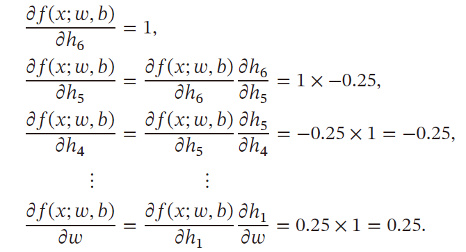
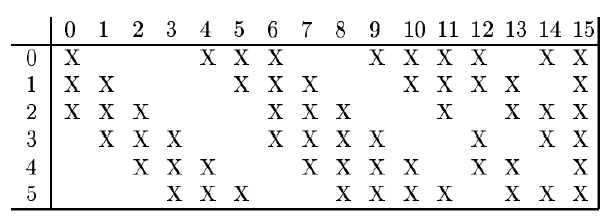
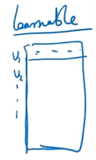

---
categories:
  - AI
  - 机器学习
  - 深度学习
tags:
  - AI
  - 机器学习
  - 深度学习
top: 17
mathjax: true
title: 1. 前馈神经网络
abbrlink: 1322110126
date: 2023-10-07 17:58:25
updated: 2023-10-12 00:13:02
---

> 全连接前馈神经网络可以抽象为信息传播公式，其理论依据为通用近似定理，经过网络处理后，输出为样本所属各类的置信度，代入机器学习的分类模型，得到最终的分类结果。对交叉熵损失函数使用梯度下降算法求参数，矩阵求导在nndl中以分母布局为主，以链式法则为计算依据，但同时也可采用更为高效的计算方法
> 反向传播算法：第l层的误差项可以通过第 $l+1$ 层的误差项计算得到，前向计算每一层净输出和活性值，再反向传播计算每一层的误差项，得到本层梯度，用随机梯度下降法来训练参数
> 自动梯度计算反向模式与反向传播算法一致
> 神经网络为非凸优化问题，会遇到：梯度消失和梯度爆炸问题，参数过多，以及无局部不变性
> 
>首先介绍了卷积运算及交换性，用互相关与卷积运算的区别在于是否旋转卷积核，卷积运算可以理解为多次翻转相乘，互相关就是相同位置元素相乘求和
> 
>由于全连接网络参数过多，使用卷积运算可以减少参数数量，池化层可以减少输出特征映射的神经元数量。卷积层输入层与输出层的特征映射是全连接关系，卷积神经网络的整体结构为多个卷积块插入几个池化层，再过全连接网络，得到条件概率，最后代入机器学习模型得到最终输出。
> 
>卷积神经网络也是通过误差反向传播得到参数，介绍了几种典型的网络：LeNet-5，AlexNet，Inception，残差网络，并进行参数与运算量推演，
> 
>最后是三种非标准卷积：空洞卷积，转置卷积，微步卷积以及卷积神经网络的应用

[TOC]

<!--more-->

## 1.1 全连接前馈神经网络

前馈神经网络（Feedforward Neural Network,FNN）也称为多层感知器（实际上前馈神经网络由多层Logistic回归模型组成）

前馈神经网络中，各个神经元属于不同的层

每层神经元接收前一层神经元的信号，并输出到下一层

- 输入层：第0层
- 输出层：最后一层
- 隐藏层：其他中间层

整个网络中无反馈，信号从输入层向输出层单向传播，可用一个有向无环图表示

### 1.1.1 符号说明

#### 超参数

| 符号         | 含义                      |
| ------------ | ------------------------- |
| $L$          | 神经网络层数              |
| $M_l$        | 第 $l$ 层神经元个数       |
| $f_l(\cdot)$ | 第 $l$ 层神经元的激活函数 |

#### 参数

| 符号                                | 含义                             |
| ----------------------------------- | -------------------------------- |
| $W^{(l)}\in \R^{M_l\times M_{l-1}}$ | 第 $l-1$ 层到第 $l$ 层的权重矩阵 |
| $b^{(l)}\in \R^{M_l}$               | 第 $l-1$ 层到第 $l$ 层的偏置     |

#### 活性值

| 符号                    | 含义                                |
| ----------------------- | ----------------------------------- |
| $z^{(l)}\in\R^{M_l}$    | 第 $l$ 层神经元的净输入（净活性值） |
| $a^{(l)}\in \R^{M_{l}}$ | 第 $l$ 层神经元的输出（活性值）     |

### 1.1.2 信息传播公式

神经网络的第 $l$ 层有 $M_l$ 个神经元，相应的有 $M_l$ 个净输入和活性值，所以二者需要由 $\R^{M_l}$ 向量来表示

第 $l$ 层的输入为第 $l-1$ 层的活性值，相应的为 $\R^{M_{l-1}}$ 向量，即 $z^{(l-1)},a^{(l-1)}\in \R^{M_{l-1}}$ 

故第 $l$ 层神经元的净输入需要经过一个 **仿射变换**，即
$$
\begin{aligned}
z^{(l)}&=W^{(l)}a^{(l-1)}+b^{(l)}，其中 W^{(l)}\in \R^{M_l\times M_{l-1}}\\
&=W^{(l-1)}f_{l-1}(z^{(l-1)})+b^{(l)}
\end{aligned}
$$
活性值 $a^{(l)}$ 需要经过一个 **非线性变换** 
$$
\begin{aligned}
a^{(l)}&=f_l(z^{(l)})\\
&=f_l(W^{(l)}a^{(l-1)}+b^{(l)})
\end{aligned}
$$
进而可知，由输入到网络最后的输出 $a^{(L)}$ 
$$
x=a^{(0)}\xrightarrow{W_1}z^{(1)}\xrightarrow{f_1()}a^{(1)}\cdots\xrightarrow{f_{L-1}()}a^{(L-1)}\xrightarrow{W_{L}}z^{(L)}=\phi(x;W;b)
$$
其中 $W,b$ 表示网络中所有层的连接权重和偏置

前馈神经网络可以通过逐层的信息传递，整个网络可以看做一个复合函数 $\phi(x;W;b)$ 

#### 通用近似定理

根据通用近似定理，对于具有 **线性输出层** $z^{(l)}$ 和至少一个 **具有挤压性质的激活函数** $\phi(\cdot)$ 的隐藏层组成的前馈神经网络，只要隐藏层的神经元数量足够，就可以以任意精度来近似任何一个定义在实数空间中的有界闭函数

### 1.1.3 神经网络应用于分类

> 神经网络可以作为一个万能函数，用于进行复杂的特征转换或逼近一个条件分布

在机器学习中，输入样本的特征对分类器性能的影响很大

若要获得很好的分类效果，需要将样本的原始特征向量 $x$ 转换到更有效的特征向量 $\phi(x)$ ——特征抽取

多层前馈神经网络恰好可以看做一个非线性函数 $\phi(\cdot)$ ，将输入 $x\in \R^D$ 映射到输出 $\phi(x)\in \R^{D'}$ ，因此可将多层前馈神经网络看作一种特殊的特征转换方法，其输出 $\phi(x)$ 作为分类器的输入
$$
\hat{y}=g(\phi(x);\theta)
$$

- $g(\cdot)$ 为分类器
- $\theta$ 为分类器 $g(\cdot)$ 的参数
- $\hat{y}$ 为分类器输出

若分类器 $g(\cdot)$ 为 $Logistic回归$ 或 $Softmax回归$ ，则相当于在输出层引入分类器，神经网络直接输出在不同类别的条件概率 $p(y\vert x)$

#### 二分类问题

对于二分类问题 $y\in \{0,1\}$ ，且采用 $Logistic回归$ ，神经网络的输出层只有一个神经元，其激活函数是 $Logistic函数$  
$$
p(y=1\vert x)=logistic(z^{(l)})=a^{(L)}\in [0,1]
$$

#### 多分类问题

对于多分类问题 $y\in \{1,\cdots,C\}$ ，如果使用 $Softmax$ 分类器，网络最后一层设置 $C$ 个神经元，其激活函数为 $Softmax$ ，网络最后一层的输出可以作为每个类的条件概率
$$
\hat{y}=softmax(z^{(l)})
$$
其中，$z^{(L)}\in \R^C$ 为第 $L$ 层神经网络的净输出， $\hat{y}\in\R^C$ 为第 $L$ 层神经网络的活性值，每一维分别表示不同类别标签的预测条件概率

### 1.1.4 参数学习

如果采用交叉熵损失函数，对于样本 $(x,y)$ ，其损失函数为
$$
\mathcal{L}(y,\hat{y})=-y\log \hat{y},y\in \{0,1\}^C
$$
给定训练集 $\mathcal{D}=\{(x_i,y_i)\}_{i=1}^N$ ，将每个样本 $x_i$ 输入给前馈网络得到 $\hat{y}_i$ ，其结构化风险函数为
$$
\mathcal{R}(W,b)=\frac{1}{N}\sum\limits_{i=1}^N\mathcal{L}(y_i,\hat{y}_i)+\frac{1}{2}\lambda\Vert W\Vert_F^2
$$

- $\lambda$ 为超参数，$\lambda$ 越大，$W$ 越接近于0

- 一般用 $Frobenius$ 范数（F范数）作为惩罚项
  $$
  \Vert W\Vert_F^2=\sum\limits_{l=1}^L\sum\limits_{i=1}^{M_l}\sum\limits_{j=1}^{M_{l-1}}\left(\omega_{ij}^{(l)}\right)^2
  $$

对于某一层网络参数，可以通过梯度下降的方法学习
$$
\begin{aligned}
W^{(l)}&\leftarrow W^{(l)}-\alpha\frac{\partial \mathcal{R}(W,b)}{\partial W^{(l)}}\\
&\leftarrow W^{(l)}-\alpha\left(\frac{1}{N}\sum\limits_{i=1}^N\frac{\partial \mathcal{L}(y_i,\hat{y}_i)}{\partial W^{(l)}}+\lambda W^{(l)}\right)\\
b^{(l)}&\leftarrow b^{(l)}-\alpha\frac{\partial \mathcal{R}(W,b)}{\partial b^{(l)}}\\
&\leftarrow b^{(l)}-\alpha\left(\frac{1}{N}\sum\limits_{i=1}^N\frac{\partial \mathcal{L}(y_i,\hat{y}_i)}{\partial b^{(l)}}\right)
\end{aligned}
$$

#### 矩阵求导

根据求导的自变量和因变量是标量、列向量还是矩阵 ，我们有9种可能的矩阵求导定义：

含标量情况：

1. $\frac{\partial 标量}{\partial 标量}=标量$ 
2. $\frac{\partial 标量}{\partial 向量}=向量$ ，$\frac{\partial 标量}{\partial 矩阵}=矩阵$
3. $\frac{\partial 向量}{\partial 标量}=向量$ ，$\frac{\partial 矩阵}{\partial 标量}=矩阵$

标量情况，第2种和第3种情况，引出信息的两种布局方式

- 分子布局：结果的行维度与分子行维度相同
- 分母布局：结果的行维度与分母行维度相同

不论是哪种求导，都是逐元素求偏导，最后结果按照一定的布局方式拼接起来。

**分子布局和分母布局的结果相差一个转置**

在机器学习的算法推导中，通常遵循以下布局规则：

- 如果向量或矩阵对标量求导，则以分子布局为主
- 如果标量对向量或矩阵求导，则以分母布局为主
- 向量对向量求导，有些分歧，一般以分子布局的雅克比矩阵为主。

本文沿用nndl的思路，以分母布局为主

$x^{(i)}\in \R$ ，向量 $x=\left[\begin{matrix}x^{(1)}\\x^{(2)}\\\vdots\\x^{(M)}\end{matrix}\right]\in \R^{M\times 1}$ 

- 若 $y=g(x)\in\R^{1\times 1}$ ，则
  $$
  \frac{\partial y}{\partial x}=\left[\begin{matrix}
  \frac{\partial y}{\partial x^{(1)}}\\
  \frac{\partial y}{\partial x^{(2)}}\\
  \vdots\\
  \frac{\partial y}{\partial x^{(M)}}
  \end{matrix}
  \right]\in \R^{M\times 1}
  $$

- 若 $y_i=g_i(x)$ ，$y=\left[\begin{matrix}y_1\\y_2\\\vdots\\y_N\end{matrix}\right]\in \R^{N\times 1}$ ，则
  $$
  \frac{\partial y}{\partial x}=\left[
  \begin{matrix}
  \frac{\partial y_1}{\partial x},\frac{\partial y_2}{\partial x},\cdots,\frac{\partial y_N}{\partial x}
  \end{matrix}
  \right]=\left[
  \begin{matrix}
  \frac{\partial y_1}{\partial x_1}&\frac{\partial y_2}{\partial x_1}&\cdots&\frac{\partial y_N}{\partial x_1}\\
  \frac{\partial y_1}{\partial x_2}&\frac{\partial y_2}{\partial x_2}&\cdots&\frac{\partial y_N}{\partial x_2}\\
  \vdots&\vdots&\ddots&\vdots\\
  \frac{\partial y_1}{\partial x_M}&\frac{\partial y_2}{\partial x_M}&\cdots&\frac{\partial y_N}{\partial x_M}\\
  \end{matrix}
  \right]\in \R^{M\times N}
  $$

#### 链式法则

$$
y=f_5(f_4(f_3(f_2(f_1(x)))))\rightarrow \frac{\partial y}{\partial x}=\frac{\partial f_5}{\partial f_4}\frac{\partial f_4}{\partial f_3}\frac{\partial f_3}{\partial f_2}\frac{\partial f_2}{\partial f_1}\frac{\partial f_1}{\partial x}
$$

---

若 $x\in \R$，
$$
\begin{cases}
z_i=f_i(y)&z=\left[f_1(y),f_2(y),\cdots,f_N(y)\right]\in \R^{N}\\
y_i=g_i(x)&y=[g_1(x),g_2(x),\cdots,g_M(x)]\in \R^{M}
\end{cases}
$$
则有
$$
\frac{\partial z}{\partial x}=\frac{\partial y}{\partial x}_{1\times M}\frac{\partial z}{\partial y}_{M\times N}\in\R^{1\times N}
$$

---

若 $x\in \R^{M}$ 
$$
\begin{cases}
y_i=g_i(x)&y=[g_1(x),g_2(x),\cdots,g_K(x)]\in \R^{K}\\
z_i=f_i(y)&z=\left[f_1(y),f_2(y),\cdots,f_N(y)\right]\in \R^{N}
\end{cases}
$$
则有
$$
\frac{\partial z}{\partial x}=\frac{\partial y}{\partial x}_{M\times K}\frac{\partial z}{\partial y}_{K\times N}\in \R^{M\times N}
$$

---

若 $X\in R^{M\times N}$ ，
$$
\begin{cases}
y_i=g_i(X)&y=[g_1(X),g_2(X),\cdots,g_K(X)]\in \R^{K}\\
z_i=f(y)\in \R
\end{cases}
$$
则有
$$
\frac{\partial z}{\partial x_{ij}}=\frac{\partial y}{\partial x_{ij}}_{1\times K}\frac{\partial z}{\partial y}_{K\times 1}\in \R
$$

##### 更为高效的参数学习

梯度下降法需要计算损失函数对每个参数的偏导数，如果通过链式法则逐一对每个参数求偏导，会很低效

- 反向传播算法

- 自动梯度计算

  计算一个函数在指定值上的导数

#### 自动梯度计算

神经网络的参数主要通过梯度下降来优化，需要手动用链式求导来计算风险函数对每个参数的梯度，并转换为计算机程序。

- 手动计算并转换为计算机程序的过程容易出错

目前，主流的深度学习框架都包含了自动梯度计算功能，只需要考虑网络结构并用代码实现，大大提高了开发效率

##### 数值微分

用数值方法计算 $f(x)$ 的导数
$$
f'(x)=\lim\limits_{\Delta x\rightarrow 0}\frac{f(x+\Delta x)-f(x)}{\Delta x}
$$

1. 找到一个合适的 $\Delta x$ 十分困难

   - $\Delta x$ 过小，会引起数值计算问题，舍入误差
   - $\Delta x$ 过大，会增加截断误差（受模型影响的理论值与数值解之间的误差）

   在实际应用中，经常使用以下公式计算梯度，减少截断误差
   $$
   f'(x)=\lim\limits_{\Delta x\rightarrow 0} \frac{f(x+\Delta x)-f(x+\Delta x)}{2\Delta x}
   $$

2. 数值微分另一个问题是计算复杂度

   假设参数数量为 $N$ ，则每个参数都需要单独施加扰动，并计算梯度。假设每次正向传播的计算复杂度为 $O(N)$ ，则计算数值微分的总体时间复杂度为 $O(N^2)$

##### 符号微分

符号计算一般来讲是对**输入的表达式**，用计算机来通过迭代或递归使用一些事先定义的规则进行转换．当转换结果不能再继续使用变换规则时，便停止计算，**输出是目标函数 / 表达式**。如：mathematica

- 一般包括对数学表达式的化简、因式分解、微分、积分、解代数方程、求解常微分方程等运算

符号微分可以在编译时就计算梯度的数学表示，并进一步利用符号计算方法进行优化

且符号计算与平台无关，可在CPU或GPU上运行

缺点：

- 编译时间较长，特别是对于循环，需要很长时间进行编译
- 为了进行符号微分，一般需要设计一种专门的语言来表示数学表达式，并且要对变量（符号）进行预先声明
- 很难对程序进行调试

##### 自动微分

符号微分：处理数学表达式

自动微分：处理一个函数或一段程序

> 基本原理：所有的数值计算可以分解为一些基本操作，包含+, −, ×, / 和一些初等函数exp, log, sin, cos 等，然后利用链式法则来自动计算一个复合函数的梯度

以 $f(x;w,b)=\frac{1}{exp(-(wx+b))+1}$ 为例，其中 $x$ 为输入标量， $w,b$ 为权重和偏置

**计算图** 

复合函数关于参数的导数可以通过计算图路径上节点的所有导数连乘法得到

- 

如果函数与参数之间有多条路径，则将不同路径上的导数相加，可以得到最终的梯度

---

根据计算导数的顺序，自动微分可以分为：正向模式和反向模式

- 正向模式（从简单到复合）：按照计算图中与参数计算方向相同的方向来递归计算梯度

  

- 反向模式（从复合到简单）：按照计算图中与参数计算方向相反的方向来计算梯度

  

  反向模式与反向传播的梯度计算方式相同

准则：

当输入变量的数量大于输出变量的数量，用反向模式

- 前向模式需要对每一个输入都进行遍历

- 反向模式需要对每一个输出都进行遍历

在前馈神经网络中，风险函数为 $f:\R^{N}\rightarrow \R$ 输出为标量，采用反向模式，内存占用小，只需要计算一遍

---

**静态计算图和动态计算图**

静态计算图：在编译时构建计算图，运行过程中不可修改

- 在构建时可以进行优化，并行能力强
- 灵活性差

动态计算图：在程序运行时构建计算图

- 不容易优化，输入不同结构的网络，难以并行计算
- 灵活性高

##### 自动微分与符号微分区别

符号微分和自动微分都用计算图和链式法则自动求导

符号微分：

1. 符号微分在编译阶段先构造一个符合函数的计算图，通过符号计算得到导数表达式，并对表达式进行优化
2. 在程序运行运行阶段才代入变量数值计算导数

自动微分：

1. 无需事先编译，程序运行阶段，边计算边记录计算图
2. 计算图上的局部梯度都直接代入数值进行计算，然后用前向或反向模式计算最终梯度

#### 反向传播算法

##### 目标

求解
$$
\begin{aligned}
W^{(l)}&\leftarrow W^{(l)}-\alpha\frac{\partial \mathcal{R}(W,b)}{\partial W^{(l)}}\\
&\leftarrow W^{(l)}-\alpha\left(\frac{1}{N}\sum\limits_{i=1}^N\frac{\partial \mathcal{L}(y_i,\hat{y}_i)}{\partial W^{(l)}}+\lambda W^{(l)}\right)\\
b^{(l)}&\leftarrow b^{(l)}-\alpha\frac{\partial \mathcal{R}(W,b)}{\partial b^{(l)}}\\
&\leftarrow b^{(l)}-\alpha\left(\frac{1}{N}\sum\limits_{i=1}^N\frac{\partial \mathcal{L}(y_i,\hat{y}_i)}{\partial b^{(l)}}\right)
\end{aligned}
$$
可见参数求解的核心部分为 $\frac{\partial \mathcal{L}(y_i,\hat{y}_i)}{\partial W^{(l)}}$ ，对于矩阵求导，可以对逐个元素求导，再排列为矩阵形式，根据链式法则
$$
\begin{cases}
\frac{\partial \mathcal{L}(y_i,\hat{y}_i)}{\partial w_{ij}^{(l)}}=\frac{\partial z^{(l)}}{\partial w^{(l)}_{ij}}\frac{\partial \mathcal{L}(y_i,\hat{y}_i)}{\partial z^{(l)}}\\
\frac{\partial \mathcal{L}(y_i,\hat{y}_i)}{\partial b^{(l)}}=\frac{\partial z^{(l)}}{\partial b^{(l)}}\frac{\partial \mathcal{L}(y_i,\hat{y}_i)}{\partial z^{(l)}}
\end{cases}\quad,i\in [1,M_l],j\in [1,M_{l-1}]
$$

##### 计算 $\frac{\partial z^{(l)}}{\partial w^{(l)}_{ij}}$ 

因 $z^{(l)}_{M_l\times 1}=W^{(l)}_{M_{l}\times M_{l-1}}a^{(l-1)}_{M_{l-1}\times 1}+b^{(l)}_{M_{l}}$ 
$$
\begin{aligned}
\frac{\partial \mathbf{z}^{(l)}}{\partial w_{ij}^{(l)}}=\begin{bmatrix}
\frac{\partial z_1^{(l)}}{\partial w_{ij}^{(l)}}\\\vdots\\\frac{\partial z_i{(l)}}{\partial w_{ij}^{(l)}}\\\vdots\\\frac{\partial z_{M_l}^{(l)}}{\partial w_{ij}^{(l)}}
\end{bmatrix}^T=\begin{bmatrix}
0\\\vdots\\\frac{\partial}{\partial w_{ij}^{(l)}}\left(w_i^{(l)}a^{(l-1)}+b_i^{(l)}\right)\\\vdots\\0
\end{bmatrix}^T=\begin{bmatrix}
0\\\vdots\\\frac{\partial}{\partial w_{ij}^{(l)}}\left(\sum\limits_{j=1}^{M_{l-1}}w_{ij}^{(l)}a_j^{(l-1)}+b_i^{(l)}\right)\\\vdots\\0
\end{bmatrix}^T=\begin{bmatrix}
0\\\vdots\\a_j^{(l-1)}\\\vdots\\0
\end{bmatrix}^T
\end{aligned}
$$

- 分母布局，故需要将 $z^{(l)}$ 转置求偏导，第 $i$ 个元素为 $a_j^{(l-1)}$ 

##### 计算 $\frac{\partial z^{(l)}}{\partial b^{(l)}}$ 

##### 计算 $\frac{\partial \mathcal{L}(y_i,\hat{y}_i)}{\partial z^{(l)}}$

计算误差项 $\frac{\partial \mathcal{L}(y_i,\hat{y}_i)}{\partial z^{(l)}}$ 表示第 $l$ 层神经元对最终损失的影响，也反映了最终损失对第 $l$ 层神经元的敏感程度，不同神经元对网络能力的贡献程度，从而比较好地解决了贡献度分配问题
$$
\delta^{(l)}\overset{\Delta}{=}\frac{\partial \mathcal{L}(y_i,\hat{y}_i)}{\partial z^{(l)}}=\left[
\begin{matrix}
\frac{\partial \mathcal{L}(y_i,\hat{y}_i)}{\partial z_1^{(l)}}\\
\frac{\partial \mathcal{L}(y_i,\hat{y}_i)}{\partial z_2^{(l)}}\\
\vdots\\
\frac{\partial \mathcal{L}(y_i,\hat{y}_i)}{\partial z_{M_l}^{(l)}}
\end{matrix}
\right]\overset{\Delta}{=}\left[
\begin{matrix}
\delta_1^{(l)}\\
\delta_2^{(l)}\\
\vdots\\
\delta_{M_l}^{(l)}
\end{matrix}
\right]\in \R^{M_l\times 1}
$$

分析 $\delta^{(l)}$ 与 $\delta^{(l+1)}$ 的关系

 
$$
\begin{aligned}
\delta^{(l)}&\triangleq \frac{\partial \mathcal{L}(y_i,\hat{y}_i)}{\partial z^{(l)}}\\
&=\frac{\partial \mathbf{a}^{(l)}}{\partial \mathbf{z}^{(l)}}\frac{\partial \mathbf{z}^{(l+1)}}{\mathbf{a}^{(l)}}\frac{\partial \mathcal{L}(y_i,\hat{y}_i)}{\partial \mathbf{z}^{(l+1)}}
\end{aligned}
$$

- 根据 $a^{(l)}=f_l(z^{(l)})=\left(\begin{matrix}f_l(z_1^{(l)})\\f_l(z_2^{(l)})\\\vdots\\f_l(z_{M_l}^{(l)})\\\end{matrix}\right)$ ，$z^{(l)}=\left(\begin{matrix}z_1^{(l)}\\z^{(l)}_2\\\vdots\\z_{M_l}^{(l)}\end{matrix}\right)$，分母布局
  $$
  \begin{aligned}
  \frac{\partial a^{(l)}}{\partial z^{(l)}}&=\frac{\partial f_l(z^{(l)})}{\partial z^{(l)}}\\
  &=\left[
  \begin{matrix}
  \frac{\partial f_l(z_1^{(l)})}{\partial z_1^{(l)}}&\frac{\partial f_l(z_2^{(l)})}{\partial z_1^{(l)}}&\cdots&\frac{\partial f_l(z_{M_l}^{(l)})}{\partial z_{1}^{(l)}}\\
  \frac{\partial f_l(z_1^{(l)})}{\partial z_2^{(l)}}&\frac{\partial f_l(z_2^{(l)})}{\partial z_2^{(l)}}&\cdots&\frac{\partial f_l(z_{M_l}^{(l)})}{\partial z_{2}^{(l)}}\\
  \vdots&\vdots&\ddots&\vdots\\
  \frac{\partial f_l(z_1^{(l)})}{\partial z_{M_l}}&\frac{\partial f_l(z_2^{(l)})}{\partial z_{M_l}^{(l)}}&\cdots&\frac{\partial f_l(z_{M_l}^{(l)})}{\partial z_{M_l}^{(l)}}\\
  \end{matrix}
  \right]=\left[
  \begin{matrix}
  \frac{\partial f_l(z_1^{(l)})}{\partial z_1^{(l)}}&0&\cdots&0\\
  0&\frac{\partial f_l(z_2^{(l)})}{\partial z_2^{(l)}}&\cdots&0\\
  \vdots&\vdots&\ddots&\vdots\\
  0&0&\cdots&\frac{\partial f_l(z_{M_l}^{(l)})}{\partial z_{M_l}^{(l)}}\\
  \end{matrix}
  \right]\\
  &=diag \left(\frac{\partial f_l(z^{(l)}_i)}{\partial z_i^{(l)}}\right)=diag\left(f_l'\left(z_i^{(l)}\right)\right)\in \R^{M_l\times M_l},i=1,\cdots,M_l
  \end{aligned}
  $$

- $z^{(l+1)}\in \R^{M_{l+1}}$​ ，$a^{(l)}\in \R^{M_l}$​ ，所以
  $$
  \frac{z^{(l+1)}}{a^{(l)}}\xlongequal{分母布局}\left[
  \begin{matrix}
  w_{11}&w_{21}&\cdots &w_{M_{l+1}1}\\
  w_{12}&w_{22}&\cdots &w_{M_{l+1}2}\\
  \vdots&\vdots&\ddots&\vdots\\
  w_{1M_l}&w_{2M_l}&\cdots &w_{M_{l+1}M_l}\\
  \end{matrix}
  \right]=\left(\mathbf{W}^{(l+1)}\right)^T\in \R^{M_l\times M_{l+1}}
  $$

故有：

$$
\begin{aligned}
\left[W^{(l+1)}\right]^T\cdot \delta^{(l+1)}&=\left[
\begin{matrix}
w_{11}&w_{21}&\cdots &w_{M_{l+1}1}\\
w_{12}&w_{22}&\cdots &w_{M_{l+1}2}\\
\vdots&\vdots&\ddots&\vdots\\
w_{1M_l}&w_{2M_l}&\cdots &w_{M_{l+1}M_l}\\
\end{matrix}
\right]\left[
\begin{matrix}
\delta_1^{(l+1)}\\
\delta_2^{(l+1)}\\
\vdots\\
\delta_{M_{l+1}}^{(l+1)}
\end{matrix}
\right]\\
&=\left[
\begin{matrix}
\sum\limits_{t=1}^{M_{l+1}}w_{t1}\delta_t^{(l+1)}\\
\sum\limits_{t=1}^{M_{l+1}}w_{t2}\delta_t^{(l+1)}\\
\vdots\\
\sum\limits_{t=1}^{M_{l+1}}w_{tM_{l+1}}\delta_t^{(l+1)}\\
\end{matrix}
\right]\in\R^{M_l}\\
diag \left(f_l'(z^{(l)})\right)\left[\left(W^{(l+1)}\right)^T\cdot \delta^{(l+1)}\right]&=\left[
\begin{matrix}
f_l'(z_1^{(l)})&0&\cdots&0\\
0&f_l'(z_2^{(l)})&\cdots&0\\
\vdots&\vdots&\ddots&\vdots\\
0&0&\cdots&f_l'(z_{M_l}^{(l)})\\
\end{matrix}
\right]\left[
\begin{matrix}
\sum\limits_{t=1}^{M_{l+1}}w_{t1}\delta_t^{(l+1)}\\
\sum\limits_{t=1}^{M_{l+1}}w_{t2}\delta_t^{(l+1)}\\
\vdots\\
\sum\limits_{t=1}^{M_{l+1}}w_{tM_{l+1}}\delta_t^{(l+1)}\\
\end{matrix}
\right]\\
&=\left[\begin{matrix}
f_l'(z_1^{(l)})\sum\limits_{t=1}^{M_{l+1}}w_{t1}\delta_t^{(l+1)}\\
\vdots\\
f_l'(z_i^{(l)})\sum\limits_{t=1}^{M_{l+1}}w_{ti}\delta_t^{(l+1)}\\
\vdots\\
f_l'(z_{M_l}^{(l)})\sum\limits_{t=1}^{M_{l+1}}w_{tM_{l}}\delta_t^{(l+1)}
\end{matrix}
\right]\triangleq\left[\begin{matrix}
\delta^{(l)}_1\\
\vdots\\
\delta^{(l)}_i\\
\vdots\\
\delta^{(l)}_{M_l}\\
\end{matrix}
\right]=\mathbf{\delta}^{(l)}
\end{aligned}
$$

##### 求梯度合并

$$
\begin{aligned}
\frac{\partial \mathcal{L}(y_i,\hat{y}_i)}{\partial w_{ij}^{(l)}}&=\left[0,\cdots,a_j^{(l-1)},\cdots 0\right]\left[\begin{matrix}
\delta^{(l)}_1\\
\vdots\\
\delta^{(l)}_i\\
\vdots\\
\delta^{(l)}_{M_l}\\
\end{matrix}
\right]\\
&=a_j^{(l-1)}\delta^{(l)}_i=a^{(l-1)}_j\frac{\partial f_l(z_i^{(l)})}{\partial z_i^{(l)}}\sum\limits_{t=1}^{M_{l+1}}w_{ti}\delta_t^{(l+1)}\\
&\iff \left[\delta^{(l)}\cdot a^{(l-1)}\right]_{ij}\\
即\left[\frac{\partial \mathcal{L}(y_i,\hat{y}_i)}{\partial W^{(l)}}\right]_{ij}&=\left[\delta^{(l)}\cdot a^{(l-1)}\right]_{ij}
\end{aligned}
$$
故梯度 $\frac{\partial \mathcal{L}(y_i,\hat{y}_i)}{\partial W^{(l)}}$ 关于第 $l$ 层权重 $W^{(l)}$ 的梯度为
$$
\frac{\partial \mathcal{L}(y_i,\hat{y}_i)}{\partial \mathbf{W}^{(l)}}=\mathbf{a}^{(l-1)}\left(\delta^{(l)}\right)^T \in \R^{M_{l-1}\times M_l}
$$
同理，$\mathcal{L}(y,\hat{y})$ 关于第 $l$ 层偏置 $b^{(l)}$ 的梯度为
$$
\frac{\partial \mathcal{L}(y_i,\hat{y}_i)}{\partial \mathbf{b}^{(l)}}=\delta^{(l)}\in \R^{M_l}
$$
其中，$\odot$ 为Hadamard积运算符号，表示逐元素运算
$$
\delta^{(l)}=\left[\begin{matrix}
f_l'(z_1^{(l)})\sum\limits_{t=1}^{M_{l+1}}w_{t1}\delta_t^{(l+1)}\\
\vdots\\
f_l'(z_i^{(l)})\sum\limits_{t=1}^{M_{l+1}}w_{ti}\delta_t^{(l+1)}\\
\vdots\\
f_l'(z_{M_l}^{(l)})\sum\limits_{t=1}^{M_{l+1}}w_{tM_{l}}\delta_t^{(l+1)}
\end{matrix}
\right]=f'_l(z^{(l)})\odot \left[\left(W^{(l+1)}\right)^T\delta^{(l+1)}\right]
$$

##### 误差的反向传播

第 $l$ 层的误差项可以通过第 $l+1$ 层的误差项计算得到，这就是 **误差的反向传播** 

第 $l$ 层的一个神经元的误差项是与该神经元相连的第 $l+1$ 层的神经元的误差项的权重和，然后，再乘上该神经元激活函数的梯度。

##### 算法过程

在计算出每一层的误差项后，就可以求得本层的梯度，可以用随机梯度下降法来训练前馈神经网络

1. 前馈计算每一层的净输入 $z^{(l)}$ 和净激活值 $a^{(l)}$ ，直至最后一层
2. 反向传播计算每一层的误差项 $\delta^{(l)}$ 
3. 计算每一层的偏导数，并更新参数

#### 优化问题

神经网络的参数学习比线性模型更加困难

- 非凸优化问题
- 梯度消失问题

##### 非凸优化问题

神经网络的优化问题是一个非凸优化问题
$$
y=\sigma(w_2\sigma(w_1x))
$$

##### 梯度消失问题

在神经网络中，误差反向传播的迭代公式为
$$
\delta^{(l)}=f'_l(z^{(l)})\odot \left[\left(W^{(l+1)}\right)^T\delta^{(l+1)}\right]
$$
误差在反向传播时，在每一层都要乘以该层激活函数的导数

$S$ 型激活函数的导数值域都 $\le 1$ 

在饱和区导数接近于0，这样误差经过每一层传递会不断衰减，当网络层数很深时，梯度就会不断衰减， 甚至消失，这就是梯度消失问题

- 可以采用导数比较大的激活函数，ReLU函数

### 1.1.5 全连接的前馈神经网络问题

#### 参数太多

应用于图像处理领域，如果输入图像的像素为 $100\times 100\times 3$ ，在全连接网络中，第一层隐藏层的每个神经元到输入层都有 $100\times 100\times3=30000$ 个互相独立的连接，相应的有 $30000$ 个权重参数，随着隐藏层的神经元数量增多，参数的规模也会急剧增加

#### 局部不变性

自然图像中的问题有局部不变形，比如尺寸缩放、平移、旋转等操作不影响语义特征，但全连接的前馈神经网络很难提取这些局部不变的特征——**数据增强**

## 1.2 卷积神经网络

卷积神经网络（Convolutional Neural Network，CNN 或 ConvNet）是一种具有局部连接、权重共享等特性的深层前馈神经网络。

感受野机制：听觉、视觉等神经系统中的一些神经元，只接受其所支配的刺激区域内的信号

- 一个视觉皮层的神经元的感受野指视网膜上的特定区域，只有这个区域内的刺激才能激活该神经元

卷积神经网络

- 卷积层
- 汇聚层
- 全连接层

结构特性：

- 局部连接

  与全连接的前馈神经网络相比，卷积神经网络的参数很少

- 权重共享

- 空间或时间上的次采样

### 1.2.1 卷积

> 是分析数学中的一种重要运算，在信号处理或图像处理中，经常使用一维或二维卷积

#### 一维卷积

> 一维卷积常用于信号处理中，用于计算信号的延迟累积

---

假设一个信号发生器每个时刻 $t$ 产生一个信号 $x_t$ ，其信息的衰减率为 $w_k$ ，在 $k-1$ 个时间步长后，信息变为原先的 $w_k$ 倍

在时刻 $t$ 收到的信号 $y_t$
$$
\begin{aligned}
y_t&=1\times x_t+\frac{1}{2}x_{t-1}+\frac{1}{4}x_{t-2}\\
&=w_1x_t+w_2x_{t-1}+w_3x_{t-2}\\
&=\sum\limits_{k=1}^3w_kx_{t-k+1}
\end{aligned}
$$

---

$w_i$ 称为滤波器或卷积核，假设滤波器的长度为 $K$ ，它和一个信号序列 $x_1,x_2,\cdots$ 的卷积为
$$
y_t=\sum\limits_{k=1}^Kw_kx_{t-k+1}
$$

- 一般情况下，滤波器的长度 $K$ 远小于信号序列 $x$ 的长度

信号序列 $x$ 和滤波器 $w$ 的卷积定义为
$$
y=w*x
$$

##### 近似微分

当令滤波器 $w=\left[\frac{1}{2},0,-\frac{1}{2}\right]$ 时，可以近似信号序列的一阶微分
$$
x'(t)=\frac{x(t+1)-x(t-1)}{2}
$$

- $f'(x)=\lim\limits_{\varepsilon\rightarrow 0}\frac{f(x+\varepsilon)-f(x-\varepsilon)}{2\varepsilon}$

二阶微分，即当滤波器为 $w=[1,-2,1]$ 时，可近似实现对信号序列的二阶微分
$$
\begin{aligned}
x''(t)&=\frac{x'(t)-x'(t-1)}{t-(t-1)}=x'(t)-x'(t-1)\\
&=\frac{x(t+1)-x(t)}{(t+1)-t}-\frac{x(t)-x(t-1)}{t-(t-1)}\\
&=x(t+1)-2x(t)+x(t-1)
\end{aligned}
$$

##### 低通滤波器/高通滤波器

##### 卷积变种

在卷积的标准定义基础上，还可以引入卷积核的 **滑动步长** (stride) 和 **零填充**(zero padding) 来增加卷积的多样性

步长S：指卷积核在滑动时的时间间隔

- 增加步长，减少输出长度

零填充：在输入向量的两端补零

- 增加长度

假设卷积层的输入神经元个数为 $M$ ，卷积大小为 $K$ ，步长为 $S$ ，在输入两端分别补 $P$ 个零，那么该卷积的神经元数量为 $\frac{M-K+2P}{S}+1$ 

- 窄卷积：$S=1$ ，$P=0$ ，卷积后输出长度为 $M-K+1$
- 等宽卷积：$S=1$ ，$P=\frac{K-1}{2}$ ，卷积后输出长度为 $M$
- 宽卷积：$S=1$，$P=K-1$，卷积后输出长度为 $M+K-1$

**有K个窗格的滑动窗口，在一个时间间隔后滑动S个数据** 

#### 二维卷积

图像是二维结构，需要将一维卷积进行扩展

给定一个图像 $X\in \R^{M\times N}$ 和一个滤波器 $W\in\R^{U\times V}$ ，一般 $U\ll M,V\ll N$ ，其卷积为
$$
y_{ij}=\sum\limits_{u=1}^U\sum\limits_{v=1}^Vw_{uv}X_{i-u+1,j-v+1}\quad,i\in [U,M-U+1],j\in [V,N-V+1]
$$

$$
\begin{aligned}
y_{35}&=\sum\limits_{u=1}^3\sum\limits_{v=1}^3w_{uv}X_{3-u+1,5-v+1}=w_{11}\times X_{35}+w_{33}\times X_{13}\\
&=1\times0+(-1)\times 1=-1
\end{aligned}
$$
##### 卷积的核心就是翻转相乘

$$
W*X\xlongequal{convolution} i*A+h*B+g*C+f*D+e*E+d*F+c*G+b*H+a*I
$$

1. 上下翻转，左右翻转
   - 相当于在一个平面内，以 $e$ 为中心，旋转 $180^{\circ}$

2. 再逐项相乘并求和

##### 卷积应用于图像处理

卷积的功能是在一个图像（或某种特征）上滑动一个卷积核（滤波器），通过卷积操作得到一组新的特征——一种特征提取的方法

- 经过卷积操作后的结果称为 **特征映射**

常见滤波器

- **均值滤波** 将当前位置的像素值设为滤波窗口中所有像素的平均值 $w_{uv}=\frac{1}{UV}$

- **高斯滤波器** ：用于对图像平滑去噪

  

- 边缘滤波器，提取边缘特征

#### 互相关

> 互相关是衡量两个序列相关性的函数，通常用滑动窗口的点积计算来实现

一个图像 $X\in \R^{M\times N}$ 和卷积核 $W\in \R^{U\times V}$ ，互相关为
$$
y_{ij}=\sum\limits_{u=1}^U\sum\limits_{v=1}^Vw_{uv}X_{i+u-1,j+v-1}
$$
互相关——不翻转核的卷积

- 与卷积的区别在于卷积核是否翻转

$$
\begin{aligned}
Y&=W\otimes X\\
&=rot180(W)*X
\end{aligned}
$$

##### 互相关代替卷积

在计算卷积过程中，需要进行卷积核翻转

实际实现中，一般会以互相关操作来代替卷积

在神经网络中，卷积的目的就是进行特征抽取，卷积核是否进行翻转和其特征抽取能力无关

- 当卷积核是可学习的参数时，卷积和互相关在能力上是等价的

#### 卷积与互相关的交换性

$x*y=y*x$ 

二维图的宽卷积具有交换性

- 二维宽卷积：二维图像 $X\in \R^{M\times N}$ 和 二维卷积核 $W\in \R^{U\times V}$ ，对 $X$ 进行零填充，两端各补 $U-1$ 个零和 $V-1$ 个零，得到全填充的图像 $\tilde{X}\in \R^{(M+2U-2)\times (N+2V-2)}$ 

图像 $X$ 和卷积核 $W$ 的宽卷积定义为
$$
W\tilde{*}X\overset{\Delta}{=}W* \tilde{X}
$$
当输入信息和卷积核有固定长度时，他们的宽卷积具有交换性，
$$
W*\tilde{X}=\tilde{X}*W\iff W\tilde{*}X=X\tilde{*}W
$$
由于卷积与互相关运算的区别只有是否翻转卷积核，相应的宽互相关也有交换性
$$
rot180(W)\tilde{\otimes}X=rot180(X)\tilde{\otimes}W
$$

### 1.2.2 卷积神经网络

#### 卷积代替全连接

在全连接网络中，第 $l$ 层有 $M_l$ 个神经元，第 $l-1$ 层有 $M_{l-1}$ 个神经元，连接边有 $M_l\times M_{l-1}$ ，即权重矩阵 $W\in \R^{M_l\times M_{l-1}}$ ，当 $M_l$ 和 $M_{l-1}$ 都很大时，权重矩阵的参数会很多，训练的效率会非常低

采用卷积代替全连接，第 $l$ 层的净输入 $z^{(l)}$ 为第 $l-1$ 层活性值 $a^{(l-1)}$ 和卷积核
$$
z^{(l)}=w^{(l)}\otimes a^{(l-1)}+b^{(l)}
$$
**局部连接**：在卷积层 (第 $l$ 层) 中的每一个神经元只与前一层 (第 $l-1$ 层) 中的某个局部窗口内的神经元相连，构成一个局部连接网络。

- 卷积层的数量大大减少，由 $M_l\times M_{l-1}$ 个连接变为 $M_l\times K$ 个连接，$K$ 为卷积核大小

**权重共享**：作为参数的卷积核 $w^{(l)}$ 对于第 $l$ 层的所有神经元都是相同的。可以为一个卷积核只捕捉输入数据中的一种特定的局部特征，若提取不同特征，需要使用不同的卷积核

由于局部连接与权重共享特性，卷积层的参数只有一个 $K$ 维的权重 $w^{(l)}$ 和一维偏置 $b^{(l)}$ ，共 $K+1$ 个参数

参数数量与神经元数量无关，第 $l$ 层神经元的个数满足 $M_l=M_{l-1}-K+1$

#### 卷积层

> 卷积层的作用是提取一个局部区域的特征，不同的卷积核相当于不同的特征提取器

##### 特征映射

> **特征映射** ：一幅图像在经过卷积提取到的特征，每个特征映射可以作为一类抽取的图像特征

- 可在每一层使用多个不同的卷积核得到不同类的特征映射

在输入层，特征映射就是图像本身

- 灰度图像，只有一个特征映射，输入层的深度 $D=1$
- 彩色图像，有RGB三个颜色通道的特征映射，输入层的深度 $D=3$

通常将图像神经元组织为三维结构的神经层，其大小为 $高度M\times 宽度 N\times 深度D$ ，由 $D$ 个 $M\times N$ 大小的特征映射构成

##### 卷积层结构

1. 输入特征映射组：$\mathcal{X} \in \R^{M\times N\times D}$ 为三维张量，每个切片矩阵 $X^d\in \R^{M\times N},1\le d\le D$ 为一个输入特征的映射

2. 输出特征映射组：$\mathcal{Y}\in \R^{M'\times N'\times P}$  为三维张量，每个切片矩阵 $Y^p\in \R^{M'\times N},1\le p\le P$ 

   **输入层与输出层的特征映射是全连接关系**

   

   

   即输出层的一个特征映射，由下式得出
   $$
   \begin{aligned}
   Z^p&=\sum\limits_{d=1}^DW^{p,d}\otimes X^{d}+b^p=W^p\otimes X+b^p\\
   Y^p&=f(Z^p)
   \end{aligned}
   $$

   - 其中，$f(\cdot)$ 为非线性函数

3. 卷积核：$\mathcal{W}\in \R^{U\times V\times P\times D}$ 为四维张量，其中每个切片矩阵 $W^{p,d}\in \R^{U\times V}$ 为一个二维卷积核，$1\le p\le P,1\le d\le D$ 

相当于：输出 $Y^p$ 需要卷积核 $W^p$ 的 $D$ 个分量逐个与 $D$ 个输入 $X^d$ 卷积

- 图上画的是一次卷积过程，实际上要得到蓝色的输出矩阵需要 $D$ 次卷积运算，所以输入特征应该是D个粉矩阵才对，图有点问题

##### 参数数量

每个输出特征映射都需要 $D$ 个卷积核以及一个偏置，假设每个卷积核大小为 $U\times V$ ，共需要 $P\times D\times(U\times V)+P$ 个参数

#### 汇聚层(池化层)

> 卷积层可以显著减少网络中的连接数，但对于输出层特征映射组中神经元数量的减少很少
>
> - 一维卷积，$M_l=M_{l-1}-(K-1)$ ，即只能减少 $K-1$ 个神经元，$K$ 为卷积长度
> - 二维卷积，卷积后有 $[M-(U-1)]\times[N-(V-1)]$ 个神经元

**汇聚层的作用就是减少神经元数量**

##### 汇聚层区域划分

假设汇聚层的输入特征映射组为 $\mathcal{X}\in\R^{M'\times N'\times D}$ ，对于其中每一个特征映射 $X^d\in \R^{M'\times N'},1\le d\le D$ ，将其划分为多个小区域 $R_{m,n}^d，1\le m\le M',1\le n\le N'$ ，这些区域可以重叠，也可以不重叠

##### 汇聚

**汇聚** 指对每个区域进行下采样得到一个值，作为这个区域的概括

汇聚层也叫子采样层，其作用是进行特征选择，降低特征数量，从而减少参数数量

- 最大汇聚：对于一个区域 $R_{m,n}^d$ ，选择这个区域内所有神经元的最大活性值作为这个区域的表示
  $$
  y_{m,n}^d=\max\limits_{i\in R_{m,n}^d}x_i
  $$
  

- 平均汇聚：取区域内所有神经元活性值的平均值，即
  $$
  y_{m,n}^d=\frac{1}{\vert R^d_{m,n}\vert}\sum\limits_{i\in R^d_{m,n}}x_i
  $$

汇聚层输出特征映射
$$
Y^d=\{y_{m,n}^d\},1\le m\le M',1\le n\le N'
$$
 目前，主流的卷积网络仅包含 **下采样** 操作，但在一些早期卷积网络（LeNet-5），有时也会在汇聚层使用非线性激活函数，如
$$
Y^{'d}=f(w^dY^d+b^d)
$$

---

典型的汇聚层将每个特征映射划分为 $2\times 2$ 大小的不重叠区域，然后使用最大汇聚方式采样

汇聚层可以看做一个特殊的卷积层，卷积核大小为 $K\times K$ ，步长为 $S\times S$ ，卷积核为 $max$ 函数或 $mean$ 函数

过大的采样区域会造成神经元数量减少，也会造成较多的信息损失

#### 卷积神经网络的整体结构

一个 **卷积块** 为连续 $M$ 个卷积层和 $b$ 个汇聚层组成($m为2\sim 5$，$b\in\{0,1\}$) 

一个卷积网络中可以堆叠 $N$ 个连续的卷积块，然后接 $K$ 个全连接层

典型结构：

- 小卷积，大深度
- 趋向于全卷积：由于卷积操作越来越灵活（不同的步长），汇聚层的作用正在变小

### 1.2.3 参数学习

在卷积神经网络中，主要有两种不同功能的神经层：卷积层和汇聚层。参数为卷积核及偏置，只需要计算卷积层中参数的梯度

#### 参数求解目标

若第 $l$ 层卷积层，第 $l-1$ 层的输入特征映射为 $\mathcal{X}^{(l-1)}\in \R^{M\times N\times D}$ ，通过卷积计算得到第 $l$ 层的特征映射净输入 $Z^{(l)}\in \R^{M'\times N'\times P}$ ，第 $l$ 层的第 $p$ 个特征映射净输入
$$
\begin{aligned}
Z^{(l,p)}&=\sum\limits_{d=1}^D W^{(l,p,d)}\otimes X^{(l-1,d)}+b^{(l,p)}\\
Y^{(l,p)}&=f(Z^{(l,p)})
\end{aligned}
$$

第 $l$ 层共有 $P\times D$ 个卷积核和 $P$ 个偏置，可以通过链式法则计算梯度

采用交叉熵损失函数
$$
\mathcal{L}(Y^{(l,p)},\hat{Y}^{(l,p)})=-Y^{(l,p)}\log \hat{Y}^{(l,p)}
$$
若有 $N$ 个训练数据，则结构风险函数为
$$
\mathcal{R}(W^{(l,p,d)},b^{(l,p)})=\frac{1}{N}\sum\limits_{i=1}^N\mathcal{L}(Y_i^{(l,p)},\hat{Y}_i^{(l,p)})+\frac{1}{2}\lambda\Vert W^{(l,p,d)}\Vert_F^2
$$
与全连接前馈神经网络类似，参数学习核心为梯度的学习，即求 $\frac{\partial \mathcal{L}}{\partial W^{(l,p,d)}}$ 与 $\frac{\partial \mathcal{L}}{\partial b^{(l,p)}}$ 
$$
\begin{aligned}
W^{(l,p,d)}&\leftarrow W^{(l,p,d)}-\alpha\frac{\partial \mathcal{R}(W^{(l,p,d)},b^{(l,p)})}{\partial W^{(l,p,d)}}\\
&\leftarrow W^{(l,p,d)}-\alpha\left(\frac{1}{N}\sum\limits_{i=1}^N\frac{\partial \mathcal{L}(Y_i^{(l,p)},\hat{Y}_i^{(l,p)})}{\partial W^{(l,p,d)}}+\lambda W^{(l,p,d)}\right)\\
b^{(l,p)}&\leftarrow b^{(l,p)}-\alpha\frac{\partial \mathcal{R}(W^{(l,p,d)},b^{(l,p)})}{\partial b^{(l,p)}}\\
&\leftarrow b^{(l,p)}-\alpha\left(\frac{1}{N}\sum\limits_{i=1}^N\frac{\partial \mathcal{L}(Y_i^{(l,p)},\hat{Y}_i^{(l,p)})}{\partial b^{(l,p)}}\right)
\end{aligned}
$$

#### 卷积求导

假设 $Z=W\otimes X$ ，其中 $X\in \R^{M\times N}$ ，$W\in \R^{U\times V}$ ，$Z\in \R^{(M-U+1)\times (N-V+1)}$ ，有函数 $f(Z)\in \R$ 为标量
$$
\begin{aligned}
\frac{\partial f(Z)}{\partial w_{uv}}&=\sum\limits_{i=1}^{M-U+1}\sum\limits_{j=1}^{N-V+1}\frac{\partial Z_{ij}}{\partial w_{uv}}\frac{\partial f(Z)}{\partial Z_{ij}}\\
&=\sum\limits_{i=1}^{M-U+1}\sum\limits_{j=1}^{N-V+1}X_{i+u-1,j+v-1}\frac{\partial f(Z)}{\partial Z_{ij}}\\
&=\sum\limits_{i=1}^{M-U+1}\sum\limits_{j=1}^{N-V+1}\frac{\partial f(Z)}{\partial Z_{ij}}X_{i+u-1,j+v-1}
\end{aligned}
$$

- 互相关结果的每个元素 $Z_{ij}$ 都与某一卷积核元素 $w_{uv}$ 相关

  $Z_{ij}=\sum\limits_{u=1}^U\sum\limits_{v=1}^Vw_{uv}X_{i+u-1,j+v-1}$ 

  所以对某一卷积核元素求偏导，为所有输出元素对该元素求偏导的和

$f(Z)$ 关于 $W$ 的偏导数为 $X$ 与 $\frac{\partial f(Z)}{\partial Z}$ 的卷积
$$
\frac{\partial f(Z)}{\partial W}=\frac{\partial f(Z)}{\partial Z}\otimes X
$$

---

$$
\begin{aligned}
\frac{\partial f(Z)}{\partial X_{st}}&=\sum\limits_{i=1}^{M-U+1}\sum\limits_{j=1}^{N-V+1}\frac{\partial Z_{ij}}{\partial X_{st}}\frac{\partial f(Z)}{\partial Z_{ij}}\\
&=\sum\limits_{i=1}^{M-U+1}\sum\limits_{j=1}^{N-V+1}W_{s-i+1,t-j+1}\frac{\partial f(Z)}{\partial Z_{ij}}
\end{aligned}
$$

- 其中当 $(s-i+1)<1$ 或 $(s-i+1)>U$ ，或 $(t-j+1)<1$ 或 $t-j+1>V$ 时，$W_{s-i+1,t-j+1}=0$ ，即相当于对 $W$ 进行了 $P=(M-u,N-V)$ 的零填充

$f(Z)$ 关于 $X$ 的偏导数为 $W$ 和 $\frac{\partial f(Z)}{\partial Z}$ 的宽卷积
$$
\begin{aligned}
\frac{\partial f(Z)}{\partial X}&=rot180(\frac{\partial f(Z)}{\partial Z})\tilde{\otimes}W\\
&=rot180(W)\tilde{\otimes}\frac{\partial f(Z)}{\partial Z}
\end{aligned}
$$

#### 误差项求解

根据卷积求导公式，有
$$
\begin{aligned}
\frac{\partial \mathcal{L}}{\partial W^{(l,p,d)}}&=\frac{\partial \mathcal{L}}{\partial Z^{(l,p)}}\otimes X^{(l-1,d)}\\
&=\delta^{(l,p)}\otimes X^{(l-1,d)}\\
\frac{\partial \mathcal{L}}{\partial b^{(l,p)}}&=\frac{\partial \mathcal{L}}{\partial Z^{(l,p)}}\cdot \frac{\partial Z^{(l,p)}}{\partial b^{(l,p)}}\\
&=\delta^{(l,p)}
\end{aligned}
$$
即在卷积网络中，第 $l$ 层参数依赖其所在层的误差项 $\delta^{(l,p)}$ 
$$
\begin{aligned}
\delta^{(l,p)}&\overset{\Delta}{=}\frac{\partial \mathcal{L}}{\partial Z^{(l,p)}}\\
&=\frac{\partial X^{(l,p)}}{\partial Z^{(l,p)}}\frac{\partial \mathcal{L}}{\partial X^{(l,p)}}\\
&=f_l'(Z^{(l,p)})\odot\sum\limits_{t=1}^P\left(
rot180(W^{(l+1,t,p)})\tilde{\otimes}\frac{\partial \mathcal{L}}{\partial Z^{(l+1,t)}}\right)\\
&=f_l'(Z^{(l,p)})\odot\sum\limits_{t=1}^P\left(
rot180(W^{(l+1,t,p)})\tilde{\otimes}\delta^{(l+1,t)}\right)
\end{aligned}
$$

- 由于第 $l+1$ 层的输入 $X^{(l,p)}$ 为第 $l$ 层的活性值 $Y^{(l,p)}=f_l(Z^{(l,p)})$ ，即有 $D^{(l+1)}=P^{(l)}$ ，故
  $$
  \frac{\partial X^{(l,p)}}{\partial Z^{(l,p)}}=\frac{\partial f_l(Z^{(l,p)})}{\partial Z^{(l,p)}}=f_l'(Z^{(l,p)})
  $$

- 而第 $l+1$ 层
  $$
  Z^{(l+1,p)}=\sum\limits_{d=1}^DW^{(l+1,p,d)}\otimes X^{(l,d)}+b^{(l+1,p)}
  $$
  由于第 $l+1$ 层的输入个数 $D^{(l+1)}$ 为第 $l$ 层的输出个数 $P^{(l)}$ ，所以相当于 $X^{(l+1)}$ 为 $P^{(l)}$ 维向量，对其求偏导为
  $$
  \frac{\partial \mathcal{L}}{\partial X^{(l,p)}}=\sum\limits_{t=1}^Prot180\left(W^{(l+1,t,p)}\right)\tilde{\otimes}\frac{\mathcal{L}}{\partial Z^{(l+1,t)}}
  $$

#### 池化层误差项求解

当第 $l+1$ 层是汇聚层时，因为汇聚层是下采样操作，$l+1$ 层的误差项 $\delta$ 对应于第 $l$ 层的相应特征映射的一个区域，

$l$ 层的第 $p$ 个特征映射中的每个神经元都有一条边和 $l+1$ 层的第 $p$ 个特征映射中的一个神经元相连

第 $l$ 层第 $p$ 个特征映射的误差项 $\delta^{(l,p)}$ 的具体推导为
$$
\begin{aligned}
\delta^{(l,p)}&\overset{\Delta}{=}\frac{\partial \mathcal{L}}{\partial Z^{(l,p)}}\\
&=\frac{\partial X^{(l,p)}}{\partial Z^{(l,p)}}\frac{\partial Z^{(l+1,p)}}{\partial X^{(l,p)}}\frac{\mathcal{L}}{\partial Z^{(l+1,p)}}\\
&=f_l'(Z^{(l,p)})\odot up(\delta^{(l+1,p)})
\end{aligned}
$$
$up$ 为上采样函数，与汇聚层的下采样操作相反

- 若下采样是最大汇聚，则 $\delta^{(l+1,p)}$ 中每个值会直接传递到前一层对应区域中的最大值对应的神经元，该区域中其他神经元设为0

  

- 若下采样是平均汇聚，则误差项 $\delta^{(l+1,p)}$ 中每个值被平均分配到前一层对应区域的所有神经元上

  

### 1.2.4 典型卷积神经网络

#### LeNet-5

基于 `LeNet-5` 的手写数字识别系统在20世纪90年代被美国很多银行使用

`LeNet-5` 共有7层，接受输入图像大小为 $32\times 32=1024$ ，输出对应10个类别的划分

##### $C_1$ 层是卷积层

$C_1$ 层是卷积层，使用 $6$ 个 $5\times 5$ 的卷积核，得到 $(32-5+1)\times(32-5+1)=28\times 28=784$ 的特征映射，因此 $C_1$ 层的神经元数量为 $6\times 784=4704$ ，可训练的参数数量为 $6\times 5\times 5+6=156$ ，连接数为 $784\times 156=122304$ 个

##### $S_2$ 层为汇聚层

采样窗口为 $2\times 2$ ，使用平均汇聚，并使用一个非线性函数 $Y'^d=f(w^dY^d+b^d)$ 。神经元个数为 $6\times 14\times14=1176$ ，可训练参数数量为 $6\times (1+1)=12$，连接数为 $156\times 14\times 14\times(4+1)=5880$ 

- 偏置也算一个连接

##### $C_3$ 层为卷积层

`LeNet-5` 中用连接表定于会输入和输出特征映射间的依赖关系

由于输入和输出特征映射之间不一定需要全连接关系$\hat{Y}^{(l,p)}=f\left(\sum\limits_{d=1}^DW^{^{(l,p,d)}}\otimes X^{(l-1,d)}+b^{(l,p)}\right)$ 

连接表 `T` 用于描述输入和输出特征映射之间的连接关系，$C_3$ 层的第 $0\sim 5$ 个特征映射依赖于 $S_2$ 层的每3个连续子集，第 $6\sim 11$ 个特征映射依赖于 $S_2$ 层的每4个连续子集，第 $12\sim 14$ 个特征映射依赖于 $S_2$ 层的每4个不连续子集，第 $15$ 个特征映射依赖于 $S_2$ 层的所有特征映射

- 第 $p$ 个输出特征映射依赖于第 $d$ 个输入特征映射，则 $T_{p,d}=1$ ，否则为0，此时有卷积表达式
  $$
  \hat{Y}^{(l,p)}=f\left(\sum\limits_{\substack{d=1\\T_{p,d}=1}}^DW^{(l,p,d)\otimes X^{l-1,d}}+b^{(l,p)}\right)
  $$
  其中，`T` 为 $P\times D$ 大小的连接表，假设连接表中非零个数为 $T$ ，则每个卷积核的大小为 $T\times U\times V$ ，共需 $T\times U\times V+P$ 个参数

对于 $C_3$ 层，共使用 $60$ 个 $5\times 5$ 的卷积核，得到 $16$ 组大小为 $(14-5+1)\times (14-5+1)=15\times 15$ 的特征映射，神经元数量为 $16\times 100=1600$ ，可训练参数数量为 $(60\times 25)+16=1516$ ，连接数为 $100\times 1516=151600$

##### $S_4$ 层为汇聚层

采样窗口为 $2\times 2$ ，得到 $16$ 个 $5\times 5$ 的特征映射，可训练参数数量为 $16\times (1+1)=32$ ，连接数为 $16\times 5\times 5\times(4+1)=2000$

- 偏置也算一个连接

##### $C_5$ 层为卷积层

使用 $120\times 16=1920$ 个 $5\times 5$ 大小的卷积核，得到 $120$ 组大小为 $1\times 1$ 的特征映射。$C_5$ 层的神经元数量为 $120$ ，可训练参数数量为 $1920\times 25+120=48120$ ，连接数为 $120\times (16\times 25+1)=48120$ 

##### $F_6$ 层为全连接层

有 $84$ 个神经元，可训练参数数量为 $84\times (120+1)=10164$ ，连接数与参数数相同

##### 输出层

输出层为 $10$ 个径向奇函数

#### AlexNet

全监督的端到端学习模型，第一个现代深度卷积网络模型

- GPU进行并行训练
- 采用 $ReLU$ 作为非线性激活函数
- 使用 **Dropout** 防止过拟合
- 使用数据增强来提高模型准确率

输入为 $224\times 224\times 3$ 的图像，输出为 $1000$ 个类别的条件概率，5个卷积层，3个汇聚层，3个全连接层

- 由于当时GPU算力限制，所以将网络拆为两半

对于特殊的一维卷积变体，输出映射有以下变式计算
$$
\frac{M-K+2P}{S}+1
$$

##### 第一个卷积层

两个大小为 $11\times 11\times 3\times 48$ 的卷积核($D=3,P=48$) ，步长 $S=4$ ，零填充 $P=3$ ，得到两个大小为 $(\frac{224-11+2\times 3}{4}+1)\times (\frac{224-11+2\times 3}{4}+1)\times48=55\times 55\times 48$ 的特征映射组

##### 第一个汇聚层

大小为 $3\times 3$ 的最大汇聚操作，步长 $S=2$ ，得到两个 $(\frac{55-3+2\times 0}{2}+1)\times (\frac{55-3+2\times 0}{2}+1)\times 48=27\times 27\times48$ 个特征映射组

##### 第二个卷积层

使用两个大小为 $5\times 5\times 48\times 128$ 的卷积核($D=48,P=128$) ，步长 $S=1$ ，零填充 $P=2$ ，得到两个大小为 $\left(\frac{27-5+2\times 2}{1}+1\right)\times \left(\frac{27-5+2\times 2}{1}+1\right)\times 128=27\times 27\times 128$ 的特征映射

##### 第二个汇聚层

使用 $3\times 3$ 的最大汇聚操作，步长 $S=2$ ，得到两个 $\left(\frac{27-3+2\times 0}{2}+1\right)\times \left(\frac{27-3+2\times 0}{2}+1\right)\times 128=13\times 13\times 128$ 的特征映射组

##### 第三个卷积层

两个路径的融合，使用一个大小为 $3\times 3\times 256\times 384$ 的卷积核($D=256,P=384$) ，步长 $S=1$，零填充 $P=1$ ，得到两个大小为 $\left(\frac{13-3+2\times 1}{1}+1\right)\times \left(\frac{13-3+2\times 1}{1}+1\right)\times 192=13\times 13\times 192$ 的特征映射组

##### 第四个卷积层

使用两个大小为 $3\times 3\times 192\times 192$ 的卷积核($D=192,P=192$) ，步长 $S=1$，零填充 $P=1$ ，得到两个大小为 $13\times 13\times 192$ 的特征映射组

##### 第五个卷积层

使用两个大小为 $3\times 3\times192\times 128$ 的卷积核($D=192,P=128$) ，步长 $S=1$ ，零填充 $P=1$ ，得到两个大小为 $\left(\frac{13-3+2\times 1}{1}+1\right)\times \left(\frac{13-3+2\times 1}{1}+1\right)\times 128=13\times 13\times 128$ 的特征映射组

##### 第三个汇聚层

使用大小为 $3\times 3$ 的最大汇聚操作，步长 $S=2$ ，得到两个大小为 $\left(\frac{13-3+2\times 0}{2}+1\right)\times\left(\frac{13-3+2\times 0}{2}+1\right)\times 128=6\times 6\times 128$ 的特征映射

##### 三个全连接层

全连接层1+ReLU+Dropout：参数矩阵 $W\in \R^{6\times 6\times 256\times 4096=9216\times 4096}$ ，有 $4096$ 个神经元

全连接层2+ReLU+Dropout：参数矩阵 $W\in \R^{4096\times 4096}$ ，有 $4096$ 个神经元

全连接层3：有 $1000$ 个神经元，参数矩阵 $W\in \R^{4096\times 1000}$ 

##### 输出层 Softmax

#### Inception网络

卷积层的卷积核大小是一个十分关键的问题

在 **Inception** 网络中，一个卷积层包含多个不同大小的卷积操作，称为 **Inception** 模块

**Inception** 网络由多个 **Inception** 模块和少量汇聚层堆叠而成

##### Inception模块

**Inception** 模块同时使用不同大小的卷积核，并将得到的特征映射在深度上拼接（堆叠）起来作为输出特征映射

若 $X\in \R^{M\times N\times D}$ 

- 对于 $1\times 1\times D$ 的卷积核，得到特征映射 $M\times N\times D$

- 对于 $3\times 3$ 的卷积核，特征映射 $\left(\frac{M-3+2\times 1}{1}+1\right)\times \left(\frac{N-3+2\times 1}{1}+1\right)\times D=M\times N\times D$ 

  为得到等宽卷积，补 $P=\frac{3-1}{2}=1$ 个零

- 对于 $5\times 5$ 的卷积核，为得到等宽卷积，补 $P=\frac{5-1}{2}=2$ 个零

##### $1\times 1$ 卷积核的作用

1. 降维/升维

   

   $1\times 1$ 的卷积核不会改变宽度和长度，直观看可以改变深度，即通道数

   降维：可以通过减少通道数来减少参数，进而可以进行数据的降维处理

   - 假设有一个 $M\times N\times 3$ 的图像，通过 $1\times 1\times 3\times 2$ ($D=3,P=2$ ) 的卷积核处理，得到 $M\times N\times 2$ 的特征映射，达到降维目的

   升维：同样可以通过增加通道数来增加参数，对数据进升维处理

   - 同样的输入，经过 $1\times 1\times 3\times 4$ 的卷积核处理，得到 $M\times N\times 4$ 的特征映射，达到升维的目的

2. 跨通道信息整合

   使用 $1\times 1$ 的卷积核，实现降维和升维的操作其实是利用通道间信息的线性组合，

   $3\times 3\times 64$ 的输入，经过 $1\times 1\times 64\times 28$ 的卷积核，就变成了 $3\times 3\times 28$ 的输出，可以理解为原来的64个通道的输入跨通道线性组合变成了28个通道，这就是通道间的信息交互

3. 减少计算量

   

   原先：

   $Z^{(l,p)}=\sum\limits_{d=1}^DW^{(l,p,d)}\otimes X^{(l-1,d)}+b^{(l,p)}$ ，对于一次卷积，需要经过 $M'\times N'\times U\times V$  次乘法，故若要计算上述输入特征映射，需要 $P\times D\times M'\times N'\times U\times V=32\times 192\times 5^2\times 28^2$ 

4. 增加网络的深度，添加非线性，增强神经网络的表达能力

   增加网络深度好处：卷积核越大，网络的深度也就增加。随着网络深度的增加，越靠后的特征图上的节点感受野也越大。因此特征也越来越形象，也就是更能看清这个特征是个什么东西。层数越浅，就越不知道这个提取的特征到底是个什么东西。

   添加非线性：想在不增加卷积核大小的情况下，让网络加深，可以加一层 $1\times 1$ 的卷积核，在不改变输入规模的情况下，一个卷积层包含激活和池化，相当于多了一个非线性的激活函数，如 $ReLU$ 和 $Sigmod$ 

   卷积层之后经过激励层，经过卷积核得到的特征映射，可以添加非线性激活函数，提高网络的表达能力

##### Inception网络版本

其中最早的Inception v1 版本就是非常著名的GoogLeNet

GoogLeNet 由9 个Inception v1 模块和5 个汇聚层以及其他一些卷积层和全连接层构成，总共为22 层网络

为了解决梯度消失问题，GoogLeNet 在网络中间层引入两个辅助分类器来加强监督信息

Inception 网络有多个改进版本，其中比较有代表性的有Inception v3 网络。Inception v3 网络用多层的小卷积核来替换大的卷积核以减少计算量和参数量，并保持感受野不变

- 使用两层 $3\times 3$ 的卷积替代 v1 中的 $5\times 5$ 的卷积
- 使用连续的 $K\times 1$ 和 $1\times K$ 替换 $K\times K$ 的卷积
- 引入标签平滑和批量归一化等优化方法进行训练

#### 残差网络ResNet(152层)

通过给非线性的卷积层增加直连边的方式来提高信息的传播效率

##### 残差单元

假设在一个深度网络中，我们期望一个非线性单元 $f(x;\theta)$ 去逼近一个目标函数 $h(x)$ ，可以将目标函数拆分成两部分
$$
h(x)=\underbrace{x}_{恒等函数}+\underbrace{(h(x)-x)}_{残差函数}
$$

- 根据通用近似定理，一个由神经网络构成的非线性单元有足够多的能力来近似逼近原始目标函数或残差函数，但由于线性函数 $h(x)=x$ 很难用非线性单元拟合，所以拟合残差函数反而容易

  故将原始优化问题变为：让非线性单元 $f(x;\theta)$ 去近似残差函数 $h(x)-x$ ，并用 $f(x;\theta)+x$ 去逼近 $h(x)$

残差单元有多个级联的（等宽）卷积层和一个跨层的直连边组成，再经过 $ReLU$ 激活后得到输出

- 由于直连边的存在，偏导大于等于1，使得卷积网络可以堆很深
  $$
  \frac{\partial h(x)}{\partial x}=1+\frac{\partial f(x;\theta)}{\partial x}
  $$

### 1.2.5 非标准卷积

#### 空洞卷积

##### 如何增加输出单元的感受野

> 感受野和卷积长度（卷积核大小）直接相关

- 增加卷积核大小——增加参数数量

- 增加层数：两层  $3\times 3$ 近似一层 $5\times 5$ 卷积的效果

  增加复杂度

- 卷积前进行汇聚——产生信息损失

  汇聚层不但可以有效减少神经元的数量，还可以使网络对一些小的局部形态改变保持不变性，并拥有更大的感受野

  第2层卷积层神经元感受野有K个神经元，第3层卷积层神经元感受野有$2K-1$ 个神经元，依次类推，随着卷积层数深度增加，神经元感受野也就越大，越容易提取到高级特征

  

**空洞卷积** 不增加参数数量，同时增加输出单元感受野——膨胀卷积

在卷积核每两个元素之间插入 $D-1$ 个空洞，卷积核的有效大小为
$$
K'=K+(K-1)\times (D-1)
$$

- $D$ 为膨胀率，当 $D=1$ 时卷积核为普通的卷积核

通过给卷积核插入空洞（改变步长）来增加感受野

#### "反"卷积

##### 转置卷积

> 低维特征映射到高维特征映射——转置卷积，反卷积
>

假设一个高维向量 $X\in \R^D$ 和一个低维向量 $Z\in \R^M$ ，且 $M<D$ ，
$$
Z=WX,W\in \R^{M\times D}
$$
若用仿射变换来实现高维到低维的映射
$$
X=W^TZ
$$
两个映射形式上是转置关系

- 在全连接网络中，忽略激活函数，前向计算和反向传播就是一种转置关系
  $$
  Z^{(l+1)}=W^{(l+1)}Z^{(l)}\\
  \delta^{(l)}=(W^{(l+1)})^T\delta^{(l+1)}
  $$

对于二维向量

- $C$ 为稀疏矩阵，其非零元素来自于卷积核 $W$ 中的元素

---

对于一个 $M$ 维的向量 $Z$ 和大小为 $K$ 的卷积核，如果希望通过卷积操作来映射到更高维的向量，需要对 $Z$ 两端进行补零 $P=K-1$ ，可以得到 $M+K-1$ 维向量

对于 $M\times N$ 维向量 $X$ ，通过 $U\times V$ 为卷积核 $W$ ，在 $M$ 边分别补 $U-1$ 个零，$N$ 边分别补 $V-1$ 个零，可以得到转置卷积 $(M+U-1)\times (N+V-1)$ 维输出

##### 微步卷积

步长变小——微步卷积

整体思路：通过增加卷积的步长 $S>1$ ，实现对特征的下采样操作，大幅降低特征映射维数(神经元数量)

同样，减小步长 $S<1$ ，能使特征映射的维数(神经元数量)增加

若希望转置卷积的步长变为 $\frac{1}{S}$ ，则需要在输入特征之间插入 $S-1$ 个零来使移动速度变慢

- 以一维转置卷积为例，对一个 $M$ 维的向量 $Z$ 和大小为 $K$ 的卷积核，通过对向量 $Z$ 进行两端补零 $P=K-1$ ，并且在每两个向量元素之间插入 $D$ 个零，然后进行步长为 $1$ 的卷积，得到 $(D+1)\times (M-1)+K$ 维向量

- 对于 $M\times N$ 的输入向量 $X$ 和 $U\times V$ 的卷积核，对向量 $X$ 分别补 $U-1$ 与 $V-1$ 个零，并且在每两个元素之间插入 $D_1$ 与 $D_2$ 个零，得到 $[(D_1+1)\times (M-1)+U]\times [(D_2+1)\times (N-1)+V]$ 维的输出向量 $Z$ 

若原先步长 $S=2$ ，若步长减少 $\frac{1}{2}$ 输出的特征映射会增加一倍

左图：输入 $X\in \R^{5\times 5}$ ，步长 $S=2$ 

右图：步长 $S=1$ ，填充零

- $[(1+1)\times (2-1)+3]\times[(1+1)\times (2-1)+3]=5\times 5$

### 1.2.6 卷积神经网络应用

#### AlphaGo

决策网络

#### 目标检测RCN

区域卷积网络

#### 图像分割RCNN

- 像素级图像分割

#### 光学字符识别OCR

#### 应用于文本

##### Ngram特征与卷积

- 一元特征
- 二元特征：单词顺序
- 三元特征

可以理解为滑动窗口

##### 词到词向量

通过Lookup Table 将一个单词变为一个词向量

- 

## 1.3 前馈神经网络分析

相邻两层之间存在单向连接，层内无连接

- 前馈神经网络中，信息的传递是单向的，这种限制使得网络易于学习，但一定程度上削弱了神经网络模型的能力

输入与输出的维度是固定的，不能任意改变

- 前馈神经网络的输入维度固定，学到的连接参数是固定改变的

网络当前的输出只依赖当前的输入

- 前馈神经网络可以看做一个复杂的函数，每次映射都是独立的
- 当前时刻的输出不仅依赖当前时刻的输入，实际也可能依赖前一时刻的状态（输入输出）

（全连接的前馈神经网络）无法处理 **序列数据**

- 很多现实任务，网络的输出不仅和当前时刻的输入相关，也和其过去一段时间的输出相关

如：无法实现有限状态机

- 下一时刻的状态不仅和当前的输入相关，也和当前状态相关（上一时刻的输出）

