---
categories:
  - AI
  - 深度学习
tags:
  - AI
  - 深度学习
top: 18
mathjax: true
title: 2. 循环神经网络
abbrlink: 456534463
date: 2023-10-12 15:06:15
---

> 神经元不仅接收其他神经元的信息，也能接收自身的信息。
>
> 循环神经网络（Recurrent Neural Network，RNN）是一类具有短期记忆能力的神经网络，可以更方便地建模长时间间隔的相关性
>
> 常用的参数学习可以为BPTT。当输入序列比较长时，其计算时间和空间要求随时间线性增长，可以使用带截断的BPTT，只计算固定时间间隔内的梯度回传
>
> RNN可以近似任何非线性动力系统及图灵机，但会存在梯度爆炸和小时问题，也即长程依赖问题。从模型角度的改进，最有效改进方法为引入门控机制，如GNU和LSTM网络，也可以使用时钟循环神经网络、乘法RNN以及引入注意力机制
>
> LSTM 网络是目前为止最成功的循环神经网络模型，通过引入线性连接来缓解长程依赖问题，成功应用在很多领域，如语音识别、机器翻译、语音模型以及文本生成。人们不断尝试对其进行改进来寻找最优结构，比如减少门的数量、提高并行能力等
>
> LSTM的线性连接和门控机制能有效避免梯度消失问题，也运用于深层前馈网络中，如残差网络和告诉网络，都是引入线性训练非常深的卷积网络。对于循环网络，这种机制也可以运用于非时间维度上
>
> RNN还可以轻易扩展为两种更广义的网络模型：递归神经网络和图网络
>
> 递归神经网络是一种在有向无环图上的简单的图网络，比较有名的图网络模型包括图卷积网络（Graph Convolutional Network，GCN），图注意力网络（Graph Attention Network，GAT）、消息传递神经网络（Message Passing Neural Network，MPNN）

[TOC]

<!--more-->

## 2.1 模型

- 给神经网络增加记忆功能
- 循环神经网络
- 应用到机器学习

### 2.1.1 给网络增加记忆能力

为了处理时序数据，并利用其历史信息，需要让网络具有短期记忆能力

- 前馈网络是一种静态网络，不具备记忆能力

#### 延时神经网络

利用历史信息建立一个额外的延时单元。用于存储网络的历史信息（输入、输出、隐状态）

**TDNN** （延时神经网络）

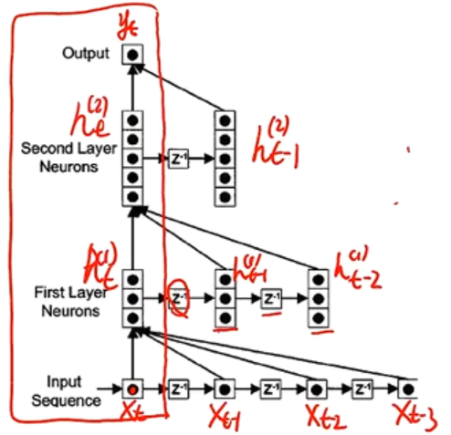

在前馈网络的非输出层都增加一个延时器，记录神经元的最近几次活性值

在第 $t$ 时刻，第 $l$ 层神经元的活性值依赖于同一时刻的输上一层的输出 $h_{t}^{(l-1)}$ 与第 $l-1$ 层的最近 $K$ 个历史信息(活性值)
$$
h_t^{(l)}=f\left(h_t^{(l-1)},h_{t-1}^{(l-1)},\cdots,h_{t-K}^{(l-1)}\right)
$$
其中，$h_t^{(l)}\in \R^{M_l}$ 表示第 $l$ 层神经元在时刻 $t$ 的活性值，$M_l$ 为第 $l$ 层神经元的数量

延时神经网络在时间维度上共享权值，以降低参数数量。因此对于序列输入来讲，延时神经网络就相当于卷积神经网络。

#### 有外部输入的非线性自回归模型

##### 自回归模型(AR)

> AutoRegressive Model：用一个变量 $h_t$ 的历史信息来预测自己

$$
h_t=w_0+\sum\limits_{k=1}^Kw_kh_{t-k}+\varepsilon_t
$$

其中 $K$ 为超参数，$w_0,w_1,\cdots,w_K$ 为可学习参数，$\varepsilon_t\sim \mathcal{N}(0,\sigma^2)$ 为第 $t$ 时刻的噪声，$\sigma^2$ 与时间无关

##### 有外部输入的非线性自回归模型

> Nonlinear AutoRegressive with Exogenous Inputs Model，NARX：是自回归模型的扩展，在每个时刻 $t$ 都有一个外部输入 $x_t$ ，产生一个输出 $h_t$

$$
h_t=f\left(x_t,x_{t-1},\cdots,x_{t-K_x},h_{t-1},h_{t-2},\cdots,h_{t-K_y}\right)
$$

其中，$f(\cdot)$ 表示非线性函数，可以是一个前馈网络

- $K_x$ ，$K_y$ 为超参数

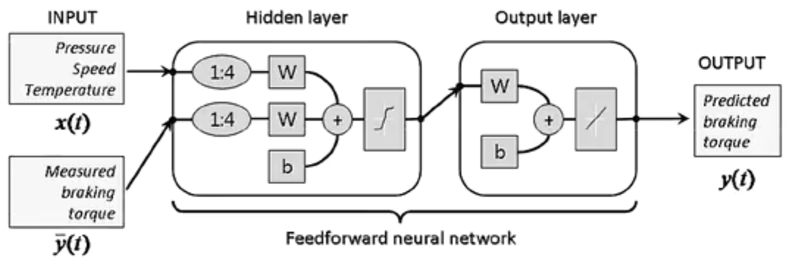

#### 循环神经网络

> Recurrent Neural Network,RNN：通过使用带自反馈的神经元，能够处理任意长度的时序数据
>
> - 区别递归神经网络：RecNN,Recursive Neural Network

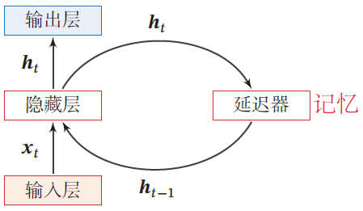

- 延时器记录神经元的最近几次活性值

给定一个输入序列 $x_{1:T}=(x_1,x_2,\cdots,x_t,\cdots,x_T)$ 
$$
h_t=f(h_{t-1},x_t)
$$
其中 $h_0=0$ ，$f(\cdot)$ 为一个非线性函数，可以是一个前馈网络

- 隐藏层的活性值 $h_t$ ，也称为状态或隐状态

循环神经网络具有短期记忆能力，相当于存储装置

##### 应用

循环神经网络比前馈神经网络更符合生物神经网络的结构

- 作为输入-输出映射：机器学习模型
- 存储器：联想记忆模型

循环神经网络被广泛应用于语音识别、语言模型以及自然语言的生成等任务上

### 2.1.2 简单循环网路

#### SRN

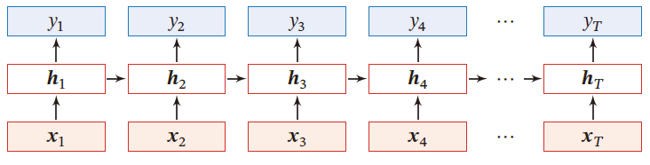

令向量 $x_t\in \R^M$ 表示在时刻 $t$ 时网络的输入，$h_t\in \R^D$ 表示隐藏层状态（隐藏层神经元活性值），$h_t$ 不仅和当前时刻的输入 $x_t$ 相关，也和上一时刻的隐藏层状态 $h_{t-1}$ 相关
$$
Z_t=Uh_{t-1}+Wx_t+b\\
h_t=f(Z_t)
$$
SRN是一个非常简单的循环神经网络，只有一个隐藏层

- 在一个两层的前馈神经网络中，连接仅存在于相邻的(输出)层与(隐藏)层之间，隐藏层结点间是无连接的

- SRN增加了隐藏层到隐藏层的反馈连接

SRN是一个既深又短的网络

- 时间维度深：梯度爆炸/消失问题
- 非时间维度短：增加模型复杂度

#### 循环神经网络的计算能力

完全连接的循环神经网络，输入为 $x_t$ ，输出为 $y_t$ 
$$
h_t=f(Uh_{t-1}+Wx_t+b)\\
\hat{y}_t=Vh_t
$$

- $h$ 为隐状态，$f(\cdot)$ 为非线性激活函数，$U,W,b,V$ 为网络超参数

##### 循环神经网络的通用近似定理

> 循环神经网络的通用近似定理：如果一个完全连接的循环神经网络有足够数量的 $sigmod$ 型隐藏神经元，它可以以任意的准确率去近似任何一个非线性动力系统
>
> - 动力系统：系统状态按一定的规律随时间变化的系统
>
>   指用一个函数来描述一个给定的状态空间中的所有点随时间的变化情况

$$
s_t=g(s_{t-1},x_t)\\
y_t=o(s_t)
$$

其中，$s_t$ 为每个时刻的隐状态，$g(\cdot)$ 是可测的状态转换函数，$x_t$ 为某时刻的外部输入，$o(\cdot)$ 为连续输出函数，且对状态空间的紧致性没有限制

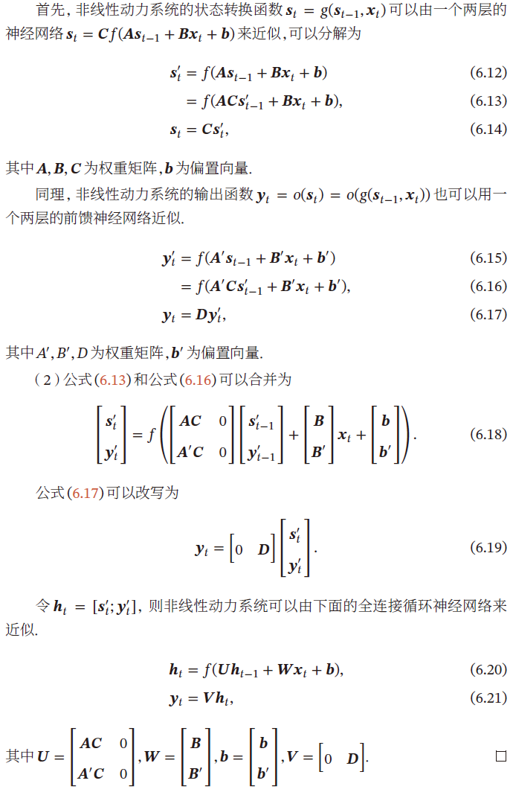

理论上，循环神经网络可以近似任意的非线性动力系统

- 前馈神经网络可以近似任何函数

- 循环神经网络可以模拟任何程序

##### 图灵完备

> 图灵完备：所有的图灵机都可以被一个由使用 $sigmod$ 型激活函数的神经元构成的全连接循环网络来进行模拟

图灵完备指一种数据操作规则，可以实现图灵机的所有功能，解决所有可计算问题

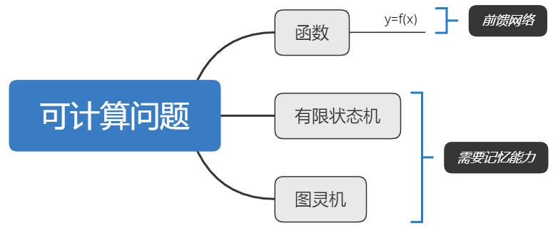

### 2.1.3 应用到机器学习

循环神经网络可以应用到很多不同类型的机器学习任务，分为三种模式：

- 序列到类别模式
- 同步的序列到序列模式
- 异步的序列到序列模式

#### 序列到类别模式

主要用于序列数据的分类问题：输入为序列，输出为类别

如：语言的情感分类

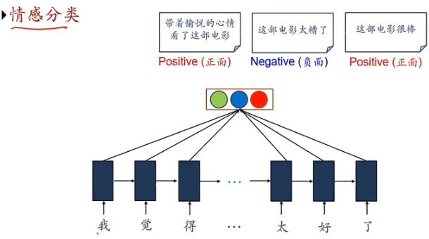

序列样本 $x_{1:T}=(x_1,\cdots,x_T)$ 为一个长度为 $T$ 的序列，输出为一个类别 $y\in \{1,\cdots,C\}$ ，将样本按不同时刻输入到RNN中，得到不同时刻的隐状态 $h_1,\cdots,h_T$ ，将 $h_T$ 作为整个序列的最终表示，输入给分类器 $g(\cdot)$ 进行分类
$$
\hat{y}=g(h_T)
$$

- 其中 $g(\cdot)$ 可以是简单的线性分类器（Logistic）或者复杂的分类器（多层前馈神经网络）

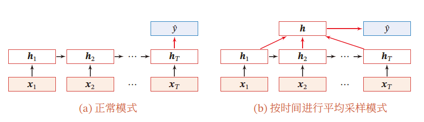

除了将最后时刻的状态作为整个序列的表示外（正常模式），还可以对整个序列的平均状态作为整个序列的表示（平均采样模式）
$$
\hat{y}=g\left(\frac{1}{T}\sum\limits_{t=1}^T\right)
$$

#### 同步的序列到序列模式

> 主要用于 **序列标注** 任务，即每一时刻的输入和输出一一对应，输入序列和输出序列的长度相同

输入为序列样本 $x_{1:T}=(x_1,\cdots,x_T)$ ，输出为序列 $y_{1:T}=(y_1,\cdots,y_T)$ 。样本按不同时刻输入到RNN中，得到不同时刻的隐状态 $h_1,\cdots,h_T$ ，每个时刻的隐状态 $h_t$ 代表了当前时刻和历史信息，并输入给分类器 $g(\cdot)$ 得到当前时刻的标签 $\hat{y}_t$
$$
\hat{y}_t=g(h_t),\forall t\in [1,T]
$$
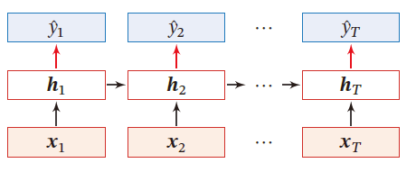

**应用**

- 词性标注问题：中文分词

  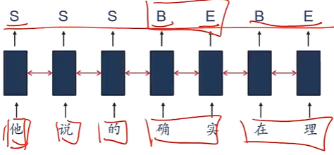

- 信息抽取：从无结构的文本中抽取结构化的信息，形成知识

  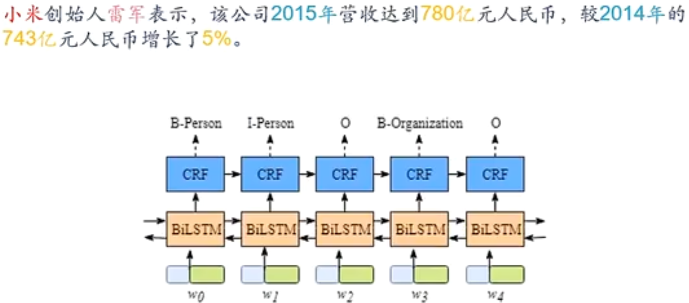

##### 异步的序列到序列模式

> 编码器-解码器模型：输入序列和输出序列不需要有严格的对应关系，也不需要保持长度相同

输入为长度为 $T$ 的序列样本 $x_{1:T}=(x_1,\cdots,x_T)$ ，输出为长度为 $M$ 的序列 $y_{1:M}=(y_1,\cdots,x_M)$ 。

一般通过 **先编码后半解码** 的方式实现

先将样本 $x$ 按不同时刻输入到一个循环神经网络（编码器）中，并得到其编码 $h_T$ 。然后再使用另一个循环神经网络（解码器）得到输出序列 $\hat{y}_{1:M}$ 

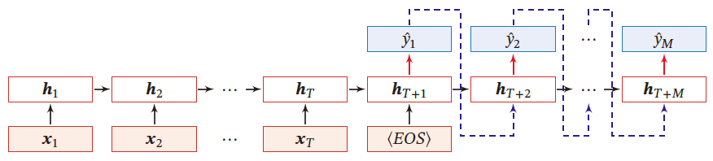

- EOS表示输入序列结束

$$
\begin{aligned}
&h_t=f_1(h_{t-1},x_t)&\quad \forall t\in [1,T]\\
&h_{T+1}=f_2(h_{T+t-1},\hat{y}_{t-1})&\quad \forall t\in [1,M]\\
&\hat{y}_t=g(h_{T+t})&\quad \forall t\in [1,M]
\end{aligned}
$$

- $g(\cdot)$ 为分类器
- $\hat{y}_t$ 为预测输出
- 解码器通常使用非线性的自回归模型，每一时刻输入为上一时刻的预测结果 $\hat{y}_{t-1}$

**应用**

如：机器翻译，输入为源语言的单词序列，输出为目标语言的单词序列

- 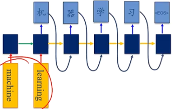

## 2.2 学习

- 参数学习
- 如何解决长程依赖问题

### 2.2.1 参数学习

循环神经网络的参数可以通过梯度下降的方法来学习

给定一个训练样本 $(x,y)$ ，其中输入为序列样本 $x_{1:T}=(x_1,\cdots,x_T)$ 为长度是 $T$ 的输入序列，$y_{1:T}=(y_1,\cdots,y_T)$ 的标签序列，即在每个时刻 $t$，都有一个有监督信息 $y_t$ 
$$
\begin{aligned}
&Z_t=Uh_{t-1}+Wx_t+b\\
&h_t=f(Z_t)\\
&\hat{y}_t=g(h_t)
\end{aligned}
$$

- 循环神经网络中存在一个递归调用的函数 $f(\cdot)$ 

时刻 $t$ 的损失函数为
$$
\mathcal{L}_t=\mathcal{L}(y_t,\hat{y}_t)=\mathcal{L}(y_t,g(h_t))
$$

- $g(h_t)$ 为第 $t$ 时刻的输出，$\mathcal{L}$ 为可微分的损失函数，如交叉熵，$g(\cdot)$ 为分类器

整个序列的损失函数为
$$
\mathcal{L}=\sum\limits_{t=1}^T\mathcal{L}_{t}
$$

关于参数 $U$ 的梯度为
$$
\frac{\partial \mathcal{L}}{\partial U}=\sum\limits_{t=1}^T\frac{\partial \mathcal{L}_t}{\partial U}
$$

#### 随时间反向传播算法

> Back Propagation Through Time,BPTT 

将循环神经网络看做一个展开的多层前馈网络，即每个时刻看做前馈网络的每一层。为了计算方便，所有层的参数都是共享的

##### 计算偏导数 $\frac{\partial \mathcal{L}_t}{\partial u_{ij}}$ 

因为参数 $U$ 和隐藏层在每个时刻 $k(1\le k\le t)$ 的净输入 $Z_k=Uh_{k-1}+Wx_k+b$ 有关，$x_k\in \R^M,h_k\in \R^D\Rightarrow Z^k\in \R^D,W\in \R^{D\times M}$ ，所以
$$
\frac{\partial \mathcal{L}_t}{\partial u_{ij}}=\sum\limits_{k=1}^t\frac{\partial Z_k}{\partial u_{ij}}\frac{\partial \mathcal{L}_t}{\partial Z_k}
$$

$$
U=\left(\begin{matrix}
u_{11}&u_{12}&\cdots&u_{1D}\\
u_{21}&u_{22}&\cdots&u_{2D}\\
\vdots&\vdots&\ddots&\vdots\\
u_{D1}&u_{D_2}&\cdots&u_{DD}
\end{matrix}
\right)\in \R^{D\times D}\\
h_{k-1}\left(\begin{matrix}
h_{(k-1,1)}\\
h_{(k-1,2)}\\
\vdots\\
h_{(k-1,D)}
\end{matrix}\right)\in \R^{D\times1}\\
可见 u_{ij} 仅与[h_{k-1}]_j有关
$$

- $\frac{\partial z_k}{\partial u_{ij}}\in\R$ ：由于分母布局，除了第 $i$ 个为 $[h_{k-1}]_j$ 外，其余全为0，即

  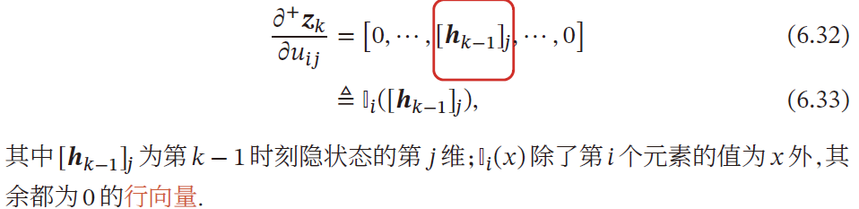

- 误差项计算 $\delta_{t,k}$

  误差项 $\delta_{t,k}\overset{\Delta}{=}\frac{\partial \mathcal{L}_t}{\partial Z_k}$ 为第 $t$ 时刻的损失对第 $t$ 时刻的隐藏神经网络的净输入 $Z_k$ 的导数
  $$
  \begin{aligned}
  \delta_{t,k}&=\frac{\partial \mathcal{L}_t}{\partial Z_k}\\
  &=\frac{\partial h_k}{\partial Z_k}\frac{\partial Z_{k+1}}{\partial h_k}\frac{\partial \mathcal{L}_t}{\partial Z_{k+1}}\\
  &=diag(f'(Z_k))U^T\delta_{t,k+1}\in\R^{D}
  \end{aligned}
  $$

合并计算 $\frac{\partial \mathcal{L}_t}{\partial u_{ij}}$ 
$$
\begin{aligned}
\frac{\partial \mathcal{L}_t}{\partial u_{ij}}&=\sum\limits_{k=1}^th^T_{k-1}diag(f'(Z_k))U^T\delta_{t,k+1}\\
&=\sum\limits_{k=1}^t[\delta_{t,k}]_i[h_{k-1}]_j\\
&=\sum\limits_{k=1}^t\left[diag(f'(Z_k))U^T\delta_{t,k+1}\right]_i[h_{k-1}]_j
\end{aligned}
$$

##### 计算 $\frac{\partial \mathcal{L}_t}{\partial U}$ 

$$
\frac{\partial \mathcal{L}_t}{\partial U}=\sum\limits_{k=1}^t\delta_{t,k}h_{k-1}^T
$$

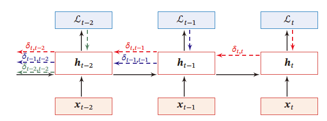

##### 参数梯度

$$
\frac{\partial \mathcal{L}}{\partial U}=\sum\limits_{t=1}^T\sum\limits_{k=1}^t\delta_{t,k}h_{k-1}^T=\sum\limits_{t=1}^T\sum\limits_{k=1}^t[diag(f'(Z_k))U^T\delta_{t,k+1}]h_{k-1}^T\\
\frac{\partial \mathcal{L}}{\partial W}=\sum\limits_{t=1}^T\sum\limits_{k=1}^t\delta_{t,k}x_{k}^T=\sum\limits_{t=1}^T\sum\limits_{k=1}^t[diag(f'(Z_k))U^T\delta_{t,k+1}]x_{k}^T\\
\frac{\partial \mathcal{L}}{\partial b}=\sum\limits_{t=1}^T\sum\limits_{k=1}^t\delta_{t,k}=\sum\limits_{t=1}^T\sum\limits_{k=1}^tdiag(f'(Z_k))U^T\delta_{t,k+1}
$$

在BPTT算法中，参数的梯度需要在一个完整的前向计算和反向计算后才能得到并进行参数更新

#### 实时循环学习算法

> Real-Time Recurrent Learning，RTRL：通过前向传播的方式来计算梯度

假设循环神经网络中第 $t$ 时刻的状态为 $h_{t}$ 

$$
\begin{aligned}
h_{t}&=f(Z_{t})=f(Uh_{t-1}+Wx_{t}+b)\\
&=f(Uf(Uh_{t-2}+Wx_{t}+b)+Wx_{t}+b)
\end{aligned}
$$
- 所以，$U$ 与 $h_{t-1}$ 都与 $u_{ij}$ 相关

关于 $u_{ij}$ 的偏导数为
$$
\begin{aligned}
\frac{\partial h_{t}}{\partial u_{ij}}&=\frac{\partial Z_{t}}{\partial u_{ij}}\frac{\partial h_{t}}{\partial Z_{t}}=\left(\frac{\partial U}{\partial u_{ij}}h_{t-1}+\frac{\partial h_{t-1}}{\partial u_{ij}}U^T\right)\frac{\partial h_{t}}{\partial Z_{t}}\\
&=\left(I_i([h_{t-1}]_j)+\frac{\partial h_{t-1}}{\partial u_{ij}}U^T\right)diag\left(f'(Z_{t})\right)\\
&=\left(I_i([h_{t-1}]_j)+\frac{\partial h_{t-1}}{\partial u_{ij}}U^T\right)\odot \left(f'(Z_{t})\right)^T
\end{aligned}
$$

- $I_{i}(x)$ 除了第 $i$ 行为 $x$ 外，其余都是0

RTRL算法从第一个时刻开始，除了计算循环神经网络的隐状态外，还需要依次向前计算偏导 $\frac{h_1}{u_{ij}},\frac{h_2}{u_{ij}},\frac{h_3}{u_{ij}},\cdots$ 

若 $t$ 时刻存在监督信息，其损失函数为 $\mathcal{L}_t$ ，可得损失函数关于参数 $u_{ij}$ 的偏导数
$$
\frac{\mathcal{L}_t}{\partial u_{ij}}=\frac{\partial h_t}{\partial u_{ij}}\frac{\partial \mathcal{L}_t}{\partial h_t}
$$
这样就可以实时计算损失函数关于参数 $U$ 的梯度，并更新参数。$W,b$ 同理

#### BTPP&RTRL

二者都是基于梯度下降的算法，分别通过前向模式和反向模式应用链式法则计算梯度

循环神经网络中，一般网络输出维度低于输入维度，BTPP的计算量会更小，但BPTT需要保存所有时刻的中间梯度，空间复杂度较高

RTRL算法不需要梯度回传，因此非常适合用于在线学习和无限序列的任务中

### 2.2.2 长程依赖问题

在BPTT算法中，将误差项展开

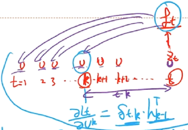
$$
\begin{aligned}
\delta_{t,k}&=diag(f'(Z_k))U^T\delta_{t,k+1}\\
&=\prod\limits_{\tau=k}^{t-1}\underbrace{\left(diag(f'(Z_\tau))U^T\right)}_{\gamma}\delta_{t,t}\\
&=\gamma^{t-k}\delta_{t,t}
\end{aligned}
$$
若 $\gamma>1$ ，当 $t-k\rightarrow \infty$ 时，$\gamma^{t-k}\rightarrow \infty$ 

- 当 $t-k$ 间隔比较大时，梯度也变得很大，造成系统不稳定，称为梯度爆炸问题

若 $\gamma<1$ ，当 $t-k\rightarrow \infty$ 时，$\gamma^{t-k}\rightarrow 0$ 

- 当 $t-k$ 间隔比较大时，梯度将变得很小，出现梯度消失问题

- 在循环神经网络中，梯度消失不是指 $\frac{\mathcal{L}_t}{\partial U}$ 消失，而是由于 $\gamma^{t-k}\rightarrow 0\Rightarrow \delta_{t,k}\rightarrow 0\Rightarrow \frac{\partial \mathcal{L}_t}{\partial h_k}\rightarrow 0$  的梯度消失了
  $$
  \frac{\mathcal{L}_t}{\partial U}=\sum\limits_{k=1}^t\delta_{t,k}h_{k-1}^T
  $$
  $\frac{\mathcal{L}_t}{\partial U}$ 是求和得到的，为0的项不影响

  即 **参数 $U$ 的更新主要靠当前时刻 $t$ 和几个相邻状态 $k$ 来更新**，长距离的状态对参数 $U$ 是没有影响的

虽然简单循环网络理论上可以建立长时间间隔的状态之间的依赖关系，但由于梯度爆炸或梯度消失问题，实际上只能学习到短期的依赖关系

简单的神经网络很难建模长距离的依赖关系，称为 **长程依赖问题**

## 2.3 模型改进

由于循环神经网络使用的非线性激活函数为 $Logistic$ 函数或 $Tanh$ 函数，其导数值都小于1，并且权重矩阵 $\Vert U\Vert$ 也不会太大，因此如果时间间隔 $t-k$ 过大，$\delta_{t,k}$ 会趋于0，因而经常出现梯度消失问题

- GRU与LSTM
- 深层循环神经网络

### 2.3.1 改进方案

最直接的方法就是选取合适的参数，同时使用非饱和的激活函数，尽量使 $\gamma\overset{\Delta}{=}diag(f'(Z_\tau))U^T\approx1$ ，但过于依赖调参经验，限制了模型的广泛使用。有效的方法是改进模型或优化方法来缓解梯度下降或梯度爆炸问题

#### 梯度爆炸

- 权重衰减：通过给参数加 $L_1$ 或 $L_2$ 范数的正则化项来限制参数的取值范围，从而使得 $\gamma\le 1$ 
- 梯度截断：当梯度的模大于一定阈值时，将它截断为一个较小的数

#### 梯度消失

- 优化算法：下一章内容

- 改变模型：如令 $U=I$ ，同时令 $\frac{\partial h_{t}}{\partial h_{t-1}}=I$ 

  当 $\gamma\overset{\Delta}{=}diag(f'(Z_\tau))U^T=1$ 时，只有 $diag(f'(Z_\tau))$ 与 $U$ 同时为 $I$ ，才能保证 $\gamma=1$ ，$diag(f'(Z_\tau))=I\iff \frac{\partial h_t}{\partial h_{t-1}}=f'\times U=f'=I$  
  $$
  h_{t}=f(Z_{t})=f(Uh_{t-1}+Wx_{t}+b)
  $$

模型修改为
$$
\begin{aligned}
h_t&=h_{t-1}+g(x_t;\theta)\\
&=h_{t-1}+\sigma(Wx_t+b)
\end{aligned}
$$

- $g(\cdot)$ 为非线性函数，$\theta$ 为参数

$h_t$ 与 $h_{t-1}$ 为线性依赖关系，且权重系数为 $I$ ，这样可以消除梯度爆炸或梯度消失问题。

但同时丢失了神经元在反馈边上的非线性激活性质

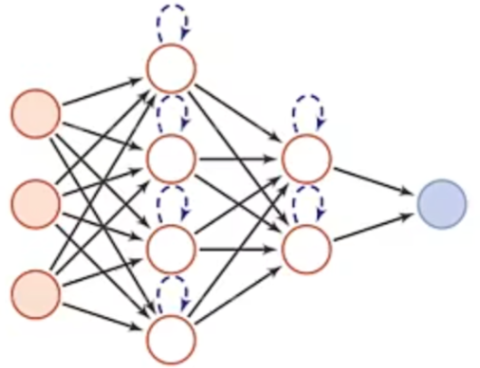

因此将模型进一步修改为
$$
\begin{aligned}
h_t&=h_{t-1}+g(x_t,h_{t-1};\theta)\\
&=h_{t-1}+\sigma(Uh_{t-1}+Wx_t+b)
\end{aligned}
$$

- 类似与残差网络的形式

同样，在计算梯度时，仍存在梯度爆炸问题

- 令 $Z_k=Uh_{t-1}+Wx_t+b,(1\le k\le t)$ ，BPTT算法中，计算误差项 $\delta_{t,k}=\frac{\mathcal{L}_t}{\partial Z_k}$ 仍可能梯度过大，导致梯度爆炸问题

此外，还存在 **记忆容量** 问题：随着 $h_t$ 的不断累计存储，会发生饱和线性。假设 $g(\cdot)$ 为 $Logistic$ 函数，随时间 $t$ 的增长，$h_t$ 会变得越来越大，从而导致 $h$ 变得饱和。随着记忆单元存储的内容越来越多，其("随机")丢失的信息也越来越多

### 2.3.2 基于门控的循环神经网络

为改善长程依赖问题，使用一种基于 **残差网络思想** 的模型修改方法，但梯度爆炸、记忆容量问题仍存在，通过引入门控机制进一步改进模型

- 门控机制：控制信息的累计速度（有选择地加入新信息，并选择地遗忘之前累计的信息）。

这类网络称为 **基于门控的循环神经网络 (Gated RNN)** 

#### 门控机制

在数字电路中，**门** 为一个二值变量 $\{0,1\}$ 

- $0$ 表示关闭状态，不允许任何信息通过
- $1$ 表示开放状态，允许所有信息通过

#### 门控循环单元网络

引入一个更新门来控制当前状态需要从历史状态中保留多少信息（不经过非线性变换），以及需要从候选状态中接收多少新信息
$$
h_t=z_t\odot h_{t-1}+(1-z_t)\odot g(x_t,h_{t-1};\theta)
$$
其中，$z_t\in [0,1]^D$ 为 **更新门** 
$$
z_t=\sigma(U_zh_{t-1}+W_zx_t+b_z)
$$
GRU网络用一个门来控制输入和遗忘之间的平衡

- 当 $z_t=0$ 时，当前状态 $h_t$ 和前一时刻的状态 $h_{t-1}$ 之间为非线性关系
- 当 $z_t=1$ 时，当前状态 $h_t$ 和前一时刻的状态 $h_{t-1}$ 之间为线性关系

在 GRU 中，函数 $g(x_t,h_{t-1};\theta)$ 定义为
$$
\tilde{h}_t\overset{\Delta}{=}\tanh\left[U_h(r_t\odot h_{t-1})+W_hx_t+b_h\right]
$$

- $\tanh()$ 斜率较大，不容易发生梯度消失问题

- $r_t\in [0,1]^D$ 为重置门，用于控制 **候选状态**  $\tilde{h}_t$ 的计算是否依赖上一时刻的状态 $h_{t-1}$ 

  $r_t=\sigma(U_rh_{t-1}+W_rx_t+b_r)$ 

  - $r_t=0$ ，候选状态 $\tilde{h}_t=\tanh(W_hx_t+b)$ 之和当前输入 $x_t$ 有关，和历史状态无关
  - $r_t=1$ ，候选状态 $\tilde{h}_t=\tanh(U_hh_{t-1}+W_hx_t+b)$ 和当前输入 $x_t$ 与历史状态 $h_{t-1}$ 都相关，与 **简单循环神经网络** 一致

综上，
$$
\begin{aligned}
h_t&=z_t\odot h_{t-1}+(1-z_t)\odot \tilde{h}_t\\
&=z_t\odot h_{t-1}+(1-z_t)\odot\tanh\left[U_h(r_t\odot h_{t-1})+W_hx_t+b_h\right]\\
\end{aligned}
$$
其中，$z_t=\sigma(U_zh_{t-1}+W_zx_t+b_z),r_t=\sigma(U_rh_{t-1}+W_rx_t+b_r)\in [0,1]$ 

- $z_t=0,r_t=1$ 时，GRU网络退化为 **简单循环网络** ，$h_t=\tanh(U_hh_{t-1}+W_hx_t+b)$
- $z_t=0,r_t=0$ 时，当前状态 $h_t$ 只和当前输入 $x_t$ 有关 $h_{t}=\tanh(W_hx_t+b)$ 
- $z_t=1$ ，当前状态等于上一时刻状态，与当前输入 $h_{t-1}$ 无关

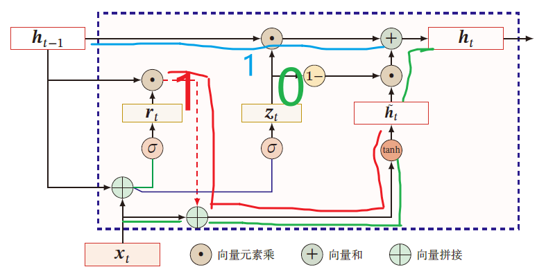

#### 长短期记忆网络

> Long Short-Term Memory Network,LSTM：有效解决简单循环神经网络的长程依赖问题

引入新的内部状态 $c_t\in \R^D$ 进行线性的循环信息传递，记录了到当前时刻为止的历史信息，同时非线性地将信息给隐藏层 $h_t\in \R^D$ 
$$
\begin{aligned}
\tilde{c}_t&=\tanh(U_ch_{t-1}+W_cx_t+b_c)\\
c_t&=f_t\odot c_{t-1}+i_t\odot \tilde{c}_t\\
h_t&=o_t\odot \tanh(c_t)
\end{aligned}
$$

- 遗忘门 $f_t\in[0,1]^D$ ：控制上一时刻的内部状态 $c_{t-1}$ 遗忘多少信息
  $$
  i_t=\sigma(U_ih_{t-1}+W_ix_{t-1}+b_i)
  $$

- 输入门 $i_t\in [0,1]^D$ ：控制当前输入状态 $\tilde{c_t}$ 有多少信息保存
  $$
  f_t=\sigma(U_fh_{t-1}+W_fx_{t-1}+b_f)
  $$
  $\tilde{c}_t$ 仍和上一时刻的历史信息有关
  
- 输出门 $o_t\in [0,1]^D$ ：控制当前时刻的内部状态 $c_t$ 有多少信息需要输出给外部状态 $h_t$ 
  $$
  o_t=\sigma(U_oh_{t-1}+W_ox_{t-1}+b_o)
  $$

LSTM网络中的门是一种软门，取值在 $(0,1)$ 之间，表示允许信息以一定比例通过

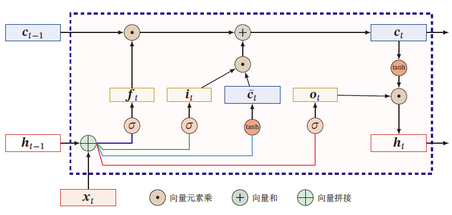

- 当 $f_t=0,i_t=1$ 时，记忆单元将历史信息清空，并将候选状态 $\tilde{c_t}$ 写入

- 当 $f_t=1,i_t=0$ 时，记忆单元将上一时刻的外部状态，不再写入新的信息

通过LSTM循环单元，整个网络可以建立较长距离的时序依赖关系
$$
\left[\begin{matrix}
\tilde{c}_t\\
o_t\\
i_t\\f_t
\end{matrix}
\right]=\left[\begin{matrix}
\tanh\\
\sigma\\
\sigma\\
\sigma
\end{matrix}
\right]\left(
W\left[
\begin{matrix}
x_t\\
h_{t-1}
\end{matrix}
\right]+b
\right)\\
c_t=f_t\odot c_{t-1}+i_t\odot \tilde{c}_t\\
h_t=o_t\odot\tanh(c_t)
$$
其中，$x_t\in \R^M$ 为当前时刻的输入，$W\in\R^{4D\times (M+D)}$ ，$b\in \R^{4D}$ 为网络参数

##### 记忆

循环神经网络的隐状态 $h_t$ 存储了历史信息，可以看做一种 **记忆** 

在简单循环网络中，隐状态每个时刻都会被重写，因此可以看做一种 **短期记忆**
$$
\begin{aligned}
&Z_t=Uh_{t-1}+Wx_t+b\\
&h_t=f(Z_t)\\
&\hat{y}_t=g(h_t)
\end{aligned}
$$
**长期记忆** 可以看作网络参数，隐含了从训练数据中学到的经验，其更新周期要慢于短期记忆

在LSTM网络中，记忆单元 $c$ 可以在某个时刻捕捉到某个关键信息，并有能力将此关键信息保存一定时间间隔

- 记忆单元 $c$ 中保存的信息的生命周期要长于短期周期 $h$ ，又远远短于长期记忆，称为 **长短期记忆**

##### 参数更新

在LSTM网络中，过小的值会使得遗忘门的值较小，意味着前一时刻大部分信息都被丢掉了，这样网络很难捕捉长距离的依赖信息，并且相邻时间间隔的梯度变得非常小，导致梯度消失问题

在LSTM中，参数初始值一般设置比较大，$b_f$ 设为 $1$ 或 $2$

##### LSTM网络的变体

**无遗忘门的LSTM** 
$$
c_t=c_{t-1}+i_t\odot\tilde{c}_t
$$
记忆单元 $c$ 会不断增大，当输入序列的长度非常大时，记忆单元容量会饱和

**peephole连接**
$$
i_t=\sigma(U_ih_{t-1}+W_ix_t+V_ic_{t-1}+b_i)\\
f_t=\sigma(U_fh_{t-1}+W_fx_t+V_fc_{t-1}+b_f)\\
o_t=\sigma(U_oh_{t-1}+W_ox_t+V_oc_{t-1}+b_o)
$$
其中 $V_i,V_f,V_o$ 为对角矩阵

**耦合输入门和遗忘门**

LSTM网络中输入门和遗忘门有些互补关系，为减小冗余与LSTM计算复杂度，将这两个门合并
$$
c_t=(1-i_t)\odot c_{t-1}+i_t\odot\tilde{c}_t
$$

## 2.4 扩展形式

- 深层循环神经网络
- 扩展到图结构

### 2.4.1 深层循环神经网络

RNN在时间维度上，长时间间隔的状态之间的路径很长，即在时间维度上很深

RNN在同一时刻网络输入到输出之间的路径 $x_t\rightarrow y_t$ 很短，即在非时间维上很短

增加循环网络的深度主要是增加同一时刻网络输入到输出的路径，如增加输入到隐状态 $x_t\rightarrow h_t$ 以及隐状态到输出 $h_t\rightarrow y_t$ 之间路径的深度

#### 堆叠循环神经网络

(Stacked Recurrent Neural Network)：也称循环多层感知器

定义 $h^{(l)}_t$ 为在时刻 $t$ 时第 $l$ 层的隐状态
$$
h_t^{(l)}=f(U^{(l)}h_{t-1}^{(l)}+W^{(l)}h_t^{(l-1)}+b^{(l)})
$$

- 其中，$h_t^{(0)}=x_t$

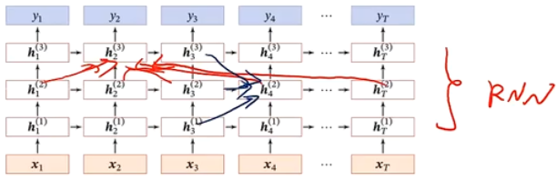

#### 双向循环神经网络

一个时刻的输出不但和过去时刻的信息有关，也和后续时刻的信息有关

- 比如给定一个句子，其中一个词的词性由它的上下文决定，即包含左右两边的信息

 (Bidirectional Recurrent Neural Network,Bi-RNN)：由两层循环神经网络组成，输入相同，只是信息传递方向不同，输出与每个时刻的前向信息与后向信息都有关

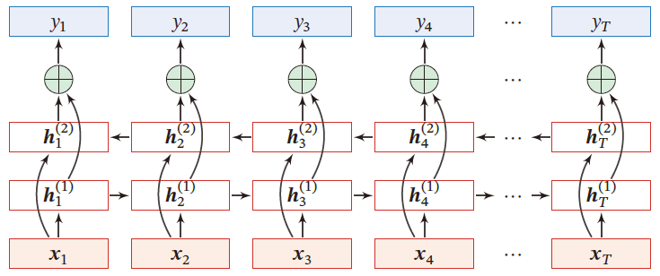
$$
h_t^{(1)}=f(U^{(1)}h_{t-1}^{(1)}+W^{(1)}x_t+b^{(1)})\\
h_t^{(2)}=f(U^{(2)}h_{t+1}^{(2)}+W^{(2)}x_t+b^{(2)})\\
h_t=h^{(1)}_t\oplus h_t^{(2)}
$$

### 2.4.2 扩展到图结构

循环神经网络将每个时刻的隐状态 $h_t$ 看过一个节点，在时间维度上这些节点构成一个链式结构，将 **消息传递** 的思想扩展到树、图结构上

#### 递归神经网络

> 在循环神经网络的 **有向无环图** (树) 上的扩展

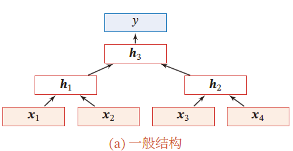

对于一个节点 $h_t$ 接收来自父节点集合 $\pi_t$ 中所有节点的消息，并更新自己状态
$$
h_i=f(h_{\pi_i})
$$
其中，$h_{\pi_i}$ 表示集合 $\pi_i$ 中所有节点状态的拼接，$f(\cdot)$ 是一个和节点位置无关的非线性函数
$$
h_1=\sigma\left(
W\left[\begin{matrix}
x_1\\x_2
\end{matrix}
\right]+b
\right)\\
h_1=\sigma\left(
W\left[\begin{matrix}
x_3\\x_4
\end{matrix}
\right]+b
\right)\\
h_3=\sigma\left(
W\left[\begin{matrix}
h_1\\h_2
\end{matrix}
\right]+b
\right)\\
y=g(W'h_3+b')
$$
当递归神经网络退化为线性序列结构，等价于简单循环神经网络

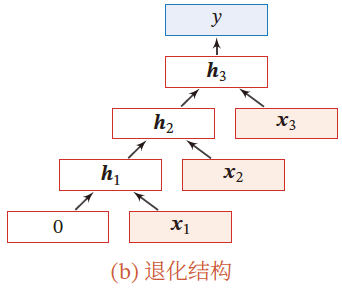

**应用**

自然语言的句法结构

- 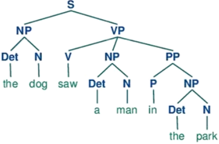

递归神经网络主要用于建模自然句子的语义，给定一个句子的语法结构，可以使用递归神经网络来按照句法的组合关系来合成一个句子的语义。句子的短语成分又可以是一些子成分，即短语的语义都可以由其子成分语义组合而来，进而整合成整句的语义

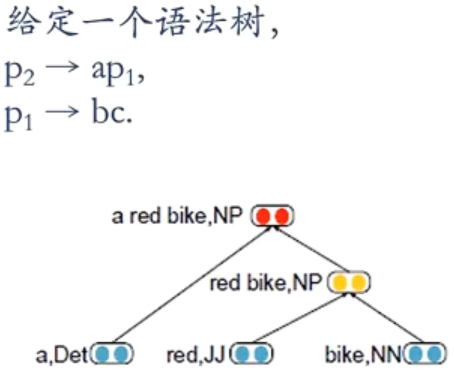
$$
p_1=f\left(W\left[
\begin{matrix}
b\\c
\end{matrix}
\right]\right)\\
p_2=f\left(W\left[
\begin{matrix}
a\\p_1
\end{matrix}
\right]\right)
$$
同样，也可以用门控机制改进递归神经网络中的长程依赖问题

- 树结构的长短期记忆模型

#### 图神经网络

在实际应用中，很多数据是图结构的，比如知识图谱、社交网络、分子网络等。但前馈网络和反馈网络很难处理图结构的数据

> 图神经网络是（GNN）将消息传递的思想扩展到图结构数据上的神经网络

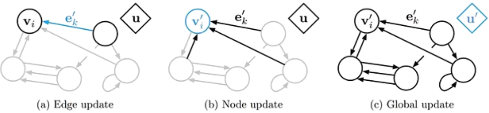

对于任意的图结构 $G(\mathcal{V},\varepsilon)$ ，$\mathcal{V}$ 表示节点集合，$\varepsilon$ 表示边集

两个节点间的边表示节点间的依赖关系。节点间的依赖可以有向，也可以无向

图中，每个节点 $v$ 都可以用一组神经元来表示其状态 $h^{(v)}$ ，初始状态为输入特征 $x^{(v)}$ 

每个节点接收来自邻接节点的消息，并更新自己的状态
$$
m_t^{(v)}=\sum\limits_{u\in \mathcal{N}(v)}f\left(h_{t-1}^{(v)},h_{t-1}^{(u)},e^{(u,v)}\right)\\
h_t^{(v)}=g\left(h_{t-1}^{(v)},m_t^{(v)}\right)
$$
$\mathcal{N}(v)$ 表示结点 $v$ 的邻居，$e^{(u,v)}$ 表示从节点 $h^{(u)}$ 到 $h^{(v)}$ 方向上的输入特征

上述为同步描述，

对于有向图来说，使用异步更新方式效率高（循环神经网络或递归神经网络），在整个图更新 $T$ 次后，通过一个读出函数得到整个网络的表示
$$
o_t=g\left(\{h_T^{(v)}\vert v\in \mathcal{V}\}\right)
$$

## 2.5 应用

#### 生成语言模型

自然语言理解：一个句子的可能性，合理性

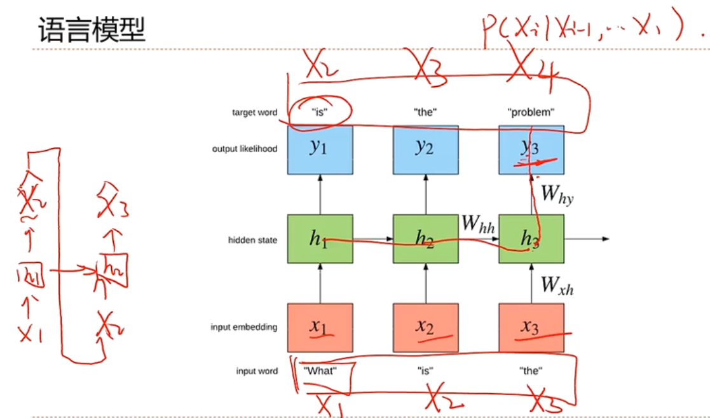

#### 作词机

#### 机器翻译

**传统统计学习机器翻译**

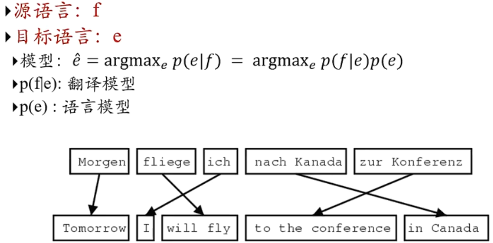

**基于序列到序列的机器翻译**

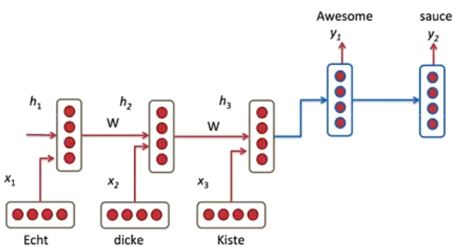

- 一个RNN用来编码
- 一个RNN用来解码

#### 看图说话

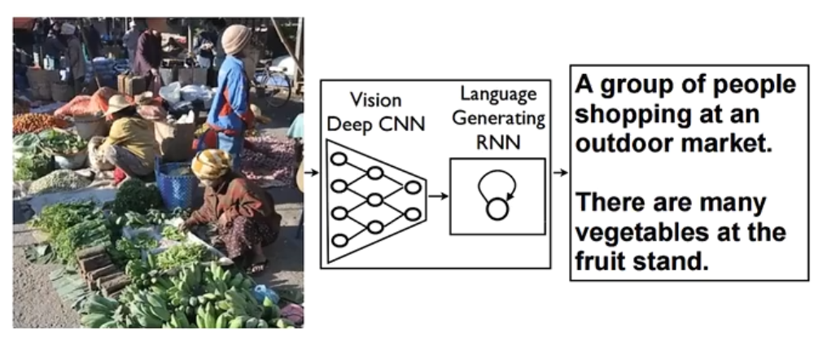

#### 写字

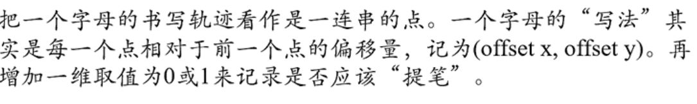

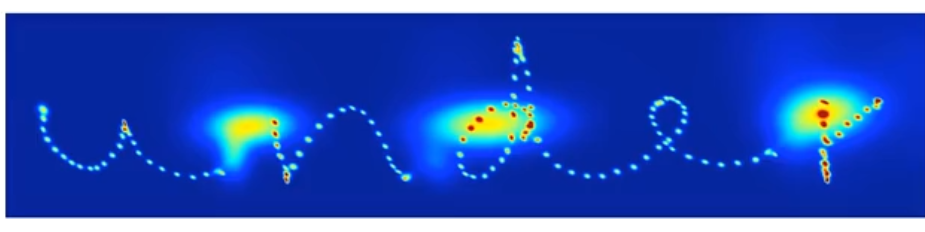

#### 对话系统

