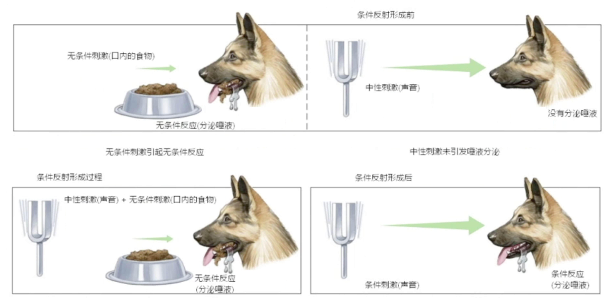

[TOC]

<!--more-->

## 1.1 强化学习概要

### 1.1.1 强化学习模型基本结构

强化学习研究的是智能体与环境交互的问题，**学习目标是使环境反馈的累积奖励最大化的动作生成策略**。智能体的训练过程就是使智能体获取智能的过程，在学习过程中，智能体(Agent)和环境(Environment)一直在交互。

- 智能体在环境中获取某个状态(State)后，会基于当前策略及该状态输出一个动作(action)，也称为决策(decision)。
- 该动作在环境中会被执行，环境会输出下一个状态及当前动作带来的奖励。
- 奖励是由环境给出的一种标量的反馈信号，奖励会显示智能体在某一步采取某个策略的表现如何。

智能体根据反馈的奖励即时调整策略尽可能多地从环境获取累积奖励。

#### 对强化的理解

##### 巴甫洛夫的条件反射实验

小狗会对盆里面的食物无条件产生刺激，分泌唾液。一开始小狗对于铃声这种中性刺激是没有反应的，可是我们把铃声和食物结合起来，每次先给它响一下铃，再给它喂食物，多次重复之后，当铃声响起的时候，小狗也会开始流口水

##### 强化

盆里的肉可以视为强化学习里延迟的奖励，声音的刺激可以认为是有奖励那个状态之前的状态。多次实验后，最后的奖励会强化小狗对于铃声的条件反射。

当某个中性状态和有奖励状态相邻且反复出现时，中性状态也变得有价值，我们称这种中性状态与奖励状态在时间上的结合称为 **强化** 。强化次数越多，条件反射越巩固

当一种条件反射稳定后，可以用另外一种新的刺激与该条件反射结合形成第二级条件反射，同样可以形成多级条件反射

#### 强化过程可视化

##### 网格世界

