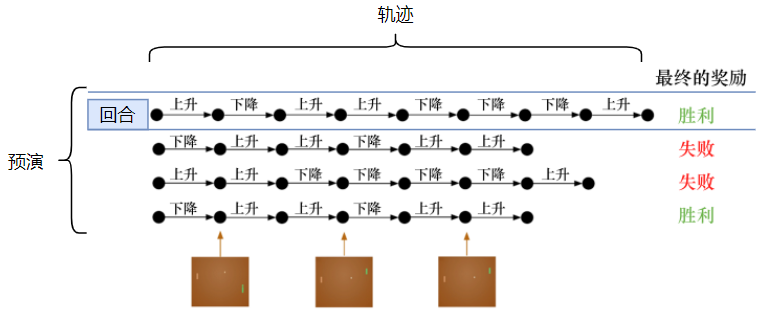
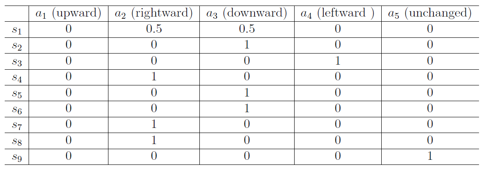

[TOC]

<!--more-->

强化学习是交叉学科，涉及：

- 计算机科学；AI；ML
- 最优控制；动态规划(Dynamic Programming)；自适应动态规划
- 心理学
- 神经科学

强化学习（RL）源于机器学习领域，一般属于无模型方法，多用于解决随机系统（状态/奖励转移随机）问题；

模型预测控制（MPC）源于自动控制领域，一般属于有模型方法，多用于解决确定系统（状态/奖励转移确定）问题

- RL为整个状态空间寻找最优策略
- MPC为每个状态寻找最优决策

## 1.1 强化学习是一种最优控制问题的求解算法

强化学习面向 **序列决策任务** （seequential decision making）

- 预测任务：仅针对输入产生一个预测输出，并希望预测输出与未来的真实输出一致，且这个预测输出并不会改变未来的真实输出——有监督学习
- 序列决策任务：针对输入产生的决策会改变未来的真实输出，并希望决策序列使标量化的学习目标最大化——强化学习

### 1.1.1 RL范式

强化学习用智能体表示产生决策的机器，智能体不仅能感知环境，还能通过决策改变环境

智能体与环境的每一轮交互中：智能体感知到环境目前的状态 $s$ ，经过计算给出本轮决策 $a$ ；环境得到智能体的动作后，产生相应的即时奖励 $r$ 并发生状态转移 $s'$。

#### 智能体

三要素

- 感知：智能体能感知环境当前的状态（对原始的环境状态转换为智能体能理解的环境表征）
- 决策：智能体根据当前状态计算出最大化学习目标需要采取的动作的过程（计算依据是要学习的策略）
- 奖励：环境采取智能体产生的决策后发生状态转移，根据状态之间的差异智能体会得到环境对当前决策好坏的评价

#### 环境

环境是动态的，用随机过程来刻画，随机过程中关键要素是状态以及状态转移的条件概率分布
$$
s'\sim P(\cdot\vert s,a)
$$
与面向决策任务的智能体进行交互的环境是一个动态的随机过程，其状态分布由环境当前状态和智能体决策共同决定，随机性体现在两方面

- 智能体决策的随机性
- 环境基于当前状态和决策得到下一状态的随机性

智能体在与环境交互的过程中更新自己产生决策的策略，因此，在动态随机过程的环境中学习相当于使用数据分布不固定的数据进行学习

### 1.1.2 学习目标

智能体与环境的每次交互都会产生标量的即时奖励信号 $r$ ，用以评价最近一次决策或状态的好坏

整个交互过程中对每轮的奖励信号进行累加，形成智能体的整个交互过程的回报 $G_t$ 。

由于环境是动态的，即使环境初始状态、智能体策略不变，最终得到的回报也是不同的，所以在RL的学习目标中，我们关注的是回报的期望——价值。

**RL学习目标是寻找使价值最大化的决策生成策略**

1. 智能体从环境中获取某个状态(State)及上个动作的奖励，根据奖励好坏调整策略，基于当前策略输出一个动作(action)，也称为决策(decision)。

2. 该动作在环境中会被执行，环境会输出下一个状态及当前动作带来的奖励。

### 1.1.3 RL中的数据

**无数据，必须有模型**

**无模型，必须有数据** 

#### 序列数据

将当前的智能体与环境交互，会得到一系列观测，每个观测可以看做一条 **轨迹**  

**轨迹(trajectory)** ：环境的状态及采取的动作序列
$$
\tau=\{s_0,a_0,s_1,a_1,\cdots,s_{T-1},a_{T-1}\}
$$
基于当前策略从环境状态 $s_0$ 直至得到的最终奖励(eventual reward)称为一个 **回合** (episode) 或 试验(trial)

- 是否有终止状态

  - 有终止状态(terminate state)：回合

  - 无终止状态：无限持续任务或长时间任务，可以近似为连续任务

- 统一表示：
  - 对于终止状态，策略为无论什么动作，都会进入终止状态
  - 将终止状态视为普通状态，奖励为 $+1$ ，会始终累计正向奖励

| 有监督学习                                       | 强化学习                                           |
| ------------------------------------------------ | -------------------------------------------------- |
| $样本池\{\underbrace{(样例,标记)}_{样本/示例}\}$ | $预演\{\underbrace{(轨迹,最终奖励)}_{回合/试验}\}$ |

#### 强化学习中的数据分布——占用度量

归一化的占用度量：衡量智能体的一个策略在于环境交互的过程中，采样到某个特定 *状态-动作* 对的概率分布

强化学习的策略在训练过程中会不断更新，其序列数据的数据分布（占用度量）也会相应地改变。强化学习的一个难点在于智能体看到的数据分布是随着智能体策略的更新而不断发生改变的

奖励建立在 *状态-动作* 对之上，一个策略的价值等价于奖励函数在策略的占用度量上的期望，即 $V_{策略}=E_{(状态,动作)\sim 策略的占用度量}\left[奖励函数(状态,动作)\right]$

寻找最优策略对应着寻找最优占用度量（使奖励函数最大化的数据分布）

### 1.1.4 监督学习与强化学习区别

|            | 监督学习                                                     | 强化学习                                                     |
| ---------- | ------------------------------------------------------------ | ------------------------------------------------------------ |
| 有无标签   | 数据有标签                                                   | 数据无标签：智能体并不知道每一步的正确动作是什么，只能通过不停地尝试发现最有利的动作 |
| 数据间关系 | 数据间独立同分布                                             | 序列数据，数据间有关联，下一动作与上一动作的奖励与环境状态有关 前一个动作(数据)会影响下一个动作(数据)的产生。 在训练过程中，通过正在学习的智能体与环境交互得到新的数据，若无法保证智能体产生的动作稳定提升，则整个训练过程会失败 |
| 奖励时效   | 立即反馈误差：训练过程中，对于一个数据的预测输出，会立即得到与真实标记的误差 | 延迟奖励：只能等整个动作序列结束后，通过最终奖励反推单步动作奖励 |
| 数据分布   | 从特定的数据分布中采样得到训练数据集，训练数据集背后的数据分布完全不变 | 智能体策略不同，与环境交互产生的数据分布就不同               |
| 训练过程   | 优化目标函数对于训练数据的输出来优化目标，即修改目标函数并不改变数据分布 | 修改策略调整智能体与环境交互数据的分布，即修改数据分布而目标函数不变 |
| 优化目标   | 找一个在整个数据分布上泛化误差最小的目标函数： $最优模型=\arg\min\limits_{模型}E_{(特征,标签)\sim 数据分布}\left[损失函数(标签,模型预测标签)\right]$ | 找一个最优策略，使其在与动态环境的交互过程中产生最优的数据分布，进而最大化指定奖励函数的期望： $最优策略=\arg\max\limits_{策略}E_{(状态,动作)\sim 策略的占用度量}\left[奖励函数(状态,动作)\right]$ |

### 1.1.5 RL中的基本问题

#### 学习和规划

**学习和规划是序列决策的两类基本问题** 

**学习** ：环境初始是未知的，智能体不知道环境如何工作，通过不断地与环境交互，逐渐改变策略

在 **规划** 中，环境是已知的，智能体被告知了整个环境运作规则的详细信息（不需要实时地与环境交互就能知道未来环境，只需要知道当前状态，就能开始思考，来寻找最优解）

- 先学习环境如何变化，然后利用学到的环境模型进行规划

#### 试错-探索-利用

智能体的目的是基于策略选取一系列动作使获得的累积奖励最大化，所以选取的动作必须有长期的影响。但这个过程中，奖励是被延迟的，在一个回合结束，才知道这一步产生了什么样的影响。所以序列决策过程的一个重要课题就是 **近期奖励和长期奖励** （探索和利用）的权衡，研究如何让智能体取得更多的长期奖励。

通过 **试错-探索** ，获取对环境的理解

##### 探索和利用

强化学习的训练过程是对 **探索**(exploration) 和 **利用**(exploitation) 的不断权衡的过程。

- 探索指尝试新的动作，每个动作对应的奖励来自概率分布，即新动作的奖励好坏并不知道，只能通过多次试错来获取每个动作的期望奖励值。但探索有试错代价，可能存在没有正向收益的探索
- 利用指采取已知的可以获得最多奖励的动作，重复这个动作可以保证一定的累计奖励，但利用已知最大奖励未必是真正的最优奖励

所以需要权衡问题，**如何通过牺牲一些短期奖励来理解环境，从而学习到更好的策略**

##### 多臂赌博机——探索利用窘境

强化学习任务的最终奖励在多步动作之后才能观察到，所以采取简单的贪心策略：最大化单步奖励

单步强化学习任务对应于一个理论模型：K-臂赌博机

与RL问题的区别在于其与环境的交互并不会改变环境，可看做一种无状态强化学习

- **仅探索**：将所有的尝试机会平均分配给每个摇臂(轮流按下每个摇臂)，最后每个摇臂平均吐币概率作为奖励期望的近似估计
- **仅利用** ：按目前最优的(目前为止平均奖励最大的摇臂)，若有多个摇臂同为最优，则从中随机选取一个

仅探索可以很好地估计每个摇臂的奖励，但会失去很多选择最优摇臂的机会

仅利用没有很好地估计每个摇臂期望奖励，很可能经常选不到最优摇臂

因为尝试次数有限，想要累计奖励最大，则必须在探索与利用之间达成较好的折中

[见实验部分]

## 1.2 智能体

### 1.2.1 智能体组成

- 策略(policy)：智能体会用策略来选取下一步的动作（生成决策）
- 价值函数(value function)：用价值函数对当前状态进行评估，价值大小取决与环境进入当前状态后，对后面的累积奖励有多大影响，价值越大，说明智能体进入这个状态越有利
- 模型(model)：模型表示智能体对环境的状态进行理解，决定了智能体中世界的运行方式

#### 策略

策略是智能体的动作模型，决定了智能体的动作，将输入的状态变为动作

- 随机性策略(stochastic policy)：$\pi(a\vert s)=P(a_t=a\vert s_t=s)$ ，输入一个状态 $s$ ，输出当前状态下所有动作的概率，然后对这个概率分布采样，可得到智能体最终采取的动作

  通常情况，强化学习采取随机性策略，在学习是引入一定的随机性可以更好地探索环境；随机性策略的动作具有多样性

- 确定性策略(deterministic policy)：智能体直接采取最有可能的动作，即 $a^*=arg\max\limits_{a}\pi(a\vert s)$ 

  采取确定性策略，对同样状态总是采取相同的动作

#### 价值函数

价值函数是在当前策略下的状态或动作对未来的折扣奖励

在策略 $\pi$ 下的状态价值
$$
V_\pi(s)=E_\pi[G_t\vert S_t=s]=E_\pi\left[\sum\limits_{k=0}^\infty\gamma^kr_{t+k+1}\vert S_t=s\right]，对于所有的s\in S
$$
在策略 $\pi$ 下的动作价值
$$
Q_\pi(s,a)=E_\pi[G_t\vert S_t=s,A_t=a]=E_\pi\left[\sum\limits_{k=0}^\infty\gamma^kr_{t+k+1}\vert S_t=s,A_t=a\right]
$$
Q函数是强化学习算法要学习的函数，当得到Q函数后，某个状态下的最优动作通过Q函数得到

#### 模型

模型决定了下一步状态，下一步状态取决于当前采取的状态和当前采取的动作，由状态转移概率和奖励函数两部分组成

状态转移概率
$$
P_{s\xrightarrow{a}s'}=P(S_{t+1}=s'\vert S_t=s,A_t=a)
$$
奖励函数指在当前状态下采取某个动作，可以得到多大的奖励，即
$$
R(s,a)=E[r_{t+1}\vert S_t=s,A_t=a]
$$

### 1.2.2 智能体分类

#### 按决策方式分类

**决策方式** ：智能体在给定状态下从动作空间中选择一个动作的依据

##### 基于价值的智能体

value-based agent：显式地学习价值函数，隐式地学习其策略，通过价值函数可以推算出策略

利用价值函数作为导向，每个状态会返回一个价值，通过学习价值的不同，可以抽取出现在最佳的策略

##### 基于策略的智能体

policy-based agent：直接学习策略，给智能体一个状态，会直接输出对应动作的概率。

当学习好环境后，在每一个状态，我们都能得到一个最佳动作

##### 演员-评论家智能体

actor-criticagent agent：通过学习策略函数和价值函数以及两者的交互得到最佳的动作

##### 对比

|          | 基于策略的方法                                               | 基于价值的方法                                               | A-C算法                                                      |
| -------- | ------------------------------------------------------------ | ------------------------------------------------------------ | ------------------------------------------------------------ |
| 显式策略 | 智能体会制定一套动作策略，即确定在给定状态下需要采取何种动作 | 不需要制定显式策略，维护一个价值表格或价值函数，并通过这个价值表格或价值函数来选取价值最大的动作 | 同时采用策略和价值评估来做出决策                             |
| 优化     | 强化学习算法直接对策略进行优化，使制定的策略能获得最大的奖励 |                                                              | 智能体根据策略做出动作，同时价值函数会给出动作的价值，在原有的策略梯度算法基础上加速学习过程 |
| 动作空间 | 适用于离散、连续动作空间                                     | 只适用于离散动作空间，不适用于动作规模庞大、动作连续的场景(如机器人控制) |                                                              |
|          | 策略梯度算法(policy gradient, PG)                            | Q-learning、Sarsa                                            |                                                              |

#### 按有无模型分类

强化学习是一个与时间相关的序列决策问题，可以用马尔科夫决策过程来定义强化学习任务

在一个马尔科夫决策过程中，用状态转移概率 $P(s_{t+1},r_{t+1}\vert s_t,a_t)$ 表示在状态 $s_t$ 时选择动作 $a_t$ 时转移到状态 $s_{t+1}$ ，并且获得奖励 $r_{t+1}$ 的概率。状态、动作、状态转移概率和奖励构成了MDP的四元组 $<S,A,P,R>$ 

在MDP中，我们用状态转移概率和奖励函数 $P(s_{t+1},r_{t+1}\vert s_t,a_t)$ 描述环境，用以表示环境的随机性，也即(环境)模型

##### 有模型学习

若已知MDP的所有状态以及每个状态的奖励情况，且状态集合和动作集合在有限步内是有限集，则视为环境已知

智能体可以对真实环境进行建模，可以将这些可能的动作与可能的状态转移关系画为状态转移树

当智能体知道状态转移概率和奖励函数 $P(s_{t+1},r_{t+1}\vert s_t,a_t)$ 后，就能知道在某一状态下执行某一动作后能带来多大的奖励和环境的下一状态，不需要在真实环境中采取动作，直接在虚拟世界中 **学习和规划** 即可。

在智能体与环境的一个交互(回合)中，智能体只能走一条完整的通路(轨迹)。一个轨迹中包含了一个序列决策过程，与环境的多次交互就产生了经验。

在已知奖励的情况下，利用这些经验，我们可以使用蒙特卡洛方法、动态规划方法、时序差分方法来寻找最佳策略，实现强化学习的目标

基于动态规划算法的方法有策略迭代/价值迭代来寻找最佳策略

##### 免模型学习

免模型的方法中，环境是未知的，即一系列决策的概率函数和奖励函数都是未知的。

智能体只能在真实环境中通过一定的策略来执行动作，通过不断的 试错-探索-利用，等待奖励和状态迁移，然后根据反馈信息来更新动作策略，反复迭代直到找到最优策略

在RL中用价值函数 $V(s)$ 表示状态的好坏，用动作价值函数 $Q(s,a)$ 来判断在什么状态下采取什么动作能取得最大的累积奖励

##### 对比

**二者联系** ：有模型强化学习只比免模型强化学习方法多 对真实环境建模 这一步。很多有模型的方法也能应用于无模型的方法中

|        | 免模型(model-free)                                           | 有模型(model-based)                                          |
| ------ | ------------------------------------------------------------ | ------------------------------------------------------------ |
| 数据   | 免模型强化学习属于数据驱动型，需要大量的采样来估计状态、动作及奖励函数，从而优化动作策略 | 有模型的DRL可以在虚拟世界中进行训练，一定程度上缓解训练数据匮乏的问题 |
| 想象力 | 智能体只能一步一步采取策略，等到真实环境的反馈               | 智能体可以在虚拟世界中预测出将要发生的事，并采取对自己最有利的策略 |
|        |  |  |

目前大多数DRL采用免模型强化学习：

- 免模型强化学习方法更简单、直观、有开源材料
- 有模型强化学习泛化性有限：需要对真实环境建模，虚拟世界与真实环境之间可能存在差异
- 目前研究中，大部分环境都是静态的、确定的问题并不需要评估状态转移函数和奖励函数，可直接采取免模型强化学习，直接用大量样本进行训练就能取得很好效果

## 1.3 强化过程的理解

### 1.3.1 巴甫洛夫的条件反射实验

小狗会对盆里面的食物产生无条件反应——分泌唾液。一开始小狗对于铃声这种中性刺激是没有反应的，当我们把铃声和食物结合起来，每次先给它响一下铃，再给它喂食物，多次重复之后，小狗会对铃声产生条件反应——分泌唾液

#### 强化

盆里的肉可以视为强化学习里的延迟奖励，声音的刺激可以认为是有奖励状态之前的状态。多次实验后，最后的奖励会强化小狗对于铃声的条件反射。

当有奖励状态和某个中性状态相邻且反复出现时，中性状态也变得有价值，我们称这种中性状态与奖励状态在时序上的结合称为 **强化**。强化次数越多，条件反射越稳定

当一种条件反射稳定后，可以用另外一种新的刺激与该条件反射结合形成第二级条件反射，同样可以形成多级条件反射

### 1.3.2 强化过程直观理解

#### 网格世界中的强化学习概念

状态：网格，$s_1,s_2,\cdots$ 

- 网格：起点/可达网格(白色)、不可达网格(灰色)、目标网格、边界

  - 不可达网格

    - 可进入，但会有惩罚
      $$
      s_1\xrightarrow{a_1}s_2
      $$
      这种情况下，是为了考虑对于短期惩罚大，但长期看更快到达目标网格的冒险策略

    - 不可进入
      $$
      s_1\xrightarrow{a_1}s_1
      $$

- 状态空间：状态的集合 $\mathcal{S}=\{s_i\}_{i=0}^N$ 

约束：边界、避免冗余动作(绕弯)

动作(网格中箭头)：每个状态，可能进行的操作集合

- 动作空间：所有有效动作的集合 $\mathcal{A}(s)=\{a_i\}_{i=1}^{N_{\mathcal{A}(s)}}$  
  - 离散动作空间：智能体的动作数量是有限的
  - 连续动作空间：动作是实值的向量

奖励：有些格子左下角有奖励 $R$ ，只有中心的格子奖励是 $+1$ ，有些格子奖励是 $-1$ ，其余格子奖励为 $0$ 

- 奖励设置

  - 智能体越过边界，则 $R=-1$

  - 智能体进入不可达网格，则 $R=-1$

  - 智能体进入目标网格，则 $R=+1$

  - 否则，奖励为 $R=0$ 

- 奖励是状态与动作的函数，$R(s,a)$ 

- 表格表示：状态-动作-奖励 表格

  

  只适用于确定性策略

- 条件概率表示
  $$
  P(R=r_2\vert s_t=s_1,A_t=a_1)
  $$

状态转移：当采取一个动作时，智能体能从一个状态转移到另一个状态，这个过程称为状态转移
$$
s_1\xrightarrow{a_1}s_2
$$

- 撞墙之后，可以弹到任意网格（即可能是任意状态）

- 表格表示：使用 *状态-动作* 表格可以描述状态转移

  但实际应用中应用不大，只能表示确定性的状态转移

- 条件概率表示：
  $$
  P(s_2\vert s_1,a_1)=p
  $$

策略：告诉智能体，在哪个状态采取哪些动作

- 策略执行：假设某状态下只有两个动作 $a_1$ 和 $a_2$，对 $x\in [0,1]$ 进行均匀采样，若 $0<x\le 0.5$ ，则执行 $a_1$ ；若 $0.5<x\le 1$ ，则执行 $a_2$ 

- 直观表示：箭头

  

- 表格表示(数组/矩阵)：离散动作-离散状态的策略

  

- 数学表示：条件概率
  $$
  \pi(a_1\vert s_1)=p_1\\
  \pi(a_2\vert s_1)=p_2\\
  \pi(a_3\vert s_1)=p_3\\
  $$

  - 确定性策略
    $$
    \pi(a_1\vert s_1)=0\\
    \pi(a_2\vert s_1)=1\\
    \pi(a_3\vert s_1)=0\\
    $$

  - 随机性策略
    $$
    \pi(a_1\vert s_1)=0\\
    \pi(a_2\vert s_1)=0.5\\
    \pi(a_3\vert s_1)=0.5\\
    $$
    

轨迹

- 表示为 *状态-动作-奖励* 链
  $$
  s_1\xrightarrow[r=R(s_1,a_1)]{a_1}s_2\xrightarrow[r=R(s_2,a_2)]{a_2}s_3
  $$

- 回报：轨迹上所有奖励的和

#### 强化过程

在训练过程中，小黄球代表的智能体不断地试错，在探索中会迅速地发现有奖励的格子。最开始的时候，有奖励的格子才有价值。当小黄球不断地尝试不同的轨迹，有价值的格子会逐渐影响其附近格子的价值。反复训练后，有奖励的格子周围的格子会被慢慢地强化。

**强化** 指用下一状态的价值来更新当前状态的价值，就是强化学习中自举的概念。

强化的意义就是在价值最终收敛后，智能体自动往价值高的状态走，最终能尽可能快地获得尽可能多的奖励

## 1.4 强化学习原理脉络

强化学习有很强的数学性和系统性，需要一步一步去理解

其数学原理总体上分为 **公式** 与 **基本方法** 两部分

公式部分：

- 马尔科夫过程基本概念
- 贝尔曼方程
- 贝尔曼期望方程

### 1.4.1 马尔科夫决策过程

**概念**

- 状态、动作、奖励、价值、回报
- 回合、策略

**例子**

- 网格世界

**MDP**

### 1.4.2 MDP与贝尔曼方程

**贝尔曼方程** ：描述状态价值间的关系，可用于策略评价

- 状态价值
  $$
  V_{\pi}(s)=E[G_t\vert S_t=s]
  $$

- 工具
  $$
  V_{\pi}(s)=R_{\pi}(s)+\gamma P_{\pi}(s'\vert s)V_{\pi}(s')
  $$

**贝尔曼最优方程** ：用于求解最优策略

- 概念：最优策略 $\pi^*$ ，最优状态价值 $V_{\pi^*}^*(s)$ 

- 分析工具：

  - $V_{\pi^*}^*(s)=\max\limits_{\pi}[R(s,a)+\gamma P_{\pi}(s'\vert s)V_{\pi}(s')]=f(V)$ 

  - 不动点原理

    - 存在性问题：

      最优策略存在性问题

      最优状态价值函数存在性、唯一性、确定性/随机性问题

    - 求解算法

### 1.4.3 价值求解算法

#### 迭代法

- 值迭代
- 策略迭代
- 统一表达式

特点：

- $策略评价\rightarrow 策略迭代$
- 有模型

#### 无模型

- 学习什么：价值期望
- 有什么：数据——轨迹的采样

MC：

- MC基本方法：$依赖模型\rightarrow 依赖数据$ ，提高效率
- 探索性开始
- $\varepsilon-贪心$

#### 增量式方法

##### 随机近似理论

$E[X]$ 的估计方法

- 非增量：离线
- 增量：在线

算法：

- RM算法 $g(w)=0$ 

- 随机梯度下降SGD，一种特殊的RM算法

  批量梯度下降 Batch-GD, BGD；Mini-GD, MGD

##### 时序差分方法——TD算法

同策略方法：Sarsa

异策略方法：Q-learning

#### 价值函数近似

> 改进表格型方法：表格型方法不适用于状态多且状态连续的环境

用 $\hat{V}(s,w)\rightarrow V(s)$ ，其中 $w$ 为价值函数的参数
$$
\min\limits_{w} J(w)=\min\limits_{w} E[V_{\pi}(s)-\hat{V}(s,w)]
$$
用价值函数近似估计价值函数 VFA

1. 求目标函数 $f$
2. 求梯度 $\triangledown f$
3. 求极值 $GD/GA$

可以将表格型方法改进为价值函数近似

- Sarsa+VFA
- Q-learning+VFA
- 神经网络=DQN

#### 策略梯度方法

$\theta$ 为策略的参数

1. 明确目标函数
   $$
   J(\theta)=\overline{V}_{\pi},\overline{r}_{\pi}
   $$

2. 求解目标函数梯度
   $$
   \triangledown J(\theta)=E[\triangledown_\theta \ln\pi(a\vert s,\theta)Q_{\pi}(s,a)]
   $$
   求梯度，强化方法
   $$
   \theta_{t+1}=\theta_t+\alpha\triangledown_\theta\ln \pi(a_t\vert s_t,\theta_t)Q_t(s_t,a_t)
   $$

#### A-C方法

本质上也是一种策略梯度方法
$$
得到Q值\rightarrow 更新策略\theta\rightarrow 得到Q值\rightarrow \cdots
$$

- QAC
- A2C
- 异策略：重要性采样，同策略变为异策略
- DPG：确定性策略

### 1.4.5 强化学习的发展

目前，主流是深度强化学习，结合深度神经网络，最开始是DQL

DQL

- Mnih, Volodymyr, et al. "Playing atari with deep reinforcement learning." arXiv:1312.5602(2013).
- Mnih, Volodymyr, et al. “Human-level control through deep reinforcement learning." Nature 518.7540(2015): 529-533.

DQL是对Q-Learning改进

Q-Learning

- 1989年被提出：Watkins, C.J.C.H.(1989). Learning from Delayed Rewards. PhD thesis, Cambridge University.
- 1992年详细分析：Watkins, Chris; Dayan, Peter(1992). "Q-learning" Machine Learning. 8(3-4):279-292.

Q-Learning是一种特殊的时序差分算法(TD算法)

- 1988年被提出：Sutton, Richard S. "Learning to predict by the methods of temporal differences." Machine learning 3.1 (1988): 9-44.
- 1997年收敛性分析及与函数近似理论结合：J.N.Tsitsiklis and B, Van Roy “An analysis of temporal-difference learning with function approximation." lEEE Transactions on Automatic Control, vol.  42, no.5, pp. 674-690, 1997

Dynamic programming(动规，DP)

- Richard Bellman, "Dynamic Programming", Princeton University Press. 1957.

  基于 Markov decision process (MDP)

- 在此基础上：最优控制，强化学习都是侧重于实践性

  - 针对离散时间，离散控制状态

  最优控制理论追求理论严谨化

  强化学习更多追求在实际当中的应用

#### 应用前景

强化学习(Reinforcement Learning,RL) ，更适用于解决决策与控制问题、序列数据处理、非线性优化问题、模型未知或复杂、不确定环境下的学习问题以及少样本问题。

其得到的模型可以有超人类的表现。

- 监督学习获取的监督数据是人类标注的，故学习算法的上限就是人的表现，标注结果决定了学习算法的表现不可能超越人类。
- 对于强化学习，它在环境中自己探索，有非常强大的潜力获取超越人类能力的表现

