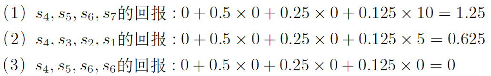
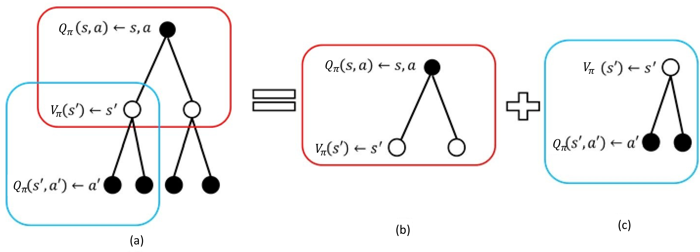
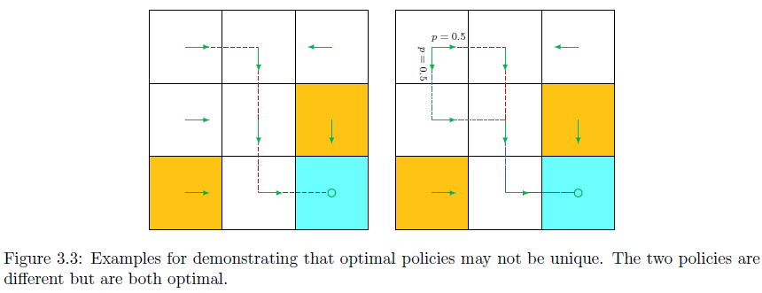

> 有模型学习需要已知环境的动态特性，因此可以近似为一个马尔科夫过程

[TOC]

<!--more-->

## 2.0 从随机变量到马尔科夫过程

### 随机过程

对于两个相互独立的随机变量 $X$ 和 $Y$ ，可以通过寻找二者的映射关系进行数据分析，即监督学习、无监督学习的方法就可以分析

随机过程的研究对象是随时间演变的随机现象，随机现象在某时刻 $t$ 的取值是一个状态向量 $S_t$ ，所有可能的状态组成状态集合 $\mathcal{S}$ 。

对于一组与时序 $t$ 相关的且相互影响的非独立随机变量 $S_t,S_{t+1},S_{t+2},\cdots$ ，这些随机变量构成一个随机过程 $\{S_t\}_{t=1}^{\infty}$ 

- 通过自回归模型只能实现数据分布不变的序列预测任务
- 但RL解决的问题是序列决策任务，数据分布会变化

**历史** 
$$
H_t=\{S_0,a_0,r_1,S_1,\cdots,S_{T-1},a_{T-1},r_T\}
$$
智能体在采取当前动作是会依赖于之前的历史，所以整个环境的状态可以看做这个历史的函数 $S_t=f(H_t)$ 

### 马尔科夫决策过程

具有马尔科夫性质的随机过程称为马尔科夫链/马尔科夫过程

- 一阶马尔科夫链 $P(S_{t+1}\vert S_t,S_{t-1},\cdots)=P(S_{t+1}\vert S_t)$ 
- 二阶马尔科夫链 $P(S_{t+1}\vert S_t,S_{t-1},\cdots)=P(S_{t+1}\vert S_t,S_{t-1})$ 

马尔科夫过程中引入状态空间模型(HMM，Kalman Filter，Praticle Filter)

- 当前观测 $O_t$ 仅与 $S_t$ 有关，与 $S_{t-1}$ 无关

  

马尔科夫过程(Markov process, MP)以及马尔科夫奖励过程(Markov reward process, MRP) 是马尔科夫决策过程(Markov decision process,MDP) 的简化过程

智能体的策略影响马尔科夫决策过程的 *状态-动作* 对分布，进而影响获得的累积奖励

> Markov——马尔科夫性质
>
> decision——策略
>
> process——条件概率表示状态转移

- 动态特性是马尔科夫决策过程的一个重要特点
  $$
  P(s',r'\vert s,a)\overset{\Delta}{=}P(S_{t+1}=s',R_{t+1}=r'\vert S_t=s,A_t=a)
  $$
  马尔科夫奖励过程获得的奖励是随机的，即使不同时刻进入同一状态 $S_{t_i}=S_{t_j}=s$ 下采取同一动作 $a$ 进入同一未来状态 $S_{t_{i+1}}=S_{t_{j+1}}=s'$ 获得的奖励也是随机的 ($R(S_{t_{i+1}})$ 可能不等于 $R(S_{t_{j+1}})$ 

- 状态转移与动态特性的关系
  $$
  P(s'\vert s,a)=\sum\limits_{r'\in \mathcal{R}}P(s',r'\vert s,a)
  $$

### RL中智能体与环境的交互过程是马尔科夫决策过程

- 预测(策略评估)和控制是马尔科夫决策过程中的两种价值函数计算方法

  - 策略评估(policy evaluation)是计算在给定策略下每个状态的价值函数

  - 控制(prediction)是通过贪心算法($argmax$)寻找最优策略

    穷举法：穷举每个动作的动作价值寻找最大值

    迭代法：策略迭代(policy iteration)和价值迭代(value iteration)

在马尔科夫决策过程中，环境是全部已知(状态转移、动态特性是可观测的)

- 很多时候，环境中有些量是不可观测的，这种部分可预测的问题也可以转换成马尔科夫决策过程

#### 状态/观测与序列决策的关系

**状态** 是对环境的完整描述，不会隐藏世界的信息

**观测** 是对环境的部分描述，可能会遗漏一些信息

- 在DRL中，用实值的向量、矩阵或更高阶的张量来表示状态和观测

环境有真实的函数 $s_t^e=f^e(H_t)$ ，在智能体内部也有一个函数 $s_t^a=f^a(H_t)$ 来更新对环境的理解

当智能体的状态与环境的状态等价的时候，即智能体能够观察到环境的所有状态时，称这个环境是 **完全可观测的** 。此时，强化学习通常被建模成一个 **马尔科夫决策过程(Markov decision process,MDP)** 问题。在马尔科夫决策过程中，$o_t=s^e_t=s^a_t$ 

但有时候，智体的观测并不能包含环境运行的所有状态，当智体只能看到部分观测，称这个环境是 **部分可观测的** 。此时，强化学习通常被建模为 **部分可观测马尔科夫决策过程(partially observable Markov decision process, POMDP)** 

- 部分马尔科夫决策过程可以用一个七元组描述：$(S,A,T,R,\Omega,O,\gamma)$ 

  $S$ 表示状态空间，为隐变量

  $A$ 为动作空间

  $T(s'\vert s,a)$ 为状态转移概率

  $R$ 为奖励函数

  $\Omega(o\vert s,a)$ 为观测概率

  $O$ 为观测空间

  $\gamma$ 为折扣因子

## 2.1 马尔可夫过程

### 2.1.1 马尔可夫性质

> 马尔科夫性质(Markov property)指一个随机过程在给定现在状态及所有过去状态下，其未来状态的条件概率分布仅依赖于当前状态。即在给定当前状态下，将来的状态和过去的状态是条件独立的

假设变量 $S_0,S_1,\cdots,S_T$ 构成一个随机过程，这些变量所有可能的取值集合为状态空间，若未来状态 $S_{t+1}$ 对于过去状态序列 $S_{0:t}$ 的条件概率分布仅是 $S_t$ 的一个函数
$$
P(S_{t+1}=s_{t+1}\vert S_{0:t}=s_{0:t})=P(S_{t+1}=s_{t+1}\vert S_t=s_t)
$$
则该随机过程具有马尔科夫性质

$t$ 时刻的状态其实包含了 $t-1$ 时刻的状态信息，通过链式关系，历史的信息被传递到当前

### 2.1.2 马尔可夫过程的数学表示

马尔科夫过程是一组具有马尔科夫性质的随机变量序列 $S_1,S_2,\cdots,S_t$ ，其中下一个时刻的状态 $S_{t+1}$ 只取决于当前状态 $S_t$ ，设状态历史为 $H_t=\{S_1,S_2,\cdots,S_t\}$ ，则马尔科夫过程满足：
$$
P(S_{t+1}\vert S_t)=P(S_{t+1}\vert H_t)
$$

- 离散时间的马尔科夫过程称为马尔科夫链(Markov chain)，其状态是有限的

用状态转移矩阵(state transition matrix) $\mathcal{P}$ 表示状态转移 $P(S_{t+1}=s'\vert S_t=s)$ ，假设有 $N$ 个状态，$P(s_i\vert s_j)$ 中的状态表示具体的状态值
$$
\mathcal{P}=\begin{pmatrix}
P(s_1\vert s_1)&P(s_2\vert s_1)&\cdots&P(s_N\vert s_1)\\
P(s_1\vert s_2)&P(s_2\vert s_2)&\cdots&P(s_N\vert s_2)\\
\vdots&\vdots&\ddots&\vdots\\
P(s_1\vert s_N)&P(s_2\vert s_N)&\cdots&P(s_N\vert s_N)\\
\end{pmatrix}
$$

一个马尔科夫过程用元组表示为 $<\mathcal{S},\mathcal{P}>$ 

在给定马尔科夫链后，对马尔科夫链的一次采样，即可得到一个轨迹

**状态转移是确定的，轨迹是随机的** 

## 2.2 马尔可夫奖励过程

> 马尔科夫奖励过程是马尔科夫链加上奖励函数

奖励函数用期望 $R(s)$ 表示，当到达某一个状态时可以获得多大的奖励，一般用向量表示

由四元组 $<\mathcal{S},\mathcal{P},\mathcal{R},\gamma>$ 表示一个马尔科夫奖励过程

- $\mathcal{S}$ 为状态空间，$S_t$ 表示在 $t$ 时刻的状态
- $\mathcal{P}$ 为状态转移概率，$P(S_t\vert S_{t-1})$ 表示从 $t-1$ 时刻的状态 $S_{t-1}$ 转移到 $t$ 时刻的状态 $S_{t}$ 的概率
- $\mathcal{R}$ 为奖励函数，$R(s)$ 指转移到某个状态 $s$ 时可获得奖励的期望，奖励是延迟的，只有进入 $S_t$ 状态，才能返回进入状态 $S_{t-1}$ 的奖励

### 2.2.1 回报与R价值函数

**范围** ：每个回合的最大时间步数，用 $T$ 表示

- 一个状态可以多次出现在一个回合中，所以 $T >/</= N$ 都可能出现，$N$ 为马尔科夫过程的状态总数

**回报** ：沿着轨迹的奖励逐步叠加，假设时刻 $t$ 后的奖励序列为 $R_{t+1},R_{t+2},\cdots$ ，则回报定义为
$$
G_t=R_{t+1}+\gamma R_{t+2}+\gamma^2 R_{t+3}+\cdots+\gamma^{T-t-1} R_{T}=\sum\limits_{i=t}^T\gamma^{i-t}R_{i+1},\quad \gamma\in[0,1]\tag{2.1}\label{2.1}
$$
其中，$\gamma$ 为折扣因子，越往后得到的奖励，打的折扣越多，表明我们期望更快地得到尽可能多的奖励

**状态价值函数** ：以某个状态为起始，获得回报的期望
$$
V_t(s)=E[G_t\vert S_t=s]=E[R_{t+1}+\gamma R_{t+2}+\gamma^2 R_{t+3}+\cdots+\gamma ^{T-t-1} R_{T}\vert S_t=s]\tag{2.2}\label{2.2}
$$
回报通过单个轨迹计算所得，状态价值通过多个轨迹计算所得。即回报无法作为状态好坏的评价指标，需要获取以当前状态为起点可以获得回报的期望来作为状态好坏的评价指标(状态价值)

- 当采取确定性策略时，从一个状态出发会得到固定的轨迹，此时 $G_t=V(S_t)$

#### 为何用未来奖励评估当前动作好坏

在现实世界中奖励往往是延迟的，所以强化学习需要学习长期的奖励。对于MDP，我们一般会从当前状态开始，把后续有可能收到的奖励求期望作为当前动作的 $Q$ 值，代表当前状态下动作的真正价值

#### 折扣因子

但多长时间的奖励算 **长期**，如果任务很快就结束，考虑到最后一步的奖励无可厚非。但如果是一个持续的没有尽头的任务，如：有些马尔可夫过程是带环，我们做不到将未来全部的奖励相加作为当前状态的价值，想量化状态价值就必须避免无穷奖励。所以引入折扣因子 $\gamma$ 来计算未来总奖励，$\gamma\in [0,1]$ ，$\gamma^n$ 越往后越小，即越后面的奖励对当前状态价值的影响就越小

- 带折扣因子的回报，即使所有奖励都是 $+1$ ，也会收敛
  $$
  G=1+\gamma\cdot 1+\gamma^2\cdot 1+\gamma^3 \cdot 1+\cdots=\frac{1\cdot(1-\gamma^n)}{1-\gamma}\rightarrow\frac{1}{1-\gamma}<1
  $$

##### 折扣因子的理解

若把价值函数看做未来可能获得累积奖励的当前价值表现，则未来奖励与即时奖励不总具有同等价值，受时间、不确定性和其他因素的影响

若奖励是有实际价值的，我们希望更尽快获得奖励（现在的钱比以后更有实际价值）

我们不能完全信任模型（并不能建立完全模拟环境的模型，对未来的评估未必准确），为了表示这种不确定性，所以对未来的奖励打折扣

**折扣因子为强化学习超参数**

若 $\gamma=0$ ，则只考虑单步的奖励，是一种目光短浅的算法

若 $\gamma=1$ ，则相当于将后续所有奖励都加起来，是一种目光过于长远的算法

### 2.2.2 回报的计算

若 $s_1,s_2,\cdots,s_7$ 构成一个马尔科夫过程，设其奖励函数表示为 $R=[5,0,0,0,0,0,10]$ ，即 $s_7$ 是目标状态，$s_1$ 是次目标状态

以 $s_{t+1}=s_4$ 为下一状态 ($\gamma=0.5$)，计算每个轨迹的回报

### 2.2.3 价值函数的计算方法

#### 蒙特卡洛方法

蒙特卡洛方法(Monte Carlo,MC)：计算 $E[G_t\vert S_t=s]$ 

- 生成很多轨迹，计算每条轨迹的回报，回报叠加后取平均值作为价值函数

#### 贝尔曼方程

贝尔曼方程定义了当前状态与未来状态间的价值关系

令 $S_t=s,S_{t+1}=s'$  
$$
V(s)=\underbrace{R(s)}_{即时奖励}+\underbrace{\gamma\sum\limits_{s'\in S}P(s'\vert s)V(s')}_{未来奖励的折扣总和}\tag{贝尔曼方程}\label{BellmanEquation}
$$

即时奖励 $R(s)$ 为 $t$ 时刻进入状态 $s$ 延迟到 $t+1$ 时刻得到的延迟奖励 $r_{t+1}$ 

##### 贝尔曼方程推导

$$
\begin{align}
V(s)&=E[G_t\vert S_t=s]\\
&=E[r_{t+1}+\gamma r_{t+2}+\gamma^2 r_{t+3}+\cdots+\gamma^{T-t-1}r_{T}\vert S_t=s]\\
&=E[r_{t+1}\vert S_t=s]+\gamma E[r_{t+2}+\gamma r_{t+3}+\cdots+\gamma^{T-t-1}r_{T}\vert S_t=s]\\
&=R(s)+\gamma E[G_{t+1}\vert S_t=s] \tag{2.3}\label{2.3}
\end{align}
$$

令 $G_{t+1}=g'$ ，$E[G_{t+1}\vert S_t=s]=E[g'\vert s]$  ，且 $\sum\limits_{s'\in S}P(s'\vert s)V(s')=E\left[V(s')\vert s\right]$ 

相当于求证 $E[g'\vert s]=E\left[V(s')\vert s\right]$ 

$$
\begin{aligned}
E\left[V(s')\vert s\right]&=E\left[E[g'\vert s']\big\vert s\right]\\
&=E\left[\sum\limits_{g'}P(g'\vert s')\cdot g'\Bigg\vert s\right]\\
&=\sum\limits_{s'}P(s'\vert s)\cdot \sum\limits_{g'}P(g'\vert s',s)\cdot g'\\
&=\sum\limits_{s'}\sum\limits_{g'}\frac{P(g'\vert s',s)\cdot g'\cdot P(s'\vert s)\cdot P(s)}{P(s)}\\
&=\sum\limits_{s'}\sum\limits_{g'}\frac{P(g'\vert s',s)\cdot P(s',s)\cdot g'}{P(s)}\\
&=\sum\limits_{s'}\sum\limits_{g'}\frac{P(g',s',s)\cdot g'}{P(s)}\\
&=\sum\limits_{s'}\sum\limits_{g'}g'\cdot P(g',s'\vert s)\\
&=\sum\limits_{g'}\sum\limits_{s'}g'\cdot P(g',s'\vert s)\\
&=\sum\limits_{g'}g'\cdot P(g'\vert s)\\
&=E\left[g'\vert s\right]
\end{aligned}
$$

故代入 $\eqref{2.3}$ ，得证贝尔曼方程 $\eqref{BellmanEquation}$ 
$$
\begin{align}
V(s)&=R(s)+\gamma E\left[V(s')\vert s\right]\\
&=R(s)+\gamma \sum\limits_{s'\in S}P(s'\vert s)\cdot V(s')\\
&=E[r_{t+1}+\gamma V(s')\big\vert s]
\end{align}
$$

##### 贝尔曼方程的解析解-

对于涉及 $N$ 个状态的马尔科夫过程（ $s_i\in \mathcal{S},i\in [1,N]$ ），可以列出 $N$ 个贝尔曼方程，解得每个状态的价值

- 状态价值向量 $\mathbf{V}=\begin{bmatrix}V(s_1)\\V(s_2)\\\vdots\\V(s_N)\end{bmatrix}$ 

- 即时奖励 $\mathbf{R}=\begin{bmatrix}R(s_1)\\R(s_2)\\\vdots\\R(s_N)\end{bmatrix}$ 

- 状态转移矩阵
  $$
  \mathbf{P}=\begin{bmatrix}
  P(s_1\vert s_1)&P(s_2\vert s_1)&\cdots&P(s_N\vert s_1)\\
  P(s_1\vert s_2)&P(s_2\vert s_2)&\cdots&P(s_N\vert s_2)\\
  \vdots&\vdots&\ddots&\vdots\\
  P(s_1\vert s_N)&P(s_2\vert s_N)&\cdots&P(s_N\vert s_N)\\
  \end{bmatrix}
  $$

则代入 $\eqref{BellmanEquation}$ ，表示为
$$
\begin{bmatrix}V(s_1)\\V(s_2)\\\vdots\\V(s_N)\end{bmatrix}=\begin{bmatrix}R(s_1)\\R(s_2)\\\vdots\\R(s_N)\end{bmatrix}+\gamma\begin{bmatrix}
P(s_1\vert s_1)&P(s_2\vert s_1)&\cdots&P(s_N\vert s_1)\\
P(s_1\vert s_2)&P(s_2\vert s_2)&\cdots&P(s_N\vert s_2)\\
\vdots&\vdots&\ddots&\vdots\\
P(s_1\vert s_N)&P(s_2\vert s_N)&\cdots&P(s_N\vert s_N)\\
\end{bmatrix}\begin{bmatrix}V(s_1)\\V(s_2)\\\vdots\\V(s_N)\end{bmatrix}
$$
即 
$$
\begin{aligned}
\mathbf{V}&=\mathbf{R}+\gamma\mathbf{P}\mathbf{V}\\
(\mathbf{I-\gamma P})\mathbf{V}&=\mathbf{R}\\
\mathbf{V}&=(\mathbf{I}-\gamma\mathbf{P})^{-1}\mathbf{R}
\end{aligned}
$$
但矩阵求逆的时间复杂度为 $O(N^3)$ ，这种通过解析解的方法只适用于很小量的马尔科夫奖励过程

$I-\gamma P$ 是可逆的：

$(I-\gamma P)^{-1}\ge I$ ：

每个分量都是非负的，且不小于单位值

对每个奖励向量，$(I-\gamma P)^{-1}r\ge r\ge 0$ 

##### 贝尔曼方程的数值解

**迭代法**

- 动态规划法(dynamic programming, DP)——有模型学习
- 蒙特卡洛方法(Monte Carlo, MC)——免模型学习
- 时序差分学习(temporal-difference learning, TD learning)，前两者的结合

###### 自举法收敛性——数值解收敛于解析解

在使用自举法求解 $\eqref{BellmanEquation}$ 前，还需要考虑 **迭代是否收敛的问题**

以状态价值函数为例，使用迭代算法计算贝尔曼方程写为向量形式如下
$$
\mathbf{V}_{\pi}=\mathbf{R}_{\pi}+\gamma \mathbf{P}_{\pi}\mathbf{V}
$$
算法迭代过程中会生成一系列状态迭代值 $\{\mathbf{V}^{(0)}_{\pi},\mathbf{V}^{(1)}_{\pi},\mathbf{V}^{(2)}_{\pi},\cdots\}$ ，其中 $R^{(0)}\in R^n$ 是 $V_\pi$ 的一个初始猜测，需要证明的是数值解收敛于解析解
$$
\mathbf{V}^{(t)}_{\pi}\rightarrow \mathbf{V}_\pi=(\mathbf{I}-\gamma\mathbf{P}_{\pi})^{-1}\mathbf{R}_{\pi}
$$
证明：

定义状态价值误差 $\delta^{(t)}=\mathbf{V}^{(t)}_{\pi}-\mathbf{V}_{\pi}$ ，转为证明 $\delta^{(t)}\xrightarrow{t\rightarrow \infty} 0$ 

- $\mathbf{V}^{(t+1)}_{\pi}=\delta^{(t+1)}+\mathbf{V}_{\pi}$ 
- $\mathbf{V}^{(t+1)}_{\pi}=\mathbf{R}_{\pi}+\gamma \mathbf{P}_{\pi}\mathbf{V}^{(t)}_{\pi}$ 
  - $\mathbf{V}^{(t)}_{\pi}=\delta^{(t)}+\mathbf{V}_{\pi}$ 

$$
\begin{aligned}
\delta^{(t+1)}+\mathbf{V}_{\pi}&=\mathbf{R}_{\pi}+\gamma \mathbf{P}_{\pi}\left(\delta^{(t)}+\mathbf{V}_{\pi}\right)\\
\delta^{(t+1)}&=-\mathbf{V}_{\pi}+\mathbf{R}_{\pi}+\gamma \mathbf{P}_{\pi}\left(\delta^{(t)}+\mathbf{V}_{\pi}\right)\\
&=\gamma \mathbf{P}_{\pi}\delta^{(t)}-\mathbf{V}_{\pi}+\mathbf{R}_{\pi}+\gamma \mathbf{P}_{\pi}\mathbf{V}_{\pi}\\
&=\gamma \mathbf{V}_{\pi}\delta^{(t)}\\
&=\gamma^2 \mathbf{P}^2_{\pi}\delta^{(t-1)}\cdots=\gamma^{t+1} \mathbf{P}^{t+1}_{\pi}\delta^{(0)}
\end{aligned}
$$

对于每轮迭代的状态转移矩阵 $\mathbf{P}_{\pi}^{(t)}$ 的每个元素都是非负的并且小于1。且 $0\le \gamma \le 1\Rightarrow \gamma ^{t+1}\rightarrow 0$  ，因此，$\delta^{(t+1)}=\gamma^{t+1} \mathbf{P}^{t+1}_{\pi}\delta^{(0)} \xrightarrow{t\rightarrow \infty} 0$ 

故自举法求解贝尔曼方程的数值解是收敛于解析解

###### 蒙特卡洛方法

$$
\begin{array}{ll}
\hline
&i\leftarrow 0,G_t\leftarrow 0\\
&当i\neq N时，执行\\
&\qquad生成一个回合的轨迹，从状态s和时刻t开始\\
&\qquad使用生成的轨迹计算回报 g=\sum\limits_{j=t}^{T-1}\gamma^{j-t}r_{j+1}\\
&\qquad G_t\leftarrow G_t+g,i\leftarrow i+1\\
&结束循环\\
&V_t(s)=\frac{G_t}{N}\\
\hline
\end{array}
$$

###### 动态规划方法

通过自举(bootstrapping)的方法，不停地迭代贝尔曼方程，当最后更新的状态与上一状态区别不大时，就可以停止迭代，将输出的 $V'(s)$ 作为当前的状态的价值
$$
\begin{array}{ll}
\hline
&对于所有状态s\in S,V'(s)\leftarrow 0,V(s)\leftarrow\infty\\
&当 \Vert V-V'\Vert>\epsilon，执行\\
&\qquad 对于所有状态 s\in S,V'(s)=R(s)+\gamma\sum\limits_{s'\in S}P(s'\vert s)V(s')\\
&\qquad V\leftarrow V'\\
&结束循环\\
& 返回V'(s)\\
\hline
\end{array}
$$

## 2.3 马尔科夫决策过程

### 2.3.1 MDP与MP/MRP

马尔科夫过程与马尔科夫奖励过程都是自发改变的随机过程，马尔科夫决策过程加入了一个外界 “刺激” 共同改变这个随机过程。

在RL中，这个 “刺激” 为智能体的决策（动作），且满足马尔科夫性质 $P(S_{t+1}\vert S_t,A_t)=P(S_{t+1}\vert H_t,A_t)$ 

马尔科夫决策过程在马尔科夫奖励的过程基础上多了决策 $a_t$ ，用五元组 $<\mathcal{S},\mathcal{A},\mathcal{P},\mathcal{R},\gamma>$ 表示

- $\mathcal{S}$ 为状态空间，$S_t=s$ 表示在 $t$ 时刻的状态向量 $s$ 

- $\mathcal{R}$ 为奖励函数：$R(S_t=s,A_t=a)$ ，在状态 $s$ 采取动作 $a$ 进入下一状态 $s'$ 时，返回这个 *状态-动作* 对的奖励

- $\mathcal{P}$ 为状态转移函数：$P(S_{t+1}=s'\vert S_t=s,A_t=a)$ 

  - 马尔科夫奖励过程/马尔科夫过程的状态转移是直接的，直接通过状态转移概率决定下一状态 $S_{t+1}$ 

  - 马尔科夫决策过程的状态转移具有一定的不确定性，当前状态与未来状态之间多了一个决策过程。在当前状态下，智能体首先要决定采取哪一种动作，所以智能体进入的未来状态也是一种概率分布

    

对于马尔科夫过程/马尔科夫奖励过程，到达某个状态的价值是确定的，但由于轨迹是随机的，所以最终得到的回报不确定。

对于马尔科夫决策过程，策略产生的决策决定状态的变化方向，通过智能体的策略，我们可以尽快地获得尽可能多的回报

#### MDP中的策略

策略定义了在某一状态应该采取什么样的动作。有两种形式

- 概率表示，当前状态下每个采取每个动作的可能性
  $$
  \begin{array}{ll}
  随机性策略&\pi(a\vert s)=P(A_t=a\vert S_t=s)\\
  \end{array}
  $$
  在每个状态下输出关于动作的概率分布，表示当前状态下采取每个动作的概率，对动作的概率分布采样得到一个动作
  
- 直接输出当前状态应该采取那种动作
  $$
  \begin{array}{ll}
  确定性策略&a\overset{\Delta}{=}\pi(s)或\pi(a\vert s)\overset{\Delta}{=}P(A_t=a\vert S_t=s)=1\\
  \end{array}
  $$

**强化学习中的归纳偏置** ：假设策略函数都是稳定的，故不同时间采取的动作都是对策略函数的采样

#### MDP与MRP

若已知马尔科夫决策过程及策略 $\pi$ ，就可以将马尔科夫决策过程转换为马尔科夫奖励过程

- 若已知策略函数，相当于在某个状态下，已知可能采取的每个动作的可能性，进而可以知道状态转移的概率
  $$
  P_\pi(s'\vert s)=\sum\limits_{a\in A}\pi(a\vert s)P(s'\vert s,a)
  $$

- 对于奖励函数，也是类似的
  $$
  R_\pi(s)=\sum\limits_{a\in A}\pi(a\vert s)R(s,a)
  $$

#### 策略及其占用度量

状态的占用度量

- 状态占用度量是当前状态下，每个动作占用度量的和

状态价值（策略的价值）——累积奖励

占用度量和策略实际上是两个东西，但为了简便，直接将占用度量记为策略

### 2.3.2 MDP中的价值函数

动作价值函数：在某一状态下，基于策略 $\pi$ 生成的某一动作可能得到的期望回报
$$
Q_{\pi}(s,a)=E_{\pi}[G_t\vert S_t=s,A_t=a]
$$
状态价值函数：在当前状态下，基于策略 $\pi$ 可以获得的期望回报
$$
V_\pi(s)=E[G_t\vert S_t=s]
$$
奖励：当已知状态与动作值时，其奖励值也可确定 $R_{t+1}=R(S_t=s,A_t=a)=r_{t+1}$ 

对于一个马尔科夫过程，策略确定后，对动作采样可以使动作价值转换为状态价值
$$
V_\pi(s)=\sum\limits_{a\in A}\pi(a\vert s)Q(s,a)\tag{V=f(Q)}\label{V=f(Q)}
$$

- 可以将状态价值函数理解为动作价值函数的加权平均，权重为策略

#### 不同策略下同一状态价值不同

对于两个不同的策略，同一状态的价值很可能不同

因为不同策略会采取不同的动作，之后会有不同的状态序列，进而获得不同的奖励，所以它们累积奖励的期望也是不同的，即状态价值不同

#### 贝尔曼期望方程

##### 贝尔曼动作价值期望方程

对动作价值函数分解，得到Q函数的贝尔曼期望方程
$$
\begin{align}
Q_\pi(s,a)&=E_\pi[G_t\vert S_t=s,A_t=a]\\
&=E_\pi[r_{t+1}+\gamma r_{t+2}+\gamma^2r_{t+3}+\cdots\vert s,a]\\
&=E_\pi\left[r_{t+1}+\gamma G_{t+1}\big\vert S_t=s,A_t=a\right]\\
&=E[r_{t+1}+\gamma Q_{\pi}(s',a')\vert s,a]\tag{动作价值}\label{Q_value}\\
\end{align}
$$

- 立即奖励
  $$
  \begin{align}
  E_{\pi}[r_{t+1}\vert s,a]&=\sum\limits_{r'}P(r'\vert s,a)r'\\
  &=R(s,a)\tag{立即动作奖励}\label{Q_immediate_reward}
  \end{align}
  $$

- 折扣奖励
  $$
  \begin{align}
  E_{\pi}[G_{t+1}\vert S_t=s,A_t=a]&=\sum\limits_{g’}g’P(g’\vert s,a)\\
  &=\sum\limits_{g’}g’\sum\limits_{s’} P(g’,s’\vert s,a)\\
  &=\sum\limits_{s’}\sum\limits_{g’}g’ P(g’,s’\vert s,a)\\
  &=\sum\limits_{s’}\sum\limits_{g’}g’\frac{P(g’,s’,s,a)}{P(s,a)}\cdot\frac{P(s,a)}{P(s’,s,a)}P(s’\vert s,a)\\
  &=\sum\limits_{s’}\sum\limits_{g’}g’\frac{P(g’,s’,s,a)}{P(s’,s,a)}P(s’\vert s,a)\\
  &=\sum\limits_{s’}\sum\limits_{g’}g’P(g’\vert s’,s,a)P(s’\vert s,a)\\
  &=\sum\limits_{s’}E_{\pi}[g’\vert s’,s,a]P(s’\vert s,a)\\
  &\xlongequal{马尔可夫性质}\sum\limits_{s’}E_{\pi}[g’\vert s’]P(s’\vert s,a)\\
  &=\sum\limits_{s’}V_{\pi}(s’)P(s’\vert s,a)\tag{折扣奖励}\label{Q_discounted_reward}\\
  &=E[V_{\pi}(s')\vert s,a]
  \end{align}
  $$

将 $\eqref{Q_immediate_reward}$ 与 $\eqref{Q_discounted_reward}$ 代入 $\eqref{Q_value}$ 可得
$$
\begin{align}
Q_\pi(s,a)&=E_\pi\left[r_{t+1}\big\vert s,a\right]+\gamma E_\pi\left[G_{t+1}\big\vert S_t=s,A_t=a\right]\\
&=R(s,a)+\gamma E[V_{\pi}(s')\vert s,a]\\
&=\sum\limits_{r'}P(r'\vert s,a)r'+\gamma \sum\limits_{s’}V_{\pi}(s’)P(s’\vert s,a)\tag{Q=f(V)}\label{Q=f(V)}
\end{align}
$$

- 由 $\eqref{Q_discounted_reward}$​ 的推导，可知 $V(s')$​ 已经包含了 $S_{t+2},S_{t+3},\cdots$​ 等未来状态的折扣动作奖励，即 $\sum\limits_{s’}E_{\pi}[g’\vert s’]P(s’\vert s,a)=\sum\limits_{s’}V_{\pi}(s’)P(s’\vert s,a)$ 

##### 贝尔曼状态价值期望方程

将状态价值函数分解为即时奖励与未来折扣奖励，可以得到状态价值的贝尔曼期望方程
$$
\begin{align}
V_\pi(s)&=E_\pi[G_{t}\vert S_t=s]\\
&=E_\pi\left[r_{t+1}+\gamma r_{t+2}+\gamma^2r_{t+3}+\cdots\big\vert S_t=s\right]\\
&=E_\pi\left[r_{t+1}+\gamma G_{t+1}\big\vert S_t=s\right]\\
&=E[r_{t+1}+\gamma V_{\pi}(s')\vert s]\tag{状态价值}\label{State_value}\\
\end{align}
$$

- 立即奖励
  $$
  \begin{align}
  E_{\pi}[r_{t+1}\vert s_t=s]&=\sum\limits_{a}\pi(a\vert s)E[r_{t+1}\vert s_t=s,a_t=a]\\
  &=\sum\limits_{a}\pi(a\vert s)\sum\limits_{r'}P(r'\vert s,a)r'\\
  &=R(s)\tag{立即奖励}\label{V_immediate_reward}
  \end{align}
  $$

- 未来折扣奖励
  $$
  \begin{align}
  E_{\pi}[G_{t+1}\vert s_t=s]&=\sum\limits_{g’}g’P(g’\vert s)\\
  &=\sum\limits_{g’}g’\sum\limits_{s’} P(g’,s’\vert s)\\
  &=\sum\limits_{s’}\sum\limits_{g’}g’ P(g’,s’\vert s)\\
  &=\sum\limits_{s’}\sum\limits_{g’}g’\frac{P(g’,s’,s)}{P(s)}\cdot\frac{P(s)}{P(s’,s)}P(s’\vert s)\\
  &=\sum\limits_{s’}\sum\limits_{g’}g’\frac{P(g’,s’,s)}{P(s,s’)}P(s’\vert s)\\
  &=\sum\limits_{s’}\sum\limits_{g’}g’P(g’\vert s’,s)P(s’\vert s)\\
  &=\sum\limits_{s’}E_{\pi}[g’\vert s’,s]P(s’\vert s)\\
  &\xlongequal{马尔可夫性质}\sum\limits_{s’}E_{\pi}[g’\vert s’]P(s’\vert s)\\
  &=\sum\limits_{s’}V_{\pi}(s’)P(s’\vert s)\\
  &=\sum\limits_{s’}V_{\pi}(s’)\sum\limits_{a}P(s'\vert s,a)\pi(a\vert s)\\
  &=\sum\limits_{a}\pi(a\vert s)\sum\limits_{s’}V_{\pi}(s’)P(s'\vert s,a)\tag{折扣奖励}\label{V_discounted_reward}\\
  &=\sum\limits_{a}\pi(a\vert s)E[V_{\pi}(s')\vert s,a]
  \end{align}
  $$

将 $\eqref{V_immediate_reward}$ 与 $\eqref{V_discounted_reward}$ 代入 $\eqref{State_value}$ 可得
$$
\begin{align}
V_\pi(s)&=E_\pi\left[r_{t+1}\big\vert s_t=s\right]+\gamma E_\pi\left[G_{t+1}\big\vert s_t=s\right]\\
&=R(s)+\gamma\sum\limits_{a}\pi(a\vert s)E[V_{\pi}(s')\vert s,a]\\
&=\underbrace{\sum\limits_{a}\pi(a\vert s)\sum\limits_{r'}P(r'\vert s,a)r'}_{立即奖励期望}+\underbrace{\gamma\sum\limits_{a}\pi(a\vert s)\sum\limits_{s’}V_{\pi}(s’)P(s'\vert s,a)}_{未来折扣奖励期望}\\
&=\sum\limits_{a}\pi(a\vert s)\left[\sum\limits_{r'}P(r'\vert s,a)r'+\gamma\sum\limits_{s’}V_{\pi}(s’)P(s'\vert s,a)\right]\\
&=\sum\limits_{a}\pi(a\vert s)Q_{\pi}(s,a)
\end{align}
$$

##### 价值函数的自举

将 $\eqref{Q=f(V)}$ 与 $\eqref{V=f(Q)}$ 互相代入可得贝尔曼期望方程的迭代形式
$$
\begin{align}
V_\pi(s)&=\sum\limits_{a\in A}\pi(a\vert s)Q_\pi(s,a)\\
&=\sum\limits_{a\in A}\pi(a\vert s)\left(R(s,a)+\gamma \sum\limits_{s'\in S}P(s'\vert s,a)\cdot V_\pi(s')\right)\tag{贝尔曼期望方程-状态}\label{BellmanExpectation_itV}\\
Q_\pi(s,a)&=R(s,a)+\gamma \sum\limits_{s'\in S}P(s'\vert s,a)\cdot V_\pi(s')\\
&=R(s,a)+\gamma \sum\limits_{s'\in S}P(s'\vert s,a)\cdot\sum\limits_{a'\in A}\pi(a'\vert s')Q_\pi(s',a')\tag{贝尔曼期望方程-动作}\label{BellmanExpectation_itQ}
\end{align}
$$

在自举法中，同一组数据在时刻 $t$ 的值用 $t$ 标识，$V^{(t+1)}_{\pi}(s)$ 表示 用 $t$ 时刻的数据组更新对 $V_{\pi}(s)$ 的估计，在 $t+1$ 时刻的估计值为 $V^{(t+1)}_{\pi}(s)$ 

- 即使是同一个经验，不同时刻到达也会有不同的更新值，所以用时刻标注估计值

#### 备份图角度理解价值函数关系

备份：迭代关系，对于某一个状态，它的当前价值是与未来价值线性相关的

备份图：对备份图的备份/更新操作，将价值信息从后继未来状态转移回当前状态

状态价值函数的计算分解：定义了未来下一时刻状态价值函数与上一时刻状态价值函数间的关联

- 对于 $(c)$ ，通过 $\eqref{Q=f(V)}$ 计算，对叶子结点的累加，向上备份一层。可以将未来的状态价值 $s'$ 备份到上一层
- 对于 $(b)$ ，通过 $\eqref{V=f(Q)}$ 计算，对父节点的累加，再向上备份一层。可得到当前状态的价值 $s$ 
- 可得，$V(s)$ 的迭代式 $\eqref{BellmanExpectation_itV}$ 

- 对于 $(c)$ ，通过 $\eqref{V=f(Q)}$ 计算，对叶子结点的累加，向上备份一层。可以将未来的动作价值 $s'$ 备份到上一层
- 对于 $(b)$ ，通过 $\eqref{Q=f(V)}$ 计算，对父节点的累加，再向上备份一层。可得到当前动作的价值 $s$ 
- 可得，$V(s)$ 的迭代式 $\eqref{BellmanExpectation_itQ}$ 

#### 数值解计算

|      | 预测(策略评估)问题                                           | 控制问题                                                     |
| ---- | ------------------------------------------------------------ | ------------------------------------------------------------ |
| 定义 | 已知马尔科夫决策过程以及要采取的策略 $\pi$ ，计算最大价值函数 $V_{\pi}(s)$ 的过程就是策略评估，或(价值)预测 | 已知马尔科夫决策过程，在所有可能的策略中寻找一个最优的价值函数和最佳策略 |
| 输入 | 马尔科夫决策过程 $<S,A,P,R,\gamma>$ ；策略 $\pi$             | 马尔科夫决策过程 $<S,A,P,R,\gamma>$                          |
| 输出 | 价值函数 $V_{\pi}$                                           | 最佳价值函数 $V^{*}$ 和最佳策略 $\pi^*$                      |

在马尔科夫决策过程中，预测和控制二者是递进关系，通过解决预测问题进而解决控制问题。预测问题和控制问题都可以通过动态规划方法解决

策略评估是一个预测问题，希望准确估计当前策略下的状态价值

##### MDP与动态规划

**动态规划(dynamic programming, DP)** 适合解决具有 **最优子结构(optimal substructure)** 和 **重叠子问题(overlapping subproblem)** 两个性质的问题

- 最优子结构：问题可由拆分成许多小问题，组合这些小问题的答案，能得到原问题的答案
- 重叠子问题：子问题出现多次，且子问题的解决方案能被重复使用

可以将贝尔曼期望方程分解为递归结构，即 $\eqref{BellmanExpectation_itQ}$ 与 $\eqref{BellmanExpectation_itV}$ 。未来状态的价值函数作为子问题的解与当前状态的价值函数是直接相关的。通过备份图，子问题（未来状态）的价值函数可以被存储并重用。

动态规划应用于马尔科夫决策过程的 **规划** 问题，即环境是已知的，必须知道状态转移概率和对应的奖励

### 2.3.3 DP解决预测问题

DP解决预测问题是一个 **同步迭代** 过程：

- 同步迭代：同步迭代会存储两份价值函数，更新到旧的价值函数更新新的价值函数

- 异步迭代 ：只存储一份价值函数

  

若 $\pi$ 为随机策略，当前状态下随机采取一个动作进入下一个状态，则由 $\eqref{BellmanExpectation_itV}$ 不断迭代，最后价值函数会收敛
$$
V_\pi^{(t+1)}(s)=\sum\limits_{a\in A}\pi(a\vert s)\left(R(s,a)+\gamma \sum\limits_{s'\in S}P(s'\vert s,a)\cdot V_\pi^{(t)}(s')\right)
$$
若 $\pi$ 为确定性策略，只要处于当前状态就采取一个确定动作从而进入下一状态，则贝尔曼决策过程变为一个贝尔曼奖励过程，可对 $\eqref{BellmanEquation}$ 迭代，最后价值函数会收敛
$$
V_\pi^{(t+1)}(s)=R(s,a)+\gamma P_\pi(s'\vert s)\cdot V_\pi^{(t)}(s')
$$
**网格世界例子**

基于当前策略 $\pi$ 迭代一次后，正奖励涂绿一次，负奖励涂红一次

再次迭代，第一次策略评估的状态的周围状态有值，相当于周围状态可以转移到已知状态，所以策略评估每迭代一次，相当于状态价值备份图向上备份一次，周围状态的状态价值可以通过已知状态的状态价值得到

当多次迭代后，各个状态的奖励值都稳定下来，最后值会确定不变，收敛后每个状态的值就是它的状态价值

### 2.3.4 DP解决控制问题

若只是已知马尔科夫决策过程，解决控制问题相当于寻找最佳策略，从而得到最佳价值函数

#### 目标——最优策略

##### 策略对比

对于两个策略 $\pi_1$ 和 $\pi_2$ ，计算在两个策略下每个状态的状态价值，若
$$
V_{\pi_1}(s)\ge V_{\pi_2}(s),s\in \mathcal{S}
$$
则称策略 $\pi_1$ 优于 $\pi_2$ 

##### 最优策略

最优策略指策略 $\pi^*$ ，能让该策略下所有状态的价值达到最佳状态价值，即 $V_{\pi^*}(s)\ge V_{\pi}(s),s\in \mathcal{S},\pi\in \Pi$ 。则称 $\pi^*$ 为最佳策略

最优策略有很多个，或者至少有一个，但这些最优策略都有相同的最优状态价值

##### 最优状态价值

最优价值函数定义为
$$
V^*(s)=\max\limits_{\pi\in\Pi}V_{\pi}(s),s\in \mathcal{S}
$$

最优动作价值为
$$
Q^*(s,a)=\max\limits_{\pi\in\Pi}Q_{\pi}(s,a),s\in \mathcal{S},a\in \mathcal{A}(s)
$$

#### 策略改进定理与贝尔曼最优方程推导

##### 引例——求解策略相当于求解每个Q值的概率

假设在状态 $s$ 下有三个动作 $a_1,a_2,a_2$ ，其相应的 $Q$ 值为 $q_1,q_2,q_3\in \R$ ，我们试图寻找其权重 $c_1^*,c_2^*,c_3^*$ 使得 $c_1q_1+c_2q_2+c_3q_3$ 最大化，即
$$
\max\limits_{c_1,c_2,c_3}c_1q_1+c_2q_2+c_3q_3,且c_1+c_2+c_3=1,c_1,c_2,c_3\ge 0
$$
假设 $q_3\ge q_1,q_2$ ，对于最优策略，应该让 $c_3^*=1,c_1^*,c_2^*=0$ 
$$
q_3=(c_1^*+c_2^*+c_3^*)q_3\ge c_1^*q_1+c_2^*q_2+c_3^*q_3
$$
受上例启发，$\max\sum\limits_{a\in \mathcal{A}}\pi(a\vert s)q(s,a)=\max\limits_{a\in \mathcal{A}}q(s,a)$ 

在最优策略下
$$
\pi^*(a\vert s)=\begin{cases}
1&a=\mathop{\mathrm{argmax}}\limits_{a\in\mathcal{A}}q(s,a)\\
0&a\neq \mathop{\mathrm{argmax}}\limits_{a\in\mathcal{A}}q(s,a)
\end{cases}
$$

##### 贝尔曼最优方程推导

> 当前策略下最优动作的 $Q$ 值大于非最优动作的 $Q$ 值，最优动作定义为 $a^*(s)=\mathop{\mathrm{argmax}}\limits_{a}Q_{\pi}(s,a)$ 
>
> 对于确定性策略，对策略改进公式为：在状态 $s$ 下，采取动作 $a^*$ ；在其他状态下，仍用策略 $\pi$ 产生动作
> $$
> \pi'(a^*\vert s)=\begin{cases}
> 1&,a=a^*\\
> 0&,a\neq a^*
> \end{cases}\Rightarrow \pi'(s)=a^*\\\\
> Q_{\pi}(s,\pi'(s))=\max\limits_{a\in \mathcal{A}}Q_{\pi}(s,a)\ge \sum\limits_{a\in A}\pi(a\vert s)Q_{\pi}(s,\pi(s))=V_{\pi}(s)
> $$
> 对于随机策略，策略改进应满足：在当前状态 $s$ 下，采取动作 $a^*$ 的概率和更新为 $1$ ，采取次优动作的概率为 $0$ 。其他状态仍采用策略 $\pi$ 生成动作
> $$
> \begin{cases}
> \sum\pi'(a^*\vert s)=1\\
> \pi'(a_i\vert s)=0
> \end{cases}
> 使\sum\limits_{a^*} \pi'(a^*\vert s)Q_{\pi}(s,a^*)=V_{\pi'}(s)\ge V_{\pi}(s)=\sum\limits_{a\in \mathcal{A}(s)}\pi(a\vert s)Q(s,a)
> $$
> 则策略 $\pi'$ 一定优于策略 $\pi$ ，也就是 $V_{\pi'}(s)\ge V_{\pi}(s),\forall s \in \mathcal{S}$ 

$$
\begin{aligned}
V_{\pi}(s)&\le Q_{\pi}(s,\pi'(s))\xlongequal{\eqref{Q_value}}E\left[r_{t+1}+\gamma V_{\pi}(s_{t+1})\big\vert s_t=s,a_t=\pi'(s)\right]\\
&=E_{\pi'}\left[r_{t+1}+\gamma V_{\pi}(s_{t+1})\big\vert s_t=s\right]\\
&\le E_{\pi'}\left[r_{t+1}+\gamma Q_{\pi}(s_{t+1},\pi'(s_{t+1}))\big\vert s_t=s\right]\\
&=E_{\pi'}\left[r_{t+1}+\gamma E_{\pi'}[r_{t+2}+\gamma V_{\pi}(s_{t+3})\vert s_{t+1}]\big\vert s_t=s\right]\\
&=E_{\pi'}\left[r_{t+1}+\gamma r_{t+2}+\gamma^2 V_{\pi}(s_{t+2})\big\vert s_t=s\right]\\
&\le E_{\pi'}\left[r_{t+1}+\gamma r_{t+2}+\gamma^2 Q_{\pi}(s_{t+2},\pi'(s_{t+2}))\big\vert s_t=s\right]\\
&\le \cdots\\
&\le E_{\pi'}\left[r_{t+1}+\gamma r_{t+2}+\gamma^2 r_{t+1}+\cdots\big\vert s_t=s\right]=V_{\pi'}(s)
\end{aligned}
$$

- 其中，$E_{\pi'}\left[r_{t+1}+\gamma V_{\pi}(s_{t+1})\big\vert s_t=s\right]$ 表示在状态 $s$ 时采用策略 $\pi'$ 生成的动作，未来状态仍采用策略 $\pi$ 生成的动作

对于确定性策略，当不断采取 $\mathop{\mathrm{argmax}}$ 操作时，会得到单调递增的 $V$ 与 $Q$ 

不断迭代，当策略改进停止后，即 $\pi'(a\vert s)=\pi(a\vert s)$ 时，策略达到最优，此时的策略 $\pi$ 即为最优策略 $\pi^*$
$$
\max\limits_{a\in \mathcal{A}}Q_{\pi}(s,a)=Q_{\pi}(s,\pi'(a\vert s))\xlongequal{满足迭代终止条件}Q_{\pi}(s,\pi(a\vert s))=V_\pi(s)\\
V_\pi(s)=\max\limits_{a\in \mathcal{A}}Q_{\pi}(s,a)
$$
即 **最优策略下的状态价值等于这个状态下的最优动作价值**

因此，可得贝尔曼最优方程
$$
\begin{aligned}
V^*(s)&=\max\limits_{a\in \mathcal{A}}Q^*(s,a)
\end{aligned}
$$
而对于随机策略，贝尔曼最优方程为
$$
\begin{align}
V(s)&=\max\limits_{\pi\in \Pi}\sum\limits_{a\in \mathcal{A}}\pi(a\vert s)Q_{\pi}(s,a)\tag{贝尔曼最优方程}\label{BellmanOptimalityEquation}\\
&=\max\limits_{\pi\in \Pi}\sum\limits_{a\in \mathcal{A}}\pi(a\vert s)\left(\sum\limits_{r'}P(r'\vert s,a)r'+\gamma \sum\limits_{s’}V_{\pi}(s’)P(s’\vert s,a)\right)
\end{align}
$$

##### 关注几个问题

- 如何求解贝尔曼最优方程
  - 贝尔曼方程解的存在性
  - 贝尔曼方程解的唯一性

- 贝尔曼最优方程的解是否具有最优性
- 最优策略是确定性策略还是随机性策略

#### 贝尔曼最优方程求解

$$
\begin{aligned}
V(s)&=\max\limits_{\pi\in \Pi}\sum\limits_{a}\pi(a\vert s)\left(\sum\limits_{r'}P(r'\vert s,a)r'+\gamma \sum\limits_{s'}P(s'\vert s,a)\underbrace{V(s')}_{随机初始值，迭代至收敛，相当于已知}\right)\\
&=\max\limits_{\pi\in \Pi}\sum\limits_{a}\pi(a\vert s)Q(s,a),\forall s\in \mathcal{S}
\end{aligned}
$$

对于贝尔曼最优方程，已知条件为

- MDP的动态特性：$P(r'\vert s,a)$ 与 $P(s'\vert s,a)$ 
- 对于 $V(s')$ 我们会设定随机初始值，相当于已知 $Q_{\pi}(s)$ 

其向量形式表示为
$$
\mathbf{V}=\max\limits_{\pi}(\mathbf{R}_{\pi}+\gamma P_{\pi}\mathbf{V})
$$
令 $f(\mathbf{V})=\max\limits_{\pi}(\mathbf{R}_{\pi}+\gamma P_{\pi}\mathbf{V})$ ，则有 $\mathbf{V}=f(\mathbf{V})$ ，其中 $f(\mathbf{V})$ 是 $N$ 维向量
$$
\vert f(\mathbf{V})\vert_{N}=\max\limits_{\pi}\sum\limits_{a}\pi(a\vert s)Q(s,a),s\in \mathcal{S}
$$

##### 引理

###### 收缩映射

若函数 $f$ 满足
$$
\Vert f(x_1)-f(x_2)\Vert\le \gamma \Vert x_1-x_2\Vert ,\gamma \in (0,1)
$$
则称 $f$ 为 **收缩映射(收缩函数)** 

###### 收缩映射定理(不动点定理)

不动点：对于随机变量 $x\in \mathcal{X}$ ，若满足 $x=f(x)$ ，则称其为函数 $f:\mathcal{X}\mapsto \mathcal{X}$ 的一个不动点

**收缩映射定理：用于求解 $x=f(x)$ 的解** 

只要函数 $f$ 具有收缩映射性质，则一定存在一个不动点 $x^*$ 满足 $x^*=f(x^*)$ 

- 唯一性：对于一个收缩映射，其不动点是唯一的(最优价值是唯一的)

- 数值求解方法——通过 **自举法** 可以指数级别收敛于不动点(价值迭代)

> 对于 $f(x)=0.5x$ ，求解其不动点
>
> 首先，$f(x)=0.5x$ 是一个收缩映射
> $$
> \Vert0.5x_1-0.5x_2 \Vert= 0.5\Vert x_1-x_2\Vert\le \gamma \Vert x_1-x_2\Vert,\gamma \in (0.5,1]
> $$
>
> - 同理，对于 $x=f(x)=Ax$ 也是一个收缩映射，当 $x\in \R^N,A\in \R^{N\times N},\Vert A\Vert \le \gamma <1$ 
>   $$
>   \Vert A x_1-Ax_2 \Vert= A\Vert x_1-x_2\Vert\le \gamma \Vert x_1-x_2\Vert,\gamma \in (\Vert A\Vert,1]
>   $$
>
> 齐次，求解 $x=f(x)$ ，设定初始值 $x^{(0)}=10$ ，则有
> $$
> x^{(1)}=f(x^{(0)})=5\\
> x^{(2)}=f(x^{(1)})=2.5\\
> \vdots\\
> x^{(k+1)}=f(x^{(t)})=0
> $$
> 则有不动点 $x^{(*)}=x^{(k+1)}=0$ 

###### 收缩映射定理迭代收敛证明

> 随机指定初始值 $x^{(0)}$ ，通过收缩映射 $x^{(k+1)}=f(x^{(k)})$ 产生一个随机变量序列 $\{x^{(k)}\}$ ，则有 $x^{(k)}\xrightarrow{k\rightarrow \infty}x^*$ ，且呈指数级收敛于不动点 $x^*$ 

**证明1** ：柯西序列一定收敛，收缩映射产生的序列是一个柯西序列

- 柯西序列：当一个序列 $x_1,x_2,\cdots\in \R$ 满足对于任何足够小的 $\varepsilon>0$ ，都存在 $N$ 使得 $\Vert x^{(m)}-x^{(n)}\Vert<\varepsilon$ ，其中 $m,n>N$ 。即存在一个整数 $N$ 使之后的元素足够接近，柯西序列一定会收敛于一个极限。

  若证明一个序列是柯西序列，不能简单的证明 $x^{(n+1)}-x^{(n)}\rightarrow 0$ ，这只是柯西序列的必要条件，并非充要条件，例如： $x^{(n)}=\sqrt{n}$ ，虽然满足必要条件，但显然发散

由于 $f$ 是一个收缩映射，因此
$$
\begin{aligned}
\Vert x^{(k+1)}-x^{(k)}\Vert=\Vert f(x^{(k)})-f(x^{(k-1)})\Vert &\le \gamma \Vert x^{(k)}-x^{(k-1)}\Vert\\
&\le \gamma^2 \Vert x^{(k-1)}-x^{(k-2)}\Vert\\
&\vdots\\
&\le \gamma^k\Vert x^{(1)}-x^{(0)}\Vert
\end{aligned}
$$
由于 $0<\gamma<1$ ，可知给定任意的 $x_0$ ，当 $k\rightarrow \infty$ 时 $\Vert x^{(k+1)}-x^{(k)}\Vert$ 指数级收敛于0 。但是 $\Vert x^{(k+1)}-x^{(k)}\Vert$ 的收敛性并不足以推导出 $\{x^{(k)}\}$ 的收敛性，因此需要考虑对于任意的 $m>n$ 时，$\Vert x^{(m)}-x^{(n)}\Vert$  的情况
$$
\begin{aligned}
\Vert x^{(m)}-x^{(n)}\Vert&=\Vert x^{(m)}-x^{(m-1)}+x^{(m-1)}-\cdots +x^{(n+1)}-x^{(n+1)}-x^{(n)}\Vert\\
&\le \Vert x^{(m)}-x^{(m-1)}\Vert+\cdots+\Vert x^{(n+1)}-x^{(n)}\Vert\\
&\le \gamma^{m-1}\Vert x^{(1)}-x^{(0)}\Vert+\cdots+\gamma^{n}\Vert x^{(1)}-x^{(0)}\Vert=\gamma^n(\gamma^{m-n-1}+\cdots+1)\Vert x^{(1)}-x^{(0)}\Vert\\
&\le \gamma^n(1+\cdots+\gamma^{m-n-1}+\gamma^{m-n}+\cdots)\Vert x^{(1)}-x^{(0)}\Vert\\
&=\frac{\gamma^n}{1-\gamma}\Vert x^{(1)}-x^{(0)}\Vert\\
\end{aligned}
$$
因此，对于任意的 $\varepsilon>0$ ，我们总能找到 $N$ 使得 $m>n>N$ ，满足条件 $\Vert x^{(m)}-x^{(n)}\Vert\le \frac{\gamma^n}{1-\gamma}\Vert x^{(1)}-x^{(0)}\Vert<\varepsilon$ ，故收缩映射是一个柯西序列，且收敛于 $x^*\rightarrow \lim\limits_{k\rightarrow \infty}x^{(k)}$ 

**证明2** ：收缩映射  $x=f(x)$  的极限 $x^*\rightarrow \lim\limits_{k\rightarrow \infty}x^{(k)}$ 是一个不动点

因为有
$$
\Vert f(x^{(k)})-x^{(k)}\Vert=\Vert x^{(k+1)}-x^{(k)}\Vert\le\gamma^k\Vert x^{(1)}-x^{(0)}\Vert
$$
可知 $\Vert f(x^{(k)})-x^{(k)}\Vert$ 收敛于0，因此有 $x^*=f(x^*)=\lim\limits_{k\rightarrow \infty}x^{(k)}$ ，即 $x^*$ 是一个不动点

**证明3** ：对于收缩映射的不动点是唯一的

假设除 $x^*$ 外有另一个不动点 $x'$ 满足 $x'=f(x')$ ，有
$$
\Vert x'-x^*\Vert=\Vert f(x')-f(x^*)\Vert\le \gamma \Vert x'-x^* \Vert
$$
由于 $\gamma <1$ ，因此当且仅当 $\Vert x'-x^*\Vert=0$ 时不等式成立

**证明4** ：$x^{(k)}$ 以指数级收敛于 $x^*$ （没看懂）

##### 收缩映射定理应用于求解贝尔曼最优方程

> 对于一个贝尔曼最优方程 $\mathbf{V}=f(\mathbf{V})=\max\limits_{\pi\in \Pi}(\mathbf{R}_{\pi}+\gamma P_{\pi}\mathbf{V})$  ，一定唯一存在一个解 $\mathbf{V}^*$ 
>
> 并可以通过迭代求得
> $$
> \mathbf{V}^{(t+1)}=f(\mathbf{V}^{(t)})=\max\limits_{\pi\in\Pi}(\mathbf{R}_{\pi}+\gamma P_{\pi}\mathbf{V}^{(t)}),t=0,1,2,\cdots
> $$
> 对于任意给定的初始值 $V^{(0)}$ ， $V^{(t)}$ 一定呈指数速度收敛于 $V^*$ 

1. 证明贝尔曼最优方程 $V=f(V)=\max\limits_{\pi}(R_{\pi}+\gamma P_{\pi}V)$ 是收缩映射
2. 求解过程

###### 证明贝尔曼最优方程是收缩映射

对于两个状态价值向量 $\mathbf{V_1},\mathbf{V_2}\in \R^{\vert \mathcal{S}\vert}$ ，令相应的最优策略为 $\pi_1^*=\mathop{\mathrm{argmax}}\limits_{\pi}(\mathbf{R}_{\pi}+\gamma_{\pi}\mathbf{V_1})$ ，$\pi_2^*=\mathop{\mathrm{argmax}}\limits_{\pi}(\mathbf{R}_{\pi}+\gamma_{\pi}\mathbf{V_2})$ 

> 在 $V_1$ 下的最优策略 $\pi_1^*$ 应用于 $V_2$ 得到的状态价值不一定是最优

$$
f(\mathbf{V_1})=\max\limits_{\pi}(\mathbf{R}_{\pi}+\gamma P_{\pi}\mathbf{V_1})=\mathbf{R}_{\pi^*_1}+\gamma P_{\pi^*_1}\mathbf{V_1}\ge \mathbf{R}_{\pi^*_2}+\gamma P_{\pi^*_2}\mathbf{V_1}\\
f(\mathbf{V_2})=\max\limits_{\pi}(\mathbf{R}_{\pi}+\gamma P_{\pi}\mathbf{V_2})=\mathbf{R}_{\pi^*_2}+\gamma P_{\pi^*_2}\mathbf{V_2}\ge \mathbf{R}_{\pi^*_1}+\gamma P_{\pi^*_1}\mathbf{V_2}
$$

因此，
$$
\begin{aligned}
f(\mathbf{V_1})-f(\mathbf{V_2})&=\mathbf{R}_{\pi^*_1}+\gamma P_{\pi^*_1}\mathbf{V_1}-(\mathbf{R}_{\pi^*_2}+\gamma P_{\pi^*_2}\mathbf{V_2})\\
&\le \mathbf{R}_{\pi^*_1}+\gamma P_{\pi^*_1}\mathbf{V_1}-(\mathbf{R}_{\pi^*_1}+\gamma P_{\pi^*_1}\mathbf{V_2})\\
&=\gamma P_{\pi_1^*}(\mathbf{V_1}-\mathbf{V_2})
\end{aligned}
$$
同理，有 $f(\mathbf{V_2})-f(\mathbf{V_1})\le \gamma P_{\pi_2^*}(\mathbf{V_2}-\mathbf{V_1})\Rightarrow f(\mathbf{V_1})-f(\mathbf{V_2})\ge \gamma P_{\pi_2^*}(\mathbf{V_1}-\mathbf{V_2})$ ，故
$$
\gamma P_{\pi_2^*}(\mathbf{V_1}-\mathbf{V_2})\le f(\mathbf{V_1})-f(\mathbf{V_2})\le \gamma P_{\pi_1^*}(\mathbf{V_1}-\mathbf{V_2})
$$
令 
$$
z=\max\{\vert \gamma P_{\pi_2^*}(\mathbf{V_1}-\mathbf{V_2})\vert,\vert \gamma P_{\pi_1^*}(\mathbf{V_1}-\mathbf{V_2})\vert\}\in \R^{\vert \mathcal{S}\vert}
$$
则有
$$
-z\le \gamma P_{\pi_2^*}(\mathbf{V_1}-\mathbf{V_2})\le f(\mathbf{V_1})-f(\mathbf{V_2})\le \gamma P_{\pi_1^*}(\mathbf{V_1}-\mathbf{V_2})\le z\\
\downarrow\\
\Vert f(\mathbf{V_1})-f(\mathbf{V_2})\Vert_{\infty}\le \Vert z\Vert_{\infty}\tag{2.5}\label{2.5}
$$

- 其中 $\Vert \cdot\Vert_{\infty}$ 表示无穷范数，取每一分量最大值

转而证明 $\Vert z\Vert_{\infty}$ 与 $\Vert \mathbf{V_1}-\mathbf{V_2}\Vert$ 的关系

令 $z_i$ 为向量 $z$ 的第 $i$ 个元素，并且 $P_i$ 与 $Q_i$ 分别为 $P_{\pi_1^*}$ 和 $P_{\pi_2^*}$ 的第 $i$ 个行向量，因此
$$
z_i=\max\{\vert \gamma P_i(\mathbf{V_1}-\mathbf{V_2})\vert,\vert \gamma Q_i(\mathbf{V_1}-\mathbf{V_2})\vert\}
$$
由于 $P_i$ 中的每个元素都非负且和为1，
$$
\vert P_i(\mathbf{V_1}-\mathbf{V_2})\vert\le P_i\vert\mathbf{V_1}-\mathbf{V_2}\vert\le \Vert \mathbf{V_1}-\mathbf{V_2}\Vert_{\infty}
$$
同理，我们有 $\vert Q_i(\mathbf{V_1}-\mathbf{V_2})\vert\le \Vert \mathbf{V_1}-\mathbf{V_2}\Vert_{\infty}$ ，故有 $z_i\le \gamma \Vert \mathbf{V_1}-\mathbf{V_2}\Vert_{\infty}$ ，即
$$
\Vert z\Vert_{\infty}=\max\limits_{i}\vert z_i\vert\le \gamma\Vert \mathbf{V_1}-\mathbf{V_2}\Vert_{\infty}
$$
代入 $\eqref{2.5}$ ，有
$$
\Vert f(\mathbf{V_1})-f(\mathbf{V_2})\Vert_{\infty}\le\gamma\Vert \mathbf{V_1}-\mathbf{V_2}\Vert_{\infty}
$$
故贝尔曼最优方程满足收缩映射性质

###### BOE求解过程

对于贝尔曼最优方程 $\eqref{BellmanOptimalityEquation}$ 
$$
\begin{aligned}
V^{(t+1)}(s)&=\max\limits_{\pi}\sum\limits_{a\in \mathcal{A}}\pi(a\vert s)\left(\sum\limits_{r'}P(r'\vert s,a)r'+\gamma \sum\limits_{s’}P(s’\vert s,a)V^{(t)}(s’)\right)\\
&=\max\limits_{\pi}\sum\limits_{a\in \mathcal{A}}\pi(a\vert s)Q^{(t)}(s,a)\\
&\xlongequal{确定性策略}\max\limits_{a}Q^{(t)}(s,a)
\end{aligned}
$$

1. 对于任意的状态 $s$ ，随机指定初始值 $V^{(0)}(s')$ / 或通过前一轮迭代获取 $V^{(t)}(s')$ 

2. 对于任意的 $a\in \mathcal{A}$ ，计算
   $$
   Q^{(t)}(s,a)=\sum\limits_{r'}P(r'\vert s,a)r'+\gamma\sum\limits_{s'}P(s'\vert s,a)V^{(t)}(s')
   $$

3. 通过贪心策略更新对于每个状态的最佳决策 $\pi^{(t+1)}(a\vert s)$ 
   $$
   \pi^{(t+1)}(a\vert s)=\begin{cases}
   1&a=\mathop{\mathrm{argmax}}\limits_{a}Q^{(t)}(s,a)\\
   0&a\neq \mathop{\mathrm{argmax}}\limits_{a}Q^{(t)}(s,a)
   \end{cases}
   $$
   由于采取确定性策略，$\pi(a^*\vert s)=1,\pi(a^{others}\vert s)=0$ ，再去  $V^{(t+1)}(s)=\max\limits_{a}Q^{(t)}(s,a)$ 

---

**eg** 

状态空间有三个状态 $s_1,s_2,s_3\in \mathcal{S}$ ，每个状态由三个动作 $a_l,a_r,a_0$ 分别代表向左、向右、不动

奖励：进入目标状态 $R(s_2)=+1$ ，越界为 $-1$ ，其余为 $0$ 

目标：寻找最优的状态价值 $V^*(s_i)$ 和 $\pi^*$

计算 $Q$ 表

指定初始的状态价值 $V^{(0)}(s_1),V^{(0)}(s_2),V^{(0)}(s_3)=0$ 

**k=1** 时

1. 计算 $Q^{(0)}$ 表

   

2. 贪心策略，选择每个状态下的最优动作
   $$
   \pi^{(1)}(a_r\vert s_1)=\max\limits_{a\in \mathcal{A}}Q^{(0)}(s_1,a)=1\\
   \pi^{(1)}(a_0\vert s_2)=\max\limits_{a\in \mathcal{A}}Q^{(0)}(s_2,a)=1\\
   \pi^{(1)}(a_l\vert s_3)=\max\limits_{a\in \mathcal{A}}Q^{(0)}(s_3,a)=1
   $$

3. 计算状态价值：$V^{(1)}(s_1)=\max\limits_{a}Q^{(0)}(s_1,a)=1=V^{(1)}(s_2)=V^{(1)}(s_3)$

**k=2** 时：

1. 计算 $Q^{(1)}$

   

2. 贪心策略，选择每个状态下的最优动作
   $$
   \pi^{(2)}(a_r\vert s_1)=\max\limits_{a\in \mathcal{A}}Q^{(1)}(s_1,a)=1\\
   \pi^{(2)}(a_0\vert s_2)=\max\limits_{a\in \mathcal{A}}Q^{(1)}(s_2,a)=1\\
   \pi^{(2)}(a_l\vert s_3)=\max\limits_{a\in \mathcal{A}}Q^{(1)}(s_3,a)=1
   $$

3. 计算状态价值：$V^{(2)}(s_1)=\max\limits_{a}Q^{(1)}(s_1,a)=1.9=V^{(2)}(s_2)=V^{(2)}(s_3)$

  终止条件：若 $\Vert V^{(t)}-V^{(t-1)}\Vert<\varepsilon$ 时，则认为 $V^{(t)}$ 为最优状态价值

##### 贝尔曼最优方程解的最优性

> 贝尔曼方程的解 $V^*$ 是最优价值函数

对于所有策略，都满足 $\eqref{BellmanEquation}$ 
$$
\mathbf{V}_{\pi}=\mathbf{R}_{\pi}+\gamma P_{\pi}\mathbf{V}_{\pi}
$$
因为 $V^*$ 为 $\eqref{BellmanOptimalityEquation}$ 的解，满足
$$
\mathbf{V}^*=\max\limits_{\pi}(\mathbf{R}_{\pi}+\gamma P_{\pi}\mathbf{V}^*)=\mathbf{R}_{\pi^*}+\gamma P_{\pi^*}\mathbf{V}^*\ge \mathbf{R}_{\pi}+\gamma P_{\pi}\mathbf{V}^*
$$
因此有
$$
\begin{aligned}
\mathbf{V}^*-\mathbf{V}_{\pi}&\ge \mathbf{R}_{\pi}+\gamma P_{\pi}\mathbf{V}^*-(\mathbf{R}_{\pi}+\gamma P_{\pi}\mathbf{V}_{\pi})=\gamma P_{\pi}(\mathbf{V}^*-\mathbf{V}_{\pi})\\
&\ge\gamma^2 P_{\pi}^2(\mathbf{V}^*-\mathbf{V}_{\pi})\\
&\vdots\\
&\ge\gamma^n P_{\pi}^n(\mathbf{V}^*-\mathbf{V}_{\pi})\\
&\ge \lim\limits_{n\rightarrow \infty}\gamma^n P_{\pi}^n(\mathbf{V}^*-\mathbf{V}_{\pi})=0
\end{aligned}
$$
由于 $\gamma<1$ ，且 $P_{\pi}^n$ 中的每个元素都是小于1的非负数，因此满足对于任何 $\pi$ 都有 $V^*\ge V_{\pi}$

所以贝尔曼最优方程的解 $V^*$ 是最优价值

##### 贝尔曼方程的解与贝尔曼方程

假设 $V^*$ 是贝尔曼方程的解，有
$$
\mathbf{V}^*=\max\limits_{\pi}(\mathbf{R}_{\pi}+\gamma P_{\pi}\mathbf{V}^*)
$$
相应的最优策略为
$$
\pi^*=\mathop{\mathrm{arg}}\max\limits_{\pi}(\mathbf{R}_{\pi}+\gamma P_{\pi}\mathbf{V}^*)
$$
将其代入 $\eqref{BellmanEquation}$ 有
$$
\mathbf{V}^*=\mathbf{R}_{\pi^*}+\gamma P_{\pi^*}\mathbf{V}^*
$$
即，**贝尔曼最优方程是一个特殊的贝尔曼方程，其策略是一个最优的确定性策略**

#### 最优策略求解

可以使用贪心算法得出一个确定性最优策略
$$
\pi^{*}(a\vert s)=\begin{cases}
1&a=\mathop{\mathrm{argmax}}\limits_{a}Q^*(s,a)\\
0&a\neq \mathop{\mathrm{argmax}}\limits_{a}Q^*(s,a)
\end{cases}
$$
其中，
$$
\begin{aligned}
V^*(s)&=\max\limits_{\pi\in \Pi}\sum\limits_{\pi}\pi(a\vert s)Q^*(s,a)\\
&=\sum\limits_{\pi\in \Pi}\pi(a\vert s)\left(\sum\limits_{r'\in \mathcal{R}}P(r'\vert s,a)r'+\gamma\sum\limits_{s'\in\mathcal{S}}P(s'\vert s,a)V^*(s')\right)
\end{aligned}
$$

---

**最优价值是唯一的，但存在多个策略可以获取最优价值**

由贝尔曼最优方程可知，一定存在一个确定性最优策略，同时也可能存在随机性策略

##### 最优策略的影响因素

最优策略的求解与最优价值函数密不可分，所以最优价值函数的影响因素也会影响最优策略

对于 $\eqref{BellmanOptimalityEquation}$ 的影响因素

###### 系统模型

系统动态特性、状态转移模型：$P(s'\vert s,a),P(r\vert s,a)$ 很难改变，一般不作为最优策略的影响因素

###### 折扣因子

折扣因子的设定会影响策略选择

- 越大，越远视(选累积奖励大的，轨迹长)，得到的回报主要是由未来的奖励决定
- 越小，越短视(选短期奖励大的，轨迹短)，得到的回报主要是由近期的奖励决定

---

在 $\gamma=0.9$ 时，由于未来奖励对状态价值的影响较大，更快地进入目标状态可以获得较大奖励，所以策略会产生进入惩罚区域的动作

在 $\gamma=0.5$ 时，由于当前奖励对状态价值影响大，所以策略会避开短期负奖励的状态，从而生成比较绕远的路径

在 $\gamma=0$ 时，只看一步，策略非常不好 

###### 奖励设置

奖励值的设定会影响状态价值与动作价值的大小，对于绝对不安全的状态，惩罚值相对足够大，则策略生成的动作进入该状态的可能性越小

在 $\gamma=0.9$ 时，可以对禁入区域设置更大的惩罚，也可以避免进入禁入区域

##### 最短路径

除目标状态与惩罚状态，其余中间状态的奖励都设为0，即多走一步不会有惩罚。但到达目标状态的最优策略仍会选择最短路径，不会选择绕路路径（$\gamma=0.9$）

为什么最优策略会选择不绕路的最短路径到达目标状态？

最优策略的生成与奖励值、折扣因子的设置有关，折扣因子的一个影响就是让我们更快地获得更多地奖励
$$
G_a=1+\gamma1+\gamma^21+\cdots=\frac{1}{1-\gamma}=10\\
G_b=0+\gamma0+\gamma^21+\gamma^31+\cdots=\frac{\gamma^2}{1-\gamma}=8.1
$$
并不一定要将奖励设置为-1，即每多走一步都有损耗才能更快获得最短路径，折扣因子决定了绕路得到的状态价值会打折，希望更快地获取尽可能大的累计奖励(到达目标状态)

调大折扣因子，也会更快地获取最短路径

##### 最优策略的不变性

若奖励设置变为 $\mathbf{R}\rightarrow \alpha\mathbf{R}+\beta$  
$$
R_{boundary}=R_{forbidden}=-1,R_{target}=1,R_{other}=0\\
\downarrow\\
R_{boundary}=R_{forbidden}=0,R_{target}=2,R_{other}=1\\
$$
奖励值为 $\alpha\mathbf{R}+\beta$ 时的最优策略仍与 $\mathbf{R}$ 时的最优策略相同

**奖励的绝对大小不会影响最优策略，奖励的相对大小才会影响策略** ：最优策略选择最优动作时，只会比较Q值的相对大小，选出Q值最大的动作，不会关注Q值具体有多大

###### 策略不变性定理

>  $\eqref{BellmanOptimalityEquation}$ 在奖励为 $\mathbf{R}$ 的解 $\mathbf{V}^*=\max\limits_{\pi}\left(\mathbf{R}_{\pi}+\gamma P_{\pi}\mathbf{V}^*\right)$ ，当奖励变为 $\alpha\mathbf{R}+\beta,\alpha,\beta\in \R且a\neq 0$ 时，其最优状态价值变为
>  $$
>  \mathbf{V}'=\alpha\mathbf{V}^*+\frac{\beta}{1-\gamma}\mathbf{1},\gamma\in (0,1)
>  $$

由 $\eqref{Q=f(V)}$ 
$$
Q(s,a)=\sum\limits_{r'}P(r'\vert s,a)r'+\gamma \sum\limits_{s’}V_{\pi}(s’)P(s’\vert s,a)\\
\Downarrow\\
Q'(s,a)=\alpha Q^*(s,a)+\mathbf{K}
$$
可见，奖励值变化时，并不会影响最优策略，因为 $argmax$ 只关注Q值间的相对大小

## 2.4 基于价值的最优策略获取

1. 计算价值函数
1. 基于价值表格表示策略
2. 基于价值函数生成最优策略

### 2.4.1 价值函数的计算

- 动态规划法(dynamic programming, DP)——有模型学习, (Model-based Reinforcement Learning, MBRL)
- 蒙特卡洛方法(Monte Carlo, MC)——免模型学习(Model-free Reinforcement Learning, MFRL)
- 时序差分学习(temporal-difference learning, TD learning)，前两者的结合

> 强化学习中的 **模型** ：若环境的动态特性($P(s',r\vert s,a)$)已知，则认为环境已知。智能体对环境的建模称为模型

有模型学习常用的价值函数计算方法有

- 蒙特卡洛方法
- 动态规划方法
  - 价值迭代
  - 策略迭代
- 用数据估计出一个环境模型，进而基于动态规划方法计算价值函数

免模型学习的价值函数计算方法

- 蒙特卡洛方法：将策略迭代中，基于模型的部分替换为免模型部分
- 时序差分方法

### 2.4.2 Q表

策略最简单的表示方法是查找表，即表格型策略，使用表格型策略的强化学习方法称为表格型方法

Q表：状态-价值表

Q函数的意义是计算在某个状态下选择某个动作，未来能够获得多少总奖励

如果可以预估未来的总奖励的大小，我们就知道在当前的状态下选择哪个动作未来获取的累积价值更高。

### 2.4.3 最优策略的获取

当获取最优价值函数后，可以通过取使 $V(s)$ 最大的动作来得到最佳策略
$$
\pi^*(a\vert s)=\begin{cases}
1,&a=\mathop{\mathrm{argmax}}\limits_{a}Q(s,a)\\
0,&其他
\end{cases}
$$
最简单的策略搜索办法是 **穷举** 。假设动作和状态都是有限的，则对于确定性策略空间有 $\vert \mathcal{A}\vert ^{\vert \mathcal{S}\vert}$ 个可能的策略，基于每个策略，算出状态价值函数，取最大状态价值对应的策略即可。

但穷举法效率低，可采取其他更好地最佳策略搜索方法

## 2.5 动态规划方法——有模型学习

- 价值迭代
- 策略迭代
- 截断策略迭代

DP方法，需要实现知道环境的动态特性（状态转移函数和奖励函数），相当于需要知道整个MDP $<\mathcal{S},\mathcal{A},\mathcal{P},\mathcal{R},\gamma>$ ，智能体不需要过多地与环境交互来学习。

但只适用于有限马尔科夫决策过程，即 **状态空间和动作空间是离散且有限的**

### 2.5.1 价值迭代

#### 最优性原理

在策略 $\pi(a\vert s)$ 下，一个状态 $s$ 达到了最优价值( $V_\pi(s)=V^*(s)$ ) ，当且仅当对于任何能够从 $s$ 到达的状态 $s'$ ，都已经达到了最优价值，即对于所有的 $s'$ ，有 $V_\pi(s')=V^*(s')$ 恒成立——最优子结构

#### 确定性价值迭代

由贝尔曼最优方程可知
$$
\begin{aligned}
V^{(t+1)}(s)&=f(V^{(t)})=\max\limits_{\pi}\left(\mathbf{R}_{\pi}+\gamma P_{\pi}\mathbf{V}^{(t)}\right),t=0,1,2,3,\cdots\\
&=\max\limits_{\pi\in\Pi}\sum\limits_{a}\pi(a\vert s)Q(s,a)\\
&\xlongequal{\eqref{Q=f(V)}}\max\limits_{\pi\in\Pi}\sum\limits_{a}\pi(a\vert s)\left(R(s,a)+\gamma \sum\limits_{s'\in S}P(s'\vert s,a)\cdot V^*(s')\right)
\end{aligned}
$$
为了得到每个状态下的最优状态价值 $V^*$ ，可直接将贝尔曼最优方程作为更新规则进行迭代，迭代多次后，价值函数就会收敛，这种价值迭代算法也被称为确定性价值迭代

##### 迭代算法

$$
V^{(0)}(s),V^{(t)}(s)\rightarrow Q^{(t)}(s,a)\rightarrow V^{(t+1)}=\max\limits_{a}Q^{(t)}(s,a)
$$

初始化：已知 $P(r\vert s,a)$ 和 $P(s'\vert s,a)$，令 $t=0$ ，对所有状态 $s$ ，$V^{(0)}(s)=0$ 

1. 在所有状态价值的第 $t$ 轮更新中：

   1. 根据贝尔曼期望方程，计算状态 $s$ 所有动作的 $Q^{(t)}(s,a_i)$ 表
      $$
      Q^{(t)}(s,a)=R(s,a)+\gamma \sum\limits_{s'\in S}P(s'\vert s,a)\cdot V^{(t)}(s'),\forall a\in \mathcal{A}(s)\\
      $$

   2. 更新状态 $s$ 的状态价值
      $$
      V^{(t+1)}(s)=\max\limits_{a\in \mathcal{A}(s)}Q^{(t)}(a,s)
      $$
      记录 $\Delta(s)=V^{(t+1)}(s)-V^{(t)}(s)$ 

   3. 由1,2 更新与状态 $s$ 相邻的状态价值 $V^{(t+1)}(s^-)$ ，其中 $P(s\vert s^-,a)\neq 0,a\in \mathcal{A}(s^{-})$  

2. 若 $\max(\Delta(s))\le \theta$ ，认为达到最优状态价值，停止价值迭代，并求解最优策略

   否则，令 $t\leftarrow t+1$ ，继续价值迭代

在价值迭代收敛后提取最优策略，$H$ 是让 $V(s)$ 收敛所需的迭代次数
$$
\pi^*(s)=\mathop{\mathrm{argmax}}_a\left[R(s,a)+\gamma\sum\limits_{s'\in S}P(s'\vert s,a)V^{(H+1)}(s')\right]
$$

核心是状态价值的更新，**相当于迭代求解贝尔曼最优方程**

###### 价值迭代例子

条件：1个禁止区域 $s_2$ ，1个目标区域 $s_4$ 。奖励设置为 $r_{boundary}=r_{forbidden}=-1,r_{target}=1,r_{others}=0$ ，$a_1,a_2,a_3,a_4=上,右,下,左$ 

根据贝尔曼期望方程计算状态价值，由于采取确定性策略且状态转移是确定的，所以 $\pi(a^*\vert s)=1,P(s'\vert s,a)=1$ 
$$
\begin{aligned}
V(s)&=\sum\limits_{a\in A}\pi(a\vert s)\left(R(s,a)+\gamma \sum\limits_{s'\in S}P_{\pi}(s'\vert s,a)\cdot V_\pi(s')\right)\\
&=R_{\pi}(s,a)+\gamma V_{\pi}(s')
\end{aligned}
$$

- k=0：

  

- k=1：

  

#### 价值迭代分析

##### 价值迭代理解

价值迭代每次迭代只能影响与之直接相关的状态，工作过程类似于价值的反向传播，每次迭代做进一步传播，如果子问题的价值变好了，当前价值也会变得更好。

**以最短路径为例** ：对于每个状态，都可以将其看最一个终点。每轮迭代，从每个状态开始根据贝尔曼最优方程重新计算价值。左上角为终点，每多走一步，价值越小。只有当 $V_7$ 收敛后，才能基于得到的最优价值来提取最佳策略

##### 中间状态价值/策略无意义

在贝尔曼方程中，$V^{(t+1)}$ 与 $V^{(t)}$ 都是状态价值；而在值迭代算法中，$V^{(t)}$ 可以是任意的值，不是状态价值

在未将每个状态的最优价值未传递给其他所有状态之前，中间的几个价值只是一种暂存的不完整的数据，不能代表每个状态的价值，所以基于中间过程的价值函数所生成的策略没有意义

### 2.5.2 策略迭代

由于策略改进定理的存在，所以策略评估过程中，价值函数是单增的，且随着接近收敛，每一轮状态价值的差距会单调递减

#### 策略迭代算法

> 通过解决预测问题进而解决控制问题

1. 策略评估(policy evaluation,PE)：利用贝尔曼方程评估给定策略 $\pi^{(t)}$ 的状态价值
   $$
   \mathbf{V}_{\pi^{(t)}}=\mathbf{R}_{\pi^{(t)}}+\gamma P_{\pi^{(t)}}\mathbf{V}_{\pi^{(t)}}
   $$

2. 策略改进(policy improvement,PI)：使用 $\mathop{\mathrm{argmax}}$ 进行策略改进
   $$
   \pi^{(t+1)}=\mathop{\mathrm{argmax}}\limits_{\pi\in\Pi}\left(\mathbf{R}_{\pi}+\gamma P_{\pi}\mathbf{V}_{\pi}\right)
   $$
   当提升后的策略 $\pi'$ 与之前的策略 $\pi$ 相同，则认为策略迭代收敛
   
   占用度量准确衡量

##### 策略评估(预测问题)

预测问题：通过自举，收敛到真实的状态价值

利用贝尔曼方程计算状态价值
$$
\mathbf{V}_{\pi^{(t)}}=\mathbf{R}_{\pi^{(t)}}+\gamma P_{\pi^{(t)}}\mathbf{V}_{\pi^{(t)}}
$$
其解析解为
$$
\mathbf{V}_{\pi^{(t)}}=(\mathbf{I}-\gamma \mathbf{P}_{\pi^{(t)}})^{-1}\mathbf{R}_{\pi^{(t)}}
$$
数值解为
$$
\begin{aligned}
V_{\pi^{(t)}}^{(j+1)}(s)&=R_{\pi^{(t)}}(s)+\gamma P_{\pi^{(t)}}V_{\pi^{(t)}}^{(j)}(s)\\
&=\sum\limits_{a\in A}\pi^{(t)}(a\vert s)\left(\sum\limits_{r'}P(r'\vert s,a)r'+\gamma\sum\limits_{s'\in S}P(s'\vert s,a)\cdot V_{\pi^{(t)}}^{(j)}(s')\right),s\in \mathcal{S},j=0,1,2,\cdots
\end{aligned}
$$

- 终止条件是 $\Vert V_{\pi^{(t)}}^{(j+1)}(s)-V_{\pi^{(t)}}^{(j)}(s)\Vert$ 足够小
- 通过自举法求解贝尔曼方程，相当于在策略迭代的大迭代过程中小迭代求解状态价值

##### 策略改进

> 由 **策略改进定理** ，可知 $argmax$ 可以得到单调递增的 $V$ 
>
> 若 $\pi'=\mathop{\mathrm{argmax}}\limits_{\pi\in \Pi}\left(\mathbf{R}_{\pi}+\gamma P_{\pi}\mathbf{V}_{\pi}\right)$ ，则 $\mathbf{V}_{\pi'}\ge \mathbf{V}_{\pi}$

$$
\begin{aligned}
\pi^{(t+1)}&=\mathop{\mathrm{argmax}}\limits_{\pi\in\Pi}\left(\mathbf{R}_{\pi}+\gamma P_{\pi}\mathbf{V}_{\pi}\right)\\
&=\mathop{\mathrm{argmax}}\limits_{\pi\in\Pi}\sum\limits_{a}\pi(a\vert s)\underbrace{\left(\sum\limits_{r'}P(r'\vert s,a)r'+\gamma \sum\limits_{s'}P(s'\vert s,a)V_{\pi^{(t)}}(s')\right)}_{Q_{\pi^{(t)}}(s,a)},s\in \mathcal{S},s\in \mathcal{S}
\end{aligned}
$$

$Q_{\pi^{(t)}}(s,a)$ 为策略 $\pi^{(t)}$ 下状态 $s$ 的动作价值，最优动作 $a_{*}^{(t)}$ 
$$
a_{*}^{(t)}(s)=\mathop{\mathrm{argmax}}\limits_{a}Q_{\pi^{(t)}}(s,a)
$$
因此，贪心策略为
$$
\pi^{(t+1)}(a\vert s)=\begin{cases}
1&a=a_{*}^{(t)}(s)\\
0&a\neq a_{*}^{(t)}(s)
\end{cases}
$$

##### 伪代码

$$
\pi^{(0)}\xrightarrow{PE}V_{\pi^{(0)}}\xrightarrow{PI}\pi^{(1)}\xrightarrow{PE}V_{\pi^{(1)}}\xrightarrow{PI}\cdots
$$
$$
\begin{array}{ll}
\hline
&初始化:动态特性与状态转移P(r\vert s,a)与P(s'\vert s,a)，随机初始化\pi^{(0)}\\
&目标：寻找最优状态价值与最优策略\\
&当策略未收敛，第t轮迭代\\
&\quad 策略评估:\\
&\qquad 当\mathbf{V}_{\pi^{(t)}} 未收敛，进行第j+1轮迭代(j=0,1,\cdots)：\\
&\quad\qquad 对每个状态 s\in\mathcal{S}:\\
&\qquad\qquad 对该状态下所有动作 a\in \mathcal{A}(s):\\
&\qquad \qquad \quad Q^{(j)}_{\pi^{(t)}}(s,a)=R(s,a)+\gamma \sum\limits_{s'\in S}P(s'\vert s,a)\cdot V^{(j)}_{\pi^{(t)}}(s)\\
&\qquad\qquad \mathbf{V}_{\pi^{(t)}}^{(j+1)}(s)=\sum\limits_{a\in A}\pi^{(t)}(a\vert s)Q^{(j)}_{\pi^{(t)}}(s,a)\\
&\qquad \qquad记录 \Delta(s)=V_{\pi^{(t)}}^{(j+1)}(s)-V_{\pi^{(t)}}^{(j)}(s) \\
&\qquad\quad 若\max{\Delta(s)}\le \theta，认为状态价值收敛，策略评估停止 \\
&\quad 策略改进:\\
&\qquad 对于每个状态s\in \mathcal{S}:\\
&\qquad \quad 对于每个动作 a\in \mathcal{A}(s):\\
&\qquad \qquad Q_{\pi^{(t)}}(s,a)=\sum\limits_{r'}P(r'\vert s,a)r'+\gamma \sum\limits_{s'}P(s'\vert s,a)V_{\pi^{(t)}}(s')\\
&\qquad \quad a^*_{\pi^{(t)}(s)}=\mathop{\mathrm{argmax}}\limits_{a}Q_{\pi^{(t)}}(s,a)\\
&\quad \qquad 令\sum\pi^{(t+1)}(a^*_{\pi^{(t)}(s)}\vert s)=1，其他\pi^{(t+1)}(a\vert s)=0\\
&\quad若策略 \pi^{(t+1)}=\pi^{(t)}，则认为策略收敛。否则认为策略未收敛\\
\hline
\end{array}
$$

#### 策略迭代收敛性

策略迭代算法最终会得到收敛于最优策略的策略

在策略迭代过程中，会产生状态价值序列 $\{\mathbf{V}_{\pi^{(0)}},\mathbf{V}_{\pi^{(1)}},\cdots,\mathbf{V}_{\pi^{(t)}},\cdots\}$ 与策略序列 $\{\pi^{(0)},\pi^{(1)},\cdots,\pi^{(t)},\cdots\}$ 

由 **策略改进定理** ，状态价值是单调增的；而由于我们知道其存在解析解 $\mathbf{V}^*$ ，故有
$$
\mathbf{V}_{\pi^{(0)}}\le \mathbf{V}_{\pi^{(1)}}\le \cdots\le \mathbf{V}_{\pi^{(t)}}\le \cdots\le \mathbf{V}^*
$$
当 $k\rightarrow \infty$ 时，$\mathbf{V}^{(\infty)}=\mathbf{V}^*$ ，即状态价值会收敛于最优状态价值。因此，策略序列 $\{\pi^{(t)}\}_{k=0}^{\infty}$ 收敛于最优策略

##### 策略迭代算法的策略更新次数少于价值迭代算法

策略迭代的状态价值序列为 $\{\mathbf{V}_{\pi^{(t)}}\}_{t=0}^{\infty}$ ，而价值迭代的状态价值序列为 $\{\mathbf{V}^{(t)}\}_{t=0}^{\infty}$ 
$$
\mathbf{V}^{(t+1)}=f(\mathbf{V}^{(t)})=\max\limits_{\pi}\left(\mathbf{R}_{\pi}+\gamma P_{\pi}\mathbf{V}^{(t)}\right)
$$
同理，我们也知道对于任意的初始值 $V^{(0)}$ ，有 $V^{(t)}\xrightarrow{t\rightarrow \infty} V^*$ 

若要证明 **策略迭代的策略迭代轮数少**，只需证明在任意第 $t$ 轮策略更新时，有 $\mathbf{V}^{(t)}\le \mathbf{V}_{\pi^{(t)}}\le \mathbf{V}^*$ 

采用归纳法，假设对于 $t\ge 0$ ，有 $\mathbf{V}^{(t)}\le \mathbf{V}_{\pi^{(t)}}$ ，对于 $t+1$ 
$$
\begin{aligned}
\mathbf{V}_{\pi^{(t+1)}}-\mathbf{V}^{(t+1)}&=\left(\mathbf{R}_{\pi^{(t+1)}}+\gamma P_{\pi^{(t+1)}}\mathbf{V}_{\pi^{(t+1)}}\right)-\max\limits_{\pi}\left(\mathbf{R}_{\pi}+\gamma P_{\pi}\mathbf{V}^{(t)}\right)\\
&\ge \left(\mathbf{R}_{\pi^{(t+1)}}+\gamma P_{\pi^{(t+1)}}\mathbf{V}_{\pi^{(t)}}\right)-\max\limits_{\pi}\left(\mathbf{R}_{\pi}+\gamma P_{\pi}\mathbf{V}^{(t)}\right)\\
&\qquad(由于\mathbf{V}_{\pi^{(t+1)}}\ge \mathbf{V}_{\pi^{(t)}})\\
&=\left(\mathbf{R}_{\pi^{(t+1)}}+\gamma P_{\pi^{(t+1)}}\mathbf{V}_{\pi^{(t)}}\right)-\left(\mathbf{R}_{\pi'_{(t)}}+\gamma P_{\pi'_{(t)}}\mathbf{V}_{\pi'_{(t)}}\right)\\
&\qquad 令 \pi'_{(t)}=\mathop{\mathrm{argmax}}\limits_{\pi}(\mathbf{R}_{\pi}+\gamma P_{\pi}\mathbf{V}^{(t)})\\
&\ge \left(\mathbf{R}_{\pi'_{(t)}}+\gamma P_{\pi'_{(t)}}\mathbf{V}_{\pi^{(t)}}\right)-\left(\mathbf{R}_{\pi'_{(t)}}+\gamma P_{\pi'_{(t)}}\mathbf{V}_{\pi'_{(t)}}\right)\\
&\qquad 由于 \pi^{(t+1)}=\mathop{\mathrm{argmax}}\limits_{\pi}\left(\mathbf{R}_{\pi}+\gamma P_{\pi}\mathbf{V}_{\pi^{(t)}}\right)，大于任意策略值\\
&=\gamma P_{\pi'_{(t)}}\left(\mathbf{V}_{\pi^{(t)}}-\mathbf{V}^{(t)}\right)
\end{aligned}
$$
因此，$\mathbf{V}_{\pi^{(t+1)}}\ge\mathbf{V}^{(t+1)}$ 成立，故可知 $\mathbf{V}^{(t)}\le \mathbf{V}_{\pi^{(t)}}\le \mathbf{V}^*$ 

**策略迭代算法的策略更新次数少于价值迭代的策略更新次数，但不能说智能体总训练时间上策略迭代算法快于价值迭代算法**

#### 策略迭代例子

状态空间有两个状态，$s_1,s_2\in \mathcal{S}$ ，动作空间 $\mathcal{A}=\{a_l,a_0,a_r\}$ 分别代表向左、不动、向右

奖励设置：$r_{boundary}=-1,r_{target}=1$ ，折扣因子 $\gamma=0.9$

初始策略 $\pi^{(0)}(s_1)=a_l,\pi^{(0)}(s_2)=a_l$ 

**$k=0$**

- 策略评估：根据贝尔曼方程计算状态价值 $\mathbf{V}_{\pi^{(0)}}$ 
  $$
  \begin{cases}
  V_{\pi^{(0)}}(s_1)=R_{\pi^{(0)}}(s_1)+\gamma V_{\pi^{(0)}}(s_1)\\
  V_{\pi^{(0)}}(s_2)=R_{\pi^{(0)}}(s_2)+\gamma V_{\pi^{(0)}}(s_1)
  \end{cases}=\begin{cases}
  V_{\pi^{(0)}}(s_1)=-1+\gamma V_{\pi^{(0)}}(s_1)\\
  V_{\pi^{(0)}}(s_2)=0+\gamma V_{\pi^{(0)}}(s_1)
  \end{cases}\xRightarrow{解析解}\begin{cases}
  V_{\pi^{(0)}}(s_1)=-10\\
  V_{\pi^{(0)}}(s_2)=-9
  \end{cases}
  $$
  若使用自举法求数值解，随机初始 $V_{\pi^{(0)}}^{(0)}(s_1)=V_{\pi^{(0)}}^{(0)}(s_2)=0$

  

  随着迭代次数 $j$ 的增多，$V_{\pi^{(0)}}^{(j)}(s_1)\rightarrow V_{\pi^{(0)}}(s_1)=-10,V_{\pi^{(0)}}^{(j)}(s_2)\rightarrow V_{\pi^{(0)}}(s_2)=-9$

- 策略改进，

  | $Q_{\pi^{(t)}}(s,a)$ | $a_l$                          | $a_0$                         | $a_r$                          |
  | -------------------- | ------------------------------ | ----------------------------- | ------------------------------ |
  | $s_1$                | $-1+\gamma V_{\pi^{(t)}}(s_1)$ | $0+\gamma V_{\pi^{(t)}}(s_1)$ | $1+\gamma V_{\pi^{(t)}}(s_2)$  |
  | $s_2$                | $0+\gamma V_{\pi^{(t)}}(s_1)$  | $1+\gamma V_{\pi^{(t)}}(s_2)$ | $-1+\gamma V_{\pi^{(t)}}(s_2)$ |

  当 $k=0$ 时，计算 $Q_{\pi^{(0)}}(s,a)$ 表

  

  策略改进为
  $$
  \pi^{(1)}(a\vert s)=\mathop{\mathrm{argmax}}\limits_{a}Q_{\pi^{(0)}}(s,a)=\begin{cases}
  \pi^{(1)}(a_r\vert s_1)=1,\pi^{(1)}(a_0\vert s_1)=\pi^{(1)}(a_l\vert s_1)=0\\
  \pi^{(1)}(a_0\vert s_2)=1,\pi^{(0)}(a_0\vert s_1)=\pi^{(r)}(a_0\vert s_1)=0
  \end{cases}
  $$
  

**$t=1,2,\cdots$**

策略评估发现，$V_{\pi^{(t+1)}}(s_1)-V_{\pi^{(t)}}(s_1)\le \varepsilon,V_{\pi^{(t+1)}}(s_2)-V_{\pi^{(t)}}(s_2)\le \varepsilon$ ，则策略收敛

#### 通过策略迭代例子理解强化

$r_{boundary}=-1,r_{forbidden}=-10,r_{targer}=1,\gamma=0.9$ 

- $\gamma=0.9$ 更重视未来奖励，可能会造成选择短期负奖励，但可以更快地到达目标状态

  但再加上 $r_{forbidden}=-10$ ，加大了负奖励的惩罚，所以最优路径会绕过负奖励区域

- 离目标区域近的状态，其最优策略收敛早于远离目标区域的状态。
  只有当距离较近的状态能够找到到达目标的轨迹时，距离较远的状态才能找到穿过距离较近的状态到达目标的轨迹；若较近状态的策略并不是最优策略，较远状态做出的最优决策也是没有意义的

- 靠近目标的状态具有更大的状态值。这种模式的原因是，一个智能体从更远的状态出发，必须走很多步才能获得积极的奖励。这样的奖励将严重打折扣，因此相对较小。

### 2.5.3 截断策略迭代

#### 网格世界中的策略迭代与价值迭代

网格世界初始化界面

**策略迭代**

初始策略：每个状态采取固定的随机策略，每个状态可采取的各个动作等概率

第一次策略评估：每个状态都有一个价值函数

第一次策略改进：有些状态的策略已经发生改变

 第二次策略评估：在多次策略评估后，所有状态的价值函数收敛

第二次策略更新：每个状态会选择最佳策略来执行，不再是随机策略

直至每个格子的值不再变化，说明整个MDP已经收敛

**价值迭代**

当价值迭代使状态价值收敛后，可提取最佳策略

价值迭代提取出的最佳策略与策略迭代得出的最佳策略一致

#### 价值迭代与策略迭代对比

##### 变量序列

- 策略迭代

  策略评估，PE：$\mathbf{V}_{\pi^{(t)}}=\mathbf{R}_{\pi^{(t)}}+\gamma P_{\pi^{(t)}}\mathbf{V}_{\pi^{(t)}}$ 

  策略改进，PI：$\pi^{(t+1)}=\mathop{\mathrm{argmax}}\limits_{\pi}(\mathbf{R}_{\pi}+\gamma P_{\pi}\mathbf{V}_{\pi^{(t)}})$

- 价值迭代

  策略更新，PU：$\pi^{(t+1)}=\mathop{\mathrm{argmax}}\limits_{\pi}(\mathbf{R}_{\pi}+\gamma P_{\pi}\mathbf{V}_{\pi^{(t)}})$ 

  价值更新，VU：$\mathbf{V}^{(t+1)}=\mathbf{R}_{\pi^{(t+1)}}+\gamma P_{\pi^{(t+1)}}\mathbf{V}^{(t)}$

$$
\begin{aligned}
&策略迭代:\pi^{(0)}\xrightarrow{PE}&\mathbf{V}_{\pi^{(0)}}\xrightarrow{PI}\pi^{(1)}\xrightarrow{PE}\mathbf{V}_{\pi^{(1)}}\xrightarrow{PI}\pi^{(2)}\xrightarrow{PE}\mathbf{V}_{\pi^{(2)}}\xrightarrow{PI}\cdots\\
&价值迭代:&\mathbf{V}^{(0)}\xrightarrow{PU}\mu^{(1)}\xrightarrow{VU}\mathbf{V}^{(1)}\xrightarrow{PU}\mu^{(2)}\xrightarrow{VU}\mathbf{V}^{(2)}\xrightarrow{PU}\cdots
\end{aligned}
$$

##### 算法迭代过程对比

|        | 策略迭代                                                     | 价值迭代                                                     | 备注                                                         |
| ------ | ------------------------------------------------------------ | ------------------------------------------------------------ | ------------------------------------------------------------ |
| Policy | $\pi^{(0)}$                                                  | 无 $\mu^{(0)}$                                               | 初始：策略迭代从策略 $\pi^{(0)}$ 出发，价值迭代从价值 $V^{(0)}$ 出发 |
| Value  | $\mathbf{V}_{\pi^{(0)}}=\mathbf{R}_{\pi^{(0)}}+\gamma P_{\pi^{(0)}}\mathbf{V}_{\pi^{(0)}}$ | 令 $V^{(0)}=V_{\pi^{(0)}}$                                   | 为便于比较(控制变量)，将价值迭代初始值设为贝尔曼方程的解     |
| Policy | $\pi^{(1)}=\mathop{\mathrm{argmax}}\limits_{\pi}(\mathbf{R}_{\pi}+\gamma P_{\pi}\mathbf{V}_{\pi^{(0)}})$ | $\mu^{(1)}=\mathop{\mathrm{argmax}}\limits_{\mu}(\mathbf{R}_{\mu}+\gamma P_{\mu}\mathbf{V}^{(0)})$ |                                                              |
| Value  | $\mathbf{V}_{\pi^{(1)}}=\mathbf{R}_{\pi^{(1)}}+\gamma P_{\pi^{(1)}}\mathbf{V}_{\pi^{(1)}}$ | $\mathbf{V}^{(1)}=\mathbf{R}_{\mu^{(1)}}+\gamma P_{\mu^{(1)}}\mathbf{V}^{(0)}$ | 由策略改进定理，$\mathbf{V}_{\pi^{(1)}}\ge \mathbf{V}_{\pi^{(1)}}=V^{(0)}\Rightarrow \mathbf{V}_{\pi^{(1)}}\ge \mathbf{V}^{(1)}$ |
| Policy | $\pi^{(2)}=\mathop{\mathrm{argmax}}\limits_{\pi}(\mathbf{R}_{\pi}+\gamma P_{\pi}\mathbf{V}_{\pi^{(1)}})$ | $\mu^{(2)}=\mathop{\mathrm{argmax}}\limits_{\mu}(\mathbf{R}_{\mu}+\gamma P_{\mu}\mathbf{V}^{(1)})$ |                                                              |
| ...    | ...                                                          | ...                                                          | ...                                                          |

在价值迭代方法中，在价值更新步骤，只计算一轮就将 $V^{(1)}$ 代入下一轮策略更新

在策略迭代方法中，在价值评估步骤，利用贝尔曼方程求解当前策略下逼近解析解的数值解 $\mathbf{V}_{\pi^{(1)}}^{(j)}\xlongequal{j\rightarrow \infty}\mathbf{V}_{\pi^{(1)}}\rightarrow \mathbf{V}^*_{\pi^{(1)}}$ ；由策略改进定理，有 $\mathbf{V}_{\pi^{(1)}}\ge V^{(1)}$ 
$$
\begin{array}{rlll}
&&&\mathbf{V}_{\pi^{(1)}}^{(0)}=\mathbf{V}^{(0)}\\
价值迭代法&\leftarrow \mathbf{V}^{(1)}&\leftarrow&\mathbf{V}_{\pi^{(1)}}^{(1)}=\mathbf{R}_{\pi^{(1)}}+\gamma P_{\pi^{(1)}}\mathbf{V}_{\pi^{(1)}}^{(0)}\\
&&&\mathbf{V}_{\pi^{(1)}}^{(2)}=\mathbf{R}_{\pi^{(1)}}+\gamma P_{\pi^{(1)}}\mathbf{V}_{\pi^{(1)}}^{(1)}\\
&&&\vdots\\
截断策略迭代法&\leftarrow\overline{\mathbf{V}^{(1)}}&\leftarrow&\mathbf{V}_{\pi^{(1)}}^{(j)}=\mathbf{R}_{\pi^{(1)}}+\gamma P_{\pi^{(1)}}\mathbf{V}_{\pi^{(1)}}^{(j-1)}\\
&&&\vdots\\
策略迭代法&\leftarrow \mathbf{V}_{\pi^{(1)}}&\leftarrow&\mathbf{V}_{\pi^{(1)}}^{(\infty)}=\mathbf{R}_{\pi^{(1)}}+\gamma P_{\pi^{(1)}}\mathbf{V}_{\pi^{(1)}}^{(\infty)}
\end{array}
$$

- 因为策略评估需要经过无穷多步骤，所以策略迭代法只在理论上存在
- 实际编程实现的都是截断策略迭代算法，当相邻两次的价值函数差距小于一个阈值，则认为收敛

##### 其他方面对比

|            | 策略迭代                                                     | 价值迭代                                   |
| ---------- | ------------------------------------------------------------ | ------------------------------------------ |
| 贝尔曼方程 | 贝尔曼期望方程                                               | 贝尔曼最优方程                             |
| 策略提取   | 不管在那个状态，都可以利用状态对应的最佳策略到达可以获得最多奖励的状态 | 基于中间过程的价值函数所生成的策略没有意义 |
|            | 实时策略，在线学习                                           | 非实时策略，离线学习                       |

#### 截断策略迭代伪代码

$$
\begin{array}{ll}
\hline
&初始化:动态特性与状态转移P(r\vert s,a)与P(s'\vert s,a)，随机初始化\pi^{(0)},策略评估次数超参数j_{truncate}\\
&目标：寻找最优状态价值与最优策略\\
&当策略未收敛，第t轮迭代\\
&\quad 策略评估:\\
&\qquad 当j<j_{truncate}，进行第j+1轮迭代(j=0,1,\cdots)：\\
&\quad\qquad 对每个状态 s\in\mathcal{S}:\\
&\qquad\qquad 对该状态下所有动作 a\in \mathcal{A}(s):\\
&\qquad \qquad \quad Q^{(j)}_{\pi^{(t)}}(s,a)=R(s,a)+\gamma \sum\limits_{s'\in S}P(s'\vert s,a)\cdot V^{(j)}_{\pi^{(t)}}(s)\\
&\qquad\qquad \mathbf{V}_{\pi^{(t)}}^{(j+1)}(s)=\sum\limits_{a\in A}\pi^{(t)}(a\vert s)Q^{(j)}_{\pi^{(t)}}(s,a)\\
&\qquad 令V_{\pi^{(t)}}=V_{\pi^{(t)}}^{(j_{truncate})}\\
&\quad 策略改进:\\
&\qquad 对于每个状态s\in \mathcal{S}:\\
&\qquad \quad 对于每个动作 a\in \mathcal{A}(s):\\
&\qquad \qquad Q_{\pi^{(t)}}(s,a)=\sum\limits_{r'}P(r'\vert s,a)r'+\gamma \sum\limits_{s'}P(s'\vert s,a)V_{\pi^{(t)}}(s')\\
&\qquad \quad a^*_{\pi^{(t)}(s)}=\mathop{\mathrm{argmax}}\limits_{a}Q_{\pi^{(t)}}(s,a)\\
&\quad \qquad 令\sum\pi^{(t+1)}(a^*_{\pi^{(t)}(s)}\vert s)=1，其他\pi^{(t+1)}(a\vert s)=0\\
&\quad若策略 \pi^{(t+1)}=\pi^{(t)}，则认为策略收敛。否则认为策略未收敛\\
\hline
\end{array}
$$

#### 截断策略迭代收敛性证明

策略评估中，迭代公式为
$$
\mathbf{V}^{(j+1)}_{\pi^{(t)}}=\mathbf{R}_{\pi^{(t)}}+\gamma P_{\pi^{(t)}}\mathbf{V}^{(j)}_{\pi^{(t)}},j=0,1,2,\cdots
$$
对于任一的初始值 $\mathbf{V}^{(0)}_{\pi^{(t)}}=V_{\pi^{(t-1)}}$ ，有
$$
\mathbf{V}^{(j+1)}_{\pi^{(t)}}\ge \mathbf{V}^{(j)}_{\pi^{(t)}},j=0,1,2,\cdots
$$
证明：

由于 $\mathbf{V}^{(j+1)}_{\pi^{(t)}}=\mathbf{R}_{\pi^{(t)}}+\gamma P_{\pi^{(t)}}\mathbf{V}^{(j)}_{\pi^{(t)}}$ 且 $\mathbf{V}^{(j)}_{\pi^{(t)}}=\mathbf{R}_{\pi^{(t)}}+\gamma P_{\pi^{(t)}}\mathbf{V}^{(j-1)}_{\pi^{(t)}}$ ，则有
$$
\mathbf{V}^{(j+1)}_{\pi^{(t)}}-\mathbf{V}^{(j)}_{\pi^{(t)}}=\gamma P_{\pi^{(t)}}\left(\mathbf{V}^{(j)}_{\pi^{(t)}}-\mathbf{V}^{(j-1)}_{\pi^{(t)}}\right)=\cdots=\gamma^j P_{\pi^{(t)}}^j\left(\mathbf{V}^{(1)}_{\pi^{(t)}}-\mathbf{V}^{(0)}_{\pi^{(k)}}\right)
$$
另外，由于 $\mathbf{V}^{(0)}_{\pi^{(t)}}=V_{\pi^{(t-1)}}$ 
$$
\mathbf{V}^{(1)}_{\pi^{(k)}}=\mathbf{R}_{\pi^{(t)}}+\gamma P_{\pi^{(t)}}\mathbf{V}^{(0)}_{\pi^{(t)}}=\mathbf{R}_{\pi^{(t)}}+\gamma P_{\pi^{(t)}}V_{\pi^{(t-1)}}\ge \mathbf{R}_{\pi^{(k-1)}}+\gamma P_{\pi^{(t-1)}}V_{\pi^{(t-1)}}\xlongequal{贝尔曼方程}\mathbf{V}_{\pi^{(t-1)}}=\mathbf{V}^{(0)}_{\pi^{(t)}}
$$
故可得，$\mathbf{V}^{(j+1)}_{\pi^{(t)}}\ge \mathbf{V}^{(j)}_{\pi^{(t)}},j=0,1,2,\cdots$

#### 截断策略迭代例子

策略评估求状态价值的迭代次数对收敛速度的影响

可见，在策略评估中，求解状态价值时，越多的迭代次数 $j_{truncate}$ ，则最终策略迭代会更快地收敛

但随着迭代次数的增加，带来的收敛加速度越来越小

在实践中，使用较小的迭代次数 $j_{truncate}$