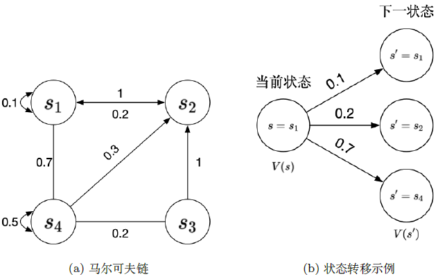
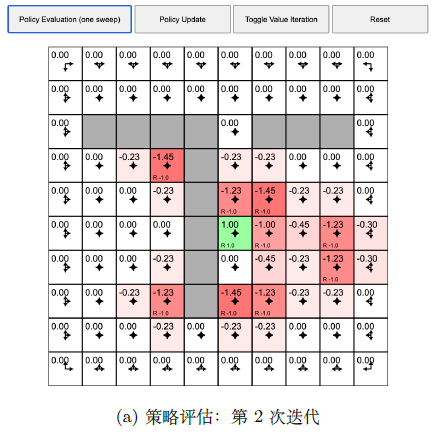

[TOC]

<!--more-->

强化学习中，智能体与环境的交互过程可以用马尔科夫过程表示

- 马尔科夫过程(Markov process, MP)以及马尔科夫奖励过程(Markov reward process, MRP) 是马尔科夫决策过程(Markov decision process,MDP) 的简化过程

- 预测(策略评估)和控制是马尔科夫决策过程中的两种价值函数计算方法

  - 策略评估(policy evaluation)是给定决策后，怎么计算它的价值函数

  - 控制(prediction)是寻找最优策略

    具体有两种算法：策略迭代(policy iteration)和价值迭代(value iteration)

在马尔科夫决策过程中，环境是全部可观测的

- 很多时候，环境中有些量是不可观测的，这种部分可预测的问题也可以转换成马尔科夫决策过程

## 2.0 从随机变量到马尔科夫过程

对于两个相互独立的随机变量 $X$ 和 $Y$ ，可以通过寻找二者的映射关系进行数据分析

对于一组相互影响、有关联关系的非独立随机变量 $s_t,s_{t+1},s_{t+2},\cdots$ ，无法通过拟合的方式寻找变量间的关系，即这些随机变量间构成一个随机过程 $\{s_t\}_{t=1}^{\infty}$ 

具有马尔科夫性质的随机过程称为马尔科夫链/马尔科夫过程

- 一阶马尔科夫链 $P(s_{t+1}\vert s_t,s_{t-1},\cdots)=P(s_{t+1}\vert s_t)$ 
- 二阶马尔科夫链 $P(s_{t+1}\vert s_t,s_{t-1},\cdots)=P(s_{t+1}\vert s_t,s_{t-1})$ 

马尔科夫过程中引入状态空间模型(HMM，Kalman Filter，Praticle Filter)

- 当前观测 $o_i$ 仅与 $s_i$ 有关，与 $s_{i-1}$ 无关

  

马尔科夫奖励过程获得的奖励是随机的

马尔科夫决策过程获得的奖励是定向的，即通过策略影响获得的奖励

- 动态特性是马尔科夫决策过程的一个重要特点
  $$
  P(s',r\vert s,a)\overset{\Delta}{=}P_{r}(S_{t+1}=s',R_{t+1}=r\vert S_t=s,A_t=a)
  $$
  其中 $r$ 也是随机变量，即采取同样的动作从当前状态转移到同一未来状态，奖励也是不确定的

- 状态转移与动态特性的关系
  $$
  P(s'\vert s,a)=\sum\limits_{r\in \mathcal{R}}P(s',r\vert s,a)
  $$

## 2.1 马尔可夫过程

Markov——马尔科夫性质

decision——策略

process——条件概率表示状态转移

### 2.1.1 马尔可夫性质

> 马尔科夫性质(Markov property)指一个随机过程在给定现在状态及所有过去状态下，其未来状态的条件概率分布仅依赖于当前状态。即在给定当前状态下，将来的状态和过去的状态是条件独立的

假设变量 $X_0,X_1,\cdots,X_T$ 构成一个随机过程，这些变量所有可能的取值集合为状态空间，若未来状态 $X_{t+1}$ 对于过去状态序列 $X_{0:t}$ 的条件概率分布仅是 $X_t$ 的一个函数
$$
P(X_{t+1}=s_{t+1}\vert X_{0:t}=s_{0:t})=P(X_{t+1}=s_{t+1}\vert X_t=s_t)
$$
则该随机过程具有马尔科夫性质

## 2.1.2 马尔可夫过程的数学表示

马尔科夫过程是一组具有马尔科夫性质的随机变量序列 $s_1,s_2,\cdots,s_t$ ，其中下一个时刻的状态 $s_{t+1}$ 只取决于当前状态 $s_t$ ，设状态历史为 $h_t=\{s_1,s_2,\cdots,s_t\}$ ，则马尔科夫过程满足：
$$
P(s_{t+1}\vert s_t)=P(s_{t+1}\vert h_t)
$$
- 离散时间的马尔科夫过程称为马尔科夫链(Markov chain)，其状态是有限的

用状态转移矩阵(state transition matrix)P表示状态转移 $P(s_{t+1}=s'\vert s_t=s)$ ，假设有 $N$ 个状态
$$
\mathbf{P}=\begin{pmatrix}
P(s_1\vert s_1)&P(s_2\vert s_1)&\cdots&P(s_N\vert s_1)\\
P(s_2\vert s_1)&P(s_2\vert s_2)&\cdots&P(s_N\vert s_2)\\
\vdots&\vdots&\ddots&\vdots\\
P(s_N\vert s_1)&P(s_N\vert s_1)&\cdots&P(s_N\vert s_N)\\
\end{pmatrix}
$$

在给定马尔科夫链后，对马尔科夫链的一次采样，即可得到一个轨迹

**状态转移是确定的，轨迹是随机的**

## 2.2 马尔可夫奖励过程

> 马尔科夫奖励过程是马尔科夫链加上奖励函数

奖励函数用期望 $R(s)$ 表示，当到达某一个状态时可以获得多大的奖励，一般用向量表示

### 2.2.1 回报与价值函数

**范围** ：每个回合的最大时间步数，用 $T$ 表示

- 一个状态可以多次出现在一个回合中，所以 $T >/</= N$ 都可能出现，$N$ 为马尔科夫过程的状态总数

**回报** ：沿着轨迹的奖励逐步叠加，假设时刻 $t$ 后的奖励序列为 $r_{t+1},r_{t+2},\cdots$ ，则回报定义为
$$
G_t=r_{t+1}+\gamma r_{t+2}+\gamma^2 r_{t+3}+\cdots+\gamma^{T-t-1} r_{T}=\sum\limits_{i=t}^T\gamma^{i-t}r_{i+1},\quad \gamma\in[0,1]\tag{2.1}\label{2.1}
$$
其中，$\gamma$ 为折扣因子，越往后得到的奖励，打的折扣越多，表明我们期望更快地得到尽可能多的奖励

**状态价值函数** ：以某个状态为起始，获得回报的期望
$$
V_t(s)=E[G_t\vert s_t=s]=E[r_{t+1}+\gamma r_{t+2}+\gamma^2 r_{t+3}+\cdots+\gamma ^{T-t-1} r_{T}\vert s_t=s]\tag{2.2}\label{2.2}
$$

回报通过单个轨迹计算所得，状态价值通过多个轨迹计算所得。即回报无法作为状态好坏的评价指标，需要获取以当前状态为起点可以获得回报的期望来作为状态好坏的评价指标(状态价值)
- 当采取确定性策略时，从一个状态出发会得到固定的轨迹，此时 $G_t=V(s_t)$
#### 折扣因子

智能体在选择动作时，会更多地考虑那些能够带来长期利益的行动，而不是追求短期的高回报

有些马尔可夫过程是带环的，我们想量化状态价值就必须避免无穷奖励

- 只是简单的回报相加，对于无穷轨迹，得到的回报是发散的

- 带折扣因子的回报，即使所有奖励都是 $+1$ ，也会收敛
  $$
  G=1+\gamma\cdot 1+\gamma^2\cdot 1+\gamma^3 \cdot 1+\cdots=\frac{1\cdot(1-\gamma^n)}{1-\gamma}\rightarrow\frac{1}{1-\gamma}<1
  $$

我们不能完全信任模型（并不能建立完全模拟环境的模型，对未来的评估未必准确），为了表示这种不确定性，所以对未来的奖励打折扣

若把价值函数看做未来可能获得累积奖励的当前价值表现，则未来奖励与即时奖励不总具有同等价值，其受时间，不确定性和其他因素的影响

若奖励是有实际价值的，我们可能更希望尽快获得奖励（现在的钱比以后更有实际价值）

**折扣因子为强化学习超参数**

- $\gamma=0$ ，只关注当前奖励
- $\gamma=1$ ，当前奖励与未来奖励具有同等价值

### 2.2.2 回报的计算

若 $s_1,s_2,\cdots,s_7$ 构成一个马尔科夫过程，设其奖励函数表示为 $R=[5,0,0,0,0,0,10]$

以 $s_{t+1}=s_4$ 为下一未来状态 ($\gamma=0.5$)来计算回报 $G$ ，计算每个轨迹的回报

### 2.2.3 价值函数的计算方法

#### 蒙特卡洛方法

蒙特卡洛方法(Monte Carlo,MC)：

计算 $E[G_t\vert s_t=s]$ 

生成很多轨迹，计算每条轨迹的回报，回报叠加后取平均值作为价值函数

#### 贝尔曼方程

贝尔曼方程定义了当前状态与未来状态间的价值关系

令 $s_t=s,s_{t+1}=s'$  
$$
V(s)=\underbrace{R(s)}_{即时奖励}+\underbrace{\gamma\sum\limits_{s'\in S}P(s'\vert s)V(s')}_{未来奖励的折扣总和}\tag{贝尔曼方程}\label{BellmanEquation}
$$

##### 贝尔曼方程推导

$$
\begin{align}
V(s)&=E[G_t\vert s_t=s]\\
&=E[r_{t+1}+\gamma r_{t+2}+\gamma^2 r_{t+3}+\cdots+\gamma^{T-t-1}r_{T}\vert s_t=s]\\
&=E[r_{t+1}\vert s_t=s]+\gamma E[r_{t+2}+\gamma r_{t+3}+\cdots+\gamma^{T-t-2}r_{T}\vert s_t=s]\\
&=R(s)+\gamma E[G_{t+1}\vert s_t=s] \tag{2.3}\label{2.3}
\end{align}
$$

令 $G_{t+1}=g'$ ，$E[G_{t+1}\vert s_t=s]=E[g'\vert s]$  ，且 $\sum\limits_{s'\in S}P(s'\vert s)V(s')=E\left[V(s')\vert s\right]$ 

相当于求证 $E[g'\vert s]=E\left[V(s')\vert s\right]$ 

$$
\begin{aligned}
E\left[V(s')\vert s\right]&=E\left[E[g'\vert s']\big\vert s\right]\\
&=E\left[\sum\limits_{g'}P(g'\vert s')\cdot g'\Bigg\vert s\right]\\
&=\sum\limits_{s'}P(s'\vert s)\cdot \sum\limits_{g'}P(g'\vert s',s)\cdot g'\\
&=\sum\limits_{s'}\sum\limits_{g'}\frac{P(g'\vert s',s)\cdot g'\cdot P(s'\vert s)\cdot P(s)}{P(s)}\\
&=\sum\limits_{s'}\sum\limits_{g'}\frac{P(g'\vert s',s)\cdot P(s',s)\cdot g'}{P(s)}\\
&=\sum\limits_{s'}\sum\limits_{g'}\frac{P(g',s',s)\cdot g'}{P(s)}\\
&=\sum\limits_{s'}\sum\limits_{g'}g'\cdot P(g',s'\vert s)\\
&=\sum\limits_{g'}\sum\limits_{s'}g'\cdot P(g',s'\vert s)\\
&=\sum\limits_{g'}g'\cdot P(g'\vert s)\\
&=E\left[g'\vert s\right]
\end{aligned}
$$

故代入 $\eqref{2.3}$ ，得证贝尔曼方程 $\eqref{BellmanEquation}$ 
$$
\begin{align}
V(s)&=R(s)+\gamma E\left[V(s')\vert s\right]\\
&=R(s)+\gamma \sum\limits_{s'\in S}P(s'\vert s)\cdot V(s')\\
&=E[r_{t+1}+\gamma V(s')\big\vert s]
\end{align}
$$

##### 贝尔曼方程的解析解

对于一个马尔科夫过程的 $N$ 个状态 $s_i\in \mathcal{S},i\in [1,N]$ ，可以列出 $N$ 个贝尔曼方程，解得每个状态的价值

- 状态价值向量 $\mathbf{V}=\begin{pmatrix}V(s_1)\\V(s_2)\\\vdots\\V(S_N)\end{pmatrix}$ 

- 即时奖励 $\mathbf{R}=\begin{pmatrix}R(s_1)\\R(s_2)\\\vdots\\R(s_N)\end{pmatrix}$

- 状态转移矩阵
  $$
  \mathbf{P}=\begin{pmatrix}
  P(s_1\vert s_1)&P(s_2\vert s_1)&\cdots&P(s_N\vert s_1)\\
  P(s_2\vert s_1)&P(s_2\vert s_2)&\cdots&P(s_N\vert s_2)\\
  \vdots&\vdots&\ddots&\vdots\\
  P(s_N\vert s_1)&P(s_N\vert s_1)&\cdots&P(s_N\vert s_N)\\
  \end{pmatrix}
  $$

则代入 $\eqref{BellmanEquation}$ ，表示为
$$
\begin{pmatrix}V(s'_1)\\V(s'_2)\\\vdots\\V(S'_N)\end{pmatrix}=\begin{pmatrix}R(s_1)\\R(s_2)\\\vdots\\R(s_N)\end{pmatrix}+\gamma\begin{pmatrix}
P(s_1\vert s_1)&P(s_2\vert s_1)&\cdots&P(s_N\vert s_1)\\
P(s_2\vert s_1)&P(s_2\vert s_2)&\cdots&P(s_N\vert s_2)\\
\vdots&\vdots&\ddots&\vdots\\
P(s_N\vert s_1)&P(s_N\vert s_1)&\cdots&P(s_N\vert s_N)\\
\end{pmatrix}\begin{pmatrix}V(s_1)\\V(s_2)\\\vdots\\V(S_N)\end{pmatrix}
$$
即 
$$
\begin{aligned}
\mathbf{V}&=\mathbf{R}+\gamma\mathbf{P}\mathbf{V}\\
(\mathbf{I-\gamma P})\mathbf{V}&=\mathbf{R}\\
\mathbf{V}&=(\mathbf{I}-\gamma\mathbf{P})^{-1}\mathbf{R}
\end{aligned}
$$
但矩阵求逆的时间复杂度为 $O(N^3)$ ，这种通过解析解的方法只适用于很小量的马尔科夫奖励过程

$I-\gamma P$ 是可逆的：

$(I-\gamma P)^{-1}\ge I$ ：

每个分量都是非负的，且不小于单位值

对每个奖励向量，$(I-\gamma P)^{-1}r\ge r\ge 0$ 

##### 贝尔曼方程的数值解

**迭代法**

- 蒙特卡洛方法
- 动态规划法
- 时序差分学习(temporal-difference learning, TD learning)，前两者的结合

###### 蒙特卡洛方法

$$
\begin{array}{ll}
\hline
&i\leftarrow 0,G_t\leftarrow 0\\
&当i\neq N时，执行\\
&\qquad生成一个回合的轨迹，从状态s和时刻t开始\\
&\qquad使用生成的轨迹计算回报 g=\sum\limits_{j=t}^{T-1}\gamma^{j-t}r_{j+1}\\
&\qquad G_t\leftarrow G_t+g,i\leftarrow i+1\\
&结束循环\\
&V_t(s)=\frac{G_t}{N}\\
\hline
\end{array}
$$

###### 动态规划方法

通过自举(bootstrapping)的方法，不停地迭代贝尔曼方程，当最后更新的状态与上一状态区别不大时，就可以停止迭代，将输出的 $V'(s)$ 作为当前的状态的价值
$$
\begin{array}{ll}
\hline
&对于所有状态s\in S,V'(s)\leftarrow 0,V(s)\leftarrow\infty\\
&当 \Vert V-V'\Vert>\epsilon，执行\\
&\qquad V\leftarrow V'\\
&\qquad 对于所有状态 s\in S,V'(s)=R(s)+\gamma\sum\limits_{s'\in S}P(s'\vert s)V(s')\\
&结束循环\\
& 返回V'(s)\\
\hline
\end{array}
$$

## 2.3 马尔科夫决策过程

### 2.3.1 MDP与MP/MRP

马尔科夫决策过程在马尔科夫奖励的过程基础上多了决策 $a_t$ 

- 马尔科夫性质：$P(s_{t+1}\vert s_t,a_t)=P(s_{t+1}\vert h_t,a_t)$

- 奖励函数：$R(s_t=s,a_t=a)$ 

- 状态转移：$P(s_{t+1}=s'\vert s_t=s,a_t=a)$ 

  - 马尔科夫奖励过程/马尔科夫过程的状态转移是直接的，直接通过状态转移概率决定下一状态 $s_{t+1}$ 

  - 马尔科夫决策过程的状态转移具有一定的不确定性，当前状态与未来状态之间多了一个决策过程。在当前状态下，智能体首先要决定采取哪一种动作，所以智能体进入的未来状态也是一种概率分布

    

对于马尔科夫过程/马尔科夫奖励过程，到达某个状态的价值是确定的，但由于轨迹是随机的，所以最终得到的回报不确定。

对于马尔科夫决策过程，策略产生决策的决策决定状态的变化方向，通过智能体的策略，我们可以尽快地获得尽可能多的回报

#### MDP中的策略

策略定义了在某一状态应该采取什么样的动作。有两种形式

- 概率表示，当前状态下每个采取每个动作的可能性
  $$
  \begin{array}{ll}
  随机性策略&\pi(a\vert s)=P(a_t=a\vert s_t=s)\\
  \end{array}
  $$
  
- 直接输出当前状态应该采取那种动作
  $$
  \begin{array}{ll}
  确定性策略&a\overset{\Delta}{=}\pi(s)或\pi(a\vert s)\overset{\Delta}{=}P(a_t=a\vert s_t=s)=1\\
  \end{array}
  $$

**强化学习中的归纳偏置** ：假设策略函数都是稳定的，故不同时间采取的动作都是对策略函数的采样

#### MDP与MRP

若已知马尔科夫决策过程及策略 $\pi$ ，就可以将马尔科夫决策过程转换为马尔科夫奖励过程

若已知策略函数，相当于在某个状态下，已知可能采取的每个动作的可能性，进而可以知道状态转移的概率
$$
P_\pi(s'\vert s)=\sum\limits_{a\in A}\pi(a\vert s)P(s'\vert s,a)
$$
对于奖励函数，也是类似的
$$
R_\pi(s)=\sum\limits_{a\in A}\pi(a\vert s)R(s,a)
$$

### 2.3.2 MDP中的价值函数

状态价值函数：在当前状态下，基于当前策略可以获得的期望回报
$$
V_\pi(s)=E[G_t\vert s_t=s]
$$
动作价值函数：在某一状态下，基于当前策略生成的某一动作可能得到的期望回报
$$
Q_{\pi}(s,a)=E_{\pi}[G_t\vert s_t=s,a_t=a]
$$
对于一个马尔科夫过程，策略确定后，对动作采样可以使动作价值转换为状态价值
$$
V_\pi(s)=\sum\limits_{a\in A}\pi(a\vert s)Q_\pi(s,a)\tag{V=f(Q)}\label{V=f(Q)}
$$

- 可以将状态价值函数理解为动作价值函数的加权平均，权重为策略

#### 贝尔曼期望方程

##### 贝尔曼动作价值期望方程

对动作价值函数分解，得到Q函数的贝尔曼期望方程
$$
\begin{align}
Q_\pi(s,a)&=E_\pi[G_t\vert s_t=s,a_t=a]\\
&=E_\pi[r_{t+1}+\gamma r_{t+2}+\gamma^2r_{t+3}+\cdots\vert s_t=s,a_t=a]\\
&=E_\pi\left[r_{t+1}+\gamma G_{t+1}\big\vert s_t=s,a_t=a\right]\tag{贝尔曼期望方程-动作}\label{BellmanExpectation_Q}
\end{align}
$$

- 立即奖励
  $$
  \begin{align}
  E_{\pi}[R_{t+1}\vert s_t=s,a_t=a]&=\sum\limits_{r'}P(r'\vert s,a)r'\\
  &=R(s,a)\tag{立即动作奖励}\label{Q_immediate_reward}
  \end{align}
  $$

- 折扣奖励
  $$
  \begin{align}
  E_{\pi}[G_{t+1}\vert s_t=s,a_t=a]&=\sum\limits_{g’}g’P(g’\vert s,a)\\
  &=\sum\limits_{g’}g’\sum\limits_{s’} P(g’,s’\vert s,a)\\
  &=\sum\limits_{s’}\sum\limits_{g’}g’ P(g’,s’\vert s,a)\\
  &=\sum\limits_{s’}\sum\limits_{g’}g’\frac{P(g’,s’,s,a)}{P(s,a)}\cdot\frac{P(s,a)}{P(s’,s,a)}P(s’\vert s,a)\\
  &=\sum\limits_{s’}\sum\limits_{g’}g’\frac{P(g’,s’,s,a)}{P(s’,s,a)}P(s’\vert s,a)\\
  &=\sum\limits_{s’}\sum\limits_{g’}g’P(g’\vert s’,s,a)P(s’\vert s,a)\\
  &=\sum\limits_{s’}E_{\pi}[g’\vert s’,s,a]P(s’\vert s,a)\\
  &\xlongequal{马尔可夫性质}\sum\limits_{s’}E_{\pi}[g’\vert s’]P(s’\vert s,a)\\
  &=\sum\limits_{s’}V_{\pi}(s’)P(s’\vert s,a)\tag{折扣奖励}\label{Q_discounted_reward}\\
  &=E[V_{\pi}(s')\vert s,a]
  \end{align}
  $$

将 $\eqref{Q_immediate_reward}$ 与 $\eqref{Q_discounted_reward}$ 代入 $\eqref{BellmanExpectation_Q}$ 可得
$$
\begin{align}
Q_\pi(s,a)&=E_\pi\left[r_{t+1}\big\vert s_t=s,a_t=a\right]+\gamma E_\pi\left[G_{t+1}\big\vert s_t=s,a_t=a\right]\\
&=R(s,a)+\gamma E[V_{\pi}(s')\vert s,a]\\
&=\sum\limits_{r'}P(r'\vert s,a)r'+\gamma \sum\limits_{s’}V_{\pi}(s’)P(s’\vert s,a)\tag{Q=f(V)}\label{Q=f(V)}
\end{align}
$$

##### 贝尔曼状态价值期望方程

将状态价值函数分解为即时奖励与未来折扣奖励，可以得到状态价值的贝尔曼期望方程
$$
\begin{align}
V_\pi(s)&=E_\pi[G_{t}\vert s_t=s]\\
&=E_\pi\left[r_{t+1}+\gamma r_{t+2}+\gamma^2r_{t+3}+\cdots\big\vert s_t=s\right]\\
&=E_\pi\left[r_{t+1}+\gamma G_{t+1}\big\vert s_t=s\right]
\tag{贝尔曼期望方程-状态}\label{BellmanExpectation_V}
\end{align}
$$

- 立即奖励
  $$
  \begin{align}
  E_{\pi}[R_{t+1}\vert s_t=s]&=\sum\limits_{a}\pi(a\vert s)E[R_{t+1}\vert s_t=s,a_t=a]\\
  &=\sum\limits_{a}\pi(a\vert s)\sum\limits_{r'}P(r'\vert s,a)r'\\
  &=R(s)\tag{立即奖励}\label{V_immediate_reward}
  \end{align}
  $$

- 未来折扣奖励
  $$
  \begin{align}
  E_{\pi}[G_{t+1}\vert s_t=s]&=\sum\limits_{g’}g’P(g’\vert s)\\
  &=\sum\limits_{g’}g’\sum\limits_{s’} P(g’,s’\vert s)\\
  &=\sum\limits_{s’}\sum\limits_{g’}g’ P(g’,s’\vert s)\\
  &=\sum\limits_{s’}\sum\limits_{g’}g’\frac{P(g’,s’,s)}{P(s)}\cdot\frac{P(s)}{P(s’,s)}P(s’\vert s)\\
  &=\sum\limits_{s’}\sum\limits_{g’}g’\frac{P(g’,s’,s)}{P(s,s’)}P(s’\vert s)\\
  &=\sum\limits_{s’}\sum\limits_{g’}g’P(g’\vert s’,s)P(s’\vert s)\\
  &=\sum\limits_{s’}E_{\pi}[g’\vert s’,s]P(s’\vert s)\\
  &\xlongequal{马尔可夫性质}\sum\limits_{s’}E_{\pi}[g’\vert s’]P(s’\vert s)\\
  &=\sum\limits_{s’}V_{\pi}(s’)P(s’\vert s)\\
  &=\sum\limits_{s’}V_{\pi}(s’)\sum\limits_{a}P(s'\vert s,a)\pi(a\vert s)\\
  &=\sum\limits_{a}\pi(a\vert s)\sum\limits_{s’}V_{\pi}(s’)P(s'\vert s,a)\tag{折扣奖励}\label{V_discounted_reward}\\
  &=\sum\limits_{a}\pi(a\vert s)E[V_{\pi}(s')\vert s,a]
  \end{align}
  $$

将 $\eqref{V_immediate_reward}$ 与 $\eqref{V_discounted_reward}$ 代入 $\eqref{BellmanExpectation_V}$ 可得
$$
\begin{align}
V_\pi(s)&=E_\pi\left[R_{t+1}\big\vert s_t=s\right]+\gamma E_\pi\left[G_{t+1}\big\vert s_t=s\right]\\
&=R(s)+\gamma\sum\limits_{a}\pi(a\vert s)E[V_{\pi}(s')\vert s,a]\\
&=\underbrace{\sum\limits_{a}\pi(a\vert s)\sum\limits_{r'}P(r'\vert s,a)r'}_{立即奖励期望}+\underbrace{\gamma\sum\limits_{a}\pi(a\vert s)\sum\limits_{s’}V_{\pi}(s’)P(s'\vert s,a)}_{未来折扣奖励期望}\\
&=\sum\limits_{a}\pi(a\vert s)\left[\sum\limits_{r'}P(r'\vert s,a)r'+\sum\limits_{s’}V_{\pi}(s’)P(s'\vert s,a)\right]\\
&=\sum\limits_{a}\pi(a\vert s)Q_{\pi}(s,a)
\end{align}
$$

##### 价值函数的自举

将 $\eqref{Q=f(V)}$ 与 $\eqref{V=f(Q)}$ 互相代入可得贝尔曼期望方程的迭代形式
$$
\begin{align}
V_\pi(s)&=\sum\limits_{a\in A}\pi(a\vert s)Q_\pi(s,a)\\
&=\sum\limits_{a\in A}\pi(a\vert s)\left(R(s,a)+\gamma \sum\limits_{s'\in S}P(s'\vert s,a)\cdot V_\pi(s')\right)\tag{贝尔曼期望方程-状态迭代式}\label{BellmanExpectation_itV}\\
Q_\pi(s)&=R(s,a)+\gamma \sum\limits_{s'\in S}P(s'\vert s,a)\cdot V_\pi(s')\\
&=R(s,a)+\gamma \sum\limits_{s'\in S}P(s'\vert s,a)\cdot\sum\limits_{a'\in A}\pi(a'\vert s')Q_\pi(s',a')\tag{贝尔曼期望方程-动作迭代式}\label{BellmanExpectation_itQ}
\end{align}
$$

#### 备份图角度理解价值函数关系

备份：迭代关系，对于某一个状态，它的当前价值是与未来价值线性相关的

备份图：对备份图的备份/更新操作，将价值信息从后继未来状态转移回当前状态

状态价值函数的计算分解：定义了未来下一时刻状态价值函数与上一时刻状态价值函数间的关联

- 对于 $(c)$ ，通过 $\eqref{Q=f(V)}$ 计算，对叶子结点的累加，向上备份一层。可以将未来的状态价值 $s'$ 备份到上一层
- 对于 $(b)$ ，通过 $\eqref{V=f(Q)}$ 计算，对父节点的累加，再向上备份一层。可得到当前状态的价值 $s$ 
- 可得，$V(s)$ 的迭代式 $\eqref{BellmanExpectation_itV}$ 

- 对于 $(c)$ ，通过 $\eqref{V=f(Q)}$ 计算，对叶子结点的累加，向上备份一层。可以将未来的动作价值 $s'$ 备份到上一层
- 对于 $(b)$ ，通过 $\eqref{Q=f(V)}$ 计算，对父节点的累加，再向上备份一层。可得到当前动作的价值 $s$ 
- 可得，$V(s)$ 的迭代式 $\eqref{BellmanExpectation_itQ}$

#### 自举法收敛性证明

在使用自举法($\eqref{BellmanExpectation_itQ}$ 与 $\eqref{BellmanExpectation_itV}$)求解贝尔曼期望方程前，还需要考虑 **迭代是否收敛的问题**

以状态价值函数为例，使用迭代算法计算贝尔曼方程写为向量形式如下
$$
V^{(k+1)}=R_{\pi}+\gamma P_{\pi}V^{(k)}
$$
算法迭代过程中会生成一系列状态迭代值 $\{V^{(0)},V^{(1)},V^{(2)},\cdots\}$ ，其中 $R^{(0)}\in R^n$ 是 $V_\pi$ 的一个初始猜测，需要证明的是
$$
\mathbf{V}^{(k)}\rightarrow \mathbf{V}_\pi=(\mathbf{I}-\gamma\mathbf{P}_{\pi})^{-1}\mathbf{R}_{\pi}
$$
证明：

定义状态价值误差 $\delta^{(k)}=V^{(k)}-V_{\pi}$ ，我们的证明转为 $\delta^{(k)}\rightarrow 0$ 

- $V^{(k+1)}=\delta^{(k+1)}+V_{\pi}$ 
- $V^{(k+1)}=R_{\pi}+\gamma P_{\pi}V^{(k)}$ 
  - $V^{(k)}=\delta^{(k)}+V_{\pi}$

$$
\begin{aligned}
\delta^{(k+1)}+V_{\pi}&=R_{\pi}+\gamma P_{\pi}\left(\delta^{(k)}+V_{\pi}\right)\\
\delta^{(k+1)}&=-V_{\pi}+R_{\pi}+\gamma P_{\pi}\left(\delta^{(k)}+V_{\pi}\right)\\
&=\gamma P_{\pi}\delta^{(k)}-V_{\pi}+R_{\pi}+\gamma P_{\pi}V_{\pi}\\
&=\gamma P_{\pi}\delta^{(k)}\\
&=\gamma^2 P^2_{\pi}\delta^{(k-1)}\cdots=\gamma^{k+1} P^{k+1}_{\pi}\delta^{(0)}
\end{aligned}
$$

对于每轮迭代的状态转移矩阵 $P_{\pi}^{(k)}$ 的每个元素都是非负的并且小于1。且 $0\le \gamma \le 1\Rightarrow \gamma ^{k+1}\rightarrow 0$  ，因此，$\delta^{(k+1)}=\gamma^{k+1} P^{k+1}_{\pi}\delta^{(0)} \xrightarrow{k\rightarrow \infty} 0$

故自举法求解贝尔曼期望方程的数值解是收敛于解析解

#### 数值解计算

|      | 预测(策略评估)问题                                           | 控制问题                                                     |
| ---- | ------------------------------------------------------------ | ------------------------------------------------------------ |
| 定义 | 已知马尔科夫决策过程以及要采取的策略 $\pi$ ，计算最大价值函数 $V_{\pi}(s)$ 的过程就是策略评估，或(价值)预测 | 已知马尔科夫决策过程，在所有可能的策略中寻找一个最优的价值函数和最佳策略 |
| 输入 | 马尔科夫决策过程 $<S,A,P,R,\gamma>$ ；策略 $\pi$             | 马尔科夫决策过程 $<S,A,P,R,\gamma>$                          |
| 输出 | 价值函数 $V_{\pi}$                                           | 最佳价值函数 $V^{*}$ 和最佳策略 $\pi^*$                      |

在马尔科夫决策过程中，预测和控制二者是递进关系，通过解决预测问题进而解决控制问题。预测问题和控制问题都可以通过动态规划方法解决

##### MDP与动态规划

**动态规划(dynamic programming, DP)** 适合解决具有 **最优子结构(optimal substructure)** 和 **重叠子问题(overlapping subproblem)** 两个性质的问题

- 最优子结构：问题可由拆分成许多小问题，组合这些小问题的答案，能得到原问题的答案
- 重叠子问题：子问题出现多次，且子问题的解决方案能被重复使用

可以将贝尔曼期望方程分解为递归结构，即 $\eqref{BellmanExpectation_itQ}$ 与 $\eqref{BellmanExpectation_itV}$ 。未来状态的价值函数作为子问题的解与当前状态的价值函数是直接相关的。通过备份图，子问题的价值函数可以被存储并重用。

动态规划应用于马尔科夫决策过程的 **规划** 问题，即环境是已知的，必须知道状态转移概率和对应的奖励

### 2.3.3 DP解决预测问题

**同步迭代** ：将贝尔曼期望备份(Bellman expection backup) 变为迭代过程，反复迭代直到收敛

- 每次迭代都会完全更新所有的状态
- **异步迭代** ：通过某种方式，使得每次迭代不需要更新所有状态

若 $\pi$ 为随机策略，当前状态下采取一个随机动作进入下一个状态，则由 $\eqref{BellmanExpectation_itV}$ 不断迭代，最后价值函数会收敛
$$
V_\pi^{(k)}(s)=\sum\limits_{a\in A}\pi(a\vert s)\left(R(s,a)+\gamma \sum\limits_{s'\in S}P(s'\vert s,a)\cdot V_\pi^{(k-1)}(s')\right)
$$
若 $\pi$ 为确定性策略，只要处于当前状态就采取一个确定动作从而进入下一状态，则贝尔曼决策过程变为一个贝尔曼奖励过程，可对 $\eqref{BellmanEquation}$ 迭代，最后价值函数会收敛
$$
V_\pi^{(k)}(s)=R(s,a)+\gamma P_\pi(s'\vert s)\cdot V_\pi^{(k-1)}(s')
$$
**网格世界例子**

基于当前策略 $\pi$ 迭代一次后，正奖励涂绿一次，负奖励涂红一次

再次迭代，第一次策略评估的状态的周围状态有值，相当于周围状态可以转移到已知状态，所以策略评估每迭代一次，相当于状态价值备份图向上备份一次，周围状态的状态价值可以通过已知状态的状态价值得到

当多次迭代后，各个状态的奖励值都稳定下来，最后值会确定不变，收敛后每个状态的值就是它的状态价值

### 2.3.4 DP解决控制问题

若只是已知马尔科夫决策过程，解决控制问题相当于寻找最佳策略，从而得到最佳价值函数

#### 最优策略

##### 策略对比

对于两个策略 $\pi_1$ 和 $\pi_2$ ，计算在两个策略下每个状态的状态价值，若
$$
V_{\pi_1}(s)\ge V_{\pi_2}(s),s\in \mathcal{S}
$$
则称策略 $\pi_1$ 优于 $\pi_2$ 

##### 最佳状态价值

最佳价值函数定义为
$$
V^*(s)=\max\limits_{\pi}V_{\pi}(s)
$$

##### 最优策略

最优策略指策略 $\pi^*$ ，能让该策略下所有状态的价值达到最佳状态价值，即 $V_{\pi^*}(s)\ge V_{\pi}(s),s\in \mathcal{S}$ 。则称 $\pi^*$ 为最佳策略

#### 策略改进定理与贝尔曼最优方程推导

##### 引例——求解策略相当于求解每个Q值的概率

假设在状态 $s$ 下有三个动作 $a_1,a_2,a_2$ ，其相应的 $Q$ 值为 $q_1,q_2,q_3\in \R$ ，我们试图寻找其权重 $c_1^*,c_2^*,c_3^*$ 使得 $c_1q_1+c_2q_2+c_3q_3$ 最大化，即
$$
\max\limits_{c_1,c_2,c_3}c_1q_1+c_2q_2+c_3q_3,且c_1+c_2+c_3=1,c_1,c_2,c_3\ge 0
$$
假设 $q_3\ge q_1,q_2$ ，对于最优策略，应该让 $c_3^*=1,c_1^*,c_2^*=0$ 
$$
q_3=(c_1^*+c_2^*+c_3^*)q_3\ge c_1^*q_1+c_2^*q_2+c_3^*q_3
$$
受上例启发，$\sum\limits_{a\in \mathcal{A}}\pi(a\vert s)q(s,a)=\max\limits_{a\in \mathcal{A}}q(s,a)$ 

在最优策略下 
$$
\pi^*(a\vert s)=\begin{cases}
1&a=\mathop{\mathrm{argmax}}\limits_{a\in\mathcal{A}}q(s,a)\\
0&a\neq \mathop{\mathrm{argmax}}\limits_{a\in\mathcal{A}}q(s,a)
\end{cases}
$$

##### 贝尔曼最优方程推导

若采取确定性策略 $a=\pi(s)$ ，策略改进公式为

$$
\pi'(a\vert s)=\mathop{\mathrm{argmax}}_aQ_{\pi}(s,a)
$$

> 当采取 $\mathop{\mathrm{argmax}}$ 操作时，会得到单调递增的 $V$ 与 $Q$ ：对 $\forall s$ ，若 $Q_{\pi}(s,\pi'(s))\ge V_\pi(s)$ ，则策略 $\pi'$ 一定优于 $\pi$ 
>
> - 相当于证明：从给定状态 $s$ 由 $\pi'$ 决定动作优于由 $\pi$ 决定动作

- 确定性策略：当前策略下最优动作的 $Q$ 值大于非最优动作的 $Q$ 值，且由于 $\pi'$ 是一种确定性策略，当前状态下最优动作 $a$ 的概率 $\pi(a)=1$ ，故 $V_\pi(s)=\sum\limits_{a\in A}\pi(a\vert s)Q_{\pi}(s,a)\iff Q_{\pi}(s,a)$ 
  $$
  Q_{\pi}(s,\pi'(s))=\max\limits_{a\in \mathcal{A}}Q_{\pi}(s,a)\ge Q_{\pi}(s,\pi(s))=V_{\pi}(s)
  $$

- 若 $\pi$ 是随机策略，则 $Q_{\pi}(s,\pi(s))$ 未必等于 $V_{\pi}(s)$ ，只有在 $Q_{\pi}(s,\pi'(s))\ge V_\pi(s)$ 的前提下，才有非递增性

$$
\begin{aligned}
V_{\pi}(s)&\le Q_{\pi}(s,\pi'(s))\xlongequal{\eqref{BellmanExpectation_Q}}\sum\limits_{a}\pi(a\vert s)E\left[r_{t+1}+\gamma V_{\pi}(s_{t+1})\big\vert s_t=s,a_t=\pi'(s)\right]\\
&=E_{\pi'}\left[r_{t+1}+\gamma V_{\pi}(s_{t+1})\big\vert s_t=s\right]\\
&\le E_{\pi'}\left[r_{t+1}+\gamma Q_{\pi}(s_{t+1},\pi'(s_{t+1}))\big\vert s_t=s\right]\\
&=E_{\pi'}\left[r_{t+1}+\gamma E_{\pi'}[r_{t+2}+\gamma V_{\pi}(s_{t+3})\vert s_{t+1}]\big\vert s_t=s\right]\\
&=E_{\pi'}\left[r_{t+1}+\gamma r_{t+2}+\gamma^2 V_{\pi}(s_{t+2})\big\vert s_t=s\right]\\
&\le E_{\pi'}\left[r_{t+1}+\gamma r_{t+2}+\gamma^2 Q_{\pi}(s_{t+2},\pi'(s_{t+2}))\big\vert s_t=s\right]\\
&\le \cdots\\
&\le E_{\pi'}\left[r_{t+1}+\gamma r_{t+2}+\gamma^2 r_{t+1}+\cdots\big\vert s_t=s\right]=V_{\pi'}(s)
\end{aligned}
$$

- 其中，$E_{\pi'}\left[r_{t+1}+\gamma V_{\pi}(s_{t+1})\big\vert s_t=s\right]$ 表示在状态 $s$ 时采用策略 $\pi'$ 生成的动作，未来后继状态仍采用策略 $\pi$ 生成的动作。

不断迭代，直至收敛后，有
$$
Q_{\pi}(s,\pi'(s))=\max\limits_{a\in \mathcal{A}}Q_{\pi}(s,a)\xlongequal{满足迭代终止条件}Q_{\pi}(s,\pi(s))=V_\pi(s)
$$
因此，可得贝尔曼最优方程
$$
V_{\pi}(s)=\max\limits_{a\in \mathcal{A}}Q_{\pi}(s,a)
$$
即最佳策略下的一个状态价值必须等于这个状态下采取最好动作获得的回报期望，此时的状态价值为最佳状态价值

而对于随机策略，贝尔曼最优方程为
$$
\begin{align}
V_{\pi}(s)&=\max\limits_{\pi}\sum\limits_{a\in \mathcal{A}}\pi(a\vert s)Q_{\pi}(s,a)\tag{BellmanOptimalityEquation}\label{BellmanOptimalityEquation}\\
&=\max\limits_{\pi}\sum\limits_{a\in \mathcal{A}}\pi(a\vert s)\left(\sum\limits_{r'}P(r'\vert s,a)r'+\gamma \sum\limits_{s’}V_{\pi}(s’)P(s’\vert s,a)\right)
\end{align}
$$
##### 关注几个问题

- 如何求解贝尔曼最优方程
- 最优策略的存在性
- 最优策略的唯一性
- 贝尔曼最优方程的解是否具有最优性
- 最优策略是确定性策略还是随机性策略

#### 贝尔曼最优方程求解

对于贝尔曼最优方程，已知条件为

- MDP的动态特性：$P(r'\vert s,a)$ 与 $P(s'\vert s,a)$ 
- 对于 $V(s')$ 我们会设定随机初始值，相当于已知 $Q_{\pi}(s)$ 

其向量形式表示为
$$
V=\max\limits_{\pi}(R_{\pi}+\gamma P_{\pi}V)
$$
令 $f(V)=\max\limits_{\pi}(R_{\pi}+\gamma P_{\pi}V)$ ，则有 $V=f(V)$ ，其中 $f(V)$ 是 $N$ 维向量
$$
\vert f(V)\vert_{N}=\max\limits_{\pi}\sum\limits_{a}\pi(a\vert s)Q(s,a),s\in \mathcal{S}
$$

##### 引理

###### 收缩映射

若函数 $f$ 满足
$$
\Vert f(x_1)-f(x_2)\Vert\le \gamma \Vert x_1-x_2\Vert ,\gamma \in (0,1)
$$
则称 $f$ 为 **收缩映射(收缩函数)**

###### 收缩映射定理(不动点定理)

不动点：对于随机变量 $x\in X$ ，若满足 $x=f(x)$ ，则称其为函数 $f:X\mapsto X$ 的一个不动点

> 收缩映射定理：用于求解 $x=f(x)$ 的解

只要函数 $f$ 具有收缩映射性质，则一定存在一个不动点 $x^*$ 满足 $x^*=f(x^*)$ 

- 唯一性：对于一个收缩映射，其不动点是唯一的(最优价值是唯一的)

  存在多个策略可以获取最优价值

- 求解方法——价值迭代

  随机指定初始值 $x^{(0)}$ ，通过收缩映射 $x^{(k+1)}=f(x^{(k)})$ 产生一个随机变量序列 $\{x^{(k)}\}$ ，则有 $x^{(k)}\xrightarrow{k\rightarrow \infty}x^*$ ，且呈指数级别收敛与不动点

---

**eg** ：对于 $f(x)=0.5x$ ，求解其不动点

$f(x)=0.5x$ 是一个收缩映射
$$
\Vert0.5x_1-0.5x_2 \Vert= 0.5\Vert x_1-x_2\Vert\le \gamma \Vert x_1-x_2\Vert,\gamma \in (0.5,1]
$$

- 同理，对于 $x=f(x)=Ax$ 也是一个收缩映射，当 $x\in \R^N,A\in \R^{N\times N},\Vert A\Vert \le \gamma <1$ 
  $$
  \Vert A x_1-Ax_2 \Vert= A\Vert x_1-x_2\Vert\le \gamma \Vert x_1-x_2\Vert,\gamma \in (\Vert A\Vert,1]
  $$

相当于求解 $x=f(x)$ ，设定初始值 $x^{(0)}=10$ ，则有
$$
x^{(1)}=f(x^{(0)})=5\\
x^{(2)}=f(x^{(1)})=2.5\\
\vdots\\
x^{(k+1)}=f(x^{(k)})=0
$$
则有不动点 $x^{(*)}=x^{(k+1)}=0$

##### 收缩映射定理应用于求解贝尔曼最优方程

