免模型学习的价值函数计算方法

- 蒙特卡洛方法：将策略迭代中，基于模型的部分替换为免模型部分

  更新时间：2024-2-24 10:28:04

- 时序差分方法

  更新时间：2024-2-27 23:34:53

[TOC]

<!--more-->

# 免模型RL

策略迭代分为 策略评估 (policy evaluation) 和 策略改进(policy improvement) 两个步骤

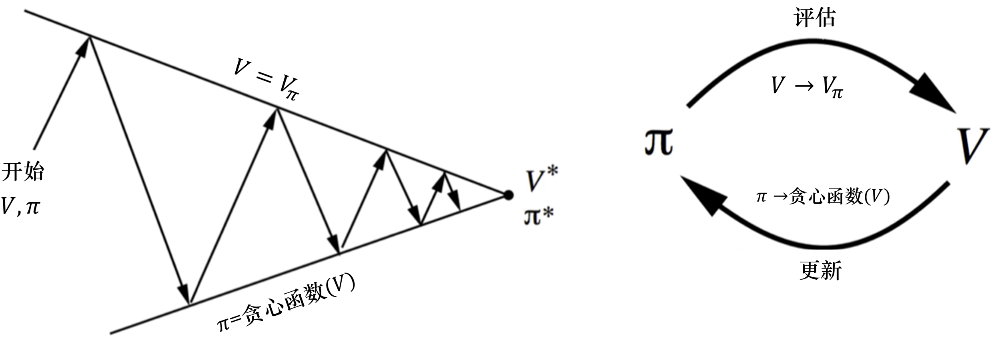

PE：$\mathbf{V}_{\pi^{(t)}}=\mathbf{R}_{\pi^{(t)}}+\gamma P_{\pi^{(t)}}\mathbf{V}_{\pi^{(t)}}$

PI：$\pi^{(t+1)}=\mathop{\mathrm{argmax}}\limits_{\pi}\left(\mathbf{R}_{\pi}+\gamma P_{\pi}\mathbf{V}_{\pi^{(t)}}\right)$

对于策略改进步骤，通过贪心方法改进策略
$$
\begin{aligned}
\pi^{(t+1)}(a\vert s)&=\mathop{\mathrm{argmax}}\limits_{\pi}\sum\limits_{a}\pi(a\vert s)\left[\sum\limits_{r'}P(r'\vert s,a)r'+\sum\limits_{s'}P(s'\vert s,a)V_{\pi^{(t)}}(s')\right]\\
&=\mathop{\mathrm{argmax}}\limits_{\pi}\sum\limits_{a}\pi(a\vert s)Q_{\pi^{(t)}}(s,a),s\in \mathcal{S}
\end{aligned}
$$
若环境动态特性 $P(s',r\vert s,a)$ 已知，可通过对动态规划方法计算 $Q_{\pi^{(t)}}(s,a)$ 

但在很多实际任务中，**MDP的环境并不是可知的**，即状态转移函数 $P(s'\vert s,a)$ 及奖励函数 $R(s,a)$ 是未知的，**智能体只能通过采样到的数据来学习，这种方法统称为无模型强化学习**（model-free reinforcement）

将策略迭代进行广义推广，得到 **广义策略迭代** (generalized policy iteration,GPI)

- 不断地在 *策略评估, PE* 与 *策略改进, PI* 之间切换
- 策略评估不需要精确的 $Q$ 值与 $V$ 值

将蒙特卡洛方法或时序差分方法引入策略评估来计算当前策略的价值函数 $Q$ ，可以在不知道MDP环境的情况下，完成价值函数的优化并得到最佳策略，实现免模型控制

若环境动态特性 $P(s',r\vert s,a)$ 未知，则采用蒙特卡洛方法计算：
$$
Q_{\pi^{(t)}}(s,a)=E_{\pi^{(t)}}[G_{t}\vert s_t=s,a_t=a]\\
\downarrow\\
均值估计问题\leftarrow MC方法/TD方法
$$

# 免模型预测

## 3.1 蒙特卡洛方法

> 基于蒙特卡洛方法的免模型学习是一种 **广义策略迭代** 
>
> 蒙特卡洛方法使用 **均值估计回报期望** 的方法估计奖励，这样就不需要MDP中的状态转移函数与奖励函数。但蒙特卡洛方法的局限性是必须用在有终止的马尔科夫决策过程中。

- MC基本思想

- MC Basic：实现从有模型学习到无模型学习的转化
- MC探索性开始
  - 提高数据的使用效率
- 去除探索性开始条件
  - MC $\varepsilon-贪心$ 

### 3.1.1 蒙特卡洛基本思想

掷硬币，用随机变量 $X$ 表示结果，$+1,-1$ 表示两种结果，求期望 $E[X]$

- 基于模型的方法

  当我们已知硬币是均匀的，或任何能保证得出 $P(X=+1)=P(X=-1)=0.5$ 的条件，在这种先验知识的条件下，我们可以对实验环境进行建模，用 $P(X=+1)=P(X=-1)=0.5$  表示环境模型，进而可基于模型的方法估计期望

  $E[X]=\sum\limits_{x}xP(x)=0$ 

- 基于MC的方法：**采样取平均** 

  在不知道任何先验知识的前提下，就无法对实验环境进行建模

  无模型时用数据(经验,experience)：通过多次实验，可以得到样本集 $\{x_1,x_2,\cdots,x_N\}$ 
  $$
  E[X]\approx \overline{X}=\frac{1}{N}\sum\limits_{j=1}^Nx_j
  $$
  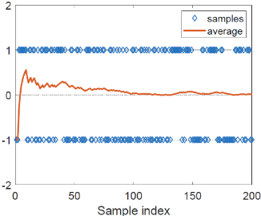

  可见，随着实验次数的增多，$\overline{X}\xrightarrow{N\rightarrow \infty}E[X]$ 

#### MC方法理论依据——大数定律

对于一个随机变量 $X$ ，假设 $\{x_j\}_{j=1}^{N}$ 是独立同分布样本集，令 $\overline{X}=\frac{1}{N}\sum\limits_{j=1}^Nx_j$ ，则有，
$$
E[\overline{X}]=E[X]\\
Var[\overline{X}]=\frac{1}{N}Var[X]
$$
即 $\overline{X}$ 是 $E[X]$ 的无偏估计，且方差随着实验次数的增多减小（有收敛性）

### 3.1.2 MC Basic

#### MC Basic算法

1. 从 $(s_j,a_j)$ 开始，基于策略 $\pi^{(t)}$ 生成轨迹 $\tau$ 

2. 计算 $\tau$ 的回报 $g(s_j,a_j)$ 
   $$
   g^{(i)}(s_j,a_j)=r(s_j,a_j)+\gamma r(s_{j+1},a_{j+1})+\gamma^2r(s_{j+2},a_{j+2})+\cdots
   $$

   - 若采用确定性策略，且环境也是确定的。若估计 $Q(s_1,a_1)$ ，则基于当前策略 $\pi^{(t)}$ 从 $(s_1,a_1)$ 出发，不管采样多少次，得到的轨迹都是同一条，故只需要采样一次。因此估计整个Q表只需要 $\sum\limits_{s\in \mathcal{S}} \vert \mathcal{A}(s)\vert$ 条轨迹，即 $N=1$ 
   - 若采用随机性策略或确定性策略但环境是随机的。若估计 $Q(s_1,a_1)$ ，则基于当前策略 $\pi^{(t)}$ 从 $(s_1,a_1)$ 出发，需要采集从 $(s_1,a_1)$ 出发的 $N$ 条轨迹才能估计其状态价值 $Q(s_1,a_1)$ 。因此估计整个Q表共需计算 $\sum\limits_{s\in \mathcal{S}} \vert \mathcal{A}(s)\vert\times N$ 条轨迹的回报，且 $N$ 为足够大的数值

3. 执行 $N$ 次 1,2 步，可得到一个回报集 $\{g^{(i)}(s_j,a_j)\}_{i=1}^N$ ，计算动作价值
   $$
   Q_{\pi^{(t)}}(s_j,a_j)=E_{\pi^{(t)}}[G_{t}\vert s_j,a_j]\approx\overline{g}(s_j,a_j)=\frac{1}{N}\sum\limits_{i=1}^Ng^{(i)}(s_j,a_j)
   $$

##### 伪代码

$$
\begin{array}{ll}
\hline
&初始化： \\
&\quad \pi^{(0)}(a\vert s)\in A(s)(随机初始化)，对于所有的 s\in \mathcal{S}\\
&\quad Q(s,a)\in R(s,a)(随机初始化)，对于所有的 s\in \mathcal{S},a\in \mathcal{A}\\
&\quad R(s,a)\leftarrow 空值，对于所有的 s\in \mathcal{S},a\in \mathcal{A}\\
&目标：寻找最优策略\\
&当策略未收敛，进行第 t+1 轮迭代:\\
&\quad 对于每个状态 s\in \mathcal{S}:\\
&\qquad  MC-based 策略评估:\\
&\quad\qquad 对于每个动作a\in \mathcal{A}(s):\\
&\quad\qquad \qquad 以(s,a) 为起点，基于策略\pi^{(t)} 生成足够多的回合，\\
&\quad\qquad \qquad 计算从(s,a)开始的轨迹的回报均值\overline{g}(s,a)\\
&\quad\qquad \qquad 将回报均值作为动作价值Q_{\pi^{(t)}}(s,a)=\overline{g}(s,a)\\
&\qquad MC-based 策略改进：\\
&\qquad \quad \pi^{(t+1)}(s)=\begin{cases}
1&,a=a^*_{\pi^{(t)}(s)}\\
0&,a\neq a^*_{\pi^{(t)}(s)}
\end{cases}\qquad a^*_{\pi^{(t)}(s)}=\mathop{\mathrm{argmax}}\limits_{a}Q_{\pi^{(t)}}(s,a) \\
\hline
\end{array}
$$

#### MC Basic例子

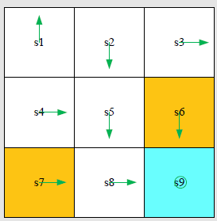

- 初始策略 $\pi^{(0)}$ 
- 奖励设置 $r_{boundary}=-1,r_{forbidden}=-1,r_{target}=1,\gamma=0.9$ 

对于当前策略 $\pi^{(t)}$ 

1. 策略评估：计算 $Q_{\pi^{(t)}}(s,a)$ 

   对于示例，有9个状态，每个状态由5个动作，即 $Q$ 表需要计算 $9\times 5=45$ 个 $Q$ 值，由于此例采用确定性策略，所以只需要45条轨迹

2. 策略改进：贪心算法选择最优决策
   $$
   a^*_{\pi^{(t)}(s)}=\mathop{\mathrm{argmax}}\limits_{a}Q_{\pi^{(t)}}(s,a)
   $$

以 $Q_{\pi^{(0)}}(s_1,a)$ 的计算为例

**1. 策略评估** 

从 $(s_1,a_1)$ 开始，轨迹为 $s_1\xrightarrow{a_1}s_1\xrightarrow{a_1}s_1\xrightarrow{a_1}\cdots$ ，动作价值为
$$
Q_{\pi^{(0)}}(s_1,a_1)=-1+\gamma(-1)+\gamma^2(-1)+\cdots=-\frac{1}{1-\gamma}
$$
从 $(s_1,a_2)$ 开始，轨迹为 $s_1\xrightarrow{a_2}s_2\xrightarrow{a_3}s_5\xrightarrow{a_3}s_8\xrightarrow{a_2}s_9\xrightarrow{a_5}s_9\cdots$ ，动作价值为
$$
Q_{\pi^{(0)}}(s_1,a_2)=0+\gamma(0)+\gamma^2(0)+\gamma^3(1)+\cdots=\frac{\gamma^3}{1-\gamma}
$$
从 $(s_1,a_3)$ 开始，轨迹为 $s_1\xrightarrow{a_3}s_4\xrightarrow{a_2}s_5\xrightarrow{a_3}s_8\xrightarrow{a_2}s_9\xrightarrow{a_5}s_9\cdots$ ，动作价值为
$$
Q_{\pi^{(0)}}(s_1,a_3)=0+\gamma(0)+\gamma^2(0)+\gamma^3(1)+\cdots=\frac{\gamma^3}{1-\gamma}
$$
从 $(s_1,a_4)$ 开始，轨迹为 $s_1\xrightarrow{a_4}s_1\xrightarrow{a_1}s_1\xrightarrow{a_1}s_1\xrightarrow{a_1}\cdots$ ，动作价值为
$$
Q_{\pi^{(0)}}(s_1,a_4)=-1+\gamma(-1)+\gamma^2(-1)+\cdots=-\frac{1}{1-\gamma}
$$
从 $(s_1,a_5)$ 开始，轨迹为 $s_1\xrightarrow{a_5}s_1\xrightarrow{a_1}s_1\xrightarrow{a_1}s_1\xrightarrow{a_1}\cdots$ ，动作价值为
$$
Q_{\pi^{(0)}}(s_1,a_5)=0+\gamma(-1)+\gamma^2(-1)+\cdots=-\frac{\gamma}{1-\gamma}
$$
**2. 策略改进**

通过观察动作价值，可知在 $s_1$ 时，最佳动作是 $a_2,a_3$ 
$$
Q_{\pi^{(0)}}(s_1,a_2)=Q_{\pi^{(0)}}(s_1,a_3)
$$
因此，策略改进为
$$
\pi^{(1)}(a_2\vert s_1)或\pi^{(1)}(a_3\vert s_1)=1
$$

#### MC Basic特点

MCBasic算法是MC-based RL的核心，但由于其数据利用效率低，所以并不实用

因为策略迭代算法是收敛的，所以有足够回合数据的MC Basic也是收敛的

回合长度，**直观上可以理解为探索半径**。理论上越长越好，可以使计算出的回报更为精确，但实际上不可能无穷长，只要能让所有状态到达目标状态即可

##### 关于回合长度的例子

- 奖励设置 $r_{boundary}=-1,r_{forbidden}=-10,r_{target}=1,\gamma=0.9$ 

通过当前策略可到达目标状态的当前状态，其状态价值是正数；0表示未到达目标，若为负数，则表示有进入禁入区域或越界的中间状态

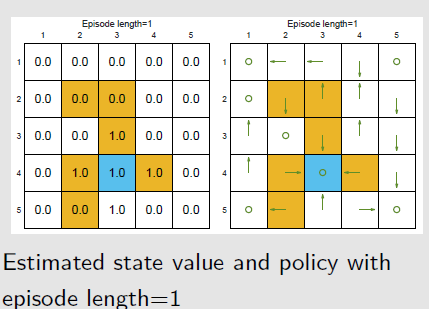

当回合长度为1时，只有目标状态一步之内的状态的最佳策略是正确的

当回合长度短时，只有离目标状态近的状态才有非0的状态价值，进而找到最优的策略；随着回合长度的增加，离目标状态远的状态才能到达目标状态，从而找到最优策略

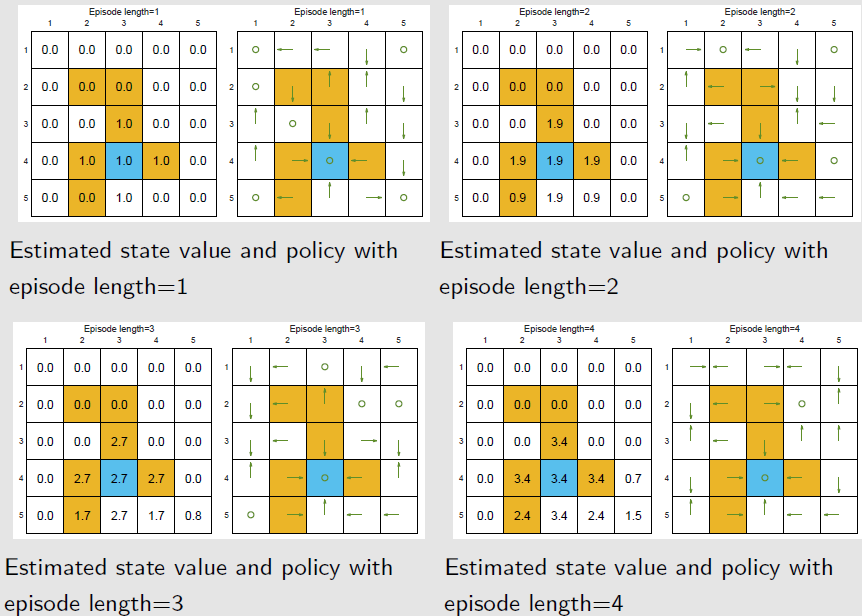

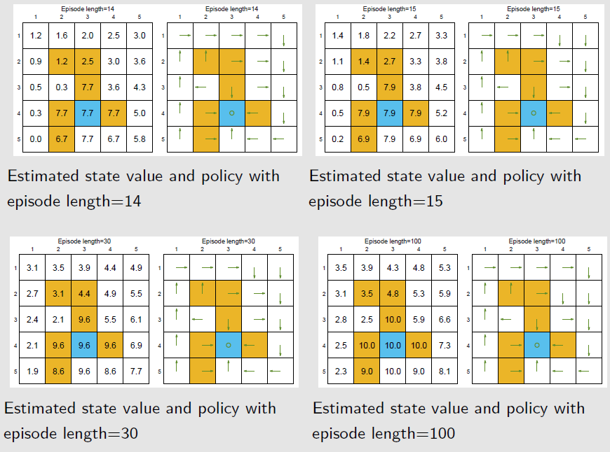

### 3.1.3 探索性开始

#### MC算法中探索性开始的必要性

探索性开始：为找到每个状态下的最优动作，需要计算所有 *状态-动作* 对的动作价值，同时且以每个 *状态-动作* 对为开始的轨迹都要有很多条

**探索**：确保每个 $(s,a)$ 都能被访问到

- 需要保证从一个访问出发有多个回合，只有这样才能用后边的奖励来估计回报，进一步估计动作价值
- 同时，为了不遗漏最优决策，需要保证每个$(s,a)$ 都能够被访问到

**开始** ：要生成以 $(s,a)$ 开始的回合

- 若要计算以 $(s,a)$ 开始的回合的回报，有两种方法

  - start：以 $(s,a)$ 开始的回合
  
  
    - visit 从其他 $(s',a')$ 开始，中间经过 $(s,a)$ ，将回合前截断，计算 $(s,a)$ 之后的回报
  
      但由于轨迹的生成依赖于策略与环境，无法保证以 $(s,a)$ 开始仍能获取后续轨迹，即不保证可复现
  

#### 提高策略评估的效率

> 访问：在每个回合中，每出现一次 $(s,a)$ 都为对其的一次访问

- 数据的高效利用
- 策略更新时机：离线N回合变为离线1回合

##### 数据的高效利用

一个以 $(s_1,a_2)$ 开始的回合，仅用于计算 $Q(s_1,a_2)$ ，并未充分利用这一轨迹数据

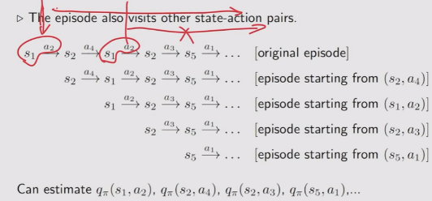

**一个回合可以作为多个Q值的经验** 

**一个回合可以作为一个Q值的多个经验**

- 采用 *first-visit* 方法，对于出现在同一个回合中的多个同一访问 $(s_j,a_j)$ ，只将其第一次出现之后的轨迹作为 $(s_j,a_j)$ 的一条轨迹

- 采用 *every-visit* 方法，对于出现在同一个回合中的多个同一访问 $(s_j,a_j)$ ， 将每个 $(s_j,a_j)$ 之后的轨迹都作为 $(s_j,a_j)$ 的一条轨迹

##### 策略更新时机

N回合更新策略，变为1回合后更新策略

- 在MC Basic 算法的策略评估中，若评估 $(s_1,a_1)$ 的动作价值 $Q(s_1,a_1)$ ，则需要收集 $N$ 条以 $(s_1,a_1)$ 开始的轨迹，然后计算这些轨迹的回报均值去近似动作价值

  完成策略评估后，才能更新在 $Q(s_1,a_1)$ 的策略

- 使用一回合的回报更新所有相关的动作价值

  优点：可以逐回合改进策略

#### 伪代码：MC探索性开始

$$
\begin{array}{ll}
\hline
&初始化：初始化策略\pi^{(0)},Q(s,a),Return(s,a)=0,Num(s,a)=0,\forall s\in \mathcal{S},a\in \mathcal{A}(s)\\
&目标：寻找最优策略\\
&\\
&对于第t个回合:\\
&\quad生成回合:随机选择回合起点(s_0,a_0)，并确保所有的访问都有可能被选择到。\\
&\quad \qquad\qquad 基于当前策略 \pi^{(t)}生成回合长度为H的回合:s_0,a_0,r_0,\cdots,s_{H-1},a_{H-1},r_{H}\\
&\quad 初始化:g\leftarrow 0\\
&\quad 对于一个回合的每个状态，j=H-1,H-2,\cdots,0:\\
&\qquad g\leftarrow \gamma g+r_{j+1}\\
&\qquad 使用first-visit处理，回合中只有第一次出现才算(s_j,a_j)的经验:\\
&\quad \qquad若(s_j,a_j)未出现在前子轨迹(s_0,a_0,s_1,a_1,\cdots,s_{j-1},a_{j-1}),则:\\
&\qquad \qquad Return(s_j,a_j)\leftarrow Return(s_j,a_j)+g \\
&\qquad \qquad Num(s_j,a_j)\leftarrow Num(s_j,a_j)+1\\
&\qquad \qquad 策略评估：动作回报的均值作为动作价值\\
&\quad\qquad \qquad Q(s_j,a_j)=Return(s_j,a_j)/Num(s_j,a_j)\\
&\qquad \qquad 策略改进：\\
&\quad \qquad \qquad \sum\pi^{(t+1)}(a^*\vert s_j)=1,其中a^*=\mathop{\mathrm{argmax}}\limits_{a}Q_{\pi^{(t)}}(s_j,a) 
\\
\hline
\end{array}
$$

### 3.1.4 MC无探索性开始

实际中，探索性开始很难实现。以每个 $(s,a)$ 为开始的回合收集成本很高

> 软策略,soft policy：每个动作都有概率被采用的策略，称为soft policy
> $$
> \begin{cases}
> 确定性策略\leftarrow 贪心算法\\
> 随机性策略\leftarrow 软策略
> \end{cases}
> $$

soft policies：去除探索性开始的条件

- **使用软策略，可以确保一些回合足够长，使得所有的 $(s,a)$ 都能出现足够的次数，只需要从一个或几个 $(s,a)$ 出发，就能覆盖到其他的访问，从而不需要大量的回合数据**

#### $\varepsilon-贪心$ 

在强化学习中，使用的软策略为 $\varepsilon-贪心$ 算法
$$
\begin{aligned}
&\pi(a\vert s)=\begin{cases}
1-\frac{\varepsilon}{\vert \mathcal{A}(s)\vert}(\vert \mathcal{A}(s)\vert-1)&,对于最优动作\\
\frac{\varepsilon}{\vert \mathcal{A}(s)\vert}&,对于其他 \vert \mathcal{A}(s)\vert-1个非最优动作
\end{cases}\\
&其中，\varepsilon\in[0,1]，\vert \mathcal{A}(s)\vert为状态s的动作数
\end{aligned}
$$

- 若 $\varepsilon=0.2$ ，$\vert \mathcal{A}(s)\vert=5$ ，则非最优动作的概率为 $\frac{0.2}{5}=0.04$ ，最优动作的概率为 $1-0.04\times 4=0.84$ 
- $\epsilon$ 探索，相当于所有动作随机取，包括最优动作；$1-\epsilon$ 利用，但由于 $1-\epsilon$ 的利用再加上探索平均分配到的 $\frac{\epsilon}{\vert \mathcal{A}(s)\vert}$ ，所以取到最优动作的概率一定大于非最优动作

$\varepsilon-贪心$ 可以更好地平衡探索与利用

- $\varepsilon=0$ ，变为贪心策略，探索少但利用多
- $\varepsilon=1$ ，每个动作都被平等探索，探索多但利用少

#### 将 $\varepsilon-贪心$ 应用于强化学习 

在MC Basic与MC探索性开始算法中，将策略改进步骤的贪心算法改为 $\varepsilon-贪心$ 算法

- 贪心算法 $\pi^*(a\vert s)=\mathop{\mathrm{argmax}}\limits_{\pi\in \Pi}\sum\limits_{a}\pi(a\vert s)Q_{\pi}(s,a)$ ，所有可能策略 $\Pi$ 中使状态价值最大的策略为最优策略
  $$
  \pi^{(t+1)}(a\vert s)=\begin{cases}
  1,&a=a^*_{\pi^{(t)}}\\
  0,&a\neq a^*_{\pi^{(t)}}
  \end{cases},\quad 其中,a^*_{\pi^{(t)}}=\mathop{\mathrm{argmax}}\limits_{a\in \mathcal{A}(s)}Q_{\pi^{(t)}}(s,a)
  $$
  
- $\varepsilon-贪心$ 算法 $\pi^{*}(a\vert s)=\mathop{\mathrm{argmax}}\limits_{\pi\in \Pi_{\varepsilon}}\sum\limits_{a}\pi(a\vert s)Q_{\pi}(s,a)$ ，非最优决策等可能的策略 $\Pi_{\varepsilon}$ 中使状态价值最大的策略为最优策略
  $$
  \pi^{(t+1)}(a\vert s)=\begin{cases}
  1-\frac{\varepsilon}{\vert \mathcal{A}(s)\vert}(\vert \mathcal{A}(s)\vert-1)&,a=a^*_{\pi^{(t)}}\\
  \frac{\varepsilon}{\vert \mathcal{A}(s)\vert}&,a\neq a^*_{\pi^{(t)}}
  \end{cases}
  $$

##### 伪代码

$$
\begin{array}{ll}
\hline
&初始化：初始化策略\pi^{(0)},\varepsilon\in [0,1],Q(s,a),Return(s,a)=0,Num(s,a)=0,\forall s\in \mathcal{S},a\in \mathcal{A}(s)\\
&Return(s,a)为动作(s,a)的总回报，(s,a)为动作a的总次数\\
&目标：寻找最优策略\\
&\\
&对于第t个回合:\\
&\quad 生成回合:随机选择回合起点(s_0,a_0),基于当前策略 \pi^{(t)}生成回合长度为H的回合:s_0,a_0,r_1,\cdots,s_{H-1},a_{H-1},r_{H}\\
&\quad 初始化:g\leftarrow 0\\
&\quad 对于一个回合的每一步，j=H-1,H-2,\cdots,0:\\
&\qquad 使用every-visit方法:\\
& \qquad \qquad g\leftarrow \gamma g+r_{j+1}\\
& \qquad \qquad Return(s_j,a_j)\leftarrow Return(s_j,a_j)+g\\
& \qquad \qquad Num(s_j,a_j)\leftarrow Num(s_j,a_j)+1\\
&\qquad \qquad 策略评估:\\
&\quad\qquad \qquad Q(s_j,a_j)=Return(s_j,a_j)/Num(s_j,a_j)\\
&\qquad \qquad 策略改进:\\
&\quad\qquad \qquad 令a_{\pi^{(t)}(s_j)}^*=\mathop{\mathrm{argmax}}\limits_{a}Q(s_j,a)，且\pi^{(t+1)}(a\vert s_j)=\begin{cases}
1-\frac{\varepsilon}{\vert \mathcal{A}(s_j)\vert}(\vert \mathcal{A}(s)\vert-1)&,a=a_{\pi^{(t)}(s_j)}^*\\
\frac{\varepsilon}{\vert \mathcal{A}(s_j)\vert}&,a\neq a_{\pi^{(t)}(s_j)}^*
\end{cases}\\
\hline
\end{array}
$$

##### 策略改进定理

> 任何一个 $\varepsilon-贪心$ 策略 $\pi$ 的 $argmax$ 改进策略 $\pi'$ 都是关于 $Q_{\pi}$ 的一个正向改进，即 $V_{\pi}(s)\le V_{\pi'}(s)$

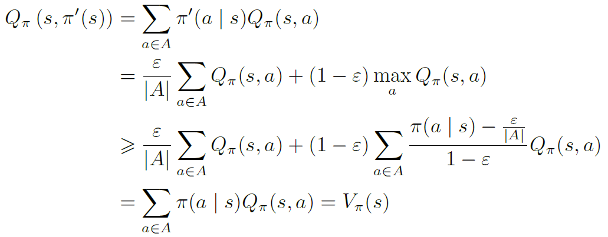

#### 特点

优点： $\varepsilon$ 越大，探索性越强，避开了探索性开始的条件

缺点：生成的最优策略的最优性越差

- 由于 $\varepsilon-贪心$ 生成的最优策略 $\pi^*_{\varepsilon}$ 仅是属于 $\Pi_{\varepsilon}$ 中的最优策略

- **$\varepsilon$不能太大**  ：当 $\varepsilon$ 小时，探索性小， $\varepsilon-贪心$ 就趋于贪心，用 $\varepsilon-贪心$ 找到的最优策略接近于贪心算法找到的最优策略

  **实际中，开始时 $\varepsilon$ 比较大，让其具有较强的探索能力；之后让 $\varepsilon$ 趋向于0确保得到的策略具有最优性**

#### 例子

##### $\varepsilon$ 越大，探索性越强

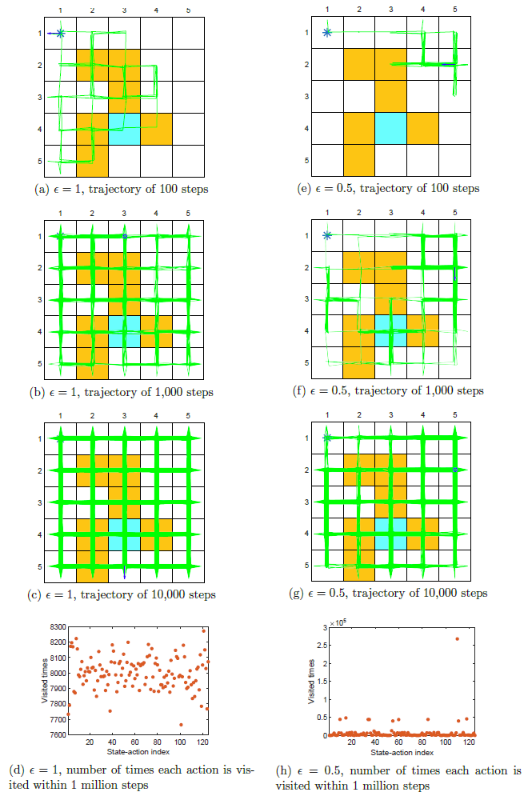

共125个 $(s,a)$，$\varepsilon$ 较大，探索性强，一个100 0000步的回合就探索了很多(s,a)

两个1000000步的回合就能找到基于 $\varepsilon-贪心$ 的最优策略 

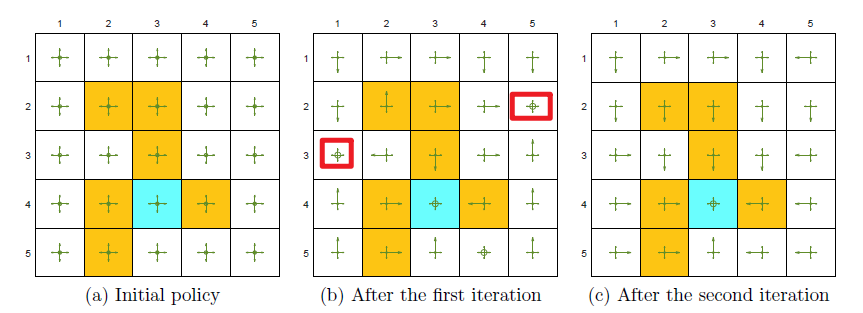

##### 牺牲最优性

$\varepsilon-贪心$ 通过探索性得到了一些好处，但同时牺牲了一些状态的最优性

$r_{boundary}=-1,r_{forbidden}=-10,r_{target}=1,\gamma=0.9$

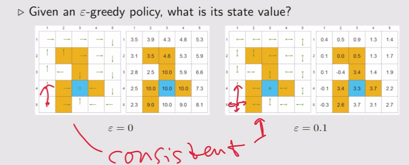

一致性：在每个状态下，采取最优动作的可能性最大

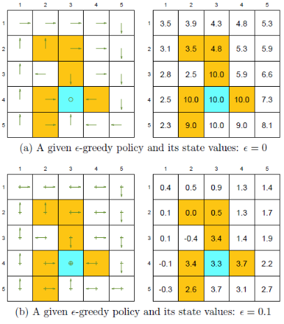

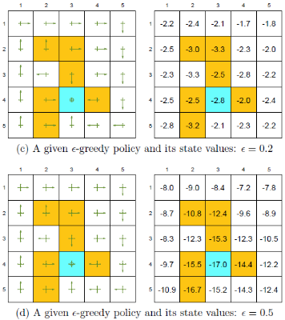

最优策略是基于最优状态价值定义的，所以最优状态价值在反映策略的好坏

虽然所有的策略都与最优策略保持一致，但由于还可能采取其他非最优动作，所以状态价值会比贪心算法的最优状态价值小。

随着探索率 $\epsilon$ 的增大，其最优性越来越差

在实际应用中，我们会将基于  $\varepsilon-贪心$ 算法的最优策略转为基于贪心算法的策略，希望这个策略与最优策略保持一致。但随着 $\varepsilon$ 的增大，二者已不具有一致性，所以 $\varepsilon$ 不能太大。一个技巧就是$\varepsilon$ 随时间衰减

### 3.1.5 DP与MC方法对比总结

**DP**

- 使用了自举的思想，基于之前估计的量来估计一个量

- 使用贝尔曼期望备份，通过上一时刻的 $V^{(t-1)}(s)$ 来更新当前时刻的 $V^{(t)}(s)$
  $$
  V^{(t+1)}(s)\leftarrow \sum\limits_{a\in \mathcal{A}}\pi(a\vert s)\left(R(s,a)+\gamma\sum\limits_{s'\in \mathcal{S}}P(s'\vert s,a)V^{(t)}\right)
  $$
  将其不断迭代，最后可以收敛

贝尔曼期望备份有两层加和，即内部加和与外部加和，计算两次期望，更新一次

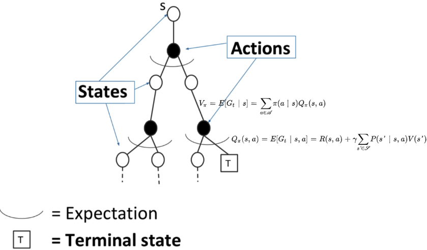

**增量式MC无探索性开始** 

通过一个回合的经验平均回报(实际得到的奖励)来进行更新，即
$$
V^{(t+1)}(s_t)\leftarrow V^{(t)}(s_t)+\alpha\left(G_t^{(t)}-V^{(t)}(s_t)\right)
$$
MC方法得到的轨迹对应树上蓝色的轨迹，轨迹上的状态已经是确定的，采取的动作也是确定的，现在只更新这条轨迹上的所有状态，与这条轨迹无关的状态不更新

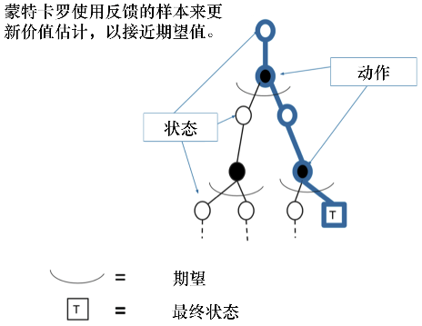

#### 对比

|              | DP                    | MC         |
| ------------ | --------------------- | ---------- |
| 环境是否已知 | 只适用于环境已知的MDP | 都适用     |
| 更新部分     | 全部更新              | 局部更新   |
| 迭代速度     | 更新速度快            | 更新速度慢 |

## 3.2 随机近似与随机梯度下降

> **时序差分方法** 是随机近似的一种特殊情况

1. 均值近似的不同理解

   使用数据集 $\{x_t\}$ 估计均值 $E[X]$ 
   $$
   w_{t+1}=w_t-\frac{1}{t}(w_t-x_t)
   $$

2. Robbins-Monro 算法，RM算法

   使用观测集 $\{\tilde{g}(w_t,\eta_t)\}$ 估计未知方程 $g(w)=0$ 的解
   $$
   w_{t+1}=w_t-\alpha_t\tilde{g}(w_t,\eta_t)
   $$

   - 算法描述
   - 示例
   - 收敛性分析
   - 应用于均值近似

3. 随机梯度下降——RM算法的一种特殊情况

   使用梯度集 $\{\bigtriangledown_wf(w_t,x_t)\}$ 求解最优化问题 $\min\limits_{w}J(w)=\min\limits_{w}E[f(w,x)]$ 的最优解，令 $g(w)=E[\bigtriangledown_wf(w,x)]=0$ ，梯度 $\bigtriangledown_wf(w_t,\eta_t)$ 相当于期望的带误差观测
   $$
   w_{t+1}=w_t-a_t\bigtriangledown_wf(w_t,\eta_t)
   $$

   - 算法描述
   - 示例
   - 收敛性
   - 确定性公式
   - BGD，MBGD，SGD

### 3.2.1 应用RM算法的MC方法

> 对于一个随机变量，目标是估计其期望 $E[X]$ ，假设有一组独立同分布的数据集 $\{x_i\}_{i=1}^N$ ，期望可以用其均值近似 $E[X]\approx \overline{X}=\frac{1}{N}\sum\limits_{i=1}^Nx_i$ 

强化学习中有很多期望，除价值函数外，还有很多量需要用数据去估计

#### 增量式均值计算方法

- 收集所有的轨迹，再计算其均值：必须等 $N$ 条数据全部都收集完后，才能取平均
- 增量式(迭代式)

对于非增量式计算
$$
w_{t+1}=\frac{1}{t}\sum\limits_{i=1}^tx_i,t=1,2,\cdots\\
w_{t}=\frac{1}{t-1}\sum\limits_{i=1}^{t-1}x_i,t=2,3\cdots
$$
因此有
$$
\begin{aligned}
w_{t+1}&=\frac{1}{t}\sum\limits_{i=1}^tx_i=\frac{1}{t}\left(\sum\limits_{i=1}^{t-1}x_i+x_t\right)\\
&=\frac{1}{t}((t-1)w_{t}+x_t)\\
&=w_t-\frac{1}{t}(w_t-x_t)
\end{aligned}
$$
利用上式可以增量式计算均值 $\overline{X}$ 
$$
\begin{array}{ll}
当有一个数据 &w_1=x_1\\
当有一个数据 &w_2=x_1\\
当有两个数据 &w_3=w_2-\frac{1}{2}(w_2-x_2)=\frac{1}{2}(x_1+x_2)\\
当有三个数据 &w_4=w_3-\frac{1}{3}(w_3-x_3)=\frac{1}{3}(x_1+x_2+x_3)\\
&\vdots\\
当有t个数据 &w_{t+1}=w_t-\frac{1}{t}(w_t-x_t)=\frac{1}{t}(x_1+x_2+\cdots+x_t)=\frac{1}{t}\sum\limits_{i=1}^tx_i
\end{array}
$$

##### 特点

- $w_t-x_t$ 称为 **残差**
- 增量式均值估计每采样一次都能更新一次
- 均值估计一开始由于数据量不充分，所以并不精确 $(w_{t+1\neq E[X]})$ 。但随着样本数的增多，估计会越来越准确 $(w_{t+1}\xrightarrow{t\rightarrow N}E[X])$ 

#### 广义增量式均值估计

$$
w_{t+1}=w_{t}-\alpha_{t}(w_{t}-x_t)
$$

将 $\frac{1}{t}$ 替换为 $\alpha_t$ ，仍可收敛于 $E[X]$ 

- 属于特殊的 **随机近似算法** SA；也属于 **随机梯度下降算法** SGD

##### 增量式蒙特卡洛方法

可以将蒙特卡洛方法更新的方式改为增量式蒙特卡洛(incremental MC)

若现在有一个轨迹 $(s_1,a_1,r_1,s_2,\cdots,s_H)$ ，可以用增量的方法更新状态价值
$$
N(s_j)\leftarrow N(s_j)+1\\
V(s_j)\leftarrow V(s_j)+\frac{1}{N(s_j)}(G_j-V(s_j))
$$
若将 $\frac{1}{N(s_j)}$ 变为 $\alpha$ 学习率，即
$$
V(s_j)\leftarrow V(s_j)+\alpha(G_j-V(s_j))
$$
其中，$\alpha$ 代表更新的速率，可以将其作为超参数设置
$$
\begin{array}{ll}
\hline
&初始化：初始化策略\pi^{(0)},\varepsilon\in [0,1],Q(s,a),Num(s,a)=0,\forall s\in \mathcal{S},a\in \mathcal{A}(s)\\
&目标：寻找最优策略\\
&\\
&对于第t个回合:\\
&\quad 生成回合:随机选择回合起点(s_0,a_0),基于当前策略 \pi^{(t)}生成回合长度为T的回合:s_0,a_0,r_1,\cdots,s_{H-1},a_{H-1},r_{H}\\
&\quad 初始化:g\leftarrow 0\\
&\quad 对于一个回合的每一步，j=H-1,H-2,\cdots,0:\\
&\qquad 使用every-visit方法:\\
&\qquad \qquad 策略评估:\\
&\quad \qquad\qquad g\leftarrow \gamma g+r_{j+1}\\
&\quad \qquad \qquad Num(s_j,a_j)\leftarrow Num(s_j,a_j)+1\\
&\quad\qquad \qquad Q(s_j,a_j)=Q(s_j,a_j)+\frac{1}{Num(s_j,a_j)}\left(g-Q(s_j,a_j)\right)\\
&\qquad \qquad 策略改进:\\
&\quad\qquad \qquad 令a^*_{\pi^{(t)}}=\mathop{\mathrm{argmax}}\limits_{a}Q(s_j,a)，且\pi^{(t+1)}(a\vert s_j)=\begin{cases}
1-\frac{\varepsilon}{\vert \mathcal{A}(s_j)\vert}(\vert \mathcal{A}(s)\vert-1)&,a=a^*_{\pi^{(t)}}\\
\frac{\varepsilon}{\vert \mathcal{A}(s_j)\vert}&,a\neq a^*_{\pi^{(t)}}
\end{cases}\\
\hline
\end{array}
$$

相较于非增量式MC

- 非增量式MC：每次更新，时间复杂度和空间复杂度都是 O(n) ，因为要存储回报
- 增量式MC：每次更新，时间复杂度和空间复杂度都是 O(1) 

### 3.2.2 RM算法

随机近似算法 (stochastic approximation, SA) ：用于方程根的求解问题

- 相较于其他方程求解算法(梯度上升/下降算法)，随机近似算法不需要知道方程的具体形式
  - 方程的表达式 $g$ 是已知的，则可以通过很多数值算法求解，不需要RM算法，可以用DP等算法求解
  - 方程的表达式 $g$ 是未知的（神经网络：已知输入输出，但不知道具体的函数形式）

Robbins-Monro算法：是SA中的一种代表性算法

- 随机梯度下降算法、增量式均值估计都属于RM算法

方程求解问题应用于最优化求解：求解 $J(w)$ 的最优化问题，利用梯度下降法求解 $g(w)=\bigtriangledown_w J(w)=0$ 也是一个方程求解问题

**问题定义：求解表达式未知的方程的根**  

$g(w)$ 为表示未知方程的函数，$w$ 为变量

$w^*$ 为方程的解，使得 $g(w^*)=0$ ，求解 $w^*$

**求解** 

RM算法是一种迭代式算法，当 $t\rightarrow \infty$ 时，有 $w_{t+1}$ 收敛于 $w^*$ 
$$
\begin{aligned}
w_{t+1}&=w_{t}-\alpha_t\widetilde{g}(w_{t},\eta_{t})\\
&=w_t-\alpha_t[g(w_{t})+\eta_{t}]
\end{aligned}
$$

- $w_{t}$ 表示对 $w$ 的第 $t$ 次迭代
- 函数 $g(\cdot)$ 是一个黑盒函数， $g(w_t)$ 的准确值是未知的，但我们可以观测到关于 $g(w_t)$ 的带有噪音的观测值 $\tilde{g}(w_t,\eta_t)$ 

通过RM算法求解方程的解依赖于数据

- 输入序列：$\{w_{t}\}$ 
- 带噪音的输出序列：$\{\widetilde{g}(w_{t},\eta_{t})\}$ 

#### 收敛性

##### 例子

估计 $g(w)=\tanh(w-1)=0$ 的解，初始 $w_1=3,a_t=\frac{1}{t},\eta_t\equiv0$ (为简化计算，假设无噪音干扰)

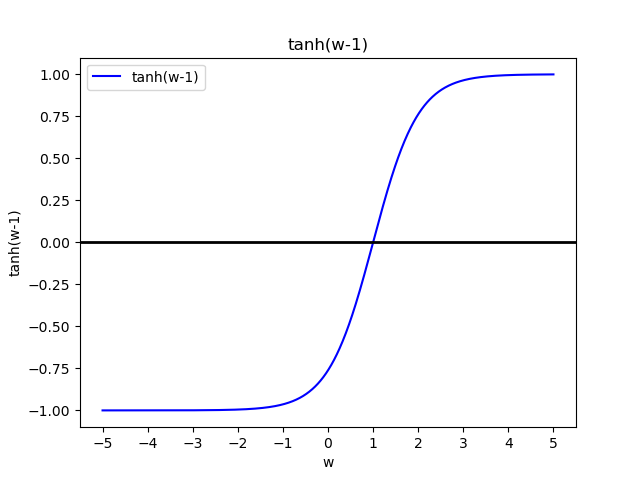

 有解析解 $w^*=1$ 

由于噪音是0，所以本例中 $\tilde{g}(w_t,\eta_t)=g(w_t)$ ，基于以下公式计算

$$
w_{t+1}=w_t-\alpha_tg(w_t)
$$

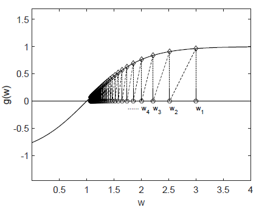

$w_2=w_1=3$ ，$w_3=w_2-a_2g(w_2)=3-\frac{1}{2}\tanh(3)=3-\frac{0.9950547536867305}{2}=2.5024726231566348$

直观上看，$w_{t+1}$ 会随着 $t$ 的迭代不断接近 $w^*$ 

- 当 $w_t>w^*$ 时，有 $g(w_t)>0$ ， $w_{t+1}=w_t-\alpha_tg(w_t)<w_t$ 
- 当 $w_t<w^*$ 时，有 $g(w_t)<0$ ， $w_{t+1}=w_t-\alpha_tg(w_t)>w_t$ 

因此，$w_{t+1}$ 比 $w_t$ 更靠近 $w^*$ 

##### 证明

RM算法 $w_{t+1}=w_{t}-\alpha_t\widetilde{g}(w_{t},\eta_{t})$​ 收敛的充分条件是：

> - $0< c_1\le \bigtriangledown_w g(w)\le c_2,\forall w$ 
> - $\sum\limits_{t=1}^{\infty}\alpha_t=\infty$ 且 $\sum\limits_{t=1}^{\infty}\alpha_t^2<\infty$ 
> - $E[\eta_t\vert \mathcal{H}_t]=0$ 且 $E[\eta_t^2\vert \mathcal{H}_t]<\infty$ ，$\mathcal{H}_t=\{w_t,w_{t-1,\cdots}\}$ 
>
> 则 $w_t$ 依概率收敛于 $w^*$ 为方程的解 $g(w^*)=0$ 

**1.  $0< c_1\le \bigtriangledown_w g(w)\le c_2,\forall w$ 的条件分析** 

- 导数大于0的条件：确保单调增，一定会有0点
- 导数有界，避免无穷的情况

为什么单调增的 $g(w)$ 是可以接受的：随机近似常用于最优化方程的求解，即 $g(w)=\bigtriangledown_w J(w)=0$ ，对于凸优化问题，$J''(w)\ge 0\iff g'(w)>0$ ，所以是可接受的

**2.  $E[\eta_t\vert \mathcal{H}_t]=0$ 且 $E[\eta_t^2\vert \mathcal{H}_t]<\infty,\mathcal{H}_t=\{w_t,w_{t-1,\cdots}\}$ **

噪音 $\{\eta_t\}$ 是一个独立同分布的随机序列，其均值应该为0($E[\eta_t\vert \mathcal{H}_t]=0$)，且方差应是有界的($E[\eta_t^2\vert \mathcal{H}_t]<\infty,\mathcal{H}_t=\{w_t,w_{t-1,\cdots}\}$)，且 $\eta$ 并不需要服从高斯分布

 **3. $\sum\limits_{t=1}^{\infty}\alpha_t=\infty$ 且 $\sum\limits_{t=1}^{\infty}\alpha_t^2<\infty$ 的条件分析** 

- $\sum\limits_{t=1}^{\infty}\alpha_t^2<\infty$ 确保 $\alpha_t\xrightarrow{t\rightarrow \infty}0$ 

  由于 $w_{t+1}-w_{t}=-\alpha_t\tilde{g}(w_{t},\eta_{t})$ ，若 $\alpha_t\rightarrow 0\Rightarrow \alpha_t\tilde{g}(w_{t},\eta_{t})\rightarrow 0\Rightarrow w_{t+1}-w_{t}\rightarrow 0$ ，若想要 $w_t$ 收敛，则 $w_{t+1}-w_{t}\rightarrow 0$ 是一个充分条件条件

  若 $w_t\rightarrow w^*$，则有 $g(w_t)\rightarrow 0$ 并且 $\tilde{g}(w_{t},\eta_{t})$ 受 $\eta_t$ 扰动

- $\sum\limits_{t=1}^{\infty}\alpha_t=\infty$ 确保 $a_t$ 趋于0的速度不会过快

  由上，$w_2=w_1-a_1\tilde{g}(w_1,\eta_1)$ ，$w_3=w_2-a_2\tilde{g}(w_2,\eta_2)$ ，$\cdots ,w_{t+1}=w_t-\alpha_t\tilde{g}(w_t,\eta_t)$ ，等号左右分别求和
  $$
  w_{t+1}-w_1=\sum\limits_{t=1}^{t}-a_t\tilde{g}(w_t,\eta_t)
  $$
  若 $w_{\infty}=w^*$ ，假设 $\sum\limits_{t=1}^{\infty}\alpha_t<\infty$ ，则 $\sum\limits_{t=1}^{\infty}\alpha_t\tilde{g}(w_t,\eta_t)$ 是有界的，则 $w^*$ 与 $w_{1}$ 的差距是有界的，意味着不能随便选择初始的 $w_1$ 。若选择的 $w_1$ 与精确值间距过大，超过这个界，则等式不成立，即 $w_{\infty}$ 不是方程的解

  当 $\sum\limits_{t=1}^{\infty}\alpha_t=\infty$ ，表示选择的初始 $w_1$ 不管离 $w^*$ 有多远，最后都能收敛到精确值

##### 满足系数的条件的 $a_t$ 

典型的是 $a_t=\frac{1}{t}$ ，级数 $\sum\limits_{t=1}^n\frac{1}{t}$ 在 $n\rightarrow \infty$ 时是发散的，且 $\sum\limits_{t=1}^{\infty}\frac{1}{t^2}=\frac{\pi^2}{6}<\infty$ 

在强化学习中，**$\alpha_t$ 会选择足够小的常量**，不会使用 $\frac{1}{t}$ ，这样会使 $\sum\limits_{t=1}^{\infty}\alpha_t^2<\infty$ 不成立，但算法依然会是有效的

- 后续的数据，随 $t$ 的增大，其作用会非常小。在实际问题中，我们希望后续的数据也有用，所以不会让 $\alpha_t\xrightarrow{t\rightarrow \infty}0$ ，而让其 $\alpha_t\xrightarrow{t\rightarrow \infty}\varepsilon$ ，$\varepsilon$ 是一个非常小的常数

#### RM算法应用于均值估计

$$
w_{t+1}=w_t-\alpha_t(w_t-x_t)
$$

我们知道若 $\alpha_t=\frac{1}{t}$ ，则 $w_{t+1}=\frac{1}{t}\sum\limits_{i=1}^tx_i\xrightarrow{t\rightarrow \infty}E[X]$ 。但 $\alpha_t\neq\frac{1}{t}$ 时，$w_t$ 是否仍能收敛于期望 $E[X]$ 目前并未分析过。基于RM算法，只需证明 **广义增量式均值估计** 属于RM算法即可

在均值估计中，$g(w)=w_t-E[X]=0$ ，观测量 $\tilde{g}(w,\eta)=w-x$ 
$$
\begin{aligned}
\tilde{g}(w_t,\eta_t)&=w_t-x_t=w_t-E[X]+E[X]-x_t\\
&=(w_t-E[X])+(E[X]-x_t)=g(w_t)+\eta_t
\end{aligned}
$$
可见，广义增量式均值估计属于RM算法

#### RM算法应用于最优化问题——随机梯度下降

**问题定义** 
$$
\min\limits_{w} J(w)=\min\limits_{w}E[f(w,X)]
$$

$w$ 是最优化参数，$X$ 是随机变量，优化目标是以 $w$ 为参数最小化 $f(w,X)$ 的期望

- 期望可以看做带权求和的函数，待解决的问题可以看做多元函数最优化问题
- 最小化网络 $f(w,X)$ 输出值的期望

**方法**

1. 梯度下降法（gtradient descent,GD）

   找目标函数的最小值，所以使用梯度下降法
   $$
   w_{t+1}=w_t-\alpha_t\underbrace{\bigtriangledown_w E[f(w,X)]}_{\bigtriangledown_w J(w)}\xlongequal{期望本质上是加权求和}w_t-\alpha_tE[\bigtriangledown_wf(w,X)]
   $$
   沿梯度方向，函数值减少最快，可以更快地收敛到最小值

   缺点：期望的计算

   - 有模型，用公式求（解析解，数值解）
   - 无模型，用数据求

2. 批量梯度下降（batch gradient descent, BGD）

   MC方法： $E[\bigtriangledown_wf(w,X)]\approx\frac{1}{n}\sum\limits_{i=1}^n\bigtriangledown_wf(w_i,x_i)$ 
   $$
   w_{t+1}=w_t-a_t\frac{1}{n}\sum\limits_{i=1}^n\bigtriangledown_wf(w_i,x_i)
   $$
   缺点：每次迭代 $w_t$ 都需要采样很多次数 $N$ 次

3. 随机梯度下降（stochastic gradient descent, SGD）
   $$
   w_{t+1}=w_t-a_t\bigtriangledown_wf(w_t,x_t)
   $$

   - 将 **梯度下降法** 中，真实的梯度替换为对梯度的采样 $\bigtriangledown_w f(w_t,x_t)$ 
   - 将 **批量梯度下降法** 中，令 $n=1$

##### 算法示例

最小化目标 $w$ 与变量 $X$ 距离的期望
$$
\min\limits_{w}J(w)=\min\limits_{w}E[f(w,X)]=\min\limits_{w}E\left[\frac{1}{2}\Vert w-X \Vert^2\right]
$$
**1. 最优解 $w^*$ 为 $E[X]$** 

求解最小化 $\min\limits_{w}J(w)$ ，即令 $\bigtriangledown_wJ(w)=0$ 
$$
\bigtriangledown_wJ(w)=0\Rightarrow \bigtriangledown_wE[f(w,X)]=0\Rightarrow E[\bigtriangledown_wf(w,X)]=0\Rightarrow E[w^*-X]=0\Rightarrow w^*=E[X]
$$
**2. 梯度下降法求解最小值** 
$$
\begin{aligned}
w_{t+1}&=w_t-\alpha_t\bigtriangledown_wJ(w_t)\\
&=w_t-\alpha_tE[\bigtriangledown_w f(w_t,X)]\\
&=w_t-\alpha_tE[w_t-X]\\
&=w_t-\alpha_tw_t+a_tE[X]
\end{aligned}
$$
每轮 $w_k$ 都需要估计一次期望 $E[X]$ 

**3. 随机梯度下降法求解最小值** ，用 $x_t$ 去随机近似期望 $E[X]$ 
$$
w_{t+1}=w_t-\alpha_t\bigtriangledown_wf(w_t,x_t)=w_t-\alpha_t(w_t-x_t)
$$

##### 收敛性

在梯度下降法中，目标是求解最小值，所以沿着  $w_t$  梯度方向会更快地下降到  $w_t$ 方向上的最小值，我们知道 $w_{t}\xrightarrow{t\rightarrow \infty}w^*$；而随机梯度下降法，用 $(w_t,x_t)$ 处的梯度代替取 $w=w_t$ 时所有点 $(w_t,x_i),\forall i$ 的梯度均值，即一个数据代替数据整体的梯度

> $$
> GD:w_{t+1}=w_t-\alpha_tE[\bigtriangledown_wf(w_t,X)]\\
> \Downarrow\\
> SGD:w_{t+1}=w_t-\alpha_t\bigtriangledown_wf(w_t,x_t)
> $$
> 因为 $\bigtriangledown_wf(w_t,x_t)\neq E[\bigtriangledown_wf(w_t,X)]$ ，需要证明基于SGD，$w_t\xrightarrow{\infty}w^*$ 是否成立

证明思路： **随机梯度下降法** 是一个特殊的 **随机近似算法** 且满足随机近似收敛的充分条件，则 **随机梯度下降法** 也会收敛

优化目标是最小化期望
$$
\min\limits_wJ(w)=\min\limits_{w} E[f(w,X)]
$$
最优化问题使用梯度下降法，等价于求解方程 $\bigtriangledown_w J(w)=E[\bigtriangledown_wf(w_t,X)]=0$ 的解 $w^*$ 

对于这么一个未知方程的求解问题，可以用RM算法求解，其观测量为 $\tilde{g}(w,\eta)$ 
$$
\begin{aligned}
\tilde{g}(w,\eta)&=\bigtriangledown_w f(w,x)\\
&=\underbrace{E[\bigtriangledown_wf(w,X)]}_{g(w)}+\underbrace{\bigtriangledown_wf(w,x)-E[\bigtriangledown_wf(w,X)]}_{\eta}
\end{aligned}
$$

- $\bigtriangledown_wf(w_t,x_t)$ 可以看做 $E[\bigtriangledown_wf(w_t,X)]$ 的一个噪音度量

因此，SGD是一种特殊的 RM 算法。若满足RM算法收敛的三个条件

- $0<c_1\le \bigtriangledown^2_w f(w,X)\le c_2$
- $\sum\limits_{t=1}^{\infty}\alpha_t=\infty$ 且 $\sum\limits_{t=1}^{\infty}\alpha_t^2<\infty$ 
- $\{x_t\}_{t=1}^{\infty}$ 是独立同分布的 

则SGD一定收敛于 $w^*$

###### SGD收敛的性质

SGD中，用随机梯度代替真实梯度，梯度的随机性并不会造成收敛的随机性或慢收敛，即初始值的选择 $w_0$ 不会影响收敛速度

- 当 $w_t$ 与 $w^*$ 差距大时 ，SGD表现与GD相同，因为相对误差比较小
- 当 $w_t$ 与 $w^*$ 差距小时，SGD才会呈现较大的随机性

引入随机梯度与批量梯度的相对误差
$$
\delta_t=\frac{\vert \bigtriangledown_wf(w_t,x_t)- E[\bigtriangledown_w f(w_t,X)]\vert}{\vert E[\bigtriangledown_w f(w_t,X)]\vert}
$$
对于最优解 $w^*$ 满足梯度 $E[\bigtriangledown_w f(w^*,X)]=0$ ，进而有
$$
\delta_t=\frac{\big\vert \bigtriangledown_wf(w_t,x_t)- E[\bigtriangledown_w f(w_t,X)]\vert}{\vert E[\bigtriangledown_w f(w_t,X)]-E[\bigtriangledown_w f(w^*,X)]\vert}=\frac{\vert \bigtriangledown_wf(w_t,x_t)- E[\bigtriangledown_w f(w_t,X)]\vert}{\big\vert E[\left(\bigtriangledown_w f(w_t,X)-\bigtriangledown_wf(w^*,X)\right)]\big\vert}\xlongequal{中值定理}\frac{\vert \bigtriangledown_wf(w_t,x_t)- E[\bigtriangledown_w f(w_t,X)]\vert}{\big\vert E[\bigtriangledown_w^2 f(\widetilde{w}_t,X)(w_t-w^*)]\big\vert},\widetilde{w}_t\in [w_t,w^*]
$$
假设 $f$ 是一个严格凸函数，$\bigtriangledown_w^2 f\ge c>0,\forall w,X$ ，则相对误差的分母为
$$
\begin{aligned}
\big\vert E[\bigtriangledown_w^2 f(\widetilde{w}_t,X)(w_t-w^*)]\big\vert&=\big\vert E[\bigtriangledown_w^2 f(\widetilde{w}_t,X)](w_t-w^*)\big\vert\\
&=\big\vert E[\bigtriangledown_w^2 f(\widetilde{w}_t,X)]\big\vert\big\vert(w_t-w^*)\big\vert\ge c\vert(w_t-w^*)\vert
\end{aligned}
$$
代入相对误差
$$
\delta_t\le \frac{\vert \overbrace{\overbrace{\bigtriangledown_wf(w_t,x_t)}^{随机梯度}- \overbrace{E[\bigtriangledown_w f(w_t,X)]}^{真实梯度}}^{绝对误差}\vert}{c\underbrace{\vert(w_t-w^*)\vert}_{与最优解的间距}}
$$
相对误差 $\delta_k$ 反比于与最优解的间距：

- 分母大的时候，相对误差上界相对小，绝对误差也相对小
- 分母小的时候，相对误差上界相对大，绝对误差也相对大

当 $w_t$ 与 $w^*$ 距离远时，SGD的参数调整方向与GD的方向大致相同

##### SGD的确定性公式

常见的最优化问题是
$$
\min_w J(w)=\min_w\frac{1}{n}\sum\limits_{i=1}^nf(w,x_i)
$$
$x_i$ 并不是一个随机变量，只是来源于独立同分布的实数集 $\{x_i\}_{i=1}^n$ ，使用梯度下降法最优化这样的带参函数 $f(w,x_i)$ 
$$
w_{t+1}=w_t-a_t\bigtriangledown_w J(w)=w_t-a_t\sum\limits_{i=1}^n\frac{1}{n}\bigtriangledown_wf(w,x_i)
$$
假设数据集很大，即 $n$ 很大，则可使用增量式梯度下降——SGD确定性公式
$$
w_{t+1}=w_t-\alpha_t\bigtriangledown_w J(w)=w_t-\alpha_t\bigtriangledown_wf(w_t,x_t)
$$
这样的梯度下降公式虽然与 SGD相似，但它不含期望与随机变量。通过引入一个随机变量将确定性最优化问题变为随机最优化问题，假设 $X$ 是一个由 $\{x_i\}_{i=1}^n$ 定义的随机变量，且服从均匀分布 $P(X=x_i)=\frac{1}{n}$ 
$$
\min\limits_{w}J(w)=\min\limits_{w}\frac{1}{n}\sum\limits_{i=1}^nf(w,x_i)=\min_{w}E[f(w,X)]
$$
所以也可以用SGD求解最优化，即上述SGD确定性公式

- 关于 $x_t$ 的选取：从 $\{x_i\}_{i=1}^n$ 中有放回地随机取出 $x_t$ 

#### BGD、SGD、MBGD对比

对于同一个最优化问题 $\min\limits_{w}J(w)=\min_{w}E[f(w,X)]$ ，随机变量 $X$ 的样本集为 $\{x_i\}_{i=1}^n$  
$$
\begin{array}{ll}
w_{t+1}=w_t-\alpha_t\frac{1}{n}\sum\limits_{i=1}^n\bigtriangledown_wf(w_t,x_i)&(BGD)\\
w_{t+1}=w_t-\alpha_t\frac{1}{m}\sum\limits_{x_i\in \mathcal{I}_t}\bigtriangledown_wf(w_t,x_i)&(MBGD)\\
w_{t+1}=w_t-\alpha_t\frac{1}{n}\bigtriangledown_wf(w_t,x_t)&(SGD)\\
\end{array}
$$
- BGD，每轮迭代需要 $n$ 个数据，最优化结果最接近真实的最优解
- MBGD，从 $n$ 个数据中采集 $m<n$ 个数据生成数据集 $\mathcal{I}_k$ ，作为第 $k$ 轮迭代的数据，基于这个子集的梯度计算最优解
- SGD，每轮迭代随机选择一个数据，计算其梯度

相较于SGD，MBGD使用了更多数据将噪音等测量平均掉，所以随机性更小

相较于BGD，MBGD不需要使用全部数据，所以更加灵活和高效

- 当 $m=1$ ，MBGD变为SGD

- 当 $m=n$ ，MBGD变为BGD

  BGD用到 $n$ 个数据，虽然 MBGD也会用 $n$ 个数据，但是在BGD的 $n$ 个数据中有重复采样

##### 算法示例

对于给定的数据集 $\{x_i\}_{i=1}^{n}$ ，目标是最优化
$$
\min\limits_{w}J(w)=\min\limits_{w}\frac{1}{2n}\sum\limits_{i=1}^n\Vert w-x_i\Vert^2
$$
使用梯度下降法求解，其中 $\bigtriangledown_wJ(w)=\frac{1}{n}\sum\limits_{i=1}^n(w-x_i)$ 
$$
\begin{array}{ll}
w_{t+1}=w_t-\alpha_t\frac{1}{n}\sum\limits_{i=1}^n(w_t-x_i)=w_t-\alpha_t(w_t-\overline{x})&(BGD)\\
w_{t+1}=w_t-\alpha_t\frac{1}{m}\sum\limits_{i=1}^{m}(w_t-x_i)=w_t-\alpha_t(w_t-\overline{x}_t^{(m)})&(MBGD)\\
w_{t+1}=w_t-\alpha_t(w_t-x_t)&(SGD)\\
\end{array}
$$

###### 收敛速度对比

$X\in \R^2$ 表示一个平面中的随机位置，其分布服从 $U(20,20)$ 的均匀分布，则真实均值 $E[X]=\mathbf{0}$，基于100个独立同分布的样本 $\{x_i\}_{i=1}^{100}$ ，令 $\alpha_t=\frac{1}{t}$，求均值

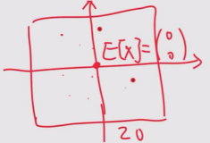

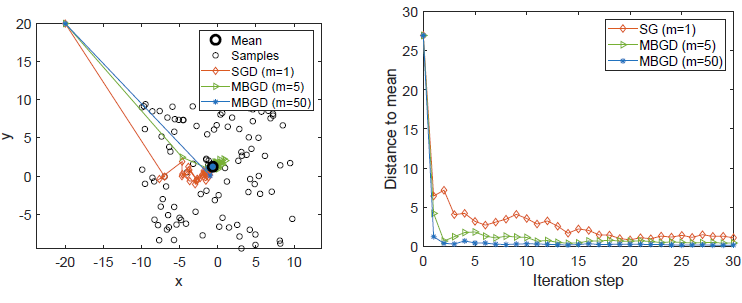

观察橙色线（基于随机梯度下降的最优化），尽管初始值与真实期望差距很大，但SGD朝着最优解的方向收敛，当接近最优解时，呈现随机性，但仍逐渐收敛于真实值

若 $\alpha_t=\frac{1}{t}$ 
$$
\begin{array}{ll}
w_{t+1}=w_t-\frac{1}{t}(w_t-\overline{x})\xlongequal{迭代推导}\frac{1}{t}\sum\limits_{i=1}^tx_i=\frac{1}{t}\sum\limits_{i=1}^t\overline{x}=\overline{x}&(BGD)\\
w_{t+1}=\frac{1}{t}\sum\limits_{i=1}^t\overline{x}_t^{(m)}=\overline{x}_t^{(m)}&(MBGD)\\
w_{t+1}=\frac{t-1}{k}w_t+\frac{1}{t}x_t=\frac{1}{t}\sum\limits_{i=1}^tx_i=\frac{1}{t}\overline{x}&(SGD)  
\end{array}
$$
BGD的每一步迭代都是最优解 $w^*=\overline{x}$

由于 $\overline{x}_t^{(m)}$ 已经是一个均值，所以MBGD收敛于均值的速度快于SGD，且 $m$ 越大，MBGD的收敛速度越快

## 3.3 时序差分法

时序差分方法的目的是对于某个给定的策略 $\pi$ ，在线的计算出它的价值函数 $V_{\pi}$ 。

时序差分方法是一种介于蒙特卡洛方法和动态规划方法中间的免模型方法，不需要知道MDP中的状态转移矩阵与奖励函数。

时序差分方法可以从不完整的回合中学习，并且结合了自举的思想。

- 引例

- 基于TD方法解决预测问题

  - TD算法估计状态价值

  - TD算法估计动作价值

    Sarsa本质上是对动作价值的估计，可以将他与策略改进结合，相互迭代来求解最优策略

    - Sarsa

    - Expected Sarsa

    - n-step Sarsa

- 基于TD方法解决控制问题
  - TD算法获取最优策略：Q-learning

### 3.3.1 RM算法求解贝尔曼方程——TD算法

对于状态转移概率与奖励函数未知的环境，求解最优状态价值不能用DP算法，RM算法为状态价值的求解提供了一种思路

以状态价值的贝尔曼方程为例，
$$
\begin{align}
V(s_t)&=E[G_{t}\vert s_t]\\
&=E\left[R(s_{t})+\gamma R(s_{t+1})+\gamma^2R(s_{t+2})+\cdots\big\vert s_t\right]\\
&=E\left[R(s_{t})+\gamma G_{t+1}\big\vert s_t\right]\\
&=E[R(s_{t})+\gamma V(s_{t+1})\vert s_t]
\end{align}
$$

当 $s_t$ 的状态价值收敛时，有 $g\left(V^*(s_t)\right)=V^*(s_t)-E[R(s_{t})+\gamma V^*(s_{t+1})\vert s_t]=0$ 

RM算法中，去近似期望时，$g(w)=w-E[X]=0$ ，令 $g(w^{(k)})$ 带噪音的观测为 $\tilde{g}\left(w^{(k)},X^{(k)}\right)=w^{(k)}-X^{(k)}=w^{(k)}-E[X]+E[X]-X^{(k)}=g(w^{(k)})+\eta^{(k)}$  ，有 $w^{(k+1)}=w^{(k)}-\alpha^{(k)}\tilde{g}\left(w^{(k)},X^{(k)}\right)=w^{(k)}-\alpha^{(k)}\left(w^{(k)}-X^{(k)}\right)$ 

同理，将状态价值代入
$$
\tilde{g}\left(V^{(k)}(s_t),R(s_t)+\gamma V^{(k)}(s_{t+1})\right)=V^{(k)}(s_t)-\left[R(s_t)+\gamma V^{(k)}(s_{t+1})\right]=V^{(k)}(s_t)-E[R(s_{t})+\gamma V^*(s_{t+1})\vert s_t]+E[R(s_{t})+\gamma V^*(s_{t+1})\vert s_t]-\left[R(s_t)+\gamma V^{(k)}(s_{t+1})\right]=g\left(V^{(k)}(s_t)\right)+\eta^{(k)}
$$
故得到
$$
V^{(k+1)}(s_t)=V^{(k)}(s_t)-\alpha^{(k)}\tilde{g}\left(V^{(k)}(s_t),R(s_t)+\gamma V^{(k)}(s_{t+1})\right)=V^{(k)}(s_t)-\alpha^{(k)} \left(V^{(k)}(s_t)-\left[R(s_t)+\gamma V^{(k)}(s_{t+1})\right]\right)
$$
**代入到一个具体的环境中** 

$S_t$ 是环境在时刻 $t$ 的状态随机变量，$S_{t+1}$ 和 $R_{t+1}$ 是在 $t+1$ 时刻得到的状态随机变量与奖励随机变量，$\{s\},\{r_{t+1}\},\{s_{t+1}\}$ 分别是 $S_t,R_{t+1},S_{t+1}$ 的独立同分布样本集。基于样本集 $\{(s,r_{t+1},s_{t+1})\}$ 可以求解 $t$ 时刻的贝尔曼期望方程 $V_{\pi}(s)=E[R_{t+1}+\gamma V_{\pi}(S_{t+1})\vert S_t=s]$ 

可以将其转换为方程求解问题 $g(V_{\pi}(s))=V_{\pi}(s_t)-E[R_{t+1}+\gamma V_{\pi}(S_{t+1})\vert S_t=s]=0$ ，使用RM算法求解。其观测量为 $\tilde{g}(V_{\pi}(s),\eta_t)$ 
$$
\begin{aligned}
\tilde{g}(V_{\pi}(s),\eta_t)&=V_{\pi}(s)-[r_{t+1}+\gamma V_{\pi}(s_{t+1})]\\
&=\left(V_{\pi}(s)-E[R_{t+1}+\gamma V_{\pi}(S_{t+1})\vert S_t=s]\right)+\left(E[R_{t+1}+\gamma V_{\pi}(S_{t+1})\vert S_t=s]-[r_{t+1}+\gamma V_{\pi}(s_{t+1})]\right)\\
&\triangleq g(V_{\pi}(s))+\eta_t
\end{aligned}
$$
利用RM算法求方程 $g(V_{\pi}(s))=0$ 的解
$$
\begin{aligned}
V_{\pi}^{(t+1)}(s)&=V_{\pi}^{(t)}(s)-\alpha_{t}\tilde{g}(V_{\pi}^{(t)}(s),\eta_t)\\
&=V_{\pi}^{(t)}(s)-\alpha_{t}\left(V_{\pi}^{(t)}(s)-[r_{t+1}+\gamma V_{\pi}(s_{t+1})]\right),t=0,1,2,3,\cdots
\end{aligned}
$$
由于基于RM算法求解，需要一些特殊的条件，为使得该算法具有可行性，需要进行一定的修改

- 在 $t$ 时刻进行价值更新，需要用到 $s_t$ 的经验集 $\{(s_t,r_{t+1},s_{t+1})\},r_{t+1}\in R_{t+1},s_{t+1}\in S_{t+1}$ 
  - 在自举法中，同一组数据在时刻 $t$ 的值用 $t$ 标识，$V^{(t)}_{\pi}(s)$ 表示用 $t$ 时刻的数据更新对 $V_{\pi}(s)$ 的估计，在 $t+1$ 时刻的估计值为 $V^{(t+1)}_{\pi}(s)$ 
    - 即使是同一个经验，不同时刻到达也会有不同的更新值，所以用时刻标注估计值
  - 对于一条轨迹，若恰好访问了 $s$ ，则更新一轮 $V_{\pi}(s)$ ，若这条轨迹没有访问，则不会更新
- 对于 $s_t$ 所有的下一时刻状态 $s_{t+1}$  的状态价值 $V_{\pi}(s_{t+1})$ 必须已知
  - 用每轮迭代时，$t$ 时刻 $s_{t+1}$ 的价值 $V^{(t)}_{\pi}(s_{t+1})$ 代替，即

$$
\begin{aligned}
V_{\pi}^{(t+1)}(s)&=V_{\pi}^{(t)}(s)-\alpha_{t}\tilde{g}(V_{\pi}^{(t)}(s),\eta_t)\\
&=V_{\pi}^{(t)}(s)-\alpha_{t}\left(V_{\pi}^{(t)}(s)-[r_{t+1}+\gamma V^{(t)}_{\pi}(s_{t+1})]\right),t=0,1,2,3,\cdots
\end{aligned}
$$

#### 收敛性

直观上理解，虽然 $V^{(t)}_{\pi}(s_{t+1})$ 与 $V_{\pi}(s_{t+1})$ 未必相同，但随着 $V^{(t)}_{\pi}(s_{t+1})$ 自身的不断迭代修正会收敛与 $V_{\pi}(s_{t+1})$ ，最后 $V_{\pi}^{(t+1)}(s_{t})$ 的估计值都会收敛到其准确值 $V_{\pi}(s_{t})$ 

> TD算法是一种特殊的RM算法，若其满足对于所有的 $s\in \mathcal{S}$ ，$\sum\limits_{t}\alpha_t(s)=\infty,\sum\limits_{k}\alpha_t^2(s)<\infty$，则可知当 $t\rightarrow \infty$ 时， $V^{(t)}_{\pi}(s)$ 依概率收敛于 $V^*_{\pi}(s),\forall s\in \mathcal{S}$ ，使得 $g(V^{(t)}_{\pi}(s))=0\Rightarrow V^{(t)}_{\pi}(s)=E[R_{t+1}+\gamma V_{\pi}(S_{t+1})\vert S_t=s]$ 

- $\bigtriangledown_{V_{\pi}(s)}g(V_{\pi}(s))=1$ ，满足梯度有界的条件
- $\sum\limits_{t}\alpha_t(s)=\infty,\sum\limits_{t}\alpha_t^2(s)<\infty$
  - 当前轨迹访问状态 $s$ 时，其 $\alpha_t(s)$ 是一个正数；访问其他状态，则此时 $\alpha_t(s)=0$​ ， $\sum\limits_{t}\alpha_t(s)=\infty$ 意味着 $s$ 被访问了无穷次
  - 所有的学习率 $\alpha_t(s)$ 通常选择一个很小的常量，因此不再满足 $\sum\limits_{t}\alpha_t^2(s)<\infty$ 。我们希望很久之后得到的经验仍能派上用场，若 $\alpha_t$ 最后趋于0，则之后经验就失效了
- 由于 $r_{t+1},s_{t+1}$ 是独立同分布的，所以噪音 $\eta=E[R_{t+1}+\gamma V_{\pi}(S_{t+1})\vert S_t=s_{t}]-[r_{t+1}+\gamma V_{\pi}(s_{t+1})]$ 是独立同分布的

#### TD预测收敛与样本

理论上，若用TD算法准确地完成价值的预测，需要大量的样本

但事实上，我们可以在策略评估未完全的情况下进行策略提升，类似于价值迭代的做法，最终也会收敛到最优价值

### 3.3.2 TD算法的理解

> TD方法用于在没有模型的情况下求解给定策略的贝尔曼方程

TD算法基于数据实现强化学习，数据为基于策略 $\pi$ 生成的轨迹 $(s_0,r_1,s_1,\cdots,s_t,r_{t+1},s_{t+1},\cdots)$ ，也可表示为 $\{(s,r',s')\}$ 
$$
\begin{cases}
\underbrace{V^{(t+1)}_{\pi}(s)}_{新一轮迭代}=\underbrace{V^{(t)}_{\pi}(s)}_{当前迭代}-\alpha_t(s)\underbrace{\left[V^{(t)}_{\pi}(s)-\underbrace{[r'^{(t)}+\gamma V^{(t)}_{\pi}(s')]}_{\mbox{时序差分目标 }\overline{V}_\pi(s)}\right]}_{\mbox{时序差分误差 }\delta_t^{(t)}}&,S_t=s\\
V^{(t+1)}_{\pi}(s)=V^{(t)}_{\pi}(s)&,\forall S_t\neq s 
\end{cases}
$$
$V_{\pi}^{(t)}(s)$ 表示对 $t$ 时刻状态 $S_t=s$ 的状态价值的估计

- 被访问的更新
- 没被访问的不更新

#### 时序差分目标

由于TD算法是令 $V_{\pi}^{(t+1)}(s)$ 去逼近 $V_\pi(s)$，所以将 $\overline{V}_\pi(s)$ 称为时序差分目标
$$
\begin{array}{ll}
&V^{(t+1)}_{\pi}(s)=V^{(t)}_{\pi}(s)-\alpha_k\left[V^{(t)}_{\pi}(s)-\overline{V}_\pi(s)\right]\\
\Rightarrow &V^{(t+1)}_{\pi}(s)-\overline{V}_\pi(s)=V^{(t)}_{\pi}(s)-\overline{V}_\pi(s)-\alpha_k\left[V^{(t)}_{\pi}(s)-\overline{V}_\pi(s)\right]\\
\Rightarrow&V^{(t+1)}_{\pi}(s)-\overline{V}_\pi(s)=(1-\alpha_t(s))\left[V^{(t)}_{\pi}(s)-\overline{V}_\pi(s)\right]
\end{array}
$$
因为 $\alpha_t(s)$ 是一个很小的正小数，所以有 $0<1-\alpha_t(s)<1$ 
$$
\vert V^{(t+1)}_{\pi}(s)-\overline{V}_\pi(s)\vert\le \vert V^{(t)}_{\pi}(s)-\overline{V}_\pi(s)\vert
$$
即 $V^{(t)}_{\pi}(s)$ 与 $\overline{V}_\pi(s)$ 之间的差距越来越小，所以将 $\overline{V}_\pi(s)$ 称为时序差分误差

在状态 $s_t$ 和 $s_{t+1}$ 下，评估遵循同一个策略 $\pi$ 未来可以得到的累积奖励

#### 时序差分误差
$$
\delta_t=V^{(t)}_{\pi}(s)-[r'^{(t)}+\gamma V_{\pi}^{(t)}(s')]
$$
由于误差是两个状态的状态价值 $V^{(t)}_{\pi}(s)$ 与 $\overline{V}^{(t)}_{\pi}(s')$ 的差， 因此将该方法称为时序差分

- 若在 $t$ 时刻的估计值 $V^{(t)}_{\pi}(s)$ 与时序差分目标 $\overline{V}_{\pi}^{(t)}(s)$ 的差不为0，则说明当前对状态价值的估计是不准确的，可以用这个TD误差来改进当前的状态价值估计
- TD误差可以理解为一种可以从新的经验 $(s,r',s')$ 中获取新的信息

#### 与MC对比

| TD/Sarsa                                                     | MC                                                           |
| ------------------------------------------------------------ | ------------------------------------------------------------ |
| 在线学习：当获取一个新的奖励时，TD方法能立即更新状态/动作价值 | 离线学习：必须等整个回合收集完成后才能更新                   |
| 自举：使用先前的价值估计当前的价值，所以需要初始猜测         | 非自举：MC能直接估计出价值                                   |
| 可以从不完整系列上学习，以采样的方式得到不完整的状态序列，估计某状态在该状态序列完整后可能得到的状态价值，并通过不断地采样持续更新价值以逼近真实的期望 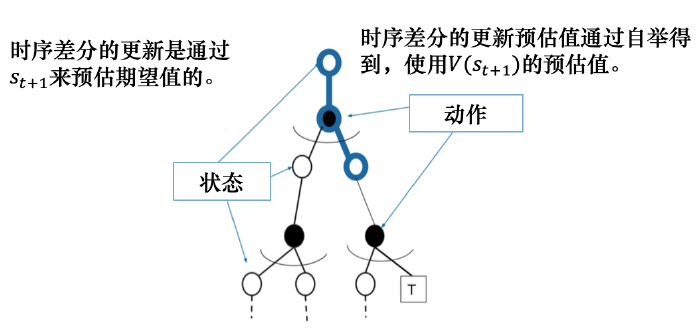 | 只能从完整的序列上学习，在经历完整的状态序列后，再来更新状态的真实价值 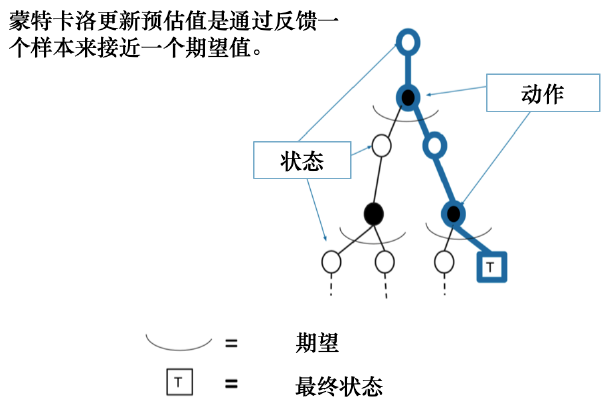 |
| 利用了马尔科夫性质                                           | 适用于非马尔科夫环境                                         |
| 适用于回合式任务与持续式任务                                 | 只适用于回合式任务与有终止的任务                             |
| **低方差，高偏差**：用到了更少的随机变量（TD只需要回合中一次交互的经验 ）； 时序差分目标是有偏估计：不准确的初始估计会传导到估计过程中造成偏差，随着数据量的增大，会将这个偏差抵消掉，直至收敛到正确的解 | **无偏估计，高方差**：MC涉及相当多交互经验去估计回报，每一步都会新增一组随机变量 $R_{t+1},S_{t+1},A_{t+1}$，多个随机变量只用一次采样，相对来说方差会比较高； 直接采用真实的奖励，累积奖励G是无偏估计：由于不涉及初始估计，直接等于真实的动作价值； |
| 最终收敛到真实的时序差分真实目标（真实的价值）；但使用函数近似并不总成立（加随机噪声） | 良好的收敛性                                                 |

#### DP、MC、TD的自举和采样

自举：更新时用了估计的方法

- MC没有使用
- DP、TD都使用了自举

采样：通过采样来获取期望

- MC方法是纯采样的方法
- DP完全没用采样，直接用贝尔曼方程更新状态价值
- TD使用了采样逼近真实回报

DP算法在已知所有状态转换的情况下，可以把所有的状态都进行加和
$$
V(s)\leftarrow E_{\pi}[R_{t+1}+\gamma V(S_{t+1})\vert S_t=s]
$$
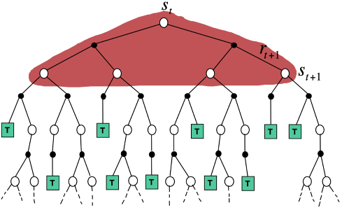

MC在当前的状态下，采取一条支路，在回合完成后，更新这条支路上的所有状态价值
$$
V(s_t)\leftarrow V(s_t)+\alpha(G_t-V(s_t))
$$
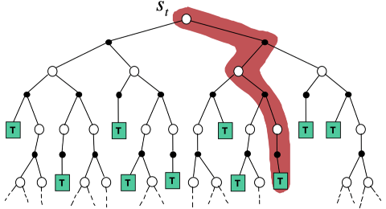

TD从当前状态开始，往前走了一步，关注的是局部更新
$$
TD(0):V(s_t)\leftarrow V(s_t)+\alpha(r_{t+1}+\gamma V(s_{t+1})-V(s_t))
$$
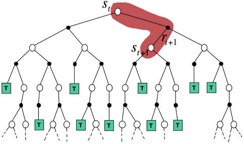

##### 四种价值函数计算算法的关系

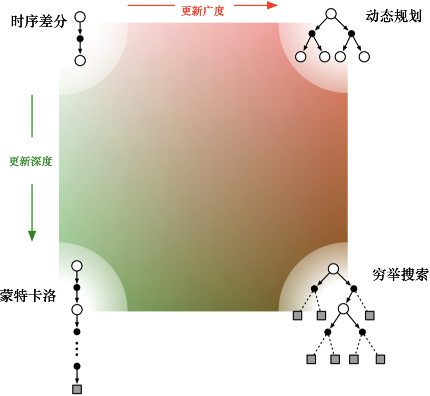

## 3.4 异策略学习提高样本效率

### 3.4.1 重要性采样

如果随机变量 $X\sim \mathcal{X}=\{+1,-1\}$ ，则其概率分布为 $p_0$ ，则 $X$ 的期望为 $E[X]=(+1)\cdot 0.5+(-1)\cdot 0.5=0$ 

若不知道 $p_0$ 的具体表达式或 $p_0$ 很复杂时，可以通过采样的方法求 $E[X]$ 

- 一种方法是MC方法，基于大数定律，$n\rightarrow\infty$ 时， $\overline{x}=\frac{1}{n}\sum\limits_{i=1}^nx_i$ 是 $E[X]$ 的无偏估计，但要求样本 $\{x_i\}\sim p_0$ 

  若使用另一分布的样本  $\{x_i\}\sim p_1$ 去估计，则结果显然不正确

  > 假设 $p_1(X=+1)=0.8,p_1(X=-1)=0.2$ ，则期望为
  > $$
  > E_{X\sim p_1}[X]=0.8\cdot(+1)+0.2\cdot(-1)=0.6
  > $$
  > 若仍使用样本的均值，则
  > $$
  > \overline{x}\rightarrow E_{X\sim p_1}[X]=0.6\neq E_{X\sim p_0}[X]
  > $$
  > 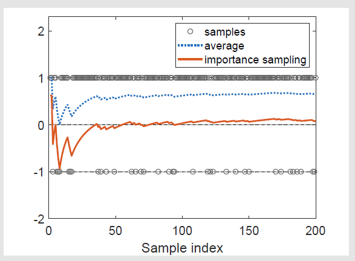
  >
  > 若不采用重要性采样技巧，均值为蓝色线；若采用，则为红色线

- 另一种方法是 **重要性采样** 

$$
E_{X\sim p_0}[X]=\sum\limits_{x}xp_0(x)=\sum\limits_{x}p_1(x)\underbrace{\frac{p_0(x)}{p_1(x)}x}_{f(x)}=E_{X\sim p_1}[f(X)]
$$

因此，可以用 $E_{X\sim p_1}[f(X)]$ 去估计 $E_{X\sim p_0}[X]$ 

> 若有样本集 $\{x_i\}\sim p_1$ 
>
> - 对于 $E_{X\sim p_1}[f(X)]$ 的计算，仍可基于大数定律，用MC方法估计
>   $$
>   \overline{f}=\frac{1}{n}\sum\limits_{i=1}^nf(x_i)\\
>   E_{X\sim p_1}[\overline{f}]=E_{X\sim p_1}[f(X)]\\
>   var_{X\sim p_1}[\overline{f}]=\frac{1}{n}var_{X\sim p_1}[f(X)]
>   $$
>   即 $\overline{f}$ 是 $E[f(X)]$ 的无偏估计
>
> - $\overline{f}$ 是 $E_{X\sim p_1}[f(X)]=E_{X\sim p_0}[X]$ 的近似
>   $$
>   E_{X\sim p_0}[X]=E_{X\sim p_1}[f(X)]\approx\overline{f}=\frac{1}{n}\sum\limits_{i=1}^nf(x_i)=\frac{1}{n}\sum\limits_{i=1}^n\frac{p_0(x_i)}{p_1(x_i)}x_i
>   $$

其中，$\frac{p_0(x_i)}{p_1(x_i)}$ 被称为权重

- 若 $p_0(x_i)=p_1(x_i)$ ，则权重为1，$\overline{f}=\overline{x}$ 

- 若 $p_0(x_i)\ge p_1(x_i)$​ ，对于一个样本 $x_i$ ， $p_0(x_i)>P_1(x_i)$ 说明在 $p_0$ 分布下采到 $x_i$ 的概率比较大；$p_1(x_i)$ 比较小，说明 $x_i$ 在 $p_1$ 分布下很难采集到

  要计算 $p_0$ 下的期望，就要很重视 $x_i$ ，给他比较大的权重 。这样才能将 $x_i$ 在 $p_1$ 下的期望拉到 $p_0$ 下的期望

$\overline{f}=\frac{1}{n}\sum\limits_{i=1}^n\frac{p_0(x_i)}{p_1(x_i)}x_i$ 的计算需要这个样本 $x_i$ 在分布 $p_0$ 中的概率 $p_0(x_i)$ ，但不能直接通过积分/求和去计算期望 $E_{X\sim p_0}[X]$ 

- 对于连续的随机变量，此时需要通过积分去计算期望，这对 $p_0$ 的表达式有很高要求，若 $p_0$ 的表达式( 策略函数 $\pi(a,\theta)$ )很复杂或者根本不存在表达式(使用神经网络表示策略函数)，则无法计算

### 3.4.2 离线/在线策略学习

> 目标策略：根据经验学习到的最优策略，不需要与环境交互，在迭代过程中会不断向最优策略改进，用 $\pi$ 表示
>
> 探索策略(behavior)：可以大胆地探索所有可能轨迹的策略，用于生成经验数据。可以只选取价值最大的动作执行，不管是否会造成回合失败，用 $\mu$ 表示
>
> - 探索策略 $\mu$ 可以是一个随机策略，但一般采取 $\varepsilon-贪心$ 策略

当行为策略与目标策略相同时，称为在线(同)策略学习(on-policy)；

当行为策略与目标策略不同时，称为离线(异)策略学习(off-policy)

#### 异策略特点

##### 优点

- 样本效率高

  - 同（在线）策略学习要求使用当前策略从环境中实时采集经验进行学习，一旦策略刚更新，则当前经验就被丢弃
  - 异（离线）策略学习使用经验回放池，将之前采集到的样本收集起来再使用。离线策略学习能更好地利用历史数据，并具有更好的样本复杂度（算法达到收敛需要在环境中采样的样本数量少）

- 可以 **利用** 探索策略学到的最佳策略，学习效率高

  若采用同策略，目标策略与探索策略可能是贪心或$\varepsilon-贪心$ ，探索性不强，很难去探索所有的访问对 $(s,a)$ ，进而估计出所有的动作价值来得到最优策略

- 可以学习其他智能体的动作，进行模仿学习，学习人或者其他智能体产生的轨迹

##### 缺点

- 重要性采样将显著增大方差
- 无法在 $\mu$ 为0，但 $\pi$ 不为0时使用

### 3.4.3 异策略MC

对于策略 $\mu$ 产生的回合 $\{s_0,a_0,r_1,s_1,a_1,r_2,s_2,a_2,\cdots,s_T\}\sim \mu$ 
$$
G_t^{\pi/\mu}=\frac{\pi(a_t\vert s_t)}{\mu(a_t\vert s_t)}\frac{\pi(a_{t+1}\vert s_{t+1})}{\mu(a_{t+1}\vert s_{t+1})}\cdots\frac{\pi(a_{T-1}\vert s_{T-1})}{\mu(a_{T-1}\vert s_{T-1})}G_t^{\mu}
$$
有
$$
V(s_j)\leftarrow V(s_j)+\alpha(G_j^{\pi/\mu}-V(s_j))
$$

### 3.4.4 异策略TD

状态 $s$ 的决策 $a$ 在策略 $\mu$ 下的占用度量为 $Pr_{\mu}(a\vert s)$ ，而在策略 $\pi$ 下的占用度量为 $Pr_{\pi}(a\vert s)$ 

所以用策略 $\mu$ 下的经验去估计策略 $\pi$ 下的价值，其重要性权重为 $Q_{\pi}(s,a)=\frac{\pi(a\vert s)}{\mu(a\vert s)}Q_{\mu}(s,a)$

对时序差分目标进行加权，**仅对一步进行重要性采样修正** 
$$
\begin{aligned}
V_{\pi}^{(t+1)}(s)=V_{\pi}^{(t)}(s)-\alpha_{t}\left(V_{\pi}^{(t)}(s)-\frac{\pi(a_t\vert s_t)}{\mu(a_t\vert s_t)}\left[R_{\mu}(s)+\gamma V^{(t)}_{\pi}(s')\right]\right),t=0,1,2,3,\cdots
\end{aligned}
$$
具有比蒙特卡洛重要性采样更低的方差

# 3.5 免模型控制

### 3.5.1 Sarsa

> TD算法仅用于估计状态价值，但可以将其改为估计动作价值，结合策略改进寻找最优策略，解决免模型控制问题

#### 经典Sarsa

对于贝尔曼动作期望方程
$$
Q_{\pi}(s,a)=E[R_{t+1}+\gamma Q_{\pi}(S_{t+1},A_{t+1})\vert S_t=s,A_t=a],\forall s,a
$$
令 $g\left(Q_{\pi}(s,a)\right)=Q_{\pi}(s,a)-E[R_{t+1}+\gamma Q_{\pi}(S_{t+1},A_{t+1})\vert S_t=s,A_t=a]=0$ ，其带噪音的观测为 $\tilde{g}\left(Q_{\pi}(s,a),\eta\right)=Q_{\pi}(s,a)-\left[R_{t+1}+\gamma Q_{\pi}(S_{t+1},A_{t+1})\right]$ ，使用RM算法求解
$$
\begin{cases}
Q^{(t+1)}_{\pi}(s,a)=Q^{(t)}_{\pi}(s,a)-\alpha_t(s,a)\left[Q^{(t)}_{\pi}(s,a)-[r'^{(t)}+\gamma Q^{(t)}_{\pi}(s',a')]\right]&,(S_t,A_t)=(s,a)\\
Q^{(t+1)}_{\pi}(s,a)=Q^{(t)}_{\pi}(s,a)&,\forall (S_t,A_t)\neq(s,a)
\end{cases}
$$
Sarsa直接估计 $Q$ 表格，得到 $Q$ 表之后，就可以更新策略

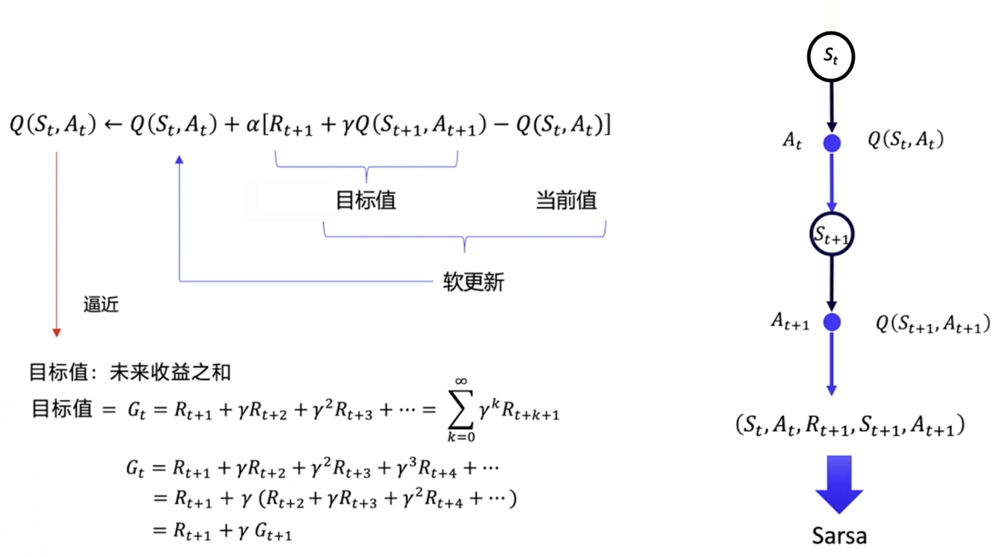

用软更新(每次更新一点)的方式逼近真实值

由于该算法需要知道 当前状态 $s_t$ ，当前动作 $a_{t}$ ，当前动作奖励 $r_{t}$ ，下一步的状态 $s_{t+1}$ ，下一步的动作 $a_{t+1}$ ，即需要知道 $(s_t,a_{t},r_{t},s_{t+1},a_{t+1})$ 这一决策历史，因此命名为 Sarsa 算法

**收敛性** 

> 同样，Sarsa是一种特殊的RM算法，若其满足对于所有的 $s\in \mathcal{S},a\in \mathcal{A}(s)$ ，$\sum\limits_{t}\alpha_t(s,a)=\infty,\sum\limits_{t}\alpha_t^2(s,a)<\infty$，则可知当 $t\rightarrow \infty$ 时， $Q^{(t)}_{\pi}(s,a)$ 依概率收敛于 $Q^*_{\pi}(s,a)$ 

##### 伪代码
$$
\begin{array}{ll}
\hline
&超参数:步长大小 \alpha\in(0,1],很小的\varepsilon>0\\
&初始化:\\
&\quad Q(s,a)随机初始化,其中 s\in \mathcal{S},a\in \mathcal{A}\\
&\quad Q(终点,\cdot)=0\\
&对于每个回合:\\
&\quad 初始化 s\\
&\quad 使用从Q表中衍生出的策略(如\varepsilon-贪心)根据状态s选择a\\
&\quad 遍历一个回合中的每一步:\\
&\qquad 基于策略\pi，生成经验 (s,a,r',s',a'),其中 a=\pi(s)得到s'与r':\\
&\quad \qquad 策略评估:\\
&\qquad \qquad Q^{(t+1)}_{\pi}(s,a)=Q^{(t)}_{\pi}(s,a)-\alpha_t(s,a)\left[Q^{(t)}_{\pi}(s,a)-[r'^{(t)}+\gamma Q^{(t)}_{\pi}(s',a')]\right]\\
&\quad \qquad 策略改进:\\
&\qquad \qquad \begin{cases}
\pi^{(t+1)}(a\vert s)=1-\frac{\varepsilon}{\vert \mathcal{A}\vert}(\vert \mathcal{A}\vert-1)&,a=\mathop{\mathrm{argmax}}\limits_{a}Q^{(t+1)}_{\pi}(s,a)\\
\pi^{(t+1)}(a\vert s)=\frac{\varepsilon}{\vert \mathcal{A}\vert}&,其他 
\end{cases}\\
&\qquad\quad  s\leftarrow s',a\leftarrow a'\\
&\qquad\quad  直至s到达终点\\
\hline
\end{array}
$$
- 更新一次Q值后，就立刻更新策略
- 使用 $\varepsilon-贪心$ 算法平衡探索与利用

##### 例子

任务：从特定状态出发到达目标状态

- 与网格世界区别：只关注从一个特定状态到达目标状态的最优策略，网格世界需要关注从每个状态出发到达目标状态的最优策略，必须探索所有的状态-动作对

$r_{target}=0,r_{forbidden}=-10,r_{other}=-1$ ，$\alpha=0.1$ ，探索率 $\varepsilon=0.1$ 

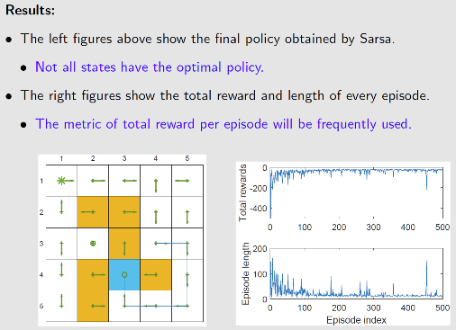

随着策略不断改进，奖励会不断变大，但到达目标奖励应该是正数，由于采用了 $\varepsilon-贪心$ 策略，或多或少还是会有负的奖励

#### Expected Sarsa

在 **Sarsa** 算法中，对于未来动作价值的估计依赖于 $t$ 时刻对 $(s',a')$ 的估计 $Q^{(t)}_{\pi}(s',a')$ ，存在较大偏差，因此将其替换为未来动作价值的期望
$$
\begin{cases}
Q^{(t+1)}_{\pi}(s,a)=Q^{(t)}_{\pi}(s,a)-\alpha_t(s,a)\left[Q^{(t)}_{\pi}(s,a)-[r'^{(t)}+\gamma E[Q^{(t)}_{\pi}(s',\mathcal{A}(s'))]\right]&,(S_t,A_t)=(s,a)\\
Q^{(t+1)}_{\pi}(s,a)=Q^{(t)}_{\pi}(s,a)&,\forall (S_t,A_t)\neq(s,a)
\end{cases}
$$
其中
$$
E[Q^{(t)}_{\pi}(s',\mathcal{A}(s'))]=\sum\limits_{a}\pi^{(t)}(a\vert s')Q^{(t)}(s',a)=V^{(t)}_{\pi}(s')
$$
相较于 **Sarsa** ，**Expected Sarsa** 需要更多的计算去估计动作价值，但由于涉及的随机变量更少 （$\{S_t,A_t,R_{t+1},S_{t+1},A_{t+1}\}$ 变为 $\{S_t,A_t,R_{t+1},S_{t+1}\}$），随机性也会减少，对动作价值的估计偏差更小

实际上，求解了贝尔曼动作期望方程
$$
\begin{aligned}
Q_{\pi}(s,a)&=E\left[R_{t+1}+\gamma E_{A_{t+1}\sim \pi(S_{t+1})}\left[Q_{\pi}(S_{t+1},A_{t+1})\right]\vert S_t=s,A_t=a\right]\\
&=E[R_{t+1}+\gamma V_{\pi}(S_{t+1})\vert S_t=s,A_t=a]
\end{aligned}
$$
#### n-step Sarsa

动作价值定义为

$$
Q_{\pi}(s,a)=E[G_t\vert S_t=s,A_t=a]
$$
回报 $G_t$ 可以被写成不同形式
$$
\begin{array}{rl}
\mbox{Sarsa}\leftarrow&G_t^{[1]}=r_{t+1}+\gamma Q(s_{t+1},a_{t+1})\\
&G_{t}^{[2]}=r_{t+1}+\gamma r_{t+2}+\gamma^2 Q(s_{t+2},a_{t+2})\\
&\vdots\\
\mbox{n-step Sarsa}\leftarrow&G_t^{[n]}=r_{t+1}+\gamma r_{t+2}+\gamma^2r_{t+3}+\cdots+\gamma^{n-1}r_{t+n}+\gamma^n Q(s_{t+1+n},a_{t+1+n})\\
&\vdots\\
\mbox{MC}\leftarrow&G_t^{[\infty]}=r_{t+1}+\gamma r_{t+2}+\cdots+\gamma^{T-t-1}r_T
\end{array}
$$
其中 $G_t=G_t^{[1]}=G_t^{[2]}=G_t^{[n]}=G_t^{[\infty]}$ 都是一个值，区别在于怎么分解

##### n-step Sarsa的想法

MC算法利用当前轨迹的真实奖励去估计价值，所以是无偏的，但由于奖励本身的随机性，方差大（受数据随机性影响大）

Sarsa算法只使用单步真实奖励与下一状态的价值估计，因此受奖励波动影响小，但受下一状态价值估计的影响，是有偏的

将二者截断，融合各自优点，得到 n-step Sarsa

##### 算法描述

$$
Q^{(t+n)}(s_{t+1},a_{t+1})=G_t^{[n]}=R^{(t+n-1)}_{\pi}(s_t,a_t)+\gamma R_{\pi}^{(t+n-1)}(s_{t+1},a_{t+1})+\cdots+\gamma^{n-1}R_{\pi}^{(t+n-1)}(s_{t+n-1},a_{t+n-1})+\gamma^nQ_{\pi}^{(t+n-1)}(s_{t+n},a_{t+n})\\
Q^{(t+n)}_{\pi}(s,a)=Q^{(t)}_{\pi}(s,a)-\alpha_t(s,a)\left[Q^{(t)}_{\pi}(s,a)-G_t^{[n]}\right]
$$

##### 带资格衰减参数的n-step Sarsa($\lambda$)

如果给 $G_{t}^{[n]}$ 加上资格衰减参数 $\lambda$ 并进行求和，即回报的期望 $G^{\lambda}_{t}$ ，则可替代 **n-step Sarsa** 中的未来动作价值的期望，对时序差分目标的估计更准确，能更快收敛
$$
G^{\lambda}_{t}=(1-\lambda)\sum\limits_{n=1}^{\infty}\lambda^{n-1}G_{t}^{[n]}
$$
因此 **n-step Sarsa($\lambda$)** 的更新策略为
$$
\begin{cases}
Q^{(t+1)}_{\pi}(s,a)=Q^{(t)}_{\pi}(s,a)-\alpha_t(s,a)\left[Q^{(t)}_{\pi}(s,a)-G^{\lambda}_{t}\right]&,(S_t,A_t)=(s,a)\\
Q^{(t+1)}_{\pi}(s,a)=Q^{(t)}_{\pi}(s,a)&,\forall (S_t,A_t)\neq(s,a)
\end{cases}
$$
#### Sarsa与MC对比

- 数据量角度：Sarsa只需要一个访问对 $(s,a,r',s',a')$ 就能对价值函数进行更新，MC需要无穷多个访问对或一个回合结束，收集到所有的数据才能计算 $t$ 时刻 $(s_t,a_t)$ 所对应的动作价值。n-step是二者的折中

- 介于在线学习(TD经典算法，Sarsa)与离线学习(MC方法)中间

  在 $t$ 时刻，不能立即进行更新，必须等收集到  **n-step Sarsa** 第 $n$ 步更新所需要的访问 $(r_{t+n},s_{t+n},a_{t+n})$ 

- 性能表现：Sarsa与MC方法性能的折中

  当 $n$ 较大时，接近 **MC**，偏差小，方差大

  当 $n$ 较小时，接近 **Sarsa** ，偏差大，方差小

- 求解动作价值的方式

  **Sarsa** 求解的是贝尔曼动作期望方程
$$
  \begin{aligned}
  Q_{\pi}^{[1]}(s,a)&=E[G^{[1]}_t\vert s,a]=E[R_{t+1}+\gamma Q_{\pi}(S_{t+1},A_{t+1})\vert s,a]\\
  Q_{\pi}^{[n]}(s,a)&=E[G^{[n]}_t\vert s,a]=E[R_{t+1}+\gamma R_{t+2}+\cdots+\gamma Q_{\pi}(S_{t+n},A_{t+n})\vert s,a]
  \end{aligned}
$$
  **MC** 依据动作价值定义直接估计
$$
  Q_{\pi}(s,a)=E[G^{[\infty]}_t\vert s,a]=E[R_{t+1}+\gamma R_{t+2}+\gamma^2 R_{t+3}+\cdots+\vert s,a]
$$
### 3.5.2 Q-learning

> Q-learning直接估计最优动作价值，不需要在策略评估与策略改进之间迭代

Q-learning的下一动作通过 $argmax$ 操作选出来的，对于时序差分目标
$$
\begin{align}
R_{t+1}+\gamma Q(S_{t+1},a')&=R_{t+1}+\gamma Q(S_{t+1},\mathop{\mathrm{argmax}}_{a'} Q(S_{t+1},a'))\\
&=R_{t+1}+\gamma \max_{a'} Q(S_{t+1},a')
\end{align}
$$
所以对于Q-learning，求解的是贝尔曼最优方程
$$
Q(s,a)=E[R_{t+1}+\gamma \max\limits_{a}Q(S_{t+1},a)\vert S_t=s,A_t=a],\forall s,a
$$
令 $g(Q(s,a))=Q(s,a)-E[R_{t+1}+\gamma \max\limits_{a}Q(S_{t+1},a)\vert S_t=s,A_t=a]=0$ ，其观测量 $\tilde{g}(Q(s,a))=Q(s,a)-\left[R_{t+1}+\gamma \max\limits_{a}Q(S_{t+1},a)\right]$ 。使用RM算法求解方程
$$
\begin{cases}
\begin{aligned}
Q^{(t+1)}(s,a)&=Q^{(t)}(s,a)-\alpha_t(s,a)\tilde{g}(Q^{(t)}(s,a))\\
&=Q^{(t)}(s,a)-\alpha_t(s,a)\left(Q^{(t)}(s,a)-\left[r'^{(t+1)}+\gamma \max\limits_{a\in \mathcal{A}}Q(s',a)\right]\right)
\end{aligned}&,(S_t,A_t)=(s,a)\\
Q^{(t+1)}(s,a)=Q^{(t)}(s,a)&,(S_t,A_t)\neq(s,a)
\end{cases}
$$
**Q-learning** 的时序差分目标是 $r_{t+1}^{(t)}+\gamma \max\limits_{a\in \mathcal{A}}Q(s_{t+1},a)$ 

**Sarsa** 的时序差分目标是 $r_{t+1}^{(t)}+\gamma Q^{(t)}_{\pi}(s_{t+1},a_{t+1})$ 

二者的区别在于 $a'$ 的选择，**Sarsa** 依据当前策略选择下一时刻的动作，可以是任何动作；**Q-learning** 基于贪心策略选择最优的动作

- Sarsa算法更新 $Q$ 表的 $a'$ 一定是下一步骤实际要执行的动作，这个动作可以是随机动作、可以是最大化 Q 表选取出来的动作、也可以是 $\varepsilon-贪心$ 选取的策略

- Q-learning 更新 $Q$ 表的 $a'$ 不一定是下一个步骤会实际执行的动作。因为默认动作不是根据行为策略选取出来的。

> Q -learning 被提出的时间更早，Sarsa 算法是Q 学习算法的改进

#### 同策略与异策略

##### 判断同策略/异策略

1. 算法解决了什么数学问题
2. 确定算法实现过程

###### MC是同策略学习

**MC** 目标是求解动作价值的定义
$$
Q_{\pi}(s,a)=E[R_{t+1}+\gamma R_{t+2}+\gamma^2 R_{t+3}+\cdots\vert S_t=s,A_t=a],\forall s,
$$
算法实现上，使用均值近似方法
$$
Q_{\pi}(s,a)\approx\frac{1}{n}\sum\limits_{j=1}^nG_j
$$
在整个学习过程中，数据通过策略 $\pi$ 产生，策略改进中优化的也是 $\pi$ ，所要是同策略学习

###### Sarsa是同策略算法

**Sarsa** 目标是求解给定策略 $\pi$ 下的贝尔曼动作期望方程
$$
Q_{\pi}(s,a)=E[R_{t+1}+\gamma Q_{\pi}(S_{t+1},A_{t+1})\vert S_t=s,A_t=a],\forall s,a
$$
RM算法求解公式是
$$
Q^{(t+1)}_{\pi}(s,a)=Q^{(t)}_{\pi}(s,a)-\alpha_t(s,a)\left[Q^{(t)}_{\pi}(s,a)-[r'^{(t)}+\gamma Q^{(t)}_{\pi}(s',a')]\right]
$$
需要的数据是 $(s,a,r',s',a')$ ，若 $(s,a)$ 是给定的，则 $(r',s',a')$ 由策略 $\pi^{(t)}$ 决定

策略改进步骤，优化的策略是 $\pi^{(t+1)}$ 
$$
\begin{cases}
\pi^{(t+1)}(a\vert s)=1-\frac{\varepsilon}{\vert \mathcal{A}\vert}(\vert \mathcal{A}\vert-1)&,a=\mathop{\mathrm{argmax}}\limits_{a}Q^{(t+1)}_{\pi}(s,a)\\
\pi^{(t+1)}(a\vert s)=\frac{\varepsilon}{\vert \mathcal{A}\vert}&,其他 
\end{cases}\\
$$
且 $a'=\pi^{(t+1)}(s')$ 

即它优化的是它实际执行的策略，Q表迭代过程直接使用下一步要执行的动作。在整个学习过程中，只存在一种策略进行探索与策略改进。 所以整体上，Sarsa是一种偏保守的策略，从动作选择到策略改进都会尽量避免回合失败且尽可能远离失败状态

###### Q-learning是异策略学习

**Q-learning** 求解目标是贝尔曼最优方程
$$
Q(s,a)=E[R_{t+1}+\gamma \max\limits_{a}Q(S_{t+1},a)\vert S_t=s,A_t=a],\forall s,a
$$
RM求解算法是
$$
Q^{(t+1)}(s,a)=Q^{(t)}(s,a)-\alpha_t(s,a)\left(Q^{(t)}(s,a)-\left[r'^{(t)}+\gamma \max\limits_{a\in \mathcal{A}}Q^{(t)}(s',a)\right]\right)
$$
需要的数据是 $(s,a,r',s')$ ，根据探索策t略选择动作 $a=\mu(\cdot\vert s)$ ，而 $(r',s',a')$ 的产生不依赖于任何策略，仅由隐藏的状态转移 $P(r'\vert s,a),P(s'\vert s,a)$ 决定，所以 Q-learn 天生是异策略学习，并不需要重要性采样

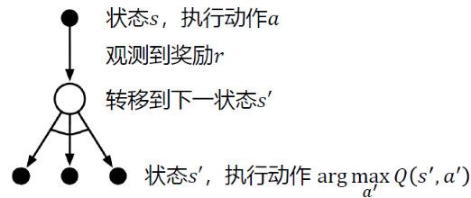

时序差分目标是 $Q^*(s,a)=R(s,a)+\gamma Q^*(s',a')$ ，$R(s,a)$ 是动作奖励（期望） 

而目标策略是令 $Q\rightarrow Q^*$ 的最优策略

#### 伪代码

同策略版需要用 $\varepsilon-贪心$ 的策略生成数据，希望这个策略具有一定的探索性，能够访问到还未被访问的 $(s,a)$ 
$$
\begin{array}{ll}
\hline
&对于每个回合:\\
&\quad 若当前的 s_t 不是目标状态:\\
&\qquad 收集经验 (s_t,a_t,r_{t+1},s_{t+1}):基于策略\pi^{(t)}(s_t)生成动作a_{t}与r_{t+1},s_{t+1}\\
&\qquad 更新Q值:\\
&\quad \qquad Q^{(t+1)}(s_t,a_t)=Q^{(t)}(s_t,a_t)-\alpha_t(s_t,a_t)\left(Q^{(t)}(s_t,a_t)-\left[r_{t+1}^{(t+1)}+\gamma \max\limits_{a\in \mathcal{A}}Q^{(t)}(s_{t+1},a)\right]\right)\\
&\qquad 更新策略：\\
&\quad \qquad \begin{cases}
\pi^{(t+1)}(a\vert s_t)=1-\frac{\varepsilon}{\vert \mathcal{A}\vert}(\vert \mathcal{A}\vert-1)&,a=\mathop{\mathrm{argmax}}\limits_{a}Q^{(t+1)}(s_t,a)\\
\pi^{(t+1)}(a\vert s_t)=\frac{\varepsilon}{\vert \mathcal{A}\vert}&,其他 
\end{cases}\\
\hline
\end{array}
$$
异策略版基于贪心算法产生的策略不用于生成数据，数据由探索策略 $\mu$ 策略生成

所以只需要基于贪心算法产生最优策略即可。随着 $Q$ 的估计越来越准确，目标策略的估计也会收敛到最优策略 $\pi$ 
$$
\begin{array}{ll}
\hline
&超参数:步长大小 \alpha\in(0,1],很小的\varepsilon>0\\
&初始化:\\
&\quad Q(s,a)随机初始化,其中 s\in \mathcal{S},a\in \mathcal{A}\\
&\quad Q(终点,\cdot)=0\\
&对于由探索策略\mu生成的每个回合\{s_0,a_0,r_1,s_1,a_1,r_2\cdots\}:\\
&\quad 对回合的每一步t=0,1,2,\cdots:\\
&\qquad 更新Q值:\\
&\quad \qquad Q^{(t+1)}(s_t,a_t)=Q^{(t)}(s_t,a_t)-\alpha_t(s_t,a_t)\left(Q^{(t)}(s_t,a_t)-\left[r_{t+1}^{(t)}+\gamma \max\limits_{a\in \mathcal{A}}Q(s_{t+1},a)\right]\right)\\
&\qquad 更新策略：\\
&\quad \qquad \begin{cases}
\pi^{(t+1)}(a\vert s_t)=1&,a=\mathop{\mathrm{argmax}}\limits_{a}Q^{(t+1)}(s_t,a)\\
\pi^{(t+1)}(a\vert s_t)=0&,其他 
\end{cases}\\
&\qquad s\leftarrow s'\\
&\qquad 直至s到达终点\\
\hline
\end{array}
$$
#### 例子

目标：为每个状态寻找到达目标状态的最优策略

奖励设置：$r_{boundary}=r_{forbidden}=-1,r_{target}=1$ ，折扣因子 $\gamma=0.9$ ，学习率 $\alpha=0.1$

基于动态规划的最优策略与最优动作价值

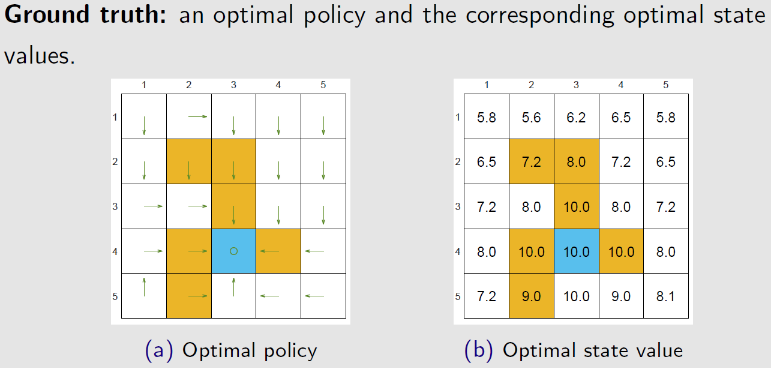

若探索策略能探索所有的访问，则可以很快地收敛到最优策略

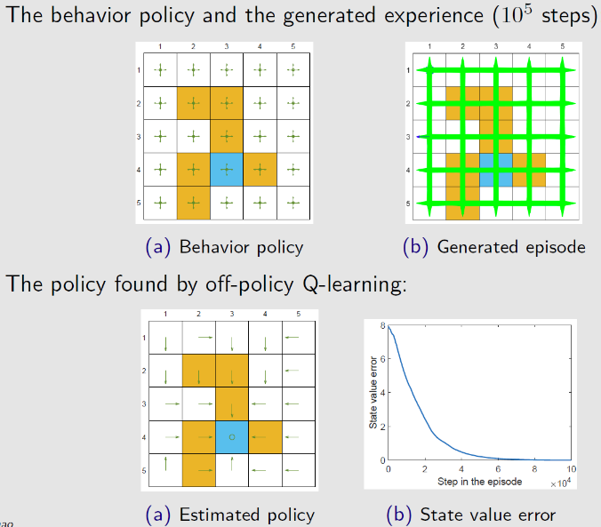

若探索策略不充分，则收敛于最优策略的速度很慢

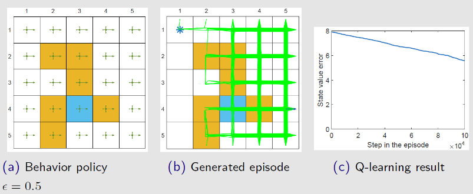

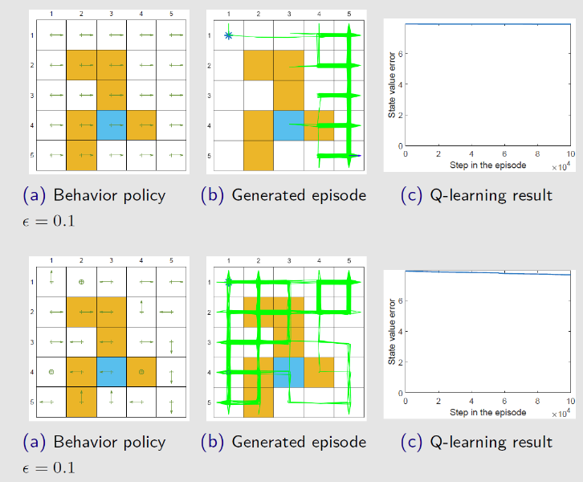

#### Q-learning与Sarsa算法对比

Sarsa算法与Q学习唯一区别就是 Q学习不需要知道 $a'$ 就能更新 $Q$ 表，只需要知道 $(s_t,a_t,r_t,s_{t+1})$

Sarsa算法是典型的同策略算法，整个训练过程只有一个策略 $\pi$ ，不仅使用策略 $\pi$ 学习，还使用策略 $\pi$ 与环境交互产生经验。若采用 $\varepsilon-贪心$ 进行策略改进，为了兼顾探索与利用，在训练时的探索能一直保持在安全区域内。由于 $\varepsilon$ 会不断变小，在训练过程中策略不稳定

Q学习是典型异策略算法，行为策略可以采用 $\varepsilon-贪心$ 算法；目标策略采用贪心算法，直接根据行为策略采集到的数据采用最佳策略。可以大胆地利用行为策略探索得到的经验轨迹来优化目标策略，从而更有可能探索到最佳策略。

Q学习是非常激进的方法，它希望每一步都获得最大收益；Sarsa算法较为保守，会选择一条相对安全的迭代路线

### 3.3.5 TD算法总结

TD算法可表示为统一形式
$$
Q^{(t+1)}_{\pi}(s_t,a_t)=Q^{(t)}_{\pi}(s_t,a_t)-\alpha_t(s_t,a_t)\left[Q^{(t)}_{\pi}(s_t,a_t)-\overline{Q}^{(t)}\right]
$$

| 算法               | $\overline{Q}^{(t)}$ 的表达式                                |
| ------------------ | ------------------------------------------------------------ |
| **Monte Carlo**    | $\overline{Q}^{(t)}=r_{t+1}+\gamma r_{t+2}+\cdots\quad, \alpha=1$ |
| **Sarsa**          | $\overline{Q}^{(t)}=r_{t+1}^{(t)}+\gamma Q_{\pi}^{(t)}(s_{t+1},a_{t+1})$ |
| **n-step Sarsa**   | $\overline{Q}^{(t)}=r_{t+1}^{(t)}+\gamma r_{t+2}^{(t)}+\gamma^2 r_{t+3}^{(t)}+\cdots+\gamma ^{n-1}r_{t+n}^{(t)}+\gamma^nQ_{\pi}^{(t)}(s_{t+n},a_{t+n})$ |
| **Expected Sarsa** | $\overline{Q}^{(t)}=r_{t+1}^{(t)}+\gamma\sum\limits_{a\in\mathcal{A}}\pi^{(t)}(a\vert s_{t+1})Q^{(t)}_{\pi}(s_{t+1},a)$ |
| **Q-learning**     | $\overline{Q}^{(t)}=r_{t+1}+\gamma \max\limits_{a\in \mathcal{A}}Q^{(t)}(s_{t+1},a)$ |

| 算法               | 求解的表达式                                                 |
| ------------------ | ------------------------------------------------------------ |
| **Monte Carlo**    | 贝尔曼方程：$Q_{\pi}(s,a)=E[r_{t+1}+\gamma r_{t+2}+\cdots\vert S_t=s,A_t=a]$ |
| **Sarsa**          | 贝尔曼期望方程：$Q_{\pi}(s,a)=E[r_{t+1}+\gamma Q_{\pi}(s_{t+1},a_{t+1})\vert S_t=s,A_t=a]$ |
| **n-step Sarsa**   | 贝尔曼期望方程：$Q_{\pi}(s,a)=E[r_{t+1}+\gamma r_{t+2}+\cdots+\gamma ^{n-1}r_{t+n}+\gamma^nQ_{\pi}(s_{t+n},a_{t+n})\vert S_t=s,A_t=a]$ |
| **Expected Sarsa** | 贝尔曼期望方程：$Q_{\pi}(s,a)=E[r_{t+1}+\gamma E_{a_{t+1}\sim \pi(s_{t+1})}[Q_{\pi}(s_{t+1},a_{t+1})]]$ |
| **Q-learning**     | 贝尔曼最优方程：$Q(s,a)=E[r_{t+1}+\max\limits_{a}Q(s_{t+1},a)\vert S_t=s,A_t=a]$ |

Q-learning：直接将最优的Q值求解出来，相对应的策略也是最优的

Sarsa，MC本质上都是估计给定策略下的状态价值，需要结合策略改进搜索最优策略
