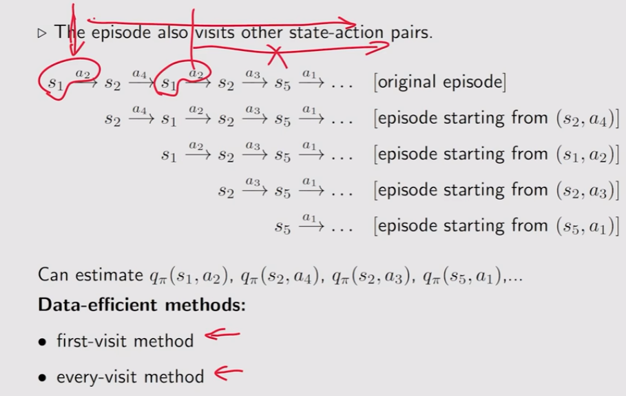

免模型学习的价值函数计算方法

- 蒙特卡洛方法：将策略迭代中，基于模型的部分替换为免模型部分

  更新时间：2024-2-24 10:28:04

- 时序差分方法

  更新时间：2024-2-27 23:34:53

[TOC]

<!--more-->

## 3.1 蒙特卡洛方法

> 基于蒙特卡洛方法的免模型学习是一种 **广义策略迭代** (generalized policy iteration, GPI)
>
> - 不断地在 *策略评估, PE* 与 *策略改进, PI* 之间切换
> - 策略评估不需要精确的 $Q$ 值与 $V$ 值

- MC基本思想

- MC Basic：实现从有模型学习到无模型学习的转化
- MC探索性开始
  - 提高数据的使用效率
- 去除探索性开始条件
  - MC $\varepsilon-贪心$ 

### 3.1.1 蒙特卡洛基本思想

掷硬币，用随机变量 $X$ 表示结果，$+1,-1$ 表示两种结果，求期望 $E[X]$

- 基于模型的方法

  当我们已知硬币是均匀的，或任何能保证得出 $P(X=+1)=P(X=-1)=0.5$ 的条件，在这种先验知识的条件下，我们可以对实验环境进行建模，用 $P(X=+1)=P(X=-1)=0.5$  表示环境模型，进而可基于模型的方法估计期望

  $E[X]=\sum\limits_{x}xP(x)=0$ 

- 基于MC的方法：**采样取平均** 

  在不知道任何先验知识的前提下，就无法对实验环境进行建模

  无模型时用数据(经验,experience)：通过多次实验，可以得到样本集 $\{x_1,x_2,\cdots,x_N\}$ 
  $$
  E[X]\approx \overline{X}=\frac{1}{N}\sum\limits_{j=1}^Nx_j
  $$
  

  可见，随着实验次数的增多，$\overline{X}\xrightarrow{N\rightarrow \infty}E[X]$ 

#### MC方法理论依据——大数定律

对于一个随机变量 $X$ ，假设 $\{x_j\}_{j=1}^{N}$ 是独立同分布样本集，令 $\overline{X}=\frac{1}{N}\sum\limits_{j=1}^Nx_j$ ，则有，
$$
E[\overline{X}]=E[X]\\
Var[\overline{X}]=\frac{1}{N}Var[X]
$$
即 $\overline{X}$ 是 $E[X]$ 的无偏估计，且方差随着实验次数的增多减小

### 3.1.2 MC Basic

####   策略迭代分析

PE：$\mathbf{V}_{\pi^{(t)}}=\mathbf{R}_{\pi^{(t)}}+\gamma P_{\pi^{(t)}}\mathbf{V}_{\pi^{(t)}}$

PI：$\pi^{(t+1)}=\mathop{\mathrm{argmax}}\limits_{\pi}\left(\mathbf{R}_{\pi}+\gamma P_{\pi}\mathbf{V}_{\pi^{(t)}}\right)$

对于策略改进步骤，针对每个状态 $s\in \mathcal{S}$ 
$$
\begin{aligned}
\pi^{(t+1)}(a\vert s)&=\mathop{\mathrm{argmax}}\limits_{\pi}\sum\limits_{a}\pi(a\vert s)\left[\sum\limits_{r'}P(r'\vert s,a)r'+\sum\limits_{s'}P(s'\vert s,a)V_{\pi^{(t)}}(s')\right]\\
&=\mathop{\mathrm{argmax}}\limits_{\pi}\sum\limits_{a}\pi(a\vert s)Q_{\pi^{(t)}}(s,a)
\end{aligned}
$$
若环境动态特性 $P(s',r\vert s,a)$ 已知，可通过对动态规划方法计算 $Q_{\pi^{(t)}}(s,a)$ 

若环境动态特性 $P(s',r\vert s,a)$ 未知，则采用蒙特卡洛方法计算
$$
Q_{\pi^{(t)}}(s,a)=E_{\pi^{(t)}}[G_{t}\vert s_t=s,a_t=a]\\
\downarrow\\
均值估计问题\leftarrow MC方法
$$

#### MC Basic算法

1. 从 $(s,a)$ 开始，基于策略 $\pi^{(t)}$ 生成轨迹 $\tau$ 

2. 计算 $\tau$ 的回报 $g(s,a)$ 
   $$
   g^{(j)}(s,a)=r(s,a)+\gamma r(s_{t+1},a_{t+1})+\gamma^2r(s_{t+2},a_{t+2})+\cdots
   $$

   - 若采用确定性策略，且环境也是确定的。若估计 $Q(s_1,a_1)$ ，则基于当前策略 $\pi^{(t)}$ 从 $(s_1,a_1)$ 出发，不管采样多少次，得到的轨迹都是同一条，故只需要采样一次。因此估计整个Q表只需要 $\sum\limits_{s\in \mathcal{S}} \vert \mathcal{A}(s)\vert$ 条轨迹，即 $N=1$ 
   - 若采用随机性策略或确定性策略但环境是随机的。若估计 $Q(s_1,a_1)$ ，则基于当前策略 $\pi^{(t)}$ 从 $(s_1,a_1)$ 出发，需要采集从 $(s_1,a_1)$ 出发的 $N$ 条轨迹才能估计其状态价值 $Q(s_1,a_1)$ 。因此估计整个Q表共需计算 $\sum\limits_{s\in \mathcal{S}} \vert \mathcal{A}(s)\vert\times N$ 条轨迹的回报，即 $N$ 为足够大的数值

3. 执行 $N$ 次 1,2，可得到一个回报集 $\{g^{(j)}(s,a)\}_{j=1}^N$ ，计算动作价值
   $$
   Q_{\pi^{(t)}}(s,a)=E_{\pi^{(t)}}[G_{t}\vert s_t=s,a_t=a]\approx\overline{g}(s,a)=\frac{1}{N}\sum\limits_{j=1}^Ng^{(j)}(s,a)
   $$

##### 伪代码

$$
\begin{array}{ll}
\hline
&初始化：初始化策略 \pi^{(0)}\\
&目标：寻找最优策略\\
&当价值函数未收敛，进行第 t 轮迭代:\\
&\quad 对于每个状态 s\in \mathcal{S}:\\
&\qquad 对于每个动作a\in \mathcal{A}(s):\\
&\qquad \quad MC-based 策略评估:\\
&\qquad \qquad 以(s,a) 为起点，基于策略\pi^{(t)} 生成足够多的回合，计算这些回合的回报g(s,a)\\
&\qquad \qquad Q_{\pi^{(t)}}(s,a)=\overline{g}(s,a)\\
&\qquad MC-based 策略改进：\\
&\qquad \quad \pi^{(t+1)}=\begin{cases}
1&,a=a^{(t)}_*\\
0&,a\neq a^{(t)}_*
\end{cases}\qquad a^{(t)}_*=\mathop{\mathrm{argmax}}\limits_{a}Q_{\pi^{(t)}}(s,a) 
\\
\hline
\end{array}
$$

#### MC Basic例子

- 初始策略 $\pi^{(0)}$ 
- 奖励设置 $r_{boundary}=-1,r_{forbidden}=-1,r_{target}=1,\gamma=0.9$ 

对于当前策略 $\pi^{(t)}$ 

1. 策略评估：计算 $Q_{\pi^{(t)}}(s,a)$ 

   对于示例，有9个状态，每个状态由5个动作，即 $Q$ 表需要计算 $9\times 5=45$ 个 $Q$ 值，由于此例采用确定性策略，所以只需要45条轨迹

2. 策略改进：贪心算法选择最优决策
   $$
   a_*^{(t)}(s)=\mathop{\mathrm{argmax}}\limits_{a}Q_{\pi^{(t)}}(s,a)
   $$

以 $Q_{\pi^{(0)}}(s_1,a)$ 的计算为例

**1. 策略评估** 

从 $(s_1,a_1)$ 开始，轨迹为 $s_1\xrightarrow{a_1}s_1\xrightarrow{a_1}s_1\xrightarrow{a_1}\cdots$ ，动作价值为
$$
Q_{\pi^{(0)}}(s_1,a_1)=-1+\gamma(-1)+\gamma^2(-1)+\cdots=-\frac{1}{1-\gamma}
$$
从 $(s_1,a_2)$ 开始，轨迹为 $s_1\xrightarrow{a_2}s_2\xrightarrow{a_3}s_5\xrightarrow{a_3}s_8\xrightarrow{a_2}s_9\xrightarrow{a_5}s_9\cdots$ ，动作价值为
$$
Q_{\pi^{(0)}}(s_1,a_2)=0+\gamma(0)+\gamma^2(0)+\gamma^3(1)+\cdots=\frac{\gamma^3}{1-\gamma}
$$
从 $(s_1,a_3)$ 开始，轨迹为 $s_1\xrightarrow{a_3}s_4\xrightarrow{a_2}s_5\xrightarrow{a_3}s_8\xrightarrow{a_2}s_9\xrightarrow{a_5}s_9\cdots$ ，动作价值为
$$
Q_{\pi^{(0)}}(s_1,a_3)=0+\gamma(0)+\gamma^2(0)+\gamma^3(1)+\cdots=\frac{\gamma^3}{1-\gamma}
$$
从 $(s_1,a_4)$ 开始，轨迹为 $s_1\xrightarrow{a_4}s_1\xrightarrow{a_1}s_1\xrightarrow{a_1}s_1\xrightarrow{a_1}\cdots$ ，动作价值为
$$
Q_{\pi^{(0)}}(s_1,a_4)=-1+\gamma(-1)+\gamma^2(-1)+\cdots=-\frac{1}{1-\gamma}
$$
从 $(s_1,a_5)$ 开始，轨迹为 $s_1\xrightarrow{a_5}s_1\xrightarrow{a_1}s_1\xrightarrow{a_1}s_1\xrightarrow{a_1}\cdots$ ，动作价值为
$$
Q_{\pi^{(0)}}(s_1,a_5)=0+\gamma(-1)+\gamma^2(-1)+\cdots=-\frac{\gamma}{1-\gamma}
$$
**2. 策略改进**

通过观察动作价值，可知在 $s_1$ 时，最佳动作是 $a_2,a_3$
$$
Q_{\pi^{(0)}}(s_1,a_2)=Q_{\pi^{(0)}}(s_1,a_3)
$$
因此，策略改进为
$$
\pi^{(1)}(a_2\vert s_1)或\pi^{(1)}(a_3\vert s_1)=1
$$

#### MC Basic特点

MCBasic算法是MC-based RL的核心，但由于其数据利用效率低，所以并不实用

因为策略迭代算法是收敛的，所以有足够回合数据的MC Basic也是收敛的

回合长度，**直观上可以理解为探索半径**。理论上越长越好，可以使计算出的回报更为精确，但实际上不可能无穷长，只要能让所有状态到达目标状态即可

##### 关于回合长度的例子

- 奖励设置 $r_{boundary}=-1,r_{forbidden}=-10,r_{target}=1,\gamma=0.9$ 

通过当前策略可到达目标状态的当前状态，其状态价值是正数；0表示未到达目标，若为负数，则表示有进入禁入区域或越界的中间状态

当回合长度为1时，只有目标状态一步之内的状态的最佳策略是正确的

当回合长度短时，只有离目标状态近的状态才有非0的状态价值，进而找到最优的策略；随着回合长度的增加，离目标状态远的状态才能到达目标状态，从而找到最优策略

### 3.1.3 探索性开始

#### 探索性开始的必要性

**探索**：确保每个 $(s,a)$ 都能被访问到

- 需要保证从一个访问出发有多个回合，只有这样才能用后边的奖励来估计回报，进一步估计动作价值
- 同时，为了不遗漏最优决策，需要保证每个$(s,a)$ 都能够被访问到

**开始** ：要生成以 $(s,a)$ 开始的回合

- 若要计算以 $(s,a)$ 开始的回合的回报，有两种方法

  - start：计算以 $(s,a)$ 开始的回合

  - visit 从其他 $(s',a')$ 开始，中间经过 $(s,a)$ ，将回合前截断，计算 $(s,a)$ 之后的回报

    但由于轨迹的生成依赖于策略与环境，无法保证以 $(s,a)$ 开始仍能获取后续轨迹，即不保证可复现

#### 提高策略评估的效率

> 访问：在每个回合中，每出现一次 $(s_t,a_t)$ 都为对其的一次访问

- 数据的高效利用
- 策略更新时机

##### 数据的高效利用

一个以 $(s_1,a_2)$ 开始的回合，仅用于计算 $Q(s_1,a_2)$ ，并为充分利用这一经验

**一个回合可以作为多个Q值的经验** 

采用 *first-visit* 方法，对于出现在同一个回合中的多个同一访问 $(s_t,a_t)$ ，只将其第一次出现之后的轨迹作为 $(s_t,a_t)$ 的一条轨迹

采用 *every-visit* 方法，对于出现在同一个回合中的多个同一访问 $(s_t,a_t)$ ， 将每个 $(s_t,a_t)$ 之后的轨迹都作为 $(s_t,a_t)$ 的一条轨迹

##### 策略更新时机——离线变在线

- 在策略评估中，若评估 $(s_1,a_1)$ 的动作价值 $Q(s_1,a_1)$ ，则需要收集 $N$ 条以 $(s_1,a_1)$ 开始的轨迹，然后计算这些轨迹的回报均值去近似动作价值

  被 MC Basic 算法采用，缺点是需要等所有的回合收集结束后再开始计算均值

- 使用一个回合的回报在线更新动作价值

  优点：可以在线逐回合改进策略

#### 伪代码：MC探索性开始

$$
\begin{array}{ll}
\hline
&初始化：初始化策略\pi^{(0)},Q(s,a),R(s,a)=0,Num(s,a)=0,\forall s\in \mathcal{S},a\in \mathcal{A}(s)\\
&目标：寻找最优策略\\
&\\
&对于每个回合:\\
&\quad生成回合:随机选择回合起点(s_0,a_0)，并确保所有的访问都有可能被选择到。\\
&\quad \qquad\qquad 基于当前策略 \pi^{(t)}生成回合长度为T的回合:s_0,a_0,r_0,\cdots,s_{T-1},a_{T-1},r_{T-1}\\
&\quad 初始化:g\leftarrow 0\\
&\quad 对于一个回合的每一步，t=T-1,T-2,\cdots,0:\\
&\qquad g\leftarrow \gamma g+r_{t+1}\\
&\qquad 使用first-visit方法:\\
&\quad \qquad若(s_t,a_t)未出现在前子轨迹(s_0,a_0,s_1,a_1,\cdots,s_{t_1},a_{t-1}),则:\\
&\qquad \qquad R(s_t,a_t)\leftarrow R(s_t,a_t)+g //采用第一次访问策略，只有第一次出现才算(s_t,a_t)的经验\\
&\qquad \qquad Num(s_t,a_t)\leftarrow Num(s_t,a_t)+1\\
&\qquad \qquad 策略评估：\\
&\quad\qquad \qquad Q(s_t,a_t)=average(R(s_t,a_t))\\
&\qquad \qquad 策略改进：\\
&\quad \qquad \qquad \pi^{(t+1)}(a^*\vert s_t)=1,其中a^*=\mathop{\mathrm{argmax}}\limits_{a}Q(s_t,a) 
\\
\hline
\end{array}
$$

### 3.1.4 MC无探索性开始

实际中，探索性开始很难实现。以每个 $(s,a)$ 为开始的回合收集成本很高

> 软策略,soft policy：每个动作都有概率被采用的策略，称为soft policy
> $$
> \begin{cases}
> 确定性策略\leftarrow 贪心算法\\
> 随机性策略\leftarrow 软策略
> \end{cases}
> $$

soft policies：去除探索性开始的条件

- 使用软策略，可以确保一些回合足够长，使得所有的 $(s,a)$ 都能出现足够的次数，只需要从一个或几个 $(s,a)$ 出发，就能覆盖到其他的访问，从而不需要大量的回合数据

#### $\varepsilon-贪心$ 

在强化学习中，使用的软策略为 $\varepsilon-贪心$ 算法
$$
\begin{aligned}
&\pi(a\vert s)=\begin{cases}
1-\frac{\varepsilon}{\vert \mathcal{A}(s)\vert}(\vert \mathcal{A}(s)\vert-1)&,对于最优动作\\
\frac{\varepsilon}{\vert \mathcal{A}\vert(s)}&,对于其他 \vert \mathcal{A}(s)\vert-1个非最优动作
\end{cases}\\
&其中，\varepsilon\in[0,1]，\vert \mathcal{A}\vert(s)为状态s的动作数
\end{aligned}
$$

- 若 $\varepsilon=0.2$ ，$\vert \mathcal{A}\vert(s)=5$ ，则非最优动作的概率为 $\frac{0.2}{5}=0.04$ ，最优动作的概率为 $1-0.04\times 4=0.84$ 

当前状态 $s$ 下的最优决策有最大可能被选择，同时其他非最优决策也有一定的概率被选择到

最优决策被选择的概率比非最优决策被选择的概率大

- $1-\frac{\varepsilon}{\vert \mathcal{A}(s)\vert}(\vert \mathcal{A}(s)\vert-1)=1-\varepsilon+\frac{\varepsilon}{\vert \mathcal{A}\vert(s)}\ge \frac{\varepsilon}{\vert \mathcal{A}\vert(s)}$

$\varepsilon-贪心$ 可以更好地平衡探索与利用

- $\varepsilon=0$ ，变为贪心策略，探索少但利用多
- $\varepsilon=1$ ，每个动作都被平等探索，探索多但利用少

#### 将 $\varepsilon-贪心$ 应用于强化学习

在MC Basic与MC探索性开始算法中，将策略改进步骤的贪心算法改为 $\varepsilon-贪心$ 算法

- 贪心算法 $\pi^{(t+1)}(a\vert s)=\mathop{\mathrm{argmax}}\limits_{\pi\in \Pi}\sum\limits_{a}\pi(a\vert s)Q_{\pi^{(t)}}(s,a)$ 
  $$
  \pi^{(t+1)}(a\vert s)=\begin{cases}
  1,&a=a^{(t)}_*\\
  0,&a\neq a^{(t)}_*
  \end{cases}\\
  其中,a^{(t)}_*=\mathop{\mathrm{argmax}}\limits_{\pi\in \Pi}Q_{\pi^{(t)}}(s,a)
  $$

- $\varepsilon-贪心$ 算法 $\pi^{(t+1)}(a\vert s)=\mathop{\mathrm{argmax}}\limits_{\pi\in \Pi_{\varepsilon}}\sum\limits_{a}\pi(a\vert s)Q_{\pi^{(t)}}(s,a)$ 
  $$
  \pi^{(t+1)}(a\vert s)=\begin{cases}
  1-\frac{\varepsilon}{\vert \mathcal{A}(s)\vert}(\vert \mathcal{A}(s)\vert-1)&,a=a^{(t)}_*\\
  \frac{\varepsilon}{\vert \mathcal{A}\vert(s)}&,a\neq a^{(t)}_*
  \end{cases}
  $$

关于 $\Pi$ 与 $\Pi_{\varepsilon}$ 的理解

- $\Pi_{\varepsilon}$ 表示除最优决策外其他决策等可能的策略
- $\Pi$ 表示所有可能的策略

##### 伪代码

$$
\begin{array}{ll}
\hline
&初始化：初始化策略\pi^{(0)},\varepsilon\in [0,1],,Q(s,a),R(s,a)=0,Num(s,a)=0,\forall s\in \mathcal{S},a\in \mathcal{A}(s)\\
&目标：寻找最优策略\\
&\\
&对于每个回合:\\
&\quad 生成回合:随机选择回合起点(s_0,a_0),基于当前策略 \pi^{(t)}生成回合长度为T的回合:s_0,a_0,r_0,\cdots,s_{T-1},a_{T-1},r_{T-1}\\
&\quad 初始化:g\leftarrow 0\\
&\quad 对于一个回合的每一步，t=T-1,T-2,\cdots,0:\\
&\qquad g\leftarrow \gamma g+r_{t+1}\\
&\qquad 使用every-visit方法:\\
&\qquad \qquad R(s_t,a_t)\leftarrow R(s_t,a_t)+g\\
&\qquad \qquad Num(s_t,a_t)\leftarrow Num(s_t,a_t)+1\\
&\qquad \qquad 策略评估:\\
&\quad\qquad \qquad Q(s_t,a_t)=average(R(s_t,a_t))\\
&\qquad \qquad 策略改进:\\
&\quad\qquad \qquad 令a_*^{(t)}=\mathop{\mathrm{argmax}}\limits_{a}Q(s_t,a)，且\pi^{(t+1)}(a\vert s)=\begin{cases}
1-\frac{\varepsilon}{\vert \mathcal{A}(s)\vert}(\vert \mathcal{A}(s)\vert-1)&,a=a_*^{(t)}\\
\frac{\varepsilon}{\vert \mathcal{A}\vert(s)}&,a\neq a_*^{(t)}
\end{cases}\\
\hline
\end{array}
$$

#### 特点

优点： $\varepsilon$ 越大，探索性越强，避开了探索性开始的条件

缺点：生成的最优策略的最优性越差

- 由于 $\varepsilon-贪心$ 生成的最优策略 $\pi^*_{\varepsilon}$ 仅是属于 $\Pi_{\varepsilon}$ 中的最优策略

- **$\varepsilon$不能太大**  ：当 $\varepsilon$ 小时，探索性小， $\varepsilon-贪心$ 就趋于贪心，用 $\varepsilon-贪心$ 找到的最优策略接近于贪心算法找到的最优策略

  **实际中，开始时 $\varepsilon$ 比较大，让其具有较强的探索能力；之后让 $\varepsilon$ 趋向于0确保得到的策略具有最优性**

#### 例子

##### $\varepsilon$ 越大，探索性越强

共125个 $(s,a)$，$\varepsilon$ 较大，探索性强，一个100 0000步的回合就探索了很多(s,a)

两个1000000步的回合就能找到基于 $\varepsilon-贪心$ 的最优策略 

##### 牺牲最优性

$\varepsilon-贪心$ 通过探索性得到了一些好处，但同时牺牲了一些状态的最优性

$r_{boundary}=-1,r_{forbidden}=-10,r_{target}=1,\gamma=0.9$

一致性：在每个状态下，采取最优动作的可能性最大

最优策略是基于最优状态价值定义的，所以最优状态价值在反映策略的好坏

虽然所有的策略都与最优策略保持一致，但由于还可能采取其他非最优动作，所以状态价值会比贪心算法的最优状态价值小，其最优性越来越差

在实际应用中，我们会将基于  $\varepsilon-贪心$ 算法的最优策略转为基于贪心算法的策略，希望这个策略与最优策略保持一致。但随着 $\varepsilon$ 的增大，二者已不具有一致性，所以 $\varepsilon$ 不能太大。一个技巧就是$\varepsilon$ 先大后小

## 3.2 随机近似与随机梯度下降

> **时序差分方法** 是随机近似的一种特殊情况

1. 均值近似的不同理解

   使用数据集 $\{x_t\}$ 估计均值 $E[X]$ 
   $$
   w_{t+1}=w_t-\frac{1}{t}(w_t-x_t)
   $$

2. Robbins-Monro 算法，RM算法

   使用观测集 $\{\tilde{g}(w_t,\eta_t)\}$ 估计未知方程 $g(w)=0$ 的解
   $$
   w_{t+1}=w_t-\alpha_t\tilde{g}(w_t,\eta_t)
   $$

   - 算法描述
   - 示例
   - 收敛性分析
   - 应用于均值近似

3. 随机梯度下降——RM算法的一种特殊情况

   使用梯度集 $\{\bigtriangledown_wf(w_t,x_t)\}$ 求解最优化问题 $\min\limits_{w}J(w)=\min\limits_{w}E[f(w,x)]$ 的最优解，令 $g(w)=E[\bigtriangledown_wf(w,x)]=0$ ，梯度 $\bigtriangledown_wf(w_t,\eta_t)$ 相当于期望的带误差观测
   $$
   w_{t+1}=w_t-a_t\bigtriangledown_wf(w_t,\eta_t)
   $$

   - 算法描述
   - 示例
   - 收敛性
   - 确定性公式
   - BGD，MBGD，SGD

### 3.2.1 均值近似的不同理解

> 对于一个随机变量，目标是估计其期望 $E[X]$ ，假设有一组独立同分布的数据集 $\{x_i\}_{i=1}^N$ ，期望可以用其均值近似 $E[X]\approx \overline{X}=\frac{1}{N}\sum\limits_{i=1}^Nx_i$ 

强化学习中有很多期望，除价值函数外，还有很多量需要用数据去估计

#### 增量式均值计算方法

- 收集所有的轨迹，再计算其均值：必须等 $N$ 条数据全部都收集完后，才能取平均
- 增量式(迭代式)

对于非增量式计算
$$
w_{t+1}=\frac{1}{t}\sum\limits_{i=1}^tx_i,t=1,2,\cdots\\
w_{t}=\frac{1}{t-1}\sum\limits_{i=1}^{t-1}x_i,t=2,3\cdots
$$
因此有
$$
\begin{aligned}
w_{t+1}&=\frac{1}{t}\sum\limits_{i=1}^tx_i=\frac{1}{t}\left(\sum\limits_{i=1}^{t-1}x_i+x_t\right)\\
&=\frac{1}{t}((t-1)w_{t}+x_t)\\
&=w_t-\frac{1}{t}(w_t-x_t)
\end{aligned}
$$
利用上式可以增量式计算均值 $\overline{X}$ 
$$
\begin{array}{ll}
当有一个数据 &w_1=x_1\\
当有一个数据 &w_2=x_1\\
当有两个数据 &w_3=w_2-\frac{1}{2}(w_2-x_2)=\frac{1}{2}(x_1+x_2)\\
当有三个数据 &w_4=w_3-\frac{1}{3}(w_3-x_3)=\frac{1}{3}(x_1+x_2+x_3)\\
&\vdots\\
当有t个数据 &w_{t+1}=w_t-\frac{1}{t}(w_t-x_t)=\frac{1}{t}(x_1+x_2+\cdots+x_t)=\frac{1}{t}\sum\limits_{i=1}^tx_i
\end{array}
$$

##### 特点

- 增量式均值估计每采样一次都能更新一次
- 均值估计一开始由于数据量不充分，所以并不精确 $(w_{t+1\neq E[X]})$ 。但随着样本数的增多，估计会越来越准确 $(w_{t+1}\xrightarrow{t\rightarrow N}E[X])$ 

#### 广义增量式均值估计

$$
w_{t+1}=w_{t}-\alpha_{t}(w_{t}-x_t)
$$

将 $\frac{1}{t}$ 替换为 $\alpha_t$ ，仍可收敛于 $E[X]$ 

- 属于特殊的 **随机近似算法** 
- 属于 **随机梯度下降算法** 

### 3.2.2 RM算法

随机近似算法 (stochastic approximation, SA) ：用于方程求解或最优化问题的一类随机的、迭代的算法

- 相较于其他方程求解算法(梯度上升/下降算法)，随机近似算法不需要知道方程的具体形式
  - 方程的表达式 $g$ 是已知的，可以通过很多数值算法求解
  - 方程的表达式 $g$ 是未知的（神经网络：已知输入输出，但不知道具体的网络结构）

Robbins-Monro算法：是SA中的一种代表性算法

- 随机梯度下降算法、增量式均值估计都属于RM算法

方程求解问题应用于最优化求解：求解 $J(w)$ 的最优化问题，利用梯度下降法求解 $g(w)=\bigtriangledown_w J(w)=0$ 也是一个方程求解问题

**问题定义** 

求解表达式未知的方程的根
$$
g(w)=0
$$
其中，$w$ 为变量，$g(\cdot)$ 为表示未知方程的函数，$w^*$ 为方程的解

**求解** 

RM算法是一种迭代式算法
$$
\begin{aligned}
w_{t+1}&=w_{t}-\alpha_t\widetilde{g}(w_{t},\eta_{t})\\
&=w_t-\alpha_t[g(w_{t})+\eta_{t}]
\end{aligned}
$$

- $w_{t}$ 表示对 $w$ 的第 $t$ 次迭代
- 函数 $g(\cdot)$ 是一个黑盒函数， $g(w_t)$ 的准确值是未知的，但我们可以观测到关于 $g(w_t)$ 的带有噪音的观测值 $\tilde{g}(w_t,\eta_t)$ 

通过RM算法求解方程的解依赖于数据

- 输入序列：$\{w_{t}\}$ 
- 带噪音的输出序列：$\{\widetilde{g}(w_{t},\eta_{t})\}$ 

#### 收敛性

##### 例子

估计 $g(w)=\tanh(w-1)=0$ 的解，初始 $w_1=3,a_t=\frac{1}{t},\eta_t\equiv0$ (为简化计算，假设无噪音干扰)

 

有解析解 $w^*=1$ 

由于噪音是0，所以本例中 $\tilde{g}(w_t,\eta_t)=g(w_t)$ ，基于以下公式计算

$$
w_{t+1}=w_t-\alpha_tg(w_t)
$$

$w_2=w_1=3$ ，$w_3=w_2-a_2g(w_2)=3-\frac{1}{2}\tanh(3)=3-\frac{0.9950547536867305}{2}=2.5024726231566348$

直观上看，$w_{t+1}$ 会随着 $t$ 的迭代不断接近 $w^*$ 

- 当 $w_t>w^*$ 时，有 $g(w_t)>0$ ， $w_{t+1}=w_t-\alpha_tg(w_t)<w_t$ 
- 当 $w_t<w^*$ 时，有 $g(w_t)<0$ ， $w_{t+1}=w_t-\alpha_tg(w_t)>w_t$ 

因此，$w_{t+1}$ 比 $w_t$ 更靠近 $w^*$ 

##### 证明

RM算法 $w_{t+1}=w_{t}-\alpha_t\widetilde{g}(w_{t},\eta_{t})$​ 收敛的充分条件是：

> - $0< c_1\le \bigtriangledown_w g(w)\le c_2,\forall w$ 
> - $\sum\limits_{t=1}^{\infty}\alpha_t=\infty$ 且 $\sum\limits_{t=1}^{\infty}\alpha_t^2<\infty$ 
> - $E[\eta_t\vert \mathcal{H}_t]=0$ 且 $E[\eta_t^2\vert \mathcal{H}_t]<\infty$ ，$\mathcal{H}_t=\{w_t,w_{t-1,\cdots}\}$ 
>
> 则 $w_t$ 依概率收敛于 $w^*$ 为方程的解 $g(w^*)=0$ 

**1.  $0< c_1\le \bigtriangledown_w g(w)\le c_2,\forall w$ 的条件分析** 

- 导数大于0的条件：确保单调增，一定会有0点
- 导数有界，避免无穷的情况

为什么单调增的 $g(w)$ 是可以接受的：随机近似常用于最优化方程的求解，即 $g(w)=\bigtriangledown_w J(w)=0$ ，对于凸优化问题，$J''(w)\ge 0\iff g'(w)>0$ ，所以是可接受的

**2.  $E[\eta_t\vert \mathcal{H}_t]=0$ 且 $E[\eta_t^2\vert \mathcal{H}_t]<\infty,\mathcal{H}_t=\{w_t,w_{t-1,\cdots}\}$ **

噪音 $\{\eta_t\}$ 是一个独立同分布的随机序列，其均值应该为0($E[\eta_t\vert \mathcal{H}_t]=0$)，且方差应是有界的($E[\eta_t^2\vert \mathcal{H}_t]<\infty,\mathcal{H}_t=\{w_t,w_{t-1,\cdots}\}$)，且 $\eta$ 并不需要服从高斯分布

 **3. $\sum\limits_{t=1}^{\infty}\alpha_t=\infty$ 且 $\sum\limits_{t=1}^{\infty}\alpha_t^2<\infty$ 的条件分析** 

- $\sum\limits_{t=1}^{\infty}\alpha_t^2<\infty$ 确保 $\alpha_t\xrightarrow{t\rightarrow \infty}0$ 

  由于 $w_{t+1}-w_{t}=-\alpha_t\tilde{g}(w_{t},\eta_{t})$ ，若 $\alpha_t\rightarrow 0\Rightarrow \alpha_t\tilde{g}(w_{t},\eta_{t})\rightarrow 0\Rightarrow w_{t+1}-w_{t}\rightarrow 0$ ，若想要 $w_t$ 收敛，则 $w_{t+1}-w_{t}\rightarrow 0$ 是一个充分条件条件

  若 $w_t\rightarrow w^*$，则有 $g(w_t)\rightarrow 0$ 并且 $\tilde{g}(w_{t},\eta_{t})$ 受 $\eta_t$ 扰动

- $\sum\limits_{t=1}^{\infty}\alpha_t=\infty$ 确保 $a_t$ 趋于0的速度不会过快

  由上，$w_2=w_1-a_1\tilde{g}(w_1,\eta_1)$ ，$w_3=w_2-a_2\tilde{g}(w_2,\eta_2)$ ，$\cdots ,w_{t+1}=w_t-\alpha_t\tilde{g}(w_t,\eta_t)$ ，等号左右分别求和
  $$
  w_{t+1}-w_1=\sum\limits_{t=1}^{t}-a_t\tilde{g}(w_t,\eta_t)
  $$
  若 $w_{\infty}=w^*$ ，假设 $\sum\limits_{t=1}^{\infty}\alpha_t<\infty$ ，则 $\sum\limits_{t=1}^{\infty}\alpha_t\tilde{g}(w_t,\eta_t)$ 是有界的，则 $w^*$ 与 $w_{1}$ 的差距是有界的，意味着不能随便选择初始的 $w_1$ 。若选择的 $w_1$ 与精确值间距过大，超过这个界，则等式不成立，即 $w_{\infty}$ 不是方程的解

  当 $\sum\limits_{t=1}^{\infty}\alpha_t=\infty$ ，表示选择的初始 $w_1$ 不管离 $w^*$ 有多远，最后都能收敛到精确值

##### 满足系数的条件的 $a_t$ 

典型的是 $a_t=\frac{1}{t}$ ，级数 $\sum\limits_{t=1}^n\frac{1}{t}$ 在 $n\rightarrow \infty$ 时是发散的，且 $\sum\limits_{t=1}^{\infty}\frac{1}{t^2}=\frac{\pi^2}{6}<\infty$ 

在强化学习中，$\alpha_t$ 会选择足够小的常量，不会使用 $\frac{1}{t}$ ，这样会使 $\sum\limits_{t=1}^{\infty}\alpha_t^2<\infty$ 不成立，但算法依然会是有效的

- 后续的数据，随 $t$ 的增大，其作用会非常小。在实际问题中，我们希望后续的数据也有用，所以不会让 $\alpha_t\xrightarrow{t\rightarrow \infty}0$ ，而让其 $\alpha_t\xrightarrow{t\rightarrow \infty}\varepsilon$ ，$\varepsilon$ 是一个非常小的数

#### RM算法应用于均值估计

$$
w_{t+1}=w_t-\alpha_t(w_t-x_t)
$$

我们知道若 $\alpha_t=\frac{1}{t}$ ，则 $w_{t+1}=\frac{1}{t}\sum\limits_{i=1}^tx_i\xrightarrow{t\rightarrow \infty}E[X]$ 。但 $\alpha_t\neq\frac{1}{t}$ 时，$w_t$ 是否仍能收敛与期望 $E[X]$ 目前并未分析过。基于RM算法，只需证明 **广义增量式均值估计** 属于RM算法即可

在均值估计中，$g(w)=w_t-E[X]=0$ ，观测量 $\tilde{g}(w,\eta)=w-x$ 
$$
\begin{aligned}
\tilde{g}(w_t,\eta_t)&=w_t-x_t=w_t-E[X]+E[X]-x_t\\
&=(w_t-E[X])+(E[X]-x_t)=g(w_t)+\eta_t
\end{aligned}
$$
可见，广义增量式均值估计属于RM算法

### 3.2.3 随机梯度下降

**问题定义** 
$$
\min\limits_{w} J(w)=\min\limits_{w}E[f(w,X)]
$$

$w$ 是最优化参数，$X$ 是随机变量，优化目标是以 $w$ 为参数最小化 $f(w,X)$ 的期望

- 期望可以看做带权求和的函数，待解决的问题可以看做多元函数最优化问题

**方法**

1. 梯度下降法（gtradient descent,GD）

   找目标函数的最小值，所以使用梯度下降法
   $$
   w_{t+1}=w_t-\alpha_t\underbrace{\bigtriangledown_w E[f(w,X)]}_{\bigtriangledown_w J(w)}\xlongequal{期望本质上是求和}w_t-\alpha_tE[\bigtriangledown_wf(w,X)]
   $$
   沿梯度方向，函数值减少最快，可以更快地收敛到最小值

   缺点：期望的计算

   - 有模型，用公式求
   - 无模型，用数据求

2. 批量梯度下降（batch gradient descent, BGD）

   MC方法： $E[\bigtriangledown_wf(w,X)]\approx\frac{1}{n}\sum\limits_{i=1}^n\bigtriangledown_wf(w_i,x_i)$ 
   $$
   w_{t+1}=w_t-a_t\frac{1}{n}\sum\limits_{i=1}^n\bigtriangledown_wf(w_i,x_i)
   $$
   缺点：每次迭代 $w_t$ 都需要采样很多次数 $N$ 次

3. 随机梯度下降（stochastic gradient descent, SGD）
   $$
   w_{t+1}=w_t-a_t\bigtriangledown_wf(w_t,x_t)
   $$

   - 将 **梯度下降法** 中，真实的梯度替换为对梯度的采样 $\bigtriangledown_w f(w_t,x_t)$ 
   - 将 **批量梯度下降法** 中，令 $n=1$

#### 算法示例

最小化目标 $w$ 与变量 $X$ 距离的期望
$$
\min\limits_{w}J(w)=\min\limits_{w}E[f(w,X)]=\min\limits_{w}E\left[\frac{1}{2}\Vert w-X \Vert^2\right]
$$
**1. 最优解 $w^*$ 为 $E[X]$** 

求解最小化 $\min\limits_{w}J(w)$ ，即令 $\bigtriangledown_wJ(w)=0$ 
$$
\bigtriangledown_wJ(w)=0\Rightarrow \bigtriangledown_wE[f(w,X)]=0\Rightarrow E[\bigtriangledown_wf(w,X)]=0\Rightarrow E[w^*-X]=0\Rightarrow w^*=E[X]
$$
**2. 梯度下降法求解最小值** 
$$
\begin{aligned}
w_{t+1}&=w_t-\alpha_t\bigtriangledown_wJ(w_t)\\
&=w_t-\alpha_tE[\bigtriangledown_w f(w_t,X)]\\
&=w_t-\alpha_tE[w_t-X]\\
&=w_t-\alpha_tw_t+a_tE[X]
\end{aligned}
$$
每轮 $w_k$ 都需要估计一次期望 $E[X]$ 

**3. 随机梯度下降法求解最小值** 
$$
w_{t+1}=w_t-\alpha_t\bigtriangledown_wf(w_t,x_t)=w_t-\alpha_t(w_t-x_t)
$$

#### 收敛性

> 在梯度下降法中，目标是求解最小值，所以沿着  $w_t$  梯度方向会更快地下降到  $w_t$ 方向上的最小值，我们知道 $w_{t}\xrightarrow{t\rightarrow \infty}w^*$；而随机梯度下降法，用 $(w_t,x_t)$ 处的梯度代替取 $w=w_t$ 时所有点 $(w_t,x_i),\forall i$ 的梯度均值，即一个数据代替数据整体的梯度
> $$
> GD:w_{t+1}=w_t-\alpha_tE[\bigtriangledown_wf(w_t,X)]\\
> \Downarrow\\
> SGD:w_{t+1}=w_t-\alpha_t\bigtriangledown_wf(w_t,x_t)
> $$
> 因为 $\bigtriangledown_wf(w_t,x_t)\neq E[\bigtriangledown_wf(w_t,X)]$ ，需要证明基于SGD，$w_t\xrightarrow{\infty}w^*$ 是否成立  

证明思路： **随机梯度下降法** 是一个特殊的 **随机近似算法** ，且满足随机近似收敛的充分条件，则 **随机梯度下降法** 也会收敛

优化目标是最小化期望
$$
\min\limits_wJ(w)=\min\limits_{w} E[f(w,X)]
$$
最优化问题使用梯度下降法，等价于求解方程 $\bigtriangledown_w J(w)=E[\bigtriangledown_wf(w_t,X)]=0$ 的解 $w^*$ 

对于这么一个未知方程的求解问题，可以用RM算法求解，其观测量为 $\tilde{g}(w,\eta)$
$$
\begin{aligned}
\tilde{g}(w,\eta)&=\bigtriangledown_w f(w,x)\\
&=\underbrace{E[\bigtriangledown_wf(w,X)]}_{g(w)}+\underbrace{\bigtriangledown_wf(w,x)-E[\bigtriangledown_wf(w,X)]}_{\eta}
\end{aligned}
$$

- $\bigtriangledown_wf(w_t,x_t)$ 可以看做 $E[\bigtriangledown_wf(w_t,X)]$ 的一个噪音度量

因此，SGD是一种特殊的 RM 算法。若满足RM算法收敛的三个条件

- $0<c_1\le \bigtriangledown^2_w f(w,X)\le c_2$
- $\sum\limits_{t=1}^{\infty}\alpha_t=\infty$ 且 $\sum\limits_{t=1}^{\infty}\alpha_t^2<\infty$ 
- $\{x_t\}_{t=1}^{\infty}$ 是独立同分布的 

则SGD一定收敛于 $w^*$

##### SGD收敛的性质

SGD中，用随机梯度代替真实梯度，梯度的随机性并不会造成收敛的随机性或慢收敛，即初始值的选择 $w_0$ 是否会影响收敛速度

- 当 $w_t$ 与 $w^*$ 差距大时 ，SGD表现与GD相同，因为相对误差比较小
- 当 $w_t$ 与 $w^*$ 差距小时，SGD才会呈现较大的随机性

引入随机梯度与批量梯度的相对误差
$$
\delta_t=\frac{\vert \bigtriangledown_wf(w_t,x_t)- E[\bigtriangledown_w f(w_t,X)]\vert}{\vert E[\bigtriangledown_w f(w_t,X)]\vert}
$$
对于最优解 $w^*$ 满足梯度 $E[\bigtriangledown_w f(w^*,X)]=0$ ，进而有
$$
\delta_t=\frac{\big\vert \bigtriangledown_wf(w_t,x_t)- E[\bigtriangledown_w f(w_t,X)]\vert}{\vert E[\bigtriangledown_w f(w_t,X)]-E[\bigtriangledown_w f(w^*,X)]\vert}=\frac{\vert \bigtriangledown_wf(w_t,x_t)- E[\bigtriangledown_w f(w_t,X)]\vert}{\big\vert E[\left(\bigtriangledown_w f(w_t,X)-\bigtriangledown_wf(w^*,X)\right)]\big\vert}\xlongequal{中值定理}\frac{\vert \bigtriangledown_wf(w_t,x_t)- E[\bigtriangledown_w f(w_t,X)]\vert}{\big\vert E[\bigtriangledown_w^2 f(\widetilde{w}_t,X)(w_t-w^*)]\big\vert},\widetilde{w}_t\in [w_t,w^*]
$$
假设 $f$ 是一个严格凸函数，$\bigtriangledown_w^2 f\ge c>0,\forall w,X$ ，则相对误差的分母为
$$
\begin{aligned}
\big\vert E[\bigtriangledown_w^2 f(\widetilde{w}_t,X)(w_t-w^*)]\big\vert&=\big\vert E[\bigtriangledown_w^2 f(\widetilde{w}_t,X)](w_t-w^*)\big\vert\\
&=\big\vert E[\bigtriangledown_w^2 f(\widetilde{w}_t,X)]\big\vert\big\vert(w_t-w^*)\big\vert\ge c\vert(w_t-w^*)\vert
\end{aligned}
$$
代入相对误差
$$
\delta_t\le \frac{\vert \overbrace{\overbrace{\bigtriangledown_wf(w_t,x_t)}^{随机梯度}- \overbrace{E[\bigtriangledown_w f(w_t,X)]}^{真实梯度}}^{绝对误差}\vert}{c\underbrace{\vert(w_t-w^*)\vert}_{与最优解的间距}}
$$
相对误差 $\delta_k$ 反比于与最优解的间距：

- 分母大的时候，相对误差上界相对小，绝对误差也相对小
- 分母小的时候，相对误差上界相对大，绝对误差也相对大

当 $w_t$ 与 $w^*$ 距离远时，SGD的参数调整方向与GD的方向大致相同

#### SGD的确定性公式

常见的最优化问题是
$$
\min_w J(w)=\min_w\frac{1}{n}\sum\limits_{i=1}^nf(w,x_i)
$$
$x_i$ 并不是一个随机变量，只是来源于独立同分布的实数集 $\{x_i\}_{i=1}^n$ ，使用梯度下降法最优化这样的带参函数 $f(w,x_i)$ 
$$
w_{t+1}=w_t-a_t\bigtriangledown_w J(w)=w_t-a_t\sum\limits_{i=1}^n\frac{1}{n}\bigtriangledown_wf(w,x_i)
$$
假设数据集很大，即 $n$ 很大，则可使用增量式梯度下降——SGD确定性公式
$$
w_{t+1}=w_t-\alpha_t\bigtriangledown_w J(w)=w_t-\alpha_t\bigtriangledown_wf(w_t,x_t)
$$
这样的梯度下降公式虽然与 SGD相似，但它不含期望与随机变量。通过引入一个随机变量将确定性最优化问题变为随机最优化问题，假设 $X$ 是一个由 $\{x_i\}_{i=1}^n$ 定义的随机变量，且服从均匀分布 $P(X=x_i)=\frac{1}{n}$ 
$$
\min\limits_{w}J(w)=\min\limits_{w}\frac{1}{n}\sum\limits_{i=1}^nf(w,x_i)=\min_{w}E[f(w,X)]
$$
所以也可以用SGD求解最优化，即上述SGD确定性公式

- 关于 $x_t$ 的选取：从 $\{x_i\}_{i=1}^n$ 中有放回地随机取出 $x_t$ 

### 3.2.4 BGD、SGD、MBGD对比

对于同一个最优化问题 $\min\limits_{w}J(w)=\min_{w}E[f(w,X)]$ ，随机变量 $X$ 的样本集为 $\{x_i\}_{i=1}^n$  
$$
\begin{array}{ll}
w_{t+1}=w_t-\alpha_t\frac{1}{n}\sum\limits_{i=1}^n\bigtriangledown_wf(w_t,x_i)&(BGD)\\
w_{t+1}=w_t-\alpha_t\frac{1}{m}\sum\limits_{x_i\in \mathcal{I}_t}\bigtriangledown_wf(w_t,x_i)&(MBGD)\\
w_{t+1}=w_t-\alpha_t\frac{1}{n}\bigtriangledown_wf(w_t,x_t)&(SGD)\\
\end{array}
$$
BGD，每轮迭代需要 $n$ 个数据，最优化结果最接近真实的最优解

MBGD，从 $n$ 个数据中采集 $m<n$ 个数据生成数据集 $\mathcal{I}_k$ ，作为第 $k$ 轮迭代的数据，基于这个子集的梯度计算最优解

SGD，每轮迭代随机选择一个数据，计算其梯度

相较于SGD，MBGD使用了更多数据将噪音等测量平均掉，所以随机性更小

相较于BGD，MBGD不需要使用全部数据，所以更加灵活和高效

- 当 $m=1$ ，MBGD变为SGD

- 当 $m=n$ ，MBGD变为BGD

  BGD用到 $n$ 个数据，虽然 MBGD也会用 $n$ 个数据，但是在BGD的 $n$ 个数据中有重复采样

#### 算法示例

对于给定的数据集 $\{x_i\}_{i=1}^{n}$ ，目标是最优化 $\overline{X}=\frac{1}{n}\sum\limits_{i=1}^nx_i$ ，数学公式表示为
$$
\min\limits_{w}J(w)=\min\limits_{w}\frac{1}{2n}\sum\limits_{i=1}^n\Vert w-x_i\Vert^2
$$
使用梯度下降法求解，其中 $\bigtriangledown_wJ(w)=\frac{1}{n}\sum\limits_{i=1}^n(w-x_i)$ 
$$
\begin{array}{ll}
w_{t+1}=w_t-\alpha_t\frac{1}{n}\sum\limits_{i=1}^n(w_t-x_i)=w_t-\alpha_t(w_t-\overline{x})&(BGD)\\
w_{t+1}=w_t-\alpha_t\frac{1}{m}\sum\limits_{i=1}^{m}(w_t-x_i)=w_t-\alpha_t(w_t-\overline{x}_t^{(m)})&(MBGD)\\
w_{t+1}=w_t-\alpha_t(w_t-x_t)&(SGD)\\
\end{array}
$$

##### 收敛速度对比

$X\in \R^2$ 表示一个平面中的随机位置，其分布服从 $U(20,20)$ 的均匀分布，则真实均值 $E[X]=\mathbf{0}$，基于100个独立同分布的样本 $\{x_i\}_{i=1}^{100}$ ，令 $\alpha_t=\frac{1}{t}$，求均值

观察橙色线（基于随机梯度下降的最优化），尽管初始值与真实期望差距很大，但SGD朝着最优解的方向收敛，当接近最优解时，呈现随机性，但仍逐渐收敛于真实值

若 $\alpha_t=\frac{1}{t}$ 
$$
\begin{array}{ll}
w_{t+1}=w_t-\frac{1}{t}(w_t-\overline{x})\xlongequal{迭代推导}\frac{1}{t}\sum\limits_{i=1}^tx_i=\frac{1}{t}\sum\limits_{i=1}^t\overline{x}=\overline{x}&(BGD)\\
w_{t+1}=\frac{1}{t}\sum\limits_{i=1}^t\overline{x}_t^{(m)}=\overline{x}_t^{(m)}&(MBGD)\\
w_{t+1}=\frac{t-1}{k}w_t+\frac{1}{t}x_t=\frac{1}{t}\sum\limits_{i=1}^tx_i=\frac{1}{t}\overline{x}&(SGD)  
\end{array}
$$
BGD的每一步迭代都是最优解 $w^*=\overline{x}$

由于 $\overline{x}_t^{(m)}$ 已经是一个均值，所以MBGD收敛于均值的速度快于SGD，且 $m$ 越大，MBGD的收敛速度越快

## 3.3 时序差分法

- 引例

- 基于TD方法解决预测问题

  - TD算法估计状态价值

  - TD算法估计动作价值

    Sarsa本质上是对动作价值的估计，可以将他与策略改进结合，相互迭代来求解最优策略

    - Sarsa

    - Expected Sarsa

    - n-step Sarsa

- 基于TD方法解决控制问题

  - TD算法获取最优策略：Q-learning

