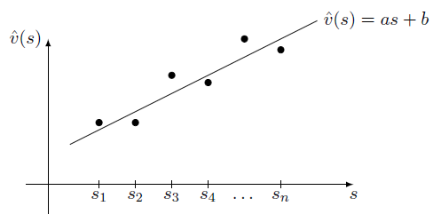
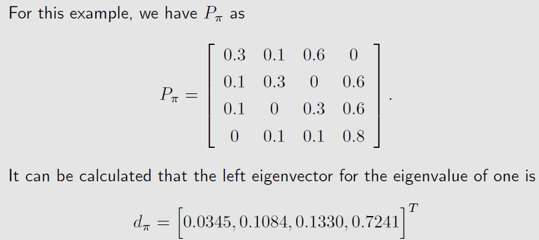
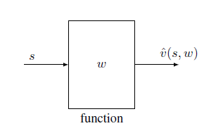
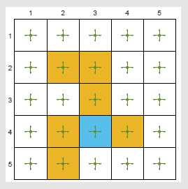
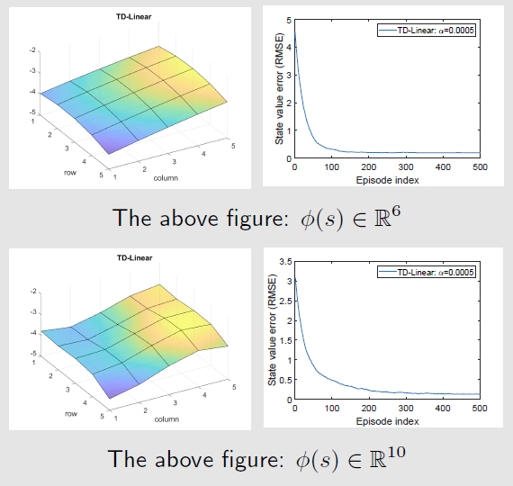
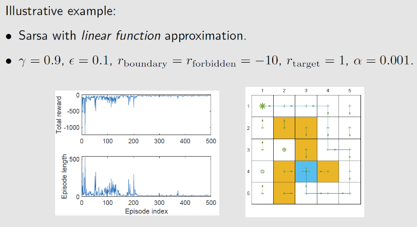

[TOC]

<!--more-->

## 4.1 价值函数近似

> 之前都是表格表示价值

- 曲线拟合例子：从表格引入函数近似
- 状态价值评估算法：价值函数近似基本思路
  - 建立目标函数
  - 优化算法
  - 示例
  - 原理
- Sarsa+价值函数近似
- Q-learning+价值函数近似
- Deep Q-learning

### 4.1.1 曲线拟合

动作价值的表格表示为

|          | $a_1$              | $a_2$              | $a_3$              | $a_4$              | $a_5$              |
| -------- | ------------------ | ------------------ | ------------------ | ------------------ | ------------------ |
| $s_1$    | $Q_{\pi}(s_1,a_1)$ | $Q_{\pi}(s_1,a_2)$ | $Q_{\pi}(s_1,a_3)$ | $Q_{\pi}(s_1,a_4)$ | $Q_{\pi}(s_1,a_5)$ |
| $\vdots$ | $\vdots$           | $\vdots$           | $\vdots$           | $\vdots$           | $\vdots$           |
| $s_9$    | $Q_{\pi}(s_9,a_1)$ | $Q_{\pi}(s_1,a_2)$ | $Q_{\pi}(s_1,a_3)$ | $Q_{\pi}(s_1,a_4)$ | $Q_{\pi}(s_1,a_5)$ |

Q表为 $(S,A) \mapsto Q(S,A)$ 的二维表格，价值表是 $S\mapsto V(S)$ 的一维表格，在编程时，会将这些表格存储成向量、矩阵或数组。可以直接读取或写回表格中对应的价值

优点：直观，便于分析

缺点：无法处理大规模或连续的 $(S,A)$ 空间

- 连续空间离散化并不可行，具体来讲有两方面

  - 存储难度大

  - 泛化能力：必须全部访问到才能估计状态价值或动作价值，但 $(S,A)$ 对是无限的，无法估计全部的价值

假设一维状态空间有 $n$ 个状态 $s_1,s_2,\cdots,s_n$ ，令 $\hat{V}(s_i)$ 表示对这些状态的真实状态价值的估计，在表格型方法中，可以用表格表示

| 状态 | $s_1$          | $s_2$          | $\cdots$ | $s_n$          |
| ---- | -------------- | -------------- | -------- | -------------- |
| 价值 | $\hat{V}(s_1)$ | $\hat{V}(s_2)$ | $\cdots$ | $\hat{V}(s_n)$ |

在二维空间中，可以用一条曲线去拟合状态与状态价值，进而可近似所有状态的状态价值

首先，我们可以使用一次线性函数去拟合这些状态价值
$$
\hat{V}(s,w)=as+b=\underbrace{[s,1]}_{\phi^T(s)}\underbrace{\begin{bmatrix}a\\b\end{bmatrix}}_{w}=\phi^T(s)w
$$

- $w$ 是参数

- $\phi(s)$ 是状态的特征向量

  $\phi(s)$ 是 $V_{\pi}(s)$ 的一种特征提取方式，也可以将其理解为价值近似函数的基函数，将其与特定参数相乘，就是 $\hat{V}_{\pi}(s)$ 

- $\hat{V}_{\pi}(s,w)$ 是参数为 $w$ 的一次线性函数

其次，也能使用二次曲线
$$
\hat{V}(s,w)=as^2+bs+c=\underbrace{[s^2,s,1]}_{\phi^T(s)}\underbrace{\begin{bmatrix}a\\b\\c\end{bmatrix}}_{w}=\phi^T(s)w
$$
此时，$w$ 与 $\phi(s)$ 的维度增加了，同时对于状态价值的近似也更精确了

虽然 $\hat{V}(s)$ 此时对于 $s$ 不是线性的，其非线性包含在 $\phi(s)$ 中，但是对于 $w$ 是线性的，可将 $w$ 改为非线性（如神经网络）

- 优点：更好地近似
- 缺点：需要更多的参数

#### 价值函数拟合方法思路

> 对于状态价值与动作价值，可以采用带参函数近似 $V_{\pi}(s)\approx\hat{V}_{\pi}(s,w)=\phi^T(s)w,w\in \R^m$

优点：

- 对于状态价值，表格型方法需要存储 $\vert \mathcal{S}\vert$ 状态价值，函数型方法只需要存储参数 $w$ ，且 $\vert w\vert<\vert \mathcal{S}\vert$ 

- 泛化能力：

  表格型方法：当 $s$ 被访问时，会更新其价值，对于未访问的点，其状态价值不会更新

  

  函数型方法：当 $s$ 被访问时，参数 $w$ 会更新，间接影响其他未被访问的状态近似价值，因此，价值学习能被泛化到其他未被访问的状态

  

缺点：

- 每次需要获取状态 $s$ 的价值，能通过 $\hat{V}_{\pi}(s,w)$ 计算
- 这种近似是不精确的，在训练过程中，需要不断更新参数以减小损失

改进：

将神经网络作为价值近似函数，可以更精确地拟合价值函数

### 4.1.2 价值近似函数估计状态价值

$V_{\pi}(s)$ 表示状态 $s$ 在策略 $\pi$ 下的真实状态价值，$\hat{V}_{\pi}(s,w)$ 表示价值近似函数对于状态 $s$ 在策略 $\pi$ 下的状态价值估计

目标是寻找最优的参数 $w$ 使得 $\hat{V}_{\pi}(s,w)$ 对于 $V_{\pi}(s)$ 的每个 $s$ 都能很好的近似

1. 定义目标函数
2. 推导目标函数的最优化算法

#### 目标函数

最简单的损失函数为平方损失函数
$$
J(w)=E\left[\left(V_{\pi}(S)-\hat{V}_{\pi}(S,w)\right)^2\right]
$$
我们的目标求解使 $J(w)$ 最小化的参数 $w$ ，对于期望的求解，本质上求加权平均值，需要知道随机变量 $S\in \mathcal{S}$ 服从的分布

##### 状态服从的分布

###### 均匀分布

最简单的是状态变量服从均匀分布，所有的状态同等重要，即每个状态出现的概率都为 $\frac{1}{\vert \mathcal{S}\vert}$ ，此时目标函数变为
$$
J(w)=E\left[\left(V_{\pi}(S)-\hat{V}_{\pi}(S,w)\right)^2\right]=\frac{1}{\vert \mathcal{S}\vert}\sum\limits_{s\in \mathcal{S}}\left(V_{\pi}(S)-\hat{V}_{\pi}(S,w)\right)^2
$$
缺点：均匀分布的状态分布并没有考虑到MDP在给定策略下的真实动态特性。事实上，状态并不是同等重要的，目标状态与接近目标状态的那些状态更重要，出现的可能性更大；离目标状态远的状态并不重要，因为出现的可能性更小。

我们希望给重要的状态更大的权重，使之估计的误差更小，不重要的状态即使估计误差大也没太大关系

###### 稳态分布

稳态分布 (stationary distribution) 描述了马尔科夫过程的长期表现(long-run behabior)

- 也被称为 steady-state distribution 或 limiting distribution

**马尔科夫过程的长期表现** (long-run behabior)：从一个状态出发，基于一个策略采取动作，不断与环境交互，在多次交互后，达到稳态。在这个稳态下可知每个状态被访问的概率是多少

令 $\{d_{\pi}(s)\}_{s\in \mathcal{S}}$ 表示在策略 $\pi$ 下的马尔科夫过程的稳态分布，$d_{\pi}(s)\ge 0,\sum\limits_{s\in \mathcal{S}}d_{\pi}(s)=1$ ，被访问频率越高的状态有更高的权重 $d_{\pi}(s)$ 

- 在运行多次后，其 $d_{\pi}(s)=\frac{状态s出现次数}{出现的状态个数}$ 会收敛到一个具体的值，即认为获取到MDP的长期特性

- 直观理解：若某个状态相对重要，则很多状态都会采取动作去访问这个状态，最后很多步趋于稳定后，这个重要状态出现的概率就会比较大

- 数学推导：

  要知道 $s_1$ 出现的可能性，则需要知道所有状态转移到 $s_1$ 的概率

  $d_{\pi}(s_2)$ 表示 $s_2$ 出现的可能性，若存在状态转移矩阵 $P$ ，则从 $s_2$ 转移到 $s_1$ 的概率为 $P(s_1\vert s_2)$ ，即 $P$ 中第2行的第1列。故 $s_1$ 的出现的可能性
  $$
  \begin{aligned}
  &d_{\pi}(s_1)=d_{\pi}(s_1)P(s_1\vert s_1)+d_{\pi}(s_2)P(s_1\vert s_2)+d_{\pi}(s_3)P(s_1\vert s_3)+d_{\pi}(s_4)P(s_1\vert s_4)=\sum\limits_{i=1}d_{\pi}(s_i)P(s_1\vert s)i\\
  \Rightarrow &\mathbf{d}_{\pi}^T=\mathbf{d}_{\pi}^T\mathbf{P}
  \end{aligned}
  $$
  故稳态分布达到平稳状态为状态转移矩阵特征值1对应的特征向量

  

但是，由于状态转移矩阵 $\mathbf{P}_{\pi}$ 是未知的，所以稳态分布的精确值并不能计算出来

实质上，$long-run$ 的目的就是通过MC方法去近似这个特征向量的过程

状态基于稳态分布的目标函数可以被写为
$$
J(w)=E\left[\left(V_{\pi}(S)-\hat{V}_{\pi}(S,w)\right)^2\right]=\sum\limits_{s\in \mathcal{S}}d_{\pi}(s)\left(V_{\pi}(s)-\hat{V}_{\pi}(s,w)\right)^2
$$

#### 状态价值近似函数的优化算法

梯度下降法
$$
w_{t+1}=w_t-\alpha_t\bigtriangledown_wJ(w)
$$
真实的梯度为
$$
\begin{aligned}
\bigtriangledown_wJ(w_t)&=\bigtriangledown_w E\left[\left(V_{\pi}(S)-\hat{V}_{\pi}(S,w)\right)^2\right]\\
&=E\left[\bigtriangledown_w\left(V_{\pi}(S)-\hat{V}_{\pi}(S,w)\right)^2\right]\\
&=2E\left[\left(V_{\pi}(S)-\hat{V}_{\pi}(S,w)\right)\left(-\bigtriangledown_w\hat{V}_{\pi}(S,w)\right)\right]\\
&=-2E\left[\left(V_{\pi}(S)-\hat{V}_{\pi}(S,w)\right)\bigtriangledown_w\hat{V}_{\pi}(S,w)\right]
\end{aligned}
$$
对于真实梯度的求解，需要计算期望，也可以基于RM算法使用采样替换期望，变为随机梯度下降法
$$
w_{t+1}=w_t+\alpha_t\left(V_{\pi}(s_t)-\hat{V}_{\pi}(s_t,w_t)\right)\bigtriangledown_w\hat{V}_{\pi}(s_t,w)
$$
此时，基于此算法去更新价值近似函数的参数是不可实现的，因为 $V_{\pi}(s_t)$ 是未知的，若将其替换为近似值，则算法可实现

##### 真实状态价值的替换

对于 $V_{\pi}(s_t)$ 的计算，可以使用两种方法

###### MC方法

> 在训练数据上运用监督学习对价值函数进行预测 $<s_1,G_1>,<s_2,G_2>,\cdots,<s_T,G_T>$ ，用随机回报 $g_t$ 代替真实价值 $V_{\pi}(s_t)$

令 $g_t$ 是一个回合中，从状态 $s_t$ 开始基于策略 $\pi$ 的折扣回报，因此可以用 $g_{t}$ 去代替真实的状态价值，即算法变为
$$
w_{t+1}=w_t+\alpha_t\left(G_t-\hat{V}_{\pi}(s_t,w_t)\right)\bigtriangledown_w\hat{V}_{\pi}(s_t,w_t)
$$

MC预测至少能手镰刀一个局部最优解

###### TD方法

> 可将TD目标作为 $V_{\pi}(s_t)$ 的有偏估计

$$
w_{t+1}=w_t+\alpha_t\left(\overbrace{\underbrace{r_{t+1}+\gamma \hat{V}(s_{t+1},w_t)}_{\mbox{TD target}}-\hat{V}_{\pi}(s_t,w_t)}^{\mbox{TD error}}\right)\bigtriangledown_w\hat{V}_{\pi}(s_t,w)
$$

$$
\begin{array}{ll}
\hline
&初始化：近似函数\hat{V}_{\pi}(S,w)对w是可微分的，初始化参数w_0\\
&目标：逼近策略\pi下真实的状态价值V_{\pi}(S)\\
&在策略\pi下生成的每个回合:\\
&\quad 对于每一步(s_t,r_{t+1},s_{t+1}):\\
&\qquad 一般形式:\\
&\quad\qquad w_{t+1}=w_{t}+\alpha_t\left[r_{t+1}+\gamma \hat{V}(s_{t+1},w_{t})-\hat{V}(s_t,w_{t})\right]\bigtriangledown_w \hat{V}(s_t,w_{t})\\
&\qquad 线性形式:\\
&\quad \qquad w_{t+1}=w_{t}+\alpha_t\left[r_{t+1}+\gamma \phi^T(s_{t+1})w_{t}-\phi^T(s_{t})w_{t}\right]\phi(s_t)
\\
\hline
\end{array}
$$

##### 价值近似函数基函数的选择

之前广泛使用关于 $w$ 的线性函数(Linear函数)
$$
\hat{V}(s,w)=\phi^T(s)w
$$

- $\phi(s)$ 可以是一般的线性模型（多项式基函数）、傅里叶/小波基函数、最近邻，神经网络
- 可微的函数：线性模型、神经网络
- 树模型不合适，我们希望值函数模型适合在非稳态、非独立分布的数据上训练

目前广泛使用是关于 $w$ 的非线性函数——神经网络，虽然不知道函数的具体形式，但给定一个输入 $s$ ，可以给出这个状态的近似状态价值 $\hat{V}(s)$ 

###### 线性基函数

对于线性基函数 $\hat{V}(S,w)=\phi^T(s)w$ ，有
$$
\bigtriangledown_w\hat{V}(S,w)=\phi(S)
$$
代入TD方法的优化函数
$$
w_{t+1}=w_{t}+\alpha_t\left[r_{t+1}+\gamma \phi^T(s_{t+1})w_{t}-\phi^T(s_{t})w_{t}\right]\phi(s_t)
$$
将带有线性近似函数的TD学习算法简称为 **TD-Linear** 

- 缺点：很难选择合适的特征向量，需要对问题有很好的理解，即使这样，也很难选出当前问题很鲁棒的特征向量

  需要知道关于状态价值点的大致分布情况，若这些价值分布大致分布在一条直线上，使用线性基函数去近似状态价值会很好。但是这种先验知识在实际中通常是未知的，因此，常用的时非线性的神经网络基函数

- 优点：

  - 能很好地分析TD算法的理论性质，比非线性TD算法更好理解
  - 虽然不能近似所有的价值函数，但还是有较强的表征能力。表格表示可以被认为是线性函数近似的一种特殊情况

###### TD-Linear与价值函数的表格表示

设近似函数的基函数为一种特殊的线性基函数
$$
\phi(s)=e_s\in \R^{\vert \mathcal{S}\vert},s\in \mathcal{S}
$$
其中，$e_s$ 是 one-hot 向量，仅有一个分量为1其余分量为0

- 对于状态 $s$ ， $\phi(s)=e_s=\begin{bmatrix}0\\\vdots\\0\\1\\0\\\vdots\\0\end{bmatrix}$ ，分量 $1$ 位于第 $s$ 个位置

此时，状态近似函数 $\hat{V}(s,w)=e_s^Tw=w(s)$ 

对于 **TD-Linear** 算法
$$
\begin{aligned}
w_{t+1}&=w_{t}+\alpha_t\left[r_{t+1}+\gamma \phi^T(s_{t+1})w_{t}-\phi^T(s_{t})w_{t}\right]\phi(s_t)\\
&\xlongequal{\phi(s_t)=e_{s_t}}w_{t}+\alpha_t\left[r_{t+1}+\gamma w_t(s_{t+1})-w_t(s_{t})\right]e_{s_t}
\end{aligned}
$$
此时 $w_t$ 中只有 $s_t$ 位置的元素被更新了，等号两边同时乘 $e_{s_t}^T$ 
$$
\begin{aligned}
&e^T_{s_t}w_{t+1}=e^T_{s_t}w_{t}+\alpha_t\left[r_{t+1}+\gamma w_{t}(s_{t+1})-w_{t}(s_{t})\right]e^T_{s_t}e_{s_t}\\
\Rightarrow &V_{t+1}(s_t)=V_{t}(s_t)+\alpha_t\left[r_{t+1}+\gamma V_t(s_{t+1})-V_t(s_t)\right]
\end{aligned}
$$
实质上就是表格型TD算法

#### 示例

对于 $5\times 5$ 的网格世界，$r_{forbidden}=r_{boundary}=-1,r_{target}=1,\gamma=0.9$ ，给定策略 $\pi(a\vert s)=0.5$ 对于 $(s,a)\in (\mathcal{S,A})$

目标是评估当前策略下每个状态的状态价值，共有25个状态需要保存

使用状态近似函数，可以使用存储少于25个参数的值

基于模型求解贝尔曼方程得到基准状态价值，将状态价值3D可视化

经验样本集，基于策略 $\pi$ 的500个回合，每个回合有500步从任意的 $(s,a)$ 开始且服从均匀分布

基于表格的价值评估或基于价值近似函数的价值评估也会有一个对应的三维函数曲面，那个曲面与真实值对应的曲面越接近越好

- 基于表格型TD算法，简称 **TD-Table** 

  

基于价值近似函数的评估，最简单的就是平面函数，线性基函数为
$$
\phi(s)=\begin{bmatrix}
1\\x\\y
\end{bmatrix}\in \R^3,s=(x,y)\in \R^2
$$
此时，状态价值近似函数为
$$
\hat{V}(s,w)=\phi^T(s)w=[1,x,y]\begin{bmatrix}
w_1\\w_2\\w_3
\end{bmatrix}=w_1+w_2x+w_3y
$$

**TD-Linear** 算法的执行结果如图

趋势是对的，但在很多具体点上，估计并不准确，且最后收敛的误差也不是0

为提升近似性能，需要使用更高维度的价值近似基函数，如
$$
\phi(s)=\begin{bmatrix}
1\\x\\y\\x^2\\y^2\\xy
\end{bmatrix}\in \R^3,s=(x,y)\in \R^6
$$
此时，状态价值近似函数为
$$
\hat{V}(s,w)=\phi^T(s)w=w_1+w_2x+w_3y+w_4x^2+w_5y^2+w_6xy
$$
对应于二次曲面，仍进一步可以提高特征向量的维度
$$
\phi(s)=\begin{bmatrix}
1\\x\\y\\x^2\\y^2\\xy\\x^3\\y^3\\x^2y\\xy^2
\end{bmatrix}\in \R^3,s=(x,y)\in \R^{10}
$$

对于线性函数来说，增加参数个数并不一定能将拟合误差减小到0，函数结构决定了拟合误差的下限

所以引入神经网络可以近似任何一个非线性函数

#### 总结

**价值函数将已知的状态泛化到其他未知的状态上** ，用以表示连续的价值函数

基于价值函数近似的TD-learning，其目标函数
$$
J(w)=E\left[\frac{1}{2}\left(V_{\pi}(s)-\hat{V}_{\pi}(S,w)\right)^2\right]
$$
求损失的最小值
$$
-\frac{\partial J(w)}{\partial w}=E\left[\left(V_{\pi}(s)-\hat{V}_{\pi}(S,w)\right)\bigtriangledown_w\hat{V}_{\pi}(s_t,w_t)\right]
$$
采用随机梯度下降法，求解损失最小值
$$
\begin{aligned}
w_{t+1}&=w-\alpha\frac{\partial J(w)}{\partial w}\\
&=w_t+\alpha_{t}\left[V_{\pi}(s)-\hat{V}_{\pi}(s_t,w_t)\right]\bigtriangledown_w\hat{V}_{\pi}(s_t,w_t)
\end{aligned}
$$
而真实的价值函数 $V_{\pi}(s)$ 是未知的，所以在此算法中，需要将其代替
$$
w_{t+1}=w_{t}+\alpha_t\left[r_{t+1}+\gamma\hat{V}(s_{t+1},w_t)-\hat{V}_{\pi}(s_t,w_t)\right]\bigtriangledown_w\hat{V}_{\pi}(s_t,w_t)
$$

这样的故事线在数学上是不严谨的：首先，最优化算法与目标函数并不对应；其次，将 $r_{t+1}+\gamma\hat{V}(s_{t+1},w_t)$ 最为TD target 是否依然收敛

##### 不同目标函数

**真实的状态价值误差** 
$$
J_E(w)=E\left[\left(\mathbf{V}_{\pi}(S)-\hat{V}_{\pi}(S,w)\right)^2\right]=\Vert \hat{\mathbf{V}}(w)-\mathbf{V}_{\pi}\Vert^2_D=\Vert \hat{\mathbf{V}}(w)-\mathbf{V}_{\pi}\Vert^T\cdot \mathbf{D}\cdot \Vert \hat{\mathbf{V}}(w)-\mathbf{V}_{\pi}\Vert
$$

**基于贝尔曼方程的状态价值误差** 
$$
\begin{aligned}
J_{BE}(w)&=E\left[\left(\underbrace{\overline{\mathbf{V}}_{\pi}(S)}_{\mbox{TD Target}}-\hat{\mathbf{V}}_{\pi}(S,w)\right)^2\right]=E\left[\left(\mathbf{R}_{\pi}'+\gamma \mathbf{P}_{\pi}\hat{\mathbf{V}_{\pi}}(S',w)-\hat{\mathbf{V}}_{\pi}(S,w)\right)^2\right]\\
&=\left\Vert \mathbf{R}_{\pi}'+\gamma \mathbf{P}_{\pi}\hat{\mathbf{V}}_{\pi}(S',w)-\hat{\mathbf{V}}_{\pi}(S,w)\right\Vert^2_D=\left\Vert T_{\pi}\left(\hat{\mathbf{V}}_{\pi}(S',w)\right)-\hat{\mathbf{V}}_{\pi}(S,w)\right\Vert_D^2
\end{aligned}
$$

用 $\hat{\mathbf{V}}_{\pi}(S,w)$ 去近似 $\mathbf{V}_{\pi}(S)$ ，理论上 $\hat{\mathbf{V}}_{\pi}(S,w)$ 也会满足贝尔曼方程，即价值近似函数最优 $J(w)=0$ 时，价值近似函数的贝尔曼方程成立
$$
\mathbf{V}_{\pi}(S)\approx\hat{\mathbf{V}}_{\pi}(S,w)=\mathbf{R}_{\pi}'+\gamma \mathbf{P}_{\pi}\hat{\mathbf{V}}_{\pi}(S',w)
$$

**基于贝尔曼方程的状态价值投影误差**

用 $\hat{V}$ 去近似价值函数，由于函数结构的限制， $T_{\pi}\left(\hat{\mathbf{V}}_{\pi}(S',w)\right)$ 与 $\hat{\mathbf{V}}_{\pi}(S,w)$ 可能永远都不能相等
$$
J_{PBE}(w)=\left\Vert \hat{\mathbf{V}}_{\pi}(S,w)-\mathbf{M}\cdot T_{\pi}\left(\hat{\mathbf{V}}_{\pi}(S',w)\right)\right\Vert
$$
其中 $\mathbf{M}$ 为投影矩阵，将 $T_{\pi}\left(\hat{\mathbf{V}}_{\pi}(S',w)\right)$ 投影到以 $w$ 为参数的 $\hat{V}_{\pi}(w)$ 组成的空间，此时误差可能为0

所以上述求解算法实质上是 **基于贝尔曼方程的状态价值投影误差** 的随机梯度下降法

##### 收敛性分析

> SGD计算目标函数的梯度时
> $$
> w_{t+1}=w_t+\alpha_t\left(V_{\pi}(s_t)-\hat{V}_{\pi}(s_t,w_t)\right)\bigtriangledown_w\hat{V}_{\pi}(s_t,w)
> $$
> 存在一个替换，将真实的状态 $V_{\pi}(s_t)$ 函数替换为TD target $r_{t+1}+\gamma \hat{V}(s_{t+1},w_t)$ ，替换之后是否仍收敛于最优解 $w^*$ ，使得 $J(w^*)=\min\limits_{w}J(w)=\min\limits_{w}E\left[\left(V_{\pi}(S)-\hat{V}_{\pi}(S,w)\right)^2\right]$ 
> $$
> w_{t+1}=w_t+\alpha_t\left(r_{t+1}+\gamma \hat{V}(s_{t+1},w_t)-\hat{V}_{\pi}(s_t,w_t)\right)\bigtriangledown_w\hat{V}_{\pi}(s_t,w)
> $$

对于线性价值近似函数，其真实的目标函数梯度为：
$$
\begin{aligned}
\bigtriangledown_wJ(w_t)&=-2E\left[\left(V_{\pi}(S_t)-\hat{V}_{\pi}(S,w)\right)\bigtriangledown_w\hat{V}_{\pi}(S,w)\right]\\
&=\alpha E\left[\left(V_{\pi}(S_t)-\phi^T(S_t)w_t\right)\phi(S_t)\right]\\
&\xlongequal{V_{\pi}(S)\mbox{替换为TD target}}\alpha E\left[\left(R_{t+1}+\gamma \phi^T(S_{t+1})w_t-\phi^T(S_t)w_t\right)\phi(S_t)\right]
\end{aligned}
$$
使用随机梯度下降法最优化
$$
w_{t+1}=w_{t}+\alpha_tE\left[\left(R_{t+1}+\gamma \phi^T(S_{t+1})w_t-\phi^T(S_t)w_t\right)\phi(S_t)\right]
$$
其中，期望的计算涉及三个随机变量 $R_{t+1},S_{t+1},S_t$ ，且状态 $S_t$  服从稳态分布 $d_{\pi}$ 。但是该算法是确定性的，因为期望是标量运算，计算完成后，这些随机变量都会消失

- 线性近似函数的收敛性是易于分析的
- 确定性算法的收敛性暗示了随机算法的收敛性，因为该算法可以看做SGD的特殊化

$\Phi$ 为价值近似函数的基函数矩阵，$D$ 是稳态分布的对角阵
$$
\Phi=\begin{bmatrix}
\vdots\\
\phi^T(s)\\
\vdots
\end{bmatrix}\in \R^{n\times m},D=\begin{bmatrix}
\ddots&&\\
&d_{\pi}(s)&\\
&&\ddots
\end{bmatrix}\in \R^{n\times n}
$$
则线性价值近似函数可写为
$$
\begin{aligned}
&E\left[\left(R_{t+1}+\gamma \phi^T(S_{t+1})w_t-\phi^T(S_t)w_t\right)\phi(S_t)\right]\\
=&\sum\limits_{s\in \mathcal{S}}d_{\pi}(s) E\left[R_{t+1}\phi(s)-\left(\phi^T(s)\phi(s)-\gamma \phi^T(S_{t+1})\phi(s)\right)w_t\big\vert S_t=s\right]
\end{aligned}
$$
其中，
$$
E\left[R_{t+1}\phi(s)\vert S_t=s\right]=\phi(s)E[R_{t+1}\vert S_t=s]=\phi(s)\sum\limits_{a\in\mathcal{A}(s)}\pi(a\vert s)\sum\limits_{r'}r'P(r'\vert s,a)=\phi(s)r_{\pi}(s)
$$
故有
$$
\sum\limits_{s\in \mathcal{S}}d_{\pi}(s)E\left[R_{t+1}\phi(s)\vert S_t=s\right]=\sum\limits_{s\in \mathcal{S}}d_{\pi}(s)\phi(s)r_{\pi}(s)=\Phi^T\mathbf{D}\mathbf{r}_{\pi}\in\R^m,\quad \mathbf{r}_{\pi}=\begin{bmatrix}
\vdots\\r_{\pi}(s)\\\vdots
\end{bmatrix}\in\R^{n}
$$
同理
$$
\begin{aligned}
&-E\left[\left(\phi^T(s)\phi(s)-\gamma \phi^T(S_{t+1})\phi(s)\right)w_t\big\vert S_t=s\right]\\
=&-\phi^T(s)\phi(s)w_t+\gamma \phi(s)E\left[\phi^T(S_{t+1})\vert S_t=s\right]w_t\\
=&-\phi^T(s)\phi(s)w_t+\gamma \phi(s)\sum\limits_{s'\in \mathcal{S}}P(s'\vert s)\phi^T(s')w_t
\end{aligned}
$$
有
$$
\begin{aligned}
&-\sum\limits_{s\in \mathcal{S}}d_{\pi}(s)E\left[\left(\phi^T(s)\phi(s)-\gamma \phi^T(S_{t+1})\phi(s)\right)w_t\big\vert S_t=s\right]\\
=&\sum\limits_{s\in \mathcal{S}}d_{\pi}(s)\left[-\phi^T(s)\phi(s)w_t+\gamma \phi(s)\sum\limits_{s'\in \mathcal{S}}P(s'\vert s)\phi^T(s')w_t\right]\\
=&\sum\limits_{s\in \mathcal{S}}d_{\pi}(s)\phi(s)\left[-\phi(s_{t})+\gamma \sum\limits_{s'\in \mathcal{S}}P(s'\vert s)\phi(s')\right]^Tw_t\\
=&\Phi^TD\left(-\Phi+\gamma P_{\pi}\Phi\right)w_t\\
=&-\Phi^TD\left(I-\gamma P_{\pi}\right)\Phi w_t\in \R^m
\end{aligned}
$$
则
$$
\begin{aligned}
&E\left[\left(R_{t+1}+\gamma \phi^T(S_{t+1})w_T-\phi^T(S_t)w_t\right)\phi(S_t)\right]\\
=&\Phi^TDr_{\pi}-\left(\Phi^TD\Phi-\gamma\Phi^TDP_{\pi}\Phi\right)w_t=\mathbf{b}-\mathbf{A}w_t
\end{aligned}
$$
则SGD可以写为
$$
w_{t+1}=w_t+\alpha_t\left(\mathbf{b}-\mathbf{A}w_t\right)
$$
随着 $t\rightarrow \infty$ ，$w_t$ 收敛于常量 $w^*$ ，则有 $w^*=w^*+\alpha_{\infty}\left(\mathbf{b}-\mathbf{A}w^*\right)$ ，即 $\mathbf{b}-\mathbf{A}w^*=0\Rightarrow w^*=A^{-1}\mathbf{b}$ 

**证明1：$w_t\xrightarrow{t\rightarrow \infty}w^*$** 

- 证明 $\delta_t=w_t-w^*\xrightarrow{t\rightarrow \infty}0$ 

  令 $w_t=\delta_t+w^*$ ，则 $w_{t+1}=w_t+\alpha_t\left(\mathbf{b}-\mathbf{A}w^{(k)}\right)$ 等价于
  $$
  \delta_{t+1}+w^*=\delta_t+w^*+\alpha_t\left[\mathbf{b}-\mathbf{A}\left(\delta_t+w^*\right)\right]\\
  \Rightarrow \delta_{t+1}=\delta_t-\alpha_t\mathbf{A}\delta_t=(\mathbf{I}-\alpha_t\mathbf{A})\delta_t\\
  \vdots\\
  \delta_{t+1}=(\mathbf{I}-\alpha_t\mathbf{A})^{t+1}\delta_0
  $$
  设 $\alpha=\max\alpha_t$ ，则
  $$
  \Vert\delta_{t+1}\Vert_2\le\Vert\mathbf{I}-\alpha_t\mathbf{A}\Vert_2^{t+1}\Vert \delta_0\Vert_2
  $$
  当 $\alpha$ 足够小，$A$ 是正定的，因此二次型 $\Vert\mathbf{I}-\alpha_t\mathbf{A}\Vert_2=x^T\Vert\mathbf{I}-\alpha_t\mathbf{A}\Vert x<1$ 

  有 $\Vert\mathbf{I}-\alpha_t\mathbf{A}\Vert_2<1\Rightarrow \Vert\mathbf{I}-\alpha_t\mathbf{A}\Vert_2^{t+1}\xrightarrow{t\rightarrow \infty}0$ 

- 令 $g(w)=\mathbf{b}-\mathbf{A}w=0$ ，因此SGD为求解 $g(w)=0$ 的算法，其根为 $w^*$ ，RM算法的收敛性只要满足三个条件即可

**证明2：$\mathbf{A}$ 是可逆的并且正定** 

**证明3：$w^*$ 是最小化基于贝尔曼方程的状态价值投影误差的解**

> $w^*=A^{-1}b$ 是最小化 $J_{PBE}$ 的解

$$
J_{PBE}(w^*)=\left\Vert \hat{\mathbf{V}}_{\pi}(S,w^*)-\mathbf{M}\cdot T_{\pi}\left(\hat{\mathbf{V}}_{\pi}(S',w^*)\right)\right\Vert=0\Rightarrow \hat{\mathbf{V}}_{\pi}(S,w^*)=\mathbf{M}\cdot T_{\pi}\left(\hat{\mathbf{V}}_{\pi}(S',w^*)\right)
$$

若采用线性近似基函数，$\hat{V}_{\pi}(S,w^*)=\Phi w^*$ ，  $M=\Phi\left(\Phi^TD\Phi\right)^{-1}\Phi^T D$
$$
\begin{aligned}
\Phi w^*=&\Phi\left(\Phi^TD\Phi\right)^{-1}\Phi^T D \left(r_{\pi}+\gamma P_{\pi}\Phi w^*\right)\\
w^*=&\left(\Phi^TD\Phi\right)^{-1}\Phi^T D \left(r_{\pi}+\gamma P_{\pi}\Phi w^*\right)\\
\iff \left(\Phi^TD\Phi\right)w^*=&\Phi^T D \left(r_{\pi}+\gamma P_{\pi}\Phi w^*\right)\\
\iff \Phi^TD\Phi w^*=&\Phi^T Dr_{\pi}+\gamma\Phi^T DP_{\pi}\Phi w^*\\
\iff \Phi^TD\Phi w^*-\gamma\Phi^T DP_{\pi}\Phi w^*=&\Phi^T Dr_{\pi}\\
\iff \Phi^TD\left(I-\gamma P_{\pi}\right)\Phi w^*=&\Phi^T Dr_{\pi}\\
\iff w^*=&\left(\Phi^TD\left(I-\gamma P_{\pi}\right)\Phi\right)^{-1}\Phi^T Dr_{\pi}=A^{-1}b
\end{aligned}
$$
**4. 误差上界** 

TD算法目标是最小化 $J_{PBE}(w)$ ，则 $\hat{V}_{\pi}(S,w)=\Phi w^*$ 与 $V_{\pi}(S)$ 的误差为
$$
\Vert \Phi w^*-V_{\pi}(S)\Vert_D\le \frac{1}{1-\gamma}\min\limits_{w}\Vert \hat{V}(S,w)-V_{\pi}(S)\Vert=\frac{1}{1-\gamma}\min\limits_{w}\sqrt{J_{E}(S,w)}
$$
即线性价值近似函数与真实状态价值之间的误差以 $J_E(S,w)$ 的误差为界

## 4.2 Sarsa+价值近似

带有价值近似函数的Sarsa算法为
$$
w_{t+1}=w_{t}+\alpha_t\left[r_{t+1}+\gamma\hat{Q}_{\pi}\left(s_{t+1},a_{t+1},w_t\right)-\hat{Q}\left(s_t,a_t,w_t\right)\right]\bigtriangledown_w\hat{Q}\left(s_t,a_t,w_t\right)
$$
结合策略改进
$$
\begin{array}{ll}
\hline
&目标：寻找使智能体从起点状态 (s_0,a_0)到达目标状态的最优策略\\
&对于每个回合:\\
&\quad 若s_t不是目标状态:\\
&\qquad 基于策略 \pi^{(t)}(s_t)采取动作 a_t,生成s_{t+1},r_{t+1}，然后基于策略\pi^{(t)}(s_{t+1})生成动作a_{t+1}\\
&\qquad 价值更新(参数更新):\\
&\quad \qquad w_{t+1}=w_{t}+\alpha_t\left[r_{t+1}+\gamma\hat{Q}\left(s_{t+1},a_{t+1},w_t\right)-\hat{Q}\left(s_t,a_t,w_t\right)\right]\bigtriangledown_w\hat{Q}\left(s_t,a_t,w_t\right)\\
&\qquad 策略更新:\\
&\quad \qquad \pi^{(t+1)}(a\vert s_t)=\begin{cases}
1-\frac{\varepsilon}{\vert \mathcal{A}(s)\vert}\left(\vert \mathcal{A}(s)\vert-1\right)&,a=\mathop{\mathrm{argmax}}\limits_{a\in \mathcal{A}(s_t)}\hat{Q}(s_t,a,w_{t+1})\\
\frac{\varepsilon}{\vert \mathcal{A}(s)\vert}&,其他
\end{cases}
\\
\hline
\end{array}
$$

- 策略更新时，需要获取每个动作 $a\in \mathcal{A}(s_t)$ 的动作价值，需要代入价值近似函数去计算具体的值 $\hat{Q}(s_t,a)$  

## 4.3 Q-learning+价值近似

带有价值近似函数的 Q-learning 算法为
$$
w_{t+1}=w_{t}+\alpha_t\left[r_{t+1}+\gamma \max\limits_{a\in \mathcal{A}(s_{t+1})} \hat{Q}_{\pi}\left(s_{t+1},a,w_t\right)-\hat{Q}\left(s_t,a_t,w_t\right)\right]\bigtriangledown_w\hat{Q}\left(s_t,a_t,w_t\right)
$$

$$
\begin{array}{ll}
\hline
&初始化：初始化参数向量w^{(0)}\\
&目标：寻找使智能体从起点状态 (s_0,a_0)到达目标状态的最优策略\\
&对于每个回合:\\
&\quad 若s_t不是目标状态:\\
&\qquad 基于策略 \pi^{(t)}(s_t)采取动作 a_t,生成s_{t+1},r_{t+1}\\
&\qquad 价值更新(参数更新):\\
&\quad \qquad w_{t+1}=w_{t}+\alpha_t\left[r_{t+1}+\gamma \max\limits_{a\in \mathcal{A}(s_{t+1})} \hat{Q}_{\pi}\left(s_{t+1},a,w_t\right)-\hat{Q}\left(s_t,a_t,w_t\right)\right]\bigtriangledown_w\hat{Q}\left(s_t,a_t,w_t\right)\\
&\qquad 策略更新:\\
&\quad \qquad \pi^{(t+1)}(a\vert s_t)=\begin{cases}
1-\frac{\varepsilon}{\vert \mathcal{A}(s)\vert}\left(\vert \mathcal{A}(s)\vert-1\right)&,a=\mathop{\mathrm{argmax}}\limits_{a\in \mathcal{A}(s_t)}\hat{Q}(s_t,a,w_{t+1})\\
\frac{\varepsilon}{\vert \mathcal{A}(s)\vert}&,其他
\end{cases}
\\
\hline
\end{array}
$$

