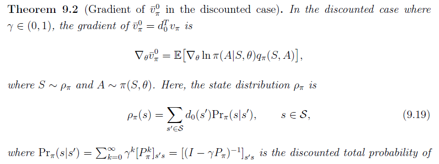

[TOC]

<!--more-->

- 策略梯度
  - 最优梯度的度量
  - 度量的梯度
- 基于蒙特卡洛的策略梯度——REINFORCE
  - 梯度上升算法
- AC方法
  - QAC
  - A2C：通过引入偏置量减少估计的方差
  - off-policy AC：将on-policy方法转换为 off-policy方法
    - 重要性采样
  - DPG：随机策略变为确定性策略

## 5.1 策略梯度

之前的方法以策略为核心，基于价值产生策略，并用表格表示策略

> **策略梯度** (policy gradient) 是基于策略的方法，用策略函数近似策略
>
> **利用机器学习模型的泛化能力，将已知状态上的策略泛化到未知状态上的策略**

目标函数是策略的函数，通过优化目标函数直接获取最优策略

- A-C方法，实际上是将策略梯度与价值函数结合的方法

### 5.1.1 策略的表示

#### 表格型策略

策略为在每个状态下 $s\in \mathcal{S}$ 采取每个动作 $a\in \mathcal{A}(s)$ 的可能性可以用表格 $\pi(a\vert s)$ 表示，在表格中使用 $(s,a)$ 获取每个策略

|          | $a_1$               | $a_2$               | $a_3$               | $a_4$               | $a_5$               |
| -------- | ------------------- | ------------------- | ------------------- | ------------------- | ------------------- |
| $s_1$    | $\pi(a_1\vert s_1)$ | $\pi(a_2\vert s_1)$ | $\pi(a_3\vert s_1)$ | $\pi(a_4\vert s_1)$ | $\pi(a_5\vert s_1)$ |
| $\vdots$ | $\vdots$            | $\vdots$            | $\vdots$            | $\vdots$            | $\vdots$            |
| $s_9$    | $\pi(a_1\vert s_9)$ | $\pi(a_2\vert s_1)$ | $\pi(a_3\vert s_1)$ | $\pi(a_4\vert s_1)$ | $\pi(a_5\vert s_1)$ |

缺点：当状态空间很大或无穷、状态连续变化时，用表格表示策略就非常低效，体现在存储与泛化能力的缺陷上

#### 函数型策略

用带参数的函数拟合策略，也可以表示为 $\pi_{\theta}(a\vert s),\pi(a,s,\theta),\pi_{\theta}(a,s)$  
$$
\pi(a\vert s,\theta),\theta\in \R^m
$$

(a) 输入是状态和动作，输出是当前状态下采取这个动作使累积奖励最大化的可能性

(b) 输入是状态，输出是当前状态下采取各个动作使累积奖励最大化的可能性

最优的策略可以通过最优化度量标量的目标函数获取，这种方法称为 **策略梯度** 

- 更适合处理高维度或连续的动作空间
- 具有更强大的泛化能力
- 具有更好的收敛性质和稳定性
- 能够学习随机策略

缺点：

- 通常会收敛到局部最优，而非全局最优，所以需要加噪音扰动
- 评价一个策略通常不高效，且方差较大（受数据分布影响大，策略一直变，所以数据分布一直变）

#### 表格型VS函数型

最优策略的定义：

- 表格型：若一个策略 $\pi^*$ 使每个状态价值都是最大的，即 $\mathbf{V}_{\pi^*}(S)\ge\mathbf{V}_{\pi}(S),\forall \pi\in \Pi$ 
- 函数型：指定一个标量的策略度量指标目标函数，使目标函数最大化的策略就是最优策略

获取一个动作的概率：

- 表格型：通过 $(s,a)$ 可查表获取

- 函数型：计算策略函数的值 $\pi(a\vert s,\theta)$ 

  参数每传播一次，都需要计算一次

策略更新：

- 表格型：直接修改 $\pi(a\vert s)$ 的值
- 函数型：通过修改策略函数的参数 $\theta$ 间接影响策略

#### 策略梯度基本思路

**所有的策略度量指标 $J(\pi)$ 都是 $\pi$ 的函数，而 $\pi(a\vert s,\theta)$ 是关于参数 $\theta$ 的函数 ，不同的参数值 $\theta$ 会影响策略优劣的度量值，因此，通过最优化 $\theta$ 的值来最大化这些度量指标，可以找到最优的策略** 

最优化算法为梯度上升法
$$
\theta_{t+1}=\theta_{t}+\alpha\bigtriangledown_{\theta}J(\theta_{t})
$$

- 如何定义策略度量指标
- 如何计算策略度量指标的梯度

### 5.1.2 策略度量指标

#### 平均状态价值

$$
\begin{aligned}
\overline{V}_{\pi}&=\sum\limits_{s\in \mathcal{S}}d(s)V_{\pi}(s)=\mathbf{d}^T\mathbf{V}_{\pi}\\
&=E[V_{\pi}(S)]
\end{aligned}
$$

- $\overline{V}_{\pi}$ 为在策略 $\pi$ 下加权平均的状态价值
- $d(s)\ge 0,\sum\limits_{s\in \mathcal{S}}d(s)=1$ 是状态 $s$ 的权重，也可以理解为状态的概率分布 $S\sim d$ 
- 向量形式下，$\mathbf{d}=\begin{bmatrix}\vdots\\d(s)\\\vdots\end{bmatrix}\in \R^{\vert \mathcal{S}\vert},\mathbf{V}_{\pi}=\begin{bmatrix}\vdots\\V_{\pi}(s)\\\vdots\end{bmatrix}\in\R^{\vert \mathcal{S}\vert}$

若求解加权平均，需要知道状态 $S$ 服从的分布 $d$ 

##### $d$ 与策略 $\pi$ 无关

> 将分布 $d$ 记为 $d_0$ ，此时，平均状态价值记为 $\overline{V}_{\pi}^0$

相对简单，因为度量指标函数的梯度计算相对简单

一种情况是每个状态都是同等重要的，因此将 $d_0$ 视为均匀分布，$d_0(s)=\frac{1}{\vert \mathcal{S}\vert}$ 

另一种情况是只关注特定的状态 $s_0$ ， 如在一些任务中所有回合都从相同的起始状态 $s_0$ 出发，实际上就是最大化从 $s_0$ 出发得到的回报，因此 $d_0(s_0)=1,d_0(s\neq s_0)=0\Rightarrow\overline{V}_{\pi}=V_{\pi}(s_0)$ 

##### $d$ 与策略 $\pi$ 有关

> 状态的分布与策略 $\pi$ 有关，即 $d$ 是策略 $\pi$ 下的稳态分布

- 状态分布概率值是状态转移矩阵特征值为1的特征向量
  $$
  \mathbf{d}_{\pi}^TP_{\pi}=\mathbf{d}_{\pi}^T
  $$

#### 平均单步立即奖励

$$
\overline{r}_{\pi}=\sum\limits_{s\in\mathcal{S}}d_{\pi}(s)r_{\pi}(s)=E[r_{\pi}(s)],S\sim d_{\pi}
$$

其中，$r_{\pi}(s)=\sum\limits_{a\in \mathcal{A}(s)}\pi(a\vert s,\theta)r(s,a)$ ，$r(s,a)=E[R\vert s,a]=\sum\limits_{r'}r'P(r'\vert s,a)$ 

#### 两种度量指标的关系

关于策略的度量指标，可以定义在折扣奖励 $\gamma \in [0,1)$ 下，也可以定义在非折扣奖励 $\gamma=1$ 下

对于 平均单步立即奖励 $\overline{r}_{\pi}$ ，只是对立即奖励的平均，不求回报所以也不需要考虑折扣因子，此时 $\gamma=1$ 

$\overline{r}_{\pi}$ 是一种非常短视的度量指标，只考虑立即奖励，相反，$\overline{V}_{\pi}$ 是一种相对远视的度量指标，考虑到所有步的总奖励，虽然二者不相等，但成正比
$$
\overline{r}_{\pi}=(1-\gamma)\overline{V}_{\pi}
$$
一个达到最优，另一个也能达到极值

证明：贝尔曼方程 $V_{\pi}=r_{\pi}+\gamma P_{\pi}V_{\pi}$ ，两边同乘 $d^T_{\pi}$ 
$$
\overline{V}_{\pi}=\overline{r}_{\pi}+\gamma d_{\pi}^TP_{\pi}V_{\pi}=\overline{r}_{\pi}+\gamma d_{\pi}^TV_{\pi}=\overline{r}_{\pi}+\gamma \overline{V}_{\pi}
$$

#### 等价定义

##### 平均状态价值

在策略 $\pi$ 下有从状态 $S_0$ 开始的轨迹 $(A_{0},R_{1},S_1,A_1,R_2,\cdots)$ ，满足 $A_{t}=\pi(S_t,\theta)$ ，$R_{t+1},S_{t+1}\sim P(R_{t+1},S_{t+1}\vert S_t,A_t)$ 

对于 
$$
\begin{aligned}
J(\theta)&=E\left[\sum\limits_{t=0}^{\infty}\gamma^tR_{t+1}\right]\\
&=\sum\limits_{s\in\mathcal{S}}d_{\pi}(s)E\left[\sum\limits_{t=0}^{\infty}\gamma^tR_{t+1}\bigg\vert S_0=s\right]\\
&=\sum\limits_{s\in\mathcal{S}}d_{\pi}(s)V_{\pi}(s)\\
&=\overline{V}_{\pi}
\end{aligned}
$$

##### 平均单步立即奖励

假设在策略 $\pi$ 下生成了起始状态为 $s_0$ 的轨迹，奖励序列为 $\{R_{t+1}\}_{t=0}^\infty$，这个轨迹的平均单步奖励为
$$
\begin{aligned}
\overline{r}_{\pi}&=\lim\limits_{n\rightarrow \infty}\frac{1}{n}E\left[R_{t+1}+R_{t+2}+\cdots+R_{t+n}\vert S_0=s_0\right]\\
&=\lim\limits_{n\rightarrow \infty}\frac{1}{n}E\left[\sum\limits_{t=0}^{n-1}R_{t+1}\bigg\vert S_0=s_0\right]\\
&\iff \lim\limits_{n\rightarrow \infty}\frac{1}{n}E\left[\sum\limits_{t=0}^{n-1}R_{t+1}\right]\\
&=\sum\limits_{s}d_{\pi}(s)r_{\pi}(s)
\end{aligned}
$$

- 起始状态 $s_0$ 是什么不重要

证明：

首先，证明对于任意的起始状态 $s_0$ ，有第一个等号成立
$$
\begin{aligned}
\lim\limits_{n\rightarrow \infty}\frac{1}{n}E\left[\sum\limits_{t=0}^{n-1}R_{t+1}\vert S_0=s_0\right]&=\lim\limits_{n\rightarrow \infty}\frac{1}{n}\sum\limits_{t=0}^{n-1}E\left[R_{t+1}\vert S_0=s_0\right]\\
&\xlongequal{\mbox{Cesaro mean}}\lim\limits_{t\rightarrow \infty}E\left[R_{t+1}\vert S_0=s_0\right]
\end{aligned}
$$

- 纬洛平均：对于一个序列 $\{a_k\}_{k=1}^{\infty}$ 若其是收敛的，即 $\lim\limits_{k\rightarrow \infty}a_k$ 是存在的，则 $\lim\limits_{n\rightarrow \infty}\frac{1}{n}\sum\limits_{k=1}^{\infty}a_k=\lim\limits_{k\rightarrow \infty}a_k$ ，故序列 $\left\{\frac{1}{n}\sum\limits_{k=1}^{n}a_k\right\}_{n=1}^{\infty}$ 是一个收敛序列

其次，证明等价

对于 $E\left[R_{t+1}\vert S_0=s_0\right]$ ，其全期望公式
$$
\begin{aligned}
E\left[R_{t+1}\vert S_0=s_0\right]&=\sum\limits_{s\in \mathcal{S}} E\left[R_{t+1}\vert S_0=s_0,S_t=s\right]P^{(t)}(s\vert s_0)\\
&\xlongequal{马尔科夫性质}\sum\limits_{s\in \mathcal{S}} E\left[R_{t+1}\vert S_t=s\right]P^{(t)}(s\vert s_0)\\
&=\sum\limits_{s\in \mathcal{S}} r_\pi P^{(t)}(s\vert s_0)
\end{aligned}
$$

- $P^{(t)}(s\vert s_0)$ 表示在第 $t$ 轮迭代中使用的状态转移矩阵
  $$
  \lim\limits_{t\rightarrow \infty}P^{(t)}(s\vert s_0)=d_{\pi}(s)
  $$
  因此，起始状态 $s_0$ 并不重要

故有等价成立

最后，对于任意的稳态分布 $d$ ，是否仍然成立
$$
\begin{aligned}
\lim\limits_{n\rightarrow \infty}\frac{1}{n}E\left[\sum\limits_{t=0}^{n-1}R_{t+1}\right]&=\lim\limits_{n\rightarrow \infty}\frac{1}{n}\sum\limits_{s\in \mathcal{S}}d(s)E\left[\sum\limits_{t=0}^{n-1}R_{t+1}\vert S_0=s\right]\\
&=\sum\limits_{s\in \mathcal{S}}d(s)\lim\limits_{n\rightarrow \infty}E\left[\sum\limits_{t=0}^{n-1}R_{t+1}\vert S_0=s\right]\\
&=\sum\limits_{s\in \mathcal{S}}d(s)\overline{r}_{\pi}\\
&=\overline{r}_{\pi}
\end{aligned}
$$
即，对任意的稳态分布 $r(s)$ 都有上述等价形式

### 5.1.3 策略度量指标的梯度

所有度量指标的梯度有一个统一形式
$$
\bigtriangledown_\theta J(\theta)=\sum\limits_{s\in \mathcal{S}}\eta(s)\sum\limits_{a\in \mathcal{A}(s)}\bigtriangledown_\theta\pi(a\vert s,\theta)\cdot Q_{\pi}(s,a)
$$

- $J(\theta)$ 是不同的策略度量指标 $\overline{V}_{\pi},\overline{r}_{\pi},\overline{V}_{\pi}^0$ 

- $=$ 可以是等于、近似、成比例

- $\eta$ 是状态的分布或状态的权重，在不同问题中呈现不同的分布

  

  

  

  

> 一些特殊的结果
> $$
> \bigtriangledown_{\theta}\overline{r}_{\pi}\simeq \sum\limits_{s\in \mathcal{S}}d_{\pi}(s)\sum\limits_{a\in\mathcal{A}(s)}\bigtriangledown_\theta\pi(a\vert s,\theta)\cdot Q_{\pi}(s,a)
> $$
>
> - 当折扣情况， $\simeq$ 为 $\approx$ ；当非折扣情况，$\simeq$ 为 $=$ 
>
> 由于 平均单步立即奖励 与 平均状态价值成正比，所以
> $$
> \begin{aligned}
> \bigtriangledown_{\theta}\overline{V}_{\pi}&=\frac{1}{1-\gamma}\bigtriangledown_{\theta}\overline{r}_{\pi}\\
> &=\sum\limits_{s\in \mathcal{S}}\rho_{\pi}(s)\sum\limits_{a\in\mathcal{A}(s)}\bigtriangledown_\theta\pi(a\vert s,\theta)\cdot Q_{\pi}(s,a)
> \end{aligned}
> $$

#### 策略梯度的计算

为了便于计算，需要将梯度改写
$$
\bigtriangledown_\theta \ln \pi(a\vert s,\theta)=\frac{\bigtriangledown_\theta\pi(a\vert s,\theta)}{\pi(a\vert s,\theta)}\Rightarrow \bigtriangledown_\theta\pi(a\vert s,\theta)=\pi(a\vert s,\theta)\bigtriangledown_\theta \ln \pi(a\vert s,\theta)
$$
将其代入策略度量指标的梯度
$$
\begin{aligned}
\bigtriangledown_\theta J(\theta)&=\sum\limits_{s\in \mathcal{S}}\eta(s)\sum\limits_{a\in \mathcal{A}(s)}\bigtriangledown_\theta\pi(a\vert s,\theta)\cdot Q_{\pi}(s,a)\\
&=\sum\limits_{s\in \mathcal{S}}\eta(s)\sum\limits_{a\in \mathcal{A}(s)}\pi(a\vert s,\theta)\bigtriangledown_\theta \ln \pi(a\vert s,\theta)\cdot Q_{\pi}(s,a)\\
&=\sum\limits_{s\in \mathcal{S}}\eta(s)E_{A\sim \pi(A\vert S,\theta)}\left[\bigtriangledown_\theta \ln \pi(A\vert s,\theta)\cdot Q_{\pi}(s,A)\vert S=s\right]\\
&=E_{S\sim \eta,A\sim\pi(A\vert S,\theta)}\left[\bigtriangledown_\theta\ln\pi(A\vert S,\theta)\cdot Q_{\pi}(S,A)\right]
\end{aligned}
$$
此时，目标函数可以用样本近似
$$
\bigtriangledown_\theta J(\theta)\approx \bigtriangledown_\theta\ln\pi(a\vert s,\theta)\cdot Q_{\pi}(s,a)
$$

##### 注

因为需要计算 $\ln\pi(a\vert s,\theta)$ ，必须保证 $\pi(a\vert s,\theta)>0,\forall a,s,\theta$ 

在RL中，若不做处理，这个条件并不满足，如贪心策略或确定性策略，有些动作 $\pi(a)=0$ 

为确保满足条件，需要对所有的 $\pi(a\vert s,\theta)$ 通过 *Softmax* 函数归一化，将其取值变为 $(0,1)$ 

> *Softmax* ：对于一个特征向量 $X=\begin{bmatrix}x_1\\\vdots\\x_n\end{bmatrix}$ ，$z_i=\frac{e^{x_i}}{\sum\limits_{j=1}^ne^{x_j}}\in (0,1),\sum\limits_{i=1}^nz_i=1$ 

决策值可以归一化为
$$
\pi(a\vert s,\theta)=\frac{e^{h(s,a,\theta)}}{\sum\limits_{a'\in \mathcal{A}(s)}e^{h(s,a',\theta)}}
$$
其中，$\pi(a\vert s,\theta)$ 的值由函数 $h(s,a,\theta)$ 确定，即 $h(\cdot)$ 为参数为 $\theta$ 的策略函数，输入状态会给出该状态下执行某个动作的概率

策略函数 $h(\cdot)$ 可以用神经网络实现，输入为 $s$ ，参数为 $\theta$，输出由 $\vert \mathcal{A}(s)\vert$ 个，每个输出对应采取每个动作的概率 $\pi(a\vert s,\theta)$ 且 $\sum\limits_{a\in \mathcal{A}(s)}\pi(a\vert s,\theta)=1$，此时这个神经网络的输出层为 *Softmax* 

- 由于 $\pi(a\vert s,\theta)>0,\forall a$ ，所以策略是随机性及探索性的
- 策略梯度也可改为确定性策略

softmax策略的梯度
$$
\begin{aligned}
\bigtriangledown_\theta\ln\pi(a\vert s,\theta)&=\bigtriangledown_\theta h(s,a,\theta)-\frac{1}{\sum\limits_{a\in \mathcal{A}(s)}e^{h(s,a,\theta)}}\sum\limits_{a\in \mathcal{A}(s)}e^{h(s,a,\theta)}\bigtriangledown_\theta h(s,a,\theta)\\
&=\bigtriangledown_\theta h(s,a,\theta)-E_{a\sim \pi(a\vert s,\theta)}\left[\bigtriangledown_\theta h(s,a,\theta)\right]
\end{aligned}
$$
因此，策略网络的梯度为
$$
\begin{aligned}
\bigtriangledown_\theta J(\theta)&=E_{S\sim \eta,A\sim\pi(A\vert S,\theta)}\left[\bigtriangledown_\theta\ln\pi(A\vert S,\theta)\cdot Q_{\pi}(S,A)\right]\\
&=E_{S\sim \eta,A\sim\pi(A\vert S,\theta)}\left[\left(\bigtriangledown_\theta h(S,A,\theta)-E_{a\sim \pi(A\vert S,\theta)}\left[\bigtriangledown_\theta h(S,A,\theta)\right]\right)Q_{\pi}(S,A)\right]
\end{aligned}
$$

### 5.1.4 与基于价值的学习对比

**基于价值的学习**由一个 $w$ 为参数的价值函数 $Q(s,a,w)$ 

优化目标为最小化TD误差：
$$
J(w)=E_{\pi}\left[\frac{1}{2}\left(r_{t+1}+\gamma \max\limits_{a'\in \mathcal{A}(s')}\hat{Q}(s',a',w)-\hat{Q}(s,a,w)\right)^2\right]
$$
更新方式
$$
w_{t+1}=w_{t}+\alpha_t\left[r_{t+1}+\gamma \max\limits_{a\in \mathcal{A}(s_{t+1})} \hat{Q}_{\pi}\left(s_{t+1},a,w_t\right)-\hat{Q}\left(s_t,a_t,w_t\right)\right]\bigtriangledown_w\hat{Q}\left(s_t,a_t,w_t\right)
$$
**基于策略梯度的学习** 由一个 $\theta$ 为参数的策略函数 $\pi(a\vert s,\theta)$

优化目标为最大化策略度量指标
$$
\max\limits_{\theta}J(\theta)=E_{\pi_\theta}\left[\pi(a\vert s,\theta)\hat{\delta}_{\pi}(s,a)\right]
$$
更新方式
$$
\theta_{t+1}=\theta_{t}+\alpha E_{S\sim \eta,A\sim\pi(A\vert S,\theta_{t})}\left[ \bigtriangledown_\theta\ln\pi(a_t\vert s_t,\theta_{t})\cdot \hat{\delta}_{t}^{\pi}(s_t,a_t)\right]
$$

## 5.2 基于蒙特卡洛的策略梯度——REINFORCE

不管采用哪种策略度量指标，对策略函数的优化方法通过梯度上升法最大化 $J(\theta)$ 
$$
\begin{aligned}
\theta_{t+1}&=\theta_{t}+\alpha\bigtriangledown_\theta J(\theta)\\
&=\theta_{t}+\alpha E_{S\sim \eta,A\sim\pi(A\vert S,\theta)}\left[\bigtriangledown_\theta\ln\pi(A\vert S,\theta)\cdot Q_{\pi}(S,A)\right]\\
&\xlongequal{随机梯度上升法}\theta_{t}+\alpha\bigtriangledown_\theta\ln\pi(a_t\vert s_t,\theta_{t})\cdot Q_{\pi}(s_t,a_t)
\end{aligned}
$$
此外，真实的动作价值 $Q_{\pi}(s_t,a_t)$ 也是未知的，需要近似

- 基于MC方法去近似动作价值，称为 **REINFORCE** 算法

  用累积奖励值的无偏采样 $Q_{t}(s_t,a_t)=G_t$ 去近似 $Q_{\pi}(s_t,a_t)$ 

- 基于TD方法去近似，称为AC算法

### 5.2.3 伪代码

$$
\begin{array}{ll}
\hline
&初始化：带参策略函数 \pi(a\vert s,\theta),\gamma\in (0,1),\alpha>0\\
&目标：寻找最优策略即最大化目标函数 J(\theta)\\
&对于第 k 轮迭代:\\
&\quad 以s_0为起始状态，基于策略 \pi(\theta_{t})生成一个回合(s_0,a_0,r_1,\cdots,s_{T-1},a_{T-1},r_T)\\
&\quad 对于t=0,1,\cdots,T-1:\\
&\qquad 价值更新：Q_t(s_t,a_t)=\sum\limits_{k=t+1}^T\gamma^{k-t-1}r_k\\
&\qquad 策略更新：\theta_{t+1}=\theta_{t}+\alpha\bigtriangledown_\theta\ln\pi(a_t\vert s_t,\theta_{t})\cdot Q_{t}(s_t,a_t)\\
&\quad \theta_{t}=\theta_{T}
\\
\hline
\end{array}
$$

#### 采样

从 $(s_t,a_t)$ 出发，采集一个回合

- 采集状态样本： $S\sim d$ ，其中分布 $d$ 状态为在策略 $\pi$ 下的稳态分布

- 采集动作样本：$A\sim \pi(A\vert S,\theta)$ ，$a_t$ 是策略 $\pi(a\vert s_t,\theta_{t})$  的采样

由采样也可看出，**REINFORCE** 算法为同策略 *on-policy* 算法

#### REINFORCE是离线方法

基于蒙特卡洛方法，必须将所有的回合数据采集完后才能开始运行，所以策略 $\theta_{t+1}$ 更新后，并没有立即产生数据，即REINFORCE算法是一种离线算法

**缺点**：

- 基于片段式数据的任务，任务需要终止状态，才能去计算回报

- 低数据利用效率：需要大量的训练数据

- **高训练方差** 

  从单个或多个片段中采样到的回报去估计动作价值有很高的方差

### 5.2.2 算法分析

由于 $\bigtriangledown_\theta\ln\pi(a_t\vert s_t,\theta_{t})=\frac{\bigtriangledown_\theta\pi(a_t\vert s_t,\theta_{t})}{\pi(a_t\vert s_t,\theta_{t})}$ 
$$
\begin{aligned}
\theta_{t+1}&=\theta_{t}+\alpha\bigtriangledown_\theta\ln\pi(a_t\vert s_t,\theta_{t})\cdot Q_{\pi}(s_t,a_t)\\
&=\theta_{t}+\alpha\left(\frac{\bigtriangledown_\theta\pi(a_t\vert s_t,\theta_{t})}{\pi(a_t\vert s_t,\theta_{t})}\right)\cdot Q_{\pi}(s_t,a_t)\\
&=\theta_{t}+\alpha\underbrace{\left(\frac{Q_{\pi}(s_t,a_t)}{\pi(a_t\vert s_t,\theta_{t})}\right)}_{\beta_{t}}\bigtriangledown_\theta\pi(a_t\vert s_t,\theta_{t})\\
&=\theta_{t}+\alpha\beta_t\bigtriangledown_\theta\pi(a_t\vert s_t,\theta_{t})
\end{aligned}
$$
其中，$\alpha\beta_t$ 作为梯度上升法的步长，必须足够小

- 若 $\beta_t>0$ ，则在 $s_t$ 时选择 $a_t$ 的可能性被提高，即 $\pi(a_t\vert s_t,\theta_{t+1})>\pi(a_t\vert s_t,\theta_{t})$ ，且 $\beta_t$ 越大，增大程度越大
- 若 $\beta_t<0$ ，则 $\pi(a_t\vert s_t,\theta_{t+1})<\pi(a_t\vert s_t,\theta_{t})$ 

> 对于任意的$\theta_{t}$ 与 $\theta_{t+1}$ ，当 $\theta_{t+1}-\theta_{t}$ 足够小时，
> $$
> \pi(a_t\vert s_t,\theta_{t+1})\approx \pi(a_t\vert s_t,\theta_{t})+\left(\bigtriangledown_\theta\pi(a_t\vert s_t,\theta_{t})\right)^T\left(\theta_{t+1}-\theta_{t}\right)
> $$
> 从微分角度看，随着 $\theta_{t+1}-\theta_{t}\rightarrow 0$ ，这个近似变为等式
> $$
> \begin{aligned}
> \pi(a_t\vert s_t,\theta_{t+1})&\approx \pi(a_t\vert s_t,\theta_{t})+\left(\bigtriangledown_\theta\pi(a_t\vert s_t,\theta_{t})\right)^T\left(\theta_{t+1}-\theta_{t}\right)\\
> &\xlongequal{\theta_{t+1}-\theta_{t}\rightarrow 0}\pi(a_t\vert s_t,\theta_{t})+\left(\bigtriangledown_\theta\pi(a_t\vert s_t,\theta_{t})\right)^T\left(\alpha\beta_t\bigtriangledown_\theta\pi(a_t\vert s_t,\theta_{t})\right)\\
> &=\pi(a_t\vert s_t,\theta_{t})+\alpha\beta_t\Vert \bigtriangledown_\theta\pi(a_t\vert s_t,\theta_{t})\Vert_2
> \end{aligned}
> $$
> 其中，梯度上升法步长 $\alpha>0$ ，由此可见，当 $\beta_t>0$ 时，$\pi(a_t\vert s_t,\theta_{t+1})>\pi(a_t\vert s_t,\theta_{t})$ ；当 $\beta_t<0$ ，$\pi(a_t\vert s_t,\theta_{t+1})<pi(a_t\vert s_t,\theta_{t})$

#### $\beta_t=\frac{Q_{\pi}(s_t,a_t)}{\pi(a_t\vert s_t,\theta_{t})}$ 能很好平衡探索与利用

**利用** ：若某个动作价值大， $Q_{\pi}(s_t,a_t)$ 越大，则策略更新后，在 $s_t$ 下选择 $a_t$ 的可能性越大

> $\beta_t\propto Q_{\pi}(s_t,a_t)$ ，若 $Q_{\pi}(s_t,a_t)$ 增大，则 $\beta_t$ 会增大，引起 $\pi(a_{t}\vert s_t,\theta_{t+1})$ 增大

**探索** ：若在状态 $s_t$ 下，选择动作 $a_t$ 的可能性很小，则策略更新后，会增大选择 $a_t$ 的可能性

> $\pi(a_t\vert s_t,\theta_{t})$ 越小，则 $\beta_t$ 越大，从而 $\pi(a_{t}\vert s_t,\theta_{t+1})$ 会增大

## 5.3 AC方法

> 将价值近似函数引入到策略梯度中，得到了 Actor-Critic 方法
>
> Actor：策略更新，策略会被应用于决策/动作选择
>
> - 生成使评论家满意的策略
>
> Critic：策略评估/价值评估，用度量指标衡量策略的优劣
>
> - 学会准确估计演员策略所采取动作的价值函数

- QAC
- A2C：通过引入偏置量减少估计的方差
- off-policy AC：将on-policy方法转换为 off-policy 方法
  - 重要性采样
- DPG：随机策略变为确定性策略

策略梯度方法的步骤：

1. 用于度量策略好坏的策略度量指标函数/目标函数 $J(\theta)$ ，如：$\overline{V}_{\pi},\overline{r}_{\pi}$ 

2. Critic（策略评估）：最小化价值函数与价值的损失
   $$
   Q(s,a)\simeq \hat{Q}_{w}(s,a)= r(s,a)+\gamma E_{s'\sim P(s'\vert s,a),a'\sim \pi_{w}(a'\vert s')}\left[Q_{w}(s',a')\right]\\
   w_{t+1}=w_{t}+\alpha_w \left[r_{t+1}+\gamma \hat{Q}_t(s_{t+1},a_{t+1},w_{t})-\hat{Q}_t(s_t,a_t,w_{t})\right]\bigtriangledown_w \hat{Q}(s_t,a_t,w_{t})
   $$

3. Actor（策略更新）

   通过梯度上升法最大化 $J(\theta)$ 
   $$
   \begin{aligned}
   \theta_{t+1}&=\theta_{t}+\alpha\bigtriangledown_\theta J(\theta_{t})\\
   &=\theta_{t}+\alpha E_{S\sim \eta,A\sim\pi(A\vert S,\theta)}\left[\bigtriangledown_\theta\ln\pi(A\vert S,\theta)\cdot Q_{\pi}(S,A)\right]
   \end{aligned}
   $$
   为便于计算，使用随机梯度上升法
   $$
   \theta_{t+1}=\theta_{t}+\alpha\bigtriangledown_\theta\ln\pi(a_t\vert s_t,\theta)\cdot Q_{t}(s_t,a_t)
   $$

策略梯度的方法为 **Actor** ，其中 $Q_t(s_t,a_t)$ 作为价值评估/策略评估，对应 **Critic** 

对于 $\hat{Q}_{w}(s,a)$ 的获取，若使用TD方法，这类算法统称为 AC 方法

### 5.3.1 QAC

$$
\begin{array}{ll}
\hline
&初始化：带参策略函数 \pi(a\vert s,\theta),\gamma\in (0,1),\alpha>0\\
&目标：寻找最优策略即最大化目标函数 J(\theta)\\
& 对于每个回合的t时刻：\\
&\quad 基于策略 \pi(a\vert s_t,\theta_{t})生成动作 a_t,获得r_{t+1},s_{t+1},再基于\pi(a\vert s_{t+1},\theta_{t}) 生成a_{t+1}\\
&\qquad 即(s_t,a_t,r_{t+1},s_{t+1},a_{t+1})\\
&\quad Critic(价值更新):\\
&\qquad w_{t+1}=w_{t}+\alpha_w \left[r_{t+1}+\gamma \hat{Q}_t(s_{t+1},a_{t+1},w_{t})-\hat{Q}_t(s_t,a_t,w_{t})\right]\bigtriangledown_w \hat{Q}(s_t,a_t,w_{t})\\
&\quad Actor(策略更新):\\
&\qquad \theta_{t+1}=\theta_{t}+\alpha_{\theta}\bigtriangledown_\theta\ln\pi(a_t\vert s_t,\theta)\cdot \hat{Q}_{t}(s_t,a_t,w_{t+1})
\\
\hline
\end{array}
$$

- 实质上，是 **基于价值近似函数的Sarsa+策略梯度**

#### QAC是同策略 on-policy 算法

在求最优化时，由于存在一个期望 $\bigtriangledown_\theta J(\theta_{t})=E_{S\sim \eta,A\sim\pi(A\vert S,\theta)}\left[\bigtriangledown_\theta\ln\pi(A\vert S,\theta)Q_{\pi}(S,A)\right]$  ，故将算法修改为随机梯度上升法

动作需要按照策略 $\pi^{(t)}$ 的分布采样，所以 $\pi^{(t)}$ 是探索策略，同时又是不断改进的策略，所以是目标策略，因此 QAC 是同策略算法

#### QAC是随机性策略

采取每个动作 $a_t\in \mathcal{A}(s_t)$ 的概率 $\pi(a_t\vert s_t,\theta_{t})>0$  

所以，策略本身就具有一定的探索能力 $\pi(a\vert s,\theta)$ ，不需要 $\varepsilon-贪心$ 去探索

### 5.3.2 A2C

advantage actor-critic(A2C)：核心思想是通过引入一个偏置量 bias 减小方差，即

**策略梯度对于额外的偏置量是不变的** 
$$
\begin{aligned}
\bigtriangledown_\theta J(\theta)&=E_{S\sim \eta,A\sim\pi(A\vert S,\theta)}\left[\bigtriangledown_\theta\ln\pi(A\vert S,\theta)\cdot Q_{\pi}(S,A)\right]\\
&=E_{S\sim \eta,A\sim\pi(A\vert S,\theta)}\left[\bigtriangledown_\theta\ln\pi(A\vert S,\theta)\cdot \left(Q_{\pi}(S,A)-b(S)\right)\right]
\end{aligned}
$$
额外的偏置量是关于状态变量 $S$ 的偏置量

- 为什么引入偏置量不改变策略梯度

  相当于证明 $E_{S\sim \eta,A\sim\pi(A\vert S,\theta)}\left[\bigtriangledown_\theta\ln\pi(A\vert S,\theta)b(S)\right]=0$
  $$
  \begin{aligned}
  E_{S\sim \eta,A\sim\pi(A\vert S,\theta)}\left[\bigtriangledown_\theta\ln\pi(A\vert S,\theta)b(S)\right]&=\sum\limits_{s\in \mathcal{S}}\eta(s)\sum\limits_{a\in \mathcal{A}(s)}\pi(a\vert s,\theta)\bigtriangledown_\theta\ln\pi(A\vert S,\theta)b(s)\\
  &=\sum\limits_{s\in \mathcal{S}}\eta(s)\sum\limits_{a\in \mathcal{A}(s)}\pi(a\vert s,\theta)\frac{\bigtriangledown_\theta\pi(a\vert s,\theta)}{\pi(a\vert s,\theta)}b(s)\\
  &=\sum\limits_{s\in \mathcal{S}}\eta(s)\sum\limits_{a\in \mathcal{A}(s)}\bigtriangledown_\theta\pi(a\vert s,\theta)b(s)\\
  &=\sum\limits_{s\in \mathcal{S}}\eta(s)b(s)\sum\limits_{a\in \mathcal{A}(s)}\bigtriangledown_\theta\pi(a\vert s,\theta)\\
  &=\sum\limits_{s\in \mathcal{S}}\eta(s)b(s)\bigtriangledown_\theta\left(\sum\limits_{a\in \mathcal{A}(s)}\pi(a\vert s,\theta)\right)\\
  &=\sum\limits_{s\in \mathcal{S}}\eta(s)b(s)\bigtriangledown_\theta 1=0
  \end{aligned}
  $$

- 为什么引入偏置量能减小估计方差

  令 $\bigtriangledown_\theta J(\theta)=E[X]$ ，其中 $X(S,A)=\bigtriangledown_\theta\ln\pi(A\vert S,\theta)\cdot \left(Q_{\pi}(S,A)-b(S)\right)$ 

  $X$ 的期望 $E[X]$ 与 $b(S)$ 无关，方差 $var(X)$ 与 $b(S)$ 有关

  使用方差的迹评价方差大小，$tr[var(X)]=E[X^TX]-\overline{X}^T\overline{X}$ 

  已知 $\overline{X}^T\overline{X}=\left(E[X]\right)^TE[X]$ 与偏置量 $b(S)$ 无关
  $$
  \begin{aligned}
  E[X^TX]&=E\left[\left(\bigtriangledown_\theta\ln\pi\right)^T\bigtriangledown_\theta\ln\pi\cdot \left(Q_{\pi}(S,A)-b(S)\right)^2\right]\\
  &=E\left[\Vert \bigtriangledown_\theta\ln\pi\Vert^2_2 \cdot \left(Q_{\pi}(S,A)-b(S)\right)^2\right]\\
  &\xlongequal{S\sim \eta,A\sim \pi} \sum\limits_{s\in \mathcal{S}}\eta(s)E_{A\sim \pi}\left[\Vert \bigtriangledown_\theta\ln\pi\Vert^2_2 \cdot \left(Q_{\pi}(S,A)-b(S)\right)^2\right]
  \end{aligned}
  $$
  **可见偏置量 $b(S)$ 对策略度量函数梯度的方差有影响**，
  
  为使 $var(X)$ 最小化，最优的偏差应使 $\bigtriangledown_bE[X^TX]=0$ ，即
  $$
  \begin{aligned}
  &E_{A\sim \pi}\left[\Vert \bigtriangledown_\theta\ln\pi\Vert^2_2 \cdot \left(Q_{\pi}(s,A)-b(s)\right)\right]=0,s\in \mathcal{S}\\
  \Rightarrow&b^*=\frac{E_{A\sim \pi}\left[\Vert \bigtriangledown_\theta\ln\pi\Vert^2_2\right]Q_{\pi}(s,A)}{E_{A\sim \pi}\left[\Vert \bigtriangledown_\theta\ln\pi\Vert^2_2\right]},s\in \mathcal{S}
  \end{aligned}
  $$
  且 $b(S)=0$ 不是好的偏置
  
  - 对于 **REINFORCE** 与 **QAC** 算法，其偏置量 $b(S)=0$ ，并不是好的偏置 

减小方差的意义：采样时会有更小的误差，在均值相同的情况下，采样时方差小的样本集，每个样本 $X$ 都接近平均值。即使用RM算法近似策略梯度时，随机采集到的每个样本都能接近期望，使策略梯度受随机采样的影响程度最小，进而使得最优化的结果受采样的影响程度最小

**因此，在A2C中，算法目标为对 $\theta$ 最优化，使得 $J(\theta)$ 最大，同时，选择一个最优的偏置 $b(S)$ 最小化策略梯度方差 $var(X),X=\bigtriangledown_\theta\ln\pi(A\vert S,\theta)\cdot \left(Q_{\pi}(S,A)-b(S)\right)$ **
$$
b^*(s)=\frac{E_{A\sim\pi(A\vert s,\theta_{t})}\left[\Vert\bigtriangledown_{\theta_{t}} \ln \pi(A\vert s,\theta_{t})\Vert^2\cdot Q(s,A)\right]}{E_{A\sim\pi(A\vert s,\theta_{t})}\left[\Vert \bigtriangledown_\theta \ln \pi(A\vert s,\theta_{t})\Vert^2\right]},s\in \mathcal{S}
$$
尽管存在最优的偏置量，但为了计算方便，移除权重 $\Vert\bigtriangledown_\theta \ln \pi(A\vert s,\theta_{t})\Vert^2$ ，仅使用次优偏置量
$$
b(s)=E_{A\sim\pi(A\vert S,\theta_{t})}\left[Q(s,A)\right]=V_{\pi(\theta_{t})}(s)
$$

#### 算法

令偏置量 $b(s)=V_{\pi}(s)$ 
$$
\begin{aligned}
\theta_{t+1}&=\theta_{t}+\alpha E_{S\sim \eta,A\sim\pi(A\vert S,\theta_{t})}\left[\bigtriangledown_\theta\ln\pi(A\vert S,\theta_{t})\cdot \left(Q_{\pi}(S,A)-b(S)\right)\right]\\
&=\theta_{t}+\alpha E_{S\sim \eta,A\sim\pi(A\vert S,\theta_{t})}\left[\bigtriangledown_\theta\ln\pi(A\vert S,\theta_{t})\cdot \left(Q_{\pi}(S,A)-V_{\pi}(S)\right)\right]\\
&\xlongequal{\delta_{\pi}(S,A)=Q_{\pi}(S,A)-V_{\pi}(S)}\theta_{t}+\alpha E_{S\sim \eta,A\sim\pi(A\vert S,\theta_{t})}\left[\bigtriangledown_\theta\ln\pi(A\vert S,\theta_{t})\cdot \delta_{\pi}(S,A)\right]
\end{aligned}
$$
$\delta_\pi(S,A)$ 称为优势函数，因为 $V_{\pi}(s)=\sum\limits_{a\in \mathcal{A}(s)}\pi(a\vert s,\theta_{t})Q_{\pi}(s,a)$ ，即状态价值为动作价值的加权平均，若某个动作价值比均值大，说明这个动作是比较好的，其 $Q(s,a)$ 比均值大，$\delta_{\pi}(s,a)>0$ ，这个动作具有一定优势

- 使用 $\delta$ 代替动作价值 $Q$ ，因为我们在乎的不是动作价值的绝对大小，而是动作价值间的相对大小

将梯度上升法改为随机梯度上升法
$$
\begin{aligned}
\theta_{t+1}&=\theta_{t}+\alpha E_{S\sim \eta,A\sim\pi(A\vert S,\theta_{t})}\left[\bigtriangledown_\theta\ln\pi(A\vert S,\theta_{t})\cdot \left[Q_{\pi}(S,A)-V_{\pi}(S)\right]\right]\\
&=\theta_{t}+\alpha E_{S\sim \eta,A\sim\pi(A\vert S,\theta_{t})}\left[\bigtriangledown_\theta\ln\pi(a_t\vert s_t,\theta_{t})\cdot \left[\hat{Q}_{t}(s_t,a_t,w_{t})-\hat{V}_{t}(s_t,w_{t})\right]\right]\\
&=\theta_{t}+\alpha \bigtriangledown_\theta\ln\pi(a_t\vert s_t,\theta_{t})\cdot \hat{\delta}_{t}(s_t,a_t)
\end{aligned}
$$
另外，由动作价值定义：
$$
E\left[Q_{\pi}(S,A)-V_{\pi}(S)\vert S=s_t,A=a_t\right]=E\left[R'+\gamma V_{\pi}(S')-V_{\pi}(S)\vert S=s_t,A=a_t\right]
$$
优势函数可以用TD误差来近似：
$$
\begin{aligned}
&\hat{\delta}(s_t,a_t,w_{t})=\hat{Q}_{t}(s_t,a_t,w_{t})-\hat{V}_{t}(s_t,w_{t})\\
\Longrightarrow&\hat{\delta}(s_t,w_{t})=r_{t+1}+\gamma \hat{V}_t(s_{t+1},w_{t})-\hat{V}_{t}(s_t,w_{t})
\end{aligned}
$$
因此，我们仅需要一个神经网络来近似 $V_{\pi}(S)$ 而不再需要动作价值网络 $Q_{\pi}(S,A)$ 

#### 伪代码

$$
\begin{array}{ll}
\hline
&初始化：带参策略函数 \pi(a\vert s,\theta),\gamma\in (0,1),\alpha>0\\
&目标：寻找最优策略即最大化目标函数 J(\theta)\\
& 对于每个回合的t时刻：\\
&\quad 基于策略 \pi(a\vert s_t,\theta_{t})生成动作 a_t,获得r_{t+1},s_{t+1}\\
&\quad TD误差：\\
&\qquad \hat{\delta}_t=r_{t+1}+\gamma \hat{V}(s_{t+1},w_{t})-\hat{V}(s_t,w_{t})\\
&\quad Critic(价值更新):\\
&\qquad w_{t+1}=w_{t}+\alpha_w \hat{\delta}_t\bigtriangledown_w \hat{V}(s_t,w_{t})\\
&\quad Actor(策略更新):\\
&\qquad \theta_{t+1}=\theta_{t}+\alpha_{\theta}\hat{\delta}_t\bigtriangledown_\theta\ln\pi(a_t\vert s_t,\theta)
\\
\hline
\end{array}
$$

#### A2C是同策略算法

在一步迭代后，$\theta_{t}$ 会更新为 $\theta_{t+1}$ ，同时，会基于更新后的策略 $\pi(a\vert s_t,\theta_{t})$ 生成下一步经验，因此策略 $\pi$ 既是目标策略又是探索策略

#### A2C是随机性策略

由于策略梯度算法需要经过 *Softmax* 层，所以每个动作的概率 $\pi(a\vert s)>0$ ，即随机性策略

#### $\mbox{step size}=\frac{\delta_t(s_t,a_t)}{\pi(a_t\vert s_t,\theta_{t})}$ 能很好平衡探索与利用

由于 $\bigtriangledown_\theta\ln\pi(a_t\vert s_t,\theta_{t})=\frac{\bigtriangledown_\theta\pi(a_t\vert s_t,\theta_{t})}{\pi(a_t\vert s_t,\theta_{t})}$ 
$$
\begin{aligned}
\theta_{t+1}&=\theta_{t}+\alpha\bigtriangledown_\theta\ln\pi(a_t\vert s_t,\theta_{t})\cdot \hat{\delta}_{t}(s_t,a_t)\\
&=\theta_{t}+\alpha\left(\frac{\bigtriangledown_\theta\pi(a_t\vert s_t,\theta_{t})}{\pi(a_t\vert s_t,\theta_{t})}\right)\cdot \hat{\delta}_{t}(s_t,a_t)\\
&=\theta_{t}+\alpha\underbrace{\left(\frac{\hat{\delta}_{t}(s_t,a_t)}{\pi(a_t\vert s_t,\theta_{t})}\right)}_{\mbox{step size}}\bigtriangledown_\theta\pi(a_t\vert s_t,\theta_{t})
\end{aligned}
$$
**利用**

step size 比较大，也就是优势函数 $\hat{\delta}_{t}(s_t,a_t)$ 比较大，即 $a_t$ 的动作价值 $Q_{\pi_{\theta_{t}}}(s_t,a_t)$ 明显大于 $s_t$ 下的平均动作价值 $V_{\pi}(s)$ ，则策略更新后，在 $s_t$ 下选择 $a_t$ 的可能性越大

> $\mbox{step size}\propto \hat{\delta}_{t}(s_t,a_t)$ ，若 $\hat{\delta}_{t}(s_t,a_t)$ 增大，则 $\mbox{step size}$ 会增大，策略更新时会朝着 $\pi(a_{t}\vert s_t,\theta_{t+1})$ 增大的方向更新

**探索** ：若在状态 $s_t$ 下，选择动作 $a_t$ 的可能性很小，则策略更新后，会增大选择 $a_t$ 的可能性

> $\pi(a_t\vert s_t,\theta_{t})$ 越小，则 $\mbox{step size}$ 越大，从而 $\pi(a_{t}\vert s_t,\theta_{t+1})$ 会增大

### 5.3.3 异策略AC算法

**REINFORCE** ，**QAC** ，**A2C** 都是同策略算法，因为在计算策略度量指标梯度时，涉及到期望的计算
$$
\bigtriangledown_\theta J(\theta)=E_{S\sim \eta,A\sim \pi}[*]
$$
基于RM算法，改为随机梯度下降法，由于在采样过程中，由于动作 $A\sim \pi(A\vert S,\theta_{t})$ 策略 $\pi$ 作为探索策略同时也是目标策略，所以他们都是同策略算法

为复用通过其他方法得到的一些经验，通过 **重要性采样** 技巧，可将其改为异策略AC算法

- 同理，重要性采样可用于任何估计期望的算法中

对于异策略算法，我们希望估计 $E_{A\sim \pi}[*],(A\sim p_0)$ ，其中 $\pi$ 是目标策略，而样本基于探索策略 $\mu,(\{a_i\}\sim p_1)$ 

#### 异策略策略梯度

1. 策略梯度表达式
2. 使用梯度上升的方法优化

##### 异策略梯度表达式

设 $\mu$ 为探索策略用于生成经验样本，目标是使用这些经验样本去更新目标策略 $\pi$ ，使得策略度量指标 $J(\theta)$ 最小化

$$
J(\theta)=\sum\limits_{s\in \mathcal{S}}d_{\mu}(s)V_{\pi}(s)=E_{S\sim d_\mu}[V_{\pi}(S)]
$$
其中，$d_{\mu}$ 是状态 $S$ 在策略 $\mu$ 下的稳态分布

**异策略梯度**

在折扣奖励情况下 $\gamma\in (0,1)$ ，目标函数 $J(\theta)$ 的梯度为
$$
\bigtriangledown_{\theta}J(\theta)=E_{S\sim \eta,A\sim \mu}\left[\underbrace{\frac{\pi(A\vert S,\theta)}{\mu(A\vert S)}}_{重要性权重}\bigtriangledown_\theta\ln\pi(A\vert S,\theta)Q_{\pi}(S,A)\right]
$$

- $\mu$ 为探索策略，$\eta$ 为状态服从的分布
  $$
  \eta(s)=\sum\limits_{s'\in \mathcal{S}}d_{\mu}(s')Pr_{\pi}(s\vert s')
  $$
  $Pr_{\pi}(s\vert s')=\sum\limits_{k=0}^{\infty}\gamma^k\left[P_{\pi}^k\right]_{s's}=[(I-\gamma P_{\pi})^{-1}]_{s's}$  ，表示基于策略 $\pi$ 从状态 $s'$ 转移到 $s$ 的概率，其中 $[\cdot]_{s's}$ 表示矩阵第 $s'$ 行，第 $s$ 列的值

##### 异策略梯度优化

异策略梯度仍引入偏置量 $b(S)$ ，有
$$
\bigtriangledown_\theta J(\theta)=E_{S\sim \eta,A\sim \mu}\left[\frac{\pi(A\vert S,\theta)}{\mu(A\vert S)}\bigtriangledown_\theta\ln\pi(A\vert S,\theta)\cdot \left(Q_{\pi}(S,A)-b(S)\right)\right]
$$
为减少估计方差，令偏置量 $b(S)=V_{\pi}(S)$
$$
\bigtriangledown_\theta J(\theta)=E_{S\sim \eta,A\sim \mu}\left[\frac{\pi(A\vert S,\theta)}{\mu(A\vert S)}\bigtriangledown_\theta\ln\pi(A\vert S,\theta)\cdot \left(Q_{\pi}(S,A)-V_{\pi}(S)\right)\right]
$$
相应的随机梯度上升算法为
$$
\theta_{t+1}=\theta_{t}+\alpha\frac{\pi(a_t\vert s_t,\theta_{t})}{\mu(a_t\vert s_t)}\bigtriangledown_\theta\ln\pi(a_t\vert s_t,\theta_{t})\cdot \left(\underbrace{\hat{Q}_{t}(s_t,a_t,w_{t})-\hat{V}_{t}(s_t,w_{t})}_{\delta_t(s_t,a_t)}\right)
$$
为了便于计算，将优势函数 $\delta_t(s_t,a_t)$ 用TD误差去近似
$$
\hat{Q}_{t}(s_t,a_t,w_{t})-\hat{V}_{t}(s_t,w_{t})\approx r_{t+1}+\gamma \hat{V}_{t}(s_{t+1},w_{t})-\hat{V}_t(s_t,w_{t})=\hat{\delta}_t(s_t,a_t)
$$
因此，异策略梯度优化为
$$
\theta_{t+1}=\theta_{t}+\alpha\frac{\pi(a_t\vert s_t,\theta_{t})}{\mu(a_t\vert s_t)}\bigtriangledown_\theta\ln\pi(a_t\vert s_t,\theta_{t})\cdot \hat{\delta}_t(s_t,a_t)
$$

##### 充分利用的算法

在异策略梯度中
$$
\begin{aligned}
\theta_{t+1}&=\theta_{t}+\alpha\frac{\pi(a_t\vert s_t,\theta_{t})}{\mu(a_t\vert s_t)}\bigtriangledown_\theta\ln\pi(a_t\vert s_t,\theta_{t})\cdot \hat{\delta}_t(s_t,a_t)\\
&=\theta_{t}+\alpha\frac{\bigtriangledown_\theta\pi(a_t\vert s_t,\theta_{t})}{\mu(a\vert s_t)}\hat{\delta}_t(s_t,a_t)\\
&=\theta_{t}+\alpha\frac{\hat{\delta}_t(s_t,a_t)}{\mu(a\vert s_t)}\bigtriangledown_\theta\pi(a_t\vert s_t,\theta_{t})
\end{aligned}
$$
此时，$\mu(a\vert s_t)$ 可看做是固定值，若 $\hat{\delta}_t(s_t,a_t)$ 越大，则表明动作 $a_t$ 的优势越大，策略更新时要朝着 $a_t$ 增大的方向迭代，即充分利用

#### 伪代码

$$
\begin{array}{ll}
\hline
&初始化：探索策略为\mu(a\vert s),带参目标策略函数 \pi(a\vert s,\theta_{0}),\gamma\in (0,1),\alpha>0\\
&\qquad \qquad 状态价值近似函数 \hat{V}(s,w^{(0)})\\
&目标：寻找最优策略即最大化目标函数 J(\theta)\\
& 对于每个回合的t时刻：\\
&\quad 基于探索策略 \mu(a\vert s_t)生成动作 a_t,获得r_{t+1},s_{t+1}\\
&\quad TD误差（优势函数）：\\
&\qquad \hat{\delta}_t=r_{t+1}+\gamma \hat{V}(s_{t+1},w_{t})-\hat{V}(s_t,w_{t})\\
&\quad Critic(价值更新):\\
&\qquad w_{t+1}=w_{t}+\alpha_w \hat{\delta}_t\frac{\pi(a_t\vert s_t,\theta_{t})}{\mu(a_t\vert s_t)}\bigtriangledown_w \hat{V}(s_t,w_{t})\\
&\quad Actor(策略更新):\\
&\qquad \theta_{t+1}=\theta_{t}+\alpha_{\theta}\hat{\delta}_t\frac{\pi(a_t\vert s_t,\theta_{t})}{\mu(a_t\vert s_t)}\bigtriangledown_\theta\ln\pi(a_t\vert s_t,\theta)
\\
\hline
\end{array}
$$

### 5.3.4 Deterministic actor-critic(DPG)

策略梯度算法，为便于求解，将策略度量函数的梯度转换为期望形式，使用RM算法去近似估计。而这个转换设计 $\ln \pi$ ，因此，$\pi(a\vert s,\theta)>0,\forall a$ ，即每个动作的概率都不为0，也不会有动作的概率为1，所以 **REINFORCE、QAC，A2C，异策略A2C** 都是随机性策略

随机性策略的缺点是动作 $a_t$ 的个数必须有限，不能处理连续动作

若改用确定性策略，可以处理连续的动作，表示为 $a=\pi(s,\theta)$ ，相当于采取某个动作的概率为1，其余动作概率为0

- $\pi$ 为从状态空间 $\mathcal{S}$ 到动作空间 $\mathcal{A}$ 的映射 $\pi:\mathcal{S}\mapsto \mathcal{A}$
- $\pi$ 也可以是一个神经网络，其输入是状态 $s$ ，输出是一个动作 $a$ ，其参数为 $\theta$ 

#### 梯度的计算

之前的梯度仅是针对随机策略的梯度，若策略是确定性的，需要重新计算梯度

**确定性策略梯度的统一形式** 
$$
\begin{aligned}
\bigtriangledown_\theta J(\theta)&=\sum\limits_{s\in \mathcal{S}}\eta(s)\bigtriangledown_{\theta}\pi(s)\left(\bigtriangledown_{a}Q_{\pi}(s,a)\right)\vert_{a=\pi(s,\theta)}\\
&=E_{s\sim \eta}\left[\bigtriangledown_{\theta}\pi(s)\left(\bigtriangledown_{a}Q_{\pi}(s,a)\right)\vert_{a=\pi(s,\theta)}\right]
\end{aligned}
$$

- $\eta$ 为状态 $s$ 的分布，具体表达式由探索策略下状态的稳态分布与基于策略 $\pi$ 的状态转移确定
- 对于策略 $\pi$ 下的动作价值 $Q_{\pi}(s,a)$ ，先对 $a$ 求梯度，然后将所有的动作替换为 $\pi(s)$ ——二者是等价的

##### DPG天然是异策略

首先，actor 是异策略的

- 求策略度量梯度时并不涉及动作的分布，因为这个动作 $a$ 会被替换为 $\pi(s)$ ，所以不需要 $A$ 对应的分布

  之后使用随机梯度上升法相当于对真实的梯度进行随机采样，若在采样时，给定了一个 $s_t$ ，根据这个状态 $s_t$ 可以得到 $a_t$ ，并不需要关心这个 $a_t$ 是哪个策略得到的，因此可以使用任何的探索策略，即DPG天然是异策略的

其次，critic 也是异策略的

- 对价值函数的近似需要的经验样本是 $(s_t,a_t,r_{t+1},s_{t+1},\tilde{a}_{t+1})$ ，$\tilde{a}_{t+1}=\pi(s_{t+1})$ ，这个经验样本的生成涉及两个策略

  第一个策略是对状态 $s_t$ 时生成 $a_t$ ，这个策略是探索策略，$a_{t}$ 用于与环境交互

  第二个策略是对状态 $s_{t+1}$ 生成 $\tilde{a}_{t+1}$ ，这个策略必须是 $\pi$ ，因为这是 critic 要去评价的策略 ，所以 $\pi$ 是目标策略，$\tilde{a}_{t+1}$ 在下一时刻并不会用于与环境实际交互

##### 两种常用的度量指标梯度

###### 平均状态价值

将平均状态价值的折扣情况作为策略度量指标
$$
J(\theta)=\overline{V}_{\pi}=E[V_{\pi}(S)]=\sum\limits_{s\in \mathcal{S}}d_0(s)V_{\pi}(s)
$$
其中，$\sum\limits_{s\in \mathcal{S}}d_0(s)=1$ ，为了便于计算，状态服从与策略 $\pi$ 独立的稳态分布

> 关于状态分布的选择：
>
> - $d_0(s_0)=1$ 且 $d_0(s\neq s_0)=0$ ，其中状态 $s_0$ 是我们关注的起始状态
>
>   策略优化的目标是最大化从 $s_0$ 开始的折扣奖励
>
> - $d_0$ 是另一个不同于 $\pi$ 的探索策略 $\mu$ 下的稳态分布
>
>   与异策略有关，因为DPG算法天然是异策略的，不需要重要性采样进行转换

为计算目标函数的梯度，首先要计算 $\gamma\in (0,1)$ 时 $V_{\pi}(s),\forall s\in \mathcal{S}$ 的梯度
$$
\bigtriangledown_{\theta}V_{\pi}(s)=\sum\limits_{s'\in\mathcal{S}}Pr_{\pi}(s'\vert s)\bigtriangledown_{\theta}\pi(a\vert s',\theta)\left(\bigtriangledown_aQ_{\pi}(s',a)\right)\vert_{a=\pi(s')}
$$

- 其中，$Pr_{\pi}(s'\vert s)=\sum\limits_{k=0}^{\infty}\gamma^k\left[P^{k}_{\pi}\right]_{ss'}=\left[(I-\gamma P_{\pi})^{-1}\right]_{ss'}$ ，表示基于策略 $\pi$ 从状态 $s$ 转移到 $s'$ 的概率，其中 $[\cdot]_{ss'}$ 表示矩阵第 $s$ 行，第 $s'$ 列的值

策略度量指标的梯度 $\bigtriangledown_\theta J(\theta)$ 为
$$
\begin{aligned}
\bigtriangledown_\theta J(\theta)&=\sum\limits_{s\in \mathcal{S}}\eta_{\pi}(s)\bigtriangledown_\theta \pi(s,\theta)(\bigtriangledown_a Q_{\pi}(s,a))\vert_{a=\pi(s)}\\
&=E_{S\sim \eta_{\pi}}\left[\bigtriangledown_\theta \pi(s,\theta)(\bigtriangledown_a Q_{\pi}(s,a))\vert_{a=\pi(s)}\right]
\end{aligned}
$$

其中，$\eta_{\pi}(s)=\sum\limits_{s'\in \mathcal{S}}d_0(s')Pr_{\pi}(s\vert s')$ 

- 其中，$Pr_{\pi}(s\vert s’)=\sum\limits_{k=0}^{\infty}\gamma^k\left[P^{k}_{\pi}\right]_{s's}=\left[(I-\gamma P_{\pi})^{-1}\right]_{s's}$ ，表示基于策略 $\pi$ 从状态 $s'$ 转移到 $s$ 的概率，其中 $[\cdot]_{s's}$ 表示矩阵第 $s'$ 行，第 $s$ 列的值

###### 平均单步立即奖励

将平均单步立即奖励作为策略度量指标
$$
J(\theta)=\overline{r}_{\pi}=\sum\limits_{s\in \mathcal{S}}d_\pi(s)r_{\pi}(s)=E_{S\sim d_{\pi}}[r_{\pi}(S)]
$$
其中，$r_{\pi}(s)=E[R\vert s,a=\pi(s,\theta)]=\sum\limits_{r}rP(r\vert s,a=\pi(s,\theta))$ 

策略梯度为
$$
\begin{aligned}
\bigtriangledown_{\theta}J(\theta)&=\sum\limits_{s\in \mathcal{S}}d_{\pi}(s)\bigtriangledown_\theta\pi(a\vert s,\theta)\left(\bigtriangledown_a Q_{\pi}(s,a)\right)\vert_{a=\pi(s,\theta)}\\
&=E_{S\sim d_{\pi}}\left[\bigtriangledown_\theta\pi(a\vert s,\theta)\left(\bigtriangledown_a Q_{\pi}(s,a)\right)\vert_{a=\pi(s,\theta)}\right]
\end{aligned}
$$

- 其中，$d_{\pi}$ 为状态 $S$ 基于策略 $\pi$ 的稳态分布

#### DPG算法

基于策略梯度，使用梯度上升法最大化策略度量函数
$$
\theta_{t+1}=\theta_{t}+\alpha_{\theta}E_{S\sim \eta_{\pi}}\left[\bigtriangledown_\theta \pi(s,\theta)(\bigtriangledown_a Q_{\pi}(s,a))\vert_{a=\pi(s)}\right]
$$
相应的使用随机梯度上升法去近似
$$
\theta_{t+1}=\theta_{t}+\alpha_{\theta}\bigtriangledown_\theta \pi(s_t,\theta_{t})(\bigtriangledown_a Q_{\pi}(s_t,a))\vert_{a=\pi(s_t)}
$$

#### 伪代码

$$
\begin{array}{ll}
\hline
&初始化：探索策略为\mu(a\vert s),带参确定性目标策略函数 \pi(s,\theta_{0}),\gamma\in (0,1),\alpha>0\\
&\qquad \qquad 状态价值近似函数 \hat{V}(s,w^{(0)})\\
&目标：寻找最优策略即最大化目标函数 J(\theta)\\
& 对于每个回合的t时刻：\\
&\quad 基于探索策略 \mu(s_t,\theta_{t})生成动作 a_t,获得r_{t+1},s_{t+1}\\
&\quad TD误差（优势函数）：\\
&\qquad \hat{\delta}_t=r_{t+1}+\gamma \hat{Q}(s_{t+1},\pi(s_{t+1},\theta_{t}),w_{t})-\hat{Q}(s_t,a_t,w_{t})\\
&\quad Critic(价值更新):\\
&\qquad w_{t+1}=w_{t}+\alpha_w \hat{\delta}_t\bigtriangledown_w \hat{Q}(s_t,a_t,w_{t})\\
&\quad Actor(策略更新):\\
&\qquad \theta_{t+1}=\theta_{t}+\alpha_{\theta}\bigtriangledown_\theta \pi(s_t,\theta_{t})(\bigtriangledown_a \hat{Q}_{\pi}(s_t,a,w_{t+1}))\vert_{a=\pi(s_t)}
\\
\hline
\end{array}
$$

对于探索策略 $\mu$ ，也可以将其变为 $\pi+噪音$ 

每次得到一个 $\pi(s)$ 后，因为 $\pi$ 本身是确定性是，不能探索，所以加上一些噪音，可以有一定的随机性，下一个动作的生成就与目标策略 $\pi$ 有了关系

- 实质上，$\pi+噪音$ 与 $\varepsilon-贪心$ 非常类似，但这里不能用贪心算法，因为此处应对的时动作空间连续的情况，不能给无限的连续动作赋予一定探索概率

此时，DPG可以变为同策略算法

#### DPG的进一步改进

使用不同的价值近似基函数去近似 $\hat{Q}(s,a,w)$ 会得到不同的DPG改进算法

- 线性函数：$\hat{Q}(s_t,a_t,w_{t})=\phi^T(s,a)\cdot w$ 

  线性近似基函数的难点在于基函数(特征向量)的选择，由于函数结构的限制，逼近动作价值的能力有限

- 神经网络 ：DDPG
