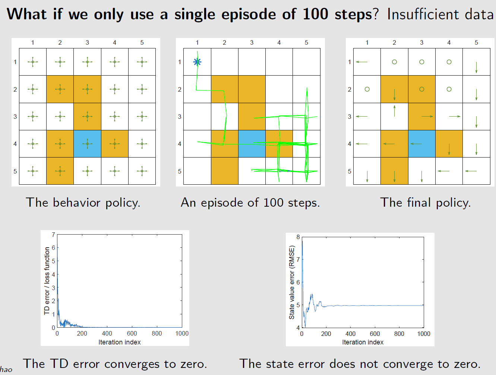

[TOC]

<!--more-->

参数化的价值函数 $\hat{V}(s,\phi),\hat{Q}(s,\phi)$ 和策略函数 $\pi_{\theta}(a\vert s)$，使得环境的连续状态和连续决策得以表示，是强化学习落地的第一步

- 价值函数通过最小化价值函数与TD目标之间的平方损失学习
  $$
  J(w)=E\left[\frac{1}{2}\left(V_{\pi}(s)-\hat{V}_{\pi}(S,w)\right)^2\right]\\
  w_{t+1}=w_t+\alpha_t\left(\overbrace{\underbrace{r_{t+1}+\gamma \hat{V}(s_{t+1},w_t)}_{\mbox{TD target}}-\hat{V}_{\pi}(s_t,w_t)}^{\mbox{TD error}}\right)\bigtriangledown_w\hat{V}_{\pi}(s_t,w)
  $$

- 策略函数通过最大化策略度量指标的期望得以学习
  $$
  \theta_{t+1}\xlongequal{随机梯度上升法}\theta_{t}+\alpha\bigtriangledown_\theta\ln\pi(a_t\vert s_t,\theta_{t})\cdot Q_{\pi}(s_t,a_t)
  $$

## 深度学习与强化学习的结合

### 传统计算机视觉与深度计算机视觉

1. 给定一张图片，先要提取它的特征，使用一些设计好的特征，如：方向梯度直方图(histogram of oriented gradient, HOG)、可变形的组件模型(deformable part model, DPM)
2. 提取这些特征，再单独训练一个分类器，这个分类器可以是支持向量机或Boosting，就可以对图像进行分类

2012年，AlexNet将特征提取与分类过程合并。通过训练一个神经网络实现端到端的训练，这个神经网络既可以做特征提取，又可以做分类。

### 传统强化学习与深度强化学习

**标准强化学习**

1. 设计很多特征，这些特征可以描述环境当前的整个状态
1. 得到特征后，通过训练一个分类网络或分别训练一个价值估计函数来采取动作
1. 价值函数和策略函数的基函数选择也是特征抽取的一部分

**深度强化学习** 

智能体引入神经网络，可以用神经网络拟合价值函数或策略网络，省去特征工程的过程，训练的过程变为一个端到端的训练。

采用策略网络每个动作进行采样，则其输入为环境当前状态，输出为所有动作的可能性，直到当前动作序列结束，依次对每个动作进行惩罚。

- 近年来深度强化学习被广泛应用

  我们有了更多的算力资源，有了更多的GPU，可以更快地做更多的试错尝试。通过不同的尝试，智能体在环境中获得了很多信息，可以在环境中取得很大的奖励

  有了深度强化学习这种端到端的训练方式，可以把特征提取、价值估计以及决策部分一起优化，得到一个更强的决策网络

深度强化学习的关键变化

- 相当高维的参数空间，容易过拟合
- 难以稳定地训练
- 需要大量的数据
- 需要高性能计算
- CPU（收集数据）和GPU（训练神经网络）间的平衡

**两方面研究**

- 在深度学习模型基础上，强化学习如何更加有效的工作，并避免深度学习模型带来的一系列问题，如：Q值估计过高问题
- 在强化学习场景下，深度学习如何有效地学习到有用的模式，如设计Dueling DQN的价值网络与动作优势网络

### DRL分类

基于价值的方法：DQN及其扩展

基于策略的方法：使用神经网络的策略梯度，如：自然策略梯度，信任区域策略优化（TPRO），近端策略优化（PPO），A3C

基于确定性策略的方法：确定性策略DDPG

## 基于价值网络的方法

不直接更新策略，学习价值函数后，更新策略

### DQN

> 最早和最成功地将神经网络引入RL，且引入的技巧被后续更多的DRL采用
>
> 通常只能处理动作离散的情况，因为存在 $\max Q$ 

#### 原理

对于最优的动作满足贝尔曼最优方程
$$
\overline{Q}(s,a)=E\left[R_{t+1}+\gamma \max\limits_{a\in \mathcal{A}(S_{t+1})}Q(S_{t+1},a)\bigg\vert S_t=s,A_t=a\right],\forall s,a
$$
我们希望最优动作价值 $\overline{Q}(s,a)$ 与其价值近似函数 $\hat{Q}(S,A,w)$ 在 $(S_t,A_t)=(s,a)$ 时在期望上误差为0

DQN目标是最小化目标函数（损失函数）——贝尔曼最优误差
$$
J(w)=E\left[\left(R+\gamma \max\limits_{a\in \mathcal{A}(S')}\hat{Q}\left(S',a,w\right)-\hat{Q}\left(S,A,w\right)\right)^2\right]
$$
使用梯度下降法求解最小化损失函数，但由于涉及两处对 $w$ 求梯度，可以先固定一处 $w$ ，设 $y$ 中的 $w$ 为一个常数
$$
y=R+\gamma \max\limits_{a\in \mathcal{A}(S')}\hat{Q}\left(S',a,w\right)
$$
对 $J(w)$ 求解关于 $w$ 的梯度 $\bigtriangledown_w J(w)$ ，只是关于 $\hat{Q}\left(S,A,w\right)$ 中 $w$ 的函数

为此，引入两个网络

- 一个是 main network  $\hat{Q}\left(S,A,w\right)$ 
- 另一个是 target network 为 $y$ 中的 $\hat{Q}\left(S,A,w_T\right)$ 

main network中的 $w$ 会随着回合的每一步进行更新，target network 中的参数 $w_T$ 会先当做常数，每隔一段时间将 main network 中的参数值复制 $w_T=w$ 再基于更新后的 $w_T$ 作为常数，更新 $w$ ，最后二者都会收敛到最优值 。即目标函数变为
$$
J(w)=E\left[\left(R+\gamma \max\limits_{a\in \mathcal{A}(S')}\hat{Q}\left(S',a,w_T\right)-\hat{Q}\left(S,A,w\right)\right)^2\right]
$$
$J(w)$ 的梯度下降变为
$$
\bigtriangledown_wJ(w)=E\left[\left(R+\gamma \max\limits_{a\in\mathcal{A}(S')}\hat{Q}\left(S',a,w_T\right)-\hat{Q}\left(S,A,w\right)\right)\bigtriangledown_w\hat{Q}\left(S,A,w\right)\right]
$$

#### DQN的两个技巧

带有价值近似函数的 Q-learning 算法是带有梯度的，连续采样到的经验 $<s,a,s',r'>$ 不满足独立分布且 $\hat{Q}\left(S',a,w\right)$ 更新频繁，不适合用于训练

神经网络会批量训练一些黑盒模型，然后更高效地训练神经网络

##### 引入两个网络

main network 与 target network

因为对目标函数中的两个位置求解参数在数学上比较复杂，所以采取异步更新

初始：$w=w_T$

收集数据：使用 $\epsilon-贪心$ 策略进行探索，将得到的状态-动作经验 $<s,a,s',r'>$ 放入经验池

每轮迭代，从经验回放池 $\mathcal{B}=\{(s,a,r',s')\}$ 中取出使用 $k$ 条经验进行训练

训练：

1. 输入：$s,a$ ；target network输出：$y(w_T)=r'+\gamma \max\limits_{a\in \mathcal{A}(s')}\hat{Q}(s',a,w_T)$ 

2. 在少批量经验集上 $\{(s,a,y(w_T))\}$ 上最小化TD误差 / 损失函数 $\left(y(w_T)-\hat{Q}(s,a,w)\right)^2$ ，更新 $w$ 相当于训练 main network
   $$
   \bigtriangledown_wJ(w)=E\left[\left(y(w_T)-\hat{Q}\left(S,A,w\right)\right)\bigtriangledown_w\hat{Q}\left(S,A,w\right)\right]
   $$

3. $w$ 的每 $C$ 次迭代（更新Q网络），更新一次目标网络 $w_T=w$ ，重复执行 $1,2$ 

##### 经验回放

当收集到经验数据后，并不是按照采集顺序使用这些经验，将这些经验存储在成为经验缓存池的集合中 $\mathcal{B}=\{(s,a,r',s')\}$ ，每次训练神经网络时，从经验缓存池中取出少批量随机经验

###### 经验回放中的分布

经验回放的必要性与均匀地经验回放

$(s,a)$ 给定之后，$(r',s')$ 要服从系统模型的动态特性 $P(r',s'\vert s,a)$ ，若知道哪些访问会接近目标状态这个先验知识前提下，这些访问对应该被多采样。若没有这个先验知识，则对于所有访问都要一视同仁，保证探索的充分性，即这些经验应该 **按均匀分布组成少批量训练经验集** 

深度Q函数容易过拟合到局部特征，所以若数据是按照时间顺序抽取，则一定会过拟合到时序的最后的经验，为打破经验之间的时序关系，采用经验回放技巧，从经验缓存池中均匀地取出经验

**表格型Q-learning中无经验回放**

表格型Q-learning中并未涉及到 $(S,A)$ 的分布

因为DQN是一类价值函数近似方法，数学上解决优化问题，需要有一个标量的目标函数去优化，价值函数近似中的标量目标函数是一个期望，会涉及到 $(S,A)$ 的分布。

在基于表格的方法中，如 **Q-learning** 中求解贝尔曼最优公式，对于每个 $(S,A)$ 都有一组等式去求解，进而得出最优的动作价值

**经验回放技术也可应用与表格型方法**

对于确定性策略，每个访问对只需要被访问一次就可以，所以并不需要过多的访问

但先前介绍的算法按照时序使用经验，之前所有的经验都不会被使用，在一定程度上是一种浪费

#### 伪代码

$$
\begin{array}{ll}
\hline
&目标：从基于探索策略\mu生成的经验集中学习最优的 \mbox{target network}去近似最优动作价值\\
&初始化：用随机的网络参数 w 初始化网络\hat{Q}(s,a,w)和目标网络\hat{Q}(s,a,w^T),初始化经验回放池\\
&对于每个回合e=1\rightarrow E:\\
&\quad 获取环境初始状态s_0\\
&\quad 对于每个时间步t=0\rightarrow T:\\
&\qquad 根据当前网络 \hat{Q}(s,a,w),以\epsilon-贪心策略选择动作a_t\\
&\qquad 执行动作a_t，获得回报r_{t+1}，将生成的经验放入经验回放池\mathcal{B}=\{(s,a,r',s')\}\\
&\qquad \mathcal{B}中的数据足够，从\mathcal{B}中采样 N个数据\{<s_i,a_i,r_{i+1},s_{i+1}>\}_{i=1,\cdots,N}\\
&\qquad 对每个数据:\\
&\quad\qquad 用目标网络\hat{Q}(s,a,w_T)计算目标价值y_i(w_T)=r_{i+1}+\gamma \max\limits_{a\in \mathcal{A}(s_{i+1})}\hat{Q}(s_{i+1},a,w_T)\\
&\qquad 最小化损失函数 L=\frac{1}{N}\sum\limits_{i}\left(y_i(w_T)-\hat{Q}(s_i,a_i,w)\right)^2，更新 \mbox{main network}\\
&\qquad 在C轮迭代后，令w_T=w\\
\hline
\end{array}
$$

异策略的 **Q-learning** 不需要在每轮迭代后更新策略，因为更新后的策略不会用于生成经验数据

Q-learning解决的是控制问题，在价值更新收敛后，可以直接求解出最优策略

#### 与DQN论文的不同

在于对目标价值的计算，DQN的计算效率更高，输入状态 $s$ 即可得出 $\mathbf{y}(w_T)$ ，在此处，为求解最大的目标动作价值，需要代入 $\vert \mathcal{A}(s)\vert$ 次，再求出最大值

### 示例

为每个访问对 $(s,a)$ 学习最优的动作价值，只要获取到最优动作价值，贪心策略就能求出最优策略

基于探索策略生成的一个回合训练网络，这个回合有1000步，而表格型 Q-learning需要100000步

非线性价值近似网络 $\hat{Q}(s,a,w)$ 结构：三层网络，输入层-隐藏层(100神经元)-输出层

探索不充分，虽然TD误差为0，但状态误差并未收敛到0

## 基于策略函数的方法

### 与基于值函数学习的对比

**基于价值的学习**由一个 $w$ 为参数的价值函数 $Q(s,a,w)$ 

优化目标为最小化TD误差：
$$
J(w)=E_{\pi}\left[\frac{1}{2}\left(r_{t+1}+\gamma \max\limits_{a'\in \mathcal{A}(s')}\hat{Q}(s',a',w)-\hat{Q}(s,a,w)\right)^2\right]
$$
更新方式
$$
w_{t+1}=w_{t}+\alpha_t\left[r_{t+1}+\gamma \max\limits_{a\in \mathcal{A}(s_{t+1})} \hat{Q}_{\pi}\left(s_{t+1},a,w_t\right)-\hat{Q}\left(s_t,a_t,w_t\right)\right]\bigtriangledown_w\hat{Q}\left(s_t,a_t,w_t\right)
$$
**基于策略梯度的学习** 由一个 $\theta$ 为参数的策略函数 $\pi(a\vert s,\theta)$

优化目标为最大化策略度量指标
$$
\max\limits_{\theta}J(\theta)=E_{\pi_\theta}\left[\pi(a\vert s,\theta)\hat{\delta}_{\pi}(s,a)\right]
$$
更新方式
$$
\theta_{t+1}=\theta_{t}+\alpha E_{S\sim \eta,A\sim\pi(A\vert S,\theta_{t})}\left[ \bigtriangledown_\theta\ln\pi(a_t\vert s_t,\theta_{t})\cdot \hat{\delta}_{t}^{\pi}(s_t,a_t)\right]
$$

### 随机策略与确定性策略

#### 随机策略梯度

softmax策略的梯度
$$
\begin{aligned}
\bigtriangledown_\theta\ln\pi(a\vert s,\theta)&=\bigtriangledown_\theta h(s,a,\theta)-\frac{1}{\sum\limits_{a\in \mathcal{A}(s)}e^{h(s,a,\theta)}}\sum\limits_{a\in \mathcal{A}(s)}e^{h(s,a,\theta)}\bigtriangledown_\theta h(s,a,\theta)\\
&=\bigtriangledown_\theta h(s,a,\theta)-E_{a\sim \pi(a\vert s,\theta)}\left[\bigtriangledown_\theta h(s,a,\theta)\right]
\end{aligned}
$$
因此，策略网络的梯度为
$$
\begin{aligned}
\bigtriangledown_\theta J(\theta)&=E_{S\sim \eta,A\sim\pi(A\vert S,\theta)}\left[\bigtriangledown_\theta\ln\pi(A\vert S,\theta)\cdot Q_{\pi}(S,A)\right]\\
&=E_{S\sim \eta,A\sim\pi(A\vert S,\theta)}\left[\left(\bigtriangledown_\theta h(S,A,\theta)-E_{a\sim \pi(A\vert S,\theta)}\left[\bigtriangledown_\theta h(S,A,\theta)\right]\right)Q_{\pi}(S,A)\right]
\end{aligned}
$$

#### 确定性策略梯度

基于策略梯度，使用梯度上升法最大化策略度量函数
$$
\theta_{t+1}=\theta_{t}+\alpha_{\theta}E_{S\sim \eta_{\pi}}\left[\bigtriangledown_\theta \pi(s,\theta)(\bigtriangledown_a Q_{\pi}(s,a))\vert_{a=\pi(s)}\right]
$$
相应的使用随机梯度上升法去近似
$$
\theta_{t+1}=\theta_{t}+\alpha_{\theta}\bigtriangledown_\theta \pi(s_t,\theta_{t})(\bigtriangledown_a Q_{\pi}(s_t,a))\vert_{a=\pi(s_t)}
$$

### DDPG

在实际应用中，带有神经网络的AC方法是不稳定的，

DDPG给出了DPG基础上的改进方法

- 经验回放（离线策略）：提高样本利用效率

- 目标网络：DDPG参考DQN，为每个网络引入了目标网络

  - Actor网络（策略网络）也需要目标网络。因为也会被用于计算Q值

  - 与DQN中不同，DQN每隔一个固定时间更新目标价值网络的参数，DDPG中目标价值网络采用一种软更新方法，逐渐接近价值网络
    $$
    w_T=\tau w+(1-\tau)w_T
    $$
    $\tau=1$ ，则和DQN更新方式一致

  - 采用Double DQN的做法更新目标网络中 $s'$ 的Q值：用训练网络的Q值选择目标网络在 $s'$ 的动作
    $$
    Q\left(s',\arg\max\limits_{a'}Q(s',a',w)\right)\iff r'+\gamma \max\limits_{a'}Q(s',a',w)
    $$

- 在动作输入前批标准化Q网络

- 添加连续噪声 $\mathcal{N}_t$ ：由于DDPG是一种确定性策略，本身探索能力有限

  作为一种离线策略学习，类比DQN采用 $\epsilon-贪心$ 进行动作探索，DDPG为动作添加连续噪音用于探索

