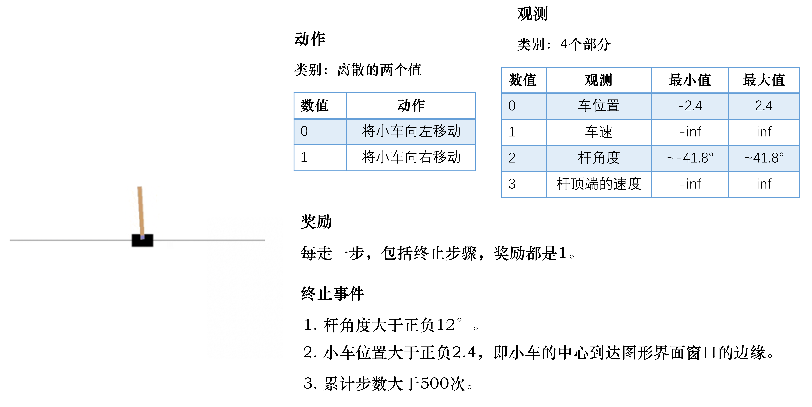
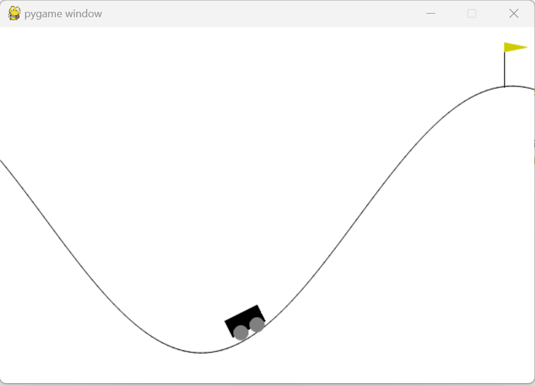

[TOC]

<!--more-->


## 1.3 实验

OpenAI的gym库是一个环境仿真库，其中包含了很多现有环境，针对不同的控制场景，可以选择不同的环境

- 离散控制场景：输出动作是可数的，一般用雅达利环境评估
- 连续控制场景：输出动作是不可数的，一般用MuJoCo环境评估

Gym  Retro是对gym库的进一步扩展，包含更多游戏

```shell
pip install gym==0.25.2

若能引入gym库，则安装成功
```

### gym中的强化学习框架

以Cart-Pole为例



动作空间：离散，向左、向右

结束标志：

- 任务失败：杆的角度大于某个角度(未保持平衡)，小车的中心到达图形界面窗口边缘
- 任务成功：累计步数大于200(成功)

目标：尽可能存活更多回合，即智能体的目的是控制杆，使其尽可能保持平衡以及尽可能保持在环境的中央

观测：小车当前位置，小车移动速度，杆的角度，杆的最高点的速度

- 观测越详细，就可以更好地描述当前所有的状态

奖励：多走一步，奖励加1

```python
import gym # 导入Gym 的Python 接口环境包
env = gym.make('CartPole-v0') # 构建实验环境
env.reset() # 重置一个回合
for _ in range(1000):
	env.render() # 显示图形界面
	action = env.action_space.sample() # 从动作空间中随机选取一个动作
	observation, reward, done, info = env.step(action) # 用于提交动作，括号内是具体的动作
env.close() # 关闭环境
# 直接关闭图形界面窗口可能会导致内存不能释放，甚至导致死机
```

- `env.action_space.sample()` ：在该游戏的动作空间中随机选择一个作为输出

- `env.step()` ：返回 $<observation,reward,done,info>$

  observation：状态信息，在游戏中观测到的屏幕像素值或者当前帧的状态描述信息

  reward：奖励值，动作提交后能获得的奖励值，对成功完成游戏有帮助的动作得到较高的奖励值

  done：表示游戏是否已经完成，若完成，则需要重置游戏并开始新的回合

  info：原始的调试信息

- `env.step()` 完成了一个完整的 $State\xrightarrow{Action} Reward\rightarrow S'$ 过程

  智能体得到某个观测后，会生成下一个动作，这个动作被环境执行进入下一个状态，返回新的观测、奖励及回合结束标志

#### gym中的env

```python
from gym import envs

env_spaces = envs.registry.all() #查看当前gym库已经注册了哪些环境
envs_ids=[env_spec.id for env_spec in env_specs]
```

每个环境都定义了自己的观测空间和动作空间。

环境env的观测空间用 `env.observation_space` 表示，动作空间用 `env.action_space` 表示

离散空间用 `gym.spaces.Discrete` 表示，连续空间用 `gym.spaces.Box` 类表示

- `Box(2,)` 表示观测可用2个 float 值表示

  Box类实例的成员 low,high 表示每个浮点数的取值范围

- `Discrete(n)` 表示动作取值 $0,\cdots,n-1$

```python
import gym
env = gym.make('MountainCar-v0')
print('动作空间= {}'. format(env.action_space))
print('动作数= {}'. format(env.action_space.n))

print('观测空间= {}'. format(env.observation_space))
print('观测范围= {} ~ {}'. format(env.observation_space.low,env.observation_space.high))

动作空间= Discrete(3)
动作数= 3
# 0表示向左走
# 2表示静止
# 1 表示向右走

观测空间= Box(2,) # 观测空间为 shape为(2,) 的np.array数组，即两个元素的一维数组
观测范围= [-1.2 -0.07] ~ [0.6 0.07]
# 第一个浮点数为位置 position 取值范围 [-1.2,0.6]
# 第二个浮点数为取值范围 velocity 取值范围 [-0.07,0.07]

env.reset()
array([-0.5169839,  0.       ], dtype=float32)
for _ in range(500):
	env.render()
    action = env.action_space.sample()
    observation, reward, done, info = env.step(action)
    print(observation)
env.close()
```



#### 智能体

实现智能体类

```python
class BespokeAgent:
	def __init__(self, env):
		pass
    
    def decide(self, observation): # 决策
		position, velocity = observation
		lb = min(-0.09 * (position + 0.25) ** 2 + 0.03,0.3 * (position + 0.9) ** 4 - 0.008)
		ub = -0.07 * (position + 0.38) ** 2 + 0.07
		
        if lb < velocity < ub:
			action = 2
		else:
			action = 0
		return action # 返回动作

    def learn(self, *args): # 学习
		pass

agent = BespokeAgent(env)
```

#### 智能体与环境交互

```python
def play_montecarlo(env, agent, render=False, train=False):
	episode_reward = 0. # 记录回合总奖励，初始化为0
	observation = env.reset() # 重置游戏环境，开始新回合
	while True: # 不断循环，直到回合结束
		if render: # 判断是否显示
			env.render() # 显示图形界面，图形界面可以用env.close() 语句关闭
		action = agent.decide(observation)
		next_observation, reward, done, _ = env.step(action) # 执行动作
		episode_reward += reward # 收集回合奖励
		if train: # 判断是否训练智能体
			agent.learn(observation, action, reward, done) # 学习
		if done: # 回合结束，跳出循环
			break
		observation = next_observation
        
	return episode_reward # 返回回合总奖励
```

- `render` ：在运行过程中是否要图形化显示，为 `True` 则调用 `env.render()` 显示图形化，通过 `env.close()` 关闭
- `train` ：在运行过程中是否训练智能体
  - 训练过程中设为 `True`
  - 测试过程中设为 `False`

返回值：`episode_reward` 返回回合奖励

#### 主函数

```python
env.seed(0)# 设置随机数种子,只是为了让结果可以精确复现,一般情况下可删去
episode_reward = play_montecarlo(env, agent, render=True) # 计算一回合奖励
print('回合奖励= {}'. format(episode_reward))

# 为评估智能体学习能力，会取100次性能平均值
episode_rewards = [play_montecarlo(env, agent) for _ in range(100)]
print('回合奖励= {}'. format(np.mean(episode_rewards))

env.close() # 此语句可关闭图形界面
```


