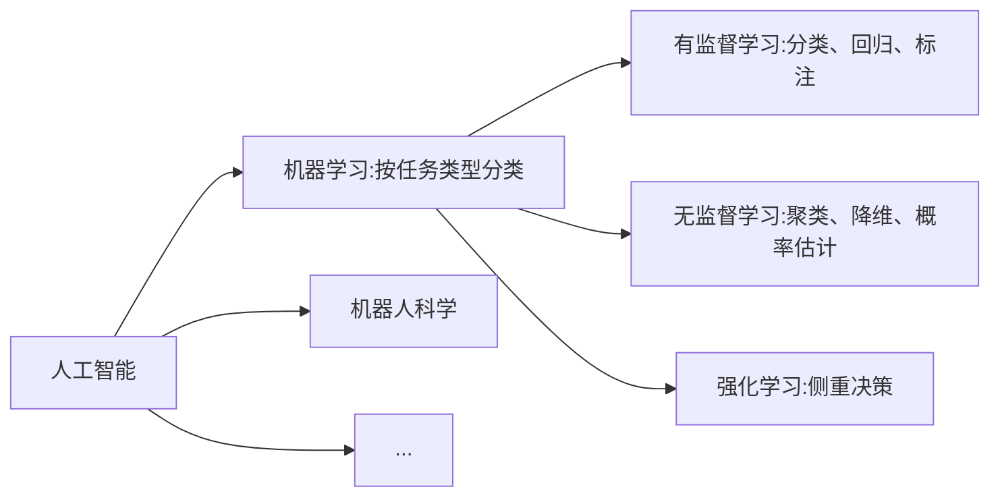
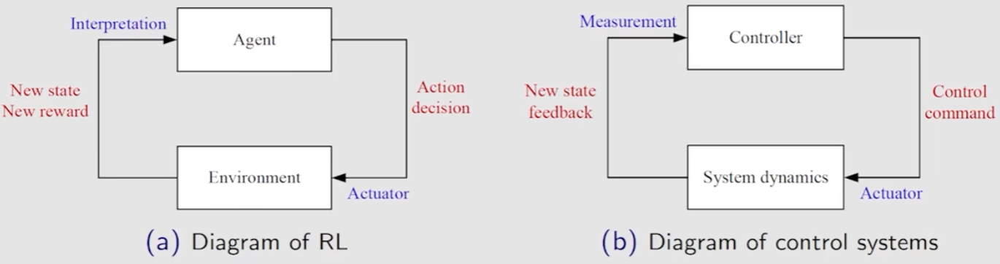

赵世钰

书籍：

侧重直观理解

- 圣经 sutton，类似西瓜书，弱化数学推导
- C.Szepesvari, Algorithms for Reinforcement Learning

控制：数学性强，自动控制背景

- D.P. Bertsekas and J. Tsitsiklis, Neuro-Dynamic Programming, AthenaScientific, 1996
- D.P. Bertsekas,Reinforcement Learning and Optimal Control, AthenaScientific, 2019
- S. Meyn, Control Systems and Reinforcement Learning, CambridgUniversity Press, 2022.

深度强化学习：侧重如何用DRL解决问题，实验性+实践性

历史：

目前，深度强化学习，结合深度神经网络，最开始是DQL

DQL

- Mnih, Volodymyr, et al. "Playing atari with deep reinforcement learning." arXiv:1312.5602(2013).
- Mnih, Volodymyr, et al. “Human-level control through deep reinforcement learning." Nature 518.7540(2015): 529-533.

DQL是对Q-Learning改进

Q-Learning

- 1989年被提出：Watkins, C.J.C.H.(1989). Learning from Delayed Rewards. PhD thesis, Cambridge University.
- 1992年详细分析：Watkins, Chris; Dayan, Peter(1992). "Q-learning" Machine Learning. 8(3-4):279-292.

Q-Learning是一种特殊的时序差分算法(TD算法)

- 1988年被提出：Sutton, Richard S. "Learning to predict by the methods of temporal differences." Machine learning 3.1 (1988): 9-44.
- 1997年收敛性分析及与函数近似理论结合：J.N.Tsitsiklis and B, Van Roy “An analysis of temporal-difference learning with function approximation." lEEE Transactions on Automatic Control, vol.  42, no.5, pp. 674-690, 1997

Dynamic programming(动规，DP)

- Richard Bellman, "Dynamic Programming", Princeton University Press. 1957.

  基于 Markov decision process (MDP)

- 在此基础上：最优控制，强化学习都是侧重于实践性

  - 针对离散时间，离散控制状态

  最优控制理论追求理论严谨化

  强化学习更多追求在实际当中的应用

**分类角度** 

**交叉学科**

- 计算机科学；AI；ML
- 最优控制；动态规划 Dynamic Programming；自适应动态规划
- 心理学
- 神经科学

