[TOC]

<!--more-->


## 1.3 实验

OpenAI的gym库是一个环境仿真库，其中包含了很多现有环境，针对不同的控制场景，可以选择不同的环境

- 离散控制场景：输出动作是可数的，一般用雅达利环境评估
- 连续控制场景：输出动作是不可数的，一般用MuJoCo环境评估

Gym  Retro是对gym库的进一步扩展，包含更多游戏

```shell
pip install gym==0.25.2

若能引入gym库，则安装成功
```

### gym中的强化学习框架

以Cart-Pole为例

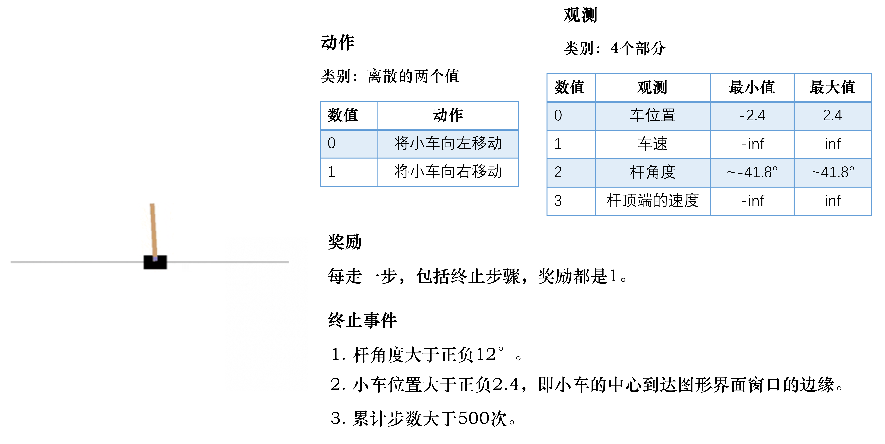

动作空间：离散，向左、向右

结束标志：

- 任务失败：杆的角度大于某个角度(未保持平衡)，小车的中心到达图形界面窗口边缘
- 任务成功：累计步数大于200(成功)

目标：尽可能存活更多回合，即智能体的目的是控制杆，使其尽可能保持平衡以及尽可能保持在环境的中央

观测：小车当前位置，小车移动速度，杆的角度，杆的最高点的速度

- 观测越详细，就可以更好地描述当前所有的状态

奖励：多走一步，奖励加1

```python
import gym # 导入Gym 的Python 接口环境包
env = gym.make('CartPole-v0') # 构建实验环境
env.reset() # 重置一个回合
for _ in range(1000):
	env.render() # 显示图形界面
	action = env.action_space.sample() # 从动作空间中随机选取一个动作
	observation, reward, done, info = env.step(action) # 用于提交动作，括号内是具体的动作
env.close() # 关闭环境
# 直接关闭图形界面窗口可能会导致内存不能释放，甚至导致死机
```

- `env.action_space.sample()` ：在该游戏的动作空间中随机选择一个作为输出

- `env.step()` ：返回 $<observation,reward,done,info>$

  observation：状态信息，在游戏中观测到的屏幕像素值或者当前帧的状态描述信息

  reward：奖励值，动作提交后能获得的奖励值，对成功完成游戏有帮助的动作得到较高的奖励值

  done：表示游戏是否已经完成，若完成，则需要重置游戏并开始新的回合

  info：原始的调试信息

- `env.step()` 完成了一个完整的 $State\xrightarrow{Action} Reward\rightarrow S'$ 过程

  智能体得到某个观测后，会生成下一个动作，这个动作被环境执行进入下一个状态，返回新的观测、奖励及回合结束标志

#### gym中的env

```python
from gym import envs

env_spaces = envs.registry.all() #查看当前gym库已经注册了哪些环境
envs_ids=[env_spec.id for env_spec in env_specs]
```

每个环境都定义了自己的观测空间和动作空间。

环境env的观测空间用 `env.observation_space` 表示，动作空间用 `env.action_space` 表示

离散空间用 `gym.spaces.Discrete` 表示，连续空间用 `gym.spaces.Box` 类表示

- `Box(2,)` 表示观测可用2个 float 值表示

  Box类实例的成员 low,high 表示每个浮点数的取值范围

- `Discrete(n)` 表示动作取值 $0,\cdots,n-1$

```python
import gym
env = gym.make('MountainCar-v0')
print('动作空间= {}'. format(env.action_space))
print('动作数= {}'. format(env.action_space.n))

print('观测空间= {}'. format(env.observation_space))
print('观测范围= {} ~ {}'. format(env.observation_space.low,env.observation_space.high))

动作空间= Discrete(3)
动作数= 3
# 0表示向左走
# 2表示静止
# 1 表示向右走

观测空间= Box(2,) # 观测空间为 shape为(2,) 的np.array数组，即两个元素的一维数组
观测范围= [-1.2 -0.07] ~ [0.6 0.07]
# 第一个浮点数为位置 position 取值范围 [-1.2,0.6]
# 第二个浮点数为取值范围 velocity 取值范围 [-0.07,0.07]

env.reset()
array([-0.5169839,  0.       ], dtype=float32)
for _ in range(500):
	env.render()
    action = env.action_space.sample()
    observation, reward, done, info = env.step(action)
    print(observation)
env.close()
```

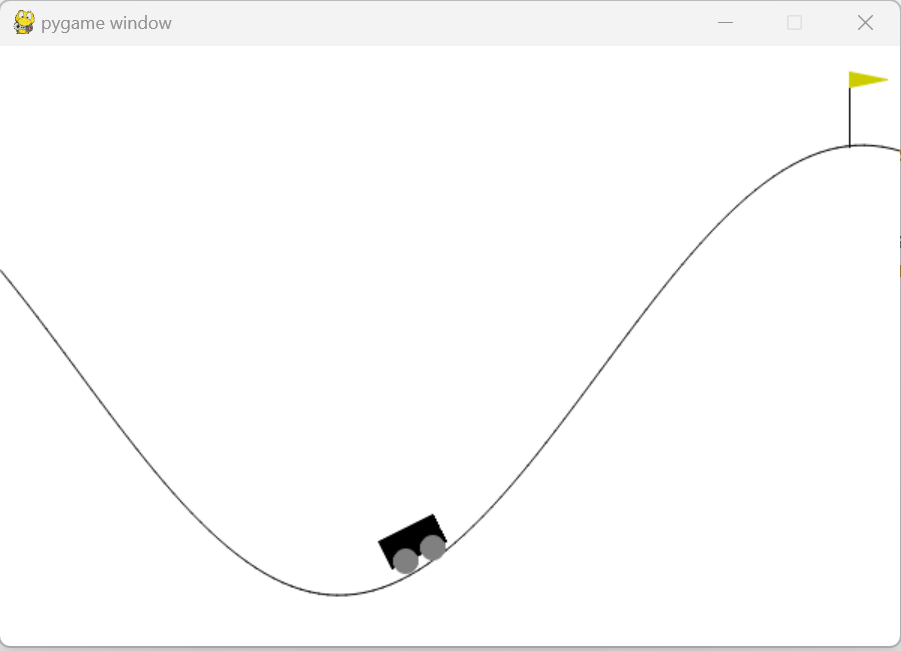

#### 智能体

实现智能体类

```python
class BespokeAgent:
	def __init__(self, env):
		pass
    
    def decide(self, observation): # 决策
		position, velocity = observation
		lb = min(-0.09 * (position + 0.25) ** 2 + 0.03,0.3 * (position + 0.9) ** 4 - 0.008)
		ub = -0.07 * (position + 0.38) ** 2 + 0.07
		
        if lb < velocity < ub:
			action = 2
		else:
			action = 0
		return action # 返回动作

    def learn(self, *args): # 学习
		pass

agent = BespokeAgent(env)
```

#### 智能体与环境交互

```python
def play_montecarlo(env, agent, render=False, train=False):
	episode_reward = 0. # 记录回合总奖励，初始化为0
	observation = env.reset() # 重置游戏环境，开始新回合
	while True: # 不断循环，直到回合结束
		if render: # 判断是否显示
			env.render() # 显示图形界面，图形界面可以用env.close() 语句关闭
		action = agent.decide(observation)
		next_observation, reward, done, _ = env.step(action) # 执行动作
		episode_reward += reward # 收集回合奖励
		if train: # 判断是否训练智能体
			agent.learn(observation, action, reward, done) # 学习
		if done: # 回合结束，跳出循环
			break
		observation = next_observation
        
	return episode_reward # 返回回合总奖励
```

- `render` ：在运行过程中是否要图形化显示，为 `True` 则调用 `env.render()` 显示图形化，通过 `env.close()` 关闭
- `train` ：在运行过程中是否训练智能体
  - 训练过程中设为 `True`
  - 测试过程中设为 `False`

返回值：`episode_reward` 返回回合奖励

#### 主函数

```python
env.seed(0)# 设置随机数种子,只是为了让结果可以精确复现,一般情况下可删去
episode_reward = play_montecarlo(env, agent, render=True) # 计算一回合奖励
print('回合奖励= {}'. format(episode_reward))

# 为评估智能体学习能力，会取100次性能平均值
episode_rewards = [play_montecarlo(env, agent) for _ in range(100)]
print('回合奖励= {}'. format(np.mean(episode_rewards))

env.close() # 此语句可关闭图形界面
```


# 2.马尔科夫决策过程

强化学习中，智能体与环境的交互过程可以用马尔科夫过程表示

- 马尔科夫过程(Markov process, MP)以及马尔科夫奖励过程(Markov reward process, MRP) 是马尔科夫决策过程(Markov decision process,MDP) 的简化过程

- 预测(策略评估)和控制是马尔科夫决策过程中的两种价值函数计算方法

  - 策略评估(policy evaluation)是给定决策后，怎么计算它的价值函数

  - 控制(prediction)是寻找最优策略

    具体有两种算法：策略迭代(policy iteration)和价值迭代(value iteration)


在马尔科夫决策过程中，环境是全部可观测的

很多时候，环境中有些量是不可观测的，这种部分可预测的问题也可以转换成马尔科夫决策过程

## 2.1 马尔科夫过程

Markov——马尔科夫性质

decision——策略

process——条件概率表示状态转移

### 2.1.1 马尔科夫性质

> 马尔科夫性质(Markov property)指一个随机过程在给定现在状态及所有过去状态下，其未来状态的条件概率分布仅依赖于当前状态。即在给定当前状态下，将来的状态和过去的状态是条件独立的

假设变量 $X_0,X_1,\cdots,X_T$ 构成一个随机过程，这些变量所有可能的取值集合为状态空间，若未来状态 $X_{t+1}$ 对于过去状态序列 $X_{0:t}$ 的条件概率分布仅是 $X_t$ 的一个函数
$$
P(X_{t+1}=s_{t+1}\vert X_{0:t}=s_{0:t})=P(X_{t+1}=s_{t+1}\vert X_t=s_t)
$$
则该随机过程具有马尔科夫性质

### 2.1.2 马尔科夫过程的数学表示

马尔科夫过程是一组具有马尔科夫性质的随机变量序列 $s_1,s_2,\cdots,s_t$ ，其中下一个时刻的状态 $s_{t+1}$ 只取决于当前状态 $s_t$ ，设状态历史为 $h_t=\{s_1,s_2,\cdots,s_t\}$ ，则马尔科夫过程满足：
$$
P(s_{t+1}\vert s_t)=P(s_{t+1}\vert h_t)
$$
- 离散时间的马尔科夫过程称为马尔科夫链(Markov chain)，其状态是有限的

用状态转移矩阵(state transition matrix)P表示状态转移 $P(s_{t+1}=s'\vert s_t=s)$ ，假设有 $N$ 个状态
$$
\mathbf{P}=\begin{pmatrix}
P(s_1\vert s_1)&P(s_2\vert s_1)&\cdots&P(s_N\vert s_1)\\
P(s_2\vert s_1)&P(s_2\vert s_2)&\cdots&P(s_N\vert s_2)\\
\vdots&\vdots&\ddots&\vdots\\
P(s_N\vert s_1)&P(s_N\vert s_1)&\cdots&P(s_N\vert s_N)\\
\end{pmatrix}
$$
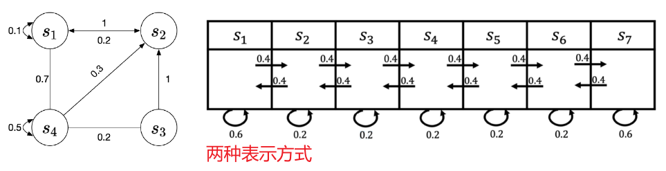

在给定马尔科夫链后，对马尔科夫链的一次采样，即可得到一个轨迹

**状态转移是确定的，轨迹是随机的**

## 2.2 马尔科夫奖励过程

> 马尔科夫奖励过程是马尔科夫链加上奖励函数

奖励函数 $R(s)$ 是一个期望，表示当到达某一个状态时可以获得多大的奖励，一般用向量表示

### 2.2.1 回报与价值函数

**范围** ：每个回合最大的时间步数，用 $T$ 表示

- 一个状态可以多次出现在一个回合中，所以 $T>or < or =N$ 都可能出现，$N$ 为马尔科夫过程的状态总数

**回报** ：沿着轨迹的奖励逐步叠加，假设时刻 $t$ 后的奖励序列为 $r_{t+1},r_{t+2},\cdots$ ，则回报定义为
$$
G_t=r_{t+1}+\gamma r_{t+2}+\gamma^2 r_{t+3}+\cdots+\gamma ^{T-t-1} r_{T}=\sum\limits_{i=t}^T\gamma^{i-t}r_{i+1},\quad \gamma\in[0,1]\tag{2.1}\label{2.1}
$$
其中，$\gamma$ 为折扣因子，越往后得到的奖励，打的折扣越多，表明我们期望更快地得到尽可能多的奖励

**状态价值函数** ：以某个状态为起始，获得回报的期望
$$
V_t(s)=E[G_t\vert s_t=s]=E[r_{t+1}+\gamma r_{t+2}+\gamma^2 r_{t+3}+\cdots+\gamma ^{T-t-1} r_{T}\vert s_t=s]\tag{2.2}\label{2.2}
$$

#### 折扣因子

有些马尔科夫过程是带环的，我们想终结来避免无穷奖励

- 若只是简单的回报相加，对于无穷轨迹，得到的回报是发散的

- 带折扣因子的回报，即使所有奖励都是 $+1$ ，也会收敛
  $$
  G=1+\gamma\cdot 1+\gamma^2\cdot 1+\gamma^3 \cdot 1+\cdots=\frac{1\cdot(1-\gamma^n)}{1-\gamma}\rightarrow\frac{1}{1-\gamma}<1
  $$

我们不能完全信任模型（并不能建立完全模拟环境的模型，对未来的评估未必准确），为了表示这种不确定性，所以对未来的奖励打折扣

若奖励是有实际价值的，我们可能更希望尽快获得奖励（现在的钱比以后更有实际价值）

若把价值函数看做未来可能获得累积奖励的当前价值表现，则未来奖励与即时奖励不总具有同等价值

**折扣因子为强化学习超参数** 

- $\gamma=0$ ，只关注当前奖励
- $\gamma=1$ ，当前奖励与未来奖励具有同等价值

未来的奖励并不总是和即时奖励具有同等的价值，因为它们受到时间价值、不确定性和其他因素的影响

智能体在选择动作时，会更多地考虑那些能够带来长期利益的行动，而不是仅仅追求短期的高回报

如果折扣率设置为0.5，那么未来某一时刻的100元奖励在现在的价值就只有50元


#### 轨迹的回报

若 $s_1,s_2,\cdots,s_7$ 构成一个马尔科夫过程，设其奖励函数表示为 $R=[5,0,0,0,0,0,10]$


以 $s_{t+1}=s_4$ 为下一未来状态 ($\gamma=0.5$)来计算回报 $G$ ，计算每个轨迹的回报

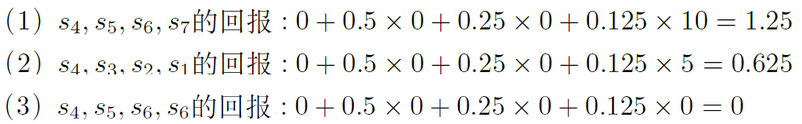

### 2.2.2 价值函数的计算

两种方法：

- 蒙特卡洛方法(Monte Carlo,MC)：计算 $E[G_t\vert s_t=s]$ 

  生成很多轨迹，计算每条轨迹的回报，回报叠加后取平均值作为价值函数

- 贝尔曼方程

#### 贝尔曼方程

$$
V(s)=\underbrace{R(s)}_{即时奖励}+\underbrace{\gamma\sum\limits_{s'\in S}P(s'\vert s)V(s')}_{未来奖励的折扣总和}\tag{贝尔曼方程}\label{BellmanEquation}
$$

贝尔曼方程定义了当前状态与未来状态间的价值关系，相当于状态价值函数的数值解

##### 贝尔曼方程推导

$$
\begin{align}
V(s)&=E[G_t\vert s_t=s]\\
&=E[r_{t+1}+\gamma r_{t+2}+\gamma^2 r_{t+3}+\cdots+\gamma^{T-t-1}r_{T}\vert s_t=s]\\
&=E[r_{t+1}\vert s_t=s]+\gamma E[r_{t+2}+\gamma r_{t+3}+\cdots+\gamma^{T-t-2}r_{T}\vert s_t=s]\\
&=R(s)+\gamma E[G_{t+1}\vert s_t=s] \tag{2.3}\label{2.3}
\end{align}
$$


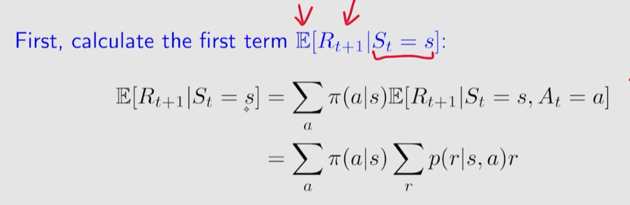

- 立即奖励


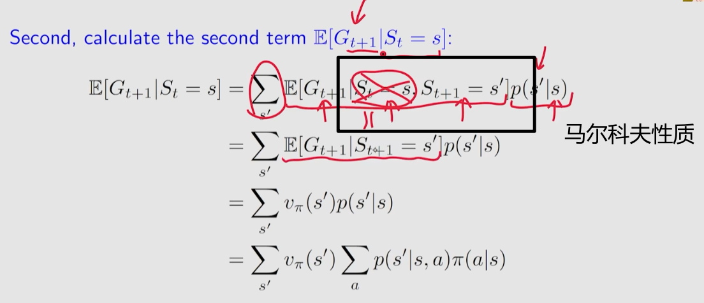


令 $s=s_t,g'=G_{t+1},s'=s_{t+1}$  ，则 $E[G_{t+1}\vert s_t=s]=E[g'\vert s]$  ，且 $\sum\limits_{s'\in S}P(s'\vert s)V(s')=E\left[V(s')\vert s\right]$ 

相当于求证 $E[g'\vert s]=E\left[V(s')\vert s\right]$ 
$$
\begin{aligned}
E\left[V(s')\vert s\right]&=E\left[E[g'\vert s']\big\vert s\right]\\
&=E\left[\sum\limits_{g'}P(g'\vert s')\cdot g'\Bigg\vert s\right]\\
&=\sum\limits_{s'}P(s'\vert s)\cdot \sum\limits_{g'}P(g'\vert s',s)\cdot g'\\
&=\sum\limits_{s'}\sum\limits_{g'}\frac{P(g'\vert s',s)\cdot g'\cdot P(s'\vert s)\cdot P(s)}{P(s)}\\
&=\sum\limits_{s'}\sum\limits_{g'}\frac{P(g'\vert s',s)\cdot P(s',s)\cdot g'}{P(s)}\\
&=\sum\limits_{s'}\sum\limits_{g'}\frac{P(g',s',s)\cdot g'}{P(s)}\\
&=\sum\limits_{s'}\sum\limits_{g'}g'\cdot P(g',s'\vert s)\\
&=\sum\limits_{g'}\sum\limits_{s'}g'\cdot P(g',s'\vert s)\\
&=\sum\limits_{g'}g'\cdot P(g'\vert s)\\
&=E\left[g'\vert s\right]
\end{aligned}
$$
故代入 $\eqref{2.3}$ ，得证贝尔曼方程 $\eqref{BellmanEquation}$ 
$$
\begin{align}
V(s)&=R(s)+\gamma E\left[V(s')\vert s\right]\\
&=R(s)+\gamma \sum\limits_{s'\in S}P(s'\vert s)\cdot V(s')\\
&=E[r_{t+1}+\gamma V(s')\big\vert s]
\end{align}
$$

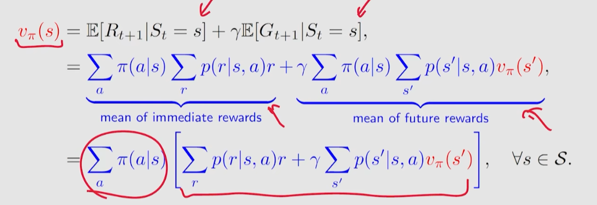

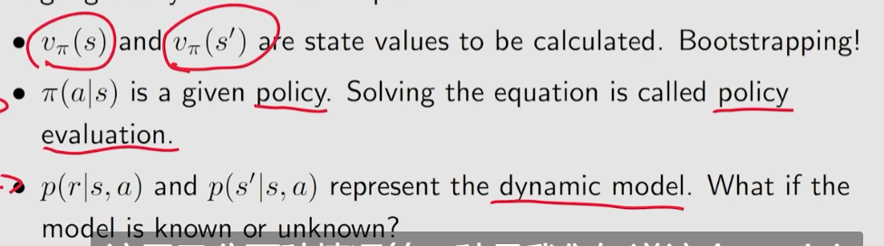

#### 贝尔曼方程的解析解

对于一个马尔科夫过程的 $N$ 个状态 $s_i\in \mathcal{S},i\in [1,N]$ ，可以列出 $N$ 个贝尔曼方程，可解得每个状态的价值

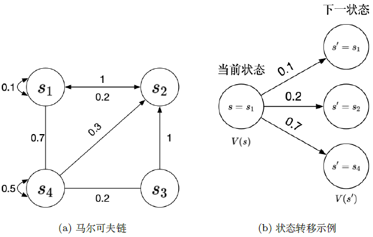

- 状态价值向量 $\mathbf{V}=\begin{pmatrix}V(s_1)\\V(s_2)\\\vdots\\V(S_N)\end{pmatrix}$ 

- 状态转移矩阵 
  $$
  \mathbf{P}=\begin{pmatrix}
  P(s_1\vert s_1)&P(s_2\vert s_1)&\cdots&P(s_N\vert s_1)\\
  P(s_2\vert s_1)&P(s_2\vert s_2)&\cdots&P(s_N\vert s_2)\\
  \vdots&\vdots&\ddots&\vdots\\
  P(s_N\vert s_1)&P(s_N\vert s_1)&\cdots&P(s_N\vert s_N)\\
  \end{pmatrix}
  $$

- 即时奖励 $\mathbf{R}=\begin{pmatrix}R(s_1)\\R(s_2)\\\vdots\\R(s_N)\end{pmatrix}$

则代入 $\eqref{BellmanEquation}$ ，表示为
$$
\begin{pmatrix}V(s'_1)\\V(s'_2)\\\vdots\\V(S'_N)\end{pmatrix}=\begin{pmatrix}R(s_1)\\R(s_2)\\\vdots\\R(s_N\end{pmatrix}+\gamma\begin{pmatrix}
P(s_1\vert s_1)&P(s_2\vert s_1)&\cdots&P(s_N\vert s_1)\\
P(s_2\vert s_1)&P(s_2\vert s_2)&\cdots&P(s_N\vert s_2)\\
\vdots&\vdots&\ddots&\vdots\\
P(s_N\vert s_1)&P(s_N\vert s_1)&\cdots&P(s_N\vert s_N)\\
\end{pmatrix}\begin{pmatrix}V(s_1)\\V(s_2)\\\vdots\\V(S_N)\end{pmatrix}
$$
即 
$$
\begin{aligned}
\mathbf{V}&=\mathbf{R}+\gamma\mathbf{P}\mathbf{V}\\
(\mathbf{I-\gamma P})\mathbf{V}&=\mathbf{R}\\
\mathbf{V}&=(\mathbf{I}-\gamma\mathbf{P})^{-1}\mathbf{R}
\end{aligned}
$$
但矩阵求逆的时间复杂度为 $O(N^3)$ ，这种通过解析解的方法只适用于很小量的马尔科夫奖励过程

#### 贝尔曼方程的数值解

**迭代法**

- 蒙特卡洛方法
- 动态规划法
- 时序差分学习(temporal-difference learning, TD learning)，前两者的结合

##### 蒙特卡洛方法

$$
\begin{array}{ll}
\hline
&i\leftarrow 0,G_t\leftarrow 0\\
&当i\neq N时，执行\\
&\qquad生成一个回合的轨迹，从状态s和时刻t开始\\
&\qquad使用生成的轨迹计算回报 g=\sum\limits_{j=t}^{T-1}\gamma^{j-t}r_{j+1}\\
&\qquad G_t\leftarrow G_t+g,i\leftarrow i+1\\
&结束循环\\
&V_t(s)=\frac{G_t}{N}\\
\hline
\end{array}
$$

##### 动态规划方法

通过自举(bootstrapping)的方法，不停地迭代贝尔曼方程，当最后更新的状态与上一状态区别不大时，就可以停止迭代，将输出的 $V'(s)$ 作为当前的状态的价值
$$
\begin{array}{ll}
\hline
&对于所有状态s\in S,V'(s)\leftarrow 0,V(s)\leftarrow\infty\\
&当 \Vert V-V'\Vert>\epsilon，执行\\
&\qquad V\leftarrow V'\\
&\qquad 对于所有状态 s\in S,V'(s)=R(s)+\gamma\sum\limits_{s'\in S}P(s'\vert s)V(s')\\
&结束循环\\
& 返回V'(s)\\
\hline
\end{array}
$$

## 2.3 马尔科夫决策过程

### 2.3.1 MDP与MRP/MP

马尔科夫决策过程在马尔科夫奖励的过程基础上多了决策 $a_t$ 

- 马尔科夫性质：$P(s_{t+1}\vert s_t,a_t)=P(s_{t+1}\vert h_t,a_t)$

- 奖励函数：$R(s_t=s,a_t=a)$ 

- 状态转移：$P(s_{t+1}=s'\vert s_t=s,a_t=a)$ 

  - 马尔科夫奖励过程/马尔科夫过程的状态转移是直接的，当前状态是 $s_t$ ，直接通过状态转移概率决定下一状态 $s_{t+1}$
  - 马尔科夫决策过程的状态转移具有一定的不确定性，当前状态与未来状态之间多了一个决策过程。在当前状态下，智能体首先要决定采取哪一种动作，所以智能体进入的未来状态也是一种概率分布

  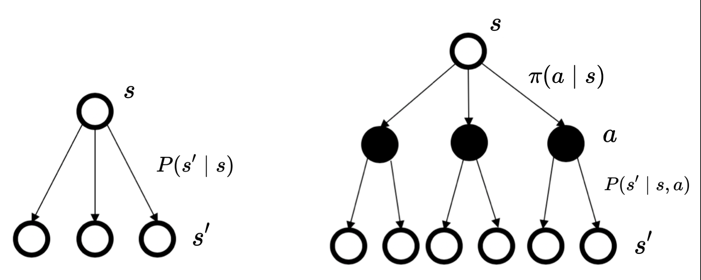

对于马尔科夫过程/马尔科夫奖励过程，到达某个状态的奖励是确定的，但由于轨迹是随机的，所以最终得到的奖励不确定。


对于马尔科夫决策过程，策略产生决策的决策决定状态的变化方向，通过智能体的策略，我们可以尽快地获得尽可能多的奖励

#### MDP中的策略

策略定义了在某一状态应该采取什么样的动作。有两种形式

- 概率表示，当前状态下每个采取每个动作的可能性
  $$
  \pi(a\vert s)=P(a_t=a\vert s_t=s)
  $$

- 直接输出当前状态应该采取那种动作

**强化学习中的归纳偏置** ：假设策略函数都是稳定的，不同时间，采取的动作都是对策略函数的采样

#### MDP与MRP

若已知马尔科夫决策过程及策略 $\pi$ ，就可以将马尔科夫决策过程转换为马尔科夫奖励过程

若已知策略函数，相当于在某个状态下，已知可能采取的每个动作的可能性，进而可以知道状态转移的概率
$$
P_\pi(s'\vert s)=\sum\limits_{a\in A}\pi(a\vert s)P(s'\vert s,a)
$$
对于奖励函数，也是类似的
$$
R_\pi(s)=\sum\limits_{a\in A}\pi(a\vert s)R(s,a)
$$

### 2.3.2 MDP中的价值函数

MDP中的状态价值函数定义为
$$
V_\pi(s)=E[G_t\vert s_t=s]
$$
动作价值函数，在某一状态采取某一动作可能得到的期望回报
$$
Q_{\pi}(s,a)=E_{\pi}[G_t\vert s_t=s,a_t=a]
$$
对于一个马尔科夫过程，策略确定后，对动作采样可以使动作价值转换为状态价值
$$
V_\pi(s)=\sum\limits_{a\in A}\pi(a\vert s)Q_\pi(s,a)\tag{V=f(Q)}\label{V=f(Q)}
$$

#### 贝尔曼期望方程

将状态价值函数分解为即时奖励与折扣奖励，可以得到状态价值函数的贝尔曼期望方程
$$
\begin{align}
V_\pi(s)&=E_\pi[G_{t}\vert s_t=s]\\
&=E_\pi\left[r_{t+1}+\gamma r_{t+2}+\gamma^2r_{t+3}+\cdots\big\vert s_t=s\right]\\
&=E_\pi\left[r_{t+1}+\gamma G_{t+1}\big\vert s_t=s\right]\\
&=E_\pi\left[r_{t+1}+\gamma V_\pi(s_{t+1})\big\vert s_t=s\right]\tag{贝尔曼期望方程-状态}\label{BellmanExpEq_V1}
\end{align}
$$
对动作价值函数分解，得到Q函数的贝尔曼期望方程
$$
\begin{align}
Q_\pi(s,a)&=E_\pi[G_t\vert s_t=s,a_t=a]\\
&=E_\pi[r_{t+1}+\gamma r_{t+2}+\gamma^2r_{t+3}+\cdots\vert s_t=s,a_t=a]\\
&=E_\pi\left[r_{t+1}+\gamma G_{t+1}\big\vert s_t=s,a_t=a\right]\\
&\xlongequal{变量代换}E_\pi\left[r_{t+1}+\gamma Q_\pi(s_{t+1},a_{t+1})\big\vert s_t=s,a_t=a\right]\tag{贝尔曼期望方程-动作}\label{BellmanExpEq_Q1}
\end{align}
$$
对Q函数的贝尔曼期望方程推导
$$
\begin{align}
Q_\pi(s,a)&=E_\pi[G_t\vert s_t=s,a_t=a]\\
&=E_\pi[r_{t+1}+\gamma r_{t+2}+\gamma^2r_{t+3}+\cdots\vert s_t=s,a_t=a]\\
&=E_\pi[r_{t+1}\vert s_t=s,a_t=a]+\gamma E_\pi[r_{t+2}+\gamma r_{t+3}+\cdots\vert s_t=s,a_t=a]\\
&=R(s,a)+\gamma E_\pi[G_{t+1}\vert s_t=s,a_t=a]\\
&\xlongequal{解期望}R(s,a)+\gamma E_\pi[V_\pi(s_{t+1}=s')\vert s_t=s,a_t=a]\\
&=R(s,a)+\gamma \sum\limits_{s'\in S}P(s'\vert s,a)\cdot V_\pi(s')\tag{Q=f(V)}\label{Q=f(V)}
\end{align}
$$

将 $\eqref{Q=f(V)}$ 与 $\eqref{V=f(Q)}$ 互相代入可得贝尔曼期望方程的迭代形式
$$
\begin{align}
V_\pi(s)&=\sum\limits_{a\in A}\pi(a\vert s)Q_\pi(s,a)\\
&=\sum\limits_{a\in A}\pi(a\vert s)\left(R(s,a)+\gamma \sum\limits_{s'\in S}P(s'\vert s,a)\cdot V_\pi(s')\right)\tag{贝尔曼期望方程-状态迭代式}\label{BellmanExpEq_V2}\\
Q_\pi(s)&=R(s,a)+\gamma \sum\limits_{s'\in S}P(s'\vert s,a)\cdot V_\pi(s')\\
&=R(s,a)+\gamma \sum\limits_{s'\in S}P(s'\vert s,a)\cdot\sum\limits_{a'\in A}\pi(a'\vert s')Q_\pi(s',a')\tag{贝尔曼期望方程-动作迭代式}\label{BellmanExpEq_Q2}
\end{align}
$$

#### 备份图角度理解价值函数关系

备份：迭代关系，对于某一个状态，它的当前价值是与未来价值线性相关的


备份图：对备份图的备份/更新操作，将价值信息从当前状态的未来后继状态转移回当前状态

状态价值函数的计算分解：定义了未来下一时刻的状态价值函数与上一时刻的状态价值函数间的关联


- 对于 $(c)$ ，通过 $\eqref{Q=f(V)}$ 计算，对叶子结点的累加，向上备份一层。可以将未来的状态价值 $s'$ 备份到上一层
- 对于 $(b)$ ，通过 $\eqref{V=f(Q)}$ 计算，对父节点的累加，再向上备份一层。可得到当前状态的价值 $s$ 
- 可得，$V(s)$ 的迭代式 $\eqref{BellmanExpEq_V2}$ 

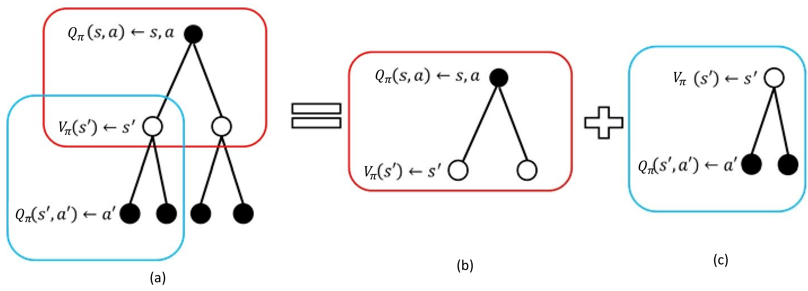

- 对于 $(c)$ ，通过 $\eqref{V=f(Q)}$ 计算，对叶子结点的累加，向上备份一层。可以将未来的动作价值 $s'$ 备份到上一层
- 对于 $(b)$ ，通过 $\eqref{Q=f(V)}$ 计算，对父节点的累加，再向上备份一层。可得到当前动作的价值 $s$ 
- 可得，$V(s)$ 的迭代式 $\eqref{BellmanExpEq_Q2}$

#### 贝尔曼期望方程收敛性证明

在使用 $\eqref{BellmanExpEq_V2}$ 与 $\eqref{BellmanExpEq_Q2}$ 计算价值函数前，还需要考虑一个问题，即迭代是否收敛的问题

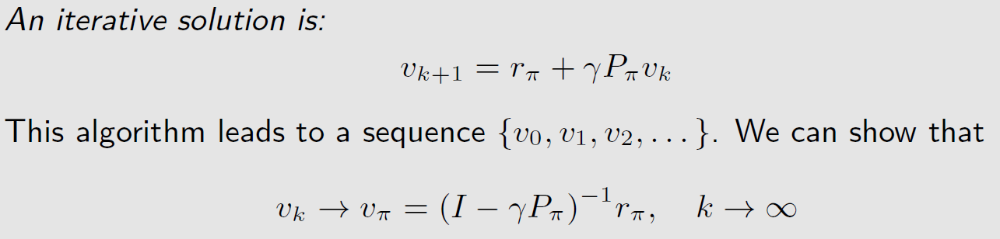

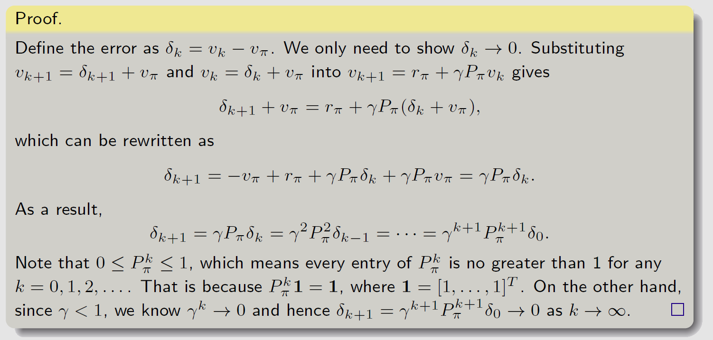

计算迭代解与数值解的误差，证明误差趋于0

#### 价值函数的计算

|      | 预测(策略评估)问题                                           | 控制问题                                                     |
| ---- | ------------------------------------------------------------ | ------------------------------------------------------------ |
| 定义 | 已知马尔科夫决策过程以及要采取的策略 $\pi$ ，计算最大价值函数 $V_{\pi}(s)$ 的过程就是策略评估，或(价值)预测 | 已知马尔科夫决策过程，在所有可能的策略中寻找一个最优的价值函数和最佳策略 |
| 输入 | 马尔科夫决策过程 $<S,A,P,R,\gamma>$ ；策略 $\pi$             | 马尔科夫决策过程 $<S,A,P,R,\gamma>$                          |
| 输出 | 价值函数 $V_{\pi}$                                           | 最佳价值函数 $V^{*}$ 和最佳策略 $\pi^*$                      |

在马尔科夫决策过程中，预测和控制二者是递进关系，通过解决预测问题进而解决控制问题。预测问题和控制问题都可以通过动态规划方法解决

##### MDP与动态规划

**动态规划(dynamic programming, DP)** 适合解决具有 **最优子结构(optimal substructure)** 和 **重叠子问题(overlapping subproblem)** 两个性质的问题

- 最优子结构：问题可由拆分成许多小问题，组合这些小问题的答案，能得到原问题的答案
- 重叠子问题：子问题出现多次，且子问题的解决方案能被重复使用

可以将贝尔曼期望方程分解为递归结构，即 $\eqref{BellmanExpEq_Q2}$ 与 $\eqref{BellmanExpEq_V2}$ 。未来状态的价值函数作为子问题的解与当前状态的价值函数是直接相关的。通过备份图，子问题的价值函数可以被存储并重用。

动态规划应用马尔科夫决策过程的 **规划** 问题，即环境是已知的，必须知道状态转移概率和对应的奖励

### 2.3.3 动态规划解决预测问题

**同步迭代** ：将贝尔曼期望备份(Bellman expection backup) 变为迭代过程，反复迭代直到收敛

- 每次迭代都会完全更新所有的状态
- **异步迭代** ：通过某种方式，使得每次迭代不需要更新所有状态

若 $\pi$ 为随机策略，当前状态下采取一个随机动作进入下一个状态，则由 $\eqref{BellmanExpEq_V2}$ 不断迭代，最后价值函数会收敛
$$
V_\pi^{(k)}(s)=\sum\limits_{a\in A}\pi(a\vert s)\left(R(s,a)+\gamma \sum\limits_{s'\in S}P(s'\vert s,a)\cdot V_\pi^{(k-1)}(s')\right)
$$
若 $\pi$ 为确定性策略，只要处于当前状态就采取一个确定动作从而进入下一状态，则贝尔曼决策过程变为一个贝尔曼奖励过程，可对 $\eqref{BellmanEquation}$ 迭代，最后价值函数会收敛
$$
V_\pi^{(k)}(s)=R(s,a)+\gamma P_\pi(s'\vert s)\cdot V_\pi^{(k-1)}(s')
$$

**网格世界例子**

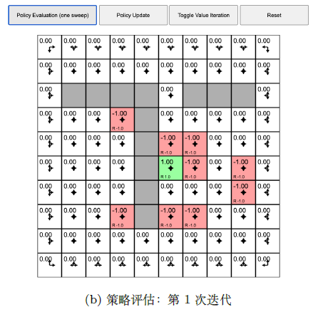

基于当前策略 $\pi$ 迭代一次后，正奖励涂绿一次，负奖励涂红一次

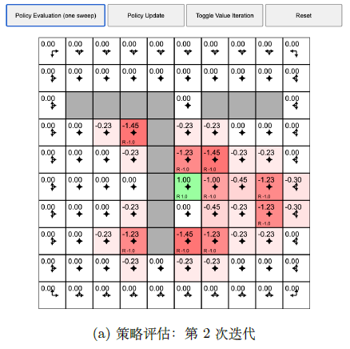

再次迭代，第一次策略评估的状态的周围状态有值，相当于周围状态可以转移到已知状态，所以策略评估每迭代一次，相当于状态价值备份图向上备份一次，周围状态的状态价值可以通过已知状态的状态价值得到

当多次迭代后，各个状态的奖励值都稳定下来，最后值会确定不变，收敛后每个状态的值就是它的状态价值

### 2.3.4 动态规划解决控制问题

若只有马尔科夫决策过程，解决控制问题相当于寻找最佳策略，从而得到最佳价值函数

#### 策略对比

对于两个策略 $\pi_1$ 和 $\pi_2$ ，计算在两个策略下每个状态的状态价值，若
$$
V_{\pi_1}(s)\ge V_{\pi_2}(s),s\in \mathcal{S}
$$
则称策略 $\pi_1$ 优于 $\pi_2$ 

#### 最优策略

最佳价值函数定义为
$$
V^*(s)=\max\limits_{\pi}V_{\pi}(s)
$$
最优策略指策略 $\pi^*$ ，能让该策略下所有状态的状态价值大于其他策略下所有状态的状态价值，即 $V_{\pi^*}(s)\ge V_{\pi}(s),s\in \mathcal{S}$ 。则称 $\pi^*$ 为最佳策略
$$
\pi^*=\mathop{\mathrm{argmax}}\limits_{\pi}V_\pi(s)
$$

##### 最优策略存在性——策略改进定理与贝尔曼最优方程

**当采取 $\mathop{\mathrm{argmax}}$ 操作时，会得到单调递增的 $V$ 与 $Q$ **  

对于一个确定性策略 $a=\pi(s)$ ，策略改进公式为
$$
\pi'(s)=\mathop{\mathrm{argmax}}_aQ_{\pi}(s,a)
$$
基于当前策略生成的最优动作的 $Q$ 值大于非最优动作的 $Q$ 值，且由于 $\pi$ 是一种确定性策略，当前状态下动作 $a$ 的概率 $\pi(a)=1$ ，故 $V_\pi(s)=\sum\limits_{a\in A}\pi(a\vert s)Q_{\pi}(s,a)\iff Q_{\pi}(s,a)$

$$
Q_{\pi}(s,\pi'(s))=\max\limits_{a\in \mathcal{A}}Q_{\pi}(s,a)\ge Q_{\pi}(s,\pi(s))=V_{\pi}(s)
$$

- 若 $\pi$ 是随机策略，则 $Q_{\pi}(s,\pi(s))$ 未必等于 $V_{\pi}(s)$ ，只有在 $Q_{\pi}(s,\pi'(s))\ge V_\pi(s)$ 的前提下，才有非递增性

基于策略 $\pi$ 生成的动作到达状态 $s$ ，此时采取的动作由 $\pi$ 生成，其 $Q$ 值表示为 $Q_\pi(s,\pi'(s))$ 。且 $R(s,a)$ 是 $s$ 与 $a$ 的函数，即策略 $\pi'$ 通过影响当前状态 $s$ 下的动作 $a$ 来影响奖励 $r_{t+1}$ ，故计算 $Q(s,\pi'(s))$ 时，期望为 $E_{\pi'}[G_{t}\vert s,\pi'(s)]$  
$$
\begin{aligned}
V_{\pi}(s)&\le Q_{\pi}(s,\pi'(s))\xlongequal{\eqref{BellmanExpEq_Q1}}E_{\pi'}\left[r_{t+1}+\gamma Q_{\pi}(s_{t+1},\pi'(s_{t+1}))\big\vert s_t=s,a_t=\pi'(s)\right]\\
&=E_{\pi'}\left[r_{t+1}+\gamma V_{\pi}(s_{t+1})\big\vert s_t=s\right]\\
&\le E_{\pi'}\left[r_{t+1}+\gamma Q_{\pi}(s_{t+1},\pi'(s_{t+1}))\big\vert s_t=s\right]\\
&\le E_{\pi'}\left[r_{t+1}+\gamma r_{t+2}+\gamma^2 Q_{\pi}(s_{t+2},\pi'(s_{t+2}))\big\vert s_t=s\right]\\
&\le \cdots\\
&\le E_{\pi'}\left[r_{t+1}+\gamma r_{t+2}+\gamma^2 r_{t+1}+\cdots)\big\vert s_t=s\right]=V_{\pi'}(s)
\end{aligned}
$$

不断迭代，直至收敛后，有
$$
Q_{\pi}(s,\pi'(s))=\max\limits_{a\in \mathcal{A}}Q_{\pi}(s,a)=Q_{\pi}(s,\pi(s))=V_\pi(s)
$$
因此，可得贝尔曼最优方程
$$
V_{\pi}(s)=\max\limits_{a\in \mathcal{A}}Q_{\pi}(s,a)\tag{BellmanOptimalityEq}\label{BellmanOptimalityEq}
$$
即最佳策略下的一个状态价值必须等于这个状态下采取最好动作获得的回报的期望，此时的状态价值为最佳状态价值

###### 贝尔曼最优方程求解

**修改：上述证明是确定性策略，改为随机性策略**

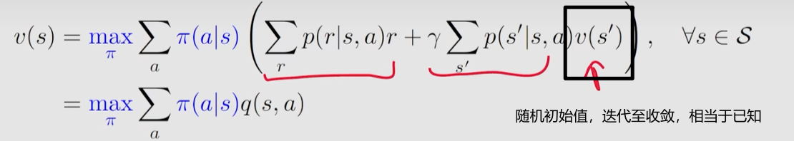

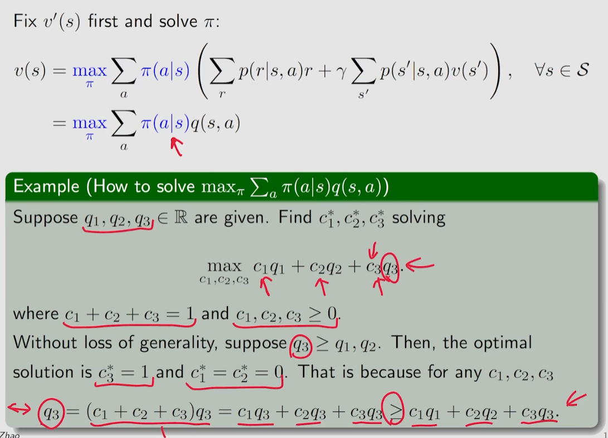

求解策略，相当于求解每个Q值的概率，即Q的权重

---

正式求解——不动点定理 **P13**

贝尔曼最优方程解(最优价值)的存在性——(不动点定理)收缩映射定理

解的唯一性(最优价值的唯一性)——收缩映射定理

- 存在多个策略获取最优价值

求解算法——价值迭代（受收映射定理启发）

最优性——最优价值和最优策略


**P14**

折扣因子的设定会影响策略选择，越大，越远视（选累积奖励大的，轨迹长）；越小，越短视(选短期奖励大的，轨迹短)


奖励值的设定-->状态价值,动作价值，对于最优策略的影响：取值的具体大小不会影响最优策略，取值的相对大小会影响最优策略的选择

- 对于绝对不安全的状态，惩罚值相对足够大，则策略生成的动作进入该状态的可能性越小


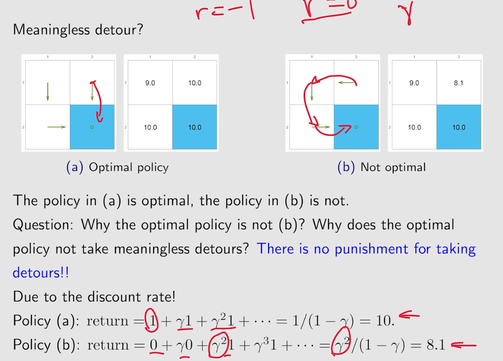

前提是中间状态的奖励都是0，并没有多走一步多一点惩罚，即绕路不会影响价值，但到达目标状态的最优策略仍选择最短路径，不选择绕路路径

最短路径的选择与奖励值、折扣因子的设置有关

折扣因子决定了绕路得到的状态价值会打折，希望更快地获取尽可能大的累计奖励(到达目标状态)


当MDP满足贝尔曼最优方程时，整个MDP已经到达最优状态 $\iff$ 只有当MDP收敛后，贝尔曼最优方程才会被满足


##### 最优策略唯一性


##### 策略的确定性/随机性


**若可得一个最佳价值函数，则认为MDP的环境可解** 

**最佳价值函数唯一** ，但可能有多个最佳策略取得相同的最佳价值

##### 最优策略的获取

当取得最佳价值函数后，当 $Q$ 函数收敛后，可以通过对 $Q^*(s,a)$ 的最大化来得到最佳策略。因为 $Q$ 函数是关于状态和动作的函数，若在当前状态 $s$ 采取某个动作 $a$ 后，使 $Q$ 最大化，则这个动作就是最佳动作
$$
\pi^*(a\vert s)=\begin{cases}
1,&a=\mathop{\mathrm{argmax}}\limits_{a\in A}Q^*(s,a)\\
0,&其他
\end{cases}
$$
最简单的策略搜索办法是 **穷举** 。假设动作和状态都是有限的，则共有 $\vert A\vert ^{\vert S\vert}$ 个可能的策略，基于每个策略，算出状态价值函数，取最大状态价值对应的策略即可。

但穷举法效率低，需要采取其他最佳策略搜索方法

- 策略迭代
- 价值迭代

#### 策略迭代

> 通过解决预测问题进而解决控制问题

1. 策略评估(预测)：给定当前的策略函数 $\pi$ 来估计状态价值函数 $V_\pi(s)$
2. 策略改进：得到状态价值函数后，进一步推算 $Q$ 函数。基于贪心思想，每个状态下取最大的 $Q$ 值，则最终可得到非递减的V值

上述步骤经过多轮迭代，状态价值函数和策略都会收敛

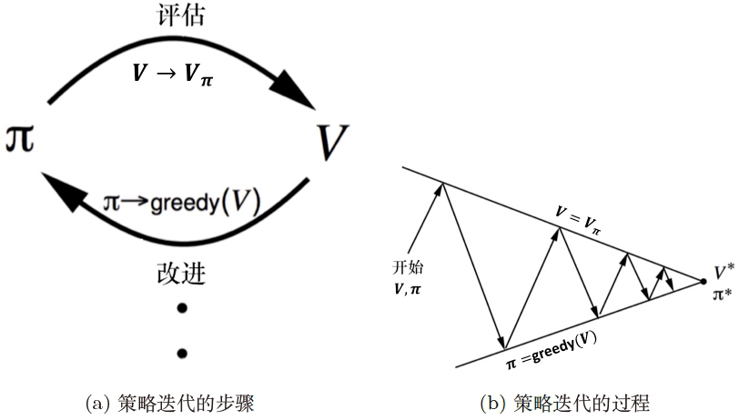

##### 策略改进步骤

通过 $\eqref{Q=f(V)}$ 来计算 $Q$ 函数
$$
Q_{\pi}(s,a)=R(s,a)+\gamma \sum\limits_{s'\in S}P(s'\vert s,a)\cdot V_{\pi}(s')
$$
同时，对于每个状态，通过 $\mathop{\mathrm{argmax}}$ 得到新一轮的策略
$$
\pi'(s)=\mathop{\mathrm{argmax}}\limits_{a} Q_{\pi}(s,a)
$$
Q表，计算每个状态下所有可能动作的 $Q$ 值，贪心地从第一个状态开始搜索每个状态下最大的 $Q$ 值进而更新策略

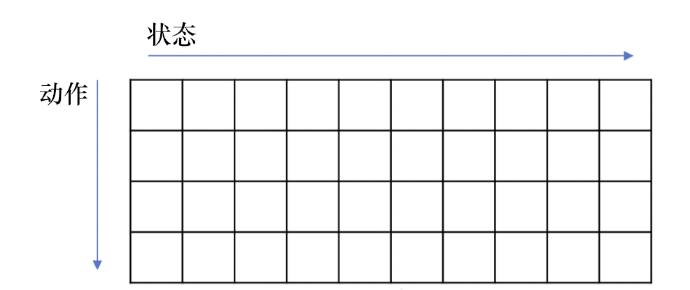


##### 应用——Qlearning

基于贝尔曼最优方程，当取Q值最大状态 ($\max\limits_{a'}Q^*(s',a')$) 时，由 $\eqref{BellmanExpEq_Q2}$ 
$$
Q_\pi^*(s)=R(s,a)+\gamma \sum\limits_{s'\in S}P(s'\vert s,a)\cdot \max\limits_{a'}Q^*(s',a')
$$

#### 价值迭代

##### 最优性原理

一个策略 $\pi(a\vert s)$ 在状态 $s$ 达到了最优价值( $V_\pi(s)=V^*(s)$ ) ，当且仅当对于任何能够从 $s$ 到达的状态 $s'$ ，都已经达到了最优价值，即对于所有的 $s'$ ，有 $V_\pi(s')=V^*(s')$ 恒成立——最优子结构

##### 确定性价值迭代

若知道子问题 $V^*(s')$ 的最优解，就可以通过价值迭代来得到最优的 $V^*(s)$ 的解，将 $\eqref{Q=f(V)}$ 代入 $\eqref{BellmanOptimalityEq}$ 
$$
\begin{align}
V^*(s)&=\max\limits_{a}Q^*(s,a)\\
&\xlongequal{Q=f(V)}\max\limits_{a}\left(R(s,a)+\gamma \sum\limits_{s'\in S}P(s'\vert s,a)\cdot V_{\pi^*}^*(s')\right)
\end{align}
$$
为了得到最佳的 $V^*$ ，对于每个状态的 $V$ ，直接将贝尔曼最优方程作为更新规则进行迭代，迭代多次后，价值函数就会收敛，这种价值迭代算法也被称为确定性价值迭代

1. 初始化：令 $k=1$ ，对所有状态 $s$ ，$V^{(0)}(s)=0$ 

2. 对于 $k=1$ ：$H$ ($H$是让 $V(s)$ 收敛所需的迭代次数)

   - 对于所有状态 $s$ 
     $$
     Q^{(k+1)}(s,a)=R(s,a)+\gamma \sum\limits_{s'\in S}P(s'\vert s,a)\cdot V^{(k)}(s')\\
     V^{(k+1)}(s)=\max\limits_{a}Q^{(k+1)}(s,a)
     $$

   - $k\leftarrow k+1$

3. 在迭代后提取最优策略
   $$
   \pi(s)=\mathop{\mathrm{argmax}}_a\left[R(s,a)+\gamma\sum\limits_{s'\in S}P(s'\vert s,a)V^{(H+1)}(s')\right]
   $$

价值迭代每次迭代只能影响与之直接相关的状态，工作过程类似于价值的反向传播，每次迭代做进一步传播，如果子问题的价值变好了，当前价值也会变得更好。

在未将每个状态的最优价值未传递给其他所有状态之前，中间的几个价值只是一种暂存的不完整的数据，不能代表每个状态的价值，所以基于中间过程的价值函数所生成的策略没有意义

##### 以最短路径为例

对于每个状态，都可以将其看最一个终点。每轮迭代，从每个状态开始根据贝尔曼最优方程重新计算价值。左上角为终点，每多走一步，价值越小。只有当 $V_7$ 收敛后，才能基于得到的最优价值来提取最佳策略

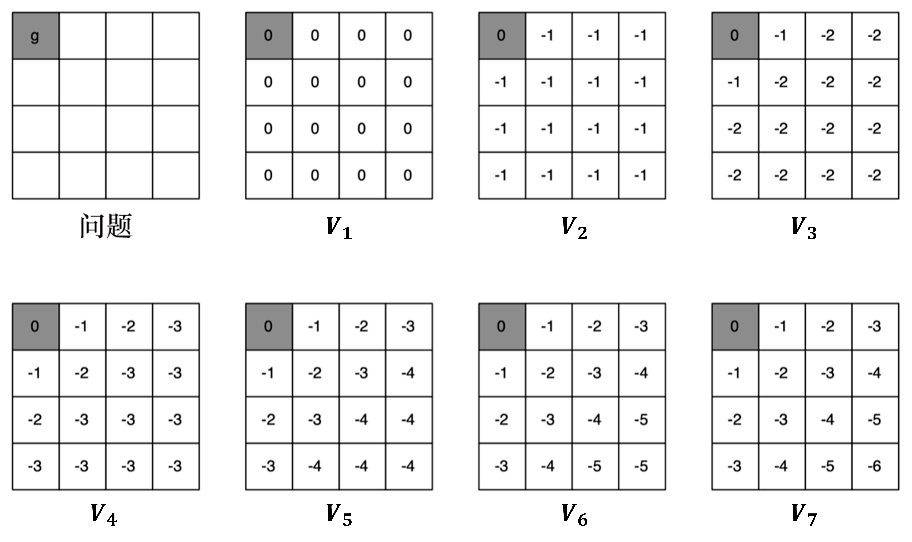

#### 策略迭代与策略迭代区别

网格世界初始化界面


**策略迭代**

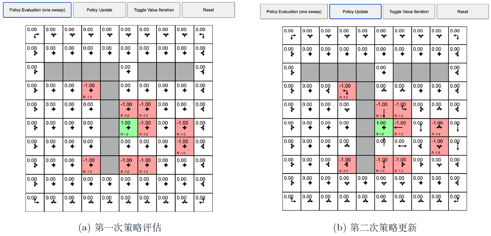

初始策略：每个状态采取固定的随机策略，每个状态可采取的各个动作等概率

第一次策略评估：每个状态都有一个价值函数

第一次策略改进：有些状态的策略已经发生改变

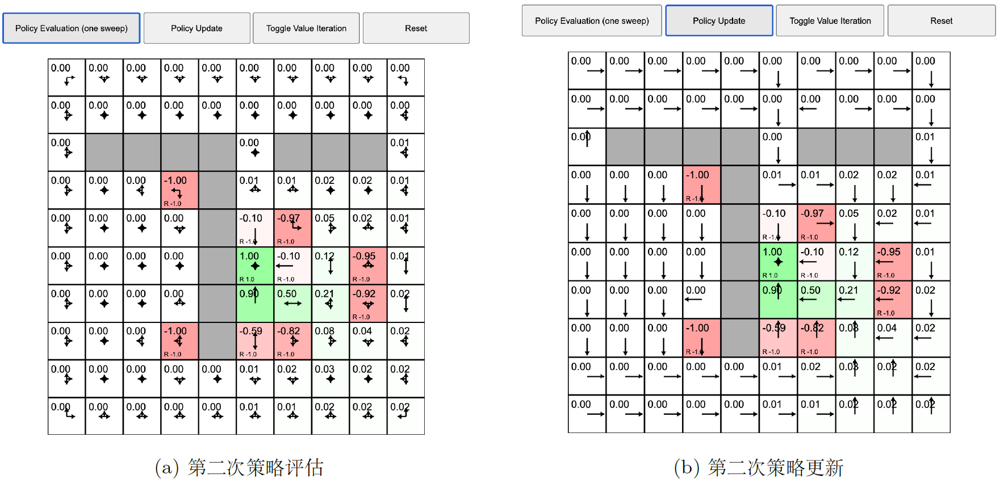

 第二次策略评估：在多次策略评估后，所有状态的价值函数收敛

第二次策略更新：每个状态会选择最佳策略来执行，不再是随机策略

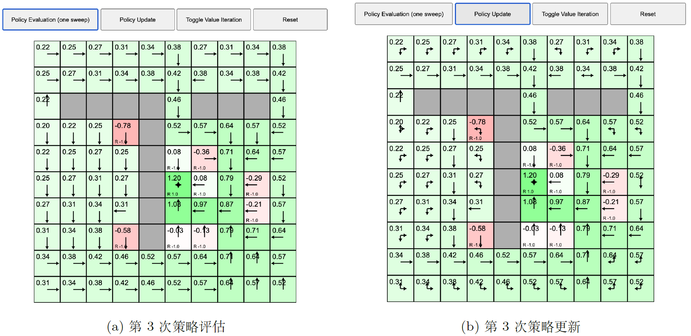

直至每个格子的值不再变化，说明整个MDP已经收敛

**价值迭代**


当价值迭代使状态价值收敛后，可提取最佳策略

价值迭代提取出的最佳策略与策略迭代得出的最佳策略一致

|            | 策略迭代                                                     | 价值迭代                                   |
| ---------- | ------------------------------------------------------------ | ------------------------------------------ |
| 算法       | 两步：策略评估；策略迭代                                     | 一步：价值迭代                             |
| 策略提取   | 不管在那个状态，都可以利用状态对应的最佳策略到达可以获得最多奖励的状态 | 基于中间过程的价值函数所生成的策略没有意义 |
| 贝尔曼方程 | 贝尔曼期望方程                                               | 贝尔曼最优方程                             |
|            | 实时策略，在线学习                                           | 非实时策略，离线学习                       |

