[TOC]

<!--more-->


## 1.3 实验

OpenAI的gym库是一个环境仿真库，其中包含了很多现有环境，针对不同的控制场景，可以选择不同的环境

- 离散控制场景：输出动作是可数的，一般用雅达利环境评估
- 连续控制场景：输出动作是不可数的，一般用MuJoCo环境评估

Gym  Retro是对gym库的进一步扩展，包含更多游戏

```shell
pip install gym==0.25.2

若能引入gym库，则安装成功
```

### gym中的强化学习框架

以Cart-Pole为例


动作空间：离散，向左、向右

结束标志：

- 任务失败：杆的角度大于某个角度(未保持平衡)，小车的中心到达图形界面窗口边缘
- 任务成功：累计步数大于200(成功)

目标：尽可能存活更多回合，即智能体的目的是控制杆，使其尽可能保持平衡以及尽可能保持在环境的中央

观测：小车当前位置，小车移动速度，杆的角度，杆的最高点的速度

- 观测越详细，就可以更好地描述当前所有的状态

奖励：多走一步，奖励加1

```python
import gym # 导入Gym 的Python 接口环境包
env = gym.make('CartPole-v0') # 构建实验环境
env.reset() # 重置一个回合
for _ in range(1000):
	env.render() # 显示图形界面
	action = env.action_space.sample() # 从动作空间中随机选取一个动作
	observation, reward, done, info = env.step(action) # 用于提交动作，括号内是具体的动作
env.close() # 关闭环境
# 直接关闭图形界面窗口可能会导致内存不能释放，甚至导致死机
```

- `env.action_space.sample()` ：在该游戏的动作空间中随机选择一个作为输出

- `env.step()` ：返回 $<observation,reward,done,info>$

  observation：状态信息，在游戏中观测到的屏幕像素值或者当前帧的状态描述信息

  reward：奖励值，动作提交后能获得的奖励值，对成功完成游戏有帮助的动作得到较高的奖励值

  done：表示游戏是否已经完成，若完成，则需要重置游戏并开始新的回合

  info：原始的调试信息

- `env.step()` 完成了一个完整的 $State\xrightarrow{Action} Reward\rightarrow S'$ 过程

  智能体得到某个观测后，会生成下一个动作，这个动作被环境执行进入下一个状态，返回新的观测、奖励及回合结束标志

#### gym中的env

```python
from gym import envs

env_spaces = envs.registry.all() #查看当前gym库已经注册了哪些环境
envs_ids=[env_spec.id for env_spec in env_specs]
```

每个环境都定义了自己的观测空间和动作空间。

环境env的观测空间用 `env.observation_space` 表示，动作空间用 `env.action_space` 表示

离散空间用 `gym.spaces.Discrete` 表示，连续空间用 `gym.spaces.Box` 类表示

- `Box(2,)` 表示观测可用2个 float 值表示

  Box类实例的成员 low,high 表示每个浮点数的取值范围

- `Discrete(n)` 表示动作取值 $0,\cdots,n-1$

```python
import gym
env = gym.make('MountainCar-v0')
print('动作空间= {}'. format(env.action_space))
print('动作数= {}'. format(env.action_space.n))

print('观测空间= {}'. format(env.observation_space))
print('观测范围= {} ~ {}'. format(env.observation_space.low,env.observation_space.high))

动作空间= Discrete(3)
动作数= 3
# 0表示向左走
# 2表示静止
# 1 表示向右走

观测空间= Box(2,) # 观测空间为 shape为(2,) 的np.array数组，即两个元素的一维数组
观测范围= [-1.2 -0.07] ~ [0.6 0.07]
# 第一个浮点数为位置 position 取值范围 [-1.2,0.6]
# 第二个浮点数为取值范围 velocity 取值范围 [-0.07,0.07]

env.reset()
array([-0.5169839,  0.       ], dtype=float32)
for _ in range(500):
	env.render()
    action = env.action_space.sample()
    observation, reward, done, info = env.step(action)
    print(observation)
env.close()
```


#### 智能体

实现智能体类

```python
class BespokeAgent:
	def __init__(self, env):
		pass
    
    def decide(self, observation): # 决策
		position, velocity = observation
		lb = min(-0.09 * (position + 0.25) ** 2 + 0.03,0.3 * (position + 0.9) ** 4 - 0.008)
		ub = -0.07 * (position + 0.38) ** 2 + 0.07
		
        if lb < velocity < ub:
			action = 2
		else:
			action = 0
		return action # 返回动作

    def learn(self, *args): # 学习
		pass

agent = BespokeAgent(env)
```

#### 智能体与环境交互

```python
def play_montecarlo(env, agent, render=False, train=False):
	episode_reward = 0. # 记录回合总奖励，初始化为0
	observation = env.reset() # 重置游戏环境，开始新回合
	while True: # 不断循环，直到回合结束
		if render: # 判断是否显示
			env.render() # 显示图形界面，图形界面可以用env.close() 语句关闭
		action = agent.decide(observation)
		next_observation, reward, done, _ = env.step(action) # 执行动作
		episode_reward += reward # 收集回合奖励
		if train: # 判断是否训练智能体
			agent.learn(observation, action, reward, done) # 学习
		if done: # 回合结束，跳出循环
			break
		observation = next_observation
        
	return episode_reward # 返回回合总奖励
```

- `render` ：在运行过程中是否要图形化显示，为 `True` 则调用 `env.render()` 显示图形化，通过 `env.close()` 关闭
- `train` ：在运行过程中是否训练智能体
  - 训练过程中设为 `True`
  - 测试过程中设为 `False`

返回值：`episode_reward` 返回回合奖励

#### 主函数

```python
env.seed(0)# 设置随机数种子,只是为了让结果可以精确复现,一般情况下可删去
episode_reward = play_montecarlo(env, agent, render=True) # 计算一回合奖励
print('回合奖励= {}'. format(episode_reward))

# 为评估智能体学习能力，会取100次性能平均值
episode_rewards = [play_montecarlo(env, agent) for _ in range(100)]
print('回合奖励= {}'. format(np.mean(episode_rewards))

env.close() # 此语句可关闭图形界面
```


## 2.3 马尔科夫决策过程

#### 最优策略

##### 贝尔曼最优方程——求最优价值函数

###### 收缩映射定理应用于求解贝尔曼最优方程

1. 证明 $v=f(v)$ 满足收缩映射定理

2. 存在性，唯一性，求解算法

   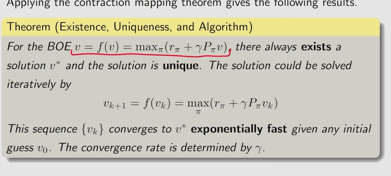

求解过程

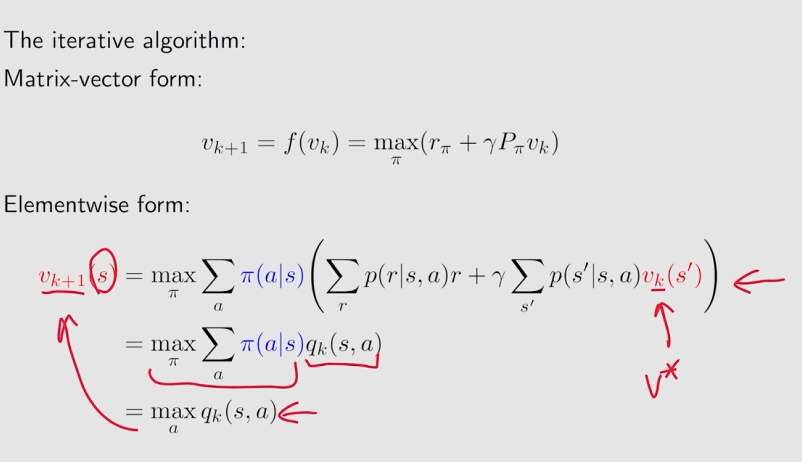

求解算法

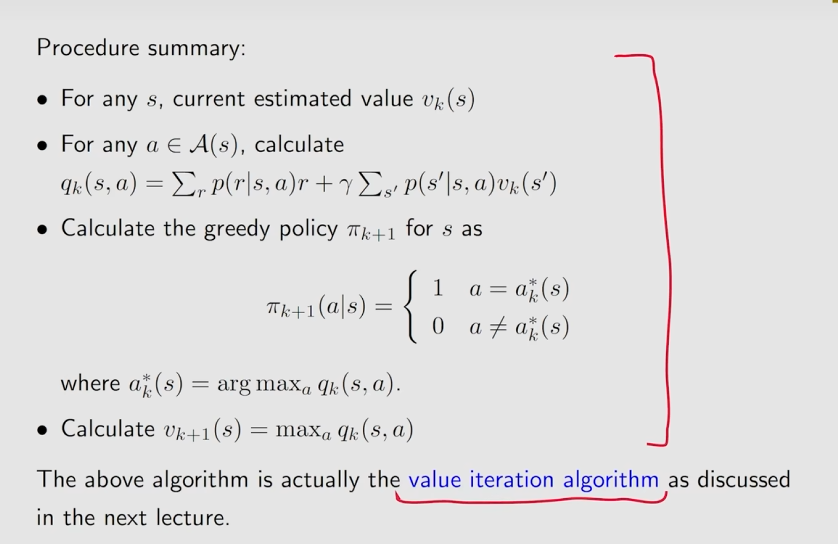

---

求解贝尔曼最优方程算法的示例

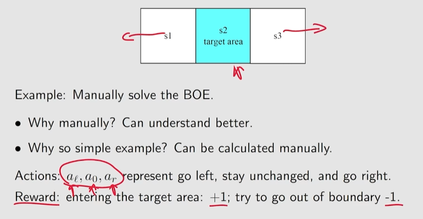

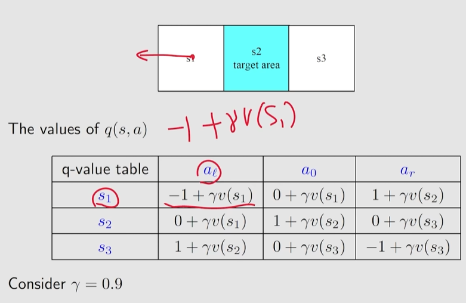

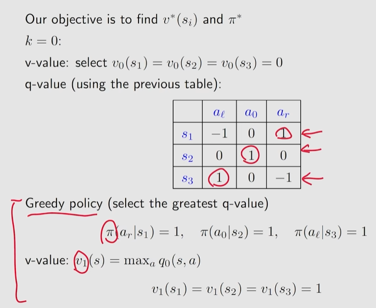

- 指定随机初始值 $V^{(0)}(s_1),V^{(0)}(s_2),V^{(0)}(s_3)$ 
- 利用初始的状态价值计算Q值
- 贪心算法更新策略，贝尔曼最优方程 更新状态价值

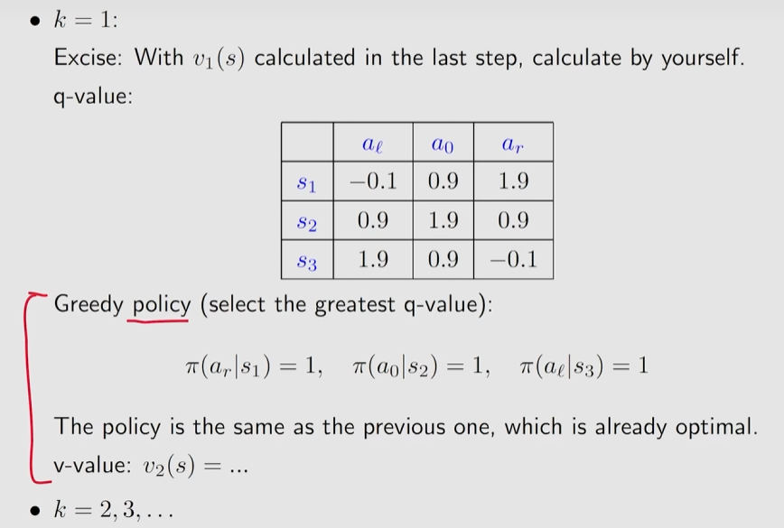

终止条件

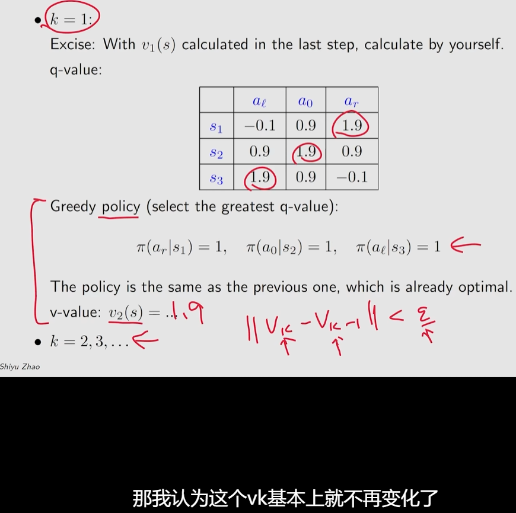

###### 贝尔曼最优方程解的最优性

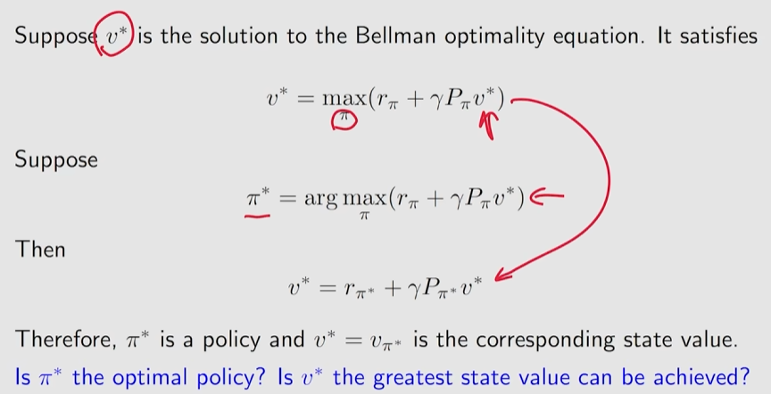

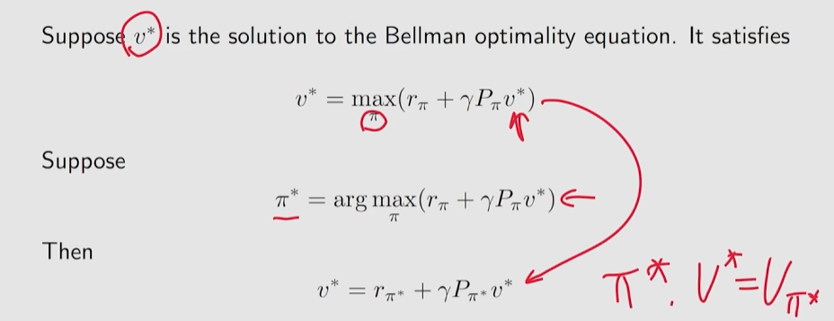

通过上述算法求解贝尔曼最优方程，进而可得出状态价值对应的策略

将其代入贝尔曼方程---

贝尔曼最优方程是一个特殊的贝尔曼方程，其策略是一个最优的策略

证明最优性

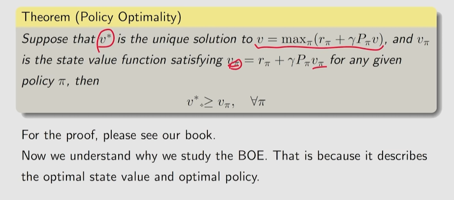

最优策略形式：

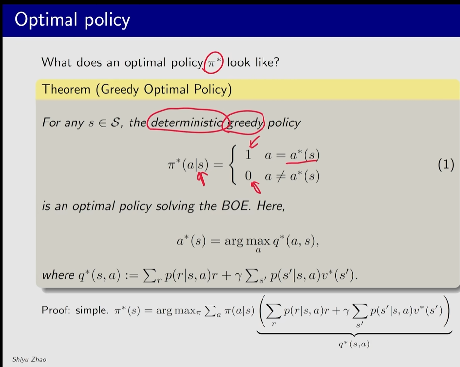


##### 最优策略的影响因素


- 系统模型——P（一般很难改变，一般不作为最优策略影响因素）

- 折扣因子：折扣因子的设定会影响策略选择，越大，越远视，更重视未来的奖励（选累积奖励大的，轨迹长）；越小，越短视(选短期奖励大的，轨迹短)，得到的回报主要是由近期的奖励决定

  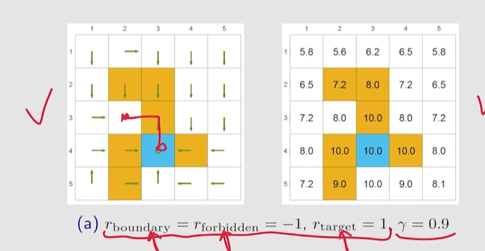

  0.5时，会选择比较绕远的路径，避开惩罚大的区域

  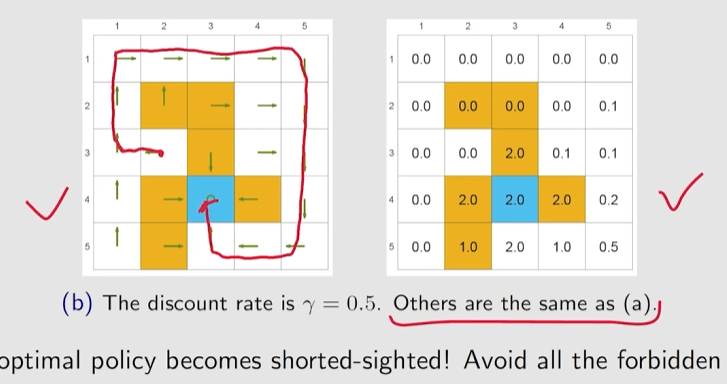

  

  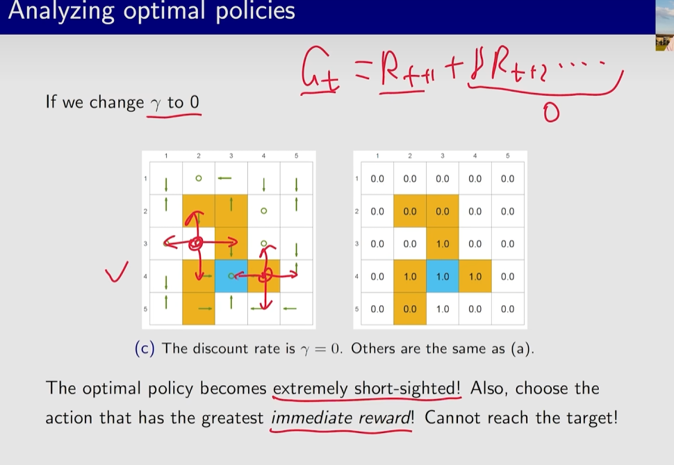

  0时，只看一步，策略非常不好 

- 奖励设置：奖励值的设定-->状态价值,动作价值，对于最优策略的影响：取值的具体大小不会影响最优策略，取值的相对大小会影响最优策略的选择

  - 对于绝对不安全的状态，惩罚值相对足够大，则策略生成的动作进入该状态的可能性越小

  在 $\gamma=0.9$ 时，可以对禁入区域设置更大的惩罚，也可以避免进入禁入区域

  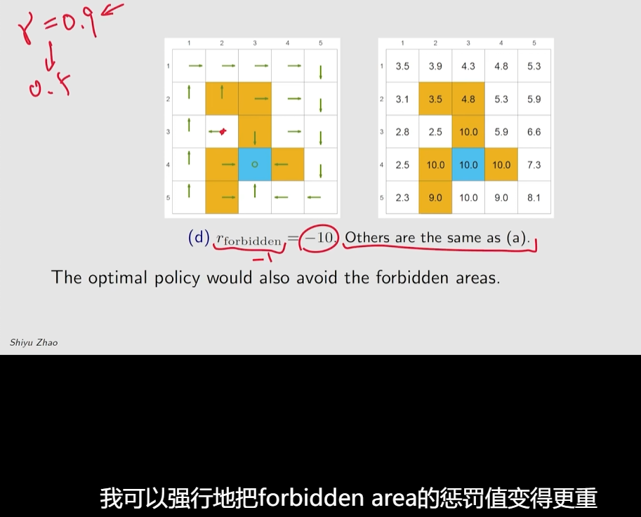

##### 最优策略的不变性

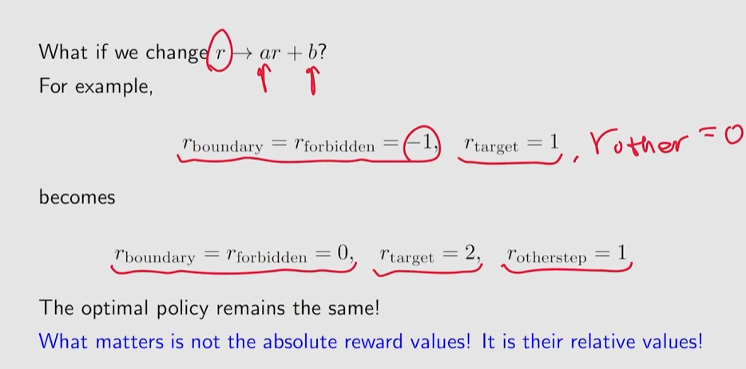

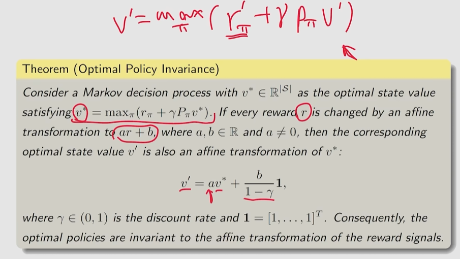

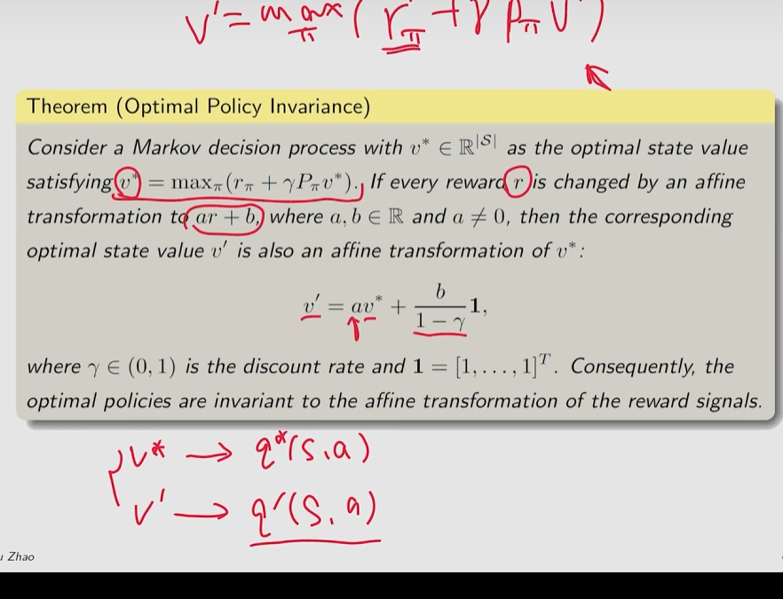

最优策略选择最优动作时，只会比较Q值的相对大小，选出Q值最大的动作，不会关注Q值具体有多大

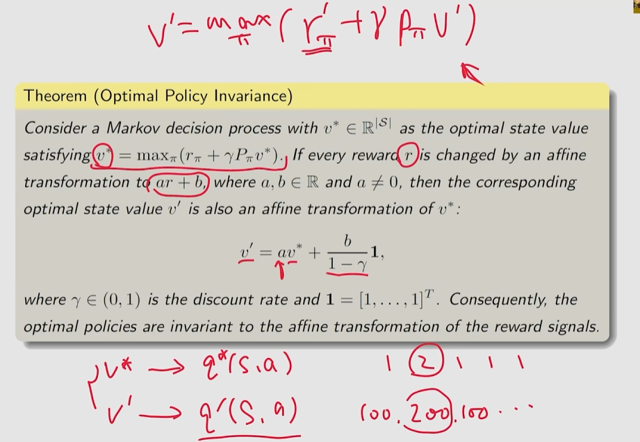

##### 最短路径

前提是中间状态的奖励都是0，并没有多走一步多一点惩罚，即绕路不会影响价值，但到达目标状态的最优策略仍选择最短路径，不选择绕路路径


最短路径的选择与奖励值、折扣因子的设置有关

并不一定要将奖励设置为-1，即每多走一步都有损耗才能更快获得最短路径，当其余步骤奖励设为0调整折扣因子，也会对路径有影响


折扣因子决定了绕路得到的状态价值会打折，希望更快地获取尽可能大的累计奖励(到达目标状态)

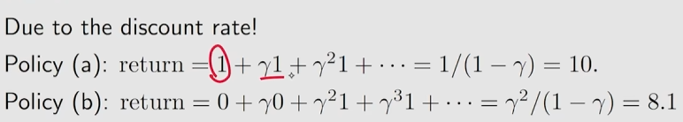


当MDP满足贝尔曼最优方程时，整个MDP已经到达最优状态 $\iff$ 只有当MDP收敛后，贝尔曼最优方程才会被满足


**若可得一个最佳价值函数，则认为MDP的环境可解** 

**最佳价值函数唯一** ，但可能有多个最佳策略取得相同的最佳价值

##### 最优策略的获取

当取得最佳价值函数后，当 $Q$ 函数收敛后，可以通过对 $Q^*(s,a)$ 的最大化来得到最佳策略。因为 $Q$ 函数是关于状态和动作的函数，若在当前状态 $s$ 采取某个动作 $a$ 后，使 $Q$ 最大化，则这个动作就是最佳动作
$$
\pi^*(a\vert s)=\begin{cases}
1,&a=\mathop{\mathrm{argmax}}\limits_{a\in A}Q^*(s,a)\\
0,&其他
\end{cases}
$$
最简单的策略搜索办法是 **穷举** 。假设动作和状态都是有限的，则共有 $\vert A\vert ^{\vert S\vert}$ 个可能的策略，基于每个策略，算出状态价值函数，取最大状态价值对应的策略即可。

但穷举法效率低，需要采取其他最佳策略搜索方法

- 策略迭代
- 价值迭代

#### 策略迭代

> 通过解决预测问题进而解决控制问题

1. 策略评估(预测)：给定当前的策略函数 $\pi$ 来估计状态价值函数 $V_\pi(s)$
2. 策略改进：得到状态价值函数后，进一步推算 $Q$ 函数。基于贪心思想，每个状态下取最大的 $Q$ 值，则最终可得到非递减的V值

上述步骤经过多轮迭代，状态价值函数和策略都会收敛


##### 策略改进步骤

通过 $\eqref{Q=f(V)}$ 来计算 $Q$ 函数
$$
Q_{\pi}(s,a)=R(s,a)+\gamma \sum\limits_{s'\in S}P(s'\vert s,a)\cdot V_{\pi}(s')
$$
同时，对于每个状态，通过 $\mathop{\mathrm{argmax}}$ 得到新一轮的策略
$$
\pi'(s)=\mathop{\mathrm{argmax}}\limits_{a} Q_{\pi}(s,a)
$$
Q表，计算每个状态下所有可能动作的 $Q$ 值，贪心地从第一个状态开始搜索每个状态下最大的 $Q$ 值进而更新策略


##### 应用——Qlearning

基于贝尔曼最优方程，当取Q值最大状态 ($\max\limits_{a'}Q^*(s',a')$) 时，由 $\eqref{BellmanExpEq_Q2}$ 
$$
Q_\pi^*(s)=R(s,a)+\gamma \sum\limits_{s'\in S}P(s'\vert s,a)\cdot \max\limits_{a'}Q^*(s',a')
$$

#### 价值迭代

##### 最优性原理

一个策略 $\pi(a\vert s)$ 在状态 $s$ 达到了最优价值( $V_\pi(s)=V^*(s)$ ) ，当且仅当对于任何能够从 $s$ 到达的状态 $s'$ ，都已经达到了最优价值，即对于所有的 $s'$ ，有 $V_\pi(s')=V^*(s')$ 恒成立——最优子结构

##### 确定性价值迭代

若知道子问题 $V^*(s')$ 的最优解，就可以通过价值迭代来得到最优的 $V^*(s)$ 的解，将 $\eqref{Q=f(V)}$ 代入 $\eqref{BellmanOptimalityEq}$ 
$$
\begin{align}
V^*(s)&=\max\limits_{a}Q^*(s,a)\\
&\xlongequal{Q=f(V)}\max\limits_{a}\left(R(s,a)+\gamma \sum\limits_{s'\in S}P(s'\vert s,a)\cdot V_{\pi^*}^*(s')\right)
\end{align}
$$
为了得到最佳的 $V^*$ ，对于每个状态的 $V$ ，直接将贝尔曼最优方程作为更新规则进行迭代，迭代多次后，价值函数就会收敛，这种价值迭代算法也被称为确定性价值迭代

1. 初始化：令 $k=1$ ，对所有状态 $s$ ，$V^{(0)}(s)=0$ 

2. 对于 $k=1$ ：$H$ ($H$是让 $V(s)$ 收敛所需的迭代次数)

   - 对于所有状态 $s$ 
     $$
     Q^{(k+1)}(s,a)=R(s,a)+\gamma \sum\limits_{s'\in S}P(s'\vert s,a)\cdot V^{(k)}(s')\\
     V^{(k+1)}(s)=\max\limits_{a}Q^{(k+1)}(s,a)
     $$

   - $k\leftarrow k+1$

3. 在迭代后提取最优策略
   $$
   \pi(s)=\mathop{\mathrm{argmax}}_a\left[R(s,a)+\gamma\sum\limits_{s'\in S}P(s'\vert s,a)V^{(H+1)}(s')\right]
   $$

价值迭代每次迭代只能影响与之直接相关的状态，工作过程类似于价值的反向传播，每次迭代做进一步传播，如果子问题的价值变好了，当前价值也会变得更好。

在未将每个状态的最优价值未传递给其他所有状态之前，中间的几个价值只是一种暂存的不完整的数据，不能代表每个状态的价值，所以基于中间过程的价值函数所生成的策略没有意义

##### 以最短路径为例

对于每个状态，都可以将其看最一个终点。每轮迭代，从每个状态开始根据贝尔曼最优方程重新计算价值。左上角为终点，每多走一步，价值越小。只有当 $V_7$ 收敛后，才能基于得到的最优价值来提取最佳策略


#### 策略迭代与策略迭代区别

网格世界初始化界面


**策略迭代**


初始策略：每个状态采取固定的随机策略，每个状态可采取的各个动作等概率

第一次策略评估：每个状态都有一个价值函数

第一次策略改进：有些状态的策略已经发生改变


 第二次策略评估：在多次策略评估后，所有状态的价值函数收敛

第二次策略更新：每个状态会选择最佳策略来执行，不再是随机策略


直至每个格子的值不再变化，说明整个MDP已经收敛

**价值迭代**


当价值迭代使状态价值收敛后，可提取最佳策略

价值迭代提取出的最佳策略与策略迭代得出的最佳策略一致

|            | 策略迭代                                                     | 价值迭代                                   |
| ---------- | ------------------------------------------------------------ | ------------------------------------------ |
| 算法       | 两步：策略评估；策略迭代                                     | 一步：价值迭代                             |
| 策略提取   | 不管在那个状态，都可以利用状态对应的最佳策略到达可以获得最多奖励的状态 | 基于中间过程的价值函数所生成的策略没有意义 |
| 贝尔曼方程 | 贝尔曼期望方程                                               | 贝尔曼最优方程                             |
|            | 实时策略，在线学习                                           | 非实时策略，离线学习                       |

