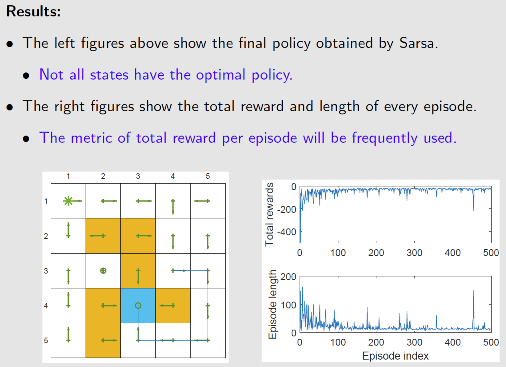
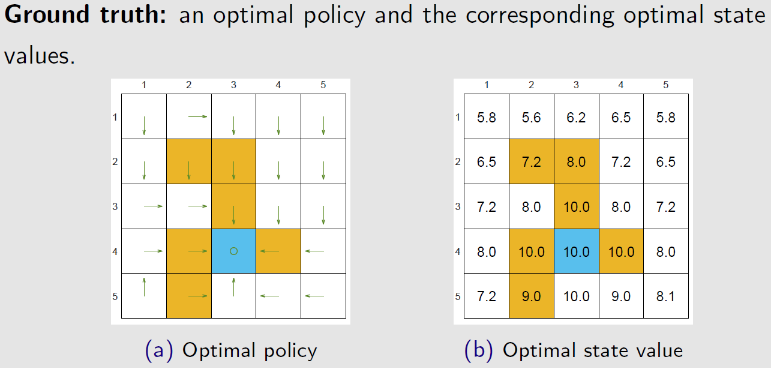
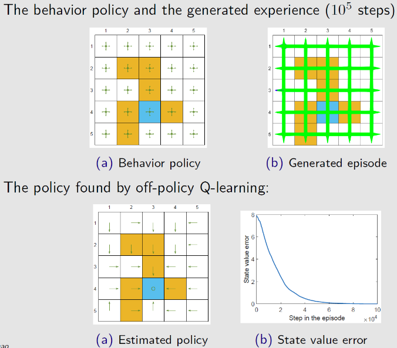
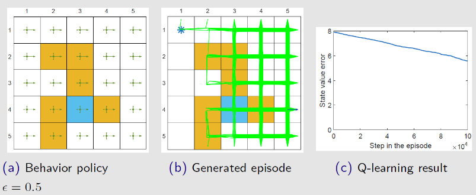
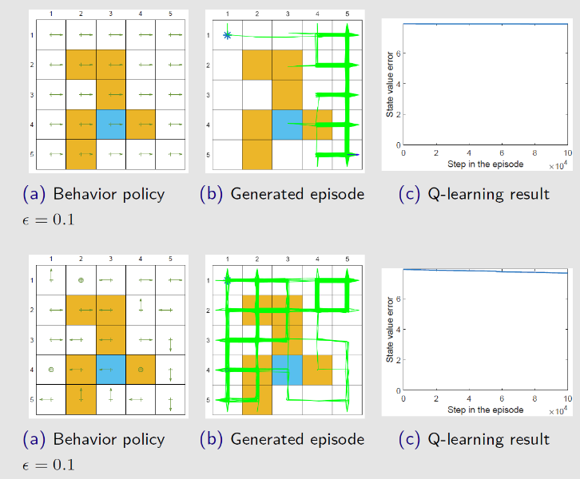

策略最简单的表示方法是查找表，即表格型策略，使用表格型策略的强化学习方法称为表格型方法

- Q-learning
- Sarsa

<!--more-->

# Q表

Q表：状态-价值表

Q函数的意义是计算在某个状态下选择某个动作，未来能够获得多少总奖励

如果可以预估未来的总奖励的大小，我们就知道在当前的状态下选择哪个动作未来获取的累积价值更高。

### 为何用未来奖励评估当前动作好坏

在现实世界中奖励往往是延迟的，所以强化学习需要学习长期的奖励。对于MDP，我们一般会从当前状态开始，把后续有可能收到的奖励求期望作为当前动作的 $Q$ 值，代表当前状态下动作的真正价值

但多长时间的奖励算“长期”，如果任务很快就结束，考虑到最后一步的奖励无可厚非。但如果任务是一个持续的没有尽头的任务，我们做不到将未来全部的奖励相加作为当前状态的价值。所以我们引入折扣因子 $\gamma$ 来计算未来总奖励，$\gamma\in [0,1]$ ，$\gamma^n$ 越往后越小，即越后面的奖励对当前状态价值的影响就越小

若 $\gamma=0$ ，则只考虑单步的奖励，认为是一种目光短浅的算法

若 $\gamma=1$ ，则相当于将后续所有奖励都加起来，认为是一种目光过于长远的算法

## 基于DP的有模型预测与控制

### 策略迭代

> 计算一个MDP的最优策略与最佳价值函数

策略评估(预测)：迭代贝尔曼期望方程
$$
V^{(k)}(s)=\sum\limits_{a\in \mathcal{A}}\pi(a\vert s)\left(R(s,a)+\gamma\sum\limits_{s'\in \mathcal{S}}P(s'\vert s,a)V^{(k-1)}(s')\right)
$$
策略改进：贪心 $\pi(a\vert s)=greedy(Q(s,a))$
$$
Q_{\pi^{(k)}}(s,a)=R(s,a)+\gamma \sum\limits_{s'\in S}P(s'\vert s,a)\cdot V_{\pi^{(k-1)}}(s')\\
\pi^{(k+1)}(a\vert s)=\mathop{\mathrm{argmax}}_aQ_{\pi^{(k)}}(s,a)
$$

### 价值迭代

> 计算一个MDP的最优价值函数

当获得最优价值函数时，满足贝尔曼最优方程
$$
\begin{align}
V^*(s)&=\max\limits_{a}Q^*(s,a)\\
&\xlongequal{Q=f(V)}\max\limits_{a}\left(R(s,a)+\gamma \sum\limits_{s'\in S}P(s'\vert s,a)\cdot V_{\pi^*}^*(s')\right)
\end{align}
$$
迭代贝尔曼最优方程，直至收敛
$$
V_{\pi^{(k+1)}}(s)\leftarrow\max\limits_{a\in\mathcal{A}}\left(R(s,a)+\gamma\sum\limits_{s'\in\mathcal{S}}P(s'\vert s,a)V_{\pi^{(k)}}(s')\right)
$$
当获取到最优价值函数时，贪心获取最佳策略
$$
\pi^*(a\vert s)=\mathop{\mathrm{argmax}}_a \left(R(s,a)+\gamma\sum\limits_{s'\in\mathcal{S}}P(s'\vert s,a)V_{\pi^{(H)}}(s')\right)
$$

# 免模型预测

在无法获取MDP模型的情况下，可以通过蒙特卡洛方法和时序差分方法来估计某个给定策略的价值

## 蒙特卡洛方法

### 整体思路

蒙特卡洛是基于采样的方法，给定策略 $\pi$ ，让智能体与环境交互，可以得到很多轨迹。在回合结束后，计算每条轨迹的回报
$$
G_t=r_{t+1}+\gamma r_{t+2}+\gamma^2 r_{t+3}\cdots
$$
求出这些轨迹的回报的期望，就可以知道某一策略下的某个状态的价值
$$
V_{\pi}(s)=E_{\tau\sim \pi}[G_t\vert s_t=s]
$$
蒙特卡洛方法使用 **经验评估回报** 的方法估计奖励，这样就不需要MDP中的状态转移函数与奖励函数。但蒙特卡洛方法的局限性是必须用在有终止的马尔科夫决策过程中。

### 具体步骤

1. 在每个回合中，若 $t$ 时刻状态 $s$ 被访问了，则
   - 状态 $s_t$ 的访问数 $N(s_t)$ 增加1，$N(s_t)\leftarrow N(s_t)+1$
   - 状态 $s_t$ 的总回报 $S(s_t)$ 增加 $G_t$ ，$S(s_t)\leftarrow S(s_t)+G_t$
2. 状态 $s_t$ 的价值通过回报的平均来估计，即 $V(s_t)=\frac{V(s_t)}{N(s_t)}$

根据大数定律，只要有足够多的轨迹，就可以趋近这个策略对应的价值函数。当 $N(s_t)\rightarrow \infty$ 时，$V(s_t)\rightarrow V_{\pi}(s_t)$

### 增量式蒙特卡洛

#### 增量式均值

假设有一批样本 $x_1,x_2,\cdots,x_t$ ，可以将经验均值转换为增量均值的形式
$$
\begin{aligned}
\mu_t&=\frac{1}{t}\sum\limits_{j=1}^tx_j\\
&=\frac{1}{t}\left(x_t+\sum\limits_{j=1}^{t-1}x_j\right)\\
&=\frac{1}{t}[x_t+(t-1)\mu_{t-1}]\\
&=\frac{1}{t}(x_t+t\mu_{t-1}-\mu_{t-1})\\
&=\mu_{t-1}+\frac{1}{t}(x_t-\mu_{t-1})
\end{aligned}
$$
通过增量式均值，可以将当前时刻的均值与上一时刻的均值关联起来。当我们得到新的数据 $x_t$ 时，就可以用上一时刻的值来更新现在的值

- $x_t-\mu_{t-1}$ ：残差
- $\frac{1}{t}$ ：学习率

#### 增量式蒙特卡洛方法

可以将蒙特卡洛方法更新的方式改为增量式蒙特卡洛(incremental MC)

若现在有一个轨迹 $(s_1,a_1,r_1,s_2,\cdots,s_t)$ ，可以用增量的方法更新状态价值
$$
N(s_t)\leftarrow N(s_t)+1\\
V(s_t)\leftarrow V(s_t)+\frac{1}{N(s_t)}(G_t-V(s_t))
$$
若将 $\frac{1}{N(s_t)}$ 变为 $\alpha$ 学习率，即
$$
V(s_t)\leftarrow V(s_t)+\alpha(G_t-V(s_t))
$$
其中，$\alpha$ 代表更新的速率，可以将其作为超参数设置

### DP与MC方法的总结与对比

**DP**

- 使用了自举的思想，基于之前估计的量来估计一个量

- 使用贝尔曼期望备份，通过上一时刻的 $V^{(k-1)}(s)$ 来更新当前时刻的 $V^{(k)}(s)$
  $$
  V^{(k)}(s)\leftarrow \sum\limits_{a\in \mathcal{A}}\pi(a\vert s)\left(R(s,a)+\gamma\sum\limits_{s'\in \mathcal{S}}P(s'\vert s,a)V^{(k-1)}\right)
  $$
  将其不断迭代，最后可以收敛

贝尔曼期望备份有两层加和，即内部加和与外部加和，计算两次期望，更新一次

**MC**

通过一个回合的经验平均回报(实际得到的奖励)来进行更新，即
$$
V^{(k)}(s_t)\leftarrow V^{(k-1)}(s_t)+\alpha\left(G_t^{(k)}-V^{(k-1)}(s_t)\right)
$$
MC方法得到的轨迹对应树上蓝色的轨迹，轨迹上的状态已经是确定的，采取的动作也是确定的，现在只更新这条轨迹上的所有状态，与这条轨迹无关的状态不更新

#### 对比

|              | DP                    | MC         |
| ------------ | --------------------- | ---------- |
| 环境是否已知 | 只适用于环境已知的MDP | 都适用     |
| 更新部分     | 全部更新              | 局部更新   |
| 迭代速度     | 更新速度慢            | 更新速度快 |

## 时序差分方法

时序差分方法的目的是对于某个给定的策略 $\pi$ ，在线的计算出它的价值函数 $V_{\pi}$ ，即一步一步地算。

时序差分方法是一种介于蒙特卡洛方法和动态规划方法中间的免模型方法，不需要MDP中的状态转移矩阵与奖励函数。时序差分方法可以从不完整的回合中学习，并且结合了自举的思想。

### 一步时序差分

每走一步更新一次Q表(做一步自举)，用得到的估计回报 $r_{t+1}+\gamma V(s_{t+1})$ 来更新上一时刻的值 $V(s_t)$ ，这种单步更新的方法称为一步时序差分，即 $TD(0)$ 
$$
V(s_t)\leftarrow V(s_t)+\alpha(r_{t+1}+\gamma V(s_{t+1})-V(s_t))
$$

- 估计回报 $r_{t+1}+\gamma V(s_{t+1})$ 称为时序差分目标，带衰减的下一状态价值的和
  - 时序差分目标相当于对回报的采样
  - 使用当前估计的 $V$ 而不是真实的 $V_{\pi}$

- 时序差分误差 $\delta=r_{t+1}+\gamma V(s_{t+1})-V(s_t)$ 

  类比蒙特卡洛方法，给定一个回合 $k$ ，可以更新 $V(s_t)$ 来逼近真实的回报 $G_t$ 
  $$
  V(s_t)\leftarrow V(s_t)+\alpha(G^{(k)}_t-V(s_t))
  $$
  在MC方法中，$G_{t}^{(k)}$ 是可计算的值，因为一个回合已经完成了，可以算出每个状态实际的回报

  在TD方法中，不等回合结束，只执行一步，状态的价值就会更新

### n步时序差分

利用两步得到的回报，使用自举来更新状态的价值
$$
\begin{array}{ll}
n=1(TD)&G_{1,t}=r_{t+1}+\gamma V(s_{t+1})\\
n=2&G_{2,t}=r_{t+1}+\gamma r_{t+2}+\gamma^2 V(s_{t+2})\\
&\vdots\\
n=n&G_{n,t}=r_{t+1}+\gamma r_{t+2}+\gamma^2r_{t+3}+\cdots+\gamma^{n-1}r_{t+n}+\gamma^n V(s_{t+n})\\
&\vdots\\
n=\infty(MC)&G_{\infty,t}=r_{t+1}+\gamma r_{t+2}+\cdots+\gamma^{T-t-1}r_T
\end{array}
$$

在得到时序差分目标之后，可以用增量式学习的方法来更新状态的价值
$$
V(s_t)\leftarrow V(s_t)+\alpha\left(G_{n,t}-V(s_t)\right)
$$

## TD与MC对比

|                  | TD                                                           | MC                                                           |
| ---------------- | ------------------------------------------------------------ | ------------------------------------------------------------ |
| 是否支持在线     | 支持在线学习，也可离线学习                                   | 只能离线学习                                                 |
| 数据序列是否完整 | 可以从不完整系列上学习，以采样的方式得到不完整的状态序列，估计某状态在该状态序列完整后可能得到的状态价值，并通过不断地采样持续更新价值以逼近真实的期望  | 只能从完整的序列上学习，在经历完整的状态序列后，再来更新状态的真实价值  |
| 序列是否有限     | 可以在连续的环境下(无终止)进行学习                           | 只能在有终止的情况下学习                                     |
| 马尔科夫性质     | 利用了马尔科夫性质                                           | 适用于非马尔科夫环境                                         |

## DP、MC、TD的自举和采样

自举：更新时用了估计的方法

- MC没有使用
- DP、TD都使用了自举

采样：通过采样来获取期望

- MC方法是纯采样的方法
- DP完全没用采样，直接用贝尔曼方程更新状态价值
- TD使用了采样逼近真实回报

DP算法在已知所有状态转换的情况下，可以把所有的状态都进行加和
$$
V(s_t)\leftarrow E_{\pi}[r_{t+1}+\gamma V(s_{t+1})\vert s_t=s]
$$

MC在当前的状态下，采取一条支路，在回合完成后，更新这条支路上的所有状态价值
$$
V(s_t)\leftarrow V(s_t)+\alpha(G_t-V(s_t))
$$

TD从当前状态开始，往前走了一步，关注的是局部更新
$$
TD(0):V(s_t)\leftarrow V(s_t)+\alpha(r_{t+1}+\gamma V(s_{t+1})-V(s_t))
$$

### 四种计算价值函数的方法

# 免模型控制

策略迭代分两个步骤

1. 根据给定的当前策略 $\pi$ 来估计价值函数
   $$
   V_{\pi}(s)=\sum\limits_{s'\in S}\pi(a\vert s)\cdot Q_{\pi}(s,a)\\
   Q_{\pi}(s,a)=R(s,a)+\gamma\sum\limits_{s'\in\mathcal{S}}P(s'\vert s,a)V_{\pi}(s')
   $$

2. 得到估计的价值函数后，通过贪心的方法来改进策略
   $$
   \pi'=greedy(V_{\pi})
   $$

但由于在很多实际任务中，MDP的环境并不是可知的，即状态转移函数 $P(s'\vert s,a)$ 及奖励函数 $R(s,a)$ 是未知的

所以将策略迭代进行广义推广，得到 **广义策略迭代** (generalized policy iteration,GPI)，将蒙特卡洛方法或时序差分方法引入策略评估来计算当前策略的价值函数 $Q$ ，可以在不知道MDP环境的情况下，完成价值函数的优化并得到最佳策略，实现免模型控制

## 基于MC方法的免模型控制

### 探索性开始

一个保证策略迭代收敛的假设是回合有探索性开始。假设每个回合都有一个探索性开始，能保证所有的状态和动作在无限步的执行后能被采样到，即一定会出现包含该起始状态的轨迹

### MC方法的策略评估

蒙特卡洛思想是通过很多轨迹的价值均值取估计Q函数，当轨迹数量足够多时，这个均值趋于收敛，则可以生成Q表。进而使用策略改进算法选取更好的策略
$$
\begin{array}{ll}
\hline
&初始化\\
&\quad \pi(a\vert s)\in A(s)(随机初始化)，对于所有的 s\in \mathcal{S}\\
&\quad Q(s,a)\in R(s,a)(随机初始化)，对于所有的 s\in \mathcal{S},a\in \mathcal{A}\\
&\quad R(s,a)\leftarrow 空值，对于所有的 s\in \mathcal{S},a\in \mathcal{A}\\
&遍历每个回合:\\
&\quad 随机选择 s_0\in \mathcal{S},a_0\in A(s_0)，并且保证所有的数据对的概率大于0(探索性开始)\\
&\quad 从s_0,a_0生成回合，产生历史H_\pi^{(k)}:s_0,a_0,r_1,s_1,\cdots,s_{T-1},a_{T-1},r_{T}\\
&\quad G\leftarrow 0\\
&\quad 对于一个回合的每一步进行循环 t=T-1,T-2,\cdots,0:\\
&\qquad G\leftarrow \gamma G+t_{t+1}\\
&\qquad 如果(s_t,a_t)出现在历史H_\pi^{(k)}中:\\
&\qquad\quad 将G追加到R(s_t,a_t)\\
&\qquad\quad Q(s_t,a_t)\leftarrow\overline{R(s_t,a_t)}\\
&\qquad\quad \pi(a\vert s_t)\leftarrow\mathop{\mathrm{argmax}}\limits_{a}Q(s_t)\\
\hline\\
&基于探索性开始与贪心的蒙特卡洛方法
\end{array}
$$

### MC方法的策略改进

为确保MC方法有足够的探索，使用 $\varepsilon-贪心(\varepsilon-greedy)$ 探索：有 $1-\varepsilon$ 的概率按照 $Q$ 函数决定动作，$\varepsilon$ 的概率采取随机动作。

体现了 **探索-利用** 的权衡：开始时，$\varepsilon$ 比较大，可以对不同动作进行充分探索；$\varepsilon$ 随着时间递减，确保可以获取足够多的奖励
$$
\begin{array}{ll}
\hline
& 初始化Q(s,a)=0,N(s,a)=0,\varepsilon=1,k=1\\
&\pi^{(k)}=\varepsilon-贪心(Q)\\
&进行循环:\\
&\quad进行第k个回合的采样(H_{\pi^{(k)}}^{(k)}=\{s_0,a_0,r_1,s_1,\cdots,s_{T-1},a_{T-1},r_{T}\})\\
&\quad 对于每个数据对 (s_t,a_t): \\
&\qquad 计算当前回报G_t(s_t,a_t)=r_{t+1}+\gamma r_{t+2}+\cdots+\gamma^{T-t-1}r_{T}\\
&\qquad N(s_t,a_t)\leftarrow N(s_t,a_t)+1;\\
&\qquad Q(s_t,a_t)\leftarrow Q(s_t,a_t)+\frac{1}{N(s_t,a_t)}(G_t-Q(s_t,a_t))\\
&\quad k\leftarrow k+1,\varepsilon\leftarrow \frac{1}{k}\\
&\pi^{(k)}=\varepsilon-贪心(Q)\\
&停止循环\\
\hline\\
&基于\varepsilon-贪心的增量式蒙特卡洛方法
\end{array}
$$

#### 策略改进定理

> 对于任何 $\varepsilon-贪心$ 策略 $\pi$ ，关于 $Q_{\pi}$ 的 $\varepsilon-贪心$ 策略 $\pi'$ 都是一个正向改进，即 $V_{\pi}(s)\le V_{\pi'}(s)$

## 基于TD方法的免模型控制

与蒙特卡洛方法相比，时序差分方法有几个优势：

- 低方差：受数据集影响小
- 能在线学习
- 能从不完整的序列中学习

所以采取时序差分方法更新Q表，再用 $\varepsilon-贪心$ 探索改进

- Sarsa
- Q-learning

### Sarsa：同策略TD控制

#### 原理

将原本利用TD方法更新 $V$ 的过程变为更新 $Q$ 
$$
Q(s_t,a_t)\leftarrow Q(s_t,a_t)+\alpha[r_{t+1}+\gamma Q(s_{t+1},a_{t+1})-Q(s_t,a_t)]
$$
Sarsa直接估计 $Q$ 表格，得到 $Q$ 表之后，就可以更新策略

我们想要计算的是 $Q(s_t,a_t)$ 值，用以代替当前状态可得的未来奖励 $G_t$ ，所以将其作为想要逼近的目标值

$Q(s_{t+1},a_{t+1})$ 用以代替 $G_{t+1}$ ，故 $r_{t+1}+\gamma Q(s_{t+1},a_{t+1})$ 是时序差分目标

$r_{t+1}+\gamma Q(s_{t+1},a_{t+1})-Q(s_t,a_t)$ 为时序差分误差

用软更新(每次更新一点)的方式逼近真实值

由于该算法需要知道 当前状态 $s_t$ ，当前动作 $a_{t}$ ，当前动作奖励 $r_{t}$ ，下一步的状态 $s_{t+1}$ ，下一步的动作 $a_{t+1}$ ，即需要知道 $(s_t,a_{t},r_{t},s_{t+1},a_{t+1})$ 这一决策历史，因此命名为 Sarsa 算法

#### Sarsa算法

$$
\begin{array}{ll}
\hline
&超参数:步长大小 \alpha\in(0,1],很小的\varepsilon>0\\
&初始化:\\
&\quad Q(s,a)随机初始化,其中 s\in \mathcal{S},a\in \mathcal{A}\\
&\quad Q(终点,\cdot)=0\\
&遍历每个回合:\\
&\quad 初始化 s\\
&\quad 使用从Q中衍生出的策略(如\varepsilon-贪心)根据状态s选择a\\
&\quad 遍历一个回合中的每一步:\\
&\qquad 执行动作a,获取观测 r,s'\\
&\qquad 使用从Q中衍生出的策略(如\varepsilon-贪心)根据状态s'选择a'\\
&\qquad Q(s,a)\leftarrow Q(s,a)+\alpha[\underbrace{\underbrace{r+\gamma Q(s',a')}_{目标值}-\underbrace{Q(s,a)}_{当前值}}_{软更新}]\\
&\qquad s\leftarrow s',a\leftarrow a'\\
&\qquad 直至s到达终点\\
\hline\\
&Sarsa算法
\end{array}
$$

#### Q-learning：以策略TD控制

#### 原理

目标策略 $\pi$ 直接在Q表上使用贪心策略，即
$$
\pi(a\vert s)=\mathop{\mathrm{argmax}}_{a\in \mathcal{A}}Q(s,a)
$$
行为策略 $\mu$ 可以是一个随机策略，但一般采取 $\varepsilon-贪心$ 策略

Q学习的下一个动作都是通过 $argmax$ 操作选出来的，所以对于时序差分目标
$$
\begin{align}
r_{t+1}+\gamma Q(s',a')&=r_{t+1}+\gamma Q(s',\mathop{\mathrm{argmax}}_{a'} Q(s',a'))\\
&=r_{t+1}+\gamma \max_{a'} Q(s',a')
\end{align}
$$
故，Q学习的Q表更新式为
$$
Q(s_t,a_t)\leftarrow Q(s_t,a_t)+\alpha\left[r_{t+1}+\gamma \max_{a'} Q(s',a')-Q(s_t,a_t)\right]
$$
Sarsa算法更新 $Q$ 表的 $a'$ 一定是下一步骤实际要执行的动作，这个动作可以是随机动作、可以是最大化 Q 表选取出来的动作、也可以是 $\varepsilon-贪心$ 选取的策略

Q学习更新 $Q$ 表的 $a'$ 不一定是下一个步骤会实际执行的动作。因为默认动作不是根据行为策略选取出来的。

> Q 学习算法被提出的时间更早，Sarsa 算法是Q 学习算法的改进

#### 算法

$$
\begin{array}{ll}
\hline
&超参数:步长大小 \alpha\in(0,1],很小的\varepsilon>0\\
&初始化:\\
&\quad Q(s,a)随机初始化,其中 s\in \mathcal{S},a\in \mathcal{A}\\
&\quad Q(终点,\cdot)=0\\
&遍历每个回合:\\
&\quad 初始化 s\\
&\quad 遍历一个回合中的每一步:\\
&\qquad 使用从Q中衍生出的策略(如\varepsilon-贪心)根据状态s选择a\\
&\qquad 执行动作a,获取观测 r,s'\\
&\qquad Q(s,a)\leftarrow Q(s,a)+\alpha[\underbrace{\underbrace{r+\gamma \max\limits_{a'}Q(s',a')}_{目标值}-\underbrace{Q(s,a)}_{当前值}}_{软更新}]\\
&\qquad s\leftarrow s'\\
&\qquad 直至s到达终点\\
\hline\\
&Q学习
\end{array}
$$

### Q-learning与Sarsa算法对比

Sarsa算法与Q学习唯一区别就是 Q学习不需要知道 $a'$ 就能更新 $Q$ 表，只需要知道 $(s_t,a_t,r_t,s_{t+1})$

#### 同策略与异策略对比

Sarsa算法是典型的同策略算法，整个训练过程只有一个策略 $\pi$ ，不仅使用策略 $\pi$ 学习，还使用策略 $\pi$ 与环境交互产生经验。若采用 $\varepsilon-贪心$ 进行策略改进，为了兼顾探索与利用，在训练时的探索能一直保持在安全区域内。由于 $\varepsilon$ 会不断变小，在训练过程中策略不稳定

Q学习是典型异策略算法，行为策略可以采用 $\varepsilon-贪心$ 算法；目标策略采用贪心算法，直接根据行为策略采集到的数据采用最佳策略。可以大胆地利用行为策略探索得到的经验轨迹来优化目标策略，从而更有可能探索到最佳策略。

Q学习是非常激进的方法，它希望每一步都获得最大收益；Sarsa算法较为保守，会选择一条相对安全的迭代路线

# 潇洒地

- 引例

- 基于TD方法解决预测问题

  - TD算法估计状态价值

  - TD算法估计动作价值

    Sarsa本质上是对动作价值的估计，可以将他与策略改进结合，相互迭代来求解最优策略

    - Sarsa

    - Expected Sarsa

    - n-step Sarsa

- 基于TD方法解决控制问题

  - TD算法获取最优策略：Q-learning

## 引例：RM算法求解期望

在不知道随机变量 $X$ 的概率分布前提下，基于独立同分布的样本集 $\{x\}$ 计算期望 $w=E[X]$ 

令 $g(w)=w-E[X]=0$ ，将其转换为方程求解问题。我们可以获得带噪音的观测 $\tilde{g}(w,\eta)$ 
$$
\tilde{g}(w,\eta)=w-x=(w-E[X])+(E[X]-x)=g(w)+\eta
$$
使用RM算法计算近似期望
$$
w_{k+1}=w_k-a_k\tilde{g}(w_k,\eta_k)=w_k-a_k(w_k-x_k)
$$

---

若将随机变量 $X$ 变为随机变量的函数 $V(X)$ ，$V(x)$ 是对 $V(X)$ 的一个采样，基于独立同分布的样本集 $\{V(x)\}$ 计算期望 $w=E[V(X)]$ 

令 $g(w)=w-E[V(X)]=0$ ，转换为方程求解问题，我们可以获得的是带噪音的观测 $\tilde{g}(w,\eta)$ 
$$
\tilde{g}(w,\eta)=w-V(x)=(w-E[V(X)])+(E[V(X)]-V(x))=g(w)+\eta
$$
 使用RM算法计算近似期望
$$
w_{k+1}=w_k-a_k\tilde{g}(w_k,\eta_k)=w_k-a_k(w_k-V(x_k))
$$

---

将随机变量的函数 $V(X)$ 变为 $R+\gamma V(X)$ ，其中 $R,X$ 都是随机变量，$\gamma$ 是一个常量。基于独立同分布的样本集 $\{r+\gamma V(x)\}$ 计算期望 $w=E[R+\gamma V(X)]$ 

令 $g(w)=w-E[R+\gamma V(X)]=0$ ，转换为方程求解问题，我们可以获得的是带噪音的观测 $\tilde{g}(w,\eta)$ 
$$
\tilde{g}(w,\eta)=w-[r+\gamma V(x)]=\left(w-E[R+\gamma V(X)]\right)+\left(E[R+\gamma V(X)]-[r+\gamma V(x)]\right)=g(w)-\eta
$$
使用RM算法近似期望
$$
w_{k+1}=w_k-a_k\tilde{g}(w_k,\eta_k)=w_k-a_k(w_k-[r_k+\gamma V(x_k)])
$$

## 对时序差分方法的理解

### 时序差分方法求解贝尔曼方程

> TD方法用于在没有模型的情况下求解给定策略的贝尔曼方程

$S_t$ 是与时刻 $t$ 相关的随机变量，$S_{t+1}$ 和 $R_{t+1}$ 是与时刻 $t+1$ 相关的随机变量，$\{s\},\{r'\},\{s'\}$ 分别是 $S_t,R_{t+1},S_{t+1}$ 的独立同分布样本集。基于样本集 $\{(s,r',s')\}$ 计算贝尔曼期望方程 $V(s)=E[R_{t+1}+\gamma V_{\pi}(S_{t+1})\vert S_t=s]$ 

可以将其转换为方程求解问题 $g(V(s))=V(s)-E[R_{t+1}+\gamma V_{\pi}(S_{t+1})\vert S_t=s]=0$ ，使用RM算法求解。其观测量为 $\tilde{g}(V(s),\eta)$ 
$$
\begin{aligned}
\tilde{g}(V_{\pi}(s),\eta)&=V_{\pi}(s)-[r'+\gamma V_{\pi}(s')]\\
&=\left(V_{\pi}(s)-E[R_{t+1}+\gamma V_{\pi}(S_{t+1})\vert S_t=s]\right)+\left(E[R_{t+1}+\gamma V_{\pi}(S_{t+1})\vert S_t=s]-[r'+\gamma V_{\pi}(s')]\right)\\
&=g(V_{\pi}(s))+\eta
\end{aligned}
$$
利用RM算法求方程 $g(V_{\pi}(s))=0$ 的解
$$
\begin{aligned}
V_{\pi}(s^{(k+1)})&=V_{\pi}(s^{(k)})-\alpha_{k}\tilde{g}(V_{\pi}(s^{(k)}),\eta_k)\\
&=V_{\pi}(s^{(k)})-\alpha_{k}\left(V_{\pi}(s^{(k)})-[r'^{(k)}+\gamma V_{\pi}(s'^{(k)})]\right)\\
&\xLeftrightarrow{s^{(k)}确定则其函数V(s^{(k)})确定，即 V_{\pi}^{(k)}(s)\iff V_{\pi}(s^{(k)})}\\
V_{\pi}^{(k+1)}(s)&=V^{(k)}_{\pi}(s)-\alpha_{k}\left(V^{(k)}_{\pi}(s)-[r'^{(k)}+\gamma V_{\pi}^{(k)}(s')]\right),k=1,2,3,\cdots
\end{aligned}
$$
由于基于RM算法求解，需要一些特殊的条件，为使得该算法具有可行性，需要进行一定的修改

- 新一轮的估计，需要用到从 $s$ 出发的经验集 $\{(s,r',s')\},r\in R_{t+1},s'\in S_{t+1}$ ，得到 $r',s'$ ，再从 $s$ 出发得到 $r',s'$ 
  - 对于一条轨迹，若这个轨迹恰好访问了 $s$ ，则更新一轮 $V_{\pi}(s)$ ，若这条轨迹没有访问，则不会更新
- $V^{(k)}_{\pi}(s'),\forall s'$ 必须已知，且确定

#### 收敛性

直观上理解，虽然每次迭代 $V^{(k)}_{\pi}(s')$ 未必相同，但随着 $V^{(k)}_{\pi}(s')$ 自身的不断迭代修正进而收敛，最后所有状态的估计值都会收敛到其准确值

> TD算法是一种特殊的RM算法，若其满足对于所有的 $s\in \mathcal{S}$ ，$\sum\limits_{k}\alpha_k(s)=\infty,\sum\limits_{k}\alpha_k^2(s)<\infty$，则可知当 $k\rightarrow \infty$ 时， $V^{(k)}_{\pi}(s)$ 依概率收敛于 $V^*_{\pi}(s),\forall s\in \mathcal{S}$ ，使得 $g(V^{(k)}_{\pi}(s))=0\Rightarrow V^{(k)}_{\pi}(s)=E[R_{t+1}+\gamma V_{\pi}(S_{t+1})\vert S_t=s]$ 

- $\bigtriangledown_{V_{\pi}(s)}g(V_{\pi}(s))=1$ ，满足梯度有界的条件
- $\sum\limits_{k}\alpha_k(s)=\infty,\sum\limits_{k}\alpha_k^2(s)<\infty$
  - 当前轨迹访问状态 $s$ 时，其 $\alpha_k(s)$ 是一个正数；访问其他状态，则此时 $\alpha_k(s)=0$​ ， $\sum\limits_{k}a_k(s)=\infty$ 意味着 $s$ 被访问了无穷次
  - 所有的学习率 $\alpha_k(s)$ 通常选择一个很小的常量，因此不再满足 $\sum\limits_{k}\alpha_k^2(s)<\infty$ 。我们希望很久之后得到的经验仍能派上用场，若 $\alpha_k$ 最后趋于0，则之后经验就失效了
- 由于 $r',s'$ 是独立同分布的，所以噪音 $\eta=E[R_{t+1}+\gamma V_{\pi}(S_{t+1})\vert S_t=s]-[r'+\gamma V_{\pi}(s')]$ 是独立同分布的

### TD算法描述

TD算法基于数据实现强化学习,TD算法的数据为基于策略 $\pi$ 生成的轨迹 $(s_0,r_1,s_1,\cdots,s_t,r_{t+1},s_{t+1},\cdots)$ / $\{(s_t,r_{t+1},s_{t+1})\}$

$$
\begin{cases}
\underbrace{V^{(k+1)}_{\pi}(s)}_{新一轮迭代}=\underbrace{V^{(k)}_{\pi}(s)}_{当前迭代}-\alpha_k(s)\underbrace{\left[V^{(k)}_{\pi}(s)-\underbrace{[r'^{(k)}+\gamma V^{(k)}_{\pi}(s')]}_{\mbox{时序差分目标 }\overline{V}_\pi(s)}\right]}_{\mbox{时序差分误差 }\delta_t^{(k)}}&,S_t=s\\
V^{(k+1)}_{\pi}(s)=V^{(k)}_{\pi}(s)&,\forall S_t\neq s 
\end{cases}
$$
$V_{\pi}^{(k)}(s)$ 表示第 $k$ 轮迭代中，对 $t$ 时刻状态 $S_t=s$ 的状态价值的估计

- 被访问的更新
- 没被访问的不更新

#### 时序差分目标

由于TD算法是令 $V_{\pi}^{(k+1)}(s)$ 去逼近 $\overline{V}_\pi(s)$ ，所以将 $\overline{V}_\pi(s)$ 称为时序差分目标
$$
\begin{array}{ll}
&V^{(k+1)}_{\pi}(s)=V^{(k)}_{\pi}(s)-\alpha_k\left[V^{(k)}_{\pi}(s)-\overline{V}_\pi(s)\right]\\
\Rightarrow &V^{(k+1)}_{\pi}(s)-\overline{V}_\pi(s)=V^{(k)}_{\pi}(s)-\overline{V}_\pi(s)-\alpha_k\left[V^{(k)}_{\pi}(s)-\overline{V}_\pi(s)\right]\\
\Rightarrow&V^{(k+1)}_{\pi}(s)-\overline{V}_\pi(s)=(1-\alpha_k(s))\left[V^{(k)}_{\pi}(s)-\overline{V}_\pi(s)\right]
\end{array}
$$
因为 $\alpha_k(s)$ 是一个很小的正小数，所以有 $0<1-\alpha_k(s)<1$ 
$$
\vert V^{(k+1)}_{\pi}(s)-\overline{V}_\pi(s)\vert\le \vert V^{(k)}_{\pi}(s)-\overline{V}_\pi(s)\vert
$$
即 $V^{(k)}_{\pi}(s)$ 与 $\overline{V}_\pi(s)$ 之间的差距越来越小

#### 时序差分误差

$$
\delta_t^{(k)}=V^{(k)}_{\pi}(s)-[r'^{(k)}+\gamma V_{\pi}^{(k)}(s')]
$$

由于误差是两个时刻的状态价值 $V^{(k)}_{\pi}(s)$ 与 $V^{(k)}_{\pi}(s')$ 的差， 因此将该方法称为时序差分

- 若第 $k$ 轮估计值 $V^{(k)}_{\pi}(s)$ 与时序差分目标 $\overline{V}_{\pi}(s)$ 的差不为0，则说明当前对状态价值的估计是不准确的，可以用这个TD误差来改进当前的状态价值估计
- TD误差可以理解为一种信息，可以从新的经验 $(s_t,r_{t+1},s_{t+1})$ 中获取新的信息

### 与MC对比

| TD/Sarsa                                                     | MC                                                           |
| ------------------------------------------------------------ | ------------------------------------------------------------ |
| 在线学习：当获取一个新的奖励时，TD方法能立即更新状态/动作价值 | 离线学习：必须等整个回合收集完成后才能更新                   |
| 适用于回合式任务与持续式任务                                 | 只适用于回合式任务                                           |
| 自举：使用先前的价值估计当前的价值，所以需要初始猜测         | 非自举：MC能直接估计出价值                                   |
| 低方差，高偏差：用到了更少的随机变量（Sarsa只需要 $S_t,A_{t},R_{t+1},S_{t+1},A_{t+1}$ ）；不准确的初始估计会传导到估计过程中造成偏差，随着数据量的增大，会将这个偏差抵消掉，直至收敛到正确的解 | 无偏估计，高方差：由于不涉及初始估计，直接等于真实的动作价值；MC涉及相当多参数去估计回报，每一步都会新增一组随机变量 $R_{t+1},S_{t+1},A_{t+1}$，多个随机变量只用一次采样，相对来说方差会比较高 |

## Sarsa

> TD算法仅用于估计状态价值，但可以将其改为估计动作价值，结合策略改进寻找最优策略，解决免模型控制问题，即为Sarsa算法

### 经典Sarsa

对于贝尔曼动作期望方程
$$
Q_{\pi}(s,a)=E[R'+\gamma Q_{\pi}(s',a')\vert s,a],\forall s,a
$$
令 $g\left(Q_{\pi}(s,a)\right)=Q_{\pi}(s,a)-E[R+\gamma Q_{\pi}(s',a')\vert s,a]=0$ ，其带噪音的观测为 $\tilde{g}\left(Q_{\pi}(s,a),\eta\right)=Q_{\pi}(s,a)-\left[R'+\gamma Q_{\pi}(s',a')\right]$ ，使用RM算法求解
$$
\begin{cases}
Q^{(k+1)}_{\pi}(s,a)=Q^{(k)}_{\pi}(s,a)-\alpha_k(s,a)\left[Q^{(k)}_{\pi}(s,a)-[r'^{(k)}+\gamma Q^{(k)}_{\pi}(s',a')]\right]&,(S_t,A_t)=(s,a)\\
Q^{(k+1)}_{\pi}(s,a)=Q^{(k)}_{\pi}(s,a)&,\forall (S_t,A_t)\neq(s,a)
\end{cases}
$$
**收敛性**

> 同样，Sarsa是一种特殊的RM算法，若其满足对于所有的 $s\in \mathcal{S},a\in \mathcal{A}(s)$ ，$\sum\limits_{k}\alpha_k(s,a)=\infty,\sum\limits_{k}\alpha_k^2(s,a)<\infty$，则可知当 $k\rightarrow \infty$ 时， $Q^{(k)}_{\pi}(s,a)$ 依概率收敛于 $Q^*_{\pi}(s,a)$ 

#### 伪代码

$$
\begin{array}{ll}
\hline
&对于每个回合:\\
&\quad 基于策略\pi，生成经验 (s,a,r',s',a'),其中 a=\pi(s)得到s'与r':\\
&\quad 策略评估:\\
&\qquad Q^{(k+1)}_{\pi}(s,a)=Q^{(k)}_{\pi}(s,a)-\alpha_k(s,a)\left[Q^{(k)}_{\pi}(s,a)-[r'^{(k)}+\gamma Q^{(k)}_{\pi}(s',a')]\right]\\
&\quad 策略改进:\\
&\qquad \begin{cases}
\pi^{(k+1)}(a\vert s)=1-\frac{\varepsilon}{\vert \mathcal{A}\vert}(\vert \mathcal{A}\vert-1)&,a=\mathop{\mathrm{argmax}}\limits_{a}Q^{(k+1)}_{\pi}(s,a)\\
\pi^{(k+1)}(a\vert s)=\frac{\varepsilon}{\vert \mathcal{A}\vert}&,其他 
\end{cases}\\
\hline
\end{array}
$$

- 更新一次Q值后，就立刻更新策略
- 使用 $\varepsilon-贪心$ 算法平衡探索与利用

#### 例子

任务：从特定状态出发到达目标状态

- 与网格世界区别：只关注从一个特定状态到达目标状态的最优策略，网格世界需要关注从每个状态出发到达目标状态的最优策略，必须探索所有的状态-动作对

$r_{target}=0,r_{forbidden}=-10,r_{other}=-1$ ，$\alpha=0.1$ ，探索率 $\varepsilon=0.1$ 

随着策略不断改进，奖励会不断变大，但到达目标奖励应该是正数，由于采用了 $\varepsilon-贪心$ 策略，或多或少还是会有负的奖励

### Expected Sarsa

在 **Sarsa** 算法中，对于未来动作价值的估计依赖于前一轮的估计 $Q^{(k)}_{\pi}(s',a')$ ，存在较大偏差，因此将其替换为未来的期望动作价值
$$
\begin{cases}
Q^{(k+1)}_{\pi}(s,a)=Q^{(k)}_{\pi}(s,a)-\alpha_k(s,a)\left[Q^{(k)}_{\pi}(s,a)-[r'^{(k)}+\gamma E[Q^{(k)}_{\pi}(s',\mathcal{A}(s'))]\right]&,(S_t,A_t)=(s,a)\\
Q^{(k+1)}_{\pi}(s,a)=Q^{(k)}_{\pi}(s,a)&,\forall (S_t,A_t)\neq(s,a)
\end{cases}
$$
其中
$$
E[Q^{(k)}_{\pi}(s',\mathcal{A}(s'))]=\sum\limits_{a}\pi^{(k)}(a\vert s')Q^{(k)}(s',a)=V^{(k)}_{\pi}(s')
$$
相较于 **Sarsa** ，**Expected Sarsa** 需要更多的计算去估计动作价值，但由于涉及的随机变量更少 （$\{S_t,A_t,R_{t+1},S_{t+1},A_{t+1}\}$ 变为 $\{S_t,A_t,R_{t+1},S_{t+1}\}$），随机性也会减少，对动作价值的估计偏差更小

实际上，求解了贝尔曼动作期望方程
$$
\begin{aligned}
Q_{\pi}(s,a)&=E\left[R_{t+1}+\gamma E_{A_{t+1}\sim \pi(S_{t+1})}\left[Q_{\pi}(S_{t+1},A_{t+1})\vert S_t=s,A_t=a\right]\right]\\
&=E[R_{t+1}+\gamma V_{\pi}(S_{t+1})\vert S_t=s,A_t=a]
\end{aligned}
$$

### n-step Sarsa

动作价值定义为
$$
Q_{\pi}(s,a)=E[G_t\vert S_t=s,A_t=a]
$$
回报 $G_t$ 可以被写成不同形式
$$
\begin{array}{rl}
\mbox{Sarsa}\leftarrow&G_t^{[1]}=r_{t+1}+\gamma Q(s_{t+1},a_{t+1})\\
&G_{t}^{[2]}=r_{t+1}+\gamma r_{t+2}+\gamma^2 Q(s_{t+2},a_{t+1})\\
&\vdots\\
\mbox{n-step Sarsa}\leftarrow&G_t^{[n]}=r_{t+1}+\gamma r_{t+2}+\gamma^2r_{t+3}+\cdots+\gamma^{n-1}r_{t+n}+\gamma^n Q(s_{t+1+n},a_{t+1+n})\\
&\vdots\\
\mbox{MC}\leftarrow&G_t^{[\infty]}=r_{t+1}+\gamma r_{t+2}+\cdots+\gamma^{T-t-1}r_T
\end{array}
$$

其中 $G_t=G_t^{[1]}=G_t^{[2]}=G_t^{[n]}=G_t^{[\infty]}$ 都是一个值，区别在于怎么分解

#### 算法描述

$$
\begin{cases}
Q^{(k+1)}_{\pi}(s,a)=Q^{(k)}_{\pi}(s,a)-\alpha_k(s,a)\left[Q^{(k)}_{\pi}(s,a)-[r_{t+1}^{(k)}+\gamma r_{t+2}^{(k)}+\cdots+\gamma^{n-1}r_{t+n}^{(k)}+\gamma^n Q^{(k)}_{\pi}(s_{t+1+n},\mathcal{A}(s_{t+1+n}))\right]&,(S_t,A_t)=(s,a)\\
Q^{(k+1)}_{\pi}(s,a)=Q^{(k)}_{\pi}(s,a)&,\forall (S_t,A_t)\neq(s,a)
\end{cases}
$$

#### 带资格衰减参数的n-step Sarsa($\lambda$)

如果给 $G_{t}^{[n]}$ 加上资格衰减参数 $\lambda$ 并进行求和，即回报的期望 $G^{\lambda}_{t}$ ，则可替代 **n-step Sarsa** 中的未来动作价值的期望
$$
G^{\lambda}_{t}=(1-\lambda)\sum\limits_{n=1}^{\infty}\lambda^{n-1}G_{t}^{[n]}
$$
因此 **n-step Sarsa($\lambda$)** 的更新策略为
$$
\begin{cases}
Q^{(k+1)}_{\pi}(s,a)=Q^{(k)}_{\pi}(s,a)-\alpha_k(s,a)\left[Q^{(k)}_{\pi}(s,a)-G^{\lambda}_{t}\right]&,(S_t,A_t)=(s,a)\\
Q^{(k+1)}_{\pi}(s,a)=Q^{(k)}_{\pi}(s,a)&,\forall (S_t,A_t)\neq(s,a)
\end{cases}
$$

#### Sarsa与MC对比

- 数据量角度：Sarsa只需要一个访问对 $(s,a,r',s',a')$ 就能对价值函数进行更新，MC需要无穷多个访问对或一个回合结束，收集到所有的数据才能计算 $t$ 时刻 $(s_t,a_t)$ 所对应的动作价值。n-step是二者的折中

- 介于在线学习(TD经典算法，Sarsa)与离线学习(MC方法)中间

  在 $t$ 时刻，不能立即进行更新，必须等收集到  **n-step Sarsa** 第 $n$ 步更新所需要的访问 $(r_{t+n},s_{t+n},a_{t+n})$ 

- 性能表现：Sarsa与MC方法性能的折中

  当 $n$ 较大时，接近 **MC**，偏差小，方差大

  当 $n$ 较小时，接近 **Sarsa** ，偏差大，方差小

- 求解动作价值的方式

  **Sarsa** 求解的是贝尔曼动作期望方程
  $$
  \begin{aligned}
  Q_{\pi}^{[1]}(s,a)&=E[G^{[1]}_t\vert s,a]=E[R_{t+1}+\gamma Q_{\pi}(S_{t+1},A_{t+1})\vert s,a]\\
  Q_{\pi}^{[n]}(s,a)&=E[G^{[n]}_t\vert s,a]=E[R_{t+1}+\gamma R_{t+2}+\cdots+\gamma Q_{\pi}(S_{t+n},A_{t+n})\vert s,a]
  \end{aligned}
  $$
  **MC** 依据动作价值定义直接估计
  $$
  Q_{\pi}(s,a)=E[G^{[\infty]}_t\vert s,a]=E[R_{t+1}+\gamma R_{t+2}+\gamma^2 R_{t+3}+\cdots+\vert s,a]
  $$

## Q-learning

> Q-learning直接估计最优动作价值，不需要在策略评估与策略改进之间迭代

求解的是贝尔曼最优方程
$$
Q(s,a)=E[R_{t+1}+\gamma \max\limits_{a}Q(S_{t+1},a)\vert S_t=s,A_t=a],\forall s,a
$$
令 $g(Q(s,a))=Q(s,a)-E[R_{t+1}+\gamma \max\limits_{a}Q(S_{t+1},a)\vert S_t=s,A_t=a]=0$ ，其观测量 $\tilde{g}(Q(s,a))=Q(s,a)-\left[R_{t+1}+\gamma \max\limits_{a}Q(S_{t+1},a)\right]$ 。使用RM算法求解方程
$$
\begin{cases}
\begin{aligned}
Q^{(k+1)}(s,a)&=Q^{(k)}(s,a)-\alpha_k(s,a)\tilde{g}(Q^{(k)}(s,a))\\
&=Q^{(k)}(s,a)-\alpha_k(s,a)\left(Q^{(k)}(s,a)-\left[r'^{(k+1)}+\gamma \max\limits_{a\in \mathcal{A}}Q(s',a)\right]\right)
\end{aligned}&,(S_t,A_t)=(s,a)\\
Q^{(k+1)}(s,a)=Q^{(k)}(s,a)&,(S_t,A_t)\neq(s,a)
\end{cases}
$$
**Q-learning** 的时序差分目标是 $r'^{(k)}+\gamma \max\limits_{a\in \mathcal{A}}Q(s',a)$ 

**Sarsa** 的时序差分目标是 $r'^{(k)}+\gamma Q^{(k)}_{\pi}(s',a')$ 

二者的区别在于 $a'$ 的选择，**Sarsa** 依据当前策略选择下一时刻的动作，可以是任何动作；**Q-learning** 基于贪心策略选择最优的动作

### 同策略与异策略

> 目标策略：根据经验学习到的最优策略，不需要与环境交互，在迭代过程中会不断向最优策略改进，用 $\pi$ 表示
>
> 探索策略(behavior)：可以大胆地探索所有可能轨迹的策略，用于生成经验数据。可以只选取价值最大的动作执行，不管是否会造成回合失败，用 $\mu$ 表示

当行为策略与目标策略相同时，称为同策略学习(on-policy)；当行为策略与目标策略不同时，称为异策略学习(off-policy)

#### 异策略好处

- 可以 **利用** 探索策略学到的最佳策略，学习效率高

  若采用同策略，目标策略与探索策略可能是贪心或$\varepsilon-贪心$ ，探索性不强，很难去探索所有的访问对 $(s,a)$ ，进而估计出所有的动作价值来得到最优策略

- 可以学习其他智能体的动作，进行模仿学习，学习人或者其他智能体产生的轨迹

- 可以重用其他策略产生的轨迹经验，因为 **探索** 需要很多计算资源，这样可以节省资源

#### 判断同策略/异策略

1. 算法解决了什么数学问题
2. 确定算法实现过程

##### MC是同策略学习

**MC** 目标是求解动作价值的定义
$$
Q_{\pi}(s,a)=E[r_{t+1}+\gamma r_{t+2}+\gamma^2 r_{t+3}+\cdots\vert S_t=s,A_t=a],\forall s,
$$
算法实现上，使用均值近似方法
$$
Q_{\pi}(s,a)\approx\frac{1}{n}\sum\limits_{j=1}^nG_j
$$
在整个学习过程中，数据通过策略 $\pi$ 产生，策略改进中优化的也是 $\pi$ ，所要是同策略学习

##### Sarsa是同策略算法

**Sarsa** 目标是求解给定策略 $\pi$ 下的贝尔曼动作期望方程
$$
Q_{\pi}(s,a)=E[r'+\gamma Q_{\pi}(s',a')\vert s,a],\forall s,a
$$
RM算法求解公式是
$$
Q^{(k+1)}_{\pi}(s,a)=Q^{(k)}_{\pi}(s,a)-\alpha_k(s,a)\left[Q^{(k)}_{\pi}(s,a)-[r'^{(k)}+\gamma Q^{(k)}_{\pi}(s',a')]\right]
$$
需要的数据是 $(s,a,r',s',a')$ ，若 $(s,a)$ 是给定的，则 $(r',s',a')$ 由策略 $\pi^{(k)}$ 决定

策略改进步骤，优化的策略是 $\pi^{(k+1)}$
$$
\begin{cases}
\pi^{(k+1)}(a\vert s)=1-\frac{\varepsilon}{\vert \mathcal{A}\vert}(\vert \mathcal{A}\vert-1)&,a=\mathop{\mathrm{argmax}}\limits_{a}Q^{(k+1)}_{\pi}(s,a)\\
\pi^{(k+1)}(a\vert s)=\frac{\varepsilon}{\vert \mathcal{A}\vert}&,其他 
\end{cases}\\
$$
且 $a'=\pi^{(k+1)}(s')$ 

即它优化的是它实际执行的策略，Q表迭代过程直接使用下一步要执行的动作。在整个学习过程中，只存在一种策略进行探索与策略改进。 所以整体上，Sarsa是一种偏保守的策略，从动作选择到策略改进都会尽量避免回合失败且尽可能远离失败状态

##### Q-learning是同策略学习

**Q-learning** 求解目标是贝尔曼最优方程
$$
Q(s,a)=E[R_{t+1}+\gamma \max\limits_{a}Q(S_{t+1},a)\vert S_t=s,A_t=a],\forall s,a
$$
RM求解算法是
$$
Q^{(k+1)}(s,a)=Q^{(k)}(s,a)-\alpha_k(s,a)\left(Q^{(k)}(s,a)-\left[r'^{(k+1)}+\gamma \max\limits_{a\in \mathcal{A}}Q(s',a)\right]\right)
$$
需要的数据是 $(s,a,r',s')$ ，若 $(s,a)$ 是给定的，则 $(r',s',a')$ 的产生不依赖于任何策略，仅由隐藏的状态转移 $P(r'\vert s,a),P(s'\vert s,a)$ 决定，即可以是任意的探索策略

而目标策略是令 $Q\rightarrow Q^*$ 的最优策略

### 伪代码

同策略版需要用 $\varepsilon-贪心$ 的策略生成数据，希望这个策略具有一定的探索性，能够访问到还未被访问的 $(s,a)$ 
$$
\begin{array}{ll}
\hline
&对于每个回合:\\
&\quad 若当前的 s_t 不是目标状态:\\
&\qquad 收集经验 (s_t,a_t,r_{t+1},s_{t+1}):基于策略\pi^{(k)}(s_t)生成动作a_{t}与r_{t+1},s_{t+1}\\
&\qquad 更新Q值:\\
&\quad \qquad Q^{(k+1)}(s_t,a_t)=Q^{(k)}(s_t,a_t)-\alpha_k(s_t,a_t)\left(Q^{(k)}(s_t,a_t)-\left[r_{t+1}^{(k+1)}+\gamma \max\limits_{a\in \mathcal{A}}Q(s_{t+1},a)\right]\right)\\
&\qquad 更新策略：\\
&\quad \qquad \begin{cases}
\pi^{(k+1)}(a\vert s_t)=1-\frac{\varepsilon}{\vert \mathcal{A}\vert}(\vert \mathcal{A}\vert-1)&,a=\mathop{\mathrm{argmax}}\limits_{a}Q^{(k+1)}(s_t,a)\\
\pi^{(k+1)}(a\vert s_t)=\frac{\varepsilon}{\vert \mathcal{A}\vert}&,其他 
\end{cases}\\
\hline
\end{array}
$$
异策略版基于贪心算法产生的策略不用于生成数据，数据由探索策略 $\mu$ 策略生成

所以只需要基于贪心算法产生最优策略即可。随着 $Q$ 的估计越来越准确，目标策略的估计也会收敛到最优策略 $\pi$ 
$$
\begin{array}{ll}
\hline
&对于由探索策略\mu生成的每个回合\{s_0,a_0,r_1,s_1,a_1,r_2\cdots\}:\\
&\quad 对回合的每一步t=0,1,2,\cdots:\\
&\qquad 更新Q值:\\
&\quad \qquad Q^{(k+1)}(s_t,a_t)=Q^{(k)}(s_t,a_t)-\alpha_k(s_t,a_t)\left(Q^{(k)}(s_t,a_t)-\left[r_{t+1}^{(k+1)}+\gamma \max\limits_{a\in \mathcal{A}}Q(s_{t+1},a)\right]\right)\\
&\qquad 更新策略：\\
&\quad \qquad \begin{cases}
\pi^{(k+1)}(a\vert s_t)=1&,a=\mathop{\mathrm{argmax}}\limits_{a}Q^{(k+1)}(s_t,a)\\
\pi^{(k+1)}(a\vert s_t)=0&,其他 
\end{cases}\\
\hline
\end{array}
$$

### 例子

目标：为每个状态寻找到达目标状态的最优策略

奖励设置：$r_{boundary}=r_{forbidden}=-1,r_{target}=1$ ，折扣因子 $\gamma=0.9$ ，学习率 $\alpha=0.1$

基于动态规划的最优策略与最优动作价值

若探索策略能探索所有的访问，则可以很快地收敛到最优策略

若探索策略不充分，则收敛于最优策略的速度很慢

## TD算法总结

TD算法可表示为统一形式
$$
Q^{(k+1)}_{\pi}(s_t,a_t)=Q^{(k)}_{\pi}(s_t,a_t)-\alpha_k(s_t,a_t)\left[Q^{(k)}_{\pi}(s_t,a_t)-\overline{Q}^{(k)}\right]
$$

| 算法               | $\overline{Q}^{(k)}$ 的表达式                                |
| ------------------ | ------------------------------------------------------------ |
| **Monte Carlo**    | $\overline{Q}^{(k)}=r_{t+1}+\gamma r_{t+2}+\cdots\quad, \alpha=1$ |
| **Sarsa**          | $\overline{Q}^{(k)}=r_{t+1}^{(k)}+\gamma Q_{\pi}^{(k)}(s_{t+1},a_{t+1})$ |
| **n-step Sarsa**   | $\overline{Q}^{(k)}=r_{t+1}^{(k)}+\gamma r_{t+2}^{(k)}+\gamma^2 r_{t+3}^{(k)}+\cdots+\gamma ^{n-1}r_{t+n}^{(k)}+\gamma^nQ_{\pi}^{(k)}(s_{t+n},a_{t+n})$ |
| **Expected Sarsa** | $\overline{Q}^{(k)}=r_{t+1}^{(k)}+\gamma\sum\limits_{a\in\mathcal{A}}\pi^{(k)}(a\vert s_{t+1})Q^{(k)}_{\pi}(s_{t+1},a)$ |
| **Q-learning**     | $\overline{Q}^{(k)}=r_{t+1}+\gamma \max\limits_{a\in \mathcal{A}}Q^{(k)}(s_{t+1},a)$ |

| 算法               | 求解的表达式                                                 |
| ------------------ | ------------------------------------------------------------ |
| **Monte Carlo**    | 贝尔曼方程：$Q_{\pi}(s,a)=E[r_{t+1}+\gamma r_{t+2}+\cdots\vert S_t=s,A_t=a]$ |
| **Sarsa**          | 贝尔曼期望方程：$Q_{\pi}(s,a)=E[r_{t+1}+\gamma Q_{\pi}(s_{t+1},a_{t+1})\vert S_t=s,A_t=a]$ |
| **n-step Sarsa**   | 贝尔曼期望方程：$Q_{\pi}(s,a)=E[r_{t+1}+\gamma r_{t+2}+\cdots+\gamma ^{n-1}r_{t+n}+\gamma^nQ_{\pi}(s_{t+n},a_{t+n})\vert S_t=s,A_t=a]$ |
| **Expected Sarsa** | 贝尔曼期望方程：$Q_{\pi}(s,a)=E[r_{t+1}+\gamma E_{a_{t+1}\sim \pi(s_{t+1})}[Q_{\pi}(s_{t+1},a_{t+1})]]$ |
| **Q-learning**     | 贝尔曼最优方程：$Q(s,a)=E[r_{t+1}+\max\limits_{a}Q(s_{t+1},a)\vert S_t=s,A_t=a]$ |

Q-learning：直接将最优的Q值求解出来，相对应的策略也是最优的

Sarsa，MC本质上都是估计给定策略下的状态价值，需要结合策略改进搜索最优策略

